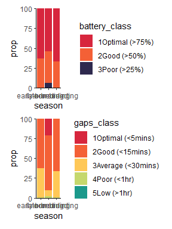
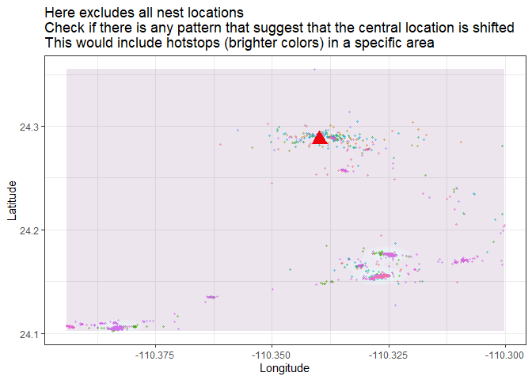
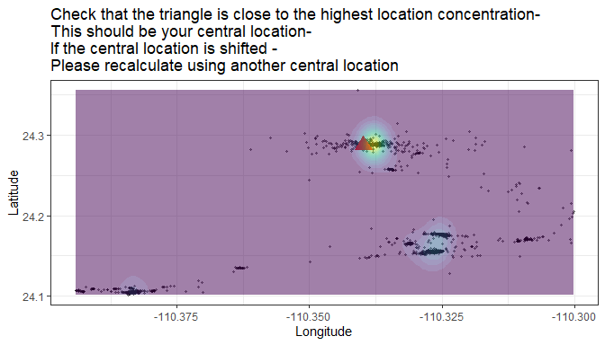
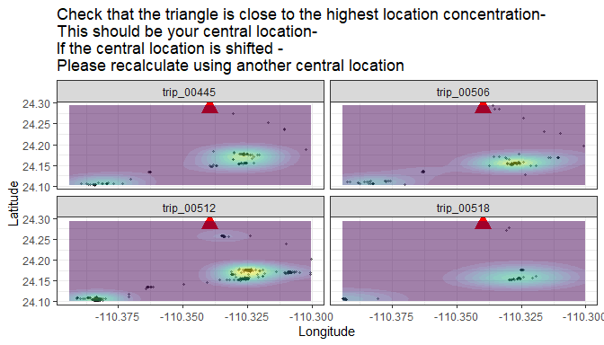
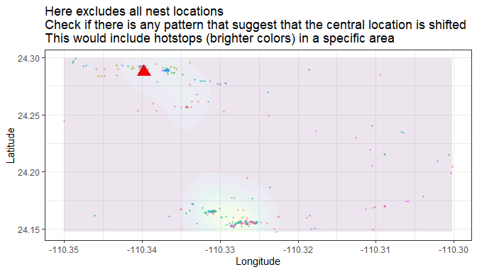

<!-- README.md is generated from README.Rmd. Please edit that file -->

# larus

<!-- badges: start -->
<!-- badges: end -->

## Installation

You can install the development version of larus from
[GitHub](https://github.com/) with:

``` r
# install.packages("devtools")
devtools::install_github("MiriamLL/larus")
```

# Intro

There is three key issues in determining the foraging trips in GSMs
attached to gulls:

1.  Battery charge and gaps (intervals) in the data
2.  Identify foraging trips, classify is usable or not
3.  The gulls just do whatever they want.

# ——————–

# 1. The effect of the battery

``` r
library(larus)
```

``` r
head(GSM_battery)
#>       ID             daytime         season month battery_charge gaps_min
#> 1 LALI03 2023-04-18 07:28:35 early-breeding    04             53       NA
#> 2 LALI03 2023-04-18 07:48:30 early-breeding    04             56 19.91667
#> 3 LALI03 2023-04-18 08:07:35 early-breeding    04             56 19.08333
#> 4 LALI03 2023-04-18 08:27:06 early-breeding    04             56 19.51667
#> 5 LALI03 2023-04-18 08:47:06 early-breeding    04             57 20.00000
#> 6 LALI03 2023-04-18 09:07:35 early-breeding    04             59 20.48333
```

``` r
library(scales)
library(ggplot2)
```

``` r
ggplot(GSM_battery, aes(x=daytime, y=battery_charge)) +
  geom_line() +
  scale_x_datetime(labels = date_format("%b"),date_breaks = "1 month")
```

## Battery levels classification

Considerations: Optimal battery was considered \> 75% battery Good \<
75% battery Poor \< 50% battery Low \< 25% battery

``` r
library(tidyverse)
```

``` r
GSM_battery <- GSM_battery%>%
  mutate(battery_class = 
         case_when(is.na(battery_charge) ~ 'U',
                   battery_charge >= 75 ~ '1Optimal (>75%)',
                   battery_charge <= 75 & battery_charge > 50 ~ '2Good (>50%)',
                   battery_charge <= 50 & battery_charge > 25 ~ '3Poor (>25%)',
                   battery_charge <= 25 ~ '4Low (<25%)',
                   TRUE ~ 'Check'))
```

``` r
Battery_classes <-GSM_battery %>%
  group_by(battery_class)%>%
  tally()%>%
  mutate(total=sum(n))%>%
  mutate(prop=n*100/total)
Battery_classes
#> # A tibble: 3 × 4
#>   battery_class       n total  prop
#>   <chr>           <int> <int> <dbl>
#> 1 1Optimal (>75%) 16861 28209 59.8 
#> 2 2Good (>50%)    10515 28209 37.3 
#> 3 3Poor (>25%)      833 28209  2.95
```

## Gaps and battery relations

When studying tracking locations from GSM data, especially in the case
of birds like gulls, it’s common to encounter gaps in the data due to
factors such as loss of signal, battery limitations, or movement through
areas with poor GSM coverage.

Considerations: Optimal gaps \< 5 minutes Good \< 15 minutes Average \<
30 minutes Poor \< 2 hours (120 minutes) Low \> 24 hours (1400 minutes)

``` r
Battery_gaps <- GSM_battery %>%
  mutate(gaps_class = 
           case_when(is.na(gaps_min) ~ '8U',
                     gaps_min <= 5 ~ '1Optimal (<5mins)',
                     gaps_min >= 5 & gaps_min < 15 ~ '2Good (<15mins)',
                     gaps_min >= 15 & gaps_min < 30 ~ '3Average (<30mins)',
                     gaps_min >= 30 & gaps_min < 60 ~ '4Poor (<1hr)',
                     gaps_min >= 60 & gaps_min < 1400 ~ '5Low (>1hr)',
                     gaps_min >= 1400 ~ '6Low (onceAday)',
                     TRUE ~ '7Check'))
```

``` r
Battery_gaps %>%
  group_by(gaps_class)%>%
  tally()
#> # A tibble: 6 × 2
#>   gaps_class             n
#>   <chr>              <int>
#> 1 1Optimal (<5mins)   2958
#> 2 2Good (<15mins)    18986
#> 3 3Average (<30mins)  5919
#> 4 4Poor (<1hr)         343
#> 5 5Low (>1hr)            2
#> 6 8U                     1
```

## Compare

``` r
library(patchwork)
```

### Battery and gaps per season

``` r
Battery_gaps%>%
  group_by(season,battery_class)%>%
  tally()%>%
  mutate(total=sum(n))%>%
  mutate(prop=n*100/total) %>%
  
ggplot(aes(fill=battery_class, y=prop, x=season)) + 
  geom_bar(stat="identity")+
  scale_fill_manual(values=c('#d7263d','#f46036','#2e294e'))+
  theme_classic()+
  scale_y_continuous(expand = c(0,0)) +
  
Battery_gaps %>%
  group_by(season,gaps_class)%>%
  tally()%>%
  mutate(total=sum(n))%>%
  mutate(prop=n*100/total)%>%
  filter(gaps_class!='8U') %>% #expect first position to be empty
  
ggplot(aes(fill=gaps_class, y=prop, x=season)) +
  geom_bar(stat="identity") +
  scale_fill_manual(values=c('#d7263d','#f46036','#ffc857','#c5d86d','#1b998b','#2e294e'))+
  theme_classic()+
  scale_y_continuous(expand = c(0,0)) +
  
plot_layout(ncol = 1)
```



### Battery and gaps per month

``` r
Battery_gaps%>%
  group_by(month,battery_class)%>%
  tally()%>%
  mutate(total=sum(n))%>%
  mutate(prop=n*100/total) %>%
  
ggplot(aes(fill=battery_class, y=prop, x=month)) + 
  geom_bar(stat="identity")+
  scale_fill_manual(values=c('#d7263d','#f46036','#2e294e'))+
  theme_classic()+
  scale_y_continuous(expand = c(0,0)) +
  
Battery_gaps %>%
  group_by(month,gaps_class)%>%
  tally()%>%
  mutate(total=sum(n))%>%
  mutate(prop=n*100/total)%>%
  filter(gaps_class!='8U') %>% #expect first position to be empty
  
ggplot(aes(fill=gaps_class, y=prop, x=month)) +
  geom_bar(stat="identity") +
  scale_fill_manual(values=c('#d7263d','#f46036','#ffc857','#c5d86d','#1b998b','#2e294e'))+
  theme_classic()+
  scale_y_continuous(expand = c(0,0)) +
  
plot_layout(ncol = 1)
```


# ——————–

## 2. Identify trips

### Step 1: subset month

``` r
head(GSM_locs)
#> # A tibble: 6 × 11
#>   num_seq ID     daytime             season      month Longitude Latitude inside
#>   <chr>   <chr>  <dttm>              <chr>       <chr>     <dbl>    <dbl> <chr> 
#> 1 1       LALI03 2023-04-18 07:28:35 early-bree… 04        -110.     24.3 insid…
#> 2 2       LALI03 2023-04-18 07:48:30 early-bree… 04        -110.     24.3 insid…
#> 3 3       LALI03 2023-04-18 08:07:35 early-bree… 04        -110.     24.3 insid…
#> 4 4       LALI03 2023-04-18 08:27:06 early-bree… 04        -110.     24.3 insid…
#> 5 5       LALI03 2023-04-18 08:47:06 early-bree… 04        -110.     24.3 insid…
#> 6 6       LALI03 2023-04-18 09:07:35 early-bree… 04        -110.     24.3 insid…
#> # ℹ 3 more variables: central_base <chr>, battery_charge <dbl>, gaps_min <dbl>
```

``` r
library(tidyverse)
```

``` r
This_month<-'08'
This_month_text<-'Ago'
```

``` r
Trips_01locs<-GSM_locs %>%
  dplyr::filter(month==This_month)
```

### Step 2: plot_check

``` r
my_central_location<-data.frame(Longitude=-110.33979846296234,Latitude=24.28728834326802)
```

``` r
plot_check<-function(my_locs=my_locs,my_central_location=my_central_location){
  ggplot2::ggplot()+
  ggplot2::geom_point(data = my_locs, ggplot2::aes(x=Longitude, y = Latitude),
             color='black',size = 0.8,alpha=0.4)+
  ggplot2::geom_point(data=my_central_location, ggplot2::aes(x=Longitude, y=Latitude),color='red',shape=17, size=5)+
  ggplot2::geom_density_2d_filled(data = my_locs, ggplot2::aes(x = Longitude, y = Latitude),alpha = 0.5)+
  ggplot2::theme_bw()+
  ggplot2::theme(legend.position = 'none')+
  ggplot2::ggtitle('Check that the triangle is close to the highest location concentration- \nThis should be your central location-  \nIf the central location is shifted -  \nPlease recalculate using another central location')}
```

``` r
plot_check(my_locs=Trips_01locs,my_central_location = my_central_location)
```


### Step 3: remove central locations

``` r
Trips_02outside<-Trips_01locs %>%
  filter(inside=='outside_central')
```

### Step 4: trip_number_sequence

``` r
Previous_params<-data.frame(trip_id=c("trip_00405"))
```

``` r
trip_number_sequence<-continue_trip_sequence(my_previous=Previous_params$trip_id)
#> [1] "trip_00405"
#> [1] 405
```

``` r
Trips_03trips<-Trips_02outside %>%
  mutate(num_seq=as.numeric(num_seq))%>%
  mutate(trip_number = (cumsum(c(1L, diff(num_seq)) !=   1L)))%>%
  mutate(trip_number = trip_number +1 + trip_number_sequence)%>%
  mutate(trip_number = stringr::str_pad(trip_number,  5, pad = "0"))%>%
  mutate(trip_number = paste0("trip_", trip_number))
```

### Step 5: plot_trips

function: plot_trips

``` r
plot_trips<-function(my_locs=my_locs,my_central_location=my_central_location){
  ggplot()+
  geom_point(data = my_locs, aes(x=Longitude, y = Latitude,color=trip_number),
            size = 0.8,alpha=0.4)+
  geom_point(data=my_central_location, aes(x=Longitude, y=Latitude),color='red',shape=17, size=5)+
  geom_density_2d_filled(data = my_locs, aes(x = Longitude, y = Latitude),alpha = 0.1)+
  theme_bw()+
  theme(legend.position = 'none')+
  ggtitle('Here excludes all nest locations \nCheck if there is any pattern that suggest that the central location is shifted \nThis would include hotstops (brighter colors) in a specific area')}
```

``` r
plot_trips(my_locs=Trips_03trips,my_central_location=my_central_location)
```



### Step 6: calculate_params

``` r
Trips_03trips<-GSM_trips
Trips_04params<-calculate_params(my_locs=Trips_03trips,
                                 my_daytime='daytime',
                                 my_format=  "%Y-%m-%d %H:%M:%S",
                                 my_units="hours",
                                 my_separator="trip_number")
head(Trips_04params)
#> # A tibble: 6 × 6
#>   trip_id    trip_start          trip_end            duration min_gap max_gap
#>   <chr>      <dttm>              <dttm>                 <dbl>   <dbl>   <dbl>
#> 1 trip_00406 2023-07-31 22:08:50 2023-08-01 17:19:13   19.2      8.75   11.2 
#> 2 trip_00407 2023-08-01 18:08:56 2023-08-01 18:18:51    0.165    9.75    9.92
#> 3 trip_00408 2023-08-01 20:58:55 2023-08-01 20:58:55    0        9.8     9.8 
#> 4 trip_00409 2023-08-01 21:19:04 2023-08-01 21:19:04    0        8.83    8.83
#> 5 trip_00410 2023-08-01 21:58:52 2023-08-01 21:58:52    0        9.67    9.67
#> 6 trip_00411 2023-08-01 22:18:52 2023-08-01 22:38:55    0.334    9.47   10.1
```

Define trip_month_id in case there are outliers and the locations need
to be subset

``` r
Trips_05params<-Trips_04params %>%
  mutate(trip_month_id=paste0(This_month_text,"_a_",trip_id))%>%
  mutate(central_loc='colony')
```

# Short: straight forward using functions

``` r
This_month<-'08'
This_month_text<-'Ago'
```

``` r
Trips_01locs<-GSM_locs %>%
  filter(month==This_month)
```

``` r
plot_check(my_locs=Trips_01locs,my_central_location=my_central_location)
```



``` r
Trips_02outside<-Trips_01locs %>%
  filter(inside=='outside_central')
```

``` r
Previous_params<-data.frame(trip_id=c("trip_00405"))
```

``` r
trip_number_sequence<-continue_trip_sequence(my_previous=Previous_params$trip_id)
#> [1] "trip_00405"
#> [1] 405
```

``` r
Trips_03trips<-Trips_02outside %>%
  mutate(num_seq=as.numeric(num_seq))%>%
  mutate(trip_number = (cumsum(c(1L, diff(num_seq)) !=   1L)))%>%
  mutate(trip_number = trip_number +1 + trip_number_sequence)%>%
  mutate(trip_number = stringr::str_pad(trip_number,  5, pad = "0"))%>%
  mutate(trip_number = paste0("trip_", trip_number))
```

``` r
plot_trips(my_locs=Trips_03trips,my_central_location=my_central_location)
```


``` r
Trips_04params<-calculate_params(my_locs=Trips_03trips,
                                 my_daytime='daytime',
                                 my_format=  "%Y-%m-%d %H:%M:%S",
                                 my_units="hours",
                                 my_separator="trip_number")
```

``` r
range(Trips_04params$duration)
#> [1]   0.0000 168.7497
```

``` r
hist(Trips_04params$duration)
```


``` r
Trips_05params<-Trips_04params %>%
  mutate(trip_month_id=paste0(This_month_text,"_a_",trip_id))%>%
  mutate(central_loc='colony')
```

``` r
length(unique(Trips_05params$trip_id))
#> [1] 133
length(unique(Trips_03trips$trip_number))
#> [1] 133
```

# ——————–

# 3. Gulls just do whatever they want

## Step 1: classify_params

``` r
Params_00criteria<-classify_params(my_params=GSM_params)
```

## Step 2: check_trip_criteria

Foraging trips were only considered when the animal was more than 1 km
away from the colony and lasting longer than 30 min (Shaffer et
al. 2017, Guerra et al. 2022).

If trips had a gap of \> 1hr and/or included overnight locations without
a clear central location, they were excluded from the interpolation.

``` r
check_trip_criteria(my_params=Params_00criteria)
#> [1] "From 133 trips: 20.3 were trip_longer_than_30mins and 79.7 were trip_shorter_than_30mins. Trips shorter than 30 minutes are not considered real trips. Remove these trips from analyses. "
```

``` r
Params_01criteria<-Params_00criteria %>%
  dplyr::filter(trip_size == 'trip_longer_than_30mins')
```

## Step 3: check_resolution_criteria

``` r
check_resolution_criteria(my_params=Params_resolution)
#> [1] "From 27 trips: 3.7 (n = 1) were low_resolution_gaps_more_60_mins and 96.3 (n = 26) were ok_resolution_gaps_less_60_mins. Evaluate if trips with low resolution are to be kept"
```

## Step 4: check_lenght_criteria

``` r
Params_02criteria<-Params_01criteria %>%
  dplyr::filter(resolution == 'ok_resolution_gaps_less_60_mins')
```

``` r
check_length_criteria(my_params=Params_resolution)
#> [1] "From 27 trips: 14.81 (n = 4) were longer_than_24h_reevaluate_centralloc and 85.19 (n = 23) were shorter_than_24h_keep_centralloc. Evaluate if trips longer than 24 hrs is because of a change in central location"
```

# ——————–

# 4. Reevaluate trips

## Step 1: check outliers

Check big outliers

``` r
head(Params_resolution)
#> # A tibble: 6 × 12
#>   trip_id    trip_month_id   central_loc trip_start          trip_end           
#>   <chr>      <chr>           <chr>       <dttm>              <dttm>             
#> 1 trip_00406 Ago_a_trip_004… colony      2023-07-31 22:08:50 2023-08-01 17:19:13
#> 2 trip_00416 Ago_a_trip_004… colony      2023-08-02 02:58:49 2023-08-02 03:29:04
#> 3 trip_00424 Ago_a_trip_004… colony      2023-08-02 10:58:47 2023-08-02 11:38:49
#> 4 trip_00436 Ago_a_trip_004… colony      2023-08-03 00:08:49 2023-08-03 00:38:52
#> 5 trip_00442 Ago_a_trip_004… colony      2023-08-03 05:08:50 2023-08-03 05:38:51
#> 6 trip_00443 Ago_a_trip_004… colony      2023-08-03 06:48:50 2023-08-03 07:28:56
#> # ℹ 7 more variables: min_gap <dbl>, max_gap <dbl>, duration <dbl>,
#> #   trip_size <chr>, resolution <chr>, params_analyses <chr>,
#> #   interpolation <chr>
```

``` r
Reevaluate<-Params_resolution %>%
  dplyr::filter(params_analyses!='shorter_than_24h_keep_centralloc')
Reevaluate
#> # A tibble: 4 × 12
#>   trip_id    trip_month_id   central_loc trip_start          trip_end           
#>   <chr>      <chr>           <chr>       <dttm>              <dttm>             
#> 1 trip_00445 Ago_a_trip_004… colony      2023-08-03 10:58:50 2023-08-04 16:58:55
#> 2 trip_00506 Ago_a_trip_005… colony      2023-08-10 03:28:53 2023-08-11 13:29:55
#> 3 trip_00512 Ago_a_trip_005… colony      2023-08-12 03:28:53 2023-08-19 04:13:52
#> 4 trip_00518 Ago_a_trip_005… colony      2023-08-22 04:28:59 2023-08-23 16:59:35
#> # ℹ 7 more variables: min_gap <dbl>, max_gap <dbl>, duration <dbl>,
#> #   trip_size <chr>, resolution <chr>, params_analyses <chr>,
#> #   interpolation <chr>
```

Are this outliers due to gaps of the intervals? Large intervals might
cause that the bird entering back to the colony is missed.

``` r
print(paste0("Max gaps was: ",
             round(Reevaluate$max_gap,2),
             ' mins. If the interval is more than 60 minutes in duration that could be a plausible explaination and then it should be eliminated. If the interval is less than 60 minutes in duration consider it can be a change in central location of the bird.'))
#> [1] "Max gaps was: 20.78 mins. If the interval is more than 60 minutes in duration that could be a plausible explaination and then it should be eliminated. If the interval is less than 60 minutes in duration consider it can be a change in central location of the bird."
#> [2] "Max gaps was: 30.5 mins. If the interval is more than 60 minutes in duration that could be a plausible explaination and then it should be eliminated. If the interval is less than 60 minutes in duration consider it can be a change in central location of the bird." 
#> [3] "Max gaps was: 20.23 mins. If the interval is more than 60 minutes in duration that could be a plausible explaination and then it should be eliminated. If the interval is less than 60 minutes in duration consider it can be a change in central location of the bird."
#> [4] "Max gaps was: 31.4 mins. If the interval is more than 60 minutes in duration that could be a plausible explaination and then it should be eliminated. If the interval is less than 60 minutes in duration consider it can be a change in central location of the bird."
```

## Step 2: extract locs

Identify ids

``` r
Reevaluate_tripid<-unique(Reevaluate$trip_id)
Reevaluate_tripid
#> [1] "trip_00445" "trip_00506" "trip_00512" "trip_00518"
```

## Step 3: subset locations

``` r
Reevaluate_01locs<-GSM_trips %>%
  dplyr::filter(trip_number %in% Reevaluate_tripid)%>%
  dplyr::relocate(ID,trip_number,daytime,gaps_min)
head(Reevaluate_01locs)
#> # A tibble: 6 × 12
#>   ID     trip_number daytime             gaps_min num_seq season month Longitude
#>   <chr>  <chr>       <dttm>                 <dbl>   <dbl> <chr>  <chr>     <dbl>
#> 1 LALI03 trip_00445  2023-08-03 10:58:50    10      16016 late-… 08        -110.
#> 2 LALI03 trip_00445  2023-08-03 11:08:54    10.1    16017 late-… 08        -110.
#> 3 LALI03 trip_00445  2023-08-03 11:18:50     9.93   16018 late-… 08        -110.
#> 4 LALI03 trip_00445  2023-08-03 11:29:28    10.6    16019 late-… 08        -110.
#> 5 LALI03 trip_00445  2023-08-03 11:38:50     9.37   16020 late-… 08        -110.
#> 6 LALI03 trip_00445  2023-08-03 11:48:50    10      16021 late-… 08        -110.
#> # ℹ 4 more variables: Latitude <dbl>, inside <chr>, central_base <chr>,
#> #   battery_charge <dbl>
```

## Step 4: identify new central location

``` r
my_central_location<-data.frame(Longitude=-110.33979846296234,Latitude=24.28728834326802)
```

``` r
plot_check<-function(my_locs=my_locs,my_central_location=my_central_location){
  ggplot2::ggplot()+
  ggplot2::geom_point(data = my_locs, ggplot2::aes(x=Longitude, y = Latitude),
             color='black',size = 0.8,alpha=0.4)+
  ggplot2::geom_point(data=my_central_location, ggplot2::aes(x=Longitude, y=Latitude),color='red',shape=17, size=5)+
  ggplot2::geom_density_2d_filled(data = my_locs, ggplot2::aes(x = Longitude, y = Latitude),alpha = 0.5)+
  ggplot2::theme_bw()+
  ggplot2::theme(legend.position = 'none')+
  ggplot2::ggtitle('Check that the triangle is close to the highest location concentration- \nThis should be your central location-  \nIf the central location is shifted -  \nPlease recalculate using another central location')}
```

``` r
plot_check(my_locs=Reevaluate_01locs,my_central_location = my_central_location)+
  ggplot2::facet_wrap(~trip_number)
```



``` r
new_central_location<-data.frame(Longitude=-110.325,Latitude=24.17)
```

``` r
plot_check(my_locs=Reevaluate_01locs,my_central_location = my_central_location)+
  ggplot2::geom_point(data=new_central_location, ggplot2::aes(x=Longitude, y=Latitude),color='blue',shape=17, size=5)
```


## Step 5: create_buffer

``` r
new_central_buffer<-create_buffer(central_point=new_central_location,buffer_km=0.3)
#> Warning in CPL_crs_from_input(x): GDAL Message 1: +init=epsg:XXXX syntax is
#> deprecated. It might return a CRS with a non-EPSG compliant axis order.
```

## Step 6: from_df_to_sf

``` r
Reevaluate_tripid<-'trip_00512'
```

``` r
Reevaluate_01locs<-GSM_trips %>%
  dplyr::filter(trip_number %in% Reevaluate_tripid)%>%
  dplyr::relocate(ID,trip_number,daytime,gaps_min)
```

``` r
Reevaluate_02sf<-from_df_to_st(Reevaluate_locs)
```

## Step 7: over

``` r
new_central_location<-data.frame(Longitude=-110.325,Latitude=24.17)
```

``` r
new_central_buffer<-create_buffer(central_point=new_central_location,buffer_km=0.3)
```

Check nrows should correspond.

``` r
Reevaluate_locs<-Reevaluate_locs
Reevaluate_sf<-Reevaluate_sf
Reevaluate_polygon<-Reevaluate_polygon
```

``` r
Reevaluate_locs$central_location<- over(my_locations=Reevaluate_sf,my_polygon=Reevaluate_polygon)
```

## Step 8: add_trip_number

``` r
Reevaluate_trips<-Reevaluate_trips
```

``` r
Previous_params<-data.frame(trip_id=c("trip_00405"))
```

``` r
new_trip_number_sequence<-continue_trip_sequence(my_previous=data.frame(trip_id=c("trip_00405")))
#>      trip_id
#> 1 trip_00405
#> [1] 405
```

``` r
Reevaluate_04trips<-add_trip_number(my_df=Reevaluate_trips,
                                    my_trip_number_sequence=new_trip_number_sequence)
```

``` r
plot_trips<-function(my_locs=my_locs,my_central_location=my_central_location){
  ggplot2::ggplot()+
  ggplot2::geom_point(data = my_locs, ggplot2::aes(x=Longitude, y = Latitude,color=trip_number),
            size = 0.8,alpha=0.4)+
  ggplot2::geom_point(data=my_central_location, ggplot2::aes(x=Longitude, y=Latitude),color='red',shape=17, size=5)+
  ggplot2::geom_density_2d_filled(data = my_locs, ggplot2::aes(x = Longitude, y = Latitude),alpha = 0.1)+
  ggplot2::theme_bw()+
  ggplot2::theme(legend.position = 'none')+
  ggplot2::ggtitle('Here excludes all nest locations \nCheck if there is any pattern that suggest that the central location is shifted \nThis would include hotstops (brighter colors) in a specific area')}
```

``` r
new_central_location<-data.frame(Longitude=-110.325,Latitude=24.17)
```

``` r
plot_trips(my_locs=Reevaluate_04trips,my_central_location=new_central_location)
```


## Step 9: calculate params

``` r
Reevaluate_05params<-calculate_params(my_locs=Reevaluate_04trips,
                                 my_daytime='daytime',
                                 my_format=  "%Y-%m-%d %H:%M:%S",
                                 my_units="hours",
                                 my_separator="trip_number")
head(Reevaluate_05params)
#> # A tibble: 4 × 6
#>   trip_id    trip_start          trip_end            duration min_gap max_gap
#>   <chr>      <dttm>              <dttm>                 <dbl>   <dbl>   <dbl>
#> 1 trip_00406 2023-08-12 03:28:53 2023-08-13 07:09:00    27.7     9.37    19.9
#> 2 trip_00407 2023-08-13 07:29:00 2023-08-13 11:09:15     3.67    9.52    10.4
#> 3 trip_00408 2023-08-13 11:49:17 2023-08-17 06:13:53    90.4     9.28    20.2
#> 4 trip_00409 2023-08-17 06:43:51 2023-08-19 04:13:52    45.5    13.7     16.0
```

``` r
This_month<-'08'
This_month_text<-'Ago'
```

``` r
Reevaluate_05params<-Reevaluate_05params %>%
  dplyr::mutate(trip_month_id=paste0(This_month_text,"_b_",trip_id))%>%
  dplyr::mutate(central_loc='south_of_colony')
```

``` r
hist(Reevaluate_05params$duration)
```


## Step 10: plot_trips

``` r
plot_trips(my_locs=Reevaluate_04trips,my_central_location = new_central_location)+
  ggplot2::geom_point(data=new_central_location, ggplot2::aes(x=Longitude, y=Latitude),color='blue',shape=17, size=5)
```


## Step 11: classify params

``` r
Params_03reevaluate<-classify_params(my_params=Reevaluate_05params)
```

# ——————–

# 5. Merge

## Step 1: Merge params

Add criteria classifications

``` r
Params_02criteria
#> # A tibble: 26 × 12
#>    trip_id    trip_month_id  central_loc trip_start          trip_end           
#>    <chr>      <chr>          <chr>       <dttm>              <dttm>             
#>  1 trip_00406 Ago_a_trip_00… colony      2023-07-31 22:08:50 2023-08-01 17:19:13
#>  2 trip_00416 Ago_a_trip_00… colony      2023-08-02 02:58:49 2023-08-02 03:29:04
#>  3 trip_00424 Ago_a_trip_00… colony      2023-08-02 10:58:47 2023-08-02 11:38:49
#>  4 trip_00436 Ago_a_trip_00… colony      2023-08-03 00:08:49 2023-08-03 00:38:52
#>  5 trip_00442 Ago_a_trip_00… colony      2023-08-03 05:08:50 2023-08-03 05:38:51
#>  6 trip_00443 Ago_a_trip_00… colony      2023-08-03 06:48:50 2023-08-03 07:28:56
#>  7 trip_00445 Ago_a_trip_00… colony      2023-08-03 10:58:50 2023-08-04 16:58:55
#>  8 trip_00451 Ago_a_trip_00… colony      2023-08-04 23:58:49 2023-08-05 00:38:53
#>  9 trip_00453 Ago_a_trip_00… colony      2023-08-05 01:38:53 2023-08-05 02:09:07
#> 10 trip_00455 Ago_a_trip_00… colony      2023-08-05 08:48:50 2023-08-05 15:59:04
#> # ℹ 16 more rows
#> # ℹ 7 more variables: min_gap <dbl>, max_gap <dbl>, duration <dbl>,
#> #   trip_size <chr>, resolution <chr>, params_analyses <chr>,
#> #   interpolation <chr>
Params_03reevaluate
#> # A tibble: 4 × 12
#>   trip_id    trip_start          trip_end            duration min_gap max_gap
#>   <chr>      <dttm>              <dttm>                 <dbl>   <dbl>   <dbl>
#> 1 trip_00406 2023-08-12 03:28:53 2023-08-13 07:09:00    27.7     9.37    19.9
#> 2 trip_00407 2023-08-13 07:29:00 2023-08-13 11:09:15     3.67    9.52    10.4
#> 3 trip_00408 2023-08-13 11:49:17 2023-08-17 06:13:53    90.4     9.28    20.2
#> 4 trip_00409 2023-08-17 06:43:51 2023-08-19 04:13:52    45.5    13.7     16.0
#> # ℹ 6 more variables: trip_month_id <chr>, central_loc <chr>, trip_size <chr>,
#> #   resolution <chr>, params_analyses <chr>, interpolation <chr>
```

``` r
Params_merged<-rbind(Params_02criteria %>% dplyr::filter(!trip_id %in% Reevaluate_tripid),
                     Params_03reevaluate)
```

## Step 2: Locs merged

``` r
GSM_trips
#> # A tibble: 1,704 × 12
#>    ID    trip_number num_seq daytime             season month Longitude Latitude
#>    <chr> <chr>         <dbl> <dttm>              <chr>  <chr>     <dbl>    <dbl>
#>  1 LALI… trip_00406    15654 2023-07-31 22:08:50 late-… 08        -110.     24.3
#>  2 LALI… trip_00406    15655 2023-07-31 22:18:54 late-… 08        -110.     24.3
#>  3 LALI… trip_00406    15656 2023-07-31 22:28:51 late-… 08        -110.     24.3
#>  4 LALI… trip_00406    15657 2023-07-31 22:38:59 late-… 08        -110.     24.3
#>  5 LALI… trip_00406    15658 2023-07-31 22:48:51 late-… 08        -110.     24.3
#>  6 LALI… trip_00406    15659 2023-07-31 22:58:52 late-… 08        -110.     24.3
#>  7 LALI… trip_00406    15660 2023-07-31 23:08:51 late-… 08        -110.     24.3
#>  8 LALI… trip_00406    15661 2023-07-31 23:18:51 late-… 08        -110.     24.3
#>  9 LALI… trip_00406    15662 2023-07-31 23:28:52 late-… 08        -110.     24.3
#> 10 LALI… trip_00406    15663 2023-07-31 23:38:51 late-… 08        -110.     24.3
#> # ℹ 1,694 more rows
#> # ℹ 4 more variables: inside <chr>, central_base <chr>, battery_charge <dbl>,
#> #   gaps_min <dbl>
Reevaluate_04trips
#> # A tibble: 734 × 13
#>    ID    trip_number daytime             gaps_min num_seq season month Longitude
#>    <chr> <chr>       <dttm>                 <dbl>   <dbl> <chr>  <chr>     <dbl>
#>  1 LALI… trip_00406  2023-08-12 03:28:53     15     17141 late-… 08        -110.
#>  2 LALI… trip_00406  2023-08-12 03:43:52     15.0   17142 late-… 08        -110.
#>  3 LALI… trip_00406  2023-08-12 03:58:51     15.0   17143 late-… 08        -110.
#>  4 LALI… trip_00406  2023-08-12 04:13:56     15.1   17144 late-… 08        -110.
#>  5 LALI… trip_00406  2023-08-12 04:28:52     14.9   17145 late-… 08        -110.
#>  6 LALI… trip_00406  2023-08-12 04:43:53     15.0   17146 late-… 08        -110.
#>  7 LALI… trip_00406  2023-08-12 04:58:53     15     17147 late-… 08        -110.
#>  8 LALI… trip_00406  2023-08-12 05:13:53     15     17148 late-… 08        -110.
#>  9 LALI… trip_00406  2023-08-12 05:28:52     15.0   17149 late-… 08        -110.
#> 10 LALI… trip_00406  2023-08-12 05:43:51     15.0   17150 late-… 08        -110.
#> # ℹ 724 more rows
#> # ℹ 5 more variables: Latitude <dbl>, inside <chr>, central_base <chr>,
#> #   battery_charge <dbl>, central_location <int>
```

``` r
Locs_merged <-rbind(GSM_trips %>% 
                      dplyr::filter(!trip_number %in% Reevaluate_tripid)%>%
                      dplyr::select(ID,daytime,season,month,
                             Longitude,Latitude,
                             central_base,inside,num_seq,
                             gaps_min,battery_charge,
                             trip_number),
                    
                    Reevaluate_04trips %>%
                      dplyr::select(ID,daytime,season,month,
                             Longitude,Latitude,
                             central_base,inside,num_seq,
                             gaps_min,battery_charge,
                             trip_number))
```

# ——————–

# 6. Candidates for interpolation

Whether to interpolate the data depends on your research goals and the
nature of the gaps.

Here’s a breakdown of considerations to help you decide:

- Short Gaps: If the gaps are short (e.g., a few minutes to an hour),
  interpolation might be justifiable, especially if you assume that the
  bird’s movement is relatively constant during the gap. For example,
  linear interpolation can estimate a reasonable position based on
  previous and subsequent data points.
- Long Gaps: If the gaps are long (e.g., several hours or days),
  interpolation might introduce unrealistic results, especially if the
  bird’s movement during that time period was unknown. Interpolating
  long gaps could lead to misleading conclusions about the bird’s actual
  path or behavior. If your study’s analysis can handle missing data or
  gaps (e.g., for high-level migration patterns), you might consider
  leaving the gaps unfilled. This avoids the risk of introducing
  erroneous data but may reduce the overall precision. If your analysis
  is based on trajectory or movement behavior, you could use gap-filling
  approaches like predicting the bird’s behavior based on its last known
  location and surrounding environmental context (such as weather, time
  of day, etc.).

``` r
Inter_params<-Params_resolution
Inter_locs<-GSM_trips
```

## Step 1: exclude trips longer than 24 hrs with gaps larger than 60 minutes

``` r
Inter_params %>%
  dplyr::group_by(interpolation)%>%
  dplyr::tally()
#> # A tibble: 3 × 2
#>   interpolation                                        n
#>   <chr>                                            <int>
#> 1 gapsless60mins_shorter24hr_canditate_interpolate    22
#> 2 gapsmore60mins_dont_interpolate                      1
#> 3 longer24hr_reevaluate_centralloc                     4
```

``` r
Inter_01params<-Inter_params %>%
  dplyr::filter(interpolation=='gapsless60mins_shorter24hr_canditate_interpolate')
```

## Step 2: classify_locs

``` r
Inter_02locs<-classify_locs(Inter_params=Interpolation_params,
                            Inter_locs=GSM_trips)
```

``` r
Inter_02locs %>%
  dplyr::group_by(trip_size)%>%
  dplyr::tally()
#> # A tibble: 2 × 2
#>   trip_size                    n
#>   <chr>                    <int>
#> 1 trip_longer_than_30mins    376
#> 2 trip_shorter_than_30mins  1328
```

## Step 3: check locations

The part of dont interpolate would be large because it includes resting
and overnight locations

``` r
Inter_02locs %>%
  dplyr::group_by(interpolation)%>%
  dplyr::tally()
#> # A tibble: 2 × 2
#>   interpolation                                        n
#>   <chr>                                            <int>
#> 1 dont_interpolate_longer24hr                       1328
#> 2 gapsless60mins_shorter24hr_canditate_interpolate   376
```

``` r
plot_trips<-function(my_locs=my_locs,my_central_location=my_central_location){
  ggplot2::ggplot()+
  ggplot2::geom_point(data = my_locs, ggplot2::aes(x=Longitude, y = Latitude,color=trip_number),
            size = 0.8,alpha=0.4)+
  ggplot2::geom_point(data=my_central_location, ggplot2::aes(x=Longitude, y=Latitude),color='red',shape=17, size=5)+
  ggplot2::geom_density_2d_filled(data = my_locs, ggplot2::aes(x = Longitude, y = Latitude),alpha = 0.1)+
  ggplot2::theme_bw()+
  ggplot2::theme(legend.position = 'none')+
  ggplot2::ggtitle('Here excludes all nest locations \nCheck if there is any pattern that suggest that the central location is shifted \nThis would include hotstops (brighter colors) in a specific area')}
```

``` r
my_central_location<-data.frame(Longitude=-110.33979846296234,Latitude=24.28728834326802)
```

``` r
plot_trips(my_locs=Inter_02locs,my_central_location = my_central_location)
```


## Step 4: check included

``` r
Inter_03included <- Inter_02locs %>%
  dplyr::filter(interpolation == 'gapsless60mins_shorter24hr_canditate_interpolate')
```

``` r
plot_trips(my_locs=Inter_03included,my_central_location = my_central_location)
```



## Step 5: check excluded

``` r
Inter_04excluded <- Inter_02locs %>%
  #dplyr::filter(trip_size == 'trip_longer_than_30mins')%>%
  dplyr::filter(interpolation != 'gapsless60mins_shorter24hr_canditate_interpolate')
```

``` r
plot_trips(my_locs=Inter_04excluded,my_central_location = my_central_location)+
  ggplot2::facet_wrap(~trip_number)
```

Trip 445 Trip 508 Trip 512 Trip 518 Trip 528 Seem legit, and maybe
should be reconsidered if central location is identified. Look genuinely
that the bird change location.

``` r
this_trip<-'trip_00512'
```

``` r
Inter_params %>%
  dplyr::filter(trip_id==this_trip)
#> # A tibble: 1 × 12
#>   trip_id    trip_month_id   central_loc trip_start          trip_end           
#>   <chr>      <chr>           <chr>       <dttm>              <dttm>             
#> 1 trip_00512 Ago_a_trip_005… colony      2023-08-12 03:28:53 2023-08-19 04:13:52
#> # ℹ 7 more variables: min_gap <dbl>, max_gap <dbl>, duration <dbl>,
#> #   trip_size <chr>, resolution <chr>, params_analyses <chr>,
#> #   interpolation <chr>
```

``` r
Inter_05reevaluate<-Inter_04excluded %>%
  dplyr::filter(trip_number==this_trip)
```

``` r
dplyr::first(Inter_05reevaluate$daytime)
#> [1] "2023-08-12 03:28:53 UTC"
dplyr::last(Inter_05reevaluate$daytime)
#> [1] "2023-08-19 04:13:52 UTC"
```

## Step 6: new central location

``` r
plot_check<-function(my_locs=my_locs,my_central_location=my_central_location){
  ggplot2::ggplot()+
  ggplot2::geom_point(data = my_locs, ggplot2::aes(x=Longitude, y = Latitude),
             color='black',size = 0.8,alpha=0.4)+
  ggplot2::geom_point(data=my_central_location, ggplot2::aes(x=Longitude, y=Latitude),color='red',shape=17, size=5)+
  ggplot2::geom_density_2d_filled(data = my_locs, ggplot2::aes(x = Longitude, y = Latitude),alpha = 0.5)+
  ggplot2::theme_bw()+
  ggplot2::theme(legend.position = 'none')+
  ggplot2::ggtitle('Check that the triangle is close to the highest location concentration- \nThis should be your central location-  \nIf the central location is shifted -  \nPlease recalculate using another central location')}
```

``` r
new_central_location<-data.frame(Longitude=-110.325,Latitude=24.17)
plot_check(my_locs=Inter_05reevaluate,my_central_location = new_central_location)+
  ggplot2::geom_point(data=new_central_location, ggplot2::aes(x=Longitude, y=Latitude),color='red',shape=17, size=5)
```


## Step 7: reevaluate_params

``` r
Inter_05reevaluate
#> # A tibble: 738 × 16
#>    ID    trip_number num_seq daytime             season month Longitude Latitude
#>    <chr> <chr>         <dbl> <dttm>              <chr>  <chr>     <dbl>    <dbl>
#>  1 LALI… trip_00512    17141 2023-08-12 03:28:53 late-… 08        -110.     24.3
#>  2 LALI… trip_00512    17142 2023-08-12 03:43:52 late-… 08        -110.     24.2
#>  3 LALI… trip_00512    17143 2023-08-12 03:58:51 late-… 08        -110.     24.2
#>  4 LALI… trip_00512    17144 2023-08-12 04:13:56 late-… 08        -110.     24.2
#>  5 LALI… trip_00512    17145 2023-08-12 04:28:52 late-… 08        -110.     24.2
#>  6 LALI… trip_00512    17146 2023-08-12 04:43:53 late-… 08        -110.     24.2
#>  7 LALI… trip_00512    17147 2023-08-12 04:58:53 late-… 08        -110.     24.2
#>  8 LALI… trip_00512    17148 2023-08-12 05:13:53 late-… 08        -110.     24.2
#>  9 LALI… trip_00512    17149 2023-08-12 05:28:52 late-… 08        -110.     24.2
#> 10 LALI… trip_00512    17150 2023-08-12 05:43:51 late-… 08        -110.     24.2
#> # ℹ 728 more rows
#> # ℹ 8 more variables: inside <chr>, central_base <chr>, battery_charge <dbl>,
#> #   gaps_min <dbl>, trip_size <chr>, params_analyses <chr>, resolution <chr>,
#> #   interpolation <chr>
```

``` r
this_locs=Inter_05reevaluate
this_central_location=new_central_location
this_previous=Inter_params
```

``` r
recalculate_params<-function(this_locs,
                            this_central_location,
                            this_previous){
  
## create_buffer
my_central_buffer<-create_buffer(central_point=this_central_location,buffer_km=0.3)

## from_df_to_sf
my_sf<-from_df_to_st(this_locs)

## over
my_over<- over(my_locations=my_sf,my_polygon=my_central_buffer)
this_locs$central_location<-my_over

## continue_trip_sequence
my_trip_number_sequence<-continue_trip_sequence(my_previous=this_previous$trip_id)

## add_trip_number
my_trips<-add_trip_number(my_df=this_locs,
                          my_trip_number_sequence=my_trip_number_sequence)

## calculate_params
my_params<-calculate_params(my_locs=my_trips,
                                 my_daytime='daytime',
                                 my_format=  "%Y-%m-%d %H:%M:%S",
                                 my_units="hours",
                                 my_separator="trip_number")

return(my_params)}
```

``` r
Inter_06params<-recalculate_params(this_locs=Inter_05reevaluate,
                                   this_central_location=new_central_location,
                                   this_previous=Inter_params)
#> [1] "trip_00530"
#> [1] 530
Inter_06params
#> # A tibble: 4 × 6
#>   trip_id    trip_start          trip_end            duration min_gap max_gap
#>   <chr>      <dttm>              <dttm>                 <dbl>   <dbl>   <dbl>
#> 1 trip_00531 2023-08-12 03:28:53 2023-08-13 07:09:00    27.7     9.37    19.9
#> 2 trip_00532 2023-08-13 07:29:00 2023-08-13 11:09:15     3.67    9.52    10.4
#> 3 trip_00533 2023-08-13 11:49:17 2023-08-17 06:13:53    90.4     9.28    20.2
#> 4 trip_00534 2023-08-17 06:43:51 2023-08-19 04:13:52    45.5    13.7     16.0
```

``` r
This_month_text<-"Ago"
```

``` r
Inter_06params<-Inter_06params%>%
  dplyr::mutate(trip_month_id=paste0(This_month_text,"_c_",trip_id))%>%
  dplyr::mutate(central_loc='south_of_colony')
Inter_06params
#> # A tibble: 4 × 8
#>   trip_id    trip_start          trip_end            duration min_gap max_gap
#>   <chr>      <dttm>              <dttm>                 <dbl>   <dbl>   <dbl>
#> 1 trip_00531 2023-08-12 03:28:53 2023-08-13 07:09:00    27.7     9.37    19.9
#> 2 trip_00532 2023-08-13 07:29:00 2023-08-13 11:09:15     3.67    9.52    10.4
#> 3 trip_00533 2023-08-13 11:49:17 2023-08-17 06:13:53    90.4     9.28    20.2
#> 4 trip_00534 2023-08-17 06:43:51 2023-08-19 04:13:52    45.5    13.7     16.0
#> # ℹ 2 more variables: trip_month_id <chr>, central_loc <chr>
```

# ——————–

# 7. Interpolation

## Step 1: interpolate

``` r
Interpolated_locs<-interpolate_trips(my_df=Interpolation_trips,
                                    interval='900 sec',
                                    column_datetime='daytime',
                                    column_trip='trip_number',
                                    column_lat='Latitude',
                                    column_lon='Longitude',
                                    datetime_format="%Y-%m-%d %H:%M:%S")
```

# end of document
