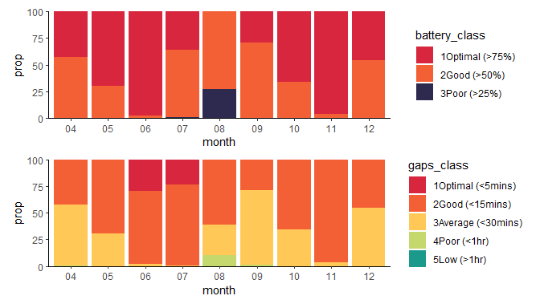
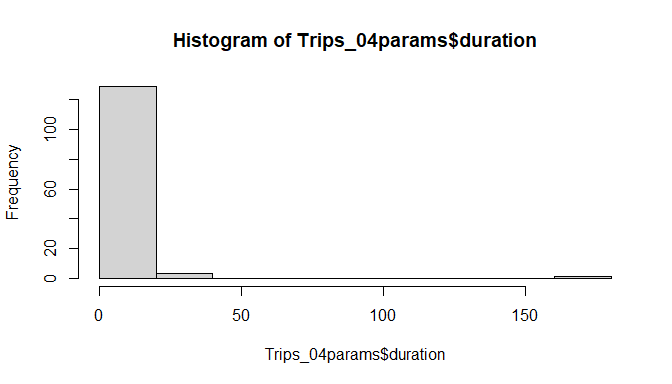

<!-- README.md is generated from README.Rmd. Please edit that file -->

# larus

<!-- badges: start -->
<!-- badges: end -->

## Installation

You can install the development version of larus from
[GitHub](https://github.com/) with:

``` r
# install.packages("devtools")
devtools::install_github("MiriamLL/larus")
```

# Intro

There is three key issues in determining the foraging trips in GSMs
attached to gulls:

1.  Battery charge and gaps (intervals) in the data
2.  Identify foraging trips, classify is usable or not
3.  The gulls just do whatever they want.

# ——————–

# 1. The effect of the battery

``` r
library(larus)
```

``` r
GSM_battery
#>           ID             daytime         season month battery_charge  gaps_min
#> 1     LALI03 2023-04-18 07:28:35 early-breeding    04             53        NA
#> 2     LALI03 2023-04-18 07:48:30 early-breeding    04             56 19.916667
#> 3     LALI03 2023-04-18 08:07:35 early-breeding    04             56 19.083333
#> 4     LALI03 2023-04-18 08:27:06 early-breeding    04             56 19.516667
#> 5     LALI03 2023-04-18 08:47:06 early-breeding    04             57 20.000000
#> 6     LALI03 2023-04-18 09:07:35 early-breeding    04             59 20.483333
#> 7     LALI03 2023-04-18 09:27:13 early-breeding    04             58 19.633333
#> 8     LALI03 2023-04-18 09:47:13 early-breeding    04             59 20.000000
#> 9     LALI03 2023-04-18 10:07:19 early-breeding    04             60 20.100000
#> 10    LALI03 2023-04-18 10:27:33 early-breeding    04             61 20.233333
#> 11    LALI03 2023-04-18 10:47:45 early-breeding    04             61 20.200000
#> 12    LALI03 2023-04-18 11:07:07 early-breeding    04             61 19.366667
#> 13    LALI03 2023-04-18 11:27:08 early-breeding    04             62 20.016667
#> 14    LALI03 2023-04-18 11:47:35 early-breeding    04             61 20.450000
#> 15    LALI03 2023-04-18 12:07:07 early-breeding    04             62 19.533333
#> 16    LALI03 2023-04-18 12:27:07 early-breeding    04             63 20.000000
#> 17    LALI03 2023-04-18 12:47:06 early-breeding    04             63 19.983333
#> 18    LALI03 2023-04-18 13:07:06 early-breeding    04             63 20.000000
#> 19    LALI03 2023-04-18 13:27:06 early-breeding    04             64 20.000000
#> 20    LALI03 2023-04-18 13:47:44 early-breeding    04             65 20.633333
#> 21    LALI03 2023-04-18 14:07:08 early-breeding    04             65 19.400000
#> 22    LALI03 2023-04-18 14:27:07 early-breeding    04             66 19.983333
#> 23    LALI03 2023-04-18 14:47:09 early-breeding    04             66 20.033333
#> 24    LALI03 2023-04-18 15:07:35 early-breeding    04             66 20.433333
#> 25    LALI03 2023-04-18 15:27:07 early-breeding    04             65 19.533333
#> 26    LALI03 2023-04-18 15:47:07 early-breeding    04             65 20.000000
#> 27    LALI03 2023-04-18 16:07:07 early-breeding    04             65 20.000000
#> 28    LALI03 2023-04-18 16:27:07 early-breeding    04             65 20.000000
#> 29    LALI03 2023-04-18 16:47:19 early-breeding    04             65 20.200000
#> 30    LALI03 2023-04-18 17:07:35 early-breeding    04             64 20.266667
#> 31    LALI03 2023-04-18 17:27:16 early-breeding    04             64 19.683333
#> 32    LALI03 2023-04-18 17:47:13 early-breeding    04             63 19.950000
#> 33    LALI03 2023-04-18 18:07:14 early-breeding    04             63 20.016667
#> 34    LALI03 2023-04-18 18:27:29 early-breeding    04             63 20.250000
#> 35    LALI03 2023-04-18 18:47:33 early-breeding    04             63 20.066667
#> 36    LALI03 2023-04-18 19:07:07 early-breeding    04             62 19.566667
#> 37    LALI03 2023-04-18 19:27:54 early-breeding    04             62 20.783333
#> 38    LALI03 2023-04-18 19:47:55 early-breeding    04             61 20.016667
#> 39    LALI03 2023-04-18 20:08:01 early-breeding    04             61 20.100000
#> 40    LALI03 2023-04-18 20:27:48 early-breeding    04             61 19.783333
#> 41    LALI03 2023-04-18 20:47:43 early-breeding    04             60 19.916667
#> 42    LALI03 2023-04-18 21:08:02 early-breeding    04             60 20.316667
#> 43    LALI03 2023-04-18 21:28:14 early-breeding    04             60 20.200000
#> 44    LALI03 2023-04-18 21:48:14 early-breeding    04             60 20.000000
#> 45    LALI03 2023-04-18 22:07:52 early-breeding    04             60 19.633333
#> 46    LALI03 2023-04-18 22:28:05 early-breeding    04             60 20.216667
#> 47    LALI03 2023-04-18 22:47:44 early-breeding    04             60 19.650000
#> 48    LALI03 2023-04-18 23:08:05 early-breeding    04             60 20.350000
#> 49    LALI03 2023-04-18 23:27:41 early-breeding    04             59 19.600000
#> 50    LALI03 2023-04-18 23:47:43 early-breeding    04             59 20.033333
#> 51    LALI03 2023-04-19 00:07:46 early-breeding    04             59 20.050000
#> 52    LALI03 2023-04-19 00:27:48 early-breeding    04             59 20.033333
#> 53    LALI03 2023-04-19 00:49:06 early-breeding    04             59 21.300000
#> 54    LALI03 2023-04-19 01:08:23 early-breeding    04             59 19.283333
#> 55    LALI03 2023-04-19 01:28:29 early-breeding    04             58 20.100000
#> 56    LALI03 2023-04-19 01:47:46 early-breeding    04             58 19.283333
#> 57    LALI03 2023-04-19 02:07:55 early-breeding    04             58 20.150000
#> 58    LALI03 2023-04-19 02:27:48 early-breeding    04             58 19.883333
#> 59    LALI03 2023-04-19 02:47:54 early-breeding    04             58 20.100000
#> 60    LALI03 2023-04-19 03:07:54 early-breeding    04             58 20.000000
#> 61    LALI03 2023-04-19 03:27:58 early-breeding    04             57 20.066667
#> 62    LALI03 2023-04-19 03:47:49 early-breeding    04             57 19.850000
#> 63    LALI03 2023-04-19 04:07:43 early-breeding    04             57 19.900000
#> 64    LALI03 2023-04-19 04:27:43 early-breeding    04             57 20.000000
#> 65    LALI03 2023-04-19 04:47:44 early-breeding    04             57 20.016667
#> 66    LALI03 2023-04-19 05:07:54 early-breeding    04             57 20.166667
#> 67    LALI03 2023-04-19 05:27:47 early-breeding    04             57 19.883333
#> 68    LALI03 2023-04-19 05:47:46 early-breeding    04             57 19.983333
#> 69    LALI03 2023-04-19 06:07:43 early-breeding    04             58 19.950000
#> 70    LALI03 2023-04-19 06:27:42 early-breeding    04             58 19.983333
#> 71    LALI03 2023-04-19 06:47:43 early-breeding    04             59 20.016667
#> 72    LALI03 2023-04-19 07:07:42 early-breeding    04             60 19.983333
#> 73    LALI03 2023-04-19 07:27:48 early-breeding    04             62 20.100000
#> 74    LALI03 2023-04-19 07:47:49 early-breeding    04             62 20.016667
#> 75    LALI03 2023-04-19 08:07:48 early-breeding    04             63 19.983333
#> 76    LALI03 2023-04-19 08:27:50 early-breeding    04             64 20.033333
#> 77    LALI03 2023-04-19 08:47:49 early-breeding    04             64 19.983333
#> 78    LALI03 2023-04-19 09:07:48 early-breeding    04             65 19.983333
#> 79    LALI03 2023-04-19 09:27:51 early-breeding    04             66 20.050000
#> 80    LALI03 2023-04-19 09:47:48 early-breeding    04             68 19.950000
#> 81    LALI03 2023-04-19 10:07:49 early-breeding    04             70 20.016667
#> 82    LALI03 2023-04-19 10:27:52 early-breeding    04             70 20.050000
#> 83    LALI03 2023-04-19 10:47:53 early-breeding    04             70 20.016667
#> 84    LALI03 2023-04-19 11:07:48 early-breeding    04             71 19.916667
#> 85    LALI03 2023-04-19 11:27:47 early-breeding    04             71 19.983333
#> 86    LALI03 2023-04-19 11:47:47 early-breeding    04             72 20.000000
#> 87    LALI03 2023-04-19 12:07:48 early-breeding    04             72 20.016667
#> 88    LALI03 2023-04-19 12:27:47 early-breeding    04             72 19.983333
#> 89    LALI03 2023-04-19 12:47:47 early-breeding    04             73 20.000000
#> 90    LALI03 2023-04-19 13:07:47 early-breeding    04             74 20.000000
#> 91    LALI03 2023-04-19 13:27:47 early-breeding    04             74 20.000000
#> 92    LALI03 2023-04-19 13:47:47 early-breeding    04             74 20.000000
#> 93    LALI03 2023-04-19 14:07:47 early-breeding    04             74 20.000000
#> 94    LALI03 2023-04-19 14:27:47 early-breeding    04             74 20.000000
#> 95    LALI03 2023-04-19 14:47:47 early-breeding    04             74 20.000000
#> 96    LALI03 2023-04-19 15:07:47 early-breeding    04             73 20.000000
#> 97    LALI03 2023-04-19 15:27:47 early-breeding    04             72 20.000000
#> 98    LALI03 2023-04-19 15:47:51 early-breeding    04             73 20.066667
#> 99    LALI03 2023-04-19 16:07:47 early-breeding    04             73 19.933333
#> 100   LALI03 2023-04-19 16:27:47 early-breeding    04             72 20.000000
#> 101   LALI03 2023-04-19 16:47:48 early-breeding    04             72 20.016667
#> 102   LALI03 2023-04-19 17:07:47 early-breeding    04             72 19.983333
#> 103   LALI03 2023-04-19 17:27:51 early-breeding    04             71 20.066667
#> 104   LALI03 2023-04-19 17:47:50 early-breeding    04             71 19.983333
#> 105   LALI03 2023-04-19 18:07:54 early-breeding    04             71 20.066667
#> 106   LALI03 2023-04-19 18:27:53 early-breeding    04             71 19.983333
#> 107   LALI03 2023-04-19 18:47:49 early-breeding    04             72 19.933333
#> 108   LALI03 2023-04-19 19:07:49 early-breeding    04             73 20.000000
#> 109   LALI03 2023-04-19 19:27:48 early-breeding    04             73 19.983333
#> 110   LALI03 2023-04-19 19:47:49 early-breeding    04             71 20.016667
#> 111   LALI03 2023-04-19 20:07:51 early-breeding    04             71 20.033333
#> 112   LALI03 2023-04-19 20:27:53 early-breeding    04             71 20.033333
#> 113   LALI03 2023-04-19 20:47:54 early-breeding    04             70 20.016667
#> 114   LALI03 2023-04-19 21:07:49 early-breeding    04             70 19.916667
#> 115   LALI03 2023-04-19 21:27:51 early-breeding    04             70 20.033333
#> 116   LALI03 2023-04-19 21:47:48 early-breeding    04             70 19.950000
#> 117   LALI03 2023-04-19 22:07:51 early-breeding    04             70 20.050000
#> 118   LALI03 2023-04-19 22:28:14 early-breeding    04             70 20.383333
#> 119   LALI03 2023-04-19 22:47:56 early-breeding    04             70 19.700000
#> 120   LALI03 2023-04-19 23:07:48 early-breeding    04             70 19.866667
#> 121   LALI03 2023-04-19 23:27:49 early-breeding    04             70 20.016667
#> 122   LALI03 2023-04-19 23:47:49 early-breeding    04             70 20.000000
#> 123   LALI03 2023-04-20 00:07:54 early-breeding    04             70 20.083333
#> 124   LALI03 2023-04-20 00:28:00 early-breeding    04             70 20.100000
#> 125   LALI03 2023-04-20 00:48:18 early-breeding    04             70 20.300000
#> 126   LALI03 2023-04-20 01:08:00 early-breeding    04             70 19.700000
#> 127   LALI03 2023-04-20 01:28:04 early-breeding    04             70 20.066667
#> 128   LALI03 2023-04-20 01:48:14 early-breeding    04             70 20.166667
#> 129   LALI03 2023-04-20 02:08:05 early-breeding    04             70 19.850000
#> 130   LALI03 2023-04-20 02:27:52 early-breeding    04             70 19.783333
#> 131   LALI03 2023-04-20 02:47:53 early-breeding    04             70 20.016667
#> 132   LALI03 2023-04-20 03:07:52 early-breeding    04             70 19.983333
#> 133   LALI03 2023-04-20 03:27:48 early-breeding    04             70 19.933333
#> 134   LALI03 2023-04-20 03:47:51 early-breeding    04             69 20.050000
#> 135   LALI03 2023-04-20 04:07:48 early-breeding    04             69 19.950000
#> 136   LALI03 2023-04-20 04:27:55 early-breeding    04             69 20.116667
#> 137   LALI03 2023-04-20 04:48:01 early-breeding    04             70 20.100000
#> 138   LALI03 2023-04-20 05:08:10 early-breeding    04             70 20.150000
#> 139   LALI03 2023-04-20 05:27:47 early-breeding    04             70 19.616667
#> 140   LALI03 2023-04-20 05:47:48 early-breeding    04             70 20.016667
#> 141   LALI03 2023-04-20 06:07:48 early-breeding    04             71 20.000000
#> 142   LALI03 2023-04-20 06:28:14 early-breeding    04             72 20.433333
#> 143   LALI03 2023-04-20 06:48:05 early-breeding    04             72 19.850000
#> 144   LALI03 2023-04-20 07:07:47 early-breeding    04             72 19.700000
#> 145   LALI03 2023-04-20 07:27:56 early-breeding    04             73 20.150000
#> 146   LALI03 2023-04-20 07:47:47 early-breeding    04             74 19.850000
#> 147   LALI03 2023-04-20 08:07:48 early-breeding    04             75 20.016667
#> 148   LALI03 2023-04-20 08:18:23 early-breeding    04             76 10.583333
#> 149   LALI03 2023-04-20 08:27:46 early-breeding    04             75  9.383333
#> 150   LALI03 2023-04-20 08:37:51 early-breeding    04             75 10.083333
#> 151   LALI03 2023-04-20 08:47:52 early-breeding    04             74 10.016667
#> 152   LALI03 2023-04-20 09:07:49 early-breeding    04             75 19.950000
#> 153   LALI03 2023-04-20 09:17:58 early-breeding    04             76 10.150000
#> 154   LALI03 2023-04-20 09:28:05 early-breeding    04             76 10.116667
#> 155   LALI03 2023-04-20 09:37:55 early-breeding    04             76  9.833333
#> 156   LALI03 2023-04-20 09:47:57 early-breeding    04             75 10.033333
#> 157   LALI03 2023-04-20 09:57:47 early-breeding    04             76  9.833333
#> 158   LALI03 2023-04-20 10:08:04 early-breeding    04             76 10.283333
#> 159   LALI03 2023-04-20 10:18:04 early-breeding    04             77 10.000000
#> 160   LALI03 2023-04-20 10:27:52 early-breeding    04             77  9.800000
#> 161   LALI03 2023-04-20 10:37:55 early-breeding    04             78 10.050000
#> 162   LALI03 2023-04-20 10:47:53 early-breeding    04             78  9.966667
#> 163   LALI03 2023-04-20 10:57:55 early-breeding    04             78 10.033333
#> 164   LALI03 2023-04-20 11:07:55 early-breeding    04             78 10.000000
#> 165   LALI03 2023-04-20 11:18:05 early-breeding    04             78 10.166667
#> 166   LALI03 2023-04-20 11:27:57 early-breeding    04             79  9.866667
#> 167   LALI03 2023-04-20 11:37:53 early-breeding    04             78  9.933333
#> 168   LALI03 2023-04-20 11:47:55 early-breeding    04             78 10.033333
#> 169   LALI03 2023-04-20 11:57:48 early-breeding    04             79  9.883333
#> 170   LALI03 2023-04-20 12:07:52 early-breeding    04             79 10.066667
#> 171   LALI03 2023-04-20 12:17:53 early-breeding    04             80 10.016667
#> 172   LALI03 2023-04-20 12:27:55 early-breeding    04             80 10.033333
#> 173   LALI03 2023-04-20 12:37:52 early-breeding    04             80  9.950000
#> 174   LALI03 2023-04-20 12:47:48 early-breeding    04             82  9.933333
#> 175   LALI03 2023-04-20 12:57:59 early-breeding    04             83 10.183333
#> 176   LALI03 2023-04-20 13:07:47 early-breeding    04             83  9.800000
#> 177   LALI03 2023-04-20 13:17:48 early-breeding    04             83 10.016667
#> 178   LALI03 2023-04-20 13:28:05 early-breeding    04             83 10.283333
#> 179   LALI03 2023-04-20 13:37:52 early-breeding    04             83  9.783333
#> 180   LALI03 2023-04-20 13:47:47 early-breeding    04             84  9.916667
#> 181   LALI03 2023-04-20 13:57:47 early-breeding    04             84 10.000000
#> 182   LALI03 2023-04-20 14:07:47 early-breeding    04             85 10.000000
#> 183   LALI03 2023-04-20 14:17:49 early-breeding    04             85 10.033333
#> 184   LALI03 2023-04-20 14:27:55 early-breeding    04             85 10.100000
#> 185   LALI03 2023-04-20 14:37:56 early-breeding    04             86 10.016667
#> 186   LALI03 2023-04-20 14:47:55 early-breeding    04             85  9.983333
#> 187   LALI03 2023-04-20 14:57:53 early-breeding    04             85  9.966667
#> 188   LALI03 2023-04-20 15:07:57 early-breeding    04             85 10.066667
#> 189   LALI03 2023-04-20 15:17:55 early-breeding    04             85  9.966667
#> 190   LALI03 2023-04-20 15:27:56 early-breeding    04             85 10.016667
#> 191   LALI03 2023-04-20 15:37:47 early-breeding    04             85  9.850000
#> 192   LALI03 2023-04-20 15:47:50 early-breeding    04             85 10.050000
#> 193   LALI03 2023-04-20 15:57:54 early-breeding    04             85 10.066667
#> 194   LALI03 2023-04-20 16:07:58 early-breeding    04             85 10.066667
#> 195   LALI03 2023-04-20 16:17:53 early-breeding    04             85  9.916667
#> 196   LALI03 2023-04-20 16:27:50 early-breeding    04             84  9.950000
#> 197   LALI03 2023-04-20 16:38:21 early-breeding    04             84 10.516667
#> 198   LALI03 2023-04-20 16:47:58 early-breeding    04             84  9.616667
#> 199   LALI03 2023-04-20 16:58:02 early-breeding    04             84 10.066667
#> 200   LALI03 2023-04-20 17:07:52 early-breeding    04             83  9.833333
#> 201   LALI03 2023-04-20 17:17:55 early-breeding    04             84 10.050000
#> 202   LALI03 2023-04-20 17:28:05 early-breeding    04             83 10.166667
#> 203   LALI03 2023-04-20 17:37:49 early-breeding    04             83  9.733333
#> 204   LALI03 2023-04-20 17:47:48 early-breeding    04             83  9.983333
#> 205   LALI03 2023-04-20 17:58:23 early-breeding    04             83 10.583333
#> 206   LALI03 2023-04-20 18:07:52 early-breeding    04             83  9.483333
#> 207   LALI03 2023-04-20 18:17:48 early-breeding    04             83  9.933333
#> 208   LALI03 2023-04-20 18:27:50 early-breeding    04             82 10.033333
#> 209   LALI03 2023-04-20 18:37:52 early-breeding    04             82 10.033333
#> 210   LALI03 2023-04-20 18:47:55 early-breeding    04             82 10.050000
#> 211   LALI03 2023-04-20 18:57:56 early-breeding    04             82 10.016667
#> 212   LALI03 2023-04-20 19:08:01 early-breeding    04             82 10.083333
#> 213   LALI03 2023-04-20 19:17:47 early-breeding    04             82  9.766667
#> 214   LALI03 2023-04-20 19:27:47 early-breeding    04             81 10.000000
#> 215   LALI03 2023-04-20 19:37:50 early-breeding    04             80 10.050000
#> 216   LALI03 2023-04-20 19:47:49 early-breeding    04             80  9.983333
#> 217   LALI03 2023-04-20 19:57:52 early-breeding    04             80 10.050000
#> 218   LALI03 2023-04-20 20:07:52 early-breeding    04             80 10.000000
#> 219   LALI03 2023-04-20 20:17:52 early-breeding    04             80 10.000000
#> 220   LALI03 2023-04-20 20:27:50 early-breeding    04             80  9.966667
#> 221   LALI03 2023-04-20 20:37:49 early-breeding    04             80  9.983333
#> 222   LALI03 2023-04-20 20:48:09 early-breeding    04             80 10.333333
#> 223   LALI03 2023-04-20 20:57:53 early-breeding    04             79  9.733333
#> 224   LALI03 2023-04-20 21:07:47 early-breeding    04             79  9.900000
#> 225   LALI03 2023-04-20 21:17:48 early-breeding    04             79 10.016667
#> 226   LALI03 2023-04-20 21:27:59 early-breeding    04             79 10.183333
#> 227   LALI03 2023-04-20 21:37:47 early-breeding    04             78  9.800000
#> 228   LALI03 2023-04-20 21:47:48 early-breeding    04             78 10.016667
#> 229   LALI03 2023-04-20 21:57:52 early-breeding    04             78 10.066667
#> 230   LALI03 2023-04-20 22:07:48 early-breeding    04             78  9.933333
#> 231   LALI03 2023-04-20 22:17:48 early-breeding    04             78 10.000000
#> 232   LALI03 2023-04-20 22:28:08 early-breeding    04             78 10.333333
#> 233   LALI03 2023-04-20 22:37:55 early-breeding    04             78  9.783333
#> 234   LALI03 2023-04-20 22:47:55 early-breeding    04             78 10.000000
#> 235   LALI03 2023-04-20 22:57:55 early-breeding    04             78 10.000000
#> 236   LALI03 2023-04-20 23:08:12 early-breeding    04             78 10.283333
#> 237   LALI03 2023-04-20 23:18:02 early-breeding    04             78  9.833333
#> 238   LALI03 2023-04-20 23:27:47 early-breeding    04             78  9.750000
#> 239   LALI03 2023-04-20 23:37:49 early-breeding    04             78 10.033333
#> 240   LALI03 2023-04-20 23:47:57 early-breeding    04             78 10.133333
#> 241   LALI03 2023-04-20 23:58:14 early-breeding    04             77 10.283333
#> 242   LALI03 2023-04-21 00:07:49 early-breeding    04             77  9.583333
#> 243   LALI03 2023-04-21 00:17:46 early-breeding    04             77  9.950000
#> 244   LALI03 2023-04-21 00:28:18 early-breeding    04             77 10.533333
#> 245   LALI03 2023-04-21 00:37:58 early-breeding    04             77  9.666667
#> 246   LALI03 2023-04-21 00:48:14 early-breeding    04             77 10.266667
#> 247   LALI03 2023-04-21 00:58:23 early-breeding    04             76 10.150000
#> 248   LALI03 2023-04-21 01:07:57 early-breeding    04             76  9.566667
#> 249   LALI03 2023-04-21 01:17:55 early-breeding    04             76  9.966667
#> 250   LALI03 2023-04-21 01:27:51 early-breeding    04             76  9.933333
#> 251   LALI03 2023-04-21 01:37:54 early-breeding    04             76 10.050000
#> 252   LALI03 2023-04-21 01:48:23 early-breeding    04             76 10.483333
#> 253   LALI03 2023-04-21 01:57:54 early-breeding    04             76  9.516667
#> 254   LALI03 2023-04-21 02:07:48 early-breeding    04             76  9.900000
#> 255   LALI03 2023-04-21 02:17:49 early-breeding    04             76 10.016667
#> 256   LALI03 2023-04-21 02:27:48 early-breeding    04             76  9.983333
#> 257   LALI03 2023-04-21 02:37:47 early-breeding    04             76  9.983333
#> 258   LALI03 2023-04-21 02:47:48 early-breeding    04             76 10.016667
#> 259   LALI03 2023-04-21 02:57:52 early-breeding    04             76 10.066667
#> 260   LALI03 2023-04-21 03:07:52 early-breeding    04             76 10.000000
#> 261   LALI03 2023-04-21 03:18:14 early-breeding    04             76 10.366667
#> 262   LALI03 2023-04-21 03:27:46 early-breeding    04             75  9.533333
#> 263   LALI03 2023-04-21 03:47:46 early-breeding    04             75 20.000000
#> 264   LALI03 2023-04-21 03:57:46 early-breeding    04             75 10.000000
#> 265   LALI03 2023-04-21 04:07:47 early-breeding    04             75 10.016667
#> 266   LALI03 2023-04-21 04:17:48 early-breeding    04             75 10.016667
#> 267   LALI03 2023-04-21 04:27:49 early-breeding    04             75 10.016667
#> 268   LALI03 2023-04-21 04:37:52 early-breeding    04             75 10.050000
#> 269   LALI03 2023-04-21 04:47:58 early-breeding    04             75 10.100000
#> 270   LALI03 2023-04-21 04:57:53 early-breeding    04             75  9.916667
#> 271   LALI03 2023-04-21 05:08:00 early-breeding    04             75 10.116667
#> 272   LALI03 2023-04-21 05:17:54 early-breeding    04             75  9.900000
#> 273   LALI03 2023-04-21 05:37:47 early-breeding    04             75 19.883333
#> 274   LALI03 2023-04-21 05:47:48 early-breeding    04             75 10.016667
#> 275   LALI03 2023-04-21 06:07:49 early-breeding    04             75 20.016667
#> 276   LALI03 2023-04-21 06:17:48 early-breeding    04             75  9.983333
#> 277   LALI03 2023-04-21 06:27:48 early-breeding    04             76 10.000000
#> 278   LALI03 2023-04-21 06:37:48 early-breeding    04             76 10.000000
#> 279   LALI03 2023-04-21 06:47:47 early-breeding    04             76  9.983333
#> 280   LALI03 2023-04-21 06:57:46 early-breeding    04             76  9.983333
#> 281   LALI03 2023-04-21 07:07:48 early-breeding    04             77 10.033333
#> 282   LALI03 2023-04-21 07:17:47 early-breeding    04             78  9.983333
#> 283   LALI03 2023-04-21 07:27:51 early-breeding    04             78 10.066667
#> 284   LALI03 2023-04-21 07:47:54 early-breeding    04             76 20.050000
#> 285   LALI03 2023-04-21 07:58:44 early-breeding    04             76 10.833333
#> 286   LALI03 2023-04-21 08:07:49 early-breeding    04             76  9.083333
#> 287   LALI03 2023-04-21 08:17:46 early-breeding    04             76  9.950000
#> 288   LALI03 2023-04-21 08:27:46 early-breeding    04             78 10.000000
#> 289   LALI03 2023-04-21 08:37:46 early-breeding    04             78 10.000000
#> 290   LALI03 2023-04-21 08:47:47 early-breeding    04             78 10.016667
#> 291   LALI03 2023-04-21 08:57:46 early-breeding    04             78  9.983333
#> 292   LALI03 2023-04-21 09:07:46 early-breeding    04             78 10.000000
#> 293   LALI03 2023-04-21 09:17:46 early-breeding    04             79 10.000000
#> 294   LALI03 2023-04-21 09:28:05 early-breeding    04             80 10.316667
#> 295   LALI03 2023-04-21 09:37:46 early-breeding    04             80  9.683333
#> 296   LALI03 2023-04-21 09:47:51 early-breeding    04             82 10.083333
#> 297   LALI03 2023-04-21 09:57:52 early-breeding    04             83 10.016667
#> 298   LALI03 2023-04-21 10:07:46 early-breeding    04             83  9.900000
#> 299   LALI03 2023-04-21 10:17:46 early-breeding    04             84 10.000000
#> 300   LALI03 2023-04-21 10:27:46 early-breeding    04             85 10.000000
#> 301   LALI03 2023-04-21 10:37:46 early-breeding    04             85 10.000000
#> 302   LALI03 2023-04-21 10:47:46 early-breeding    04             86 10.000000
#> 303   LALI03 2023-04-21 10:57:46 early-breeding    04             87 10.000000
#> 304   LALI03 2023-04-21 11:07:46 early-breeding    04             88 10.000000
#> 305   LALI03 2023-04-21 11:18:05 early-breeding    04             88 10.316667
#> 306   LALI03 2023-04-21 11:27:46 early-breeding    04             88  9.683333
#> 307   LALI03 2023-04-21 11:37:46 early-breeding    04             88 10.000000
#> 308   LALI03 2023-04-21 11:47:46 early-breeding    04             89 10.000000
#> 309   LALI03 2023-04-21 11:57:46 early-breeding    04             90 10.000000
#> 310   LALI03 2023-04-21 12:07:57 early-breeding    04             89 10.183333
#> 311   LALI03 2023-04-21 12:17:46 early-breeding    04             89  9.816667
#> 312   LALI03 2023-04-21 12:27:46 early-breeding    04             89 10.000000
#> 313   LALI03 2023-04-21 12:37:46 early-breeding    04             89 10.000000
#> 314   LALI03 2023-04-21 12:48:05 early-breeding    04             89 10.316667
#> 315   LALI03 2023-04-21 12:57:45 early-breeding    04             89  9.666667
#> 316   LALI03 2023-04-21 13:07:46 early-breeding    04             89 10.016667
#> 317   LALI03 2023-04-21 13:17:46 early-breeding    04             90 10.000000
#> 318   LALI03 2023-04-21 13:27:45 early-breeding    04             90  9.983333
#> 319   LALI03 2023-04-21 13:37:45 early-breeding    04             90 10.000000
#> 320   LALI03 2023-04-21 13:47:45 early-breeding    04             90 10.000000
#> 321   LALI03 2023-04-21 13:57:46 early-breeding    04             90 10.016667
#> 322   LALI03 2023-04-21 14:07:48 early-breeding    04             90 10.033333
#> 323   LALI03 2023-04-21 14:17:46 early-breeding    04             90  9.966667
#> 324   LALI03 2023-04-21 14:27:46 early-breeding    04             90 10.000000
#> 325   LALI03 2023-04-21 14:37:46 early-breeding    04             90 10.000000
#> 326   LALI03 2023-04-21 14:47:46 early-breeding    04             90 10.000000
#> 327   LALI03 2023-04-21 14:57:46 early-breeding    04             90 10.000000
#> 328   LALI03 2023-04-21 15:07:46 early-breeding    04             90 10.000000
#> 329   LALI03 2023-04-21 15:17:46 early-breeding    04             90 10.000000
#> 330   LALI03 2023-04-21 15:27:46 early-breeding    04             90 10.000000
#> 331   LALI03 2023-04-21 15:37:46 early-breeding    04             90 10.000000
#> 332   LALI03 2023-04-21 15:47:46 early-breeding    04             90 10.000000
#> 333   LALI03 2023-04-21 15:57:46 early-breeding    04             90 10.000000
#> 334   LALI03 2023-04-21 16:07:46 early-breeding    04             90 10.000000
#> 335   LALI03 2023-04-21 16:17:47 early-breeding    04             90 10.016667
#> 336   LALI03 2023-04-21 16:27:46 early-breeding    04             90  9.983333
#> 337   LALI03 2023-04-21 16:37:47 early-breeding    04             90 10.016667
#> 338   LALI03 2023-04-21 16:47:47 early-breeding    04             90 10.000000
#> 339   LALI03 2023-04-21 16:57:48 early-breeding    04             89 10.016667
#> 340   LALI03 2023-04-21 17:07:47 early-breeding    04             89  9.983333
#> 341   LALI03 2023-04-21 17:17:46 early-breeding    04             89  9.983333
#> 342   LALI03 2023-04-21 17:27:46 early-breeding    04             89 10.000000
#> 343   LALI03 2023-04-21 17:37:49 early-breeding    04             89 10.050000
#> 344   LALI03 2023-04-21 17:47:47 early-breeding    04             89  9.966667
#> 345   LALI03 2023-04-21 17:57:47 early-breeding    04             89 10.000000
#> 346   LALI03 2023-04-21 18:07:47 early-breeding    04             89 10.000000
#> 347   LALI03 2023-04-21 18:17:47 early-breeding    04             89 10.000000
#> 348   LALI03 2023-04-21 18:27:48 early-breeding    04             89 10.016667
#> 349   LALI03 2023-04-21 18:37:47 early-breeding    04             89  9.983333
#> 350   LALI03 2023-04-21 18:47:47 early-breeding    04             89 10.000000
#> 351   LALI03 2023-04-21 18:57:46 early-breeding    04             89  9.983333
#> 352   LALI03 2023-04-21 19:07:48 early-breeding    04             89 10.033333
#> 353   LALI03 2023-04-21 19:17:47 early-breeding    04             89  9.983333
#> 354   LALI03 2023-04-21 19:27:47 early-breeding    04             88 10.000000
#> 355   LALI03 2023-04-21 19:37:48 early-breeding    04             87 10.016667
#> 356   LALI03 2023-04-21 19:47:51 early-breeding    04             87 10.050000
#> 357   LALI03 2023-04-21 19:58:23 early-breeding    04             87 10.533333
#> 358   LALI03 2023-04-21 20:07:46 early-breeding    04             87  9.383333
#> 359   LALI03 2023-04-21 20:17:46 early-breeding    04             87 10.000000
#> 360   LALI03 2023-04-21 20:27:46 early-breeding    04             87 10.000000
#> 361   LALI03 2023-04-21 20:37:48 early-breeding    04             87 10.033333
#> 362   LALI03 2023-04-21 20:47:47 early-breeding    04             87  9.983333
#> 363   LALI03 2023-04-21 20:57:47 early-breeding    04             87 10.000000
#> 364   LALI03 2023-04-21 21:07:47 early-breeding    04             87 10.000000
#> 365   LALI03 2023-04-21 21:17:46 early-breeding    04             87  9.983333
#> 366   LALI03 2023-04-21 21:27:49 early-breeding    04             87 10.050000
#> 367   LALI03 2023-04-21 21:37:48 early-breeding    04             87  9.983333
#> 368   LALI03 2023-04-21 21:47:47 early-breeding    04             87  9.983333
#> 369   LALI03 2023-04-21 21:57:46 early-breeding    04             87  9.983333
#> 370   LALI03 2023-04-21 22:07:47 early-breeding    04             87 10.016667
#> 371   LALI03 2023-04-21 22:17:47 early-breeding    04             87 10.000000
#> 372   LALI03 2023-04-21 22:27:51 early-breeding    04             86 10.066667
#> 373   LALI03 2023-04-21 22:37:46 early-breeding    04             86  9.916667
#> 374   LALI03 2023-04-21 22:47:46 early-breeding    04             86 10.000000
#> 375   LALI03 2023-04-21 22:57:47 early-breeding    04             86 10.016667
#> 376   LALI03 2023-04-21 23:07:47 early-breeding    04             86 10.000000
#> 377   LALI03 2023-04-21 23:17:47 early-breeding    04             86 10.000000
#> 378   LALI03 2023-04-21 23:27:51 early-breeding    04             86 10.066667
#> 379   LALI03 2023-04-21 23:37:52 early-breeding    04             86 10.016667
#> 380   LALI03 2023-04-21 23:47:57 early-breeding    04             86 10.083333
#> 381   LALI03 2023-04-21 23:58:07 early-breeding    04             86 10.166667
#> 382   LALI03 2023-04-22 00:08:09 early-breeding    04             86 10.033333
#> 383   LALI03 2023-04-22 00:18:15 early-breeding    04             86 10.100000
#> 384   LALI03 2023-04-22 00:27:51 early-breeding    04             86  9.600000
#> 385   LALI03 2023-04-22 00:37:52 early-breeding    04             85 10.016667
#> 386   LALI03 2023-04-22 00:47:52 early-breeding    04             85 10.000000
#> 387   LALI03 2023-04-22 00:57:54 early-breeding    04             85 10.033333
#> 388   LALI03 2023-04-22 01:07:54 early-breeding    04             85 10.000000
#> 389   LALI03 2023-04-22 01:17:55 early-breeding    04             85 10.016667
#> 390   LALI03 2023-04-22 01:28:23 early-breeding    04             85 10.466667
#> 391   LALI03 2023-04-22 01:37:52 early-breeding    04             85  9.483333
#> 392   LALI03 2023-04-22 01:47:53 early-breeding    04             85 10.016667
#> 393   LALI03 2023-04-22 01:57:53 early-breeding    04             85 10.000000
#> 394   LALI03 2023-04-22 02:07:49 early-breeding    04             85  9.933333
#> 395   LALI03 2023-04-22 02:17:48 early-breeding    04             85  9.983333
#> 396   LALI03 2023-04-22 02:27:49 early-breeding    04             85 10.016667
#> 397   LALI03 2023-04-22 02:37:48 early-breeding    04             85  9.983333
#> 398   LALI03 2023-04-22 02:47:47 early-breeding    04             85  9.983333
#> 399   LALI03 2023-04-22 02:57:57 early-breeding    04             85 10.166667
#> 400   LALI03 2023-04-22 03:08:18 early-breeding    04             85 10.350000
#> 401   LALI03 2023-04-22 03:17:46 early-breeding    04             85  9.466667
#> 402   LALI03 2023-04-22 03:27:45 early-breeding    04             85  9.983333
#> 403   LALI03 2023-04-22 03:37:47 early-breeding    04             85 10.033333
#> 404   LALI03 2023-04-22 03:47:46 early-breeding    04             85  9.983333
#> 405   LALI03 2023-04-22 03:57:53 early-breeding    04             85 10.116667
#> 406   LALI03 2023-04-22 04:07:46 early-breeding    04             85  9.883333
#> 407   LALI03 2023-04-22 04:17:49 early-breeding    04             84 10.050000
#> 408   LALI03 2023-04-22 04:27:47 early-breeding    04             84  9.966667
#> 409   LALI03 2023-04-22 04:37:48 early-breeding    04             84 10.016667
#> 410   LALI03 2023-04-22 04:47:46 early-breeding    04             84  9.966667
#> 411   LALI03 2023-04-22 04:57:48 early-breeding    04             85 10.033333
#> 412   LALI03 2023-04-22 05:07:46 early-breeding    04             85  9.966667
#> 413   LALI03 2023-04-22 05:17:46 early-breeding    04             85 10.000000
#> 414   LALI03 2023-04-22 05:27:51 early-breeding    04             85 10.083333
#> 415   LALI03 2023-04-22 05:37:47 early-breeding    04             85  9.933333
#> 416   LALI03 2023-04-22 05:47:48 early-breeding    04             85 10.016667
#> 417   LALI03 2023-04-22 05:57:48 early-breeding    04             85 10.000000
#> 418   LALI03 2023-04-22 06:07:51 early-breeding    04             85 10.050000
#> 419   LALI03 2023-04-22 06:17:48 early-breeding    04             85  9.950000
#> 420   LALI03 2023-04-22 06:27:47 early-breeding    04             85  9.983333
#> 421   LALI03 2023-04-22 06:37:46 early-breeding    04             85  9.983333
#> 422   LALI03 2023-04-22 06:47:48 early-breeding    04             86 10.033333
#> 423   LALI03 2023-04-22 06:57:47 early-breeding    04             86  9.983333
#> 424   LALI03 2023-04-22 07:07:48 early-breeding    04             86 10.016667
#> 425   LALI03 2023-04-22 07:17:48 early-breeding    04             86 10.000000
#> 426   LALI03 2023-04-22 07:27:54 early-breeding    04             86 10.100000
#> 427   LALI03 2023-04-22 07:38:03 early-breeding    04             84 10.150000
#> 428   LALI03 2023-04-22 07:47:50 early-breeding    04             85  9.783333
#> 429   LALI03 2023-04-22 07:58:00 early-breeding    04             85 10.166667
#> 430   LALI03 2023-04-22 08:07:50 early-breeding    04             86  9.833333
#> 431   LALI03 2023-04-22 08:17:49 early-breeding    04             85  9.983333
#> 432   LALI03 2023-04-22 08:27:55 early-breeding    04             85 10.100000
#> 433   LALI03 2023-04-22 08:37:52 early-breeding    04             85  9.950000
#> 434   LALI03 2023-04-22 08:47:51 early-breeding    04             85  9.983333
#> 435   LALI03 2023-04-22 08:57:57 early-breeding    04             86 10.100000
#> 436   LALI03 2023-04-22 09:07:50 early-breeding    04             86  9.883333
#> 437   LALI03 2023-04-22 09:17:52 early-breeding    04             86 10.033333
#> 438   LALI03 2023-04-22 09:27:51 early-breeding    04             87  9.983333
#> 439   LALI03 2023-04-22 09:37:58 early-breeding    04             87 10.116667
#> 440   LALI03 2023-04-22 09:47:51 early-breeding    04             87  9.883333
#> 441   LALI03 2023-04-22 09:57:50 early-breeding    04             88  9.983333
#> 442   LALI03 2023-04-22 10:07:50 early-breeding    04             88 10.000000
#> 443   LALI03 2023-04-22 10:17:51 early-breeding    04             88 10.016667
#> 444   LALI03 2023-04-22 10:27:50 early-breeding    04             88  9.983333
#> 445   LALI03 2023-04-22 10:37:50 early-breeding    04             88 10.000000
#> 446   LALI03 2023-04-22 10:47:50 early-breeding    04             88 10.000000
#> 447   LALI03 2023-04-22 10:57:55 early-breeding    04             88 10.083333
#> 448   LALI03 2023-04-22 11:07:50 early-breeding    04             88  9.916667
#> 449   LALI03 2023-04-22 11:17:50 early-breeding    04             88 10.000000
#> 450   LALI03 2023-04-22 11:27:55 early-breeding    04             88 10.083333
#> 451   LALI03 2023-04-22 11:37:49 early-breeding    04             88  9.900000
#> 452   LALI03 2023-04-22 11:47:50 early-breeding    04             87 10.016667
#> 453   LALI03 2023-04-22 11:57:49 early-breeding    04             87  9.983333
#> 454   LALI03 2023-04-22 12:07:50 early-breeding    04             87 10.016667
#> 455   LALI03 2023-04-22 12:17:50 early-breeding    04             87 10.000000
#> 456   LALI03 2023-04-22 12:27:49 early-breeding    04             87  9.983333
#> 457   LALI03 2023-04-22 12:37:50 early-breeding    04             88 10.016667
#> 458   LALI03 2023-04-22 12:47:51 early-breeding    04             88 10.016667
#> 459   LALI03 2023-04-22 12:57:49 early-breeding    04             87  9.966667
#> 460   LALI03 2023-04-22 13:07:49 early-breeding    04             87 10.000000
#> 461   LALI03 2023-04-22 13:17:49 early-breeding    04             88 10.000000
#> 462   LALI03 2023-04-22 13:27:49 early-breeding    04             87 10.000000
#> 463   LALI03 2023-04-22 13:37:49 early-breeding    04             87 10.000000
#> 464   LALI03 2023-04-22 13:47:49 early-breeding    04             87 10.000000
#> 465   LALI03 2023-04-22 13:57:49 early-breeding    04             87 10.000000
#> 466   LALI03 2023-04-22 14:07:50 early-breeding    04             87 10.016667
#> 467   LALI03 2023-04-22 14:17:49 early-breeding    04             87  9.983333
#> 468   LALI03 2023-04-22 14:27:49 early-breeding    04             88 10.000000
#> 469   LALI03 2023-04-22 14:37:50 early-breeding    04             88 10.016667
#> 470   LALI03 2023-04-22 14:47:59 early-breeding    04             87 10.150000
#> 471   LALI03 2023-04-22 14:58:23 early-breeding    04             87 10.400000
#> 472   LALI03 2023-04-22 15:07:53 early-breeding    04             86  9.500000
#> 473   LALI03 2023-04-22 15:17:52 early-breeding    04             86  9.983333
#> 474   LALI03 2023-04-22 15:27:49 early-breeding    04             87  9.950000
#> 475   LALI03 2023-04-22 15:37:50 early-breeding    04             87 10.016667
#> 476   LALI03 2023-04-22 15:47:49 early-breeding    04             87  9.983333
#> 477   LALI03 2023-04-22 15:57:49 early-breeding    04             87 10.000000
#> 478   LALI03 2023-04-22 16:07:49 early-breeding    04             87 10.000000
#> 479   LALI03 2023-04-22 16:17:51 early-breeding    04             87 10.033333
#> 480   LALI03 2023-04-22 16:27:50 early-breeding    04             86  9.983333
#> 481   LALI03 2023-04-22 16:37:49 early-breeding    04             86  9.983333
#> 482   LALI03 2023-04-22 16:47:49 early-breeding    04             86 10.000000
#> 483   LALI03 2023-04-22 16:57:49 early-breeding    04             86 10.000000
#> 484   LALI03 2023-04-22 17:07:58 early-breeding    04             86 10.150000
#> 485   LALI03 2023-04-22 17:17:49 early-breeding    04             86  9.850000
#> 486   LALI03 2023-04-22 17:27:50 early-breeding    04             85 10.016667
#> 487   LALI03 2023-04-22 17:38:14 early-breeding    04             85 10.400000
#> 488   LALI03 2023-04-22 17:47:51 early-breeding    04             85  9.616667
#> 489   LALI03 2023-04-22 17:57:49 early-breeding    04             85  9.966667
#> 490   LALI03 2023-04-22 18:07:49 early-breeding    04             85 10.000000
#> 491   LALI03 2023-04-22 18:17:52 early-breeding    04             85 10.050000
#> 492   LALI03 2023-04-22 18:27:50 early-breeding    04             85  9.966667
#> 493   LALI03 2023-04-22 18:38:23 early-breeding    04             85 10.550000
#> 494   LALI03 2023-04-22 18:47:49 early-breeding    04             85  9.433333
#> 495   LALI03 2023-04-22 18:57:48 early-breeding    04             85  9.983333
#> 496   LALI03 2023-04-22 19:07:48 early-breeding    04             85 10.000000
#> 497   LALI03 2023-04-22 19:17:48 early-breeding    04             85 10.000000
#> 498   LALI03 2023-04-22 19:28:14 early-breeding    04             85 10.433333
#> 499   LALI03 2023-04-22 19:37:59 early-breeding    04             84  9.750000
#> 500   LALI03 2023-04-22 19:48:13 early-breeding    04             84 10.233333
#> 501   LALI03 2023-04-22 19:58:06 early-breeding    04             84  9.883333
#> 502   LALI03 2023-04-22 20:08:14 early-breeding    04             84 10.133333
#> 503   LALI03 2023-04-22 20:39:09 early-breeding    04             83 30.916667
#> 504   LALI03 2023-04-22 20:48:00 early-breeding    04             82  8.850000
#> 505   LALI03 2023-04-22 20:58:01 early-breeding    04             83 10.016667
#> 506   LALI03 2023-04-22 21:08:23 early-breeding    04             82 10.366667
#> 507   LALI03 2023-04-22 21:17:50 early-breeding    04             82  9.450000
#> 508   LALI03 2023-04-22 21:28:00 early-breeding    04             82 10.166667
#> 509   LALI03 2023-04-22 21:37:50 early-breeding    04             82  9.833333
#> 510   LALI03 2023-04-22 21:47:52 early-breeding    04             82 10.033333
#> 511   LALI03 2023-04-22 21:57:57 early-breeding    04             82 10.083333
#> 512   LALI03 2023-04-22 22:08:18 early-breeding    04             82 10.350000
#> 513   LALI03 2023-04-22 22:17:55 early-breeding    04             81  9.616667
#> 514   LALI03 2023-04-22 22:28:03 early-breeding    04             81 10.133333
#> 515   LALI03 2023-04-22 22:37:53 early-breeding    04             80  9.833333
#> 516   LALI03 2023-04-22 22:48:00 early-breeding    04             80 10.116667
#> 517   LALI03 2023-04-22 22:58:00 early-breeding    04             80 10.000000
#> 518   LALI03 2023-04-22 23:08:24 early-breeding    04             80 10.400000
#> 519   LALI03 2023-04-22 23:18:07 early-breeding    04             80  9.716667
#> 520   LALI03 2023-04-22 23:27:54 early-breeding    04             80  9.783333
#> 521   LALI03 2023-04-22 23:37:52 early-breeding    04             79  9.966667
#> 522   LALI03 2023-04-22 23:48:01 early-breeding    04             79 10.150000
#> 523   LALI03 2023-04-22 23:57:55 early-breeding    04             79  9.900000
#> 524   LALI03 2023-04-23 00:08:14 early-breeding    04             79 10.316667
#> 525   LALI03 2023-04-23 00:17:53 early-breeding    04             78  9.650000
#> 526   LALI03 2023-04-23 00:28:01 early-breeding    04             78 10.133333
#> 527   LALI03 2023-04-23 00:38:23 early-breeding    04             78 10.366667
#> 528   LALI03 2023-04-23 00:47:48 early-breeding    04             78  9.416667
#> 529   LALI03 2023-04-23 00:57:51 early-breeding    04             78 10.050000
#> 530   LALI03 2023-04-23 01:07:51 early-breeding    04             78 10.000000
#> 531   LALI03 2023-04-23 01:17:51 early-breeding    04             78 10.000000
#> 532   LALI03 2023-04-23 01:27:53 early-breeding    04             78 10.033333
#> 533   LALI03 2023-04-23 01:38:23 early-breeding    04             78 10.500000
#> 534   LALI03 2023-04-23 01:47:53 early-breeding    04             77  9.500000
#> 535   LALI03 2023-04-23 01:57:51 early-breeding    04             77  9.966667
#> 536   LALI03 2023-04-23 02:07:51 early-breeding    04             77 10.000000
#> 537   LALI03 2023-04-23 02:18:00 early-breeding    04             77 10.150000
#> 538   LALI03 2023-04-23 02:28:13 early-breeding    04             77 10.216667
#> 539   LALI03 2023-04-23 02:37:52 early-breeding    04             77  9.650000
#> 540   LALI03 2023-04-23 02:48:01 early-breeding    04             77 10.150000
#> 541   LALI03 2023-04-23 02:58:11 early-breeding    04             77 10.166667
#> 542   LALI03 2023-04-23 03:07:48 early-breeding    04             76  9.616667
#> 543   LALI03 2023-04-23 03:19:12 early-breeding    04             76 11.400000
#> 544   LALI03 2023-04-23 03:27:51 early-breeding    04             75  8.650000
#> 545   LALI03 2023-04-23 03:38:01 early-breeding    04             75 10.166667
#> 546   LALI03 2023-04-23 03:48:03 early-breeding    04             75 10.033333
#> 547   LALI03 2023-04-23 04:08:14 early-breeding    04             75 20.183333
#> 548   LALI03 2023-04-23 04:18:01 early-breeding    04             75  9.783333
#> 549   LALI03 2023-04-23 04:28:23 early-breeding    04             75 10.366667
#> 550   LALI03 2023-04-23 04:37:51 early-breeding    04             75  9.466667
#> 551   LALI03 2023-04-23 04:57:49 early-breeding    04             75 19.966667
#> 552   LALI03 2023-04-23 05:07:49 early-breeding    04             75 10.000000
#> 553   LALI03 2023-04-23 05:17:49 early-breeding    04             75 10.000000
#> 554   LALI03 2023-04-23 05:27:49 early-breeding    04             76 10.000000
#> 555   LALI03 2023-04-23 05:37:52 early-breeding    04             76 10.050000
#> 556   LALI03 2023-04-23 05:47:50 early-breeding    04             76  9.966667
#> 557   LALI03 2023-04-23 05:57:54 early-breeding    04             77 10.066667
#> 558   LALI03 2023-04-23 06:07:49 early-breeding    04             77  9.916667
#> 559   LALI03 2023-04-23 06:19:06 early-breeding    04             77 11.283333
#> 560   LALI03 2023-04-23 06:28:14 early-breeding    04             76  9.133333
#> 561   LALI03 2023-04-23 06:38:01 early-breeding    04             76  9.783333
#> 562   LALI03 2023-04-23 06:48:14 early-breeding    04             76 10.216667
#> 563   LALI03 2023-04-23 06:57:49 early-breeding    04             76  9.583333
#> 564   LALI03 2023-04-23 07:07:53 early-breeding    04             76 10.066667
#> 565   LALI03 2023-04-23 07:18:02 early-breeding    04             77 10.150000
#> 566   LALI03 2023-04-23 07:27:54 early-breeding    04             77  9.866667
#> 567   LALI03 2023-04-23 07:48:29 early-breeding    04             76 20.583333
#> 568   LALI03 2023-04-23 07:57:53 early-breeding    04             76  9.400000
#> 569   LALI03 2023-04-23 08:07:52 early-breeding    04             76  9.983333
#> 570   LALI03 2023-04-23 08:18:16 early-breeding    04             76 10.400000
#> 571   LALI03 2023-04-23 08:27:54 early-breeding    04             76  9.633333
#> 572   LALI03 2023-04-23 08:38:02 early-breeding    04             75 10.133333
#> 573   LALI03 2023-04-23 08:48:54 early-breeding    04             76 10.866667
#> 574   LALI03 2023-04-23 08:58:23 early-breeding    04             75  9.483333
#> 575   LALI03 2023-04-23 09:07:49 early-breeding    04             75  9.433333
#> 576   LALI03 2023-04-23 09:18:14 early-breeding    04             76 10.416667
#> 577   LALI03 2023-04-23 09:27:52 early-breeding    04             77  9.633333
#> 578   LALI03 2023-04-23 09:38:02 early-breeding    04             77 10.166667
#> 579   LALI03 2023-04-23 09:48:21 early-breeding    04             78 10.316667
#> 580   LALI03 2023-04-23 09:57:55 early-breeding    04             77  9.566667
#> 581   LALI03 2023-04-23 10:07:51 early-breeding    04             77  9.933333
#> 582   LALI03 2023-04-23 10:18:01 early-breeding    04             77 10.166667
#> 583   LALI03 2023-04-23 10:27:53 early-breeding    04             77  9.866667
#> 584   LALI03 2023-04-23 10:38:03 early-breeding    04             77 10.166667
#> 585   LALI03 2023-04-23 10:48:14 early-breeding    04             78 10.183333
#> 586   LALI03 2023-04-23 10:57:53 early-breeding    04             78  9.650000
#> 587   LALI03 2023-04-23 11:08:04 early-breeding    04             78 10.183333
#> 588   LALI03 2023-04-23 11:17:53 early-breeding    04             78  9.816667
#> 589   LALI03 2023-04-23 11:28:22 early-breeding    04             78 10.483333
#> 590   LALI03 2023-04-23 11:38:38 early-breeding    04             78 10.266667
#> 591   LALI03 2023-04-23 11:48:22 early-breeding    04             78  9.733333
#> 592   LALI03 2023-04-23 11:57:49 early-breeding    04             79  9.450000
#> 593   LALI03 2023-04-23 12:07:49 early-breeding    04             79 10.000000
#> 594   LALI03 2023-04-23 12:17:49 early-breeding    04             79 10.000000
#> 595   LALI03 2023-04-23 12:27:51 early-breeding    04             79 10.033333
#> 596   LALI03 2023-04-23 12:37:49 early-breeding    04             80  9.966667
#> 597   LALI03 2023-04-23 12:47:49 early-breeding    04             80 10.000000
#> 598   LALI03 2023-04-23 12:57:59 early-breeding    04             81 10.166667
#> 599   LALI03 2023-04-23 13:07:59 early-breeding    04             80 10.000000
#> 600   LALI03 2023-04-23 13:18:15 early-breeding    04             80 10.266667
#> 601   LALI03 2023-04-23 13:28:14 early-breeding    04             81  9.983333
#> 602   LALI03 2023-04-23 13:38:23 early-breeding    04             79 10.150000
#> 603   LALI03 2023-04-23 13:47:49 early-breeding    04             78  9.433333
#> 604   LALI03 2023-04-23 13:57:50 early-breeding    04             78 10.016667
#> 605   LALI03 2023-04-23 14:07:50 early-breeding    04             79 10.000000
#> 606   LALI03 2023-04-23 14:17:53 early-breeding    04             79 10.050000
#> 607   LALI03 2023-04-23 14:27:49 early-breeding    04             78  9.933333
#> 608   LALI03 2023-04-23 14:37:51 early-breeding    04             78 10.033333
#> 609   LALI03 2023-04-23 14:48:01 early-breeding    04             78 10.166667
#> 610   LALI03 2023-04-23 14:58:11 early-breeding    04             78 10.166667
#> 611   LALI03 2023-04-23 15:08:01 early-breeding    04             78  9.833333
#> 612   LALI03 2023-04-23 15:18:23 early-breeding    04             78 10.366667
#> 613   LALI03 2023-04-23 15:27:48 early-breeding    04             78  9.416667
#> 614   LALI03 2023-04-23 15:37:49 early-breeding    04             78 10.016667
#> 615   LALI03 2023-04-23 15:47:48 early-breeding    04             77  9.983333
#> 616   LALI03 2023-04-23 15:57:49 early-breeding    04             77 10.016667
#> 617   LALI03 2023-04-23 16:07:48 early-breeding    04             77  9.983333
#> 618   LALI03 2023-04-23 16:17:50 early-breeding    04             77 10.033333
#> 619   LALI03 2023-04-23 16:27:48 early-breeding    04             77  9.966667
#> 620   LALI03 2023-04-23 16:37:50 early-breeding    04             77 10.033333
#> 621   LALI03 2023-04-23 16:47:50 early-breeding    04             77 10.000000
#> 622   LALI03 2023-04-23 16:57:54 early-breeding    04             77 10.066667
#> 623   LALI03 2023-04-23 17:08:01 early-breeding    04             77 10.116667
#> 624   LALI03 2023-04-23 17:17:49 early-breeding    04             77  9.800000
#> 625   LALI03 2023-04-23 17:28:01 early-breeding    04             77 10.200000
#> 626   LALI03 2023-04-23 17:38:23 early-breeding    04             77 10.366667
#> 627   LALI03 2023-04-23 17:47:50 early-breeding    04             77  9.450000
#> 628   LALI03 2023-04-23 17:57:49 early-breeding    04             77  9.983333
#> 629   LALI03 2023-04-23 18:07:50 early-breeding    04             76 10.016667
#> 630   LALI03 2023-04-23 18:17:49 early-breeding    04             76  9.983333
#> 631   LALI03 2023-04-23 18:27:49 early-breeding    04             76 10.000000
#> 632   LALI03 2023-04-23 18:37:49 early-breeding    04             76 10.000000
#> 633   LALI03 2023-04-23 18:47:49 early-breeding    04             76 10.000000
#> 634   LALI03 2023-04-23 18:57:49 early-breeding    04             76 10.000000
#> 635   LALI03 2023-04-23 19:08:14 early-breeding    04             76 10.416667
#> 636   LALI03 2023-04-23 19:17:48 early-breeding    04             76  9.566667
#> 637   LALI03 2023-04-23 19:27:50 early-breeding    04             76 10.033333
#> 638   LALI03 2023-04-23 19:48:14 early-breeding    04             75 20.400000
#> 639   LALI03 2023-04-23 20:08:11 early-breeding    04             74 19.950000
#> 640   LALI03 2023-04-23 20:27:54 early-breeding    04             74 19.716667
#> 641   LALI03 2023-04-23 20:48:45 early-breeding    04             74 20.850000
#> 642   LALI03 2023-04-23 21:08:12 early-breeding    04             73 19.450000
#> 643   LALI03 2023-04-23 21:27:52 early-breeding    04             73 19.666667
#> 644   LALI03 2023-04-23 21:37:55 early-breeding    04             73 10.050000
#> 645   LALI03 2023-04-23 21:58:14 early-breeding    04             73 20.316667
#> 646   LALI03 2023-04-23 22:18:07 early-breeding    04             72 19.883333
#> 647   LALI03 2023-04-23 22:37:52 early-breeding    04             72 19.750000
#> 648   LALI03 2023-04-23 22:58:24 early-breeding    04             72 20.533333
#> 649   LALI03 2023-04-23 23:17:53 early-breeding    04             72 19.483333
#> 650   LALI03 2023-04-23 23:37:58 early-breeding    04             72 20.083333
#> 651   LALI03 2023-04-23 23:58:14 early-breeding    04             72 20.266667
#> 652   LALI03 2023-04-24 00:18:23 early-breeding    04             72 20.150000
#> 653   LALI03 2023-04-24 00:38:14 early-breeding    04             72 19.850000
#> 654   LALI03 2023-04-24 00:58:00 early-breeding    04             72 19.766667
#> 655   LALI03 2023-04-24 01:17:50 early-breeding    04             71 19.833333
#> 656   LALI03 2023-04-24 01:38:23 early-breeding    04             71 20.550000
#> 657   LALI03 2023-04-24 01:58:00 early-breeding    04             71 19.616667
#> 658   LALI03 2023-04-24 02:18:00 early-breeding    04             71 20.000000
#> 659   LALI03 2023-04-24 02:39:00 early-breeding    04             71 21.000000
#> 660   LALI03 2023-04-24 02:58:23 early-breeding    04             71 19.383333
#> 661   LALI03 2023-04-24 03:17:48 early-breeding    04             70 19.416667
#> 662   LALI03 2023-04-24 03:37:57 early-breeding    04             70 20.150000
#> 663   LALI03 2023-04-24 03:57:50 early-breeding    04             70 19.883333
#> 664   LALI03 2023-04-24 04:18:00 early-breeding    04             71 20.166667
#> 665   LALI03 2023-04-24 04:38:00 early-breeding    04             71 20.000000
#> 666   LALI03 2023-04-24 04:58:20 early-breeding    04             71 20.333333
#> 667   LALI03 2023-04-24 05:17:47 early-breeding    04             70 19.450000
#> 668   LALI03 2023-04-24 05:37:49 early-breeding    04             70 20.033333
#> 669   LALI03 2023-04-24 05:57:52 early-breeding    04             71 20.050000
#> 670   LALI03 2023-04-24 06:18:20 early-breeding    04             70 20.466667
#> 671   LALI03 2023-04-24 06:37:49 early-breeding    04             71 19.483333
#> 672   LALI03 2023-04-24 06:57:51 early-breeding    04             71 20.033333
#> 673   LALI03 2023-04-24 07:18:23 early-breeding    04             71 20.533333
#> 674   LALI03 2023-04-24 07:37:47 early-breeding    04             71 19.400000
#> 675   LALI03 2023-04-24 07:57:48 early-breeding    04             72 20.016667
#> 676   LALI03 2023-04-24 08:17:48 early-breeding    04             73 20.000000
#> 677   LALI03 2023-04-24 08:37:48 early-breeding    04             73 20.000000
#> 678   LALI03 2023-04-24 08:58:17 early-breeding    04             74 20.483333
#> 679   LALI03 2023-04-24 09:18:09 early-breeding    04             74 19.866667
#> 680   LALI03 2023-04-24 09:58:23 early-breeding    04             73 40.233333
#> 681   LALI03 2023-04-24 10:18:00 early-breeding    04             73 19.616667
#> 682   LALI03 2023-04-24 10:38:18 early-breeding    04             73 20.300000
#> 683   LALI03 2023-04-24 11:18:00 early-breeding    04             73 39.700000
#> 684   LALI03 2023-04-24 11:38:29 early-breeding    04             73 20.483333
#> 685   LALI03 2023-04-24 11:57:50 early-breeding    04             72 19.350000
#> 686   LALI03 2023-04-24 12:18:00 early-breeding    04             72 20.166667
#> 687   LALI03 2023-04-24 12:38:23 early-breeding    04             72 20.383333
#> 688   LALI03 2023-04-24 12:57:47 early-breeding    04             71 19.400000
#> 689   LALI03 2023-04-24 13:18:14 early-breeding    04             71 20.450000
#> 690   LALI03 2023-04-24 13:37:50 early-breeding    04             71 19.600000
#> 691   LALI03 2023-04-24 13:58:14 early-breeding    04             71 20.400000
#> 692   LALI03 2023-04-24 14:18:14 early-breeding    04             71 20.000000
#> 693   LALI03 2023-04-24 14:37:59 early-breeding    04             71 19.750000
#> 694   LALI03 2023-04-24 14:58:23 early-breeding    04             71 20.400000
#> 695   LALI03 2023-04-24 15:18:23 early-breeding    04             70 20.000000
#> 696   LALI03 2023-04-24 15:38:02 early-breeding    04             70 19.650000
#> 697   LALI03 2023-04-24 15:58:14 early-breeding    04             70 20.200000
#> 698   LALI03 2023-04-24 16:17:48 early-breeding    04             70 19.566667
#> 699   LALI03 2023-04-24 16:37:53 early-breeding    04             70 20.083333
#> 700   LALI03 2023-04-24 16:58:23 early-breeding    04             70 20.500000
#> 701   LALI03 2023-04-24 17:18:39 early-breeding    04             69 20.266667
#> 702   LALI03 2023-04-24 17:37:49 early-breeding    04             68 19.166667
#> 703   LALI03 2023-04-24 17:58:35 early-breeding    04             68 20.766667
#> 704   LALI03 2023-04-24 18:17:47 early-breeding    04             68 19.200000
#> 705   LALI03 2023-04-24 18:37:52 early-breeding    04             69 20.083333
#> 706   LALI03 2023-04-24 18:57:47 early-breeding    04             69 19.916667
#> 707   LALI03 2023-04-24 19:17:47 early-breeding    04             68 20.000000
#> 708   LALI03 2023-04-24 19:38:00 early-breeding    04             67 20.216667
#> 709   LALI03 2023-04-24 19:58:44 early-breeding    04             67 20.733333
#> 710   LALI03 2023-04-24 20:18:14 early-breeding    04             67 19.500000
#> 711   LALI03 2023-04-24 20:38:00 early-breeding    04             67 19.766667
#> 712   LALI03 2023-04-24 20:58:15 early-breeding    04             67 20.250000
#> 713   LALI03 2023-04-24 21:18:23 early-breeding    04             67 20.133333
#> 714   LALI03 2023-04-24 21:37:48 early-breeding    04             66 19.416667
#> 715   LALI03 2023-04-24 21:58:23 early-breeding    04             66 20.583333
#> 716   LALI03 2023-04-24 22:17:50 early-breeding    04             66 19.450000
#> 717   LALI03 2023-04-24 22:37:48 early-breeding    04             67 19.966667
#> 718   LALI03 2023-04-24 22:57:50 early-breeding    04             66 20.033333
#> 719   LALI03 2023-04-24 23:17:51 early-breeding    04             66 20.016667
#> 720   LALI03 2023-04-24 23:39:11 early-breeding    04             66 21.333333
#> 721   LALI03 2023-04-24 23:58:29 early-breeding    04             65 19.300000
#> 722   LALI03 2023-04-25 00:17:59 early-breeding    04             65 19.500000
#> 723   LALI03 2023-04-25 00:38:29 early-breeding    04             66 20.500000
#> 724   LALI03 2023-04-25 00:57:49 early-breeding    04             65 19.333333
#> 725   LALI03 2023-04-25 01:17:50 early-breeding    04             65 20.016667
#> 726   LALI03 2023-04-25 01:38:44 early-breeding    04             65 20.900000
#> 727   LALI03 2023-04-25 01:58:14 early-breeding    04             65 19.500000
#> 728   LALI03 2023-04-25 02:17:52 early-breeding    04             64 19.633333
#> 729   LALI03 2023-04-25 02:37:54 early-breeding    04             64 20.033333
#> 730   LALI03 2023-04-25 02:58:23 early-breeding    04             64 20.483333
#> 731   LALI03 2023-04-25 03:17:47 early-breeding    04             63 19.400000
#> 732   LALI03 2023-04-25 03:37:48 early-breeding    04             63 20.016667
#> 733   LALI03 2023-04-25 03:57:47 early-breeding    04             63 19.983333
#> 734   LALI03 2023-04-25 04:17:48 early-breeding    04             63 20.016667
#> 735   LALI03 2023-04-25 04:37:49 early-breeding    04             63 20.016667
#> 736   LALI03 2023-04-25 04:58:11 early-breeding    04             63 20.366667
#> 737   LALI03 2023-04-25 05:18:35 early-breeding    04             64 20.400000
#> 738   LALI03 2023-04-25 05:38:16 early-breeding    04             64 19.683333
#> 739   LALI03 2023-04-25 05:58:23 early-breeding    04             64 20.116667
#> 740   LALI03 2023-04-25 06:17:49 early-breeding    04             64 19.433333
#> 741   LALI03 2023-04-25 06:37:47 early-breeding    04             65 19.966667
#> 742   LALI03 2023-04-25 06:57:50 early-breeding    04             65 20.050000
#> 743   LALI03 2023-04-25 07:18:23 early-breeding    04             65 20.550000
#> 744   LALI03 2023-04-25 07:37:47 early-breeding    04             64 19.400000
#> 745   LALI03 2023-04-25 07:57:47 early-breeding    04             64 20.000000
#> 746   LALI03 2023-04-25 08:17:49 early-breeding    04             65 20.033333
#> 747   LALI03 2023-04-25 08:37:51 early-breeding    04             65 20.033333
#> 748   LALI03 2023-04-25 08:58:48 early-breeding    04             65 20.950000
#> 749   LALI03 2023-04-25 09:18:14 early-breeding    04             65 19.433333
#> 750   LALI03 2023-04-25 09:37:47 early-breeding    04             66 19.550000
#> 751   LALI03 2023-04-25 09:58:15 early-breeding    04             66 20.466667
#> 752   LALI03 2023-04-25 10:18:07 early-breeding    04             66 19.866667
#> 753   LALI03 2023-04-25 10:38:23 early-breeding    04             67 20.266667
#> 754   LALI03 2023-04-25 10:57:50 early-breeding    04             66 19.450000
#> 755   LALI03 2023-04-25 11:17:49 early-breeding    04             67 19.983333
#> 756   LALI03 2023-04-25 11:38:15 early-breeding    04             66 20.433333
#> 757   LALI03 2023-04-25 11:57:48 early-breeding    04             67 19.550000
#> 758   LALI03 2023-04-25 12:17:48 early-breeding    04             67 20.000000
#> 759   LALI03 2023-04-25 12:38:15 early-breeding    04             68 20.450000
#> 760   LALI03 2023-04-25 12:58:00 early-breeding    04             68 19.750000
#> 761   LALI03 2023-04-25 13:18:14 early-breeding    04             69 20.233333
#> 762   LALI03 2023-04-25 13:37:49 early-breeding    04             69 19.583333
#> 763   LALI03 2023-04-25 13:58:23 early-breeding    04             69 20.566667
#> 764   LALI03 2023-04-25 14:17:47 early-breeding    04             69 19.400000
#> 765   LALI03 2023-04-25 14:37:47 early-breeding    04             68 20.000000
#> 766   LALI03 2023-04-25 14:58:00 early-breeding    04             69 20.216667
#> 767   LALI03 2023-04-25 15:17:49 early-breeding    04             68 19.816667
#> 768   LALI03 2023-04-25 15:38:14 early-breeding    04             68 20.416667
#> 769   LALI03 2023-04-25 15:57:51 early-breeding    04             67 19.616667
#> 770   LALI03 2023-04-25 16:18:01 early-breeding    04             67 20.166667
#> 771   LALI03 2023-04-25 16:38:15 early-breeding    04             67 20.233333
#> 772   LALI03 2023-04-25 16:58:00 early-breeding    04             67 19.750000
#> 773   LALI03 2023-04-25 17:18:20 early-breeding    04             66 20.333333
#> 774   LALI03 2023-04-25 17:37:49 early-breeding    04             66 19.483333
#> 775   LALI03 2023-04-25 17:58:14 early-breeding    04             66 20.416667
#> 776   LALI03 2023-04-25 18:17:47 early-breeding    04             66 19.550000
#> 777   LALI03 2023-04-25 18:37:47 early-breeding    04             66 20.000000
#> 778   LALI03 2023-04-25 18:57:50 early-breeding    04             66 20.050000
#> 779   LALI03 2023-04-25 19:17:48 early-breeding    04             65 19.966667
#> 780   LALI03 2023-04-25 19:37:48 early-breeding    04             65 20.000000
#> 781   LALI03 2023-04-25 19:57:49 early-breeding    04             64 20.016667
#> 782   LALI03 2023-04-25 20:18:10 early-breeding    04             65 20.350000
#> 783   LALI03 2023-04-25 20:38:23 early-breeding    04             65 20.216667
#> 784   LALI03 2023-04-25 20:57:50 early-breeding    04             64 19.450000
#> 785   LALI03 2023-04-25 21:17:47 early-breeding    04             64 19.950000
#> 786   LALI03 2023-04-25 21:37:47 early-breeding    04             64 20.000000
#> 787   LALI03 2023-04-25 21:57:52 early-breeding    04             64 20.083333
#> 788   LALI03 2023-04-25 22:17:51 early-breeding    04             64 19.983333
#> 789   LALI03 2023-04-25 22:37:48 early-breeding    04             64 19.950000
#> 790   LALI03 2023-04-25 22:58:15 early-breeding    04             63 20.450000
#> 791   LALI03 2023-04-25 23:18:15 early-breeding    04             63 20.000000
#> 792   LALI03 2023-04-25 23:38:23 early-breeding    04             63 20.133333
#> 793   LALI03 2023-04-25 23:57:50 early-breeding    04             62 19.450000
#> 794   LALI03 2023-04-26 00:18:07 early-breeding    04             62 20.283333
#> 795   LALI03 2023-04-26 00:38:14 early-breeding    04             62 20.116667
#> 796   LALI03 2023-04-26 00:57:58 early-breeding    04             62 19.733333
#> 797   LALI03 2023-04-26 01:18:23 early-breeding    04             62 20.416667
#> 798   LALI03 2023-04-26 01:37:55 early-breeding    04             61 19.533333
#> 799   LALI03 2023-04-26 01:58:31 early-breeding    04             61 20.600000
#> 800   LALI03 2023-04-26 02:17:53 early-breeding    04             61 19.366667
#> 801   LALI03 2023-04-26 02:37:55 early-breeding    04             61 20.033333
#> 802   LALI03 2023-04-26 02:58:23 early-breeding    04             61 20.466667
#> 803   LALI03 2023-04-26 03:17:49 early-breeding    04             61 19.433333
#> 804   LALI03 2023-04-26 03:37:47 early-breeding    04             60 19.966667
#> 805   LALI03 2023-04-26 03:57:48 early-breeding    04             60 20.016667
#> 806   LALI03 2023-04-26 04:18:14 early-breeding    04             60 20.433333
#> 807   LALI03 2023-04-26 04:37:48 early-breeding    04             60 19.566667
#> 808   LALI03 2023-04-26 04:58:15 early-breeding    04             60 20.450000
#> 809   LALI03 2023-04-26 05:17:58 early-breeding    04             60 19.716667
#> 810   LALI03 2023-04-26 05:37:56 early-breeding    04             60 19.966667
#> 811   LALI03 2023-04-26 05:59:05 early-breeding    04             60 21.150000
#> 812   LALI03 2023-04-26 06:17:47 early-breeding    04             60 18.700000
#> 813   LALI03 2023-04-26 06:37:46 early-breeding    04             62 19.983333
#> 814   LALI03 2023-04-26 06:57:55 early-breeding    04             62 20.150000
#> 815   LALI03 2023-04-26 07:17:47 early-breeding    04             63 19.866667
#> 816   LALI03 2023-04-26 07:37:47 early-breeding    04             63 20.000000
#> 817   LALI03 2023-04-26 07:57:47 early-breeding    04             64 20.000000
#> 818   LALI03 2023-04-26 08:17:48 early-breeding    04             66 20.016667
#> 819   LALI03 2023-04-26 08:37:56 early-breeding    04             66 20.133333
#> 820   LALI03 2023-04-26 08:57:53 early-breeding    04             68 19.950000
#> 821   LALI03 2023-04-26 09:18:14 early-breeding    04             68 20.350000
#> 822   LALI03 2023-04-26 09:38:15 early-breeding    04             68 20.016667
#> 823   LALI03 2023-04-26 09:57:48 early-breeding    04             68 19.550000
#> 824   LALI03 2023-04-26 10:17:55 early-breeding    04             68 20.116667
#> 825   LALI03 2023-04-26 10:38:15 early-breeding    04             70 20.333333
#> 826   LALI03 2023-04-26 10:57:56 early-breeding    04             70 19.683333
#> 827   LALI03 2023-04-26 11:17:56 early-breeding    04             70 20.000000
#> 828   LALI03 2023-04-26 11:58:46 early-breeding    04             71 40.833333
#> 829   LALI03 2023-04-26 12:17:54 early-breeding    04             71 19.133333
#> 830   LALI03 2023-04-26 12:38:14 early-breeding    04             71 20.333333
#> 831   LALI03 2023-04-26 12:58:09 early-breeding    04             71 19.916667
#> 832   LALI03 2023-04-26 13:17:55 early-breeding    04             71 19.766667
#> 833   LALI03 2023-04-26 13:38:15 early-breeding    04             70 20.333333
#> 834   LALI03 2023-04-26 13:58:14 early-breeding    04             72 19.983333
#> 835   LALI03 2023-04-26 14:17:54 early-breeding    04             72 19.666667
#> 836   LALI03 2023-04-26 14:38:14 early-breeding    04             71 20.333333
#> 837   LALI03 2023-04-26 14:58:23 early-breeding    04             71 20.150000
#> 838   LALI03 2023-04-26 15:17:46 early-breeding    04             71 19.383333
#> 839   LALI03 2023-04-26 15:37:46 early-breeding    04             71 20.000000
#> 840   LALI03 2023-04-26 15:57:47 early-breeding    04             71 20.016667
#> 841   LALI03 2023-04-26 16:17:46 early-breeding    04             71 19.983333
#> 842   LALI03 2023-04-26 16:37:49 early-breeding    04             70 20.050000
#> 843   LALI03 2023-04-26 16:57:46 early-breeding    04             70 19.950000
#> 844   LALI03 2023-04-26 17:17:49 early-breeding    04             70 20.050000
#> 845   LALI03 2023-04-26 17:38:14 early-breeding    04             70 20.416667
#> 846   LALI03 2023-04-26 17:57:52 early-breeding    04             70 19.633333
#> 847   LALI03 2023-04-26 18:18:23 early-breeding    04             70 20.516667
#> 848   LALI03 2023-04-26 18:37:53 early-breeding    04             70 19.500000
#> 849   LALI03 2023-04-26 18:58:23 early-breeding    04             69 20.500000
#> 850   LALI03 2023-04-26 19:17:54 early-breeding    04             69 19.516667
#> 851   LALI03 2023-04-26 19:37:54 early-breeding    04             68 20.000000
#> 852   LALI03 2023-04-26 19:58:23 early-breeding    04             68 20.483333
#> 853   LALI03 2023-04-26 20:17:53 early-breeding    04             68 19.500000
#> 854   LALI03 2023-04-26 20:37:47 early-breeding    04             68 19.900000
#> 855   LALI03 2023-04-26 20:57:49 early-breeding    04             68 20.033333
#> 856   LALI03 2023-04-26 21:18:23 early-breeding    04             68 20.566667
#> 857   LALI03 2023-04-26 21:37:46 early-breeding    04             68 19.383333
#> 858   LALI03 2023-04-26 21:57:46 early-breeding    04             68 20.000000
#> 859   LALI03 2023-04-26 22:17:46 early-breeding    04             68 20.000000
#> 860   LALI03 2023-04-26 22:37:46 early-breeding    04             68 20.000000
#> 861   LALI03 2023-04-26 22:57:47 early-breeding    04             68 20.016667
#> 862   LALI03 2023-04-26 23:18:14 early-breeding    04             68 20.450000
#> 863   LALI03 2023-04-26 23:37:48 early-breeding    04             67 19.566667
#> 864   LALI03 2023-04-26 23:58:14 early-breeding    04             67 20.433333
#> 865   LALI03 2023-04-27 00:18:23 early-breeding    04             67 20.150000
#> 866   LALI03 2023-04-27 00:37:46 early-breeding    04             67 19.383333
#> 867   LALI03 2023-04-27 00:57:46 early-breeding    04             67 20.000000
#> 868   LALI03 2023-04-27 01:17:46 early-breeding    04             67 20.000000
#> 869   LALI03 2023-04-27 01:38:23 early-breeding    04             67 20.616667
#> 870   LALI03 2023-04-27 01:57:46 early-breeding    04             66 19.383333
#> 871   LALI03 2023-04-27 02:17:46 early-breeding    04             67 20.000000
#> 872   LALI03 2023-04-27 02:37:46 early-breeding    04             66 20.000000
#> 873   LALI03 2023-04-27 02:57:48 early-breeding    04             66 20.033333
#> 874   LALI03 2023-04-27 03:17:47 early-breeding    04             66 19.983333
#> 875   LALI03 2023-04-27 03:37:47 early-breeding    04             66 20.000000
#> 876   LALI03 2023-04-27 03:57:48 early-breeding    04             66 20.016667
#> 877   LALI03 2023-04-27 04:18:53 early-breeding    04             66 21.083333
#> 878   LALI03 2023-04-27 04:37:48 early-breeding    04             65 18.916667
#> 879   LALI03 2023-04-27 04:57:46 early-breeding    04             66 19.966667
#> 880   LALI03 2023-04-27 05:18:14 early-breeding    04             66 20.466667
#> 881   LALI03 2023-04-27 05:37:46 early-breeding    04             66 19.533333
#> 882   LALI03 2023-04-27 05:58:05 early-breeding    04             66 20.316667
#> 883   LALI03 2023-04-27 06:18:05 early-breeding    04             66 20.000000
#> 884   LALI03 2023-04-27 06:38:05 early-breeding    04             67 20.000000
#> 885   LALI03 2023-04-27 06:57:47 early-breeding    04             67 19.700000
#> 886   LALI03 2023-04-27 07:17:46 early-breeding    04             67 19.983333
#> 887   LALI03 2023-04-27 07:37:46 early-breeding    04             67 20.000000
#> 888   LALI03 2023-04-27 07:57:46 early-breeding    04             68 20.000000
#> 889   LALI03 2023-04-27 08:17:49 early-breeding    04             69 20.050000
#> 890   LALI03 2023-04-27 08:38:14 early-breeding    04             69 20.416667
#> 891   LALI03 2023-04-27 08:57:48 early-breeding    04             68 19.566667
#> 892   LALI03 2023-04-27 09:18:02 early-breeding    04             69 20.233333
#> 893   LALI03 2023-04-27 09:38:10 early-breeding    04             69 20.133333
#> 894   LALI03 2023-04-27 09:57:47 early-breeding    04             69 19.616667
#> 895   LALI03 2023-04-27 10:17:54 early-breeding    04             70 20.116667
#> 896   LALI03 2023-04-27 10:38:12 early-breeding    04             70 20.300000
#> 897   LALI03 2023-04-27 10:58:14 early-breeding    04             70 20.033333
#> 898   LALI03 2023-04-27 11:17:53 early-breeding    04             70 19.650000
#> 899   LALI03 2023-04-27 11:37:47 early-breeding    04             70 19.900000
#> 900   LALI03 2023-04-27 11:58:34 early-breeding    04             70 20.783333
#> 901   LALI03 2023-04-27 12:17:47 early-breeding    04             70 19.216667
#> 902   LALI03 2023-04-27 12:37:54 early-breeding    04             71 20.116667
#> 903   LALI03 2023-04-27 12:57:54 early-breeding    04             71 20.000000
#> 904   LALI03 2023-04-27 13:17:56 early-breeding    04             72 20.033333
#> 905   LALI03 2023-04-27 13:37:54 early-breeding    04             72 19.966667
#> 906   LALI03 2023-04-27 13:57:59 early-breeding    04             73 20.083333
#> 907   LALI03 2023-04-27 14:18:05 early-breeding    04             73 20.100000
#> 908   LALI03 2023-04-27 14:37:54 early-breeding    04             72 19.816667
#> 909   LALI03 2023-04-27 14:58:29 early-breeding    04             72 20.583333
#> 910   LALI03 2023-04-27 15:17:46 early-breeding    04             72 19.283333
#> 911   LALI03 2023-04-27 15:37:49 early-breeding    04             72 20.050000
#> 912   LALI03 2023-04-27 15:58:19 early-breeding    04             71 20.500000
#> 913   LALI03 2023-04-27 16:17:54 early-breeding    04             70 19.583333
#> 914   LALI03 2023-04-27 16:38:05 early-breeding    04             70 20.183333
#> 915   LALI03 2023-04-27 16:57:59 early-breeding    04             70 19.900000
#> 916   LALI03 2023-04-27 17:18:23 early-breeding    04             70 20.400000
#> 917   LALI03 2023-04-27 17:37:51 early-breeding    04             70 19.466667
#> 918   LALI03 2023-04-27 17:58:14 early-breeding    04             70 20.383333
#> 919   LALI03 2023-04-27 18:17:46 early-breeding    04             70 19.533333
#> 920   LALI03 2023-04-27 18:37:49 early-breeding    04             70 20.050000
#> 921   LALI03 2023-04-27 18:57:46 early-breeding    04             70 19.950000
#> 922   LALI03 2023-04-27 19:17:47 early-breeding    04             70 20.016667
#> 923   LALI03 2023-04-27 19:37:47 early-breeding    04             68 20.000000
#> 924   LALI03 2023-04-27 19:58:14 early-breeding    04             67 20.450000
#> 925   LALI03 2023-04-27 20:18:05 early-breeding    04             67 19.850000
#> 926   LALI03 2023-04-27 20:38:23 early-breeding    04             67 20.300000
#> 927   LALI03 2023-04-27 20:57:46 early-breeding    04             67 19.383333
#> 928   LALI03 2023-04-27 21:17:46 early-breeding    04             67 20.000000
#> 929   LALI03 2023-04-27 21:37:56 early-breeding    04             67 20.166667
#> 930   LALI03 2023-04-27 21:57:58 early-breeding    04             67 20.033333
#> 931   LALI03 2023-04-27 22:18:02 early-breeding    04             67 20.066667
#> 932   LALI03 2023-04-27 22:38:05 early-breeding    04             68 20.050000
#> 933   LALI03 2023-04-27 22:58:08 early-breeding    04             67 20.050000
#> 934   LALI03 2023-04-27 23:17:56 early-breeding    04             67 19.800000
#> 935   LALI03 2023-04-27 23:38:15 early-breeding    04             66 20.316667
#> 936   LALI03 2023-04-27 23:58:35 early-breeding    04             66 20.333333
#> 937   LALI03 2023-04-28 00:17:54 early-breeding    04             66 19.316667
#> 938   LALI03 2023-04-28 00:38:29 early-breeding    04             66 20.583333
#> 939   LALI03 2023-04-28 00:57:46 early-breeding    04             65 19.283333
#> 940   LALI03 2023-04-28 01:17:52 early-breeding    04             65 20.100000
#> 941   LALI03 2023-04-28 01:38:05 early-breeding    04             65 20.216667
#> 942   LALI03 2023-04-28 01:57:46 early-breeding    04             65 19.683333
#> 943   LALI03 2023-04-28 02:18:05 early-breeding    04             64 20.316667
#> 944   LALI03 2023-04-28 02:37:48 early-breeding    04             64 19.716667
#> 945   LALI03 2023-04-28 02:58:05 early-breeding    04             64 20.283333
#> 946   LALI03 2023-04-28 03:17:47 early-breeding    04             64 19.700000
#> 947   LALI03 2023-04-28 03:37:47 early-breeding    04             64 20.000000
#> 948   LALI03 2023-04-28 03:58:12 early-breeding    04             64 20.416667
#> 949   LALI03 2023-04-28 04:17:46 early-breeding    04             63 19.566667
#> 950   LALI03 2023-04-28 04:37:55 early-breeding    04             64 20.150000
#> 951   LALI03 2023-04-28 04:58:22 early-breeding    04             64 20.450000
#> 952   LALI03 2023-04-28 05:17:48 early-breeding    04             64 19.433333
#> 953   LALI03 2023-04-28 05:37:47 early-breeding    04             64 19.983333
#> 954   LALI03 2023-04-28 05:58:10 early-breeding    04             64 20.383333
#> 955   LALI03 2023-04-28 06:17:46 early-breeding    04             64 19.600000
#> 956   LALI03 2023-04-28 06:37:46 early-breeding    04             64 20.000000
#> 957   LALI03 2023-04-28 06:57:46 early-breeding    04             66 20.000000
#> 958   LALI03 2023-04-28 07:17:47 early-breeding    04             67 20.016667
#> 959   LALI03 2023-04-28 07:37:57 early-breeding    04             68 20.166667
#> 960   LALI03 2023-04-28 07:58:14 early-breeding    04             68 20.283333
#> 961   LALI03 2023-04-28 08:17:49 early-breeding    04             68 19.583333
#> 962   LALI03 2023-04-28 08:38:17 early-breeding    04             68 20.466667
#> 963   LALI03 2023-04-28 08:58:09 early-breeding    04             69 19.866667
#> 964   LALI03 2023-04-28 09:18:23 early-breeding    04             69 20.233333
#> 965   LALI03 2023-04-28 09:37:55 early-breeding    04             69 19.533333
#> 966   LALI03 2023-04-28 09:58:15 early-breeding    04             69 20.333333
#> 967   LALI03 2023-04-28 10:17:55 early-breeding    04             69 19.666667
#> 968   LALI03 2023-04-28 10:37:49 early-breeding    04             69 19.900000
#> 969   LALI03 2023-04-28 11:18:14 early-breeding    04             69 40.416667
#> 970   LALI03 2023-04-28 11:37:47 early-breeding    04             70 19.550000
#> 971   LALI03 2023-04-28 11:58:05 early-breeding    04             70 20.300000
#> 972   LALI03 2023-04-28 12:17:46 early-breeding    04             70 19.683333
#> 973   LALI03 2023-04-28 12:37:46 early-breeding    04             70 20.000000
#> 974   LALI03 2023-04-28 12:58:14 early-breeding    04             70 20.466667
#> 975   LALI03 2023-04-28 13:17:46 early-breeding    04             70 19.533333
#> 976   LALI03 2023-04-28 13:37:47 early-breeding    04             70 20.016667
#> 977   LALI03 2023-04-28 13:58:05 early-breeding    04             70 20.300000
#> 978   LALI03 2023-04-28 14:17:46 early-breeding    04             70 19.683333
#> 979   LALI03 2023-04-28 14:37:46 early-breeding    04             70 20.000000
#> 980   LALI03 2023-04-28 14:57:46 early-breeding    04             70 20.000000
#> 981   LALI03 2023-04-28 15:17:49 early-breeding    04             70 20.050000
#> 982   LALI03 2023-04-28 15:38:05 early-breeding    04             70 20.266667
#> 983   LALI03 2023-04-28 15:57:55 early-breeding    04             69 19.833333
#> 984   LALI03 2023-04-28 16:18:05 early-breeding    04             69 20.166667
#> 985   LALI03 2023-04-28 16:37:46 early-breeding    04             69 19.683333
#> 986   LALI03 2023-04-28 16:57:46 early-breeding    04             69 20.000000
#> 987   LALI03 2023-04-28 17:17:46 early-breeding    04             69 20.000000
#> 988   LALI03 2023-04-28 17:37:48 early-breeding    04             69 20.033333
#> 989   LALI03 2023-04-28 17:58:05 early-breeding    04             68 20.283333
#> 990   LALI03 2023-04-28 18:17:54 early-breeding    04             68 19.816667
#> 991   LALI03 2023-04-28 18:37:47 early-breeding    04             68 19.883333
#> 992   LALI03 2023-04-28 18:57:46 early-breeding    04             68 19.983333
#> 993   LALI03 2023-04-28 19:17:48 early-breeding    04             68 20.033333
#> 994   LALI03 2023-04-28 19:37:47 early-breeding    04             67 19.983333
#> 995   LALI03 2023-04-28 19:57:52 early-breeding    04             67 20.083333
#> 996   LALI03 2023-04-28 20:18:05 early-breeding    04             67 20.216667
#> 997   LALI03 2023-04-28 20:37:48 early-breeding    04             66 19.716667
#> 998   LALI03 2023-04-28 20:57:55 early-breeding    04             66 20.116667
#> 999   LALI03 2023-04-28 21:18:15 early-breeding    04             66 20.333333
#> 1000  LALI03 2023-04-28 21:37:52 early-breeding    04             66 19.616667
#> 1001  LALI03 2023-04-28 21:58:24 early-breeding    04             66 20.533333
#> 1002  LALI03 2023-04-28 22:18:36 early-breeding    04             66 20.200000
#> 1003  LALI03 2023-04-28 22:37:52 early-breeding    04             66 19.266667
#> 1004  LALI03 2023-04-28 22:58:06 early-breeding    04             65 20.233333
#> 1005  LALI03 2023-04-28 23:17:46 early-breeding    04             64 19.666667
#> 1006  LALI03 2023-04-28 23:37:48 early-breeding    04             65 20.033333
#> 1007  LALI03 2023-04-28 23:58:29 early-breeding    04             65 20.683333
#> 1008  LALI03 2023-04-29 00:17:55 early-breeding    04             65 19.433333
#> 1009  LALI03 2023-04-29 00:37:53 early-breeding    04             65 19.966667
#> 1010  LALI03 2023-04-29 00:58:23 early-breeding    04             65 20.500000
#> 1011  LALI03 2023-04-29 01:17:49 early-breeding    04             64 19.433333
#> 1012  LALI03 2023-04-29 01:37:49 early-breeding    04             63 20.000000
#> 1013  LALI03 2023-04-29 01:58:05 early-breeding    04             63 20.266667
#> 1014  LALI03 2023-04-29 02:17:45 early-breeding    04             62 19.666667
#> 1015  LALI03 2023-04-29 02:37:53 early-breeding    04             63 20.133333
#> 1016  LALI03 2023-04-29 02:57:55 early-breeding    04             62 20.033333
#> 1017  LALI03 2023-04-29 03:18:05 early-breeding    04             62 20.166667
#> 1018  LALI03 2023-04-29 03:37:53 early-breeding    04             62 19.800000
#> 1019  LALI03 2023-04-29 03:58:14 early-breeding    04             62 20.350000
#> 1020  LALI03 2023-04-29 04:18:14 early-breeding    04             62 20.000000
#> 1021  LALI03 2023-04-29 04:38:05 early-breeding    04             62 19.850000
#> 1022  LALI03 2023-04-29 04:58:05 early-breeding    04             62 20.000000
#> 1023  LALI03 2023-04-29 05:17:53 early-breeding    04             62 19.800000
#> 1024  LALI03 2023-04-29 05:37:59 early-breeding    04             62 20.100000
#> 1025  LALI03 2023-04-29 05:58:12 early-breeding    04             62 20.216667
#> 1026  LALI03 2023-04-29 06:18:05 early-breeding    04             62 19.883333
#> 1027  LALI03 2023-04-29 06:37:45 early-breeding    04             62 19.666667
#> 1028  LALI03 2023-04-29 06:57:45 early-breeding    04             62 20.000000
#> 1029  LALI03 2023-04-29 07:17:46 early-breeding    04             63 20.016667
#> 1030  LALI03 2023-04-29 07:37:48 early-breeding    04             63 20.033333
#> 1031  LALI03 2023-04-29 07:58:00 early-breeding    04             63 20.200000
#> 1032  LALI03 2023-04-29 08:37:46 early-breeding    04             62 39.766667
#> 1033  LALI03 2023-04-29 08:57:47 early-breeding    04             64 20.016667
#> 1034  LALI03 2023-04-29 09:17:48 early-breeding    04             65 20.016667
#> 1035  LALI03 2023-04-29 09:37:48 early-breeding    04             66 20.000000
#> 1036  LALI03 2023-04-29 09:57:46 early-breeding    04             66 19.966667
#> 1037  LALI03 2023-04-29 10:17:52 early-breeding    04             66 20.100000
#> 1038  LALI03 2023-04-29 10:37:54 early-breeding    04             66 20.033333
#> 1039  LALI03 2023-04-29 10:57:54 early-breeding    04             66 20.000000
#> 1040  LALI03 2023-04-29 11:17:48 early-breeding    04             66 19.900000
#> 1041  LALI03 2023-04-29 11:37:47 early-breeding    04             67 19.983333
#> 1042  LALI03 2023-04-29 11:57:47 early-breeding    04             67 20.000000
#> 1043  LALI03 2023-04-29 12:17:48 early-breeding    04             66 20.016667
#> 1044  LALI03 2023-04-29 12:37:46 early-breeding    04             66 19.966667
#> 1045  LALI03 2023-04-29 12:57:46 early-breeding    04             66 20.000000
#> 1046  LALI03 2023-04-29 13:17:46 early-breeding    04             67 20.000000
#> 1047  LALI03 2023-04-29 13:37:46 early-breeding    04             68 20.000000
#> 1048  LALI03 2023-04-29 13:57:46 early-breeding    04             68 20.000000
#> 1049  LALI03 2023-04-29 14:17:46 early-breeding    04             68 20.000000
#> 1050  LALI03 2023-04-29 14:37:47 early-breeding    04             69 20.016667
#> 1051  LALI03 2023-04-29 14:57:46 early-breeding    04             68 19.983333
#> 1052  LALI03 2023-04-29 15:17:46 early-breeding    04             69 20.000000
#> 1053  LALI03 2023-04-29 15:37:46 early-breeding    04             69 20.000000
#> 1054  LALI03 2023-04-29 15:57:46 early-breeding    04             68 20.000000
#> 1055  LALI03 2023-04-29 16:17:48 early-breeding    04             68 20.033333
#> 1056  LALI03 2023-04-29 16:37:46 early-breeding    04             68 19.966667
#> 1057  LALI03 2023-04-29 16:57:46 early-breeding    04             68 20.000000
#> 1058  LALI03 2023-04-29 17:17:46 early-breeding    04             67 20.000000
#> 1059  LALI03 2023-04-29 17:37:49 early-breeding    04             67 20.050000
#> 1060  LALI03 2023-04-29 17:57:47 early-breeding    04             67 19.966667
#> 1061  LALI03 2023-04-29 18:17:47 early-breeding    04             67 20.000000
#> 1062  LALI03 2023-04-29 18:37:48 early-breeding    04             67 20.016667
#> 1063  LALI03 2023-04-29 18:57:48 early-breeding    04             67 20.000000
#> 1064  LALI03 2023-04-29 19:17:47 early-breeding    04             67 19.983333
#> 1065  LALI03 2023-04-29 19:37:46 early-breeding    04             66 19.983333
#> 1066  LALI03 2023-04-29 19:57:46 early-breeding    04             66 20.000000
#> 1067  LALI03 2023-04-29 20:17:46 early-breeding    04             65 20.000000
#> 1068  LALI03 2023-04-29 20:37:46 early-breeding    04             65 20.000000
#> 1069  LALI03 2023-04-29 20:57:46 early-breeding    04             65 20.000000
#> 1070  LALI03 2023-04-29 21:17:48 early-breeding    04             65 20.033333
#> 1071  LALI03 2023-04-29 21:37:46 early-breeding    04             65 19.966667
#> 1072  LALI03 2023-04-29 21:57:46 early-breeding    04             65 20.000000
#> 1073  LALI03 2023-04-29 22:17:46 early-breeding    04             65 20.000000
#> 1074  LALI03 2023-04-29 22:37:46 early-breeding    04             64 20.000000
#> 1075  LALI03 2023-04-29 22:57:46 early-breeding    04             65 20.000000
#> 1076  LALI03 2023-04-29 23:17:49 early-breeding    04             65 20.050000
#> 1077  LALI03 2023-04-29 23:37:48 early-breeding    04             65 19.983333
#> 1078  LALI03 2023-04-29 23:57:51 early-breeding    04             65 20.050000
#> 1079  LALI03 2023-04-30 00:17:54 early-breeding    04             65 20.050000
#> 1080  LALI03 2023-04-30 00:37:49 early-breeding    04             64 19.916667
#> 1081  LALI03 2023-04-30 00:57:46 early-breeding    04             64 19.950000
#> 1082  LALI03 2023-04-30 01:17:49 early-breeding    04             64 20.050000
#> 1083  LALI03 2023-04-30 01:37:49 early-breeding    04             64 20.000000
#> 1084  LALI03 2023-04-30 01:57:48 early-breeding    04             65 19.983333
#> 1085  LALI03 2023-04-30 02:17:47 early-breeding    04             64 19.983333
#> 1086  LALI03 2023-04-30 02:37:51 early-breeding    04             64 20.066667
#> 1087  LALI03 2023-04-30 02:58:05 early-breeding    04             64 20.233333
#> 1088  LALI03 2023-04-30 03:17:46 early-breeding    04             63 19.683333
#> 1089  LALI03 2023-04-30 03:37:46 early-breeding    04             63 20.000000
#> 1090  LALI03 2023-04-30 03:57:46 early-breeding    04             63 20.000000
#> 1091  LALI03 2023-04-30 04:17:46 early-breeding    04             63 20.000000
#> 1092  LALI03 2023-04-30 04:37:46 early-breeding    04             63 20.000000
#> 1093  LALI03 2023-04-30 04:57:47 early-breeding    04             63 20.016667
#> 1094  LALI03 2023-04-30 05:17:46 early-breeding    04             63 19.983333
#> 1095  LALI03 2023-04-30 05:37:46 early-breeding    04             63 20.000000
#> 1096  LALI03 2023-04-30 05:57:46 early-breeding    04             64 20.000000
#> 1097  LALI03 2023-04-30 06:17:46 early-breeding    04             65 20.000000
#> 1098  LALI03 2023-04-30 06:37:46 early-breeding    04             66 20.000000
#> 1099  LALI03 2023-04-30 06:57:46 early-breeding    04             67 20.000000
#> 1100  LALI03 2023-04-30 07:17:46 early-breeding    04             68 20.000000
#> 1101  LALI03 2023-04-30 07:37:47 early-breeding    04             68 20.016667
#> 1102  LALI03 2023-04-30 07:57:46 early-breeding    04             69 19.983333
#> 1103  LALI03 2023-04-30 08:17:47 early-breeding    04             69 20.016667
#> 1104  LALI03 2023-04-30 08:37:46 early-breeding    04             70 19.983333
#> 1105  LALI03 2023-04-30 08:57:56 early-breeding    04             70 20.166667
#> 1106  LALI03 2023-04-30 09:18:04 early-breeding    04             70 20.133333
#> 1107  LALI03 2023-04-30 09:37:53 early-breeding    04             71 19.816667
#> 1108  LALI03 2023-04-30 09:57:47 early-breeding    04             71 19.900000
#> 1109  LALI03 2023-04-30 10:17:46 early-breeding    04             72 19.983333
#> 1110  LALI03 2023-04-30 10:37:54 early-breeding    04             72 20.133333
#> 1111  LALI03 2023-04-30 10:57:46 early-breeding    04             72 19.866667
#> 1112  LALI03 2023-04-30 11:17:46 early-breeding    04             72 20.000000
#> 1113  LALI03 2023-04-30 11:37:46 early-breeding    04             72 20.000000
#> 1114  LALI03 2023-04-30 11:57:54 early-breeding    04             71 20.133333
#> 1115  LALI03 2023-04-30 12:17:46 early-breeding    04             71 19.866667
#> 1116  LALI03 2023-04-30 12:38:00 early-breeding    04             71 20.233333
#> 1117  LALI03 2023-04-30 12:58:05 early-breeding    04             71 20.083333
#> 1118  LALI03 2023-04-30 13:17:46 early-breeding    04             71 19.683333
#> 1119  LALI03 2023-04-30 13:37:46 early-breeding    04             72 20.000000
#> 1120  LALI03 2023-04-30 13:57:46 early-breeding    04             72 20.000000
#> 1121  LALI03 2023-04-30 14:17:47 early-breeding    04             72 20.016667
#> 1122  LALI03 2023-04-30 14:37:54 early-breeding    04             71 20.116667
#> 1123  LALI03 2023-04-30 14:57:48 early-breeding    04             71 19.900000
#> 1124  LALI03 2023-04-30 15:18:05 early-breeding    04             71 20.283333
#> 1125  LALI03 2023-04-30 15:37:47 early-breeding    04             71 19.700000
#> 1126  LALI03 2023-04-30 15:57:47 early-breeding    04             71 20.000000
#> 1127  LALI03 2023-04-30 16:17:48 early-breeding    04             70 20.016667
#> 1128  LALI03 2023-04-30 16:37:46 early-breeding    04             70 19.966667
#> 1129  LALI03 2023-04-30 16:57:47 early-breeding    04             70 20.016667
#> 1130  LALI03 2023-04-30 17:17:53 early-breeding    04             70 20.100000
#> 1131  LALI03 2023-04-30 17:38:14 early-breeding    04             70 20.350000
#> 1132  LALI03 2023-04-30 17:57:51 early-breeding    04             70 19.616667
#> 1133  LALI03 2023-04-30 18:17:51 early-breeding    04             70 20.000000
#> 1134  LALI03 2023-04-30 18:37:45 early-breeding    04             70 19.900000
#> 1135  LALI03 2023-04-30 18:57:54 early-breeding    04             70 20.150000
#> 1136  LALI03 2023-04-30 19:17:59 early-breeding    04             70 20.083333
#> 1137  LALI03 2023-04-30 19:38:14 early-breeding    04             67 20.250000
#> 1138  LALI03 2023-04-30 19:57:57 early-breeding    04             62 19.716667
#> 1139  LALI03 2023-04-30 20:17:53 early-breeding    04             62 19.933333
#> 1140  LALI03 2023-04-30 20:38:02 early-breeding    04             62 20.150000
#> 1141  LALI03 2023-04-30 20:57:51 early-breeding    04             62 19.816667
#> 1142  LALI03 2023-04-30 21:17:52 early-breeding    04             62 20.016667
#> 1143  LALI03 2023-04-30 21:38:02 early-breeding    04             62 20.166667
#> 1144  LALI03 2023-04-30 21:57:45 early-breeding    04             62 19.716667
#> 1145  LALI03 2023-04-30 22:17:45 early-breeding    05             62 20.000000
#> 1146  LALI03 2023-04-30 22:37:48 early-breeding    05             61 20.050000
#> 1147  LALI03 2023-04-30 22:58:04 early-breeding    05             61 20.266667
#> 1148  LALI03 2023-04-30 23:17:54 early-breeding    05             61 19.833333
#> 1149  LALI03 2023-04-30 23:37:54 early-breeding    05             61 20.000000
#> 1150  LALI03 2023-04-30 23:58:12 early-breeding    05             61 20.300000
#> 1151  LALI03 2023-05-01 00:17:52 early-breeding    05             60 19.666667
#> 1152  LALI03 2023-05-01 00:37:52 early-breeding    05             60 20.000000
#> 1153  LALI03 2023-05-01 00:57:49 early-breeding    05             60 19.950000
#> 1154  LALI03 2023-05-01 01:17:46 early-breeding    05             60 19.950000
#> 1155  LALI03 2023-05-01 01:37:49 early-breeding    05             60 20.050000
#> 1156  LALI03 2023-05-01 01:57:46 early-breeding    05             60 19.950000
#> 1157  LALI03 2023-05-01 02:17:48 early-breeding    05             60 20.033333
#> 1158  LALI03 2023-05-01 02:38:05 early-breeding    05             60 20.283333
#> 1159  LALI03 2023-05-01 02:57:46 early-breeding    05             60 19.683333
#> 1160  LALI03 2023-05-01 03:17:46 early-breeding    05             59 20.000000
#> 1161  LALI03 2023-05-01 03:37:47 early-breeding    05             59 20.016667
#> 1162  LALI03 2023-05-01 03:57:47 early-breeding    05             60 20.000000
#> 1163  LALI03 2023-05-01 04:17:46 early-breeding    05             59 19.983333
#> 1164  LALI03 2023-05-01 04:37:51 early-breeding    05             59 20.083333
#> 1165  LALI03 2023-05-01 04:58:06 early-breeding    05             60 20.250000
#> 1166  LALI03 2023-05-01 05:17:54 early-breeding    05             60 19.800000
#> 1167  LALI03 2023-05-01 05:37:57 early-breeding    05             60 20.050000
#> 1168  LALI03 2023-05-01 05:57:55 early-breeding    05             60 19.966667
#> 1169  LALI03 2023-05-01 06:17:55 early-breeding    05             60 20.000000
#> 1170  LALI03 2023-05-01 06:37:52 early-breeding    05             61 19.950000
#> 1171  LALI03 2023-05-01 06:57:52 early-breeding    05             61 20.000000
#> 1172  LALI03 2023-05-01 07:17:53 early-breeding    05             61 20.016667
#> 1173  LALI03 2023-05-01 07:38:05 early-breeding    05             61 20.200000
#> 1174  LALI03 2023-05-01 07:58:03 early-breeding    05             61 19.966667
#> 1175  LALI03 2023-05-01 08:17:46 early-breeding    05             61 19.716667
#> 1176  LALI03 2023-05-01 08:37:46 early-breeding    05             62 20.000000
#> 1177  LALI03 2023-05-01 08:58:07 early-breeding    05             63 20.350000
#> 1178  LALI03 2023-05-01 09:17:46 early-breeding    05             64 19.650000
#> 1179  LALI03 2023-05-01 09:37:46 early-breeding    05             64 20.000000
#> 1180  LALI03 2023-05-01 09:57:46 early-breeding    05             65 20.000000
#> 1181  LALI03 2023-05-01 10:17:46 early-breeding    05             65 20.000000
#> 1182  LALI03 2023-05-01 10:37:47 early-breeding    05             65 20.016667
#> 1183  LALI03 2023-05-01 10:57:47 early-breeding    05             65 20.000000
#> 1184  LALI03 2023-05-01 11:17:46 early-breeding    05             66 19.983333
#> 1185  LALI03 2023-05-01 11:37:46 early-breeding    05             65 20.000000
#> 1186  LALI03 2023-05-01 11:57:46 early-breeding    05             66 20.000000
#> 1187  LALI03 2023-05-01 12:17:46 early-breeding    05             66 20.000000
#> 1188  LALI03 2023-05-01 12:37:46 early-breeding    05             66 20.000000
#> 1189  LALI03 2023-05-01 12:57:46 early-breeding    05             67 20.000000
#> 1190  LALI03 2023-05-01 13:17:46 early-breeding    05             68 20.000000
#> 1191  LALI03 2023-05-01 13:37:46 early-breeding    05             68 20.000000
#> 1192  LALI03 2023-05-01 13:57:46 early-breeding    05             68 20.000000
#> 1193  LALI03 2023-05-01 14:17:46 early-breeding    05             69 20.000000
#> 1194  LALI03 2023-05-01 14:37:47 early-breeding    05             69 20.016667
#> 1195  LALI03 2023-05-01 14:57:46 early-breeding    05             69 19.983333
#> 1196  LALI03 2023-05-01 15:17:48 early-breeding    05             70 20.033333
#> 1197  LALI03 2023-05-01 15:37:49 early-breeding    05             69 20.016667
#> 1198  LALI03 2023-05-01 15:57:46 early-breeding    05             69 19.950000
#> 1199  LALI03 2023-05-01 16:17:46 early-breeding    05             69 20.000000
#> 1200  LALI03 2023-05-01 16:37:46 early-breeding    05             69 20.000000
#> 1201  LALI03 2023-05-01 16:57:47 early-breeding    05             68 20.016667
#> 1202  LALI03 2023-05-01 17:17:48 early-breeding    05             68 20.016667
#> 1203  LALI03 2023-05-01 17:38:14 early-breeding    05             68 20.433333
#> 1204  LALI03 2023-05-01 17:57:46 early-breeding    05             68 19.533333
#> 1205  LALI03 2023-05-01 18:17:46 early-breeding    05             68 20.000000
#> 1206  LALI03 2023-05-01 18:38:05 early-breeding    05             67 20.316667
#> 1207  LALI03 2023-05-01 18:57:46 early-breeding    05             67 19.683333
#> 1208  LALI03 2023-05-01 19:17:46 early-breeding    05             67 20.000000
#> 1209  LALI03 2023-05-01 19:37:46 early-breeding    05             66 20.000000
#> 1210  LALI03 2023-05-01 19:57:46 early-breeding    05             66 20.000000
#> 1211  LALI03 2023-05-01 20:17:46 early-breeding    05             66 20.000000
#> 1212  LALI03 2023-05-01 20:37:48 early-breeding    05             66 20.033333
#> 1213  LALI03 2023-05-01 20:57:47 early-breeding    05             66 19.983333
#> 1214  LALI03 2023-05-01 21:17:47 early-breeding    05             66 20.000000
#> 1215  LALI03 2023-05-01 21:37:47 early-breeding    05             66 20.000000
#> 1216  LALI03 2023-05-01 21:57:46 early-breeding    05             66 19.983333
#> 1217  LALI03 2023-05-01 22:17:48 early-breeding    05             66 20.033333
#> 1218  LALI03 2023-05-01 22:37:47 early-breeding    05             66 19.983333
#> 1219  LALI03 2023-05-01 22:57:47 early-breeding    05             66 20.000000
#> 1220  LALI03 2023-05-01 23:17:48 early-breeding    05             66 20.016667
#> 1221  LALI03 2023-05-01 23:37:49 early-breeding    05             65 20.016667
#> 1222  LALI03 2023-05-01 23:57:49 early-breeding    05             65 20.000000
#> 1223  LALI03 2023-05-02 00:18:07 early-breeding    05             65 20.300000
#> 1224  LALI03 2023-05-02 00:37:46 early-breeding    05             65 19.650000
#> 1225  LALI03 2023-05-02 00:57:45 early-breeding    05             65 19.983333
#> 1226  LALI03 2023-05-02 01:17:45 early-breeding    05             65 20.000000
#> 1227  LALI03 2023-05-02 01:37:45 early-breeding    05             65 20.000000
#> 1228  LALI03 2023-05-02 01:57:45 early-breeding    05             65 20.000000
#> 1229  LALI03 2023-05-02 02:17:45 early-breeding    05             65 20.000000
#> 1230  LALI03 2023-05-02 02:37:48 early-breeding    05             65 20.050000
#> 1231  LALI03 2023-05-02 02:57:45 early-breeding    05             64 19.950000
#> 1232  LALI03 2023-05-02 03:17:45 early-breeding    05             64 20.000000
#> 1233  LALI03 2023-05-02 03:37:45 early-breeding    05             64 20.000000
#> 1234  LALI03 2023-05-02 03:57:45 early-breeding    05             64 20.000000
#> 1235  LALI03 2023-05-02 04:17:45 early-breeding    05             64 20.000000
#> 1236  LALI03 2023-05-02 04:37:47 early-breeding    05             64 20.033333
#> 1237  LALI03 2023-05-02 04:57:49 early-breeding    05             64 20.033333
#> 1238  LALI03 2023-05-02 05:17:45 early-breeding    05             64 19.933333
#> 1239  LALI03 2023-05-02 05:37:45 early-breeding    05             64 20.000000
#> 1240  LALI03 2023-05-02 05:57:45 early-breeding    05             65 20.000000
#> 1241  LALI03 2023-05-02 06:17:45 early-breeding    05             66 20.000000
#> 1242  LALI03 2023-05-02 06:37:45 early-breeding    05             66 20.000000
#> 1243  LALI03 2023-05-02 06:57:45 early-breeding    05             67 20.000000
#> 1244  LALI03 2023-05-02 07:17:45 early-breeding    05             68 20.000000
#> 1245  LALI03 2023-05-02 07:37:45 early-breeding    05             68 20.000000
#> 1246  LALI03 2023-05-02 07:57:45 early-breeding    05             69 20.000000
#> 1247  LALI03 2023-05-02 08:17:45 early-breeding    05             69 20.000000
#> 1248  LALI03 2023-05-02 08:37:47 early-breeding    05             70 20.033333
#> 1249  LALI03 2023-05-02 08:57:46 early-breeding    05             71 19.983333
#> 1250  LALI03 2023-05-02 09:17:46 early-breeding    05             71 20.000000
#> 1251  LALI03 2023-05-02 09:38:23 early-breeding    05             71 20.616667
#> 1252  LALI03 2023-05-02 09:57:53 early-breeding    05             72 19.500000
#> 1253  LALI03 2023-05-02 10:18:05 early-breeding    05             73 20.200000
#> 1254  LALI03 2023-05-02 10:37:46 early-breeding    05             73 19.683333
#> 1255  LALI03 2023-05-02 10:57:47 early-breeding    05             73 20.016667
#> 1256  LALI03 2023-05-02 11:17:54 early-breeding    05             74 20.116667
#> 1257  LALI03 2023-05-02 11:37:54 early-breeding    05             73 20.000000
#> 1258  LALI03 2023-05-02 11:57:54 early-breeding    05             73 20.000000
#> 1259  LALI03 2023-05-02 12:17:55 early-breeding    05             73 20.016667
#> 1260  LALI03 2023-05-02 12:38:05 early-breeding    05             72 20.166667
#> 1261  LALI03 2023-05-02 12:57:45 early-breeding    05             73 19.666667
#> 1262  LALI03 2023-05-02 13:17:45 early-breeding    05             73 20.000000
#> 1263  LALI03 2023-05-02 13:37:45 early-breeding    05             73 20.000000
#> 1264  LALI03 2023-05-02 13:57:46 early-breeding    05             73 20.016667
#> 1265  LALI03 2023-05-02 14:17:52 early-breeding    05             74 20.100000
#> 1266  LALI03 2023-05-02 14:37:54 early-breeding    05             74 20.033333
#> 1267  LALI03 2023-05-02 14:57:46 early-breeding    05             74 19.866667
#> 1268  LALI03 2023-05-02 15:17:45 early-breeding    05             74 19.983333
#> 1269  LALI03 2023-05-02 15:37:56 early-breeding    05             73 20.183333
#> 1270  LALI03 2023-05-02 15:57:45 early-breeding    05             73 19.816667
#> 1271  LALI03 2023-05-02 16:17:46 early-breeding    05             72 20.016667
#> 1272  LALI03 2023-05-02 16:37:48 early-breeding    05             71 20.033333
#> 1273  LALI03 2023-05-02 16:57:46 early-breeding    05             71 19.966667
#> 1274  LALI03 2023-05-02 17:17:45 early-breeding    05             70 19.983333
#> 1275  LALI03 2023-05-02 17:37:45 early-breeding    05             71 20.000000
#> 1276  LALI03 2023-05-02 17:57:45 early-breeding    05             70 20.000000
#> 1277  LALI03 2023-05-02 18:17:45 early-breeding    05             71 20.000000
#> 1278  LALI03 2023-05-02 18:37:45 early-breeding    05             71 20.000000
#> 1279  LALI03 2023-05-02 18:57:47 early-breeding    05             71 20.033333
#> 1280  LALI03 2023-05-02 19:17:48 early-breeding    05             71 20.016667
#> 1281  LALI03 2023-05-02 19:37:48 early-breeding    05             71 20.000000
#> 1282  LALI03 2023-05-02 19:57:51 early-breeding    05             71 20.050000
#> 1283  LALI03 2023-05-02 20:17:51 early-breeding    05             71 20.000000
#> 1284  LALI03 2023-05-02 20:38:05 early-breeding    05             71 20.233333
#> 1285  LALI03 2023-05-02 20:57:45 early-breeding    05             71 19.666667
#> 1286  LALI03 2023-05-02 21:17:45 early-breeding    05             71 20.000000
#> 1287  LALI03 2023-05-02 21:37:52 early-breeding    05             71 20.116667
#> 1288  LALI03 2023-05-02 21:57:48 early-breeding    05             71 19.933333
#> 1289  LALI03 2023-05-02 22:17:53 early-breeding    05             71 20.083333
#> 1290  LALI03 2023-05-02 22:37:45 early-breeding    05             71 19.866667
#> 1291  LALI03 2023-05-02 22:57:45 early-breeding    05             70 20.000000
#> 1292  LALI03 2023-05-02 23:17:45 early-breeding    05             70 20.000000
#> 1293  LALI03 2023-05-02 23:37:45 early-breeding    05             70 20.000000
#> 1294  LALI03 2023-05-02 23:57:54 early-breeding    05             70 20.150000
#> 1295  LALI03 2023-05-03 00:17:54 early-breeding    05             70 20.000000
#> 1296  LALI03 2023-05-03 00:38:01 early-breeding    05             70 20.116667
#> 1297  LALI03 2023-05-03 00:57:59 early-breeding    05             71 19.966667
#> 1298  LALI03 2023-05-03 01:17:46 early-breeding    05             71 19.783333
#> 1299  LALI03 2023-05-03 01:37:48 early-breeding    05             70 20.033333
#> 1300  LALI03 2023-05-03 01:57:48 early-breeding    05             70 20.000000
#> 1301  LALI03 2023-05-03 02:18:06 early-breeding    05             70 20.300000
#> 1302  LALI03 2023-05-03 02:37:45 early-breeding    05             70 19.650000
#> 1303  LALI03 2023-05-03 02:57:46 early-breeding    05             70 20.016667
#> 1304  LALI03 2023-05-03 03:17:45 early-breeding    05             70 19.983333
#> 1305  LALI03 2023-05-03 03:37:45 early-breeding    05             70 20.000000
#> 1306  LALI03 2023-05-03 03:57:54 early-breeding    05             70 20.150000
#> 1307  LALI03 2023-05-03 04:18:05 early-breeding    05             70 20.183333
#> 1308  LALI03 2023-05-03 04:37:45 early-breeding    05             70 19.666667
#> 1309  LALI03 2023-05-03 04:57:45 early-breeding    05             70 20.000000
#> 1310  LALI03 2023-05-03 05:17:45 early-breeding    05             70 20.000000
#> 1311  LALI03 2023-05-03 05:37:45 early-breeding    05             70 20.000000
#> 1312  LALI03 2023-05-03 05:57:45 early-breeding    05             70 20.000000
#> 1313  LALI03 2023-05-03 06:17:45 early-breeding    05             70 20.000000
#> 1314  LALI03 2023-05-03 06:37:45 early-breeding    05             70 20.000000
#> 1315  LALI03 2023-05-03 06:57:46 early-breeding    05             70 20.016667
#> 1316  LALI03 2023-05-03 07:17:47 early-breeding    05             70 20.016667
#> 1317  LALI03 2023-05-03 07:37:47 early-breeding    05             70 20.000000
#> 1318  LALI03 2023-05-03 07:57:58 early-breeding    05             70 20.183333
#> 1319  LALI03 2023-05-03 08:18:09 early-breeding    05             70 20.183333
#> 1320  LALI03 2023-05-03 08:38:35 early-breeding    05             70 20.433333
#> 1321  LALI03 2023-05-03 08:57:45 early-breeding    05             71 19.166667
#> 1322  LALI03 2023-05-03 09:17:45 early-breeding    05             70 20.000000
#> 1323  LALI03 2023-05-03 09:37:45 early-breeding    05             71 20.000000
#> 1324  LALI03 2023-05-03 09:57:45 early-breeding    05             71 20.000000
#> 1325  LALI03 2023-05-03 10:17:45 early-breeding    05             72 20.000000
#> 1326  LALI03 2023-05-03 10:37:45 early-breeding    05             72 20.000000
#> 1327  LALI03 2023-05-03 10:58:29 early-breeding    05             73 20.733333
#> 1328  LALI03 2023-05-03 11:17:45 early-breeding    05             72 19.266667
#> 1329  LALI03 2023-05-03 11:37:45 early-breeding    05             72 20.000000
#> 1330  LALI03 2023-05-03 11:57:45 early-breeding    05             72 20.000000
#> 1331  LALI03 2023-05-03 12:17:45 early-breeding    05             73 20.000000
#> 1332  LALI03 2023-05-03 12:38:00 early-breeding    05             73 20.250000
#> 1333  LALI03 2023-05-03 12:57:45 early-breeding    05             73 19.750000
#> 1334  LALI03 2023-05-03 13:17:45 early-breeding    05             72 20.000000
#> 1335  LALI03 2023-05-03 13:37:46 early-breeding    05             73 20.016667
#> 1336  LALI03 2023-05-03 13:57:48 early-breeding    05             73 20.033333
#> 1337  LALI03 2023-05-03 14:17:47 early-breeding    05             73 19.983333
#> 1338  LALI03 2023-05-03 14:37:48 early-breeding    05             72 20.016667
#> 1339  LALI03 2023-05-03 14:58:05 early-breeding    05             73 20.283333
#> 1340  LALI03 2023-05-03 15:17:45 early-breeding    05             72 19.666667
#> 1341  LALI03 2023-05-03 15:37:45 early-breeding    05             72 20.000000
#> 1342  LALI03 2023-05-03 15:57:45 early-breeding    05             72 20.000000
#> 1343  LALI03 2023-05-03 16:17:49 early-breeding    05             72 20.066667
#> 1344  LALI03 2023-05-03 16:37:45 early-breeding    05             72 19.933333
#> 1345  LALI03 2023-05-03 16:57:45 early-breeding    05             72 20.000000
#> 1346  LALI03 2023-05-03 17:17:47 early-breeding    05             72 20.033333
#> 1347  LALI03 2023-05-03 17:37:45 early-breeding    05             72 19.966667
#> 1348  LALI03 2023-05-03 17:57:45 early-breeding    05             71 20.000000
#> 1349  LALI03 2023-05-03 18:17:45 early-breeding    05             71 20.000000
#> 1350  LALI03 2023-05-03 18:37:45 early-breeding    05             71 20.000000
#> 1351  LALI03 2023-05-03 18:57:45 early-breeding    05             71 20.000000
#> 1352  LALI03 2023-05-03 19:17:45 early-breeding    05             71 20.000000
#> 1353  LALI03 2023-05-03 19:37:46 early-breeding    05             70 20.016667
#> 1354  LALI03 2023-05-03 19:57:45 early-breeding    05             70 19.983333
#> 1355  LALI03 2023-05-03 20:17:45 early-breeding    05             70 20.000000
#> 1356  LALI03 2023-05-03 20:37:46 early-breeding    05             70 20.016667
#> 1357  LALI03 2023-05-03 20:57:46 early-breeding    05             71 20.000000
#> 1358  LALI03 2023-05-03 21:17:45 early-breeding    05             70 19.983333
#> 1359  LALI03 2023-05-03 21:37:48 early-breeding    05             70 20.050000
#> 1360  LALI03 2023-05-03 21:57:45 early-breeding    05             70 19.950000
#> 1361  LALI03 2023-05-03 22:17:46 early-breeding    05             70 20.016667
#> 1362  LALI03 2023-05-03 22:37:46 early-breeding    05             70 20.000000
#> 1363  LALI03 2023-05-03 22:57:46 early-breeding    05             70 20.000000
#> 1364  LALI03 2023-05-03 23:17:46 early-breeding    05             70 20.000000
#> 1365  LALI03 2023-05-03 23:37:49 early-breeding    05             70 20.050000
#> 1366  LALI03 2023-05-03 23:57:47 early-breeding    05             70 19.966667
#> 1367  LALI03 2023-05-04 00:18:05 early-breeding    05             70 20.300000
#> 1368  LALI03 2023-05-04 00:37:45 early-breeding    05             70 19.666667
#> 1369  LALI03 2023-05-04 00:57:45 early-breeding    05             70 20.000000
#> 1370  LALI03 2023-05-04 01:17:45 early-breeding    05             70 20.000000
#> 1371  LALI03 2023-05-04 01:37:45 early-breeding    05             70 20.000000
#> 1372  LALI03 2023-05-04 01:57:46 early-breeding    05             70 20.016667
#> 1373  LALI03 2023-05-04 02:17:45 early-breeding    05             70 19.983333
#> 1374  LALI03 2023-05-04 02:37:46 early-breeding    05             70 20.016667
#> 1375  LALI03 2023-05-04 02:57:45 early-breeding    05             70 19.983333
#> 1376  LALI03 2023-05-04 03:17:44 early-breeding    05             70 19.983333
#> 1377  LALI03 2023-05-04 03:37:45 early-breeding    05             69 20.016667
#> 1378  LALI03 2023-05-04 03:57:44 early-breeding    05             69 19.983333
#> 1379  LALI03 2023-05-04 04:17:44 early-breeding    05             70 20.000000
#> 1380  LALI03 2023-05-04 04:37:44 early-breeding    05             70 20.000000
#> 1381  LALI03 2023-05-04 04:57:44 early-breeding    05             70 20.000000
#> 1382  LALI03 2023-05-04 05:17:44 early-breeding    05             70 20.000000
#> 1383  LALI03 2023-05-04 05:37:44 early-breeding    05             71 20.000000
#> 1384  LALI03 2023-05-04 05:57:45 early-breeding    05             71 20.016667
#> 1385  LALI03 2023-05-04 06:18:05 early-breeding    05             72 20.333333
#> 1386  LALI03 2023-05-04 06:37:43 early-breeding    05             71 19.633333
#> 1387  LALI03 2023-05-04 06:57:43 early-breeding    05             71 20.000000
#> 1388  LALI03 2023-05-04 07:17:44 early-breeding    05             72 20.016667
#> 1389  LALI03 2023-05-04 07:37:44 early-breeding    05             71 20.000000
#> 1390  LALI03 2023-05-04 07:57:44 early-breeding    05             72 20.000000
#> 1391  LALI03 2023-05-04 08:17:45 early-breeding    05             73 20.016667
#> 1392  LALI03 2023-05-04 08:37:59 early-breeding    05             73 20.233333
#> 1393  LALI03 2023-05-04 08:57:58 early-breeding    05             72 19.983333
#> 1394  LALI03 2023-05-04 09:17:48 early-breeding    05             73 19.833333
#> 1395  LALI03 2023-05-04 09:38:05 early-breeding    05             73 20.283333
#> 1396  LALI03 2023-05-04 09:57:48 early-breeding    05             73 19.716667
#> 1397  LALI03 2023-05-04 10:17:48 early-breeding    05             73 20.000000
#> 1398  LALI03 2023-05-04 10:38:01 early-breeding    05             73 20.216667
#> 1399  LALI03 2023-05-04 10:57:55 early-breeding    05             72 19.900000
#> 1400  LALI03 2023-05-04 11:17:53 early-breeding    05             74 19.966667
#> 1401  LALI03 2023-05-04 11:37:47 early-breeding    05             74 19.900000
#> 1402  LALI03 2023-05-04 11:47:55 early-breeding    05             74 10.133333
#> 1403  LALI03 2023-05-04 12:07:48 early-breeding    05             74 19.883333
#> 1404  LALI03 2023-05-04 12:27:55 early-breeding    05             74 20.116667
#> 1405  LALI03 2023-05-04 12:47:45 early-breeding    05             73 19.833333
#> 1406  LALI03 2023-05-04 13:07:45 early-breeding    05             73 20.000000
#> 1407  LALI03 2023-05-04 13:27:45 early-breeding    05             73 20.000000
#> 1408  LALI03 2023-05-04 13:47:46 early-breeding    05             73 20.016667
#> 1409  LALI03 2023-05-04 14:07:49 early-breeding    05             73 20.050000
#> 1410  LALI03 2023-05-04 14:27:45 early-breeding    05             73 19.933333
#> 1411  LALI03 2023-05-04 14:47:44 early-breeding    05             73 19.983333
#> 1412  LALI03 2023-05-04 15:07:44 early-breeding    05             72 20.000000
#> 1413  LALI03 2023-05-04 15:27:44 early-breeding    05             72 20.000000
#> 1414  LALI03 2023-05-04 15:47:45 early-breeding    05             72 20.016667
#> 1415  LALI03 2023-05-04 16:07:47 early-breeding    05             72 20.033333
#> 1416  LALI03 2023-05-04 16:27:44 early-breeding    05             72 19.950000
#> 1417  LALI03 2023-05-04 16:47:44 early-breeding    05             72 20.000000
#> 1418  LALI03 2023-05-04 17:08:05 early-breeding    05             71 20.350000
#> 1419  LALI03 2023-05-04 17:27:44 early-breeding    05             71 19.650000
#> 1420  LALI03 2023-05-04 17:47:44 early-breeding    05             71 20.000000
#> 1421  LALI03 2023-05-04 18:07:44 early-breeding    05             71 20.000000
#> 1422  LALI03 2023-05-04 18:27:44 early-breeding    05             71 20.000000
#> 1423  LALI03 2023-05-04 18:47:48 early-breeding    05             72 20.066667
#> 1424  LALI03 2023-05-04 19:07:47 early-breeding    05             71 19.983333
#> 1425  LALI03 2023-05-04 19:28:05 early-breeding    05             71 20.300000
#> 1426  LALI03 2023-05-04 19:47:43 early-breeding    05             70 19.633333
#> 1427  LALI03 2023-05-04 20:07:45 early-breeding    05             70 20.033333
#> 1428  LALI03 2023-05-04 20:27:44 early-breeding    05             71 19.983333
#> 1429  LALI03 2023-05-04 20:47:55 early-breeding    05             71 20.183333
#> 1430  LALI03 2023-05-04 21:07:46 early-breeding    05             71 19.850000
#> 1431  LALI03 2023-05-04 21:27:44 early-breeding    05             71 19.966667
#> 1432  LALI03 2023-05-04 21:47:44 early-breeding    05             71 20.000000
#> 1433  LALI03 2023-05-04 22:07:44 early-breeding    05             70 20.000000
#> 1434  LALI03 2023-05-04 22:27:45 early-breeding    05             71 20.016667
#> 1435  LALI03 2023-05-04 22:47:51 early-breeding    05             71 20.100000
#> 1436  LALI03 2023-05-04 23:07:45 early-breeding    05             71 19.900000
#> 1437  LALI03 2023-05-04 23:27:54 early-breeding    05             72 20.150000
#> 1438  LALI03 2023-05-04 23:47:51 early-breeding    05             72 19.950000
#> 1439  LALI03 2023-05-05 00:08:07 early-breeding    05             71 20.266667
#> 1440  LALI03 2023-05-05 00:27:44 early-breeding    05             71 19.616667
#> 1441  LALI03 2023-05-05 00:47:45 early-breeding    05             70 20.016667
#> 1442  LALI03 2023-05-05 01:07:44 early-breeding    05             70 19.983333
#> 1443  LALI03 2023-05-05 01:27:44 early-breeding    05             70 20.000000
#> 1444  LALI03 2023-05-05 01:47:44 early-breeding    05             70 20.000000
#> 1445  LALI03 2023-05-05 02:07:54 early-breeding    05             70 20.166667
#> 1446  LALI03 2023-05-05 02:28:03 early-breeding    05             70 20.150000
#> 1447  LALI03 2023-05-05 02:47:44 early-breeding    05             70 19.683333
#> 1448  LALI03 2023-05-05 03:07:44 early-breeding    05             70 20.000000
#> 1449  LALI03 2023-05-05 03:27:54 early-breeding    05             70 20.166667
#> 1450  LALI03 2023-05-05 03:48:08 early-breeding    05             70 20.233333
#> 1451  LALI03 2023-05-05 04:07:45 early-breeding    05             70 19.616667
#> 1452  LALI03 2023-05-05 04:28:59 early-breeding    05             70 21.233333
#> 1453  LALI03 2023-05-05 04:47:45 early-breeding    05             70 18.766667
#> 1454  LALI03 2023-05-05 05:07:44 early-breeding    05             70 19.983333
#> 1455  LALI03 2023-05-05 05:28:05 early-breeding    05             70 20.350000
#> 1456  LALI03 2023-05-05 05:47:44 early-breeding    05             70 19.650000
#> 1457  LALI03 2023-05-05 06:07:44 early-breeding    05             70 20.000000
#> 1458  LALI03 2023-05-05 06:27:44 early-breeding    05             71 20.000000
#> 1459  LALI03 2023-05-05 06:47:43 early-breeding    05             71 19.983333
#> 1460  LALI03 2023-05-05 07:07:44 early-breeding    05             72 20.016667
#> 1461  LALI03 2023-05-05 07:27:44 early-breeding    05             71 20.000000
#> 1462  LALI03 2023-05-05 07:48:05 early-breeding    05             71 20.350000
#> 1463  LALI03 2023-05-05 08:07:43 early-breeding    05             72 19.633333
#> 1464  LALI03 2023-05-05 08:27:46 early-breeding    05             72 20.050000
#> 1465  LALI03 2023-05-05 08:47:44 early-breeding    05             72 19.966667
#> 1466  LALI03 2023-05-05 09:07:44 early-breeding    05             73 20.000000
#> 1467  LALI03 2023-05-05 09:27:44 early-breeding    05             73 20.000000
#> 1468  LALI03 2023-05-05 09:47:44 early-breeding    05             73 20.000000
#> 1469  LALI03 2023-05-05 10:07:56 early-breeding    05             73 20.200000
#> 1470  LALI03 2023-05-05 10:28:05 early-breeding    05             74 20.150000
#> 1471  LALI03 2023-05-05 10:47:44 early-breeding    05             74 19.650000
#> 1472  LALI03 2023-05-05 11:07:43 early-breeding    05             74 19.983333
#> 1473  LALI03 2023-05-05 11:27:48 early-breeding    05             74 20.083333
#> 1474  LALI03 2023-05-05 11:47:44 early-breeding    05             74 19.933333
#> 1475  LALI03 2023-05-05 12:07:44 early-breeding    05             74 20.000000
#> 1476  LALI03 2023-05-05 12:17:54 early-breeding    05             74 10.166667
#> 1477  LALI03 2023-05-05 12:37:53 early-breeding    05             74 19.983333
#> 1478  LALI03 2023-05-05 12:57:44 early-breeding    05             74 19.850000
#> 1479  LALI03 2023-05-05 13:17:44 early-breeding    05             74 20.000000
#> 1480  LALI03 2023-05-05 13:37:44 early-breeding    05             73 20.000000
#> 1481  LALI03 2023-05-05 13:57:44 early-breeding    05             73 20.000000
#> 1482  LALI03 2023-05-05 14:17:44 early-breeding    05             73 20.000000
#> 1483  LALI03 2023-05-05 14:37:44 early-breeding    05             73 20.000000
#> 1484  LALI03 2023-05-05 14:57:44 early-breeding    05             74 20.000000
#> 1485  LALI03 2023-05-05 15:18:05 early-breeding    05             73 20.350000
#> 1486  LALI03 2023-05-05 15:37:45 early-breeding    05             73 19.666667
#> 1487  LALI03 2023-05-05 15:57:45 early-breeding    05             73 20.000000
#> 1488  LALI03 2023-05-05 16:17:44 early-breeding    05             73 19.983333
#> 1489  LALI03 2023-05-05 16:37:44 early-breeding    05             73 20.000000
#> 1490  LALI03 2023-05-05 16:57:44 early-breeding    05             73 20.000000
#> 1491  LALI03 2023-05-05 17:17:45 early-breeding    05             72 20.016667
#> 1492  LALI03 2023-05-05 17:37:44 early-breeding    05             71 19.983333
#> 1493  LALI03 2023-05-05 17:57:44 early-breeding    05             71 20.000000
#> 1494  LALI03 2023-05-05 18:17:44 early-breeding    05             71 20.000000
#> 1495  LALI03 2023-05-05 18:37:45 early-breeding    05             72 20.016667
#> 1496  LALI03 2023-05-05 18:57:44 early-breeding    05             72 19.983333
#> 1497  LALI03 2023-05-05 19:17:44 early-breeding    05             72 20.000000
#> 1498  LALI03 2023-05-05 19:37:44 early-breeding    05             71 20.000000
#> 1499  LALI03 2023-05-05 19:57:44 early-breeding    05             71 20.000000
#> 1500  LALI03 2023-05-05 20:17:44 early-breeding    05             71 20.000000
#> 1501  LALI03 2023-05-05 20:37:45 early-breeding    05             71 20.016667
#> 1502  LALI03 2023-05-05 20:57:44 early-breeding    05             72 19.983333
#> 1503  LALI03 2023-05-05 21:17:44 early-breeding    05             71 20.000000
#> 1504  LALI03 2023-05-05 21:37:54 early-breeding    05             71 20.166667
#> 1505  LALI03 2023-05-05 21:57:45 early-breeding    05             71 19.850000
#> 1506  LALI03 2023-05-05 22:17:46 early-breeding    05             71 20.016667
#> 1507  LALI03 2023-05-05 22:37:45 early-breeding    05             71 19.983333
#> 1508  LALI03 2023-05-05 22:57:45 early-breeding    05             71 20.000000
#> 1509  LALI03 2023-05-05 23:17:46 early-breeding    05             72 20.016667
#> 1510  LALI03 2023-05-05 23:37:49 early-breeding    05             72 20.050000
#> 1511  LALI03 2023-05-05 23:57:49 early-breeding    05             71 20.000000
#> 1512  LALI03 2023-05-06 00:17:54 early-breeding    05             71 20.083333
#> 1513  LALI03 2023-05-06 00:37:48 early-breeding    05             72 19.900000
#> 1514  LALI03 2023-05-06 00:57:46 early-breeding    05             71 19.966667
#> 1515  LALI03 2023-05-06 01:17:54 early-breeding    05             71 20.133333
#> 1516  LALI03 2023-05-06 01:37:54 early-breeding    05             71 20.000000
#> 1517  LALI03 2023-05-06 01:57:53 early-breeding    05             71 19.983333
#> 1518  LALI03 2023-05-06 02:17:48 early-breeding    05             71 19.916667
#> 1519  LALI03 2023-05-06 02:37:46 early-breeding    05             70 19.966667
#> 1520  LALI03 2023-05-06 02:57:46 early-breeding    05             70 20.000000
#> 1521  LALI03 2023-05-06 03:17:44 early-breeding    05             70 19.966667
#> 1522  LALI03 2023-05-06 03:37:45 early-breeding    05             70 20.016667
#> 1523  LALI03 2023-05-06 03:57:45 early-breeding    05             70 20.000000
#> 1524  LALI03 2023-05-06 04:17:44 early-breeding    05             70 19.983333
#> 1525  LALI03 2023-05-06 04:37:45 early-breeding    05             70 20.016667
#> 1526  LALI03 2023-05-06 04:57:44 early-breeding    05             70 19.983333
#> 1527  LALI03 2023-05-06 05:17:45 early-breeding    05             70 20.016667
#> 1528  LALI03 2023-05-06 05:37:48 early-breeding    05             71 20.050000
#> 1529  LALI03 2023-05-06 05:57:44 early-breeding    05             71 19.933333
#> 1530  LALI03 2023-05-06 06:17:47 early-breeding    05             72 20.050000
#> 1531  LALI03 2023-05-06 06:37:48 early-breeding    05             73 20.016667
#> 1532  LALI03 2023-05-06 06:57:46 early-breeding    05             73 19.966667
#> 1533  LALI03 2023-05-06 07:17:47 early-breeding    05             73 20.016667
#> 1534  LALI03 2023-05-06 07:37:48 early-breeding    05             73 20.016667
#> 1535  LALI03 2023-05-06 07:57:46 early-breeding    05             72 19.966667
#> 1536  LALI03 2023-05-06 08:17:45 early-breeding    05             72 19.983333
#> 1537  LALI03 2023-05-06 08:37:55 early-breeding    05             72 20.166667
#> 1538  LALI03 2023-05-06 08:57:45 early-breeding    05             72 19.833333
#> 1539  LALI03 2023-05-06 09:18:05 early-breeding    05             73 20.333333
#> 1540  LALI03 2023-05-06 09:37:44 early-breeding    05             73 19.650000
#> 1541  LALI03 2023-05-06 09:57:44 early-breeding    05             74 20.000000
#> 1542  LALI03 2023-05-06 10:17:44 early-breeding    05             74 20.000000
#> 1543  LALI03 2023-05-06 10:27:44 early-breeding    05             75 10.000000
#> 1544  LALI03 2023-05-06 10:37:44 early-breeding    05             74 10.000000
#> 1545  LALI03 2023-05-06 10:57:44 early-breeding    05             74 20.000000
#> 1546  LALI03 2023-05-06 11:17:45 early-breeding    05             75 20.016667
#> 1547  LALI03 2023-05-06 11:37:44 early-breeding    05             74 19.983333
#> 1548  LALI03 2023-05-06 11:57:44 early-breeding    05             74 20.000000
#> 1549  LALI03 2023-05-06 12:18:05 early-breeding    05             74 20.350000
#> 1550  LALI03 2023-05-06 12:27:44 early-breeding    05             74  9.650000
#> 1551  LALI03 2023-05-06 12:47:44 early-breeding    05             75 20.000000
#> 1552  LALI03 2023-05-06 12:57:44 early-breeding    05             75 10.000000
#> 1553  LALI03 2023-05-06 13:07:43 early-breeding    05             75  9.983333
#> 1554  LALI03 2023-05-06 13:17:44 early-breeding    05             75 10.016667
#> 1555  LALI03 2023-05-06 13:27:44 early-breeding    05             75 10.000000
#> 1556  LALI03 2023-05-06 13:47:44 early-breeding    05             75 20.000000
#> 1557  LALI03 2023-05-06 13:57:44 early-breeding    05             75 10.000000
#> 1558  LALI03 2023-05-06 14:07:46 early-breeding    05             75 10.033333
#> 1559  LALI03 2023-05-06 14:17:44 early-breeding    05             75  9.966667
#> 1560  LALI03 2023-05-06 14:27:47 early-breeding    05             74 10.050000
#> 1561  LALI03 2023-05-06 14:47:55 early-breeding    05             74 20.133333
#> 1562  LALI03 2023-05-06 14:57:44 early-breeding    05             74  9.816667
#> 1563  LALI03 2023-05-06 15:17:46 early-breeding    05             74 20.033333
#> 1564  LALI03 2023-05-06 15:38:05 early-breeding    05             73 20.316667
#> 1565  LALI03 2023-05-06 15:57:44 early-breeding    05             73 19.650000
#> 1566  LALI03 2023-05-06 16:17:44 early-breeding    05             73 20.000000
#> 1567  LALI03 2023-05-06 16:37:45 early-breeding    05             73 20.016667
#> 1568  LALI03 2023-05-06 16:57:44 early-breeding    05             73 19.983333
#> 1569  LALI03 2023-05-06 17:17:44 early-breeding    05             73 20.000000
#> 1570  LALI03 2023-05-06 17:38:28 early-breeding    05             73 20.733333
#> 1571  LALI03 2023-05-06 17:57:43 early-breeding    05             72 19.250000
#> 1572  LALI03 2023-05-06 18:17:43 early-breeding    05             72 20.000000
#> 1573  LALI03 2023-05-06 18:37:43 early-breeding    05             72 20.000000
#> 1574  LALI03 2023-05-06 18:57:44 early-breeding    05             72 20.016667
#> 1575  LALI03 2023-05-06 19:17:45 early-breeding    05             72 20.016667
#> 1576  LALI03 2023-05-06 19:37:45 early-breeding    05             71 20.000000
#> 1577  LALI03 2023-05-06 19:58:14 early-breeding    05             71 20.483333
#> 1578  LALI03 2023-05-06 20:17:52 early-breeding    05             71 19.633333
#> 1579  LALI03 2023-05-06 20:38:03 early-breeding    05             72 20.183333
#> 1580  LALI03 2023-05-06 20:57:44 early-breeding    05             72 19.683333
#> 1581  LALI03 2023-05-06 21:17:58 early-breeding    05             72 20.233333
#> 1582  LALI03 2023-05-06 21:37:47 early-breeding    05             72 19.816667
#> 1583  LALI03 2023-05-06 22:17:45 early-breeding    05             71 39.966667
#> 1584  LALI03 2023-05-06 22:37:48 early-breeding    05             71 20.050000
#> 1585  LALI03 2023-05-06 22:58:05 early-breeding    05             71 20.283333
#> 1586  LALI03 2023-05-06 23:17:45 early-breeding    05             71 19.666667
#> 1587  LALI03 2023-05-06 23:37:44 early-breeding    05             70 19.983333
#> 1588  LALI03 2023-05-06 23:57:49 early-breeding    05             70 20.083333
#> 1589  LALI03 2023-05-07 00:17:48 early-breeding    05             71 19.983333
#> 1590  LALI03 2023-05-07 00:37:44 early-breeding    05             71 19.933333
#> 1591  LALI03 2023-05-07 00:57:52 early-breeding    05             71 20.133333
#> 1592  LALI03 2023-05-07 01:17:56 early-breeding    05             71 20.066667
#> 1593  LALI03 2023-05-07 01:38:05 early-breeding    05             72 20.150000
#> 1594  LALI03 2023-05-07 01:57:43 early-breeding    05             72 19.633333
#> 1595  LALI03 2023-05-07 02:17:45 early-breeding    05             72 20.033333
#> 1596  LALI03 2023-05-07 02:37:45 early-breeding    05             72 20.000000
#> 1597  LALI03 2023-05-07 02:57:46 early-breeding    05             72 20.016667
#> 1598  LALI03 2023-05-07 03:17:44 early-breeding    05             71 19.966667
#> 1599  LALI03 2023-05-07 03:37:56 early-breeding    05             70 20.200000
#> 1600  LALI03 2023-05-07 03:58:01 early-breeding    05             70 20.083333
#> 1601  LALI03 2023-05-07 04:17:43 early-breeding    05             70 19.700000
#> 1602  LALI03 2023-05-07 04:37:43 early-breeding    05             70 20.000000
#> 1603  LALI03 2023-05-07 04:57:44 early-breeding    05             70 20.016667
#> 1604  LALI03 2023-05-07 05:17:44 early-breeding    05             71 20.000000
#> 1605  LALI03 2023-05-07 05:38:05 early-breeding    05             71 20.350000
#> 1606  LALI03 2023-05-07 05:57:42 early-breeding    05             71 19.616667
#> 1607  LALI03 2023-05-07 06:17:43 early-breeding    05             71 20.016667
#> 1608  LALI03 2023-05-07 06:37:46 early-breeding    05             71 20.050000
#> 1609  LALI03 2023-05-07 06:57:47 early-breeding    05             72 20.016667
#> 1610  LALI03 2023-05-07 07:18:05 early-breeding    05             72 20.300000
#> 1611  LALI03 2023-05-07 07:38:23 early-breeding    05             71 20.300000
#> 1612  LALI03 2023-05-07 07:57:43 early-breeding    05             72 19.333333
#> 1613  LALI03 2023-05-07 08:17:42 early-breeding    05             72 19.983333
#> 1614  LALI03 2023-05-07 08:37:49 early-breeding    05             72 20.116667
#> 1615  LALI03 2023-05-07 08:58:05 early-breeding    05             72 20.266667
#> 1616  LALI03 2023-05-07 09:17:54 early-breeding    05             73 19.816667
#> 1617  LALI03 2023-05-07 09:37:54 early-breeding    05             73 20.000000
#> 1618  LALI03 2023-05-07 09:57:55 early-breeding    05             73 20.016667
#> 1619  LALI03 2023-05-07 10:18:42 early-breeding    05             73 20.783333
#> 1620  LALI03 2023-05-07 10:38:35 early-breeding    05             73 19.883333
#> 1621  LALI03 2023-05-07 10:57:42 early-breeding    05             73 19.116667
#> 1622  LALI03 2023-05-07 11:17:42 early-breeding    05             74 20.000000
#> 1623  LALI03 2023-05-07 11:27:42 early-breeding    05             74 10.000000
#> 1624  LALI03 2023-05-07 11:47:45 early-breeding    05             74 20.050000
#> 1625  LALI03 2023-05-07 11:58:02 early-breeding    05             75 10.283333
#> 1626  LALI03 2023-05-07 12:07:44 early-breeding    05             75  9.700000
#> 1627  LALI03 2023-05-07 12:17:42 early-breeding    05             75  9.966667
#> 1628  LALI03 2023-05-07 12:28:05 early-breeding    05             75 10.383333
#> 1629  LALI03 2023-05-07 12:37:42 early-breeding    05             75  9.616667
#> 1630  LALI03 2023-05-07 12:47:42 early-breeding    05             75 10.000000
#> 1631  LALI03 2023-05-07 12:57:42 early-breeding    05             75 10.000000
#> 1632  LALI03 2023-05-07 13:07:53 early-breeding    05             75 10.183333
#> 1633  LALI03 2023-05-07 13:27:43 early-breeding    05             75 19.833333
#> 1634  LALI03 2023-05-07 13:47:44 early-breeding    05             74 20.016667
#> 1635  LALI03 2023-05-07 13:58:05 early-breeding    05             74 10.350000
#> 1636  LALI03 2023-05-07 14:17:42 early-breeding    05             74 19.616667
#> 1637  LALI03 2023-05-07 14:37:42 early-breeding    05             74 20.000000
#> 1638  LALI03 2023-05-07 14:57:49 early-breeding    05             73 20.116667
#> 1639  LALI03 2023-05-07 15:17:46 early-breeding    05             73 19.950000
#> 1640  LALI03 2023-05-07 15:37:43 early-breeding    05             73 19.950000
#> 1641  LALI03 2023-05-07 15:57:43 early-breeding    05             73 20.000000
#> 1642  LALI03 2023-05-07 16:17:43 early-breeding    05             72 20.000000
#> 1643  LALI03 2023-05-07 16:37:43 early-breeding    05             73 20.000000
#> 1644  LALI03 2023-05-07 16:57:44 early-breeding    05             72 20.016667
#> 1645  LALI03 2023-05-07 17:18:35 early-breeding    05             72 20.850000
#> 1646  LALI03 2023-05-07 17:37:43 early-breeding    05             72 19.133333
#> 1647  LALI03 2023-05-07 17:57:45 early-breeding    05             72 20.033333
#> 1648  LALI03 2023-05-07 18:18:05 early-breeding    05             72 20.333333
#> 1649  LALI03 2023-05-07 18:37:44 early-breeding    05             71 19.650000
#> 1650  LALI03 2023-05-07 18:57:44 early-breeding    05             72 20.000000
#> 1651  LALI03 2023-05-07 19:18:05 early-breeding    05             71 20.350000
#> 1652  LALI03 2023-05-07 19:37:54 early-breeding    05             71 19.816667
#> 1653  LALI03 2023-05-07 19:57:54 early-breeding    05             70 20.000000
#> 1654  LALI03 2023-05-07 20:17:54 early-breeding    05             70 20.000000
#> 1655  LALI03 2023-05-07 20:37:54 early-breeding    05             70 20.000000
#> 1656  LALI03 2023-05-07 20:57:45 early-breeding    05             70 19.850000
#> 1657  LALI03 2023-05-07 21:18:05 early-breeding    05             70 20.333333
#> 1658  LALI03 2023-05-07 21:37:43 early-breeding    05             70 19.633333
#> 1659  LALI03 2023-05-07 21:57:54 early-breeding    05             70 20.183333
#> 1660  LALI03 2023-05-07 22:17:43 early-breeding    05             71 19.816667
#> 1661  LALI03 2023-05-07 22:38:05 early-breeding    05             71 20.366667
#> 1662  LALI03 2023-05-07 22:57:48 early-breeding    05             71 19.716667
#> 1663  LALI03 2023-05-07 23:18:10 early-breeding    05             71 20.366667
#> 1664  LALI03 2023-05-07 23:37:42 early-breeding    05             70 19.533333
#> 1665  LALI03 2023-05-07 23:58:14 early-breeding    05             70 20.533333
#> 1666  LALI03 2023-05-08 00:17:47 early-breeding    05             70 19.550000
#> 1667  LALI03 2023-05-08 00:38:02 early-breeding    05             70 20.250000
#> 1668  LALI03 2023-05-08 00:57:47 early-breeding    05             70 19.750000
#> 1669  LALI03 2023-05-08 01:17:54 early-breeding    05             70 20.116667
#> 1670  LALI03 2023-05-08 01:37:56 early-breeding    05             70 20.033333
#> 1671  LALI03 2023-05-08 01:58:05 early-breeding    05             70 20.150000
#> 1672  LALI03 2023-05-08 02:17:44 early-breeding    05             70 19.650000
#> 1673  LALI03 2023-05-08 02:37:44 early-breeding    05             70 20.000000
#> 1674  LALI03 2023-05-08 02:58:05 early-breeding    05             70 20.350000
#> 1675  LALI03 2023-05-08 03:17:43 early-breeding    05             70 19.633333
#> 1676  LALI03 2023-05-08 03:37:42 early-breeding    05             70 19.983333
#> 1677  LALI03 2023-05-08 03:57:43 early-breeding    05             70 20.016667
#> 1678  LALI03 2023-05-08 04:17:43 early-breeding    05             70 20.000000
#> 1679  LALI03 2023-05-08 04:37:45 early-breeding    05             70 20.033333
#> 1680  LALI03 2023-05-08 04:57:43 early-breeding    05             70 19.966667
#> 1681  LALI03 2023-05-08 05:17:46 early-breeding    05             70 20.050000
#> 1682  LALI03 2023-05-08 05:38:05 early-breeding    05             70 20.316667
#> 1683  LALI03 2023-05-08 05:57:43 early-breeding    05             71 19.633333
#> 1684  LALI03 2023-05-08 06:17:46 early-breeding    05             71 20.050000
#> 1685  LALI03 2023-05-08 06:37:58 early-breeding    05             71 20.200000
#> 1686  LALI03 2023-05-08 06:57:45 early-breeding    05             71 19.783333
#> 1687  LALI03 2023-05-08 07:18:14 early-breeding    05             72 20.483333
#> 1688  LALI03 2023-05-08 07:38:05 early-breeding    05             71 19.850000
#> 1689  LALI03 2023-05-08 07:57:42 early-breeding    05             72 19.616667
#> 1690  LALI03 2023-05-08 08:17:42 early-breeding    05             71 20.000000
#> 1691  LALI03 2023-05-08 08:37:45 early-breeding    05             70 20.050000
#> 1692  LALI03 2023-05-08 08:57:44 early-breeding    05             71 19.983333
#> 1693  LALI03 2023-05-08 09:17:43 early-breeding    05             72 19.983333
#> 1694  LALI03 2023-05-08 09:37:45 early-breeding    05             72 20.033333
#> 1695  LALI03 2023-05-08 09:57:48 early-breeding    05             72 20.050000
#> 1696  LALI03 2023-05-08 10:18:05 early-breeding    05             73 20.283333
#> 1697  LALI03 2023-05-08 10:37:43 early-breeding    05             74 19.633333
#> 1698  LALI03 2023-05-08 10:57:43 early-breeding    05             74 20.000000
#> 1699  LALI03 2023-05-08 11:18:05 early-breeding    05             75 20.366667
#> 1700  LALI03 2023-05-08 11:27:42 early-breeding    05             76  9.616667
#> 1701  LALI03 2023-05-08 11:37:42 early-breeding    05             76 10.000000
#> 1702  LALI03 2023-05-08 11:47:42 early-breeding    05             76 10.000000
#> 1703  LALI03 2023-05-08 11:57:42 early-breeding    05             75 10.000000
#> 1704  LALI03 2023-05-08 12:07:42 early-breeding    05             75 10.000000
#> 1705  LALI03 2023-05-08 12:17:42 early-breeding    05             76 10.000000
#> 1706  LALI03 2023-05-08 12:27:42 early-breeding    05             76 10.000000
#> 1707  LALI03 2023-05-08 12:37:42 early-breeding    05             76 10.000000
#> 1708  LALI03 2023-05-08 12:47:42 early-breeding    05             76 10.000000
#> 1709  LALI03 2023-05-08 12:57:42 early-breeding    05             76 10.000000
#> 1710  LALI03 2023-05-08 13:18:05 early-breeding    05             75 20.383333
#> 1711  LALI03 2023-05-08 13:27:42 early-breeding    05             76  9.616667
#> 1712  LALI03 2023-05-08 13:37:42 early-breeding    05             76 10.000000
#> 1713  LALI03 2023-05-08 13:47:42 early-breeding    05             76 10.000000
#> 1714  LALI03 2023-05-08 13:57:42 early-breeding    05             76 10.000000
#> 1715  LALI03 2023-05-08 14:07:42 early-breeding    05             77 10.000000
#> 1716  LALI03 2023-05-08 14:17:42 early-breeding    05             77 10.000000
#> 1717  LALI03 2023-05-08 14:27:42 early-breeding    05             76 10.000000
#> 1718  LALI03 2023-05-08 14:37:42 early-breeding    05             76 10.000000
#> 1719  LALI03 2023-05-08 14:47:42 early-breeding    05             76 10.000000
#> 1720  LALI03 2023-05-08 14:57:42 early-breeding    05             76 10.000000
#> 1721  LALI03 2023-05-08 15:07:43 early-breeding    05             76 10.016667
#> 1722  LALI03 2023-05-08 15:17:55 early-breeding    05             76 10.200000
#> 1723  LALI03 2023-05-08 15:27:44 early-breeding    05             76  9.816667
#> 1724  LALI03 2023-05-08 15:37:46 early-breeding    05             76 10.033333
#> 1725  LALI03 2023-05-08 15:47:44 early-breeding    05             76  9.966667
#> 1726  LALI03 2023-05-08 15:57:45 early-breeding    05             76 10.016667
#> 1727  LALI03 2023-05-08 16:07:43 early-breeding    05             75  9.966667
#> 1728  LALI03 2023-05-08 16:17:44 early-breeding    05             75 10.016667
#> 1729  LALI03 2023-05-08 16:27:44 early-breeding    05             75 10.000000
#> 1730  LALI03 2023-05-08 16:37:43 early-breeding    05             75  9.983333
#> 1731  LALI03 2023-05-08 16:47:45 early-breeding    05             75 10.033333
#> 1732  LALI03 2023-05-08 17:08:14 early-breeding    05             75 20.483333
#> 1733  LALI03 2023-05-08 17:17:43 early-breeding    05             75  9.483333
#> 1734  LALI03 2023-05-08 17:27:43 early-breeding    05             75 10.000000
#> 1735  LALI03 2023-05-08 17:37:55 early-breeding    05             75 10.200000
#> 1736  LALI03 2023-05-08 17:58:05 early-breeding    05             74 20.166667
#> 1737  LALI03 2023-05-08 18:07:42 early-breeding    05             75  9.616667
#> 1738  LALI03 2023-05-08 18:17:42 early-breeding    05             75 10.000000
#> 1739  LALI03 2023-05-08 18:37:45 early-breeding    05             75 20.050000
#> 1740  LALI03 2023-05-08 18:57:42 early-breeding    05             74 19.950000
#> 1741  LALI03 2023-05-08 19:17:46 early-breeding    05             74 20.066667
#> 1742  LALI03 2023-05-08 19:38:05 early-breeding    05             73 20.316667
#> 1743  LALI03 2023-05-08 19:57:42 early-breeding    05             73 19.616667
#> 1744  LALI03 2023-05-08 20:17:45 early-breeding    05             73 20.050000
#> 1745  LALI03 2023-05-08 20:37:43 early-breeding    05             73 19.966667
#> 1746  LALI03 2023-05-08 20:57:43 early-breeding    05             73 20.000000
#> 1747  LALI03 2023-05-08 21:17:43 early-breeding    05             73 20.000000
#> 1748  LALI03 2023-05-08 21:37:44 early-breeding    05             73 20.016667
#> 1749  LALI03 2023-05-08 21:58:00 early-breeding    05             73 20.266667
#> 1750  LALI03 2023-05-08 22:18:23 early-breeding    05             73 20.383333
#> 1751  LALI03 2023-05-08 22:37:46 early-breeding    05             72 19.383333
#> 1752  LALI03 2023-05-08 22:57:55 early-breeding    05             73 20.150000
#> 1753  LALI03 2023-05-08 23:18:14 early-breeding    05             72 20.316667
#> 1754  LALI03 2023-05-08 23:37:46 early-breeding    05             72 19.533333
#> 1755  LALI03 2023-05-08 23:59:05 early-breeding    05             72 21.316667
#> 1756  LALI03 2023-05-09 00:17:42 early-breeding    05             72 18.616667
#> 1757  LALI03 2023-05-09 00:37:42 early-breeding    05             72 20.000000
#> 1758  LALI03 2023-05-09 00:57:44 early-breeding    05             73 20.033333
#> 1759  LALI03 2023-05-09 01:17:44 early-breeding    05             73 20.000000
#> 1760  LALI03 2023-05-09 01:38:53 early-breeding    05             72 21.150000
#> 1761  LALI03 2023-05-09 01:57:42 early-breeding    05             71 18.816667
#> 1762  LALI03 2023-05-09 02:17:42 early-breeding    05             71 20.000000
#> 1763  LALI03 2023-05-09 02:38:03 early-breeding    05             71 20.350000
#> 1764  LALI03 2023-05-09 02:57:42 early-breeding    05             71 19.650000
#> 1765  LALI03 2023-05-09 03:17:42 early-breeding    05             71 20.000000
#> 1766  LALI03 2023-05-09 03:37:42 early-breeding    05             70 20.000000
#> 1767  LALI03 2023-05-09 03:57:55 early-breeding    05             71 20.216667
#> 1768  LALI03 2023-05-09 04:18:07 early-breeding    05             71 20.200000
#> 1769  LALI03 2023-05-09 04:37:43 early-breeding    05             71 19.600000
#> 1770  LALI03 2023-05-09 04:57:43 early-breeding    05             71 20.000000
#> 1771  LALI03 2023-05-09 05:18:05 early-breeding    05             71 20.366667
#> 1772  LALI03 2023-05-09 05:37:44 early-breeding    05             72 19.650000
#> 1773  LALI03 2023-05-09 05:59:06 early-breeding    05             71 21.366667
#> 1774  LALI03 2023-05-09 06:18:05 early-breeding    05             72 18.983333
#> 1775  LALI03 2023-05-09 06:37:42 early-breeding    05             72 19.616667
#> 1776  LALI03 2023-05-09 06:57:44 early-breeding    05             73 20.033333
#> 1777  LALI03 2023-05-09 07:18:05 early-breeding    05             73 20.350000
#> 1778  LALI03 2023-05-09 07:37:42 early-breeding    05             73 19.616667
#> 1779  LALI03 2023-05-09 07:57:42 early-breeding    05             73 20.000000
#> 1780  LALI03 2023-05-09 08:17:44 early-breeding    05             73 20.033333
#> 1781  LALI03 2023-05-09 08:37:42 early-breeding    05             73 19.966667
#> 1782  LALI03 2023-05-09 08:58:03 early-breeding    05             74 20.350000
#> 1783  LALI03 2023-05-09 09:18:14 early-breeding    05             75 20.183333
#> 1784  LALI03 2023-05-09 09:27:45 early-breeding    05             74  9.516667
#> 1785  LALI03 2023-05-09 09:48:35 early-breeding    05             75 20.833333
#> 1786  LALI03 2023-05-09 09:57:43 early-breeding    05             75  9.133333
#> 1787  LALI03 2023-05-09 10:07:57 early-breeding    05             76 10.233333
#> 1788  LALI03 2023-05-09 10:18:05 early-breeding    05             76 10.133333
#> 1789  LALI03 2023-05-09 10:27:42 early-breeding    05             76  9.616667
#> 1790  LALI03 2023-05-09 10:37:43 early-breeding    05             76 10.016667
#> 1791  LALI03 2023-05-09 10:47:43 early-breeding    05             76 10.000000
#> 1792  LALI03 2023-05-09 10:57:42 early-breeding    05             76  9.983333
#> 1793  LALI03 2023-05-09 11:07:43 early-breeding    05             76 10.016667
#> 1794  LALI03 2023-05-09 11:17:42 early-breeding    05             76  9.983333
#> 1795  LALI03 2023-05-09 11:27:43 early-breeding    05             77 10.016667
#> 1796  LALI03 2023-05-09 11:37:42 early-breeding    05             77  9.983333
#> 1797  LALI03 2023-05-09 11:47:44 early-breeding    05             77 10.033333
#> 1798  LALI03 2023-05-09 11:57:43 early-breeding    05             78  9.983333
#> 1799  LALI03 2023-05-09 12:07:42 early-breeding    05             79  9.983333
#> 1800  LALI03 2023-05-09 12:17:46 early-breeding    05             78 10.066667
#> 1801  LALI03 2023-05-09 12:27:42 early-breeding    05             78  9.933333
#> 1802  LALI03 2023-05-09 12:37:42 early-breeding    05             78 10.000000
#> 1803  LALI03 2023-05-09 12:47:42 early-breeding    05             78 10.000000
#> 1804  LALI03 2023-05-09 12:57:42 early-breeding    05             78 10.000000
#> 1805  LALI03 2023-05-09 13:08:05 early-breeding    05             78 10.383333
#> 1806  LALI03 2023-05-09 13:17:42 early-breeding    05             78  9.616667
#> 1807  LALI03 2023-05-09 13:27:45 early-breeding    05             78 10.050000
#> 1808  LALI03 2023-05-09 13:37:43 early-breeding    05             78  9.966667
#> 1809  LALI03 2023-05-09 13:47:44 early-breeding    05             78 10.016667
#> 1810  LALI03 2023-05-09 13:57:59 early-breeding    05             78 10.250000
#> 1811  LALI03 2023-05-09 14:07:55 early-breeding    05             78  9.933333
#> 1812  LALI03 2023-05-09 14:18:05 early-breeding    05             78 10.166667
#> 1813  LALI03 2023-05-09 14:27:46 early-breeding    05             77  9.683333
#> 1814  LALI03 2023-05-09 14:37:43 early-breeding    05             77  9.950000
#> 1815  LALI03 2023-05-09 14:47:44 early-breeding    05             77 10.016667
#> 1816  LALI03 2023-05-09 14:58:05 early-breeding    05             77 10.350000
#> 1817  LALI03 2023-05-09 15:07:43 early-breeding    05             77  9.633333
#> 1818  LALI03 2023-05-09 15:17:49 early-breeding    05             77 10.100000
#> 1819  LALI03 2023-05-09 15:28:05 early-breeding    05             77 10.266667
#> 1820  LALI03 2023-05-09 15:37:42 early-breeding    05             76  9.616667
#> 1821  LALI03 2023-05-09 15:47:42 early-breeding    05             76 10.000000
#> 1822  LALI03 2023-05-09 15:57:42 early-breeding    05             76 10.000000
#> 1823  LALI03 2023-05-09 16:07:42 early-breeding    05             76 10.000000
#> 1824  LALI03 2023-05-09 16:17:44 early-breeding    05             76 10.033333
#> 1825  LALI03 2023-05-09 16:27:42 early-breeding    05             76  9.966667
#> 1826  LALI03 2023-05-09 16:37:42 early-breeding    05             75 10.000000
#> 1827  LALI03 2023-05-09 16:47:49 early-breeding    05             75 10.116667
#> 1828  LALI03 2023-05-09 17:08:14 early-breeding    05             75 20.416667
#> 1829  LALI03 2023-05-09 17:17:43 early-breeding    05             75  9.483333
#> 1830  LALI03 2023-05-09 17:37:42 early-breeding    05             75 19.983333
#> 1831  LALI03 2023-05-09 17:58:05 early-breeding    05             74 20.383333
#> 1832  LALI03 2023-05-09 18:07:42 early-breeding    05             74  9.616667
#> 1833  LALI03 2023-05-09 18:27:42 early-breeding    05             74 20.000000
#> 1834  LALI03 2023-05-09 18:37:42 early-breeding    05             74 10.000000
#> 1835  LALI03 2023-05-09 18:57:42 early-breeding    05             74 20.000000
#> 1836  LALI03 2023-05-09 19:17:55 early-breeding    05             74 20.216667
#> 1837  LALI03 2023-05-09 19:37:48 early-breeding    05             74 19.883333
#> 1838  LALI03 2023-05-09 19:58:05 early-breeding    05             74 20.283333
#> 1839  LALI03 2023-05-09 20:17:43 early-breeding    05             73 19.633333
#> 1840  LALI03 2023-05-09 20:37:43 early-breeding    05             73 20.000000
#> 1841  LALI03 2023-05-09 20:57:42 early-breeding    05             73 19.983333
#> 1842  LALI03 2023-05-09 21:18:06 early-breeding    05             73 20.400000
#> 1843  LALI03 2023-05-09 21:37:42 early-breeding    05             73 19.600000
#> 1844  LALI03 2023-05-09 21:57:43 early-breeding    05             73 20.016667
#> 1845  LALI03 2023-05-09 22:17:43 early-breeding    05             73 20.000000
#> 1846  LALI03 2023-05-09 22:37:44 early-breeding    05             73 20.016667
#> 1847  LALI03 2023-05-09 22:57:41 early-breeding    05             73 19.950000
#> 1848  LALI03 2023-05-09 23:17:43 early-breeding    05             72 20.033333
#> 1849  LALI03 2023-05-09 23:38:14 early-breeding    05             72 20.516667
#> 1850  LALI03 2023-05-09 23:57:42 early-breeding    05             72 19.466667
#> 1851  LALI03 2023-05-10 00:17:49 early-breeding    05             72 20.116667
#> 1852  LALI03 2023-05-10 00:38:05 early-breeding    05             72 20.266667
#> 1853  LALI03 2023-05-10 00:57:41 early-breeding    05             72 19.600000
#> 1854  LALI03 2023-05-10 01:17:41 early-breeding    05             73 20.000000
#> 1855  LALI03 2023-05-10 01:37:41 early-breeding    05             73 20.000000
#> 1856  LALI03 2023-05-10 01:57:42 early-breeding    05             73 20.016667
#> 1857  LALI03 2023-05-10 02:17:41 early-breeding    05             72 19.983333
#> 1858  LALI03 2023-05-10 02:37:41 early-breeding    05             72 20.000000
#> 1859  LALI03 2023-05-10 02:57:42 early-breeding    05             72 20.016667
#> 1860  LALI03 2023-05-10 03:18:05 early-breeding    05             72 20.383333
#> 1861  LALI03 2023-05-10 03:37:47 early-breeding    05             71 19.700000
#> 1862  LALI03 2023-05-10 03:57:43 early-breeding    05             71 19.933333
#> 1863  LALI03 2023-05-10 04:17:48 early-breeding    05             72 20.083333
#> 1864  LALI03 2023-05-10 04:38:05 early-breeding    05             72 20.283333
#> 1865  LALI03 2023-05-10 04:57:42 early-breeding    05             72 19.616667
#> 1866  LALI03 2023-05-10 05:17:43 early-breeding    05             72 20.016667
#> 1867  LALI03 2023-05-10 05:37:42 early-breeding    05             73 19.983333
#> 1868  LALI03 2023-05-10 05:57:41 early-breeding    05             73 19.983333
#> 1869  LALI03 2023-05-10 06:17:44 early-breeding    05             73 20.050000
#> 1870  LALI03 2023-05-10 06:37:43 early-breeding    05             73 19.983333
#> 1871  LALI03 2023-05-10 06:47:42 early-breeding    05             74  9.983333
#> 1872  LALI03 2023-05-10 06:57:42 early-breeding    05             74 10.000000
#> 1873  LALI03 2023-05-10 07:07:43 early-breeding    05             74 10.016667
#> 1874  LALI03 2023-05-10 07:27:57 early-breeding    05             74 20.233333
#> 1875  LALI03 2023-05-10 07:48:29 early-breeding    05             74 20.533333
#> 1876  LALI03 2023-05-10 08:07:41 early-breeding    05             74 19.200000
#> 1877  LALI03 2023-05-10 08:28:23 early-breeding    05             74 20.700000
#> 1878  LALI03 2023-05-10 08:37:42 early-breeding    05             75  9.316667
#> 1879  LALI03 2023-05-10 08:47:42 early-breeding    05             76 10.000000
#> 1880  LALI03 2023-05-10 08:57:41 early-breeding    05             76  9.983333
#> 1881  LALI03 2023-05-10 09:07:54 early-breeding    05             76 10.216667
#> 1882  LALI03 2023-05-10 09:17:54 early-breeding    05             75 10.000000
#> 1883  LALI03 2023-05-10 09:27:54 early-breeding    05             76 10.000000
#> 1884  LALI03 2023-05-10 09:37:54 early-breeding    05             76 10.000000
#> 1885  LALI03 2023-05-10 09:47:47 early-breeding    05             77  9.883333
#> 1886  LALI03 2023-05-10 09:57:54 early-breeding    05             75 10.116667
#> 1887  LALI03 2023-05-10 10:18:05 early-breeding    05             76 20.183333
#> 1888  LALI03 2023-05-10 10:27:42 early-breeding    05             76  9.616667
#> 1889  LALI03 2023-05-10 10:37:42 early-breeding    05             77 10.000000
#> 1890  LALI03 2023-05-10 10:47:42 early-breeding    05             77 10.000000
#> 1891  LALI03 2023-05-10 10:57:41 early-breeding    05             77  9.983333
#> 1892  LALI03 2023-05-10 11:07:41 early-breeding    05             78 10.000000
#> 1893  LALI03 2023-05-10 11:17:41 early-breeding    05             78 10.000000
#> 1894  LALI03 2023-05-10 11:27:41 early-breeding    05             78 10.000000
#> 1895  LALI03 2023-05-10 11:37:41 early-breeding    05             78 10.000000
#> 1896  LALI03 2023-05-10 11:47:42 early-breeding    05             78 10.016667
#> 1897  LALI03 2023-05-10 11:57:41 early-breeding    05             78  9.983333
#> 1898  LALI03 2023-05-10 12:08:07 early-breeding    05             77 10.433333
#> 1899  LALI03 2023-05-10 12:17:41 early-breeding    05             77  9.566667
#> 1900  LALI03 2023-05-10 12:27:41 early-breeding    05             75 10.000000
#> 1901  LALI03 2023-05-10 12:37:43 early-breeding    05             76 10.033333
#> 1902  LALI03 2023-05-10 12:47:42 early-breeding    05             77  9.983333
#> 1903  LALI03 2023-05-10 12:57:44 early-breeding    05             78 10.033333
#> 1904  LALI03 2023-05-10 13:08:05 early-breeding    05             78 10.350000
#> 1905  LALI03 2023-05-10 13:17:41 early-breeding    05             78  9.600000
#> 1906  LALI03 2023-05-10 13:27:41 early-breeding    05             78 10.000000
#> 1907  LALI03 2023-05-10 13:37:41 early-breeding    05             78 10.000000
#> 1908  LALI03 2023-05-10 13:47:41 early-breeding    05             78 10.000000
#> 1909  LALI03 2023-05-10 13:57:41 early-breeding    05             78 10.000000
#> 1910  LALI03 2023-05-10 14:07:42 early-breeding    05             78 10.016667
#> 1911  LALI03 2023-05-10 14:17:44 early-breeding    05             78 10.033333
#> 1912  LALI03 2023-05-10 14:27:43 early-breeding    05             78  9.983333
#> 1913  LALI03 2023-05-10 14:37:46 early-breeding    05             78 10.050000
#> 1914  LALI03 2023-05-10 14:48:05 early-breeding    05             78 10.316667
#> 1915  LALI03 2023-05-10 14:57:42 early-breeding    05             77  9.616667
#> 1916  LALI03 2023-05-10 15:07:46 early-breeding    05             77 10.066667
#> 1917  LALI03 2023-05-10 15:17:42 early-breeding    05             77  9.933333
#> 1918  LALI03 2023-05-10 15:27:42 early-breeding    05             77 10.000000
#> 1919  LALI03 2023-05-10 15:37:44 early-breeding    05             77 10.033333
#> 1920  LALI03 2023-05-10 15:47:41 early-breeding    05             76  9.950000
#> 1921  LALI03 2023-05-10 15:57:41 early-breeding    05             76 10.000000
#> 1922  LALI03 2023-05-10 16:07:41 early-breeding    05             76 10.000000
#> 1923  LALI03 2023-05-10 16:17:42 early-breeding    05             76 10.016667
#> 1924  LALI03 2023-05-10 16:28:35 early-breeding    05             76 10.883333
#> 1925  LALI03 2023-05-10 16:37:41 early-breeding    05             76  9.100000
#> 1926  LALI03 2023-05-10 16:48:01 early-breeding    05             76 10.333333
#> 1927  LALI03 2023-05-10 16:57:41 early-breeding    05             75  9.666667
#> 1928  LALI03 2023-05-10 17:07:41 early-breeding    05             75 10.000000
#> 1929  LALI03 2023-05-10 17:17:41 early-breeding    05             75 10.000000
#> 1930  LALI03 2023-05-10 17:27:41 early-breeding    05             75 10.000000
#> 1931  LALI03 2023-05-10 17:37:42 early-breeding    05             75 10.016667
#> 1932  LALI03 2023-05-10 17:47:42 early-breeding    05             75 10.000000
#> 1933  LALI03 2023-05-10 18:07:41 early-breeding    05             75 19.983333
#> 1934  LALI03 2023-05-10 18:17:42 early-breeding    05             75 10.016667
#> 1935  LALI03 2023-05-10 18:27:41 early-breeding    05             74  9.983333
#> 1936  LALI03 2023-05-10 18:47:43 early-breeding    05             74 20.033333
#> 1937  LALI03 2023-05-10 19:08:05 early-breeding    05             74 20.366667
#> 1938  LALI03 2023-05-10 19:27:45 early-breeding    05             74 19.666667
#> 1939  LALI03 2023-05-10 19:47:45 early-breeding    05             73 20.000000
#> 1940  LALI03 2023-05-10 20:07:45 early-breeding    05             73 20.000000
#> 1941  LALI03 2023-05-10 20:27:45 early-breeding    05             73 20.000000
#> 1942  LALI03 2023-05-10 20:47:47 early-breeding    05             73 20.033333
#> 1943  LALI03 2023-05-10 21:08:05 early-breeding    05             73 20.300000
#> 1944  LALI03 2023-05-10 21:27:44 early-breeding    05             72 19.650000
#> 1945  LALI03 2023-05-10 21:48:04 early-breeding    05             73 20.333333
#> 1946  LALI03 2023-05-10 22:27:45 early-breeding    05             72 39.683333
#> 1947  LALI03 2023-05-10 22:47:48 early-breeding    05             73 20.050000
#> 1948  LALI03 2023-05-10 23:07:53 early-breeding    05             73 20.083333
#> 1949  LALI03 2023-05-10 23:27:47 early-breeding    05             72 19.900000
#> 1950  LALI03 2023-05-10 23:48:23 early-breeding    05             72 20.600000
#> 1951  LALI03 2023-05-11 00:07:48 early-breeding    05             72 19.416667
#> 1952  LALI03 2023-05-11 00:27:44 early-breeding    05             72 19.933333
#> 1953  LALI03 2023-05-11 00:47:54 early-breeding    05             71 20.166667
#> 1954  LALI03 2023-05-11 01:07:54 early-breeding    05             72 20.000000
#> 1955  LALI03 2023-05-11 01:28:05 early-breeding    05             72 20.183333
#> 1956  LALI03 2023-05-11 01:47:46 early-breeding    05             72 19.683333
#> 1957  LALI03 2023-05-11 02:07:45 early-breeding    05             72 19.983333
#> 1958  LALI03 2023-05-11 02:27:48 early-breeding    05             71 20.050000
#> 1959  LALI03 2023-05-11 02:48:05 early-breeding    05             71 20.283333
#> 1960  LALI03 2023-05-11 03:07:46 early-breeding    05             72 19.683333
#> 1961  LALI03 2023-05-11 03:27:46 early-breeding    05             71 20.000000
#> 1962  LALI03 2023-05-11 03:47:53 early-breeding    05             70 20.116667
#> 1963  LALI03 2023-05-11 04:07:47 early-breeding    05             70 19.900000
#> 1964  LALI03 2023-05-11 04:27:45 early-breeding    05             71 19.966667
#> 1965  LALI03 2023-05-11 04:47:46 early-breeding    05             71 20.016667
#> 1966  LALI03 2023-05-11 05:08:59 early-breeding    05             71 21.216667
#> 1967  LALI03 2023-05-11 05:27:45 early-breeding    05             71 18.766667
#> 1968  LALI03 2023-05-11 05:47:45 early-breeding    05             71 20.000000
#> 1969  LALI03 2023-05-11 06:07:45 early-breeding    05             72 20.000000
#> 1970  LALI03 2023-05-11 06:27:46 early-breeding    05             73 20.016667
#> 1971  LALI03 2023-05-11 06:47:45 early-breeding    05             73 19.983333
#> 1972  LALI03 2023-05-11 07:08:05 early-breeding    05             74 20.333333
#> 1973  LALI03 2023-05-11 07:27:45 early-breeding    05             74 19.666667
#> 1974  LALI03 2023-05-11 07:48:05 early-breeding    05             73 20.333333
#> 1975  LALI03 2023-05-11 08:07:56 early-breeding    05             73 19.850000
#> 1976  LALI03 2023-05-11 08:27:45 early-breeding    05             73 19.816667
#> 1977  LALI03 2023-05-11 08:48:05 early-breeding    05             74 20.333333
#> 1978  LALI03 2023-05-11 08:57:44 early-breeding    05             75  9.650000
#> 1979  LALI03 2023-05-11 09:07:44 early-breeding    05             74 10.000000
#> 1980  LALI03 2023-05-11 09:27:53 early-breeding    05             75 20.150000
#> 1981  LALI03 2023-05-11 09:37:59 early-breeding    05             76 10.100000
#> 1982  LALI03 2023-05-11 09:47:57 early-breeding    05             76  9.966667
#> 1983  LALI03 2023-05-11 09:58:05 early-breeding    05             76 10.133333
#> 1984  LALI03 2023-05-11 10:07:46 early-breeding    05             76  9.683333
#> 1985  LALI03 2023-05-11 10:17:47 early-breeding    05             76 10.016667
#> 1986  LALI03 2023-05-11 10:28:29 early-breeding    05             76 10.700000
#> 1987  LALI03 2023-05-11 10:37:44 early-breeding    05             77  9.250000
#> 1988  LALI03 2023-05-11 10:47:44 early-breeding    05             76 10.000000
#> 1989  LALI03 2023-05-11 10:57:45 early-breeding    05             76 10.016667
#> 1990  LALI03 2023-05-11 11:07:44 early-breeding    05             76  9.983333
#> 1991  LALI03 2023-05-11 11:17:45 early-breeding    05             77 10.016667
#> 1992  LALI03 2023-05-11 11:27:44 early-breeding    05             77  9.983333
#> 1993  LALI03 2023-05-11 11:37:46 early-breeding    05             77 10.033333
#> 1994  LALI03 2023-05-11 11:47:44 early-breeding    05             77  9.966667
#> 1995  LALI03 2023-05-11 11:57:44 early-breeding    05             77 10.000000
#> 1996  LALI03 2023-05-11 12:08:14 early-breeding    05             77 10.500000
#> 1997  LALI03 2023-05-11 12:17:44 early-breeding    05             76  9.500000
#> 1998  LALI03 2023-05-11 12:27:45 early-breeding    05             76 10.016667
#> 1999  LALI03 2023-05-11 12:37:44 early-breeding    05             75  9.983333
#> 2000  LALI03 2023-05-11 12:48:05 early-breeding    05             75 10.350000
#> 2001  LALI03 2023-05-11 12:57:45 early-breeding    05             75  9.666667
#> 2002  LALI03 2023-05-11 13:07:55 early-breeding    05             75 10.166667
#> 2003  LALI03 2023-05-11 13:28:14 early-breeding    05             76 20.316667
#> 2004  LALI03 2023-05-11 13:37:45 early-breeding    05             75  9.516667
#> 2005  LALI03 2023-05-11 13:48:05 early-breeding    05             75 10.333333
#> 2006  LALI03 2023-05-11 13:57:46 early-breeding    05             75  9.683333
#> 2007  LALI03 2023-05-11 14:07:46 early-breeding    05             76 10.000000
#> 2008  LALI03 2023-05-11 14:17:56 early-breeding    05             75 10.166667
#> 2009  LALI03 2023-05-11 14:27:45 early-breeding    05             75  9.816667
#> 2010  LALI03 2023-05-11 14:37:52 early-breeding    05             76 10.116667
#> 2011  LALI03 2023-05-11 14:47:45 early-breeding    05             76  9.883333
#> 2012  LALI03 2023-05-11 14:57:45 early-breeding    05             76 10.000000
#> 2013  LALI03 2023-05-11 15:08:05 early-breeding    05             76 10.333333
#> 2014  LALI03 2023-05-11 15:17:44 early-breeding    05             76  9.650000
#> 2015  LALI03 2023-05-11 15:28:05 early-breeding    05             75 10.350000
#> 2016  LALI03 2023-05-11 15:37:44 early-breeding    05             75  9.650000
#> 2017  LALI03 2023-05-11 15:47:44 early-breeding    05             75 10.000000
#> 2018  LALI03 2023-05-11 15:57:44 early-breeding    05             75 10.000000
#> 2019  LALI03 2023-05-11 16:07:44 early-breeding    05             75 10.000000
#> 2020  LALI03 2023-05-11 16:27:44 early-breeding    05             75 20.000000
#> 2021  LALI03 2023-05-11 16:37:44 early-breeding    05             74 10.000000
#> 2022  LALI03 2023-05-11 16:58:14 early-breeding    05             74 20.500000
#> 2023  LALI03 2023-05-11 17:17:45 early-breeding    05             74 19.516667
#> 2024  LALI03 2023-05-11 17:37:44 early-breeding    05             74 19.983333
#> 2025  LALI03 2023-05-11 17:57:44 early-breeding    05             74 20.000000
#> 2026  LALI03 2023-05-11 18:17:44 early-breeding    05             74 20.000000
#> 2027  LALI03 2023-05-11 18:37:44 early-breeding    05             73 20.000000
#> 2028  LALI03 2023-05-11 18:57:51 early-breeding    05             73 20.116667
#> 2029  LALI03 2023-05-11 19:17:51 early-breeding    05             73 20.000000
#> 2030  LALI03 2023-05-11 19:38:05 early-breeding    05             73 20.233333
#> 2031  LALI03 2023-05-11 19:57:44 early-breeding    05             72 19.650000
#> 2032  LALI03 2023-05-11 20:17:44 early-breeding    05             72 20.000000
#> 2033  LALI03 2023-05-11 20:37:46 early-breeding    05             72 20.033333
#> 2034  LALI03 2023-05-11 20:57:47 early-breeding    05             72 20.016667
#> 2035  LALI03 2023-05-11 21:18:05 early-breeding    05             72 20.300000
#> 2036  LALI03 2023-05-11 21:37:44 early-breeding    05             72 19.650000
#> 2037  LALI03 2023-05-11 21:57:44 early-breeding    05             72 20.000000
#> 2038  LALI03 2023-05-11 22:17:44 early-breeding    05             72 20.000000
#> 2039  LALI03 2023-05-11 22:37:44 early-breeding    05             71 20.000000
#> 2040  LALI03 2023-05-11 22:57:45 early-breeding    05             71 20.016667
#> 2041  LALI03 2023-05-11 23:18:05 early-breeding    05             71 20.333333
#> 2042  LALI03 2023-05-11 23:39:08 early-breeding    05             71 21.050000
#> 2043  LALI03 2023-05-11 23:58:05 early-breeding    05             72 18.950000
#> 2044  LALI03 2023-05-12 00:17:54 early-breeding    05             71 19.816667
#> 2045  LALI03 2023-05-12 00:37:54 early-breeding    05             70 20.000000
#> 2046  LALI03 2023-05-12 00:57:54 early-breeding    05             70 20.000000
#> 2047  LALI03 2023-05-12 01:18:05 early-breeding    05             70 20.183333
#> 2048  LALI03 2023-05-12 01:38:05 early-breeding    05             71 20.000000
#> 2049  LALI03 2023-05-12 01:57:46 early-breeding    05             71 19.683333
#> 2050  LALI03 2023-05-12 02:17:44 early-breeding    05             71 19.966667
#> 2051  LALI03 2023-05-12 02:37:45 early-breeding    05             71 20.016667
#> 2052  LALI03 2023-05-12 02:57:44 early-breeding    05             70 19.983333
#> 2053  LALI03 2023-05-12 03:19:08 early-breeding    05             70 21.400000
#> 2054  LALI03 2023-05-12 03:38:23 early-breeding    05             69 19.250000
#> 2055  LALI03 2023-05-12 03:57:44 early-breeding    05             69 19.350000
#> 2056  LALI03 2023-05-12 04:17:46 early-breeding    05             69 20.033333
#> 2057  LALI03 2023-05-12 04:37:45 early-breeding    05             70 19.983333
#> 2058  LALI03 2023-05-12 04:57:48 early-breeding    05             70 20.050000
#> 2059  LALI03 2023-05-12 05:18:05 early-breeding    05             70 20.283333
#> 2060  LALI03 2023-05-12 05:37:45 early-breeding    05             70 19.666667
#> 2061  LALI03 2023-05-12 05:57:44 early-breeding    05             71 19.983333
#> 2062  LALI03 2023-05-12 06:17:46 early-breeding    05             72 20.033333
#> 2063  LALI03 2023-05-12 06:37:44 early-breeding    05             72 19.966667
#> 2064  LALI03 2023-05-12 06:57:44 early-breeding    05             72 20.000000
#> 2065  LALI03 2023-05-12 07:17:47 early-breeding    05             73 20.050000
#> 2066  LALI03 2023-05-12 07:38:14 early-breeding    05             72 20.450000
#> 2067  LALI03 2023-05-12 07:57:44 early-breeding    05             72 19.500000
#> 2068  LALI03 2023-05-12 08:17:55 early-breeding    05             72 20.183333
#> 2069  LALI03 2023-05-12 08:38:06 early-breeding    05             73 20.183333
#> 2070  LALI03 2023-05-12 08:57:48 early-breeding    05             73 19.700000
#> 2071  LALI03 2023-05-12 09:17:55 early-breeding    05             74 20.116667
#> 2072  LALI03 2023-05-12 09:39:04 early-breeding    05             74 21.150000
#> 2073  LALI03 2023-05-12 09:48:14 early-breeding    05             75  9.166667
#> 2074  LALI03 2023-05-12 10:07:52 early-breeding    05             76 19.633333
#> 2075  LALI03 2023-05-12 10:17:45 early-breeding    05             76  9.883333
#> 2076  LALI03 2023-05-12 10:27:45 early-breeding    05             76 10.000000
#> 2077  LALI03 2023-05-12 10:37:48 early-breeding    05             76 10.050000
#> 2078  LALI03 2023-05-12 10:48:05 early-breeding    05             76 10.283333
#> 2079  LALI03 2023-05-12 10:57:45 early-breeding    05             76  9.666667
#> 2080  LALI03 2023-05-12 11:07:46 early-breeding    05             76 10.016667
#> 2081  LALI03 2023-05-12 11:17:44 early-breeding    05             76  9.966667
#> 2082  LALI03 2023-05-12 11:27:44 early-breeding    05             76 10.000000
#> 2083  LALI03 2023-05-12 11:37:45 early-breeding    05             76 10.016667
#> 2084  LALI03 2023-05-12 11:47:45 early-breeding    05             76 10.000000
#> 2085  LALI03 2023-05-12 11:57:45 early-breeding    05             76 10.000000
#> 2086  LALI03 2023-05-12 12:07:46 early-breeding    05             76 10.016667
#> 2087  LALI03 2023-05-12 12:17:46 early-breeding    05             76 10.000000
#> 2088  LALI03 2023-05-12 12:27:47 early-breeding    05             76 10.016667
#> 2089  LALI03 2023-05-12 12:37:52 early-breeding    05             76 10.083333
#> 2090  LALI03 2023-05-12 12:48:04 early-breeding    05             76 10.200000
#> 2091  LALI03 2023-05-12 12:57:44 early-breeding    05             76  9.666667
#> 2092  LALI03 2023-05-12 13:07:44 early-breeding    05             76 10.000000
#> 2093  LALI03 2023-05-12 13:17:44 early-breeding    05             75 10.000000
#> 2094  LALI03 2023-05-12 13:27:44 early-breeding    05             75 10.000000
#> 2095  LALI03 2023-05-12 13:37:44 early-breeding    05             76 10.000000
#> 2096  LALI03 2023-05-12 13:47:44 early-breeding    05             76 10.000000
#> 2097  LALI03 2023-05-12 13:57:46 early-breeding    05             76 10.033333
#> 2098  LALI03 2023-05-12 14:07:46 early-breeding    05             75 10.000000
#> 2099  LALI03 2023-05-12 14:17:47 early-breeding    05             75 10.016667
#> 2100  LALI03 2023-05-12 14:27:45 early-breeding    05             75  9.966667
#> 2101  LALI03 2023-05-12 14:38:02 early-breeding    05             75 10.283333
#> 2102  LALI03 2023-05-12 14:48:13 early-breeding    05             74 10.183333
#> 2103  LALI03 2023-05-12 14:57:50 early-breeding    05             74  9.616667
#> 2104  LALI03 2023-05-12 15:18:05 early-breeding    05             74 20.250000
#> 2105  LALI03 2023-05-12 15:27:45 early-breeding    05             74  9.666667
#> 2106  LALI03 2023-05-12 15:47:48 early-breeding    05             74 20.050000
#> 2107  LALI03 2023-05-12 16:07:47 early-breeding    05             74 19.983333
#> 2108  LALI03 2023-05-12 16:17:45 early-breeding    05             74  9.966667
#> 2109  LALI03 2023-05-12 16:37:45 early-breeding    05             74 20.000000
#> 2110  LALI03 2023-05-12 16:58:05 early-breeding    05             74 20.333333
#> 2111  LALI03 2023-05-12 17:18:05 early-breeding    05             74 20.000000
#> 2112  LALI03 2023-05-12 17:37:44 early-breeding    05             73 19.650000
#> 2113  LALI03 2023-05-12 17:57:44 early-breeding    05             73 20.000000
#> 2114  LALI03 2023-05-12 18:17:44 early-breeding    05             73 20.000000
#> 2115  LALI03 2023-05-12 18:37:44 early-breeding    05             73 20.000000
#> 2116  LALI03 2023-05-12 18:57:47 early-breeding    05             73 20.050000
#> 2117  LALI03 2023-05-12 19:18:05 early-breeding    05             73 20.300000
#> 2118  LALI03 2023-05-12 19:37:44 early-breeding    05             72 19.650000
#> 2119  LALI03 2023-05-12 19:57:46 early-breeding    05             72 20.033333
#> 2120  LALI03 2023-05-12 20:17:47 early-breeding    05             72 20.016667
#> 2121  LALI03 2023-05-12 20:37:48 early-breeding    05             72 20.016667
#> 2122  LALI03 2023-05-12 20:58:05 early-breeding    05             72 20.283333
#> 2123  LALI03 2023-05-12 21:17:44 early-breeding    05             72 19.650000
#> 2124  LALI03 2023-05-12 21:37:44 early-breeding    05             71 20.000000
#> 2125  LALI03 2023-05-12 21:57:44 early-breeding    05             71 20.000000
#> 2126  LALI03 2023-05-12 22:17:44 early-breeding    05             71 20.000000
#> 2127  LALI03 2023-05-12 22:37:49 early-breeding    05             71 20.083333
#> 2128  LALI03 2023-05-12 22:57:48 early-breeding    05             71 19.983333
#> 2129  LALI03 2023-05-12 23:19:05 early-breeding    05             72 21.283333
#> 2130  LALI03 2023-05-12 23:38:14 early-breeding    05             72 19.150000
#> 2131  LALI03 2023-05-12 23:58:05 early-breeding    05             71 19.850000
#> 2132  LALI03 2023-05-13 00:17:56 early-breeding    05             72 19.850000
#> 2133  LALI03 2023-05-13 00:37:51 early-breeding    05             72 19.916667
#> 2134  LALI03 2023-05-13 00:57:55 early-breeding    05             71 20.066667
#> 2135  LALI03 2023-05-13 01:18:05 early-breeding    05             71 20.166667
#> 2136  LALI03 2023-05-13 01:37:44 early-breeding    05             71 19.650000
#> 2137  LALI03 2023-05-13 01:57:46 early-breeding    05             71 20.033333
#> 2138  LALI03 2023-05-13 02:18:05 early-breeding    05             72 20.316667
#> 2139  LALI03 2023-05-13 02:38:05 early-breeding    05             71 20.000000
#> 2140  LALI03 2023-05-13 02:57:44 early-breeding    05             71 19.650000
#> 2141  LALI03 2023-05-13 03:18:14 early-breeding    05             70 20.500000
#> 2142  LALI03 2023-05-13 03:37:45 early-breeding    05             70 19.516667
#> 2143  LALI03 2023-05-13 03:58:10 early-breeding    05             70 20.416667
#> 2144  LALI03 2023-05-13 04:17:44 early-breeding    05             70 19.566667
#> 2145  LALI03 2023-05-13 04:37:51 early-breeding    05             70 20.116667
#> 2146  LALI03 2023-05-13 04:59:08 early-breeding    05             70 21.283333
#> 2147  LALI03 2023-05-13 05:18:35 early-breeding    05             70 19.450000
#> 2148  LALI03 2023-05-13 05:37:46 early-breeding    05             70 19.183333
#> 2149  LALI03 2023-05-13 05:57:45 early-breeding    05             70 19.983333
#> 2150  LALI03 2023-05-13 06:17:55 early-breeding    05             71 20.166667
#> 2151  LALI03 2023-05-13 06:38:07 early-breeding    05             71 20.200000
#> 2152  LALI03 2023-05-13 06:57:44 early-breeding    05             71 19.616667
#> 2153  LALI03 2023-05-13 07:17:56 early-breeding    05             71 20.200000
#> 2154  LALI03 2023-05-13 07:39:05 early-breeding    05             71 21.150000
#> 2155  LALI03 2023-05-13 07:57:43 early-breeding    05             72 18.633333
#> 2156  LALI03 2023-05-13 08:17:44 early-breeding    05             73 20.016667
#> 2157  LALI03 2023-05-13 08:37:47 early-breeding    05             73 20.050000
#> 2158  LALI03 2023-05-13 08:57:44 early-breeding    05             74 19.950000
#> 2159  LALI03 2023-05-13 09:17:52 early-breeding    05             73 20.133333
#> 2160  LALI03 2023-05-13 09:37:43 early-breeding    05             74 19.850000
#> 2161  LALI03 2023-05-13 09:58:05 early-breeding    05             75 20.366667
#> 2162  LALI03 2023-05-13 10:17:43 early-breeding    05             75 19.633333
#> 2163  LALI03 2023-05-13 10:27:44 early-breeding    05             75 10.016667
#> 2164  LALI03 2023-05-13 10:37:43 early-breeding    05             75  9.983333
#> 2165  LALI03 2023-05-13 10:47:43 early-breeding    05             75 10.000000
#> 2166  LALI03 2023-05-13 10:57:43 early-breeding    05             75 10.000000
#> 2167  LALI03 2023-05-13 11:07:43 early-breeding    05             75 10.000000
#> 2168  LALI03 2023-05-13 11:17:43 early-breeding    05             76 10.000000
#> 2169  LALI03 2023-05-13 11:27:43 early-breeding    05             76 10.000000
#> 2170  LALI03 2023-05-13 11:37:43 early-breeding    05             76 10.000000
#> 2171  LALI03 2023-05-13 11:47:43 early-breeding    05             76 10.000000
#> 2172  LALI03 2023-05-13 11:58:05 early-breeding    05             76 10.366667
#> 2173  LALI03 2023-05-13 12:07:43 early-breeding    05             76  9.633333
#> 2174  LALI03 2023-05-13 12:17:43 early-breeding    05             76 10.000000
#> 2175  LALI03 2023-05-13 12:27:47 early-breeding    05             76 10.066667
#> 2176  LALI03 2023-05-13 12:37:45 early-breeding    05             76  9.966667
#> 2177  LALI03 2023-05-13 12:47:43 early-breeding    05             76  9.966667
#> 2178  LALI03 2023-05-13 12:57:45 early-breeding    05             76 10.033333
#> 2179  LALI03 2023-05-13 13:07:43 early-breeding    05             74  9.966667
#> 2180  LALI03 2023-05-13 13:18:05 early-breeding    05             75 10.366667
#> 2181  LALI03 2023-05-13 13:27:43 early-breeding    05             76  9.633333
#> 2182  LALI03 2023-05-13 13:37:43 early-breeding    05             75 10.000000
#> 2183  LALI03 2023-05-13 13:57:43 early-breeding    05             75 20.000000
#> 2184  LALI03 2023-05-13 14:07:43 early-breeding    05             76 10.000000
#> 2185  LALI03 2023-05-13 14:17:43 early-breeding    05             75 10.000000
#> 2186  LALI03 2023-05-13 14:27:44 early-breeding    05             75 10.016667
#> 2187  LALI03 2023-05-13 14:37:44 early-breeding    05             74 10.000000
#> 2188  LALI03 2023-05-13 14:57:44 early-breeding    05             75 20.000000
#> 2189  LALI03 2023-05-13 15:08:05 early-breeding    05             75 10.350000
#> 2190  LALI03 2023-05-13 15:27:43 early-breeding    05             74 19.633333
#> 2191  LALI03 2023-05-13 15:47:43 early-breeding    05             75 20.000000
#> 2192  LALI03 2023-05-13 15:57:43 early-breeding    05             75 10.000000
#> 2193  LALI03 2023-05-13 16:07:45 early-breeding    05             75 10.033333
#> 2194  LALI03 2023-05-13 16:17:45 early-breeding    05             74 10.000000
#> 2195  LALI03 2023-05-13 16:37:46 early-breeding    05             74 20.016667
#> 2196  LALI03 2023-05-13 16:58:05 early-breeding    05             74 20.316667
#> 2197  LALI03 2023-05-13 17:17:44 early-breeding    05             74 19.650000
#> 2198  LALI03 2023-05-13 17:37:43 early-breeding    05             74 19.983333
#> 2199  LALI03 2023-05-13 17:57:45 early-breeding    05             73 20.033333
#> 2200  LALI03 2023-05-13 18:17:46 early-breeding    05             73 20.016667
#> 2201  LALI03 2023-05-13 18:37:45 early-breeding    05             74 19.983333
#> 2202  LALI03 2023-05-13 18:57:45 early-breeding    05             74 20.000000
#> 2203  LALI03 2023-05-13 19:18:05 early-breeding    05             74 20.333333
#> 2204  LALI03 2023-05-13 19:38:05 early-breeding    05             73 20.000000
#> 2205  LALI03 2023-05-13 19:57:43 early-breeding    05             72 19.633333
#> 2206  LALI03 2023-05-13 20:17:43 early-breeding    05             72 20.000000
#> 2207  LALI03 2023-05-13 20:37:44 early-breeding    05             72 20.016667
#> 2208  LALI03 2023-05-13 20:57:44 early-breeding    05             72 20.000000
#> 2209  LALI03 2023-05-13 21:18:05 early-breeding    05             72 20.350000
#> 2210  LALI03 2023-05-13 21:37:43 early-breeding    05             73 19.633333
#> 2211  LALI03 2023-05-13 21:57:43 early-breeding    05             72 20.000000
#> 2212  LALI03 2023-05-13 22:17:43 early-breeding    05             72 20.000000
#> 2213  LALI03 2023-05-13 22:37:43 early-breeding    05             72 20.000000
#> 2214  LALI03 2023-05-13 22:58:14 early-breeding    05             72 20.516667
#> 2215  LALI03 2023-05-13 23:17:46 early-breeding    05             71 19.533333
#> 2216  LALI03 2023-05-13 23:38:14 early-breeding    05             71 20.466667
#> 2217  LALI03 2023-05-13 23:57:54 early-breeding    05             71 19.666667
#> 2218  LALI03 2023-05-14 00:17:52 early-breeding    05             71 19.966667
#> 2219  LALI03 2023-05-14 00:38:05 early-breeding    05             71 20.216667
#> 2220  LALI03 2023-05-14 00:57:43 early-breeding    05             71 19.633333
#> 2221  LALI03 2023-05-14 01:17:43 early-breeding    05             71 20.000000
#> 2222  LALI03 2023-05-14 01:37:43 early-breeding    05             71 20.000000
#> 2223  LALI03 2023-05-14 01:57:46 early-breeding    05             71 20.050000
#> 2224  LALI03 2023-05-14 02:17:49 early-breeding    05             71 20.050000
#> 2225  LALI03 2023-05-14 02:38:04 early-breeding    05             71 20.250000
#> 2226  LALI03 2023-05-14 02:57:43 early-breeding    05             70 19.650000
#> 2227  LALI03 2023-05-14 03:17:54 early-breeding    05             70 20.183333
#> 2228  LALI03 2023-05-14 03:38:05 early-breeding    05             70 20.183333
#> 2229  LALI03 2023-05-14 03:57:43 early-breeding    05             70 19.633333
#> 2230  LALI03 2023-05-14 04:17:43 early-breeding    05             70 20.000000
#> 2231  LALI03 2023-05-14 04:37:43 early-breeding    05             71 20.000000
#> 2232  LALI03 2023-05-14 04:57:43 early-breeding    05             71 20.000000
#> 2233  LALI03 2023-05-14 05:17:44 early-breeding    05             71 20.016667
#> 2234  LALI03 2023-05-14 05:38:07 early-breeding    05             71 20.383333
#> 2235  LALI03 2023-05-14 05:57:43 early-breeding    05             71 19.600000
#> 2236  LALI03 2023-05-14 06:17:43 early-breeding    05             72 20.000000
#> 2237  LALI03 2023-05-14 06:37:43 early-breeding    05             73 20.000000
#> 2238  LALI03 2023-05-14 06:58:05 early-breeding    05             74 20.366667
#> 2239  LALI03 2023-05-14 07:18:05 early-breeding    05             74 20.000000
#> 2240  LALI03 2023-05-14 07:38:05 early-breeding    05             73 20.000000
#> 2241  LALI03 2023-05-14 07:57:47 early-breeding    05             73 19.700000
#> 2242  LALI03 2023-05-14 08:18:15 early-breeding    05             74 20.466667
#> 2243  LALI03 2023-05-14 08:27:44 early-breeding    05             74  9.483333
#> 2244  LALI03 2023-05-14 08:48:05 early-breeding    05             74 20.350000
#> 2245  LALI03 2023-05-14 09:07:52 early-breeding    05             75 19.783333
#> 2246  LALI03 2023-05-14 09:17:54 early-breeding    05             75 10.033333
#> 2247  LALI03 2023-05-14 09:28:05 early-breeding    05             75 10.183333
#> 2248  LALI03 2023-05-14 09:37:47 early-breeding    05             75  9.700000
#> 2249  LALI03 2023-05-14 09:47:44 early-breeding    05             76  9.950000
#> 2250  LALI03 2023-05-14 09:57:44 early-breeding    05             76 10.000000
#> 2251  LALI03 2023-05-14 10:07:44 early-breeding    05             76 10.000000
#> 2252  LALI03 2023-05-14 10:17:44 early-breeding    05             76 10.000000
#> 2253  LALI03 2023-05-14 10:27:52 early-breeding    05             75 10.133333
#> 2254  LALI03 2023-05-14 10:37:54 early-breeding    05             75 10.033333
#> 2255  LALI03 2023-05-14 10:57:51 early-breeding    05             76 19.950000
#> 2256  LALI03 2023-05-14 11:07:47 early-breeding    05             76  9.933333
#> 2257  LALI03 2023-05-14 11:17:43 early-breeding    05             77  9.933333
#> 2258  LALI03 2023-05-14 11:27:49 early-breeding    05             77 10.100000
#> 2259  LALI03 2023-05-14 11:38:05 early-breeding    05             77 10.266667
#> 2260  LALI03 2023-05-14 11:47:43 early-breeding    05             78  9.633333
#> 2261  LALI03 2023-05-14 11:57:43 early-breeding    05             78 10.000000
#> 2262  LALI03 2023-05-14 12:07:43 early-breeding    05             78 10.000000
#> 2263  LALI03 2023-05-14 12:17:43 early-breeding    05             78 10.000000
#> 2264  LALI03 2023-05-14 12:27:43 early-breeding    05             79 10.000000
#> 2265  LALI03 2023-05-14 12:37:54 early-breeding    05             79 10.183333
#> 2266  LALI03 2023-05-14 12:47:44 early-breeding    05             79  9.833333
#> 2267  LALI03 2023-05-14 12:57:43 early-breeding    05             80  9.983333
#> 2268  LALI03 2023-05-14 13:07:43 early-breeding    05             80 10.000000
#> 2269  LALI03 2023-05-14 13:17:43 early-breeding    05             80 10.000000
#> 2270  LALI03 2023-05-14 13:27:43 early-breeding    05             81 10.000000
#> 2271  LALI03 2023-05-14 13:37:43 early-breeding    05             82 10.000000
#> 2272  LALI03 2023-05-14 13:47:43 early-breeding    05             81 10.000000
#> 2273  LALI03 2023-05-14 13:57:43 early-breeding    05             81 10.000000
#> 2274  LALI03 2023-05-14 14:07:43 early-breeding    05             81 10.000000
#> 2275  LALI03 2023-05-14 14:17:43 early-breeding    05             81 10.000000
#> 2276  LALI03 2023-05-14 14:27:43 early-breeding    05             81 10.000000
#> 2277  LALI03 2023-05-14 14:37:43 early-breeding    05             82 10.000000
#> 2278  LALI03 2023-05-14 14:47:43 early-breeding    05             82 10.000000
#> 2279  LALI03 2023-05-14 14:57:46 early-breeding    05             82 10.050000
#> 2280  LALI03 2023-05-14 15:07:49 early-breeding    05             82 10.050000
#> 2281  LALI03 2023-05-14 15:18:44 early-breeding    05             81 10.916667
#> 2282  LALI03 2023-05-14 15:27:43 early-breeding    05             81  8.983333
#> 2283  LALI03 2023-05-14 15:37:45 early-breeding    05             81 10.033333
#> 2284  LALI03 2023-05-14 15:48:35 early-breeding    05             81 10.833333
#> 2285  LALI03 2023-05-14 15:57:43 early-breeding    05             81  9.133333
#> 2286  LALI03 2023-05-14 16:07:43 early-breeding    05             81 10.000000
#> 2287  LALI03 2023-05-14 16:17:43 early-breeding    05             80 10.000000
#> 2288  LALI03 2023-05-14 16:27:43 early-breeding    05             80 10.000000
#> 2289  LALI03 2023-05-14 16:37:43 early-breeding    05             80 10.000000
#> 2290  LALI03 2023-05-14 16:47:43 early-breeding    05             80 10.000000
#> 2291  LALI03 2023-05-14 16:57:43 early-breeding    05             80 10.000000
#> 2292  LALI03 2023-05-14 17:07:44 early-breeding    05             80 10.016667
#> 2293  LALI03 2023-05-14 17:17:43 early-breeding    05             79  9.983333
#> 2294  LALI03 2023-05-14 17:28:05 early-breeding    05             79 10.366667
#> 2295  LALI03 2023-05-14 17:37:43 early-breeding    05             79  9.633333
#> 2296  LALI03 2023-05-14 17:47:43 early-breeding    05             79 10.000000
#> 2297  LALI03 2023-05-14 17:57:43 early-breeding    05             79 10.000000
#> 2298  LALI03 2023-05-14 18:07:43 early-breeding    05             79 10.000000
#> 2299  LALI03 2023-05-14 18:17:43 early-breeding    05             79 10.000000
#> 2300  LALI03 2023-05-14 18:27:45 early-breeding    05             79 10.033333
#> 2301  LALI03 2023-05-14 18:37:43 early-breeding    05             80  9.966667
#> 2302  LALI03 2023-05-14 18:47:47 early-breeding    05             80 10.066667
#> 2303  LALI03 2023-05-14 18:57:55 early-breeding    05             80 10.133333
#> 2304  LALI03 2023-05-14 19:08:05 early-breeding    05             79 10.166667
#> 2305  LALI03 2023-05-14 19:17:43 early-breeding    05             79  9.633333
#> 2306  LALI03 2023-05-14 19:27:43 early-breeding    05             79 10.000000
#> 2307  LALI03 2023-05-14 19:47:43 early-breeding    05             77 20.000000
#> 2308  LALI03 2023-05-14 19:57:43 early-breeding    05             77 10.000000
#> 2309  LALI03 2023-05-14 20:07:43 early-breeding    05             77 10.000000
#> 2310  LALI03 2023-05-14 20:17:44 early-breeding    05             77 10.016667
#> 2311  LALI03 2023-05-14 20:27:43 early-breeding    05             77  9.983333
#> 2312  LALI03 2023-05-14 20:37:43 early-breeding    05             77 10.000000
#> 2313  LALI03 2023-05-14 20:47:44 early-breeding    05             77 10.016667
#> 2314  LALI03 2023-05-14 20:57:44 early-breeding    05             77 10.000000
#> 2315  LALI03 2023-05-14 21:07:46 early-breeding    05             76 10.033333
#> 2316  LALI03 2023-05-14 21:17:47 early-breeding    05             76 10.016667
#> 2317  LALI03 2023-05-14 21:28:05 early-breeding    05             76 10.300000
#> 2318  LALI03 2023-05-14 21:37:43 early-breeding    05             76  9.633333
#> 2319  LALI03 2023-05-14 21:47:43 early-breeding    05             76 10.000000
#> 2320  LALI03 2023-05-14 21:57:43 early-breeding    05             76 10.000000
#> 2321  LALI03 2023-05-14 22:07:50 early-breeding    05             76 10.116667
#> 2322  LALI03 2023-05-14 22:17:43 early-breeding    05             76  9.883333
#> 2323  LALI03 2023-05-14 22:27:43 early-breeding    05             75 10.000000
#> 2324  LALI03 2023-05-14 22:37:43 early-breeding    05             76 10.000000
#> 2325  LALI03 2023-05-14 22:47:48 early-breeding    05             76 10.083333
#> 2326  LALI03 2023-05-14 22:58:09 early-breeding    05             75 10.350000
#> 2327  LALI03 2023-05-14 23:08:14 early-breeding    05             75 10.083333
#> 2328  LALI03 2023-05-14 23:17:53 early-breeding    05             75  9.650000
#> 2329  LALI03 2023-05-14 23:27:44 early-breeding    05             75  9.850000
#> 2330  LALI03 2023-05-14 23:37:43 early-breeding    05             75  9.983333
#> 2331  LALI03 2023-05-14 23:48:14 early-breeding    05             75 10.516667
#> 2332  LALI03 2023-05-14 23:57:43 early-breeding    05             75  9.483333
#> 2333  LALI03 2023-05-15 00:07:44 early-breeding    05             75 10.016667
#> 2334  LALI03 2023-05-15 00:17:46 early-breeding    05             75 10.033333
#> 2335  LALI03 2023-05-15 00:37:47 early-breeding    05             74 20.016667
#> 2336  LALI03 2023-05-15 00:48:05 early-breeding    05             74 10.300000
#> 2337  LALI03 2023-05-15 01:08:05 early-breeding    05             74 20.000000
#> 2338  LALI03 2023-05-15 01:27:43 early-breeding    05             74 19.633333
#> 2339  LALI03 2023-05-15 01:37:43 early-breeding    05             74 10.000000
#> 2340  LALI03 2023-05-15 01:57:46 early-breeding    05             74 20.050000
#> 2341  LALI03 2023-05-15 02:07:44 early-breeding    05             74  9.966667
#> 2342  LALI03 2023-05-15 02:17:46 early-breeding    05             74 10.033333
#> 2343  LALI03 2023-05-15 02:37:46 early-breeding    05             74 20.000000
#> 2344  LALI03 2023-05-15 02:58:05 early-breeding    05             73 20.316667
#> 2345  LALI03 2023-05-15 03:17:46 early-breeding    05             73 19.683333
#> 2346  LALI03 2023-05-15 03:37:45 early-breeding    05             73 19.983333
#> 2347  LALI03 2023-05-15 03:57:56 early-breeding    05             73 20.183333
#> 2348  LALI03 2023-05-15 04:18:40 early-breeding    05             73 20.733333
#> 2349  LALI03 2023-05-15 04:37:51 early-breeding    05             73 19.183333
#> 2350  LALI03 2023-05-15 04:58:05 early-breeding    05             73 20.233333
#> 2351  LALI03 2023-05-15 05:17:42 early-breeding    05             73 19.616667
#> 2352  LALI03 2023-05-15 05:37:42 early-breeding    05             74 20.000000
#> 2353  LALI03 2023-05-15 05:57:42 early-breeding    05             74 20.000000
#> 2354  LALI03 2023-05-15 06:17:42 early-breeding    05             74 20.000000
#> 2355  LALI03 2023-05-15 06:27:42 early-breeding    05             74 10.000000
#> 2356  LALI03 2023-05-15 06:47:42 early-breeding    05             75 20.000000
#> 2357  LALI03 2023-05-15 06:57:42 early-breeding    05             76 10.000000
#> 2358  LALI03 2023-05-15 07:07:56 early-breeding    05             76 10.233333
#> 2359  LALI03 2023-05-15 07:17:42 early-breeding    05             76  9.766667
#> 2360  LALI03 2023-05-15 07:28:09 early-breeding    05             77 10.450000
#> 2361  LALI03 2023-05-15 07:48:08 early-breeding    05             77 19.983333
#> 2362  LALI03 2023-05-15 07:59:04 early-breeding    05             77 10.933333
#> 2363  LALI03 2023-05-15 08:08:14 early-breeding    05             77  9.166667
#> 2364  LALI03 2023-05-15 08:18:10 early-breeding    05             77  9.933333
#> 2365  LALI03 2023-05-15 08:27:48 early-breeding    05             78  9.633333
#> 2366  LALI03 2023-05-15 08:37:42 early-breeding    05             79  9.900000
#> 2367  LALI03 2023-05-15 08:48:05 early-breeding    05             79 10.383333
#> 2368  LALI03 2023-05-15 08:57:42 early-breeding    05             78  9.616667
#> 2369  LALI03 2023-05-15 09:07:43 early-breeding    05             78 10.016667
#> 2370  LALI03 2023-05-15 09:17:42 early-breeding    05             79  9.983333
#> 2371  LALI03 2023-05-15 09:27:44 early-breeding    05             79 10.033333
#> 2372  LALI03 2023-05-15 09:37:44 early-breeding    05             79 10.000000
#> 2373  LALI03 2023-05-15 09:47:54 early-breeding    05             78 10.166667
#> 2374  LALI03 2023-05-15 09:57:54 early-breeding    05             79 10.000000
#> 2375  LALI03 2023-05-15 10:08:05 early-breeding    05             80 10.183333
#> 2376  LALI03 2023-05-15 10:17:46 early-breeding    05             80  9.683333
#> 2377  LALI03 2023-05-15 10:27:42 early-breeding    05             80  9.933333
#> 2378  LALI03 2023-05-15 10:37:43 early-breeding    05             80 10.016667
#> 2379  LALI03 2023-05-15 10:47:43 early-breeding    05             80 10.000000
#> 2380  LALI03 2023-05-15 10:57:43 early-breeding    05             80 10.000000
#> 2381  LALI03 2023-05-15 11:07:42 early-breeding    05             80  9.983333
#> 2382  LALI03 2023-05-15 11:17:43 early-breeding    05             81 10.016667
#> 2383  LALI03 2023-05-15 11:27:43 early-breeding    05             81 10.000000
#> 2384  LALI03 2023-05-15 11:37:43 early-breeding    05             80 10.000000
#> 2385  LALI03 2023-05-15 11:48:35 early-breeding    05             80 10.866667
#> 2386  LALI03 2023-05-15 11:59:07 early-breeding    05             80 10.533333
#> 2387  LALI03 2023-05-15 12:07:43 early-breeding    05             79  8.600000
#> 2388  LALI03 2023-05-15 12:17:43 early-breeding    05             81 10.000000
#> 2389  LALI03 2023-05-15 12:27:42 early-breeding    05             81  9.983333
#> 2390  LALI03 2023-05-15 12:37:43 early-breeding    05             82 10.016667
#> 2391  LALI03 2023-05-15 12:47:43 early-breeding    05             82 10.000000
#> 2392  LALI03 2023-05-15 12:57:55 early-breeding    05             82 10.200000
#> 2393  LALI03 2023-05-15 13:08:35 early-breeding    05             82 10.666667
#> 2394  LALI03 2023-05-15 13:17:42 early-breeding    05             82  9.116667
#> 2395  LALI03 2023-05-15 13:27:44 early-breeding    05             83 10.033333
#> 2396  LALI03 2023-05-15 13:37:42 early-breeding    05             83  9.966667
#> 2397  LALI03 2023-05-15 13:47:44 early-breeding    05             83 10.033333
#> 2398  LALI03 2023-05-15 13:57:57 early-breeding    05             83 10.216667
#> 2399  LALI03 2023-05-15 14:07:59 early-breeding    05             84 10.033333
#> 2400  LALI03 2023-05-15 14:17:46 early-breeding    05             83  9.783333
#> 2401  LALI03 2023-05-15 14:28:05 early-breeding    05             83 10.316667
#> 2402  LALI03 2023-05-15 14:37:42 early-breeding    05             83  9.616667
#> 2403  LALI03 2023-05-15 14:47:45 early-breeding    05             83 10.050000
#> 2404  LALI03 2023-05-15 14:57:43 early-breeding    05             83  9.966667
#> 2405  LALI03 2023-05-15 15:07:43 early-breeding    05             83 10.000000
#> 2406  LALI03 2023-05-15 15:17:42 early-breeding    05             83  9.983333
#> 2407  LALI03 2023-05-15 15:27:43 early-breeding    05             83 10.016667
#> 2408  LALI03 2023-05-15 15:37:43 early-breeding    05             83 10.000000
#> 2409  LALI03 2023-05-15 15:47:42 early-breeding    05             82  9.983333
#> 2410  LALI03 2023-05-15 15:57:43 early-breeding    05             82 10.016667
#> 2411  LALI03 2023-05-15 16:08:05 early-breeding    05             82 10.366667
#> 2412  LALI03 2023-05-15 16:17:45 early-breeding    05             82  9.666667
#> 2413  LALI03 2023-05-15 16:27:43 early-breeding    05             82  9.966667
#> 2414  LALI03 2023-05-15 16:37:42 early-breeding    05             81  9.983333
#> 2415  LALI03 2023-05-15 16:48:05 early-breeding    05             81 10.383333
#> 2416  LALI03 2023-05-15 16:58:13 early-breeding    05             80 10.133333
#> 2417  LALI03 2023-05-15 17:07:43 early-breeding    05             80  9.500000
#> 2418  LALI03 2023-05-15 17:17:42 early-breeding    05             80  9.983333
#> 2419  LALI03 2023-05-15 17:27:42 early-breeding    05             80 10.000000
#> 2420  LALI03 2023-05-15 17:37:42 early-breeding    05             80 10.000000
#> 2421  LALI03 2023-05-15 17:48:05 early-breeding    05             80 10.383333
#> 2422  LALI03 2023-05-15 17:57:42 early-breeding    05             79  9.616667
#> 2423  LALI03 2023-05-15 18:07:42 early-breeding    05             80 10.000000
#> 2424  LALI03 2023-05-15 18:17:42 early-breeding    05             79 10.000000
#> 2425  LALI03 2023-05-15 18:27:42 early-breeding    05             79 10.000000
#> 2426  LALI03 2023-05-15 18:37:42 early-breeding    05             79 10.000000
#> 2427  LALI03 2023-05-15 18:47:42 early-breeding    05             79 10.000000
#> 2428  LALI03 2023-05-15 18:57:44 early-breeding    05             79 10.033333
#> 2429  LALI03 2023-05-15 19:07:47 early-breeding    05             79 10.050000
#> 2430  LALI03 2023-05-15 19:18:05 early-breeding    05             79 10.300000
#> 2431  LALI03 2023-05-15 19:27:42 early-breeding    05             78  9.616667
#> 2432  LALI03 2023-05-15 19:47:42 early-breeding    05             77 20.000000
#> 2433  LALI03 2023-05-15 19:57:42 early-breeding    05             77 10.000000
#> 2434  LALI03 2023-05-15 20:07:42 early-breeding    05             77 10.000000
#> 2435  LALI03 2023-05-15 20:17:42 early-breeding    05             77 10.000000
#> 2436  LALI03 2023-05-15 20:27:43 early-breeding    05             77 10.016667
#> 2437  LALI03 2023-05-15 20:37:42 early-breeding    05             77  9.983333
#> 2438  LALI03 2023-05-15 20:47:42 early-breeding    05             77 10.000000
#> 2439  LALI03 2023-05-15 20:57:42 early-breeding    05             77 10.000000
#> 2440  LALI03 2023-05-15 21:08:05 early-breeding    05             77 10.383333
#> 2441  LALI03 2023-05-15 21:17:42 early-breeding    05             77  9.616667
#> 2442  LALI03 2023-05-15 21:27:42 early-breeding    05             77 10.000000
#> 2443  LALI03 2023-05-15 21:37:42 early-breeding    05             77 10.000000
#> 2444  LALI03 2023-05-15 21:47:43 early-breeding    05             77 10.016667
#> 2445  LALI03 2023-05-15 21:57:46 early-breeding    05             77 10.050000
#> 2446  LALI03 2023-05-15 22:07:47 early-breeding    05             77 10.016667
#> 2447  LALI03 2023-05-15 22:17:51 early-breeding    05             77 10.066667
#> 2448  LALI03 2023-05-15 22:28:05 early-breeding    05             77 10.233333
#> 2449  LALI03 2023-05-15 22:37:43 early-breeding    05             77  9.633333
#> 2450  LALI03 2023-05-15 22:47:45 early-breeding    05             77 10.033333
#> 2451  LALI03 2023-05-15 22:57:54 early-breeding    05             76 10.150000
#> 2452  LALI03 2023-05-15 23:08:14 early-breeding    05             76 10.333333
#> 2453  LALI03 2023-05-15 23:17:42 early-breeding    05             76  9.466667
#> 2454  LALI03 2023-05-15 23:27:42 early-breeding    05             76 10.000000
#> 2455  LALI03 2023-05-15 23:37:42 early-breeding    05             76 10.000000
#> 2456  LALI03 2023-05-15 23:48:05 early-breeding    05             76 10.383333
#> 2457  LALI03 2023-05-15 23:57:54 early-breeding    05             76  9.816667
#> 2458  LALI03 2023-05-16 00:07:54 early-breeding    05             76 10.000000
#> 2459  LALI03 2023-05-16 00:17:54 early-breeding    05             76 10.000000
#> 2460  LALI03 2023-05-16 00:27:54 early-breeding    05             75 10.000000
#> 2461  LALI03 2023-05-16 00:37:54 early-breeding    05             76 10.000000
#> 2462  LALI03 2023-05-16 00:47:54 early-breeding    05             76 10.000000
#> 2463  LALI03 2023-05-16 00:57:54 early-breeding    05             76 10.000000
#> 2464  LALI03 2023-05-16 01:08:05 early-breeding    05             76 10.183333
#> 2465  LALI03 2023-05-16 01:17:43 early-breeding    05             76  9.633333
#> 2466  LALI03 2023-05-16 01:27:42 early-breeding    05             76  9.983333
#> 2467  LALI03 2023-05-16 01:37:48 early-breeding    05             75 10.100000
#> 2468  LALI03 2023-05-16 01:48:14 early-breeding    05             75 10.433333
#> 2469  LALI03 2023-05-16 01:57:45 early-breeding    05             75  9.516667
#> 2470  LALI03 2023-05-16 02:08:14 early-breeding    05             75 10.483333
#> 2471  LALI03 2023-05-16 02:28:15 early-breeding    05             74 20.016667
#> 2472  LALI03 2023-05-16 02:37:48 early-breeding    05             75  9.550000
#> 2473  LALI03 2023-05-16 02:48:05 early-breeding    05             74 10.283333
#> 2474  LALI03 2023-05-16 03:08:05 early-breeding    05             74 20.000000
#> 2475  LALI03 2023-05-16 03:27:42 early-breeding    05             73 19.616667
#> 2476  LALI03 2023-05-16 03:47:45 early-breeding    05             73 20.050000
#> 2477  LALI03 2023-05-16 04:07:57 early-breeding    05             73 20.200000
#> 2478  LALI03 2023-05-16 04:28:05 early-breeding    05             73 20.133333
#> 2479  LALI03 2023-05-16 04:47:42 early-breeding    05             73 19.616667
#> 2480  LALI03 2023-05-16 05:07:42 early-breeding    05             73 20.000000
#> 2481  LALI03 2023-05-16 05:27:43 early-breeding    05             73 20.016667
#> 2482  LALI03 2023-05-16 05:47:45 early-breeding    05             74 20.033333
#> 2483  LALI03 2023-05-16 05:58:35 early-breeding    05             74 10.833333
#> 2484  LALI03 2023-05-16 06:17:44 early-breeding    05             74 19.150000
#> 2485  LALI03 2023-05-16 06:27:45 early-breeding    05             75 10.016667
#> 2486  LALI03 2023-05-16 06:38:14 early-breeding    05             75 10.483333
#> 2487  LALI03 2023-05-16 06:47:45 early-breeding    05             75  9.516667
#> 2488  LALI03 2023-05-16 06:57:46 early-breeding    05             75 10.016667
#> 2489  LALI03 2023-05-16 07:08:11 early-breeding    05             76 10.416667
#> 2490  LALI03 2023-05-16 07:18:35 early-breeding    05             76 10.400000
#> 2491  LALI03 2023-05-16 07:27:54 early-breeding    05             75  9.316667
#> 2492  LALI03 2023-05-16 07:48:14 early-breeding    05             75 20.333333
#> 2493  LALI03 2023-05-16 07:57:49 early-breeding    05             76  9.583333
#> 2494  LALI03 2023-05-16 08:07:52 early-breeding    05             76 10.050000
#> 2495  LALI03 2023-05-16 08:17:54 early-breeding    05             76 10.033333
#> 2496  LALI03 2023-05-16 08:27:54 early-breeding    05             76 10.000000
#> 2497  LALI03 2023-05-16 08:37:54 early-breeding    05             76 10.000000
#> 2498  LALI03 2023-05-16 08:48:05 early-breeding    05             76 10.183333
#> 2499  LALI03 2023-05-16 08:57:42 early-breeding    05             76  9.616667
#> 2500  LALI03 2023-05-16 09:07:45 early-breeding    05             76 10.050000
#> 2501  LALI03 2023-05-16 09:17:58 early-breeding    05             77 10.216667
#> 2502  LALI03 2023-05-16 09:27:45 early-breeding    05             77  9.783333
#> 2503  LALI03 2023-05-16 09:37:46 early-breeding    05             77 10.016667
#> 2504  LALI03 2023-05-16 09:47:47 early-breeding    05             77 10.016667
#> 2505  LALI03 2023-05-16 09:57:52 early-breeding    05             77 10.083333
#> 2506  LALI03 2023-05-16 10:07:43 early-breeding    05             77  9.850000
#> 2507  LALI03 2023-05-16 10:17:45 early-breeding    05             78 10.033333
#> 2508  LALI03 2023-05-16 10:27:46 early-breeding    05             77 10.016667
#> 2509  LALI03 2023-05-16 10:37:44 early-breeding    05             77  9.966667
#> 2510  LALI03 2023-05-16 10:47:44 early-breeding    05             78 10.000000
#> 2511  LALI03 2023-05-16 10:58:05 early-breeding    05             78 10.350000
#> 2512  LALI03 2023-05-16 11:07:42 early-breeding    05             78  9.616667
#> 2513  LALI03 2023-05-16 11:17:43 early-breeding    05             78 10.016667
#> 2514  LALI03 2023-05-16 11:27:42 early-breeding    05             78  9.983333
#> 2515  LALI03 2023-05-16 11:37:42 early-breeding    05             78 10.000000
#> 2516  LALI03 2023-05-16 11:47:42 early-breeding    05             78 10.000000
#> 2517  LALI03 2023-05-16 11:57:44 early-breeding    05             79 10.033333
#> 2518  LALI03 2023-05-16 12:07:42 early-breeding    05             79  9.966667
#> 2519  LALI03 2023-05-16 12:17:42 early-breeding    05             80 10.000000
#> 2520  LALI03 2023-05-16 12:27:43 early-breeding    05             80 10.016667
#> 2521  LALI03 2023-05-16 12:37:43 early-breeding    05             80 10.000000
#> 2522  LALI03 2023-05-16 12:47:44 early-breeding    05             81 10.016667
#> 2523  LALI03 2023-05-16 12:57:43 early-breeding    05             80  9.983333
#> 2524  LALI03 2023-05-16 13:09:06 early-breeding    05             81 11.383333
#> 2525  LALI03 2023-05-16 13:18:05 early-breeding    05             80  8.983333
#> 2526  LALI03 2023-05-16 13:27:42 early-breeding    05             81  9.616667
#> 2527  LALI03 2023-05-16 13:37:42 early-breeding    05             81 10.000000
#> 2528  LALI03 2023-05-16 13:47:42 early-breeding    05             81 10.000000
#> 2529  LALI03 2023-05-16 13:57:42 early-breeding    05             82 10.000000
#> 2530  LALI03 2023-05-16 14:07:42 early-breeding    05             82 10.000000
#> 2531  LALI03 2023-05-16 14:17:44 early-breeding    05             82 10.033333
#> 2532  LALI03 2023-05-16 14:27:42 early-breeding    05             82  9.966667
#> 2533  LALI03 2023-05-16 14:37:45 early-breeding    05             83 10.050000
#> 2534  LALI03 2023-05-16 14:47:43 early-breeding    05             82  9.966667
#> 2535  LALI03 2023-05-16 14:57:46 early-breeding    05             83 10.050000
#> 2536  LALI03 2023-05-16 15:08:23 early-breeding    05             82 10.616667
#> 2537  LALI03 2023-05-16 15:17:42 early-breeding    05             82  9.316667
#> 2538  LALI03 2023-05-16 15:27:43 early-breeding    05             82 10.016667
#> 2539  LALI03 2023-05-16 15:37:43 early-breeding    05             82 10.000000
#> 2540  LALI03 2023-05-16 15:47:42 early-breeding    05             82  9.983333
#> 2541  LALI03 2023-05-16 15:57:42 early-breeding    05             82 10.000000
#> 2542  LALI03 2023-05-16 16:07:42 early-breeding    05             82 10.000000
#> 2543  LALI03 2023-05-16 16:17:42 early-breeding    05             82 10.000000
#> 2544  LALI03 2023-05-16 16:27:42 early-breeding    05             82 10.000000
#> 2545  LALI03 2023-05-16 16:37:43 early-breeding    05             82 10.016667
#> 2546  LALI03 2023-05-16 16:47:43 early-breeding    05             81 10.000000
#> 2547  LALI03 2023-05-16 16:58:07 early-breeding    05             81 10.400000
#> 2548  LALI03 2023-05-16 17:07:42 early-breeding    05             81  9.583333
#> 2549  LALI03 2023-05-16 17:17:43 early-breeding    05             81 10.016667
#> 2550  LALI03 2023-05-16 17:27:42 early-breeding    05             81  9.983333
#> 2551  LALI03 2023-05-16 17:37:46 early-breeding    05             81 10.066667
#> 2552  LALI03 2023-05-16 17:47:40 early-breeding    05             81  9.900000
#> 2553  LALI03 2023-05-16 17:57:42 early-breeding    05             80 10.033333
#> 2554  LALI03 2023-05-16 18:07:43 early-breeding    05             80 10.016667
#> 2555  LALI03 2023-05-16 18:17:45 early-breeding    05             80 10.033333
#> 2556  LALI03 2023-05-16 18:27:42 early-breeding    05             80  9.950000
#> 2557  LALI03 2023-05-16 18:38:05 early-breeding    05             80 10.383333
#> 2558  LALI03 2023-05-16 18:47:47 early-breeding    05             80  9.700000
#> 2559  LALI03 2023-05-16 18:57:49 early-breeding    05             80 10.033333
#> 2560  LALI03 2023-05-16 19:08:05 early-breeding    05             79 10.266667
#> 2561  LALI03 2023-05-16 19:17:42 early-breeding    05             79  9.616667
#> 2562  LALI03 2023-05-16 19:27:43 early-breeding    05             79 10.016667
#> 2563  LALI03 2023-05-16 19:47:42 early-breeding    05             78 19.983333
#> 2564  LALI03 2023-05-16 19:57:42 early-breeding    05             78 10.000000
#> 2565  LALI03 2023-05-16 20:07:42 early-breeding    05             78 10.000000
#> 2566  LALI03 2023-05-16 20:17:46 early-breeding    05             78 10.066667
#> 2567  LALI03 2023-05-16 20:27:45 early-breeding    05             78  9.983333
#> 2568  LALI03 2023-05-16 20:37:45 early-breeding    05             78 10.000000
#> 2569  LALI03 2023-05-16 20:47:44 early-breeding    05             78  9.983333
#> 2570  LALI03 2023-05-16 20:57:43 early-breeding    05             78  9.983333
#> 2571  LALI03 2023-05-16 21:07:49 early-breeding    05             78 10.100000
#> 2572  LALI03 2023-05-16 21:18:05 early-breeding    05             78 10.266667
#> 2573  LALI03 2023-05-16 21:27:42 early-breeding    05             77  9.616667
#> 2574  LALI03 2023-05-16 21:37:44 early-breeding    05             77 10.033333
#> 2575  LALI03 2023-05-16 21:48:05 early-breeding    05             78 10.350000
#> 2576  LALI03 2023-05-16 21:57:42 early-breeding    05             78  9.616667
#> 2577  LALI03 2023-05-16 22:07:43 early-breeding    05             78 10.016667
#> 2578  LALI03 2023-05-16 22:17:45 early-breeding    05             78 10.033333
#> 2579  LALI03 2023-05-16 22:27:48 early-breeding    05             78 10.050000
#> 2580  LALI03 2023-05-16 22:38:12 early-breeding    05             77 10.400000
#> 2581  LALI03 2023-05-16 22:47:47 early-breeding    05             77  9.583333
#> 2582  LALI03 2023-05-16 22:57:47 early-breeding    05             77 10.000000
#> 2583  LALI03 2023-05-16 23:07:53 early-breeding    05             77 10.100000
#> 2584  LALI03 2023-05-16 23:17:56 early-breeding    05             77 10.050000
#> 2585  LALI03 2023-05-16 23:28:23 early-breeding    05             77 10.450000
#> 2586  LALI03 2023-05-16 23:37:42 early-breeding    05             76  9.316667
#> 2587  LALI03 2023-05-16 23:47:42 early-breeding    05             76 10.000000
#> 2588  LALI03 2023-05-16 23:57:43 early-breeding    05             75 10.016667
#> 2589  LALI03 2023-05-17 00:07:44 early-breeding    05             75 10.016667
#> 2590  LALI03 2023-05-17 00:17:43 early-breeding    05             75  9.983333
#> 2591  LALI03 2023-05-17 00:27:43 early-breeding    05             75 10.000000
#> 2592  LALI03 2023-05-17 00:37:47 early-breeding    05             75 10.066667
#> 2593  LALI03 2023-05-17 00:47:45 early-breeding    05             75  9.966667
#> 2594  LALI03 2023-05-17 00:57:49 early-breeding    05             75 10.066667
#> 2595  LALI03 2023-05-17 01:08:05 early-breeding    05             75 10.266667
#> 2596  LALI03 2023-05-17 01:17:42 early-breeding    05             75  9.616667
#> 2597  LALI03 2023-05-17 01:27:43 early-breeding    05             75 10.016667
#> 2598  LALI03 2023-05-17 01:37:44 early-breeding    05             75 10.016667
#> 2599  LALI03 2023-05-17 01:47:50 early-breeding    05             75 10.100000
#> 2600  LALI03 2023-05-17 01:57:47 early-breeding    05             75  9.950000
#> 2601  LALI03 2023-05-17 02:07:58 early-breeding    05             75 10.183333
#> 2602  LALI03 2023-05-17 02:28:05 early-breeding    05             75 20.116667
#> 2603  LALI03 2023-05-17 02:37:46 early-breeding    05             75  9.683333
#> 2604  LALI03 2023-05-17 02:47:42 early-breeding    05             75  9.933333
#> 2605  LALI03 2023-05-17 03:07:42 early-breeding    05             75 20.000000
#> 2606  LALI03 2023-05-17 03:17:44 early-breeding    05             74 10.033333
#> 2607  LALI03 2023-05-17 03:37:55 early-breeding    05             74 20.183333
#> 2608  LALI03 2023-05-17 03:57:46 early-breeding    05             74 19.850000
#> 2609  LALI03 2023-05-17 04:18:05 early-breeding    05             73 20.316667
#> 2610  LALI03 2023-05-17 04:37:42 early-breeding    05             74 19.616667
#> 2611  LALI03 2023-05-17 04:57:42 early-breeding    05             74 20.000000
#> 2612  LALI03 2023-05-17 05:17:42 early-breeding    05             74 20.000000
#> 2613  LALI03 2023-05-17 05:37:43 early-breeding    05             74 20.016667
#> 2614  LALI03 2023-05-17 05:57:42 early-breeding    05             74 19.983333
#> 2615  LALI03 2023-05-17 06:17:45 early-breeding    05             75 20.050000
#> 2616  LALI03 2023-05-17 06:27:43 early-breeding    05             75  9.966667
#> 2617  LALI03 2023-05-17 06:37:42 early-breeding    05             76  9.983333
#> 2618  LALI03 2023-05-17 06:47:57 early-breeding    05             76 10.250000
#> 2619  LALI03 2023-05-17 06:58:10 early-breeding    05             76 10.216667
#> 2620  LALI03 2023-05-17 07:08:35 early-breeding    05             76 10.416667
#> 2621  LALI03 2023-05-17 07:17:44 early-breeding    05             76  9.150000
#> 2622  LALI03 2023-05-17 07:27:44 early-breeding    05             77 10.000000
#> 2623  LALI03 2023-05-17 07:48:05 early-breeding    05             76 20.350000
#> 2624  LALI03 2023-05-17 07:57:50 early-breeding    05             76  9.750000
#> 2625  LALI03 2023-05-17 08:07:48 early-breeding    05             76  9.966667
#> 2626  LALI03 2023-05-17 08:17:43 early-breeding    05             76  9.916667
#> 2627  LALI03 2023-05-17 08:27:41 early-breeding    05             76  9.966667
#> 2628  LALI03 2023-05-17 08:37:41 early-breeding    05             77 10.000000
#> 2629  LALI03 2023-05-17 08:47:45 early-breeding    05             76 10.066667
#> 2630  LALI03 2023-05-17 08:57:43 early-breeding    05             77  9.966667
#> 2631  LALI03 2023-05-17 09:08:35 early-breeding    05             77 10.866667
#> 2632  LALI03 2023-05-17 09:17:44 early-breeding    05             77  9.150000
#> 2633  LALI03 2023-05-17 09:27:45 early-breeding    05             78 10.016667
#> 2634  LALI03 2023-05-17 09:37:54 early-breeding    05             78 10.150000
#> 2635  LALI03 2023-05-17 09:47:54 early-breeding    05             78 10.000000
#> 2636  LALI03 2023-05-17 09:57:54 early-breeding    05             79 10.000000
#> 2637  LALI03 2023-05-17 10:08:05 early-breeding    05             79 10.183333
#> 2638  LALI03 2023-05-17 10:19:05 early-breeding    05             79 11.000000
#> 2639  LALI03 2023-05-17 10:27:41 early-breeding    05             78  8.600000
#> 2640  LALI03 2023-05-17 10:37:42 early-breeding    05             79 10.016667
#> 2641  LALI03 2023-05-17 10:47:41 early-breeding    05             80  9.983333
#> 2642  LALI03 2023-05-17 10:57:41 early-breeding    05             80 10.000000
#> 2643  LALI03 2023-05-17 11:07:41 early-breeding    05             79 10.000000
#> 2644  LALI03 2023-05-17 11:17:42 early-breeding    05             79 10.016667
#> 2645  LALI03 2023-05-17 11:27:41 early-breeding    05             80  9.983333
#> 2646  LALI03 2023-05-17 11:37:43 early-breeding    05             80 10.033333
#> 2647  LALI03 2023-05-17 11:47:42 early-breeding    05             81  9.983333
#> 2648  LALI03 2023-05-17 11:57:43 early-breeding    05             80 10.016667
#> 2649  LALI03 2023-05-17 12:07:42 early-breeding    05             81  9.983333
#> 2650  LALI03 2023-05-17 12:17:44 early-breeding    05             82 10.033333
#> 2651  LALI03 2023-05-17 12:27:43 early-breeding    05             82  9.983333
#> 2652  LALI03 2023-05-17 12:37:42 early-breeding    05             83  9.983333
#> 2653  LALI03 2023-05-17 12:47:43 early-breeding    05             83 10.016667
#> 2654  LALI03 2023-05-17 12:57:42 early-breeding    05             84  9.983333
#> 2655  LALI03 2023-05-17 13:08:05 early-breeding    05             84 10.383333
#> 2656  LALI03 2023-05-17 13:17:42 early-breeding    05             84  9.616667
#> 2657  LALI03 2023-05-17 13:27:42 early-breeding    05             84 10.000000
#> 2658  LALI03 2023-05-17 13:37:42 early-breeding    05             84 10.000000
#> 2659  LALI03 2023-05-17 13:47:44 early-breeding    05             83 10.033333
#> 2660  LALI03 2023-05-17 13:57:43 early-breeding    05             85  9.983333
#> 2661  LALI03 2023-05-17 14:07:43 early-breeding    05             85 10.000000
#> 2662  LALI03 2023-05-17 14:18:05 early-breeding    05             86 10.366667
#> 2663  LALI03 2023-05-17 14:27:41 early-breeding    05             85  9.600000
#> 2664  LALI03 2023-05-17 14:37:43 early-breeding    05             85 10.033333
#> 2665  LALI03 2023-05-17 14:47:41 early-breeding    05             85  9.966667
#> 2666  LALI03 2023-05-17 14:57:42 early-breeding    05             85 10.016667
#> 2667  LALI03 2023-05-17 15:08:35 early-breeding    05             85 10.883333
#> 2668  LALI03 2023-05-17 15:17:42 early-breeding    05             85  9.116667
#> 2669  LALI03 2023-05-17 15:27:42 early-breeding    05             85 10.000000
#> 2670  LALI03 2023-05-17 15:37:42 early-breeding    05             85 10.000000
#> 2671  LALI03 2023-05-17 15:47:42 early-breeding    05             85 10.000000
#> 2672  LALI03 2023-05-17 15:57:43 early-breeding    05             85 10.016667
#> 2673  LALI03 2023-05-17 16:07:46 early-breeding    05             85 10.050000
#> 2674  LALI03 2023-05-17 16:18:04 early-breeding    05             85 10.300000
#> 2675  LALI03 2023-05-17 16:27:41 early-breeding    05             85  9.616667
#> 2676  LALI03 2023-05-17 16:37:41 early-breeding    05             85 10.000000
#> 2677  LALI03 2023-05-17 16:47:42 early-breeding    05             85 10.016667
#> 2678  LALI03 2023-05-17 16:59:04 early-breeding    05             84 11.366667
#> 2679  LALI03 2023-05-17 17:07:44 early-breeding    05             83  8.666667
#> 2680  LALI03 2023-05-17 17:18:05 early-breeding    05             83 10.350000
#> 2681  LALI03 2023-05-17 17:27:43 early-breeding    05             83  9.633333
#> 2682  LALI03 2023-05-17 17:37:43 early-breeding    05             83 10.000000
#> 2683  LALI03 2023-05-17 17:47:43 early-breeding    05             83 10.000000
#> 2684  LALI03 2023-05-17 17:57:42 early-breeding    05             83  9.983333
#> 2685  LALI03 2023-05-17 18:07:42 early-breeding    05             83 10.000000
#> 2686  LALI03 2023-05-17 18:17:43 early-breeding    05             83 10.016667
#> 2687  LALI03 2023-05-17 18:28:02 early-breeding    05             83 10.316667
#> 2688  LALI03 2023-05-17 18:37:41 early-breeding    05             82  9.650000
#> 2689  LALI03 2023-05-17 18:47:41 early-breeding    05             82 10.000000
#> 2690  LALI03 2023-05-17 18:57:41 early-breeding    05             82 10.000000
#> 2691  LALI03 2023-05-17 19:07:53 early-breeding    05             82 10.200000
#> 2692  LALI03 2023-05-17 19:18:05 early-breeding    05             82 10.200000
#> 2693  LALI03 2023-05-17 19:27:41 early-breeding    05             82  9.600000
#> 2694  LALI03 2023-05-17 19:37:42 early-breeding    05             80 10.016667
#> 2695  LALI03 2023-05-17 19:47:41 early-breeding    05             80  9.983333
#> 2696  LALI03 2023-05-17 19:57:45 early-breeding    05             80 10.066667
#> 2697  LALI03 2023-05-17 20:07:46 early-breeding    05             80 10.016667
#> 2698  LALI03 2023-05-17 20:17:44 early-breeding    05             80  9.966667
#> 2699  LALI03 2023-05-17 20:27:43 early-breeding    05             80  9.983333
#> 2700  LALI03 2023-05-17 20:37:43 early-breeding    05             80 10.000000
#> 2701  LALI03 2023-05-17 20:47:52 early-breeding    05             80 10.150000
#> 2702  LALI03 2023-05-17 20:58:05 early-breeding    05             80 10.216667
#> 2703  LALI03 2023-05-17 21:07:41 early-breeding    05             80  9.600000
#> 2704  LALI03 2023-05-17 21:17:41 early-breeding    05             80 10.000000
#> 2705  LALI03 2023-05-17 21:27:43 early-breeding    05             80 10.033333
#> 2706  LALI03 2023-05-17 21:37:41 early-breeding    05             80  9.966667
#> 2707  LALI03 2023-05-17 21:47:41 early-breeding    05             80 10.000000
#> 2708  LALI03 2023-05-17 21:57:43 early-breeding    05             79 10.033333
#> 2709  LALI03 2023-05-17 22:07:43 early-breeding    05             79 10.000000
#> 2710  LALI03 2023-05-17 22:17:41 early-breeding    05             79  9.966667
#> 2711  LALI03 2023-05-17 22:27:41 early-breeding    05             79 10.000000
#> 2712  LALI03 2023-05-17 22:37:41 early-breeding    05             79 10.000000
#> 2713  LALI03 2023-05-17 22:48:14 early-breeding    05             79 10.550000
#> 2714  LALI03 2023-05-17 22:57:47 early-breeding    05             78  9.550000
#> 2715  LALI03 2023-05-17 23:07:45 early-breeding    05             78  9.966667
#> 2716  LALI03 2023-05-17 23:17:45 early-breeding    05             78 10.000000
#> 2717  LALI03 2023-05-17 23:28:05 early-breeding    05             78 10.333333
#> 2718  LALI03 2023-05-17 23:37:56 early-breeding    05             78  9.850000
#> 2719  LALI03 2023-05-17 23:47:57 early-breeding    05             78 10.016667
#> 2720  LALI03 2023-05-17 23:57:57 early-breeding    05             78 10.000000
#> 2721  LALI03 2023-05-18 00:07:54 early-breeding    05             78  9.950000
#> 2722  LALI03 2023-05-18 00:17:59 early-breeding    05             78 10.083333
#> 2723  LALI03 2023-05-18 00:28:05 early-breeding    05             78 10.100000
#> 2724  LALI03 2023-05-18 00:37:41 early-breeding    05             78  9.600000
#> 2725  LALI03 2023-05-18 00:47:41 early-breeding    05             78 10.000000
#> 2726  LALI03 2023-05-18 00:57:41 early-breeding    05             78 10.000000
#> 2727  LALI03 2023-05-18 01:07:52 early-breeding    05             78 10.183333
#> 2728  LALI03 2023-05-18 01:17:41 early-breeding    05             77  9.816667
#> 2729  LALI03 2023-05-18 01:27:43 early-breeding    05             77 10.033333
#> 2730  LALI03 2023-05-18 01:37:42 early-breeding    05             77  9.983333
#> 2731  LALI03 2023-05-18 01:47:44 early-breeding    05             77 10.033333
#> 2732  LALI03 2023-05-18 01:57:49 early-breeding    05             77 10.083333
#> 2733  LALI03 2023-05-18 02:07:44 early-breeding    05             77  9.916667
#> 2734  LALI03 2023-05-18 02:18:05 early-breeding    05             77 10.350000
#> 2735  LALI03 2023-05-18 02:27:41 early-breeding    05             77  9.600000
#> 2736  LALI03 2023-05-18 02:37:42 early-breeding    05             77 10.016667
#> 2737  LALI03 2023-05-18 02:47:41 early-breeding    05             77  9.983333
#> 2738  LALI03 2023-05-18 02:57:41 early-breeding    05             76 10.000000
#> 2739  LALI03 2023-05-18 03:07:41 early-breeding    05             76 10.000000
#> 2740  LALI03 2023-05-18 03:17:41 early-breeding    05             76 10.000000
#> 2741  LALI03 2023-05-18 03:27:41 early-breeding    05             76 10.000000
#> 2742  LALI03 2023-05-18 03:37:41 early-breeding    05             76 10.000000
#> 2743  LALI03 2023-05-18 03:47:41 early-breeding    05             75 10.000000
#> 2744  LALI03 2023-05-18 03:57:42 early-breeding    05             75 10.016667
#> 2745  LALI03 2023-05-18 04:07:42 early-breeding    05             75 10.000000
#> 2746  LALI03 2023-05-18 04:17:46 early-breeding    05             76 10.066667
#> 2747  LALI03 2023-05-18 04:27:58 early-breeding    05             76 10.200000
#> 2748  LALI03 2023-05-18 04:38:03 early-breeding    05             76 10.083333
#> 2749  LALI03 2023-05-18 04:47:55 early-breeding    05             75  9.866667
#> 2750  LALI03 2023-05-18 04:57:56 early-breeding    05             75 10.016667
#> 2751  LALI03 2023-05-18 05:08:05 early-breeding    05             76 10.150000
#> 2752  LALI03 2023-05-18 05:17:41 early-breeding    05             76  9.600000
#> 2753  LALI03 2023-05-18 05:27:41 early-breeding    05             76 10.000000
#> 2754  LALI03 2023-05-18 05:37:41 early-breeding    05             76 10.000000
#> 2755  LALI03 2023-05-18 05:47:41 early-breeding    05             76 10.000000
#> 2756  LALI03 2023-05-18 05:57:41 early-breeding    05             77 10.000000
#> 2757  LALI03 2023-05-18 06:07:41 early-breeding    05             77 10.000000
#> 2758  LALI03 2023-05-18 06:17:42 early-breeding    05             76 10.016667
#> 2759  LALI03 2023-05-18 06:27:41 early-breeding    05             76  9.983333
#> 2760  LALI03 2023-05-18 06:37:41 early-breeding    05             76 10.000000
#> 2761  LALI03 2023-05-18 06:47:41 early-breeding    05             76 10.000000
#> 2762  LALI03 2023-05-18 06:57:42 early-breeding    05             76 10.016667
#> 2763  LALI03 2023-05-18 07:18:05 early-breeding    05             76 20.383333
#> 2764  LALI03 2023-05-18 07:27:54 early-breeding    05             76  9.816667
#> 2765  LALI03 2023-05-18 07:48:05 early-breeding    05             75 20.183333
#> 2766  LALI03 2023-05-18 07:58:00 early-breeding    05             76  9.916667
#> 2767  LALI03 2023-05-18 08:07:47 early-breeding    05             76  9.783333
#> 2768  LALI03 2023-05-18 08:18:05 early-breeding    05             77 10.300000
#> 2769  LALI03 2023-05-18 08:27:42 early-breeding    05             76  9.616667
#> 2770  LALI03 2023-05-18 08:38:05 early-breeding    05             76 10.383333
#> 2771  LALI03 2023-05-18 08:47:46 early-breeding    05             77  9.683333
#> 2772  LALI03 2023-05-18 08:57:44 early-breeding    05             78  9.966667
#> 2773  LALI03 2023-05-18 09:07:43 early-breeding    05             78  9.983333
#> 2774  LALI03 2023-05-18 09:17:44 early-breeding    05             78 10.016667
#> 2775  LALI03 2023-05-18 09:28:04 early-breeding    05             78 10.333333
#> 2776  LALI03 2023-05-18 09:37:41 early-breeding    05             78  9.616667
#> 2777  LALI03 2023-05-18 09:47:41 early-breeding    05             78 10.000000
#> 2778  LALI03 2023-05-18 09:57:41 early-breeding    05             78 10.000000
#> 2779  LALI03 2023-05-18 10:07:42 early-breeding    05             79 10.016667
#> 2780  LALI03 2023-05-18 10:17:41 early-breeding    05             80  9.983333
#> 2781  LALI03 2023-05-18 10:27:41 early-breeding    05             81 10.000000
#> 2782  LALI03 2023-05-18 10:37:42 early-breeding    05             82 10.016667
#> 2783  LALI03 2023-05-18 10:47:41 early-breeding    05             82  9.983333
#> 2784  LALI03 2023-05-18 10:57:43 early-breeding    05             82 10.033333
#> 2785  LALI03 2023-05-18 11:08:05 early-breeding    05             82 10.366667
#> 2786  LALI03 2023-05-18 11:17:42 early-breeding    05             82  9.616667
#> 2787  LALI03 2023-05-18 11:27:42 early-breeding    05             82 10.000000
#> 2788  LALI03 2023-05-18 11:37:43 early-breeding    05             82 10.016667
#> 2789  LALI03 2023-05-18 11:48:06 early-breeding    05             83 10.383333
#> 2790  LALI03 2023-05-18 11:57:43 early-breeding    05             83  9.616667
#> 2791  LALI03 2023-05-18 12:07:46 early-breeding    05             83 10.050000
#> 2792  LALI03 2023-05-18 12:17:43 early-breeding    05             83  9.950000
#> 2793  LALI03 2023-05-18 12:27:42 early-breeding    05             83  9.983333
#> 2794  LALI03 2023-05-18 12:38:00 early-breeding    05             83 10.300000
#> 2795  LALI03 2023-05-18 12:47:52 early-breeding    05             83  9.866667
#> 2796  LALI03 2023-05-18 12:57:47 early-breeding    05             84  9.916667
#> 2797  LALI03 2023-05-18 13:07:54 early-breeding    05             85 10.116667
#> 2798  LALI03 2023-05-18 13:18:04 early-breeding    05             85 10.166667
#> 2799  LALI03 2023-05-18 13:27:41 early-breeding    05             85  9.616667
#> 2800  LALI03 2023-05-18 13:37:41 early-breeding    05             85 10.000000
#> 2801  LALI03 2023-05-18 13:47:41 early-breeding    05             85 10.000000
#> 2802  LALI03 2023-05-18 13:57:44 early-breeding    05             85 10.050000
#> 2803  LALI03 2023-05-18 14:07:41 early-breeding    05             85  9.950000
#> 2804  LALI03 2023-05-18 14:17:42 early-breeding    05             85 10.016667
#> 2805  LALI03 2023-05-18 14:27:41 early-breeding    05             85  9.983333
#> 2806  LALI03 2023-05-18 14:37:45 early-breeding    05             85 10.066667
#> 2807  LALI03 2023-05-18 14:47:42 early-breeding    05             85  9.950000
#> 2808  LALI03 2023-05-18 14:57:41 early-breeding    05             85  9.983333
#> 2809  LALI03 2023-05-18 15:07:43 early-breeding    05             85 10.033333
#> 2810  LALI03 2023-05-18 15:17:45 early-breeding    05             84 10.033333
#> 2811  LALI03 2023-05-18 15:27:41 early-breeding    05             85  9.933333
#> 2812  LALI03 2023-05-18 15:37:41 early-breeding    05             85 10.000000
#> 2813  LALI03 2023-05-18 15:48:05 early-breeding    05             85 10.400000
#> 2814  LALI03 2023-05-18 15:57:41 early-breeding    05             84  9.600000
#> 2815  LALI03 2023-05-18 16:07:42 early-breeding    05             84 10.016667
#> 2816  LALI03 2023-05-18 16:17:42 early-breeding    05             85 10.000000
#> 2817  LALI03 2023-05-18 16:27:43 early-breeding    05             85 10.016667
#> 2818  LALI03 2023-05-18 16:38:09 early-breeding    05             84 10.433333
#> 2819  LALI03 2023-05-18 16:47:41 early-breeding    05             84  9.533333
#> 2820  LALI03 2023-05-18 16:57:43 early-breeding    05             84 10.033333
#> 2821  LALI03 2023-05-18 17:08:44 early-breeding    05             84 11.016667
#> 2822  LALI03 2023-05-18 17:17:41 early-breeding    05             83  8.950000
#> 2823  LALI03 2023-05-18 17:27:41 early-breeding    05             83 10.000000
#> 2824  LALI03 2023-05-18 17:37:44 early-breeding    05             83 10.050000
#> 2825  LALI03 2023-05-18 17:47:41 early-breeding    05             82  9.950000
#> 2826  LALI03 2023-05-18 17:57:41 early-breeding    05             83 10.000000
#> 2827  LALI03 2023-05-18 18:07:41 early-breeding    05             83 10.000000
#> 2828  LALI03 2023-05-18 18:17:41 early-breeding    05             83 10.000000
#> 2829  LALI03 2023-05-18 18:27:41 early-breeding    05             82 10.000000
#> 2830  LALI03 2023-05-18 18:37:44 early-breeding    05             82 10.050000
#> 2831  LALI03 2023-05-18 18:47:55 early-breeding    05             82 10.183333
#> 2832  LALI03 2023-05-18 18:58:05 early-breeding    05             82 10.166667
#> 2833  LALI03 2023-05-18 19:07:41 early-breeding    05             82  9.600000
#> 2834  LALI03 2023-05-18 19:17:41 early-breeding    05             82 10.000000
#> 2835  LALI03 2023-05-18 19:27:41 early-breeding    05             82 10.000000
#> 2836  LALI03 2023-05-18 19:37:42 early-breeding    05             80 10.016667
#> 2837  LALI03 2023-05-18 19:47:42 early-breeding    05             80 10.000000
#> 2838  LALI03 2023-05-18 19:57:41 early-breeding    05             80  9.983333
#> 2839  LALI03 2023-05-18 20:07:46 early-breeding    05             80 10.083333
#> 2840  LALI03 2023-05-18 20:17:51 early-breeding    05             80 10.083333
#> 2841  LALI03 2023-05-18 20:27:42 early-breeding    05             80  9.850000
#> 2842  LALI03 2023-05-18 20:37:44 early-breeding    05             80 10.033333
#> 2843  LALI03 2023-05-18 20:47:46 early-breeding    05             80 10.033333
#> 2844  LALI03 2023-05-18 20:57:41 early-breeding    05             80  9.916667
#> 2845  LALI03 2023-05-18 21:07:54 early-breeding    05             79 10.216667
#> 2846  LALI03 2023-05-18 21:17:41 early-breeding    05             79  9.783333
#> 2847  LALI03 2023-05-18 21:27:59 early-breeding    05             79 10.300000
#> 2848  LALI03 2023-05-18 21:38:05 early-breeding    05             79 10.100000
#> 2849  LALI03 2023-05-18 21:47:41 early-breeding    05             78  9.600000
#> 2850  LALI03 2023-05-18 21:57:41 early-breeding    05             78 10.000000
#> 2851  LALI03 2023-05-18 22:07:41 early-breeding    05             78 10.000000
#> 2852  LALI03 2023-05-18 22:17:41 early-breeding    05             78 10.000000
#> 2853  LALI03 2023-05-18 22:27:41 early-breeding    05             78 10.000000
#> 2854  LALI03 2023-05-18 22:38:05 early-breeding    05             78 10.400000
#> 2855  LALI03 2023-05-18 22:47:41 early-breeding    05             78  9.600000
#> 2856  LALI03 2023-05-18 22:57:43 early-breeding    05             78 10.033333
#> 2857  LALI03 2023-05-18 23:08:05 early-breeding    05             78 10.366667
#> 2858  LALI03 2023-05-18 23:17:41 early-breeding    05             78  9.600000
#> 2859  LALI03 2023-05-18 23:27:44 early-breeding    05             78 10.050000
#> 2860  LALI03 2023-05-18 23:37:41 early-breeding    05             78  9.950000
#> 2861  LALI03 2023-05-18 23:47:41 early-breeding    05             78 10.000000
#> 2862  LALI03 2023-05-18 23:57:41 early-breeding    05             77 10.000000
#> 2863  LALI03 2023-05-19 00:07:45 early-breeding    05             77 10.066667
#> 2864  LALI03 2023-05-19 00:17:41 early-breeding    05             77  9.933333
#> 2865  LALI03 2023-05-19 00:27:41 early-breeding    05             77 10.000000
#> 2866  LALI03 2023-05-19 00:37:42 early-breeding    05             78 10.016667
#> 2867  LALI03 2023-05-19 00:47:44 early-breeding    05             78 10.033333
#> 2868  LALI03 2023-05-19 00:57:47 early-breeding    05             78 10.050000
#> 2869  LALI03 2023-05-19 01:08:00 early-breeding    05             78 10.216667
#> 2870  LALI03 2023-05-19 01:19:05 early-breeding    05             78 11.083333
#> 2871  LALI03 2023-05-19 01:27:44 early-breeding    05             77  8.650000
#> 2872  LALI03 2023-05-19 01:37:47 early-breeding    05             77 10.050000
#> 2873  LALI03 2023-05-19 01:47:57 early-breeding    05             77 10.166667
#> 2874  LALI03 2023-05-19 01:57:49 early-breeding    05             77  9.866667
#> 2875  LALI03 2023-05-19 02:08:04 early-breeding    05             76 10.250000
#> 2876  LALI03 2023-05-19 02:17:46 early-breeding    05             76  9.700000
#> 2877  LALI03 2023-05-19 02:27:42 early-breeding    05             76  9.933333
#> 2878  LALI03 2023-05-19 02:37:43 early-breeding    05             76 10.016667
#> 2879  LALI03 2023-05-19 02:47:42 early-breeding    05             76  9.983333
#> 2880  LALI03 2023-05-19 02:57:55 early-breeding    05             76 10.216667
#> 2881  LALI03 2023-05-19 03:07:42 early-breeding    05             75  9.783333
#> 2882  LALI03 2023-05-19 03:17:55 early-breeding    05             75 10.216667
#> 2883  LALI03 2023-05-19 03:27:41 early-breeding    05             75  9.766667
#> 2884  LALI03 2023-05-19 03:37:42 early-breeding    05             75 10.016667
#> 2885  LALI03 2023-05-19 03:48:05 early-breeding    05             75 10.383333
#> 2886  LALI03 2023-05-19 03:57:41 early-breeding    05             75  9.600000
#> 2887  LALI03 2023-05-19 04:07:41 early-breeding    05             75 10.000000
#> 2888  LALI03 2023-05-19 04:17:42 early-breeding    05             75 10.016667
#> 2889  LALI03 2023-05-19 04:27:41 early-breeding    05             75  9.983333
#> 2890  LALI03 2023-05-19 04:37:41 early-breeding    05             75 10.000000
#> 2891  LALI03 2023-05-19 04:47:41 early-breeding    05             75 10.000000
#> 2892  LALI03 2023-05-19 04:57:41 early-breeding    05             75 10.000000
#> 2893  LALI03 2023-05-19 05:07:41 early-breeding    05             75 10.000000
#> 2894  LALI03 2023-05-19 05:17:42 early-breeding    05             75 10.016667
#> 2895  LALI03 2023-05-19 05:27:41 early-breeding    05             75  9.983333
#> 2896  LALI03 2023-05-19 05:37:42 early-breeding    05             75 10.016667
#> 2897  LALI03 2023-05-19 05:47:41 early-breeding    05             76  9.983333
#> 2898  LALI03 2023-05-19 05:57:42 early-breeding    05             76 10.016667
#> 2899  LALI03 2023-05-19 06:07:43 early-breeding    05             76 10.016667
#> 2900  LALI03 2023-05-19 06:18:03 early-breeding    05             77 10.333333
#> 2901  LALI03 2023-05-19 06:29:01 early-breeding    05             77 10.966667
#> 2902  LALI03 2023-05-19 06:37:41 early-breeding    05             76  8.666667
#> 2903  LALI03 2023-05-19 06:48:00 early-breeding    05             77 10.316667
#> 2904  LALI03 2023-05-19 06:57:43 early-breeding    05             77  9.716667
#> 2905  LALI03 2023-05-19 07:08:05 early-breeding    05             77 10.366667
#> 2906  LALI03 2023-05-19 07:17:42 early-breeding    05             78  9.616667
#> 2907  LALI03 2023-05-19 07:27:43 early-breeding    05             78 10.016667
#> 2908  LALI03 2023-05-19 07:47:54 early-breeding    05             76 20.183333
#> 2909  LALI03 2023-05-19 07:57:56 early-breeding    05             77 10.033333
#> 2910  LALI03 2023-05-19 08:08:03 early-breeding    05             76 10.116667
#> 2911  LALI03 2023-05-19 08:17:55 early-breeding    05             76  9.866667
#> 2912  LALI03 2023-05-19 08:27:49 early-breeding    05             77  9.900000
#> 2913  LALI03 2023-05-19 08:37:49 early-breeding    05             78 10.000000
#> 2914  LALI03 2023-05-19 08:47:48 early-breeding    05             77  9.983333
#> 2915  LALI03 2023-05-19 08:57:46 early-breeding    05             78  9.966667
#> 2916  LALI03 2023-05-19 09:08:06 early-breeding    05             78 10.333333
#> 2917  LALI03 2023-05-19 09:17:41 early-breeding    05             78  9.583333
#> 2918  LALI03 2023-05-19 09:27:42 early-breeding    05             77 10.016667
#> 2919  LALI03 2023-05-19 09:37:41 early-breeding    05             78  9.983333
#> 2920  LALI03 2023-05-19 09:47:46 early-breeding    05             78 10.083333
#> 2921  LALI03 2023-05-19 09:57:47 early-breeding    05             79 10.016667
#> 2922  LALI03 2023-05-19 10:07:44 early-breeding    05             79  9.950000
#> 2923  LALI03 2023-05-19 10:17:43 early-breeding    05             79  9.983333
#> 2924  LALI03 2023-05-19 10:27:45 early-breeding    05             78 10.033333
#> 2925  LALI03 2023-05-19 10:37:47 early-breeding    05             78 10.033333
#> 2926  LALI03 2023-05-19 10:48:05 early-breeding    05             79 10.300000
#> 2927  LALI03 2023-05-19 10:57:41 early-breeding    05             79  9.600000
#> 2928  LALI03 2023-05-19 11:08:05 early-breeding    05             79 10.400000
#> 2929  LALI03 2023-05-19 11:17:41 early-breeding    05             78  9.600000
#> 2930  LALI03 2023-05-19 11:27:41 early-breeding    05             79 10.000000
#> 2931  LALI03 2023-05-19 11:37:42 early-breeding    05             79 10.016667
#> 2932  LALI03 2023-05-19 11:47:41 early-breeding    05             79  9.983333
#> 2933  LALI03 2023-05-19 11:57:41 early-breeding    05             79 10.000000
#> 2934  LALI03 2023-05-19 12:07:49 early-breeding    05             79 10.133333
#> 2935  LALI03 2023-05-19 12:17:41 early-breeding    05             79  9.866667
#> 2936  LALI03 2023-05-19 12:27:41 early-breeding    05             79 10.000000
#> 2937  LALI03 2023-05-19 12:37:41 early-breeding    05             80 10.000000
#> 2938  LALI03 2023-05-19 12:47:47 early-breeding    05             80 10.100000
#> 2939  LALI03 2023-05-19 12:57:41 early-breeding    05             80  9.900000
#> 2940  LALI03 2023-05-19 13:08:05 early-breeding    05             80 10.400000
#> 2941  LALI03 2023-05-19 13:17:41 early-breeding    05             80  9.600000
#> 2942  LALI03 2023-05-19 13:27:41 early-breeding    05             80 10.000000
#> 2943  LALI03 2023-05-19 13:37:42 early-breeding    05             80 10.016667
#> 2944  LALI03 2023-05-19 13:47:41 early-breeding    05             80  9.983333
#> 2945  LALI03 2023-05-19 13:57:44 early-breeding    05             79 10.050000
#> 2946  LALI03 2023-05-19 14:07:53 early-breeding    05             79 10.150000
#> 2947  LALI03 2023-05-19 14:18:05 early-breeding    05             79 10.200000
#> 2948  LALI03 2023-05-19 14:27:41 early-breeding    05             79  9.600000
#> 2949  LALI03 2023-05-19 14:37:41 early-breeding    05             79 10.000000
#> 2950  LALI03 2023-05-19 14:47:41 early-breeding    05             80 10.000000
#> 2951  LALI03 2023-05-19 14:57:42 early-breeding    05             80 10.016667
#> 2952  LALI03 2023-05-19 15:08:05 early-breeding    05             80 10.383333
#> 2953  LALI03 2023-05-19 15:17:42 early-breeding    05             79  9.616667
#> 2954  LALI03 2023-05-19 15:27:43 early-breeding    05             79 10.016667
#> 2955  LALI03 2023-05-19 15:37:50 early-breeding    05             78 10.116667
#> 2956  LALI03 2023-05-19 15:47:42 early-breeding    05             78  9.866667
#> 2957  LALI03 2023-05-19 15:57:41 early-breeding    05             78  9.983333
#> 2958  LALI03 2023-05-19 16:07:41 early-breeding    05             78 10.000000
#> 2959  LALI03 2023-05-19 16:17:41 early-breeding    05             78 10.000000
#> 2960  LALI03 2023-05-19 16:27:41 early-breeding    05             78 10.000000
#> 2961  LALI03 2023-05-19 16:37:41 early-breeding    05             78 10.000000
#> 2962  LALI03 2023-05-19 16:48:32 early-breeding    05             77 10.850000
#> 2963  LALI03 2023-05-19 16:57:41 early-breeding    05             76  9.150000
#> 2964  LALI03 2023-05-19 17:07:41 early-breeding    05             77 10.000000
#> 2965  LALI03 2023-05-19 17:17:41 early-breeding    05             76 10.000000
#> 2966  LALI03 2023-05-19 17:27:41 early-breeding    05             76 10.000000
#> 2967  LALI03 2023-05-19 17:37:41 early-breeding    05             76 10.000000
#> 2968  LALI03 2023-05-19 17:47:41 early-breeding    05             76 10.000000
#> 2969  LALI03 2023-05-19 17:57:43 early-breeding    05             76 10.033333
#> 2970  LALI03 2023-05-19 18:07:43 early-breeding    05             76 10.000000
#> 2971  LALI03 2023-05-19 18:17:55 early-breeding    05             76 10.200000
#> 2972  LALI03 2023-05-19 18:27:46 early-breeding    05             76  9.850000
#> 2973  LALI03 2023-05-19 18:37:55 early-breeding    05             76 10.150000
#> 2974  LALI03 2023-05-19 18:47:45 early-breeding    05             76  9.833333
#> 2975  LALI03 2023-05-19 18:58:05 early-breeding    05             76 10.333333
#> 2976  LALI03 2023-05-19 19:07:41 early-breeding    05             76  9.600000
#> 2977  LALI03 2023-05-19 19:17:41 early-breeding    05             76 10.000000
#> 2978  LALI03 2023-05-19 19:27:41 early-breeding    05             76 10.000000
#> 2979  LALI03 2023-05-19 19:47:41 early-breeding    05             74 20.000000
#> 2980  LALI03 2023-05-19 20:07:41 early-breeding    05             75 20.000000
#> 2981  LALI03 2023-05-19 20:17:41 early-breeding    05             75 10.000000
#> 2982  LALI03 2023-05-19 20:27:41 early-breeding    05             75 10.000000
#> 2983  LALI03 2023-05-19 20:37:42 early-breeding    05             75 10.016667
#> 2984  LALI03 2023-05-19 20:47:44 early-breeding    05             75 10.033333
#> 2985  LALI03 2023-05-19 21:08:06 early-breeding    05             75 20.366667
#> 2986  LALI03 2023-05-19 21:27:41 early-breeding    05             74 19.583333
#> 2987  LALI03 2023-05-19 21:37:41 early-breeding    05             74 10.000000
#> 2988  LALI03 2023-05-19 21:47:43 early-breeding    05             74 10.033333
#> 2989  LALI03 2023-05-19 21:57:42 early-breeding    05             74  9.983333
#> 2990  LALI03 2023-05-19 22:17:41 early-breeding    05             74 19.983333
#> 2991  LALI03 2023-05-19 22:37:48 early-breeding    05             74 20.116667
#> 2992  LALI03 2023-05-19 22:58:29 early-breeding    05             74 20.683333
#> 2993  LALI03 2023-05-19 23:17:56 early-breeding    05             73 19.450000
#> 2994  LALI03 2023-05-19 23:37:48 early-breeding    05             73 19.866667
#> 2995  LALI03 2023-05-19 23:57:48 early-breeding    05             73 20.000000
#> 2996  LALI03 2023-05-20 00:17:48 early-breeding    05             73 20.000000
#> 2997  LALI03 2023-05-20 00:37:48 early-breeding    05             74 20.000000
#> 2998  LALI03 2023-05-20 00:58:05 early-breeding    05             73 20.283333
#> 2999  LALI03 2023-05-20 01:17:40 early-breeding    05             73 19.583333
#> 3000  LALI03 2023-05-20 01:37:48 early-breeding    05             74 20.133333
#> 3001  LALI03 2023-05-20 01:57:41 early-breeding    05             73 19.883333
#> 3002  LALI03 2023-05-20 02:17:42 early-breeding    05             74 20.016667
#> 3003  LALI03 2023-05-20 02:37:43 early-breeding    05             74 20.016667
#> 3004  LALI03 2023-05-20 02:58:05 early-breeding    05             73 20.366667
#> 3005  LALI03 2023-05-20 03:17:47 early-breeding    05             72 19.700000
#> 3006  LALI03 2023-05-20 03:38:00 early-breeding    05             72 20.216667
#> 3007  LALI03 2023-05-20 03:58:01 early-breeding    05             72 20.016667
#> 3008  LALI03 2023-05-20 04:18:53 early-breeding    05             71 20.866667
#> 3009  LALI03 2023-05-20 04:38:36 early-breeding    05             71 19.716667
#> 3010  LALI03 2023-05-20 04:58:05 early-breeding    05             71 19.483333
#> 3011  LALI03 2023-05-20 05:17:43 early-breeding    05             72 19.633333
#> 3012  LALI03 2023-05-20 05:37:40 early-breeding    05             72 19.950000
#> 3013  LALI03 2023-05-20 05:58:09 early-breeding    05             73 20.483333
#> 3014  LALI03 2023-05-20 06:18:05 early-breeding    05             73 19.933333
#> 3015  LALI03 2023-05-20 06:37:40 early-breeding    05             73 19.583333
#> 3016  LALI03 2023-05-20 06:57:40 early-breeding    05             74 20.000000
#> 3017  LALI03 2023-05-20 07:17:40 early-breeding    05             74 20.000000
#> 3018  LALI03 2023-05-20 07:38:17 early-breeding    05             74 20.616667
#> 3019  LALI03 2023-05-20 07:48:15 early-breeding    05             75  9.966667
#> 3020  LALI03 2023-05-20 07:57:48 early-breeding    05             75  9.550000
#> 3021  LALI03 2023-05-20 08:17:48 early-breeding    05             75 20.000000
#> 3022  LALI03 2023-05-20 08:37:48 early-breeding    05             74 20.000000
#> 3023  LALI03 2023-05-20 08:58:29 early-breeding    05             75 20.683333
#> 3024  LALI03 2023-05-20 09:08:29 early-breeding    05             75 10.000000
#> 3025  LALI03 2023-05-20 09:17:42 early-breeding    05             75  9.216667
#> 3026  LALI03 2023-05-20 09:27:43 early-breeding    05             76 10.016667
#> 3027  LALI03 2023-05-20 09:37:41 early-breeding    05             76  9.966667
#> 3028  LALI03 2023-05-20 09:47:40 early-breeding    05             77  9.983333
#> 3029  LALI03 2023-05-20 09:57:42 early-breeding    05             77 10.033333
#> 3030  LALI03 2023-05-20 10:07:40 early-breeding    05             77  9.966667
#> 3031  LALI03 2023-05-20 10:17:42 early-breeding    05             77 10.033333
#> 3032  LALI03 2023-05-20 10:27:48 early-breeding    05             77 10.100000
#> 3033  LALI03 2023-05-20 10:37:48 early-breeding    05             78 10.000000
#> 3034  LALI03 2023-05-20 10:47:41 early-breeding    05             78  9.883333
#> 3035  LALI03 2023-05-20 10:57:42 early-breeding    05             78 10.016667
#> 3036  LALI03 2023-05-20 11:07:48 early-breeding    05             78 10.100000
#> 3037  LALI03 2023-05-20 11:18:14 early-breeding    05             79 10.433333
#> 3038  LALI03 2023-05-20 11:27:40 early-breeding    05             79  9.433333
#> 3039  LALI03 2023-05-20 11:37:40 early-breeding    05             79 10.000000
#> 3040  LALI03 2023-05-20 11:47:48 early-breeding    05             79 10.133333
#> 3041  LALI03 2023-05-20 11:58:01 early-breeding    05             79 10.216667
#> 3042  LALI03 2023-05-20 12:07:40 early-breeding    05             79  9.650000
#> 3043  LALI03 2023-05-20 12:17:41 early-breeding    05             80 10.016667
#> 3044  LALI03 2023-05-20 12:27:41 early-breeding    05             80 10.000000
#> 3045  LALI03 2023-05-20 12:37:42 early-breeding    05             79 10.016667
#> 3046  LALI03 2023-05-20 12:47:41 early-breeding    05             80  9.983333
#> 3047  LALI03 2023-05-20 12:57:41 early-breeding    05             80 10.000000
#> 3048  LALI03 2023-05-20 13:08:05 early-breeding    05             80 10.400000
#> 3049  LALI03 2023-05-20 13:17:40 early-breeding    05             79  9.583333
#> 3050  LALI03 2023-05-20 13:27:40 early-breeding    05             79 10.000000
#> 3051  LALI03 2023-05-20 13:37:40 early-breeding    05             79 10.000000
#> 3052  LALI03 2023-05-20 13:47:40 early-breeding    05             79 10.000000
#> 3053  LALI03 2023-05-20 13:57:40 early-breeding    05             80 10.000000
#> 3054  LALI03 2023-05-20 14:07:40 early-breeding    05             80 10.000000
#> 3055  LALI03 2023-05-20 14:17:41 early-breeding    05             80 10.016667
#> 3056  LALI03 2023-05-20 14:27:40 early-breeding    05             80  9.983333
#> 3057  LALI03 2023-05-20 14:37:43 early-breeding    05             81 10.050000
#> 3058  LALI03 2023-05-20 14:47:48 early-breeding    05             81 10.083333
#> 3059  LALI03 2023-05-20 14:57:40 early-breeding    05             81  9.866667
#> 3060  LALI03 2023-05-20 15:08:05 early-breeding    05             81 10.416667
#> 3061  LALI03 2023-05-20 15:17:40 early-breeding    05             81  9.583333
#> 3062  LALI03 2023-05-20 15:27:40 early-breeding    05             81 10.000000
#> 3063  LALI03 2023-05-20 15:37:40 early-breeding    05             81 10.000000
#> 3064  LALI03 2023-05-20 15:47:40 early-breeding    05             81 10.000000
#> 3065  LALI03 2023-05-20 15:57:40 early-breeding    05             81 10.000000
#> 3066  LALI03 2023-05-20 16:07:40 early-breeding    05             81 10.000000
#> 3067  LALI03 2023-05-20 16:17:52 early-breeding    05             81 10.200000
#> 3068  LALI03 2023-05-20 16:27:40 early-breeding    05             81  9.800000
#> 3069  LALI03 2023-05-20 16:37:40 early-breeding    05             81 10.000000
#> 3070  LALI03 2023-05-20 16:47:41 early-breeding    05             81 10.016667
#> 3071  LALI03 2023-05-20 16:58:05 early-breeding    05             80 10.400000
#> 3072  LALI03 2023-05-20 17:07:40 early-breeding    05             79  9.583333
#> 3073  LALI03 2023-05-20 17:17:40 early-breeding    05             79 10.000000
#> 3074  LALI03 2023-05-20 17:27:42 early-breeding    05             79 10.033333
#> 3075  LALI03 2023-05-20 17:37:40 early-breeding    05             79  9.966667
#> 3076  LALI03 2023-05-20 17:47:42 early-breeding    05             79 10.033333
#> 3077  LALI03 2023-05-20 17:58:05 early-breeding    05             79 10.383333
#> 3078  LALI03 2023-05-20 18:07:40 early-breeding    05             79  9.583333
#> 3079  LALI03 2023-05-20 18:17:40 early-breeding    05             79 10.000000
#> 3080  LALI03 2023-05-20 18:27:40 early-breeding    05             79 10.000000
#> 3081  LALI03 2023-05-20 18:37:40 early-breeding    05             79 10.000000
#> 3082  LALI03 2023-05-20 18:47:40 early-breeding    05             78 10.000000
#> 3083  LALI03 2023-05-20 18:57:40 early-breeding    05             78 10.000000
#> 3084  LALI03 2023-05-20 19:07:40 early-breeding    05             79 10.000000
#> 3085  LALI03 2023-05-20 19:17:40 early-breeding    05             79 10.000000
#> 3086  LALI03 2023-05-20 19:27:40 early-breeding    05             78 10.000000
#> 3087  LALI03 2023-05-20 19:47:42 early-breeding    05             77 20.033333
#> 3088  LALI03 2023-05-20 19:57:40 early-breeding    05             77  9.966667
#> 3089  LALI03 2023-05-20 20:07:43 early-breeding    05             77 10.050000
#> 3090  LALI03 2023-05-20 20:17:42 early-breeding    05             77  9.983333
#> 3091  LALI03 2023-05-20 20:27:42 early-breeding    05             77 10.000000
#> 3092  LALI03 2023-05-20 20:37:50 early-breeding    05             77 10.133333
#> 3093  LALI03 2023-05-20 20:47:49 early-breeding    05             77  9.983333
#> 3094  LALI03 2023-05-20 20:57:50 early-breeding    05             77 10.016667
#> 3095  LALI03 2023-05-20 21:08:06 early-breeding    05             76 10.266667
#> 3096  LALI03 2023-05-20 21:17:40 early-breeding    05             76  9.566667
#> 3097  LALI03 2023-05-20 21:27:40 early-breeding    05             76 10.000000
#> 3098  LALI03 2023-05-20 21:37:40 early-breeding    05             76 10.000000
#> 3099  LALI03 2023-05-20 21:47:40 early-breeding    05             76 10.000000
#> 3100  LALI03 2023-05-20 21:57:40 early-breeding    05             76 10.000000
#> 3101  LALI03 2023-05-20 22:07:41 early-breeding    05             76 10.016667
#> 3102  LALI03 2023-05-20 22:17:41 early-breeding    05             76 10.000000
#> 3103  LALI03 2023-05-20 22:27:43 early-breeding    05             76 10.033333
#> 3104  LALI03 2023-05-20 22:37:53 early-breeding    05             76 10.166667
#> 3105  LALI03 2023-05-20 22:48:14 early-breeding    05             77 10.350000
#> 3106  LALI03 2023-05-20 22:59:05 early-breeding    05             76 10.850000
#> 3107  LALI03 2023-05-20 23:08:35 early-breeding    05             76  9.500000
#> 3108  LALI03 2023-05-20 23:17:40 early-breeding    05             75  9.083333
#> 3109  LALI03 2023-05-20 23:37:42 early-breeding    05             75 20.033333
#> 3110  LALI03 2023-05-20 23:47:42 early-breeding    05             76 10.000000
#> 3111  LALI03 2023-05-20 23:57:41 early-breeding    05             76  9.983333
#> 3112  LALI03 2023-05-21 00:07:40 early-breeding    05             76  9.983333
#> 3113  LALI03 2023-05-21 00:17:45 early-breeding    05             76 10.083333
#> 3114  LALI03 2023-05-21 00:27:41 early-breeding    05             76  9.933333
#> 3115  LALI03 2023-05-21 00:37:42 early-breeding    05             76 10.016667
#> 3116  LALI03 2023-05-21 00:47:48 early-breeding    05             76 10.100000
#> 3117  LALI03 2023-05-21 00:58:05 early-breeding    05             75 10.283333
#> 3118  LALI03 2023-05-21 01:07:40 early-breeding    05             75  9.583333
#> 3119  LALI03 2023-05-21 01:27:43 early-breeding    05             74 20.050000
#> 3120  LALI03 2023-05-21 01:47:43 early-breeding    05             74 20.000000
#> 3121  LALI03 2023-05-21 02:07:43 early-breeding    05             74 20.000000
#> 3122  LALI03 2023-05-21 02:27:45 early-breeding    05             74 20.033333
#> 3123  LALI03 2023-05-21 02:48:05 early-breeding    05             74 20.333333
#> 3124  LALI03 2023-05-21 02:57:40 early-breeding    05             73  9.583333
#> 3125  LALI03 2023-05-21 03:17:40 early-breeding    05             73 20.000000
#> 3126  LALI03 2023-05-21 03:37:40 early-breeding    05             73 20.000000
#> 3127  LALI03 2023-05-21 03:57:40 early-breeding    05             73 20.000000
#> 3128  LALI03 2023-05-21 04:17:42 early-breeding    05             73 20.033333
#> 3129  LALI03 2023-05-21 04:38:05 early-breeding    05             74 20.383333
#> 3130  LALI03 2023-05-21 04:57:40 early-breeding    05             74 19.583333
#> 3131  LALI03 2023-05-21 05:17:40 early-breeding    05             74 20.000000
#> 3132  LALI03 2023-05-21 05:37:40 early-breeding    05             74 20.000000
#> 3133  LALI03 2023-05-21 05:47:40 early-breeding    05             75 10.000000
#> 3134  LALI03 2023-05-21 05:58:23 early-breeding    05             75 10.716667
#> 3135  LALI03 2023-05-21 06:07:40 early-breeding    05             75  9.283333
#> 3136  LALI03 2023-05-21 06:17:40 early-breeding    05             75 10.000000
#> 3137  LALI03 2023-05-21 06:27:40 early-breeding    05             76 10.000000
#> 3138  LALI03 2023-05-21 06:37:40 early-breeding    05             76 10.000000
#> 3139  LALI03 2023-05-21 06:47:40 early-breeding    05             75 10.000000
#> 3140  LALI03 2023-05-21 06:57:41 early-breeding    05             75 10.016667
#> 3141  LALI03 2023-05-21 07:08:05 early-breeding    05             76 10.400000
#> 3142  LALI03 2023-05-21 07:17:46 early-breeding    05             76  9.683333
#> 3143  LALI03 2023-05-21 07:27:40 early-breeding    05             77  9.900000
#> 3144  LALI03 2023-05-21 07:47:42 early-breeding    05             76 20.033333
#> 3145  LALI03 2023-05-21 07:57:47 early-breeding    05             77 10.083333
#> 3146  LALI03 2023-05-21 08:07:40 early-breeding    05             77  9.883333
#> 3147  LALI03 2023-05-21 08:17:40 early-breeding    05             77 10.000000
#> 3148  LALI03 2023-05-21 08:27:40 early-breeding    05             77 10.000000
#> 3149  LALI03 2023-05-21 08:37:40 early-breeding    05             77 10.000000
#> 3150  LALI03 2023-05-21 08:47:40 early-breeding    05             78 10.000000
#> 3151  LALI03 2023-05-21 08:57:43 early-breeding    05             78 10.050000
#> 3152  LALI03 2023-05-21 09:08:05 early-breeding    05             79 10.366667
#> 3153  LALI03 2023-05-21 09:17:40 early-breeding    05             79  9.583333
#> 3154  LALI03 2023-05-21 09:27:40 early-breeding    05             79 10.000000
#> 3155  LALI03 2023-05-21 09:37:40 early-breeding    05             79 10.000000
#> 3156  LALI03 2023-05-21 09:47:40 early-breeding    05             79 10.000000
#> 3157  LALI03 2023-05-21 09:57:40 early-breeding    05             80 10.000000
#> 3158  LALI03 2023-05-21 10:07:40 early-breeding    05             81 10.000000
#> 3159  LALI03 2023-05-21 10:17:40 early-breeding    05             81 10.000000
#> 3160  LALI03 2023-05-21 10:27:42 early-breeding    05             81 10.033333
#> 3161  LALI03 2023-05-21 10:37:43 early-breeding    05             81 10.016667
#> 3162  LALI03 2023-05-21 10:47:46 early-breeding    05             82 10.050000
#> 3163  LALI03 2023-05-21 10:57:43 early-breeding    05             82  9.950000
#> 3164  LALI03 2023-05-21 11:08:05 early-breeding    05             82 10.366667
#> 3165  LALI03 2023-05-21 11:17:41 early-breeding    05             82  9.600000
#> 3166  LALI03 2023-05-21 11:28:14 early-breeding    05             82 10.550000
#> 3167  LALI03 2023-05-21 11:37:40 early-breeding    05             81  9.433333
#> 3168  LALI03 2023-05-21 11:48:05 early-breeding    05             81 10.416667
#> 3169  LALI03 2023-05-21 11:57:40 early-breeding    05             81  9.583333
#> 3170  LALI03 2023-05-21 12:07:40 early-breeding    05             80 10.000000
#> 3171  LALI03 2023-05-21 12:17:40 early-breeding    05             80 10.000000
#> 3172  LALI03 2023-05-21 12:27:42 early-breeding    05             80 10.033333
#> 3173  LALI03 2023-05-21 12:37:40 early-breeding    05             81  9.966667
#> 3174  LALI03 2023-05-21 12:47:40 early-breeding    05             81 10.000000
#> 3175  LALI03 2023-05-21 12:57:43 early-breeding    05             81 10.050000
#> 3176  LALI03 2023-05-21 13:07:42 early-breeding    05             81  9.983333
#> 3177  LALI03 2023-05-21 13:17:47 early-breeding    05             82 10.083333
#> 3178  LALI03 2023-05-21 13:27:42 early-breeding    05             81  9.916667
#> 3179  LALI03 2023-05-21 13:38:05 early-breeding    05             81 10.383333
#> 3180  LALI03 2023-05-21 13:47:41 early-breeding    05             81  9.600000
#> 3181  LALI03 2023-05-21 13:57:59 early-breeding    05             81 10.300000
#> 3182  LALI03 2023-05-21 14:08:05 early-breeding    05             81 10.100000
#> 3183  LALI03 2023-05-21 14:17:40 early-breeding    05             81  9.583333
#> 3184  LALI03 2023-05-21 14:27:40 early-breeding    05             81 10.000000
#> 3185  LALI03 2023-05-21 14:37:40 early-breeding    05             81 10.000000
#> 3186  LALI03 2023-05-21 14:47:41 early-breeding    05             82 10.016667
#> 3187  LALI03 2023-05-21 14:57:40 early-breeding    05             82  9.983333
#> 3188  LALI03 2023-05-21 15:07:54 early-breeding    05             82 10.233333
#> 3189  LALI03 2023-05-21 15:17:40 early-breeding    05             82  9.766667
#> 3190  LALI03 2023-05-21 15:27:41 early-breeding    05             82 10.016667
#> 3191  LALI03 2023-05-21 15:37:42 early-breeding    05             83 10.016667
#> 3192  LALI03 2023-05-21 15:47:40 early-breeding    05             83  9.966667
#> 3193  LALI03 2023-05-21 15:57:41 early-breeding    05             82 10.016667
#> 3194  LALI03 2023-05-21 16:08:04 early-breeding    05             82 10.383333
#> 3195  LALI03 2023-05-21 16:17:40 early-breeding    05             82  9.600000
#> 3196  LALI03 2023-05-21 16:27:40 early-breeding    05             83 10.000000
#> 3197  LALI03 2023-05-21 16:38:12 early-breeding    05             82 10.533333
#> 3198  LALI03 2023-05-21 16:47:43 early-breeding    05             82  9.516667
#> 3199  LALI03 2023-05-21 16:57:40 early-breeding    05             82  9.950000
#> 3200  LALI03 2023-05-21 17:07:42 early-breeding    05             81 10.033333
#> 3201  LALI03 2023-05-21 17:17:40 early-breeding    05             81  9.966667
#> 3202  LALI03 2023-05-21 17:27:42 early-breeding    05             81 10.033333
#> 3203  LALI03 2023-05-21 17:38:23 early-breeding    05             81 10.683333
#> 3204  LALI03 2023-05-21 17:47:40 early-breeding    05             80  9.283333
#> 3205  LALI03 2023-05-21 17:57:40 early-breeding    05             80 10.000000
#> 3206  LALI03 2023-05-21 18:07:41 early-breeding    05             80 10.016667
#> 3207  LALI03 2023-05-21 18:17:42 early-breeding    05             80 10.016667
#> 3208  LALI03 2023-05-21 18:27:47 early-breeding    05             80 10.083333
#> 3209  LALI03 2023-05-21 18:38:04 early-breeding    05             80 10.283333
#> 3210  LALI03 2023-05-21 18:47:40 early-breeding    05             80  9.600000
#> 3211  LALI03 2023-05-21 18:57:41 early-breeding    05             80 10.016667
#> 3212  LALI03 2023-05-21 19:07:41 early-breeding    05             80 10.000000
#> 3213  LALI03 2023-05-21 19:17:41 early-breeding    05             80 10.000000
#> 3214  LALI03 2023-05-21 19:28:21 early-breeding    05             79 10.666667
#> 3215  LALI03 2023-05-21 19:48:21 early-breeding    05             77 20.000000
#> 3216  LALI03 2023-05-21 19:58:23 early-breeding    05             77 10.033333
#> 3217  LALI03 2023-05-21 20:08:30 early-breeding    05             77 10.116667
#> 3218  LALI03 2023-05-21 20:18:30 early-breeding    05             77 10.000000
#> 3219  LALI03 2023-05-21 20:28:23 early-breeding    05             77  9.883333
#> 3220  LALI03 2023-05-21 20:38:22 early-breeding    05             77  9.983333
#> 3221  LALI03 2023-05-21 20:48:23 early-breeding    05             77 10.016667
#> 3222  LALI03 2023-05-21 20:58:44 early-breeding    05             77 10.350000
#> 3223  LALI03 2023-05-21 21:08:30 early-breeding    05             77  9.766667
#> 3224  LALI03 2023-05-21 21:18:45 early-breeding    05             77 10.250000
#> 3225  LALI03 2023-05-21 21:28:53 early-breeding    05             77 10.133333
#> 3226  LALI03 2023-05-21 21:38:21 early-breeding    05             77  9.466667
#> 3227  LALI03 2023-05-21 21:48:22 early-breeding    05             77 10.016667
#> 3228  LALI03 2023-05-21 21:58:22 early-breeding    05             76 10.000000
#> 3229  LALI03 2023-05-21 22:08:21 early-breeding    05             76  9.983333
#> 3230  LALI03 2023-05-21 22:18:23 early-breeding    05             76 10.033333
#> 3231  LALI03 2023-05-21 22:28:31 early-breeding    05             76 10.133333
#> 3232  LALI03 2023-05-21 22:38:35 early-breeding    05             76 10.066667
#> 3233  LALI03 2023-05-21 22:48:53 early-breeding    05             76 10.300000
#> 3234  LALI03 2023-05-21 22:58:42 early-breeding    05             75  9.816667
#> 3235  LALI03 2023-05-21 23:08:22 early-breeding    05             75  9.666667
#> 3236  LALI03 2023-05-21 23:18:22 early-breeding    05             75 10.000000
#> 3237  LALI03 2023-05-21 23:28:35 early-breeding    05             75 10.216667
#> 3238  LALI03 2023-05-21 23:38:26 early-breeding    05             75  9.850000
#> 3239  LALI03 2023-05-21 23:48:53 early-breeding    05             75 10.450000
#> 3240  LALI03 2023-05-22 00:08:25 early-breeding    05             74 19.533333
#> 3241  LALI03 2023-05-22 00:18:31 early-breeding    05             75 10.100000
#> 3242  LALI03 2023-05-22 00:28:31 early-breeding    05             75 10.000000
#> 3243  LALI03 2023-05-22 00:38:31 early-breeding    05             75 10.000000
#> 3244  LALI03 2023-05-22 00:48:53 early-breeding    05             75 10.366667
#> 3245  LALI03 2023-05-22 00:58:21 early-breeding    05             75  9.466667
#> 3246  LALI03 2023-05-22 01:08:21 early-breeding    05             75 10.000000
#> 3247  LALI03 2023-05-22 01:28:23 early-breeding    05             75 20.033333
#> 3248  LALI03 2023-05-22 01:48:44 early-breeding    05             74 20.350000
#> 3249  LALI03 2023-05-22 01:58:22 early-breeding    05             74  9.633333
#> 3250  LALI03 2023-05-22 02:08:22 early-breeding    05             74 10.000000
#> 3251  LALI03 2023-05-22 02:28:22 early-breeding    05             74 20.000000
#> 3252  LALI03 2023-05-22 02:48:44 early-breeding    05             74 20.366667
#> 3253  LALI03 2023-05-22 03:08:25 early-breeding    05             73 19.683333
#> 3254  LALI03 2023-05-22 03:28:28 early-breeding    05             73 20.050000
#> 3255  LALI03 2023-05-22 03:48:45 early-breeding    05             73 20.283333
#> 3256  LALI03 2023-05-22 04:08:22 early-breeding    05             73 19.616667
#> 3257  LALI03 2023-05-22 04:28:25 early-breeding    05             74 20.050000
#> 3258  LALI03 2023-05-22 05:09:29 early-breeding    05             73 41.066667
#> 3259  LALI03 2023-05-22 05:28:28 early-breeding    05             73 18.983333
#> 3260  LALI03 2023-05-22 05:48:22 early-breeding    05             74 19.900000
#> 3261  LALI03 2023-05-22 06:09:14 early-breeding    05             75 20.866667
#> 3262  LALI03 2023-05-22 06:18:21 early-breeding    05             75  9.116667
#> 3263  LALI03 2023-05-22 06:28:24 early-breeding    05             76 10.050000
#> 3264  LALI03 2023-05-22 06:38:23 early-breeding    05             75  9.983333
#> 3265  LALI03 2023-05-22 06:49:45 early-breeding    05             75 11.366667
#> 3266  LALI03 2023-05-22 06:59:05 early-breeding    05             75  9.333333
#> 3267  LALI03 2023-05-22 07:08:23 early-breeding    05             75  9.300000
#> 3268  LALI03 2023-05-22 07:28:23 early-breeding    05             75 20.000000
#> 3269  LALI03 2023-05-22 07:48:44 early-breeding    05             75 20.350000
#> 3270  LALI03 2023-05-22 08:08:23 early-breeding    05             76 19.650000
#> 3271  LALI03 2023-05-22 08:18:25 early-breeding    05             77 10.033333
#> 3272  LALI03 2023-05-22 08:28:25 early-breeding    05             76 10.000000
#> 3273  LALI03 2023-05-22 08:38:31 early-breeding    05             76 10.100000
#> 3274  LALI03 2023-05-22 08:48:49 early-breeding    05             76 10.300000
#> 3275  LALI03 2023-05-22 08:58:21 early-breeding    05             77  9.533333
#> 3276  LALI03 2023-05-22 09:08:21 early-breeding    05             78 10.000000
#> 3277  LALI03 2023-05-22 09:18:22 early-breeding    05             78 10.016667
#> 3278  LALI03 2023-05-22 09:28:23 early-breeding    05             78 10.016667
#> 3279  LALI03 2023-05-22 09:39:29 early-breeding    05             79 11.100000
#> 3280  LALI03 2023-05-22 09:48:21 early-breeding    05             78  8.866667
#> 3281  LALI03 2023-05-22 09:58:22 early-breeding    05             78 10.016667
#> 3282  LALI03 2023-05-22 10:08:21 early-breeding    05             79  9.983333
#> 3283  LALI03 2023-05-22 10:18:23 early-breeding    05             81 10.033333
#> 3284  LALI03 2023-05-22 10:28:22 early-breeding    05             81  9.983333
#> 3285  LALI03 2023-05-22 10:38:21 early-breeding    05             81  9.983333
#> 3286  LALI03 2023-05-22 10:48:22 early-breeding    05             82 10.016667
#> 3287  LALI03 2023-05-22 10:58:53 early-breeding    05             83 10.516667
#> 3288  LALI03 2023-05-22 11:08:21 early-breeding    05             83  9.466667
#> 3289  LALI03 2023-05-22 11:18:21 early-breeding    05             84 10.000000
#> 3290  LALI03 2023-05-22 11:28:21 early-breeding    05             84 10.000000
#> 3291  LALI03 2023-05-22 11:38:21 early-breeding    05             84 10.000000
#> 3292  LALI03 2023-05-22 11:48:21 early-breeding    05             84 10.000000
#> 3293  LALI03 2023-05-22 11:58:21 early-breeding    05             84 10.000000
#> 3294  LALI03 2023-05-22 12:08:22 early-breeding    05             85 10.016667
#> 3295  LALI03 2023-05-22 12:18:22 early-breeding    05             85 10.000000
#> 3296  LALI03 2023-05-22 12:28:21 early-breeding    05             85  9.983333
#> 3297  LALI03 2023-05-22 12:38:21 early-breeding    05             85 10.000000
#> 3298  LALI03 2023-05-22 12:48:21 early-breeding    05             85 10.000000
#> 3299  LALI03 2023-05-22 12:58:21 early-breeding    05             85 10.000000
#> 3300  LALI03 2023-05-22 13:08:53 early-breeding    05             85 10.533333
#> 3301  LALI03 2023-05-22 13:18:21 early-breeding    05             85  9.466667
#> 3302  LALI03 2023-05-22 13:28:21 early-breeding    05             86 10.000000
#> 3303  LALI03 2023-05-22 13:38:21 early-breeding    05             86 10.000000
#> 3304  LALI03 2023-05-22 13:48:44 early-breeding    05             87 10.383333
#> 3305  LALI03 2023-05-22 13:58:59 early-breeding    05             87 10.250000
#> 3306  LALI03 2023-05-22 14:08:44 early-breeding    05             87  9.750000
#> 3307  LALI03 2023-05-22 14:18:22 early-breeding    05             87  9.633333
#> 3308  LALI03 2023-05-22 14:28:31 early-breeding    05             86 10.150000
#> 3309  LALI03 2023-05-22 14:38:23 early-breeding    05             86  9.866667
#> 3310  LALI03 2023-05-22 14:48:23 early-breeding    05             87 10.000000
#> 3311  LALI03 2023-05-22 14:58:49 early-breeding    05             87 10.433333
#> 3312  LALI03 2023-05-22 15:08:53 early-breeding    05             87 10.066667
#> 3313  LALI03 2023-05-22 15:18:29 early-breeding    05             87  9.600000
#> 3314  LALI03 2023-05-22 15:28:29 early-breeding    05             86 10.000000
#> 3315  LALI03 2023-05-22 15:38:31 early-breeding    05             86 10.033333
#> 3316  LALI03 2023-05-22 15:48:31 early-breeding    05             86 10.000000
#> 3317  LALI03 2023-05-22 15:58:49 early-breeding    05             86 10.300000
#> 3318  LALI03 2023-05-22 16:08:22 early-breeding    05             85  9.550000
#> 3319  LALI03 2023-05-22 16:18:22 early-breeding    05             86 10.000000
#> 3320  LALI03 2023-05-22 16:28:21 early-breeding    05             85  9.983333
#> 3321  LALI03 2023-05-22 16:49:45 early-breeding    05             85 21.400000
#> 3322  LALI03 2023-05-22 16:59:45 early-breeding    05             84 10.000000
#> 3323  LALI03 2023-05-22 17:09:36 early-breeding    05             83  9.850000
#> 3324  LALI03 2023-05-22 17:18:21 early-breeding    05             82  8.750000
#> 3325  LALI03 2023-05-22 17:28:21 early-breeding    05             82 10.000000
#> 3326  LALI03 2023-05-22 17:38:21 early-breeding    05             82 10.000000
#> 3327  LALI03 2023-05-22 17:48:21 early-breeding    05             82 10.000000
#> 3328  LALI03 2023-05-22 17:58:21 early-breeding    05             82 10.000000
#> 3329  LALI03 2023-05-22 18:08:22 early-breeding    05             82 10.016667
#> 3330  LALI03 2023-05-22 18:18:26 early-breeding    05             82 10.066667
#> 3331  LALI03 2023-05-22 18:28:35 early-breeding    05             82 10.150000
#> 3332  LALI03 2023-05-22 18:38:44 early-breeding    05             82 10.150000
#> 3333  LALI03 2023-05-22 18:48:24 early-breeding    05             81  9.666667
#> 3334  LALI03 2023-05-22 18:58:21 early-breeding    05             81  9.950000
#> 3335  LALI03 2023-05-22 19:08:22 early-breeding    05             81 10.016667
#> 3336  LALI03 2023-05-22 19:18:21 early-breeding    05             81  9.983333
#> 3337  LALI03 2023-05-22 19:28:21 early-breeding    05             81 10.000000
#> 3338  LALI03 2023-05-22 19:38:45 early-breeding    05             79 10.400000
#> 3339  LALI03 2023-05-22 19:48:21 early-breeding    05             79  9.600000
#> 3340  LALI03 2023-05-22 19:58:33 early-breeding    05             79 10.200000
#> 3341  LALI03 2023-05-22 20:08:45 early-breeding    05             79 10.200000
#> 3342  LALI03 2023-05-22 20:18:21 early-breeding    05             78  9.600000
#> 3343  LALI03 2023-05-22 20:28:22 early-breeding    05             79 10.016667
#> 3344  LALI03 2023-05-22 20:38:23 early-breeding    05             79 10.016667
#> 3345  LALI03 2023-05-22 20:48:46 early-breeding    05             78 10.383333
#> 3346  LALI03 2023-05-22 20:58:36 early-breeding    05             78  9.833333
#> 3347  LALI03 2023-05-22 21:08:53 early-breeding    05             78 10.283333
#> 3348  LALI03 2023-05-22 21:18:21 early-breeding    05             78  9.466667
#> 3349  LALI03 2023-05-22 21:28:22 early-breeding    05             78 10.016667
#> 3350  LALI03 2023-05-22 21:38:22 early-breeding    05             78 10.000000
#> 3351  LALI03 2023-05-22 21:48:21 early-breeding    05             78  9.983333
#> 3352  LALI03 2023-05-22 21:58:26 early-breeding    05             78 10.083333
#> 3353  LALI03 2023-05-22 22:08:23 early-breeding    05             78  9.950000
#> 3354  LALI03 2023-05-22 22:18:26 early-breeding    05             78 10.050000
#> 3355  LALI03 2023-05-22 22:28:31 early-breeding    05             78 10.083333
#> 3356  LALI03 2023-05-22 22:38:45 early-breeding    05             78 10.233333
#> 3357  LALI03 2023-05-22 22:48:53 early-breeding    05             78 10.133333
#> 3358  LALI03 2023-05-22 22:58:21 early-breeding    05             78  9.466667
#> 3359  LALI03 2023-05-22 23:08:21 early-breeding    05             78 10.000000
#> 3360  LALI03 2023-05-22 23:18:22 early-breeding    05             78 10.016667
#> 3361  LALI03 2023-05-22 23:28:21 early-breeding    05             78  9.983333
#> 3362  LALI03 2023-05-22 23:38:22 early-breeding    05             77 10.016667
#> 3363  LALI03 2023-05-22 23:48:26 early-breeding    05             78 10.066667
#> 3364  LALI03 2023-05-22 23:58:22 early-breeding    05             77  9.933333
#> 3365  LALI03 2023-05-23 00:08:23 early-breeding    05             78 10.016667
#> 3366  LALI03 2023-05-23 00:18:23 early-breeding    05             78 10.000000
#> 3367  LALI03 2023-05-23 00:28:30 early-breeding    05             78 10.116667
#> 3368  LALI03 2023-05-23 00:38:23 early-breeding    05             77  9.883333
#> 3369  LALI03 2023-05-23 00:48:44 early-breeding    05             77 10.350000
#> 3370  LALI03 2023-05-23 00:58:21 early-breeding    05             76  9.616667
#> 3371  LALI03 2023-05-23 01:08:22 early-breeding    05             76 10.016667
#> 3372  LALI03 2023-05-23 01:18:28 early-breeding    05             76 10.100000
#> 3373  LALI03 2023-05-23 01:28:25 early-breeding    05             76  9.950000
#> 3374  LALI03 2023-05-23 01:38:44 early-breeding    05             76 10.316667
#> 3375  LALI03 2023-05-23 01:48:29 early-breeding    05             76  9.750000
#> 3376  LALI03 2023-05-23 01:58:44 early-breeding    05             76 10.250000
#> 3377  LALI03 2023-05-23 02:08:29 early-breeding    05             76  9.750000
#> 3378  LALI03 2023-05-23 02:18:30 early-breeding    05             76 10.016667
#> 3379  LALI03 2023-05-23 02:28:24 early-breeding    05             75  9.900000
#> 3380  LALI03 2023-05-23 02:38:21 early-breeding    05             75  9.950000
#> 3381  LALI03 2023-05-23 02:48:44 early-breeding    05             75 10.383333
#> 3382  LALI03 2023-05-23 02:58:21 early-breeding    05             75  9.616667
#> 3383  LALI03 2023-05-23 03:18:21 early-breeding    05             74 20.000000
#> 3384  LALI03 2023-05-23 03:38:30 early-breeding    05             74 20.150000
#> 3385  LALI03 2023-05-23 03:59:35 early-breeding    05             74 21.083333
#> 3386  LALI03 2023-05-23 04:18:20 early-breeding    05             73 18.750000
#> 3387  LALI03 2023-05-23 04:38:25 early-breeding    05             74 20.083333
#> 3388  LALI03 2023-05-23 04:58:44 early-breeding    05             74 20.316667
#> 3389  LALI03 2023-05-23 05:08:20 early-breeding    05             74  9.600000
#> 3390  LALI03 2023-05-23 05:18:20 early-breeding    05             75 10.000000
#> 3391  LALI03 2023-05-23 05:28:21 early-breeding    05             75 10.016667
#> 3392  LALI03 2023-05-23 05:48:21 early-breeding    05             75 20.000000
#> 3393  LALI03 2023-05-23 05:58:20 early-breeding    05             75  9.983333
#> 3394  LALI03 2023-05-23 06:08:21 early-breeding    05             75 10.016667
#> 3395  LALI03 2023-05-23 06:28:30 early-breeding    05             75 20.150000
#> 3396  LALI03 2023-05-23 06:38:53 early-breeding    05             75 10.383333
#> 3397  LALI03 2023-05-23 06:48:20 early-breeding    05             75  9.450000
#> 3398  LALI03 2023-05-23 07:08:42 early-breeding    05             75 20.366667
#> 3399  LALI03 2023-05-23 07:18:22 early-breeding    05             75  9.666667
#> 3400  LALI03 2023-05-23 07:28:24 early-breeding    05             75 10.033333
#> 3401  LALI03 2023-05-23 07:48:53 early-breeding    05             74 20.483333
#> 3402  LALI03 2023-05-23 08:08:27 early-breeding    05             74 19.566667
#> 3403  LALI03 2023-05-23 08:18:30 early-breeding    05             75 10.050000
#> 3404  LALI03 2023-05-23 08:28:30 early-breeding    05             75 10.000000
#> 3405  LALI03 2023-05-23 08:38:29 early-breeding    05             75  9.983333
#> 3406  LALI03 2023-05-23 08:48:35 early-breeding    05             76 10.100000
#> 3407  LALI03 2023-05-23 08:59:10 early-breeding    05             77 10.583333
#> 3408  LALI03 2023-05-23 09:09:14 early-breeding    05             78 10.066667
#> 3409  LALI03 2023-05-23 09:18:44 early-breeding    05             79  9.500000
#> 3410  LALI03 2023-05-23 09:28:20 early-breeding    05             80  9.600000
#> 3411  LALI03 2023-05-23 09:38:21 early-breeding    05             80 10.016667
#> 3412  LALI03 2023-05-23 09:48:44 early-breeding    05             80 10.383333
#> 3413  LALI03 2023-05-23 09:58:20 early-breeding    05             80  9.600000
#> 3414  LALI03 2023-05-23 10:08:23 early-breeding    05             81 10.050000
#> 3415  LALI03 2023-05-23 10:18:24 early-breeding    05             81 10.016667
#> 3416  LALI03 2023-05-23 10:28:22 early-breeding    05             81  9.966667
#> 3417  LALI03 2023-05-23 10:38:51 early-breeding    05             81 10.483333
#> 3418  LALI03 2023-05-23 10:49:45 early-breeding    05             81 10.900000
#> 3419  LALI03 2023-05-23 10:58:42 early-breeding    05             81  8.950000
#> 3420  LALI03 2023-05-23 11:08:51 early-breeding    05             82 10.150000
#> 3421  LALI03 2023-05-23 11:18:20 early-breeding    05             83  9.483333
#> 3422  LALI03 2023-05-23 11:28:21 early-breeding    05             84 10.016667
#> 3423  LALI03 2023-05-23 11:38:22 early-breeding    05             84 10.016667
#> 3424  LALI03 2023-05-23 11:48:22 early-breeding    05             85 10.000000
#> 3425  LALI03 2023-05-23 11:58:21 early-breeding    05             85  9.983333
#> 3426  LALI03 2023-05-23 12:08:25 early-breeding    05             85 10.066667
#> 3427  LALI03 2023-05-23 12:18:23 early-breeding    05             86  9.966667
#> 3428  LALI03 2023-05-23 12:28:23 early-breeding    05             86 10.000000
#> 3429  LALI03 2023-05-23 12:38:30 early-breeding    05             87 10.116667
#> 3430  LALI03 2023-05-23 12:48:25 early-breeding    05             87  9.916667
#> 3431  LALI03 2023-05-23 12:58:30 early-breeding    05             88 10.083333
#> 3432  LALI03 2023-05-23 13:08:30 early-breeding    05             87 10.000000
#> 3433  LALI03 2023-05-23 13:18:30 early-breeding    05             87 10.000000
#> 3434  LALI03 2023-05-23 13:28:30 early-breeding    05             87 10.000000
#> 3435  LALI03 2023-05-23 13:38:45 early-breeding    05             88 10.250000
#> 3436  LALI03 2023-05-23 13:48:53 early-breeding    05             88 10.133333
#> 3437  LALI03 2023-05-23 13:58:21 early-breeding    05             88  9.466667
#> 3438  LALI03 2023-05-23 14:08:20 early-breeding    05             88  9.983333
#> 3439  LALI03 2023-05-23 14:18:20 early-breeding    05             89 10.000000
#> 3440  LALI03 2023-05-23 14:28:21 early-breeding    05             89 10.016667
#> 3441  LALI03 2023-05-23 14:38:23 early-breeding    05             88 10.033333
#> 3442  LALI03 2023-05-23 14:49:23 early-breeding    05             88 11.000000
#> 3443  LALI03 2023-05-23 14:58:21 early-breeding    05             88  8.966667
#> 3444  LALI03 2023-05-23 15:08:20 early-breeding    05             87  9.983333
#> 3445  LALI03 2023-05-23 15:18:21 early-breeding    05             88 10.016667
#> 3446  LALI03 2023-05-23 15:28:21 early-breeding    05             88 10.000000
#> 3447  LALI03 2023-05-23 15:38:20 early-breeding    05             88  9.983333
#> 3448  LALI03 2023-05-23 15:48:21 early-breeding    05             87 10.016667
#> 3449  LALI03 2023-05-23 15:58:20 early-breeding    05             87  9.983333
#> 3450  LALI03 2023-05-23 16:08:21 early-breeding    05             87 10.016667
#> 3451  LALI03 2023-05-23 16:18:32 early-breeding    05             87 10.183333
#> 3452  LALI03 2023-05-23 16:28:23 early-breeding    05             87  9.850000
#> 3453  LALI03 2023-05-23 16:48:53 early-breeding    05             86 20.500000
#> 3454  LALI03 2023-05-23 16:58:20 early-breeding    05             86  9.450000
#> 3455  LALI03 2023-05-23 17:08:20 early-breeding    05             86 10.000000
#> 3456  LALI03 2023-05-23 17:18:21 early-breeding    05             86 10.016667
#> 3457  LALI03 2023-05-23 17:28:20 early-breeding    05             85  9.983333
#> 3458  LALI03 2023-05-23 17:38:24 early-breeding    05             86 10.066667
#> 3459  LALI03 2023-05-23 17:48:23 early-breeding    05             86  9.983333
#> 3460  LALI03 2023-05-23 17:58:24 early-breeding    05             86 10.016667
#> 3461  LALI03 2023-05-23 18:08:27 early-breeding    05             86 10.050000
#> 3462  LALI03 2023-05-23 18:18:44 early-breeding    05             85 10.283333
#> 3463  LALI03 2023-05-23 18:28:23 early-breeding    05             85  9.650000
#> 3464  LALI03 2023-05-23 18:38:21 early-breeding    05             85  9.966667
#> 3465  LALI03 2023-05-23 18:48:44 early-breeding    05             85 10.383333
#> 3466  LALI03 2023-05-23 18:58:20 early-breeding    05             85  9.600000
#> 3467  LALI03 2023-05-23 19:08:30 early-breeding    05             85 10.166667
#> 3468  LALI03 2023-05-23 19:18:27 early-breeding    05             85  9.950000
#> 3469  LALI03 2023-05-23 19:28:20 early-breeding    05             85  9.883333
#> 3470  LALI03 2023-05-23 19:38:23 early-breeding    05             84 10.050000
#> 3471  LALI03 2023-05-23 19:48:45 early-breeding    05             84 10.366667
#> 3472  LALI03 2023-05-23 19:58:24 early-breeding    05             84  9.650000
#> 3473  LALI03 2023-05-23 20:08:53 early-breeding    05             83 10.483333
#> 3474  LALI03 2023-05-23 20:18:20 early-breeding    05             83  9.450000
#> 3475  LALI03 2023-05-23 20:28:20 early-breeding    05             83 10.000000
#> 3476  LALI03 2023-05-23 20:38:20 early-breeding    05             83 10.000000
#> 3477  LALI03 2023-05-23 20:48:20 early-breeding    05             83 10.000000
#> 3478  LALI03 2023-05-23 20:58:30 early-breeding    05             83 10.166667
#> 3479  LALI03 2023-05-23 21:08:20 early-breeding    05             83  9.833333
#> 3480  LALI03 2023-05-23 21:18:22 early-breeding    05             83 10.033333
#> 3481  LALI03 2023-05-23 21:28:32 early-breeding    05             82 10.166667
#> 3482  LALI03 2023-05-23 21:38:40 early-breeding    05             82 10.133333
#> 3483  LALI03 2023-05-23 21:48:21 early-breeding    05             82  9.683333
#> 3484  LALI03 2023-05-23 21:58:21 early-breeding    05             82 10.000000
#> 3485  LALI03 2023-05-23 22:08:22 early-breeding    05             82 10.016667
#> 3486  LALI03 2023-05-23 22:18:23 early-breeding    05             82 10.016667
#> 3487  LALI03 2023-05-23 22:28:44 early-breeding    05             82 10.350000
#> 3488  LALI03 2023-05-23 22:38:24 early-breeding    05             82  9.666667
#> 3489  LALI03 2023-05-23 22:48:52 early-breeding    05             82 10.466667
#> 3490  LALI03 2023-05-23 22:58:20 early-breeding    05             81  9.466667
#> 3491  LALI03 2023-05-23 23:08:21 early-breeding    05             81 10.016667
#> 3492  LALI03 2023-05-23 23:18:21 early-breeding    05             81 10.000000
#> 3493  LALI03 2023-05-23 23:28:21 early-breeding    05             81 10.000000
#> 3494  LALI03 2023-05-23 23:38:21 early-breeding    05             81 10.000000
#> 3495  LALI03 2023-05-23 23:48:22 early-breeding    05             81 10.016667
#> 3496  LALI03 2023-05-23 23:58:22 early-breeding    05             81 10.000000
#> 3497  LALI03 2023-05-24 00:08:21 early-breeding    05             81  9.983333
#> 3498  LALI03 2023-05-24 00:18:21 early-breeding    05             81 10.000000
#> 3499  LALI03 2023-05-24 00:28:21 early-breeding    05             81 10.000000
#> 3500  LALI03 2023-05-24 00:38:21 early-breeding    05             80 10.000000
#> 3501  LALI03 2023-05-24 00:48:21 early-breeding    05             80 10.000000
#> 3502  LALI03 2023-05-24 00:58:21 early-breeding    05             80 10.000000
#> 3503  LALI03 2023-05-24 01:08:21 early-breeding    05             80 10.000000
#> 3504  LALI03 2023-05-24 01:18:21 early-breeding    05             80 10.000000
#> 3505  LALI03 2023-05-24 01:28:21 early-breeding    05             80 10.000000
#> 3506  LALI03 2023-05-24 01:38:21 early-breeding    05             80 10.000000
#> 3507  LALI03 2023-05-24 01:48:30 early-breeding    05             80 10.150000
#> 3508  LALI03 2023-05-24 01:58:21 early-breeding    05             80  9.850000
#> 3509  LALI03 2023-05-24 02:08:21 early-breeding    05             80 10.000000
#> 3510  LALI03 2023-05-24 02:18:21 early-breeding    05             80 10.000000
#> 3511  LALI03 2023-05-24 02:28:24 early-breeding    05             80 10.050000
#> 3512  LALI03 2023-05-24 02:38:22 early-breeding    05             80  9.966667
#> 3513  LALI03 2023-05-24 02:48:21 early-breeding    05             79  9.983333
#> 3514  LALI03 2023-05-24 02:58:21 early-breeding    05             79 10.000000
#> 3515  LALI03 2023-05-24 03:08:22 early-breeding    05             79 10.016667
#> 3516  LALI03 2023-05-24 03:18:21 early-breeding    05             79  9.983333
#> 3517  LALI03 2023-05-24 03:28:21 early-breeding    05             79 10.000000
#> 3518  LALI03 2023-05-24 03:38:21 early-breeding    05             79 10.000000
#> 3519  LALI03 2023-05-24 03:48:22 early-breeding    05             79 10.016667
#> 3520  LALI03 2023-05-24 03:58:21 early-breeding    05             78  9.983333
#> 3521  LALI03 2023-05-24 04:08:21 early-breeding    05             78 10.000000
#> 3522  LALI03 2023-05-24 04:18:21 early-breeding    05             78 10.000000
#> 3523  LALI03 2023-05-24 04:28:21 early-breeding    05             78 10.000000
#> 3524  LALI03 2023-05-24 04:38:21 early-breeding    05             78 10.000000
#> 3525  LALI03 2023-05-24 04:48:21 early-breeding    05             79 10.000000
#> 3526  LALI03 2023-05-24 04:58:22 early-breeding    05             79 10.016667
#> 3527  LALI03 2023-05-24 05:08:23 early-breeding    05             79 10.016667
#> 3528  LALI03 2023-05-24 05:18:24 early-breeding    05             79 10.016667
#> 3529  LALI03 2023-05-24 05:28:21 early-breeding    05             80  9.950000
#> 3530  LALI03 2023-05-24 05:38:21 early-breeding    05             80 10.000000
#> 3531  LALI03 2023-05-24 05:48:21 early-breeding    05             80 10.000000
#> 3532  LALI03 2023-05-24 05:58:21 early-breeding    05             80 10.000000
#> 3533  LALI03 2023-05-24 06:08:21 early-breeding    05             80 10.000000
#> 3534  LALI03 2023-05-24 06:18:21 early-breeding    05             81 10.000000
#> 3535  LALI03 2023-05-24 06:28:21 early-breeding    05             81 10.000000
#> 3536  LALI03 2023-05-24 06:38:22 early-breeding    05             81 10.016667
#> 3537  LALI03 2023-05-24 06:48:23 early-breeding    05             81 10.016667
#> 3538  LALI03 2023-05-24 06:58:22 early-breeding    05             81  9.983333
#> 3539  LALI03 2023-05-24 07:08:21 early-breeding    05             82  9.983333
#> 3540  LALI03 2023-05-24 07:18:31 early-breeding    05             82 10.166667
#> 3541  LALI03 2023-05-24 07:28:21 early-breeding    05             82  9.833333
#> 3542  LALI03 2023-05-24 07:38:21 early-breeding    05             81 10.000000
#> 3543  LALI03 2023-05-24 07:48:21 early-breeding    05             82 10.000000
#> 3544  LALI03 2023-05-24 07:58:21 early-breeding    05             82 10.000000
#> 3545  LALI03 2023-05-24 08:08:21 early-breeding    05             82 10.000000
#> 3546  LALI03 2023-05-24 08:18:21 early-breeding    05             83 10.000000
#> 3547  LALI03 2023-05-24 08:28:21 early-breeding    05             83 10.000000
#> 3548  LALI03 2023-05-24 08:38:24 early-breeding    05             83 10.050000
#> 3549  LALI03 2023-05-24 08:48:21 early-breeding    05             83  9.950000
#> 3550  LALI03 2023-05-24 08:58:21 early-breeding    05             84 10.000000
#> 3551  LALI03 2023-05-24 09:08:21 early-breeding    05             84 10.000000
#> 3552  LALI03 2023-05-24 09:18:22 early-breeding    05             84 10.016667
#> 3553  LALI03 2023-05-24 09:28:21 early-breeding    05             85  9.983333
#> 3554  LALI03 2023-05-24 09:38:27 early-breeding    05             84 10.100000
#> 3555  LALI03 2023-05-24 09:48:22 early-breeding    05             84  9.916667
#> 3556  LALI03 2023-05-24 09:58:21 early-breeding    05             85  9.983333
#> 3557  LALI03 2023-05-24 10:08:22 early-breeding    05             85 10.016667
#> 3558  LALI03 2023-05-24 10:18:22 early-breeding    05             86 10.000000
#> 3559  LALI03 2023-05-24 10:28:29 early-breeding    05             86 10.116667
#> 3560  LALI03 2023-05-24 10:38:25 early-breeding    05             87  9.933333
#> 3561  LALI03 2023-05-24 10:48:44 early-breeding    05             87 10.316667
#> 3562  LALI03 2023-05-24 10:58:22 early-breeding    05             87  9.633333
#> 3563  LALI03 2023-05-24 11:08:22 early-breeding    05             87 10.000000
#> 3564  LALI03 2023-05-24 11:18:24 early-breeding    05             87 10.033333
#> 3565  LALI03 2023-05-24 11:28:22 early-breeding    05             87  9.966667
#> 3566  LALI03 2023-05-24 11:38:21 early-breeding    05             88  9.983333
#> 3567  LALI03 2023-05-24 11:48:21 early-breeding    05             87 10.000000
#> 3568  LALI03 2023-05-24 11:58:21 early-breeding    05             88 10.000000
#> 3569  LALI03 2023-05-24 12:08:21 early-breeding    05             88 10.000000
#> 3570  LALI03 2023-05-24 12:18:21 early-breeding    05             88 10.000000
#> 3571  LALI03 2023-05-24 12:28:21 early-breeding    05             88 10.000000
#> 3572  LALI03 2023-05-24 12:38:21 early-breeding    05             88 10.000000
#> 3573  LALI03 2023-05-24 12:48:22 early-breeding    05             88 10.016667
#> 3574  LALI03 2023-05-24 12:58:21 early-breeding    05             88  9.983333
#> 3575  LALI03 2023-05-24 13:08:21 early-breeding    05             88 10.000000
#> 3576  LALI03 2023-05-24 13:18:21 early-breeding    05             88 10.000000
#> 3577  LALI03 2023-05-24 13:28:21 early-breeding    05             88 10.000000
#> 3578  LALI03 2023-05-24 13:38:21 early-breeding    05             88 10.000000
#> 3579  LALI03 2023-05-24 13:48:30 early-breeding    05             88 10.150000
#> 3580  LALI03 2023-05-24 13:58:22 early-breeding    05             89  9.866667
#> 3581  LALI03 2023-05-24 14:08:22 early-breeding    05             89 10.000000
#> 3582  LALI03 2023-05-24 14:18:21 early-breeding    05             89  9.983333
#> 3583  LALI03 2023-05-24 14:28:21 early-breeding    05             89 10.000000
#> 3584  LALI03 2023-05-24 14:38:21 early-breeding    05             88 10.000000
#> 3585  LALI03 2023-05-24 14:48:21 early-breeding    05             88 10.000000
#> 3586  LALI03 2023-05-24 14:58:21 early-breeding    05             88 10.000000
#> 3587  LALI03 2023-05-24 15:08:21 early-breeding    05             88 10.000000
#> 3588  LALI03 2023-05-24 15:18:21 early-breeding    05             88 10.000000
#> 3589  LALI03 2023-05-24 15:28:21 early-breeding    05             88 10.000000
#> 3590  LALI03 2023-05-24 15:38:21 early-breeding    05             88 10.000000
#> 3591  LALI03 2023-05-24 15:48:22 early-breeding    05             88 10.016667
#> 3592  LALI03 2023-05-24 15:58:21 early-breeding    05             88  9.983333
#> 3593  LALI03 2023-05-24 16:08:22 early-breeding    05             88 10.016667
#> 3594  LALI03 2023-05-24 16:18:21 early-breeding    05             88  9.983333
#> 3595  LALI03 2023-05-24 16:28:21 early-breeding    05             88 10.000000
#> 3596  LALI03 2023-05-24 16:38:21 early-breeding    05             88 10.000000
#> 3597  LALI03 2023-05-24 16:48:21 early-breeding    05             87 10.000000
#> 3598  LALI03 2023-05-24 16:58:21 early-breeding    05             87 10.000000
#> 3599  LALI03 2023-05-24 17:08:21 early-breeding    05             87 10.000000
#> 3600  LALI03 2023-05-24 17:18:21 early-breeding    05             87 10.000000
#> 3601  LALI03 2023-05-24 17:28:21 early-breeding    05             87 10.000000
#> 3602  LALI03 2023-05-24 17:38:21 early-breeding    05             87 10.000000
#> 3603  LALI03 2023-05-24 17:48:21 early-breeding    05             87 10.000000
#> 3604  LALI03 2023-05-24 17:58:21 early-breeding    05             87 10.000000
#> 3605  LALI03 2023-05-24 18:08:27 early-breeding    05             87 10.100000
#> 3606  LALI03 2023-05-24 18:18:22 early-breeding    05             87  9.916667
#> 3607  LALI03 2023-05-24 18:28:22 early-breeding    05             87 10.000000
#> 3608  LALI03 2023-05-24 18:38:21 early-breeding    05             87  9.983333
#> 3609  LALI03 2023-05-24 18:48:23 early-breeding    05             87 10.033333
#> 3610  LALI03 2023-05-24 18:58:21 early-breeding    05             86  9.966667
#> 3611  LALI03 2023-05-24 19:08:21 early-breeding    05             86 10.000000
#> 3612  LALI03 2023-05-24 19:18:21 early-breeding    05             86 10.000000
#> 3613  LALI03 2023-05-24 19:28:22 early-breeding    05             86 10.016667
#> 3614  LALI03 2023-05-24 19:38:21 early-breeding    05             84  9.983333
#> 3615  LALI03 2023-05-24 19:48:21 early-breeding    05             85 10.000000
#> 3616  LALI03 2023-05-24 19:58:21 early-breeding    05             85 10.000000
#> 3617  LALI03 2023-05-24 20:08:21 early-breeding    05             85 10.000000
#> 3618  LALI03 2023-05-24 20:18:21 early-breeding    05             85 10.000000
#> 3619  LALI03 2023-05-24 20:28:21 early-breeding    05             85 10.000000
#> 3620  LALI03 2023-05-24 20:38:21 early-breeding    05             85 10.000000
#> 3621  LALI03 2023-05-24 20:48:21 early-breeding    05             84 10.000000
#> 3622  LALI03 2023-05-24 20:58:21 early-breeding    05             84 10.000000
#> 3623  LALI03 2023-05-24 21:08:21 early-breeding    05             84 10.000000
#> 3624  LALI03 2023-05-24 21:18:22 early-breeding    05             84 10.016667
#> 3625  LALI03 2023-05-24 21:28:21 early-breeding    05             84  9.983333
#> 3626  LALI03 2023-05-24 21:38:21 early-breeding    05             85 10.000000
#> 3627  LALI03 2023-05-24 21:48:21 early-breeding    05             85 10.000000
#> 3628  LALI03 2023-05-24 21:58:30 early-breeding    05             85 10.150000
#> 3629  LALI03 2023-05-24 22:08:27 early-breeding    05             85  9.950000
#> 3630  LALI03 2023-05-24 22:18:25 early-breeding    05             84  9.966667
#> 3631  LALI03 2023-05-24 22:28:21 early-breeding    05             84  9.933333
#> 3632  LALI03 2023-05-24 22:38:41 early-breeding    05             84 10.333333
#> 3633  LALI03 2023-05-24 22:48:22 early-breeding    05             84  9.683333
#> 3634  LALI03 2023-05-24 22:58:22 early-breeding    05             84 10.000000
#> 3635  LALI03 2023-05-24 23:08:23 early-breeding    05             84 10.016667
#> 3636  LALI03 2023-05-24 23:18:21 early-breeding    05             84  9.966667
#> 3637  LALI03 2023-05-24 23:28:21 early-breeding    05             83 10.000000
#> 3638  LALI03 2023-05-24 23:38:21 early-breeding    05             83 10.000000
#> 3639  LALI03 2023-05-24 23:48:22 early-breeding    05             83 10.016667
#> 3640  LALI03 2023-05-24 23:58:21 early-breeding    05             83  9.983333
#> 3641  LALI03 2023-05-25 00:08:21 early-breeding    05             83 10.000000
#> 3642  LALI03 2023-05-25 00:18:21 early-breeding    05             83 10.000000
#> 3643  LALI03 2023-05-25 00:28:21 early-breeding    05             83 10.000000
#> 3644  LALI03 2023-05-25 00:38:21 early-breeding    05             83 10.000000
#> 3645  LALI03 2023-05-25 00:48:21 early-breeding    05             83 10.000000
#> 3646  LALI03 2023-05-25 00:58:21 early-breeding    05             83 10.000000
#> 3647  LALI03 2023-05-25 01:08:23 early-breeding    05             83 10.033333
#> 3648  LALI03 2023-05-25 01:18:43 early-breeding    05             83 10.333333
#> 3649  LALI03 2023-05-25 01:28:27 early-breeding    05             82  9.733333
#> 3650  LALI03 2023-05-25 01:38:34 early-breeding    05             82 10.116667
#> 3651  LALI03 2023-05-25 01:48:53 early-breeding    05             82 10.316667
#> 3652  LALI03 2023-05-25 01:58:21 early-breeding    05             82  9.466667
#> 3653  LALI03 2023-05-25 02:08:21 early-breeding    05             82 10.000000
#> 3654  LALI03 2023-05-25 02:18:23 early-breeding    05             82 10.033333
#> 3655  LALI03 2023-05-25 02:28:21 early-breeding    05             82  9.966667
#> 3656  LALI03 2023-05-25 02:38:21 early-breeding    05             82 10.000000
#> 3657  LALI03 2023-05-25 02:48:21 early-breeding    05             82 10.000000
#> 3658  LALI03 2023-05-25 02:58:21 early-breeding    05             81 10.000000
#> 3659  LALI03 2023-05-25 03:08:21 early-breeding    05             81 10.000000
#> 3660  LALI03 2023-05-25 03:18:21 early-breeding    05             81 10.000000
#> 3661  LALI03 2023-05-25 03:28:21 early-breeding    05             81 10.000000
#> 3662  LALI03 2023-05-25 03:38:21 early-breeding    05             80 10.000000
#> 3663  LALI03 2023-05-25 03:48:25 early-breeding    05             80 10.066667
#> 3664  LALI03 2023-05-25 03:58:21 early-breeding    05             81  9.933333
#> 3665  LALI03 2023-05-25 04:09:05 early-breeding    05             80 10.733333
#> 3666  LALI03 2023-05-25 04:18:30 early-breeding    05             80  9.416667
#> 3667  LALI03 2023-05-25 04:28:21 early-breeding    05             80  9.850000
#> 3668  LALI03 2023-05-25 04:38:21 early-breeding    05             80 10.000000
#> 3669  LALI03 2023-05-25 04:48:21 early-breeding    05             80 10.000000
#> 3670  LALI03 2023-05-25 04:58:21 early-breeding    05             80 10.000000
#> 3671  LALI03 2023-05-25 05:08:38 early-breeding    05             81 10.283333
#> 3672  LALI03 2023-05-25 05:18:33 early-breeding    05             81  9.916667
#> 3673  LALI03 2023-05-25 05:28:59 early-breeding    05             81 10.433333
#> 3674  LALI03 2023-05-25 05:38:21 early-breeding    05             80  9.366667
#> 3675  LALI03 2023-05-25 05:48:22 early-breeding    05             81 10.016667
#> 3676  LALI03 2023-05-25 05:58:21 early-breeding    05             81  9.983333
#> 3677  LALI03 2023-05-25 06:08:23 early-breeding    05             81 10.033333
#> 3678  LALI03 2023-05-25 06:18:31 early-breeding    05             81 10.133333
#> 3679  LALI03 2023-05-25 06:28:21 early-breeding    05             81  9.833333
#> 3680  LALI03 2023-05-25 06:38:41 early-breeding    05             81 10.333333
#> 3681  LALI03 2023-05-25 06:48:49 early-breeding    05             81 10.133333
#> 3682  LALI03 2023-05-25 06:58:21 early-breeding    05             81  9.533333
#> 3683  LALI03 2023-05-25 07:08:30 early-breeding    05             82 10.150000
#> 3684  LALI03 2023-05-25 07:18:23 early-breeding    05             82  9.883333
#> 3685  LALI03 2023-05-25 07:28:21 early-breeding    05             82  9.966667
#> 3686  LALI03 2023-05-25 07:38:21 early-breeding    05             80 10.000000
#> 3687  LALI03 2023-05-25 07:48:30 early-breeding    05             81 10.150000
#> 3688  LALI03 2023-05-25 07:58:30 early-breeding    05             82 10.000000
#> 3689  LALI03 2023-05-25 08:08:30 early-breeding    05             83 10.000000
#> 3690  LALI03 2023-05-25 08:18:37 early-breeding    05             83 10.116667
#> 3691  LALI03 2023-05-25 08:28:37 early-breeding    05             83 10.000000
#> 3692  LALI03 2023-05-25 08:38:44 early-breeding    05             84 10.116667
#> 3693  LALI03 2023-05-25 08:48:21 early-breeding    05             84  9.616667
#> 3694  LALI03 2023-05-25 08:58:30 early-breeding    05             84 10.150000
#> 3695  LALI03 2023-05-25 09:08:30 early-breeding    05             84 10.000000
#> 3696  LALI03 2023-05-25 09:18:22 early-breeding    05             84  9.866667
#> 3697  LALI03 2023-05-25 09:28:22 early-breeding    05             84 10.000000
#> 3698  LALI03 2023-05-25 09:38:53 early-breeding    05             84 10.516667
#> 3699  LALI03 2023-05-25 09:48:53 early-breeding    05             85 10.000000
#> 3700  LALI03 2023-05-25 09:58:31 early-breeding    05             85  9.633333
#> 3701  LALI03 2023-05-25 10:08:31 early-breeding    05             86 10.000000
#> 3702  LALI03 2023-05-25 10:19:15 early-breeding    05             87 10.733333
#> 3703  LALI03 2023-05-25 10:28:22 early-breeding    05             87  9.116667
#> 3704  LALI03 2023-05-25 10:38:40 early-breeding    05             88 10.300000
#> 3705  LALI03 2023-05-25 10:48:31 early-breeding    05             88  9.850000
#> 3706  LALI03 2023-05-25 10:58:32 early-breeding    05             88 10.016667
#> 3707  LALI03 2023-05-25 11:08:44 early-breeding    05             89 10.200000
#> 3708  LALI03 2023-05-25 11:18:23 early-breeding    05             89  9.650000
#> 3709  LALI03 2023-05-25 11:28:21 early-breeding    05             88  9.966667
#> 3710  LALI03 2023-05-25 11:39:23 early-breeding    05             88 11.033333
#> 3711  LALI03 2023-05-25 11:48:21 early-breeding    05             88  8.966667
#> 3712  LALI03 2023-05-25 11:58:21 early-breeding    05             88 10.000000
#> 3713  LALI03 2023-05-25 12:08:21 early-breeding    05             89 10.000000
#> 3714  LALI03 2023-05-25 12:18:21 early-breeding    05             89 10.000000
#> 3715  LALI03 2023-05-25 12:28:21 early-breeding    05             89 10.000000
#> 3716  LALI03 2023-05-25 12:38:20 early-breeding    05             89  9.983333
#> 3717  LALI03 2023-05-25 12:48:21 early-breeding    05             89 10.016667
#> 3718  LALI03 2023-05-25 12:58:21 early-breeding    05             90 10.000000
#> 3719  LALI03 2023-05-25 13:08:21 early-breeding    05             90 10.000000
#> 3720  LALI03 2023-05-25 13:18:29 early-breeding    05             90 10.133333
#> 3721  LALI03 2023-05-25 13:28:21 early-breeding    05             90  9.866667
#> 3722  LALI03 2023-05-25 13:38:21 early-breeding    05             90 10.000000
#> 3723  LALI03 2023-05-25 13:48:21 early-breeding    05             90 10.000000
#> 3724  LALI03 2023-05-25 13:58:24 early-breeding    05             91 10.050000
#> 3725  LALI03 2023-05-25 14:08:24 early-breeding    05             91 10.000000
#> 3726  LALI03 2023-05-25 14:18:35 early-breeding    05             92 10.183333
#> 3727  LALI03 2023-05-25 14:28:44 early-breeding    05             92 10.150000
#> 3728  LALI03 2023-05-25 14:38:21 early-breeding    05             91  9.616667
#> 3729  LALI03 2023-05-25 14:48:44 early-breeding    05             91 10.383333
#> 3730  LALI03 2023-05-25 14:58:22 early-breeding    05             91  9.633333
#> 3731  LALI03 2023-05-25 15:08:39 early-breeding    05             91 10.283333
#> 3732  LALI03 2023-05-25 15:18:27 early-breeding    05             90  9.800000
#> 3733  LALI03 2023-05-25 15:28:23 early-breeding    05             90  9.933333
#> 3734  LALI03 2023-05-25 15:38:24 early-breeding    05             90 10.016667
#> 3735  LALI03 2023-05-25 15:48:46 early-breeding    05             90 10.366667
#> 3736  LALI03 2023-05-25 15:58:30 early-breeding    05             90  9.733333
#> 3737  LALI03 2023-05-25 16:08:32 early-breeding    05             90 10.033333
#> 3738  LALI03 2023-05-25 16:18:32 early-breeding    05             89 10.000000
#> 3739  LALI03 2023-05-25 16:28:30 early-breeding    05             89  9.966667
#> 3740  LALI03 2023-05-25 16:38:31 early-breeding    05             89 10.016667
#> 3741  LALI03 2023-05-25 16:48:53 early-breeding    05             89 10.366667
#> 3742  LALI03 2023-05-25 16:58:21 early-breeding    05             89  9.466667
#> 3743  LALI03 2023-05-25 17:08:21 early-breeding    05             89 10.000000
#> 3744  LALI03 2023-05-25 17:18:21 early-breeding    05             88 10.000000
#> 3745  LALI03 2023-05-25 17:28:21 early-breeding    05             88 10.000000
#> 3746  LALI03 2023-05-25 17:38:22 early-breeding    05             88 10.016667
#> 3747  LALI03 2023-05-25 17:48:21 early-breeding    05             88  9.983333
#> 3748  LALI03 2023-05-25 17:58:23 early-breeding    05             88 10.033333
#> 3749  LALI03 2023-05-25 18:08:22 early-breeding    05             88  9.983333
#> 3750  LALI03 2023-05-25 18:18:21 early-breeding    05             88  9.983333
#> 3751  LALI03 2023-05-25 18:28:21 early-breeding    05             88 10.000000
#> 3752  LALI03 2023-05-25 18:38:21 early-breeding    05             88 10.000000
#> 3753  LALI03 2023-05-25 18:48:21 early-breeding    05             88 10.000000
#> 3754  LALI03 2023-05-25 18:58:21 early-breeding    05             88 10.000000
#> 3755  LALI03 2023-05-25 19:08:22 early-breeding    05             88 10.016667
#> 3756  LALI03 2023-05-25 19:18:23 early-breeding    05             88 10.016667
#> 3757  LALI03 2023-05-25 19:28:23 early-breeding    05             87 10.000000
#> 3758  LALI03 2023-05-25 19:38:24 early-breeding    05             85 10.016667
#> 3759  LALI03 2023-05-25 19:48:44 early-breeding    05             85 10.333333
#> 3760  LALI03 2023-05-25 19:58:21 early-breeding    05             85  9.616667
#> 3761  LALI03 2023-05-25 20:08:21 early-breeding    05             85 10.000000
#> 3762  LALI03 2023-05-25 20:18:21 early-breeding    05             85 10.000000
#> 3763  LALI03 2023-05-25 20:28:21 early-breeding    05             85 10.000000
#> 3764  LALI03 2023-05-25 20:38:21 early-breeding    05             85 10.000000
#> 3765  LALI03 2023-05-25 20:48:25 early-breeding    05             85 10.066667
#> 3766  LALI03 2023-05-25 20:58:44 early-breeding    05             85 10.316667
#> 3767  LALI03 2023-05-25 21:08:21 early-breeding    05             85  9.616667
#> 3768  LALI03 2023-05-25 21:18:24 early-breeding    05             85 10.050000
#> 3769  LALI03 2023-05-25 21:28:23 early-breeding    05             85  9.983333
#> 3770  LALI03 2023-05-25 21:38:27 early-breeding    05             85 10.066667
#> 3771  LALI03 2023-05-25 21:48:44 early-breeding    05             85 10.283333
#> 3772  LALI03 2023-05-25 21:58:38 early-breeding    05             85  9.900000
#> 3773  LALI03 2023-05-25 22:08:28 early-breeding    05             85  9.833333
#> 3774  LALI03 2023-05-25 22:18:53 early-breeding    05             85 10.416667
#> 3775  LALI03 2023-05-25 22:28:30 early-breeding    05             85  9.616667
#> 3776  LALI03 2023-05-25 22:38:25 early-breeding    05             85  9.916667
#> 3777  LALI03 2023-05-25 22:48:30 early-breeding    05             85 10.083333
#> 3778  LALI03 2023-05-25 22:58:44 early-breeding    05             85 10.233333
#> 3779  LALI03 2023-05-25 23:08:44 early-breeding    05             85 10.000000
#> 3780  LALI03 2023-05-25 23:18:22 early-breeding    05             85  9.633333
#> 3781  LALI03 2023-05-25 23:28:21 early-breeding    05             85  9.983333
#> 3782  LALI03 2023-05-25 23:38:21 early-breeding    05             85 10.000000
#> 3783  LALI03 2023-05-25 23:48:21 early-breeding    05             84 10.000000
#> 3784  LALI03 2023-05-25 23:58:24 early-breeding    05             84 10.050000
#> 3785  LALI03 2023-05-26 00:08:53 early-breeding    05             84 10.483333
#> 3786  LALI03 2023-05-26 00:18:20 early-breeding    05             84  9.450000
#> 3787  LALI03 2023-05-26 00:28:20 early-breeding    05             84 10.000000
#> 3788  LALI03 2023-05-26 00:38:21 early-breeding    05             84 10.016667
#> 3789  LALI03 2023-05-26 00:48:20 early-breeding    05             84  9.983333
#> 3790  LALI03 2023-05-26 00:58:20 early-breeding    05             84 10.000000
#> 3791  LALI03 2023-05-26 01:08:21 early-breeding    05             84 10.016667
#> 3792  LALI03 2023-05-26 01:18:21 early-breeding    05             84 10.000000
#> 3793  LALI03 2023-05-26 01:28:21 early-breeding    05             84 10.000000
#> 3794  LALI03 2023-05-26 01:38:21 early-breeding    05             84 10.000000
#> 3795  LALI03 2023-05-26 01:48:21 early-breeding    05             84 10.000000
#> 3796  LALI03 2023-05-26 01:58:21 early-breeding    05             84 10.000000
#> 3797  LALI03 2023-05-26 02:08:22 early-breeding    05             84 10.016667
#> 3798  LALI03 2023-05-26 02:18:21 early-breeding    05             84  9.983333
#> 3799  LALI03 2023-05-26 02:28:21 early-breeding    05             84 10.000000
#> 3800  LALI03 2023-05-26 02:38:21 early-breeding    05             83 10.000000
#> 3801  LALI03 2023-05-26 02:48:21 early-breeding    05             83 10.000000
#> 3802  LALI03 2023-05-26 02:58:21 early-breeding    05             83 10.000000
#> 3803  LALI03 2023-05-26 03:08:22 early-breeding    05             83 10.016667
#> 3804  LALI03 2023-05-26 03:18:21 early-breeding    05             83  9.983333
#> 3805  LALI03 2023-05-26 03:28:21 early-breeding    05             83 10.000000
#> 3806  LALI03 2023-05-26 03:38:21 early-breeding    05             83 10.000000
#> 3807  LALI03 2023-05-26 03:48:23 early-breeding    05             83 10.033333
#> 3808  LALI03 2023-05-26 03:58:22 early-breeding    05             83  9.983333
#> 3809  LALI03 2023-05-26 04:09:03 early-breeding    05             82 10.683333
#> 3810  LALI03 2023-05-26 04:28:53 early-breeding    05             81 19.833333
#> 3811  LALI03 2023-05-26 04:38:20 early-breeding    05             81  9.450000
#> 3812  LALI03 2023-05-26 04:48:20 early-breeding    05             81 10.000000
#> 3813  LALI03 2023-05-26 04:58:21 early-breeding    05             82 10.016667
#> 3814  LALI03 2023-05-26 05:08:21 early-breeding    05             82 10.000000
#> 3815  LALI03 2023-05-26 05:18:22 early-breeding    05             82 10.016667
#> 3816  LALI03 2023-05-26 05:28:21 early-breeding    05             82  9.983333
#> 3817  LALI03 2023-05-26 05:38:21 early-breeding    05             82 10.000000
#> 3818  LALI03 2023-05-26 05:48:21 early-breeding    05             83 10.000000
#> 3819  LALI03 2023-05-26 05:58:21 early-breeding    05             83 10.000000
#> 3820  LALI03 2023-05-26 06:08:22 early-breeding    05             83 10.016667
#> 3821  LALI03 2023-05-26 06:18:24 early-breeding    05             83 10.033333
#> 3822  LALI03 2023-05-26 06:28:30 early-breeding    05             83 10.100000
#> 3823  LALI03 2023-05-26 06:38:20 early-breeding    05             83  9.833333
#> 3824  LALI03 2023-05-26 06:48:25 early-breeding    05             83 10.083333
#> 3825  LALI03 2023-05-26 06:58:44 early-breeding    05             83 10.316667
#> 3826  LALI03 2023-05-26 07:08:24 early-breeding    05             83  9.666667
#> 3827  LALI03 2023-05-26 07:18:21 early-breeding    05             83  9.950000
#> 3828  LALI03 2023-05-26 07:28:21 early-breeding    05             83 10.000000
#> 3829  LALI03 2023-05-26 07:38:21 early-breeding    05             83 10.000000
#> 3830  LALI03 2023-05-26 07:49:02 early-breeding    05             84 10.683333
#> 3831  LALI03 2023-05-26 07:58:21 early-breeding    05             84  9.316667
#> 3832  LALI03 2023-05-26 08:08:21 early-breeding    05             85 10.000000
#> 3833  LALI03 2023-05-26 08:18:21 early-breeding    05             86 10.000000
#> 3834  LALI03 2023-05-26 08:28:21 early-breeding    05             86 10.000000
#> 3835  LALI03 2023-05-26 08:38:21 early-breeding    05             86 10.000000
#> 3836  LALI03 2023-05-26 08:48:21 early-breeding    05             86 10.000000
#> 3837  LALI03 2023-05-26 08:58:24 early-breeding    05             86 10.050000
#> 3838  LALI03 2023-05-26 09:09:35 early-breeding    05             87 11.183333
#> 3839  LALI03 2023-05-26 09:18:29 early-breeding    05             87  8.900000
#> 3840  LALI03 2023-05-26 09:28:53 early-breeding    05             87 10.400000
#> 3841  LALI03 2023-05-26 09:38:21 early-breeding    05             88  9.466667
#> 3842  LALI03 2023-05-26 09:48:21 early-breeding    05             88 10.000000
#> 3843  LALI03 2023-05-26 09:58:21 early-breeding    05             89 10.000000
#> 3844  LALI03 2023-05-26 10:08:27 early-breeding    05             89 10.100000
#> 3845  LALI03 2023-05-26 10:18:25 early-breeding    05             89  9.966667
#> 3846  LALI03 2023-05-26 10:28:29 early-breeding    05             89 10.066667
#> 3847  LALI03 2023-05-26 10:38:31 early-breeding    05             89 10.033333
#> 3848  LALI03 2023-05-26 10:48:31 early-breeding    05             89 10.000000
#> 3849  LALI03 2023-05-26 10:58:53 early-breeding    05             89 10.366667
#> 3850  LALI03 2023-05-26 11:08:20 early-breeding    05             88  9.450000
#> 3851  LALI03 2023-05-26 11:18:21 early-breeding    05             88 10.016667
#> 3852  LALI03 2023-05-26 11:28:21 early-breeding    05             89 10.000000
#> 3853  LALI03 2023-05-26 11:38:22 early-breeding    05             89 10.016667
#> 3854  LALI03 2023-05-26 11:48:21 early-breeding    05             89  9.983333
#> 3855  LALI03 2023-05-26 11:58:21 early-breeding    05             89 10.000000
#> 3856  LALI03 2023-05-26 12:08:22 early-breeding    05             89 10.016667
#> 3857  LALI03 2023-05-26 12:18:21 early-breeding    05             89  9.983333
#> 3858  LALI03 2023-05-26 12:28:21 early-breeding    05             89 10.000000
#> 3859  LALI03 2023-05-26 12:38:21 early-breeding    05             89 10.000000
#> 3860  LALI03 2023-05-26 12:48:22 early-breeding    05             90 10.016667
#> 3861  LALI03 2023-05-26 12:58:21 early-breeding    05             90  9.983333
#> 3862  LALI03 2023-05-26 13:08:22 early-breeding    05             90 10.016667
#> 3863  LALI03 2023-05-26 13:18:32 early-breeding    05             90 10.166667
#> 3864  LALI03 2023-05-26 13:28:23 early-breeding    05             90  9.850000
#> 3865  LALI03 2023-05-26 13:39:35 early-breeding    05             90 11.200000
#> 3866  LALI03 2023-05-26 13:48:21 early-breeding    05             90  8.766667
#> 3867  LALI03 2023-05-26 13:58:21 early-breeding    05             90 10.000000
#> 3868  LALI03 2023-05-26 14:08:23 early-breeding    05             90 10.033333
#> 3869  LALI03 2023-05-26 14:18:24 early-breeding    05             90 10.016667
#> 3870  LALI03 2023-05-26 14:28:25 early-breeding    05             90 10.016667
#> 3871  LALI03 2023-05-26 14:38:35 early-breeding    05             90 10.166667
#> 3872  LALI03 2023-05-26 14:48:32 early-breeding    05             90  9.950000
#> 3873  LALI03 2023-05-26 14:58:21 early-breeding    05             90  9.816667
#> 3874  LALI03 2023-05-26 15:08:44 early-breeding    05             90 10.383333
#> 3875  LALI03 2023-05-26 15:18:23 early-breeding    05             89  9.650000
#> 3876  LALI03 2023-05-26 15:28:53 early-breeding    05             89 10.500000
#> 3877  LALI03 2023-05-26 15:38:21 early-breeding    05             89  9.466667
#> 3878  LALI03 2023-05-26 15:48:21 early-breeding    05             89 10.000000
#> 3879  LALI03 2023-05-26 15:58:30 early-breeding    05             89 10.150000
#> 3880  LALI03 2023-05-26 16:08:21 early-breeding    05             89  9.850000
#> 3881  LALI03 2023-05-26 16:18:22 early-breeding    05             89 10.016667
#> 3882  LALI03 2023-05-26 16:28:22 early-breeding    05             88 10.000000
#> 3883  LALI03 2023-05-26 16:38:21 early-breeding    05             88  9.983333
#> 3884  LALI03 2023-05-26 16:48:44 early-breeding    05             88 10.383333
#> 3885  LALI03 2023-05-26 16:58:21 early-breeding    05             88  9.616667
#> 3886  LALI03 2023-05-26 17:08:21 early-breeding    05             88 10.000000
#> 3887  LALI03 2023-05-26 17:18:21 early-breeding    05             88 10.000000
#> 3888  LALI03 2023-05-26 17:28:21 early-breeding    05             87 10.000000
#> 3889  LALI03 2023-05-26 17:38:21 early-breeding    05             88 10.000000
#> 3890  LALI03 2023-05-26 17:48:21 early-breeding    05             88 10.000000
#> 3891  LALI03 2023-05-26 17:58:29 early-breeding    05             88 10.133333
#> 3892  LALI03 2023-05-26 18:08:42 early-breeding    05             88 10.216667
#> 3893  LALI03 2023-05-26 18:18:44 early-breeding    05             88 10.033333
#> 3894  LALI03 2023-05-26 18:28:23 early-breeding    05             88  9.650000
#> 3895  LALI03 2023-05-26 18:38:21 early-breeding    05             88  9.966667
#> 3896  LALI03 2023-05-26 18:48:44 early-breeding    05             87 10.383333
#> 3897  LALI03 2023-05-26 18:58:20 early-breeding    05             87  9.600000
#> 3898  LALI03 2023-05-26 19:08:21 early-breeding    05             87 10.016667
#> 3899  LALI03 2023-05-26 19:18:21 early-breeding    05             87 10.000000
#> 3900  LALI03 2023-05-26 19:28:21 early-breeding    05             86 10.000000
#> 3901  LALI03 2023-05-26 19:38:32 early-breeding    05             85 10.183333
#> 3902  LALI03 2023-05-26 19:48:44 early-breeding    05             85 10.200000
#> 3903  LALI03 2023-05-26 19:58:31 early-breeding    05             85  9.783333
#> 3904  LALI03 2023-05-26 20:08:32 early-breeding    05             85 10.016667
#> 3905  LALI03 2023-05-26 20:18:44 early-breeding    05             86 10.200000
#> 3906  LALI03 2023-05-26 20:28:31 early-breeding    05             85  9.783333
#> 3907  LALI03 2023-05-26 20:38:53 early-breeding    05             85 10.366667
#> 3908  LALI03 2023-05-26 20:48:21 early-breeding    05             85  9.466667
#> 3909  LALI03 2023-05-26 20:58:21 early-breeding    05             85 10.000000
#> 3910  LALI03 2023-05-26 21:08:22 early-breeding    05             85 10.016667
#> 3911  LALI03 2023-05-26 21:18:22 early-breeding    05             85 10.000000
#> 3912  LALI03 2023-05-26 21:28:22 early-breeding    05             85 10.000000
#> 3913  LALI03 2023-05-26 21:38:32 early-breeding    05             85 10.166667
#> 3914  LALI03 2023-05-26 21:48:31 early-breeding    05             85  9.983333
#> 3915  LALI03 2023-05-26 21:58:53 early-breeding    05             85 10.366667
#> 3916  LALI03 2023-05-26 22:08:21 early-breeding    05             85  9.466667
#> 3917  LALI03 2023-05-26 22:18:29 early-breeding    05             85 10.133333
#> 3918  LALI03 2023-05-26 22:28:30 early-breeding    05             85 10.016667
#> 3919  LALI03 2023-05-26 22:38:21 early-breeding    05             85  9.850000
#> 3920  LALI03 2023-05-26 22:48:21 early-breeding    05             85 10.000000
#> 3921  LALI03 2023-05-26 22:58:21 early-breeding    05             85 10.000000
#> 3922  LALI03 2023-05-26 23:08:21 early-breeding    05             85 10.000000
#> 3923  LALI03 2023-05-26 23:18:21 early-breeding    05             85 10.000000
#> 3924  LALI03 2023-05-26 23:28:22 early-breeding    05             85 10.016667
#> 3925  LALI03 2023-05-26 23:38:21 early-breeding    05             85  9.983333
#> 3926  LALI03 2023-05-26 23:48:22 early-breeding    05             85 10.016667
#> 3927  LALI03 2023-05-26 23:58:46 early-breeding    05             85 10.400000
#> 3928  LALI03 2023-05-27 00:08:52 early-breeding    05             85 10.100000
#> 3929  LALI03 2023-05-27 00:18:20 early-breeding    05             85  9.466667
#> 3930  LALI03 2023-05-27 00:28:21 early-breeding    05             85 10.016667
#> 3931  LALI03 2023-05-27 00:38:22 early-breeding    05             84 10.016667
#> 3932  LALI03 2023-05-27 00:48:25 early-breeding    05             85 10.050000
#> 3933  LALI03 2023-05-27 00:58:21 early-breeding    05             85  9.933333
#> 3934  LALI03 2023-05-27 01:08:21 early-breeding    05             84 10.000000
#> 3935  LALI03 2023-05-27 01:18:21 early-breeding    05             84 10.000000
#> 3936  LALI03 2023-05-27 01:28:26 early-breeding    05             84 10.083333
#> 3937  LALI03 2023-05-27 01:38:38 early-breeding    05             84 10.200000
#> 3938  LALI03 2023-05-27 01:48:43 early-breeding    05             84 10.083333
#> 3939  LALI03 2023-05-27 01:58:20 early-breeding    05             84  9.616667
#> 3940  LALI03 2023-05-27 02:08:21 early-breeding    05             83 10.016667
#> 3941  LALI03 2023-05-27 02:18:22 early-breeding    05             83 10.016667
#> 3942  LALI03 2023-05-27 02:28:21 early-breeding    05             83  9.983333
#> 3943  LALI03 2023-05-27 02:38:21 early-breeding    05             83 10.000000
#> 3944  LALI03 2023-05-27 02:48:44 early-breeding    05             83 10.383333
#> 3945  LALI03 2023-05-27 02:58:21 early-breeding    05             83  9.616667
#> 3946  LALI03 2023-05-27 03:08:21 early-breeding    05             83 10.000000
#> 3947  LALI03 2023-05-27 03:18:21 early-breeding    05             82 10.000000
#> 3948  LALI03 2023-05-27 03:28:21 early-breeding    05             82 10.000000
#> 3949  LALI03 2023-05-27 03:38:25 early-breeding    05             82 10.066667
#> 3950  LALI03 2023-05-27 03:48:53 early-breeding    05             82 10.466667
#> 3951  LALI03 2023-05-27 03:58:54 early-breeding    05             81 10.016667
#> 3952  LALI03 2023-05-27 04:08:20 early-breeding    05             81  9.433333
#> 3953  LALI03 2023-05-27 04:18:44 early-breeding    05             81 10.400000
#> 3954  LALI03 2023-05-27 04:28:20 early-breeding    05             81  9.600000
#> 3955  LALI03 2023-05-27 04:38:20 early-breeding    05             81 10.000000
#> 3956  LALI03 2023-05-27 04:49:04 early-breeding    05             81 10.733333
#> 3957  LALI03 2023-05-27 04:58:21 early-breeding    05             81  9.283333
#> 3958  LALI03 2023-05-27 05:08:20 early-breeding    05             82  9.983333
#> 3959  LALI03 2023-05-27 05:18:21 early-breeding    05             83 10.016667
#> 3960  LALI03 2023-05-27 05:28:20 early-breeding    05             83  9.983333
#> 3961  LALI03 2023-05-27 05:38:19 early-breeding    05             83  9.983333
#> 3962  LALI03 2023-05-27 05:48:20 early-breeding    05             84 10.016667
#> 3963  LALI03 2023-05-27 05:58:32 early-breeding    05             84 10.200000
#> 3964  LALI03 2023-05-27 06:08:32 early-breeding    05             84 10.000000
#> 3965  LALI03 2023-05-27 06:18:30 early-breeding    05             85  9.966667
#> 3966  LALI03 2023-05-27 06:28:30 early-breeding    05             85 10.000000
#> 3967  LALI03 2023-05-27 06:38:21 early-breeding    05             85  9.850000
#> 3968  LALI03 2023-05-27 06:48:23 early-breeding    05             85 10.033333
#> 3969  LALI03 2023-05-27 06:58:19 early-breeding    05             85  9.933333
#> 3970  LALI03 2023-05-27 07:08:44 early-breeding    05             85 10.416667
#> 3971  LALI03 2023-05-27 07:18:19 early-breeding    05             85  9.583333
#> 3972  LALI03 2023-05-27 07:28:19 early-breeding    05             85 10.000000
#> 3973  LALI03 2023-05-27 07:38:24 early-breeding    05             84 10.083333
#> 3974  LALI03 2023-05-27 07:48:45 early-breeding    05             84 10.350000
#> 3975  LALI03 2023-05-27 07:58:20 early-breeding    05             84  9.583333
#> 3976  LALI03 2023-05-27 08:08:22 early-breeding    05             84 10.033333
#> 3977  LALI03 2023-05-27 08:18:24 early-breeding    05             84 10.033333
#> 3978  LALI03 2023-05-27 08:28:30 early-breeding    05             85 10.100000
#> 3979  LALI03 2023-05-27 08:38:27 early-breeding    05             85  9.950000
#> 3980  LALI03 2023-05-27 08:48:53 early-breeding    05             85 10.433333
#> 3981  LALI03 2023-05-27 08:58:20 early-breeding    05             85  9.450000
#> 3982  LALI03 2023-05-27 09:08:22 early-breeding    05             85 10.033333
#> 3983  LALI03 2023-05-27 09:18:30 early-breeding    05             85 10.133333
#> 3984  LALI03 2023-05-27 09:28:22 early-breeding    05             85  9.866667
#> 3985  LALI03 2023-05-27 09:38:22 early-breeding    05             85 10.000000
#> 3986  LALI03 2023-05-27 09:48:30 early-breeding    05             86 10.133333
#> 3987  LALI03 2023-05-27 09:58:30 early-breeding    05             85 10.000000
#> 3988  LALI03 2023-05-27 10:08:44 early-breeding    05             85 10.233333
#> 3989  LALI03 2023-05-27 10:18:20 early-breeding    05             85  9.600000
#> 3990  LALI03 2023-05-27 10:28:22 early-breeding    05             86 10.033333
#> 3991  LALI03 2023-05-27 10:38:44 early-breeding    05             86 10.366667
#> 3992  LALI03 2023-05-27 10:48:31 early-breeding    05             86  9.783333
#> 3993  LALI03 2023-05-27 10:58:20 early-breeding    05             86  9.816667
#> 3994  LALI03 2023-05-27 11:08:30 early-breeding    05             86 10.166667
#> 3995  LALI03 2023-05-27 11:18:30 early-breeding    05             86 10.000000
#> 3996  LALI03 2023-05-27 11:28:31 early-breeding    05             86 10.016667
#> 3997  LALI03 2023-05-27 11:39:05 early-breeding    05             87 10.566667
#> 3998  LALI03 2023-05-27 11:48:33 early-breeding    05             86  9.466667
#> 3999  LALI03 2023-05-27 11:58:44 early-breeding    05             87 10.183333
#> 4000  LALI03 2023-05-27 12:08:20 early-breeding    05             86  9.600000
#> 4001  LALI03 2023-05-27 12:18:24 early-breeding    05             86 10.066667
#> 4002  LALI03 2023-05-27 12:28:22 early-breeding    05             86  9.966667
#> 4003  LALI03 2023-05-27 12:38:24 early-breeding    05             87 10.033333
#> 4004  LALI03 2023-05-27 12:49:24 early-breeding    05             86 11.000000
#> 4005  LALI03 2023-05-27 12:58:30 early-breeding    05             87  9.100000
#> 4006  LALI03 2023-05-27 13:08:44 early-breeding    05             88 10.233333
#> 4007  LALI03 2023-05-27 13:18:42 early-breeding    05             88  9.966667
#> 4008  LALI03 2023-05-27 13:28:21 early-breeding    05             88  9.650000
#> 4009  LALI03 2023-05-27 13:38:50 early-breeding    05             88 10.483333
#> 4010  LALI03 2023-05-27 13:48:23 early-breeding    05             88  9.550000
#> 4011  LALI03 2023-05-27 13:58:53 early-breeding    05             88 10.500000
#> 4012  LALI03 2023-05-27 14:08:53 early-breeding    05             88 10.000000
#> 4013  LALI03 2023-05-27 14:18:20 early-breeding    05             88  9.450000
#> 4014  LALI03 2023-05-27 14:28:21 early-breeding    05             87 10.016667
#> 4015  LALI03 2023-05-27 14:38:22 early-breeding    05             87 10.016667
#> 4016  LALI03 2023-05-27 14:48:20 early-breeding    05             87  9.966667
#> 4017  LALI03 2023-05-27 14:58:22 early-breeding    05             88 10.033333
#> 4018  LALI03 2023-05-27 15:08:21 early-breeding    05             88  9.983333
#> 4019  LALI03 2023-05-27 15:18:20 early-breeding    05             88  9.983333
#> 4020  LALI03 2023-05-27 15:28:22 early-breeding    05             88 10.033333
#> 4021  LALI03 2023-05-27 15:38:52 early-breeding    05             88 10.500000
#> 4022  LALI03 2023-05-27 15:48:20 early-breeding    05             87  9.466667
#> 4023  LALI03 2023-05-27 15:58:21 early-breeding    05             87 10.016667
#> 4024  LALI03 2023-05-27 16:08:21 early-breeding    05             87 10.000000
#> 4025  LALI03 2023-05-27 16:18:30 early-breeding    05             87 10.150000
#> 4026  LALI03 2023-05-27 16:28:22 early-breeding    05             87  9.866667
#> 4027  LALI03 2023-05-27 16:38:22 early-breeding    05             87 10.000000
#> 4028  LALI03 2023-05-27 16:48:22 early-breeding    05             86 10.000000
#> 4029  LALI03 2023-05-27 16:58:21 early-breeding    05             86  9.983333
#> 4030  LALI03 2023-05-27 17:08:30 early-breeding    05             86 10.150000
#> 4031  LALI03 2023-05-27 17:18:40 early-breeding    05             86 10.166667
#> 4032  LALI03 2023-05-27 17:28:20 early-breeding    05             86  9.666667
#> 4033  LALI03 2023-05-27 17:38:20 early-breeding    05             86 10.000000
#> 4034  LALI03 2023-05-27 17:48:53 early-breeding    05             86 10.550000
#> 4035  LALI03 2023-05-27 17:58:23 early-breeding    05             86  9.500000
#> 4036  LALI03 2023-05-27 18:08:21 early-breeding    05             85  9.966667
#> 4037  LALI03 2023-05-27 18:18:22 early-breeding    05             86 10.016667
#> 4038  LALI03 2023-05-27 18:28:20 early-breeding    05             85  9.966667
#> 4039  LALI03 2023-05-27 18:38:19 early-breeding    05             85  9.983333
#> 4040  LALI03 2023-05-27 18:48:33 early-breeding    05             85 10.233333
#> 4041  LALI03 2023-05-27 18:58:20 early-breeding    05             85  9.783333
#> 4042  LALI03 2023-05-27 19:08:44 early-breeding    05             85 10.400000
#> 4043  LALI03 2023-05-27 19:18:20 early-breeding    05             85  9.600000
#> 4044  LALI03 2023-05-27 19:28:21 early-breeding    05             85 10.016667
#> 4045  LALI03 2023-05-27 19:38:20 early-breeding    05             84  9.983333
#> 4046  LALI03 2023-05-27 19:48:23 early-breeding    05             84 10.050000
#> 4047  LALI03 2023-05-27 19:58:40 early-breeding    05             84 10.283333
#> 4048  LALI03 2023-05-27 20:08:20 early-breeding    05             84  9.666667
#> 4049  LALI03 2023-05-27 20:18:20 early-breeding    05             84 10.000000
#> 4050  LALI03 2023-05-27 20:28:24 early-breeding    05             84 10.066667
#> 4051  LALI03 2023-05-27 20:38:25 early-breeding    05             83 10.016667
#> 4052  LALI03 2023-05-27 20:48:49 early-breeding    05             83 10.400000
#> 4053  LALI03 2023-05-27 20:58:20 early-breeding    05             83  9.516667
#> 4054  LALI03 2023-05-27 21:08:20 early-breeding    05             83 10.000000
#> 4055  LALI03 2023-05-27 21:18:20 early-breeding    05             83 10.000000
#> 4056  LALI03 2023-05-27 21:28:20 early-breeding    05             83 10.000000
#> 4057  LALI03 2023-05-27 21:38:20 early-breeding    05             83 10.000000
#> 4058  LALI03 2023-05-27 21:48:20 early-breeding    05             83 10.000000
#> 4059  LALI03 2023-05-27 21:58:20 early-breeding    05             83 10.000000
#> 4060  LALI03 2023-05-27 22:08:20 early-breeding    05             82 10.000000
#> 4061  LALI03 2023-05-27 22:18:22 early-breeding    05             82 10.033333
#> 4062  LALI03 2023-05-27 22:28:30 early-breeding    05             82 10.133333
#> 4063  LALI03 2023-05-27 22:38:21 early-breeding    05             82  9.850000
#> 4064  LALI03 2023-05-27 22:48:20 early-breeding    05             82  9.983333
#> 4065  LALI03 2023-05-27 22:58:20 early-breeding    05             82 10.000000
#> 4066  LALI03 2023-05-27 23:08:23 early-breeding    05             82 10.050000
#> 4067  LALI03 2023-05-27 23:18:20 early-breeding    05             82  9.950000
#> 4068  LALI03 2023-05-27 23:28:44 early-breeding    05             82 10.400000
#> 4069  LALI03 2023-05-27 23:38:20 early-breeding    05             81  9.600000
#> 4070  LALI03 2023-05-27 23:48:42 early-breeding    05             82 10.366667
#> 4071  LALI03 2023-05-27 23:58:53 early-breeding    05             82 10.183333
#> 4072  LALI03 2023-05-28 00:08:21 early-breeding    05             82  9.466667
#> 4073  LALI03 2023-05-28 00:18:22 early-breeding    05             81 10.016667
#> 4074  LALI03 2023-05-28 00:28:21 early-breeding    05             81  9.983333
#> 4075  LALI03 2023-05-28 00:38:20 early-breeding    05             81  9.983333
#> 4076  LALI03 2023-05-28 00:48:21 early-breeding    05             81 10.016667
#> 4077  LALI03 2023-05-28 00:58:20 early-breeding    05             81  9.983333
#> 4078  LALI03 2023-05-28 01:08:44 early-breeding    05             81 10.400000
#> 4079  LALI03 2023-05-28 01:18:23 early-breeding    05             81  9.650000
#> 4080  LALI03 2023-05-28 01:28:21 early-breeding    05             81  9.966667
#> 4081  LALI03 2023-05-28 01:38:28 early-breeding    05             81 10.116667
#> 4082  LALI03 2023-05-28 01:48:20 early-breeding    05             80  9.866667
#> 4083  LALI03 2023-05-28 01:58:20 early-breeding    05             80 10.000000
#> 4084  LALI03 2023-05-28 02:08:20 early-breeding    05             80 10.000000
#> 4085  LALI03 2023-05-28 02:18:20 early-breeding    05             79 10.000000
#> 4086  LALI03 2023-05-28 02:28:20 early-breeding    05             79 10.000000
#> 4087  LALI03 2023-05-28 02:38:53 early-breeding    05             79 10.550000
#> 4088  LALI03 2023-05-28 02:48:19 early-breeding    05             79  9.433333
#> 4089  LALI03 2023-05-28 02:58:19 early-breeding    05             78 10.000000
#> 4090  LALI03 2023-05-28 03:08:19 early-breeding    05             79 10.000000
#> 4091  LALI03 2023-05-28 03:18:19 early-breeding    05             78 10.000000
#> 4092  LALI03 2023-05-28 03:28:20 early-breeding    05             78 10.016667
#> 4093  LALI03 2023-05-28 03:38:19 early-breeding    05             78  9.983333
#> 4094  LALI03 2023-05-28 03:48:20 early-breeding    05             78 10.016667
#> 4095  LALI03 2023-05-28 03:58:19 early-breeding    05             78  9.983333
#> 4096  LALI03 2023-05-28 04:08:20 early-breeding    05             78 10.016667
#> 4097  LALI03 2023-05-28 04:18:20 early-breeding    05             78 10.000000
#> 4098  LALI03 2023-05-28 04:28:30 early-breeding    05             78 10.166667
#> 4099  LALI03 2023-05-28 04:38:19 early-breeding    05             78  9.816667
#> 4100  LALI03 2023-05-28 04:48:19 early-breeding    05             79 10.000000
#> 4101  LALI03 2023-05-28 04:58:21 early-breeding    05             79 10.033333
#> 4102  LALI03 2023-05-28 05:08:30 early-breeding    05             79 10.150000
#> 4103  LALI03 2023-05-28 05:18:30 early-breeding    05             79 10.000000
#> 4104  LALI03 2023-05-28 05:28:31 early-breeding    05             79 10.016667
#> 4105  LALI03 2023-05-28 05:38:20 early-breeding    05             79  9.816667
#> 4106  LALI03 2023-05-28 05:49:43 early-breeding    05             79 11.383333
#> 4107  LALI03 2023-05-28 05:58:53 early-breeding    05             78  9.166667
#> 4108  LALI03 2023-05-28 06:08:20 early-breeding    05             79  9.450000
#> 4109  LALI03 2023-05-28 06:18:21 early-breeding    05             79 10.016667
#> 4110  LALI03 2023-05-28 06:28:22 early-breeding    05             80 10.016667
#> 4111  LALI03 2023-05-28 06:38:22 early-breeding    05             81 10.000000
#> 4112  LALI03 2023-05-28 06:48:44 early-breeding    05             81 10.366667
#> 4113  LALI03 2023-05-28 06:58:20 early-breeding    05             82  9.600000
#> 4114  LALI03 2023-05-28 07:08:53 early-breeding    05             83 10.550000
#> 4115  LALI03 2023-05-28 07:18:22 early-breeding    05             82  9.483333
#> 4116  LALI03 2023-05-28 07:28:30 early-breeding    05             82 10.133333
#> 4117  LALI03 2023-05-28 07:38:30 early-breeding    05             81 10.000000
#> 4118  LALI03 2023-05-28 07:48:45 early-breeding    05             81 10.250000
#> 4119  LALI03 2023-05-28 07:58:23 early-breeding    05             80  9.633333
#> 4120  LALI03 2023-05-28 08:08:19 early-breeding    05             81  9.933333
#> 4121  LALI03 2023-05-28 08:18:22 early-breeding    05             81 10.050000
#> 4122  LALI03 2023-05-28 08:28:21 early-breeding    05             81  9.983333
#> 4123  LALI03 2023-05-28 08:38:21 early-breeding    05             81 10.000000
#> 4124  LALI03 2023-05-28 08:48:44 early-breeding    05             81 10.383333
#> 4125  LALI03 2023-05-28 08:58:20 early-breeding    05             81  9.600000
#> 4126  LALI03 2023-05-28 09:08:22 early-breeding    05             81 10.033333
#> 4127  LALI03 2023-05-28 09:18:24 early-breeding    05             81 10.033333
#> 4128  LALI03 2023-05-28 09:28:30 early-breeding    05             81 10.100000
#> 4129  LALI03 2023-05-28 09:38:30 early-breeding    05             81 10.000000
#> 4130  LALI03 2023-05-28 09:48:44 early-breeding    05             82 10.233333
#> 4131  LALI03 2023-05-28 09:58:22 early-breeding    05             81  9.633333
#> 4132  LALI03 2023-05-28 10:08:23 early-breeding    05             81 10.016667
#> 4133  LALI03 2023-05-28 10:18:30 early-breeding    05             81 10.116667
#> 4134  LALI03 2023-05-28 10:28:43 early-breeding    05             81 10.216667
#> 4135  LALI03 2023-05-28 10:38:45 early-breeding    05             82 10.033333
#> 4136  LALI03 2023-05-28 10:48:53 early-breeding    05             81 10.133333
#> 4137  LALI03 2023-05-28 10:58:19 early-breeding    05             81  9.433333
#> 4138  LALI03 2023-05-28 11:08:20 early-breeding    05             81 10.016667
#> 4139  LALI03 2023-05-28 11:18:21 early-breeding    05             81 10.016667
#> 4140  LALI03 2023-05-28 11:28:19 early-breeding    05             81  9.966667
#> 4141  LALI03 2023-05-28 11:38:20 early-breeding    05             81 10.016667
#> 4142  LALI03 2023-05-28 11:48:44 early-breeding    05             81 10.400000
#> 4143  LALI03 2023-05-28 11:58:19 early-breeding    05             81  9.583333
#> 4144  LALI03 2023-05-28 12:08:20 early-breeding    05             81 10.016667
#> 4145  LALI03 2023-05-28 12:18:19 early-breeding    05             81  9.983333
#> 4146  LALI03 2023-05-28 12:28:20 early-breeding    05             82 10.016667
#> 4147  LALI03 2023-05-28 12:38:24 early-breeding    05             82 10.066667
#> 4148  LALI03 2023-05-28 12:49:05 early-breeding    05             82 10.683333
#> 4149  LALI03 2023-05-28 12:58:19 early-breeding    05             82  9.233333
#> 4150  LALI03 2023-05-28 13:08:19 early-breeding    05             81 10.000000
#> 4151  LALI03 2023-05-28 13:18:21 early-breeding    05             82 10.033333
#> 4152  LALI03 2023-05-28 13:28:21 early-breeding    05             83 10.000000
#> 4153  LALI03 2023-05-28 13:38:20 early-breeding    05             83  9.983333
#> 4154  LALI03 2023-05-28 13:48:22 early-breeding    05             83 10.033333
#> 4155  LALI03 2023-05-28 13:58:53 early-breeding    05             83 10.516667
#> 4156  LALI03 2023-05-28 14:08:44 early-breeding    05             83  9.850000
#> 4157  LALI03 2023-05-28 14:18:19 early-breeding    05             84  9.583333
#> 4158  LALI03 2023-05-28 14:28:21 early-breeding    05             83 10.033333
#> 4159  LALI03 2023-05-28 14:38:53 early-breeding    05             83 10.533333
#> 4160  LALI03 2023-05-28 14:48:53 early-breeding    05             82 10.000000
#> 4161  LALI03 2023-05-28 14:58:19 early-breeding    05             82  9.433333
#> 4162  LALI03 2023-05-28 15:08:19 early-breeding    05             82 10.000000
#> 4163  LALI03 2023-05-28 15:18:20 early-breeding    05             82 10.016667
#> 4164  LALI03 2023-05-28 15:28:19 early-breeding    05             81  9.983333
#> 4165  LALI03 2023-05-28 15:38:19 early-breeding    05             81 10.000000
#> 4166  LALI03 2023-05-28 15:48:20 early-breeding    05             81 10.016667
#> 4167  LALI03 2023-05-28 15:58:21 early-breeding    05             81 10.016667
#> 4168  LALI03 2023-05-28 16:08:21 early-breeding    05             81 10.000000
#> 4169  LALI03 2023-05-28 16:18:25 early-breeding    05             81 10.066667
#> 4170  LALI03 2023-05-28 16:28:21 early-breeding    05             81  9.933333
#> 4171  LALI03 2023-05-28 16:38:20 early-breeding    05             80  9.983333
#> 4172  LALI03 2023-05-28 16:48:20 early-breeding    05             80 10.000000
#> 4173  LALI03 2023-05-28 16:58:22 early-breeding    05             80 10.033333
#> 4174  LALI03 2023-05-28 17:08:30 early-breeding    05             80 10.133333
#> 4175  LALI03 2023-05-28 17:18:30 early-breeding    05             80 10.000000
#> 4176  LALI03 2023-05-28 17:28:41 early-breeding    05             79 10.183333
#> 4177  LALI03 2023-05-28 17:38:30 early-breeding    05             79  9.816667
#> 4178  LALI03 2023-05-28 17:48:44 early-breeding    05             79 10.233333
#> 4179  LALI03 2023-05-28 17:58:21 early-breeding    05             79  9.616667
#> 4180  LALI03 2023-05-28 18:08:22 early-breeding    05             79 10.016667
#> 4181  LALI03 2023-05-28 18:18:35 early-breeding    05             79 10.216667
#> 4182  LALI03 2023-05-28 18:28:53 early-breeding    05             79 10.300000
#> 4183  LALI03 2023-05-28 18:38:20 early-breeding    05             78  9.450000
#> 4184  LALI03 2023-05-28 18:48:19 early-breeding    05             78  9.983333
#> 4185  LALI03 2023-05-28 18:58:19 early-breeding    05             78 10.000000
#> 4186  LALI03 2023-05-28 19:08:30 early-breeding    05             78 10.183333
#> 4187  LALI03 2023-05-28 19:18:27 early-breeding    05             78  9.950000
#> 4188  LALI03 2023-05-28 19:28:27 early-breeding    05             78 10.000000
#> 4189  LALI03 2023-05-28 19:38:45 early-breeding    05             77 10.300000
#> 4190  LALI03 2023-05-28 19:48:19 early-breeding    05             77  9.566667
#> 4191  LALI03 2023-05-28 19:58:23 early-breeding    05             77 10.066667
#> 4192  LALI03 2023-05-28 20:08:53 early-breeding    05             77 10.500000
#> 4193  LALI03 2023-05-28 20:18:19 early-breeding    05             76  9.433333
#> 4194  LALI03 2023-05-28 20:28:19 early-breeding    05             76 10.000000
#> 4195  LALI03 2023-05-28 20:38:19 early-breeding    05             76 10.000000
#> 4196  LALI03 2023-05-28 20:48:19 early-breeding    05             76 10.000000
#> 4197  LALI03 2023-05-28 20:58:19 early-breeding    05             76 10.000000
#> 4198  LALI03 2023-05-28 21:08:19 early-breeding    05             76 10.000000
#> 4199  LALI03 2023-05-28 21:18:19 early-breeding    05             76 10.000000
#> 4200  LALI03 2023-05-28 21:28:21 early-breeding    05             76 10.033333
#> 4201  LALI03 2023-05-28 21:38:19 early-breeding    05             76  9.966667
#> 4202  LALI03 2023-05-28 21:48:19 early-breeding    05             76 10.000000
#> 4203  LALI03 2023-05-28 21:58:37 early-breeding    05             76 10.300000
#> 4204  LALI03 2023-05-28 22:08:53 early-breeding    05             76 10.266667
#> 4205  LALI03 2023-05-28 22:18:19 early-breeding    05             75  9.433333
#> 4206  LALI03 2023-05-28 22:28:19 early-breeding    05             75 10.000000
#> 4207  LALI03 2023-05-28 22:38:19 early-breeding    05             75 10.000000
#> 4208  LALI03 2023-05-28 22:48:21 early-breeding    05             75 10.033333
#> 4209  LALI03 2023-05-28 22:58:20 early-breeding    05             75  9.983333
#> 4210  LALI03 2023-05-28 23:18:24 early-breeding    05             75 20.066667
#> 4211  LALI03 2023-05-28 23:28:30 early-breeding    05             75 10.100000
#> 4212  LALI03 2023-05-28 23:38:21 early-breeding    05             75  9.850000
#> 4213  LALI03 2023-05-28 23:48:20 early-breeding    05             75  9.983333
#> 4214  LALI03 2023-05-29 00:08:19 early-breeding    05             75 19.983333
#> 4215  LALI03 2023-05-29 00:18:44 early-breeding    05             75 10.416667
#> 4216  LALI03 2023-05-29 00:28:19 early-breeding    05             75  9.583333
#> 4217  LALI03 2023-05-29 00:38:19 early-breeding    05             75 10.000000
#> 4218  LALI03 2023-05-29 00:48:44 early-breeding    05             75 10.416667
#> 4219  LALI03 2023-05-29 00:58:20 early-breeding    05             75  9.600000
#> 4220  LALI03 2023-05-29 01:08:23 early-breeding    05             75 10.050000
#> 4221  LALI03 2023-05-29 01:18:22 early-breeding    05             74  9.983333
#> 4222  LALI03 2023-05-29 01:28:20 early-breeding    05             74  9.966667
#> 4223  LALI03 2023-05-29 01:48:45 early-breeding    05             75 20.416667
#> 4224  LALI03 2023-05-29 01:58:21 early-breeding    05             74  9.600000
#> 4225  LALI03 2023-05-29 02:18:24 early-breeding    05             74 20.050000
#> 4226  LALI03 2023-05-29 02:38:23 early-breeding    05             74 19.983333
#> 4227  LALI03 2023-05-29 02:58:45 early-breeding    05             74 20.366667
#> 4228  LALI03 2023-05-29 03:18:30 early-breeding    05             73 19.750000
#> 4229  LALI03 2023-05-29 03:38:30 early-breeding    05             72 20.000000
#> 4230  LALI03 2023-05-29 03:58:54 early-breeding    05             73 20.400000
#> 4231  LALI03 2023-05-29 04:18:19 early-breeding    05             73 19.416667
#> 4232  LALI03 2023-05-29 04:38:19 early-breeding    05             73 20.000000
#> 4233  LALI03 2023-05-29 04:58:19 early-breeding    05             73 20.000000
#> 4234  LALI03 2023-05-29 05:18:19 early-breeding    05             74 20.000000
#> 4235  LALI03 2023-05-29 05:28:19 early-breeding    05             74 10.000000
#> 4236  LALI03 2023-05-29 05:48:19 early-breeding    05             74 20.000000
#> 4237  LALI03 2023-05-29 05:58:21 early-breeding    05             74 10.033333
#> 4238  LALI03 2023-05-29 06:18:30 early-breeding    05             75 20.150000
#> 4239  LALI03 2023-05-29 06:28:31 early-breeding    05             75 10.016667
#> 4240  LALI03 2023-05-29 06:38:45 early-breeding    05             75 10.233333
#> 4241  LALI03 2023-05-29 06:48:32 early-breeding    05             75  9.783333
#> 4242  LALI03 2023-05-29 07:08:50 early-breeding    05             75 20.300000
#> 4243  LALI03 2023-05-29 07:18:19 early-breeding    05             75  9.483333
#> 4244  LALI03 2023-05-29 07:28:19 early-breeding    05             75 10.000000
#> 4245  LALI03 2023-05-29 07:48:20 early-breeding    05             74 20.016667
#> 4246  LALI03 2023-05-29 08:08:19 early-breeding    05             74 19.983333
#> 4247  LALI03 2023-05-29 08:28:19 early-breeding    05             74 20.000000
#> 4248  LALI03 2023-05-29 08:48:22 early-breeding    05             75 20.050000
#> 4249  LALI03 2023-05-29 08:58:21 early-breeding    05             75  9.983333
#> 4250  LALI03 2023-05-29 09:08:19 early-breeding    05             75  9.966667
#> 4251  LALI03 2023-05-29 09:18:20 early-breeding    05             76 10.016667
#> 4252  LALI03 2023-05-29 09:28:19 early-breeding    05             77  9.983333
#> 4253  LALI03 2023-05-29 09:38:19 early-breeding    05             77 10.000000
#> 4254  LALI03 2023-05-29 09:48:24 early-breeding    05             77 10.083333
#> 4255  LALI03 2023-05-29 09:58:19 early-breeding    05             78  9.916667
#> 4256  LALI03 2023-05-29 10:08:44 early-breeding    05             78 10.416667
#> 4257  LALI03 2023-05-29 10:18:23 early-breeding    05             78  9.650000
#> 4258  LALI03 2023-05-29 10:28:22 early-breeding    05             78  9.983333
#> 4259  LALI03 2023-05-29 10:38:19 early-breeding    05             79  9.950000
#> 4260  LALI03 2023-05-29 10:49:23 early-breeding    05             79 11.066667
#> 4261  LALI03 2023-05-29 10:58:32 early-breeding    05             79  9.150000
#> 4262  LALI03 2023-05-29 11:08:32 early-breeding    05             81 10.000000
#> 4263  LALI03 2023-05-29 11:18:53 early-breeding    05             81 10.350000
#> 4264  LALI03 2023-05-29 11:28:19 early-breeding    05             82  9.433333
#> 4265  LALI03 2023-05-29 11:38:20 early-breeding    05             83 10.016667
#> 4266  LALI03 2023-05-29 11:48:20 early-breeding    05             83 10.000000
#> 4267  LALI03 2023-05-29 11:58:21 early-breeding    05             82 10.016667
#> 4268  LALI03 2023-05-29 12:08:22 early-breeding    05             82 10.016667
#> 4269  LALI03 2023-05-29 12:18:44 early-breeding    05             82 10.366667
#> 4270  LALI03 2023-05-29 12:28:19 early-breeding    05             82  9.583333
#> 4271  LALI03 2023-05-29 12:38:19 early-breeding    05             82 10.000000
#> 4272  LALI03 2023-05-29 12:48:53 early-breeding    05             82 10.566667
#> 4273  LALI03 2023-05-29 12:58:19 early-breeding    05             82  9.433333
#> 4274  LALI03 2023-05-29 13:08:19 early-breeding    05             82 10.000000
#> 4275  LALI03 2023-05-29 13:18:19 early-breeding    05             82 10.000000
#> 4276  LALI03 2023-05-29 13:28:19 early-breeding    05             82 10.000000
#> 4277  LALI03 2023-05-29 13:38:19 early-breeding    05             82 10.000000
#> 4278  LALI03 2023-05-29 13:48:21 early-breeding    05             83 10.033333
#> 4279  LALI03 2023-05-29 13:58:20 early-breeding    05             82  9.983333
#> 4280  LALI03 2023-05-29 14:08:21 early-breeding    05             82 10.016667
#> 4281  LALI03 2023-05-29 14:18:19 early-breeding    05             83  9.966667
#> 4282  LALI03 2023-05-29 14:28:20 early-breeding    05             83 10.016667
#> 4283  LALI03 2023-05-29 14:38:19 early-breeding    05             83  9.983333
#> 4284  LALI03 2023-05-29 14:48:21 early-breeding    05             84 10.033333
#> 4285  LALI03 2023-05-29 14:58:19 early-breeding    05             84  9.966667
#> 4286  LALI03 2023-05-29 15:09:14 early-breeding    05             84 10.916667
#> 4287  LALI03 2023-05-29 15:18:53 early-breeding    05             84  9.650000
#> 4288  LALI03 2023-05-29 15:28:19 early-breeding    05             84  9.433333
#> 4289  LALI03 2023-05-29 15:38:20 early-breeding    05             84 10.016667
#> 4290  LALI03 2023-05-29 15:48:32 early-breeding    05             84 10.200000
#> 4291  LALI03 2023-05-29 15:58:53 early-breeding    05             84 10.350000
#> 4292  LALI03 2023-05-29 16:08:59 early-breeding    05             84 10.100000
#> 4293  LALI03 2023-05-29 16:18:23 early-breeding    05             83  9.400000
#> 4294  LALI03 2023-05-29 16:28:24 early-breeding    05             83 10.016667
#> 4295  LALI03 2023-05-29 16:38:21 early-breeding    05             83  9.950000
#> 4296  LALI03 2023-05-29 16:48:21 early-breeding    05             83 10.000000
#> 4297  LALI03 2023-05-29 16:58:21 early-breeding    05             82 10.000000
#> 4298  LALI03 2023-05-29 17:08:53 early-breeding    05             82 10.533333
#> 4299  LALI03 2023-05-29 17:18:19 early-breeding    05             82  9.433333
#> 4300  LALI03 2023-05-29 17:28:20 early-breeding    05             81 10.016667
#> 4301  LALI03 2023-05-29 17:38:19 early-breeding    05             81  9.983333
#> 4302  LALI03 2023-05-29 17:48:20 early-breeding    05             81 10.016667
#> 4303  LALI03 2023-05-29 17:58:19 early-breeding    05             81  9.983333
#> 4304  LALI03 2023-05-29 18:08:25 early-breeding    05             81 10.100000
#> 4305  LALI03 2023-05-29 18:18:44 early-breeding    05             81 10.316667
#> 4306  LALI03 2023-05-29 18:28:19 early-breeding    05             80  9.583333
#> 4307  LALI03 2023-05-29 18:38:19 early-breeding    05             80 10.000000
#> 4308  LALI03 2023-05-29 18:48:31 early-breeding    05             80 10.200000
#> 4309  LALI03 2023-05-29 18:58:19 early-breeding    05             80  9.800000
#> 4310  LALI03 2023-05-29 19:08:19 early-breeding    05             80 10.000000
#> 4311  LALI03 2023-05-29 19:18:19 early-breeding    05             80 10.000000
#> 4312  LALI03 2023-05-29 19:28:20 early-breeding    05             80 10.016667
#> 4313  LALI03 2023-05-29 19:38:45 early-breeding    05             78 10.416667
#> 4314  LALI03 2023-05-29 19:48:19 early-breeding    05             78  9.566667
#> 4315  LALI03 2023-05-29 19:58:19 early-breeding    05             78 10.000000
#> 4316  LALI03 2023-05-29 20:08:19 early-breeding    05             78 10.000000
#> 4317  LALI03 2023-05-29 20:18:19 early-breeding    05             78 10.000000
#> 4318  LALI03 2023-05-29 20:28:23 early-breeding    05             78 10.066667
#> 4319  LALI03 2023-05-29 20:38:53 early-breeding    05             78 10.500000
#> 4320  LALI03 2023-05-29 20:48:19 early-breeding    05             78  9.433333
#> 4321  LALI03 2023-05-29 20:58:19 early-breeding    05             78 10.000000
#> 4322  LALI03 2023-05-29 21:08:44 early-breeding    05             78 10.416667
#> 4323  LALI03 2023-05-29 21:18:20 early-breeding    05             78  9.600000
#> 4324  LALI03 2023-05-29 21:28:24 early-breeding    05             78 10.066667
#> 4325  LALI03 2023-05-29 21:38:31 early-breeding    05             77 10.116667
#> 4326  LALI03 2023-05-29 21:48:46 early-breeding    05             77 10.250000
#> 4327  LALI03 2023-05-29 21:58:53 early-breeding    05             77 10.116667
#> 4328  LALI03 2023-05-29 22:08:20 early-breeding    05             77  9.450000
#> 4329  LALI03 2023-05-29 22:18:19 early-breeding    05             77  9.983333
#> 4330  LALI03 2023-05-29 22:28:19 early-breeding    05             77 10.000000
#> 4331  LALI03 2023-05-29 22:38:19 early-breeding    05             77 10.000000
#> 4332  LALI03 2023-05-29 22:48:19 early-breeding    05             77 10.000000
#> 4333  LALI03 2023-05-29 22:58:19 early-breeding    05             77 10.000000
#> 4334  LALI03 2023-05-29 23:08:44 early-breeding    05             77 10.416667
#> 4335  LALI03 2023-05-29 23:18:21 early-breeding    05             77  9.616667
#> 4336  LALI03 2023-05-29 23:28:19 early-breeding    05             77  9.966667
#> 4337  LALI03 2023-05-29 23:38:21 early-breeding    05             77 10.033333
#> 4338  LALI03 2023-05-29 23:48:53 early-breeding    05             77 10.533333
#> 4339  LALI03 2023-05-29 23:58:20 early-breeding    05             77  9.450000
#> 4340  LALI03 2023-05-30 00:08:20 early-breeding    05             77 10.000000
#> 4341  LALI03 2023-05-30 00:18:19 early-breeding    05             77  9.983333
#> 4342  LALI03 2023-05-30 00:28:19 early-breeding    05             77 10.000000
#> 4343  LALI03 2023-05-30 00:38:20 early-breeding    05             77 10.016667
#> 4344  LALI03 2023-05-30 00:48:19 early-breeding    05             76  9.983333
#> 4345  LALI03 2023-05-30 00:58:20 early-breeding    05             76 10.016667
#> 4346  LALI03 2023-05-30 01:08:19 early-breeding    05             75  9.983333
#> 4347  LALI03 2023-05-30 01:18:19 early-breeding    05             75 10.000000
#> 4348  LALI03 2023-05-30 01:28:40 early-breeding    05             75 10.350000
#> 4349  LALI03 2023-05-30 01:38:18 early-breeding    05             75  9.633333
#> 4350  LALI03 2023-05-30 01:48:32 early-breeding    05             75 10.233333
#> 4351  LALI03 2023-05-30 01:58:44 early-breeding    05             75 10.200000
#> 4352  LALI03 2023-05-30 02:08:18 early-breeding    05             75  9.566667
#> 4353  LALI03 2023-05-30 02:18:19 early-breeding    05             75 10.016667
#> 4354  LALI03 2023-05-30 02:28:24 early-breeding    05             75 10.083333
#> 4355  LALI03 2023-05-30 02:38:19 early-breeding    05             75  9.916667
#> 4356  LALI03 2023-05-30 02:48:44 early-breeding    05             75 10.416667
#> 4357  LALI03 2023-05-30 02:58:18 early-breeding    05             74  9.566667
#> 4358  LALI03 2023-05-30 03:18:19 early-breeding    05             74 20.016667
#> 4359  LALI03 2023-05-30 03:38:22 early-breeding    05             74 20.050000
#> 4360  LALI03 2023-05-30 03:58:53 early-breeding    05             74 20.516667
#> 4361  LALI03 2023-05-30 04:08:18 early-breeding    05             74  9.416667
#> 4362  LALI03 2023-05-30 04:28:18 early-breeding    05             74 20.000000
#> 4363  LALI03 2023-05-30 04:48:18 early-breeding    05             74 20.000000
#> 4364  LALI03 2023-05-30 05:08:44 early-breeding    05             74 20.433333
#> 4365  LALI03 2023-05-30 05:28:22 early-breeding    05             75 19.633333
#> 4366  LALI03 2023-05-30 05:38:21 early-breeding    05             75  9.983333
#> 4367  LALI03 2023-05-30 05:48:44 early-breeding    05             74 10.383333
#> 4368  LALI03 2023-05-30 05:58:18 early-breeding    05             74  9.566667
#> 4369  LALI03 2023-05-30 06:08:18 early-breeding    05             75 10.000000
#> 4370  LALI03 2023-05-30 06:18:20 early-breeding    05             75 10.033333
#> 4371  LALI03 2023-05-30 06:28:23 early-breeding    05             75 10.050000
#> 4372  LALI03 2023-05-30 06:38:19 early-breeding    05             75  9.933333
#> 4373  LALI03 2023-05-30 06:58:53 early-breeding    05             75 20.566667
#> 4374  LALI03 2023-05-30 07:08:23 early-breeding    05             75  9.500000
#> 4375  LALI03 2023-05-30 07:18:23 early-breeding    05             75 10.000000
#> 4376  LALI03 2023-05-30 07:28:44 early-breeding    05             75 10.350000
#> 4377  LALI03 2023-05-30 07:48:44 early-breeding    05             74 20.000000
#> 4378  LALI03 2023-05-30 08:08:27 early-breeding    05             75 19.716667
#> 4379  LALI03 2023-05-30 08:18:42 early-breeding    05             75 10.250000
#> 4380  LALI03 2023-05-30 08:38:56 early-breeding    05             75 20.233333
#> 4381  LALI03 2023-05-30 08:48:37 early-breeding    05             76  9.683333
#> 4382  LALI03 2023-05-30 08:58:44 early-breeding    05             76 10.116667
#> 4383  LALI03 2023-05-30 09:08:18 early-breeding    05             75  9.566667
#> 4384  LALI03 2023-05-30 09:18:19 early-breeding    05             76 10.016667
#> 4385  LALI03 2023-05-30 09:29:14 early-breeding    05             76 10.916667
#> 4386  LALI03 2023-05-30 09:38:18 early-breeding    05             76  9.066667
#> 4387  LALI03 2023-05-30 09:48:21 early-breeding    05             76 10.050000
#> 4388  LALI03 2023-05-30 09:58:30 early-breeding    05             76 10.150000
#> 4389  LALI03 2023-05-30 10:08:29 early-breeding    05             77  9.983333
#> 4390  LALI03 2023-05-30 10:18:28 early-breeding    05             77  9.983333
#> 4391  LALI03 2023-05-30 10:28:44 early-breeding    05             76 10.266667
#> 4392  LALI03 2023-05-30 10:38:18 early-breeding    05             77  9.566667
#> 4393  LALI03 2023-05-30 10:48:44 early-breeding    05             77 10.433333
#> 4394  LALI03 2023-05-30 10:58:18 early-breeding    05             77  9.566667
#> 4395  LALI03 2023-05-30 11:08:22 early-breeding    05             77 10.066667
#> 4396  LALI03 2023-05-30 11:18:18 early-breeding    05             77  9.933333
#> 4397  LALI03 2023-05-30 11:28:27 early-breeding    05             77 10.150000
#> 4398  LALI03 2023-05-30 11:38:27 early-breeding    05             78 10.000000
#> 4399  LALI03 2023-05-30 11:48:44 early-breeding    05             79 10.283333
#> 4400  LALI03 2023-05-30 11:58:21 early-breeding    05             79  9.616667
#> 4401  LALI03 2023-05-30 12:08:20 early-breeding    05             78  9.983333
#> 4402  LALI03 2023-05-30 12:18:53 early-breeding    05             78 10.550000
#> 4403  LALI03 2023-05-30 12:28:18 early-breeding    05             78  9.416667
#> 4404  LALI03 2023-05-30 12:38:19 early-breeding    05             78 10.016667
#> 4405  LALI03 2023-05-30 12:48:19 early-breeding    05             78 10.000000
#> 4406  LALI03 2023-05-30 12:58:23 early-breeding    05             77 10.066667
#> 4407  LALI03 2023-05-30 13:08:24 early-breeding    05             77 10.016667
#> 4408  LALI03 2023-05-30 13:18:39 early-breeding    05             77 10.250000
#> 4409  LALI03 2023-05-30 13:28:21 early-breeding    05             77  9.700000
#> 4410  LALI03 2023-05-30 13:38:20 early-breeding    05             77  9.983333
#> 4411  LALI03 2023-05-30 13:48:21 early-breeding    05             77 10.016667
#> 4412  LALI03 2023-05-30 13:58:28 early-breeding    05             77 10.116667
#> 4413  LALI03 2023-05-30 14:08:44 early-breeding    05             77 10.266667
#> 4414  LALI03 2023-05-30 14:18:30 early-breeding    05             77  9.766667
#> 4415  LALI03 2023-05-30 14:28:53 early-breeding    05             77 10.383333
#> 4416  LALI03 2023-05-30 14:38:25 early-breeding    05             77  9.533333
#> 4417  LALI03 2023-05-30 14:48:53 early-breeding    05             76 10.466667
#> 4418  LALI03 2023-05-30 14:58:22 early-breeding    05             76  9.483333
#> 4419  LALI03 2023-05-30 15:08:20 early-breeding    05             76  9.966667
#> 4420  LALI03 2023-05-30 15:18:18 early-breeding    05             76  9.966667
#> 4421  LALI03 2023-05-30 15:28:18 early-breeding    05             76 10.000000
#> 4422  LALI03 2023-05-30 15:38:18 early-breeding    05             76 10.000000
#> 4423  LALI03 2023-05-30 15:48:44 early-breeding    05             76 10.433333
#> 4424  LALI03 2023-05-30 15:58:18 early-breeding    05             75  9.566667
#> 4425  LALI03 2023-05-30 16:08:31 early-breeding    05             75 10.216667
#> 4426  LALI03 2023-05-30 16:18:53 early-breeding    05             75 10.366667
#> 4427  LALI03 2023-05-30 16:28:19 early-breeding    05             75  9.433333
#> 4428  LALI03 2023-05-30 16:48:18 early-breeding    05             74 19.983333
#> 4429  LALI03 2023-05-30 16:58:18 early-breeding    05             74 10.000000
#> 4430  LALI03 2023-05-30 17:18:19 early-breeding    05             74 20.016667
#> 4431  LALI03 2023-05-30 17:28:20 early-breeding    05             74 10.016667
#> 4432  LALI03 2023-05-30 17:48:53 early-breeding    05             74 20.550000
#> 4433  LALI03 2023-05-30 17:58:21 early-breeding    05             75  9.466667
#> 4434  LALI03 2023-05-30 18:08:18 early-breeding    05             75  9.950000
#> 4435  LALI03 2023-05-30 18:18:44 early-breeding    05             74 10.433333
#> 4436  LALI03 2023-05-30 18:38:18 early-breeding    05             74 19.566667
#> 4437  LALI03 2023-05-30 18:58:18 early-breeding    05             74 20.000000
#> 4438  LALI03 2023-05-30 19:18:21 early-breeding    05             73 20.050000
#> 4439  LALI03 2023-05-30 19:38:53 early-breeding    05             73 20.533333
#> 4440  LALI03 2023-05-30 19:58:18 early-breeding    05             73 19.416667
#> 4441  LALI03 2023-05-30 20:18:19 early-breeding    05             73 20.016667
#> 4442  LALI03 2023-05-30 20:38:19 early-breeding    05             73 20.000000
#> 4443  LALI03 2023-05-30 20:58:19 early-breeding    05             73 20.000000
#> 4444  LALI03 2023-05-30 21:18:44 early-breeding    05             72 20.416667
#> 4445  LALI03 2023-05-30 21:38:22 early-breeding    05             72 19.633333
#> 4446  LALI03 2023-05-30 21:58:44 early-breeding    05             72 20.366667
#> 4447  LALI03 2023-05-30 22:18:23 early-breeding    05             72 19.650000
#> 4448  LALI03 2023-05-30 22:38:28 early-breeding    05             72 20.083333
#> 4449  LALI03 2023-05-30 22:58:46 early-breeding    05             73 20.300000
#> 4450  LALI03 2023-05-30 23:18:20 early-breeding    05             73 19.566667
#> 4451  LALI03 2023-05-30 23:38:35 early-breeding    05             73 20.250000
#> 4452  LALI03 2023-05-30 23:58:58 early-breeding    05             71 20.383333
#> 4453  LALI03 2023-05-31 00:18:22 early-breeding    05             71 19.400000
#> 4454  LALI03 2023-05-31 00:38:22 early-breeding    05             71 20.000000
#> 4455  LALI03 2023-05-31 00:58:54 early-breeding    05             72 20.533333
#> 4456  LALI03 2023-05-31 01:18:20 early-breeding    05             71 19.433333
#> 4457  LALI03 2023-05-31 01:38:18 early-breeding    05             71 19.966667
#> 4458  LALI03 2023-05-31 01:58:18 early-breeding    05             71 20.000000
#> 4459  LALI03 2023-05-31 02:18:18 early-breeding    05             72 20.000000
#> 4460  LALI03 2023-05-31 02:38:25 early-breeding    05             71 20.116667
#> 4461  LALI03 2023-05-31 02:58:44 early-breeding    05             71 20.316667
#> 4462  LALI03 2023-05-31 03:18:18 early-breeding    05             70 19.566667
#> 4463  LALI03 2023-05-31 03:38:19 early-breeding    05             70 20.016667
#> 4464  LALI03 2023-05-31 03:58:53 early-breeding    05             70 20.566667
#> 4465  LALI03 2023-05-31 04:18:18 early-breeding    05             70 19.416667
#> 4466  LALI03 2023-05-31 04:38:18 early-breeding    05             71 20.000000
#> 4467  LALI03 2023-05-31 04:58:19 early-breeding    05             71 20.016667
#> 4468  LALI03 2023-05-31 05:18:44 early-breeding    05             71 20.416667
#> 4469  LALI03 2023-05-31 05:38:22 early-breeding    05             71 19.633333
#> 4470  LALI03 2023-05-31 05:58:44 early-breeding    05             71 20.366667
#> 4471  LALI03 2023-05-31 06:18:18 early-breeding    05             71 19.566667
#> 4472  LALI03 2023-05-31 06:38:20 early-breeding    05             72 20.033333
#> 4473  LALI03 2023-05-31 06:58:53 early-breeding    05             72 20.550000
#> 4474  LALI03 2023-05-31 07:18:18 early-breeding    05             72 19.416667
#> 4475  LALI03 2023-05-31 07:38:19 early-breeding    05             72 20.016667
#> 4476  LALI03 2023-05-31 07:58:38 early-breeding    05             73 20.316667
#> 4477  LALI03 2023-05-31 08:18:18 early-breeding    05             74 19.666667
#> 4478  LALI03 2023-05-31 08:28:50 early-breeding    05             73 10.533333
#> 4479  LALI03 2023-05-31 08:48:18 early-breeding    05             73 19.466667
#> 4480  LALI03 2023-05-31 09:08:23 early-breeding    05             74 20.083333
#> 4481  LALI03 2023-05-31 09:28:18 early-breeding    05             75 19.916667
#> 4482  LALI03 2023-05-31 09:39:42 early-breeding    05             76 11.400000
#> 4483  LALI03 2023-05-31 09:48:18 early-breeding    05             76  8.600000
#> 4484  LALI03 2023-05-31 09:58:18 early-breeding    05             76 10.000000
#> 4485  LALI03 2023-05-31 10:08:18 early-breeding    05             76 10.000000
#> 4486  LALI03 2023-05-31 10:18:23 early-breeding    05             77 10.083333
#> 4487  LALI03 2023-05-31 10:28:20 early-breeding    05             77  9.950000
#> 4488  LALI03 2023-05-31 10:38:45 early-breeding    05             76 10.416667
#> 4489  LALI03 2023-05-31 10:48:18 early-breeding    05             76  9.550000
#> 4490  LALI03 2023-05-31 10:58:19 early-breeding    05             77 10.016667
#> 4491  LALI03 2023-05-31 11:08:21 early-breeding    05             78 10.033333
#> 4492  LALI03 2023-05-31 11:18:18 early-breeding    05             78  9.950000
#> 4493  LALI03 2023-05-31 11:28:20 early-breeding    05             78 10.033333
#> 4494  LALI03 2023-05-31 11:39:42 early-breeding    05             77 11.366667
#> 4495  LALI03 2023-05-31 11:48:19 early-breeding    05             76  8.616667
#> 4496  LALI03 2023-05-31 11:58:30 early-breeding    05             77 10.183333
#> 4497  LALI03 2023-05-31 12:08:19 early-breeding    05             77  9.816667
#> 4498  LALI03 2023-05-31 12:18:44 early-breeding    05             77 10.416667
#> 4499  LALI03 2023-05-31 12:28:19 early-breeding    05             78  9.583333
#> 4500  LALI03 2023-05-31 12:38:53 early-breeding    05             78 10.566667
#> 4501  LALI03 2023-05-31 12:48:24 early-breeding    05             78  9.516667
#> 4502  LALI03 2023-05-31 12:58:30 early-breeding    05             79 10.100000
#> 4503  LALI03 2023-05-31 13:08:30 early-breeding    05             80 10.000000
#> 4504  LALI03 2023-05-31 13:18:30 early-breeding    05             80 10.000000
#> 4505  LALI03 2023-05-31 13:28:24 early-breeding    05             80  9.900000
#> 4506  LALI03 2023-05-31 13:38:23 early-breeding    05             80  9.983333
#> 4507  LALI03 2023-05-31 13:48:53 early-breeding    05             80 10.500000
#> 4508  LALI03 2023-05-31 13:58:21 early-breeding    05             80  9.466667
#> 4509  LALI03 2023-05-31 14:08:27 early-breeding    05             82 10.100000
#> 4510  LALI03 2023-05-31 14:18:30 early-breeding    05             82 10.050000
#> 4511  LALI03 2023-05-31 14:28:30 early-breeding    05             82 10.000000
#> 4512  LALI03 2023-05-31 14:38:30 early-breeding    05             82 10.000000
#> 4513  LALI03 2023-05-31 14:48:22 early-breeding    05             82  9.866667
#> 4514  LALI03 2023-05-31 14:58:53 early-breeding    05             81 10.516667
#> 4515  LALI03 2023-05-31 15:08:18 early-breeding    05             81  9.416667
#> 4516  LALI03 2023-05-31 15:18:18 early-breeding    05             81 10.000000
#> 4517  LALI03 2023-05-31 15:28:18 early-breeding    05             81 10.000000
#> 4518  LALI03 2023-05-31 15:38:18 early-breeding    05             81 10.000000
#> 4519  LALI03 2023-05-31 15:48:19 early-breeding    05             81 10.016667
#> 4520  LALI03 2023-05-31 15:58:19 early-breeding    05             81 10.000000
#> 4521  LALI03 2023-05-31 16:08:18 early-breeding    05             81  9.983333
#> 4522  LALI03 2023-05-31 16:18:19 early-breeding    05             81 10.016667
#> 4523  LALI03 2023-05-31 16:28:18 early-breeding    05             81  9.983333
#> 4524  LALI03 2023-05-31 16:38:21 early-breeding    05             81 10.050000
#> 4525  LALI03 2023-05-31 16:48:19 early-breeding    05             81  9.966667
#> 4526  LALI03 2023-05-31 16:58:19 early-breeding    05             80 10.000000
#> 4527  LALI03 2023-05-31 17:08:19 early-breeding    05             80 10.000000
#> 4528  LALI03 2023-05-31 17:18:32 early-breeding    05             80 10.216667
#> 4529  LALI03 2023-05-31 17:28:18 early-breeding    05             80  9.766667
#> 4530  LALI03 2023-05-31 17:38:44 early-breeding    05             80 10.433333
#> 4531  LALI03 2023-05-31 17:48:22 early-breeding    05             79  9.633333
#> 4532  LALI03 2023-05-31 17:58:33 early-breeding    05             80 10.183333
#> 4533  LALI03 2023-05-31 18:08:28 early-breeding    05             79  9.916667
#> 4534  LALI03 2023-05-31 18:18:45 early-breeding    05             79 10.283333
#> 4535  LALI03 2023-05-31 18:28:21 early-breeding    05             79  9.600000
#> 4536  LALI03 2023-05-31 18:38:52 early-breeding    05             79 10.516667
#> 4537  LALI03 2023-05-31 18:48:18 early-breeding    05             78  9.433333
#> 4538  LALI03 2023-05-31 18:58:18 early-breeding    05             78 10.000000
#> 4539  LALI03 2023-05-31 19:08:18 early-breeding    05             78 10.000000
#> 4540  LALI03 2023-05-31 19:18:18 early-breeding    05             78 10.000000
#> 4541  LALI03 2023-05-31 19:28:18 early-breeding    05             78 10.000000
#> 4542  LALI03 2023-05-31 19:38:18 early-breeding    05             77 10.000000
#> 4543  LALI03 2023-05-31 19:48:44 early-breeding    05             77 10.433333
#> 4544  LALI03 2023-05-31 19:58:18 early-breeding    05             77  9.566667
#> 4545  LALI03 2023-05-31 20:08:21 early-breeding    05             77 10.050000
#> 4546  LALI03 2023-05-31 20:18:18 early-breeding    05             77  9.950000
#> 4547  LALI03 2023-05-31 20:28:18 early-breeding    05             77 10.000000
#> 4548  LALI03 2023-05-31 20:38:24 early-breeding    05             76 10.100000
#> 4549  LALI03 2023-05-31 20:48:45 early-breeding    05             76 10.350000
#> 4550  LALI03 2023-05-31 20:58:19 early-breeding    05             76  9.566667
#> 4551  LALI03 2023-05-31 21:08:19 early-breeding    05             76 10.000000
#> 4552  LALI03 2023-05-31 21:18:22 early-breeding    05             76 10.050000
#> 4553  LALI03 2023-05-31 21:28:23 early-breeding    05             77 10.016667
#> 4554  LALI03 2023-05-31 21:38:20 early-breeding    05             77  9.950000
#> 4555  LALI03 2023-05-31 21:48:45 early-breeding    05             76 10.416667
#> 4556  LALI03 2023-05-31 21:58:30 early-breeding    05             76  9.750000
#> 4557  LALI03 2023-05-31 22:08:44  late-breeding    06             76 10.233333
#> 4558  LALI03 2023-05-31 22:18:44  late-breeding    06             76 10.000000
#> 4559  LALI03 2023-05-31 22:28:19  late-breeding    06             75  9.583333
#> 4560  LALI03 2023-05-31 22:48:53  late-breeding    06             75 20.566667
#> 4561  LALI03 2023-05-31 22:58:21  late-breeding    06             75  9.466667
#> 4562  LALI03 2023-05-31 23:08:19  late-breeding    06             75  9.966667
#> 4563  LALI03 2023-05-31 23:18:22  late-breeding    06             75 10.050000
#> 4564  LALI03 2023-05-31 23:28:20  late-breeding    06             75  9.966667
#> 4565  LALI03 2023-05-31 23:38:20  late-breeding    06             75 10.000000
#> 4566  LALI03 2023-05-31 23:48:44  late-breeding    06             75 10.400000
#> 4567  LALI03 2023-05-31 23:58:21  late-breeding    06             74  9.616667
#> 4568  LALI03 2023-06-01 00:08:21  late-breeding    06             75 10.000000
#> 4569  LALI03 2023-06-01 00:18:20  late-breeding    06             74  9.983333
#> 4570  LALI03 2023-06-01 00:38:37  late-breeding    06             74 20.283333
#> 4571  LALI03 2023-06-01 00:58:53  late-breeding    06             74 20.266667
#> 4572  LALI03 2023-06-01 01:18:18  late-breeding    06             74 19.416667
#> 4573  LALI03 2023-06-01 01:38:18  late-breeding    06             74 20.000000
#> 4574  LALI03 2023-06-01 01:48:19  late-breeding    06             74 10.016667
#> 4575  LALI03 2023-06-01 02:08:19  late-breeding    06             74 20.000000
#> 4576  LALI03 2023-06-01 02:28:19  late-breeding    06             74 20.000000
#> 4577  LALI03 2023-06-01 02:48:25  late-breeding    06             74 20.100000
#> 4578  LALI03 2023-06-01 03:09:23  late-breeding    06             73 20.966667
#> 4579  LALI03 2023-06-01 03:28:18  late-breeding    06             72 18.916667
#> 4580  LALI03 2023-06-01 03:48:18  late-breeding    06             72 20.000000
#> 4581  LALI03 2023-06-01 04:08:19  late-breeding    06             72 20.016667
#> 4582  LALI03 2023-06-01 04:28:21  late-breeding    06             72 20.033333
#> 4583  LALI03 2023-06-01 04:48:22  late-breeding    06             73 20.016667
#> 4584  LALI03 2023-06-01 05:09:33  late-breeding    06             73 21.183333
#> 4585  LALI03 2023-06-01 05:28:18  late-breeding    06             73 18.750000
#> 4586  LALI03 2023-06-01 05:48:18  late-breeding    06             74 20.000000
#> 4587  LALI03 2023-06-01 05:58:21  late-breeding    06             74 10.050000
#> 4588  LALI03 2023-06-01 06:08:53  late-breeding    06             75 10.533333
#> 4589  LALI03 2023-06-01 06:28:17  late-breeding    06             75 19.400000
#> 4590  LALI03 2023-06-01 06:38:19  late-breeding    06             75 10.033333
#> 4591  LALI03 2023-06-01 06:49:23  late-breeding    06             75 11.066667
#> 4592  LALI03 2023-06-01 06:58:18  late-breeding    06             75  8.916667
#> 4593  LALI03 2023-06-01 07:08:18  late-breeding    06             75 10.000000
#> 4594  LALI03 2023-06-01 07:18:19  late-breeding    06             76 10.016667
#> 4595  LALI03 2023-06-01 07:28:21  late-breeding    06             76 10.033333
#> 4596  LALI03 2023-06-01 07:38:17  late-breeding    06             76  9.933333
#> 4597  LALI03 2023-06-01 07:48:20  late-breeding    06             77 10.050000
#> 4598  LALI03 2023-06-01 07:58:21  late-breeding    06             77 10.016667
#> 4599  LALI03 2023-06-01 08:08:34  late-breeding    06             77 10.216667
#> 4600  LALI03 2023-06-01 08:18:23  late-breeding    06             77  9.816667
#> 4601  LALI03 2023-06-01 08:28:44  late-breeding    06             77 10.350000
#> 4602  LALI03 2023-06-01 08:38:23  late-breeding    06             77  9.650000
#> 4603  LALI03 2023-06-01 08:48:53  late-breeding    06             77 10.500000
#> 4604  LALI03 2023-06-01 08:58:44  late-breeding    06             77  9.850000
#> 4605  LALI03 2023-06-01 09:08:18  late-breeding    06             78  9.566667
#> 4606  LALI03 2023-06-01 09:18:19  late-breeding    06             78 10.016667
#> 4607  LALI03 2023-06-01 09:28:19  late-breeding    06             78 10.000000
#> 4608  LALI03 2023-06-01 09:38:18  late-breeding    06             78  9.983333
#> 4609  LALI03 2023-06-01 09:48:53  late-breeding    06             79 10.583333
#> 4610  LALI03 2023-06-01 09:58:18  late-breeding    06             78  9.416667
#> 4611  LALI03 2023-06-01 10:08:44  late-breeding    06             79 10.433333
#> 4612  LALI03 2023-06-01 10:18:19  late-breeding    06             79  9.583333
#> 4613  LALI03 2023-06-01 10:28:53  late-breeding    06             80 10.566667
#> 4614  LALI03 2023-06-01 10:38:18  late-breeding    06             81  9.416667
#> 4615  LALI03 2023-06-01 10:48:18  late-breeding    06             82 10.000000
#> 4616  LALI03 2023-06-01 10:58:23  late-breeding    06             82 10.083333
#> 4617  LALI03 2023-06-01 11:08:19  late-breeding    06             82  9.933333
#> 4618  LALI03 2023-06-01 11:18:18  late-breeding    06             83  9.983333
#> 4619  LALI03 2023-06-01 11:28:31  late-breeding    06             84 10.216667
#> 4620  LALI03 2023-06-01 11:38:19  late-breeding    06             85  9.800000
#> 4621  LALI03 2023-06-01 11:48:18  late-breeding    06             85  9.983333
#> 4622  LALI03 2023-06-01 11:58:19  late-breeding    06             85 10.016667
#> 4623  LALI03 2023-06-01 12:08:19  late-breeding    06             85 10.000000
#> 4624  LALI03 2023-06-01 12:18:19  late-breeding    06             85 10.000000
#> 4625  LALI03 2023-06-01 12:28:40  late-breeding    06             85 10.350000
#> 4626  LALI03 2023-06-01 12:38:53  late-breeding    06             85 10.216667
#> 4627  LALI03 2023-06-01 12:48:18  late-breeding    06             84  9.416667
#> 4628  LALI03 2023-06-01 12:58:18  late-breeding    06             84 10.000000
#> 4629  LALI03 2023-06-01 13:08:18  late-breeding    06             84 10.000000
#> 4630  LALI03 2023-06-01 13:18:18  late-breeding    06             85 10.000000
#> 4631  LALI03 2023-06-01 13:28:21  late-breeding    06             85 10.050000
#> 4632  LALI03 2023-06-01 13:38:44  late-breeding    06             85 10.383333
#> 4633  LALI03 2023-06-01 13:48:53  late-breeding    06             86 10.150000
#> 4634  LALI03 2023-06-01 13:58:18  late-breeding    06             86  9.416667
#> 4635  LALI03 2023-06-01 14:08:18  late-breeding    06             85 10.000000
#> 4636  LALI03 2023-06-01 14:18:20  late-breeding    06             85 10.033333
#> 4637  LALI03 2023-06-01 14:28:18  late-breeding    06             85  9.966667
#> 4638  LALI03 2023-06-01 14:38:18  late-breeding    06             86 10.000000
#> 4639  LALI03 2023-06-01 14:48:18  late-breeding    06             86 10.000000
#> 4640  LALI03 2023-06-01 14:58:18  late-breeding    06             86 10.000000
#> 4641  LALI03 2023-06-01 15:08:18  late-breeding    06             86 10.000000
#> 4642  LALI03 2023-06-01 15:18:24  late-breeding    06             86 10.100000
#> 4643  LALI03 2023-06-01 15:28:18  late-breeding    06             86  9.900000
#> 4644  LALI03 2023-06-01 15:38:20  late-breeding    06             87 10.033333
#> 4645  LALI03 2023-06-01 15:48:19  late-breeding    06             87  9.983333
#> 4646  LALI03 2023-06-01 15:58:24  late-breeding    06             87 10.083333
#> 4647  LALI03 2023-06-01 16:08:46  late-breeding    06             87 10.366667
#> 4648  LALI03 2023-06-01 16:18:33  late-breeding    06             86  9.783333
#> 4649  LALI03 2023-06-01 16:28:51  late-breeding    06             86 10.300000
#> 4650  LALI03 2023-06-01 16:38:32  late-breeding    06             86  9.683333
#> 4651  LALI03 2023-06-01 16:48:45  late-breeding    06             85 10.216667
#> 4652  LALI03 2023-06-01 16:58:18  late-breeding    06             85  9.550000
#> 4653  LALI03 2023-06-01 17:08:21  late-breeding    06             85 10.050000
#> 4654  LALI03 2023-06-01 17:18:49  late-breeding    06             85 10.466667
#> 4655  LALI03 2023-06-01 17:28:18  late-breeding    06             85  9.483333
#> 4656  LALI03 2023-06-01 17:38:18  late-breeding    06             85 10.000000
#> 4657  LALI03 2023-06-01 17:48:21  late-breeding    06             85 10.050000
#> 4658  LALI03 2023-06-01 17:58:44  late-breeding    06             85 10.383333
#> 4659  LALI03 2023-06-01 18:08:21  late-breeding    06             84  9.616667
#> 4660  LALI03 2023-06-01 18:18:29  late-breeding    06             85 10.133333
#> 4661  LALI03 2023-06-01 18:28:44  late-breeding    06             85 10.250000
#> 4662  LALI03 2023-06-01 18:38:53  late-breeding    06             84 10.150000
#> 4663  LALI03 2023-06-01 18:48:18  late-breeding    06             84  9.416667
#> 4664  LALI03 2023-06-01 18:58:19  late-breeding    06             84 10.016667
#> 4665  LALI03 2023-06-01 19:08:19  late-breeding    06             84 10.000000
#> 4666  LALI03 2023-06-01 19:18:18  late-breeding    06             84  9.983333
#> 4667  LALI03 2023-06-01 19:28:32  late-breeding    06             83 10.233333
#> 4668  LALI03 2023-06-01 19:38:44  late-breeding    06             82 10.200000
#> 4669  LALI03 2023-06-01 19:48:18  late-breeding    06             81  9.566667
#> 4670  LALI03 2023-06-01 19:58:18  late-breeding    06             81 10.000000
#> 4671  LALI03 2023-06-01 20:08:18  late-breeding    06             81 10.000000
#> 4672  LALI03 2023-06-01 20:18:20  late-breeding    06             81 10.033333
#> 4673  LALI03 2023-06-01 20:28:23  late-breeding    06             81 10.050000
#> 4674  LALI03 2023-06-01 20:38:44  late-breeding    06             81 10.350000
#> 4675  LALI03 2023-06-01 20:48:17  late-breeding    06             81  9.550000
#> 4676  LALI03 2023-06-01 20:58:17  late-breeding    06             81 10.000000
#> 4677  LALI03 2023-06-01 21:08:31  late-breeding    06             81 10.233333
#> 4678  LALI03 2023-06-01 21:18:23  late-breeding    06             80  9.866667
#> 4679  LALI03 2023-06-01 21:28:17  late-breeding    06             80  9.900000
#> 4680  LALI03 2023-06-01 21:38:53  late-breeding    06             80 10.600000
#> 4681  LALI03 2023-06-01 21:48:17  late-breeding    06             80  9.400000
#> 4682  LALI03 2023-06-01 21:58:19  late-breeding    06             80 10.033333
#> 4683  LALI03 2023-06-01 22:08:20  late-breeding    06             80 10.016667
#> 4684  LALI03 2023-06-01 22:18:17  late-breeding    06             80  9.950000
#> 4685  LALI03 2023-06-01 22:28:18  late-breeding    06             80 10.016667
#> 4686  LALI03 2023-06-01 22:38:22  late-breeding    06             80 10.066667
#> 4687  LALI03 2023-06-01 22:48:44  late-breeding    06             80 10.366667
#> 4688  LALI03 2023-06-01 22:58:20  late-breeding    06             80  9.600000
#> 4689  LALI03 2023-06-01 23:08:21  late-breeding    06             80 10.016667
#> 4690  LALI03 2023-06-01 23:18:19  late-breeding    06             80  9.966667
#> 4691  LALI03 2023-06-01 23:28:17  late-breeding    06             80  9.966667
#> 4692  LALI03 2023-06-01 23:38:19  late-breeding    06             79 10.033333
#> 4693  LALI03 2023-06-01 23:48:53  late-breeding    06             79 10.566667
#> 4694  LALI03 2023-06-01 23:58:18  late-breeding    06             78  9.416667
#> 4695  LALI03 2023-06-02 00:08:17  late-breeding    06             78  9.983333
#> 4696  LALI03 2023-06-02 00:18:18  late-breeding    06             78 10.016667
#> 4697  LALI03 2023-06-02 00:28:18  late-breeding    06             78 10.000000
#> 4698  LALI03 2023-06-02 00:38:18  late-breeding    06             78 10.000000
#> 4699  LALI03 2023-06-02 00:48:44  late-breeding    06             78 10.433333
#> 4700  LALI03 2023-06-02 00:58:17  late-breeding    06             78  9.550000
#> 4701  LALI03 2023-06-02 01:08:20  late-breeding    06             78 10.050000
#> 4702  LALI03 2023-06-02 01:18:18  late-breeding    06             78  9.966667
#> 4703  LALI03 2023-06-02 01:28:20  late-breeding    06             78 10.033333
#> 4704  LALI03 2023-06-02 01:38:19  late-breeding    06             77  9.983333
#> 4705  LALI03 2023-06-02 01:48:44  late-breeding    06             77 10.416667
#> 4706  LALI03 2023-06-02 01:58:18  late-breeding    06             77  9.566667
#> 4707  LALI03 2023-06-02 02:08:18  late-breeding    06             78 10.000000
#> 4708  LALI03 2023-06-02 02:18:53  late-breeding    06             77 10.583333
#> 4709  LALI03 2023-06-02 02:28:17  late-breeding    06             77  9.400000
#> 4710  LALI03 2023-06-02 02:38:17  late-breeding    06             77 10.000000
#> 4711  LALI03 2023-06-02 02:48:17  late-breeding    06             77 10.000000
#> 4712  LALI03 2023-06-02 02:58:17  late-breeding    06             77 10.000000
#> 4713  LALI03 2023-06-02 03:08:17  late-breeding    06             76 10.000000
#> 4714  LALI03 2023-06-02 03:18:17  late-breeding    06             76 10.000000
#> 4715  LALI03 2023-06-02 03:28:17  late-breeding    06             76 10.000000
#> 4716  LALI03 2023-06-02 03:38:17  late-breeding    06             76 10.000000
#> 4717  LALI03 2023-06-02 03:48:19  late-breeding    06             76 10.033333
#> 4718  LALI03 2023-06-02 03:58:17  late-breeding    06             76  9.966667
#> 4719  LALI03 2023-06-02 04:08:17  late-breeding    06             76 10.000000
#> 4720  LALI03 2023-06-02 04:18:17  late-breeding    06             77 10.000000
#> 4721  LALI03 2023-06-02 04:28:18  late-breeding    06             77 10.016667
#> 4722  LALI03 2023-06-02 04:38:17  late-breeding    06             77  9.983333
#> 4723  LALI03 2023-06-02 04:48:44  late-breeding    06             77 10.450000
#> 4724  LALI03 2023-06-02 04:58:17  late-breeding    06             77  9.550000
#> 4725  LALI03 2023-06-02 05:08:17  late-breeding    06             77 10.000000
#> 4726  LALI03 2023-06-02 05:18:17  late-breeding    06             77 10.000000
#> 4727  LALI03 2023-06-02 05:28:25  late-breeding    06             77 10.133333
#> 4728  LALI03 2023-06-02 05:38:18  late-breeding    06             77  9.883333
#> 4729  LALI03 2023-06-02 05:49:05  late-breeding    06             77 10.783333
#> 4730  LALI03 2023-06-02 05:58:44  late-breeding    06             77  9.650000
#> 4731  LALI03 2023-06-02 06:08:17  late-breeding    06             77  9.550000
#> 4732  LALI03 2023-06-02 06:18:17  late-breeding    06             78 10.000000
#> 4733  LALI03 2023-06-02 06:28:17  late-breeding    06             78 10.000000
#> 4734  LALI03 2023-06-02 06:38:17  late-breeding    06             78 10.000000
#> 4735  LALI03 2023-06-02 06:49:05  late-breeding    06             78 10.800000
#> 4736  LALI03 2023-06-02 06:58:45  late-breeding    06             79  9.666667
#> 4737  LALI03 2023-06-02 07:08:59  late-breeding    06             80 10.233333
#> 4738  LALI03 2023-06-02 07:18:19  late-breeding    06             80  9.333333
#> 4739  LALI03 2023-06-02 07:28:17  late-breeding    06             80  9.966667
#> 4740  LALI03 2023-06-02 07:38:17  late-breeding    06             79 10.000000
#> 4741  LALI03 2023-06-02 07:48:44  late-breeding    06             80 10.450000
#> 4742  LALI03 2023-06-02 07:58:20  late-breeding    06             79  9.600000
#> 4743  LALI03 2023-06-02 08:08:20  late-breeding    06             79 10.000000
#> 4744  LALI03 2023-06-02 08:18:19  late-breeding    06             80  9.983333
#> 4745  LALI03 2023-06-02 08:28:18  late-breeding    06             80  9.983333
#> 4746  LALI03 2023-06-02 08:38:44  late-breeding    06             80 10.433333
#> 4747  LALI03 2023-06-02 08:48:27  late-breeding    06             80  9.716667
#> 4748  LALI03 2023-06-02 08:58:30  late-breeding    06             80 10.050000
#> 4749  LALI03 2023-06-02 09:08:30  late-breeding    06             80 10.000000
#> 4750  LALI03 2023-06-02 09:18:30  late-breeding    06             80 10.000000
#> 4751  LALI03 2023-06-02 09:28:30  late-breeding    06             80 10.000000
#> 4752  LALI03 2023-06-02 09:38:44  late-breeding    06             80 10.233333
#> 4753  LALI03 2023-06-02 09:48:53  late-breeding    06             80 10.150000
#> 4754  LALI03 2023-06-02 09:58:17  late-breeding    06             80  9.400000
#> 4755  LALI03 2023-06-02 10:08:17  late-breeding    06             80 10.000000
#> 4756  LALI03 2023-06-02 10:18:19  late-breeding    06             80 10.033333
#> 4757  LALI03 2023-06-02 10:28:23  late-breeding    06             80 10.066667
#> 4758  LALI03 2023-06-02 10:38:17  late-breeding    06             81  9.900000
#> 4759  LALI03 2023-06-02 10:48:17  late-breeding    06             81 10.000000
#> 4760  LALI03 2023-06-02 10:58:17  late-breeding    06             82 10.000000
#> 4761  LALI03 2023-06-02 11:09:14  late-breeding    06             83 10.950000
#> 4762  LALI03 2023-06-02 11:18:19  late-breeding    06             83  9.083333
#> 4763  LALI03 2023-06-02 11:28:17  late-breeding    06             83  9.966667
#> 4764  LALI03 2023-06-02 11:38:18  late-breeding    06             84 10.016667
#> 4765  LALI03 2023-06-02 11:49:23  late-breeding    06             85 11.083333
#> 4766  LALI03 2023-06-02 11:58:18  late-breeding    06             85  8.916667
#> 4767  LALI03 2023-06-02 12:08:17  late-breeding    06             85  9.983333
#> 4768  LALI03 2023-06-02 12:18:17  late-breeding    06             85 10.000000
#> 4769  LALI03 2023-06-02 12:28:17  late-breeding    06             86 10.000000
#> 4770  LALI03 2023-06-02 12:38:17  late-breeding    06             87 10.000000
#> 4771  LALI03 2023-06-02 12:48:44  late-breeding    06             87 10.450000
#> 4772  LALI03 2023-06-02 12:58:17  late-breeding    06             88  9.550000
#> 4773  LALI03 2023-06-02 13:08:42  late-breeding    06             88 10.416667
#> 4774  LALI03 2023-06-02 13:18:30  late-breeding    06             87  9.800000
#> 4775  LALI03 2023-06-02 13:28:59  late-breeding    06             87 10.483333
#> 4776  LALI03 2023-06-02 13:38:19  late-breeding    06             87  9.333333
#> 4777  LALI03 2023-06-02 13:48:44  late-breeding    06             87 10.416667
#> 4778  LALI03 2023-06-02 13:58:18  late-breeding    06             86  9.566667
#> 4779  LALI03 2023-06-02 14:08:18  late-breeding    06             86 10.000000
#> 4780  LALI03 2023-06-02 14:18:20  late-breeding    06             86 10.033333
#> 4781  LALI03 2023-06-02 14:28:18  late-breeding    06             86  9.966667
#> 4782  LALI03 2023-06-02 14:38:23  late-breeding    06             86 10.083333
#> 4783  LALI03 2023-06-02 14:48:53  late-breeding    06             86 10.500000
#> 4784  LALI03 2023-06-02 14:58:17  late-breeding    06             86  9.400000
#> 4785  LALI03 2023-06-02 15:08:17  late-breeding    06             86 10.000000
#> 4786  LALI03 2023-06-02 15:18:17  late-breeding    06             86 10.000000
#> 4787  LALI03 2023-06-02 15:28:17  late-breeding    06             86 10.000000
#> 4788  LALI03 2023-06-02 15:38:18  late-breeding    06             86 10.016667
#> 4789  LALI03 2023-06-02 15:48:17  late-breeding    06             86  9.983333
#> 4790  LALI03 2023-06-02 15:58:18  late-breeding    06             86 10.016667
#> 4791  LALI03 2023-06-02 16:08:44  late-breeding    06             85 10.433333
#> 4792  LALI03 2023-06-02 16:18:17  late-breeding    06             85  9.550000
#> 4793  LALI03 2023-06-02 16:28:22  late-breeding    06             85 10.083333
#> 4794  LALI03 2023-06-02 16:38:45  late-breeding    06             85 10.383333
#> 4795  LALI03 2023-06-02 16:48:44  late-breeding    06             85  9.983333
#> 4796  LALI03 2023-06-02 16:58:22  late-breeding    06             85  9.633333
#> 4797  LALI03 2023-06-02 17:08:17  late-breeding    06             85  9.916667
#> 4798  LALI03 2023-06-02 17:18:29  late-breeding    06             84 10.200000
#> 4799  LALI03 2023-06-02 17:28:22  late-breeding    06             84  9.883333
#> 4800  LALI03 2023-06-02 17:38:22  late-breeding    06             84 10.000000
#> 4801  LALI03 2023-06-02 17:48:46  late-breeding    06             84 10.400000
#> 4802  LALI03 2023-06-02 17:58:30  late-breeding    06             84  9.733333
#> 4803  LALI03 2023-06-02 18:08:30  late-breeding    06             84 10.000000
#> 4804  LALI03 2023-06-02 18:18:30  late-breeding    06             84 10.000000
#> 4805  LALI03 2023-06-02 18:28:45  late-breeding    06             84 10.250000
#> 4806  LALI03 2023-06-02 18:38:53  late-breeding    06             84 10.133333
#> 4807  LALI03 2023-06-02 18:48:18  late-breeding    06             83  9.416667
#> 4808  LALI03 2023-06-02 18:58:19  late-breeding    06             83 10.016667
#> 4809  LALI03 2023-06-02 19:08:19  late-breeding    06             83 10.000000
#> 4810  LALI03 2023-06-02 19:18:17  late-breeding    06             83  9.966667
#> 4811  LALI03 2023-06-02 19:28:17  late-breeding    06             83 10.000000
#> 4812  LALI03 2023-06-02 19:38:17  late-breeding    06             81 10.000000
#> 4813  LALI03 2023-06-02 19:48:17  late-breeding    06             81 10.000000
#> 4814  LALI03 2023-06-02 19:58:17  late-breeding    06             81 10.000000
#> 4815  LALI03 2023-06-02 20:08:17  late-breeding    06             81 10.000000
#> 4816  LALI03 2023-06-02 20:18:17  late-breeding    06             81 10.000000
#> 4817  LALI03 2023-06-02 20:28:20  late-breeding    06             81 10.050000
#> 4818  LALI03 2023-06-02 20:38:44  late-breeding    06             81 10.400000
#> 4819  LALI03 2023-06-02 20:48:19  late-breeding    06             80  9.583333
#> 4820  LALI03 2023-06-02 20:58:23  late-breeding    06             80 10.066667
#> 4821  LALI03 2023-06-02 21:08:23  late-breeding    06             80 10.000000
#> 4822  LALI03 2023-06-02 21:18:30  late-breeding    06             80 10.116667
#> 4823  LALI03 2023-06-02 21:28:53  late-breeding    06             80 10.383333
#> 4824  LALI03 2023-06-02 21:38:17  late-breeding    06             79  9.400000
#> 4825  LALI03 2023-06-02 21:48:17  late-breeding    06             79 10.000000
#> 4826  LALI03 2023-06-02 21:58:21  late-breeding    06             79 10.066667
#> 4827  LALI03 2023-06-02 22:08:20  late-breeding    06             79  9.983333
#> 4828  LALI03 2023-06-02 22:18:29  late-breeding    06             79 10.150000
#> 4829  LALI03 2023-06-02 22:28:19  late-breeding    06             79  9.833333
#> 4830  LALI03 2023-06-02 22:38:24  late-breeding    06             79 10.083333
#> 4831  LALI03 2023-06-02 22:48:44  late-breeding    06             79 10.333333
#> 4832  LALI03 2023-06-02 22:58:23  late-breeding    06             79  9.650000
#> 4833  LALI03 2023-06-02 23:08:53  late-breeding    06             79 10.500000
#> 4834  LALI03 2023-06-02 23:18:17  late-breeding    06             78  9.400000
#> 4835  LALI03 2023-06-02 23:28:17  late-breeding    06             78 10.000000
#> 4836  LALI03 2023-06-02 23:38:17  late-breeding    06             78 10.000000
#> 4837  LALI03 2023-06-02 23:48:17  late-breeding    06             78 10.000000
#> 4838  LALI03 2023-06-02 23:58:17  late-breeding    06             78 10.000000
#> 4839  LALI03 2023-06-03 00:08:17  late-breeding    06             78 10.000000
#> 4840  LALI03 2023-06-03 00:18:20  late-breeding    06             78 10.050000
#> 4841  LALI03 2023-06-03 00:28:21  late-breeding    06             78 10.016667
#> 4842  LALI03 2023-06-03 00:38:44  late-breeding    06             78 10.383333
#> 4843  LALI03 2023-06-03 00:48:18  late-breeding    06             78  9.566667
#> 4844  LALI03 2023-06-03 00:58:18  late-breeding    06             78 10.000000
#> 4845  LALI03 2023-06-03 01:08:18  late-breeding    06             77 10.000000
#> 4846  LALI03 2023-06-03 01:18:20  late-breeding    06             77 10.033333
#> 4847  LALI03 2023-06-03 01:28:18  late-breeding    06             77  9.966667
#> 4848  LALI03 2023-06-03 01:38:44  late-breeding    06             77 10.433333
#> 4849  LALI03 2023-06-03 01:48:17  late-breeding    06             77  9.550000
#> 4850  LALI03 2023-06-03 01:58:17  late-breeding    06             77 10.000000
#> 4851  LALI03 2023-06-03 02:08:17  late-breeding    06             77 10.000000
#> 4852  LALI03 2023-06-03 02:18:19  late-breeding    06             77 10.033333
#> 4853  LALI03 2023-06-03 02:28:18  late-breeding    06             77  9.983333
#> 4854  LALI03 2023-06-03 02:38:45  late-breeding    06             77 10.450000
#> 4855  LALI03 2023-06-03 02:48:25  late-breeding    06             76  9.666667
#> 4856  LALI03 2023-06-03 02:58:20  late-breeding    06             76  9.916667
#> 4857  LALI03 2023-06-03 03:08:37  late-breeding    06             76 10.283333
#> 4858  LALI03 2023-06-03 03:18:18  late-breeding    06             75  9.683333
#> 4859  LALI03 2023-06-03 03:28:44  late-breeding    06             75 10.433333
#> 4860  LALI03 2023-06-03 03:38:44  late-breeding    06             75 10.000000
#> 4861  LALI03 2023-06-03 03:48:22  late-breeding    06             75  9.633333
#> 4862  LALI03 2023-06-03 04:08:44  late-breeding    06             75 20.366667
#> 4863  LALI03 2023-06-03 04:18:18  late-breeding    06             75  9.566667
#> 4864  LALI03 2023-06-03 04:28:22  late-breeding    06             75 10.066667
#> 4865  LALI03 2023-06-03 04:38:53  late-breeding    06             75 10.516667
#> 4866  LALI03 2023-06-03 04:48:19  late-breeding    06             75  9.433333
#> 4867  LALI03 2023-06-03 04:58:45  late-breeding    06             76 10.433333
#> 4868  LALI03 2023-06-03 05:08:22  late-breeding    06             75  9.616667
#> 4869  LALI03 2023-06-03 05:18:18  late-breeding    06             75  9.933333
#> 4870  LALI03 2023-06-03 05:28:18  late-breeding    06             75 10.000000
#> 4871  LALI03 2023-06-03 05:38:18  late-breeding    06             75 10.000000
#> 4872  LALI03 2023-06-03 05:48:46  late-breeding    06             75 10.466667
#> 4873  LALI03 2023-06-03 05:58:21  late-breeding    06             76  9.583333
#> 4874  LALI03 2023-06-03 06:08:21  late-breeding    06             75 10.000000
#> 4875  LALI03 2023-06-03 06:18:17  late-breeding    06             75  9.933333
#> 4876  LALI03 2023-06-03 06:28:20  late-breeding    06             76 10.050000
#> 4877  LALI03 2023-06-03 06:38:22  late-breeding    06             76 10.033333
#> 4878  LALI03 2023-06-03 06:48:45  late-breeding    06             76 10.383333
#> 4879  LALI03 2023-06-03 06:58:30  late-breeding    06             76  9.750000
#> 4880  LALI03 2023-06-03 07:08:38  late-breeding    06             76 10.133333
#> 4881  LALI03 2023-06-03 07:18:50  late-breeding    06             75 10.200000
#> 4882  LALI03 2023-06-03 07:28:17  late-breeding    06             75  9.450000
#> 4883  LALI03 2023-06-03 07:48:19  late-breeding    06             75 20.033333
#> 4884  LALI03 2023-06-03 07:58:21  late-breeding    06             77 10.033333
#> 4885  LALI03 2023-06-03 08:08:21  late-breeding    06             78 10.000000
#> 4886  LALI03 2023-06-03 08:18:42  late-breeding    06             77 10.350000
#> 4887  LALI03 2023-06-03 08:28:17  late-breeding    06             76  9.583333
#> 4888  LALI03 2023-06-03 08:38:17  late-breeding    06             76 10.000000
#> 4889  LALI03 2023-06-03 08:48:30  late-breeding    06             77 10.216667
#> 4890  LALI03 2023-06-03 08:58:45  late-breeding    06             76 10.250000
#> 4891  LALI03 2023-06-03 09:08:20  late-breeding    06             77  9.583333
#> 4892  LALI03 2023-06-03 09:18:18  late-breeding    06             77  9.966667
#> 4893  LALI03 2023-06-03 09:28:20  late-breeding    06             78 10.033333
#> 4894  LALI03 2023-06-03 09:38:18  late-breeding    06             78  9.966667
#> 4895  LALI03 2023-06-03 09:48:59  late-breeding    06             79 10.683333
#> 4896  LALI03 2023-06-03 09:58:20  late-breeding    06             79  9.350000
#> 4897  LALI03 2023-06-03 10:08:43  late-breeding    06             80 10.383333
#> 4898  LALI03 2023-06-03 10:18:20  late-breeding    06             81  9.616667
#> 4899  LALI03 2023-06-03 10:28:20  late-breeding    06             82 10.000000
#> 4900  LALI03 2023-06-03 10:38:48  late-breeding    06             83 10.466667
#> 4901  LALI03 2023-06-03 10:48:45  late-breeding    06             84  9.950000
#> 4902  LALI03 2023-06-03 10:59:23  late-breeding    06             85 10.633333
#> 4903  LALI03 2023-06-03 11:08:18  late-breeding    06             85  8.916667
#> 4904  LALI03 2023-06-03 11:18:18  late-breeding    06             86 10.000000
#> 4905  LALI03 2023-06-03 11:28:21  late-breeding    06             87 10.050000
#> 4906  LALI03 2023-06-03 11:38:30  late-breeding    06             86 10.150000
#> 4907  LALI03 2023-06-03 11:48:44  late-breeding    06             86 10.233333
#> 4908  LALI03 2023-06-03 11:58:17  late-breeding    06             86  9.550000
#> 4909  LALI03 2023-06-03 12:08:21  late-breeding    06             86 10.066667
#> 4910  LALI03 2023-06-03 12:18:18  late-breeding    06             86  9.950000
#> 4911  LALI03 2023-06-03 12:28:28  late-breeding    06             86 10.166667
#> 4912  LALI03 2023-06-03 12:38:53  late-breeding    06             86 10.416667
#> 4913  LALI03 2023-06-03 12:48:17  late-breeding    06             86  9.400000
#> 4914  LALI03 2023-06-03 12:58:17  late-breeding    06             86 10.000000
#> 4915  LALI03 2023-06-03 13:08:17  late-breeding    06             86 10.000000
#> 4916  LALI03 2023-06-03 13:18:17  late-breeding    06             86 10.000000
#> 4917  LALI03 2023-06-03 13:28:17  late-breeding    06             86 10.000000
#> 4918  LALI03 2023-06-03 13:38:18  late-breeding    06             86 10.016667
#> 4919  LALI03 2023-06-03 13:48:19  late-breeding    06             86 10.016667
#> 4920  LALI03 2023-06-03 13:58:17  late-breeding    06             86  9.966667
#> 4921  LALI03 2023-06-03 14:08:18  late-breeding    06             86 10.016667
#> 4922  LALI03 2023-06-03 14:18:17  late-breeding    06             87  9.983333
#> 4923  LALI03 2023-06-03 14:28:17  late-breeding    06             87 10.000000
#> 4924  LALI03 2023-06-03 14:38:44  late-breeding    06             87 10.450000
#> 4925  LALI03 2023-06-03 14:48:17  late-breeding    06             87  9.550000
#> 4926  LALI03 2023-06-03 14:58:19  late-breeding    06             87 10.033333
#> 4927  LALI03 2023-06-03 15:08:53  late-breeding    06             87 10.566667
#> 4928  LALI03 2023-06-03 15:18:18  late-breeding    06             87  9.416667
#> 4929  LALI03 2023-06-03 15:28:19  late-breeding    06             86 10.016667
#> 4930  LALI03 2023-06-03 15:38:17  late-breeding    06             86  9.966667
#> 4931  LALI03 2023-06-03 15:48:18  late-breeding    06             87 10.016667
#> 4932  LALI03 2023-06-03 15:58:29  late-breeding    06             87 10.183333
#> 4933  LALI03 2023-06-03 16:08:32  late-breeding    06             86 10.050000
#> 4934  LALI03 2023-06-03 16:18:37  late-breeding    06             86 10.083333
#> 4935  LALI03 2023-06-03 16:28:32  late-breeding    06             86  9.916667
#> 4936  LALI03 2023-06-03 16:38:21  late-breeding    06             86  9.816667
#> 4937  LALI03 2023-06-03 16:48:22  late-breeding    06             86 10.016667
#> 4938  LALI03 2023-06-03 16:58:35  late-breeding    06             85 10.216667
#> 4939  LALI03 2023-06-03 17:08:53  late-breeding    06             85 10.300000
#> 4940  LALI03 2023-06-03 17:18:18  late-breeding    06             85  9.416667
#> 4941  LALI03 2023-06-03 17:28:19  late-breeding    06             85 10.016667
#> 4942  LALI03 2023-06-03 17:38:22  late-breeding    06             85 10.050000
#> 4943  LALI03 2023-06-03 17:48:33  late-breeding    06             85 10.183333
#> 4944  LALI03 2023-06-03 17:58:45  late-breeding    06             85 10.200000
#> 4945  LALI03 2023-06-03 18:08:20  late-breeding    06             84  9.583333
#> 4946  LALI03 2023-06-03 18:18:20  late-breeding    06             84 10.000000
#> 4947  LALI03 2023-06-03 18:28:20  late-breeding    06             84 10.000000
#> 4948  LALI03 2023-06-03 18:38:17  late-breeding    06             84  9.950000
#> 4949  LALI03 2023-06-03 18:48:45  late-breeding    06             84 10.466667
#> 4950  LALI03 2023-06-03 18:58:17  late-breeding    06             84  9.533333
#> 4951  LALI03 2023-06-03 19:08:17  late-breeding    06             84 10.000000
#> 4952  LALI03 2023-06-03 19:18:18  late-breeding    06             84 10.016667
#> 4953  LALI03 2023-06-03 19:28:17  late-breeding    06             83  9.983333
#> 4954  LALI03 2023-06-03 19:38:17  late-breeding    06             82 10.000000
#> 4955  LALI03 2023-06-03 19:48:45  late-breeding    06             82 10.466667
#> 4956  LALI03 2023-06-03 19:58:17  late-breeding    06             82  9.533333
#> 4957  LALI03 2023-06-03 20:08:23  late-breeding    06             82 10.100000
#> 4958  LALI03 2023-06-03 20:18:27  late-breeding    06             82 10.066667
#> 4959  LALI03 2023-06-03 20:28:53  late-breeding    06             82 10.433333
#> 4960  LALI03 2023-06-03 20:38:17  late-breeding    06             81  9.400000
#> 4961  LALI03 2023-06-03 20:48:17  late-breeding    06             81 10.000000
#> 4962  LALI03 2023-06-03 20:58:17  late-breeding    06             81 10.000000
#> 4963  LALI03 2023-06-03 21:08:33  late-breeding    06             81 10.266667
#> 4964  LALI03 2023-06-03 21:18:17  late-breeding    06             81  9.733333
#> 4965  LALI03 2023-06-03 21:28:20  late-breeding    06             80 10.050000
#> 4966  LALI03 2023-06-03 21:38:44  late-breeding    06             80 10.400000
#> 4967  LALI03 2023-06-03 21:48:19  late-breeding    06             80  9.583333
#> 4968  LALI03 2023-06-03 21:58:49  late-breeding    06             80 10.500000
#> 4969  LALI03 2023-06-03 22:08:18  late-breeding    06             80  9.483333
#> 4970  LALI03 2023-06-03 22:18:21  late-breeding    06             80 10.050000
#> 4971  LALI03 2023-06-03 22:28:19  late-breeding    06             80  9.966667
#> 4972  LALI03 2023-06-03 22:38:18  late-breeding    06             80  9.983333
#> 4973  LALI03 2023-06-03 22:48:19  late-breeding    06             80 10.016667
#> 4974  LALI03 2023-06-03 22:58:17  late-breeding    06             79  9.966667
#> 4975  LALI03 2023-06-03 23:08:18  late-breeding    06             79 10.016667
#> 4976  LALI03 2023-06-03 23:18:17  late-breeding    06             79  9.983333
#> 4977  LALI03 2023-06-03 23:28:20  late-breeding    06             79 10.050000
#> 4978  LALI03 2023-06-03 23:38:38  late-breeding    06             79 10.300000
#> 4979  LALI03 2023-06-03 23:48:53  late-breeding    06             78 10.250000
#> 4980  LALI03 2023-06-03 23:58:21  late-breeding    06             79  9.466667
#> 4981  LALI03 2023-06-04 00:08:19  late-breeding    06             79  9.966667
#> 4982  LALI03 2023-06-04 00:18:23  late-breeding    06             79 10.066667
#> 4983  LALI03 2023-06-04 00:28:22  late-breeding    06             79  9.983333
#> 4984  LALI03 2023-06-04 00:38:22  late-breeding    06             78 10.000000
#> 4985  LALI03 2023-06-04 00:48:53  late-breeding    06             79 10.516667
#> 4986  LALI03 2023-06-04 00:58:18  late-breeding    06             78  9.416667
#> 4987  LALI03 2023-06-04 01:08:18  late-breeding    06             78 10.000000
#> 4988  LALI03 2023-06-04 01:18:17  late-breeding    06             78  9.983333
#> 4989  LALI03 2023-06-04 01:28:18  late-breeding    06             78 10.016667
#> 4990  LALI03 2023-06-04 01:38:22  late-breeding    06             78 10.066667
#> 4991  LALI03 2023-06-04 01:48:19  late-breeding    06             78  9.950000
#> 4992  LALI03 2023-06-04 01:58:24  late-breeding    06             78 10.083333
#> 4993  LALI03 2023-06-04 02:08:19  late-breeding    06             78  9.916667
#> 4994  LALI03 2023-06-04 02:18:18  late-breeding    06             78  9.983333
#> 4995  LALI03 2023-06-04 02:28:20  late-breeding    06             78 10.033333
#> 4996  LALI03 2023-06-04 02:38:20  late-breeding    06             78 10.000000
#> 4997  LALI03 2023-06-04 02:48:18  late-breeding    06             78  9.966667
#> 4998  LALI03 2023-06-04 02:58:17  late-breeding    06             78  9.983333
#> 4999  LALI03 2023-06-04 03:09:41  late-breeding    06             77 11.400000
#> 5000  LALI03 2023-06-04 03:18:46  late-breeding    06             75  9.083333
#> 5001  LALI03 2023-06-04 03:28:39  late-breeding    06             75  9.883333
#> 5002  LALI03 2023-06-04 03:38:19  late-breeding    06             75  9.666667
#> 5003  LALI03 2023-06-04 03:48:53  late-breeding    06             75 10.566667
#> 5004  LALI03 2023-06-04 04:08:18  late-breeding    06             75 19.416667
#> 5005  LALI03 2023-06-04 04:18:19  late-breeding    06             75 10.016667
#> 5006  LALI03 2023-06-04 04:28:18  late-breeding    06             76  9.983333
#> 5007  LALI03 2023-06-04 04:38:18  late-breeding    06             76 10.000000
#> 5008  LALI03 2023-06-04 04:48:22  late-breeding    06             76 10.066667
#> 5009  LALI03 2023-06-04 04:58:24  late-breeding    06             76 10.033333
#> 5010  LALI03 2023-06-04 05:08:53  late-breeding    06             76 10.483333
#> 5011  LALI03 2023-06-04 05:18:17  late-breeding    06             76  9.400000
#> 5012  LALI03 2023-06-04 05:28:17  late-breeding    06             76 10.000000
#> 5013  LALI03 2023-06-04 05:38:21  late-breeding    06             76 10.066667
#> 5014  LALI03 2023-06-04 05:48:17  late-breeding    06             77  9.933333
#> 5015  LALI03 2023-06-04 05:58:19  late-breeding    06             77 10.033333
#> 5016  LALI03 2023-06-04 06:08:17  late-breeding    06             77  9.966667
#> 5017  LALI03 2023-06-04 06:18:17  late-breeding    06             77 10.000000
#> 5018  LALI03 2023-06-04 06:28:18  late-breeding    06             77 10.016667
#> 5019  LALI03 2023-06-04 06:38:18  late-breeding    06             77 10.000000
#> 5020  LALI03 2023-06-04 06:48:22  late-breeding    06             77 10.066667
#> 5021  LALI03 2023-06-04 06:58:22  late-breeding    06             77 10.000000
#> 5022  LALI03 2023-06-04 07:08:19  late-breeding    06             77  9.950000
#> 5023  LALI03 2023-06-04 07:18:24  late-breeding    06             78 10.083333
#> 5024  LALI03 2023-06-04 07:28:44  late-breeding    06             78 10.333333
#> 5025  LALI03 2023-06-04 07:38:20  late-breeding    06             77  9.600000
#> 5026  LALI03 2023-06-04 07:48:44  late-breeding    06             78 10.400000
#> 5027  LALI03 2023-06-04 07:58:17  late-breeding    06             78  9.550000
#> 5028  LALI03 2023-06-04 08:08:17  late-breeding    06             78 10.000000
#> 5029  LALI03 2023-06-04 08:18:17  late-breeding    06             77 10.000000
#> 5030  LALI03 2023-06-04 08:28:18  late-breeding    06             77 10.016667
#> 5031  LALI03 2023-06-04 08:38:23  late-breeding    06             78 10.083333
#> 5032  LALI03 2023-06-04 08:48:53  late-breeding    06             78 10.500000
#> 5033  LALI03 2023-06-04 08:58:18  late-breeding    06             78  9.416667
#> 5034  LALI03 2023-06-04 09:08:31  late-breeding    06             79 10.216667
#> 5035  LALI03 2023-06-04 09:18:37  late-breeding    06             79 10.100000
#> 5036  LALI03 2023-06-04 09:28:44  late-breeding    06             78 10.116667
#> 5037  LALI03 2023-06-04 09:38:17  late-breeding    06             79  9.550000
#> 5038  LALI03 2023-06-04 09:48:44  late-breeding    06             79 10.450000
#> 5039  LALI03 2023-06-04 09:58:31  late-breeding    06             80  9.783333
#> 5040  LALI03 2023-06-04 10:08:25  late-breeding    06             79  9.900000
#> 5041  LALI03 2023-06-04 10:18:31  late-breeding    06             79 10.100000
#> 5042  LALI03 2023-06-04 10:28:22  late-breeding    06             80  9.850000
#> 5043  LALI03 2023-06-04 10:38:25  late-breeding    06             80 10.050000
#> 5044  LALI03 2023-06-04 10:48:45  late-breeding    06             80 10.333333
#> 5045  LALI03 2023-06-04 10:58:37  late-breeding    06             80  9.866667
#> 5046  LALI03 2023-06-04 11:08:44  late-breeding    06             80 10.116667
#> 5047  LALI03 2023-06-04 11:18:17  late-breeding    06             80  9.550000
#> 5048  LALI03 2023-06-04 11:28:30  late-breeding    06             79 10.216667
#> 5049  LALI03 2023-06-04 11:38:18  late-breeding    06             80  9.800000
#> 5050  LALI03 2023-06-04 11:48:53  late-breeding    06             81 10.583333
#> 5051  LALI03 2023-06-04 11:58:18  late-breeding    06             81  9.416667
#> 5052  LALI03 2023-06-04 12:08:18  late-breeding    06             82 10.000000
#> 5053  LALI03 2023-06-04 12:18:17  late-breeding    06             82  9.983333
#> 5054  LALI03 2023-06-04 12:28:17  late-breeding    06             83 10.000000
#> 5055  LALI03 2023-06-04 12:38:17  late-breeding    06             83 10.000000
#> 5056  LALI03 2023-06-04 12:48:43  late-breeding    06             83 10.433333
#> 5057  LALI03 2023-06-04 12:58:44  late-breeding    06             84 10.016667
#> 5058  LALI03 2023-06-04 13:08:20  late-breeding    06             85  9.600000
#> 5059  LALI03 2023-06-04 13:18:59  late-breeding    06             85 10.650000
#> 5060  LALI03 2023-06-04 13:28:22  late-breeding    06             85  9.383333
#> 5061  LALI03 2023-06-04 13:38:18  late-breeding    06             85  9.933333
#> 5062  LALI03 2023-06-04 13:48:53  late-breeding    06             85 10.583333
#> 5063  LALI03 2023-06-04 13:58:17  late-breeding    06             85  9.400000
#> 5064  LALI03 2023-06-04 14:08:17  late-breeding    06             85 10.000000
#> 5065  LALI03 2023-06-04 14:18:19  late-breeding    06             85 10.033333
#> 5066  LALI03 2023-06-04 14:28:17  late-breeding    06             85  9.966667
#> 5067  LALI03 2023-06-04 14:38:22  late-breeding    06             86 10.083333
#> 5068  LALI03 2023-06-04 14:48:18  late-breeding    06             87  9.933333
#> 5069  LALI03 2023-06-04 14:58:19  late-breeding    06             86 10.016667
#> 5070  LALI03 2023-06-04 15:08:18  late-breeding    06             87  9.983333
#> 5071  LALI03 2023-06-04 15:18:21  late-breeding    06             87 10.050000
#> 5072  LALI03 2023-06-04 15:28:53  late-breeding    06             87 10.533333
#> 5073  LALI03 2023-06-04 15:38:19  late-breeding    06             86  9.433333
#> 5074  LALI03 2023-06-04 15:48:44  late-breeding    06             86 10.416667
#> 5075  LALI03 2023-06-04 15:58:17  late-breeding    06             86  9.550000
#> 5076  LALI03 2023-06-04 16:08:20  late-breeding    06             86 10.050000
#> 5077  LALI03 2023-06-04 16:18:18  late-breeding    06             85  9.966667
#> 5078  LALI03 2023-06-04 16:28:22  late-breeding    06             85 10.066667
#> 5079  LALI03 2023-06-04 16:38:21  late-breeding    06             85  9.983333
#> 5080  LALI03 2023-06-04 16:48:30  late-breeding    06             85 10.150000
#> 5081  LALI03 2023-06-04 16:58:44  late-breeding    06             85 10.233333
#> 5082  LALI03 2023-06-04 17:08:25  late-breeding    06             85  9.683333
#> 5083  LALI03 2023-06-04 17:18:22  late-breeding    06             85  9.950000
#> 5084  LALI03 2023-06-04 17:28:20  late-breeding    06             85  9.966667
#> 5085  LALI03 2023-06-04 17:38:17  late-breeding    06             85  9.950000
#> 5086  LALI03 2023-06-04 17:48:53  late-breeding    06             85 10.600000
#> 5087  LALI03 2023-06-04 17:58:17  late-breeding    06             84  9.400000
#> 5088  LALI03 2023-06-04 18:08:17  late-breeding    06             84 10.000000
#> 5089  LALI03 2023-06-04 18:18:17  late-breeding    06             84 10.000000
#> 5090  LALI03 2023-06-04 18:28:17  late-breeding    06             84 10.000000
#> 5091  LALI03 2023-06-04 18:38:17  late-breeding    06             84 10.000000
#> 5092  LALI03 2023-06-04 18:48:17  late-breeding    06             84 10.000000
#> 5093  LALI03 2023-06-04 18:58:17  late-breeding    06             84 10.000000
#> 5094  LALI03 2023-06-04 19:08:17  late-breeding    06             84 10.000000
#> 5095  LALI03 2023-06-04 19:18:21  late-breeding    06             84 10.066667
#> 5096  LALI03 2023-06-04 19:28:17  late-breeding    06             83  9.933333
#> 5097  LALI03 2023-06-04 19:38:19  late-breeding    06             79 10.033333
#> 5098  LALI03 2023-06-04 19:48:19  late-breeding    06             79 10.000000
#> 5099  LALI03 2023-06-04 19:58:19  late-breeding    06             79 10.000000
#> 5100  LALI03 2023-06-04 20:08:19  late-breeding    06             79 10.000000
#> 5101  LALI03 2023-06-04 20:18:19  late-breeding    06             79 10.000000
#> 5102  LALI03 2023-06-04 20:28:23  late-breeding    06             79 10.066667
#> 5103  LALI03 2023-06-04 20:38:47  late-breeding    06             79 10.400000
#> 5104  LALI03 2023-06-04 20:48:19  late-breeding    06             79  9.533333
#> 5105  LALI03 2023-06-04 20:58:19  late-breeding    06             78 10.000000
#> 5106  LALI03 2023-06-04 21:08:53  late-breeding    06             78 10.566667
#> 5107  LALI03 2023-06-04 21:18:18  late-breeding    06             78  9.416667
#> 5108  LALI03 2023-06-04 21:28:18  late-breeding    06             78 10.000000
#> 5109  LALI03 2023-06-04 21:38:19  late-breeding    06             78 10.016667
#> 5110  LALI03 2023-06-04 21:48:20  late-breeding    06             78 10.016667
#> 5111  LALI03 2023-06-04 21:58:24  late-breeding    06             78 10.066667
#> 5112  LALI03 2023-06-04 22:08:21  late-breeding    06             78  9.950000
#> 5113  LALI03 2023-06-04 22:18:17  late-breeding    06             78  9.933333
#> 5114  LALI03 2023-06-04 22:28:17  late-breeding    06             78 10.000000
#> 5115  LALI03 2023-06-04 22:38:17  late-breeding    06             78 10.000000
#> 5116  LALI03 2023-06-04 22:48:19  late-breeding    06             78 10.033333
#> 5117  LALI03 2023-06-04 22:58:26  late-breeding    06             78 10.116667
#> 5118  LALI03 2023-06-04 23:08:44  late-breeding    06             78 10.300000
#> 5119  LALI03 2023-06-04 23:18:19  late-breeding    06             77  9.583333
#> 5120  LALI03 2023-06-04 23:28:22  late-breeding    06             77 10.050000
#> 5121  LALI03 2023-06-04 23:38:18  late-breeding    06             77  9.933333
#> 5122  LALI03 2023-06-04 23:48:45  late-breeding    06             77 10.450000
#> 5123  LALI03 2023-06-04 23:58:17  late-breeding    06             77  9.533333
#> 5124  LALI03 2023-06-05 00:08:21  late-breeding    06             77 10.066667
#> 5125  LALI03 2023-06-05 00:18:19  late-breeding    06             76  9.966667
#> 5126  LALI03 2023-06-05 00:28:44  late-breeding    06             76 10.416667
#> 5127  LALI03 2023-06-05 00:38:22  late-breeding    06             76  9.633333
#> 5128  LALI03 2023-06-05 00:48:45  late-breeding    06             76 10.383333
#> 5129  LALI03 2023-06-05 00:58:17  late-breeding    06             76  9.533333
#> 5130  LALI03 2023-06-05 01:08:17  late-breeding    06             76 10.000000
#> 5131  LALI03 2023-06-05 01:18:17  late-breeding    06             76 10.000000
#> 5132  LALI03 2023-06-05 01:28:17  late-breeding    06             76 10.000000
#> 5133  LALI03 2023-06-05 01:38:20  late-breeding    06             76 10.050000
#> 5134  LALI03 2023-06-05 01:48:46  late-breeding    06             76 10.433333
#> 5135  LALI03 2023-06-05 01:58:22  late-breeding    06             75  9.600000
#> 5136  LALI03 2023-06-05 02:08:20  late-breeding    06             75  9.966667
#> 5137  LALI03 2023-06-05 02:18:54  late-breeding    06             75 10.566667
#> 5138  LALI03 2023-06-05 02:28:17  late-breeding    06             75  9.383333
#> 5139  LALI03 2023-06-05 02:38:17  late-breeding    06             75 10.000000
#> 5140  LALI03 2023-06-05 02:48:18  late-breeding    06             75 10.016667
#> 5141  LALI03 2023-06-05 03:08:17  late-breeding    06             75 19.983333
#> 5142  LALI03 2023-06-05 03:28:45  late-breeding    06             74 20.466667
#> 5143  LALI03 2023-06-05 03:48:19  late-breeding    06             74 19.566667
#> 5144  LALI03 2023-06-05 04:08:18  late-breeding    06             74 19.983333
#> 5145  LALI03 2023-06-05 04:18:44  late-breeding    06             74 10.433333
#> 5146  LALI03 2023-06-05 04:38:17  late-breeding    06             74 19.550000
#> 5147  LALI03 2023-06-05 04:58:44  late-breeding    06             74 20.450000
#> 5148  LALI03 2023-06-05 05:18:18  late-breeding    06             74 19.566667
#> 5149  LALI03 2023-06-05 05:38:18  late-breeding    06             74 20.000000
#> 5150  LALI03 2023-06-05 05:49:14  late-breeding    06             75 10.933333
#> 5151  LALI03 2023-06-05 06:08:22  late-breeding    06             74 19.133333
#> 5152  LALI03 2023-06-05 06:28:19  late-breeding    06             75 19.950000
#> 5153  LALI03 2023-06-05 06:38:20  late-breeding    06             75 10.016667
#> 5154  LALI03 2023-06-05 06:48:53  late-breeding    06             76 10.550000
#> 5155  LALI03 2023-06-05 06:58:16  late-breeding    06             76  9.383333
#> 5156  LALI03 2023-06-05 07:08:20  late-breeding    06             76 10.066667
#> 5157  LALI03 2023-06-05 07:18:16  late-breeding    06             76  9.933333
#> 5158  LALI03 2023-06-05 07:28:17  late-breeding    06             76 10.016667
#> 5159  LALI03 2023-06-05 07:38:19  late-breeding    06             77 10.033333
#> 5160  LALI03 2023-06-05 07:48:20  late-breeding    06             76 10.016667
#> 5161  LALI03 2023-06-05 07:58:30  late-breeding    06             76 10.166667
#> 5162  LALI03 2023-06-05 08:08:22  late-breeding    06             76  9.866667
#> 5163  LALI03 2023-06-05 08:18:19  late-breeding    06             76  9.950000
#> 5164  LALI03 2023-06-05 08:28:44  late-breeding    06             76 10.416667
#> 5165  LALI03 2023-06-05 08:38:16  late-breeding    06             76  9.533333
#> 5166  LALI03 2023-06-05 08:48:16  late-breeding    06             77 10.000000
#> 5167  LALI03 2023-06-05 08:58:19  late-breeding    06             77 10.050000
#> 5168  LALI03 2023-06-05 09:08:24  late-breeding    06             77 10.083333
#> 5169  LALI03 2023-06-05 09:18:19  late-breeding    06             77  9.916667
#> 5170  LALI03 2023-06-05 09:28:31  late-breeding    06             78 10.200000
#> 5171  LALI03 2023-06-05 09:38:42  late-breeding    06             78 10.183333
#> 5172  LALI03 2023-06-05 09:48:22  late-breeding    06             78  9.666667
#> 5173  LALI03 2023-06-05 09:58:52  late-breeding    06             78 10.500000
#> 5174  LALI03 2023-06-05 10:08:16  late-breeding    06             78  9.400000
#> 5175  LALI03 2023-06-05 10:18:24  late-breeding    06             78 10.133333
#> 5176  LALI03 2023-06-05 10:28:17  late-breeding    06             78  9.883333
#> 5177  LALI03 2023-06-05 10:38:26  late-breeding    06             78 10.150000
#> 5178  LALI03 2023-06-05 10:48:53  late-breeding    06             78 10.450000
#> 5179  LALI03 2023-06-05 10:58:17  late-breeding    06             79  9.400000
#> 5180  LALI03 2023-06-05 11:08:17  late-breeding    06             78 10.000000
#> 5181  LALI03 2023-06-05 11:18:17  late-breeding    06             78 10.000000
#> 5182  LALI03 2023-06-05 11:28:18  late-breeding    06             79 10.016667
#> 5183  LALI03 2023-06-05 11:38:17  late-breeding    06             79  9.983333
#> 5184  LALI03 2023-06-05 11:48:27  late-breeding    06             78 10.166667
#> 5185  LALI03 2023-06-05 11:58:21  late-breeding    06             78  9.900000
#> 5186  LALI03 2023-06-05 12:08:17  late-breeding    06             78  9.933333
#> 5187  LALI03 2023-06-05 12:18:19  late-breeding    06             78 10.033333
#> 5188  LALI03 2023-06-05 12:28:44  late-breeding    06             79 10.416667
#> 5189  LALI03 2023-06-05 12:38:22  late-breeding    06             78  9.633333
#> 5190  LALI03 2023-06-05 12:48:44  late-breeding    06             78 10.366667
#> 5191  LALI03 2023-06-05 12:58:20  late-breeding    06             79  9.600000
#> 5192  LALI03 2023-06-05 13:08:35  late-breeding    06             79 10.250000
#> 5193  LALI03 2023-06-05 13:18:25  late-breeding    06             79  9.833333
#> 5194  LALI03 2023-06-05 13:28:25  late-breeding    06             79 10.000000
#> 5195  LALI03 2023-06-05 13:38:34  late-breeding    06             78 10.150000
#> 5196  LALI03 2023-06-05 13:48:53  late-breeding    06             78 10.316667
#> 5197  LALI03 2023-06-05 13:58:18  late-breeding    06             78  9.416667
#> 5198  LALI03 2023-06-05 14:08:20  late-breeding    06             79 10.033333
#> 5199  LALI03 2023-06-05 14:18:19  late-breeding    06             79  9.983333
#> 5200  LALI03 2023-06-05 14:28:44  late-breeding    06             79 10.416667
#> 5201  LALI03 2023-06-05 14:38:33  late-breeding    06             78  9.816667
#> 5202  LALI03 2023-06-05 14:48:33  late-breeding    06             78 10.000000
#> 5203  LALI03 2023-06-05 14:58:53  late-breeding    06             78 10.333333
#> 5204  LALI03 2023-06-05 15:08:53  late-breeding    06             78 10.000000
#> 5205  LALI03 2023-06-05 15:18:19  late-breeding    06             77  9.433333
#> 5206  LALI03 2023-06-05 15:28:18  late-breeding    06             77  9.983333
#> 5207  LALI03 2023-06-05 15:38:20  late-breeding    06             77 10.033333
#> 5208  LALI03 2023-06-05 15:48:17  late-breeding    06             77  9.950000
#> 5209  LALI03 2023-06-05 15:58:20  late-breeding    06             77 10.050000
#> 5210  LALI03 2023-06-05 16:08:24  late-breeding    06             77 10.066667
#> 5211  LALI03 2023-06-05 16:18:19  late-breeding    06             76  9.916667
#> 5212  LALI03 2023-06-05 16:28:16  late-breeding    06             76  9.950000
#> 5213  LALI03 2023-06-05 16:38:23  late-breeding    06             76 10.116667
#> 5214  LALI03 2023-06-05 16:48:21  late-breeding    06             76  9.966667
#> 5215  LALI03 2023-06-05 16:58:19  late-breeding    06             76  9.966667
#> 5216  LALI03 2023-06-05 17:08:20  late-breeding    06             76 10.016667
#> 5217  LALI03 2023-06-05 17:18:45  late-breeding    06             76 10.416667
#> 5218  LALI03 2023-06-05 17:28:17  late-breeding    06             75  9.533333
#> 5219  LALI03 2023-06-05 17:38:34  late-breeding    06             75 10.283333
#> 5220  LALI03 2023-06-05 17:48:45  late-breeding    06             75 10.183333
#> 5221  LALI03 2023-06-05 18:08:25  late-breeding    06             75 19.666667
#> 5222  LALI03 2023-06-05 18:18:31  late-breeding    06             75 10.100000
#> 5223  LALI03 2023-06-05 18:28:32  late-breeding    06             75 10.016667
#> 5224  LALI03 2023-06-05 18:48:59  late-breeding    06             74 20.450000
#> 5225  LALI03 2023-06-05 19:08:44  late-breeding    06             74 19.750000
#> 5226  LALI03 2023-06-05 19:28:31  late-breeding    06             74 19.783333
#> 5227  LALI03 2023-06-05 19:48:45  late-breeding    06             73 20.233333
#> 5228  LALI03 2023-06-05 20:08:25  late-breeding    06             73 19.666667
#> 5229  LALI03 2023-06-05 20:28:25  late-breeding    06             73 20.000000
#> 5230  LALI03 2023-06-05 20:48:53  late-breeding    06             73 20.466667
#> 5231  LALI03 2023-06-05 21:08:19  late-breeding    06             73 19.433333
#> 5232  LALI03 2023-06-05 21:28:32  late-breeding    06             73 20.216667
#> 5233  LALI03 2023-06-05 21:49:41  late-breeding    06             73 21.150000
#> 5234  LALI03 2023-06-05 22:08:21  late-breeding    06             72 18.666667
#> 5235  LALI03 2023-06-05 22:28:18  late-breeding    06             72 19.950000
#> 5236  LALI03 2023-06-05 22:48:18  late-breeding    06             72 20.000000
#> 5237  LALI03 2023-06-05 23:08:16  late-breeding    06             72 19.966667
#> 5238  LALI03 2023-06-05 23:28:24  late-breeding    06             72 20.133333
#> 5239  LALI03 2023-06-05 23:48:45  late-breeding    06             72 20.350000
#> 5240  LALI03 2023-06-06 00:08:24  late-breeding    06             72 19.650000
#> 5241  LALI03 2023-06-06 00:28:24  late-breeding    06             72 20.000000
#> 5242  LALI03 2023-06-06 00:48:46  late-breeding    06             71 20.366667
#> 5243  LALI03 2023-06-06 01:08:30  late-breeding    06             71 19.733333
#> 5244  LALI03 2023-06-06 01:28:35  late-breeding    06             71 20.083333
#> 5245  LALI03 2023-06-06 01:48:44  late-breeding    06             71 20.150000
#> 5246  LALI03 2023-06-06 02:08:18  late-breeding    06             71 19.566667
#> 5247  LALI03 2023-06-06 02:28:17  late-breeding    06             70 19.983333
#> 5248  LALI03 2023-06-06 02:48:44  late-breeding    06             70 20.450000
#> 5249  LALI03 2023-06-06 03:08:18  late-breeding    06             70 19.566667
#> 5250  LALI03 2023-06-06 03:28:18  late-breeding    06             70 20.000000
#> 5251  LALI03 2023-06-06 03:48:53  late-breeding    06             70 20.583333
#> 5252  LALI03 2023-06-06 04:08:16  late-breeding    06             70 19.383333
#> 5253  LALI03 2023-06-06 04:28:17  late-breeding    06             70 20.016667
#> 5254  LALI03 2023-06-06 04:48:17  late-breeding    06             70 20.000000
#> 5255  LALI03 2023-06-06 05:08:17  late-breeding    06             70 20.000000
#> 5256  LALI03 2023-06-06 05:28:18  late-breeding    06             71 20.016667
#> 5257  LALI03 2023-06-06 05:48:31  late-breeding    06             71 20.216667
#> 5258  LALI03 2023-06-06 06:08:44  late-breeding    06             72 20.216667
#> 5259  LALI03 2023-06-06 06:28:53  late-breeding    06             72 20.150000
#> 5260  LALI03 2023-06-06 06:48:17  late-breeding    06             72 19.400000
#> 5261  LALI03 2023-06-06 07:08:17  late-breeding    06             72 20.000000
#> 5262  LALI03 2023-06-06 07:29:41  late-breeding    06             73 21.400000
#> 5263  LALI03 2023-06-06 07:48:53  late-breeding    06             73 19.200000
#> 5264  LALI03 2023-06-06 08:08:22  late-breeding    06             73 19.483333
#> 5265  LALI03 2023-06-06 08:28:18  late-breeding    06             74 19.933333
#> 5266  LALI03 2023-06-06 08:48:16  late-breeding    06             74 19.966667
#> 5267  LALI03 2023-06-06 09:08:17  late-breeding    06             74 20.016667
#> 5268  LALI03 2023-06-06 09:28:22  late-breeding    06             74 20.083333
#> 5269  LALI03 2023-06-06 09:48:44  late-breeding    06             75 20.366667
#> 5270  LALI03 2023-06-06 09:58:17  late-breeding    06             76  9.550000
#> 5271  LALI03 2023-06-06 10:08:17  late-breeding    06             77 10.000000
#> 5272  LALI03 2023-06-06 10:18:19  late-breeding    06             77 10.033333
#> 5273  LALI03 2023-06-06 10:28:24  late-breeding    06             78 10.083333
#> 5274  LALI03 2023-06-06 10:38:24  late-breeding    06             78 10.000000
#> 5275  LALI03 2023-06-06 10:48:53  late-breeding    06             79 10.483333
#> 5276  LALI03 2023-06-06 10:58:17  late-breeding    06             80  9.400000
#> 5277  LALI03 2023-06-06 11:08:35  late-breeding    06             80 10.300000
#> 5278  LALI03 2023-06-06 11:18:22  late-breeding    06             80  9.783333
#> 5279  LALI03 2023-06-06 11:28:16  late-breeding    06             80  9.900000
#> 5280  LALI03 2023-06-06 11:38:16  late-breeding    06             80 10.000000
#> 5281  LALI03 2023-06-06 11:48:17  late-breeding    06             80 10.016667
#> 5282  LALI03 2023-06-06 11:58:21  late-breeding    06             81 10.066667
#> 5283  LALI03 2023-06-06 12:08:24  late-breeding    06             81 10.050000
#> 5284  LALI03 2023-06-06 12:18:44  late-breeding    06             82 10.333333
#> 5285  LALI03 2023-06-06 12:28:19  late-breeding    06             81  9.583333
#> 5286  LALI03 2023-06-06 12:38:24  late-breeding    06             82 10.083333
#> 5287  LALI03 2023-06-06 12:48:44  late-breeding    06             82 10.333333
#> 5288  LALI03 2023-06-06 12:58:24  late-breeding    06             81  9.666667
#> 5289  LALI03 2023-06-06 13:08:28  late-breeding    06             82 10.066667
#> 5290  LALI03 2023-06-06 13:18:30  late-breeding    06             81 10.033333
#> 5291  LALI03 2023-06-06 13:28:24  late-breeding    06             82  9.900000
#> 5292  LALI03 2023-06-06 13:38:53  late-breeding    06             82 10.483333
#> 5293  LALI03 2023-06-06 13:48:16  late-breeding    06             82  9.383333
#> 5294  LALI03 2023-06-06 13:58:16  late-breeding    06             83 10.000000
#> 5295  LALI03 2023-06-06 14:08:17  late-breeding    06             83 10.016667
#> 5296  LALI03 2023-06-06 14:18:16  late-breeding    06             83  9.983333
#> 5297  LALI03 2023-06-06 14:28:18  late-breeding    06             83 10.033333
#> 5298  LALI03 2023-06-06 14:38:16  late-breeding    06             83  9.966667
#> 5299  LALI03 2023-06-06 14:48:16  late-breeding    06             83 10.000000
#> 5300  LALI03 2023-06-06 14:58:18  late-breeding    06             83 10.033333
#> 5301  LALI03 2023-06-06 15:08:35  late-breeding    06             84 10.283333
#> 5302  LALI03 2023-06-06 15:18:21  late-breeding    06             83  9.766667
#> 5303  LALI03 2023-06-06 15:28:18  late-breeding    06             83  9.950000
#> 5304  LALI03 2023-06-06 15:38:19  late-breeding    06             83 10.016667
#> 5305  LALI03 2023-06-06 15:48:25  late-breeding    06             83 10.100000
#> 5306  LALI03 2023-06-06 15:58:44  late-breeding    06             83 10.316667
#> 5307  LALI03 2023-06-06 16:08:16  late-breeding    06             82  9.533333
#> 5308  LALI03 2023-06-06 16:18:18  late-breeding    06             81 10.033333
#> 5309  LALI03 2023-06-06 16:28:17  late-breeding    06             82  9.983333
#> 5310  LALI03 2023-06-06 16:38:24  late-breeding    06             82 10.116667
#> 5311  LALI03 2023-06-06 16:48:38  late-breeding    06             81 10.233333
#> 5312  LALI03 2023-06-06 16:58:44  late-breeding    06             81 10.100000
#> 5313  LALI03 2023-06-06 17:08:16  late-breeding    06             81  9.533333
#> 5314  LALI03 2023-06-06 17:18:21  late-breeding    06             81 10.083333
#> 5315  LALI03 2023-06-06 17:28:19  late-breeding    06             81  9.966667
#> 5316  LALI03 2023-06-06 17:38:27  late-breeding    06             80 10.133333
#> 5317  LALI03 2023-06-06 17:48:44  late-breeding    06             80 10.283333
#> 5318  LALI03 2023-06-06 17:58:19  late-breeding    06             80  9.583333
#> 5319  LALI03 2023-06-06 18:08:18  late-breeding    06             80  9.983333
#> 5320  LALI03 2023-06-06 18:18:44  late-breeding    06             80 10.433333
#> 5321  LALI03 2023-06-06 18:28:21  late-breeding    06             79  9.616667
#> 5322  LALI03 2023-06-06 18:38:17  late-breeding    06             79  9.933333
#> 5323  LALI03 2023-06-06 18:48:53  late-breeding    06             79 10.600000
#> 5324  LALI03 2023-06-06 18:58:16  late-breeding    06             79  9.383333
#> 5325  LALI03 2023-06-06 19:08:16  late-breeding    06             79 10.000000
#> 5326  LALI03 2023-06-06 19:18:16  late-breeding    06             79 10.000000
#> 5327  LALI03 2023-06-06 19:28:16  late-breeding    06             78 10.000000
#> 5328  LALI03 2023-06-06 19:38:16  late-breeding    06             78 10.000000
#> 5329  LALI03 2023-06-06 19:48:16  late-breeding    06             78 10.000000
#> 5330  LALI03 2023-06-06 19:58:18  late-breeding    06             78 10.033333
#> 5331  LALI03 2023-06-06 20:08:16  late-breeding    06             78  9.966667
#> 5332  LALI03 2023-06-06 20:18:18  late-breeding    06             78 10.033333
#> 5333  LALI03 2023-06-06 20:28:18  late-breeding    06             78 10.000000
#> 5334  LALI03 2023-06-06 20:38:18  late-breeding    06             78 10.000000
#> 5335  LALI03 2023-06-06 20:48:23  late-breeding    06             78 10.083333
#> 5336  LALI03 2023-06-06 20:58:22  late-breeding    06             78  9.983333
#> 5337  LALI03 2023-06-06 21:08:45  late-breeding    06             78 10.383333
#> 5338  LALI03 2023-06-06 21:18:45  late-breeding    06             77 10.000000
#> 5339  LALI03 2023-06-06 21:28:24  late-breeding    06             77  9.650000
#> 5340  LALI03 2023-06-06 21:38:24  late-breeding    06             77 10.000000
#> 5341  LALI03 2023-06-06 21:48:46  late-breeding    06             77 10.366667
#> 5342  LALI03 2023-06-06 21:58:49  late-breeding    06             77 10.050000
#> 5343  LALI03 2023-06-06 22:08:16  late-breeding    06             77  9.450000
#> 5344  LALI03 2023-06-06 22:18:20  late-breeding    06             77 10.066667
#> 5345  LALI03 2023-06-06 22:28:17  late-breeding    06             77  9.950000
#> 5346  LALI03 2023-06-06 22:38:18  late-breeding    06             77 10.016667
#> 5347  LALI03 2023-06-06 22:48:18  late-breeding    06             77 10.000000
#> 5348  LALI03 2023-06-06 22:58:21  late-breeding    06             77 10.050000
#> 5349  LALI03 2023-06-06 23:08:35  late-breeding    06             76 10.233333
#> 5350  LALI03 2023-06-06 23:18:18  late-breeding    06             76  9.716667
#> 5351  LALI03 2023-06-06 23:28:43  late-breeding    06             76 10.416667
#> 5352  LALI03 2023-06-06 23:38:16  late-breeding    06             75  9.550000
#> 5353  LALI03 2023-06-06 23:48:25  late-breeding    06             75 10.150000
#> 5354  LALI03 2023-06-06 23:58:22  late-breeding    06             75  9.950000
#> 5355  LALI03 2023-06-07 00:08:16  late-breeding    06             75  9.900000
#> 5356  LALI03 2023-06-07 00:18:16  late-breeding    06             75 10.000000
#> 5357  LALI03 2023-06-07 00:28:16  late-breeding    06             75 10.000000
#> 5358  LALI03 2023-06-07 00:38:16  late-breeding    06             75 10.000000
#> 5359  LALI03 2023-06-07 00:48:17  late-breeding    06             75 10.016667
#> 5360  LALI03 2023-06-07 00:58:24  late-breeding    06             75 10.116667
#> 5361  LALI03 2023-06-07 01:08:40  late-breeding    06             75 10.266667
#> 5362  LALI03 2023-06-07 01:18:22  late-breeding    06             75  9.700000
#> 5363  LALI03 2023-06-07 01:28:17  late-breeding    06             75  9.916667
#> 5364  LALI03 2023-06-07 01:38:17  late-breeding    06             75 10.000000
#> 5365  LALI03 2023-06-07 01:48:44  late-breeding    06             75 10.450000
#> 5366  LALI03 2023-06-07 01:58:24  late-breeding    06             75  9.666667
#> 5367  LALI03 2023-06-07 02:08:24  late-breeding    06             75 10.000000
#> 5368  LALI03 2023-06-07 02:18:35  late-breeding    06             75 10.183333
#> 5369  LALI03 2023-06-07 02:28:22  late-breeding    06             74  9.783333
#> 5370  LALI03 2023-06-07 02:38:17  late-breeding    06             75  9.916667
#> 5371  LALI03 2023-06-07 02:58:35  late-breeding    06             74 20.300000
#> 5372  LALI03 2023-06-07 03:18:17  late-breeding    06             73 19.700000
#> 5373  LALI03 2023-06-07 03:39:23  late-breeding    06             73 21.100000
#> 5374  LALI03 2023-06-07 03:58:16  late-breeding    06             72 18.883333
#> 5375  LALI03 2023-06-07 04:18:16  late-breeding    06             73 20.000000
#> 5376  LALI03 2023-06-07 04:38:16  late-breeding    06             73 20.000000
#> 5377  LALI03 2023-06-07 04:58:16  late-breeding    06             73 20.000000
#> 5378  LALI03 2023-06-07 05:18:44  late-breeding    06             74 20.466667
#> 5379  LALI03 2023-06-07 05:38:17  late-breeding    06             74 19.550000
#> 5380  LALI03 2023-06-07 05:58:47  late-breeding    06             75 20.500000
#> 5381  LALI03 2023-06-07 06:08:35  late-breeding    06             75  9.800000
#> 5382  LALI03 2023-06-07 06:18:17  late-breeding    06             75  9.700000
#> 5383  LALI03 2023-06-07 06:28:43  late-breeding    06             75 10.433333
#> 5384  LALI03 2023-06-07 06:38:27  late-breeding    06             75  9.733333
#> 5385  LALI03 2023-06-07 06:48:35  late-breeding    06             75 10.133333
#> 5386  LALI03 2023-06-07 07:08:35  late-breeding    06             75 20.000000
#> 5387  LALI03 2023-06-07 07:18:44  late-breeding    06             75 10.150000
#> 5388  LALI03 2023-06-07 07:38:20  late-breeding    06             75 19.600000
#> 5389  LALI03 2023-06-07 07:58:35  late-breeding    06             75 20.250000
#> 5390  LALI03 2023-06-07 08:08:18  late-breeding    06             75  9.716667
#> 5391  LALI03 2023-06-07 08:28:22  late-breeding    06             75 20.066667
#> 5392  LALI03 2023-06-07 08:48:16  late-breeding    06             75 19.900000
#> 5393  LALI03 2023-06-07 08:58:17  late-breeding    06             75 10.016667
#> 5394  LALI03 2023-06-07 09:08:21  late-breeding    06             76 10.066667
#> 5395  LALI03 2023-06-07 09:18:18  late-breeding    06             76  9.950000
#> 5396  LALI03 2023-06-07 09:28:17  late-breeding    06             76  9.983333
#> 5397  LALI03 2023-06-07 09:38:17  late-breeding    06             77 10.000000
#> 5398  LALI03 2023-06-07 09:48:18  late-breeding    06             77 10.016667
#> 5399  LALI03 2023-06-07 09:58:44  late-breeding    06             77 10.433333
#> 5400  LALI03 2023-06-07 10:08:35  late-breeding    06             77  9.850000
#> 5401  LALI03 2023-06-07 10:18:21  late-breeding    06             78  9.766667
#> 5402  LALI03 2023-06-07 10:28:17  late-breeding    06             78  9.933333
#> 5403  LALI03 2023-06-07 10:38:18  late-breeding    06             79 10.016667
#> 5404  LALI03 2023-06-07 10:48:18  late-breeding    06             79 10.000000
#> 5405  LALI03 2023-06-07 10:58:21  late-breeding    06             80 10.050000
#> 5406  LALI03 2023-06-07 11:08:35  late-breeding    06             80 10.233333
#> 5407  LALI03 2023-06-07 11:18:16  late-breeding    06             80  9.683333
#> 5408  LALI03 2023-06-07 11:28:21  late-breeding    06             80 10.083333
#> 5409  LALI03 2023-06-07 11:38:44  late-breeding    06             81 10.383333
#> 5410  LALI03 2023-06-07 11:48:16  late-breeding    06             81  9.533333
#> 5411  LALI03 2023-06-07 11:58:17  late-breeding    06             81 10.016667
#> 5412  LALI03 2023-06-07 12:08:16  late-breeding    06             81  9.983333
#> 5413  LALI03 2023-06-07 12:18:18  late-breeding    06             81 10.033333
#> 5414  LALI03 2023-06-07 12:28:19  late-breeding    06             81 10.016667
#> 5415  LALI03 2023-06-07 12:38:44  late-breeding    06             81 10.416667
#> 5416  LALI03 2023-06-07 12:48:17  late-breeding    06             81  9.550000
#> 5417  LALI03 2023-06-07 12:58:21  late-breeding    06             82 10.066667
#> 5418  LALI03 2023-06-07 13:08:53  late-breeding    06             82 10.533333
#> 5419  LALI03 2023-06-07 13:18:21  late-breeding    06             81  9.466667
#> 5420  LALI03 2023-06-07 13:28:18  late-breeding    06             82  9.950000
#> 5421  LALI03 2023-06-07 13:38:24  late-breeding    06             82 10.100000
#> 5422  LALI03 2023-06-07 13:48:36  late-breeding    06             82 10.200000
#> 5423  LALI03 2023-06-07 13:58:38  late-breeding    06             82 10.033333
#> 5424  LALI03 2023-06-07 14:08:27  late-breeding    06             82  9.816667
#> 5425  LALI03 2023-06-07 14:18:27  late-breeding    06             81 10.000000
#> 5426  LALI03 2023-06-07 14:28:26  late-breeding    06             81  9.983333
#> 5427  LALI03 2023-06-07 14:38:28  late-breeding    06             82 10.033333
#> 5428  LALI03 2023-06-07 14:48:40  late-breeding    06             82 10.200000
#> 5429  LALI03 2023-06-07 14:58:24  late-breeding    06             81  9.733333
#> 5430  LALI03 2023-06-07 15:08:35  late-breeding    06             82 10.183333
#> 5431  LALI03 2023-06-07 15:18:24  late-breeding    06             82  9.816667
#> 5432  LALI03 2023-06-07 15:28:25  late-breeding    06             82 10.016667
#> 5433  LALI03 2023-06-07 15:38:24  late-breeding    06             82  9.983333
#> 5434  LALI03 2023-06-07 15:49:40  late-breeding    06             81 11.266667
#> 5435  LALI03 2023-06-07 15:58:16  late-breeding    06             80  8.600000
#> 5436  LALI03 2023-06-07 16:08:17  late-breeding    06             81 10.016667
#> 5437  LALI03 2023-06-07 16:18:35  late-breeding    06             80 10.300000
#> 5438  LALI03 2023-06-07 16:28:16  late-breeding    06             80  9.683333
#> 5439  LALI03 2023-06-07 16:38:21  late-breeding    06             80 10.083333
#> 5440  LALI03 2023-06-07 16:48:17  late-breeding    06             80  9.933333
#> 5441  LALI03 2023-06-07 16:58:17  late-breeding    06             80 10.000000
#> 5442  LALI03 2023-06-07 17:08:17  late-breeding    06             79 10.000000
#> 5443  LALI03 2023-06-07 17:18:17  late-breeding    06             79 10.000000
#> 5444  LALI03 2023-06-07 17:28:51  late-breeding    06             79 10.566667
#> 5445  LALI03 2023-06-07 17:38:31  late-breeding    06             79  9.666667
#> 5446  LALI03 2023-06-07 17:48:29  late-breeding    06             78  9.966667
#> 5447  LALI03 2023-06-07 17:58:35  late-breeding    06             78 10.100000
#> 5448  LALI03 2023-06-07 18:08:18  late-breeding    06             78  9.716667
#> 5449  LALI03 2023-06-07 18:18:18  late-breeding    06             79 10.000000
#> 5450  LALI03 2023-06-07 18:28:21  late-breeding    06             79 10.050000
#> 5451  LALI03 2023-06-07 18:38:19  late-breeding    06             79  9.966667
#> 5452  LALI03 2023-06-07 18:48:19  late-breeding    06             79 10.000000
#> 5453  LALI03 2023-06-07 18:58:41  late-breeding    06             79 10.366667
#> 5454  LALI03 2023-06-07 19:08:18  late-breeding    06             79  9.616667
#> 5455  LALI03 2023-06-07 19:18:17  late-breeding    06             78  9.983333
#> 5456  LALI03 2023-06-07 19:28:16  late-breeding    06             78  9.983333
#> 5457  LALI03 2023-06-07 19:38:17  late-breeding    06             77 10.016667
#> 5458  LALI03 2023-06-07 19:48:44  late-breeding    06             77 10.450000
#> 5459  LALI03 2023-06-07 19:58:24  late-breeding    06             77  9.666667
#> 5460  LALI03 2023-06-07 20:08:45  late-breeding    06             76 10.350000
#> 5461  LALI03 2023-06-07 20:18:17  late-breeding    06             76  9.533333
#> 5462  LALI03 2023-06-07 20:28:16  late-breeding    06             76  9.983333
#> 5463  LALI03 2023-06-07 20:38:17  late-breeding    06             76 10.016667
#> 5464  LALI03 2023-06-07 20:48:24  late-breeding    06             76 10.116667
#> 5465  LALI03 2023-06-07 20:58:24  late-breeding    06             76 10.000000
#> 5466  LALI03 2023-06-07 21:08:35  late-breeding    06             76 10.183333
#> 5467  LALI03 2023-06-07 21:18:35  late-breeding    06             76 10.000000
#> 5468  LALI03 2023-06-07 21:28:17  late-breeding    06             76  9.700000
#> 5469  LALI03 2023-06-07 21:38:17  late-breeding    06             76 10.000000
#> 5470  LALI03 2023-06-07 21:48:17  late-breeding    06             76 10.000000
#> 5471  LALI03 2023-06-07 21:58:17  late-breeding    06             75 10.000000
#> 5472  LALI03 2023-06-07 22:08:18  late-breeding    06             76 10.016667
#> 5473  LALI03 2023-06-07 22:18:50  late-breeding    06             76 10.533333
#> 5474  LALI03 2023-06-07 22:28:19  late-breeding    06             76  9.483333
#> 5475  LALI03 2023-06-07 22:38:16  late-breeding    06             76  9.950000
#> 5476  LALI03 2023-06-07 22:48:16  late-breeding    06             76 10.000000
#> 5477  LALI03 2023-06-07 22:58:16  late-breeding    06             76 10.000000
#> 5478  LALI03 2023-06-07 23:08:18  late-breeding    06             75 10.033333
#> 5479  LALI03 2023-06-07 23:18:20  late-breeding    06             75 10.033333
#> 5480  LALI03 2023-06-07 23:28:17  late-breeding    06             75  9.950000
#> 5481  LALI03 2023-06-07 23:38:19  late-breeding    06             76 10.033333
#> 5482  LALI03 2023-06-07 23:48:17  late-breeding    06             75  9.966667
#> 5483  LALI03 2023-06-07 23:58:22  late-breeding    06             75 10.083333
#> 5484  LALI03 2023-06-08 00:18:35  late-breeding    06             75 20.216667
#> 5485  LALI03 2023-06-08 00:28:17  late-breeding    06             75  9.700000
#> 5486  LALI03 2023-06-08 00:38:18  late-breeding    06             75 10.016667
#> 5487  LALI03 2023-06-08 00:48:18  late-breeding    06             75 10.000000
#> 5488  LALI03 2023-06-08 01:08:18  late-breeding    06             74 20.000000
#> 5489  LALI03 2023-06-08 01:28:35  late-breeding    06             74 20.283333
#> 5490  LALI03 2023-06-08 01:38:16  late-breeding    06             74  9.683333
#> 5491  LALI03 2023-06-08 01:58:18  late-breeding    06             75 20.033333
#> 5492  LALI03 2023-06-08 02:08:31  late-breeding    06             74 10.216667
#> 5493  LALI03 2023-06-08 02:28:18  late-breeding    06             74 19.783333
#> 5494  LALI03 2023-06-08 02:48:24  late-breeding    06             73 20.100000
#> 5495  LALI03 2023-06-08 03:08:53  late-breeding    06             73 20.483333
#> 5496  LALI03 2023-06-08 03:28:27  late-breeding    06             72 19.566667
#> 5497  LALI03 2023-06-08 03:48:27  late-breeding    06             73 20.000000
#> 5498  LALI03 2023-06-08 04:08:35  late-breeding    06             73 20.133333
#> 5499  LALI03 2023-06-08 04:28:16  late-breeding    06             73 19.683333
#> 5500  LALI03 2023-06-08 04:48:16  late-breeding    06             74 20.000000
#> 5501  LALI03 2023-06-08 05:08:44  late-breeding    06             74 20.466667
#> 5502  LALI03 2023-06-08 05:18:18  late-breeding    06             74  9.566667
#> 5503  LALI03 2023-06-08 05:38:17  late-breeding    06             75 19.983333
#> 5504  LALI03 2023-06-08 05:48:28  late-breeding    06             75 10.183333
#> 5505  LALI03 2023-06-08 05:58:28  late-breeding    06             75 10.000000
#> 5506  LALI03 2023-06-08 06:08:39  late-breeding    06             76 10.183333
#> 5507  LALI03 2023-06-08 06:18:44  late-breeding    06             76 10.083333
#> 5508  LALI03 2023-06-08 06:28:17  late-breeding    06             76  9.550000
#> 5509  LALI03 2023-06-08 06:38:35  late-breeding    06             77 10.300000
#> 5510  LALI03 2023-06-08 06:48:22  late-breeding    06             78  9.783333
#> 5511  LALI03 2023-06-08 06:58:20  late-breeding    06             78  9.966667
#> 5512  LALI03 2023-06-08 07:08:25  late-breeding    06             77 10.083333
#> 5513  LALI03 2023-06-08 07:18:25  late-breeding    06             77 10.000000
#> 5514  LALI03 2023-06-08 07:28:25  late-breeding    06             77 10.000000
#> 5515  LALI03 2023-06-08 07:38:23  late-breeding    06             76  9.966667
#> 5516  LALI03 2023-06-08 07:48:35  late-breeding    06             77 10.200000
#> 5517  LALI03 2023-06-08 07:58:16  late-breeding    06             77  9.683333
#> 5518  LALI03 2023-06-08 08:08:16  late-breeding    06             78 10.000000
#> 5519  LALI03 2023-06-08 08:18:16  late-breeding    06             78 10.000000
#> 5520  LALI03 2023-06-08 08:28:16  late-breeding    06             77 10.000000
#> 5521  LALI03 2023-06-08 08:38:16  late-breeding    06             78 10.000000
#> 5522  LALI03 2023-06-08 08:48:16  late-breeding    06             80 10.000000
#> 5523  LALI03 2023-06-08 08:58:20  late-breeding    06             79 10.066667
#> 5524  LALI03 2023-06-08 09:08:35  late-breeding    06             78 10.250000
#> 5525  LALI03 2023-06-08 09:18:19  late-breeding    06             78  9.733333
#> 5526  LALI03 2023-06-08 09:28:16  late-breeding    06             78  9.950000
#> 5527  LALI03 2023-06-08 09:38:17  late-breeding    06             79 10.016667
#> 5528  LALI03 2023-06-08 09:48:17  late-breeding    06             80 10.000000
#> 5529  LALI03 2023-06-08 09:58:19  late-breeding    06             80 10.033333
#> 5530  LALI03 2023-06-08 10:08:19  late-breeding    06             80 10.000000
#> 5531  LALI03 2023-06-08 10:18:22  late-breeding    06             80 10.050000
#> 5532  LALI03 2023-06-08 10:28:25  late-breeding    06             79 10.050000
#> 5533  LALI03 2023-06-08 10:38:25  late-breeding    06             80 10.000000
#> 5534  LALI03 2023-06-08 10:48:25  late-breeding    06             79 10.000000
#> 5535  LALI03 2023-06-08 10:58:25  late-breeding    06             79 10.000000
#> 5536  LALI03 2023-06-08 11:08:35  late-breeding    06             79 10.166667
#> 5537  LALI03 2023-06-08 11:18:16  late-breeding    06             79  9.683333
#> 5538  LALI03 2023-06-08 11:28:16  late-breeding    06             79 10.000000
#> 5539  LALI03 2023-06-08 11:38:16  late-breeding    06             79 10.000000
#> 5540  LALI03 2023-06-08 11:48:16  late-breeding    06             78 10.000000
#> 5541  LALI03 2023-06-08 11:58:16  late-breeding    06             79 10.000000
#> 5542  LALI03 2023-06-08 12:08:16  late-breeding    06             79 10.000000
#> 5543  LALI03 2023-06-08 12:18:16  late-breeding    06             79 10.000000
#> 5544  LALI03 2023-06-08 12:28:16  late-breeding    06             79 10.000000
#> 5545  LALI03 2023-06-08 12:38:19  late-breeding    06             79 10.050000
#> 5546  LALI03 2023-06-08 12:48:16  late-breeding    06             79  9.950000
#> 5547  LALI03 2023-06-08 12:58:16  late-breeding    06             79 10.000000
#> 5548  LALI03 2023-06-08 13:08:18  late-breeding    06             79 10.033333
#> 5549  LALI03 2023-06-08 13:18:17  late-breeding    06             80  9.983333
#> 5550  LALI03 2023-06-08 13:28:18  late-breeding    06             79 10.016667
#> 5551  LALI03 2023-06-08 13:38:35  late-breeding    06             79 10.283333
#> 5552  LALI03 2023-06-08 13:48:16  late-breeding    06             79  9.683333
#> 5553  LALI03 2023-06-08 13:58:17  late-breeding    06             79 10.016667
#> 5554  LALI03 2023-06-08 14:08:17  late-breeding    06             79 10.000000
#> 5555  LALI03 2023-06-08 14:18:16  late-breeding    06             80  9.983333
#> 5556  LALI03 2023-06-08 14:28:16  late-breeding    06             80 10.000000
#> 5557  LALI03 2023-06-08 14:38:16  late-breeding    06             80 10.000000
#> 5558  LALI03 2023-06-08 14:48:17  late-breeding    06             80 10.016667
#> 5559  LALI03 2023-06-08 14:58:16  late-breeding    06             80  9.983333
#> 5560  LALI03 2023-06-08 15:08:35  late-breeding    06             81 10.316667
#> 5561  LALI03 2023-06-08 15:18:16  late-breeding    06             80  9.683333
#> 5562  LALI03 2023-06-08 15:28:53  late-breeding    06             81 10.616667
#> 5563  LALI03 2023-06-08 15:38:19  late-breeding    06             80  9.433333
#> 5564  LALI03 2023-06-08 15:48:20  late-breeding    06             80 10.016667
#> 5565  LALI03 2023-06-08 15:58:22  late-breeding    06             80 10.033333
#> 5566  LALI03 2023-06-08 16:08:22  late-breeding    06             81 10.000000
#> 5567  LALI03 2023-06-08 16:18:20  late-breeding    06             80  9.966667
#> 5568  LALI03 2023-06-08 16:28:19  late-breeding    06             80  9.983333
#> 5569  LALI03 2023-06-08 16:38:23  late-breeding    06             80 10.066667
#> 5570  LALI03 2023-06-08 16:48:32  late-breeding    06             80 10.150000
#> 5571  LALI03 2023-06-08 16:58:18  late-breeding    06             79  9.766667
#> 5572  LALI03 2023-06-08 17:09:35  late-breeding    06             79 11.283333
#> 5573  LALI03 2023-06-08 17:18:19  late-breeding    06             78  8.733333
#> 5574  LALI03 2023-06-08 17:28:19  late-breeding    06             78 10.000000
#> 5575  LALI03 2023-06-08 17:38:25  late-breeding    06             78 10.100000
#> 5576  LALI03 2023-06-08 17:48:35  late-breeding    06             78 10.166667
#> 5577  LALI03 2023-06-08 17:58:17  late-breeding    06             78  9.700000
#> 5578  LALI03 2023-06-08 18:08:16  late-breeding    06             78  9.983333
#> 5579  LALI03 2023-06-08 18:18:16  late-breeding    06             78 10.000000
#> 5580  LALI03 2023-06-08 18:28:16  late-breeding    06             78 10.000000
#> 5581  LALI03 2023-06-08 18:38:16  late-breeding    06             78 10.000000
#> 5582  LALI03 2023-06-08 18:48:16  late-breeding    06             78 10.000000
#> 5583  LALI03 2023-06-08 18:58:17  late-breeding    06             78 10.016667
#> 5584  LALI03 2023-06-08 19:08:44  late-breeding    06             78 10.450000
#> 5585  LALI03 2023-06-08 19:18:16  late-breeding    06             78  9.533333
#> 5586  LALI03 2023-06-08 19:28:28  late-breeding    06             77 10.200000
#> 5587  LALI03 2023-06-08 19:38:20  late-breeding    06             76  9.866667
#> 5588  LALI03 2023-06-08 19:48:35  late-breeding    06             76 10.250000
#> 5589  LALI03 2023-06-08 19:58:16  late-breeding    06             76  9.683333
#> 5590  LALI03 2023-06-08 20:08:33  late-breeding    06             76 10.283333
#> 5591  LALI03 2023-06-08 20:18:16  late-breeding    06             76  9.716667
#> 5592  LALI03 2023-06-08 20:28:16  late-breeding    06             76 10.000000
#> 5593  LALI03 2023-06-08 20:38:16  late-breeding    06             76 10.000000
#> 5594  LALI03 2023-06-08 20:48:20  late-breeding    06             76 10.066667
#> 5595  LALI03 2023-06-08 20:58:25  late-breeding    06             75 10.083333
#> 5596  LALI03 2023-06-08 21:08:35  late-breeding    06             75 10.166667
#> 5597  LALI03 2023-06-08 21:18:18  late-breeding    06             75  9.716667
#> 5598  LALI03 2023-06-08 21:28:23  late-breeding    06             75 10.083333
#> 5599  LALI03 2023-06-08 21:38:35  late-breeding    06             75 10.200000
#> 5600  LALI03 2023-06-08 21:48:18  late-breeding    06             75  9.716667
#> 5601  LALI03 2023-06-08 21:58:16  late-breeding    06             75  9.966667
#> 5602  LALI03 2023-06-08 22:08:16  late-breeding    06             75 10.000000
#> 5603  LALI03 2023-06-08 22:18:16  late-breeding    06             75 10.000000
#> 5604  LALI03 2023-06-08 22:28:16  late-breeding    06             75 10.000000
#> 5605  LALI03 2023-06-08 22:38:17  late-breeding    06             75 10.016667
#> 5606  LALI03 2023-06-08 22:48:22  late-breeding    06             75 10.083333
#> 5607  LALI03 2023-06-08 22:58:18  late-breeding    06             75  9.933333
#> 5608  LALI03 2023-06-08 23:08:35  late-breeding    06             75 10.283333
#> 5609  LALI03 2023-06-08 23:18:18  late-breeding    06             75  9.716667
#> 5610  LALI03 2023-06-08 23:28:18  late-breeding    06             75 10.000000
#> 5611  LALI03 2023-06-08 23:38:17  late-breeding    06             75  9.983333
#> 5612  LALI03 2023-06-08 23:48:16  late-breeding    06             75  9.983333
#> 5613  LALI03 2023-06-08 23:58:21  late-breeding    06             75 10.083333
#> 5614  LALI03 2023-06-09 00:18:17  late-breeding    06             75 19.933333
#> 5615  LALI03 2023-06-09 00:28:17  late-breeding    06             75 10.000000
#> 5616  LALI03 2023-06-09 00:38:15  late-breeding    06             75  9.966667
#> 5617  LALI03 2023-06-09 00:48:44  late-breeding    06             75 10.483333
#> 5618  LALI03 2023-06-09 00:58:24  late-breeding    06             75  9.666667
#> 5619  LALI03 2023-06-09 01:08:35  late-breeding    06             75 10.183333
#> 5620  LALI03 2023-06-09 01:28:24  late-breeding    06             75 19.816667
#> 5621  LALI03 2023-06-09 01:38:18  late-breeding    06             75  9.900000
#> 5622  LALI03 2023-06-09 01:48:17  late-breeding    06             75  9.983333
#> 5623  LALI03 2023-06-09 02:08:16  late-breeding    06             74 19.983333
#> 5624  LALI03 2023-06-09 02:28:21  late-breeding    06             73 20.083333
#> 5625  LALI03 2023-06-09 02:48:16  late-breeding    06             73 19.916667
#> 5626  LALI03 2023-06-09 03:08:15  late-breeding    06             73 19.983333
#> 5627  LALI03 2023-06-09 03:28:36  late-breeding    06             72 20.350000
#> 5628  LALI03 2023-06-09 03:48:29  late-breeding    06             73 19.883333
#> 5629  LALI03 2023-06-09 04:08:26  late-breeding    06             73 19.950000
#> 5630  LALI03 2023-06-09 04:28:35  late-breeding    06             73 20.150000
#> 5631  LALI03 2023-06-09 04:48:15  late-breeding    06             73 19.666667
#> 5632  LALI03 2023-06-09 05:08:15  late-breeding    06             73 20.000000
#> 5633  LALI03 2023-06-09 05:28:15  late-breeding    06             74 20.000000
#> 5634  LALI03 2023-06-09 05:38:16  late-breeding    06             75 10.016667
#> 5635  LALI03 2023-06-09 05:58:24  late-breeding    06             75 20.133333
#> 5636  LALI03 2023-06-09 06:08:15  late-breeding    06             74  9.850000
#> 5637  LALI03 2023-06-09 06:18:19  late-breeding    06             75 10.066667
#> 5638  LALI03 2023-06-09 06:28:35  late-breeding    06             75 10.266667
#> 5639  LALI03 2023-06-09 06:38:16  late-breeding    06             75  9.683333
#> 5640  LALI03 2023-06-09 06:48:16  late-breeding    06             75 10.000000
#> 5641  LALI03 2023-06-09 06:58:18  late-breeding    06             76 10.033333
#> 5642  LALI03 2023-06-09 07:08:34  late-breeding    06             76 10.266667
#> 5643  LALI03 2023-06-09 07:18:15  late-breeding    06             76  9.683333
#> 5644  LALI03 2023-06-09 07:28:15  late-breeding    06             76 10.000000
#> 5645  LALI03 2023-06-09 07:48:15  late-breeding    06             75 20.000000
#> 5646  LALI03 2023-06-09 07:58:15  late-breeding    06             76 10.000000
#> 5647  LALI03 2023-06-09 08:08:16  late-breeding    06             76 10.016667
#> 5648  LALI03 2023-06-09 08:18:16  late-breeding    06             78 10.000000
#> 5649  LALI03 2023-06-09 08:28:17  late-breeding    06             79 10.016667
#> 5650  LALI03 2023-06-09 08:38:17  late-breeding    06             80 10.000000
#> 5651  LALI03 2023-06-09 08:48:44  late-breeding    06             81 10.450000
#> 5652  LALI03 2023-06-09 08:58:22  late-breeding    06             82  9.633333
#> 5653  LALI03 2023-06-09 09:08:35  late-breeding    06             83 10.216667
#> 5654  LALI03 2023-06-09 09:18:16  late-breeding    06             83  9.683333
#> 5655  LALI03 2023-06-09 09:28:15  late-breeding    06             84  9.983333
#> 5656  LALI03 2023-06-09 09:38:15  late-breeding    06             84 10.000000
#> 5657  LALI03 2023-06-09 09:48:15  late-breeding    06             84 10.000000
#> 5658  LALI03 2023-06-09 09:58:15  late-breeding    06             84 10.000000
#> 5659  LALI03 2023-06-09 10:08:18  late-breeding    06             85 10.050000
#> 5660  LALI03 2023-06-09 10:18:15  late-breeding    06             85  9.950000
#> 5661  LALI03 2023-06-09 10:28:17  late-breeding    06             85 10.033333
#> 5662  LALI03 2023-06-09 10:38:21  late-breeding    06             85 10.066667
#> 5663  LALI03 2023-06-09 10:48:24  late-breeding    06             85 10.050000
#> 5664  LALI03 2023-06-09 10:58:17  late-breeding    06             85  9.883333
#> 5665  LALI03 2023-06-09 11:08:17  late-breeding    06             85 10.000000
#> 5666  LALI03 2023-06-09 11:18:16  late-breeding    06             85  9.983333
#> 5667  LALI03 2023-06-09 11:28:16  late-breeding    06             86 10.000000
#> 5668  LALI03 2023-06-09 11:38:59  late-breeding    06             86 10.716667
#> 5669  LALI03 2023-06-09 11:48:16  late-breeding    06             88  9.283333
#> 5670  LALI03 2023-06-09 11:58:24  late-breeding    06             88 10.133333
#> 5671  LALI03 2023-06-09 12:08:15  late-breeding    06             89  9.850000
#> 5672  LALI03 2023-06-09 12:18:15  late-breeding    06             89 10.000000
#> 5673  LALI03 2023-06-09 12:28:26  late-breeding    06             89 10.183333
#> 5674  LALI03 2023-06-09 12:38:31  late-breeding    06             89 10.083333
#> 5675  LALI03 2023-06-09 12:48:15  late-breeding    06             89  9.733333
#> 5676  LALI03 2023-06-09 12:58:16  late-breeding    06             89 10.016667
#> 5677  LALI03 2023-06-09 13:08:16  late-breeding    06             89 10.000000
#> 5678  LALI03 2023-06-09 13:18:15  late-breeding    06             89  9.983333
#> 5679  LALI03 2023-06-09 13:28:16  late-breeding    06             90 10.016667
#> 5680  LALI03 2023-06-09 13:38:16  late-breeding    06             90 10.000000
#> 5681  LALI03 2023-06-09 13:48:15  late-breeding    06             91  9.983333
#> 5682  LALI03 2023-06-09 13:58:17  late-breeding    06             91 10.033333
#> 5683  LALI03 2023-06-09 14:08:18  late-breeding    06             91 10.016667
#> 5684  LALI03 2023-06-09 14:18:27  late-breeding    06             90 10.150000
#> 5685  LALI03 2023-06-09 14:28:35  late-breeding    06             91 10.133333
#> 5686  LALI03 2023-06-09 14:38:17  late-breeding    06             90  9.700000
#> 5687  LALI03 2023-06-09 14:48:17  late-breeding    06             90 10.000000
#> 5688  LALI03 2023-06-09 14:58:21  late-breeding    06             90 10.066667
#> 5689  LALI03 2023-06-09 15:08:45  late-breeding    06             90 10.400000
#> 5690  LALI03 2023-06-09 15:18:16  late-breeding    06             90  9.516667
#> 5691  LALI03 2023-06-09 15:28:35  late-breeding    06             90 10.316667
#> 5692  LALI03 2023-06-09 15:38:16  late-breeding    06             90  9.683333
#> 5693  LALI03 2023-06-09 15:48:16  late-breeding    06             90 10.000000
#> 5694  LALI03 2023-06-09 15:58:16  late-breeding    06             90 10.000000
#> 5695  LALI03 2023-06-09 16:08:15  late-breeding    06             90  9.983333
#> 5696  LALI03 2023-06-09 16:18:15  late-breeding    06             90 10.000000
#> 5697  LALI03 2023-06-09 16:28:16  late-breeding    06             90 10.016667
#> 5698  LALI03 2023-06-09 16:38:17  late-breeding    06             90 10.016667
#> 5699  LALI03 2023-06-09 16:48:16  late-breeding    06             90  9.983333
#> 5700  LALI03 2023-06-09 16:58:35  late-breeding    06             90 10.316667
#> 5701  LALI03 2023-06-09 17:08:35  late-breeding    06             89 10.000000
#> 5702  LALI03 2023-06-09 17:18:15  late-breeding    06             89  9.666667
#> 5703  LALI03 2023-06-09 17:28:15  late-breeding    06             89 10.000000
#> 5704  LALI03 2023-06-09 17:38:16  late-breeding    06             89 10.016667
#> 5705  LALI03 2023-06-09 17:48:19  late-breeding    06             89 10.050000
#> 5706  LALI03 2023-06-09 17:58:16  late-breeding    06             89  9.950000
#> 5707  LALI03 2023-06-09 18:08:15  late-breeding    06             89  9.983333
#> 5708  LALI03 2023-06-09 18:18:15  late-breeding    06             88 10.000000
#> 5709  LALI03 2023-06-09 18:28:15  late-breeding    06             89 10.000000
#> 5710  LALI03 2023-06-09 18:38:17  late-breeding    06             88 10.033333
#> 5711  LALI03 2023-06-09 18:48:16  late-breeding    06             88  9.983333
#> 5712  LALI03 2023-06-09 18:58:16  late-breeding    06             88 10.000000
#> 5713  LALI03 2023-06-09 19:08:18  late-breeding    06             88 10.033333
#> 5714  LALI03 2023-06-09 19:18:17  late-breeding    06             88  9.983333
#> 5715  LALI03 2023-06-09 19:28:35  late-breeding    06             88 10.300000
#> 5716  LALI03 2023-06-09 19:38:15  late-breeding    06             87  9.666667
#> 5717  LALI03 2023-06-09 19:48:26  late-breeding    06             87 10.183333
#> 5718  LALI03 2023-06-09 19:58:21  late-breeding    06             87  9.916667
#> 5719  LALI03 2023-06-09 20:08:35  late-breeding    06             87 10.233333
#> 5720  LALI03 2023-06-09 20:18:18  late-breeding    06             87  9.716667
#> 5721  LALI03 2023-06-09 20:28:15  late-breeding    06             87  9.950000
#> 5722  LALI03 2023-06-09 20:38:16  late-breeding    06             87 10.016667
#> 5723  LALI03 2023-06-09 20:48:18  late-breeding    06             87 10.033333
#> 5724  LALI03 2023-06-09 20:58:22  late-breeding    06             87 10.066667
#> 5725  LALI03 2023-06-09 21:08:33  late-breeding    06             87 10.183333
#> 5726  LALI03 2023-06-09 21:18:19  late-breeding    06             86  9.766667
#> 5727  LALI03 2023-06-09 21:28:22  late-breeding    06             86 10.050000
#> 5728  LALI03 2023-06-09 21:38:53  late-breeding    06             86 10.516667
#> 5729  LALI03 2023-06-09 21:48:15  late-breeding    06             86  9.366667
#> 5730  LALI03 2023-06-09 21:58:15  late-breeding    06             86 10.000000
#> 5731  LALI03 2023-06-09 22:08:15  late-breeding    06             86 10.000000
#> 5732  LALI03 2023-06-09 22:18:15  late-breeding    06             86 10.000000
#> 5733  LALI03 2023-06-09 22:28:16  late-breeding    06             86 10.016667
#> 5734  LALI03 2023-06-09 22:38:35  late-breeding    06             86 10.316667
#> 5735  LALI03 2023-06-09 22:48:16  late-breeding    06             86  9.683333
#> 5736  LALI03 2023-06-09 22:58:15  late-breeding    06             86  9.983333
#> 5737  LALI03 2023-06-09 23:08:16  late-breeding    06             86 10.016667
#> 5738  LALI03 2023-06-09 23:18:15  late-breeding    06             86  9.983333
#> 5739  LALI03 2023-06-09 23:28:15  late-breeding    06             85 10.000000
#> 5740  LALI03 2023-06-09 23:38:15  late-breeding    06             85 10.000000
#> 5741  LALI03 2023-06-09 23:48:15  late-breeding    06             85 10.000000
#> 5742  LALI03 2023-06-09 23:58:17  late-breeding    06             85 10.033333
#> 5743  LALI03 2023-06-10 00:08:21  late-breeding    06             85 10.066667
#> 5744  LALI03 2023-06-10 00:18:35  late-breeding    06             85 10.233333
#> 5745  LALI03 2023-06-10 00:28:19  late-breeding    06             85  9.733333
#> 5746  LALI03 2023-06-10 00:38:19  late-breeding    06             85 10.000000
#> 5747  LALI03 2023-06-10 00:48:19  late-breeding    06             85 10.000000
#> 5748  LALI03 2023-06-10 00:58:21  late-breeding    06             85 10.033333
#> 5749  LALI03 2023-06-10 01:08:35  late-breeding    06             85 10.233333
#> 5750  LALI03 2023-06-10 01:18:16  late-breeding    06             85  9.683333
#> 5751  LALI03 2023-06-10 01:28:16  late-breeding    06             85 10.000000
#> 5752  LALI03 2023-06-10 01:38:16  late-breeding    06             85 10.000000
#> 5753  LALI03 2023-06-10 01:48:16  late-breeding    06             85 10.000000
#> 5754  LALI03 2023-06-10 01:58:16  late-breeding    06             85 10.000000
#> 5755  LALI03 2023-06-10 02:08:19  late-breeding    06             85 10.050000
#> 5756  LALI03 2023-06-10 02:18:15  late-breeding    06             85  9.933333
#> 5757  LALI03 2023-06-10 02:28:17  late-breeding    06             85 10.033333
#> 5758  LALI03 2023-06-10 02:38:15  late-breeding    06             85  9.966667
#> 5759  LALI03 2023-06-10 02:48:15  late-breeding    06             85 10.000000
#> 5760  LALI03 2023-06-10 02:58:17  late-breeding    06             85 10.033333
#> 5761  LALI03 2023-06-10 03:09:05  late-breeding    06             85 10.800000
#> 5762  LALI03 2023-06-10 03:18:15  late-breeding    06             84  9.166667
#> 5763  LALI03 2023-06-10 03:28:19  late-breeding    06             84 10.066667
#> 5764  LALI03 2023-06-10 03:38:16  late-breeding    06             84  9.950000
#> 5765  LALI03 2023-06-10 03:48:15  late-breeding    06             84  9.983333
#> 5766  LALI03 2023-06-10 03:58:15  late-breeding    06             84 10.000000
#> 5767  LALI03 2023-06-10 04:08:15  late-breeding    06             85 10.000000
#> 5768  LALI03 2023-06-10 04:18:21  late-breeding    06             85 10.100000
#> 5769  LALI03 2023-06-10 04:28:15  late-breeding    06             85  9.900000
#> 5770  LALI03 2023-06-10 04:38:17  late-breeding    06             85 10.033333
#> 5771  LALI03 2023-06-10 04:48:15  late-breeding    06             85  9.966667
#> 5772  LALI03 2023-06-10 04:58:17  late-breeding    06             85 10.033333
#> 5773  LALI03 2023-06-10 05:08:17  late-breeding    06             85 10.000000
#> 5774  LALI03 2023-06-10 05:18:25  late-breeding    06             85 10.133333
#> 5775  LALI03 2023-06-10 05:28:31  late-breeding    06             85 10.100000
#> 5776  LALI03 2023-06-10 05:38:15  late-breeding    06             85  9.733333
#> 5777  LALI03 2023-06-10 05:48:15  late-breeding    06             85 10.000000
#> 5778  LALI03 2023-06-10 05:58:15  late-breeding    06             85 10.000000
#> 5779  LALI03 2023-06-10 06:08:22  late-breeding    06             85 10.116667
#> 5780  LALI03 2023-06-10 06:18:35  late-breeding    06             85 10.216667
#> 5781  LALI03 2023-06-10 06:28:16  late-breeding    06             85  9.683333
#> 5782  LALI03 2023-06-10 06:38:17  late-breeding    06             85 10.016667
#> 5783  LALI03 2023-06-10 06:48:15  late-breeding    06             85  9.966667
#> 5784  LALI03 2023-06-10 06:58:15  late-breeding    06             86 10.000000
#> 5785  LALI03 2023-06-10 07:08:15  late-breeding    06             86 10.000000
#> 5786  LALI03 2023-06-10 07:18:15  late-breeding    06             87 10.000000
#> 5787  LALI03 2023-06-10 07:28:15  late-breeding    06             88 10.000000
#> 5788  LALI03 2023-06-10 07:38:17  late-breeding    06             88 10.033333
#> 5789  LALI03 2023-06-10 07:48:16  late-breeding    06             89  9.983333
#> 5790  LALI03 2023-06-10 07:58:15  late-breeding    06             89  9.983333
#> 5791  LALI03 2023-06-10 08:08:15  late-breeding    06             90 10.000000
#> 5792  LALI03 2023-06-10 08:18:15  late-breeding    06             89 10.000000
#> 5793  LALI03 2023-06-10 08:28:16  late-breeding    06             89 10.016667
#> 5794  LALI03 2023-06-10 08:38:21  late-breeding    06             89 10.083333
#> 5795  LALI03 2023-06-10 08:48:18  late-breeding    06             89  9.950000
#> 5796  LALI03 2023-06-10 08:58:17  late-breeding    06             90  9.983333
#> 5797  LALI03 2023-06-10 09:08:35  late-breeding    06             89 10.300000
#> 5798  LALI03 2023-06-10 09:18:15  late-breeding    06             90  9.666667
#> 5799  LALI03 2023-06-10 09:28:15  late-breeding    06             90 10.000000
#> 5800  LALI03 2023-06-10 09:38:17  late-breeding    06             89 10.033333
#> 5801  LALI03 2023-06-10 09:48:15  late-breeding    06             90  9.966667
#> 5802  LALI03 2023-06-10 09:58:18  late-breeding    06             90 10.050000
#> 5803  LALI03 2023-06-10 10:08:35  late-breeding    06             90 10.283333
#> 5804  LALI03 2023-06-10 10:18:16  late-breeding    06             90  9.683333
#> 5805  LALI03 2023-06-10 10:28:15  late-breeding    06             90  9.983333
#> 5806  LALI03 2023-06-10 10:38:16  late-breeding    06             90 10.016667
#> 5807  LALI03 2023-06-10 10:48:17  late-breeding    06             90 10.016667
#> 5808  LALI03 2023-06-10 10:58:17  late-breeding    06             90 10.000000
#> 5809  LALI03 2023-06-10 11:08:35  late-breeding    06             90 10.300000
#> 5810  LALI03 2023-06-10 11:18:15  late-breeding    06             90  9.666667
#> 5811  LALI03 2023-06-10 11:28:15  late-breeding    06             90 10.000000
#> 5812  LALI03 2023-06-10 11:38:15  late-breeding    06             90 10.000000
#> 5813  LALI03 2023-06-10 11:48:15  late-breeding    06             89 10.000000
#> 5814  LALI03 2023-06-10 11:58:15  late-breeding    06             90 10.000000
#> 5815  LALI03 2023-06-10 12:08:15  late-breeding    06             90 10.000000
#> 5816  LALI03 2023-06-10 12:18:15  late-breeding    06             90 10.000000
#> 5817  LALI03 2023-06-10 12:28:16  late-breeding    06             89 10.016667
#> 5818  LALI03 2023-06-10 12:38:15  late-breeding    06             90  9.983333
#> 5819  LALI03 2023-06-10 12:48:24  late-breeding    06             89 10.150000
#> 5820  LALI03 2023-06-10 12:58:15  late-breeding    06             89  9.850000
#> 5821  LALI03 2023-06-10 13:08:21  late-breeding    06             89 10.100000
#> 5822  LALI03 2023-06-10 13:18:24  late-breeding    06             90 10.050000
#> 5823  LALI03 2023-06-10 13:28:35  late-breeding    06             90 10.183333
#> 5824  LALI03 2023-06-10 13:38:17  late-breeding    06             90  9.700000
#> 5825  LALI03 2023-06-10 13:48:15  late-breeding    06             90  9.966667
#> 5826  LALI03 2023-06-10 13:58:15  late-breeding    06             90 10.000000
#> 5827  LALI03 2023-06-10 14:08:18  late-breeding    06             89 10.050000
#> 5828  LALI03 2023-06-10 14:18:17  late-breeding    06             90  9.983333
#> 5829  LALI03 2023-06-10 14:28:17  late-breeding    06             90 10.000000
#> 5830  LALI03 2023-06-10 14:38:16  late-breeding    06             90  9.983333
#> 5831  LALI03 2023-06-10 14:48:15  late-breeding    06             90  9.983333
#> 5832  LALI03 2023-06-10 14:58:29  late-breeding    06             90 10.233333
#> 5833  LALI03 2023-06-10 15:08:35  late-breeding    06             90 10.100000
#> 5834  LALI03 2023-06-10 15:18:15  late-breeding    06             90  9.666667
#> 5835  LALI03 2023-06-10 15:28:15  late-breeding    06             90 10.000000
#> 5836  LALI03 2023-06-10 15:38:15  late-breeding    06             90 10.000000
#> 5837  LALI03 2023-06-10 15:48:16  late-breeding    06             90 10.016667
#> 5838  LALI03 2023-06-10 15:58:15  late-breeding    06             90  9.983333
#> 5839  LALI03 2023-06-10 16:08:15  late-breeding    06             90 10.000000
#> 5840  LALI03 2023-06-10 16:18:16  late-breeding    06             89 10.016667
#> 5841  LALI03 2023-06-10 16:28:19  late-breeding    06             89 10.050000
#> 5842  LALI03 2023-06-10 16:38:18  late-breeding    06             89  9.983333
#> 5843  LALI03 2023-06-10 16:48:22  late-breeding    06             89 10.066667
#> 5844  LALI03 2023-06-10 16:58:19  late-breeding    06             89  9.950000
#> 5845  LALI03 2023-06-10 17:08:35  late-breeding    06             89 10.266667
#> 5846  LALI03 2023-06-10 17:18:15  late-breeding    06             88  9.666667
#> 5847  LALI03 2023-06-10 17:28:15  late-breeding    06             88 10.000000
#> 5848  LALI03 2023-06-10 17:38:17  late-breeding    06             88 10.033333
#> 5849  LALI03 2023-06-10 17:48:15  late-breeding    06             88  9.966667
#> 5850  LALI03 2023-06-10 17:58:21  late-breeding    06             88 10.100000
#> 5851  LALI03 2023-06-10 18:08:18  late-breeding    06             88  9.950000
#> 5852  LALI03 2023-06-10 18:18:16  late-breeding    06             88  9.966667
#> 5853  LALI03 2023-06-10 18:28:18  late-breeding    06             88 10.033333
#> 5854  LALI03 2023-06-10 18:38:35  late-breeding    06             88 10.283333
#> 5855  LALI03 2023-06-10 18:48:16  late-breeding    06             87  9.683333
#> 5856  LALI03 2023-06-10 18:58:17  late-breeding    06             87 10.016667
#> 5857  LALI03 2023-06-10 19:08:15  late-breeding    06             87  9.966667
#> 5858  LALI03 2023-06-10 19:18:15  late-breeding    06             87 10.000000
#> 5859  LALI03 2023-06-10 19:28:15  late-breeding    06             87 10.000000
#> 5860  LALI03 2023-06-10 19:38:15  late-breeding    06             86 10.000000
#> 5861  LALI03 2023-06-10 19:48:15  late-breeding    06             86 10.000000
#> 5862  LALI03 2023-06-10 19:58:15  late-breeding    06             86 10.000000
#> 5863  LALI03 2023-06-10 20:08:15  late-breeding    06             86 10.000000
#> 5864  LALI03 2023-06-10 20:18:15  late-breeding    06             86 10.000000
#> 5865  LALI03 2023-06-10 20:28:15  late-breeding    06             86 10.000000
#> 5866  LALI03 2023-06-10 20:38:16  late-breeding    06             87 10.016667
#> 5867  LALI03 2023-06-10 20:48:15  late-breeding    06             86  9.983333
#> 5868  LALI03 2023-06-10 20:58:18  late-breeding    06             86 10.050000
#> 5869  LALI03 2023-06-10 21:08:23  late-breeding    06             86 10.083333
#> 5870  LALI03 2023-06-10 21:18:35  late-breeding    06             86 10.200000
#> 5871  LALI03 2023-06-10 21:28:15  late-breeding    06             86  9.666667
#> 5872  LALI03 2023-06-10 21:38:16  late-breeding    06             86 10.016667
#> 5873  LALI03 2023-06-10 21:48:15  late-breeding    06             86  9.983333
#> 5874  LALI03 2023-06-10 21:58:16  late-breeding    06             86 10.016667
#> 5875  LALI03 2023-06-10 22:08:17  late-breeding    06             86 10.016667
#> 5876  LALI03 2023-06-10 22:18:18  late-breeding    06             86 10.016667
#> 5877  LALI03 2023-06-10 22:28:21  late-breeding    06             86 10.050000
#> 5878  LALI03 2023-06-10 22:38:18  late-breeding    06             87  9.950000
#> 5879  LALI03 2023-06-10 22:48:21  late-breeding    06             87 10.050000
#> 5880  LALI03 2023-06-10 22:58:17  late-breeding    06             86  9.933333
#> 5881  LALI03 2023-06-10 23:08:35  late-breeding    06             86 10.300000
#> 5882  LALI03 2023-06-10 23:18:15  late-breeding    06             86  9.666667
#> 5883  LALI03 2023-06-10 23:28:17  late-breeding    06             86 10.033333
#> 5884  LALI03 2023-06-10 23:38:15  late-breeding    06             86  9.966667
#> 5885  LALI03 2023-06-10 23:48:15  late-breeding    06             86 10.000000
#> 5886  LALI03 2023-06-10 23:58:16  late-breeding    06             86 10.016667
#> 5887  LALI03 2023-06-11 00:09:01  late-breeding    06             85 10.750000
#> 5888  LALI03 2023-06-11 00:18:15  late-breeding    06             85  9.233333
#> 5889  LALI03 2023-06-11 00:28:15  late-breeding    06             85 10.000000
#> 5890  LALI03 2023-06-11 00:38:17  late-breeding    06             85 10.033333
#> 5891  LALI03 2023-06-11 00:48:17  late-breeding    06             85 10.000000
#> 5892  LALI03 2023-06-11 00:58:15  late-breeding    06             85  9.966667
#> 5893  LALI03 2023-06-11 01:08:16  late-breeding    06             85 10.016667
#> 5894  LALI03 2023-06-11 01:18:35  late-breeding    06             86 10.316667
#> 5895  LALI03 2023-06-11 01:28:18  late-breeding    06             85  9.716667
#> 5896  LALI03 2023-06-11 01:38:15  late-breeding    06             85  9.950000
#> 5897  LALI03 2023-06-11 01:48:18  late-breeding    06             85 10.050000
#> 5898  LALI03 2023-06-11 01:58:15  late-breeding    06             85  9.950000
#> 5899  LALI03 2023-06-11 02:08:15  late-breeding    06             85 10.000000
#> 5900  LALI03 2023-06-11 02:18:15  late-breeding    06             85 10.000000
#> 5901  LALI03 2023-06-11 02:28:15  late-breeding    06             85 10.000000
#> 5902  LALI03 2023-06-11 02:38:16  late-breeding    06             85 10.016667
#> 5903  LALI03 2023-06-11 02:48:15  late-breeding    06             85  9.983333
#> 5904  LALI03 2023-06-11 02:58:33  late-breeding    06             85 10.300000
#> 5905  LALI03 2023-06-11 03:08:15  late-breeding    06             85  9.700000
#> 5906  LALI03 2023-06-11 03:18:15  late-breeding    06             85 10.000000
#> 5907  LALI03 2023-06-11 03:28:15  late-breeding    06             85 10.000000
#> 5908  LALI03 2023-06-11 03:38:15  late-breeding    06             85 10.000000
#> 5909  LALI03 2023-06-11 03:48:15  late-breeding    06             85 10.000000
#> 5910  LALI03 2023-06-11 03:58:16  late-breeding    06             85 10.016667
#> 5911  LALI03 2023-06-11 04:08:15  late-breeding    06             85  9.983333
#> 5912  LALI03 2023-06-11 04:18:19  late-breeding    06             85 10.066667
#> 5913  LALI03 2023-06-11 04:28:15  late-breeding    06             85  9.933333
#> 5914  LALI03 2023-06-11 04:38:15  late-breeding    06             85 10.000000
#> 5915  LALI03 2023-06-11 04:48:17  late-breeding    06             85 10.033333
#> 5916  LALI03 2023-06-11 04:58:18  late-breeding    06             85 10.016667
#> 5917  LALI03 2023-06-11 05:08:16  late-breeding    06             85  9.966667
#> 5918  LALI03 2023-06-11 05:18:16  late-breeding    06             85 10.000000
#> 5919  LALI03 2023-06-11 05:28:35  late-breeding    06             86 10.316667
#> 5920  LALI03 2023-06-11 05:38:15  late-breeding    06             85  9.666667
#> 5921  LALI03 2023-06-11 05:48:15  late-breeding    06             86 10.000000
#> 5922  LALI03 2023-06-11 05:58:21  late-breeding    06             86 10.100000
#> 5923  LALI03 2023-06-11 06:08:25  late-breeding    06             86 10.066667
#> 5924  LALI03 2023-06-11 06:18:25  late-breeding    06             86 10.000000
#> 5925  LALI03 2023-06-11 06:28:26  late-breeding    06             86 10.016667
#> 5926  LALI03 2023-06-11 06:38:19  late-breeding    06             86  9.883333
#> 5927  LALI03 2023-06-11 06:48:16  late-breeding    06             86  9.950000
#> 5928  LALI03 2023-06-11 06:58:16  late-breeding    06             86 10.000000
#> 5929  LALI03 2023-06-11 07:08:35  late-breeding    06             86 10.316667
#> 5930  LALI03 2023-06-11 07:18:15  late-breeding    06             86  9.666667
#> 5931  LALI03 2023-06-11 07:28:24  late-breeding    06             86 10.150000
#> 5932  LALI03 2023-06-11 07:38:22  late-breeding    06             85  9.966667
#> 5933  LALI03 2023-06-11 07:48:15  late-breeding    06             85  9.883333
#> 5934  LALI03 2023-06-11 07:58:15  late-breeding    06             85 10.000000
#> 5935  LALI03 2023-06-11 08:08:15  late-breeding    06             86 10.000000
#> 5936  LALI03 2023-06-11 08:18:15  late-breeding    06             86 10.000000
#> 5937  LALI03 2023-06-11 08:28:21  late-breeding    06             87 10.100000
#> 5938  LALI03 2023-06-11 08:38:15  late-breeding    06             87  9.900000
#> 5939  LALI03 2023-06-11 08:48:15  late-breeding    06             88 10.000000
#> 5940  LALI03 2023-06-11 08:58:27  late-breeding    06             87 10.200000
#> 5941  LALI03 2023-06-11 09:08:23  late-breeding    06             88  9.933333
#> 5942  LALI03 2023-06-11 09:18:26  late-breeding    06             88 10.050000
#> 5943  LALI03 2023-06-11 09:28:35  late-breeding    06             88 10.150000
#> 5944  LALI03 2023-06-11 09:38:33  late-breeding    06             88  9.966667
#> 5945  LALI03 2023-06-11 09:48:15  late-breeding    06             88  9.700000
#> 5946  LALI03 2023-06-11 09:58:15  late-breeding    06             89 10.000000
#> 5947  LALI03 2023-06-11 10:08:21  late-breeding    06             90 10.100000
#> 5948  LALI03 2023-06-11 10:18:17  late-breeding    06             90  9.933333
#> 5949  LALI03 2023-06-11 10:28:15  late-breeding    06             90  9.966667
#> 5950  LALI03 2023-06-11 10:38:17  late-breeding    06             90 10.033333
#> 5951  LALI03 2023-06-11 10:48:19  late-breeding    06             90 10.033333
#> 5952  LALI03 2023-06-11 10:58:15  late-breeding    06             90  9.933333
#> 5953  LALI03 2023-06-11 11:08:35  late-breeding    06             90 10.333333
#> 5954  LALI03 2023-06-11 11:18:41  late-breeding    06             90 10.100000
#> 5955  LALI03 2023-06-11 11:28:15  late-breeding    06             90  9.566667
#> 5956  LALI03 2023-06-11 11:38:16  late-breeding    06             90 10.016667
#> 5957  LALI03 2023-06-11 11:48:25  late-breeding    06             90 10.150000
#> 5958  LALI03 2023-06-11 11:58:15  late-breeding    06             90  9.833333
#> 5959  LALI03 2023-06-11 12:08:15  late-breeding    06             90 10.000000
#> 5960  LALI03 2023-06-11 12:18:15  late-breeding    06             90 10.000000
#> 5961  LALI03 2023-06-11 12:28:18  late-breeding    06             90 10.050000
#> 5962  LALI03 2023-06-11 12:38:37  late-breeding    06             90 10.316667
#> 5963  LALI03 2023-06-11 12:48:17  late-breeding    06             89  9.666667
#> 5964  LALI03 2023-06-11 12:58:17  late-breeding    06             89 10.000000
#> 5965  LALI03 2023-06-11 13:08:25  late-breeding    06             90 10.133333
#> 5966  LALI03 2023-06-11 13:18:35  late-breeding    06             90 10.166667
#> 5967  LALI03 2023-06-11 13:28:15  late-breeding    06             90  9.666667
#> 5968  LALI03 2023-06-11 13:38:15  late-breeding    06             90 10.000000
#> 5969  LALI03 2023-06-11 13:48:17  late-breeding    06             90 10.033333
#> 5970  LALI03 2023-06-11 13:58:15  late-breeding    06             90  9.966667
#> 5971  LALI03 2023-06-11 14:08:19  late-breeding    06             90 10.066667
#> 5972  LALI03 2023-06-11 14:18:16  late-breeding    06             90  9.950000
#> 5973  LALI03 2023-06-11 14:28:15  late-breeding    06             90  9.983333
#> 5974  LALI03 2023-06-11 14:38:17  late-breeding    06             90 10.033333
#> 5975  LALI03 2023-06-11 14:48:19  late-breeding    06             90 10.033333
#> 5976  LALI03 2023-06-11 14:58:35  late-breeding    06             90 10.266667
#> 5977  LALI03 2023-06-11 15:08:15  late-breeding    06             90  9.666667
#> 5978  LALI03 2023-06-11 15:18:16  late-breeding    06             90 10.016667
#> 5979  LALI03 2023-06-11 15:28:16  late-breeding    06             90 10.000000
#> 5980  LALI03 2023-06-11 15:38:16  late-breeding    06             90 10.000000
#> 5981  LALI03 2023-06-11 15:48:16  late-breeding    06             90 10.000000
#> 5982  LALI03 2023-06-11 15:58:17  late-breeding    06             89 10.016667
#> 5983  LALI03 2023-06-11 16:08:16  late-breeding    06             89  9.983333
#> 5984  LALI03 2023-06-11 16:18:17  late-breeding    06             89 10.016667
#> 5985  LALI03 2023-06-11 16:28:21  late-breeding    06             89 10.066667
#> 5986  LALI03 2023-06-11 16:38:19  late-breeding    06             89  9.966667
#> 5987  LALI03 2023-06-11 16:48:38  late-breeding    06             89 10.316667
#> 5988  LALI03 2023-06-11 16:58:35  late-breeding    06             89  9.950000
#> 5989  LALI03 2023-06-11 17:08:15  late-breeding    06             88  9.666667
#> 5990  LALI03 2023-06-11 17:18:15  late-breeding    06             88 10.000000
#> 5991  LALI03 2023-06-11 17:28:15  late-breeding    06             88 10.000000
#> 5992  LALI03 2023-06-11 17:38:15  late-breeding    06             88 10.000000
#> 5993  LALI03 2023-06-11 17:48:16  late-breeding    06             88 10.016667
#> 5994  LALI03 2023-06-11 17:58:22  late-breeding    06             88 10.100000
#> 5995  LALI03 2023-06-11 18:08:24  late-breeding    06             88 10.033333
#> 5996  LALI03 2023-06-11 18:18:23  late-breeding    06             88  9.983333
#> 5997  LALI03 2023-06-11 18:28:18  late-breeding    06             88  9.916667
#> 5998  LALI03 2023-06-11 18:38:28  late-breeding    06             88 10.166667
#> 5999  LALI03 2023-06-11 18:48:35  late-breeding    06             88 10.116667
#> 6000  LALI03 2023-06-11 18:58:15  late-breeding    06             87  9.666667
#> 6001  LALI03 2023-06-11 19:08:24  late-breeding    06             87 10.150000
#> 6002  LALI03 2023-06-11 19:18:35  late-breeding    06             88 10.183333
#> 6003  LALI03 2023-06-11 19:28:15  late-breeding    06             87  9.666667
#> 6004  LALI03 2023-06-11 19:38:15  late-breeding    06             87 10.000000
#> 6005  LALI03 2023-06-11 19:48:15  late-breeding    06             87 10.000000
#> 6006  LALI03 2023-06-11 19:58:16  late-breeding    06             87 10.016667
#> 6007  LALI03 2023-06-11 20:08:15  late-breeding    06             87  9.983333
#> 6008  LALI03 2023-06-11 20:18:15  late-breeding    06             87 10.000000
#> 6009  LALI03 2023-06-11 20:28:17  late-breeding    06             86 10.033333
#> 6010  LALI03 2023-06-11 20:38:15  late-breeding    06             86  9.966667
#> 6011  LALI03 2023-06-11 20:48:15  late-breeding    06             86 10.000000
#> 6012  LALI03 2023-06-11 20:58:34  late-breeding    06             86 10.316667
#> 6013  LALI03 2023-06-11 21:08:27  late-breeding    06             86  9.883333
#> 6014  LALI03 2023-06-11 21:18:24  late-breeding    06             86  9.950000
#> 6015  LALI03 2023-06-11 21:28:23  late-breeding    06             86  9.983333
#> 6016  LALI03 2023-06-11 21:38:29  late-breeding    06             86 10.100000
#> 6017  LALI03 2023-06-11 21:48:35  late-breeding    06             86 10.100000
#> 6018  LALI03 2023-06-11 21:58:15  late-breeding    06             86  9.666667
#> 6019  LALI03 2023-06-11 22:08:16  late-breeding    06             85 10.016667
#> 6020  LALI03 2023-06-11 22:18:15  late-breeding    06             85  9.983333
#> 6021  LALI03 2023-06-11 22:28:15  late-breeding    06             85 10.000000
#> 6022  LALI03 2023-06-11 22:38:18  late-breeding    06             86 10.050000
#> 6023  LALI03 2023-06-11 22:48:18  late-breeding    06             86 10.000000
#> 6024  LALI03 2023-06-11 22:58:17  late-breeding    06             86  9.983333
#> 6025  LALI03 2023-06-11 23:08:24  late-breeding    06             86 10.116667
#> 6026  LALI03 2023-06-11 23:18:24  late-breeding    06             86 10.000000
#> 6027  LALI03 2023-06-11 23:28:24  late-breeding    06             86 10.000000
#> 6028  LALI03 2023-06-11 23:38:35  late-breeding    06             86 10.183333
#> 6029  LALI03 2023-06-11 23:48:21  late-breeding    06             85  9.766667
#> 6030  LALI03 2023-06-11 23:58:19  late-breeding    06             85  9.966667
#> 6031  LALI03 2023-06-12 00:08:28  late-breeding    06             86 10.150000
#> 6032  LALI03 2023-06-12 00:18:44  late-breeding    06             86 10.266667
#> 6033  LALI03 2023-06-12 00:28:18  late-breeding    06             85  9.566667
#> 6034  LALI03 2023-06-12 00:38:18  late-breeding    06             85 10.000000
#> 6035  LALI03 2023-06-12 00:48:35  late-breeding    06             85 10.283333
#> 6036  LALI03 2023-06-12 00:58:15  late-breeding    06             85  9.666667
#> 6037  LALI03 2023-06-12 01:08:35  late-breeding    06             85 10.333333
#> 6038  LALI03 2023-06-12 01:18:35  late-breeding    06             85 10.000000
#> 6039  LALI03 2023-06-12 01:28:15  late-breeding    06             85  9.666667
#> 6040  LALI03 2023-06-12 01:38:16  late-breeding    06             85 10.016667
#> 6041  LALI03 2023-06-12 01:48:19  late-breeding    06             85 10.050000
#> 6042  LALI03 2023-06-12 01:58:35  late-breeding    06             85 10.266667
#> 6043  LALI03 2023-06-12 02:08:15  late-breeding    06             84  9.666667
#> 6044  LALI03 2023-06-12 02:18:15  late-breeding    06             84 10.000000
#> 6045  LALI03 2023-06-12 02:28:15  late-breeding    06             84 10.000000
#> 6046  LALI03 2023-06-12 02:38:15  late-breeding    06             84 10.000000
#> 6047  LALI03 2023-06-12 02:48:15  late-breeding    06             85 10.000000
#> 6048  LALI03 2023-06-12 02:58:16  late-breeding    06             84 10.016667
#> 6049  LALI03 2023-06-12 03:08:15  late-breeding    06             84  9.983333
#> 6050  LALI03 2023-06-12 03:18:15  late-breeding    06             84 10.000000
#> 6051  LALI03 2023-06-12 03:28:15  late-breeding    06             84 10.000000
#> 6052  LALI03 2023-06-12 03:38:16  late-breeding    06             84 10.016667
#> 6053  LALI03 2023-06-12 03:48:15  late-breeding    06             84  9.983333
#> 6054  LALI03 2023-06-12 03:58:15  late-breeding    06             84 10.000000
#> 6055  LALI03 2023-06-12 04:08:15  late-breeding    06             84 10.000000
#> 6056  LALI03 2023-06-12 04:18:16  late-breeding    06             85 10.016667
#> 6057  LALI03 2023-06-12 04:28:35  late-breeding    06             85 10.316667
#> 6058  LALI03 2023-06-12 04:38:15  late-breeding    06             85  9.666667
#> 6059  LALI03 2023-06-12 04:48:16  late-breeding    06             85 10.016667
#> 6060  LALI03 2023-06-12 04:58:18  late-breeding    06             85 10.033333
#> 6061  LALI03 2023-06-12 05:08:15  late-breeding    06             85  9.950000
#> 6062  LALI03 2023-06-12 05:18:50  late-breeding    06             85 10.583333
#> 6063  LALI03 2023-06-12 05:28:18  late-breeding    06             85  9.466667
#> 6064  LALI03 2023-06-12 05:38:18  late-breeding    06             85 10.000000
#> 6065  LALI03 2023-06-12 05:48:35  late-breeding    06             85 10.283333
#> 6066  LALI03 2023-06-12 05:58:15  late-breeding    06             85  9.666667
#> 6067  LALI03 2023-06-12 06:08:15  late-breeding    06             85 10.000000
#> 6068  LALI03 2023-06-12 06:18:22  late-breeding    06             85 10.116667
#> 6069  LALI03 2023-06-12 06:28:18  late-breeding    06             85  9.933333
#> 6070  LALI03 2023-06-12 06:38:16  late-breeding    06             85  9.966667
#> 6071  LALI03 2023-06-12 06:48:16  late-breeding    06             85 10.000000
#> 6072  LALI03 2023-06-12 06:58:17  late-breeding    06             85 10.016667
#> 6073  LALI03 2023-06-12 07:08:35  late-breeding    06             85 10.300000
#> 6074  LALI03 2023-06-12 07:18:16  late-breeding    06             85  9.683333
#> 6075  LALI03 2023-06-12 07:28:24  late-breeding    06             85 10.133333
#> 6076  LALI03 2023-06-12 07:38:16  late-breeding    06             85  9.866667
#> 6077  LALI03 2023-06-12 07:48:17  late-breeding    06             86 10.016667
#> 6078  LALI03 2023-06-12 07:58:21  late-breeding    06             87 10.066667
#> 6079  LALI03 2023-06-12 08:08:19  late-breeding    06             88  9.966667
#> 6080  LALI03 2023-06-12 08:18:18  late-breeding    06             88  9.983333
#> 6081  LALI03 2023-06-12 08:28:17  late-breeding    06             89  9.983333
#> 6082  LALI03 2023-06-12 08:38:17  late-breeding    06             89 10.000000
#> 6083  LALI03 2023-06-12 08:48:21  late-breeding    06             89 10.066667
#> 6084  LALI03 2023-06-12 08:58:16  late-breeding    06             89  9.916667
#> 6085  LALI03 2023-06-12 09:08:17  late-breeding    06             89 10.016667
#> 6086  LALI03 2023-06-12 09:18:16  late-breeding    06             89  9.983333
#> 6087  LALI03 2023-06-12 09:29:05  late-breeding    06             90 10.816667
#> 6088  LALI03 2023-06-12 09:38:40  late-breeding    06             91  9.583333
#> 6089  LALI03 2023-06-12 09:48:43  late-breeding    06             91 10.050000
#> 6090  LALI03 2023-06-12 09:58:18  late-breeding    06             91  9.583333
#> 6091  LALI03 2023-06-12 10:08:17  late-breeding    06             91  9.983333
#> 6092  LALI03 2023-06-12 10:19:39  late-breeding    06             93 11.366667
#> 6093  LALI03 2023-06-12 10:29:39  late-breeding    06             93 10.000000
#> 6094  LALI03 2023-06-12 10:39:05  late-breeding    06             93  9.433333
#> 6095  LALI03 2023-06-12 10:48:35  late-breeding    06             93  9.500000
#> 6096  LALI03 2023-06-12 10:58:18  late-breeding    06             94  9.716667
#> 6097  LALI03 2023-06-12 11:08:15  late-breeding    06             94  9.950000
#> 6098  LALI03 2023-06-12 11:18:15  late-breeding    06             95 10.000000
#> 6099  LALI03 2023-06-12 11:28:16  late-breeding    06             96 10.016667
#> 6100  LALI03 2023-06-12 11:38:22  late-breeding    06             96 10.100000
#> 6101  LALI03 2023-06-12 11:48:34  late-breeding    06             97 10.200000
#> 6102  LALI03 2023-06-12 11:58:17  late-breeding    06             97  9.716667
#> 6103  LALI03 2023-06-12 12:08:28  late-breeding    06             97 10.183333
#> 6104  LALI03 2023-06-12 12:18:35  late-breeding    06             97 10.116667
#> 6105  LALI03 2023-06-12 12:28:17  late-breeding    06             98  9.700000
#> 6106  LALI03 2023-06-12 12:38:21  late-breeding    06             98 10.066667
#> 6107  LALI03 2023-06-12 12:48:15  late-breeding    06             99  9.900000
#> 6108  LALI03 2023-06-12 12:58:17  late-breeding    06            100 10.033333
#> 6109  LALI03 2023-06-12 13:08:21  late-breeding    06            100 10.066667
#> 6110  LALI03 2023-06-12 13:18:54  late-breeding    06            100 10.550000
#> 6111  LALI03 2023-06-12 13:28:15  late-breeding    06            100  9.350000
#> 6112  LALI03 2023-06-12 13:38:15  late-breeding    06            100 10.000000
#> 6113  LALI03 2023-06-12 13:48:18  late-breeding    06            100 10.050000
#> 6114  LALI03 2023-06-12 13:58:16  late-breeding    06            100  9.966667
#> 6115  LALI03 2023-06-12 14:08:25  late-breeding    06            100 10.150000
#> 6116  LALI03 2023-06-12 14:18:18  late-breeding    06            100  9.883333
#> 6117  LALI03 2023-06-12 14:28:19  late-breeding    06            100 10.016667
#> 6118  LALI03 2023-06-12 14:38:16  late-breeding    06            100  9.950000
#> 6119  LALI03 2023-06-12 14:48:16  late-breeding    06             99 10.000000
#> 6120  LALI03 2023-06-12 14:58:16  late-breeding    06             99 10.000000
#> 6121  LALI03 2023-06-12 15:08:16  late-breeding    06             99 10.000000
#> 6122  LALI03 2023-06-12 15:18:16  late-breeding    06             99 10.000000
#> 6123  LALI03 2023-06-12 15:28:17  late-breeding    06             99 10.016667
#> 6124  LALI03 2023-06-12 15:38:16  late-breeding    06             99  9.983333
#> 6125  LALI03 2023-06-12 15:48:16  late-breeding    06             99 10.000000
#> 6126  LALI03 2023-06-12 15:58:16  late-breeding    06             99 10.000000
#> 6127  LALI03 2023-06-12 16:08:16  late-breeding    06             99 10.000000
#> 6128  LALI03 2023-06-12 16:18:16  late-breeding    06             99 10.000000
#> 6129  LALI03 2023-06-12 16:28:16  late-breeding    06             99 10.000000
#> 6130  LALI03 2023-06-12 16:38:16  late-breeding    06             99 10.000000
#> 6131  LALI03 2023-06-12 16:48:16  late-breeding    06             99 10.000000
#> 6132  LALI03 2023-06-12 16:58:17  late-breeding    06             99 10.016667
#> 6133  LALI03 2023-06-12 17:08:18  late-breeding    06             99 10.016667
#> 6134  LALI03 2023-06-12 17:18:16  late-breeding    06             99  9.966667
#> 6135  LALI03 2023-06-12 17:28:16  late-breeding    06             98 10.000000
#> 6136  LALI03 2023-06-12 17:38:16  late-breeding    06             98 10.000000
#> 6137  LALI03 2023-06-12 17:48:16  late-breeding    06             98 10.000000
#> 6138  LALI03 2023-06-12 17:58:16  late-breeding    06             98 10.000000
#> 6139  LALI03 2023-06-12 18:08:16  late-breeding    06             98 10.000000
#> 6140  LALI03 2023-06-12 18:18:16  late-breeding    06             98 10.000000
#> 6141  LALI03 2023-06-12 18:28:16  late-breeding    06             98 10.000000
#> 6142  LALI03 2023-06-12 18:38:16  late-breeding    06             98 10.000000
#> 6143  LALI03 2023-06-12 18:48:16  late-breeding    06             98 10.000000
#> 6144  LALI03 2023-06-12 18:58:17  late-breeding    06             98 10.016667
#> 6145  LALI03 2023-06-12 19:08:16  late-breeding    06             98  9.983333
#> 6146  LALI03 2023-06-12 19:18:16  late-breeding    06             98 10.000000
#> 6147  LALI03 2023-06-12 19:28:18  late-breeding    06             98 10.033333
#> 6148  LALI03 2023-06-12 19:38:16  late-breeding    06             95  9.966667
#> 6149  LALI03 2023-06-12 19:48:16  late-breeding    06             96 10.000000
#> 6150  LALI03 2023-06-12 19:58:16  late-breeding    06             96 10.000000
#> 6151  LALI03 2023-06-12 20:08:17  late-breeding    06             96 10.016667
#> 6152  LALI03 2023-06-12 20:18:16  late-breeding    06             96  9.983333
#> 6153  LALI03 2023-06-12 20:28:16  late-breeding    06             95 10.000000
#> 6154  LALI03 2023-06-12 20:38:35  late-breeding    06             95 10.316667
#> 6155  LALI03 2023-06-12 20:48:19  late-breeding    06             95  9.733333
#> 6156  LALI03 2023-06-12 20:58:17  late-breeding    06             95  9.966667
#> 6157  LALI03 2023-06-12 21:08:16  late-breeding    06             95  9.983333
#> 6158  LALI03 2023-06-12 21:18:19  late-breeding    06             95 10.050000
#> 6159  LALI03 2023-06-12 21:28:16  late-breeding    06             95  9.950000
#> 6160  LALI03 2023-06-12 21:38:18  late-breeding    06             95 10.033333
#> 6161  LALI03 2023-06-12 21:48:16  late-breeding    06             95  9.966667
#> 6162  LALI03 2023-06-12 21:58:19  late-breeding    06             95 10.050000
#> 6163  LALI03 2023-06-12 22:08:17  late-breeding    06             95  9.966667
#> 6164  LALI03 2023-06-12 22:18:16  late-breeding    06             95  9.983333
#> 6165  LALI03 2023-06-12 22:28:16  late-breeding    06             95 10.000000
#> 6166  LALI03 2023-06-12 22:38:17  late-breeding    06             95 10.016667
#> 6167  LALI03 2023-06-12 22:48:17  late-breeding    06             95 10.000000
#> 6168  LALI03 2023-06-12 22:58:17  late-breeding    06             95 10.000000
#> 6169  LALI03 2023-06-12 23:08:17  late-breeding    06             95 10.000000
#> 6170  LALI03 2023-06-12 23:18:17  late-breeding    06             95 10.000000
#> 6171  LALI03 2023-06-12 23:28:16  late-breeding    06             95  9.983333
#> 6172  LALI03 2023-06-12 23:38:17  late-breeding    06             95 10.016667
#> 6173  LALI03 2023-06-12 23:48:16  late-breeding    06             95  9.983333
#> 6174  LALI03 2023-06-12 23:58:16  late-breeding    06             94 10.000000
#> 6175  LALI03 2023-06-13 00:08:16  late-breeding    06             94 10.000000
#> 6176  LALI03 2023-06-13 00:18:16  late-breeding    06             94 10.000000
#> 6177  LALI03 2023-06-13 00:28:17  late-breeding    06             94 10.016667
#> 6178  LALI03 2023-06-13 00:38:15  late-breeding    06             94  9.966667
#> 6179  LALI03 2023-06-13 00:48:16  late-breeding    06             94 10.016667
#> 6180  LALI03 2023-06-13 00:58:16  late-breeding    06             94 10.000000
#> 6181  LALI03 2023-06-13 01:08:16  late-breeding    06             94 10.000000
#> 6182  LALI03 2023-06-13 01:18:16  late-breeding    06             94 10.000000
#> 6183  LALI03 2023-06-13 01:28:16  late-breeding    06             94 10.000000
#> 6184  LALI03 2023-06-13 01:38:16  late-breeding    06             94 10.000000
#> 6185  LALI03 2023-06-13 01:48:16  late-breeding    06             94 10.000000
#> 6186  LALI03 2023-06-13 01:58:16  late-breeding    06             94 10.000000
#> 6187  LALI03 2023-06-13 02:08:17  late-breeding    06             94 10.016667
#> 6188  LALI03 2023-06-13 02:18:16  late-breeding    06             94  9.983333
#> 6189  LALI03 2023-06-13 02:28:16  late-breeding    06             94 10.000000
#> 6190  LALI03 2023-06-13 02:38:16  late-breeding    06             94 10.000000
#> 6191  LALI03 2023-06-13 02:48:16  late-breeding    06             94 10.000000
#> 6192  LALI03 2023-06-13 02:58:16  late-breeding    06             93 10.000000
#> 6193  LALI03 2023-06-13 03:08:16  late-breeding    06             93 10.000000
#> 6194  LALI03 2023-06-13 03:18:16  late-breeding    06             93 10.000000
#> 6195  LALI03 2023-06-13 03:28:16  late-breeding    06             93 10.000000
#> 6196  LALI03 2023-06-13 03:38:16  late-breeding    06             93 10.000000
#> 6197  LALI03 2023-06-13 03:48:16  late-breeding    06             93 10.000000
#> 6198  LALI03 2023-06-13 03:58:16  late-breeding    06             93 10.000000
#> 6199  LALI03 2023-06-13 04:08:16  late-breeding    06             93 10.000000
#> 6200  LALI03 2023-06-13 04:18:16  late-breeding    06             93 10.000000
#> 6201  LALI03 2023-06-13 04:28:16  late-breeding    06             93 10.000000
#> 6202  LALI03 2023-06-13 04:38:16  late-breeding    06             93 10.000000
#> 6203  LALI03 2023-06-13 04:48:16  late-breeding    06             93 10.000000
#> 6204  LALI03 2023-06-13 04:58:16  late-breeding    06             93 10.000000
#> 6205  LALI03 2023-06-13 05:08:16  late-breeding    06             94 10.000000
#> 6206  LALI03 2023-06-13 05:18:16  late-breeding    06             94 10.000000
#> 6207  LALI03 2023-06-13 05:28:16  late-breeding    06             94 10.000000
#> 6208  LALI03 2023-06-13 05:38:16  late-breeding    06             95 10.000000
#> 6209  LALI03 2023-06-13 05:48:16  late-breeding    06             95 10.000000
#> 6210  LALI03 2023-06-13 05:58:19  late-breeding    06             95 10.050000
#> 6211  LALI03 2023-06-13 06:08:15  late-breeding    06             95  9.933333
#> 6212  LALI03 2023-06-13 06:18:16  late-breeding    06             95 10.016667
#> 6213  LALI03 2023-06-13 06:28:16  late-breeding    06             95 10.000000
#> 6214  LALI03 2023-06-13 06:38:16  late-breeding    06             95 10.000000
#> 6215  LALI03 2023-06-13 06:48:16  late-breeding    06             95 10.000000
#> 6216  LALI03 2023-06-13 06:58:16  late-breeding    06             95 10.000000
#> 6217  LALI03 2023-06-13 07:08:17  late-breeding    06             96 10.016667
#> 6218  LALI03 2023-06-13 07:18:16  late-breeding    06             96  9.983333
#> 6219  LALI03 2023-06-13 07:28:16  late-breeding    06             96 10.000000
#> 6220  LALI03 2023-06-13 07:38:16  late-breeding    06             96 10.000000
#> 6221  LALI03 2023-06-13 07:48:16  late-breeding    06             96 10.000000
#> 6222  LALI03 2023-06-13 07:58:16  late-breeding    06             96 10.000000
#> 6223  LALI03 2023-06-13 08:08:16  late-breeding    06             95 10.000000
#> 6224  LALI03 2023-06-13 08:18:16  late-breeding    06             95 10.000000
#> 6225  LALI03 2023-06-13 08:28:16  late-breeding    06             97 10.000000
#> 6226  LALI03 2023-06-13 08:38:16  late-breeding    06             97 10.000000
#> 6227  LALI03 2023-06-13 08:48:16  late-breeding    06             96 10.000000
#> 6228  LALI03 2023-06-13 08:58:17  late-breeding    06             97 10.016667
#> 6229  LALI03 2023-06-13 09:08:17  late-breeding    06             97 10.000000
#> 6230  LALI03 2023-06-13 09:18:17  late-breeding    06             97 10.000000
#> 6231  LALI03 2023-06-13 09:28:28  late-breeding    06             97 10.183333
#> 6232  LALI03 2023-06-13 09:38:32  late-breeding    06             97 10.066667
#> 6233  LALI03 2023-06-13 09:48:16  late-breeding    06             97  9.733333
#> 6234  LALI03 2023-06-13 09:58:16  late-breeding    06             97 10.000000
#> 6235  LALI03 2023-06-13 10:08:16  late-breeding    06             96 10.000000
#> 6236  LALI03 2023-06-13 10:18:16  late-breeding    06             97 10.000000
#> 6237  LALI03 2023-06-13 10:28:17  late-breeding    06             97 10.016667
#> 6238  LALI03 2023-06-13 10:38:17  late-breeding    06             98 10.000000
#> 6239  LALI03 2023-06-13 10:48:16  late-breeding    06             98  9.983333
#> 6240  LALI03 2023-06-13 10:58:16  late-breeding    06             98 10.000000
#> 6241  LALI03 2023-06-13 11:08:16  late-breeding    06             99 10.000000
#> 6242  LALI03 2023-06-13 11:18:16  late-breeding    06             98 10.000000
#> 6243  LALI03 2023-06-13 11:28:16  late-breeding    06             99 10.000000
#> 6244  LALI03 2023-06-13 11:38:16  late-breeding    06             99 10.000000
#> 6245  LALI03 2023-06-13 11:48:17  late-breeding    06             99 10.016667
#> 6246  LALI03 2023-06-13 11:58:17  late-breeding    06             99 10.000000
#> 6247  LALI03 2023-06-13 12:08:16  late-breeding    06            100  9.983333
#> 6248  LALI03 2023-06-13 12:18:17  late-breeding    06            100 10.016667
#> 6249  LALI03 2023-06-13 12:28:16  late-breeding    06            100  9.983333
#> 6250  LALI03 2023-06-13 12:38:16  late-breeding    06            100 10.000000
#> 6251  LALI03 2023-06-13 12:48:16  late-breeding    06            100 10.000000
#> 6252  LALI03 2023-06-13 12:58:16  late-breeding    06             99 10.000000
#> 6253  LALI03 2023-06-13 13:08:16  late-breeding    06             99 10.000000
#> 6254  LALI03 2023-06-13 13:18:16  late-breeding    06             99 10.000000
#> 6255  LALI03 2023-06-13 13:28:17  late-breeding    06             99 10.016667
#> 6256  LALI03 2023-06-13 13:38:20  late-breeding    06             99 10.050000
#> 6257  LALI03 2023-06-13 13:48:16  late-breeding    06             99  9.933333
#> 6258  LALI03 2023-06-13 13:58:16  late-breeding    06             99 10.000000
#> 6259  LALI03 2023-06-13 14:08:16  late-breeding    06             99 10.000000
#> 6260  LALI03 2023-06-13 14:18:16  late-breeding    06             99 10.000000
#> 6261  LALI03 2023-06-13 14:28:16  late-breeding    06             99 10.000000
#> 6262  LALI03 2023-06-13 14:38:17  late-breeding    06             99 10.016667
#> 6263  LALI03 2023-06-13 14:48:16  late-breeding    06             99  9.983333
#> 6264  LALI03 2023-06-13 14:58:16  late-breeding    06             99 10.000000
#> 6265  LALI03 2023-06-13 15:08:24  late-breeding    06             99 10.133333
#> 6266  LALI03 2023-06-13 15:18:15  late-breeding    06             99  9.850000
#> 6267  LALI03 2023-06-13 15:28:16  late-breeding    06             99 10.016667
#> 6268  LALI03 2023-06-13 15:38:15  late-breeding    06             99  9.983333
#> 6269  LALI03 2023-06-13 15:48:16  late-breeding    06             99 10.016667
#> 6270  LALI03 2023-06-13 15:58:16  late-breeding    06             99 10.000000
#> 6271  LALI03 2023-06-13 16:08:16  late-breeding    06             99 10.000000
#> 6272  LALI03 2023-06-13 16:18:15  late-breeding    06             99  9.983333
#> 6273  LALI03 2023-06-13 16:28:16  late-breeding    06             99 10.016667
#> 6274  LALI03 2023-06-13 16:38:17  late-breeding    06             99 10.016667
#> 6275  LALI03 2023-06-13 16:48:19  late-breeding    06             99 10.033333
#> 6276  LALI03 2023-06-13 16:58:15  late-breeding    06             99  9.933333
#> 6277  LALI03 2023-06-13 17:08:23  late-breeding    06             98 10.133333
#> 6278  LALI03 2023-06-13 17:18:15  late-breeding    06             98  9.866667
#> 6279  LALI03 2023-06-13 17:28:16  late-breeding    06             98 10.016667
#> 6280  LALI03 2023-06-13 17:38:16  late-breeding    06             98 10.000000
#> 6281  LALI03 2023-06-13 17:48:16  late-breeding    06             98 10.000000
#> 6282  LALI03 2023-06-13 17:58:16  late-breeding    06             98 10.000000
#> 6283  LALI03 2023-06-13 18:08:16  late-breeding    06             98 10.000000
#> 6284  LALI03 2023-06-13 18:18:16  late-breeding    06             98 10.000000
#> 6285  LALI03 2023-06-13 18:28:16  late-breeding    06             98 10.000000
#> 6286  LALI03 2023-06-13 18:38:25  late-breeding    06             98 10.150000
#> 6287  LALI03 2023-06-13 18:48:23  late-breeding    06             98  9.966667
#> 6288  LALI03 2023-06-13 18:58:27  late-breeding    06             98 10.066667
#> 6289  LALI03 2023-06-13 19:08:16  late-breeding    06             98  9.816667
#> 6290  LALI03 2023-06-13 19:18:16  late-breeding    06             98 10.000000
#> 6291  LALI03 2023-06-13 19:28:18  late-breeding    06             97 10.033333
#> 6292  LALI03 2023-06-13 19:38:19  late-breeding    06             97 10.016667
#> 6293  LALI03 2023-06-13 19:48:20  late-breeding    06             97 10.016667
#> 6294  LALI03 2023-06-13 19:58:24  late-breeding    06             97 10.066667
#> 6295  LALI03 2023-06-13 20:08:23  late-breeding    06             97  9.983333
#> 6296  LALI03 2023-06-13 20:18:24  late-breeding    06             97 10.016667
#> 6297  LALI03 2023-06-13 20:28:20  late-breeding    06             97  9.933333
#> 6298  LALI03 2023-06-13 20:38:31  late-breeding    06             97 10.183333
#> 6299  LALI03 2023-06-13 20:48:18  late-breeding    06             97  9.783333
#> 6300  LALI03 2023-06-13 20:58:23  late-breeding    06             97 10.083333
#> 6301  LALI03 2023-06-13 21:08:25  late-breeding    06             97 10.033333
#> 6302  LALI03 2023-06-13 21:18:53  late-breeding    06             97 10.466667
#> 6303  LALI03 2023-06-13 21:28:15  late-breeding    06             96  9.366667
#> 6304  LALI03 2023-06-13 21:38:15  late-breeding    06             96 10.000000
#> 6305  LALI03 2023-06-13 21:48:17  late-breeding    06             96 10.033333
#> 6306  LALI03 2023-06-13 21:58:16  late-breeding    06             96  9.983333
#> 6307  LALI03 2023-06-13 22:08:18  late-breeding    06             96 10.033333
#> 6308  LALI03 2023-06-13 22:18:16  late-breeding    06             96  9.966667
#> 6309  LALI03 2023-06-13 22:28:16  late-breeding    06             96 10.000000
#> 6310  LALI03 2023-06-13 22:38:16  late-breeding    06             96 10.000000
#> 6311  LALI03 2023-06-13 22:48:24  late-breeding    06             96 10.133333
#> 6312  LALI03 2023-06-13 22:58:25  late-breeding    06             96 10.016667
#> 6313  LALI03 2023-06-13 23:08:22  late-breeding    06             95  9.950000
#> 6314  LALI03 2023-06-13 23:18:16  late-breeding    06             95  9.900000
#> 6315  LALI03 2023-06-13 23:28:18  late-breeding    06             95 10.033333
#> 6316  LALI03 2023-06-13 23:38:19  late-breeding    06             95 10.016667
#> 6317  LALI03 2023-06-13 23:48:22  late-breeding    06             95 10.050000
#> 6318  LALI03 2023-06-13 23:58:33  late-breeding    06             95 10.183333
#> 6319  LALI03 2023-06-14 00:08:15  late-breeding    06             95  9.700000
#> 6320  LALI03 2023-06-14 00:18:16  late-breeding    06             95 10.016667
#> 6321  LALI03 2023-06-14 00:28:16  late-breeding    06             95 10.000000
#> 6322  LALI03 2023-06-14 00:38:15  late-breeding    06             95  9.983333
#> 6323  LALI03 2023-06-14 00:48:16  late-breeding    06             95 10.016667
#> 6324  LALI03 2023-06-14 00:58:16  late-breeding    06             95 10.000000
#> 6325  LALI03 2023-06-14 01:08:16  late-breeding    06             95 10.000000
#> 6326  LALI03 2023-06-14 01:18:15  late-breeding    06             95  9.983333
#> 6327  LALI03 2023-06-14 01:28:17  late-breeding    06             95 10.033333
#> 6328  LALI03 2023-06-14 01:38:16  late-breeding    06             95  9.983333
#> 6329  LALI03 2023-06-14 01:48:16  late-breeding    06             95 10.000000
#> 6330  LALI03 2023-06-14 01:58:16  late-breeding    06             95 10.000000
#> 6331  LALI03 2023-06-14 02:08:15  late-breeding    06             95  9.983333
#> 6332  LALI03 2023-06-14 02:18:18  late-breeding    06             94 10.050000
#> 6333  LALI03 2023-06-14 02:28:28  late-breeding    06             94 10.166667
#> 6334  LALI03 2023-06-14 02:38:16  late-breeding    06             94  9.800000
#> 6335  LALI03 2023-06-14 02:48:35  late-breeding    06             94 10.316667
#> 6336  LALI03 2023-06-14 02:58:14  late-breeding    06             94  9.650000
#> 6337  LALI03 2023-06-14 03:08:15  late-breeding    06             94 10.016667
#> 6338  LALI03 2023-06-14 03:18:15  late-breeding    06             93 10.000000
#> 6339  LALI03 2023-06-14 03:28:15  late-breeding    06             93 10.000000
#> 6340  LALI03 2023-06-14 03:38:14  late-breeding    06             93  9.983333
#> 6341  LALI03 2023-06-14 03:48:15  late-breeding    06             94 10.016667
#> 6342  LALI03 2023-06-14 03:58:15  late-breeding    06             94 10.000000
#> 6343  LALI03 2023-06-14 04:08:15  late-breeding    06             94 10.000000
#> 6344  LALI03 2023-06-14 04:18:14  late-breeding    06             94  9.983333
#> 6345  LALI03 2023-06-14 04:28:14  late-breeding    06             94 10.000000
#> 6346  LALI03 2023-06-14 04:38:15  late-breeding    06             94 10.016667
#> 6347  LALI03 2023-06-14 04:48:15  late-breeding    06             95 10.000000
#> 6348  LALI03 2023-06-14 04:58:15  late-breeding    06             95 10.000000
#> 6349  LALI03 2023-06-14 05:08:16  late-breeding    06             95 10.016667
#> 6350  LALI03 2023-06-14 05:18:15  late-breeding    06             94  9.983333
#> 6351  LALI03 2023-06-14 05:28:15  late-breeding    06             95 10.000000
#> 6352  LALI03 2023-06-14 05:38:15  late-breeding    06             95 10.000000
#> 6353  LALI03 2023-06-14 05:48:16  late-breeding    06             95 10.016667
#> 6354  LALI03 2023-06-14 05:58:25  late-breeding    06             95 10.150000
#> 6355  LALI03 2023-06-14 06:08:24  late-breeding    06             95  9.983333
#> 6356  LALI03 2023-06-14 06:18:24  late-breeding    06             95 10.000000
#> 6357  LALI03 2023-06-14 06:28:25  late-breeding    06             95 10.016667
#> 6358  LALI03 2023-06-14 06:38:19  late-breeding    06             95  9.900000
#> 6359  LALI03 2023-06-14 06:48:18  late-breeding    06             95  9.983333
#> 6360  LALI03 2023-06-14 06:58:17  late-breeding    06             95  9.983333
#> 6361  LALI03 2023-06-14 07:08:17  late-breeding    06             96 10.000000
#> 6362  LALI03 2023-06-14 07:18:15  late-breeding    06             96  9.966667
#> 6363  LALI03 2023-06-14 07:28:15  late-breeding    06             97 10.000000
#> 6364  LALI03 2023-06-14 07:38:25  late-breeding    06             97 10.166667
#> 6365  LALI03 2023-06-14 07:48:15  late-breeding    06             97  9.833333
#> 6366  LALI03 2023-06-14 07:58:15  late-breeding    06             97 10.000000
#> 6367  LALI03 2023-06-14 08:08:15  late-breeding    06             98 10.000000
#> 6368  LALI03 2023-06-14 08:18:15  late-breeding    06             98 10.000000
#> 6369  LALI03 2023-06-14 08:28:21  late-breeding    06             98 10.100000
#> 6370  LALI03 2023-06-14 08:38:18  late-breeding    06             98  9.950000
#> 6371  LALI03 2023-06-14 08:48:17  late-breeding    06             99  9.983333
#> 6372  LALI03 2023-06-14 08:58:15  late-breeding    06            100  9.966667
#> 6373  LALI03 2023-06-14 09:08:15  late-breeding    06            100 10.000000
#> 6374  LALI03 2023-06-14 09:18:15  late-breeding    06            100 10.000000
#> 6375  LALI03 2023-06-14 09:28:17  late-breeding    06            100 10.033333
#> 6376  LALI03 2023-06-14 09:38:35  late-breeding    06            100 10.300000
#> 6377  LALI03 2023-06-14 09:48:14  late-breeding    06            100  9.650000
#> 6378  LALI03 2023-06-14 09:58:15  late-breeding    06            100 10.016667
#> 6379  LALI03 2023-06-14 10:08:15  late-breeding    06            100 10.000000
#> 6380  LALI03 2023-06-14 10:18:15  late-breeding    06            100 10.000000
#> 6381  LALI03 2023-06-14 10:28:14  late-breeding    06            100  9.983333
#> 6382  LALI03 2023-06-14 10:38:14  late-breeding    06            100 10.000000
#> 6383  LALI03 2023-06-14 10:48:14  late-breeding    06            100 10.000000
#> 6384  LALI03 2023-06-14 10:58:14  late-breeding    06            100 10.000000
#> 6385  LALI03 2023-06-14 11:08:14  late-breeding    06            100 10.000000
#> 6386  LALI03 2023-06-14 11:18:16  late-breeding    06            100 10.033333
#> 6387  LALI03 2023-06-14 11:28:16  late-breeding    06            100 10.000000
#> 6388  LALI03 2023-06-14 11:38:15  late-breeding    06            100  9.983333
#> 6389  LALI03 2023-06-14 11:48:16  late-breeding    06            100 10.016667
#> 6390  LALI03 2023-06-14 11:58:16  late-breeding    06            100 10.000000
#> 6391  LALI03 2023-06-14 12:08:20  late-breeding    06            100 10.066667
#> 6392  LALI03 2023-06-14 12:18:20  late-breeding    06            100 10.000000
#> 6393  LALI03 2023-06-14 12:28:18  late-breeding    06            100  9.966667
#> 6394  LALI03 2023-06-14 12:38:18  late-breeding    06            100 10.000000
#> 6395  LALI03 2023-06-14 12:48:21  late-breeding    06            100 10.050000
#> 6396  LALI03 2023-06-14 12:58:17  late-breeding    06            100  9.933333
#> 6397  LALI03 2023-06-14 13:08:25  late-breeding    06            100 10.133333
#> 6398  LALI03 2023-06-14 13:18:23  late-breeding    06            100  9.966667
#> 6399  LALI03 2023-06-14 13:28:23  late-breeding    06            100 10.000000
#> 6400  LALI03 2023-06-14 13:38:23  late-breeding    06            100 10.000000
#> 6401  LALI03 2023-06-14 13:48:15  late-breeding    06            100  9.866667
#> 6402  LALI03 2023-06-14 13:58:16  late-breeding    06            100 10.016667
#> 6403  LALI03 2023-06-14 14:08:16  late-breeding    06            100 10.000000
#> 6404  LALI03 2023-06-14 14:18:16  late-breeding    06            100 10.000000
#> 6405  LALI03 2023-06-14 14:28:15  late-breeding    06            100  9.983333
#> 6406  LALI03 2023-06-14 14:38:21  late-breeding    06            100 10.100000
#> 6407  LALI03 2023-06-14 14:48:29  late-breeding    06            100 10.133333
#> 6408  LALI03 2023-06-14 14:58:33  late-breeding    06            100 10.066667
#> 6409  LALI03 2023-06-14 15:08:24  late-breeding    06            100  9.850000
#> 6410  LALI03 2023-06-14 15:18:44  late-breeding    06            100 10.333333
#> 6411  LALI03 2023-06-14 15:28:23  late-breeding    06            100  9.650000
#> 6412  LALI03 2023-06-14 15:38:23  late-breeding    06            100 10.000000
#> 6413  LALI03 2023-06-14 15:48:24  late-breeding    06            100 10.016667
#> 6414  LALI03 2023-06-14 15:58:17  late-breeding    06            100  9.883333
#> 6415  LALI03 2023-06-14 16:08:19  late-breeding    06            100 10.033333
#> 6416  LALI03 2023-06-14 16:18:24  late-breeding    06            100 10.083333
#> 6417  LALI03 2023-06-14 16:28:17  late-breeding    06            100  9.883333
#> 6418  LALI03 2023-06-14 16:38:17  late-breeding    06            100 10.000000
#> 6419  LALI03 2023-06-14 16:48:16  late-breeding    06            100  9.983333
#> 6420  LALI03 2023-06-14 16:58:35  late-breeding    06            100 10.316667
#> 6421  LALI03 2023-06-14 17:08:15  late-breeding    06            100  9.666667
#> 6422  LALI03 2023-06-14 17:18:15  late-breeding    06            100 10.000000
#> 6423  LALI03 2023-06-14 17:28:15  late-breeding    06            100 10.000000
#> 6424  LALI03 2023-06-14 17:38:15  late-breeding    06            100 10.000000
#> 6425  LALI03 2023-06-14 17:48:15  late-breeding    06            100 10.000000
#> 6426  LALI03 2023-06-14 17:58:15  late-breeding    06            100 10.000000
#> 6427  LALI03 2023-06-14 18:08:16  late-breeding    06            100 10.016667
#> 6428  LALI03 2023-06-14 18:18:15  late-breeding    06            100  9.983333
#> 6429  LALI03 2023-06-14 18:28:35  late-breeding    06            100 10.333333
#> 6430  LALI03 2023-06-14 18:38:15  late-breeding    06            100  9.666667
#> 6431  LALI03 2023-06-14 18:48:14  late-breeding    06            100  9.983333
#> 6432  LALI03 2023-06-14 18:58:15  late-breeding    06            100 10.016667
#> 6433  LALI03 2023-06-14 19:08:15  late-breeding    06            100 10.000000
#> 6434  LALI03 2023-06-14 19:18:14  late-breeding    06            100  9.983333
#> 6435  LALI03 2023-06-14 19:28:15  late-breeding    06            100 10.016667
#> 6436  LALI03 2023-06-14 19:38:15  late-breeding    06            100 10.000000
#> 6437  LALI03 2023-06-14 19:48:15  late-breeding    06            100 10.000000
#> 6438  LALI03 2023-06-14 19:58:15  late-breeding    06            100 10.000000
#> 6439  LALI03 2023-06-14 20:08:15  late-breeding    06            100 10.000000
#> 6440  LALI03 2023-06-14 20:18:15  late-breeding    06            100 10.000000
#> 6441  LALI03 2023-06-14 20:28:15  late-breeding    06            100 10.000000
#> 6442  LALI03 2023-06-14 20:38:15  late-breeding    06            100 10.000000
#> 6443  LALI03 2023-06-14 20:48:17  late-breeding    06            100 10.033333
#> 6444  LALI03 2023-06-14 20:58:16  late-breeding    06            100  9.983333
#> 6445  LALI03 2023-06-14 21:08:35  late-breeding    06            100 10.316667
#> 6446  LALI03 2023-06-14 21:18:15  late-breeding    06            100  9.666667
#> 6447  LALI03 2023-06-14 21:28:15  late-breeding    06            100 10.000000
#> 6448  LALI03 2023-06-14 21:38:15  late-breeding    06            100 10.000000
#> 6449  LALI03 2023-06-14 21:48:14  late-breeding    06            100  9.983333
#> 6450  LALI03 2023-06-14 21:58:15  late-breeding    06            100 10.016667
#> 6451  LALI03 2023-06-14 22:08:15  late-breeding    06            100 10.000000
#> 6452  LALI03 2023-06-14 22:18:16  late-breeding    06            100 10.016667
#> 6453  LALI03 2023-06-14 22:28:15  late-breeding    06            100  9.983333
#> 6454  LALI03 2023-06-14 22:38:15  late-breeding    06            100 10.000000
#> 6455  LALI03 2023-06-14 22:48:15  late-breeding    06            100 10.000000
#> 6456  LALI03 2023-06-14 22:58:15  late-breeding    06            100 10.000000
#> 6457  LALI03 2023-06-14 23:08:15  late-breeding    06            100 10.000000
#> 6458  LALI03 2023-06-14 23:18:15  late-breeding    06            100 10.000000
#> 6459  LALI03 2023-06-14 23:28:15  late-breeding    06            100 10.000000
#> 6460  LALI03 2023-06-14 23:38:16  late-breeding    06            100 10.016667
#> 6461  LALI03 2023-06-14 23:48:16  late-breeding    06            100 10.000000
#> 6462  LALI03 2023-06-14 23:58:19  late-breeding    06            100 10.050000
#> 6463  LALI03 2023-06-15 00:08:15  late-breeding    06            100  9.933333
#> 6464  LALI03 2023-06-15 00:18:15  late-breeding    06            100 10.000000
#> 6465  LALI03 2023-06-15 00:28:17  late-breeding    06            100 10.033333
#> 6466  LALI03 2023-06-15 00:38:15  late-breeding    06            100  9.966667
#> 6467  LALI03 2023-06-15 00:48:16  late-breeding    06            100 10.016667
#> 6468  LALI03 2023-06-15 00:58:15  late-breeding    06            100  9.983333
#> 6469  LALI03 2023-06-15 01:08:16  late-breeding    06            100 10.016667
#> 6470  LALI03 2023-06-15 01:18:15  late-breeding    06            100  9.983333
#> 6471  LALI03 2023-06-15 01:28:15  late-breeding    06            100 10.000000
#> 6472  LALI03 2023-06-15 01:38:15  late-breeding    06            100 10.000000
#> 6473  LALI03 2023-06-15 01:48:15  late-breeding    06            100 10.000000
#> 6474  LALI03 2023-06-15 01:58:15  late-breeding    06            100 10.000000
#> 6475  LALI03 2023-06-15 02:08:15  late-breeding    06             99 10.000000
#> 6476  LALI03 2023-06-15 02:18:15  late-breeding    06             99 10.000000
#> 6477  LALI03 2023-06-15 02:28:15  late-breeding    06             99 10.000000
#> 6478  LALI03 2023-06-15 02:38:15  late-breeding    06             99 10.000000
#> 6479  LALI03 2023-06-15 02:48:15  late-breeding    06             99 10.000000
#> 6480  LALI03 2023-06-15 02:58:15  late-breeding    06             99 10.000000
#> 6481  LALI03 2023-06-15 03:08:19  late-breeding    06             99 10.066667
#> 6482  LALI03 2023-06-15 03:19:05  late-breeding    06             99 10.766667
#> 6483  LALI03 2023-06-15 03:28:15  late-breeding    06             99  9.166667
#> 6484  LALI03 2023-06-15 03:38:15  late-breeding    06             99 10.000000
#> 6485  LALI03 2023-06-15 03:48:15  late-breeding    06             99 10.000000
#> 6486  LALI03 2023-06-15 03:58:15  late-breeding    06             99 10.000000
#> 6487  LALI03 2023-06-15 04:08:14  late-breeding    06             99  9.983333
#> 6488  LALI03 2023-06-15 04:18:22  late-breeding    06             99 10.133333
#> 6489  LALI03 2023-06-15 04:28:15  late-breeding    06             99  9.883333
#> 6490  LALI03 2023-06-15 04:38:17  late-breeding    06             99 10.033333
#> 6491  LALI03 2023-06-15 04:48:15  late-breeding    06             99  9.966667
#> 6492  LALI03 2023-06-15 04:58:15  late-breeding    06             99 10.000000
#> 6493  LALI03 2023-06-15 05:08:15  late-breeding    06             99 10.000000
#> 6494  LALI03 2023-06-15 05:18:15  late-breeding    06            100 10.000000
#> 6495  LALI03 2023-06-15 05:28:15  late-breeding    06            100 10.000000
#> 6496  LALI03 2023-06-15 05:38:14  late-breeding    06            100  9.983333
#> 6497  LALI03 2023-06-15 05:48:16  late-breeding    06            100 10.033333
#> 6498  LALI03 2023-06-15 05:58:35  late-breeding    06            100 10.316667
#> 6499  LALI03 2023-06-15 06:08:15  late-breeding    06            100  9.666667
#> 6500  LALI03 2023-06-15 06:18:15  late-breeding    06            100 10.000000
#> 6501  LALI03 2023-06-15 06:28:15  late-breeding    06            100 10.000000
#> 6502  LALI03 2023-06-15 06:38:15  late-breeding    06            100 10.000000
#> 6503  LALI03 2023-06-15 06:48:15  late-breeding    06            100 10.000000
#> 6504  LALI03 2023-06-15 06:58:19  late-breeding    06            100 10.066667
#> 6505  LALI03 2023-06-15 07:08:15  late-breeding    06            100  9.933333
#> 6506  LALI03 2023-06-15 07:18:18  late-breeding    06            100 10.050000
#> 6507  LALI03 2023-06-15 07:28:17  late-breeding    06            100  9.983333
#> 6508  LALI03 2023-06-15 07:38:15  late-breeding    06            100  9.966667
#> 6509  LALI03 2023-06-15 07:48:15  late-breeding    06            100 10.000000
#> 6510  LALI03 2023-06-15 07:58:15  late-breeding    06            100 10.000000
#> 6511  LALI03 2023-06-15 08:08:15  late-breeding    06            100 10.000000
#> 6512  LALI03 2023-06-15 08:18:16  late-breeding    06            100 10.016667
#> 6513  LALI03 2023-06-15 08:28:16  late-breeding    06            100 10.000000
#> 6514  LALI03 2023-06-15 08:38:15  late-breeding    06            100  9.983333
#> 6515  LALI03 2023-06-15 08:48:15  late-breeding    06            100 10.000000
#> 6516  LALI03 2023-06-15 08:58:15  late-breeding    06            100 10.000000
#> 6517  LALI03 2023-06-15 09:08:15  late-breeding    06            100 10.000000
#> 6518  LALI03 2023-06-15 09:18:15  late-breeding    06            100 10.000000
#> 6519  LALI03 2023-06-15 09:28:15  late-breeding    06            100 10.000000
#> 6520  LALI03 2023-06-15 09:38:15  late-breeding    06            100 10.000000
#> 6521  LALI03 2023-06-15 09:48:18  late-breeding    06            100 10.050000
#> 6522  LALI03 2023-06-15 09:58:17  late-breeding    06            100  9.983333
#> 6523  LALI03 2023-06-15 10:08:35  late-breeding    06            100 10.300000
#> 6524  LALI03 2023-06-15 10:18:15  late-breeding    06            100  9.666667
#> 6525  LALI03 2023-06-15 10:28:15  late-breeding    06            100 10.000000
#> 6526  LALI03 2023-06-15 10:38:15  late-breeding    06            100 10.000000
#> 6527  LALI03 2023-06-15 10:48:15  late-breeding    06            100 10.000000
#> 6528  LALI03 2023-06-15 10:58:15  late-breeding    06            100 10.000000
#> 6529  LALI03 2023-06-15 11:08:15  late-breeding    06            100 10.000000
#> 6530  LALI03 2023-06-15 11:18:15  late-breeding    06            100 10.000000
#> 6531  LALI03 2023-06-15 11:28:15  late-breeding    06            100 10.000000
#> 6532  LALI03 2023-06-15 11:38:15  late-breeding    06            100 10.000000
#> 6533  LALI03 2023-06-15 11:48:15  late-breeding    06            100 10.000000
#> 6534  LALI03 2023-06-15 11:58:15  late-breeding    06            100 10.000000
#> 6535  LALI03 2023-06-15 12:08:15  late-breeding    06            100 10.000000
#> 6536  LALI03 2023-06-15 12:18:15  late-breeding    06            100 10.000000
#> 6537  LALI03 2023-06-15 12:28:16  late-breeding    06            100 10.016667
#> 6538  LALI03 2023-06-15 12:38:15  late-breeding    06            100  9.983333
#> 6539  LALI03 2023-06-15 12:48:15  late-breeding    06            100 10.000000
#> 6540  LALI03 2023-06-15 12:58:16  late-breeding    06            100 10.016667
#> 6541  LALI03 2023-06-15 13:08:15  late-breeding    06            100  9.983333
#> 6542  LALI03 2023-06-15 13:18:15  late-breeding    06            100 10.000000
#> 6543  LALI03 2023-06-15 13:28:16  late-breeding    06            100 10.016667
#> 6544  LALI03 2023-06-15 13:38:15  late-breeding    06            100  9.983333
#> 6545  LALI03 2023-06-15 13:48:15  late-breeding    06            100 10.000000
#> 6546  LALI03 2023-06-15 13:58:15  late-breeding    06            100 10.000000
#> 6547  LALI03 2023-06-15 14:08:15  late-breeding    06            100 10.000000
#> 6548  LALI03 2023-06-15 14:18:15  late-breeding    06            100 10.000000
#> 6549  LALI03 2023-06-15 14:28:16  late-breeding    06            100 10.016667
#> 6550  LALI03 2023-06-15 14:38:15  late-breeding    06            100  9.983333
#> 6551  LALI03 2023-06-15 14:48:15  late-breeding    06            100 10.000000
#> 6552  LALI03 2023-06-15 14:58:16  late-breeding    06            100 10.016667
#> 6553  LALI03 2023-06-15 15:08:16  late-breeding    06            100 10.000000
#> 6554  LALI03 2023-06-15 15:18:17  late-breeding    06            100 10.016667
#> 6555  LALI03 2023-06-15 15:28:16  late-breeding    06            100  9.983333
#> 6556  LALI03 2023-06-15 15:38:15  late-breeding    06            100  9.983333
#> 6557  LALI03 2023-06-15 15:48:15  late-breeding    06            100 10.000000
#> 6558  LALI03 2023-06-15 15:58:15  late-breeding    06            100 10.000000
#> 6559  LALI03 2023-06-15 16:08:15  late-breeding    06            100 10.000000
#> 6560  LALI03 2023-06-15 16:18:15  late-breeding    06            100 10.000000
#> 6561  LALI03 2023-06-15 16:28:16  late-breeding    06            100 10.016667
#> 6562  LALI03 2023-06-15 16:38:16  late-breeding    06            100 10.000000
#> 6563  LALI03 2023-06-15 16:48:15  late-breeding    06            100  9.983333
#> 6564  LALI03 2023-06-15 16:58:15  late-breeding    06            100 10.000000
#> 6565  LALI03 2023-06-15 17:08:16  late-breeding    06            100 10.016667
#> 6566  LALI03 2023-06-15 17:18:15  late-breeding    06            100  9.983333
#> 6567  LALI03 2023-06-15 17:28:15  late-breeding    06            100 10.000000
#> 6568  LALI03 2023-06-15 17:38:16  late-breeding    06            100 10.016667
#> 6569  LALI03 2023-06-15 17:48:15  late-breeding    06            100  9.983333
#> 6570  LALI03 2023-06-15 17:58:15  late-breeding    06            100 10.000000
#> 6571  LALI03 2023-06-15 18:08:24  late-breeding    06            100 10.150000
#> 6572  LALI03 2023-06-15 18:18:16  late-breeding    06            100  9.866667
#> 6573  LALI03 2023-06-15 18:28:15  late-breeding    06            100  9.983333
#> 6574  LALI03 2023-06-15 18:38:15  late-breeding    06            100 10.000000
#> 6575  LALI03 2023-06-15 18:48:15  late-breeding    06            100 10.000000
#> 6576  LALI03 2023-06-15 18:58:15  late-breeding    06            100 10.000000
#> 6577  LALI03 2023-06-15 19:08:15  late-breeding    06            100 10.000000
#> 6578  LALI03 2023-06-15 19:18:15  late-breeding    06            100 10.000000
#> 6579  LALI03 2023-06-15 19:28:15  late-breeding    06            100 10.000000
#> 6580  LALI03 2023-06-15 19:38:15  late-breeding    06            100 10.000000
#> 6581  LALI03 2023-06-15 19:48:15  late-breeding    06            100 10.000000
#> 6582  LALI03 2023-06-15 19:58:16  late-breeding    06            100 10.016667
#> 6583  LALI03 2023-06-15 20:08:15  late-breeding    06            100  9.983333
#> 6584  LALI03 2023-06-15 20:18:15  late-breeding    06            100 10.000000
#> 6585  LALI03 2023-06-15 20:28:16  late-breeding    06            100 10.016667
#> 6586  LALI03 2023-06-15 20:38:16  late-breeding    06            100 10.000000
#> 6587  LALI03 2023-06-15 20:48:18  late-breeding    06            100 10.033333
#> 6588  LALI03 2023-06-15 20:58:24  late-breeding    06            100 10.100000
#> 6589  LALI03 2023-06-15 21:08:16  late-breeding    06            100  9.866667
#> 6590  LALI03 2023-06-15 21:18:17  late-breeding    06            100 10.016667
#> 6591  LALI03 2023-06-15 21:28:15  late-breeding    06            100  9.966667
#> 6592  LALI03 2023-06-15 21:38:15  late-breeding    06            100 10.000000
#> 6593  LALI03 2023-06-15 21:48:16  late-breeding    06            100 10.016667
#> 6594  LALI03 2023-06-15 21:58:15  late-breeding    06            100  9.983333
#> 6595  LALI03 2023-06-15 22:08:16  late-breeding    06            100 10.016667
#> 6596  LALI03 2023-06-15 22:18:24  late-breeding    06            100 10.133333
#> 6597  LALI03 2023-06-15 22:28:18  late-breeding    06            100  9.900000
#> 6598  LALI03 2023-06-15 22:38:16  late-breeding    06            100  9.966667
#> 6599  LALI03 2023-06-15 22:48:15  late-breeding    06            100  9.983333
#> 6600  LALI03 2023-06-15 22:58:15  late-breeding    06            100 10.000000
#> 6601  LALI03 2023-06-15 23:08:15  late-breeding    06            100 10.000000
#> 6602  LALI03 2023-06-15 23:18:15  late-breeding    06            100 10.000000
#> 6603  LALI03 2023-06-15 23:28:15  late-breeding    06            100 10.000000
#> 6604  LALI03 2023-06-15 23:38:15  late-breeding    06            100 10.000000
#> 6605  LALI03 2023-06-15 23:48:15  late-breeding    06            100 10.000000
#> 6606  LALI03 2023-06-15 23:58:15  late-breeding    06            100 10.000000
#> 6607  LALI03 2023-06-16 00:08:17  late-breeding    06            100 10.033333
#> 6608  LALI03 2023-06-16 00:18:16  late-breeding    06             99  9.983333
#> 6609  LALI03 2023-06-16 00:28:16  late-breeding    06             99 10.000000
#> 6610  LALI03 2023-06-16 00:38:19  late-breeding    06             99 10.050000
#> 6611  LALI03 2023-06-16 00:48:16  late-breeding    06             99  9.950000
#> 6612  LALI03 2023-06-16 00:58:16  late-breeding    06             99 10.000000
#> 6613  LALI03 2023-06-16 01:08:25  late-breeding    06             99 10.150000
#> 6614  LALI03 2023-06-16 01:18:35  late-breeding    06             99 10.166667
#> 6615  LALI03 2023-06-16 01:28:15  late-breeding    06             99  9.666667
#> 6616  LALI03 2023-06-16 01:38:15  late-breeding    06             99 10.000000
#> 6617  LALI03 2023-06-16 01:48:15  late-breeding    06             99 10.000000
#> 6618  LALI03 2023-06-16 01:58:15  late-breeding    06             99 10.000000
#> 6619  LALI03 2023-06-16 02:08:15  late-breeding    06             99 10.000000
#> 6620  LALI03 2023-06-16 02:18:15  late-breeding    06             99 10.000000
#> 6621  LALI03 2023-06-16 02:28:15  late-breeding    06             99 10.000000
#> 6622  LALI03 2023-06-16 02:38:15  late-breeding    06             99 10.000000
#> 6623  LALI03 2023-06-16 02:48:15  late-breeding    06             99 10.000000
#> 6624  LALI03 2023-06-16 02:58:15  late-breeding    06             98 10.000000
#> 6625  LALI03 2023-06-16 03:08:16  late-breeding    06             98 10.016667
#> 6626  LALI03 2023-06-16 03:18:17  late-breeding    06             98 10.016667
#> 6627  LALI03 2023-06-16 03:28:16  late-breeding    06             98  9.983333
#> 6628  LALI03 2023-06-16 03:38:17  late-breeding    06             98 10.016667
#> 6629  LALI03 2023-06-16 03:48:15  late-breeding    06             98  9.966667
#> 6630  LALI03 2023-06-16 03:58:15  late-breeding    06             98 10.000000
#> 6631  LALI03 2023-06-16 04:08:15  late-breeding    06             98 10.000000
#> 6632  LALI03 2023-06-16 04:18:17  late-breeding    06             98 10.033333
#> 6633  LALI03 2023-06-16 04:28:15  late-breeding    06             99  9.966667
#> 6634  LALI03 2023-06-16 04:38:16  late-breeding    06             99 10.016667
#> 6635  LALI03 2023-06-16 04:48:15  late-breeding    06             99  9.983333
#> 6636  LALI03 2023-06-16 04:58:16  late-breeding    06             99 10.016667
#> 6637  LALI03 2023-06-16 05:08:35  late-breeding    06             99 10.316667
#> 6638  LALI03 2023-06-16 05:18:15  late-breeding    06             99  9.666667
#> 6639  LALI03 2023-06-16 05:28:21  late-breeding    06             99 10.100000
#> 6640  LALI03 2023-06-16 05:38:16  late-breeding    06             99  9.916667
#> 6641  LALI03 2023-06-16 05:48:35  late-breeding    06             99 10.316667
#> 6642  LALI03 2023-06-16 05:58:14  late-breeding    06             99  9.650000
#> 6643  LALI03 2023-06-16 06:08:14  late-breeding    06             99 10.000000
#> 6644  LALI03 2023-06-16 06:18:14  late-breeding    06             99 10.000000
#> 6645  LALI03 2023-06-16 06:28:17  late-breeding    06             99 10.050000
#> 6646  LALI03 2023-06-16 06:38:16  late-breeding    06             99  9.983333
#> 6647  LALI03 2023-06-16 06:48:14  late-breeding    06             99  9.966667
#> 6648  LALI03 2023-06-16 06:58:15  late-breeding    06             99 10.016667
#> 6649  LALI03 2023-06-16 07:08:15  late-breeding    06             99 10.000000
#> 6650  LALI03 2023-06-16 07:18:15  late-breeding    06            100 10.000000
#> 6651  LALI03 2023-06-16 07:28:15  late-breeding    06            100 10.000000
#> 6652  LALI03 2023-06-16 07:35:46  late-breeding    06            100  7.516667
#> 6653  LALI03 2023-06-16 07:43:15  late-breeding    06            100  7.483333
#> 6654  LALI03 2023-06-16 07:50:48  late-breeding    06            100  7.550000
#> 6655  LALI03 2023-06-16 07:58:15  late-breeding    06            100  7.450000
#> 6656  LALI03 2023-06-16 08:05:45  late-breeding    06            100  7.500000
#> 6657  LALI03 2023-06-16 08:13:24  late-breeding    06            100  7.650000
#> 6658  LALI03 2023-06-16 08:20:45  late-breeding    06            100  7.350000
#> 6659  LALI03 2023-06-16 08:28:16  late-breeding    06            100  7.516667
#> 6660  LALI03 2023-06-16 08:35:45  late-breeding    06            100  7.483333
#> 6661  LALI03 2023-06-16 08:43:16  late-breeding    06            100  7.516667
#> 6662  LALI03 2023-06-16 08:50:45  late-breeding    06            100  7.483333
#> 6663  LALI03 2023-06-16 08:58:16  late-breeding    06            100  7.516667
#> 6664  LALI03 2023-06-16 09:05:47  late-breeding    06            100  7.516667
#> 6665  LALI03 2023-06-16 09:13:17  late-breeding    06            100  7.500000
#> 6666  LALI03 2023-06-16 09:21:05  late-breeding    06            100  7.800000
#> 6667  LALI03 2023-06-16 09:28:14  late-breeding    06            100  7.150000
#> 6668  LALI03 2023-06-16 09:35:45  late-breeding    06            100  7.516667
#> 6669  LALI03 2023-06-16 09:43:15  late-breeding    06            100  7.500000
#> 6670  LALI03 2023-06-16 09:50:44  late-breeding    06            100  7.483333
#> 6671  LALI03 2023-06-16 09:58:15  late-breeding    06            100  7.516667
#> 6672  LALI03 2023-06-16 10:05:45  late-breeding    06            100  7.500000
#> 6673  LALI03 2023-06-16 10:13:15  late-breeding    06            100  7.500000
#> 6674  LALI03 2023-06-16 10:20:46  late-breeding    06            100  7.516667
#> 6675  LALI03 2023-06-16 10:28:16  late-breeding    06            100  7.500000
#> 6676  LALI03 2023-06-16 10:35:46  late-breeding    06            100  7.500000
#> 6677  LALI03 2023-06-16 10:43:16  late-breeding    06            100  7.500000
#> 6678  LALI03 2023-06-16 10:50:46  late-breeding    06            100  7.500000
#> 6679  LALI03 2023-06-16 10:58:21  late-breeding    06            100  7.583333
#> 6680  LALI03 2023-06-16 11:05:45  late-breeding    06            100  7.400000
#> 6681  LALI03 2023-06-16 11:13:15  late-breeding    06            100  7.500000
#> 6682  LALI03 2023-06-16 11:20:46  late-breeding    06            100  7.516667
#> 6683  LALI03 2023-06-16 11:28:17  late-breeding    06            100  7.516667
#> 6684  LALI03 2023-06-16 11:35:45  late-breeding    06            100  7.466667
#> 6685  LALI03 2023-06-16 11:43:15  late-breeding    06            100  7.500000
#> 6686  LALI03 2023-06-16 11:50:46  late-breeding    06            100  7.516667
#> 6687  LALI03 2023-06-16 11:58:17  late-breeding    06            100  7.516667
#> 6688  LALI03 2023-06-16 12:05:47  late-breeding    06            100  7.500000
#> 6689  LALI03 2023-06-16 12:13:17  late-breeding    06            100  7.500000
#> 6690  LALI03 2023-06-16 12:21:11  late-breeding    06            100  7.900000
#> 6691  LALI03 2023-06-16 12:28:35  late-breeding    06            100  7.400000
#> 6692  LALI03 2023-06-16 12:35:45  late-breeding    06            100  7.166667
#> 6693  LALI03 2023-06-16 12:43:14  late-breeding    06            100  7.483333
#> 6694  LALI03 2023-06-16 12:50:45  late-breeding    06            100  7.516667
#> 6695  LALI03 2023-06-16 12:58:15  late-breeding    06            100  7.500000
#> 6696  LALI03 2023-06-16 13:05:44  late-breeding    06            100  7.483333
#> 6697  LALI03 2023-06-16 13:13:14  late-breeding    06            100  7.500000
#> 6698  LALI03 2023-06-16 13:20:45  late-breeding    06            100  7.516667
#> 6699  LALI03 2023-06-16 13:28:16  late-breeding    06            100  7.516667
#> 6700  LALI03 2023-06-16 13:35:44  late-breeding    06            100  7.466667
#> 6701  LALI03 2023-06-16 13:43:15  late-breeding    06            100  7.516667
#> 6702  LALI03 2023-06-16 13:50:45  late-breeding    06            100  7.500000
#> 6703  LALI03 2023-06-16 13:58:15  late-breeding    06            100  7.500000
#> 6704  LALI03 2023-06-16 14:05:45  late-breeding    06            100  7.500000
#> 6705  LALI03 2023-06-16 14:13:17  late-breeding    06            100  7.533333
#> 6706  LALI03 2023-06-16 14:20:45  late-breeding    06            100  7.466667
#> 6707  LALI03 2023-06-16 14:28:15  late-breeding    06            100  7.500000
#> 6708  LALI03 2023-06-16 14:35:45  late-breeding    06            100  7.500000
#> 6709  LALI03 2023-06-16 14:43:15  late-breeding    06            100  7.500000
#> 6710  LALI03 2023-06-16 14:50:45  late-breeding    06            100  7.500000
#> 6711  LALI03 2023-06-16 14:58:16  late-breeding    06            100  7.516667
#> 6712  LALI03 2023-06-16 15:05:47  late-breeding    06            100  7.516667
#> 6713  LALI03 2023-06-16 15:13:17  late-breeding    06            100  7.500000
#> 6714  LALI03 2023-06-16 15:20:48  late-breeding    06            100  7.516667
#> 6715  LALI03 2023-06-16 15:28:15  late-breeding    06            100  7.450000
#> 6716  LALI03 2023-06-16 15:35:45  late-breeding    06            100  7.500000
#> 6717  LALI03 2023-06-16 15:43:16  late-breeding    06            100  7.516667
#> 6718  LALI03 2023-06-16 15:50:46  late-breeding    06            100  7.500000
#> 6719  LALI03 2023-06-16 15:58:15  late-breeding    06            100  7.483333
#> 6720  LALI03 2023-06-16 16:05:45  late-breeding    06            100  7.500000
#> 6721  LALI03 2023-06-16 16:13:15  late-breeding    06            100  7.500000
#> 6722  LALI03 2023-06-16 16:20:45  late-breeding    06            100  7.500000
#> 6723  LALI03 2023-06-16 16:28:15  late-breeding    06            100  7.500000
#> 6724  LALI03 2023-06-16 16:35:47  late-breeding    06            100  7.533333
#> 6725  LALI03 2023-06-16 16:43:16  late-breeding    06            100  7.483333
#> 6726  LALI03 2023-06-16 16:50:48  late-breeding    06            100  7.533333
#> 6727  LALI03 2023-06-16 16:58:18  late-breeding    06            100  7.500000
#> 6728  LALI03 2023-06-16 17:06:25  late-breeding    06            100  8.116667
#> 6729  LALI03 2023-06-16 17:13:34  late-breeding    06            100  7.150000
#> 6730  LALI03 2023-06-16 17:20:45  late-breeding    06            100  7.183333
#> 6731  LALI03 2023-06-16 17:28:15  late-breeding    06            100  7.500000
#> 6732  LALI03 2023-06-16 17:35:46  late-breeding    06            100  7.516667
#> 6733  LALI03 2023-06-16 17:43:15  late-breeding    06            100  7.483333
#> 6734  LALI03 2023-06-16 17:50:45  late-breeding    06            100  7.500000
#> 6735  LALI03 2023-06-16 17:58:15  late-breeding    06            100  7.500000
#> 6736  LALI03 2023-06-16 18:05:47  late-breeding    06            100  7.533333
#> 6737  LALI03 2023-06-16 18:13:15  late-breeding    06            100  7.466667
#> 6738  LALI03 2023-06-16 18:20:45  late-breeding    06            100  7.500000
#> 6739  LALI03 2023-06-16 18:28:16  late-breeding    06            100  7.516667
#> 6740  LALI03 2023-06-16 18:35:45  late-breeding    06            100  7.483333
#> 6741  LALI03 2023-06-16 18:43:15  late-breeding    06            100  7.500000
#> 6742  LALI03 2023-06-16 18:50:45  late-breeding    06            100  7.500000
#> 6743  LALI03 2023-06-16 18:58:15  late-breeding    06            100  7.500000
#> 6744  LALI03 2023-06-16 19:05:45  late-breeding    06            100  7.500000
#> 6745  LALI03 2023-06-16 19:13:15  late-breeding    06            100  7.500000
#> 6746  LALI03 2023-06-16 19:20:51  late-breeding    06            100  7.600000
#> 6747  LALI03 2023-06-16 19:28:18  late-breeding    06            100  7.450000
#> 6748  LALI03 2023-06-16 19:35:46  late-breeding    06            100  7.466667
#> 6749  LALI03 2023-06-16 19:43:18  late-breeding    06            100  7.533333
#> 6750  LALI03 2023-06-16 19:50:45  late-breeding    06            100  7.450000
#> 6751  LALI03 2023-06-16 19:58:15  late-breeding    06            100  7.500000
#> 6752  LALI03 2023-06-16 20:05:45  late-breeding    06            100  7.500000
#> 6753  LALI03 2023-06-16 20:13:15  late-breeding    06            100  7.500000
#> 6754  LALI03 2023-06-16 20:20:45  late-breeding    06            100  7.500000
#> 6755  LALI03 2023-06-16 20:28:15  late-breeding    06            100  7.500000
#> 6756  LALI03 2023-06-16 20:36:05  late-breeding    06            100  7.833333
#> 6757  LALI03 2023-06-16 20:43:17  late-breeding    06            100  7.200000
#> 6758  LALI03 2023-06-16 20:50:47  late-breeding    06            100  7.500000
#> 6759  LALI03 2023-06-16 20:58:16  late-breeding    06            100  7.483333
#> 6760  LALI03 2023-06-16 21:05:54  late-breeding    06            100  7.633333
#> 6761  LALI03 2023-06-16 21:13:24  late-breeding    06            100  7.500000
#> 6762  LALI03 2023-06-16 21:20:54  late-breeding    06            100  7.500000
#> 6763  LALI03 2023-06-16 21:28:23  late-breeding    06            100  7.483333
#> 6764  LALI03 2023-06-16 21:35:54  late-breeding    06            100  7.516667
#> 6765  LALI03 2023-06-16 21:43:23  late-breeding    06            100  7.483333
#> 6766  LALI03 2023-06-16 21:50:52  late-breeding    06            100  7.483333
#> 6767  LALI03 2023-06-16 21:58:23  late-breeding    06            100  7.516667
#> 6768  LALI03 2023-06-16 22:05:54  late-breeding    06            100  7.516667
#> 6769  LALI03 2023-06-16 22:13:18  late-breeding    06            100  7.400000
#> 6770  LALI03 2023-06-16 22:20:54  late-breeding    06            100  7.600000
#> 6771  LALI03 2023-06-16 22:28:18  late-breeding    06            100  7.400000
#> 6772  LALI03 2023-06-16 22:35:45  late-breeding    06            100  7.450000
#> 6773  LALI03 2023-06-16 22:43:15  late-breeding    06            100  7.500000
#> 6774  LALI03 2023-06-16 22:50:45  late-breeding    06            100  7.500000
#> 6775  LALI03 2023-06-16 22:58:16  late-breeding    06            100  7.516667
#> 6776  LALI03 2023-06-16 23:06:08  late-breeding    06             99  7.866667
#> 6777  LALI03 2023-06-16 23:13:17  late-breeding    06             99  7.150000
#> 6778  LALI03 2023-06-16 23:20:46  late-breeding    06             99  7.483333
#> 6779  LALI03 2023-06-16 23:28:18  late-breeding    06             99  7.533333
#> 6780  LALI03 2023-06-16 23:35:45  late-breeding    06             99  7.450000
#> 6781  LALI03 2023-06-16 23:43:16  late-breeding    06             99  7.516667
#> 6782  LALI03 2023-06-16 23:50:45  late-breeding    06             99  7.483333
#> 6783  LALI03 2023-06-16 23:58:35  late-breeding    06             99  7.833333
#> 6784  LALI03 2023-06-17 00:05:44  late-breeding    06             99  7.150000
#> 6785  LALI03 2023-06-17 00:13:14  late-breeding    06             99  7.500000
#> 6786  LALI03 2023-06-17 00:20:45  late-breeding    06             99  7.516667
#> 6787  LALI03 2023-06-17 00:28:15  late-breeding    06             99  7.500000
#> 6788  LALI03 2023-06-17 00:35:47  late-breeding    06             99  7.533333
#> 6789  LALI03 2023-06-17 00:43:17  late-breeding    06             99  7.500000
#> 6790  LALI03 2023-06-17 00:50:45  late-breeding    06             99  7.466667
#> 6791  LALI03 2023-06-17 00:58:17  late-breeding    06             99  7.533333
#> 6792  LALI03 2023-06-17 01:05:48  late-breeding    06             99  7.516667
#> 6793  LALI03 2023-06-17 01:13:25  late-breeding    06             99  7.616667
#> 6794  LALI03 2023-06-17 01:20:45  late-breeding    06             99  7.333333
#> 6795  LALI03 2023-06-17 01:28:15  late-breeding    06             99  7.500000
#> 6796  LALI03 2023-06-17 01:35:45  late-breeding    06             99  7.500000
#> 6797  LALI03 2023-06-17 01:43:15  late-breeding    06             98  7.500000
#> 6798  LALI03 2023-06-17 01:50:53  late-breeding    06             98  7.633333
#> 6799  LALI03 2023-06-17 01:58:17  late-breeding    06             98  7.400000
#> 6800  LALI03 2023-06-17 02:05:45  late-breeding    06             98  7.466667
#> 6801  LALI03 2023-06-17 02:13:15  late-breeding    06             98  7.500000
#> 6802  LALI03 2023-06-17 02:20:45  late-breeding    06             98  7.500000
#> 6803  LALI03 2023-06-17 02:28:15  late-breeding    06             98  7.500000
#> 6804  LALI03 2023-06-17 02:36:05  late-breeding    06             98  7.833333
#> 6805  LALI03 2023-06-17 02:43:17  late-breeding    06             97  7.200000
#> 6806  LALI03 2023-06-17 02:50:44  late-breeding    06             97  7.450000
#> 6807  LALI03 2023-06-17 02:58:14  late-breeding    06             97  7.500000
#> 6808  LALI03 2023-06-17 03:05:44  late-breeding    06             97  7.500000
#> 6809  LALI03 2023-06-17 03:13:14  late-breeding    06             97  7.500000
#> 6810  LALI03 2023-06-17 03:20:45  late-breeding    06             97  7.516667
#> 6811  LALI03 2023-06-17 03:28:15  late-breeding    06             97  7.500000
#> 6812  LALI03 2023-06-17 03:35:46  late-breeding    06             97  7.516667
#> 6813  LALI03 2023-06-17 03:43:15  late-breeding    06             97  7.483333
#> 6814  LALI03 2023-06-17 03:50:45  late-breeding    06             97  7.500000
#> 6815  LALI03 2023-06-17 03:58:15  late-breeding    06             97  7.500000
#> 6816  LALI03 2023-06-17 04:05:45  late-breeding    06             97  7.500000
#> 6817  LALI03 2023-06-17 04:13:15  late-breeding    06             97  7.500000
#> 6818  LALI03 2023-06-17 04:20:45  late-breeding    06             97  7.500000
#> 6819  LALI03 2023-06-17 04:28:15  late-breeding    06             97  7.500000
#> 6820  LALI03 2023-06-17 04:35:45  late-breeding    06             97  7.500000
#> 6821  LALI03 2023-06-17 04:43:15  late-breeding    06             97  7.500000
#> 6822  LALI03 2023-06-17 04:50:45  late-breeding    06             98  7.500000
#> 6823  LALI03 2023-06-17 04:58:15  late-breeding    06             98  7.500000
#> 6824  LALI03 2023-06-17 05:05:45  late-breeding    06             98  7.500000
#> 6825  LALI03 2023-06-17 05:13:31  late-breeding    06             98  7.766667
#> 6826  LALI03 2023-06-17 05:20:48  late-breeding    06             97  7.283333
#> 6827  LALI03 2023-06-17 05:28:16  late-breeding    06             98  7.466667
#> 6828  LALI03 2023-06-17 05:35:46  late-breeding    06             98  7.500000
#> 6829  LALI03 2023-06-17 05:44:05  late-breeding    06             99  8.316667
#> 6830  LALI03 2023-06-17 05:50:45  late-breeding    06             98  6.666667
#> 6831  LALI03 2023-06-17 05:58:15  late-breeding    06             98  7.500000
#> 6832  LALI03 2023-06-17 06:05:45  late-breeding    06             98  7.500000
#> 6833  LALI03 2023-06-17 06:13:15  late-breeding    06             98  7.500000
#> 6834  LALI03 2023-06-17 06:20:57  late-breeding    06             99  7.700000
#> 6835  LALI03 2023-06-17 06:28:28  late-breeding    06             99  7.516667
#> 6836  LALI03 2023-06-17 06:35:48  late-breeding    06             99  7.333333
#> 6837  LALI03 2023-06-17 06:43:32  late-breeding    06             99  7.733333
#> 6838  LALI03 2023-06-17 06:50:47  late-breeding    06             99  7.250000
#> 6839  LALI03 2023-06-17 06:58:23  late-breeding    06            100  7.600000
#> 6840  LALI03 2023-06-17 07:05:56  late-breeding    06            100  7.550000
#> 6841  LALI03 2023-06-17 07:13:44  late-breeding    06            100  7.800000
#> 6842  LALI03 2023-06-17 07:20:45  late-breeding    06            100  7.016667
#> 6843  LALI03 2023-06-17 07:28:15  late-breeding    06            100  7.500000
#> 6844  LALI03 2023-06-17 07:35:46  late-breeding    06            100  7.516667
#> 6845  LALI03 2023-06-17 07:43:15  late-breeding    06            100  7.483333
#> 6846  LALI03 2023-06-17 07:50:55  late-breeding    06            100  7.666667
#> 6847  LALI03 2023-06-17 07:58:31  late-breeding    06            100  7.600000
#> 6848  LALI03 2023-06-17 08:05:44  late-breeding    06            100  7.216667
#> 6849  LALI03 2023-06-17 08:13:15  late-breeding    06            100  7.516667
#> 6850  LALI03 2023-06-17 08:20:44  late-breeding    06            100  7.483333
#> 6851  LALI03 2023-06-17 08:28:15  late-breeding    06            100  7.516667
#> 6852  LALI03 2023-06-17 08:35:44  late-breeding    06            100  7.483333
#> 6853  LALI03 2023-06-17 08:43:14  late-breeding    06            100  7.500000
#> 6854  LALI03 2023-06-17 08:50:44  late-breeding    06            100  7.500000
#> 6855  LALI03 2023-06-17 08:58:15  late-breeding    06            100  7.516667
#> 6856  LALI03 2023-06-17 09:05:45  late-breeding    06            100  7.500000
#> 6857  LALI03 2023-06-17 09:13:15  late-breeding    06            100  7.500000
#> 6858  LALI03 2023-06-17 09:20:45  late-breeding    06            100  7.500000
#> 6859  LALI03 2023-06-17 09:28:15  late-breeding    06            100  7.500000
#> 6860  LALI03 2023-06-17 09:35:45  late-breeding    06            100  7.500000
#> 6861  LALI03 2023-06-17 09:43:15  late-breeding    06            100  7.500000
#> 6862  LALI03 2023-06-17 09:50:47  late-breeding    06            100  7.533333
#> 6863  LALI03 2023-06-17 09:58:15  late-breeding    06            100  7.466667
#> 6864  LALI03 2023-06-17 10:05:54  late-breeding    06            100  7.650000
#> 6865  LALI03 2023-06-17 10:13:15  late-breeding    06            100  7.350000
#> 6866  LALI03 2023-06-17 10:20:45  late-breeding    06            100  7.500000
#> 6867  LALI03 2023-06-17 10:28:15  late-breeding    06            100  7.500000
#> 6868  LALI03 2023-06-17 10:35:47  late-breeding    06            100  7.533333
#> 6869  LALI03 2023-06-17 10:43:24  late-breeding    06            100  7.616667
#> 6870  LALI03 2023-06-17 10:50:47  late-breeding    06            100  7.383333
#> 6871  LALI03 2023-06-17 10:58:17  late-breeding    06            100  7.500000
#> 6872  LALI03 2023-06-17 11:06:04  late-breeding    06            100  7.783333
#> 6873  LALI03 2023-06-17 11:13:14  late-breeding    06            100  7.166667
#> 6874  LALI03 2023-06-17 11:20:45  late-breeding    06            100  7.516667
#> 6875  LALI03 2023-06-17 11:28:15  late-breeding    06            100  7.500000
#> 6876  LALI03 2023-06-17 11:35:45  late-breeding    06            100  7.500000
#> 6877  LALI03 2023-06-17 11:43:15  late-breeding    06            100  7.500000
#> 6878  LALI03 2023-06-17 11:50:45  late-breeding    06            100  7.500000
#> 6879  LALI03 2023-06-17 11:58:15  late-breeding    06            100  7.500000
#> 6880  LALI03 2023-06-17 12:05:44  late-breeding    06            100  7.483333
#> 6881  LALI03 2023-06-17 12:13:15  late-breeding    06            100  7.516667
#> 6882  LALI03 2023-06-17 12:20:44  late-breeding    06            100  7.483333
#> 6883  LALI03 2023-06-17 12:28:15  late-breeding    06            100  7.516667
#> 6884  LALI03 2023-06-17 12:35:44  late-breeding    06            100  7.483333
#> 6885  LALI03 2023-06-17 12:43:16  late-breeding    06            100  7.533333
#> 6886  LALI03 2023-06-17 12:50:45  late-breeding    06            100  7.483333
#> 6887  LALI03 2023-06-17 12:58:15  late-breeding    06            100  7.500000
#> 6888  LALI03 2023-06-17 13:05:45  late-breeding    06            100  7.500000
#> 6889  LALI03 2023-06-17 13:13:15  late-breeding    06            100  7.500000
#> 6890  LALI03 2023-06-17 13:20:45  late-breeding    06            100  7.500000
#> 6891  LALI03 2023-06-17 13:28:15  late-breeding    06            100  7.500000
#> 6892  LALI03 2023-06-17 13:35:54  late-breeding    06            100  7.650000
#> 6893  LALI03 2023-06-17 13:43:15  late-breeding    06            100  7.350000
#> 6894  LALI03 2023-06-17 13:50:47  late-breeding    06            100  7.533333
#> 6895  LALI03 2023-06-17 13:58:17  late-breeding    06            100  7.500000
#> 6896  LALI03 2023-06-17 14:05:48  late-breeding    06            100  7.516667
#> 6897  LALI03 2023-06-17 14:13:31  late-breeding    06            100  7.716667
#> 6898  LALI03 2023-06-17 14:20:44  late-breeding    06            100  7.216667
#> 6899  LALI03 2023-06-17 14:28:15  late-breeding    06            100  7.516667
#> 6900  LALI03 2023-06-17 14:35:45  late-breeding    06            100  7.500000
#> 6901  LALI03 2023-06-17 14:43:15  late-breeding    06            100  7.500000
#> 6902  LALI03 2023-06-17 14:50:45  late-breeding    06            100  7.500000
#> 6903  LALI03 2023-06-17 14:58:15  late-breeding    06            100  7.500000
#> 6904  LALI03 2023-06-17 15:05:44  late-breeding    06            100  7.483333
#> 6905  LALI03 2023-06-17 15:13:15  late-breeding    06            100  7.516667
#> 6906  LALI03 2023-06-17 15:20:45  late-breeding    06            100  7.500000
#> 6907  LALI03 2023-06-17 15:28:16  late-breeding    06            100  7.516667
#> 6908  LALI03 2023-06-17 15:35:46  late-breeding    06            100  7.500000
#> 6909  LALI03 2023-06-17 15:43:17  late-breeding    06            100  7.516667
#> 6910  LALI03 2023-06-17 15:50:48  late-breeding    06            100  7.516667
#> 6911  LALI03 2023-06-17 15:58:16  late-breeding    06            100  7.466667
#> 6912  LALI03 2023-06-17 16:05:46  late-breeding    06            100  7.500000
#> 6913  LALI03 2023-06-17 16:13:23  late-breeding    06            100  7.616667
#> 6914  LALI03 2023-06-17 16:20:47  late-breeding    06            100  7.400000
#> 6915  LALI03 2023-06-17 16:28:21  late-breeding    06            100  7.566667
#> 6916  LALI03 2023-06-17 16:36:02  late-breeding    06            100  7.683333
#> 6917  LALI03 2023-06-17 16:43:14  late-breeding    06            100  7.200000
#> 6918  LALI03 2023-06-17 16:50:45  late-breeding    06            100  7.516667
#> 6919  LALI03 2023-06-17 16:58:16  late-breeding    06            100  7.516667
#> 6920  LALI03 2023-06-17 17:05:44  late-breeding    06            100  7.466667
#> 6921  LALI03 2023-06-17 17:13:15  late-breeding    06            100  7.516667
#> 6922  LALI03 2023-06-17 17:20:46  late-breeding    06            100  7.516667
#> 6923  LALI03 2023-06-17 17:28:17  late-breeding    06            100  7.516667
#> 6924  LALI03 2023-06-17 17:35:46  late-breeding    06            100  7.483333
#> 6925  LALI03 2023-06-17 17:43:15  late-breeding    06            100  7.483333
#> 6926  LALI03 2023-06-17 17:50:46  late-breeding    06            100  7.516667
#> 6927  LALI03 2023-06-17 17:58:15  late-breeding    06            100  7.483333
#> 6928  LALI03 2023-06-17 18:05:45  late-breeding    06            100  7.500000
#> 6929  LALI03 2023-06-17 18:13:15  late-breeding    06            100  7.500000
#> 6930  LALI03 2023-06-17 18:20:45  late-breeding    06            100  7.500000
#> 6931  LALI03 2023-06-17 18:28:16  late-breeding    06            100  7.516667
#> 6932  LALI03 2023-06-17 18:35:47  late-breeding    06            100  7.516667
#> 6933  LALI03 2023-06-17 18:43:22  late-breeding    06            100  7.583333
#> 6934  LALI03 2023-06-17 18:50:54  late-breeding    06            100  7.533333
#> 6935  LALI03 2023-06-17 18:58:22  late-breeding    06            100  7.466667
#> 6936  LALI03 2023-06-17 19:05:54  late-breeding    06            100  7.533333
#> 6937  LALI03 2023-06-17 19:13:35  late-breeding    06            100  7.683333
#> 6938  LALI03 2023-06-17 19:20:45  late-breeding    06            100  7.166667
#> 6939  LALI03 2023-06-17 19:28:48  late-breeding    06            100  8.050000
#> 6940  LALI03 2023-06-17 19:36:17  late-breeding    06            100  7.483333
#> 6941  LALI03 2023-06-17 19:43:48  late-breeding    06            100  7.516667
#> 6942  LALI03 2023-06-17 19:51:16  late-breeding    06            100  7.466667
#> 6943  LALI03 2023-06-17 19:58:46  late-breeding    06            100  7.500000
#> 6944  LALI03 2023-06-17 20:06:17  late-breeding    06            100  7.516667
#> 6945  LALI03 2023-06-17 20:13:47  late-breeding    06            100  7.500000
#> 6946  LALI03 2023-06-17 20:21:16  late-breeding    06            100  7.483333
#> 6947  LALI03 2023-06-17 20:28:47  late-breeding    06            100  7.516667
#> 6948  LALI03 2023-06-17 20:36:21  late-breeding    06            100  7.566667
#> 6949  LALI03 2023-06-17 20:43:54  late-breeding    06            100  7.550000
#> 6950  LALI03 2023-06-17 20:51:24  late-breeding    06            100  7.500000
#> 6951  LALI03 2023-06-17 20:58:55  late-breeding    06            100  7.516667
#> 6952  LALI03 2023-06-17 21:06:44  late-breeding    06            100  7.816667
#> 6953  LALI03 2023-06-17 21:13:54  late-breeding    06            100  7.166667
#> 6954  LALI03 2023-06-17 21:21:32  late-breeding    06            100  7.633333
#> 6955  LALI03 2023-06-17 21:28:48  late-breeding    06            100  7.266667
#> 6956  LALI03 2023-06-17 21:36:21  late-breeding    06            100  7.550000
#> 6957  LALI03 2023-06-17 21:43:46  late-breeding    06            100  7.416667
#> 6958  LALI03 2023-06-17 21:51:19  late-breeding    06            100  7.550000
#> 6959  LALI03 2023-06-17 21:58:46  late-breeding    06            100  7.450000
#> 6960  LALI03 2023-06-17 22:06:17  late-breeding    06            100  7.516667
#> 6961  LALI03 2023-06-17 22:13:46  late-breeding    06            100  7.483333
#> 6962  LALI03 2023-06-17 22:21:16  late-breeding    06            100  7.500000
#> 6963  LALI03 2023-06-17 22:28:46  late-breeding    06            100  7.500000
#> 6964  LALI03 2023-06-17 22:36:17  late-breeding    06            100  7.516667
#> 6965  LALI03 2023-06-17 22:43:47  late-breeding    06            100  7.500000
#> 6966  LALI03 2023-06-17 22:51:17  late-breeding    06             99  7.500000
#> 6967  LALI03 2023-06-17 22:58:46  late-breeding    06             99  7.483333
#> 6968  LALI03 2023-06-17 23:06:59  late-breeding    06             99  8.216667
#> 6969  LALI03 2023-06-17 23:13:46  late-breeding    06             99  6.783333
#> 6970  LALI03 2023-06-17 23:21:19  late-breeding    06             99  7.550000
#> 6971  LALI03 2023-06-17 23:28:49  late-breeding    06             99  7.500000
#> 6972  LALI03 2023-06-17 23:36:22  late-breeding    06             99  7.550000
#> 6973  LALI03 2023-06-17 23:43:52  late-breeding    06             99  7.500000
#> 6974  LALI03 2023-06-17 23:51:45  late-breeding    06             99  7.883333
#> 6975  LALI03 2023-06-17 23:58:49  late-breeding    06             98  7.066667
#> 6976  LALI03 2023-06-18 00:06:24  late-breeding    06             98  7.583333
#> 6977  LALI03 2023-06-18 00:13:49  late-breeding    06             98  7.416667
#> 6978  LALI03 2023-06-18 00:21:21  late-breeding    06             98  7.533333
#> 6979  LALI03 2023-06-18 00:28:51  late-breeding    06             98  7.500000
#> 6980  LALI03 2023-06-18 00:36:35  late-breeding    06             98  7.733333
#> 6981  LALI03 2023-06-18 00:43:46  late-breeding    06             98  7.183333
#> 6982  LALI03 2023-06-18 00:51:16  late-breeding    06             98  7.500000
#> 6983  LALI03 2023-06-18 00:58:45  late-breeding    06             98  7.483333
#> 6984  LALI03 2023-06-18 01:06:16  late-breeding    06             98  7.516667
#> 6985  LALI03 2023-06-18 01:13:46  late-breeding    06             98  7.500000
#> 6986  LALI03 2023-06-18 01:21:16  late-breeding    06             98  7.500000
#> 6987  LALI03 2023-06-18 01:28:46  late-breeding    06             98  7.500000
#> 6988  LALI03 2023-06-18 01:36:16  late-breeding    06             98  7.500000
#> 6989  LALI03 2023-06-18 01:43:46  late-breeding    06             98  7.500000
#> 6990  LALI03 2023-06-18 01:51:16  late-breeding    06             98  7.500000
#> 6991  LALI03 2023-06-18 01:58:46  late-breeding    06             98  7.500000
#> 6992  LALI03 2023-06-18 02:06:15  late-breeding    06             98  7.483333
#> 6993  LALI03 2023-06-18 02:13:46  late-breeding    06             98  7.516667
#> 6994  LALI03 2023-06-18 02:21:15  late-breeding    06             98  7.483333
#> 6995  LALI03 2023-06-18 02:28:46  late-breeding    06             97  7.516667
#> 6996  LALI03 2023-06-18 02:36:17  late-breeding    06             97  7.516667
#> 6997  LALI03 2023-06-18 02:43:53  late-breeding    06             97  7.600000
#> 6998  LALI03 2023-06-18 02:51:35  late-breeding    06             97  7.700000
#> 6999  LALI03 2023-06-18 02:58:46  late-breeding    06             97  7.183333
#> 7000  LALI03 2023-06-18 03:06:16  late-breeding    06             97  7.500000
#> 7001  LALI03 2023-06-18 03:13:46  late-breeding    06             97  7.500000
#> 7002  LALI03 2023-06-18 03:21:16  late-breeding    06             97  7.500000
#> 7003  LALI03 2023-06-18 03:28:46  late-breeding    06             97  7.500000
#> 7004  LALI03 2023-06-18 03:36:16  late-breeding    06             97  7.500000
#> 7005  LALI03 2023-06-18 03:43:46  late-breeding    06             97  7.500000
#> 7006  LALI03 2023-06-18 03:51:16  late-breeding    06             97  7.500000
#> 7007  LALI03 2023-06-18 03:58:46  late-breeding    06             97  7.500000
#> 7008  LALI03 2023-06-18 04:06:16  late-breeding    06             97  7.500000
#> 7009  LALI03 2023-06-18 04:13:46  late-breeding    06             97  7.500000
#> 7010  LALI03 2023-06-18 04:21:16  late-breeding    06             97  7.500000
#> 7011  LALI03 2023-06-18 04:28:55  late-breeding    06             97  7.650000
#> 7012  LALI03 2023-06-18 04:36:16  late-breeding    06             96  7.350000
#> 7013  LALI03 2023-06-18 04:43:46  late-breeding    06             96  7.500000
#> 7014  LALI03 2023-06-18 04:51:16  late-breeding    06             97  7.500000
#> 7015  LALI03 2023-06-18 04:58:46  late-breeding    06             97  7.500000
#> 7016  LALI03 2023-06-18 05:06:35  late-breeding    06             97  7.816667
#> 7017  LALI03 2023-06-18 05:13:45  late-breeding    06             97  7.166667
#> 7018  LALI03 2023-06-18 05:21:15  late-breeding    06             97  7.500000
#> 7019  LALI03 2023-06-18 05:28:45  late-breeding    06             97  7.500000
#> 7020  LALI03 2023-06-18 05:36:23  late-breeding    06             97  7.633333
#> 7021  LALI03 2023-06-18 05:43:51  late-breeding    06             97  7.466667
#> 7022  LALI03 2023-06-18 05:51:17  late-breeding    06             97  7.433333
#> 7023  LALI03 2023-06-18 05:58:48  late-breeding    06             97  7.516667
#> 7024  LALI03 2023-06-18 06:06:16  late-breeding    06             97  7.466667
#> 7025  LALI03 2023-06-18 06:13:45  late-breeding    06             97  7.483333
#> 7026  LALI03 2023-06-18 06:21:16  late-breeding    06             97  7.516667
#> 7027  LALI03 2023-06-18 06:28:46  late-breeding    06             97  7.500000
#> 7028  LALI03 2023-06-18 06:36:15  late-breeding    06             97  7.483333
#> 7029  LALI03 2023-06-18 06:43:51  late-breeding    06             98  7.600000
#> 7030  LALI03 2023-06-18 06:51:16  late-breeding    06             97  7.416667
#> 7031  LALI03 2023-06-18 06:58:45  late-breeding    06             98  7.483333
#> 7032  LALI03 2023-06-18 07:06:17  late-breeding    06             98  7.533333
#> 7033  LALI03 2023-06-18 07:13:46  late-breeding    06             98  7.483333
#> 7034  LALI03 2023-06-18 07:21:24  late-breeding    06             98  7.633333
#> 7035  LALI03 2023-06-18 07:28:52  late-breeding    06             97  7.466667
#> 7036  LALI03 2023-06-18 07:36:18  late-breeding    06             97  7.433333
#> 7037  LALI03 2023-06-18 07:43:47  late-breeding    06             97  7.483333
#> 7038  LALI03 2023-06-18 07:51:16  late-breeding    06             97  7.483333
#> 7039  LALI03 2023-06-18 07:58:47  late-breeding    06             97  7.516667
#> 7040  LALI03 2023-06-18 08:06:24  late-breeding    06             97  7.616667
#> 7041  LALI03 2023-06-18 08:13:54  late-breeding    06             97  7.500000
#> 7042  LALI03 2023-06-18 08:21:17  late-breeding    06             97  7.383333
#> 7043  LALI03 2023-06-18 08:28:49  late-breeding    06             97  7.533333
#> 7044  LALI03 2023-06-18 08:36:18  late-breeding    06             98  7.483333
#> 7045  LALI03 2023-06-18 08:44:05  late-breeding    06             97  7.783333
#> 7046  LALI03 2023-06-18 08:51:18  late-breeding    06             97  7.216667
#> 7047  LALI03 2023-06-18 08:58:54  late-breeding    06             98  7.600000
#> 7048  LALI03 2023-06-18 09:06:24  late-breeding    06             98  7.500000
#> 7049  LALI03 2023-06-18 09:14:05  late-breeding    06             98  7.683333
#> 7050  LALI03 2023-06-18 09:21:15  late-breeding    06             97  7.166667
#> 7051  LALI03 2023-06-18 09:28:45  late-breeding    06             97  7.500000
#> 7052  LALI03 2023-06-18 09:36:15  late-breeding    06             98  7.500000
#> 7053  LALI03 2023-06-18 09:43:45  late-breeding    06             98  7.500000
#> 7054  LALI03 2023-06-18 09:51:15  late-breeding    06             99  7.500000
#> 7055  LALI03 2023-06-18 09:58:46  late-breeding    06             99  7.516667
#> 7056  LALI03 2023-06-18 10:06:16  late-breeding    06             99  7.500000
#> 7057  LALI03 2023-06-18 10:13:45  late-breeding    06             99  7.483333
#> 7058  LALI03 2023-06-18 10:21:15  late-breeding    06             99  7.500000
#> 7059  LALI03 2023-06-18 10:28:46  late-breeding    06             99  7.516667
#> 7060  LALI03 2023-06-18 10:36:15  late-breeding    06             99  7.483333
#> 7061  LALI03 2023-06-18 10:43:45  late-breeding    06             99  7.500000
#> 7062  LALI03 2023-06-18 10:51:15  late-breeding    06             99  7.500000
#> 7063  LALI03 2023-06-18 10:58:45  late-breeding    06             99  7.500000
#> 7064  LALI03 2023-06-18 11:06:35  late-breeding    06            100  7.833333
#> 7065  LALI03 2023-06-18 11:13:45  late-breeding    06            100  7.166667
#> 7066  LALI03 2023-06-18 11:21:15  late-breeding    06             99  7.500000
#> 7067  LALI03 2023-06-18 11:28:45  late-breeding    06             99  7.500000
#> 7068  LALI03 2023-06-18 11:36:15  late-breeding    06             99  7.500000
#> 7069  LALI03 2023-06-18 11:43:48  late-breeding    06            100  7.550000
#> 7070  LALI03 2023-06-18 11:51:16  late-breeding    06             99  7.466667
#> 7071  LALI03 2023-06-18 11:58:45  late-breeding    06            100  7.483333
#> 7072  LALI03 2023-06-18 12:06:18  late-breeding    06            100  7.550000
#> 7073  LALI03 2023-06-18 12:13:45  late-breeding    06            100  7.450000
#> 7074  LALI03 2023-06-18 12:21:15  late-breeding    06            100  7.500000
#> 7075  LALI03 2023-06-18 12:28:54  late-breeding    06            100  7.650000
#> 7076  LALI03 2023-06-18 12:36:17  late-breeding    06            100  7.383333
#> 7077  LALI03 2023-06-18 12:43:47  late-breeding    06            100  7.500000
#> 7078  LALI03 2023-06-18 12:51:59  late-breeding    06            100  8.200000
#> 7079  LALI03 2023-06-18 12:59:05  late-breeding    06            100  7.100000
#> 7080  LALI03 2023-06-18 13:06:44  late-breeding    06            100  7.650000
#> 7081  LALI03 2023-06-18 13:13:45  late-breeding    06            100  7.016667
#> 7082  LALI03 2023-06-18 13:21:15  late-breeding    06            100  7.500000
#> 7083  LALI03 2023-06-18 13:28:51  late-breeding    06            100  7.600000
#> 7084  LALI03 2023-06-18 13:36:16  late-breeding    06            100  7.416667
#> 7085  LALI03 2023-06-18 13:43:46  late-breeding    06            100  7.500000
#> 7086  LALI03 2023-06-18 13:51:35  late-breeding    06            100  7.816667
#> 7087  LALI03 2023-06-18 13:58:45  late-breeding    06            100  7.166667
#> 7088  LALI03 2023-06-18 14:06:19  late-breeding    06            100  7.566667
#> 7089  LALI03 2023-06-18 14:13:46  late-breeding    06            100  7.450000
#> 7090  LALI03 2023-06-18 14:21:16  late-breeding    06            100  7.500000
#> 7091  LALI03 2023-06-18 14:28:46  late-breeding    06            100  7.500000
#> 7092  LALI03 2023-06-18 14:36:20  late-breeding    06            100  7.566667
#> 7093  LALI03 2023-06-18 14:43:46  late-breeding    06            100  7.433333
#> 7094  LALI03 2023-06-18 14:51:16  late-breeding    06            100  7.500000
#> 7095  LALI03 2023-06-18 14:58:46  late-breeding    06            100  7.500000
#> 7096  LALI03 2023-06-18 15:06:16  late-breeding    06            100  7.500000
#> 7097  LALI03 2023-06-18 15:13:47  late-breeding    06            100  7.516667
#> 7098  LALI03 2023-06-18 15:21:16  late-breeding    06            100  7.483333
#> 7099  LALI03 2023-06-18 15:28:52  late-breeding    06            100  7.600000
#> 7100  LALI03 2023-06-18 15:36:17  late-breeding    06            100  7.416667
#> 7101  LALI03 2023-06-18 15:43:51  late-breeding    06            100  7.566667
#> 7102  LALI03 2023-06-18 15:51:17  late-breeding    06            100  7.433333
#> 7103  LALI03 2023-06-18 15:58:51  late-breeding    06            100  7.566667
#> 7104  LALI03 2023-06-18 16:06:18  late-breeding    06            100  7.450000
#> 7105  LALI03 2023-06-18 16:14:01  late-breeding    06            100  7.716667
#> 7106  LALI03 2023-06-18 16:21:16  late-breeding    06            100  7.250000
#> 7107  LALI03 2023-06-18 16:28:45  late-breeding    06            100  7.483333
#> 7108  LALI03 2023-06-18 16:36:16  late-breeding    06            100  7.516667
#> 7109  LALI03 2023-06-18 16:43:54  late-breeding    06            100  7.633333
#> 7110  LALI03 2023-06-18 16:51:16  late-breeding    06            100  7.366667
#> 7111  LALI03 2023-06-18 16:58:47  late-breeding    06            100  7.516667
#> 7112  LALI03 2023-06-18 17:06:35  late-breeding    06            100  7.800000
#> 7113  LALI03 2023-06-18 17:13:55  late-breeding    06            100  7.333333
#> 7114  LALI03 2023-06-18 17:21:24  late-breeding    06            100  7.483333
#> 7115  LALI03 2023-06-18 17:28:54  late-breeding    06            100  7.500000
#> 7116  LALI03 2023-06-18 17:36:24  late-breeding    06            100  7.500000
#> 7117  LALI03 2023-06-18 17:43:54  late-breeding    06            100  7.500000
#> 7118  LALI03 2023-06-18 17:51:18  late-breeding    06             99  7.400000
#> 7119  LALI03 2023-06-18 17:58:46  late-breeding    06             99  7.466667
#> 7120  LALI03 2023-06-18 18:06:16  late-breeding    06             99  7.500000
#> 7121  LALI03 2023-06-18 18:13:46  late-breeding    06             99  7.500000
#> 7122  LALI03 2023-06-18 18:21:16  late-breeding    06             99  7.500000
#> 7123  LALI03 2023-06-18 18:28:46  late-breeding    06             99  7.500000
#> 7124  LALI03 2023-06-18 18:36:16  late-breeding    06             99  7.500000
#> 7125  LALI03 2023-06-18 18:43:46  late-breeding    06             99  7.500000
#> 7126  LALI03 2023-06-18 18:51:16  late-breeding    06             99  7.500000
#> 7127  LALI03 2023-06-18 18:58:47  late-breeding    06             99  7.516667
#> 7128  LALI03 2023-06-18 19:06:28  late-breeding    06             99  7.683333
#> 7129  LALI03 2023-06-18 19:13:57  late-breeding    06             99  7.483333
#> 7130  LALI03 2023-06-18 19:21:35  late-breeding    06             99  7.633333
#> 7131  LALI03 2023-06-18 19:28:45  late-breeding    06             98  7.166667
#> 7132  LALI03 2023-06-18 19:36:16  late-breeding    06             97  7.516667
#> 7133  LALI03 2023-06-18 19:43:46  late-breeding    06             97  7.500000
#> 7134  LALI03 2023-06-18 19:51:16  late-breeding    06             97  7.500000
#> 7135  LALI03 2023-06-18 19:58:46  late-breeding    06             97  7.500000
#> 7136  LALI03 2023-06-18 20:06:16  late-breeding    06             97  7.500000
#> 7137  LALI03 2023-06-18 20:13:46  late-breeding    06             97  7.500000
#> 7138  LALI03 2023-06-18 20:21:19  late-breeding    06             97  7.550000
#> 7139  LALI03 2023-06-18 20:28:49  late-breeding    06             97  7.500000
#> 7140  LALI03 2023-06-18 20:36:24  late-breeding    06             97  7.583333
#> 7141  LALI03 2023-06-18 20:43:53  late-breeding    06             97  7.483333
#> 7142  LALI03 2023-06-18 20:51:16  late-breeding    06             97  7.383333
#> 7143  LALI03 2023-06-18 20:58:48  late-breeding    06             97  7.533333
#> 7144  LALI03 2023-06-18 21:06:16  late-breeding    06             97  7.466667
#> 7145  LALI03 2023-06-18 21:13:46  late-breeding    06             97  7.500000
#> 7146  LALI03 2023-06-18 21:21:16  late-breeding    06             97  7.500000
#> 7147  LALI03 2023-06-18 21:28:46  late-breeding    06             97  7.500000
#> 7148  LALI03 2023-06-18 21:36:17  late-breeding    06             97  7.516667
#> 7149  LALI03 2023-06-18 21:43:48  late-breeding    06             97  7.516667
#> 7150  LALI03 2023-06-18 21:51:18  late-breeding    06             97  7.500000
#> 7151  LALI03 2023-06-18 21:58:51  late-breeding    06             97  7.550000
#> 7152  LALI03 2023-06-18 22:06:16  late-breeding    06             97  7.416667
#> 7153  LALI03 2023-06-18 22:13:46  late-breeding    06             97  7.500000
#> 7154  LALI03 2023-06-18 22:21:16  late-breeding    06             96  7.500000
#> 7155  LALI03 2023-06-18 22:28:47  late-breeding    06             96  7.516667
#> 7156  LALI03 2023-06-18 22:36:16  late-breeding    06             96  7.483333
#> 7157  LALI03 2023-06-18 22:43:51  late-breeding    06             96  7.583333
#> 7158  LALI03 2023-06-18 22:51:16  late-breeding    06             96  7.416667
#> 7159  LALI03 2023-06-18 22:58:47  late-breeding    06             96  7.516667
#> 7160  LALI03 2023-06-18 23:06:16  late-breeding    06             96  7.483333
#> 7161  LALI03 2023-06-18 23:13:46  late-breeding    06             96  7.500000
#> 7162  LALI03 2023-06-18 23:21:24  late-breeding    06             96  7.633333
#> 7163  LALI03 2023-06-18 23:29:26  late-breeding    06             96  8.033333
#> 7164  LALI03 2023-06-18 23:36:19  late-breeding    06             95  6.883333
#> 7165  LALI03 2023-06-18 23:43:46  late-breeding    06             95  7.450000
#> 7166  LALI03 2023-06-18 23:51:17  late-breeding    06             95  7.516667
#> 7167  LALI03 2023-06-18 23:59:03  late-breeding    06             95  7.766667
#> 7168  LALI03 2023-06-19 00:06:16  late-breeding    06             95  7.216667
#> 7169  LALI03 2023-06-19 00:13:45  late-breeding    06             95  7.483333
#> 7170  LALI03 2023-06-19 00:21:16  late-breeding    06             95  7.516667
#> 7171  LALI03 2023-06-19 00:28:46  late-breeding    06             95  7.500000
#> 7172  LALI03 2023-06-19 00:36:24  late-breeding    06             95  7.633333
#> 7173  LALI03 2023-06-19 00:43:47  late-breeding    06             95  7.383333
#> 7174  LALI03 2023-06-19 00:51:15  late-breeding    06             95  7.466667
#> 7175  LALI03 2023-06-19 00:59:04  late-breeding    06             95  7.816667
#> 7176  LALI03 2023-06-19 01:06:16  late-breeding    06             95  7.200000
#> 7177  LALI03 2023-06-19 01:13:48  late-breeding    06             95  7.533333
#> 7178  LALI03 2023-06-19 01:21:16  late-breeding    06             95  7.466667
#> 7179  LALI03 2023-06-19 01:28:46  late-breeding    06             95  7.500000
#> 7180  LALI03 2023-06-19 01:36:15  late-breeding    06             95  7.483333
#> 7181  LALI03 2023-06-19 01:43:46  late-breeding    06             94  7.516667
#> 7182  LALI03 2023-06-19 01:51:16  late-breeding    06             94  7.500000
#> 7183  LALI03 2023-06-19 01:58:46  late-breeding    06             95  7.500000
#> 7184  LALI03 2023-06-19 02:06:17  late-breeding    06             95  7.516667
#> 7185  LALI03 2023-06-19 02:13:46  late-breeding    06             95  7.483333
#> 7186  LALI03 2023-06-19 02:21:16  late-breeding    06             94  7.500000
#> 7187  LALI03 2023-06-19 02:28:51  late-breeding    06             95  7.583333
#> 7188  LALI03 2023-06-19 02:36:18  late-breeding    06             95  7.450000
#> 7189  LALI03 2023-06-19 02:44:00  late-breeding    06             94  7.700000
#> 7190  LALI03 2023-06-19 02:51:33  late-breeding    06             94  7.550000
#> 7191  LALI03 2023-06-19 02:58:46  late-breeding    06             93  7.216667
#> 7192  LALI03 2023-06-19 03:06:16  late-breeding    06             93  7.500000
#> 7193  LALI03 2023-06-19 03:13:49  late-breeding    06             93  7.550000
#> 7194  LALI03 2023-06-19 03:21:16  late-breeding    06             93  7.450000
#> 7195  LALI03 2023-06-19 03:29:02  late-breeding    06             93  7.766667
#> 7196  LALI03 2023-06-19 03:36:16  late-breeding    06             93  7.233333
#> 7197  LALI03 2023-06-19 03:43:46  late-breeding    06             93  7.500000
#> 7198  LALI03 2023-06-19 03:51:17  late-breeding    06             93  7.516667
#> 7199  LALI03 2023-06-19 03:58:47  late-breeding    06             93  7.500000
#> 7200  LALI03 2023-06-19 04:06:19  late-breeding    06             93  7.533333
#> 7201  LALI03 2023-06-19 04:13:47  late-breeding    06             93  7.466667
#> 7202  LALI03 2023-06-19 04:21:16  late-breeding    06             93  7.483333
#> 7203  LALI03 2023-06-19 04:28:48  late-breeding    06             93  7.533333
#> 7204  LALI03 2023-06-19 04:36:16  late-breeding    06             93  7.466667
#> 7205  LALI03 2023-06-19 04:43:53  late-breeding    06             93  7.616667
#> 7206  LALI03 2023-06-19 04:51:35  late-breeding    06             93  7.700000
#> 7207  LALI03 2023-06-19 04:58:45  late-breeding    06             93  7.166667
#> 7208  LALI03 2023-06-19 05:06:35  late-breeding    06             93  7.833333
#> 7209  LALI03 2023-06-19 05:13:46  late-breeding    06             93  7.183333
#> 7210  LALI03 2023-06-19 05:21:16  late-breeding    06             93  7.500000
#> 7211  LALI03 2023-06-19 05:28:48  late-breeding    06             93  7.533333
#> 7212  LALI03 2023-06-19 05:36:23  late-breeding    06             93  7.583333
#> 7213  LALI03 2023-06-19 05:43:48  late-breeding    06             93  7.416667
#> 7214  LALI03 2023-06-19 05:51:17  late-breeding    06             93  7.483333
#> 7215  LALI03 2023-06-19 05:58:46  late-breeding    06             93  7.483333
#> 7216  LALI03 2023-06-19 06:06:16  late-breeding    06             93  7.500000
#> 7217  LALI03 2023-06-19 06:13:46  late-breeding    06             93  7.500000
#> 7218  LALI03 2023-06-19 06:21:16  late-breeding    06             93  7.500000
#> 7219  LALI03 2023-06-19 06:28:49  late-breeding    06             93  7.550000
#> 7220  LALI03 2023-06-19 06:36:18  late-breeding    06             93  7.483333
#> 7221  LALI03 2023-06-19 06:43:45  late-breeding    06             93  7.450000
#> 7222  LALI03 2023-06-19 06:51:16  late-breeding    06             93  7.516667
#> 7223  LALI03 2023-06-19 06:58:47  late-breeding    06             93  7.516667
#> 7224  LALI03 2023-06-19 07:06:24  late-breeding    06             93  7.616667
#> 7225  LALI03 2023-06-19 07:14:05  late-breeding    06             93  7.683333
#> 7226  LALI03 2023-06-19 07:21:24  late-breeding    06             93  7.316667
#> 7227  LALI03 2023-06-19 07:28:54  late-breeding    06             93  7.500000
#> 7228  LALI03 2023-06-19 07:36:24  late-breeding    06             93  7.500000
#> 7229  LALI03 2023-06-19 07:43:54  late-breeding    06             93  7.500000
#> 7230  LALI03 2023-06-19 07:51:24  late-breeding    06             93  7.500000
#> 7231  LALI03 2023-06-19 07:59:05  late-breeding    06             93  7.683333
#> 7232  LALI03 2023-06-19 08:06:15  late-breeding    06             94  7.166667
#> 7233  LALI03 2023-06-19 08:13:45  late-breeding    06             94  7.500000
#> 7234  LALI03 2023-06-19 08:21:15  late-breeding    06             94  7.500000
#> 7235  LALI03 2023-06-19 08:28:47  late-breeding    06             94  7.533333
#> 7236  LALI03 2023-06-19 08:36:21  late-breeding    06             95  7.566667
#> 7237  LALI03 2023-06-19 08:43:51  late-breeding    06             95  7.500000
#> 7238  LALI03 2023-06-19 08:51:44  late-breeding    06             95  7.883333
#> 7239  LALI03 2023-06-19 08:59:03  late-breeding    06             95  7.316667
#> 7240  LALI03 2023-06-19 09:06:24  late-breeding    06             96  7.350000
#> 7241  LALI03 2023-06-19 09:13:56  late-breeding    06             96  7.533333
#> 7242  LALI03 2023-06-19 09:21:27  late-breeding    06             96  7.516667
#> 7243  LALI03 2023-06-19 09:29:05  late-breeding    06             96  7.633333
#> 7244  LALI03 2023-06-19 09:36:15  late-breeding    06             96  7.166667
#> 7245  LALI03 2023-06-19 09:43:45  late-breeding    06             96  7.500000
#> 7246  LALI03 2023-06-19 09:51:16  late-breeding    06             96  7.516667
#> 7247  LALI03 2023-06-19 09:58:45  late-breeding    06             96  7.483333
#> 7248  LALI03 2023-06-19 10:06:16  late-breeding    06             96  7.516667
#> 7249  LALI03 2023-06-19 10:13:46  late-breeding    06             97  7.500000
#> 7250  LALI03 2023-06-19 10:21:15  late-breeding    06             97  7.483333
#> 7251  LALI03 2023-06-19 10:28:51  late-breeding    06             98  7.600000
#> 7252  LALI03 2023-06-19 10:36:18  late-breeding    06             97  7.450000
#> 7253  LALI03 2023-06-19 10:43:45  late-breeding    06             98  7.450000
#> 7254  LALI03 2023-06-19 10:51:15  late-breeding    06             98  7.500000
#> 7255  LALI03 2023-06-19 10:58:49  late-breeding    06             97  7.566667
#> 7256  LALI03 2023-06-19 11:06:19  late-breeding    06             97  7.500000
#> 7257  LALI03 2023-06-19 11:13:53  late-breeding    06             97  7.566667
#> 7258  LALI03 2023-06-19 11:21:53  late-breeding    06             97  8.000000
#> 7259  LALI03 2023-06-19 11:28:45  late-breeding    06             97  6.866667
#> 7260  LALI03 2023-06-19 11:36:17  late-breeding    06             98  7.533333
#> 7261  LALI03 2023-06-19 11:43:47  late-breeding    06             98  7.500000
#> 7262  LALI03 2023-06-19 11:51:15  late-breeding    06             98  7.466667
#> 7263  LALI03 2023-06-19 11:58:47  late-breeding    06             98  7.533333
#> 7264  LALI03 2023-06-19 12:06:26  late-breeding    06             98  7.650000
#> 7265  LALI03 2023-06-19 12:14:00  late-breeding    06             98  7.566667
#> 7266  LALI03 2023-06-19 12:21:35  late-breeding    06             98  7.583333
#> 7267  LALI03 2023-06-19 12:28:46  late-breeding    06             98  7.183333
#> 7268  LALI03 2023-06-19 12:36:17  late-breeding    06             98  7.516667
#> 7269  LALI03 2023-06-19 12:43:54  late-breeding    06             98  7.616667
#> 7270  LALI03 2023-06-19 12:51:24  late-breeding    06             98  7.500000
#> 7271  LALI03 2023-06-19 12:58:55  late-breeding    06             98  7.516667
#> 7272  LALI03 2023-06-19 13:06:22  late-breeding    06             98  7.450000
#> 7273  LALI03 2023-06-19 13:13:54  late-breeding    06             98  7.533333
#> 7274  LALI03 2023-06-19 13:21:25  late-breeding    06             98  7.516667
#> 7275  LALI03 2023-06-19 13:28:52  late-breeding    06             98  7.450000
#> 7276  LALI03 2023-06-19 13:36:53  late-breeding    06             98  8.016667
#> 7277  LALI03 2023-06-19 13:43:45  late-breeding    06             98  6.866667
#> 7278  LALI03 2023-06-19 13:51:15  late-breeding    06             98  7.500000
#> 7279  LALI03 2023-06-19 13:58:45  late-breeding    06             98  7.500000
#> 7280  LALI03 2023-06-19 14:06:15  late-breeding    06             98  7.500000
#> 7281  LALI03 2023-06-19 14:13:51  late-breeding    06             98  7.600000
#> 7282  LALI03 2023-06-19 14:21:15  late-breeding    06             98  7.400000
#> 7283  LALI03 2023-06-19 14:28:46  late-breeding    06             98  7.516667
#> 7284  LALI03 2023-06-19 14:36:15  late-breeding    06             98  7.483333
#> 7285  LALI03 2023-06-19 14:43:49  late-breeding    06             98  7.566667
#> 7286  LALI03 2023-06-19 14:51:16  late-breeding    06             98  7.450000
#> 7287  LALI03 2023-06-19 14:58:46  late-breeding    06             98  7.500000
#> 7288  LALI03 2023-06-19 15:06:21  late-breeding    06             98  7.583333
#> 7289  LALI03 2023-06-19 15:13:46  late-breeding    06             98  7.416667
#> 7290  LALI03 2023-06-19 15:21:16  late-breeding    06             98  7.500000
#> 7291  LALI03 2023-06-19 15:28:46  late-breeding    06             98  7.500000
#> 7292  LALI03 2023-06-19 15:36:17  late-breeding    06             98  7.516667
#> 7293  LALI03 2023-06-19 15:43:54  late-breeding    06             98  7.616667
#> 7294  LALI03 2023-06-19 15:51:18  late-breeding    06             98  7.400000
#> 7295  LALI03 2023-06-19 15:58:49  late-breeding    06             98  7.516667
#> 7296  LALI03 2023-06-19 16:06:19  late-breeding    06             98  7.500000
#> 7297  LALI03 2023-06-19 16:13:51  late-breeding    06             98  7.533333
#> 7298  LALI03 2023-06-19 16:21:23  late-breeding    06             98  7.533333
#> 7299  LALI03 2023-06-19 16:28:52  late-breeding    06             98  7.483333
#> 7300  LALI03 2023-06-19 16:36:26  late-breeding    06             97  7.566667
#> 7301  LALI03 2023-06-19 16:44:00  late-breeding    06             97  7.566667
#> 7302  LALI03 2023-06-19 16:51:35  late-breeding    06             97  7.583333
#> 7303  LALI03 2023-06-19 16:58:46  late-breeding    06             97  7.183333
#> 7304  LALI03 2023-06-19 17:06:45  late-breeding    06             97  7.983333
#> 7305  LALI03 2023-06-19 17:13:53  late-breeding    06             97  7.133333
#> 7306  LALI03 2023-06-19 17:21:24  late-breeding    06             97  7.516667
#> 7307  LALI03 2023-06-19 17:28:54  late-breeding    06             97  7.500000
#> 7308  LALI03 2023-06-19 17:36:24  late-breeding    06             96  7.500000
#> 7309  LALI03 2023-06-19 17:43:54  late-breeding    06             96  7.500000
#> 7310  LALI03 2023-06-19 17:51:34  late-breeding    06             96  7.666667
#> 7311  LALI03 2023-06-19 17:58:46  late-breeding    06             96  7.200000
#> 7312  LALI03 2023-06-19 18:06:16  late-breeding    06             96  7.500000
#> 7313  LALI03 2023-06-19 18:13:45  late-breeding    06             96  7.483333
#> 7314  LALI03 2023-06-19 18:21:16  late-breeding    06             96  7.516667
#> 7315  LALI03 2023-06-19 18:28:45  late-breeding    06             96  7.483333
#> 7316  LALI03 2023-06-19 18:36:16  late-breeding    06             96  7.516667
#> 7317  LALI03 2023-06-19 18:43:46  late-breeding    06             96  7.500000
#> 7318  LALI03 2023-06-19 18:51:16  late-breeding    06             96  7.500000
#> 7319  LALI03 2023-06-19 18:58:48  late-breeding    06             96  7.533333
#> 7320  LALI03 2023-06-19 19:06:23  late-breeding    06             96  7.583333
#> 7321  LALI03 2023-06-19 19:13:49  late-breeding    06             96  7.433333
#> 7322  LALI03 2023-06-19 19:21:24  late-breeding    06             96  7.583333
#> 7323  LALI03 2023-06-19 19:28:54  late-breeding    06             95  7.500000
#> 7324  LALI03 2023-06-19 19:36:24  late-breeding    06             94  7.500000
#> 7325  LALI03 2023-06-19 19:43:54  late-breeding    06             94  7.500000
#> 7326  LALI03 2023-06-19 19:51:24  late-breeding    06             94  7.500000
#> 7327  LALI03 2023-06-19 19:58:59  late-breeding    06             94  7.583333
#> 7328  LALI03 2023-06-19 20:06:32  late-breeding    06             94  7.550000
#> 7329  LALI03 2023-06-19 20:13:55  late-breeding    06             94  7.383333
#> 7330  LALI03 2023-06-19 20:21:25  late-breeding    06             94  7.500000
#> 7331  LALI03 2023-06-19 20:28:47  late-breeding    06             94  7.366667
#> 7332  LALI03 2023-06-19 20:36:39  late-breeding    06             94  7.866667
#> 7333  LALI03 2023-06-19 20:44:02  late-breeding    06             93  7.383333
#> 7334  LALI03 2023-06-19 20:51:24  late-breeding    06             93  7.366667
#> 7335  LALI03 2023-06-19 20:59:12  late-breeding    06             93  7.800000
#> 7336  LALI03 2023-06-19 21:06:33  late-breeding    06             93  7.350000
#> 7337  LALI03 2023-06-19 21:14:03  late-breeding    06             93  7.500000
#> 7338  LALI03 2023-06-19 21:21:21  late-breeding    06             93  7.300000
#> 7339  LALI03 2023-06-19 21:28:46  late-breeding    06             93  7.416667
#> 7340  LALI03 2023-06-19 21:36:21  late-breeding    06             93  7.583333
#> 7341  LALI03 2023-06-19 21:44:03  late-breeding    06             93  7.700000
#> 7342  LALI03 2023-06-19 21:51:17  late-breeding    06             93  7.233333
#> 7343  LALI03 2023-06-19 21:58:47  late-breeding    06             93  7.500000
#> 7344  LALI03 2023-06-19 22:06:16  late-breeding    06             93  7.483333
#> 7345  LALI03 2023-06-19 22:13:46  late-breeding    06             93  7.500000
#> 7346  LALI03 2023-06-19 22:21:17  late-breeding    06             92  7.516667
#> 7347  LALI03 2023-06-19 22:28:46  late-breeding    06             92  7.483333
#> 7348  LALI03 2023-06-19 22:36:16  late-breeding    06             92  7.500000
#> 7349  LALI03 2023-06-19 22:43:46  late-breeding    06             92  7.500000
#> 7350  LALI03 2023-06-19 22:51:17  late-breeding    06             92  7.516667
#> 7351  LALI03 2023-06-19 22:58:48  late-breeding    06             92  7.516667
#> 7352  LALI03 2023-06-19 23:06:19  late-breeding    06             92  7.516667
#> 7353  LALI03 2023-06-19 23:13:51  late-breeding    06             92  7.533333
#> 7354  LALI03 2023-06-19 23:21:35  late-breeding    06             92  7.733333
#> 7355  LALI03 2023-06-19 23:28:48  late-breeding    06             92  7.216667
#> 7356  LALI03 2023-06-19 23:36:21  late-breeding    06             92  7.550000
#> 7357  LALI03 2023-06-19 23:43:54  late-breeding    06             92  7.550000
#> 7358  LALI03 2023-06-19 23:51:44  late-breeding    06             92  7.833333
#> 7359  LALI03 2023-06-19 23:58:48  late-breeding    06             92  7.066667
#> 7360  LALI03 2023-06-20 00:06:15  late-breeding    06             92  7.450000
#> 7361  LALI03 2023-06-20 00:13:45  late-breeding    06             92  7.500000
#> 7362  LALI03 2023-06-20 00:21:15  late-breeding    06             92  7.500000
#> 7363  LALI03 2023-06-20 00:28:49  late-breeding    06             91  7.566667
#> 7364  LALI03 2023-06-20 00:36:15  late-breeding    06             91  7.433333
#> 7365  LALI03 2023-06-20 00:43:45  late-breeding    06             91  7.500000
#> 7366  LALI03 2023-06-20 00:51:34  late-breeding    06             91  7.816667
#> 7367  LALI03 2023-06-20 00:58:45  late-breeding    06             91  7.183333
#> 7368  LALI03 2023-06-20 01:06:18  late-breeding    06             91  7.550000
#> 7369  LALI03 2023-06-20 01:13:48  late-breeding    06             91  7.500000
#> 7370  LALI03 2023-06-20 01:21:17  late-breeding    06             91  7.483333
#> 7371  LALI03 2023-06-20 01:28:46  late-breeding    06             91  7.483333
#> 7372  LALI03 2023-06-20 01:36:25  late-breeding    06             91  7.650000
#> 7373  LALI03 2023-06-20 01:43:48  late-breeding    06             91  7.383333
#> 7374  LALI03 2023-06-20 01:51:18  late-breeding    06             91  7.500000
#> 7375  LALI03 2023-06-20 01:58:46  late-breeding    06             91  7.466667
#> 7376  LALI03 2023-06-20 02:06:24  late-breeding    06             91  7.633333
#> 7377  LALI03 2023-06-20 02:13:49  late-breeding    06             90  7.416667
#> 7378  LALI03 2023-06-20 02:21:35  late-breeding    06             90  7.766667
#> 7379  LALI03 2023-06-20 02:28:46  late-breeding    06             90  7.183333
#> 7380  LALI03 2023-06-20 02:36:15  late-breeding    06             90  7.483333
#> 7381  LALI03 2023-06-20 02:43:46  late-breeding    06             90  7.516667
#> 7382  LALI03 2023-06-20 02:51:16  late-breeding    06             90  7.500000
#> 7383  LALI03 2023-06-20 02:58:45  late-breeding    06             90  7.483333
#> 7384  LALI03 2023-06-20 03:06:15  late-breeding    06             90  7.500000
#> 7385  LALI03 2023-06-20 03:13:46  late-breeding    06             90  7.516667
#> 7386  LALI03 2023-06-20 03:21:15  late-breeding    06             90  7.483333
#> 7387  LALI03 2023-06-20 03:28:46  late-breeding    06             90  7.516667
#> 7388  LALI03 2023-06-20 03:36:16  late-breeding    06             90  7.500000
#> 7389  LALI03 2023-06-20 03:43:46  late-breeding    06             90  7.500000
#> 7390  LALI03 2023-06-20 03:51:16  late-breeding    06             90  7.500000
#> 7391  LALI03 2023-06-20 03:58:46  late-breeding    06             90  7.500000
#> 7392  LALI03 2023-06-20 04:06:16  late-breeding    06             90  7.500000
#> 7393  LALI03 2023-06-20 04:13:46  late-breeding    06             90  7.500000
#> 7394  LALI03 2023-06-20 04:21:16  late-breeding    06             90  7.500000
#> 7395  LALI03 2023-06-20 04:28:45  late-breeding    06             90  7.483333
#> 7396  LALI03 2023-06-20 04:36:25  late-breeding    06             90  7.666667
#> 7397  LALI03 2023-06-20 04:43:49  late-breeding    06             90  7.400000
#> 7398  LALI03 2023-06-20 04:51:35  late-breeding    06             90  7.766667
#> 7399  LALI03 2023-06-20 04:58:45  late-breeding    06             90  7.166667
#> 7400  LALI03 2023-06-20 05:06:29  late-breeding    06             91  7.733333
#> 7401  LALI03 2023-06-20 05:13:45  late-breeding    06             90  7.266667
#> 7402  LALI03 2023-06-20 05:21:15  late-breeding    06             90  7.500000
#> 7403  LALI03 2023-06-20 05:28:45  late-breeding    06             90  7.500000
#> 7404  LALI03 2023-06-20 05:36:35  late-breeding    06             90  7.833333
#> 7405  LALI03 2023-06-20 05:43:45  late-breeding    06             91  7.166667
#> 7406  LALI03 2023-06-20 05:51:15  late-breeding    06             92  7.500000
#> 7407  LALI03 2023-06-20 05:58:45  late-breeding    06             92  7.500000
#> 7408  LALI03 2023-06-20 06:06:15  late-breeding    06             92  7.500000
#> 7409  LALI03 2023-06-20 06:13:46  late-breeding    06             92  7.516667
#> 7410  LALI03 2023-06-20 06:21:15  late-breeding    06             92  7.483333
#> 7411  LALI03 2023-06-20 06:28:45  late-breeding    06             93  7.500000
#> 7412  LALI03 2023-06-20 06:36:17  late-breeding    06             93  7.533333
#> 7413  LALI03 2023-06-20 06:43:48  late-breeding    06             94  7.516667
#> 7414  LALI03 2023-06-20 06:51:16  late-breeding    06             94  7.466667
#> 7415  LALI03 2023-06-20 06:58:48  late-breeding    06             94  7.533333
#> 7416  LALI03 2023-06-20 07:06:24  late-breeding    06             95  7.600000
#> 7417  LALI03 2023-06-20 07:14:01  late-breeding    06             95  7.616667
#> 7418  LALI03 2023-06-20 07:21:15  late-breeding    06             96  7.233333
#> 7419  LALI03 2023-06-20 07:28:45  late-breeding    06             95  7.500000
#> 7420  LALI03 2023-06-20 07:36:15  late-breeding    06             95  7.500000
#> 7421  LALI03 2023-06-20 07:43:45  late-breeding    06             95  7.500000
#> 7422  LALI03 2023-06-20 07:51:18  late-breeding    06             95  7.550000
#> 7423  LALI03 2023-06-20 07:58:45  late-breeding    06             95  7.450000
#> 7424  LALI03 2023-06-20 08:06:15  late-breeding    06             96  7.500000
#> 7425  LALI03 2023-06-20 08:13:45  late-breeding    06             96  7.500000
#> 7426  LALI03 2023-06-20 08:21:17  late-breeding    06             97  7.533333
#> 7427  LALI03 2023-06-20 08:28:46  late-breeding    06             98  7.483333
#> 7428  LALI03 2023-06-20 08:36:17  late-breeding    06             98  7.516667
#> 7429  LALI03 2023-06-20 08:43:49  late-breeding    06             98  7.533333
#> 7430  LALI03 2023-06-20 08:51:21  late-breeding    06             99  7.533333
#> 7431  LALI03 2023-06-20 08:59:35  late-breeding    06             99  8.233333
#> 7432  LALI03 2023-06-20 09:06:15  late-breeding    06             98  6.666667
#> 7433  LALI03 2023-06-20 09:13:46  late-breeding    06             99  7.516667
#> 7434  LALI03 2023-06-20 09:21:17  late-breeding    06             99  7.516667
#> 7435  LALI03 2023-06-20 09:28:45  late-breeding    06             99  7.466667
#> 7436  LALI03 2023-06-20 09:36:15  late-breeding    06             99  7.500000
#> 7437  LALI03 2023-06-20 09:43:46  late-breeding    06             99  7.516667
#> 7438  LALI03 2023-06-20 09:51:17  late-breeding    06            100  7.516667
#> 7439  LALI03 2023-06-20 09:58:47  late-breeding    06            100  7.500000
#> 7440  LALI03 2023-06-20 10:06:17  late-breeding    06            100  7.500000
#> 7441  LALI03 2023-06-20 10:13:45  late-breeding    06            100  7.466667
#> 7442  LALI03 2023-06-20 10:21:16  late-breeding    06            100  7.516667
#> 7443  LALI03 2023-06-20 10:28:47  late-breeding    06            100  7.516667
#> 7444  LALI03 2023-06-20 10:36:15  late-breeding    06            100  7.466667
#> 7445  LALI03 2023-06-20 10:43:46  late-breeding    06            100  7.516667
#> 7446  LALI03 2023-06-20 10:51:15  late-breeding    06            100  7.483333
#> 7447  LALI03 2023-06-20 10:58:46  late-breeding    06            100  7.516667
#> 7448  LALI03 2023-06-20 11:06:35  late-breeding    06            100  7.816667
#> 7449  LALI03 2023-06-20 11:13:45  late-breeding    06            100  7.166667
#> 7450  LALI03 2023-06-20 11:21:15  late-breeding    06            100  7.500000
#> 7451  LALI03 2023-06-20 11:28:45  late-breeding    06            100  7.500000
#> 7452  LALI03 2023-06-20 11:36:15  late-breeding    06            100  7.500000
#> 7453  LALI03 2023-06-20 11:43:45  late-breeding    06            100  7.500000
#> 7454  LALI03 2023-06-20 11:51:15  late-breeding    06            100  7.500000
#> 7455  LALI03 2023-06-20 11:58:46  late-breeding    06            100  7.516667
#> 7456  LALI03 2023-06-20 12:06:15  late-breeding    06            100  7.483333
#> 7457  LALI03 2023-06-20 12:13:46  late-breeding    06            100  7.516667
#> 7458  LALI03 2023-06-20 12:21:23  late-breeding    06            100  7.616667
#> 7459  LALI03 2023-06-20 12:28:46  late-breeding    06            100  7.383333
#> 7460  LALI03 2023-06-20 12:36:16  late-breeding    06            100  7.500000
#> 7461  LALI03 2023-06-20 12:43:46  late-breeding    06            100  7.500000
#> 7462  LALI03 2023-06-20 12:51:17  late-breeding    06            100  7.516667
#> 7463  LALI03 2023-06-20 12:58:45  late-breeding    06            100  7.466667
#> 7464  LALI03 2023-06-20 13:06:35  late-breeding    06            100  7.833333
#> 7465  LALI03 2023-06-20 13:13:45  late-breeding    06            100  7.166667
#> 7466  LALI03 2023-06-20 13:21:15  late-breeding    06            100  7.500000
#> 7467  LALI03 2023-06-20 13:28:45  late-breeding    06            100  7.500000
#> 7468  LALI03 2023-06-20 13:36:15  late-breeding    06            100  7.500000
#> 7469  LALI03 2023-06-20 13:43:45  late-breeding    06            100  7.500000
#> 7470  LALI03 2023-06-20 13:51:15  late-breeding    06            100  7.500000
#> 7471  LALI03 2023-06-20 13:58:45  late-breeding    06            100  7.500000
#> 7472  LALI03 2023-06-20 14:06:18  late-breeding    06            100  7.550000
#> 7473  LALI03 2023-06-20 14:13:47  late-breeding    06            100  7.483333
#> 7474  LALI03 2023-06-20 14:21:35  late-breeding    06            100  7.800000
#> 7475  LALI03 2023-06-20 14:28:45  late-breeding    06            100  7.166667
#> 7476  LALI03 2023-06-20 14:36:15  late-breeding    06            100  7.500000
#> 7477  LALI03 2023-06-20 14:43:45  late-breeding    06            100  7.500000
#> 7478  LALI03 2023-06-20 14:51:15  late-breeding    06            100  7.500000
#> 7479  LALI03 2023-06-20 14:58:45  late-breeding    06            100  7.500000
#> 7480  LALI03 2023-06-20 15:06:15  late-breeding    06            100  7.500000
#> 7481  LALI03 2023-06-20 15:13:45  late-breeding    06            100  7.500000
#> 7482  LALI03 2023-06-20 15:21:16  late-breeding    06            100  7.516667
#> 7483  LALI03 2023-06-20 15:28:45  late-breeding    06            100  7.483333
#> 7484  LALI03 2023-06-20 15:36:17  late-breeding    06            100  7.533333
#> 7485  LALI03 2023-06-20 15:43:48  late-breeding    06            100  7.516667
#> 7486  LALI03 2023-06-20 15:51:15  late-breeding    06            100  7.450000
#> 7487  LALI03 2023-06-20 15:58:46  late-breeding    06            100  7.516667
#> 7488  LALI03 2023-06-20 16:06:17  late-breeding    06            100  7.516667
#> 7489  LALI03 2023-06-20 16:13:47  late-breeding    06            100  7.500000
#> 7490  LALI03 2023-06-20 16:21:22  late-breeding    06            100  7.583333
#> 7491  LALI03 2023-06-20 16:28:47  late-breeding    06            100  7.416667
#> 7492  LALI03 2023-06-20 16:36:45  late-breeding    06            100  7.966667
#> 7493  LALI03 2023-06-20 16:43:45  late-breeding    06            100  7.000000
#> 7494  LALI03 2023-06-20 16:51:15  late-breeding    06            100  7.500000
#> 7495  LALI03 2023-06-20 16:58:47  late-breeding    06            100  7.533333
#> 7496  LALI03 2023-06-20 17:06:15  late-breeding    06            100  7.466667
#> 7497  LALI03 2023-06-20 17:14:35  late-breeding    06            100  8.333333
#> 7498  LALI03 2023-06-20 17:21:15  late-breeding    06            100  6.666667
#> 7499  LALI03 2023-06-20 17:28:46  late-breeding    06            100  7.516667
#> 7500  LALI03 2023-06-20 17:36:22  late-breeding    06             99  7.600000
#> 7501  LALI03 2023-06-20 17:43:45  late-breeding    06             99  7.383333
#> 7502  LALI03 2023-06-20 17:51:16  late-breeding    06             99  7.516667
#> 7503  LALI03 2023-06-20 17:58:57  late-breeding    06             99  7.683333
#> 7504  LALI03 2023-06-20 18:06:16  late-breeding    06             99  7.316667
#> 7505  LALI03 2023-06-20 18:13:48  late-breeding    06             99  7.533333
#> 7506  LALI03 2023-06-20 18:21:16  late-breeding    06             99  7.466667
#> 7507  LALI03 2023-06-20 18:28:47  late-breeding    06             99  7.516667
#> 7508  LALI03 2023-06-20 18:36:18  late-breeding    06             99  7.516667
#> 7509  LALI03 2023-06-20 18:43:49  late-breeding    06             99  7.516667
#> 7510  LALI03 2023-06-20 18:51:24  late-breeding    06             99  7.583333
#> 7511  LALI03 2023-06-20 18:58:54  late-breeding    06             99  7.500000
#> 7512  LALI03 2023-06-20 19:06:24  late-breeding    06             99  7.500000
#> 7513  LALI03 2023-06-20 19:14:05  late-breeding    06             99  7.683333
#> 7514  LALI03 2023-06-20 19:21:24  late-breeding    06             98  7.316667
#> 7515  LALI03 2023-06-20 19:28:48  late-breeding    06             98  7.400000
#> 7516  LALI03 2023-06-20 19:36:18  late-breeding    06             96  7.500000
#> 7517  LALI03 2023-06-20 19:43:49  late-breeding    06             96  7.516667
#> 7518  LALI03 2023-06-20 19:51:21  late-breeding    06             96  7.533333
#> 7519  LALI03 2023-06-20 19:58:53  late-breeding    06             96  7.533333
#> 7520  LALI03 2023-06-20 20:06:24  late-breeding    06             96  7.516667
#> 7521  LALI03 2023-06-20 20:13:54  late-breeding    06             96  7.500000
#> 7522  LALI03 2023-06-20 20:21:24  late-breeding    06             96  7.500000
#> 7523  LALI03 2023-06-20 20:28:54  late-breeding    06             96  7.500000
#> 7524  LALI03 2023-06-20 20:36:24  late-breeding    06             96  7.500000
#> 7525  LALI03 2023-06-20 20:43:54  late-breeding    06             95  7.500000
#> 7526  LALI03 2023-06-20 20:51:35  late-breeding    06             95  7.683333
#> 7527  LALI03 2023-06-20 20:59:05  late-breeding    06             95  7.500000
#> 7528  LALI03 2023-06-20 21:06:16  late-breeding    06             95  7.183333
#> 7529  LALI03 2023-06-20 21:13:47  late-breeding    06             95  7.516667
#> 7530  LALI03 2023-06-20 21:21:15  late-breeding    06             95  7.466667
#> 7531  LALI03 2023-06-20 21:28:47  late-breeding    06             95  7.533333
#> 7532  LALI03 2023-06-20 21:36:22  late-breeding    06             95  7.583333
#> 7533  LALI03 2023-06-20 21:43:47  late-breeding    06             95  7.416667
#> 7534  LALI03 2023-06-20 21:51:16  late-breeding    06             95  7.483333
#> 7535  LALI03 2023-06-20 21:58:46  late-breeding    06             95  7.500000
#> 7536  LALI03 2023-06-20 22:06:16  late-breeding    06             95  7.500000
#> 7537  LALI03 2023-06-20 22:13:46  late-breeding    06             95  7.500000
#> 7538  LALI03 2023-06-20 22:21:18  late-breeding    06             95  7.533333
#> 7539  LALI03 2023-06-20 22:28:48  late-breeding    06             95  7.500000
#> 7540  LALI03 2023-06-20 22:36:19  late-breeding    06             95  7.516667
#> 7541  LALI03 2023-06-20 22:43:48  late-breeding    06             95  7.483333
#> 7542  LALI03 2023-06-20 22:51:18  late-breeding    06             95  7.500000
#> 7543  LALI03 2023-06-20 22:58:47  late-breeding    06             95  7.483333
#> 7544  LALI03 2023-06-20 23:06:35  late-breeding    06             94  7.800000
#> 7545  LALI03 2023-06-20 23:13:47  late-breeding    06             94  7.200000
#> 7546  LALI03 2023-06-20 23:21:18  late-breeding    06             94  7.516667
#> 7547  LALI03 2023-06-20 23:28:47  late-breeding    06             94  7.483333
#> 7548  LALI03 2023-06-20 23:36:22  late-breeding    06             94  7.583333
#> 7549  LALI03 2023-06-20 23:43:47  late-breeding    06             94  7.416667
#> 7550  LALI03 2023-06-20 23:51:18  late-breeding    06             94  7.516667
#> 7551  LALI03 2023-06-20 23:59:05  late-breeding    06             94  7.783333
#> 7552  LALI03 2023-06-21 00:06:17  late-breeding    06             94  7.200000
#> 7553  LALI03 2023-06-21 00:13:45  late-breeding    06             94  7.466667
#> 7554  LALI03 2023-06-21 00:21:16  late-breeding    06             94  7.516667
#> 7555  LALI03 2023-06-21 00:28:46  late-breeding    06             93  7.500000
#> 7556  LALI03 2023-06-21 00:36:44  late-breeding    06             93  7.966667
#> 7557  LALI03 2023-06-21 00:43:45  late-breeding    06             93  7.016667
#> 7558  LALI03 2023-06-21 00:51:15  late-breeding    06             93  7.500000
#> 7559  LALI03 2023-06-21 00:58:45  late-breeding    06             93  7.500000
#> 7560  LALI03 2023-06-21 01:06:18  late-breeding    06             93  7.550000
#> 7561  LALI03 2023-06-21 01:13:47  late-breeding    06             93  7.483333
#> 7562  LALI03 2023-06-21 01:21:15  late-breeding    06             93  7.466667
#> 7563  LALI03 2023-06-21 01:28:47  late-breeding    06             93  7.533333
#> 7564  LALI03 2023-06-21 01:36:35  late-breeding    06             93  7.800000
#> 7565  LALI03 2023-06-21 01:43:49  late-breeding    06             93  7.233333
#> 7566  LALI03 2023-06-21 01:51:16  late-breeding    06             93  7.450000
#> 7567  LALI03 2023-06-21 01:58:46  late-breeding    06             93  7.500000
#> 7568  LALI03 2023-06-21 02:06:17  late-breeding    06             93  7.516667
#> 7569  LALI03 2023-06-21 02:13:53  late-breeding    06             93  7.600000
#> 7570  LALI03 2023-06-21 02:21:35  late-breeding    06             93  7.700000
#> 7571  LALI03 2023-06-21 02:28:45  late-breeding    06             93  7.166667
#> 7572  LALI03 2023-06-21 02:36:15  late-breeding    06             93  7.500000
#> 7573  LALI03 2023-06-21 02:43:46  late-breeding    06             93  7.516667
#> 7574  LALI03 2023-06-21 02:51:15  late-breeding    06             92  7.483333
#> 7575  LALI03 2023-06-21 02:58:48  late-breeding    06             92  7.550000
#> 7576  LALI03 2023-06-21 03:06:15  late-breeding    06             92  7.450000
#> 7577  LALI03 2023-06-21 03:13:45  late-breeding    06             92  7.500000
#> 7578  LALI03 2023-06-21 03:21:15  late-breeding    06             92  7.500000
#> 7579  LALI03 2023-06-21 03:28:45  late-breeding    06             92  7.500000
#> 7580  LALI03 2023-06-21 03:36:15  late-breeding    06             92  7.500000
#> 7581  LALI03 2023-06-21 03:43:45  late-breeding    06             92  7.500000
#> 7582  LALI03 2023-06-21 03:51:15  late-breeding    06             92  7.500000
#> 7583  LALI03 2023-06-21 03:58:45  late-breeding    06             92  7.500000
#> 7584  LALI03 2023-06-21 04:06:15  late-breeding    06             92  7.500000
#> 7585  LALI03 2023-06-21 04:13:45  late-breeding    06             92  7.500000
#> 7586  LALI03 2023-06-21 04:21:18  late-breeding    06             92  7.550000
#> 7587  LALI03 2023-06-21 04:28:54  late-breeding    06             92  7.600000
#> 7588  LALI03 2023-06-21 04:36:15  late-breeding    06             92  7.350000
#> 7589  LALI03 2023-06-21 04:43:48  late-breeding    06             92  7.550000
#> 7590  LALI03 2023-06-21 04:51:19  late-breeding    06             93  7.516667
#> 7591  LALI03 2023-06-21 04:59:05  late-breeding    06             92  7.766667
#> 7592  LALI03 2023-06-21 05:06:15  late-breeding    06             92  7.166667
#> 7593  LALI03 2023-06-21 05:13:45  late-breeding    06             93  7.500000
#> 7594  LALI03 2023-06-21 05:21:15  late-breeding    06             93  7.500000
#> 7595  LALI03 2023-06-21 05:28:46  late-breeding    06             93  7.516667
#> 7596  LALI03 2023-06-21 05:36:15  late-breeding    06             93  7.483333
#> 7597  LALI03 2023-06-21 05:44:05  late-breeding    06             93  7.833333
#> 7598  LALI03 2023-06-21 05:51:23  late-breeding    06             93  7.300000
#> 7599  LALI03 2023-06-21 05:58:54  late-breeding    06             93  7.516667
#> 7600  LALI03 2023-06-21 06:06:24  late-breeding    06             93  7.500000
#> 7601  LALI03 2023-06-21 06:13:54  late-breeding    06             94  7.500000
#> 7602  LALI03 2023-06-21 06:21:24  late-breeding    06             95  7.500000
#> 7603  LALI03 2023-06-21 06:28:59  late-breeding    06             95  7.583333
#> 7604  LALI03 2023-06-21 06:36:24  late-breeding    06             95  7.416667
#> 7605  LALI03 2023-06-21 06:44:01  late-breeding    06             94  7.616667
#> 7606  LALI03 2023-06-21 06:51:17  late-breeding    06             94  7.266667
#> 7607  LALI03 2023-06-21 06:58:46  late-breeding    06             95  7.483333
#> 7608  LALI03 2023-06-21 07:06:18  late-breeding    06             96  7.533333
#> 7609  LALI03 2023-06-21 07:13:46  late-breeding    06             96  7.466667
#> 7610  LALI03 2023-06-21 07:21:17  late-breeding    06             95  7.516667
#> 7611  LALI03 2023-06-21 07:28:46  late-breeding    06             95  7.483333
#> 7612  LALI03 2023-06-21 07:36:17  late-breeding    06             95  7.516667
#> 7613  LALI03 2023-06-21 07:43:48  late-breeding    06             95  7.516667
#> 7614  LALI03 2023-06-21 07:51:19  late-breeding    06             95  7.516667
#> 7615  LALI03 2023-06-21 07:58:51  late-breeding    06             95  7.533333
#> 7616  LALI03 2023-06-21 08:06:24  late-breeding    06             95  7.550000
#> 7617  LALI03 2023-06-21 08:14:16  late-breeding    06             96  7.866667
#> 7618  LALI03 2023-06-21 08:21:18  late-breeding    06             96  7.033333
#> 7619  LALI03 2023-06-21 08:28:52  late-breeding    06             96  7.566667
#> 7620  LALI03 2023-06-21 08:36:16  late-breeding    06             97  7.400000
#> 7621  LALI03 2023-06-21 08:43:52  late-breeding    06             97  7.600000
#> 7622  LALI03 2023-06-21 08:51:24  late-breeding    06             97  7.533333
#> 7623  LALI03 2023-06-21 08:59:05  late-breeding    06             98  7.683333
#> 7624  LALI03 2023-06-21 09:06:16  late-breeding    06             97  7.183333
#> 7625  LALI03 2023-06-21 09:13:46  late-breeding    06             97  7.500000
#> 7626  LALI03 2023-06-21 09:21:16  late-breeding    06             98  7.500000
#> 7627  LALI03 2023-06-21 09:28:46  late-breeding    06             98  7.500000
#> 7628  LALI03 2023-06-21 09:36:16  late-breeding    06             97  7.500000
#> 7629  LALI03 2023-06-21 09:43:46  late-breeding    06             97  7.500000
#> 7630  LALI03 2023-06-21 09:51:16  late-breeding    06             97  7.500000
#> 7631  LALI03 2023-06-21 09:58:46  late-breeding    06             97  7.500000
#> 7632  LALI03 2023-06-21 10:06:17  late-breeding    06             97  7.516667
#> 7633  LALI03 2023-06-21 10:13:46  late-breeding    06             98  7.483333
#> 7634  LALI03 2023-06-21 10:21:16  late-breeding    06             98  7.500000
#> 7635  LALI03 2023-06-21 10:28:46  late-breeding    06             98  7.500000
#> 7636  LALI03 2023-06-21 10:36:17  late-breeding    06             98  7.516667
#> 7637  LALI03 2023-06-21 10:43:48  late-breeding    06             99  7.516667
#> 7638  LALI03 2023-06-21 10:51:22  late-breeding    06            100  7.566667
#> 7639  LALI03 2023-06-21 10:58:52  late-breeding    06            100  7.500000
#> 7640  LALI03 2023-06-21 11:06:35  late-breeding    06            100  7.716667
#> 7641  LALI03 2023-06-21 11:13:45  late-breeding    06            100  7.166667
#> 7642  LALI03 2023-06-21 11:21:15  late-breeding    06            100  7.500000
#> 7643  LALI03 2023-06-21 11:28:45  late-breeding    06            100  7.500000
#> 7644  LALI03 2023-06-21 11:36:15  late-breeding    06            100  7.500000
#> 7645  LALI03 2023-06-21 11:43:46  late-breeding    06            100  7.516667
#> 7646  LALI03 2023-06-21 11:51:17  late-breeding    06            100  7.516667
#> 7647  LALI03 2023-06-21 11:58:52  late-breeding    06            100  7.583333
#> 7648  LALI03 2023-06-21 12:06:16  late-breeding    06            100  7.400000
#> 7649  LALI03 2023-06-21 12:13:45  late-breeding    06            100  7.483333
#> 7650  LALI03 2023-06-21 12:21:15  late-breeding    06            100  7.500000
#> 7651  LALI03 2023-06-21 12:28:46  late-breeding    06            100  7.516667
#> 7652  LALI03 2023-06-21 12:36:16  late-breeding    06            100  7.500000
#> 7653  LALI03 2023-06-21 12:43:46  late-breeding    06            100  7.500000
#> 7654  LALI03 2023-06-21 12:51:26  late-breeding    06            100  7.666667
#> 7655  LALI03 2023-06-21 12:58:56  late-breeding    06            100  7.500000
#> 7656  LALI03 2023-06-21 13:07:05  late-breeding    06            100  8.150000
#> 7657  LALI03 2023-06-21 13:13:45  late-breeding    06            100  6.666667
#> 7658  LALI03 2023-06-21 13:21:15  late-breeding    06            100  7.500000
#> 7659  LALI03 2023-06-21 13:28:46  late-breeding    06            100  7.516667
#> 7660  LALI03 2023-06-21 13:36:17  late-breeding    06            100  7.516667
#> 7661  LALI03 2023-06-21 13:43:46  late-breeding    06            100  7.483333
#> 7662  LALI03 2023-06-21 13:51:16  late-breeding    06            100  7.500000
#> 7663  LALI03 2023-06-21 13:58:47  late-breeding    06            100  7.516667
#> 7664  LALI03 2023-06-21 14:06:15  late-breeding    06            100  7.466667
#> 7665  LALI03 2023-06-21 14:13:47  late-breeding    06            100  7.533333
#> 7666  LALI03 2023-06-21 14:21:16  late-breeding    06            100  7.483333
#> 7667  LALI03 2023-06-21 14:28:45  late-breeding    06            100  7.483333
#> 7668  LALI03 2023-06-21 14:36:22  late-breeding    06            100  7.616667
#> 7669  LALI03 2023-06-21 14:43:45  late-breeding    06            100  7.383333
#> 7670  LALI03 2023-06-21 14:51:16  late-breeding    06            100  7.516667
#> 7671  LALI03 2023-06-21 14:58:47  late-breeding    06            100  7.516667
#> 7672  LALI03 2023-06-21 15:06:16  late-breeding    06            100  7.483333
#> 7673  LALI03 2023-06-21 15:13:47  late-breeding    06            100  7.516667
#> 7674  LALI03 2023-06-21 15:21:19  late-breeding    06            100  7.533333
#> 7675  LALI03 2023-06-21 15:28:45  late-breeding    06            100  7.433333
#> 7676  LALI03 2023-06-21 15:36:18  late-breeding    06            100  7.550000
#> 7677  LALI03 2023-06-21 15:43:46  late-breeding    06            100  7.466667
#> 7678  LALI03 2023-06-21 15:51:16  late-breeding    06            100  7.500000
#> 7679  LALI03 2023-06-21 15:58:47  late-breeding    06            100  7.516667
#> 7680  LALI03 2023-06-21 16:06:17  late-breeding    06            100  7.500000
#> 7681  LALI03 2023-06-21 16:13:47  late-breeding    06            100  7.500000
#> 7682  LALI03 2023-06-21 16:21:24  late-breeding    06            100  7.616667
#> 7683  LALI03 2023-06-21 16:28:52  late-breeding    06            100  7.466667
#> 7684  LALI03 2023-06-21 16:36:21  late-breeding    06            100  7.483333
#> 7685  LALI03 2023-06-21 16:43:54  late-breeding    06            100  7.550000
#> 7686  LALI03 2023-06-21 16:51:35  late-breeding    06            100  7.683333
#> 7687  LALI03 2023-06-21 16:58:46  late-breeding    06            100  7.183333
#> 7688  LALI03 2023-06-21 17:06:16  late-breeding    06            100  7.500000
#> 7689  LALI03 2023-06-21 17:13:49  late-breeding    06            100  7.550000
#> 7690  LALI03 2023-06-21 17:21:24  late-breeding    06            100  7.583333
#> 7691  LALI03 2023-06-21 17:28:48  late-breeding    06            100  7.400000
#> 7692  LALI03 2023-06-21 17:36:18  late-breeding    06            100  7.500000
#> 7693  LALI03 2023-06-21 17:43:46  late-breeding    06            100  7.466667
#> 7694  LALI03 2023-06-21 17:51:16  late-breeding    06            100  7.500000
#> 7695  LALI03 2023-06-21 17:58:53  late-breeding    06            100  7.616667
#> 7696  LALI03 2023-06-21 18:06:22  late-breeding    06            100  7.483333
#> 7697  LALI03 2023-06-21 18:14:02  late-breeding    06            100  7.666667
#> 7698  LALI03 2023-06-21 18:21:15  late-breeding    06            100  7.216667
#> 7699  LALI03 2023-06-21 18:28:45  late-breeding    06            100  7.500000
#> 7700  LALI03 2023-06-21 18:36:15  late-breeding    06            100  7.500000
#> 7701  LALI03 2023-06-21 18:43:45  late-breeding    06            100  7.500000
#> 7702  LALI03 2023-06-21 18:51:15  late-breeding    06            100  7.500000
#> 7703  LALI03 2023-06-21 18:58:45  late-breeding    06            100  7.500000
#> 7704  LALI03 2023-06-21 19:06:15  late-breeding    06            100  7.500000
#> 7705  LALI03 2023-06-21 19:13:45  late-breeding    06            100  7.500000
#> 7706  LALI03 2023-06-21 19:21:15  late-breeding    06            100  7.500000
#> 7707  LALI03 2023-06-21 19:28:46  late-breeding    06            100  7.516667
#> 7708  LALI03 2023-06-21 19:36:16  late-breeding    06            100  7.500000
#> 7709  LALI03 2023-06-21 19:43:46  late-breeding    06            100  7.500000
#> 7710  LALI03 2023-06-21 19:51:16  late-breeding    06            100  7.500000
#> 7711  LALI03 2023-06-21 19:58:47  late-breeding    06            100  7.516667
#> 7712  LALI03 2023-06-21 20:06:19  late-breeding    06            100  7.533333
#> 7713  LALI03 2023-06-21 20:13:47  late-breeding    06            100  7.466667
#> 7714  LALI03 2023-06-21 20:21:17  late-breeding    06            100  7.500000
#> 7715  LALI03 2023-06-21 20:28:49  late-breeding    06            100  7.533333
#> 7716  LALI03 2023-06-21 20:36:21  late-breeding    06            100  7.533333
#> 7717  LALI03 2023-06-21 20:44:29  late-breeding    06            100  8.133333
#> 7718  LALI03 2023-06-21 20:51:19  late-breeding    06            100  6.833333
#> 7719  LALI03 2023-06-21 20:58:48  late-breeding    06            100  7.483333
#> 7720  LALI03 2023-06-21 21:06:17  late-breeding    06            100  7.483333
#> 7721  LALI03 2023-06-21 21:13:45  late-breeding    06            100  7.466667
#> 7722  LALI03 2023-06-21 21:21:16  late-breeding    06            100  7.516667
#> 7723  LALI03 2023-06-21 21:28:48  late-breeding    06            100  7.533333
#> 7724  LALI03 2023-06-21 21:36:44  late-breeding    06            100  7.933333
#> 7725  LALI03 2023-06-21 21:44:05  late-breeding    06            100  7.350000
#> 7726  LALI03 2023-06-21 21:51:15  late-breeding    06            100  7.166667
#> 7727  LALI03 2023-06-21 21:58:45  late-breeding    06            100  7.500000
#> 7728  LALI03 2023-06-21 22:06:16  late-breeding    06            100  7.516667
#> 7729  LALI03 2023-06-21 22:13:45  late-breeding    06            100  7.483333
#> 7730  LALI03 2023-06-21 22:21:15  late-breeding    06            100  7.500000
#> 7731  LALI03 2023-06-21 22:28:49  late-breeding    06            100  7.566667
#> 7732  LALI03 2023-06-21 22:36:17  late-breeding    06            100  7.466667
#> 7733  LALI03 2023-06-21 22:43:48  late-breeding    06             99  7.516667
#> 7734  LALI03 2023-06-21 22:51:18  late-breeding    06             99  7.500000
#> 7735  LALI03 2023-06-21 22:59:05  late-breeding    06             99  7.783333
#> 7736  LALI03 2023-06-21 23:06:15  late-breeding    06             99  7.166667
#> 7737  LALI03 2023-06-21 23:13:47  late-breeding    06             99  7.533333
#> 7738  LALI03 2023-06-21 23:21:35  late-breeding    06             99  7.800000
#> 7739  LALI03 2023-06-21 23:28:46  late-breeding    06             99  7.183333
#> 7740  LALI03 2023-06-21 23:36:15  late-breeding    06             99  7.483333
#> 7741  LALI03 2023-06-21 23:43:45  late-breeding    06             99  7.500000
#> 7742  LALI03 2023-06-21 23:51:15  late-breeding    06             99  7.500000
#> 7743  LALI03 2023-06-21 23:58:45  late-breeding    06             99  7.500000
#> 7744  LALI03 2023-06-22 00:06:16  late-breeding    06             99  7.516667
#> 7745  LALI03 2023-06-22 00:13:47  late-breeding    06             99  7.516667
#> 7746  LALI03 2023-06-22 00:21:15  late-breeding    06             99  7.466667
#> 7747  LALI03 2023-06-22 00:28:47  late-breeding    06             99  7.533333
#> 7748  LALI03 2023-06-22 00:36:16  late-breeding    06             99  7.483333
#> 7749  LALI03 2023-06-22 00:43:46  late-breeding    06             98  7.500000
#> 7750  LALI03 2023-06-22 00:51:16  late-breeding    06             98  7.500000
#> 7751  LALI03 2023-06-22 00:58:52  late-breeding    06             99  7.600000
#> 7752  LALI03 2023-06-22 01:06:35  late-breeding    06             98  7.716667
#> 7753  LALI03 2023-06-22 01:13:46  late-breeding    06             98  7.183333
#> 7754  LALI03 2023-06-22 01:21:17  late-breeding    06             98  7.516667
#> 7755  LALI03 2023-06-22 01:28:47  late-breeding    06             98  7.500000
#> 7756  LALI03 2023-06-22 01:36:26  late-breeding    06             98  7.650000
#> 7757  LALI03 2023-06-22 01:43:46  late-breeding    06             98  7.333333
#> 7758  LALI03 2023-06-22 01:51:16  late-breeding    06             98  7.500000
#> 7759  LALI03 2023-06-22 01:58:46  late-breeding    06             98  7.500000
#> 7760  LALI03 2023-06-22 02:06:17  late-breeding    06             98  7.516667
#> 7761  LALI03 2023-06-22 02:13:49  late-breeding    06             98  7.533333
#> 7762  LALI03 2023-06-22 02:21:19  late-breeding    06             98  7.500000
#> 7763  LALI03 2023-06-22 02:29:05  late-breeding    06             98  7.766667
#> 7764  LALI03 2023-06-22 02:36:19  late-breeding    06             97  7.233333
#> 7765  LALI03 2023-06-22 02:43:46  late-breeding    06             98  7.450000
#> 7766  LALI03 2023-06-22 02:51:17  late-breeding    06             97  7.516667
#> 7767  LALI03 2023-06-22 02:58:54  late-breeding    06             97  7.616667
#> 7768  LALI03 2023-06-22 03:06:16  late-breeding    06             97  7.366667
#> 7769  LALI03 2023-06-22 03:13:46  late-breeding    06             97  7.500000
#> 7770  LALI03 2023-06-22 03:21:21  late-breeding    06             97  7.583333
#> 7771  LALI03 2023-06-22 03:28:47  late-breeding    06             97  7.433333
#> 7772  LALI03 2023-06-22 03:36:35  late-breeding    06             97  7.800000
#> 7773  LALI03 2023-06-22 03:43:47  late-breeding    06             97  7.200000
#> 7774  LALI03 2023-06-22 03:51:16  late-breeding    06             97  7.483333
#> 7775  LALI03 2023-06-22 03:58:46  late-breeding    06             97  7.500000
#> 7776  LALI03 2023-06-22 04:06:35  late-breeding    06             97  7.816667
#> 7777  LALI03 2023-06-22 04:13:46  late-breeding    06             97  7.183333
#> 7778  LALI03 2023-06-22 04:21:16  late-breeding    06             97  7.500000
#> 7779  LALI03 2023-06-22 04:28:51  late-breeding    06             97  7.583333
#> 7780  LALI03 2023-06-22 04:36:16  late-breeding    06             97  7.416667
#> 7781  LALI03 2023-06-22 04:43:45  late-breeding    06             98  7.483333
#> 7782  LALI03 2023-06-22 04:51:16  late-breeding    06             97  7.516667
#> 7783  LALI03 2023-06-22 04:58:47  late-breeding    06             97  7.516667
#> 7784  LALI03 2023-06-22 05:06:24  late-breeding    06             98  7.616667
#> 7785  LALI03 2023-06-22 05:13:46  late-breeding    06             98  7.366667
#> 7786  LALI03 2023-06-22 05:21:35  late-breeding    06             98  7.816667
#> 7787  LALI03 2023-06-22 05:28:45  late-breeding    06             98  7.166667
#> 7788  LALI03 2023-06-22 05:36:15  late-breeding    06             98  7.500000
#> 7789  LALI03 2023-06-22 05:43:45  late-breeding    06             98  7.500000
#> 7790  LALI03 2023-06-22 05:51:15  late-breeding    06             98  7.500000
#> 7791  LALI03 2023-06-22 05:58:45  late-breeding    06             99  7.500000
#> 7792  LALI03 2023-06-22 06:06:18  late-breeding    06             99  7.550000
#> 7793  LALI03 2023-06-22 06:13:46  late-breeding    06             99  7.466667
#> 7794  LALI03 2023-06-22 06:21:15  late-breeding    06            100  7.483333
#> 7795  LALI03 2023-06-22 06:28:46  late-breeding    06            100  7.516667
#> 7796  LALI03 2023-06-22 06:36:15  late-breeding    06             99  7.483333
#> 7797  LALI03 2023-06-22 06:43:45  late-breeding    06             99  7.500000
#> 7798  LALI03 2023-06-22 06:51:24  late-breeding    06            100  7.650000
#> 7799  LALI03 2023-06-22 06:58:46  late-breeding    06            100  7.366667
#> 7800  LALI03 2023-06-22 07:06:26  late-breeding    06            100  7.666667
#> 7801  LALI03 2023-06-22 07:14:04  late-breeding    06            100  7.633333
#> 7802  LALI03 2023-06-22 07:21:33  late-breeding    06            100  7.483333
#> 7803  LALI03 2023-06-22 07:28:46  late-breeding    06            100  7.216667
#> 7804  LALI03 2023-06-22 07:33:46  late-breeding    06             99  5.000000
#> 7805  LALI03 2023-06-22 07:38:46  late-breeding    06            100  5.000000
#> 7806  LALI03 2023-06-22 07:43:47  late-breeding    06            100  5.016667
#> 7807  LALI03 2023-06-22 07:48:49  late-breeding    06            100  5.033333
#> 7808  LALI03 2023-06-22 07:53:47  late-breeding    06            100  4.966667
#> 7809  LALI03 2023-06-22 07:58:46  late-breeding    06            100  4.983333
#> 7810  LALI03 2023-06-22 08:03:46  late-breeding    06            100  5.000000
#> 7811  LALI03 2023-06-22 08:08:46  late-breeding    06            100  5.000000
#> 7812  LALI03 2023-06-22 08:13:46  late-breeding    06            100  5.000000
#> 7813  LALI03 2023-06-22 08:18:54  late-breeding    06            100  5.133333
#> 7814  LALI03 2023-06-22 08:23:55  late-breeding    06            100  5.016667
#> 7815  LALI03 2023-06-22 08:28:52  late-breeding    06            100  4.950000
#> 7816  LALI03 2023-06-22 08:33:55  late-breeding    06            100  5.050000
#> 7817  LALI03 2023-06-22 08:38:55  late-breeding    06            100  5.000000
#> 7818  LALI03 2023-06-22 08:43:55  late-breeding    06            100  5.000000
#> 7819  LALI03 2023-06-22 08:48:55  late-breeding    06            100  5.000000
#> 7820  LALI03 2023-06-22 08:54:05  late-breeding    06            100  5.166667
#> 7821  LALI03 2023-06-22 08:58:45  late-breeding    06            100  4.666667
#> 7822  LALI03 2023-06-22 09:03:45  late-breeding    06            100  5.000000
#> 7823  LALI03 2023-06-22 09:08:46  late-breeding    06            100  5.016667
#> 7824  LALI03 2023-06-22 09:13:45  late-breeding    06            100  4.983333
#> 7825  LALI03 2023-06-22 09:18:46  late-breeding    06            100  5.016667
#> 7826  LALI03 2023-06-22 09:23:45  late-breeding    06            100  4.983333
#> 7827  LALI03 2023-06-22 09:28:45  late-breeding    06            100  5.000000
#> 7828  LALI03 2023-06-22 09:33:45  late-breeding    06            100  5.000000
#> 7829  LALI03 2023-06-22 09:38:45  late-breeding    06            100  5.000000
#> 7830  LALI03 2023-06-22 09:43:45  late-breeding    06            100  5.000000
#> 7831  LALI03 2023-06-22 09:48:46  late-breeding    06            100  5.016667
#> 7832  LALI03 2023-06-22 09:53:46  late-breeding    06            100  5.000000
#> 7833  LALI03 2023-06-22 09:58:46  late-breeding    06            100  5.000000
#> 7834  LALI03 2023-06-22 10:03:47  late-breeding    06            100  5.016667
#> 7835  LALI03 2023-06-22 10:08:47  late-breeding    06            100  5.000000
#> 7836  LALI03 2023-06-22 10:13:48  late-breeding    06            100  5.016667
#> 7837  LALI03 2023-06-22 10:18:49  late-breeding    06            100  5.016667
#> 7838  LALI03 2023-06-22 10:23:51  late-breeding    06            100  5.033333
#> 7839  LALI03 2023-06-22 10:28:46  late-breeding    06            100  4.916667
#> 7840  LALI03 2023-06-22 10:33:45  late-breeding    06            100  4.983333
#> 7841  LALI03 2023-06-22 10:38:46  late-breeding    06            100  5.016667
#> 7842  LALI03 2023-06-22 10:43:52  late-breeding    06            100  5.100000
#> 7843  LALI03 2023-06-22 10:48:56  late-breeding    06            100  5.066667
#> 7844  LALI03 2023-06-22 10:54:05  late-breeding    06            100  5.150000
#> 7845  LALI03 2023-06-22 10:58:45  late-breeding    06            100  4.666667
#> 7846  LALI03 2023-06-22 11:03:45  late-breeding    06            100  5.000000
#> 7847  LALI03 2023-06-22 11:08:45  late-breeding    06            100  5.000000
#> 7848  LALI03 2023-06-22 11:13:45  late-breeding    06            100  5.000000
#> 7849  LALI03 2023-06-22 11:18:45  late-breeding    06            100  5.000000
#> 7850  LALI03 2023-06-22 11:23:45  late-breeding    06            100  5.000000
#> 7851  LALI03 2023-06-22 11:28:45  late-breeding    06            100  5.000000
#> 7852  LALI03 2023-06-22 11:33:45  late-breeding    06            100  5.000000
#> 7853  LALI03 2023-06-22 11:38:45  late-breeding    06            100  5.000000
#> 7854  LALI03 2023-06-22 11:43:45  late-breeding    06            100  5.000000
#> 7855  LALI03 2023-06-22 11:48:45  late-breeding    06            100  5.000000
#> 7856  LALI03 2023-06-22 11:53:45  late-breeding    06            100  5.000000
#> 7857  LALI03 2023-06-22 11:58:45  late-breeding    06            100  5.000000
#> 7858  LALI03 2023-06-22 12:03:45  late-breeding    06            100  5.000000
#> 7859  LALI03 2023-06-22 12:08:45  late-breeding    06            100  5.000000
#> 7860  LALI03 2023-06-22 12:13:51  late-breeding    06            100  5.100000
#> 7861  LALI03 2023-06-22 12:18:45  late-breeding    06            100  4.900000
#> 7862  LALI03 2023-06-22 12:23:45  late-breeding    06            100  5.000000
#> 7863  LALI03 2023-06-22 12:28:46  late-breeding    06            100  5.016667
#> 7864  LALI03 2023-06-22 12:33:46  late-breeding    06            100  5.000000
#> 7865  LALI03 2023-06-22 12:38:45  late-breeding    06            100  4.983333
#> 7866  LALI03 2023-06-22 12:43:45  late-breeding    06            100  5.000000
#> 7867  LALI03 2023-06-22 12:48:47  late-breeding    06            100  5.033333
#> 7868  LALI03 2023-06-22 12:53:45  late-breeding    06            100  4.966667
#> 7869  LALI03 2023-06-22 12:58:45  late-breeding    06            100  5.000000
#> 7870  LALI03 2023-06-22 13:04:05  late-breeding    06            100  5.333333
#> 7871  LALI03 2023-06-22 13:08:45  late-breeding    06            100  4.666667
#> 7872  LALI03 2023-06-22 13:13:45  late-breeding    06            100  5.000000
#> 7873  LALI03 2023-06-22 13:18:46  late-breeding    06            100  5.016667
#> 7874  LALI03 2023-06-22 13:23:45  late-breeding    06            100  4.983333
#> 7875  LALI03 2023-06-22 13:28:46  late-breeding    06            100  5.016667
#> 7876  LALI03 2023-06-22 13:33:45  late-breeding    06            100  4.983333
#> 7877  LALI03 2023-06-22 13:38:46  late-breeding    06            100  5.016667
#> 7878  LALI03 2023-06-22 13:43:45  late-breeding    06            100  4.983333
#> 7879  LALI03 2023-06-22 13:48:45  late-breeding    06            100  5.000000
#> 7880  LALI03 2023-06-22 13:53:46  late-breeding    06            100  5.016667
#> 7881  LALI03 2023-06-22 13:58:46  late-breeding    06            100  5.000000
#> 7882  LALI03 2023-06-22 14:03:49  late-breeding    06            100  5.050000
#> 7883  LALI03 2023-06-22 14:08:47  late-breeding    06            100  4.966667
#> 7884  LALI03 2023-06-22 14:13:47  late-breeding    06            100  5.000000
#> 7885  LALI03 2023-06-22 14:18:46  late-breeding    06            100  4.983333
#> 7886  LALI03 2023-06-22 14:23:46  late-breeding    06            100  5.000000
#> 7887  LALI03 2023-06-22 14:28:45  late-breeding    06            100  4.983333
#> 7888  LALI03 2023-06-22 14:33:47  late-breeding    06            100  5.033333
#> 7889  LALI03 2023-06-22 14:38:45  late-breeding    06            100  4.966667
#> 7890  LALI03 2023-06-22 14:43:46  late-breeding    06            100  5.016667
#> 7891  LALI03 2023-06-22 14:48:46  late-breeding    06            100  5.000000
#> 7892  LALI03 2023-06-22 14:53:54  late-breeding    06            100  5.133333
#> 7893  LALI03 2023-06-22 14:58:47  late-breeding    06            100  4.883333
#> 7894  LALI03 2023-06-22 15:04:14  late-breeding    06            100  5.450000
#> 7895  LALI03 2023-06-22 15:08:46  late-breeding    06            100  4.533333
#> 7896  LALI03 2023-06-22 15:13:45  late-breeding    06            100  4.983333
#> 7897  LALI03 2023-06-22 15:18:47  late-breeding    06            100  5.033333
#> 7898  LALI03 2023-06-22 15:23:45  late-breeding    06            100  4.966667
#> 7899  LALI03 2023-06-22 15:28:45  late-breeding    06            100  5.000000
#> 7900  LALI03 2023-06-22 15:33:47  late-breeding    06            100  5.033333
#> 7901  LALI03 2023-06-22 15:38:48  late-breeding    06            100  5.016667
#> 7902  LALI03 2023-06-22 15:43:51  late-breeding    06            100  5.050000
#> 7903  LALI03 2023-06-22 15:49:05  late-breeding    06            100  5.233333
#> 7904  LALI03 2023-06-22 15:53:45  late-breeding    06            100  4.666667
#> 7905  LALI03 2023-06-22 15:58:45  late-breeding    06            100  5.000000
#> 7906  LALI03 2023-06-22 16:03:45  late-breeding    06            100  5.000000
#> 7907  LALI03 2023-06-22 16:08:45  late-breeding    06            100  5.000000
#> 7908  LALI03 2023-06-22 16:13:46  late-breeding    06            100  5.016667
#> 7909  LALI03 2023-06-22 16:18:45  late-breeding    06            100  4.983333
#> 7910  LALI03 2023-06-22 16:23:45  late-breeding    06            100  5.000000
#> 7911  LALI03 2023-06-22 16:28:46  late-breeding    06            100  5.016667
#> 7912  LALI03 2023-06-22 16:33:45  late-breeding    06            100  4.983333
#> 7913  LALI03 2023-06-22 16:38:45  late-breeding    06            100  5.000000
#> 7914  LALI03 2023-06-22 16:43:45  late-breeding    06            100  5.000000
#> 7915  LALI03 2023-06-22 16:48:46  late-breeding    06            100  5.016667
#> 7916  LALI03 2023-06-22 16:53:45  late-breeding    06            100  4.983333
#> 7917  LALI03 2023-06-22 16:58:46  late-breeding    06            100  5.016667
#> 7918  LALI03 2023-06-22 17:03:45  late-breeding    06            100  4.983333
#> 7919  LALI03 2023-06-22 17:08:45  late-breeding    06            100  5.000000
#> 7920  LALI03 2023-06-22 17:13:46  late-breeding    06            100  5.016667
#> 7921  LALI03 2023-06-22 17:18:46  late-breeding    06            100  5.000000
#> 7922  LALI03 2023-06-22 17:23:47  late-breeding    06            100  5.016667
#> 7923  LALI03 2023-06-22 17:28:46  late-breeding    06            100  4.983333
#> 7924  LALI03 2023-06-22 17:33:46  late-breeding    06            100  5.000000
#> 7925  LALI03 2023-06-22 17:38:46  late-breeding    06            100  5.000000
#> 7926  LALI03 2023-06-22 17:43:46  late-breeding    06            100  5.000000
#> 7927  LALI03 2023-06-22 17:48:46  late-breeding    06            100  5.000000
#> 7928  LALI03 2023-06-22 17:53:47  late-breeding    06            100  5.016667
#> 7929  LALI03 2023-06-22 17:58:48  late-breeding    06            100  5.016667
#> 7930  LALI03 2023-06-22 18:03:48  late-breeding    06            100  5.000000
#> 7931  LALI03 2023-06-22 18:08:46  late-breeding    06            100  4.966667
#> 7932  LALI03 2023-06-22 18:13:54  late-breeding    06            100  5.133333
#> 7933  LALI03 2023-06-22 18:18:46  late-breeding    06            100  4.866667
#> 7934  LALI03 2023-06-22 18:23:47  late-breeding    06            100  5.016667
#> 7935  LALI03 2023-06-22 18:28:46  late-breeding    06            100  4.983333
#> 7936  LALI03 2023-06-22 18:33:47  late-breeding    06            100  5.016667
#> 7937  LALI03 2023-06-22 18:38:49  late-breeding    06            100  5.033333
#> 7938  LALI03 2023-06-22 18:43:54  late-breeding    06            100  5.083333
#> 7939  LALI03 2023-06-22 18:48:46  late-breeding    06            100  4.866667
#> 7940  LALI03 2023-06-22 18:53:46  late-breeding    06            100  5.000000
#> 7941  LALI03 2023-06-22 18:58:46  late-breeding    06            100  5.000000
#> 7942  LALI03 2023-06-22 19:03:55  late-breeding    06            100  5.150000
#> 7943  LALI03 2023-06-22 19:08:46  late-breeding    06            100  4.850000
#> 7944  LALI03 2023-06-22 19:13:46  late-breeding    06            100  5.000000
#> 7945  LALI03 2023-06-22 19:19:05  late-breeding    06            100  5.316667
#> 7946  LALI03 2023-06-22 19:23:45  late-breeding    06            100  4.666667
#> 7947  LALI03 2023-06-22 19:28:45  late-breeding    06            100  5.000000
#> 7948  LALI03 2023-06-22 19:33:45  late-breeding    06             99  5.000000
#> 7949  LALI03 2023-06-22 19:38:45  late-breeding    06             99  5.000000
#> 7950  LALI03 2023-06-22 19:43:47  late-breeding    06             99  5.033333
#> 7951  LALI03 2023-06-22 19:48:46  late-breeding    06             99  4.983333
#> 7952  LALI03 2023-06-22 19:53:46  late-breeding    06             99  5.000000
#> 7953  LALI03 2023-06-22 19:58:49  late-breeding    06             99  5.050000
#> 7954  LALI03 2023-06-22 20:03:46  late-breeding    06             99  4.950000
#> 7955  LALI03 2023-06-22 20:08:46  late-breeding    06             99  5.000000
#> 7956  LALI03 2023-06-22 20:13:46  late-breeding    06             99  5.000000
#> 7957  LALI03 2023-06-22 20:18:47  late-breeding    06             99  5.016667
#> 7958  LALI03 2023-06-22 20:23:46  late-breeding    06             99  4.983333
#> 7959  LALI03 2023-06-22 20:28:46  late-breeding    06             99  5.000000
#> 7960  LALI03 2023-06-22 20:33:46  late-breeding    06             99  5.000000
#> 7961  LALI03 2023-06-22 20:38:46  late-breeding    06             99  5.000000
#> 7962  LALI03 2023-06-22 20:43:47  late-breeding    06             99  5.016667
#> 7963  LALI03 2023-06-22 20:48:45  late-breeding    06             99  4.966667
#> 7964  LALI03 2023-06-22 20:53:57  late-breeding    06             99  5.200000
#> 7965  LALI03 2023-06-22 20:58:45  late-breeding    06             99  4.800000
#> 7966  LALI03 2023-06-22 21:03:51  late-breeding    06             99  5.100000
#> 7967  LALI03 2023-06-22 21:08:45  late-breeding    06             99  4.900000
#> 7968  LALI03 2023-06-22 21:13:45  late-breeding    06             99  5.000000
#> 7969  LALI03 2023-06-22 21:18:46  late-breeding    06             98  5.016667
#> 7970  LALI03 2023-06-22 21:24:05  late-breeding    06             98  5.316667
#> 7971  LALI03 2023-06-22 21:28:45  late-breeding    06             98  4.666667
#> 7972  LALI03 2023-06-22 21:33:47  late-breeding    06             98  5.033333
#> 7973  LALI03 2023-06-22 21:38:49  late-breeding    06             98  5.033333
#> 7974  LALI03 2023-06-22 21:43:46  late-breeding    06             98  4.950000
#> 7975  LALI03 2023-06-22 21:48:49  late-breeding    06             98  5.050000
#> 7976  LALI03 2023-06-22 21:53:46  late-breeding    06             98  4.950000
#> 7977  LALI03 2023-06-22 21:58:47  late-breeding    06             98  5.016667
#> 7978  LALI03 2023-06-22 22:03:45  late-breeding    06             98  4.966667
#> 7979  LALI03 2023-06-22 22:08:49  late-breeding    06             98  5.066667
#> 7980  LALI03 2023-06-22 22:13:46  late-breeding    06             98  4.950000
#> 7981  LALI03 2023-06-22 22:18:49  late-breeding    06             98  5.050000
#> 7982  LALI03 2023-06-22 22:23:49  late-breeding    06             98  5.000000
#> 7983  LALI03 2023-06-22 22:28:45  late-breeding    06             98  4.933333
#> 7984  LALI03 2023-06-22 22:34:05  late-breeding    06             98  5.333333
#> 7985  LALI03 2023-06-22 22:38:47  late-breeding    06             98  4.700000
#> 7986  LALI03 2023-06-22 22:43:48  late-breeding    06             98  5.016667
#> 7987  LALI03 2023-06-22 22:48:52  late-breeding    06             98  5.066667
#> 7988  LALI03 2023-06-22 22:53:52  late-breeding    06             98  5.000000
#> 7989  LALI03 2023-06-22 22:58:52  late-breeding    06             98  5.000000
#> 7990  LALI03 2023-06-22 23:03:48  late-breeding    06             98  4.933333
#> 7991  LALI03 2023-06-22 23:08:48  late-breeding    06             98  5.000000
#> 7992  LALI03 2023-06-22 23:13:48  late-breeding    06             98  5.000000
#> 7993  LALI03 2023-06-22 23:18:46  late-breeding    06             98  4.966667
#> 7994  LALI03 2023-06-22 23:23:47  late-breeding    06             98  5.016667
#> 7995  LALI03 2023-06-22 23:28:53  late-breeding    06             97  5.100000
#> 7996  LALI03 2023-06-22 23:33:47  late-breeding    06             97  4.900000
#> 7997  LALI03 2023-06-22 23:38:48  late-breeding    06             97  5.016667
#> 7998  LALI03 2023-06-22 23:43:45  late-breeding    06             97  4.950000
#> 7999  LALI03 2023-06-22 23:48:45  late-breeding    06             97  5.000000
#> 8000  LALI03 2023-06-22 23:53:52  late-breeding    06             97  5.116667
#> 8001  LALI03 2023-06-22 23:58:48  late-breeding    06             97  4.933333
#> 8002  LALI03 2023-06-23 00:03:46  late-breeding    06             97  4.966667
#> 8003  LALI03 2023-06-23 00:08:48  late-breeding    06             97  5.033333
#> 8004  LALI03 2023-06-23 00:13:46  late-breeding    06             97  4.966667
#> 8005  LALI03 2023-06-23 00:18:49  late-breeding    06             97  5.050000
#> 8006  LALI03 2023-06-23 00:23:46  late-breeding    06             97  4.950000
#> 8007  LALI03 2023-06-23 00:29:05  late-breeding    06             97  5.316667
#> 8008  LALI03 2023-06-23 00:33:45  late-breeding    06             96  4.666667
#> 8009  LALI03 2023-06-23 00:38:47  late-breeding    06             96  5.033333
#> 8010  LALI03 2023-06-23 00:43:47  late-breeding    06             96  5.000000
#> 8011  LALI03 2023-06-23 00:48:45  late-breeding    06             96  4.966667
#> 8012  LALI03 2023-06-23 00:53:45  late-breeding    06             96  5.000000
#> 8013  LALI03 2023-06-23 00:58:45  late-breeding    06             96  5.000000
#> 8014  LALI03 2023-06-23 01:03:47  late-breeding    06             96  5.033333
#> 8015  LALI03 2023-06-23 01:08:45  late-breeding    06             96  4.966667
#> 8016  LALI03 2023-06-23 01:13:45  late-breeding    06             96  5.000000
#> 8017  LALI03 2023-06-23 01:18:52  late-breeding    06             96  5.116667
#> 8018  LALI03 2023-06-23 01:23:47  late-breeding    06             96  4.916667
#> 8019  LALI03 2023-06-23 01:28:46  late-breeding    06             96  4.983333
#> 8020  LALI03 2023-06-23 01:33:45  late-breeding    06             96  4.983333
#> 8021  LALI03 2023-06-23 01:38:45  late-breeding    06             96  5.000000
#> 8022  LALI03 2023-06-23 01:43:46  late-breeding    06             96  5.016667
#> 8023  LALI03 2023-06-23 01:48:58  late-breeding    06             96  5.200000
#> 8024  LALI03 2023-06-23 01:53:57  late-breeding    06             96  4.983333
#> 8025  LALI03 2023-06-23 01:59:00  late-breeding    06             96  5.050000
#> 8026  LALI03 2023-06-23 02:04:05  late-breeding    06             95  5.083333
#> 8027  LALI03 2023-06-23 02:08:48  late-breeding    06             95  4.716667
#> 8028  LALI03 2023-06-23 02:13:47  late-breeding    06             95  4.983333
#> 8029  LALI03 2023-06-23 02:18:48  late-breeding    06             95  5.016667
#> 8030  LALI03 2023-06-23 02:23:45  late-breeding    06             95  4.950000
#> 8031  LALI03 2023-06-23 02:28:45  late-breeding    06             95  5.000000
#> 8032  LALI03 2023-06-23 02:33:45  late-breeding    06             95  5.000000
#> 8033  LALI03 2023-06-23 02:38:47  late-breeding    06             95  5.033333
#> 8034  LALI03 2023-06-23 02:43:45  late-breeding    06             95  4.966667
#> 8035  LALI03 2023-06-23 02:48:45  late-breeding    06             95  5.000000
#> 8036  LALI03 2023-06-23 02:53:45  late-breeding    06             95  5.000000
#> 8037  LALI03 2023-06-23 02:58:45  late-breeding    06             94  5.000000
#> 8038  LALI03 2023-06-23 03:04:05  late-breeding    06             94  5.333333
#> 8039  LALI03 2023-06-23 03:08:45  late-breeding    06             94  4.666667
#> 8040  LALI03 2023-06-23 03:13:45  late-breeding    06             94  5.000000
#> 8041  LALI03 2023-06-23 03:18:45  late-breeding    06             94  5.000000
#> 8042  LALI03 2023-06-23 03:23:45  late-breeding    06             94  5.000000
#> 8043  LALI03 2023-06-23 03:28:46  late-breeding    06             94  5.016667
#> 8044  LALI03 2023-06-23 03:33:47  late-breeding    06             94  5.016667
#> 8045  LALI03 2023-06-23 03:38:45  late-breeding    06             94  4.966667
#> 8046  LALI03 2023-06-23 03:43:45  late-breeding    06             94  5.000000
#> 8047  LALI03 2023-06-23 03:48:49  late-breeding    06             94  5.066667
#> 8048  LALI03 2023-06-23 03:53:48  late-breeding    06             94  4.983333
#> 8049  LALI03 2023-06-23 03:58:45  late-breeding    06             94  4.950000
#> 8050  LALI03 2023-06-23 04:04:05  late-breeding    06             94  5.333333
#> 8051  LALI03 2023-06-23 04:08:45  late-breeding    06             94  4.666667
#> 8052  LALI03 2023-06-23 04:13:47  late-breeding    06             94  5.033333
#> 8053  LALI03 2023-06-23 04:18:45  late-breeding    06             94  4.966667
#> 8054  LALI03 2023-06-23 04:23:46  late-breeding    06             94  5.016667
#> 8055  LALI03 2023-06-23 04:28:48  late-breeding    06             94  5.033333
#> 8056  LALI03 2023-06-23 04:33:46  late-breeding    06             94  4.966667
#> 8057  LALI03 2023-06-23 04:38:49  late-breeding    06             94  5.050000
#> 8058  LALI03 2023-06-23 04:43:47  late-breeding    06             94  4.966667
#> 8059  LALI03 2023-06-23 04:49:05  late-breeding    06             94  5.300000
#> 8060  LALI03 2023-06-23 04:53:48  late-breeding    06             94  4.716667
#> 8061  LALI03 2023-06-23 04:58:51  late-breeding    06             94  5.050000
#> 8062  LALI03 2023-06-23 05:03:48  late-breeding    06             94  4.950000
#> 8063  LALI03 2023-06-23 05:08:48  late-breeding    06             94  5.000000
#> 8064  LALI03 2023-06-23 05:13:55  late-breeding    06             95  5.116667
#> 8065  LALI03 2023-06-23 05:19:03  late-breeding    06             94  5.133333
#> 8066  LALI03 2023-06-23 05:23:54  late-breeding    06             94  4.850000
#> 8067  LALI03 2023-06-23 05:28:47  late-breeding    06             94  4.883333
#> 8068  LALI03 2023-06-23 05:33:46  late-breeding    06             94  4.983333
#> 8069  LALI03 2023-06-23 05:38:45  late-breeding    06             94  4.983333
#> 8070  LALI03 2023-06-23 05:43:46  late-breeding    06             94  5.016667
#> 8071  LALI03 2023-06-23 05:48:47  late-breeding    06             94  5.016667
#> 8072  LALI03 2023-06-23 05:53:46  late-breeding    06             94  4.983333
#> 8073  LALI03 2023-06-23 05:58:45  late-breeding    06             94  4.983333
#> 8074  LALI03 2023-06-23 06:03:45  late-breeding    06             94  5.000000
#> 8075  LALI03 2023-06-23 06:08:45  late-breeding    06             94  5.000000
#> 8076  LALI03 2023-06-23 06:13:46  late-breeding    06             94  5.016667
#> 8077  LALI03 2023-06-23 06:18:45  late-breeding    06             93  4.983333
#> 8078  LALI03 2023-06-23 06:23:45  late-breeding    06             93  5.000000
#> 8079  LALI03 2023-06-23 06:28:47  late-breeding    06             93  5.033333
#> 8080  LALI03 2023-06-23 06:33:45  late-breeding    06             93  4.966667
#> 8081  LALI03 2023-06-23 06:38:47  late-breeding    06             94  5.033333
#> 8082  LALI03 2023-06-23 06:43:45  late-breeding    06             94  4.966667
#> 8083  LALI03 2023-06-23 06:48:47  late-breeding    06             94  5.033333
#> 8084  LALI03 2023-06-23 06:53:47  late-breeding    06             94  5.000000
#> 8085  LALI03 2023-06-23 06:58:46  late-breeding    06             94  4.983333
#> 8086  LALI03 2023-06-23 07:04:05  late-breeding    06             94  5.316667
#> 8087  LALI03 2023-06-23 07:08:47  late-breeding    06             94  4.700000
#> 8088  LALI03 2023-06-23 07:13:54  late-breeding    06             94  5.116667
#> 8089  LALI03 2023-06-23 07:18:45  late-breeding    06             94  4.850000
#> 8090  LALI03 2023-06-23 07:23:54  late-breeding    06             95  5.150000
#> 8091  LALI03 2023-06-23 07:28:45  late-breeding    06             94  4.850000
#> 8092  LALI03 2023-06-23 07:33:54  late-breeding    06             93  5.150000
#> 8093  LALI03 2023-06-23 07:38:45  late-breeding    06             93  4.850000
#> 8094  LALI03 2023-06-23 07:43:52  late-breeding    06             93  5.116667
#> 8095  LALI03 2023-06-23 07:49:05  late-breeding    06             94  5.216667
#> 8096  LALI03 2023-06-23 07:53:45  late-breeding    06             93  4.666667
#> 8097  LALI03 2023-06-23 07:58:45  late-breeding    06             94  5.000000
#> 8098  LALI03 2023-06-23 08:03:45  late-breeding    06             95  5.000000
#> 8099  LALI03 2023-06-23 08:08:45  late-breeding    06             94  5.000000
#> 8100  LALI03 2023-06-23 08:13:45  late-breeding    06             94  5.000000
#> 8101  LALI03 2023-06-23 08:18:46  late-breeding    06             95  5.016667
#> 8102  LALI03 2023-06-23 08:23:53  late-breeding    06             95  5.116667
#> 8103  LALI03 2023-06-23 08:28:45  late-breeding    06             95  4.866667
#> 8104  LALI03 2023-06-23 08:33:45  late-breeding    06             95  5.000000
#> 8105  LALI03 2023-06-23 08:38:47  late-breeding    06             95  5.033333
#> 8106  LALI03 2023-06-23 08:43:45  late-breeding    06             95  4.966667
#> 8107  LALI03 2023-06-23 08:48:45  late-breeding    06             95  5.000000
#> 8108  LALI03 2023-06-23 08:53:45  late-breeding    06             95  5.000000
#> 8109  LALI03 2023-06-23 08:58:45  late-breeding    06             96  5.000000
#> 8110  LALI03 2023-06-23 09:03:45  late-breeding    06             96  5.000000
#> 8111  LALI03 2023-06-23 09:08:45  late-breeding    06             97  5.000000
#> 8112  LALI03 2023-06-23 09:13:45  late-breeding    06             98  5.000000
#> 8113  LALI03 2023-06-23 09:19:35  late-breeding    06             98  5.833333
#> 8114  LALI03 2023-06-23 09:23:45  late-breeding    06             98  4.166667
#> 8115  LALI03 2023-06-23 09:28:45  late-breeding    06             98  5.000000
#> 8116  LALI03 2023-06-23 09:33:45  late-breeding    06             98  5.000000
#> 8117  LALI03 2023-06-23 09:38:45  late-breeding    06             98  5.000000
#> 8118  LALI03 2023-06-23 09:43:45  late-breeding    06             98  5.000000
#> 8119  LALI03 2023-06-23 09:48:45  late-breeding    06             99  5.000000
#> 8120  LALI03 2023-06-23 09:53:45  late-breeding    06             99  5.000000
#> 8121  LALI03 2023-06-23 09:58:45  late-breeding    06             99  5.000000
#> 8122  LALI03 2023-06-23 10:03:45  late-breeding    06             99  5.000000
#> 8123  LALI03 2023-06-23 10:08:45  late-breeding    06            100  5.000000
#> 8124  LALI03 2023-06-23 10:13:45  late-breeding    06            100  5.000000
#> 8125  LALI03 2023-06-23 10:18:45  late-breeding    06            100  5.000000
#> 8126  LALI03 2023-06-23 10:23:45  late-breeding    06            100  5.000000
#> 8127  LALI03 2023-06-23 10:28:45  late-breeding    06            100  5.000000
#> 8128  LALI03 2023-06-23 10:33:45  late-breeding    06            100  5.000000
#> 8129  LALI03 2023-06-23 10:38:45  late-breeding    06            100  5.000000
#> 8130  LALI03 2023-06-23 10:43:45  late-breeding    06            100  5.000000
#> 8131  LALI03 2023-06-23 10:48:45  late-breeding    06            100  5.000000
#> 8132  LALI03 2023-06-23 10:53:46  late-breeding    06            100  5.016667
#> 8133  LALI03 2023-06-23 10:58:45  late-breeding    06            100  4.983333
#> 8134  LALI03 2023-06-23 11:03:45  late-breeding    06            100  5.000000
#> 8135  LALI03 2023-06-23 11:08:45  late-breeding    06            100  5.000000
#> 8136  LALI03 2023-06-23 11:14:05  late-breeding    06            100  5.333333
#> 8137  LALI03 2023-06-23 11:18:45  late-breeding    06            100  4.666667
#> 8138  LALI03 2023-06-23 11:23:45  late-breeding    06            100  5.000000
#> 8139  LALI03 2023-06-23 11:28:45  late-breeding    06            100  5.000000
#> 8140  LALI03 2023-06-23 11:33:45  late-breeding    06            100  5.000000
#> 8141  LALI03 2023-06-23 11:38:46  late-breeding    06            100  5.016667
#> 8142  LALI03 2023-06-23 11:43:45  late-breeding    06            100  4.983333
#> 8143  LALI03 2023-06-23 11:48:45  late-breeding    06            100  5.000000
#> 8144  LALI03 2023-06-23 11:53:45  late-breeding    06            100  5.000000
#> 8145  LALI03 2023-06-23 11:58:46  late-breeding    06            100  5.016667
#> 8146  LALI03 2023-06-23 12:03:46  late-breeding    06            100  5.000000
#> 8147  LALI03 2023-06-23 12:08:45  late-breeding    06            100  4.983333
#> 8148  LALI03 2023-06-23 12:13:46  late-breeding    06            100  5.016667
#> 8149  LALI03 2023-06-23 12:18:46  late-breeding    06            100  5.000000
#> 8150  LALI03 2023-06-23 12:23:45  late-breeding    06            100  4.983333
#> 8151  LALI03 2023-06-23 12:28:54  late-breeding    06            100  5.150000
#> 8152  LALI03 2023-06-23 12:33:45  late-breeding    06            100  4.850000
#> 8153  LALI03 2023-06-23 12:38:48  late-breeding    06            100  5.050000
#> 8154  LALI03 2023-06-23 12:43:45  late-breeding    06            100  4.950000
#> 8155  LALI03 2023-06-23 12:48:45  late-breeding    06            100  5.000000
#> 8156  LALI03 2023-06-23 12:53:45  late-breeding    06            100  5.000000
#> 8157  LALI03 2023-06-23 12:58:47  late-breeding    06            100  5.033333
#> 8158  LALI03 2023-06-23 13:03:51  late-breeding    06            100  5.066667
#> 8159  LALI03 2023-06-23 13:08:45  late-breeding    06            100  4.900000
#> 8160  LALI03 2023-06-23 13:13:45  late-breeding    06            100  5.000000
#> 8161  LALI03 2023-06-23 13:19:14  late-breeding    06            100  5.483333
#> 8162  LALI03 2023-06-23 13:23:52  late-breeding    06            100  4.633333
#> 8163  LALI03 2023-06-23 13:29:05  late-breeding    06            100  5.216667
#> 8164  LALI03 2023-06-23 13:33:45  late-breeding    06            100  4.666667
#> 8165  LALI03 2023-06-23 13:38:45  late-breeding    06            100  5.000000
#> 8166  LALI03 2023-06-23 13:43:45  late-breeding    06            100  5.000000
#> 8167  LALI03 2023-06-23 13:48:46  late-breeding    06            100  5.016667
#> 8168  LALI03 2023-06-23 13:53:46  late-breeding    06            100  5.000000
#> 8169  LALI03 2023-06-23 13:58:45  late-breeding    06            100  4.983333
#> 8170  LALI03 2023-06-23 14:03:45  late-breeding    06            100  5.000000
#> 8171  LALI03 2023-06-23 14:08:45  late-breeding    06            100  5.000000
#> 8172  LALI03 2023-06-23 14:13:45  late-breeding    06            100  5.000000
#> 8173  LALI03 2023-06-23 14:18:45  late-breeding    06            100  5.000000
#> 8174  LALI03 2023-06-23 14:23:45  late-breeding    06            100  5.000000
#> 8175  LALI03 2023-06-23 14:28:45  late-breeding    06            100  5.000000
#> 8176  LALI03 2023-06-23 14:33:45  late-breeding    06            100  5.000000
#> 8177  LALI03 2023-06-23 14:38:47  late-breeding    06            100  5.033333
#> 8178  LALI03 2023-06-23 14:43:46  late-breeding    06            100  4.983333
#> 8179  LALI03 2023-06-23 14:48:46  late-breeding    06            100  5.000000
#> 8180  LALI03 2023-06-23 14:53:46  late-breeding    06            100  5.000000
#> 8181  LALI03 2023-06-23 14:58:46  late-breeding    06            100  5.000000
#> 8182  LALI03 2023-06-23 15:03:47  late-breeding    06            100  5.016667
#> 8183  LALI03 2023-06-23 15:08:47  late-breeding    06            100  5.000000
#> 8184  LALI03 2023-06-23 15:13:47  late-breeding    06            100  5.000000
#> 8185  LALI03 2023-06-23 15:18:46  late-breeding    06            100  4.983333
#> 8186  LALI03 2023-06-23 15:23:47  late-breeding    06            100  5.016667
#> 8187  LALI03 2023-06-23 15:28:47  late-breeding    06            100  5.000000
#> 8188  LALI03 2023-06-23 15:33:49  late-breeding    06            100  5.033333
#> 8189  LALI03 2023-06-23 15:38:48  late-breeding    06            100  4.983333
#> 8190  LALI03 2023-06-23 15:43:47  late-breeding    06            100  4.983333
#> 8191  LALI03 2023-06-23 15:48:48  late-breeding    06            100  5.016667
#> 8192  LALI03 2023-06-23 15:53:55  late-breeding    06            100  5.116667
#> 8193  LALI03 2023-06-23 15:58:58  late-breeding    06            100  5.050000
#> 8194  LALI03 2023-06-23 16:04:00  late-breeding    06            100  5.033333
#> 8195  LALI03 2023-06-23 16:08:58  late-breeding    06            100  4.966667
#> 8196  LALI03 2023-06-23 16:13:59  late-breeding    06            100  5.016667
#> 8197  LALI03 2023-06-23 16:18:57  late-breeding    06            100  4.966667
#> 8198  LALI03 2023-06-23 16:23:55  late-breeding    06            100  4.966667
#> 8199  LALI03 2023-06-23 16:28:57  late-breeding    06            100  5.033333
#> 8200  LALI03 2023-06-23 16:33:59  late-breeding    06            100  5.033333
#> 8201  LALI03 2023-06-23 16:38:58  late-breeding    06            100  4.983333
#> 8202  LALI03 2023-06-23 16:44:35  late-breeding    06            100  5.616667
#> 8203  LALI03 2023-06-23 16:48:45  late-breeding    06            100  4.166667
#> 8204  LALI03 2023-06-23 16:53:45  late-breeding    06            100  5.000000
#> 8205  LALI03 2023-06-23 16:58:45  late-breeding    06            100  5.000000
#> 8206  LALI03 2023-06-23 17:04:05  late-breeding    06            100  5.333333
#> 8207  LALI03 2023-06-23 17:08:48  late-breeding    06            100  4.716667
#> 8208  LALI03 2023-06-23 17:13:45  late-breeding    06            100  4.950000
#> 8209  LALI03 2023-06-23 17:18:46  late-breeding    06            100  5.016667
#> 8210  LALI03 2023-06-23 17:23:54  late-breeding    06            100  5.133333
#> 8211  LALI03 2023-06-23 17:28:54  late-breeding    06            100  5.000000
#> 8212  LALI03 2023-06-23 17:34:05  late-breeding    06            100  5.183333
#> 8213  LALI03 2023-06-23 17:38:45  late-breeding    06            100  4.666667
#> 8214  LALI03 2023-06-23 17:43:45  late-breeding    06            100  5.000000
#> 8215  LALI03 2023-06-23 17:48:45  late-breeding    06            100  5.000000
#> 8216  LALI03 2023-06-23 17:53:45  late-breeding    06            100  5.000000
#> 8217  LALI03 2023-06-23 17:58:45  late-breeding    06            100  5.000000
#> 8218  LALI03 2023-06-23 18:03:45  late-breeding    06            100  5.000000
#> 8219  LALI03 2023-06-23 18:08:45  late-breeding    06            100  5.000000
#> 8220  LALI03 2023-06-23 18:13:45  late-breeding    06            100  5.000000
#> 8221  LALI03 2023-06-23 18:18:45  late-breeding    06            100  5.000000
#> 8222  LALI03 2023-06-23 18:23:45  late-breeding    06            100  5.000000
#> 8223  LALI03 2023-06-23 18:28:45  late-breeding    06            100  5.000000
#> 8224  LALI03 2023-06-23 18:33:45  late-breeding    06            100  5.000000
#> 8225  LALI03 2023-06-23 18:38:45  late-breeding    06            100  5.000000
#> 8226  LALI03 2023-06-23 18:43:45  late-breeding    06            100  5.000000
#> 8227  LALI03 2023-06-23 18:48:45  late-breeding    06            100  5.000000
#> 8228  LALI03 2023-06-23 18:53:45  late-breeding    06            100  5.000000
#> 8229  LALI03 2023-06-23 18:58:46  late-breeding    06            100  5.016667
#> 8230  LALI03 2023-06-23 19:03:45  late-breeding    06            100  4.983333
#> 8231  LALI03 2023-06-23 19:08:52  late-breeding    06            100  5.116667
#> 8232  LALI03 2023-06-23 19:13:45  late-breeding    06            100  4.883333
#> 8233  LALI03 2023-06-23 19:18:52  late-breeding    06            100  5.116667
#> 8234  LALI03 2023-06-23 19:23:48  late-breeding    06            100  4.933333
#> 8235  LALI03 2023-06-23 19:28:46  late-breeding    06             99  4.966667
#> 8236  LALI03 2023-06-23 19:33:46  late-breeding    06             97  5.000000
#> 8237  LALI03 2023-06-23 19:38:47  late-breeding    06             97  5.016667
#> 8238  LALI03 2023-06-23 19:43:46  late-breeding    06             97  4.983333
#> 8239  LALI03 2023-06-23 19:48:46  late-breeding    06             97  5.000000
#> 8240  LALI03 2023-06-23 19:54:05  late-breeding    06             97  5.316667
#> 8241  LALI03 2023-06-23 19:58:45  late-breeding    06             97  4.666667
#> 8242  LALI03 2023-06-23 20:03:45  late-breeding    06             97  5.000000
#> 8243  LALI03 2023-06-23 20:08:45  late-breeding    06             97  5.000000
#> 8244  LALI03 2023-06-23 20:13:45  late-breeding    06             97  5.000000
#> 8245  LALI03 2023-06-23 20:19:05  late-breeding    06             97  5.333333
#> 8246  LALI03 2023-06-23 20:23:45  late-breeding    06             96  4.666667
#> 8247  LALI03 2023-06-23 20:28:45  late-breeding    06             96  5.000000
#> 8248  LALI03 2023-06-23 20:33:45  late-breeding    06             96  5.000000
#> 8249  LALI03 2023-06-23 20:38:46  late-breeding    06             96  5.016667
#> 8250  LALI03 2023-06-23 20:43:45  late-breeding    06             96  4.983333
#> 8251  LALI03 2023-06-23 20:48:45  late-breeding    06             96  5.000000
#> 8252  LALI03 2023-06-23 20:53:45  late-breeding    06             96  5.000000
#> 8253  LALI03 2023-06-23 20:58:45  late-breeding    06             96  5.000000
#> 8254  LALI03 2023-06-23 21:03:45  late-breeding    06             96  5.000000
#> 8255  LALI03 2023-06-23 21:08:45  late-breeding    06             96  5.000000
#> 8256  LALI03 2023-06-23 21:13:56  late-breeding    06             96  5.183333
#> 8257  LALI03 2023-06-23 21:19:05  late-breeding    06             96  5.150000
#> 8258  LALI03 2023-06-23 21:23:45  late-breeding    06             96  4.666667
#> 8259  LALI03 2023-06-23 21:28:46  late-breeding    06             96  5.016667
#> 8260  LALI03 2023-06-23 21:33:45  late-breeding    06             96  4.983333
#> 8261  LALI03 2023-06-23 21:38:45  late-breeding    06             96  5.000000
#> 8262  LALI03 2023-06-23 21:43:45  late-breeding    06             96  5.000000
#> 8263  LALI03 2023-06-23 21:48:45  late-breeding    06             96  5.000000
#> 8264  LALI03 2023-06-23 21:53:47  late-breeding    06             96  5.033333
#> 8265  LALI03 2023-06-23 21:58:45  late-breeding    06             96  4.966667
#> 8266  LALI03 2023-06-23 22:03:47  late-breeding    06             95  5.033333
#> 8267  LALI03 2023-06-23 22:08:47  late-breeding    06             96  5.000000
#> 8268  LALI03 2023-06-23 22:13:48  late-breeding    06             96  5.016667
#> 8269  LALI03 2023-06-23 22:19:23  late-breeding    06             95  5.583333
#> 8270  LALI03 2023-06-23 22:23:45  late-breeding    06             95  4.366667
#> 8271  LALI03 2023-06-23 22:28:45  late-breeding    06             95  5.000000
#> 8272  LALI03 2023-06-23 22:33:47  late-breeding    06             95  5.033333
#> 8273  LALI03 2023-06-23 22:38:45  late-breeding    06             95  4.966667
#> 8274  LALI03 2023-06-23 22:43:45  late-breeding    06             95  5.000000
#> 8275  LALI03 2023-06-23 22:49:02  late-breeding    06             95  5.283333
#> 8276  LALI03 2023-06-23 22:53:47  late-breeding    06             95  4.750000
#> 8277  LALI03 2023-06-23 22:58:47  late-breeding    06             95  5.000000
#> 8278  LALI03 2023-06-23 23:03:48  late-breeding    06             95  5.016667
#> 8279  LALI03 2023-06-23 23:08:49  late-breeding    06             95  5.016667
#> 8280  LALI03 2023-06-23 23:13:45  late-breeding    06             95  4.933333
#> 8281  LALI03 2023-06-23 23:18:46  late-breeding    06             95  5.016667
#> 8282  LALI03 2023-06-23 23:23:45  late-breeding    06             95  4.983333
#> 8283  LALI03 2023-06-23 23:28:46  late-breeding    06             95  5.016667
#> 8284  LALI03 2023-06-23 23:33:53  late-breeding    06             95  5.116667
#> 8285  LALI03 2023-06-23 23:38:46  late-breeding    06             94  4.883333
#> 8286  LALI03 2023-06-23 23:44:05  late-breeding    06             94  5.316667
#> 8287  LALI03 2023-06-23 23:48:46  late-breeding    06             94  4.683333
#> 8288  LALI03 2023-06-23 23:53:45  late-breeding    06             94  4.983333
#> 8289  LALI03 2023-06-23 23:58:47  late-breeding    06             94  5.033333
#> 8290  LALI03 2023-06-24 00:03:47  late-breeding    06             94  5.000000
#> 8291  LALI03 2023-06-24 00:08:46  late-breeding    06             94  4.983333
#> 8292  LALI03 2023-06-24 00:13:45  late-breeding    06             94  4.983333
#> 8293  LALI03 2023-06-24 00:18:45  late-breeding    06             94  5.000000
#> 8294  LALI03 2023-06-24 00:23:49  late-breeding    06             94  5.066667
#> 8295  LALI03 2023-06-24 00:28:49  late-breeding    06             94  5.000000
#> 8296  LALI03 2023-06-24 00:33:46  late-breeding    06             94  4.950000
#> 8297  LALI03 2023-06-24 00:38:48  late-breeding    06             94  5.033333
#> 8298  LALI03 2023-06-24 00:43:46  late-breeding    06             94  4.966667
#> 8299  LALI03 2023-06-24 00:48:48  late-breeding    06             94  5.033333
#> 8300  LALI03 2023-06-24 00:53:46  late-breeding    06             94  4.966667
#> 8301  LALI03 2023-06-24 00:58:46  late-breeding    06             94  5.000000
#> 8302  LALI03 2023-06-24 01:03:52  late-breeding    06             94  5.100000
#> 8303  LALI03 2023-06-24 01:08:46  late-breeding    06             94  4.900000
#> 8304  LALI03 2023-06-24 01:13:45  late-breeding    06             94  4.983333
#> 8305  LALI03 2023-06-24 01:18:45  late-breeding    06             94  5.000000
#> 8306  LALI03 2023-06-24 01:23:45  late-breeding    06             93  5.000000
#> 8307  LALI03 2023-06-24 01:28:45  late-breeding    06             93  5.000000
#> 8308  LALI03 2023-06-24 01:33:45  late-breeding    06             93  5.000000
#> 8309  LALI03 2023-06-24 01:38:47  late-breeding    06             93  5.033333
#> 8310  LALI03 2023-06-24 01:43:58  late-breeding    06             93  5.183333
#> 8311  LALI03 2023-06-24 01:48:56  late-breeding    06             93  4.966667
#> 8312  LALI03 2023-06-24 01:53:49  late-breeding    06             93  4.883333
#> 8313  LALI03 2023-06-24 01:59:05  late-breeding    06             93  5.266667
#> 8314  LALI03 2023-06-24 02:03:45  late-breeding    06             93  4.666667
#> 8315  LALI03 2023-06-24 02:08:45  late-breeding    06             93  5.000000
#> 8316  LALI03 2023-06-24 02:13:45  late-breeding    06             93  5.000000
#> 8317  LALI03 2023-06-24 02:18:45  late-breeding    06             93  5.000000
#> 8318  LALI03 2023-06-24 02:23:45  late-breeding    06             93  5.000000
#> 8319  LALI03 2023-06-24 02:28:45  late-breeding    06             93  5.000000
#> 8320  LALI03 2023-06-24 02:33:54  late-breeding    06             93  5.150000
#> 8321  LALI03 2023-06-24 02:38:47  late-breeding    06             93  4.883333
#> 8322  LALI03 2023-06-24 02:43:45  late-breeding    06             93  4.966667
#> 8323  LALI03 2023-06-24 02:48:45  late-breeding    06             93  5.000000
#> 8324  LALI03 2023-06-24 02:53:47  late-breeding    06             93  5.033333
#> 8325  LALI03 2023-06-24 02:58:45  late-breeding    06             93  4.966667
#> 8326  LALI03 2023-06-24 03:03:45  late-breeding    06             92  5.000000
#> 8327  LALI03 2023-06-24 03:08:45  late-breeding    06             92  5.000000
#> 8328  LALI03 2023-06-24 03:13:45  late-breeding    06             92  5.000000
#> 8329  LALI03 2023-06-24 03:18:45  late-breeding    06             92  5.000000
#> 8330  LALI03 2023-06-24 03:23:45  late-breeding    06             92  5.000000
#> 8331  LALI03 2023-06-24 03:28:49  late-breeding    06             92  5.066667
#> 8332  LALI03 2023-06-24 03:33:45  late-breeding    06             92  4.933333
#> 8333  LALI03 2023-06-24 03:38:47  late-breeding    06             92  5.033333
#> 8334  LALI03 2023-06-24 03:43:45  late-breeding    06             92  4.966667
#> 8335  LALI03 2023-06-24 03:48:45  late-breeding    06             92  5.000000
#> 8336  LALI03 2023-06-24 03:53:46  late-breeding    06             92  5.016667
#> 8337  LALI03 2023-06-24 03:58:46  late-breeding    06             92  5.000000
#> 8338  LALI03 2023-06-24 04:04:08  late-breeding    06             92  5.366667
#> 8339  LALI03 2023-06-24 04:08:46  late-breeding    06             92  4.633333
#> 8340  LALI03 2023-06-24 04:13:45  late-breeding    06             92  4.983333
#> 8341  LALI03 2023-06-24 04:18:45  late-breeding    06             92  5.000000
#> 8342  LALI03 2023-06-24 04:23:51  late-breeding    06             92  5.100000
#> 8343  LALI03 2023-06-24 04:28:45  late-breeding    06             92  4.900000
#> 8344  LALI03 2023-06-24 04:33:47  late-breeding    06             92  5.033333
#> 8345  LALI03 2023-06-24 04:38:45  late-breeding    06             92  4.966667
#> 8346  LALI03 2023-06-24 04:43:46  late-breeding    06             92  5.016667
#> 8347  LALI03 2023-06-24 04:48:47  late-breeding    06             92  5.016667
#> 8348  LALI03 2023-06-24 04:53:45  late-breeding    06             92  4.966667
#> 8349  LALI03 2023-06-24 04:58:58  late-breeding    06             92  5.216667
#> 8350  LALI03 2023-06-24 05:03:45  late-breeding    06             92  4.783333
#> 8351  LALI03 2023-06-24 05:08:47  late-breeding    06             92  5.033333
#> 8352  LALI03 2023-06-24 05:13:46  late-breeding    06             92  4.983333
#> 8353  LALI03 2023-06-24 05:19:05  late-breeding    06             92  5.316667
#> 8354  LALI03 2023-06-24 05:23:45  late-breeding    06             91  4.666667
#> 8355  LALI03 2023-06-24 05:28:46  late-breeding    06             92  5.016667
#> 8356  LALI03 2023-06-24 05:33:47  late-breeding    06             92  5.016667
#> 8357  LALI03 2023-06-24 05:39:31  late-breeding    06             92  5.733333
#> 8358  LALI03 2023-06-24 05:43:53  late-breeding    06             91  4.366667
#> 8359  LALI03 2023-06-24 05:48:49  late-breeding    06             92  4.933333
#> 8360  LALI03 2023-06-24 05:53:46  late-breeding    06             92  4.950000
#> 8361  LALI03 2023-06-24 05:58:54  late-breeding    06             92  5.133333
#> 8362  LALI03 2023-06-24 06:03:54  late-breeding    06             92  5.000000
#> 8363  LALI03 2023-06-24 06:08:54  late-breeding    06             92  5.000000
#> 8364  LALI03 2023-06-24 06:14:14  late-breeding    06             92  5.333333
#> 8365  LALI03 2023-06-24 06:18:48  late-breeding    06             92  4.566667
#> 8366  LALI03 2023-06-24 06:23:47  late-breeding    06             92  4.983333
#> 8367  LALI03 2023-06-24 06:28:48  late-breeding    06             92  5.016667
#> 8368  LALI03 2023-06-24 06:33:47  late-breeding    06             92  4.983333
#> 8369  LALI03 2023-06-24 06:38:54  late-breeding    06             92  5.116667
#> 8370  LALI03 2023-06-24 06:43:47  late-breeding    06             92  4.883333
#> 8371  LALI03 2023-06-24 06:49:06  late-breeding    06             92  5.316667
#> 8372  LALI03 2023-06-24 06:54:05  late-breeding    06             91  4.983333
#> 8373  LALI03 2023-06-24 06:58:45  late-breeding    06             91  4.666667
#> 8374  LALI03 2023-06-24 07:03:47  late-breeding    06             91  5.033333
#> 8375  LALI03 2023-06-24 07:08:45  late-breeding    06             91  4.966667
#> 8376  LALI03 2023-06-24 07:13:45  late-breeding    06             92  5.000000
#> 8377  LALI03 2023-06-24 07:18:45  late-breeding    06             92  5.000000
#> 8378  LALI03 2023-06-24 07:23:45  late-breeding    06             92  5.000000
#> 8379  LALI03 2023-06-24 07:28:45  late-breeding    06             91  5.000000
#> 8380  LALI03 2023-06-24 07:33:45  late-breeding    06             91  5.000000
#> 8381  LALI03 2023-06-24 07:38:45  late-breeding    06             92  5.000000
#> 8382  LALI03 2023-06-24 07:43:45  late-breeding    06             91  5.000000
#> 8383  LALI03 2023-06-24 07:48:45  late-breeding    06             91  5.000000
#> 8384  LALI03 2023-06-24 07:53:47  late-breeding    06             91  5.033333
#> 8385  LALI03 2023-06-24 07:59:03  late-breeding    06             92  5.266667
#> 8386  LALI03 2023-06-24 08:03:45  late-breeding    06             92  4.700000
#> 8387  LALI03 2023-06-24 08:08:45  late-breeding    06             92  5.000000
#> 8388  LALI03 2023-06-24 08:13:45  late-breeding    06             93  5.000000
#> 8389  LALI03 2023-06-24 08:18:45  late-breeding    06             93  5.000000
#> 8390  LALI03 2023-06-24 08:23:45  late-breeding    06             93  5.000000
#> 8391  LALI03 2023-06-24 08:28:45  late-breeding    06             94  5.000000
#> 8392  LALI03 2023-06-24 08:33:45  late-breeding    06             94  5.000000
#> 8393  LALI03 2023-06-24 08:38:45  late-breeding    06             94  5.000000
#> 8394  LALI03 2023-06-24 08:43:46  late-breeding    06             94  5.016667
#> 8395  LALI03 2023-06-24 08:48:45  late-breeding    06             94  4.983333
#> 8396  LALI03 2023-06-24 08:53:45  late-breeding    06             94  5.000000
#> 8397  LALI03 2023-06-24 08:58:46  late-breeding    06             95  5.016667
#> 8398  LALI03 2023-06-24 09:03:46  late-breeding    06             95  5.000000
#> 8399  LALI03 2023-06-24 09:08:48  late-breeding    06             95  5.033333
#> 8400  LALI03 2023-06-24 09:14:13  late-breeding    06             95  5.416667
#> 8401  LALI03 2023-06-24 09:18:45  late-breeding    06             95  4.533333
#> 8402  LALI03 2023-06-24 09:23:46  late-breeding    06             95  5.016667
#> 8403  LALI03 2023-06-24 09:28:47  late-breeding    06             95  5.016667
#> 8404  LALI03 2023-06-24 09:33:45  late-breeding    06             96  4.966667
#> 8405  LALI03 2023-06-24 09:38:51  late-breeding    06             96  5.100000
#> 8406  LALI03 2023-06-24 09:43:45  late-breeding    06             96  4.900000
#> 8407  LALI03 2023-06-24 09:49:05  late-breeding    06             97  5.333333
#> 8408  LALI03 2023-06-24 09:53:45  late-breeding    06             96  4.666667
#> 8409  LALI03 2023-06-24 09:58:45  late-breeding    06             96  5.000000
#> 8410  LALI03 2023-06-24 10:03:45  late-breeding    06             96  5.000000
#> 8411  LALI03 2023-06-24 10:08:45  late-breeding    06             96  5.000000
#> 8412  LALI03 2023-06-24 10:13:45  late-breeding    06             96  5.000000
#> 8413  LALI03 2023-06-24 10:18:45  late-breeding    06             97  5.000000
#> 8414  LALI03 2023-06-24 10:23:45  late-breeding    06             97  5.000000
#> 8415  LALI03 2023-06-24 10:28:45  late-breeding    06             97  5.000000
#> 8416  LALI03 2023-06-24 10:33:45  late-breeding    06             97  5.000000
#> 8417  LALI03 2023-06-24 10:38:45  late-breeding    06             97  5.000000
#> 8418  LALI03 2023-06-24 10:43:45  late-breeding    06             97  5.000000
#> 8419  LALI03 2023-06-24 10:48:45  late-breeding    06             97  5.000000
#> 8420  LALI03 2023-06-24 10:53:45  late-breeding    06             97  5.000000
#> 8421  LALI03 2023-06-24 10:58:45  late-breeding    06             98  5.000000
#> 8422  LALI03 2023-06-24 11:03:45  late-breeding    06             98  5.000000
#> 8423  LALI03 2023-06-24 11:08:45  late-breeding    06             98  5.000000
#> 8424  LALI03 2023-06-24 11:13:45  late-breeding    06             98  5.000000
#> 8425  LALI03 2023-06-24 11:18:45  late-breeding    06             98  5.000000
#> 8426  LALI03 2023-06-24 11:23:45  late-breeding    06             98  5.000000
#> 8427  LALI03 2023-06-24 11:28:45  late-breeding    06             98  5.000000
#> 8428  LALI03 2023-06-24 11:33:45  late-breeding    06             99  5.000000
#> 8429  LALI03 2023-06-24 11:38:45  late-breeding    06             98  5.000000
#> 8430  LALI03 2023-06-24 11:43:45  late-breeding    06             99  5.000000
#> 8431  LALI03 2023-06-24 11:48:46  late-breeding    06            100  5.016667
#> 8432  LALI03 2023-06-24 11:53:45  late-breeding    06             99  4.983333
#> 8433  LALI03 2023-06-24 11:58:45  late-breeding    06            100  5.000000
#> 8434  LALI03 2023-06-24 12:03:45  late-breeding    06            100  5.000000
#> 8435  LALI03 2023-06-24 12:08:48  late-breeding    06            100  5.050000
#> 8436  LALI03 2023-06-24 12:13:48  late-breeding    06            100  5.000000
#> 8437  LALI03 2023-06-24 12:18:45  late-breeding    06            100  4.950000
#> 8438  LALI03 2023-06-24 12:23:45  late-breeding    06            100  5.000000
#> 8439  LALI03 2023-06-24 12:28:45  late-breeding    06            100  5.000000
#> 8440  LALI03 2023-06-24 12:33:46  late-breeding    06            100  5.016667
#> 8441  LALI03 2023-06-24 12:38:47  late-breeding    06            100  5.016667
#> 8442  LALI03 2023-06-24 12:43:45  late-breeding    06            100  4.966667
#> 8443  LALI03 2023-06-24 12:48:45  late-breeding    06            100  5.000000
#> 8444  LALI03 2023-06-24 12:53:45  late-breeding    06            100  5.000000
#> 8445  LALI03 2023-06-24 12:58:46  late-breeding    06            100  5.016667
#> 8446  LALI03 2023-06-24 13:03:45  late-breeding    06            100  4.983333
#> 8447  LALI03 2023-06-24 13:08:45  late-breeding    06            100  5.000000
#> 8448  LALI03 2023-06-24 13:13:53  late-breeding    06            100  5.133333
#> 8449  LALI03 2023-06-24 13:19:05  late-breeding    06            100  5.200000
#> 8450  LALI03 2023-06-24 13:23:47  late-breeding    06            100  4.700000
#> 8451  LALI03 2023-06-24 13:28:45  late-breeding    06            100  4.966667
#> 8452  LALI03 2023-06-24 13:33:46  late-breeding    06            100  5.016667
#> 8453  LALI03 2023-06-24 13:38:45  late-breeding    06            100  4.983333
#> 8454  LALI03 2023-06-24 13:43:46  late-breeding    06            100  5.016667
#> 8455  LALI03 2023-06-24 13:48:46  late-breeding    06            100  5.000000
#> 8456  LALI03 2023-06-24 13:53:55  late-breeding    06            100  5.150000
#> 8457  LALI03 2023-06-24 13:58:47  late-breeding    06            100  4.866667
#> 8458  LALI03 2023-06-24 14:03:47  late-breeding    06            100  5.000000
#> 8459  LALI03 2023-06-24 14:08:54  late-breeding    06            100  5.116667
#> 8460  LALI03 2023-06-24 14:14:05  late-breeding    06            100  5.183333
#> 8461  LALI03 2023-06-24 14:18:45  late-breeding    06            100  4.666667
#> 8462  LALI03 2023-06-24 14:23:46  late-breeding    06            100  5.016667
#> 8463  LALI03 2023-06-24 14:28:45  late-breeding    06            100  4.983333
#> 8464  LALI03 2023-06-24 14:33:45  late-breeding    06            100  5.000000
#> 8465  LALI03 2023-06-24 14:38:45  late-breeding    06            100  5.000000
#> 8466  LALI03 2023-06-24 14:43:45  late-breeding    06            100  5.000000
#> 8467  LALI03 2023-06-24 14:48:45  late-breeding    06            100  5.000000
#> 8468  LALI03 2023-06-24 14:53:45  late-breeding    06            100  5.000000
#> 8469  LALI03 2023-06-24 14:58:47  late-breeding    06            100  5.033333
#> 8470  LALI03 2023-06-24 15:03:47  late-breeding    06            100  5.000000
#> 8471  LALI03 2023-06-24 15:08:47  late-breeding    06            100  5.000000
#> 8472  LALI03 2023-06-24 15:14:05  late-breeding    06            100  5.300000
#> 8473  LALI03 2023-06-24 15:18:45  late-breeding    06            100  4.666667
#> 8474  LALI03 2023-06-24 15:23:46  late-breeding    06            100  5.016667
#> 8475  LALI03 2023-06-24 15:28:45  late-breeding    06            100  4.983333
#> 8476  LALI03 2023-06-24 15:33:45  late-breeding    06            100  5.000000
#> 8477  LALI03 2023-06-24 15:38:45  late-breeding    06            100  5.000000
#> 8478  LALI03 2023-06-24 15:43:46  late-breeding    06            100  5.016667
#> 8479  LALI03 2023-06-24 15:48:45  late-breeding    06            100  4.983333
#> 8480  LALI03 2023-06-24 15:53:46  late-breeding    06            100  5.016667
#> 8481  LALI03 2023-06-24 15:58:46  late-breeding    06            100  5.000000
#> 8482  LALI03 2023-06-24 16:03:47  late-breeding    06            100  5.016667
#> 8483  LALI03 2023-06-24 16:08:47  late-breeding    06            100  5.000000
#> 8484  LALI03 2023-06-24 16:13:45  late-breeding    06            100  4.966667
#> 8485  LALI03 2023-06-24 16:18:56  late-breeding    06            100  5.183333
#> 8486  LALI03 2023-06-24 16:23:45  late-breeding    06            100  4.816667
#> 8487  LALI03 2023-06-24 16:28:46  late-breeding    06            100  5.016667
#> 8488  LALI03 2023-06-24 16:33:45  late-breeding    06            100  4.983333
#> 8489  LALI03 2023-06-24 16:38:45  late-breeding    06            100  5.000000
#> 8490  LALI03 2023-06-24 16:43:46  late-breeding    06            100  5.016667
#> 8491  LALI03 2023-06-24 16:49:05  late-breeding    06            100  5.316667
#> 8492  LALI03 2023-06-24 16:53:45  late-breeding    06            100  4.666667
#> 8493  LALI03 2023-06-24 16:58:45  late-breeding    06            100  5.000000
#> 8494  LALI03 2023-06-24 17:03:45  late-breeding    06            100  5.000000
#> 8495  LALI03 2023-06-24 17:08:45  late-breeding    06            100  5.000000
#> 8496  LALI03 2023-06-24 17:13:45  late-breeding    06            100  5.000000
#> 8497  LALI03 2023-06-24 17:18:45  late-breeding    06            100  5.000000
#> 8498  LALI03 2023-06-24 17:23:45  late-breeding    06            100  5.000000
#> 8499  LALI03 2023-06-24 17:28:46  late-breeding    06            100  5.016667
#> 8500  LALI03 2023-06-24 17:33:45  late-breeding    06            100  4.983333
#> 8501  LALI03 2023-06-24 17:38:45  late-breeding    06            100  5.000000
#> 8502  LALI03 2023-06-24 17:43:53  late-breeding    06            100  5.133333
#> 8503  LALI03 2023-06-24 17:48:45  late-breeding    06            100  4.866667
#> 8504  LALI03 2023-06-24 17:53:48  late-breeding    06            100  5.050000
#> 8505  LALI03 2023-06-24 17:58:45  late-breeding    06            100  4.950000
#> 8506  LALI03 2023-06-24 18:03:46  late-breeding    06            100  5.016667
#> 8507  LALI03 2023-06-24 18:08:48  late-breeding    06            100  5.033333
#> 8508  LALI03 2023-06-24 18:13:47  late-breeding    06            100  4.983333
#> 8509  LALI03 2023-06-24 18:18:47  late-breeding    06            100  5.000000
#> 8510  LALI03 2023-06-24 18:23:48  late-breeding    06            100  5.016667
#> 8511  LALI03 2023-06-24 18:28:52  late-breeding    06            100  5.066667
#> 8512  LALI03 2023-06-24 18:33:54  late-breeding    06            100  5.033333
#> 8513  LALI03 2023-06-24 18:38:54  late-breeding    06            100  5.000000
#> 8514  LALI03 2023-06-24 18:43:54  late-breeding    06            100  5.000000
#> 8515  LALI03 2023-06-24 18:48:54  late-breeding    06            100  5.000000
#> 8516  LALI03 2023-06-24 18:54:01  late-breeding    06            100  5.116667
#> 8517  LALI03 2023-06-24 18:58:45  late-breeding    06            100  4.733333
#> 8518  LALI03 2023-06-24 19:03:45  late-breeding    06            100  5.000000
#> 8519  LALI03 2023-06-24 19:08:45  late-breeding    06            100  5.000000
#> 8520  LALI03 2023-06-24 19:13:45  late-breeding    06            100  5.000000
#> 8521  LALI03 2023-06-24 19:18:45  late-breeding    06            100  5.000000
#> 8522  LALI03 2023-06-24 19:23:46  late-breeding    06            100  5.016667
#> 8523  LALI03 2023-06-24 19:28:45  late-breeding    06            100  4.983333
#> 8524  LALI03 2023-06-24 19:33:45  late-breeding    06            100  5.000000
#> 8525  LALI03 2023-06-24 19:38:45  late-breeding    06            100  5.000000
#> 8526  LALI03 2023-06-24 19:43:45  late-breeding    06            100  5.000000
#> 8527  LALI03 2023-06-24 19:48:47  late-breeding    06            100  5.033333
#> 8528  LALI03 2023-06-24 19:53:47  late-breeding    06            100  5.000000
#> 8529  LALI03 2023-06-24 19:58:46  late-breeding    06            100  4.983333
#> 8530  LALI03 2023-06-24 20:03:48  late-breeding    06            100  5.033333
#> 8531  LALI03 2023-06-24 20:08:49  late-breeding    06            100  5.016667
#> 8532  LALI03 2023-06-24 20:13:57  late-breeding    06            100  5.133333
#> 8533  LALI03 2023-06-24 20:18:54  late-breeding    06            100  4.950000
#> 8534  LALI03 2023-06-24 20:23:54  late-breeding    06            100  5.000000
#> 8535  LALI03 2023-06-24 20:29:23  late-breeding    06            100  5.483333
#> 8536  LALI03 2023-06-24 20:33:45  late-breeding    06             99  4.366667
#> 8537  LALI03 2023-06-24 20:38:48  late-breeding    06            100  5.050000
#> 8538  LALI03 2023-06-24 20:43:54  late-breeding    06            100  5.100000
#> 8539  LALI03 2023-06-24 20:48:45  late-breeding    06             99  4.850000
#> 8540  LALI03 2023-06-24 20:53:45  late-breeding    06             99  5.000000
#> 8541  LALI03 2023-06-24 20:58:48  late-breeding    06             99  5.050000
#> 8542  LALI03 2023-06-24 21:03:46  late-breeding    06             99  4.966667
#> 8543  LALI03 2023-06-24 21:08:47  late-breeding    06             99  5.016667
#> 8544  LALI03 2023-06-24 21:14:05  late-breeding    06             99  5.300000
#> 8545  LALI03 2023-06-24 21:18:47  late-breeding    06             99  4.700000
#> 8546  LALI03 2023-06-24 21:23:46  late-breeding    06             99  4.983333
#> 8547  LALI03 2023-06-24 21:28:45  late-breeding    06             99  4.983333
#> 8548  LALI03 2023-06-24 21:33:45  late-breeding    06             99  5.000000
#> 8549  LALI03 2023-06-24 21:38:53  late-breeding    06             99  5.133333
#> 8550  LALI03 2023-06-24 21:43:55  late-breeding    06             99  5.033333
#> 8551  LALI03 2023-06-24 21:48:45  late-breeding    06             99  4.833333
#> 8552  LALI03 2023-06-24 21:53:45  late-breeding    06             99  5.000000
#> 8553  LALI03 2023-06-24 21:58:45  late-breeding    06             98  5.000000
#> 8554  LALI03 2023-06-24 22:03:46  late-breeding    06             98  5.016667
#> 8555  LALI03 2023-06-24 22:08:47  late-breeding    06             98  5.016667
#> 8556  LALI03 2023-06-24 22:13:47  late-breeding    06             98  5.000000
#> 8557  LALI03 2023-06-24 22:19:03  late-breeding    06             98  5.266667
#> 8558  LALI03 2023-06-24 22:23:45  late-breeding    06             98  4.700000
#> 8559  LALI03 2023-06-24 22:28:45  late-breeding    06             98  5.000000
#> 8560  LALI03 2023-06-24 22:33:45  late-breeding    06             98  5.000000
#> 8561  LALI03 2023-06-24 22:38:45  late-breeding    06             98  5.000000
#> 8562  LALI03 2023-06-24 22:43:45  late-breeding    06             98  5.000000
#> 8563  LALI03 2023-06-24 22:48:45  late-breeding    06             98  5.000000
#> 8564  LALI03 2023-06-24 22:53:52  late-breeding    06             98  5.116667
#> 8565  LALI03 2023-06-24 22:58:45  late-breeding    06             98  4.883333
#> 8566  LALI03 2023-06-24 23:04:05  late-breeding    06             98  5.333333
#> 8567  LALI03 2023-06-24 23:08:51  late-breeding    06             97  4.766667
#> 8568  LALI03 2023-06-24 23:13:46  late-breeding    06             97  4.916667
#> 8569  LALI03 2023-06-24 23:18:45  late-breeding    06             97  4.983333
#> 8570  LALI03 2023-06-24 23:23:45  late-breeding    06             97  5.000000
#> 8571  LALI03 2023-06-24 23:28:45  late-breeding    06             97  5.000000
#> 8572  LALI03 2023-06-24 23:33:45  late-breeding    06             97  5.000000
#> 8573  LALI03 2023-06-24 23:38:45  late-breeding    06             97  5.000000
#> 8574  LALI03 2023-06-24 23:43:45  late-breeding    06             97  5.000000
#> 8575  LALI03 2023-06-24 23:48:47  late-breeding    06             97  5.033333
#> 8576  LALI03 2023-06-24 23:53:45  late-breeding    06             97  4.966667
#> 8577  LALI03 2023-06-24 23:58:45  late-breeding    06             97  5.000000
#> 8578  LALI03 2023-06-25 00:03:46  late-breeding    06             97  5.016667
#> 8579  LALI03 2023-06-25 00:08:45  late-breeding    06             97  4.983333
#> 8580  LALI03 2023-06-25 00:13:47  late-breeding    06             97  5.033333
#> 8581  LALI03 2023-06-25 00:19:05  late-breeding    06             97  5.300000
#> 8582  LALI03 2023-06-25 00:23:45  late-breeding    06             97  4.666667
#> 8583  LALI03 2023-06-25 00:28:45  late-breeding    06             97  5.000000
#> 8584  LALI03 2023-06-25 00:33:45  late-breeding    06             97  5.000000
#> 8585  LALI03 2023-06-25 00:38:45  late-breeding    06             97  5.000000
#> 8586  LALI03 2023-06-25 00:43:45  late-breeding    06             97  5.000000
#> 8587  LALI03 2023-06-25 00:48:45  late-breeding    06             97  5.000000
#> 8588  LALI03 2023-06-25 00:53:45  late-breeding    06             96  5.000000
#> 8589  LALI03 2023-06-25 00:58:45  late-breeding    06             96  5.000000
#> 8590  LALI03 2023-06-25 01:03:45  late-breeding    06             96  5.000000
#> 8591  LALI03 2023-06-25 01:08:46  late-breeding    06             96  5.016667
#> 8592  LALI03 2023-06-25 01:13:45  late-breeding    06             96  4.983333
#> 8593  LALI03 2023-06-25 01:18:45  late-breeding    06             97  5.000000
#> 8594  LALI03 2023-06-25 01:23:45  late-breeding    06             97  5.000000
#> 8595  LALI03 2023-06-25 01:28:54  late-breeding    06             96  5.150000
#> 8596  LALI03 2023-06-25 01:33:45  late-breeding    06             96  4.850000
#> 8597  LALI03 2023-06-25 01:38:45  late-breeding    06             96  5.000000
#> 8598  LALI03 2023-06-25 01:43:45  late-breeding    06             96  5.000000
#> 8599  LALI03 2023-06-25 01:48:48  late-breeding    06             96  5.050000
#> 8600  LALI03 2023-06-25 01:53:54  late-breeding    06             96  5.100000
#> 8601  LALI03 2023-06-25 01:59:05  late-breeding    06             96  5.183333
#> 8602  LALI03 2023-06-25 02:03:45  late-breeding    06             96  4.666667
#> 8603  LALI03 2023-06-25 02:08:45  late-breeding    06             96  5.000000
#> 8604  LALI03 2023-06-25 02:13:45  late-breeding    06             96  5.000000
#> 8605  LALI03 2023-06-25 02:18:45  late-breeding    06             96  5.000000
#> 8606  LALI03 2023-06-25 02:23:45  late-breeding    06             96  5.000000
#> 8607  LALI03 2023-06-25 02:28:45  late-breeding    06             96  5.000000
#> 8608  LALI03 2023-06-25 02:33:46  late-breeding    06             96  5.016667
#> 8609  LALI03 2023-06-25 02:38:45  late-breeding    06             96  4.983333
#> 8610  LALI03 2023-06-25 02:43:45  late-breeding    06             96  5.000000
#> 8611  LALI03 2023-06-25 02:48:47  late-breeding    06             96  5.033333
#> 8612  LALI03 2023-06-25 02:53:47  late-breeding    06             95  5.000000
#> 8613  LALI03 2023-06-25 02:58:45  late-breeding    06             95  4.966667
#> 8614  LALI03 2023-06-25 03:03:45  late-breeding    06             95  5.000000
#> 8615  LALI03 2023-06-25 03:08:46  late-breeding    06             95  5.016667
#> 8616  LALI03 2023-06-25 03:13:45  late-breeding    06             95  4.983333
#> 8617  LALI03 2023-06-25 03:18:46  late-breeding    06             95  5.016667
#> 8618  LALI03 2023-06-25 03:23:45  late-breeding    06             95  4.983333
#> 8619  LALI03 2023-06-25 03:28:46  late-breeding    06             95  5.016667
#> 8620  LALI03 2023-06-25 03:33:47  late-breeding    06             95  5.016667
#> 8621  LALI03 2023-06-25 03:38:45  late-breeding    06             95  4.966667
#> 8622  LALI03 2023-06-25 03:43:47  late-breeding    06             95  5.033333
#> 8623  LALI03 2023-06-25 03:49:05  late-breeding    06             95  5.300000
#> 8624  LALI03 2023-06-25 03:53:45  late-breeding    06             95  4.666667
#> 8625  LALI03 2023-06-25 03:58:45  late-breeding    06             95  5.000000
#> 8626  LALI03 2023-06-25 04:03:48  late-breeding    06             95  5.050000
#> 8627  LALI03 2023-06-25 04:08:45  late-breeding    06             95  4.950000
#> 8628  LALI03 2023-06-25 04:13:45  late-breeding    06             95  5.000000
#> 8629  LALI03 2023-06-25 04:18:45  late-breeding    06             94  5.000000
#> 8630  LALI03 2023-06-25 04:23:48  late-breeding    06             95  5.050000
#> 8631  LALI03 2023-06-25 04:28:47  late-breeding    06             95  4.983333
#> 8632  LALI03 2023-06-25 04:33:48  late-breeding    06             95  5.016667
#> 8633  LALI03 2023-06-25 04:38:48  late-breeding    06             95  5.000000
#> 8634  LALI03 2023-06-25 04:43:47  late-breeding    06             95  4.983333
#> 8635  LALI03 2023-06-25 04:48:47  late-breeding    06             95  5.000000
#> 8636  LALI03 2023-06-25 04:53:45  late-breeding    06             95  4.966667
#> 8637  LALI03 2023-06-25 04:58:45  late-breeding    06             95  5.000000
#> 8638  LALI03 2023-06-25 05:04:05  late-breeding    06             95  5.333333
#> 8639  LALI03 2023-06-25 05:08:46  late-breeding    06             95  4.683333
#> 8640  LALI03 2023-06-25 05:13:48  late-breeding    06             95  5.033333
#> 8641  LALI03 2023-06-25 05:18:46  late-breeding    06             95  4.966667
#> 8642  LALI03 2023-06-25 05:23:46  late-breeding    06             95  5.000000
#> 8643  LALI03 2023-06-25 05:28:45  late-breeding    06             95  4.983333
#> 8644  LALI03 2023-06-25 05:33:45  late-breeding    06             95  5.000000
#> 8645  LALI03 2023-06-25 05:38:45  late-breeding    06             95  5.000000
#> 8646  LALI03 2023-06-25 05:43:45  late-breeding    06             96  5.000000
#> 8647  LALI03 2023-06-25 05:48:45  late-breeding    06             96  5.000000
#> 8648  LALI03 2023-06-25 05:53:45  late-breeding    06             96  5.000000
#> 8649  LALI03 2023-06-25 05:58:45  late-breeding    06             96  5.000000
#> 8650  LALI03 2023-06-25 06:03:47  late-breeding    06             96  5.033333
#> 8651  LALI03 2023-06-25 06:08:45  late-breeding    06             95  4.966667
#> 8652  LALI03 2023-06-25 06:13:45  late-breeding    06             95  5.000000
#> 8653  LALI03 2023-06-25 06:18:45  late-breeding    06             96  5.000000
#> 8654  LALI03 2023-06-25 06:23:45  late-breeding    06             96  5.000000
#> 8655  LALI03 2023-06-25 06:28:45  late-breeding    06             97  5.000000
#> 8656  LALI03 2023-06-25 06:33:46  late-breeding    06             97  5.016667
#> 8657  LALI03 2023-06-25 06:38:45  late-breeding    06             97  4.983333
#> 8658  LALI03 2023-06-25 06:43:45  late-breeding    06             97  5.000000
#> 8659  LALI03 2023-06-25 06:48:48  late-breeding    06             97  5.050000
#> 8660  LALI03 2023-06-25 06:53:49  late-breeding    06             97  5.016667
#> 8661  LALI03 2023-06-25 06:58:46  late-breeding    06             98  4.950000
#> 8662  LALI03 2023-06-25 07:04:05  late-breeding    06             98  5.316667
#> 8663  LALI03 2023-06-25 07:08:45  late-breeding    06             98  4.666667
#> 8664  LALI03 2023-06-25 07:13:45  late-breeding    06             98  5.000000
#> 8665  LALI03 2023-06-25 07:18:45  late-breeding    06             98  5.000000
#> 8666  LALI03 2023-06-25 07:23:45  late-breeding    06             98  5.000000
#> 8667  LALI03 2023-06-25 07:28:45  late-breeding    06             98  5.000000
#> 8668  LALI03 2023-06-25 07:33:45  late-breeding    06             97  5.000000
#> 8669  LALI03 2023-06-25 07:38:45  late-breeding    06             97  5.000000
#> 8670  LALI03 2023-06-25 07:43:45  late-breeding    06             97  5.000000
#> 8671  LALI03 2023-06-25 07:48:45  late-breeding    06             98  5.000000
#> 8672  LALI03 2023-06-25 07:53:45  late-breeding    06             97  5.000000
#> 8673  LALI03 2023-06-25 07:58:45  late-breeding    06             98  5.000000
#> 8674  LALI03 2023-06-25 08:03:45  late-breeding    06             98  5.000000
#> 8675  LALI03 2023-06-25 08:08:45  late-breeding    06             98  5.000000
#> 8676  LALI03 2023-06-25 08:13:45  late-breeding    06             98  5.000000
#> 8677  LALI03 2023-06-25 08:18:45  late-breeding    06             99  5.000000
#> 8678  LALI03 2023-06-25 08:23:45  late-breeding    06             98  5.000000
#> 8679  LALI03 2023-06-25 08:28:45  late-breeding    06             99  5.000000
#> 8680  LALI03 2023-06-25 08:34:05  late-breeding    06             99  5.333333
#> 8681  LALI03 2023-06-25 08:38:45  late-breeding    06             99  4.666667
#> 8682  LALI03 2023-06-25 08:43:45  late-breeding    06             99  5.000000
#> 8683  LALI03 2023-06-25 08:48:45  late-breeding    06             99  5.000000
#> 8684  LALI03 2023-06-25 08:53:45  late-breeding    06             99  5.000000
#> 8685  LALI03 2023-06-25 08:58:45  late-breeding    06             98  5.000000
#> 8686  LALI03 2023-06-25 09:03:45  late-breeding    06             98  5.000000
#> 8687  LALI03 2023-06-25 09:08:45  late-breeding    06             98  5.000000
#> 8688  LALI03 2023-06-25 09:14:04  late-breeding    06             98  5.316667
#> 8689  LALI03 2023-06-25 09:18:45  late-breeding    06             98  4.683333
#> 8690  LALI03 2023-06-25 09:23:45  late-breeding    06             98  5.000000
#> 8691  LALI03 2023-06-25 09:28:45  late-breeding    06             99  5.000000
#> 8692  LALI03 2023-06-25 09:33:45  late-breeding    06             99  5.000000
#> 8693  LALI03 2023-06-25 09:38:45  late-breeding    06             99  5.000000
#> 8694  LALI03 2023-06-25 09:43:45  late-breeding    06            100  5.000000
#> 8695  LALI03 2023-06-25 09:48:45  late-breeding    06            100  5.000000
#> 8696  LALI03 2023-06-25 09:53:45  late-breeding    06            100  5.000000
#> 8697  LALI03 2023-06-25 09:58:45  late-breeding    06             99  5.000000
#> 8698  LALI03 2023-06-25 10:03:45  late-breeding    06             99  5.000000
#> 8699  LALI03 2023-06-25 10:08:45  late-breeding    06            100  5.000000
#> 8700  LALI03 2023-06-25 10:13:45  late-breeding    06             99  5.000000
#> 8701  LALI03 2023-06-25 10:18:45  late-breeding    06            100  5.000000
#> 8702  LALI03 2023-06-25 10:23:45  late-breeding    06            100  5.000000
#> 8703  LALI03 2023-06-25 10:28:45  late-breeding    06            100  5.000000
#> 8704  LALI03 2023-06-25 10:33:45  late-breeding    06            100  5.000000
#> 8705  LALI03 2023-06-25 10:38:45  late-breeding    06            100  5.000000
#> 8706  LALI03 2023-06-25 10:43:45  late-breeding    06            100  5.000000
#> 8707  LALI03 2023-06-25 10:48:45  late-breeding    06            100  5.000000
#> 8708  LALI03 2023-06-25 10:53:45  late-breeding    06            100  5.000000
#> 8709  LALI03 2023-06-25 10:58:45  late-breeding    06            100  5.000000
#> 8710  LALI03 2023-06-25 11:03:45  late-breeding    06            100  5.000000
#> 8711  LALI03 2023-06-25 11:08:46  late-breeding    06            100  5.016667
#> 8712  LALI03 2023-06-25 11:13:45  late-breeding    06            100  4.983333
#> 8713  LALI03 2023-06-25 11:18:45  late-breeding    06            100  5.000000
#> 8714  LALI03 2023-06-25 11:23:45  late-breeding    06            100  5.000000
#> 8715  LALI03 2023-06-25 11:28:45  late-breeding    06            100  5.000000
#> 8716  LALI03 2023-06-25 11:33:52  late-breeding    06            100  5.116667
#> 8717  LALI03 2023-06-25 11:38:45  late-breeding    06            100  4.883333
#> 8718  LALI03 2023-06-25 11:43:45  late-breeding    06            100  5.000000
#> 8719  LALI03 2023-06-25 11:48:46  late-breeding    06            100  5.016667
#> 8720  LALI03 2023-06-25 11:53:45  late-breeding    06            100  4.983333
#> 8721  LALI03 2023-06-25 11:58:47  late-breeding    06            100  5.033333
#> 8722  LALI03 2023-06-25 12:03:47  late-breeding    06            100  5.000000
#> 8723  LALI03 2023-06-25 12:08:51  late-breeding    06            100  5.066667
#> 8724  LALI03 2023-06-25 12:13:48  late-breeding    06            100  4.950000
#> 8725  LALI03 2023-06-25 12:19:05  late-breeding    06            100  5.283333
#> 8726  LALI03 2023-06-25 12:23:46  late-breeding    06            100  4.683333
#> 8727  LALI03 2023-06-25 12:28:47  late-breeding    06            100  5.016667
#> 8728  LALI03 2023-06-25 12:33:45  late-breeding    06            100  4.966667
#> 8729  LALI03 2023-06-25 12:38:45  late-breeding    06            100  5.000000
#> 8730  LALI03 2023-06-25 12:43:45  late-breeding    06            100  5.000000
#> 8731  LALI03 2023-06-25 12:48:46  late-breeding    06            100  5.016667
#> 8732  LALI03 2023-06-25 12:53:45  late-breeding    06            100  4.983333
#> 8733  LALI03 2023-06-25 12:58:45  late-breeding    06            100  5.000000
#> 8734  LALI03 2023-06-25 13:03:45  late-breeding    06            100  5.000000
#> 8735  LALI03 2023-06-25 13:08:45  late-breeding    06            100  5.000000
#> 8736  LALI03 2023-06-25 13:13:45  late-breeding    06            100  5.000000
#> 8737  LALI03 2023-06-25 13:18:45  late-breeding    06            100  5.000000
#> 8738  LALI03 2023-06-25 13:23:45  late-breeding    06            100  5.000000
#> 8739  LALI03 2023-06-25 13:28:46  late-breeding    06            100  5.016667
#> 8740  LALI03 2023-06-25 13:33:47  late-breeding    06            100  5.016667
#> 8741  LALI03 2023-06-25 13:38:46  late-breeding    06            100  4.983333
#> 8742  LALI03 2023-06-25 13:43:48  late-breeding    06            100  5.033333
#> 8743  LALI03 2023-06-25 13:48:47  late-breeding    06            100  4.983333
#> 8744  LALI03 2023-06-25 13:53:51  late-breeding    06            100  5.066667
#> 8745  LALI03 2023-06-25 13:59:05  late-breeding    06            100  5.233333
#> 8746  LALI03 2023-06-25 14:03:48  late-breeding    06            100  4.716667
#> 8747  LALI03 2023-06-25 14:08:47  late-breeding    06            100  4.983333
#> 8748  LALI03 2023-06-25 14:13:47  late-breeding    06            100  5.000000
#> 8749  LALI03 2023-06-25 14:18:47  late-breeding    06            100  5.000000
#> 8750  LALI03 2023-06-25 14:23:46  late-breeding    06            100  4.983333
#> 8751  LALI03 2023-06-25 14:29:14  late-breeding    06            100  5.466667
#> 8752  LALI03 2023-06-25 14:33:47  late-breeding    06            100  4.550000
#> 8753  LALI03 2023-06-25 14:38:45  late-breeding    06            100  4.966667
#> 8754  LALI03 2023-06-25 14:43:47  late-breeding    06            100  5.033333
#> 8755  LALI03 2023-06-25 14:49:05  late-breeding    06            100  5.300000
#> 8756  LALI03 2023-06-25 14:53:45  late-breeding    06            100  4.666667
#> 8757  LALI03 2023-06-25 14:58:45  late-breeding    06            100  5.000000
#> 8758  LALI03 2023-06-25 15:03:45  late-breeding    06            100  5.000000
#> 8759  LALI03 2023-06-25 15:08:45  late-breeding    06            100  5.000000
#> 8760  LALI03 2023-06-25 15:13:45  late-breeding    06            100  5.000000
#> 8761  LALI03 2023-06-25 15:18:45  late-breeding    06            100  5.000000
#> 8762  LALI03 2023-06-25 15:23:45  late-breeding    06            100  5.000000
#> 8763  LALI03 2023-06-25 15:28:45  late-breeding    06            100  5.000000
#> 8764  LALI03 2023-06-25 15:33:45  late-breeding    06            100  5.000000
#> 8765  LALI03 2023-06-25 15:38:45  late-breeding    06            100  5.000000
#> 8766  LALI03 2023-06-25 15:43:45  late-breeding    06            100  5.000000
#> 8767  LALI03 2023-06-25 15:48:47  late-breeding    06            100  5.033333
#> 8768  LALI03 2023-06-25 15:53:45  late-breeding    06            100  4.966667
#> 8769  LALI03 2023-06-25 15:58:45  late-breeding    06            100  5.000000
#> 8770  LALI03 2023-06-25 16:03:45  late-breeding    06            100  5.000000
#> 8771  LALI03 2023-06-25 16:08:45  late-breeding    06            100  5.000000
#> 8772  LALI03 2023-06-25 16:13:45  late-breeding    06            100  5.000000
#> 8773  LALI03 2023-06-25 16:18:45  late-breeding    06            100  5.000000
#> 8774  LALI03 2023-06-25 16:23:45  late-breeding    06            100  5.000000
#> 8775  LALI03 2023-06-25 16:28:45  late-breeding    06            100  5.000000
#> 8776  LALI03 2023-06-25 16:33:46  late-breeding    06            100  5.016667
#> 8777  LALI03 2023-06-25 16:38:45  late-breeding    06            100  4.983333
#> 8778  LALI03 2023-06-25 16:43:45  late-breeding    06            100  5.000000
#> 8779  LALI03 2023-06-25 16:48:45  late-breeding    06            100  5.000000
#> 8780  LALI03 2023-06-25 16:53:48  late-breeding    06            100  5.050000
#> 8781  LALI03 2023-06-25 16:58:46  late-breeding    06            100  4.966667
#> 8782  LALI03 2023-06-25 17:03:49  late-breeding    06            100  5.050000
#> 8783  LALI03 2023-06-25 17:08:48  late-breeding    06            100  4.983333
#> 8784  LALI03 2023-06-25 17:13:46  late-breeding    06            100  4.966667
#> 8785  LALI03 2023-06-25 17:18:47  late-breeding    06            100  5.016667
#> 8786  LALI03 2023-06-25 17:23:46  late-breeding    06            100  4.983333
#> 8787  LALI03 2023-06-25 17:28:46  late-breeding    06            100  5.000000
#> 8788  LALI03 2023-06-25 17:33:48  late-breeding    06            100  5.033333
#> 8789  LALI03 2023-06-25 17:38:46  late-breeding    06            100  4.966667
#> 8790  LALI03 2023-06-25 17:43:51  late-breeding    06            100  5.083333
#> 8791  LALI03 2023-06-25 17:48:48  late-breeding    06            100  4.950000
#> 8792  LALI03 2023-06-25 17:54:05  late-breeding    06            100  5.283333
#> 8793  LALI03 2023-06-25 17:58:46  late-breeding    06            100  4.683333
#> 8794  LALI03 2023-06-25 18:03:46  late-breeding    06            100  5.000000
#> 8795  LALI03 2023-06-25 18:08:46  late-breeding    06            100  5.000000
#> 8796  LALI03 2023-06-25 18:13:45  late-breeding    06            100  4.983333
#> 8797  LALI03 2023-06-25 18:18:46  late-breeding    06            100  5.016667
#> 8798  LALI03 2023-06-25 18:23:46  late-breeding    06            100  5.000000
#> 8799  LALI03 2023-06-25 18:28:46  late-breeding    06            100  5.000000
#> 8800  LALI03 2023-06-25 18:33:46  late-breeding    06            100  5.000000
#> 8801  LALI03 2023-06-25 18:38:45  late-breeding    06            100  4.983333
#> 8802  LALI03 2023-06-25 18:43:46  late-breeding    06            100  5.016667
#> 8803  LALI03 2023-06-25 18:48:45  late-breeding    06            100  4.983333
#> 8804  LALI03 2023-06-25 18:53:46  late-breeding    06            100  5.016667
#> 8805  LALI03 2023-06-25 18:58:46  late-breeding    06            100  5.000000
#> 8806  LALI03 2023-06-25 19:03:46  late-breeding    06            100  5.000000
#> 8807  LALI03 2023-06-25 19:08:46  late-breeding    06            100  5.000000
#> 8808  LALI03 2023-06-25 19:13:46  late-breeding    06            100  5.000000
#> 8809  LALI03 2023-06-25 19:18:46  late-breeding    06            100  5.000000
#> 8810  LALI03 2023-06-25 19:23:46  late-breeding    06            100  5.000000
#> 8811  LALI03 2023-06-25 19:28:46  late-breeding    06            100  5.000000
#> 8812  LALI03 2023-06-25 19:33:46  late-breeding    06            100  5.000000
#> 8813  LALI03 2023-06-25 19:38:46  late-breeding    06            100  5.000000
#> 8814  LALI03 2023-06-25 19:43:46  late-breeding    06            100  5.000000
#> 8815  LALI03 2023-06-25 19:49:00  late-breeding    06             99  5.233333
#> 8816  LALI03 2023-06-25 19:53:49  late-breeding    06             99  4.816667
#> 8817  LALI03 2023-06-25 19:58:51  late-breeding    06             99  5.033333
#> 8818  LALI03 2023-06-25 20:04:04  late-breeding    06             99  5.216667
#> 8819  LALI03 2023-06-25 20:08:46  late-breeding    06             99  4.700000
#> 8820  LALI03 2023-06-25 20:13:47  late-breeding    06             99  5.016667
#> 8821  LALI03 2023-06-25 20:18:45  late-breeding    06             99  4.966667
#> 8822  LALI03 2023-06-25 20:23:46  late-breeding    06             99  5.016667
#> 8823  LALI03 2023-06-25 20:28:48  late-breeding    06             99  5.033333
#> 8824  LALI03 2023-06-25 20:33:45  late-breeding    06             99  4.950000
#> 8825  LALI03 2023-06-25 20:38:45  late-breeding    06             99  5.000000
#> 8826  LALI03 2023-06-25 20:43:47  late-breeding    06             99  5.033333
#> 8827  LALI03 2023-06-25 20:48:47  late-breeding    06             99  5.000000
#> 8828  LALI03 2023-06-25 20:53:47  late-breeding    06             99  5.000000
#> 8829  LALI03 2023-06-25 20:58:46  late-breeding    06             99  4.983333
#> 8830  LALI03 2023-06-25 21:03:48  late-breeding    06             99  5.033333
#> 8831  LALI03 2023-06-25 21:08:45  late-breeding    06             99  4.950000
#> 8832  LALI03 2023-06-25 21:14:05  late-breeding    06             98  5.333333
#> 8833  LALI03 2023-06-25 21:18:45  late-breeding    06             98  4.666667
#> 8834  LALI03 2023-06-25 21:23:48  late-breeding    06             98  5.050000
#> 8835  LALI03 2023-06-25 21:28:45  late-breeding    06             98  4.950000
#> 8836  LALI03 2023-06-25 21:33:45  late-breeding    06             98  5.000000
#> 8837  LALI03 2023-06-25 21:38:45  late-breeding    06             98  5.000000
#> 8838  LALI03 2023-06-25 21:43:45  late-breeding    06             98  5.000000
#> 8839  LALI03 2023-06-25 21:48:45  late-breeding    06             98  5.000000
#> 8840  LALI03 2023-06-25 21:53:45  late-breeding    06             98  5.000000
#> 8841  LALI03 2023-06-25 21:58:45  late-breeding    06             98  5.000000
#> 8842  LALI03 2023-06-25 22:03:45  late-breeding    06             98  5.000000
#> 8843  LALI03 2023-06-25 22:08:45  late-breeding    06             98  5.000000
#> 8844  LALI03 2023-06-25 22:13:45  late-breeding    06             98  5.000000
#> 8845  LALI03 2023-06-25 22:19:05  late-breeding    06             98  5.333333
#> 8846  LALI03 2023-06-25 22:23:45  late-breeding    06             98  4.666667
#> 8847  LALI03 2023-06-25 22:28:45  late-breeding    06             98  5.000000
#> 8848  LALI03 2023-06-25 22:33:57  late-breeding    06             98  5.200000
#> 8849  LALI03 2023-06-25 22:38:45  late-breeding    06             98  4.800000
#> 8850  LALI03 2023-06-25 22:43:55  late-breeding    06             98  5.166667
#> 8851  LALI03 2023-06-25 22:48:48  late-breeding    06             98  4.883333
#> 8852  LALI03 2023-06-25 22:53:46  late-breeding    06             98  4.966667
#> 8853  LALI03 2023-06-25 22:58:46  late-breeding    06             98  5.000000
#> 8854  LALI03 2023-06-25 23:03:55  late-breeding    06             98  5.150000
#> 8855  LALI03 2023-06-25 23:08:45  late-breeding    06             98  4.833333
#> 8856  LALI03 2023-06-25 23:13:49  late-breeding    06             97  5.066667
#> 8857  LALI03 2023-06-25 23:18:48  late-breeding    06             97  4.983333
#> 8858  LALI03 2023-06-25 23:23:45  late-breeding    06             97  4.950000
#> 8859  LALI03 2023-06-25 23:28:46  late-breeding    06             97  5.016667
#> 8860  LALI03 2023-06-25 23:33:49  late-breeding    06             97  5.050000
#> 8861  LALI03 2023-06-25 23:39:05  late-breeding    06             97  5.266667
#> 8862  LALI03 2023-06-25 23:43:45  late-breeding    06             97  4.666667
#> 8863  LALI03 2023-06-25 23:48:45  late-breeding    06             97  5.000000
#> 8864  LALI03 2023-06-25 23:53:46  late-breeding    06             97  5.016667
#> 8865  LALI03 2023-06-25 23:58:47  late-breeding    06             97  5.016667
#> 8866  LALI03 2023-06-26 00:03:47  late-breeding    06             97  5.000000
#> 8867  LALI03 2023-06-26 00:08:47  late-breeding    06             97  5.000000
#> 8868  LALI03 2023-06-26 00:13:46  late-breeding    06             97  4.983333
#> 8869  LALI03 2023-06-26 00:19:23  late-breeding    06             97  5.616667
#> 8870  LALI03 2023-06-26 00:23:45  late-breeding    06             97  4.366667
#> 8871  LALI03 2023-06-26 00:28:45  late-breeding    06             97  5.000000
#> 8872  LALI03 2023-06-26 00:33:45  late-breeding    06             97  5.000000
#> 8873  LALI03 2023-06-26 00:38:47  late-breeding    06             97  5.033333
#> 8874  LALI03 2023-06-26 00:43:46  late-breeding    06             97  4.983333
#> 8875  LALI03 2023-06-26 00:48:45  late-breeding    06             97  4.983333
#> 8876  LALI03 2023-06-26 00:53:45  late-breeding    06             97  5.000000
#> 8877  LALI03 2023-06-26 00:58:45  late-breeding    06             96  5.000000
#> 8878  LALI03 2023-06-26 01:03:45  late-breeding    06             96  5.000000
#> 8879  LALI03 2023-06-26 01:08:48  late-breeding    06             96  5.050000
#> 8880  LALI03 2023-06-26 01:14:04  late-breeding    06             96  5.266667
#> 8881  LALI03 2023-06-26 01:18:56  late-breeding    06             96  4.866667
#> 8882  LALI03 2023-06-26 01:23:46  late-breeding    06             96  4.833333
#> 8883  LALI03 2023-06-26 01:28:45  late-breeding    06             96  4.983333
#> 8884  LALI03 2023-06-26 01:33:45  late-breeding    06             96  5.000000
#> 8885  LALI03 2023-06-26 01:38:45  late-breeding    06             96  5.000000
#> 8886  LALI03 2023-06-26 01:43:47  late-breeding    06             96  5.033333
#> 8887  LALI03 2023-06-26 01:48:45  late-breeding    06             96  4.966667
#> 8888  LALI03 2023-06-26 01:53:55  late-breeding    06             96  5.166667
#> 8889  LALI03 2023-06-26 01:59:02  late-breeding    06             95  5.116667
#> 8890  LALI03 2023-06-26 02:03:45  late-breeding    06             95  4.716667
#> 8891  LALI03 2023-06-26 02:08:45  late-breeding    06             95  5.000000
#> 8892  LALI03 2023-06-26 02:13:45  late-breeding    06             95  5.000000
#> 8893  LALI03 2023-06-26 02:18:45  late-breeding    06             95  5.000000
#> 8894  LALI03 2023-06-26 02:23:45  late-breeding    06             95  5.000000
#> 8895  LALI03 2023-06-26 02:28:45  late-breeding    06             95  5.000000
#> 8896  LALI03 2023-06-26 02:33:45  late-breeding    06             95  5.000000
#> 8897  LALI03 2023-06-26 02:38:45  late-breeding    06             95  5.000000
#> 8898  LALI03 2023-06-26 02:43:45  late-breeding    06             95  5.000000
#> 8899  LALI03 2023-06-26 02:48:45  late-breeding    06             95  5.000000
#> 8900  LALI03 2023-06-26 02:53:45  late-breeding    06             95  5.000000
#> 8901  LALI03 2023-06-26 02:58:45  late-breeding    06             95  5.000000
#> 8902  LALI03 2023-06-26 03:03:46  late-breeding    06             94  5.016667
#> 8903  LALI03 2023-06-26 03:08:45  late-breeding    06             94  4.983333
#> 8904  LALI03 2023-06-26 03:13:45  late-breeding    06             95  5.000000
#> 8905  LALI03 2023-06-26 03:18:45  late-breeding    06             94  5.000000
#> 8906  LALI03 2023-06-26 03:23:45  late-breeding    06             94  5.000000
#> 8907  LALI03 2023-06-26 03:28:45  late-breeding    06             94  5.000000
#> 8908  LALI03 2023-06-26 03:33:47  late-breeding    06             94  5.033333
#> 8909  LALI03 2023-06-26 03:38:47  late-breeding    06             94  5.000000
#> 8910  LALI03 2023-06-26 03:43:46  late-breeding    06             94  4.983333
#> 8911  LALI03 2023-06-26 03:48:47  late-breeding    06             94  5.016667
#> 8912  LALI03 2023-06-26 03:53:45  late-breeding    06             94  4.966667
#> 8913  LALI03 2023-06-26 03:58:48  late-breeding    06             94  5.050000
#> 8914  LALI03 2023-06-26 04:03:55  late-breeding    06             94  5.116667
#> 8915  LALI03 2023-06-26 04:08:48  late-breeding    06             94  4.883333
#> 8916  LALI03 2023-06-26 04:13:47  late-breeding    06             94  4.983333
#> 8917  LALI03 2023-06-26 04:18:47  late-breeding    06             94  5.000000
#> 8918  LALI03 2023-06-26 04:24:35  late-breeding    06             94  5.800000
#> 8919  LALI03 2023-06-26 04:28:46  late-breeding    06             93  4.183333
#> 8920  LALI03 2023-06-26 04:33:45  late-breeding    06             93  4.983333
#> 8921  LALI03 2023-06-26 04:38:45  late-breeding    06             93  5.000000
#> 8922  LALI03 2023-06-26 04:43:47  late-breeding    06             94  5.033333
#> 8923  LALI03 2023-06-26 04:48:58  late-breeding    06             94  5.183333
#> 8924  LALI03 2023-06-26 04:53:52  late-breeding    06             94  4.900000
#> 8925  LALI03 2023-06-26 04:58:54  late-breeding    06             94  5.033333
#> 8926  LALI03 2023-06-26 05:03:46  late-breeding    06             94  4.866667
#> 8927  LALI03 2023-06-26 05:08:45  late-breeding    06             94  4.983333
#> 8928  LALI03 2023-06-26 05:13:53  late-breeding    06             94  5.133333
#> 8929  LALI03 2023-06-26 05:18:53  late-breeding    06             94  5.000000
#> 8930  LALI03 2023-06-26 05:23:53  late-breeding    06             94  5.000000
#> 8931  LALI03 2023-06-26 05:29:11  late-breeding    06             94  5.300000
#> 8932  LALI03 2023-06-26 05:33:56  late-breeding    06             94  4.750000
#> 8933  LALI03 2023-06-26 05:38:45  late-breeding    06             94  4.816667
#> 8934  LALI03 2023-06-26 05:43:47  late-breeding    06             94  5.033333
#> 8935  LALI03 2023-06-26 05:49:05  late-breeding    06             94  5.300000
#> 8936  LALI03 2023-06-26 05:53:45  late-breeding    06             93  4.666667
#> 8937  LALI03 2023-06-26 05:58:45  late-breeding    06             94  5.000000
#> 8938  LALI03 2023-06-26 06:03:45  late-breeding    06             94  5.000000
#> 8939  LALI03 2023-06-26 06:08:45  late-breeding    06             95  5.000000
#> 8940  LALI03 2023-06-26 06:13:45  late-breeding    06             95  5.000000
#> 8941  LALI03 2023-06-26 06:18:45  late-breeding    06             95  5.000000
#> 8942  LALI03 2023-06-26 06:23:45  late-breeding    06             96  5.000000
#> 8943  LALI03 2023-06-26 06:28:45  late-breeding    06             96  5.000000
#> 8944  LALI03 2023-06-26 06:33:45  late-breeding    06             96  5.000000
#> 8945  LALI03 2023-06-26 06:38:45  late-breeding    06             96  5.000000
#> 8946  LALI03 2023-06-26 06:43:45  late-breeding    06             96  5.000000
#> 8947  LALI03 2023-06-26 06:48:45  late-breeding    06             97  5.000000
#> 8948  LALI03 2023-06-26 06:53:45  late-breeding    06             97  5.000000
#> 8949  LALI03 2023-06-26 06:58:45  late-breeding    06             97  5.000000
#> 8950  LALI03 2023-06-26 07:03:45  late-breeding    06             98  5.000000
#> 8951  LALI03 2023-06-26 07:08:45  late-breeding    06             97  5.000000
#> 8952  LALI03 2023-06-26 07:13:46  late-breeding    06             97  5.016667
#> 8953  LALI03 2023-06-26 07:18:45  late-breeding    06             98  4.983333
#> 8954  LALI03 2023-06-26 07:23:45  late-breeding    06             98  5.000000
#> 8955  LALI03 2023-06-26 07:28:45  late-breeding    06             98  5.000000
#> 8956  LALI03 2023-06-26 07:33:45  late-breeding    06             97  5.000000
#> 8957  LALI03 2023-06-26 07:38:45  late-breeding    06             97  5.000000
#> 8958  LALI03 2023-06-26 07:43:45  late-breeding    06             97  5.000000
#> 8959  LALI03 2023-06-26 07:48:45  late-breeding    06             97  5.000000
#> 8960  LALI03 2023-06-26 07:54:05  late-breeding    06             97  5.333333
#> 8961  LALI03 2023-06-26 07:58:45  late-breeding    06             97  4.666667
#> 8962  LALI03 2023-06-26 08:03:45  late-breeding    06             97  5.000000
#> 8963  LALI03 2023-06-26 08:08:45  late-breeding    06             97  5.000000
#> 8964  LALI03 2023-06-26 08:13:45  late-breeding    06             97  5.000000
#> 8965  LALI03 2023-06-26 08:18:45  late-breeding    06             97  5.000000
#> 8966  LALI03 2023-06-26 08:23:45  late-breeding    06             97  5.000000
#> 8967  LALI03 2023-06-26 08:28:45  late-breeding    06             98  5.000000
#> 8968  LALI03 2023-06-26 08:33:45  late-breeding    06             98  5.000000
#> 8969  LALI03 2023-06-26 08:38:46  late-breeding    06             99  5.016667
#> 8970  LALI03 2023-06-26 08:43:45  late-breeding    06             99  4.983333
#> 8971  LALI03 2023-06-26 08:48:45  late-breeding    06             99  5.000000
#> 8972  LALI03 2023-06-26 08:53:45  late-breeding    06             99  5.000000
#> 8973  LALI03 2023-06-26 08:58:45  late-breeding    06             99  5.000000
#> 8974  LALI03 2023-06-26 09:03:45  late-breeding    06             99  5.000000
#> 8975  LALI03 2023-06-26 09:08:45  late-breeding    06             99  5.000000
#> 8976  LALI03 2023-06-26 09:13:45  late-breeding    06             99  5.000000
#> 8977  LALI03 2023-06-26 09:18:45  late-breeding    06            100  5.000000
#> 8978  LALI03 2023-06-26 09:23:45  late-breeding    06            100  5.000000
#> 8979  LALI03 2023-06-26 09:28:45  late-breeding    06            100  5.000000
#> 8980  LALI03 2023-06-26 09:33:46  late-breeding    06            100  5.016667
#> 8981  LALI03 2023-06-26 09:38:45  late-breeding    06            100  4.983333
#> 8982  LALI03 2023-06-26 09:43:45  late-breeding    06            100  5.000000
#> 8983  LALI03 2023-06-26 09:48:46  late-breeding    06            100  5.016667
#> 8984  LALI03 2023-06-26 09:53:47  late-breeding    06            100  5.016667
#> 8985  LALI03 2023-06-26 09:58:46  late-breeding    06            100  4.983333
#> 8986  LALI03 2023-06-26 10:03:46  late-breeding    06            100  5.000000
#> 8987  LALI03 2023-06-26 10:08:48  late-breeding    06            100  5.033333
#> 8988  LALI03 2023-06-26 10:13:47  late-breeding    06            100  4.983333
#> 8989  LALI03 2023-06-26 10:18:47  late-breeding    06            100  5.000000
#> 8990  LALI03 2023-06-26 10:23:51  late-breeding    06            100  5.066667
#> 8991  LALI03 2023-06-26 10:28:49  late-breeding    06            100  4.966667
#> 8992  LALI03 2023-06-26 10:33:54  late-breeding    06            100  5.083333
#> 8993  LALI03 2023-06-26 10:38:49  late-breeding    06            100  4.916667
#> 8994  LALI03 2023-06-26 10:44:05  late-breeding    06            100  5.266667
#> 8995  LALI03 2023-06-26 10:48:45  late-breeding    06            100  4.666667
#> 8996  LALI03 2023-06-26 10:53:45  late-breeding    06            100  5.000000
#> 8997  LALI03 2023-06-26 10:58:45  late-breeding    06            100  5.000000
#> 8998  LALI03 2023-06-26 11:03:46  late-breeding    06            100  5.016667
#> 8999  LALI03 2023-06-26 11:08:45  late-breeding    06            100  4.983333
#> 9000  LALI03 2023-06-26 11:13:45  late-breeding    06            100  5.000000
#> 9001  LALI03 2023-06-26 11:18:45  late-breeding    06            100  5.000000
#> 9002  LALI03 2023-06-26 11:23:45  late-breeding    06            100  5.000000
#> 9003  LALI03 2023-06-26 11:28:45  late-breeding    06            100  5.000000
#> 9004  LALI03 2023-06-26 11:33:45  late-breeding    06            100  5.000000
#> 9005  LALI03 2023-06-26 11:38:45  late-breeding    06            100  5.000000
#> 9006  LALI03 2023-06-26 11:43:45  late-breeding    06            100  5.000000
#> 9007  LALI03 2023-06-26 11:48:45  late-breeding    06            100  5.000000
#> 9008  LALI03 2023-06-26 11:53:45  late-breeding    06            100  5.000000
#> 9009  LALI03 2023-06-26 11:58:46  late-breeding    06            100  5.016667
#> 9010  LALI03 2023-06-26 12:03:47  late-breeding    06            100  5.016667
#> 9011  LALI03 2023-06-26 12:08:46  late-breeding    06            100  4.983333
#> 9012  LALI03 2023-06-26 12:13:46  late-breeding    06            100  5.000000
#> 9013  LALI03 2023-06-26 12:18:45  late-breeding    06            100  4.983333
#> 9014  LALI03 2023-06-26 12:23:46  late-breeding    06            100  5.016667
#> 9015  LALI03 2023-06-26 12:28:45  late-breeding    06            100  4.983333
#> 9016  LALI03 2023-06-26 12:33:45  late-breeding    06            100  5.000000
#> 9017  LALI03 2023-06-26 12:38:45  late-breeding    06            100  5.000000
#> 9018  LALI03 2023-06-26 12:43:45  late-breeding    06            100  5.000000
#> 9019  LALI03 2023-06-26 12:48:56  late-breeding    06            100  5.183333
#> 9020  LALI03 2023-06-26 12:53:47  late-breeding    06            100  4.850000
#> 9021  LALI03 2023-06-26 12:58:45  late-breeding    06            100  4.966667
#> 9022  LALI03 2023-06-26 13:04:05  late-breeding    06            100  5.333333
#> 9023  LALI03 2023-06-26 13:08:45  late-breeding    06            100  4.666667
#> 9024  LALI03 2023-06-26 13:13:45  late-breeding    06            100  5.000000
#> 9025  LALI03 2023-06-26 13:18:45  late-breeding    06            100  5.000000
#> 9026  LALI03 2023-06-26 13:23:45  late-breeding    06            100  5.000000
#> 9027  LALI03 2023-06-26 13:28:45  late-breeding    06            100  5.000000
#> 9028  LALI03 2023-06-26 13:33:45  late-breeding    06            100  5.000000
#> 9029  LALI03 2023-06-26 13:38:45  late-breeding    06            100  5.000000
#> 9030  LALI03 2023-06-26 13:43:45  late-breeding    06            100  5.000000
#> 9031  LALI03 2023-06-26 13:48:47  late-breeding    06            100  5.033333
#> 9032  LALI03 2023-06-26 13:53:45  late-breeding    06            100  4.966667
#> 9033  LALI03 2023-06-26 13:58:45  late-breeding    06            100  5.000000
#> 9034  LALI03 2023-06-26 14:03:45  late-breeding    06            100  5.000000
#> 9035  LALI03 2023-06-26 14:08:47  late-breeding    06            100  5.033333
#> 9036  LALI03 2023-06-26 14:13:45  late-breeding    06            100  4.966667
#> 9037  LALI03 2023-06-26 14:18:45  late-breeding    06            100  5.000000
#> 9038  LALI03 2023-06-26 14:23:47  late-breeding    06            100  5.033333
#> 9039  LALI03 2023-06-26 14:28:46  late-breeding    06            100  4.983333
#> 9040  LALI03 2023-06-26 14:33:46  late-breeding    06            100  5.000000
#> 9041  LALI03 2023-06-26 14:38:47  late-breeding    06            100  5.016667
#> 9042  LALI03 2023-06-26 14:43:47  late-breeding    06            100  5.000000
#> 9043  LALI03 2023-06-26 14:48:47  late-breeding    06            100  5.000000
#> 9044  LALI03 2023-06-26 14:53:47  late-breeding    06            100  5.000000
#> 9045  LALI03 2023-06-26 14:58:47  late-breeding    06            100  5.000000
#> 9046  LALI03 2023-06-26 15:04:05  late-breeding    06            100  5.300000
#> 9047  LALI03 2023-06-26 15:08:45  late-breeding    06            100  4.666667
#> 9048  LALI03 2023-06-26 15:13:45  late-breeding    06            100  5.000000
#> 9049  LALI03 2023-06-26 15:18:45  late-breeding    06            100  5.000000
#> 9050  LALI03 2023-06-26 15:23:45  late-breeding    06            100  5.000000
#> 9051  LALI03 2023-06-26 15:28:45  late-breeding    06            100  5.000000
#> 9052  LALI03 2023-06-26 15:33:45  late-breeding    06            100  5.000000
#> 9053  LALI03 2023-06-26 15:38:45  late-breeding    06            100  5.000000
#> 9054  LALI03 2023-06-26 15:43:45  late-breeding    06            100  5.000000
#> 9055  LALI03 2023-06-26 15:48:45  late-breeding    06            100  5.000000
#> 9056  LALI03 2023-06-26 15:53:45  late-breeding    06            100  5.000000
#> 9057  LALI03 2023-06-26 15:58:45  late-breeding    06            100  5.000000
#> 9058  LALI03 2023-06-26 16:03:45  late-breeding    06            100  5.000000
#> 9059  LALI03 2023-06-26 16:08:46  late-breeding    06            100  5.016667
#> 9060  LALI03 2023-06-26 16:13:46  late-breeding    06            100  5.000000
#> 9061  LALI03 2023-06-26 16:18:46  late-breeding    06            100  5.000000
#> 9062  LALI03 2023-06-26 16:23:46  late-breeding    06            100  5.000000
#> 9063  LALI03 2023-06-26 16:28:46  late-breeding    06            100  5.000000
#> 9064  LALI03 2023-06-26 16:33:45  late-breeding    06            100  4.983333
#> 9065  LALI03 2023-06-26 16:38:46  late-breeding    06            100  5.016667
#> 9066  LALI03 2023-06-26 16:43:46  late-breeding    06            100  5.000000
#> 9067  LALI03 2023-06-26 16:48:46  late-breeding    06            100  5.000000
#> 9068  LALI03 2023-06-26 16:53:47  late-breeding    06            100  5.016667
#> 9069  LALI03 2023-06-26 16:58:45  late-breeding    06            100  4.966667
#> 9070  LALI03 2023-06-26 17:03:46  late-breeding    06            100  5.016667
#> 9071  LALI03 2023-06-26 17:08:46  late-breeding    06            100  5.000000
#> 9072  LALI03 2023-06-26 17:13:46  late-breeding    06            100  5.000000
#> 9073  LALI03 2023-06-26 17:18:46  late-breeding    06            100  5.000000
#> 9074  LALI03 2023-06-26 17:23:46  late-breeding    06            100  5.000000
#> 9075  LALI03 2023-06-26 17:28:58  late-breeding    06            100  5.200000
#> 9076  LALI03 2023-06-26 17:33:46  late-breeding    06            100  4.800000
#> 9077  LALI03 2023-06-26 17:38:46  late-breeding    06            100  5.000000
#> 9078  LALI03 2023-06-26 17:43:46  late-breeding    06            100  5.000000
#> 9079  LALI03 2023-06-26 17:48:47  late-breeding    06            100  5.016667
#> 9080  LALI03 2023-06-26 17:53:47  late-breeding    06            100  5.000000
#> 9081  LALI03 2023-06-26 17:58:46  late-breeding    06            100  4.983333
#> 9082  LALI03 2023-06-26 18:03:46  late-breeding    06            100  5.000000
#> 9083  LALI03 2023-06-26 18:08:54  late-breeding    06            100  5.133333
#> 9084  LALI03 2023-06-26 18:13:52  late-breeding    06            100  4.966667
#> 9085  LALI03 2023-06-26 18:18:46  late-breeding    06            100  4.900000
#> 9086  LALI03 2023-06-26 18:23:46  late-breeding    06            100  5.000000
#> 9087  LALI03 2023-06-26 18:28:55  late-breeding    06            100  5.150000
#> 9088  LALI03 2023-06-26 18:33:46  late-breeding    06            100  4.850000
#> 9089  LALI03 2023-06-26 18:38:46  late-breeding    06            100  5.000000
#> 9090  LALI03 2023-06-26 18:43:46  late-breeding    06            100  5.000000
#> 9091  LALI03 2023-06-26 18:48:49  late-breeding    06            100  5.050000
#> 9092  LALI03 2023-06-26 18:53:54  late-breeding    06            100  5.083333
#> 9093  LALI03 2023-06-26 18:59:05  late-breeding    06            100  5.183333
#> 9094  LALI03 2023-06-26 19:03:45  late-breeding    06            100  4.666667
#> 9095  LALI03 2023-06-26 19:08:45  late-breeding    06            100  5.000000
#> 9096  LALI03 2023-06-26 19:13:45  late-breeding    06            100  5.000000
#> 9097  LALI03 2023-06-26 19:18:45  late-breeding    06            100  5.000000
#> 9098  LALI03 2023-06-26 19:23:45  late-breeding    06            100  5.000000
#> 9099  LALI03 2023-06-26 19:28:45  late-breeding    06            100  5.000000
#> 9100  LALI03 2023-06-26 19:33:45  late-breeding    06            100  5.000000
#> 9101  LALI03 2023-06-26 19:38:47  late-breeding    06            100  5.033333
#> 9102  LALI03 2023-06-26 19:43:46  late-breeding    06            100  4.983333
#> 9103  LALI03 2023-06-26 19:48:48  late-breeding    06            100  5.033333
#> 9104  LALI03 2023-06-26 19:53:47  late-breeding    06            100  4.983333
#> 9105  LALI03 2023-06-26 19:58:48  late-breeding    06            100  5.016667
#> 9106  LALI03 2023-06-26 20:03:54  late-breeding    06            100  5.100000
#> 9107  LALI03 2023-06-26 20:08:53  late-breeding    06            100  4.983333
#> 9108  LALI03 2023-06-26 20:14:05  late-breeding    06            100  5.200000
#> 9109  LALI03 2023-06-26 20:18:56  late-breeding    06            100  4.850000
#> 9110  LALI03 2023-06-26 20:24:05  late-breeding    06            100  5.150000
#> 9111  LALI03 2023-06-26 20:28:45  late-breeding    06             99  4.666667
#> 9112  LALI03 2023-06-26 20:33:46  late-breeding    06            100  5.016667
#> 9113  LALI03 2023-06-26 20:38:47  late-breeding    06            100  5.016667
#> 9114  LALI03 2023-06-26 20:43:45  late-breeding    06            100  4.966667
#> 9115  LALI03 2023-06-26 20:48:45  late-breeding    06             99  5.000000
#> 9116  LALI03 2023-06-26 20:53:45  late-breeding    06            100  5.000000
#> 9117  LALI03 2023-06-26 20:58:45  late-breeding    06             99  5.000000
#> 9118  LALI03 2023-06-26 21:03:45  late-breeding    06             99  5.000000
#> 9119  LALI03 2023-06-26 21:09:05  late-breeding    06             99  5.333333
#> 9120  LALI03 2023-06-26 21:13:46  late-breeding    06             99  4.683333
#> 9121  LALI03 2023-06-26 21:18:49  late-breeding    06             99  5.050000
#> 9122  LALI03 2023-06-26 21:23:45  late-breeding    06             99  4.933333
#> 9123  LALI03 2023-06-26 21:28:45  late-breeding    06            100  5.000000
#> 9124  LALI03 2023-06-26 21:33:48  late-breeding    06             99  5.050000
#> 9125  LALI03 2023-06-26 21:38:48  late-breeding    06             99  5.000000
#> 9126  LALI03 2023-06-26 21:43:46  late-breeding    06             99  4.966667
#> 9127  LALI03 2023-06-26 21:48:46  late-breeding    06             99  5.000000
#> 9128  LALI03 2023-06-26 21:53:46  late-breeding    06             99  5.000000
#> 9129  LALI03 2023-06-26 21:58:46  late-breeding    06             99  5.000000
#> 9130  LALI03 2023-06-26 22:03:47  late-breeding    06             99  5.016667
#> 9131  LALI03 2023-06-26 22:08:47  late-breeding    06             99  5.000000
#> 9132  LALI03 2023-06-26 22:14:05  late-breeding    06             99  5.300000
#> 9133  LALI03 2023-06-26 22:18:54  late-breeding    06             99  4.816667
#> 9134  LALI03 2023-06-26 22:23:54  late-breeding    06             99  5.000000
#> 9135  LALI03 2023-06-26 22:28:54  late-breeding    06             99  5.000000
#> 9136  LALI03 2023-06-26 22:33:54  late-breeding    06             98  5.000000
#> 9137  LALI03 2023-06-26 22:39:05  late-breeding    06             98  5.183333
#> 9138  LALI03 2023-06-26 22:43:46  late-breeding    06             98  4.683333
#> 9139  LALI03 2023-06-26 22:48:45  late-breeding    06             98  4.983333
#> 9140  LALI03 2023-06-26 22:53:46  late-breeding    06             98  5.016667
#> 9141  LALI03 2023-06-26 22:59:15  late-breeding    06             98  5.483333
#> 9142  LALI03 2023-06-26 23:04:05  late-breeding    06             98  4.833333
#> 9143  LALI03 2023-06-26 23:08:45  late-breeding    06             97  4.666667
#> 9144  LALI03 2023-06-26 23:13:45  late-breeding    06             97  5.000000
#> 9145  LALI03 2023-06-26 23:18:45  late-breeding    06             97  5.000000
#> 9146  LALI03 2023-06-26 23:23:47  late-breeding    06             97  5.033333
#> 9147  LALI03 2023-06-26 23:28:45  late-breeding    06             97  4.966667
#> 9148  LALI03 2023-06-26 23:33:45  late-breeding    06             97  5.000000
#> 9149  LALI03 2023-06-26 23:38:49  late-breeding    06             97  5.066667
#> 9150  LALI03 2023-06-26 23:43:46  late-breeding    06             97  4.950000
#> 9151  LALI03 2023-06-26 23:48:46  late-breeding    06             97  5.000000
#> 9152  LALI03 2023-06-26 23:53:46  late-breeding    06             97  5.000000
#> 9153  LALI03 2023-06-26 23:58:47  late-breeding    06             97  5.016667
#> 9154  LALI03 2023-06-27 00:03:46  late-breeding    06             97  4.983333
#> 9155  LALI03 2023-06-27 00:08:45  late-breeding    06             97  4.983333
#> 9156  LALI03 2023-06-27 00:13:46  late-breeding    06             97  5.016667
#> 9157  LALI03 2023-06-27 00:18:47  late-breeding    06             97  5.016667
#> 9158  LALI03 2023-06-27 00:23:46  late-breeding    06             97  4.983333
#> 9159  LALI03 2023-06-27 00:28:45  late-breeding    06             97  4.983333
#> 9160  LALI03 2023-06-27 00:33:45  late-breeding    06             97  5.000000
#> 9161  LALI03 2023-06-27 00:38:45  late-breeding    06             97  5.000000
#> 9162  LALI03 2023-06-27 00:43:48  late-breeding    06             97  5.050000
#> 9163  LALI03 2023-06-27 00:48:47  late-breeding    06             97  4.983333
#> 9164  LALI03 2023-06-27 00:53:55  late-breeding    06             97  5.133333
#> 9165  LALI03 2023-06-27 00:58:49  late-breeding    06             97  4.900000
#> 9166  LALI03 2023-06-27 01:03:47  late-breeding    06             97  4.966667
#> 9167  LALI03 2023-06-27 01:08:46  late-breeding    06             97  4.983333
#> 9168  LALI03 2023-06-27 01:13:46  late-breeding    06             97  5.000000
#> 9169  LALI03 2023-06-27 01:18:46  late-breeding    06             96  5.000000
#> 9170  LALI03 2023-06-27 01:23:46  late-breeding    06             96  5.000000
#> 9171  LALI03 2023-06-27 01:28:48  late-breeding    06             96  5.033333
#> 9172  LALI03 2023-06-27 01:34:00  late-breeding    06             96  5.200000
#> 9173  LALI03 2023-06-27 01:38:47  late-breeding    06             96  4.783333
#> 9174  LALI03 2023-06-27 01:43:47  late-breeding    06             96  5.000000
#> 9175  LALI03 2023-06-27 01:49:05  late-breeding    06             96  5.300000
#> 9176  LALI03 2023-06-27 01:53:45  late-breeding    06             96  4.666667
#> 9177  LALI03 2023-06-27 01:58:46  late-breeding    06             96  5.016667
#> 9178  LALI03 2023-06-27 02:03:46  late-breeding    06             96  5.000000
#> 9179  LALI03 2023-06-27 02:08:46  late-breeding    06             96  5.000000
#> 9180  LALI03 2023-06-27 02:13:46  late-breeding    06             96  5.000000
#> 9181  LALI03 2023-06-27 02:18:46  late-breeding    06             96  5.000000
#> 9182  LALI03 2023-06-27 02:23:46  late-breeding    06             96  5.000000
#> 9183  LALI03 2023-06-27 02:28:46  late-breeding    06             96  5.000000
#> 9184  LALI03 2023-06-27 02:33:46  late-breeding    06             96  5.000000
#> 9185  LALI03 2023-06-27 02:38:46  late-breeding    06             95  5.000000
#> 9186  LALI03 2023-06-27 02:43:46  late-breeding    06             95  5.000000
#> 9187  LALI03 2023-06-27 02:48:46  late-breeding    06             95  5.000000
#> 9188  LALI03 2023-06-27 02:53:46  late-breeding    06             95  5.000000
#> 9189  LALI03 2023-06-27 02:58:45  late-breeding    06             95  4.983333
#> 9190  LALI03 2023-06-27 03:03:47  late-breeding    06             95  5.033333
#> 9191  LALI03 2023-06-27 03:08:46  late-breeding    06             95  4.983333
#> 9192  LALI03 2023-06-27 03:13:48  late-breeding    06             95  5.033333
#> 9193  LALI03 2023-06-27 03:18:46  late-breeding    06             95  4.966667
#> 9194  LALI03 2023-06-27 03:23:46  late-breeding    06             95  5.000000
#> 9195  LALI03 2023-06-27 03:28:46  late-breeding    06             95  5.000000
#> 9196  LALI03 2023-06-27 03:33:46  late-breeding    06             95  5.000000
#> 9197  LALI03 2023-06-27 03:38:46  late-breeding    06             95  5.000000
#> 9198  LALI03 2023-06-27 03:43:46  late-breeding    06             95  5.000000
#> 9199  LALI03 2023-06-27 03:48:46  late-breeding    06             94  5.000000
#> 9200  LALI03 2023-06-27 03:53:46  late-breeding    06             95  5.000000
#> 9201  LALI03 2023-06-27 03:58:46  late-breeding    06             95  5.000000
#> 9202  LALI03 2023-06-27 04:03:46  late-breeding    06             95  5.000000
#> 9203  LALI03 2023-06-27 04:08:45  late-breeding    06             95  4.983333
#> 9204  LALI03 2023-06-27 04:13:46  late-breeding    06             95  5.016667
#> 9205  LALI03 2023-06-27 04:18:45  late-breeding    06             95  4.983333
#> 9206  LALI03 2023-06-27 04:23:45  late-breeding    06             95  5.000000
#> 9207  LALI03 2023-06-27 04:28:46  late-breeding    06             95  5.016667
#> 9208  LALI03 2023-06-27 04:33:47  late-breeding    06             95  5.016667
#> 9209  LALI03 2023-06-27 04:38:45  late-breeding    06             95  4.966667
#> 9210  LALI03 2023-06-27 04:43:45  late-breeding    06             95  5.000000
#> 9211  LALI03 2023-06-27 04:48:56  late-breeding    06             95  5.183333
#> 9212  LALI03 2023-06-27 04:53:46  late-breeding    06             95  4.833333
#> 9213  LALI03 2023-06-27 04:58:47  late-breeding    06             95  5.016667
#> 9214  LALI03 2023-06-27 05:04:12  late-breeding    06             95  5.416667
#> 9215  LALI03 2023-06-27 05:08:45  late-breeding    06             95  4.550000
#> 9216  LALI03 2023-06-27 05:13:45  late-breeding    06             95  5.000000
#> 9217  LALI03 2023-06-27 05:18:45  late-breeding    06             95  5.000000
#> 9218  LALI03 2023-06-27 05:23:46  late-breeding    06             95  5.016667
#> 9219  LALI03 2023-06-27 05:28:45  late-breeding    06             95  4.983333
#> 9220  LALI03 2023-06-27 05:33:45  late-breeding    06             95  5.000000
#> 9221  LALI03 2023-06-27 05:38:47  late-breeding    06             95  5.033333
#> 9222  LALI03 2023-06-27 05:44:02  late-breeding    06             95  5.250000
#> 9223  LALI03 2023-06-27 05:48:54  late-breeding    06             95  4.866667
#> 9224  LALI03 2023-06-27 05:53:56  late-breeding    06             95  5.033333
#> 9225  LALI03 2023-06-27 05:58:57  late-breeding    06             95  5.016667
#> 9226  LALI03 2023-06-27 06:03:56  late-breeding    06             96  4.983333
#> 9227  LALI03 2023-06-27 06:09:04  late-breeding    06             97  5.133333
#> 9228  LALI03 2023-06-27 06:13:45  late-breeding    06             97  4.683333
#> 9229  LALI03 2023-06-27 06:18:48  late-breeding    06             97  5.050000
#> 9230  LALI03 2023-06-27 06:23:52  late-breeding    06             96  5.066667
#> 9231  LALI03 2023-06-27 06:28:47  late-breeding    06             96  4.916667
#> 9232  LALI03 2023-06-27 06:33:54  late-breeding    06             97  5.116667
#> 9233  LALI03 2023-06-27 06:38:45  late-breeding    06             97  4.850000
#> 9234  LALI03 2023-06-27 06:43:45  late-breeding    06             96  5.000000
#> 9235  LALI03 2023-06-27 06:48:47  late-breeding    06             97  5.033333
#> 9236  LALI03 2023-06-27 06:53:54  late-breeding    06             96  5.116667
#> 9237  LALI03 2023-06-27 06:58:45  late-breeding    06             96  4.850000
#> 9238  LALI03 2023-06-27 07:04:14  late-breeding    06             97  5.483333
#> 9239  LALI03 2023-06-27 07:08:45  late-breeding    06             97  4.516667
#> 9240  LALI03 2023-06-27 07:13:54  late-breeding    06             97  5.150000
#> 9241  LALI03 2023-06-27 07:18:48  late-breeding    06             97  4.900000
#> 9242  LALI03 2023-06-27 07:23:54  late-breeding    06             97  5.100000
#> 9243  LALI03 2023-06-27 07:28:54  late-breeding    06             96  5.000000
#> 9244  LALI03 2023-06-27 07:33:54  late-breeding    06             95  5.000000
#> 9245  LALI03 2023-06-27 07:38:48  late-breeding    06             95  4.900000
#> 9246  LALI03 2023-06-27 07:43:54  late-breeding    06             95  5.100000
#> 9247  LALI03 2023-06-27 07:49:05  late-breeding    06             95  5.183333
#> 9248  LALI03 2023-06-27 07:53:45  late-breeding    06             95  4.666667
#> 9249  LALI03 2023-06-27 07:58:46  late-breeding    06             96  5.016667
#> 9250  LALI03 2023-06-27 08:03:46  late-breeding    06             96  5.000000
#> 9251  LALI03 2023-06-27 08:08:45  late-breeding    06             96  4.983333
#> 9252  LALI03 2023-06-27 08:13:45  late-breeding    06             96  5.000000
#> 9253  LALI03 2023-06-27 08:18:45  late-breeding    06             96  5.000000
#> 9254  LALI03 2023-06-27 08:23:45  late-breeding    06             96  5.000000
#> 9255  LALI03 2023-06-27 08:28:45  late-breeding    06             97  5.000000
#> 9256  LALI03 2023-06-27 08:33:45  late-breeding    06             97  5.000000
#> 9257  LALI03 2023-06-27 08:38:45  late-breeding    06             97  5.000000
#> 9258  LALI03 2023-06-27 08:43:45  late-breeding    06             97  5.000000
#> 9259  LALI03 2023-06-27 08:48:45  late-breeding    06             97  5.000000
#> 9260  LALI03 2023-06-27 08:53:45  late-breeding    06             97  5.000000
#> 9261  LALI03 2023-06-27 08:58:46  late-breeding    06             98  5.016667
#> 9262  LALI03 2023-06-27 09:03:53  late-breeding    06             97  5.116667
#> 9263  LALI03 2023-06-27 09:08:45  late-breeding    06             98  4.866667
#> 9264  LALI03 2023-06-27 09:13:45  late-breeding    06             98  5.000000
#> 9265  LALI03 2023-06-27 09:18:46  late-breeding    06             98  5.016667
#> 9266  LALI03 2023-06-27 09:23:45  late-breeding    06             98  4.983333
#> 9267  LALI03 2023-06-27 09:28:45  late-breeding    06             99  5.000000
#> 9268  LALI03 2023-06-27 09:33:46  late-breeding    06             99  5.016667
#> 9269  LALI03 2023-06-27 09:38:45  late-breeding    06             99  4.983333
#> 9270  LALI03 2023-06-27 09:43:45  late-breeding    06            100  5.000000
#> 9271  LALI03 2023-06-27 09:48:46  late-breeding    06            100  5.016667
#> 9272  LALI03 2023-06-27 09:53:46  late-breeding    06            100  5.000000
#> 9273  LALI03 2023-06-27 09:58:47  late-breeding    06            100  5.016667
#> 9274  LALI03 2023-06-27 10:03:46  late-breeding    06            100  4.983333
#> 9275  LALI03 2023-06-27 10:08:51  late-breeding    06            100  5.083333
#> 9276  LALI03 2023-06-27 10:13:47  late-breeding    06            100  4.933333
#> 9277  LALI03 2023-06-27 10:19:05  late-breeding    06            100  5.300000
#> 9278  LALI03 2023-06-27 10:23:45  late-breeding    06            100  4.666667
#> 9279  LALI03 2023-06-27 10:28:45  late-breeding    06            100  5.000000
#> 9280  LALI03 2023-06-27 10:33:45  late-breeding    06            100  5.000000
#> 9281  LALI03 2023-06-27 10:38:45  late-breeding    06            100  5.000000
#> 9282  LALI03 2023-06-27 10:43:45  late-breeding    06            100  5.000000
#> 9283  LALI03 2023-06-27 10:48:45  late-breeding    06            100  5.000000
#> 9284  LALI03 2023-06-27 10:53:45  late-breeding    06            100  5.000000
#> 9285  LALI03 2023-06-27 10:58:45  late-breeding    06            100  5.000000
#> 9286  LALI03 2023-06-27 11:03:45  late-breeding    06            100  5.000000
#> 9287  LALI03 2023-06-27 11:09:05  late-breeding    06            100  5.333333
#> 9288  LALI03 2023-06-27 11:13:45  late-breeding    06            100  4.666667
#> 9289  LALI03 2023-06-27 11:18:45  late-breeding    06            100  5.000000
#> 9290  LALI03 2023-06-27 11:23:45  late-breeding    06            100  5.000000
#> 9291  LALI03 2023-06-27 11:28:45  late-breeding    06            100  5.000000
#> 9292  LALI03 2023-06-27 11:33:45  late-breeding    06            100  5.000000
#> 9293  LALI03 2023-06-27 11:38:45  late-breeding    06            100  5.000000
#> 9294  LALI03 2023-06-27 11:43:47  late-breeding    06            100  5.033333
#> 9295  LALI03 2023-06-27 11:48:45  late-breeding    06            100  4.966667
#> 9296  LALI03 2023-06-27 11:53:45  late-breeding    06            100  5.000000
#> 9297  LALI03 2023-06-27 11:58:46  late-breeding    06            100  5.016667
#> 9298  LALI03 2023-06-27 12:03:46  late-breeding    06            100  5.000000
#> 9299  LALI03 2023-06-27 12:08:49  late-breeding    06            100  5.050000
#> 9300  LALI03 2023-06-27 12:13:46  late-breeding    06            100  4.950000
#> 9301  LALI03 2023-06-27 12:18:46  late-breeding    06            100  5.000000
#> 9302  LALI03 2023-06-27 12:23:48  late-breeding    06            100  5.033333
#> 9303  LALI03 2023-06-27 12:29:05  late-breeding    06            100  5.283333
#> 9304  LALI03 2023-06-27 12:33:45  late-breeding    06            100  4.666667
#> 9305  LALI03 2023-06-27 12:38:45  late-breeding    06            100  5.000000
#> 9306  LALI03 2023-06-27 12:43:45  late-breeding    06            100  5.000000
#> 9307  LALI03 2023-06-27 12:48:45  late-breeding    06            100  5.000000
#> 9308  LALI03 2023-06-27 12:53:45  late-breeding    06            100  5.000000
#> 9309  LALI03 2023-06-27 12:58:45  late-breeding    06            100  5.000000
#> 9310  LALI03 2023-06-27 13:03:45  late-breeding    06            100  5.000000
#> 9311  LALI03 2023-06-27 13:08:45  late-breeding    06            100  5.000000
#> 9312  LALI03 2023-06-27 13:13:45  late-breeding    06            100  5.000000
#> 9313  LALI03 2023-06-27 13:18:45  late-breeding    06            100  5.000000
#> 9314  LALI03 2023-06-27 13:23:45  late-breeding    06            100  5.000000
#> 9315  LALI03 2023-06-27 13:28:45  late-breeding    06            100  5.000000
#> 9316  LALI03 2023-06-27 13:33:45  late-breeding    06            100  5.000000
#> 9317  LALI03 2023-06-27 13:38:47  late-breeding    06            100  5.033333
#> 9318  LALI03 2023-06-27 13:43:46  late-breeding    06            100  4.983333
#> 9319  LALI03 2023-06-27 13:48:45  late-breeding    06            100  4.983333
#> 9320  LALI03 2023-06-27 13:53:48  late-breeding    06            100  5.050000
#> 9321  LALI03 2023-06-27 13:58:54  late-breeding    06            100  5.100000
#> 9322  LALI03 2023-06-27 14:03:47  late-breeding    06            100  4.883333
#> 9323  LALI03 2023-06-27 14:08:48  late-breeding    06            100  5.016667
#> 9324  LALI03 2023-06-27 14:13:52  late-breeding    06            100  5.066667
#> 9325  LALI03 2023-06-27 14:18:52  late-breeding    06            100  5.000000
#> 9326  LALI03 2023-06-27 14:23:54  late-breeding    06            100  5.033333
#> 9327  LALI03 2023-06-27 14:29:44  late-breeding    06            100  5.833333
#> 9328  LALI03 2023-06-27 14:33:57  late-breeding    06            100  4.216667
#> 9329  LALI03 2023-06-27 14:38:59  late-breeding    06            100  5.033333
#> 9330  LALI03 2023-06-27 14:43:48  late-breeding    06            100  4.816667
#> 9331  LALI03 2023-06-27 14:49:05  late-breeding    06            100  5.283333
#> 9332  LALI03 2023-06-27 14:53:45  late-breeding    06            100  4.666667
#> 9333  LALI03 2023-06-27 14:58:46  late-breeding    06            100  5.016667
#> 9334  LALI03 2023-06-27 15:03:48  late-breeding    06            100  5.033333
#> 9335  LALI03 2023-06-27 15:08:45  late-breeding    06            100  4.950000
#> 9336  LALI03 2023-06-27 15:13:45  late-breeding    06            100  5.000000
#> 9337  LALI03 2023-06-27 15:18:45  late-breeding    06            100  5.000000
#> 9338  LALI03 2023-06-27 15:23:45  late-breeding    06            100  5.000000
#> 9339  LALI03 2023-06-27 15:28:52  late-breeding    06            100  5.116667
#> 9340  LALI03 2023-06-27 15:33:46  late-breeding    06            100  4.900000
#> 9341  LALI03 2023-06-27 15:38:46  late-breeding    06            100  5.000000
#> 9342  LALI03 2023-06-27 15:44:01  late-breeding    06            100  5.250000
#> 9343  LALI03 2023-06-27 15:48:45  late-breeding    06            100  4.733333
#> 9344  LALI03 2023-06-27 15:53:46  late-breeding    06            100  5.016667
#> 9345  LALI03 2023-06-27 15:58:45  late-breeding    06            100  4.983333
#> 9346  LALI03 2023-06-27 16:03:45  late-breeding    06            100  5.000000
#> 9347  LALI03 2023-06-27 16:08:45  late-breeding    06            100  5.000000
#> 9348  LALI03 2023-06-27 16:13:45  late-breeding    06            100  5.000000
#> 9349  LALI03 2023-06-27 16:18:46  late-breeding    06            100  5.016667
#> 9350  LALI03 2023-06-27 16:23:45  late-breeding    06            100  4.983333
#> 9351  LALI03 2023-06-27 16:28:45  late-breeding    06            100  5.000000
#> 9352  LALI03 2023-06-27 16:33:47  late-breeding    06            100  5.033333
#> 9353  LALI03 2023-06-27 16:38:47  late-breeding    06            100  5.000000
#> 9354  LALI03 2023-06-27 16:43:46  late-breeding    06            100  4.983333
#> 9355  LALI03 2023-06-27 16:48:46  late-breeding    06            100  5.000000
#> 9356  LALI03 2023-06-27 16:53:55  late-breeding    06            100  5.150000
#> 9357  LALI03 2023-06-27 16:58:54  late-breeding    06            100  4.983333
#> 9358  LALI03 2023-06-27 17:04:14  late-breeding    06            100  5.333333
#> 9359  LALI03 2023-06-27 17:08:54  late-breeding    06            100  4.666667
#> 9360  LALI03 2023-06-27 17:13:52  late-breeding    06            100  4.966667
#> 9361  LALI03 2023-06-27 17:18:46  late-breeding    06            100  4.900000
#> 9362  LALI03 2023-06-27 17:23:54  late-breeding    06            100  5.133333
#> 9363  LALI03 2023-06-27 17:29:03  late-breeding    06            100  5.150000
#> 9364  LALI03 2023-06-27 17:33:45  late-breeding    06            100  4.700000
#> 9365  LALI03 2023-06-27 17:38:45  late-breeding    06            100  5.000000
#> 9366  LALI03 2023-06-27 17:43:45  late-breeding    06            100  5.000000
#> 9367  LALI03 2023-06-27 17:48:45  late-breeding    06            100  5.000000
#> 9368  LALI03 2023-06-27 17:53:45  late-breeding    06            100  5.000000
#> 9369  LALI03 2023-06-27 17:58:45  late-breeding    06            100  5.000000
#> 9370  LALI03 2023-06-27 18:03:45  late-breeding    06            100  5.000000
#> 9371  LALI03 2023-06-27 18:08:45  late-breeding    06            100  5.000000
#> 9372  LALI03 2023-06-27 18:13:45  late-breeding    06            100  5.000000
#> 9373  LALI03 2023-06-27 18:18:45  late-breeding    06            100  5.000000
#> 9374  LALI03 2023-06-27 18:23:45  late-breeding    06            100  5.000000
#> 9375  LALI03 2023-06-27 18:28:45  late-breeding    06            100  5.000000
#> 9376  LALI03 2023-06-27 18:33:45  late-breeding    06            100  5.000000
#> 9377  LALI03 2023-06-27 18:38:45  late-breeding    06            100  5.000000
#> 9378  LALI03 2023-06-27 18:43:45  late-breeding    06            100  5.000000
#> 9379  LALI03 2023-06-27 18:48:45  late-breeding    06            100  5.000000
#> 9380  LALI03 2023-06-27 18:53:45  late-breeding    06            100  5.000000
#> 9381  LALI03 2023-06-27 18:58:45  late-breeding    06            100  5.000000
#> 9382  LALI03 2023-06-27 19:03:45  late-breeding    06            100  5.000000
#> 9383  LALI03 2023-06-27 19:08:45  late-breeding    06            100  5.000000
#> 9384  LALI03 2023-06-27 19:13:46  late-breeding    06            100  5.016667
#> 9385  LALI03 2023-06-27 19:18:46  late-breeding    06            100  5.000000
#> 9386  LALI03 2023-06-27 19:23:47  late-breeding    06            100  5.016667
#> 9387  LALI03 2023-06-27 19:28:47  late-breeding    06            100  5.000000
#> 9388  LALI03 2023-06-27 19:33:52  late-breeding    06            100  5.083333
#> 9389  LALI03 2023-06-27 19:38:45  late-breeding    06            100  4.883333
#> 9390  LALI03 2023-06-27 19:43:54  late-breeding    06            100  5.150000
#> 9391  LALI03 2023-06-27 19:48:46  late-breeding    06            100  4.866667
#> 9392  LALI03 2023-06-27 19:53:53  late-breeding    06            100  5.116667
#> 9393  LALI03 2023-06-27 19:58:51  late-breeding    06            100  4.966667
#> 9394  LALI03 2023-06-27 20:04:05  late-breeding    06            100  5.233333
#> 9395  LALI03 2023-06-27 20:08:45  late-breeding    06             99  4.666667
#> 9396  LALI03 2023-06-27 20:13:45  late-breeding    06            100  5.000000
#> 9397  LALI03 2023-06-27 20:18:45  late-breeding    06            100  5.000000
#> 9398  LALI03 2023-06-27 20:23:45  late-breeding    06             99  5.000000
#> 9399  LALI03 2023-06-27 20:28:45  late-breeding    06            100  5.000000
#> 9400  LALI03 2023-06-27 20:33:45  late-breeding    06             99  5.000000
#> 9401  LALI03 2023-06-27 20:38:45  late-breeding    06            100  5.000000
#> 9402  LALI03 2023-06-27 20:43:45  late-breeding    06             99  5.000000
#> 9403  LALI03 2023-06-27 20:48:45  late-breeding    06             99  5.000000
#> 9404  LALI03 2023-06-27 20:53:45  late-breeding    06             99  5.000000
#> 9405  LALI03 2023-06-27 20:58:45  late-breeding    06             99  5.000000
#> 9406  LALI03 2023-06-27 21:03:45  late-breeding    06             99  5.000000
#> 9407  LALI03 2023-06-27 21:08:45  late-breeding    06             99  5.000000
#> 9408  LALI03 2023-06-27 21:13:45  late-breeding    06             99  5.000000
#> 9409  LALI03 2023-06-27 21:18:45  late-breeding    06             99  5.000000
#> 9410  LALI03 2023-06-27 21:23:45  late-breeding    06             99  5.000000
#> 9411  LALI03 2023-06-27 21:28:45  late-breeding    06             99  5.000000
#> 9412  LALI03 2023-06-27 21:33:46  late-breeding    06             99  5.016667
#> 9413  LALI03 2023-06-27 21:38:45  late-breeding    06             99  4.983333
#> 9414  LALI03 2023-06-27 21:43:47  late-breeding    06             99  5.033333
#> 9415  LALI03 2023-06-27 21:48:47  late-breeding    06             99  5.000000
#> 9416  LALI03 2023-06-27 21:53:56  late-breeding    06             99  5.150000
#> 9417  LALI03 2023-06-27 21:58:47  late-breeding    06             99  4.850000
#> 9418  LALI03 2023-06-27 22:03:45  late-breeding    06             99  4.966667
#> 9419  LALI03 2023-06-27 22:09:05  late-breeding    06             99  5.333333
#> 9420  LALI03 2023-06-27 22:13:45  late-breeding    06             98  4.666667
#> 9421  LALI03 2023-06-27 22:18:45  late-breeding    06             98  5.000000
#> 9422  LALI03 2023-06-27 22:23:45  late-breeding    06             98  5.000000
#> 9423  LALI03 2023-06-27 22:28:45  late-breeding    06             98  5.000000
#> 9424  LALI03 2023-06-27 22:33:45  late-breeding    06             98  5.000000
#> 9425  LALI03 2023-06-27 22:38:45  late-breeding    06             98  5.000000
#> 9426  LALI03 2023-06-27 22:43:45  late-breeding    06             98  5.000000
#> 9427  LALI03 2023-06-27 22:48:45  late-breeding    06             98  5.000000
#> 9428  LALI03 2023-06-27 22:53:45  late-breeding    06             98  5.000000
#> 9429  LALI03 2023-06-27 22:58:45  late-breeding    06             98  5.000000
#> 9430  LALI03 2023-06-27 23:03:45  late-breeding    06             98  5.000000
#> 9431  LALI03 2023-06-27 23:08:45  late-breeding    06             98  5.000000
#> 9432  LALI03 2023-06-27 23:13:45  late-breeding    06             98  5.000000
#> 9433  LALI03 2023-06-27 23:18:45  late-breeding    06             98  5.000000
#> 9434  LALI03 2023-06-27 23:23:45  late-breeding    06             98  5.000000
#> 9435  LALI03 2023-06-27 23:28:46  late-breeding    06             98  5.016667
#> 9436  LALI03 2023-06-27 23:33:45  late-breeding    06             98  4.983333
#> 9437  LALI03 2023-06-27 23:38:45  late-breeding    06             98  5.000000
#> 9438  LALI03 2023-06-27 23:43:45  late-breeding    06             98  5.000000
#> 9439  LALI03 2023-06-27 23:48:45  late-breeding    06             98  5.000000
#> 9440  LALI03 2023-06-27 23:53:45  late-breeding    06             98  5.000000
#> 9441  LALI03 2023-06-27 23:58:46  late-breeding    06             98  5.016667
#> 9442  LALI03 2023-06-28 00:03:47  late-breeding    06             98  5.016667
#> 9443  LALI03 2023-06-28 00:09:05  late-breeding    06             98  5.300000
#> 9444  LALI03 2023-06-28 00:13:45  late-breeding    06             97  4.666667
#> 9445  LALI03 2023-06-28 00:18:45  late-breeding    06             97  5.000000
#> 9446  LALI03 2023-06-28 00:23:45  late-breeding    06             97  5.000000
#> 9447  LALI03 2023-06-28 00:28:45  late-breeding    06             97  5.000000
#> 9448  LALI03 2023-06-28 00:33:46  late-breeding    06             97  5.016667
#> 9449  LALI03 2023-06-28 00:38:46  late-breeding    06             97  5.000000
#> 9450  LALI03 2023-06-28 00:43:46  late-breeding    06             97  5.000000
#> 9451  LALI03 2023-06-28 00:48:46  late-breeding    06             97  5.000000
#> 9452  LALI03 2023-06-28 00:53:46  late-breeding    06             97  5.000000
#> 9453  LALI03 2023-06-28 00:58:46  late-breeding    06             97  5.000000
#> 9454  LALI03 2023-06-28 01:03:46  late-breeding    06             97  5.000000
#> 9455  LALI03 2023-06-28 01:08:46  late-breeding    06             97  5.000000
#> 9456  LALI03 2023-06-28 01:13:46  late-breeding    06             97  5.000000
#> 9457  LALI03 2023-06-28 01:18:46  late-breeding    06             97  5.000000
#> 9458  LALI03 2023-06-28 01:23:52  late-breeding    06             97  5.100000
#> 9459  LALI03 2023-06-28 01:28:46  late-breeding    06             97  4.900000
#> 9460  LALI03 2023-06-28 01:33:46  late-breeding    06             97  5.000000
#> 9461  LALI03 2023-06-28 01:38:46  late-breeding    06             97  5.000000
#> 9462  LALI03 2023-06-28 01:43:46  late-breeding    06             97  5.000000
#> 9463  LALI03 2023-06-28 01:49:02  late-breeding    06             97  5.266667
#> 9464  LALI03 2023-06-28 01:53:45  late-breeding    06             96  4.716667
#> 9465  LALI03 2023-06-28 01:58:45  late-breeding    06             96  5.000000
#> 9466  LALI03 2023-06-28 02:03:45  late-breeding    06             96  5.000000
#> 9467  LALI03 2023-06-28 02:08:45  late-breeding    06             96  5.000000
#> 9468  LALI03 2023-06-28 02:13:45  late-breeding    06             96  5.000000
#> 9469  LALI03 2023-06-28 02:18:45  late-breeding    06             96  5.000000
#> 9470  LALI03 2023-06-28 02:23:45  late-breeding    06             96  5.000000
#> 9471  LALI03 2023-06-28 02:28:45  late-breeding    06             96  5.000000
#> 9472  LALI03 2023-06-28 02:33:45  late-breeding    06             96  5.000000
#> 9473  LALI03 2023-06-28 02:38:45  late-breeding    06             96  5.000000
#> 9474  LALI03 2023-06-28 02:43:45  late-breeding    06             96  5.000000
#> 9475  LALI03 2023-06-28 02:48:45  late-breeding    06             96  5.000000
#> 9476  LALI03 2023-06-28 02:53:45  late-breeding    06             96  5.000000
#> 9477  LALI03 2023-06-28 02:58:46  late-breeding    06             96  5.016667
#> 9478  LALI03 2023-06-28 03:03:45  late-breeding    06             96  4.983333
#> 9479  LALI03 2023-06-28 03:08:45  late-breeding    06             96  5.000000
#> 9480  LALI03 2023-06-28 03:13:45  late-breeding    06             96  5.000000
#> 9481  LALI03 2023-06-28 03:18:47  late-breeding    06             96  5.033333
#> 9482  LALI03 2023-06-28 03:23:45  late-breeding    06             96  4.966667
#> 9483  LALI03 2023-06-28 03:28:45  late-breeding    06             95  5.000000
#> 9484  LALI03 2023-06-28 03:33:45  late-breeding    06             95  5.000000
#> 9485  LALI03 2023-06-28 03:38:45  late-breeding    06             95  5.000000
#> 9486  LALI03 2023-06-28 03:43:46  late-breeding    06             95  5.016667
#> 9487  LALI03 2023-06-28 03:48:45  late-breeding    06             95  4.983333
#> 9488  LALI03 2023-06-28 03:53:45  late-breeding    06             95  5.000000
#> 9489  LALI03 2023-06-28 03:58:46  late-breeding    06             95  5.016667
#> 9490  LALI03 2023-06-28 04:03:45  late-breeding    06             95  4.983333
#> 9491  LALI03 2023-06-28 04:08:46  late-breeding    06             95  5.016667
#> 9492  LALI03 2023-06-28 04:13:46  late-breeding    06             95  5.000000
#> 9493  LALI03 2023-06-28 04:18:45  late-breeding    06             95  4.983333
#> 9494  LALI03 2023-06-28 04:23:45  late-breeding    06             95  5.000000
#> 9495  LALI03 2023-06-28 04:28:45  late-breeding    06             96  5.000000
#> 9496  LALI03 2023-06-28 04:33:46  late-breeding    06             96  5.016667
#> 9497  LALI03 2023-06-28 04:38:48  late-breeding    06             96  5.033333
#> 9498  LALI03 2023-06-28 04:43:47  late-breeding    06             96  4.983333
#> 9499  LALI03 2023-06-28 04:48:46  late-breeding    06             96  4.983333
#> 9500  LALI03 2023-06-28 04:53:47  late-breeding    06             96  5.016667
#> 9501  LALI03 2023-06-28 04:58:46  late-breeding    06             96  4.983333
#> 9502  LALI03 2023-06-28 05:04:35  late-breeding    06             96  5.816667
#> 9503  LALI03 2023-06-28 05:08:45  late-breeding    06             96  4.166667
#> 9504  LALI03 2023-06-28 05:13:45  late-breeding    06             96  5.000000
#> 9505  LALI03 2023-06-28 05:18:45  late-breeding    06             96  5.000000
#> 9506  LALI03 2023-06-28 05:23:45  late-breeding    06             96  5.000000
#> 9507  LALI03 2023-06-28 05:28:48  late-breeding    06             97  5.050000
#> 9508  LALI03 2023-06-28 05:33:49  late-breeding    06             96  5.016667
#> 9509  LALI03 2023-06-28 05:39:05  late-breeding    06             97  5.266667
#> 9510  LALI03 2023-06-28 05:43:45  late-breeding    06             97  4.666667
#> 9511  LALI03 2023-06-28 05:48:51  late-breeding    06             97  5.100000
#> 9512  LALI03 2023-06-28 05:53:51  late-breeding    06             97  5.000000
#> 9513  LALI03 2023-06-28 05:58:46  late-breeding    06             97  4.916667
#> 9514  LALI03 2023-06-28 06:03:54  late-breeding    06             97  5.133333
#> 9515  LALI03 2023-06-28 06:08:45  late-breeding    06             97  4.850000
#> 9516  LALI03 2023-06-28 06:13:54  late-breeding    06             98  5.150000
#> 9517  LALI03 2023-06-28 06:18:54  late-breeding    06             98  5.000000
#> 9518  LALI03 2023-06-28 06:23:54  late-breeding    06             98  5.000000
#> 9519  LALI03 2023-06-28 06:28:55  late-breeding    06             98  5.016667
#> 9520  LALI03 2023-06-28 06:34:20  late-breeding    06             98  5.416667
#> 9521  LALI03 2023-06-28 06:38:46  late-breeding    06             98  4.433333
#> 9522  LALI03 2023-06-28 06:43:54  late-breeding    06             98  5.133333
#> 9523  LALI03 2023-06-28 06:48:47  late-breeding    06             98  4.883333
#> 9524  LALI03 2023-06-28 06:53:51  late-breeding    06             98  5.066667
#> 9525  LALI03 2023-06-28 06:58:54  late-breeding    06             99  5.050000
#> 9526  LALI03 2023-06-28 07:03:54  late-breeding    06             99  5.000000
#> 9527  LALI03 2023-06-28 07:08:54  late-breeding    06             99  5.000000
#> 9528  LALI03 2023-06-28 07:13:54  late-breeding    06             99  5.000000
#> 9529  LALI03 2023-06-28 07:19:51  late-breeding    06             99  5.950000
#> 9530  LALI03 2023-06-28 07:23:54  late-breeding    06             99  4.050000
#> 9531  LALI03 2023-06-28 07:28:51  late-breeding    06             98  4.950000
#> 9532  LALI03 2023-06-28 07:34:05  late-breeding    06             99  5.233333
#> 9533  LALI03 2023-06-28 07:38:46  late-breeding    06             98  4.683333
#> 9534  LALI03 2023-06-28 07:43:46  late-breeding    06             99  5.000000
#> 9535  LALI03 2023-06-28 07:48:46  late-breeding    06             99  5.000000
#> 9536  LALI03 2023-06-28 07:53:47  late-breeding    06             99  5.016667
#> 9537  LALI03 2023-06-28 07:58:45  late-breeding    06             98  4.966667
#> 9538  LALI03 2023-06-28 08:03:45  late-breeding    06             99  5.000000
#> 9539  LALI03 2023-06-28 08:08:45  late-breeding    06             99  5.000000
#> 9540  LALI03 2023-06-28 08:13:45  late-breeding    06             99  5.000000
#> 9541  LALI03 2023-06-28 08:19:14  late-breeding    06             99  5.483333
#> 9542  LALI03 2023-06-28 08:23:48  late-breeding    06             99  4.566667
#> 9543  LALI03 2023-06-28 08:28:54  late-breeding    06             99  5.100000
#> 9544  LALI03 2023-06-28 08:33:54  late-breeding    06            100  5.000000
#> 9545  LALI03 2023-06-28 08:39:03  late-breeding    06            100  5.150000
#> 9546  LALI03 2023-06-28 08:44:04  late-breeding    06            100  5.016667
#> 9547  LALI03 2023-06-28 08:48:45  late-breeding    06             99  4.683333
#> 9548  LALI03 2023-06-28 08:53:48  late-breeding    06             99  5.050000
#> 9549  LALI03 2023-06-28 08:59:05  late-breeding    06             99  5.283333
#> 9550  LALI03 2023-06-28 09:03:45  late-breeding    06             99  4.666667
#> 9551  LALI03 2023-06-28 09:08:48  late-breeding    06             99  5.050000
#> 9552  LALI03 2023-06-28 09:13:45  late-breeding    06             99  4.950000
#> 9553  LALI03 2023-06-28 09:18:45  late-breeding    06             99  5.000000
#> 9554  LALI03 2023-06-28 09:23:45  late-breeding    06             99  5.000000
#> 9555  LALI03 2023-06-28 09:28:46  late-breeding    06            100  5.016667
#> 9556  LALI03 2023-06-28 09:33:46  late-breeding    06            100  5.000000
#> 9557  LALI03 2023-06-28 09:38:47  late-breeding    06            100  5.016667
#> 9558  LALI03 2023-06-28 09:43:45  late-breeding    06             99  4.966667
#> 9559  LALI03 2023-06-28 09:48:45  late-breeding    06             99  5.000000
#> 9560  LALI03 2023-06-28 09:53:51  late-breeding    06            100  5.100000
#> 9561  LALI03 2023-06-28 09:58:52  late-breeding    06             99  5.016667
#> 9562  LALI03 2023-06-28 10:03:49  late-breeding    06            100  4.950000
#> 9563  LALI03 2023-06-28 10:08:49  late-breeding    06             99  5.000000
#> 9564  LALI03 2023-06-28 10:13:45  late-breeding    06             99  4.933333
#> 9565  LALI03 2023-06-28 10:18:46  late-breeding    06            100  5.016667
#> 9566  LALI03 2023-06-28 10:23:46  late-breeding    06            100  5.000000
#> 9567  LALI03 2023-06-28 10:28:45  late-breeding    06            100  4.983333
#> 9568  LALI03 2023-06-28 10:33:54  late-breeding    06            100  5.150000
#> 9569  LALI03 2023-06-28 10:38:58  late-breeding    06            100  5.066667
#> 9570  LALI03 2023-06-28 10:44:05  late-breeding    06             99  5.116667
#> 9571  LALI03 2023-06-28 10:48:45  late-breeding    06            100  4.666667
#> 9572  LALI03 2023-06-28 10:53:45  late-breeding    06            100  5.000000
#> 9573  LALI03 2023-06-28 10:58:45  late-breeding    06            100  5.000000
#> 9574  LALI03 2023-06-28 11:03:46  late-breeding    06            100  5.016667
#> 9575  LALI03 2023-06-28 11:08:46  late-breeding    06            100  5.000000
#> 9576  LALI03 2023-06-28 11:13:45  late-breeding    06            100  4.983333
#> 9577  LALI03 2023-06-28 11:18:45  late-breeding    06            100  5.000000
#> 9578  LALI03 2023-06-28 11:23:47  late-breeding    06            100  5.033333
#> 9579  LALI03 2023-06-28 11:28:45  late-breeding    06            100  4.966667
#> 9580  LALI03 2023-06-28 11:33:48  late-breeding    06            100  5.050000
#> 9581  LALI03 2023-06-28 11:38:51  late-breeding    06            100  5.050000
#> 9582  LALI03 2023-06-28 11:43:51  late-breeding    06            100  5.000000
#> 9583  LALI03 2023-06-28 11:48:54  late-breeding    06            100  5.050000
#> 9584  LALI03 2023-06-28 11:53:55  late-breeding    06            100  5.016667
#> 9585  LALI03 2023-06-28 11:58:54  late-breeding    06            100  4.983333
#> 9586  LALI03 2023-06-28 12:03:55  late-breeding    06            100  5.016667
#> 9587  LALI03 2023-06-28 12:09:05  late-breeding    06            100  5.166667
#> 9588  LALI03 2023-06-28 12:13:45  late-breeding    06            100  4.666667
#> 9589  LALI03 2023-06-28 12:18:46  late-breeding    06            100  5.016667
#> 9590  LALI03 2023-06-28 12:23:45  late-breeding    06            100  4.983333
#> 9591  LALI03 2023-06-28 12:28:45  late-breeding    06            100  5.000000
#> 9592  LALI03 2023-06-28 12:33:45  late-breeding    06            100  5.000000
#> 9593  LALI03 2023-06-28 12:38:45  late-breeding    06            100  5.000000
#> 9594  LALI03 2023-06-28 12:43:45  late-breeding    06            100  5.000000
#> 9595  LALI03 2023-06-28 12:48:49  late-breeding    06            100  5.066667
#> 9596  LALI03 2023-06-28 12:53:45  late-breeding    06            100  4.933333
#> 9597  LALI03 2023-06-28 12:58:45  late-breeding    06            100  5.000000
#> 9598  LALI03 2023-06-28 13:04:05  late-breeding    06            100  5.333333
#> 9599  LALI03 2023-06-28 13:08:45  late-breeding    06            100  4.666667
#> 9600  LALI03 2023-06-28 13:13:45  late-breeding    06            100  5.000000
#> 9601  LALI03 2023-06-28 13:18:45  late-breeding    06            100  5.000000
#> 9602  LALI03 2023-06-28 13:23:45  late-breeding    06            100  5.000000
#> 9603  LALI03 2023-06-28 13:28:46  late-breeding    06            100  5.016667
#> 9604  LALI03 2023-06-28 13:33:45  late-breeding    06            100  4.983333
#> 9605  LALI03 2023-06-28 13:38:45  late-breeding    06            100  5.000000
#> 9606  LALI03 2023-06-28 13:43:46  late-breeding    06            100  5.016667
#> 9607  LALI03 2023-06-28 13:48:46  late-breeding    06            100  5.000000
#> 9608  LALI03 2023-06-28 13:53:48  late-breeding    06            100  5.033333
#> 9609  LALI03 2023-06-28 13:58:47  late-breeding    06            100  4.983333
#> 9610  LALI03 2023-06-28 14:03:45  late-breeding    06            100  4.966667
#> 9611  LALI03 2023-06-28 14:08:45  late-breeding    06            100  5.000000
#> 9612  LALI03 2023-06-28 14:13:46  late-breeding    06            100  5.016667
#> 9613  LALI03 2023-06-28 14:18:45  late-breeding    06            100  4.983333
#> 9614  LALI03 2023-06-28 14:23:47  late-breeding    06            100  5.033333
#> 9615  LALI03 2023-06-28 14:28:45  late-breeding    06            100  4.966667
#> 9616  LALI03 2023-06-28 14:33:54  late-breeding    06            100  5.150000
#> 9617  LALI03 2023-06-28 14:38:47  late-breeding    06            100  4.883333
#> 9618  LALI03 2023-06-28 14:43:45  late-breeding    06            100  4.966667
#> 9619  LALI03 2023-06-28 14:48:45  late-breeding    06            100  5.000000
#> 9620  LALI03 2023-06-28 14:53:47  late-breeding    06            100  5.033333
#> 9621  LALI03 2023-06-28 14:58:44  late-breeding    06            100  4.950000
#> 9622  LALI03 2023-06-28 15:04:05  late-breeding    06            100  5.350000
#> 9623  LALI03 2023-06-28 15:08:45  late-breeding    06            100  4.666667
#> 9624  LALI03 2023-06-28 15:13:45  late-breeding    06            100  5.000000
#> 9625  LALI03 2023-06-28 15:18:45  late-breeding    06            100  5.000000
#> 9626  LALI03 2023-06-28 15:23:46  late-breeding    06            100  5.016667
#> 9627  LALI03 2023-06-28 15:28:46  late-breeding    06            100  5.000000
#> 9628  LALI03 2023-06-28 15:33:48  late-breeding    06            100  5.033333
#> 9629  LALI03 2023-06-28 15:38:47  late-breeding    06            100  4.983333
#> 9630  LALI03 2023-06-28 15:43:49  late-breeding    06            100  5.033333
#> 9631  LALI03 2023-06-28 15:48:54  late-breeding    06            100  5.083333
#> 9632  LALI03 2023-06-28 15:53:54  late-breeding    06            100  5.000000
#> 9633  LALI03 2023-06-28 15:58:48  late-breeding    06            100  4.900000
#> 9634  LALI03 2023-06-28 16:03:52  late-breeding    06            100  5.066667
#> 9635  LALI03 2023-06-28 16:09:00  late-breeding    06            100  5.133333
#> 9636  LALI03 2023-06-28 16:13:51  late-breeding    06            100  4.850000
#> 9637  LALI03 2023-06-28 16:18:49  late-breeding    06            100  4.966667
#> 9638  LALI03 2023-06-28 16:24:03  late-breeding    06            100  5.233333
#> 9639  LALI03 2023-06-28 16:28:46  late-breeding    06             99  4.716667
#> 9640  LALI03 2023-06-28 16:33:46  late-breeding    06             99  5.000000
#> 9641  LALI03 2023-06-28 16:38:46  late-breeding    06             99  5.000000
#> 9642  LALI03 2023-06-28 16:43:46  late-breeding    06             99  5.000000
#> 9643  LALI03 2023-06-28 16:48:46  late-breeding    06             99  5.000000
#> 9644  LALI03 2023-06-28 16:53:46  late-breeding    06             99  5.000000
#> 9645  LALI03 2023-06-28 16:58:46  late-breeding    06             99  5.000000
#> 9646  LALI03 2023-06-28 17:03:58  late-breeding    06             99  5.200000
#> 9647  LALI03 2023-06-28 17:14:05  late-breeding    06             97 10.116667
#> 9648  LALI03 2023-06-28 17:18:46  late-breeding    06             97  4.683333
#> 9649  LALI03 2023-06-28 17:23:54  late-breeding    06             98  5.133333
#> 9650  LALI03 2023-06-28 17:28:54  late-breeding    06             98  5.000000
#> 9651  LALI03 2023-06-28 17:33:54  late-breeding    06             98  5.000000
#> 9652  LALI03 2023-06-28 17:38:54  late-breeding    06             98  5.000000
#> 9653  LALI03 2023-06-28 17:43:55  late-breeding    06             97  5.016667
#> 9654  LALI03 2023-06-28 17:48:59  late-breeding    06             97  5.066667
#> 9655  LALI03 2023-06-28 17:54:02  late-breeding    06             97  5.050000
#> 9656  LALI03 2023-06-28 17:58:45  late-breeding    06             97  4.716667
#> 9657  LALI03 2023-06-28 18:03:45  late-breeding    06             97  5.000000
#> 9658  LALI03 2023-06-28 18:08:45  late-breeding    06             97  5.000000
#> 9659  LALI03 2023-06-28 18:13:45  late-breeding    06             97  5.000000
#> 9660  LALI03 2023-06-28 18:18:45  late-breeding    06             97  5.000000
#> 9661  LALI03 2023-06-28 18:23:45  late-breeding    06             97  5.000000
#> 9662  LALI03 2023-06-28 18:28:45  late-breeding    06             97  5.000000
#> 9663  LALI03 2023-06-28 18:33:45  late-breeding    06             97  5.000000
#> 9664  LALI03 2023-06-28 18:38:45  late-breeding    06             97  5.000000
#> 9665  LALI03 2023-06-28 18:43:45  late-breeding    06             97  5.000000
#> 9666  LALI03 2023-06-28 18:48:45  late-breeding    06             97  5.000000
#> 9667  LALI03 2023-06-28 18:53:45  late-breeding    06             97  5.000000
#> 9668  LALI03 2023-06-28 18:58:45  late-breeding    06             97  5.000000
#> 9669  LALI03 2023-06-28 19:03:46  late-breeding    06             97  5.016667
#> 9670  LALI03 2023-06-28 19:08:46  late-breeding    06             97  5.000000
#> 9671  LALI03 2023-06-28 19:13:46  late-breeding    06             97  5.000000
#> 9672  LALI03 2023-06-28 19:19:05  late-breeding    06             97  5.316667
#> 9673  LALI03 2023-06-28 19:23:45  late-breeding    06             97  4.666667
#> 9674  LALI03 2023-06-28 19:28:47  late-breeding    06             96  5.033333
#> 9675  LALI03 2023-06-28 19:33:45  late-breeding    06             95  4.966667
#> 9676  LALI03 2023-06-28 19:39:01  late-breeding    06             95  5.266667
#> 9677  LALI03 2023-06-28 19:43:52  late-breeding    06             95  4.850000
#> 9678  LALI03 2023-06-28 19:48:48  late-breeding    06             95  4.933333
#> 9679  LALI03 2023-06-28 19:53:48  late-breeding    06             95  5.000000
#> 9680  LALI03 2023-06-28 19:58:52  late-breeding    06             95  5.066667
#> 9681  LALI03 2023-06-28 20:03:54  late-breeding    06             95  5.033333
#> 9682  LALI03 2023-06-28 20:09:05  late-breeding    06             95  5.183333
#> 9683  LALI03 2023-06-28 20:13:46  late-breeding    06             95  4.683333
#> 9684  LALI03 2023-06-28 20:18:45  late-breeding    06             95  4.983333
#> 9685  LALI03 2023-06-28 20:23:45  late-breeding    06             95  5.000000
#> 9686  LALI03 2023-06-28 20:28:46  late-breeding    06             95  5.016667
#> 9687  LALI03 2023-06-28 20:33:46  late-breeding    06             95  5.000000
#> 9688  LALI03 2023-06-28 20:38:53  late-breeding    06             94  5.116667
#> 9689  LALI03 2023-06-28 20:43:47  late-breeding    06             94  4.900000
#> 9690  LALI03 2023-06-28 20:48:48  late-breeding    06             94  5.016667
#> 9691  LALI03 2023-06-28 20:53:54  late-breeding    06             94  5.100000
#> 9692  LALI03 2023-06-28 20:59:05  late-breeding    06             94  5.183333
#> 9693  LALI03 2023-06-28 21:03:47  late-breeding    06             94  4.700000
#> 9694  LALI03 2023-06-28 21:08:49  late-breeding    06             94  5.033333
#> 9695  LALI03 2023-06-28 21:13:45  late-breeding    06             94  4.933333
#> 9696  LALI03 2023-06-28 21:18:54  late-breeding    06             94  5.150000
#> 9697  LALI03 2023-06-28 21:23:48  late-breeding    06             94  4.900000
#> 9698  LALI03 2023-06-28 21:28:48  late-breeding    06             94  5.000000
#> 9699  LALI03 2023-06-28 21:33:55  late-breeding    06             94  5.116667
#> 9700  LALI03 2023-06-28 21:38:46  late-breeding    06             94  4.850000
#> 9701  LALI03 2023-06-28 21:43:47  late-breeding    06             94  5.016667
#> 9702  LALI03 2023-06-28 21:48:47  late-breeding    06             93  5.000000
#> 9703  LALI03 2023-06-28 21:53:47  late-breeding    06             93  5.000000
#> 9704  LALI03 2023-06-28 21:58:47  late-breeding    06             93  5.000000
#> 9705  LALI03 2023-06-28 22:04:05  late-breeding    06             93  5.300000
#> 9706  LALI03 2023-06-28 22:08:45  late-breeding    06             93  4.666667
#> 9707  LALI03 2023-06-28 22:13:45  late-breeding    06             93  5.000000
#> 9708  LALI03 2023-06-28 22:18:45  late-breeding    06             93  5.000000
#> 9709  LALI03 2023-06-28 22:23:51  late-breeding    06             93  5.100000
#> 9710  LALI03 2023-06-28 22:28:45  late-breeding    06             93  4.900000
#> 9711  LALI03 2023-06-28 22:33:48  late-breeding    06             93  5.050000
#> 9712  LALI03 2023-06-28 22:38:56  late-breeding    06             93  5.133333
#> 9713  LALI03 2023-06-28 22:44:05  late-breeding    06             93  5.150000
#> 9714  LALI03 2023-06-28 22:48:45  late-breeding    06             93  4.666667
#> 9715  LALI03 2023-06-28 22:53:48  late-breeding    06             93  5.050000
#> 9716  LALI03 2023-06-28 22:58:45  late-breeding    06             93  4.950000
#> 9717  LALI03 2023-06-28 23:03:45  late-breeding    06             93  5.000000
#> 9718  LALI03 2023-06-28 23:08:45  late-breeding    06             93  5.000000
#> 9719  LALI03 2023-06-28 23:13:45  late-breeding    06             93  5.000000
#> 9720  LALI03 2023-06-28 23:18:45  late-breeding    06             93  5.000000
#> 9721  LALI03 2023-06-28 23:23:45  late-breeding    06             93  5.000000
#> 9722  LALI03 2023-06-28 23:28:45  late-breeding    06             93  5.000000
#> 9723  LALI03 2023-06-28 23:33:45  late-breeding    06             93  5.000000
#> 9724  LALI03 2023-06-28 23:38:47  late-breeding    06             93  5.033333
#> 9725  LALI03 2023-06-28 23:43:45  late-breeding    06             93  4.966667
#> 9726  LALI03 2023-06-28 23:48:45  late-breeding    06             93  5.000000
#> 9727  LALI03 2023-06-28 23:53:45  late-breeding    06             93  5.000000
#> 9728  LALI03 2023-06-28 23:58:45  late-breeding    06             92  5.000000
#> 9729  LALI03 2023-06-29 00:03:48  late-breeding    06             93  5.050000
#> 9730  LALI03 2023-06-29 00:08:48  late-breeding    06             92  5.000000
#> 9731  LALI03 2023-06-29 00:13:47  late-breeding    06             92  4.983333
#> 9732  LALI03 2023-06-29 00:18:46  late-breeding    06             92  4.983333
#> 9733  LALI03 2023-06-29 00:23:46  late-breeding    06             93  5.000000
#> 9734  LALI03 2023-06-29 00:28:51  late-breeding    06             93  5.083333
#> 9735  LALI03 2023-06-29 00:33:47  late-breeding    06             93  4.933333
#> 9736  LALI03 2023-06-29 00:38:47  late-breeding    06             92  5.000000
#> 9737  LALI03 2023-06-29 00:43:57  late-breeding    06             92  5.166667
#> 9738  LALI03 2023-06-29 00:48:55  late-breeding    06             92  4.966667
#> 9739  LALI03 2023-06-29 00:53:54  late-breeding    06             92  4.983333
#> 9740  LALI03 2023-06-29 00:58:55  late-breeding    06             92  5.016667
#> 9741  LALI03 2023-06-29 01:04:05  late-breeding    06             92  5.166667
#> 9742  LALI03 2023-06-29 01:08:45  late-breeding    06             92  4.666667
#> 9743  LALI03 2023-06-29 01:13:45  late-breeding    06             92  5.000000
#> 9744  LALI03 2023-06-29 01:18:45  late-breeding    06             92  5.000000
#> 9745  LALI03 2023-06-29 01:23:47  late-breeding    06             92  5.033333
#> 9746  LALI03 2023-06-29 01:28:47  late-breeding    06             92  5.000000
#> 9747  LALI03 2023-06-29 01:33:47  late-breeding    06             92  5.000000
#> 9748  LALI03 2023-06-29 01:38:48  late-breeding    06             92  5.016667
#> 9749  LALI03 2023-06-29 01:44:01  late-breeding    06             92  5.216667
#> 9750  LALI03 2023-06-29 01:48:45  late-breeding    06             91  4.733333
#> 9751  LALI03 2023-06-29 01:53:49  late-breeding    06             91  5.066667
#> 9752  LALI03 2023-06-29 01:58:45  late-breeding    06             91  4.933333
#> 9753  LALI03 2023-06-29 02:03:47  late-breeding    06             91  5.033333
#> 9754  LALI03 2023-06-29 02:08:48  late-breeding    06             92  5.016667
#> 9755  LALI03 2023-06-29 02:13:47  late-breeding    06             92  4.983333
#> 9756  LALI03 2023-06-29 02:18:48  late-breeding    06             91  5.016667
#> 9757  LALI03 2023-06-29 02:23:47  late-breeding    06             91  4.983333
#> 9758  LALI03 2023-06-29 02:28:47  late-breeding    06             91  5.000000
#> 9759  LALI03 2023-06-29 02:33:46  late-breeding    06             91  4.983333
#> 9760  LALI03 2023-06-29 02:38:46  late-breeding    06             91  5.000000
#> 9761  LALI03 2023-06-29 02:43:45  late-breeding    06             91  4.983333
#> 9762  LALI03 2023-06-29 02:48:46  late-breeding    06             91  5.016667
#> 9763  LALI03 2023-06-29 02:53:46  late-breeding    06             91  5.000000
#> 9764  LALI03 2023-06-29 02:58:45  late-breeding    06             91  4.983333
#> 9765  LALI03 2023-06-29 03:04:59  late-breeding    06             91  6.233333
#> 9766  LALI03 2023-06-29 03:08:46  late-breeding    06             90  3.783333
#> 9767  LALI03 2023-06-29 03:13:45  late-breeding    06             90  4.983333
#> 9768  LALI03 2023-06-29 03:18:46  late-breeding    06             90  5.016667
#> 9769  LALI03 2023-06-29 03:23:46  late-breeding    06             90  5.000000
#> 9770  LALI03 2023-06-29 03:28:47  late-breeding    06             90  5.016667
#> 9771  LALI03 2023-06-29 03:33:45  late-breeding    06             90  4.966667
#> 9772  LALI03 2023-06-29 03:38:46  late-breeding    06             90  5.016667
#> 9773  LALI03 2023-06-29 03:43:46  late-breeding    06             90  5.000000
#> 9774  LALI03 2023-06-29 03:48:47  late-breeding    06             90  5.016667
#> 9775  LALI03 2023-06-29 03:53:48  late-breeding    06             90  5.016667
#> 9776  LALI03 2023-06-29 03:58:47  late-breeding    06             90  4.983333
#> 9777  LALI03 2023-06-29 04:03:45  late-breeding    06             89  4.966667
#> 9778  LALI03 2023-06-29 04:09:29  late-breeding    06             89  5.733333
#> 9779  LALI03 2023-06-29 04:13:45  late-breeding    06             89  4.266667
#> 9780  LALI03 2023-06-29 04:18:45  late-breeding    06             89  5.000000
#> 9781  LALI03 2023-06-29 04:23:45  late-breeding    06             89  5.000000
#> 9782  LALI03 2023-06-29 04:28:45  late-breeding    06             89  5.000000
#> 9783  LALI03 2023-06-29 04:33:45  late-breeding    06             89  5.000000
#> 9784  LALI03 2023-06-29 04:38:45  late-breeding    06             89  5.000000
#> 9785  LALI03 2023-06-29 04:43:45  late-breeding    06             89  5.000000
#> 9786  LALI03 2023-06-29 04:48:57  late-breeding    06             89  5.200000
#> 9787  LALI03 2023-06-29 04:53:55  late-breeding    06             89  4.966667
#> 9788  LALI03 2023-06-29 04:59:14  late-breeding    06             89  5.316667
#> 9789  LALI03 2023-06-29 05:03:45  late-breeding    06             89  4.516667
#> 9790  LALI03 2023-06-29 05:08:46  late-breeding    06             90  5.016667
#> 9791  LALI03 2023-06-29 05:13:54  late-breeding    06             90  5.133333
#> 9792  LALI03 2023-06-29 05:19:00  late-breeding    06             91  5.100000
#> 9793  LALI03 2023-06-29 05:23:54  late-breeding    06             91  4.900000
#> 9794  LALI03 2023-06-29 05:28:47  late-breeding    06             91  4.883333
#> 9795  LALI03 2023-06-29 05:33:49  late-breeding    06             91  5.033333
#> 9796  LALI03 2023-06-29 05:38:48  late-breeding    06             91  4.983333
#> 9797  LALI03 2023-06-29 05:43:54  late-breeding    06             92  5.100000
#> 9798  LALI03 2023-06-29 05:49:05  late-breeding    06             91  5.183333
#> 9799  LALI03 2023-06-29 05:53:45  late-breeding    06             90  4.666667
#> 9800  LALI03 2023-06-29 05:58:45  late-breeding    06             91  5.000000
#> 9801  LALI03 2023-06-29 06:03:45  late-breeding    06             91  5.000000
#> 9802  LALI03 2023-06-29 06:08:45  late-breeding    06             90  5.000000
#> 9803  LALI03 2023-06-29 06:13:46  late-breeding    06             90  5.016667
#> 9804  LALI03 2023-06-29 06:18:45  late-breeding    06             90  4.983333
#> 9805  LALI03 2023-06-29 06:23:45  late-breeding    06             90  5.000000
#> 9806  LALI03 2023-06-29 06:28:47  late-breeding    06             90  5.033333
#> 9807  LALI03 2023-06-29 06:34:04  late-breeding    06             91  5.283333
#> 9808  LALI03 2023-06-29 06:38:45  late-breeding    06             91  4.683333
#> 9809  LALI03 2023-06-29 06:43:45  late-breeding    06             91  5.000000
#> 9810  LALI03 2023-06-29 06:48:45  late-breeding    06             91  5.000000
#> 9811  LALI03 2023-06-29 06:53:45  late-breeding    06             92  5.000000
#> 9812  LALI03 2023-06-29 06:58:45  late-breeding    06             92  5.000000
#> 9813  LALI03 2023-06-29 07:03:45  late-breeding    06             92  5.000000
#> 9814  LALI03 2023-06-29 07:08:45  late-breeding    06             92  5.000000
#> 9815  LALI03 2023-06-29 07:13:45  late-breeding    06             91  5.000000
#> 9816  LALI03 2023-06-29 07:18:45  late-breeding    06             92  5.000000
#> 9817  LALI03 2023-06-29 07:23:45  late-breeding    06             92  5.000000
#> 9818  LALI03 2023-06-29 07:28:45  late-breeding    06             92  5.000000
#> 9819  LALI03 2023-06-29 07:33:46  late-breeding    06             91  5.016667
#> 9820  LALI03 2023-06-29 07:38:48  late-breeding    06             91  5.033333
#> 9821  LALI03 2023-06-29 07:43:54  late-breeding    06             91  5.100000
#> 9822  LALI03 2023-06-29 07:48:46  late-breeding    06             91  4.866667
#> 9823  LALI03 2023-06-29 07:53:47  late-breeding    06             91  5.016667
#> 9824  LALI03 2023-06-29 07:59:04  late-breeding    06             91  5.283333
#> 9825  LALI03 2023-06-29 08:03:52  late-breeding    06             92  4.800000
#> 9826  LALI03 2023-06-29 08:08:45  late-breeding    06             92  4.883333
#> 9827  LALI03 2023-06-29 08:13:45  late-breeding    06             92  5.000000
#> 9828  LALI03 2023-06-29 08:18:45  late-breeding    06             92  5.000000
#> 9829  LALI03 2023-06-29 08:23:45  late-breeding    06             92  5.000000
#> 9830  LALI03 2023-06-29 08:28:45  late-breeding    06             92  5.000000
#> 9831  LALI03 2023-06-29 08:33:47  late-breeding    06             92  5.033333
#> 9832  LALI03 2023-06-29 08:38:45  late-breeding    06             92  4.966667
#> 9833  LALI03 2023-06-29 08:43:47  late-breeding    06             92  5.033333
#> 9834  LALI03 2023-06-29 08:48:47  late-breeding    06             92  5.000000
#> 9835  LALI03 2023-06-29 08:53:45  late-breeding    06             92  4.966667
#> 9836  LALI03 2023-06-29 08:58:45  late-breeding    06             92  5.000000
#> 9837  LALI03 2023-06-29 09:03:46  late-breeding    06             92  5.016667
#> 9838  LALI03 2023-06-29 09:08:53  late-breeding    06             92  5.116667
#> 9839  LALI03 2023-06-29 09:13:46  late-breeding    06             92  4.883333
#> 9840  LALI03 2023-06-29 09:18:47  late-breeding    06             92  5.016667
#> 9841  LALI03 2023-06-29 09:23:49  late-breeding    06             93  5.033333
#> 9842  LALI03 2023-06-29 09:28:48  late-breeding    06             93  4.983333
#> 9843  LALI03 2023-06-29 09:33:48  late-breeding    06             93  5.000000
#> 9844  LALI03 2023-06-29 09:38:49  late-breeding    06             93  5.016667
#> 9845  LALI03 2023-06-29 09:43:52  late-breeding    06             93  5.050000
#> 9846  LALI03 2023-06-29 09:48:54  late-breeding    06             93  5.033333
#> 9847  LALI03 2023-06-29 09:54:01  late-breeding    06             93  5.116667
#> 9848  LALI03 2023-06-29 09:58:46  late-breeding    06             93  4.750000
#> 9849  LALI03 2023-06-29 10:03:45  late-breeding    06             93  4.983333
#> 9850  LALI03 2023-06-29 10:08:45  late-breeding    06             93  5.000000
#> 9851  LALI03 2023-06-29 10:13:45  late-breeding    06             93  5.000000
#> 9852  LALI03 2023-06-29 10:18:45  late-breeding    06             93  5.000000
#> 9853  LALI03 2023-06-29 10:23:45  late-breeding    06             93  5.000000
#> 9854  LALI03 2023-06-29 10:28:45  late-breeding    06             93  5.000000
#> 9855  LALI03 2023-06-29 10:33:45  late-breeding    06             93  5.000000
#> 9856  LALI03 2023-06-29 10:38:48  late-breeding    06             93  5.050000
#> 9857  LALI03 2023-06-29 10:43:45  late-breeding    06             93  4.950000
#> 9858  LALI03 2023-06-29 10:48:45  late-breeding    06             93  5.000000
#> 9859  LALI03 2023-06-29 10:53:45  late-breeding    06             93  5.000000
#> 9860  LALI03 2023-06-29 10:58:45  late-breeding    06             93  5.000000
#> 9861  LALI03 2023-06-29 11:03:45  late-breeding    06             93  5.000000
#> 9862  LALI03 2023-06-29 11:08:45  late-breeding    06             94  5.000000
#> 9863  LALI03 2023-06-29 11:13:45  late-breeding    06             93  5.000000
#> 9864  LALI03 2023-06-29 11:18:45  late-breeding    06             93  5.000000
#> 9865  LALI03 2023-06-29 11:23:45  late-breeding    06             93  5.000000
#> 9866  LALI03 2023-06-29 11:28:45  late-breeding    06             93  5.000000
#> 9867  LALI03 2023-06-29 11:33:45  late-breeding    06             93  5.000000
#> 9868  LALI03 2023-06-29 11:38:46  late-breeding    06             94  5.016667
#> 9869  LALI03 2023-06-29 11:43:46  late-breeding    06             94  5.000000
#> 9870  LALI03 2023-06-29 11:48:51  late-breeding    06             94  5.083333
#> 9871  LALI03 2023-06-29 11:53:48  late-breeding    06             93  4.950000
#> 9872  LALI03 2023-06-29 11:58:45  late-breeding    06             93  4.950000
#> 9873  LALI03 2023-06-29 12:03:45  late-breeding    06             94  5.000000
#> 9874  LALI03 2023-06-29 12:08:45  late-breeding    06             94  5.000000
#> 9875  LALI03 2023-06-29 12:13:45  late-breeding    06             94  5.000000
#> 9876  LALI03 2023-06-29 12:18:45  late-breeding    06             93  5.000000
#> 9877  LALI03 2023-06-29 12:23:49  late-breeding    06             93  5.066667
#> 9878  LALI03 2023-06-29 12:28:45  late-breeding    06             94  4.933333
#> 9879  LALI03 2023-06-29 12:33:45  late-breeding    06             94  5.000000
#> 9880  LALI03 2023-06-29 12:38:45  late-breeding    06             94  5.000000
#> 9881  LALI03 2023-06-29 12:43:45  late-breeding    06             95  5.000000
#> 9882  LALI03 2023-06-29 12:48:46  late-breeding    06             94  5.016667
#> 9883  LALI03 2023-06-29 12:54:05  late-breeding    06             94  5.316667
#> 9884  LALI03 2023-06-29 12:58:45  late-breeding    06             94  4.666667
#> 9885  LALI03 2023-06-29 13:03:47  late-breeding    06             94  5.033333
#> 9886  LALI03 2023-06-29 13:08:47  late-breeding    06             94  5.000000
#> 9887  LALI03 2023-06-29 13:13:53  late-breeding    06             94  5.100000
#> 9888  LALI03 2023-06-29 13:18:45  late-breeding    06             94  4.866667
#> 9889  LALI03 2023-06-29 13:23:54  late-breeding    06             94  5.150000
#> 9890  LALI03 2023-06-29 13:28:45  late-breeding    06             94  4.850000
#> 9891  LALI03 2023-06-29 13:33:51  late-breeding    06             93  5.100000
#> 9892  LALI03 2023-06-29 13:38:45  late-breeding    06             93  4.900000
#> 9893  LALI03 2023-06-29 13:43:49  late-breeding    06             93  5.066667
#> 9894  LALI03 2023-06-29 13:48:48  late-breeding    06             93  4.983333
#> 9895  LALI03 2023-06-29 13:53:51  late-breeding    06             94  5.050000
#> 9896  LALI03 2023-06-29 13:58:49  late-breeding    06             94  4.966667
#> 9897  LALI03 2023-06-29 14:04:23  late-breeding    06             93  5.566667
#> 9898  LALI03 2023-06-29 14:08:45  late-breeding    06             93  4.366667
#> 9899  LALI03 2023-06-29 14:13:47  late-breeding    06             93  5.033333
#> 9900  LALI03 2023-06-29 14:18:48  late-breeding    06             93  5.016667
#> 9901  LALI03 2023-06-29 14:23:45  late-breeding    06             93  4.950000
#> 9902  LALI03 2023-06-29 14:28:47  late-breeding    06             93  5.033333
#> 9903  LALI03 2023-06-29 14:33:45  late-breeding    06             93  4.966667
#> 9904  LALI03 2023-06-29 14:38:45  late-breeding    06             93  5.000000
#> 9905  LALI03 2023-06-29 14:43:48  late-breeding    06             93  5.050000
#> 9906  LALI03 2023-06-29 14:48:47  late-breeding    06             93  4.983333
#> 9907  LALI03 2023-06-29 14:53:48  late-breeding    06             93  5.016667
#> 9908  LALI03 2023-06-29 14:58:46  late-breeding    06             93  4.966667
#> 9909  LALI03 2023-06-29 15:04:05  late-breeding    06             93  5.316667
#> 9910  LALI03 2023-06-29 15:08:45  late-breeding    06             93  4.666667
#> 9911  LALI03 2023-06-29 15:13:45  late-breeding    06             93  5.000000
#> 9912  LALI03 2023-06-29 15:18:46  late-breeding    06             93  5.016667
#> 9913  LALI03 2023-06-29 15:23:45  late-breeding    06             93  4.983333
#> 9914  LALI03 2023-06-29 15:28:45  late-breeding    06             93  5.000000
#> 9915  LALI03 2023-06-29 15:33:48  late-breeding    06             93  5.050000
#> 9916  LALI03 2023-06-29 15:38:51  late-breeding    06             93  5.050000
#> 9917  LALI03 2023-06-29 15:43:49  late-breeding    06             93  4.966667
#> 9918  LALI03 2023-06-29 15:48:46  late-breeding    06             93  4.950000
#> 9919  LALI03 2023-06-29 15:53:45  late-breeding    06             93  4.983333
#> 9920  LALI03 2023-06-29 15:58:54  late-breeding    06             93  5.150000
#> 9921  LALI03 2023-06-29 16:03:54  late-breeding    06             93  5.000000
#> 9922  LALI03 2023-06-29 16:09:06  late-breeding    06             93  5.200000
#> 9923  LALI03 2023-06-29 16:13:48  late-breeding    06             93  4.700000
#> 9924  LALI03 2023-06-29 16:18:45  late-breeding    06             92  4.950000
#> 9925  LALI03 2023-06-29 16:24:23  late-breeding    06             92  5.633333
#> 9926  LALI03 2023-06-29 16:28:45  late-breeding    06             92  4.366667
#> 9927  LALI03 2023-06-29 16:33:45  late-breeding    06             92  5.000000
#> 9928  LALI03 2023-06-29 16:38:45  late-breeding    06             92  5.000000
#> 9929  LALI03 2023-06-29 16:43:46  late-breeding    06             92  5.016667
#> 9930  LALI03 2023-06-29 16:48:48  late-breeding    06             92  5.033333
#> 9931  LALI03 2023-06-29 16:53:45  late-breeding    06             92  4.950000
#> 9932  LALI03 2023-06-29 16:58:47  late-breeding    06             92  5.033333
#> 9933  LALI03 2023-06-29 17:03:52  late-breeding    06             92  5.083333
#> 9934  LALI03 2023-06-29 17:08:52  late-breeding    06             92  5.000000
#> 9935  LALI03 2023-06-29 17:13:54  late-breeding    06             91  5.033333
#> 9936  LALI03 2023-06-29 17:19:23  late-breeding    06             91  5.483333
#> 9937  LALI03 2023-06-29 17:23:55  late-breeding    06             91  4.533333
#> 9938  LALI03 2023-06-29 17:28:45  late-breeding    06             90  4.833333
#> 9939  LALI03 2023-06-29 17:33:54  late-breeding    06             90  5.150000
#> 9940  LALI03 2023-06-29 17:38:47  late-breeding    06             90  4.883333
#> 9941  LALI03 2023-06-29 17:43:48  late-breeding    06             90  5.016667
#> 9942  LALI03 2023-06-29 17:49:05  late-breeding    06             90  5.283333
#> 9943  LALI03 2023-06-29 17:53:45  late-breeding    06             90  4.666667
#> 9944  LALI03 2023-06-29 17:58:45  late-breeding    06             90  5.000000
#> 9945  LALI03 2023-06-29 18:03:45  late-breeding    06             90  5.000000
#> 9946  LALI03 2023-06-29 18:08:45  late-breeding    06             90  5.000000
#> 9947  LALI03 2023-06-29 18:13:45  late-breeding    06             90  5.000000
#> 9948  LALI03 2023-06-29 18:18:45  late-breeding    06             90  5.000000
#> 9949  LALI03 2023-06-29 18:23:45  late-breeding    06             90  5.000000
#> 9950  LALI03 2023-06-29 18:28:45  late-breeding    06             90  5.000000
#> 9951  LALI03 2023-06-29 18:33:45  late-breeding    06             90  5.000000
#> 9952  LALI03 2023-06-29 18:38:45  late-breeding    06             90  5.000000
#> 9953  LALI03 2023-06-29 18:43:45  late-breeding    06             90  5.000000
#> 9954  LALI03 2023-06-29 18:48:45  late-breeding    06             90  5.000000
#> 9955  LALI03 2023-06-29 18:53:45  late-breeding    06             90  5.000000
#> 9956  LALI03 2023-06-29 18:58:45  late-breeding    06             90  5.000000
#> 9957  LALI03 2023-06-29 19:03:45  late-breeding    06             90  5.000000
#> 9958  LALI03 2023-06-29 19:08:45  late-breeding    06             90  5.000000
#> 9959  LALI03 2023-06-29 19:13:45  late-breeding    06             90  5.000000
#> 9960  LALI03 2023-06-29 19:18:45  late-breeding    06             90  5.000000
#> 9961  LALI03 2023-06-29 19:23:49  late-breeding    06             90  5.066667
#> 9962  LALI03 2023-06-29 19:28:54  late-breeding    06             87  5.083333
#> 9963  LALI03 2023-06-29 19:34:04  late-breeding    06             86  5.166667
#> 9964  LALI03 2023-06-29 19:38:47  late-breeding    06             86  4.716667
#> 9965  LALI03 2023-06-29 19:43:47  late-breeding    06             87  5.000000
#> 9966  LALI03 2023-06-29 19:49:26  late-breeding    06             87  5.650000
#> 9967  LALI03 2023-06-29 19:53:45  late-breeding    06             86  4.316667
#> 9968  LALI03 2023-06-29 19:58:48  late-breeding    06             86  5.050000
#> 9969  LALI03 2023-06-29 20:03:48  late-breeding    06             86  5.000000
#> 9970  LALI03 2023-06-29 20:08:48  late-breeding    06             86  5.000000
#> 9971  LALI03 2023-06-29 20:13:48  late-breeding    06             86  5.000000
#> 9972  LALI03 2023-06-29 20:18:49  late-breeding    06             86  5.016667
#> 9973  LALI03 2023-06-29 20:23:49  late-breeding    06             86  5.000000
#> 9974  LALI03 2023-06-29 20:28:48  late-breeding    06             86  4.983333
#> 9975  LALI03 2023-06-29 20:33:47  late-breeding    06             86  4.983333
#> 9976  LALI03 2023-06-29 20:38:54  late-breeding    06             86  5.116667
#> 9977  LALI03 2023-06-29 20:43:45  late-breeding    06             86  4.850000
#> 9978  LALI03 2023-06-29 20:48:45  late-breeding    06             86  5.000000
#> 9979  LALI03 2023-06-29 20:54:05  late-breeding    06             86  5.333333
#> 9980  LALI03 2023-06-29 20:58:45  late-breeding    06             86  4.666667
#> 9981  LALI03 2023-06-29 21:03:45  late-breeding    06             86  5.000000
#> 9982  LALI03 2023-06-29 21:08:46  late-breeding    06             86  5.016667
#> 9983  LALI03 2023-06-29 21:13:45  late-breeding    06             86  4.983333
#> 9984  LALI03 2023-06-29 21:18:45  late-breeding    06             86  5.000000
#> 9985  LALI03 2023-06-29 21:23:45  late-breeding    06             86  5.000000
#> 9986  LALI03 2023-06-29 21:28:47  late-breeding    06             86  5.033333
#> 9987  LALI03 2023-06-29 21:33:45  late-breeding    06             86  4.966667
#> 9988  LALI03 2023-06-29 21:38:45  late-breeding    06             86  5.000000
#> 9989  LALI03 2023-06-29 21:43:46  late-breeding    06             86  5.016667
#> 9990  LALI03 2023-06-29 21:48:45  late-breeding    06             86  4.983333
#> 9991  LALI03 2023-06-29 21:53:47  late-breeding    06             86  5.033333
#> 9992  LALI03 2023-06-29 21:59:03  late-breeding    06             86  5.266667
#> 9993  LALI03 2023-06-29 22:03:45  late-breeding    06             85  4.700000
#> 9994  LALI03 2023-06-29 22:08:45  late-breeding    06             86  5.000000
#> 9995  LALI03 2023-06-29 22:13:45  late-breeding    06             85  5.000000
#> 9996  LALI03 2023-06-29 22:18:45  late-breeding    06             85  5.000000
#> 9997  LALI03 2023-06-29 22:23:45  late-breeding    06             85  5.000000
#> 9998  LALI03 2023-06-29 22:28:49  late-breeding    06             85  5.066667
#> 9999  LALI03 2023-06-29 22:33:45  late-breeding    06             85  4.933333
#> 10000 LALI03 2023-06-29 22:38:45  late-breeding    06             85  5.000000
#> 10001 LALI03 2023-06-29 22:43:45  late-breeding    06             85  5.000000
#> 10002 LALI03 2023-06-29 22:48:45  late-breeding    06             85  5.000000
#> 10003 LALI03 2023-06-29 22:53:45  late-breeding    06             85  5.000000
#> 10004 LALI03 2023-06-29 22:58:45  late-breeding    06             85  5.000000
#> 10005 LALI03 2023-06-29 23:03:45  late-breeding    06             85  5.000000
#> 10006 LALI03 2023-06-29 23:08:45  late-breeding    06             85  5.000000
#> 10007 LALI03 2023-06-29 23:13:46  late-breeding    06             85  5.016667
#> 10008 LALI03 2023-06-29 23:19:05  late-breeding    06             85  5.316667
#> 10009 LALI03 2023-06-29 23:23:47  late-breeding    06             85  4.700000
#> 10010 LALI03 2023-06-29 23:28:45  late-breeding    06             85  4.966667
#> 10011 LALI03 2023-06-29 23:33:45  late-breeding    06             85  5.000000
#> 10012 LALI03 2023-06-29 23:38:45  late-breeding    06             85  5.000000
#> 10013 LALI03 2023-06-29 23:43:45  late-breeding    06             85  5.000000
#> 10014 LALI03 2023-06-29 23:48:48  late-breeding    06             85  5.050000
#> 10015 LALI03 2023-06-29 23:53:45  late-breeding    06             85  4.950000
#> 10016 LALI03 2023-06-29 23:58:46  late-breeding    06             85  5.016667
#> 10017 LALI03 2023-06-30 00:03:45  late-breeding    06             85  4.983333
#> 10018 LALI03 2023-06-30 00:08:45  late-breeding    06             85  5.000000
#> 10019 LALI03 2023-06-30 00:13:45  late-breeding    06             85  5.000000
#> 10020 LALI03 2023-06-30 00:18:45  late-breeding    06             85  5.000000
#> 10021 LALI03 2023-06-30 00:23:45  late-breeding    06             85  5.000000
#> 10022 LALI03 2023-06-30 00:28:47  late-breeding    06             85  5.033333
#> 10023 LALI03 2023-06-30 00:33:55  late-breeding    06             85  5.133333
#> 10024 LALI03 2023-06-30 00:38:49  late-breeding    06             85  4.900000
#> 10025 LALI03 2023-06-30 00:43:46  late-breeding    06             85  4.950000
#> 10026 LALI03 2023-06-30 00:49:05  late-breeding    06             85  5.316667
#> 10027 LALI03 2023-06-30 00:53:45  late-breeding    06             85  4.666667
#> 10028 LALI03 2023-06-30 00:58:45  late-breeding    06             85  5.000000
#> 10029 LALI03 2023-06-30 01:03:56  late-breeding    06             85  5.183333
#> 10030 LALI03 2023-06-30 01:08:53  late-breeding    06             85  4.950000
#> 10031 LALI03 2023-06-30 01:13:45  late-breeding    06             85  4.866667
#> 10032 LALI03 2023-06-30 01:18:58  late-breeding    06             85  5.216667
#> 10033 LALI03 2023-06-30 01:23:49  late-breeding    06             85  4.850000
#> 10034 LALI03 2023-06-30 01:28:58  late-breeding    06             85  5.150000
#> 10035 LALI03 2023-06-30 01:34:14  late-breeding    06             85  5.266667
#> 10036 LALI03 2023-06-30 01:38:45  late-breeding    06             84  4.516667
#> 10037 LALI03 2023-06-30 01:43:49  late-breeding    06             84  5.066667
#> 10038 LALI03 2023-06-30 01:48:48  late-breeding    06             84  4.983333
#> 10039 LALI03 2023-06-30 01:53:51  late-breeding    06             84  5.050000
#> 10040 LALI03 2023-06-30 01:58:54  late-breeding    06             84  5.050000
#> 10041 LALI03 2023-06-30 02:03:48  late-breeding    06             84  4.900000
#> 10042 LALI03 2023-06-30 02:08:51  late-breeding    06             84  5.050000
#> 10043 LALI03 2023-06-30 02:13:48  late-breeding    06             84  4.950000
#> 10044 LALI03 2023-06-30 02:18:48  late-breeding    06             84  5.000000
#> 10045 LALI03 2023-06-30 02:23:49  late-breeding    06             84  5.016667
#> 10046 LALI03 2023-06-30 02:28:48  late-breeding    06             84  4.983333
#> 10047 LALI03 2023-06-30 02:34:05  late-breeding    06             84  5.283333
#> 10048 LALI03 2023-06-30 02:38:45  late-breeding    06             84  4.666667
#> 10049 LALI03 2023-06-30 02:43:45  late-breeding    06             84  5.000000
#> 10050 LALI03 2023-06-30 02:48:45  late-breeding    06             84  5.000000
#> 10051 LALI03 2023-06-30 02:53:45  late-breeding    06             84  5.000000
#> 10052 LALI03 2023-06-30 02:58:46  late-breeding    06             83  5.016667
#> 10053 LALI03 2023-06-30 03:03:45  late-breeding    06             83  4.983333
#> 10054 LALI03 2023-06-30 03:08:45  late-breeding    06             83  5.000000
#> 10055 LALI03 2023-06-30 03:13:46  late-breeding    06             83  5.016667
#> 10056 LALI03 2023-06-30 03:18:46  late-breeding    06             83  5.000000
#> 10057 LALI03 2023-06-30 03:23:46  late-breeding    06             83  5.000000
#> 10058 LALI03 2023-06-30 03:29:06  late-breeding    06             83  5.333333
#> 10059 LALI03 2023-06-30 03:33:57  late-breeding    06             82  4.850000
#> 10060 LALI03 2023-06-30 03:38:57  late-breeding    06             82  5.000000
#> 10061 LALI03 2023-06-30 03:43:56  late-breeding    06             82  4.983333
#> 10062 LALI03 2023-06-30 03:48:55  late-breeding    06             82  4.983333
#> 10063 LALI03 2023-06-30 03:53:47  late-breeding    06             82  4.866667
#> 10064 LALI03 2023-06-30 03:59:05  late-breeding    06             82  5.300000
#> 10065 LALI03 2023-06-30 04:03:45  late-breeding    06             82  4.666667
#> 10066 LALI03 2023-06-30 04:08:45  late-breeding    06             82  5.000000
#> 10067 LALI03 2023-06-30 04:13:45  late-breeding    06             82  5.000000
#> 10068 LALI03 2023-06-30 04:18:45  late-breeding    06             82  5.000000
#> 10069 LALI03 2023-06-30 04:23:45  late-breeding    06             82  5.000000
#> 10070 LALI03 2023-06-30 04:28:45  late-breeding    06             82  5.000000
#> 10071 LALI03 2023-06-30 04:33:45  late-breeding    06             82  5.000000
#> 10072 LALI03 2023-06-30 04:38:45  late-breeding    06             82  5.000000
#> 10073 LALI03 2023-06-30 04:43:45  late-breeding    06             82  5.000000
#> 10074 LALI03 2023-06-30 04:48:47  late-breeding    06             82  5.033333
#> 10075 LALI03 2023-06-30 04:54:05  late-breeding    06             82  5.300000
#> 10076 LALI03 2023-06-30 04:58:47  late-breeding    06             82  4.700000
#> 10077 LALI03 2023-06-30 05:03:54  late-breeding    06             82  5.116667
#> 10078 LALI03 2023-06-30 05:08:46  late-breeding    06             82  4.866667
#> 10079 LALI03 2023-06-30 05:13:54  late-breeding    06             82  5.133333
#> 10080 LALI03 2023-06-30 05:18:45  late-breeding    06             82  4.850000
#> 10081 LALI03 2023-06-30 05:23:53  late-breeding    06             82  5.133333
#> 10082 LALI03 2023-06-30 05:28:47  late-breeding    06             82  4.900000
#> 10083 LALI03 2023-06-30 05:33:47  late-breeding    06             82  5.000000
#> 10084 LALI03 2023-06-30 05:38:46  late-breeding    06             82  4.983333
#> 10085 LALI03 2023-06-30 05:44:05  late-breeding    06             82  5.316667
#> 10086 LALI03 2023-06-30 05:48:45  late-breeding    06             82  4.666667
#> 10087 LALI03 2023-06-30 05:53:45  late-breeding    06             82  5.000000
#> 10088 LALI03 2023-06-30 05:58:54  late-breeding    06             82  5.150000
#> 10089 LALI03 2023-06-30 06:03:49  late-breeding    06             82  4.916667
#> 10090 LALI03 2023-06-30 06:08:47  late-breeding    06             82  4.966667
#> 10091 LALI03 2023-06-30 06:13:55  late-breeding    06             82  5.133333
#> 10092 LALI03 2023-06-30 06:18:48  late-breeding    06             82  4.883333
#> 10093 LALI03 2023-06-30 06:23:46  late-breeding    06             82  4.966667
#> 10094 LALI03 2023-06-30 06:29:04  late-breeding    06             82  5.300000
#> 10095 LALI03 2023-06-30 06:33:45  late-breeding    06             82  4.683333
#> 10096 LALI03 2023-06-30 06:38:45  late-breeding    06             82  5.000000
#> 10097 LALI03 2023-06-30 06:43:45  late-breeding    06             82  5.000000
#> 10098 LALI03 2023-06-30 06:48:45  late-breeding    06             82  5.000000
#> 10099 LALI03 2023-06-30 06:53:45  late-breeding    06             82  5.000000
#> 10100 LALI03 2023-06-30 06:58:45  late-breeding    06             83  5.000000
#> 10101 LALI03 2023-06-30 07:03:45  late-breeding    06             84  5.000000
#> 10102 LALI03 2023-06-30 07:08:45  late-breeding    06             85  5.000000
#> 10103 LALI03 2023-06-30 07:13:45  late-breeding    06             85  5.000000
#> 10104 LALI03 2023-06-30 07:18:45  late-breeding    06             86  5.000000
#> 10105 LALI03 2023-06-30 07:23:48  late-breeding    06             86  5.050000
#> 10106 LALI03 2023-06-30 07:28:45  late-breeding    06             86  4.950000
#> 10107 LALI03 2023-06-30 07:33:45  late-breeding    06             86  5.000000
#> 10108 LALI03 2023-06-30 07:38:48  late-breeding    06             86  5.050000
#> 10109 LALI03 2023-06-30 07:44:15  late-breeding    06             87  5.450000
#> 10110 LALI03 2023-06-30 07:48:48  late-breeding    06             87  4.550000
#> 10111 LALI03 2023-06-30 07:53:45  late-breeding    06             87  4.950000
#> 10112 LALI03 2023-06-30 07:58:48  late-breeding    06             88  5.050000
#> 10113 LALI03 2023-06-30 08:03:46  late-breeding    06             89  4.966667
#> 10114 LALI03 2023-06-30 08:08:45  late-breeding    06             88  4.983333
#> 10115 LALI03 2023-06-30 08:13:48  late-breeding    06             89  5.050000
#> 10116 LALI03 2023-06-30 08:18:56  late-breeding    06             89  5.133333
#> 10117 LALI03 2023-06-30 08:23:45  late-breeding    06             89  4.816667
#> 10118 LALI03 2023-06-30 08:28:45  late-breeding    06             89  5.000000
#> 10119 LALI03 2023-06-30 08:34:05  late-breeding    06             88  5.333333
#> 10120 LALI03 2023-06-30 08:38:45  late-breeding    06             88  4.666667
#> 10121 LALI03 2023-06-30 08:43:46  late-breeding    06             89  5.016667
#> 10122 LALI03 2023-06-30 08:48:45  late-breeding    06             90  4.983333
#> 10123 LALI03 2023-06-30 08:53:46  late-breeding    06             90  5.016667
#> 10124 LALI03 2023-06-30 08:58:45  late-breeding    06             90  4.983333
#> 10125 LALI03 2023-06-30 09:03:48  late-breeding    06             91  5.050000
#> 10126 LALI03 2023-06-30 09:08:54  late-breeding    06             91  5.100000
#> 10127 LALI03 2023-06-30 09:13:46  late-breeding    06             91  4.866667
#> 10128 LALI03 2023-06-30 09:18:49  late-breeding    06             91  5.050000
#> 10129 LALI03 2023-06-30 09:23:46  late-breeding    06             91  4.950000
#> 10130 LALI03 2023-06-30 09:28:46  late-breeding    06             91  5.000000
#> 10131 LALI03 2023-06-30 09:33:47  late-breeding    06             91  5.016667
#> 10132 LALI03 2023-06-30 09:38:45  late-breeding    06             91  4.966667
#> 10133 LALI03 2023-06-30 09:43:45  late-breeding    06             92  5.000000
#> 10134 LALI03 2023-06-30 09:48:48  late-breeding    06             92  5.050000
#> 10135 LALI03 2023-06-30 09:53:45  late-breeding    06             93  4.950000
#> 10136 LALI03 2023-06-30 09:58:54  late-breeding    06             92  5.150000
#> 10137 LALI03 2023-06-30 10:03:47  late-breeding    06             92  4.883333
#> 10138 LALI03 2023-06-30 10:08:57  late-breeding    06             93  5.166667
#> 10139 LALI03 2023-06-30 10:13:45  late-breeding    06             93  4.800000
#> 10140 LALI03 2023-06-30 10:18:47  late-breeding    06             92  5.033333
#> 10141 LALI03 2023-06-30 10:23:46  late-breeding    06             93  4.983333
#> 10142 LALI03 2023-06-30 10:28:46  late-breeding    06             93  5.000000
#> 10143 LALI03 2023-06-30 10:33:45  late-breeding    06             93  4.983333
#> 10144 LALI03 2023-06-30 10:38:48  late-breeding    06             93  5.050000
#> 10145 LALI03 2023-06-30 10:44:05  late-breeding    06             93  5.283333
#> 10146 LALI03 2023-06-30 10:48:45  late-breeding    06             93  4.666667
#> 10147 LALI03 2023-06-30 10:53:45  late-breeding    06             93  5.000000
#> 10148 LALI03 2023-06-30 10:58:45  late-breeding    06             93  5.000000
#> 10149 LALI03 2023-06-30 11:03:45  late-breeding    06             93  5.000000
#> 10150 LALI03 2023-06-30 11:08:45  late-breeding    06             93  5.000000
#> 10151 LALI03 2023-06-30 11:13:45  late-breeding    06             94  5.000000
#> 10152 LALI03 2023-06-30 11:18:45  late-breeding    06             94  5.000000
#> 10153 LALI03 2023-06-30 11:23:45  late-breeding    06             94  5.000000
#> 10154 LALI03 2023-06-30 11:28:46  late-breeding    06             94  5.016667
#> 10155 LALI03 2023-06-30 11:33:47  late-breeding    06             94  5.016667
#> 10156 LALI03 2023-06-30 11:38:45  late-breeding    06             94  4.966667
#> 10157 LALI03 2023-06-30 11:43:46  late-breeding    06             94  5.016667
#> 10158 LALI03 2023-06-30 11:48:48  late-breeding    06             94  5.033333
#> 10159 LALI03 2023-06-30 11:53:47  late-breeding    06             94  4.983333
#> 10160 LALI03 2023-06-30 11:58:46  late-breeding    06             94  4.983333
#> 10161 LALI03 2023-06-30 12:03:47  late-breeding    06             95  5.016667
#> 10162 LALI03 2023-06-30 12:08:46  late-breeding    06             95  4.983333
#> 10163 LALI03 2023-06-30 12:13:51  late-breeding    06             95  5.083333
#> 10164 LALI03 2023-06-30 12:18:45  late-breeding    06             95  4.900000
#> 10165 LALI03 2023-06-30 12:23:52  late-breeding    06             95  5.116667
#> 10166 LALI03 2023-06-30 12:28:45  late-breeding    06             95  4.883333
#> 10167 LALI03 2023-06-30 12:33:54  late-breeding    06             95  5.150000
#> 10168 LALI03 2023-06-30 12:38:48  late-breeding    06             95  4.900000
#> 10169 LALI03 2023-06-30 12:44:00  late-breeding    06             95  5.200000
#> 10170 LALI03 2023-06-30 12:48:45  late-breeding    06             95  4.750000
#> 10171 LALI03 2023-06-30 12:54:02  late-breeding    06             95  5.283333
#> 10172 LALI03 2023-06-30 12:58:45  late-breeding    06             95  4.716667
#> 10173 LALI03 2023-06-30 13:03:45  late-breeding    06             95  5.000000
#> 10174 LALI03 2023-06-30 13:08:45  late-breeding    06             95  5.000000
#> 10175 LALI03 2023-06-30 13:13:46  late-breeding    06             94  5.016667
#> 10176 LALI03 2023-06-30 13:18:45  late-breeding    06             95  4.983333
#> 10177 LALI03 2023-06-30 13:23:45  late-breeding    06             95  5.000000
#> 10178 LALI03 2023-06-30 13:28:47  late-breeding    06             94  5.033333
#> 10179 LALI03 2023-06-30 13:33:45  late-breeding    06             94  4.966667
#> 10180 LALI03 2023-06-30 13:38:47  late-breeding    06             95  5.033333
#> 10181 LALI03 2023-06-30 13:43:45  late-breeding    06             95  4.966667
#> 10182 LALI03 2023-06-30 13:48:51  late-breeding    06             95  5.100000
#> 10183 LALI03 2023-06-30 13:53:47  late-breeding    06             95  4.933333
#> 10184 LALI03 2023-06-30 13:58:47  late-breeding    06             95  5.000000
#> 10185 LALI03 2023-06-30 14:04:05  late-breeding    06             95  5.300000
#> 10186 LALI03 2023-06-30 14:08:45  late-breeding    06             94  4.666667
#> 10187 LALI03 2023-06-30 14:13:45  late-breeding    06             95  5.000000
#> 10188 LALI03 2023-06-30 14:18:45  late-breeding    06             94  5.000000
#> 10189 LALI03 2023-06-30 14:24:05  late-breeding    06             94  5.333333
#> 10190 LALI03 2023-06-30 14:28:45  late-breeding    06             94  4.666667
#> 10191 LALI03 2023-06-30 14:33:45  late-breeding    06             94  5.000000
#> 10192 LALI03 2023-06-30 14:38:45  late-breeding    06             94  5.000000
#> 10193 LALI03 2023-06-30 14:43:45  late-breeding    06             94  5.000000
#> 10194 LALI03 2023-06-30 14:48:45  late-breeding    06             94  5.000000
#> 10195 LALI03 2023-06-30 14:53:46  late-breeding    06             95  5.016667
#> 10196 LALI03 2023-06-30 14:58:46  late-breeding    06             95  5.000000
#> 10197 LALI03 2023-06-30 15:03:47  late-breeding    06             95  5.016667
#> 10198 LALI03 2023-06-30 15:08:45  late-breeding    06             95  4.966667
#> 10199 LALI03 2023-06-30 15:13:47  late-breeding    06             95  5.033333
#> 10200 LALI03 2023-06-30 15:18:47  late-breeding    06             95  5.000000
#> 10201 LALI03 2023-06-30 15:23:50  late-breeding    06             95  5.050000
#> 10202 LALI03 2023-06-30 15:28:51  late-breeding    06             95  5.016667
#> 10203 LALI03 2023-06-30 15:33:51  late-breeding    06             95  5.000000
#> 10204 LALI03 2023-06-30 15:38:50  late-breeding    06             94  4.983333
#> 10205 LALI03 2023-06-30 15:44:03  late-breeding    06             94  5.216667
#> 10206 LALI03 2023-06-30 15:48:54  late-breeding    06             94  4.850000
#> 10207 LALI03 2023-06-30 15:53:51  late-breeding    06             94  4.950000
#> 10208 LALI03 2023-06-30 15:59:01  late-breeding    06             94  5.166667
#> 10209 LALI03 2023-06-30 16:03:45  late-breeding    06             94  4.733333
#> 10210 LALI03 2023-06-30 16:08:46  late-breeding    06             94  5.016667
#> 10211 LALI03 2023-06-30 16:13:46  late-breeding    06             94  5.000000
#> 10212 LALI03 2023-06-30 16:18:48  late-breeding    06             94  5.033333
#> 10213 LALI03 2023-06-30 16:23:45  late-breeding    06             93  4.950000
#> 10214 LALI03 2023-06-30 16:28:46  late-breeding    06             93  5.016667
#> 10215 LALI03 2023-06-30 16:33:46  late-breeding    06             93  5.000000
#> 10216 LALI03 2023-06-30 16:38:46  late-breeding    06             93  5.000000
#> 10217 LALI03 2023-06-30 16:43:45  late-breeding    06             93  4.983333
#> 10218 LALI03 2023-06-30 16:48:47  late-breeding    06             93  5.033333
#> 10219 LALI03 2023-06-30 16:53:54  late-breeding    06             93  5.116667
#> 10220 LALI03 2023-06-30 16:58:46  late-breeding    06             93  4.866667
#> 10221 LALI03 2023-06-30 17:04:05  late-breeding    06             93  5.316667
#> 10222 LALI03 2023-06-30 17:08:49  late-breeding    06             93  4.733333
#> 10223 LALI03 2023-06-30 17:13:51  late-breeding    06             93  5.033333
#> 10224 LALI03 2023-06-30 17:18:45  late-breeding    06             93  4.900000
#> 10225 LALI03 2023-06-30 17:23:48  late-breeding    06             93  5.050000
#> 10226 LALI03 2023-06-30 17:28:47  late-breeding    06             93  4.983333
#> 10227 LALI03 2023-06-30 17:33:45  late-breeding    06             93  4.966667
#> 10228 LALI03 2023-06-30 17:38:45  late-breeding    06             93  5.000000
#> 10229 LALI03 2023-06-30 17:43:45  late-breeding    06             93  5.000000
#> 10230 LALI03 2023-06-30 17:48:45  late-breeding    06             93  5.000000
#> 10231 LALI03 2023-06-30 17:53:49  late-breeding    06             93  5.066667
#> 10232 LALI03 2023-06-30 17:58:46  late-breeding    06             92  4.950000
#> 10233 LALI03 2023-06-30 18:03:45  late-breeding    06             92  4.983333
#> 10234 LALI03 2023-06-30 18:08:45  late-breeding    06             92  5.000000
#> 10235 LALI03 2023-06-30 18:13:45  late-breeding    06             92  5.000000
#> 10236 LALI03 2023-06-30 18:18:45  late-breeding    06             92  5.000000
#> 10237 LALI03 2023-06-30 18:23:46  late-breeding    06             92  5.016667
#> 10238 LALI03 2023-06-30 18:28:58  late-breeding    06             92  5.200000
#> 10239 LALI03 2023-06-30 18:34:03  late-breeding    06             92  5.083333
#> 10240 LALI03 2023-06-30 18:38:46  late-breeding    06             92  4.716667
#> 10241 LALI03 2023-06-30 18:43:53  late-breeding    06             92  5.116667
#> 10242 LALI03 2023-06-30 18:49:05  late-breeding    06             92  5.200000
#> 10243 LALI03 2023-06-30 18:53:45  late-breeding    06             92  4.666667
#> 10244 LALI03 2023-06-30 18:58:45  late-breeding    06             92  5.000000
#> 10245 LALI03 2023-06-30 19:03:46  late-breeding    06             92  5.016667
#> 10246 LALI03 2023-06-30 19:08:48  late-breeding    06             92  5.033333
#> 10247 LALI03 2023-06-30 19:13:47  late-breeding    06             92  4.983333
#> 10248 LALI03 2023-06-30 19:18:48  late-breeding    06             92  5.016667
#> 10249 LALI03 2023-06-30 19:23:47  late-breeding    06             92  4.983333
#> 10250 LALI03 2023-06-30 19:28:48  late-breeding    06             91  5.016667
#> 10251 LALI03 2023-06-30 19:33:52  late-breeding    06             90  5.066667
#> 10252 LALI03 2023-06-30 19:38:51  late-breeding    06             90  4.983333
#> 10253 LALI03 2023-06-30 19:43:54  late-breeding    06             90  5.050000
#> 10254 LALI03 2023-06-30 19:48:54  late-breeding    06             90  5.000000
#> 10255 LALI03 2023-06-30 19:53:54  late-breeding    06             90  5.000000
#> 10256 LALI03 2023-06-30 19:58:54  late-breeding    06             90  5.000000
#> 10257 LALI03 2023-06-30 20:04:05  late-breeding    06             90  5.183333
#> 10258 LALI03 2023-06-30 20:08:48  late-breeding    06             90  4.716667
#> 10259 LALI03 2023-06-30 20:13:51  late-breeding    06             90  5.050000
#> 10260 LALI03 2023-06-30 20:18:46  late-breeding    06             89  4.916667
#> 10261 LALI03 2023-06-30 20:23:46  late-breeding    06             89  5.000000
#> 10262 LALI03 2023-06-30 20:28:46  late-breeding    06             89  5.000000
#> 10263 LALI03 2023-06-30 20:33:52  late-breeding    06             89  5.100000
#> 10264 LALI03 2023-06-30 20:38:49  late-breeding    06             89  4.950000
#> 10265 LALI03 2023-06-30 20:43:46  late-breeding    06             89  4.950000
#> 10266 LALI03 2023-06-30 20:49:03  late-breeding    06             89  5.283333
#> 10267 LALI03 2023-06-30 20:53:45  late-breeding    06             89  4.700000
#> 10268 LALI03 2023-06-30 20:58:45  late-breeding    06             89  5.000000
#> 10269 LALI03 2023-06-30 21:03:45  late-breeding    06             89  5.000000
#> 10270 LALI03 2023-06-30 21:08:45  late-breeding    06             89  5.000000
#> 10271 LALI03 2023-06-30 21:13:45  late-breeding    06             89  5.000000
#> 10272 LALI03 2023-06-30 21:18:45  late-breeding    06             88  5.000000
#> 10273 LALI03 2023-06-30 21:23:45  late-breeding    06             88  5.000000
#> 10274 LALI03 2023-06-30 21:28:45  late-breeding    06             89  5.000000
#> 10275 LALI03 2023-06-30 21:33:45  late-breeding    06             89  5.000000
#> 10276 LALI03 2023-06-30 21:38:45  late-breeding    06             89  5.000000
#> 10277 LALI03 2023-06-30 21:43:55  late-breeding    06             89  5.166667
#> 10278 LALI03 2023-06-30 21:48:45  late-breeding    06             88  4.833333
#> 10279 LALI03 2023-06-30 21:53:45  late-breeding    06             88  5.000000
#> 10280 LALI03 2023-06-30 21:58:48  late-breeding    06             88  5.050000
#> 10281 LALI03 2023-06-30 22:03:51  late-breeding    07             88  5.050000
#> 10282 LALI03 2023-06-30 22:08:48  late-breeding    07             88  4.950000
#> 10283 LALI03 2023-06-30 22:13:51  late-breeding    07             88  5.050000
#> 10284 LALI03 2023-06-30 22:18:48  late-breeding    07             88  4.950000
#> 10285 LALI03 2023-06-30 22:23:49  late-breeding    07             88  5.016667
#> 10286 LALI03 2023-06-30 22:29:05  late-breeding    07             88  5.266667
#> 10287 LALI03 2023-06-30 22:33:45  late-breeding    07             88  4.666667
#> 10288 LALI03 2023-06-30 22:38:46  late-breeding    07             88  5.016667
#> 10289 LALI03 2023-06-30 22:43:45  late-breeding    07             88  4.983333
#> 10290 LALI03 2023-06-30 22:48:45  late-breeding    07             88  5.000000
#> 10291 LALI03 2023-06-30 22:53:46  late-breeding    07             88  5.016667
#> 10292 LALI03 2023-06-30 22:58:45  late-breeding    07             88  4.983333
#> 10293 LALI03 2023-06-30 23:03:45  late-breeding    07             88  5.000000
#> 10294 LALI03 2023-06-30 23:08:45  late-breeding    07             88  5.000000
#> 10295 LALI03 2023-06-30 23:13:46  late-breeding    07             87  5.016667
#> 10296 LALI03 2023-06-30 23:18:48  late-breeding    07             88  5.033333
#> 10297 LALI03 2023-06-30 23:23:47  late-breeding    07             88  4.983333
#> 10298 LALI03 2023-06-30 23:28:47  late-breeding    07             88  5.000000
#> 10299 LALI03 2023-06-30 23:33:47  late-breeding    07             88  5.000000
#> 10300 LALI03 2023-06-30 23:38:53  late-breeding    07             88  5.100000
#> 10301 LALI03 2023-06-30 23:43:47  late-breeding    07             88  4.900000
#> 10302 LALI03 2023-06-30 23:48:49  late-breeding    07             88  5.033333
#> 10303 LALI03 2023-06-30 23:53:49  late-breeding    07             88  5.000000
#> 10304 LALI03 2023-06-30 23:59:14  late-breeding    07             88  5.416667
#> 10305 LALI03 2023-07-01 00:03:48  late-breeding    07             87  4.566667
#> 10306 LALI03 2023-07-01 00:08:52  late-breeding    07             87  5.066667
#> 10307 LALI03 2023-07-01 00:13:54  late-breeding    07             87  5.033333
#> 10308 LALI03 2023-07-01 00:18:54  late-breeding    07             87  5.000000
#> 10309 LALI03 2023-07-01 00:23:54  late-breeding    07             87  5.000000
#> 10310 LALI03 2023-07-01 00:28:54  late-breeding    07             87  5.000000
#> 10311 LALI03 2023-07-01 00:33:54  late-breeding    07             87  5.000000
#> 10312 LALI03 2023-07-01 00:38:56  late-breeding    07             87  5.033333
#> 10313 LALI03 2023-07-01 00:43:54  late-breeding    07             87  4.966667
#> 10314 LALI03 2023-07-01 00:49:05  late-breeding    07             86  5.183333
#> 10315 LALI03 2023-07-01 00:53:45  late-breeding    07             86  4.666667
#> 10316 LALI03 2023-07-01 00:58:45  late-breeding    07             86  5.000000
#> 10317 LALI03 2023-07-01 01:03:46  late-breeding    07             86  5.016667
#> 10318 LALI03 2023-07-01 01:08:45  late-breeding    07             86  4.983333
#> 10319 LALI03 2023-07-01 01:13:45  late-breeding    07             86  5.000000
#> 10320 LALI03 2023-07-01 01:18:45  late-breeding    07             86  5.000000
#> 10321 LALI03 2023-07-01 01:23:45  late-breeding    07             86  5.000000
#> 10322 LALI03 2023-07-01 01:28:45  late-breeding    07             86  5.000000
#> 10323 LALI03 2023-07-01 01:33:45  late-breeding    07             86  5.000000
#> 10324 LALI03 2023-07-01 01:39:14  late-breeding    07             86  5.483333
#> 10325 LALI03 2023-07-01 01:43:56  late-breeding    07             86  4.700000
#> 10326 LALI03 2023-07-01 01:49:00  late-breeding    07             86  5.066667
#> 10327 LALI03 2023-07-01 01:53:47  late-breeding    07             86  4.783333
#> 10328 LALI03 2023-07-01 01:58:45  late-breeding    07             86  4.966667
#> 10329 LALI03 2023-07-01 02:03:45  late-breeding    07             86  5.000000
#> 10330 LALI03 2023-07-01 02:08:45  late-breeding    07             86  5.000000
#> 10331 LALI03 2023-07-01 02:13:45  late-breeding    07             86  5.000000
#> 10332 LALI03 2023-07-01 02:18:45  late-breeding    07             86  5.000000
#> 10333 LALI03 2023-07-01 02:23:45  late-breeding    07             85  5.000000
#> 10334 LALI03 2023-07-01 02:28:45  late-breeding    07             85  5.000000
#> 10335 LALI03 2023-07-01 02:33:45  late-breeding    07             85  5.000000
#> 10336 LALI03 2023-07-01 02:38:45  late-breeding    07             85  5.000000
#> 10337 LALI03 2023-07-01 02:43:45  late-breeding    07             85  5.000000
#> 10338 LALI03 2023-07-01 02:48:46  late-breeding    07             85  5.016667
#> 10339 LALI03 2023-07-01 02:53:52  late-breeding    07             85  5.100000
#> 10340 LALI03 2023-07-01 02:58:45  late-breeding    07             85  4.883333
#> 10341 LALI03 2023-07-01 03:03:46  late-breeding    07             85  5.016667
#> 10342 LALI03 2023-07-01 03:08:45  late-breeding    07             85  4.983333
#> 10343 LALI03 2023-07-01 03:13:45  late-breeding    07             85  5.000000
#> 10344 LALI03 2023-07-01 03:18:46  late-breeding    07             85  5.016667
#> 10345 LALI03 2023-07-01 03:23:46  late-breeding    07             85  5.000000
#> 10346 LALI03 2023-07-01 03:29:02  late-breeding    07             85  5.266667
#> 10347 LALI03 2023-07-01 03:33:46  late-breeding    07             85  4.733333
#> 10348 LALI03 2023-07-01 03:38:47  late-breeding    07             85  5.016667
#> 10349 LALI03 2023-07-01 03:43:45  late-breeding    07             85  4.966667
#> 10350 LALI03 2023-07-01 03:48:48  late-breeding    07             85  5.050000
#> 10351 LALI03 2023-07-01 03:54:05  late-breeding    07             85  5.283333
#> 10352 LALI03 2023-07-01 03:58:45  late-breeding    07             85  4.666667
#> 10353 LALI03 2023-07-01 04:03:45  late-breeding    07             85  5.000000
#> 10354 LALI03 2023-07-01 04:08:45  late-breeding    07             85  5.000000
#> 10355 LALI03 2023-07-01 04:13:45  late-breeding    07             85  5.000000
#> 10356 LALI03 2023-07-01 04:18:45  late-breeding    07             85  5.000000
#> 10357 LALI03 2023-07-01 04:23:45  late-breeding    07             85  5.000000
#> 10358 LALI03 2023-07-01 04:28:45  late-breeding    07             85  5.000000
#> 10359 LALI03 2023-07-01 04:33:47  late-breeding    07             85  5.033333
#> 10360 LALI03 2023-07-01 04:38:48  late-breeding    07             85  5.016667
#> 10361 LALI03 2023-07-01 04:43:49  late-breeding    07             85  5.016667
#> 10362 LALI03 2023-07-01 04:48:55  late-breeding    07             85  5.100000
#> 10363 LALI03 2023-07-01 04:54:05  late-breeding    07             85  5.166667
#> 10364 LALI03 2023-07-01 04:58:45  late-breeding    07             85  4.666667
#> 10365 LALI03 2023-07-01 05:03:46  late-breeding    07             85  5.016667
#> 10366 LALI03 2023-07-01 05:08:45  late-breeding    07             85  4.983333
#> 10367 LALI03 2023-07-01 05:13:45  late-breeding    07             85  5.000000
#> 10368 LALI03 2023-07-01 05:18:46  late-breeding    07             85  5.016667
#> 10369 LALI03 2023-07-01 05:23:45  late-breeding    07             86  4.983333
#> 10370 LALI03 2023-07-01 05:28:45  late-breeding    07             86  5.000000
#> 10371 LALI03 2023-07-01 05:33:46  late-breeding    07             86  5.016667
#> 10372 LALI03 2023-07-01 05:38:45  late-breeding    07             86  4.983333
#> 10373 LALI03 2023-07-01 05:43:49  late-breeding    07             86  5.066667
#> 10374 LALI03 2023-07-01 05:48:51  late-breeding    07             86  5.033333
#> 10375 LALI03 2023-07-01 05:53:48  late-breeding    07             85  4.950000
#> 10376 LALI03 2023-07-01 05:58:47  late-breeding    07             86  4.983333
#> 10377 LALI03 2023-07-01 06:03:49  late-breeding    07             86  5.033333
#> 10378 LALI03 2023-07-01 06:08:45  late-breeding    07             86  4.933333
#> 10379 LALI03 2023-07-01 06:13:45  late-breeding    07             86  5.000000
#> 10380 LALI03 2023-07-01 06:18:45  late-breeding    07             86  5.000000
#> 10381 LALI03 2023-07-01 06:23:57  late-breeding    07             86  5.200000
#> 10382 LALI03 2023-07-01 06:28:45  late-breeding    07             86  4.800000
#> 10383 LALI03 2023-07-01 06:33:45  late-breeding    07             86  5.000000
#> 10384 LALI03 2023-07-01 06:38:45  late-breeding    07             86  5.000000
#> 10385 LALI03 2023-07-01 06:43:45  late-breeding    07             86  5.000000
#> 10386 LALI03 2023-07-01 06:48:47  late-breeding    07             86  5.033333
#> 10387 LALI03 2023-07-01 06:53:45  late-breeding    07             86  4.966667
#> 10388 LALI03 2023-07-01 06:58:45  late-breeding    07             87  5.000000
#> 10389 LALI03 2023-07-01 07:03:46  late-breeding    07             87  5.016667
#> 10390 LALI03 2023-07-01 07:08:52  late-breeding    07             87  5.100000
#> 10391 LALI03 2023-07-01 07:13:48  late-breeding    07             87  4.933333
#> 10392 LALI03 2023-07-01 07:18:46  late-breeding    07             87  4.966667
#> 10393 LALI03 2023-07-01 07:23:47  late-breeding    07             87  5.016667
#> 10394 LALI03 2023-07-01 07:28:57  late-breeding    07             86  5.166667
#> 10395 LALI03 2023-07-01 07:33:45  late-breeding    07             86  4.800000
#> 10396 LALI03 2023-07-01 07:38:46  late-breeding    07             86  5.016667
#> 10397 LALI03 2023-07-01 07:43:47  late-breeding    07             86  5.016667
#> 10398 LALI03 2023-07-01 07:48:46  late-breeding    07             87  4.983333
#> 10399 LALI03 2023-07-01 07:53:46  late-breeding    07             87  5.000000
#> 10400 LALI03 2023-07-01 07:58:59  late-breeding    07             87  5.216667
#> 10401 LALI03 2023-07-01 08:03:58  late-breeding    07             87  4.983333
#> 10402 LALI03 2023-07-01 08:09:14  late-breeding    07             87  5.266667
#> 10403 LALI03 2023-07-01 08:13:46  late-breeding    07             86  4.533333
#> 10404 LALI03 2023-07-01 08:18:45  late-breeding    07             87  4.983333
#> 10405 LALI03 2023-07-01 08:23:45  late-breeding    07             87  5.000000
#> 10406 LALI03 2023-07-01 08:28:48  late-breeding    07             87  5.050000
#> 10407 LALI03 2023-07-01 08:33:46  late-breeding    07             87  4.966667
#> 10408 LALI03 2023-07-01 08:38:49  late-breeding    07             87  5.050000
#> 10409 LALI03 2023-07-01 08:43:47  late-breeding    07             87  4.966667
#> 10410 LALI03 2023-07-01 08:49:05  late-breeding    07             88  5.300000
#> 10411 LALI03 2023-07-01 08:53:45  late-breeding    07             88  4.666667
#> 10412 LALI03 2023-07-01 08:58:45  late-breeding    07             88  5.000000
#> 10413 LALI03 2023-07-01 09:04:05  late-breeding    07             88  5.333333
#> 10414 LALI03 2023-07-01 09:08:45  late-breeding    07             88  4.666667
#> 10415 LALI03 2023-07-01 09:13:45  late-breeding    07             88  5.000000
#> 10416 LALI03 2023-07-01 09:18:45  late-breeding    07             89  5.000000
#> 10417 LALI03 2023-07-01 09:23:47  late-breeding    07             88  5.033333
#> 10418 LALI03 2023-07-01 09:28:45  late-breeding    07             89  4.966667
#> 10419 LALI03 2023-07-01 09:33:48  late-breeding    07             89  5.050000
#> 10420 LALI03 2023-07-01 09:38:45  late-breeding    07             89  4.950000
#> 10421 LALI03 2023-07-01 09:43:49  late-breeding    07             89  5.066667
#> 10422 LALI03 2023-07-01 09:48:45  late-breeding    07             89  4.933333
#> 10423 LALI03 2023-07-01 09:53:45  late-breeding    07             89  5.000000
#> 10424 LALI03 2023-07-01 09:58:45  late-breeding    07             89  5.000000
#> 10425 LALI03 2023-07-01 10:03:46  late-breeding    07             90  5.016667
#> 10426 LALI03 2023-07-01 10:08:46  late-breeding    07             90  5.000000
#> 10427 LALI03 2023-07-01 10:13:46  late-breeding    07             90  5.000000
#> 10428 LALI03 2023-07-01 10:18:46  late-breeding    07             90  5.000000
#> 10429 LALI03 2023-07-01 10:23:46  late-breeding    07             90  5.000000
#> 10430 LALI03 2023-07-01 10:28:47  late-breeding    07             90  5.016667
#> 10431 LALI03 2023-07-01 10:33:47  late-breeding    07             90  5.000000
#> 10432 LALI03 2023-07-01 10:38:46  late-breeding    07             90  4.983333
#> 10433 LALI03 2023-07-01 10:43:46  late-breeding    07             91  5.000000
#> 10434 LALI03 2023-07-01 10:48:46  late-breeding    07             91  5.000000
#> 10435 LALI03 2023-07-01 10:53:46  late-breeding    07             91  5.000000
#> 10436 LALI03 2023-07-01 10:58:46  late-breeding    07             92  5.000000
#> 10437 LALI03 2023-07-01 11:03:46  late-breeding    07             92  5.000000
#> 10438 LALI03 2023-07-01 11:08:46  late-breeding    07             92  5.000000
#> 10439 LALI03 2023-07-01 11:14:23  late-breeding    07             92  5.616667
#> 10440 LALI03 2023-07-01 11:18:46  late-breeding    07             92  4.383333
#> 10441 LALI03 2023-07-01 11:23:46  late-breeding    07             91  5.000000
#> 10442 LALI03 2023-07-01 11:28:46  late-breeding    07             92  5.000000
#> 10443 LALI03 2023-07-01 11:33:46  late-breeding    07             92  5.000000
#> 10444 LALI03 2023-07-01 11:38:46  late-breeding    07             92  5.000000
#> 10445 LALI03 2023-07-01 11:43:46  late-breeding    07             92  5.000000
#> 10446 LALI03 2023-07-01 11:48:46  late-breeding    07             92  5.000000
#> 10447 LALI03 2023-07-01 11:53:46  late-breeding    07             92  5.000000
#> 10448 LALI03 2023-07-01 11:58:46  late-breeding    07             92  5.000000
#> 10449 LALI03 2023-07-01 12:03:46  late-breeding    07             92  5.000000
#> 10450 LALI03 2023-07-01 12:08:46  late-breeding    07             92  5.000000
#> 10451 LALI03 2023-07-01 12:13:46  late-breeding    07             93  5.000000
#> 10452 LALI03 2023-07-01 12:18:46  late-breeding    07             93  5.000000
#> 10453 LALI03 2023-07-01 12:23:46  late-breeding    07             93  5.000000
#> 10454 LALI03 2023-07-01 12:28:48  late-breeding    07             93  5.033333
#> 10455 LALI03 2023-07-01 12:33:47  late-breeding    07             93  4.983333
#> 10456 LALI03 2023-07-01 12:38:46  late-breeding    07             93  4.983333
#> 10457 LALI03 2023-07-01 12:43:46  late-breeding    07             93  5.000000
#> 10458 LALI03 2023-07-01 12:48:49  late-breeding    07             93  5.050000
#> 10459 LALI03 2023-07-01 12:53:46  late-breeding    07             93  4.950000
#> 10460 LALI03 2023-07-01 12:58:48  late-breeding    07             93  5.033333
#> 10461 LALI03 2023-07-01 13:04:05  late-breeding    07             93  5.283333
#> 10462 LALI03 2023-07-01 13:08:47  late-breeding    07             93  4.700000
#> 10463 LALI03 2023-07-01 13:13:47  late-breeding    07             93  5.000000
#> 10464 LALI03 2023-07-01 13:18:47  late-breeding    07             93  5.000000
#> 10465 LALI03 2023-07-01 13:23:47  late-breeding    07             93  5.000000
#> 10466 LALI03 2023-07-01 13:28:47  late-breeding    07             93  5.000000
#> 10467 LALI03 2023-07-01 13:33:47  late-breeding    07             93  5.000000
#> 10468 LALI03 2023-07-01 13:38:47  late-breeding    07             93  5.000000
#> 10469 LALI03 2023-07-01 13:43:47  late-breeding    07             93  5.000000
#> 10470 LALI03 2023-07-01 13:48:47  late-breeding    07             93  5.000000
#> 10471 LALI03 2023-07-01 13:53:46  late-breeding    07             94  4.983333
#> 10472 LALI03 2023-07-01 13:58:47  late-breeding    07             93  5.016667
#> 10473 LALI03 2023-07-01 14:03:47  late-breeding    07             93  5.000000
#> 10474 LALI03 2023-07-01 14:08:47  late-breeding    07             93  5.000000
#> 10475 LALI03 2023-07-01 14:13:47  late-breeding    07             93  5.000000
#> 10476 LALI03 2023-07-01 14:18:48  late-breeding    07             93  5.016667
#> 10477 LALI03 2023-07-01 14:23:48  late-breeding    07             93  5.000000
#> 10478 LALI03 2023-07-01 14:28:47  late-breeding    07             93  4.983333
#> 10479 LALI03 2023-07-01 14:33:47  late-breeding    07             93  5.000000
#> 10480 LALI03 2023-07-01 14:38:47  late-breeding    07             94  5.000000
#> 10481 LALI03 2023-07-01 14:43:47  late-breeding    07             93  5.000000
#> 10482 LALI03 2023-07-01 14:48:47  late-breeding    07             93  5.000000
#> 10483 LALI03 2023-07-01 14:53:46  late-breeding    07             93  4.983333
#> 10484 LALI03 2023-07-01 14:58:48  late-breeding    07             93  5.033333
#> 10485 LALI03 2023-07-01 15:04:05  late-breeding    07             93  5.283333
#> 10486 LALI03 2023-07-01 15:08:46  late-breeding    07             93  4.683333
#> 10487 LALI03 2023-07-01 15:13:46  late-breeding    07             93  5.000000
#> 10488 LALI03 2023-07-01 15:18:46  late-breeding    07             93  5.000000
#> 10489 LALI03 2023-07-01 15:23:55  late-breeding    07             93  5.150000
#> 10490 LALI03 2023-07-01 15:28:46  late-breeding    07             93  4.850000
#> 10491 LALI03 2023-07-01 15:33:49  late-breeding    07             93  5.050000
#> 10492 LALI03 2023-07-01 15:38:50  late-breeding    07             93  5.016667
#> 10493 LALI03 2023-07-01 15:43:46  late-breeding    07             93  4.933333
#> 10494 LALI03 2023-07-01 15:48:47  late-breeding    07             93  5.016667
#> 10495 LALI03 2023-07-01 15:53:46  late-breeding    07             92  4.983333
#> 10496 LALI03 2023-07-01 15:58:47  late-breeding    07             92  5.016667
#> 10497 LALI03 2023-07-01 16:03:47  late-breeding    07             92  5.000000
#> 10498 LALI03 2023-07-01 16:08:47  late-breeding    07             92  5.000000
#> 10499 LALI03 2023-07-01 16:13:47  late-breeding    07             92  5.000000
#> 10500 LALI03 2023-07-01 16:19:02  late-breeding    07             92  5.250000
#> 10501 LALI03 2023-07-01 16:23:46  late-breeding    07             92  4.733333
#> 10502 LALI03 2023-07-01 16:28:46  late-breeding    07             92  5.000000
#> 10503 LALI03 2023-07-01 16:33:46  late-breeding    07             92  5.000000
#> 10504 LALI03 2023-07-01 16:38:46  late-breeding    07             92  5.000000
#> 10505 LALI03 2023-07-01 16:43:46  late-breeding    07             92  5.000000
#> 10506 LALI03 2023-07-01 16:48:46  late-breeding    07             92  5.000000
#> 10507 LALI03 2023-07-01 16:53:47  late-breeding    07             91  5.016667
#> 10508 LALI03 2023-07-01 16:58:48  late-breeding    07             91  5.016667
#> 10509 LALI03 2023-07-01 17:03:49  late-breeding    07             91  5.016667
#> 10510 LALI03 2023-07-01 17:08:55  late-breeding    07             91  5.100000
#> 10511 LALI03 2023-07-01 17:14:05  late-breeding    07             91  5.166667
#> 10512 LALI03 2023-07-01 17:18:46  late-breeding    07             91  4.683333
#> 10513 LALI03 2023-07-01 17:23:47  late-breeding    07             91  5.016667
#> 10514 LALI03 2023-07-01 17:28:47  late-breeding    07             91  5.000000
#> 10515 LALI03 2023-07-01 17:33:46  late-breeding    07             91  4.983333
#> 10516 LALI03 2023-07-01 17:38:48  late-breeding    07             91  5.033333
#> 10517 LALI03 2023-07-01 17:43:46  late-breeding    07             91  4.966667
#> 10518 LALI03 2023-07-01 17:48:46  late-breeding    07             91  5.000000
#> 10519 LALI03 2023-07-01 17:53:54  late-breeding    07             91  5.133333
#> 10520 LALI03 2023-07-01 17:58:46  late-breeding    07             91  4.866667
#> 10521 LALI03 2023-07-01 18:03:46  late-breeding    07             91  5.000000
#> 10522 LALI03 2023-07-01 18:08:46  late-breeding    07             90  5.000000
#> 10523 LALI03 2023-07-01 18:13:47  late-breeding    07             90  5.016667
#> 10524 LALI03 2023-07-01 18:18:47  late-breeding    07             90  5.000000
#> 10525 LALI03 2023-07-01 18:23:47  late-breeding    07             90  5.000000
#> 10526 LALI03 2023-07-01 18:28:47  late-breeding    07             90  5.000000
#> 10527 LALI03 2023-07-01 18:33:48  late-breeding    07             90  5.016667
#> 10528 LALI03 2023-07-01 18:38:50  late-breeding    07             90  5.033333
#> 10529 LALI03 2023-07-01 18:44:05  late-breeding    07             90  5.250000
#> 10530 LALI03 2023-07-01 18:48:46  late-breeding    07             90  4.683333
#> 10531 LALI03 2023-07-01 18:53:46  late-breeding    07             90  5.000000
#> 10532 LALI03 2023-07-01 18:58:46  late-breeding    07             90  5.000000
#> 10533 LALI03 2023-07-01 19:03:47  late-breeding    07             90  5.016667
#> 10534 LALI03 2023-07-01 19:08:46  late-breeding    07             90  4.983333
#> 10535 LALI03 2023-07-01 19:13:46  late-breeding    07             90  5.000000
#> 10536 LALI03 2023-07-01 19:18:47  late-breeding    07             90  5.016667
#> 10537 LALI03 2023-07-01 19:23:47  late-breeding    07             90  5.000000
#> 10538 LALI03 2023-07-01 19:28:48  late-breeding    07             89  5.016667
#> 10539 LALI03 2023-07-01 19:33:49  late-breeding    07             89  5.016667
#> 10540 LALI03 2023-07-01 19:38:53  late-breeding    07             89  5.066667
#> 10541 LALI03 2023-07-01 19:43:52  late-breeding    07             89  4.983333
#> 10542 LALI03 2023-07-01 19:48:50  late-breeding    07             88  4.966667
#> 10543 LALI03 2023-07-01 19:53:50  late-breeding    07             88  5.000000
#> 10544 LALI03 2023-07-01 19:59:05  late-breeding    07             88  5.250000
#> 10545 LALI03 2023-07-01 20:03:46  late-breeding    07             88  4.683333
#> 10546 LALI03 2023-07-01 20:08:49  late-breeding    07             88  5.050000
#> 10547 LALI03 2023-07-01 20:13:46  late-breeding    07             88  4.950000
#> 10548 LALI03 2023-07-01 20:18:46  late-breeding    07             88  5.000000
#> 10549 LALI03 2023-07-01 20:23:47  late-breeding    07             88  5.016667
#> 10550 LALI03 2023-07-01 20:28:47  late-breeding    07             88  5.000000
#> 10551 LALI03 2023-07-01 20:33:47  late-breeding    07             88  5.000000
#> 10552 LALI03 2023-07-01 20:38:47  late-breeding    07             88  5.000000
#> 10553 LALI03 2023-07-01 20:43:47  late-breeding    07             88  5.000000
#> 10554 LALI03 2023-07-01 20:48:50  late-breeding    07             88  5.050000
#> 10555 LALI03 2023-07-01 20:53:58  late-breeding    07             88  5.133333
#> 10556 LALI03 2023-07-01 20:58:46  late-breeding    07             88  4.800000
#> 10557 LALI03 2023-07-01 21:04:05  late-breeding    07             88  5.316667
#> 10558 LALI03 2023-07-01 21:08:46  late-breeding    07             87  4.683333
#> 10559 LALI03 2023-07-01 21:13:48  late-breeding    07             87  5.033333
#> 10560 LALI03 2023-07-01 21:18:47  late-breeding    07             87  4.983333
#> 10561 LALI03 2023-07-01 21:23:47  late-breeding    07             87  5.000000
#> 10562 LALI03 2023-07-01 21:28:52  late-breeding    07             87  5.083333
#> 10563 LALI03 2023-07-01 21:34:23  late-breeding    07             87  5.516667
#> 10564 LALI03 2023-07-01 21:38:46  late-breeding    07             87  4.383333
#> 10565 LALI03 2023-07-01 21:43:47  late-breeding    07             87  5.016667
#> 10566 LALI03 2023-07-01 21:48:49  late-breeding    07             87  5.033333
#> 10567 LALI03 2023-07-01 21:53:46  late-breeding    07             87  4.950000
#> 10568 LALI03 2023-07-01 21:58:46  late-breeding    07             87  5.000000
#> 10569 LALI03 2023-07-01 22:03:46  late-breeding    07             87  5.000000
#> 10570 LALI03 2023-07-01 22:08:47  late-breeding    07             87  5.016667
#> 10571 LALI03 2023-07-01 22:13:48  late-breeding    07             87  5.016667
#> 10572 LALI03 2023-07-01 22:18:49  late-breeding    07             87  5.016667
#> 10573 LALI03 2023-07-01 22:23:46  late-breeding    07             87  4.950000
#> 10574 LALI03 2023-07-01 22:28:49  late-breeding    07             87  5.050000
#> 10575 LALI03 2023-07-01 22:33:52  late-breeding    07             87  5.050000
#> 10576 LALI03 2023-07-01 22:38:48  late-breeding    07             87  4.933333
#> 10577 LALI03 2023-07-01 22:43:47  late-breeding    07             86  4.983333
#> 10578 LALI03 2023-07-01 22:48:48  late-breeding    07             86  5.016667
#> 10579 LALI03 2023-07-01 22:53:50  late-breeding    07             86  5.033333
#> 10580 LALI03 2023-07-01 22:58:48  late-breeding    07             87  4.966667
#> 10581 LALI03 2023-07-01 23:03:53  late-breeding    07             87  5.083333
#> 10582 LALI03 2023-07-01 23:08:48  late-breeding    07             87  4.916667
#> 10583 LALI03 2023-07-01 23:14:01  late-breeding    07             87  5.216667
#> 10584 LALI03 2023-07-01 23:19:05  late-breeding    07             86  5.066667
#> 10585 LALI03 2023-07-01 23:23:47  late-breeding    07             86  4.700000
#> 10586 LALI03 2023-07-01 23:28:46  late-breeding    07             86  4.983333
#> 10587 LALI03 2023-07-01 23:33:47  late-breeding    07             86  5.016667
#> 10588 LALI03 2023-07-01 23:38:46  late-breeding    07             86  4.983333
#> 10589 LALI03 2023-07-01 23:43:46  late-breeding    07             86  5.000000
#> 10590 LALI03 2023-07-01 23:48:52  late-breeding    07             86  5.100000
#> 10591 LALI03 2023-07-01 23:54:05  late-breeding    07             86  5.216667
#> 10592 LALI03 2023-07-01 23:58:47  late-breeding    07             86  4.700000
#> 10593 LALI03 2023-07-02 00:03:55  late-breeding    07             86  5.133333
#> 10594 LALI03 2023-07-02 00:08:47  late-breeding    07             86  4.866667
#> 10595 LALI03 2023-07-02 00:13:49  late-breeding    07             86  5.033333
#> 10596 LALI03 2023-07-02 00:18:55  late-breeding    07             86  5.100000
#> 10597 LALI03 2023-07-02 00:23:46  late-breeding    07             86  4.850000
#> 10598 LALI03 2023-07-02 00:28:46  late-breeding    07             86  5.000000
#> 10599 LALI03 2023-07-02 00:33:48  late-breeding    07             86  5.033333
#> 10600 LALI03 2023-07-02 00:38:48  late-breeding    07             86  5.000000
#> 10601 LALI03 2023-07-02 00:43:52  late-breeding    07             86  5.066667
#> 10602 LALI03 2023-07-02 00:48:54  late-breeding    07             86  5.033333
#> 10603 LALI03 2023-07-02 00:54:05  late-breeding    07             86  5.183333
#> 10604 LALI03 2023-07-02 00:58:49  late-breeding    07             85  4.733333
#> 10605 LALI03 2023-07-02 01:03:48  late-breeding    07             85  4.983333
#> 10606 LALI03 2023-07-02 01:08:52  late-breeding    07             85  5.066667
#> 10607 LALI03 2023-07-02 01:13:52  late-breeding    07             85  5.000000
#> 10608 LALI03 2023-07-02 01:18:54  late-breeding    07             85  5.033333
#> 10609 LALI03 2023-07-02 01:23:54  late-breeding    07             85  5.000000
#> 10610 LALI03 2023-07-02 01:28:59  late-breeding    07             85  5.083333
#> 10611 LALI03 2023-07-02 01:34:05  late-breeding    07             85  5.100000
#> 10612 LALI03 2023-07-02 01:39:21  late-breeding    07             85  5.266667
#> 10613 LALI03 2023-07-02 01:43:47  late-breeding    07             85  4.433333
#> 10614 LALI03 2023-07-02 01:48:46  late-breeding    07             85  4.983333
#> 10615 LALI03 2023-07-02 01:53:46  late-breeding    07             85  5.000000
#> 10616 LALI03 2023-07-02 01:58:46  late-breeding    07             85  5.000000
#> 10617 LALI03 2023-07-02 02:03:46  late-breeding    07             85  5.000000
#> 10618 LALI03 2023-07-02 02:08:46  late-breeding    07             85  5.000000
#> 10619 LALI03 2023-07-02 02:13:46  late-breeding    07             85  5.000000
#> 10620 LALI03 2023-07-02 02:18:46  late-breeding    07             85  5.000000
#> 10621 LALI03 2023-07-02 02:23:47  late-breeding    07             85  5.016667
#> 10622 LALI03 2023-07-02 02:28:46  late-breeding    07             85  4.983333
#> 10623 LALI03 2023-07-02 02:33:49  late-breeding    07             85  5.050000
#> 10624 LALI03 2023-07-02 02:38:47  late-breeding    07             85  4.966667
#> 10625 LALI03 2023-07-02 02:43:47  late-breeding    07             85  5.000000
#> 10626 LALI03 2023-07-02 02:48:53  late-breeding    07             85  5.100000
#> 10627 LALI03 2023-07-02 02:53:48  late-breeding    07             85  4.916667
#> 10628 LALI03 2023-07-02 02:58:53  late-breeding    07             85  5.083333
#> 10629 LALI03 2023-07-02 03:04:53  late-breeding    07             85  6.000000
#> 10630 LALI03 2023-07-02 03:09:05  late-breeding    07             84  4.200000
#> 10631 LALI03 2023-07-02 03:13:46  late-breeding    07             84  4.683333
#> 10632 LALI03 2023-07-02 03:18:46  late-breeding    07             84  5.000000
#> 10633 LALI03 2023-07-02 03:23:46  late-breeding    07             84  5.000000
#> 10634 LALI03 2023-07-02 03:28:46  late-breeding    07             84  5.000000
#> 10635 LALI03 2023-07-02 03:33:49  late-breeding    07             84  5.050000
#> 10636 LALI03 2023-07-02 03:38:46  late-breeding    07             84  4.950000
#> 10637 LALI03 2023-07-02 03:43:46  late-breeding    07             84  5.000000
#> 10638 LALI03 2023-07-02 03:48:46  late-breeding    07             84  5.000000
#> 10639 LALI03 2023-07-02 03:53:46  late-breeding    07             84  5.000000
#> 10640 LALI03 2023-07-02 03:58:49  late-breeding    07             84  5.050000
#> 10641 LALI03 2023-07-02 04:03:47  late-breeding    07             84  4.966667
#> 10642 LALI03 2023-07-02 04:08:46  late-breeding    07             84  4.983333
#> 10643 LALI03 2023-07-02 04:13:49  late-breeding    07             84  5.050000
#> 10644 LALI03 2023-07-02 04:18:53  late-breeding    07             84  5.066667
#> 10645 LALI03 2023-07-02 04:23:50  late-breeding    07             84  4.950000
#> 10646 LALI03 2023-07-02 04:28:54  late-breeding    07             84  5.066667
#> 10647 LALI03 2023-07-02 04:33:56  late-breeding    07             84  5.033333
#> 10648 LALI03 2023-07-02 04:39:05  late-breeding    07             84  5.150000
#> 10649 LALI03 2023-07-02 04:43:47  late-breeding    07             83  4.700000
#> 10650 LALI03 2023-07-02 04:48:52  late-breeding    07             84  5.083333
#> 10651 LALI03 2023-07-02 04:53:47  late-breeding    07             83  4.916667
#> 10652 LALI03 2023-07-02 04:58:46  late-breeding    07             84  4.983333
#> 10653 LALI03 2023-07-02 05:04:05  late-breeding    07             84  5.316667
#> 10654 LALI03 2023-07-02 05:08:46  late-breeding    07             84  4.683333
#> 10655 LALI03 2023-07-02 05:13:46  late-breeding    07             84  5.000000
#> 10656 LALI03 2023-07-02 05:18:46  late-breeding    07             84  5.000000
#> 10657 LALI03 2023-07-02 05:23:46  late-breeding    07             84  5.000000
#> 10658 LALI03 2023-07-02 05:28:46  late-breeding    07             85  5.000000
#> 10659 LALI03 2023-07-02 05:33:48  late-breeding    07             84  5.033333
#> 10660 LALI03 2023-07-02 05:38:46  late-breeding    07             84  4.966667
#> 10661 LALI03 2023-07-02 05:43:47  late-breeding    07             84  5.016667
#> 10662 LALI03 2023-07-02 05:48:55  late-breeding    07             84  5.133333
#> 10663 LALI03 2023-07-02 05:53:47  late-breeding    07             84  4.866667
#> 10664 LALI03 2023-07-02 05:58:47  late-breeding    07             84  5.000000
#> 10665 LALI03 2023-07-02 06:03:47  late-breeding    07             84  5.000000
#> 10666 LALI03 2023-07-02 06:08:46  late-breeding    07             84  4.983333
#> 10667 LALI03 2023-07-02 06:13:46  late-breeding    07             84  5.000000
#> 10668 LALI03 2023-07-02 06:18:46  late-breeding    07             84  5.000000
#> 10669 LALI03 2023-07-02 06:23:48  late-breeding    07             85  5.033333
#> 10670 LALI03 2023-07-02 06:28:46  late-breeding    07             85  4.966667
#> 10671 LALI03 2023-07-02 06:33:49  late-breeding    07             84  5.050000
#> 10672 LALI03 2023-07-02 06:38:50  late-breeding    07             84  5.016667
#> 10673 LALI03 2023-07-02 06:43:47  late-breeding    07             84  4.950000
#> 10674 LALI03 2023-07-02 06:48:46  late-breeding    07             84  4.983333
#> 10675 LALI03 2023-07-02 06:53:46  late-breeding    07             84  5.000000
#> 10676 LALI03 2023-07-02 06:58:46  late-breeding    07             84  5.000000
#> 10677 LALI03 2023-07-02 07:03:46  late-breeding    07             84  5.000000
#> 10678 LALI03 2023-07-02 07:09:05  late-breeding    07             85  5.316667
#> 10679 LALI03 2023-07-02 07:13:46  late-breeding    07             84  4.683333
#> 10680 LALI03 2023-07-02 07:18:47  late-breeding    07             84  5.016667
#> 10681 LALI03 2023-07-02 07:23:46  late-breeding    07             84  4.983333
#> 10682 LALI03 2023-07-02 07:28:46  late-breeding    07             84  5.000000
#> 10683 LALI03 2023-07-02 07:33:46  late-breeding    07             81  5.000000
#> 10684 LALI03 2023-07-02 07:38:46  late-breeding    07             81  5.000000
#> 10685 LALI03 2023-07-02 07:43:47  late-breeding    07             81  5.016667
#> 10686 LALI03 2023-07-02 07:48:47  late-breeding    07             81  5.000000
#> 10687 LALI03 2023-07-02 07:53:47  late-breeding    07             82  5.000000
#> 10688 LALI03 2023-07-02 07:58:47  late-breeding    07             82  5.000000
#> 10689 LALI03 2023-07-02 08:03:49  late-breeding    07             81  5.033333
#> 10690 LALI03 2023-07-02 08:08:47  late-breeding    07             82  4.966667
#> 10691 LALI03 2023-07-02 08:13:48  late-breeding    07             82  5.016667
#> 10692 LALI03 2023-07-02 08:18:46  late-breeding    07             83  4.966667
#> 10693 LALI03 2023-07-02 08:23:47  late-breeding    07             83  5.016667
#> 10694 LALI03 2023-07-02 08:28:48  late-breeding    07             84  5.016667
#> 10695 LALI03 2023-07-02 08:33:47  late-breeding    07             84  4.983333
#> 10696 LALI03 2023-07-02 08:38:46  late-breeding    07             84  4.983333
#> 10697 LALI03 2023-07-02 08:43:48  late-breeding    07             85  5.033333
#> 10698 LALI03 2023-07-02 08:48:46  late-breeding    07             84  4.966667
#> 10699 LALI03 2023-07-02 08:53:52  late-breeding    07             84  5.100000
#> 10700 LALI03 2023-07-02 08:58:46  late-breeding    07             84  4.900000
#> 10701 LALI03 2023-07-02 09:04:05  late-breeding    07             85  5.316667
#> 10702 LALI03 2023-07-02 09:08:46  late-breeding    07             85  4.683333
#> 10703 LALI03 2023-07-02 09:13:46  late-breeding    07             85  5.000000
#> 10704 LALI03 2023-07-02 09:18:47  late-breeding    07             85  5.016667
#> 10705 LALI03 2023-07-02 09:23:46  late-breeding    07             85  4.983333
#> 10706 LALI03 2023-07-02 09:28:46  late-breeding    07             85  5.000000
#> 10707 LALI03 2023-07-02 09:33:46  late-breeding    07             85  5.000000
#> 10708 LALI03 2023-07-02 09:38:46  late-breeding    07             85  5.000000
#> 10709 LALI03 2023-07-02 09:43:46  late-breeding    07             85  5.000000
#> 10710 LALI03 2023-07-02 09:48:47  late-breeding    07             85  5.016667
#> 10711 LALI03 2023-07-02 09:53:46  late-breeding    07             85  4.983333
#> 10712 LALI03 2023-07-02 09:58:46  late-breeding    07             85  5.000000
#> 10713 LALI03 2023-07-02 10:03:46  late-breeding    07             86  5.000000
#> 10714 LALI03 2023-07-02 10:08:46  late-breeding    07             86  5.000000
#> 10715 LALI03 2023-07-02 10:13:46  late-breeding    07             86  5.000000
#> 10716 LALI03 2023-07-02 10:18:46  late-breeding    07             86  5.000000
#> 10717 LALI03 2023-07-02 10:23:46  late-breeding    07             86  5.000000
#> 10718 LALI03 2023-07-02 10:28:46  late-breeding    07             86  5.000000
#> 10719 LALI03 2023-07-02 10:34:05  late-breeding    07             86  5.316667
#> 10720 LALI03 2023-07-02 10:38:46  late-breeding    07             86  4.683333
#> 10721 LALI03 2023-07-02 10:43:46  late-breeding    07             87  5.000000
#> 10722 LALI03 2023-07-02 10:48:46  late-breeding    07             88  5.000000
#> 10723 LALI03 2023-07-02 10:53:46  late-breeding    07             89  5.000000
#> 10724 LALI03 2023-07-02 10:58:46  late-breeding    07             89  5.000000
#> 10725 LALI03 2023-07-02 11:03:46  late-breeding    07             90  5.000000
#> 10726 LALI03 2023-07-02 11:08:55  late-breeding    07             90  5.150000
#> 10727 LALI03 2023-07-02 11:13:47  late-breeding    07             90  4.866667
#> 10728 LALI03 2023-07-02 11:18:46  late-breeding    07             89  4.983333
#> 10729 LALI03 2023-07-02 11:23:46  late-breeding    07             89  5.000000
#> 10730 LALI03 2023-07-02 11:28:46  late-breeding    07             90  5.000000
#> 10731 LALI03 2023-07-02 11:33:52  late-breeding    07             90  5.100000
#> 10732 LALI03 2023-07-02 11:38:46  late-breeding    07             90  4.900000
#> 10733 LALI03 2023-07-02 11:43:47  late-breeding    07             90  5.016667
#> 10734 LALI03 2023-07-02 11:48:48  late-breeding    07             90  5.016667
#> 10735 LALI03 2023-07-02 11:54:03  late-breeding    07             90  5.250000
#> 10736 LALI03 2023-07-02 11:58:46  late-breeding    07             90  4.716667
#> 10737 LALI03 2023-07-02 12:03:46  late-breeding    07             91  5.000000
#> 10738 LALI03 2023-07-02 12:08:46  late-breeding    07             91  5.000000
#> 10739 LALI03 2023-07-02 12:13:46  late-breeding    07             91  5.000000
#> 10740 LALI03 2023-07-02 12:18:47  late-breeding    07             91  5.016667
#> 10741 LALI03 2023-07-02 12:23:46  late-breeding    07             91  4.983333
#> 10742 LALI03 2023-07-02 12:28:46  late-breeding    07             91  5.000000
#> 10743 LALI03 2023-07-02 12:33:48  late-breeding    07             91  5.033333
#> 10744 LALI03 2023-07-02 12:38:46  late-breeding    07             91  4.966667
#> 10745 LALI03 2023-07-02 12:44:05  late-breeding    07             91  5.316667
#> 10746 LALI03 2023-07-02 12:48:46  late-breeding    07             91  4.683333
#> 10747 LALI03 2023-07-02 12:53:46  late-breeding    07             91  5.000000
#> 10748 LALI03 2023-07-02 12:58:46  late-breeding    07             91  5.000000
#> 10749 LALI03 2023-07-02 13:03:46  late-breeding    07             92  5.000000
#> 10750 LALI03 2023-07-02 13:08:46  late-breeding    07             92  5.000000
#> 10751 LALI03 2023-07-02 13:13:46  late-breeding    07             92  5.000000
#> 10752 LALI03 2023-07-02 13:18:46  late-breeding    07             93  5.000000
#> 10753 LALI03 2023-07-02 13:23:46  late-breeding    07             93  5.000000
#> 10754 LALI03 2023-07-02 13:28:46  late-breeding    07             93  5.000000
#> 10755 LALI03 2023-07-02 13:33:46  late-breeding    07             93  5.000000
#> 10756 LALI03 2023-07-02 13:38:47  late-breeding    07             92  5.016667
#> 10757 LALI03 2023-07-02 13:43:47  late-breeding    07             92  5.000000
#> 10758 LALI03 2023-07-02 13:48:46  late-breeding    07             92  4.983333
#> 10759 LALI03 2023-07-02 13:53:46  late-breeding    07             92  5.000000
#> 10760 LALI03 2023-07-02 13:58:46  late-breeding    07             92  5.000000
#> 10761 LALI03 2023-07-02 14:04:05  late-breeding    07             92  5.316667
#> 10762 LALI03 2023-07-02 14:08:46  late-breeding    07             92  4.683333
#> 10763 LALI03 2023-07-02 14:13:46  late-breeding    07             92  5.000000
#> 10764 LALI03 2023-07-02 14:18:46  late-breeding    07             92  5.000000
#> 10765 LALI03 2023-07-02 14:23:48  late-breeding    07             92  5.033333
#> 10766 LALI03 2023-07-02 14:28:47  late-breeding    07             92  4.983333
#> 10767 LALI03 2023-07-02 14:33:46  late-breeding    07             92  4.983333
#> 10768 LALI03 2023-07-02 14:38:46  late-breeding    07             92  5.000000
#> 10769 LALI03 2023-07-02 14:43:47  late-breeding    07             92  5.016667
#> 10770 LALI03 2023-07-02 14:48:46  late-breeding    07             93  4.983333
#> 10771 LALI03 2023-07-02 14:53:47  late-breeding    07             93  5.016667
#> 10772 LALI03 2023-07-02 14:58:47  late-breeding    07             92  5.000000
#> 10773 LALI03 2023-07-02 15:05:05  late-breeding    07             92  6.300000
#> 10774 LALI03 2023-07-02 15:08:46  late-breeding    07             91  3.683333
#> 10775 LALI03 2023-07-02 15:13:46  late-breeding    07             91  5.000000
#> 10776 LALI03 2023-07-02 15:18:46  late-breeding    07             91  5.000000
#> 10777 LALI03 2023-07-02 15:23:46  late-breeding    07             91  5.000000
#> 10778 LALI03 2023-07-02 15:28:46  late-breeding    07             91  5.000000
#> 10779 LALI03 2023-07-02 15:33:46  late-breeding    07             91  5.000000
#> 10780 LALI03 2023-07-02 15:38:46  late-breeding    07             91  5.000000
#> 10781 LALI03 2023-07-02 15:43:46  late-breeding    07             91  5.000000
#> 10782 LALI03 2023-07-02 15:48:46  late-breeding    07             91  5.000000
#> 10783 LALI03 2023-07-02 15:53:46  late-breeding    07             91  5.000000
#> 10784 LALI03 2023-07-02 15:58:46  late-breeding    07             91  5.000000
#> 10785 LALI03 2023-07-02 16:03:46  late-breeding    07             91  5.000000
#> 10786 LALI03 2023-07-02 16:08:46  late-breeding    07             91  5.000000
#> 10787 LALI03 2023-07-02 16:13:46  late-breeding    07             91  5.000000
#> 10788 LALI03 2023-07-02 16:18:46  late-breeding    07             91  5.000000
#> 10789 LALI03 2023-07-02 16:23:46  late-breeding    07             90  5.000000
#> 10790 LALI03 2023-07-02 16:28:46  late-breeding    07             90  5.000000
#> 10791 LALI03 2023-07-02 16:33:46  late-breeding    07             90  5.000000
#> 10792 LALI03 2023-07-02 16:38:46  late-breeding    07             90  5.000000
#> 10793 LALI03 2023-07-02 16:43:46  late-breeding    07             90  5.000000
#> 10794 LALI03 2023-07-02 16:48:46  late-breeding    07             90  5.000000
#> 10795 LALI03 2023-07-02 16:53:46  late-breeding    07             90  5.000000
#> 10796 LALI03 2023-07-02 16:58:46  late-breeding    07             90  5.000000
#> 10797 LALI03 2023-07-02 17:03:46  late-breeding    07             90  5.000000
#> 10798 LALI03 2023-07-02 17:08:46  late-breeding    07             90  5.000000
#> 10799 LALI03 2023-07-02 17:13:46  late-breeding    07             90  5.000000
#> 10800 LALI03 2023-07-02 17:18:46  late-breeding    07             90  5.000000
#> 10801 LALI03 2023-07-02 17:23:46  late-breeding    07             90  5.000000
#> 10802 LALI03 2023-07-02 17:28:47  late-breeding    07             90  5.016667
#> 10803 LALI03 2023-07-02 17:33:46  late-breeding    07             90  4.983333
#> 10804 LALI03 2023-07-02 17:38:46  late-breeding    07             90  5.000000
#> 10805 LALI03 2023-07-02 17:43:46  late-breeding    07             90  5.000000
#> 10806 LALI03 2023-07-02 17:48:46  late-breeding    07             89  5.000000
#> 10807 LALI03 2023-07-02 17:53:46  late-breeding    07             89  5.000000
#> 10808 LALI03 2023-07-02 17:58:48  late-breeding    07             89  5.033333
#> 10809 LALI03 2023-07-02 18:03:46  late-breeding    07             89  4.966667
#> 10810 LALI03 2023-07-02 18:08:46  late-breeding    07             90  5.000000
#> 10811 LALI03 2023-07-02 18:13:48  late-breeding    07             89  5.033333
#> 10812 LALI03 2023-07-02 18:18:46  late-breeding    07             89  4.966667
#> 10813 LALI03 2023-07-02 18:23:47  late-breeding    07             89  5.016667
#> 10814 LALI03 2023-07-02 18:28:46  late-breeding    07             89  4.983333
#> 10815 LALI03 2023-07-02 18:33:47  late-breeding    07             89  5.016667
#> 10816 LALI03 2023-07-02 18:39:14  late-breeding    07             89  5.450000
#> 10817 LALI03 2023-07-02 18:43:46  late-breeding    07             89  4.533333
#> 10818 LALI03 2023-07-02 18:48:47  late-breeding    07             89  5.016667
#> 10819 LALI03 2023-07-02 18:53:47  late-breeding    07             89  5.000000
#> 10820 LALI03 2023-07-02 18:58:47  late-breeding    07             89  5.000000
#> 10821 LALI03 2023-07-02 19:03:48  late-breeding    07             89  5.016667
#> 10822 LALI03 2023-07-02 19:08:48  late-breeding    07             89  5.000000
#> 10823 LALI03 2023-07-02 19:13:55  late-breeding    07             89  5.116667
#> 10824 LALI03 2023-07-02 19:18:47  late-breeding    07             89  4.866667
#> 10825 LALI03 2023-07-02 19:23:49  late-breeding    07             88  5.033333
#> 10826 LALI03 2023-07-02 19:28:53  late-breeding    07             87  5.066667
#> 10827 LALI03 2023-07-02 19:33:59  late-breeding    07             87  5.100000
#> 10828 LALI03 2023-07-02 19:38:59  late-breeding    07             87  5.000000
#> 10829 LALI03 2023-07-02 19:45:03  late-breeding    07             87  6.066667
#> 10830 LALI03 2023-07-02 19:48:55  late-breeding    07             86  3.866667
#> 10831 LALI03 2023-07-02 19:53:53  late-breeding    07             86  4.966667
#> 10832 LALI03 2023-07-02 19:58:50  late-breeding    07             86  4.950000
#> 10833 LALI03 2023-07-02 20:03:49  late-breeding    07             86  4.983333
#> 10834 LALI03 2023-07-02 20:08:55  late-breeding    07             86  5.100000
#> 10835 LALI03 2023-07-02 20:13:48  late-breeding    07             86  4.883333
#> 10836 LALI03 2023-07-02 20:18:55  late-breeding    07             86  5.116667
#> 10837 LALI03 2023-07-02 20:23:55  late-breeding    07             86  5.000000
#> 10838 LALI03 2023-07-02 20:28:55  late-breeding    07             86  5.000000
#> 10839 LALI03 2023-07-02 20:34:15  late-breeding    07             86  5.333333
#> 10840 LALI03 2023-07-02 20:38:46  late-breeding    07             86  4.516667
#> 10841 LALI03 2023-07-02 20:43:46  late-breeding    07             86  5.000000
#> 10842 LALI03 2023-07-02 20:48:46  late-breeding    07             86  5.000000
#> 10843 LALI03 2023-07-02 20:53:46  late-breeding    07             86  5.000000
#> 10844 LALI03 2023-07-02 20:58:46  late-breeding    07             86  5.000000
#> 10845 LALI03 2023-07-02 21:03:47  late-breeding    07             86  5.016667
#> 10846 LALI03 2023-07-02 21:08:46  late-breeding    07             86  4.983333
#> 10847 LALI03 2023-07-02 21:13:46  late-breeding    07             86  5.000000
#> 10848 LALI03 2023-07-02 21:18:55  late-breeding    07             86  5.150000
#> 10849 LALI03 2023-07-02 21:23:47  late-breeding    07             85  4.866667
#> 10850 LALI03 2023-07-02 21:28:47  late-breeding    07             85  5.000000
#> 10851 LALI03 2023-07-02 21:34:05  late-breeding    07             85  5.300000
#> 10852 LALI03 2023-07-02 21:38:47  late-breeding    07             85  4.700000
#> 10853 LALI03 2023-07-02 21:43:48  late-breeding    07             85  5.016667
#> 10854 LALI03 2023-07-02 21:48:54  late-breeding    07             85  5.100000
#> 10855 LALI03 2023-07-02 21:53:52  late-breeding    07             85  4.966667
#> 10856 LALI03 2023-07-02 21:58:47  late-breeding    07             85  4.916667
#> 10857 LALI03 2023-07-02 22:03:47  late-breeding    07             85  5.000000
#> 10858 LALI03 2023-07-02 22:08:48  late-breeding    07             85  5.016667
#> 10859 LALI03 2023-07-02 22:14:01  late-breeding    07             85  5.216667
#> 10860 LALI03 2023-07-02 22:18:47  late-breeding    07             85  4.766667
#> 10861 LALI03 2023-07-02 22:23:47  late-breeding    07             85  5.000000
#> 10862 LALI03 2023-07-02 22:28:47  late-breeding    07             85  5.000000
#> 10863 LALI03 2023-07-02 22:33:48  late-breeding    07             85  5.016667
#> 10864 LALI03 2023-07-02 22:38:50  late-breeding    07             85  5.033333
#> 10865 LALI03 2023-07-02 22:43:55  late-breeding    07             85  5.083333
#> 10866 LALI03 2023-07-02 22:48:47  late-breeding    07             85  4.866667
#> 10867 LALI03 2023-07-02 22:53:47  late-breeding    07             85  5.000000
#> 10868 LALI03 2023-07-02 22:58:48  late-breeding    07             85  5.016667
#> 10869 LALI03 2023-07-02 23:04:05  late-breeding    07             85  5.283333
#> 10870 LALI03 2023-07-02 23:08:46  late-breeding    07             85  4.683333
#> 10871 LALI03 2023-07-02 23:13:46  late-breeding    07             85  5.000000
#> 10872 LALI03 2023-07-02 23:18:46  late-breeding    07             85  5.000000
#> 10873 LALI03 2023-07-02 23:23:46  late-breeding    07             85  5.000000
#> 10874 LALI03 2023-07-02 23:28:48  late-breeding    07             85  5.033333
#> 10875 LALI03 2023-07-02 23:33:46  late-breeding    07             85  4.966667
#> 10876 LALI03 2023-07-02 23:38:48  late-breeding    07             85  5.033333
#> 10877 LALI03 2023-07-02 23:43:55  late-breeding    07             85  5.116667
#> 10878 LALI03 2023-07-02 23:48:46  late-breeding    07             85  4.850000
#> 10879 LALI03 2023-07-02 23:53:46  late-breeding    07             85  5.000000
#> 10880 LALI03 2023-07-02 23:58:48  late-breeding    07             85  5.033333
#> 10881 LALI03 2023-07-03 00:03:46  late-breeding    07             85  4.966667
#> 10882 LALI03 2023-07-03 00:08:46  late-breeding    07             85  5.000000
#> 10883 LALI03 2023-07-03 00:13:46  late-breeding    07             85  5.000000
#> 10884 LALI03 2023-07-03 00:18:46  late-breeding    07             85  5.000000
#> 10885 LALI03 2023-07-03 00:23:47  late-breeding    07             85  5.016667
#> 10886 LALI03 2023-07-03 00:28:53  late-breeding    07             85  5.100000
#> 10887 LALI03 2023-07-03 00:33:47  late-breeding    07             85  4.900000
#> 10888 LALI03 2023-07-03 00:38:46  late-breeding    07             85  4.983333
#> 10889 LALI03 2023-07-03 00:43:48  late-breeding    07             85  5.033333
#> 10890 LALI03 2023-07-03 00:48:47  late-breeding    07             85  4.983333
#> 10891 LALI03 2023-07-03 00:53:54  late-breeding    07             85  5.116667
#> 10892 LALI03 2023-07-03 00:58:55  late-breeding    07             85  5.016667
#> 10893 LALI03 2023-07-03 01:03:48  late-breeding    07             85  4.883333
#> 10894 LALI03 2023-07-03 01:08:46  late-breeding    07             84  4.966667
#> 10895 LALI03 2023-07-03 01:13:46  late-breeding    07             85  5.000000
#> 10896 LALI03 2023-07-03 01:18:46  late-breeding    07             84  5.000000
#> 10897 LALI03 2023-07-03 01:23:46  late-breeding    07             85  5.000000
#> 10898 LALI03 2023-07-03 01:29:05  late-breeding    07             84  5.316667
#> 10899 LALI03 2023-07-03 01:33:46  late-breeding    07             84  4.683333
#> 10900 LALI03 2023-07-03 01:38:53  late-breeding    07             84  5.116667
#> 10901 LALI03 2023-07-03 01:44:05  late-breeding    07             84  5.200000
#> 10902 LALI03 2023-07-03 01:48:47  late-breeding    07             84  4.700000
#> 10903 LALI03 2023-07-03 01:53:46  late-breeding    07             84  4.983333
#> 10904 LALI03 2023-07-03 01:58:48  late-breeding    07             84  5.033333
#> 10905 LALI03 2023-07-03 02:03:46  late-breeding    07             84  4.966667
#> 10906 LALI03 2023-07-03 02:08:46  late-breeding    07             84  5.000000
#> 10907 LALI03 2023-07-03 02:13:46  late-breeding    07             84  5.000000
#> 10908 LALI03 2023-07-03 02:18:46  late-breeding    07             84  5.000000
#> 10909 LALI03 2023-07-03 02:23:49  late-breeding    07             84  5.050000
#> 10910 LALI03 2023-07-03 02:28:48  late-breeding    07             84  4.983333
#> 10911 LALI03 2023-07-03 02:33:45  late-breeding    07             84  4.950000
#> 10912 LALI03 2023-07-03 02:38:56  late-breeding    07             84  5.183333
#> 10913 LALI03 2023-07-03 02:43:46  late-breeding    07             83  4.833333
#> 10914 LALI03 2023-07-03 02:48:46  late-breeding    07             83  5.000000
#> 10915 LALI03 2023-07-03 02:53:47  late-breeding    07             83  5.016667
#> 10916 LALI03 2023-07-03 02:58:48  late-breeding    07             84  5.016667
#> 10917 LALI03 2023-07-03 03:04:05  late-breeding    07             83  5.283333
#> 10918 LALI03 2023-07-03 03:08:46  late-breeding    07             83  4.683333
#> 10919 LALI03 2023-07-03 03:13:49  late-breeding    07             83  5.050000
#> 10920 LALI03 2023-07-03 03:18:50  late-breeding    07             83  5.016667
#> 10921 LALI03 2023-07-03 03:23:47  late-breeding    07             83  4.950000
#> 10922 LALI03 2023-07-03 03:28:46  late-breeding    07             83  4.983333
#> 10923 LALI03 2023-07-03 03:33:48  late-breeding    07             82  5.033333
#> 10924 LALI03 2023-07-03 03:38:49  late-breeding    07             82  5.016667
#> 10925 LALI03 2023-07-03 03:43:52  late-breeding    07             82  5.050000
#> 10926 LALI03 2023-07-03 03:48:48  late-breeding    07             82  4.933333
#> 10927 LALI03 2023-07-03 03:54:05  late-breeding    07             82  5.283333
#> 10928 LALI03 2023-07-03 03:58:46  late-breeding    07             82  4.683333
#> 10929 LALI03 2023-07-03 04:03:46  late-breeding    07             82  5.000000
#> 10930 LALI03 2023-07-03 04:08:46  late-breeding    07             82  5.000000
#> 10931 LALI03 2023-07-03 04:13:46  late-breeding    07             82  5.000000
#> 10932 LALI03 2023-07-03 04:18:46  late-breeding    07             82  5.000000
#> 10933 LALI03 2023-07-03 04:23:45  late-breeding    07             82  4.983333
#> 10934 LALI03 2023-07-03 04:28:47  late-breeding    07             83  5.033333
#> 10935 LALI03 2023-07-03 04:33:52  late-breeding    07             82  5.083333
#> 10936 LALI03 2023-07-03 04:39:14  late-breeding    07             82  5.366667
#> 10937 LALI03 2023-07-03 04:43:46  late-breeding    07             82  4.533333
#> 10938 LALI03 2023-07-03 04:48:46  late-breeding    07             82  5.000000
#> 10939 LALI03 2023-07-03 04:53:49  late-breeding    07             82  5.050000
#> 10940 LALI03 2023-07-03 04:58:48  late-breeding    07             82  4.983333
#> 10941 LALI03 2023-07-03 05:03:46  late-breeding    07             82  4.966667
#> 10942 LALI03 2023-07-03 05:08:46  late-breeding    07             82  5.000000
#> 10943 LALI03 2023-07-03 05:13:48  late-breeding    07             82  5.033333
#> 10944 LALI03 2023-07-03 05:18:46  late-breeding    07             82  4.966667
#> 10945 LALI03 2023-07-03 05:23:47  late-breeding    07             82  5.016667
#> 10946 LALI03 2023-07-03 05:28:47  late-breeding    07             82  5.000000
#> 10947 LALI03 2023-07-03 05:34:14  late-breeding    07             82  5.450000
#> 10948 LALI03 2023-07-03 05:38:48  late-breeding    07             82  4.566667
#> 10949 LALI03 2023-07-03 05:43:49  late-breeding    07             82  5.016667
#> 10950 LALI03 2023-07-03 05:48:50  late-breeding    07             82  5.016667
#> 10951 LALI03 2023-07-03 05:53:55  late-breeding    07             82  5.083333
#> 10952 LALI03 2023-07-03 05:58:55  late-breeding    07             82  5.000000
#> 10953 LALI03 2023-07-03 06:03:55  late-breeding    07             83  5.000000
#> 10954 LALI03 2023-07-03 06:08:55  late-breeding    07             83  5.000000
#> 10955 LALI03 2023-07-03 06:13:55  late-breeding    07             83  5.000000
#> 10956 LALI03 2023-07-03 06:18:56  late-breeding    07             83  5.016667
#> 10957 LALI03 2023-07-03 06:23:55  late-breeding    07             83  4.983333
#> 10958 LALI03 2023-07-03 06:28:55  late-breeding    07             83  5.000000
#> 10959 LALI03 2023-07-03 06:34:05  late-breeding    07             82  5.166667
#> 10960 LALI03 2023-07-03 06:38:46  late-breeding    07             82  4.683333
#> 10961 LALI03 2023-07-03 06:43:46  late-breeding    07             82  5.000000
#> 10962 LALI03 2023-07-03 06:48:47  late-breeding    07             82  5.016667
#> 10963 LALI03 2023-07-03 06:53:46  late-breeding    07             82  4.983333
#> 10964 LALI03 2023-07-03 06:58:46  late-breeding    07             82  5.000000
#> 10965 LALI03 2023-07-03 07:03:46  late-breeding    07             82  5.000000
#> 10966 LALI03 2023-07-03 07:08:46  late-breeding    07             83  5.000000
#> 10967 LALI03 2023-07-03 07:13:46  late-breeding    07             82  5.000000
#> 10968 LALI03 2023-07-03 07:18:46  late-breeding    07             82  5.000000
#> 10969 LALI03 2023-07-03 07:23:46  late-breeding    07             82  5.000000
#> 10970 LALI03 2023-07-03 07:28:46  late-breeding    07             81  5.000000
#> 10971 LALI03 2023-07-03 07:33:49  late-breeding    07             80  5.050000
#> 10972 LALI03 2023-07-03 07:38:47  late-breeding    07             80  4.966667
#> 10973 LALI03 2023-07-03 07:43:47  late-breeding    07             80  5.000000
#> 10974 LALI03 2023-07-03 07:48:52  late-breeding    07             80  5.083333
#> 10975 LALI03 2023-07-03 07:53:46  late-breeding    07             81  4.900000
#> 10976 LALI03 2023-07-03 07:59:28  late-breeding    07             81  5.700000
#> 10977 LALI03 2023-07-03 08:03:46  late-breeding    07             81  4.300000
#> 10978 LALI03 2023-07-03 08:08:46  late-breeding    07             81  5.000000
#> 10979 LALI03 2023-07-03 08:13:46  late-breeding    07             80  5.000000
#> 10980 LALI03 2023-07-03 08:18:46  late-breeding    07             80  5.000000
#> 10981 LALI03 2023-07-03 08:23:50  late-breeding    07             81  5.066667
#> 10982 LALI03 2023-07-03 08:28:46  late-breeding    07             81  4.933333
#> 10983 LALI03 2023-07-03 08:33:47  late-breeding    07             80  5.016667
#> 10984 LALI03 2023-07-03 08:38:46  late-breeding    07             80  4.983333
#> 10985 LALI03 2023-07-03 08:43:49  late-breeding    07             81  5.050000
#> 10986 LALI03 2023-07-03 08:49:01  late-breeding    07             81  5.200000
#> 10987 LALI03 2023-07-03 08:53:46  late-breeding    07             81  4.750000
#> 10988 LALI03 2023-07-03 08:58:46  late-breeding    07             81  5.000000
#> 10989 LALI03 2023-07-03 09:03:46  late-breeding    07             81  5.000000
#> 10990 LALI03 2023-07-03 09:08:46  late-breeding    07             81  5.000000
#> 10991 LALI03 2023-07-03 09:13:46  late-breeding    07             81  5.000000
#> 10992 LALI03 2023-07-03 09:18:46  late-breeding    07             82  5.000000
#> 10993 LALI03 2023-07-03 09:23:46  late-breeding    07             83  5.000000
#> 10994 LALI03 2023-07-03 09:28:46  late-breeding    07             82  5.000000
#> 10995 LALI03 2023-07-03 09:33:46  late-breeding    07             82  5.000000
#> 10996 LALI03 2023-07-03 09:38:46  late-breeding    07             83  5.000000
#> 10997 LALI03 2023-07-03 09:43:46  late-breeding    07             83  5.000000
#> 10998 LALI03 2023-07-03 09:48:46  late-breeding    07             83  5.000000
#> 10999 LALI03 2023-07-03 09:53:46  late-breeding    07             83  5.000000
#> 11000 LALI03 2023-07-03 09:58:49  late-breeding    07             83  5.050000
#> 11001 LALI03 2023-07-03 10:03:46  late-breeding    07             83  4.950000
#> 11002 LALI03 2023-07-03 10:08:46  late-breeding    07             84  5.000000
#> 11003 LALI03 2023-07-03 10:13:46  late-breeding    07             83  5.000000
#> 11004 LALI03 2023-07-03 10:18:46  late-breeding    07             83  5.000000
#> 11005 LALI03 2023-07-03 10:23:48  late-breeding    07             84  5.033333
#> 11006 LALI03 2023-07-03 10:28:55  late-breeding    07             84  5.116667
#> 11007 LALI03 2023-07-03 10:34:29  late-breeding    07             84  5.566667
#> 11008 LALI03 2023-07-03 10:38:50  late-breeding    07             84  4.350000
#> 11009 LALI03 2023-07-03 10:43:49  late-breeding    07             84  4.983333
#> 11010 LALI03 2023-07-03 10:48:47  late-breeding    07             83  4.966667
#> 11011 LALI03 2023-07-03 10:53:52  late-breeding    07             83  5.083333
#> 11012 LALI03 2023-07-03 10:58:49  late-breeding    07             83  4.950000
#> 11013 LALI03 2023-07-03 11:03:53  late-breeding    07             83  5.066667
#> 11014 LALI03 2023-07-03 11:08:52  late-breeding    07             83  4.983333
#> 11015 LALI03 2023-07-03 11:13:59  late-breeding    07             84  5.116667
#> 11016 LALI03 2023-07-03 11:18:59  late-breeding    07             83  5.000000
#> 11017 LALI03 2023-07-03 11:23:57  late-breeding    07             83  4.966667
#> 11018 LALI03 2023-07-03 11:28:55  late-breeding    07             84  4.966667
#> 11019 LALI03 2023-07-03 11:33:55  late-breeding    07             84  5.000000
#> 11020 LALI03 2023-07-03 11:38:55  late-breeding    07             84  5.000000
#> 11021 LALI03 2023-07-03 11:43:57  late-breeding    07             84  5.033333
#> 11022 LALI03 2023-07-03 11:48:55  late-breeding    07             85  4.966667
#> 11023 LALI03 2023-07-03 11:53:56  late-breeding    07             85  5.016667
#> 11024 LALI03 2023-07-03 11:59:05  late-breeding    07             85  5.150000
#> 11025 LALI03 2023-07-03 12:03:46  late-breeding    07             85  4.683333
#> 11026 LALI03 2023-07-03 12:08:46  late-breeding    07             85  5.000000
#> 11027 LALI03 2023-07-03 12:13:46  late-breeding    07             85  5.000000
#> 11028 LALI03 2023-07-03 12:18:46  late-breeding    07             85  5.000000
#> 11029 LALI03 2023-07-03 12:23:51  late-breeding    07             85  5.083333
#> 11030 LALI03 2023-07-03 12:28:46  late-breeding    07             85  4.916667
#> 11031 LALI03 2023-07-03 12:33:46  late-breeding    07             85  5.000000
#> 11032 LALI03 2023-07-03 12:38:49  late-breeding    07             85  5.050000
#> 11033 LALI03 2023-07-03 12:43:46  late-breeding    07             85  4.950000
#> 11034 LALI03 2023-07-03 12:48:46  late-breeding    07             85  5.000000
#> 11035 LALI03 2023-07-03 12:53:47  late-breeding    07             85  5.016667
#> 11036 LALI03 2023-07-03 12:58:46  late-breeding    07             85  4.983333
#> 11037 LALI03 2023-07-03 13:04:05  late-breeding    07             85  5.316667
#> 11038 LALI03 2023-07-03 13:08:46  late-breeding    07             84  4.683333
#> 11039 LALI03 2023-07-03 13:13:46  late-breeding    07             85  5.000000
#> 11040 LALI03 2023-07-03 13:18:46  late-breeding    07             84  5.000000
#> 11041 LALI03 2023-07-03 13:23:46  late-breeding    07             84  5.000000
#> 11042 LALI03 2023-07-03 13:28:47  late-breeding    07             85  5.016667
#> 11043 LALI03 2023-07-03 13:33:46  late-breeding    07             84  4.983333
#> 11044 LALI03 2023-07-03 13:38:46  late-breeding    07             84  5.000000
#> 11045 LALI03 2023-07-03 13:43:46  late-breeding    07             84  5.000000
#> 11046 LALI03 2023-07-03 13:48:46  late-breeding    07             84  5.000000
#> 11047 LALI03 2023-07-03 13:53:46  late-breeding    07             84  5.000000
#> 11048 LALI03 2023-07-03 13:58:46  late-breeding    07             84  5.000000
#> 11049 LALI03 2023-07-03 14:03:46  late-breeding    07             84  5.000000
#> 11050 LALI03 2023-07-03 14:08:47  late-breeding    07             84  5.016667
#> 11051 LALI03 2023-07-03 14:13:47  late-breeding    07             84  5.000000
#> 11052 LALI03 2023-07-03 14:18:46  late-breeding    07             84  4.983333
#> 11053 LALI03 2023-07-03 14:23:47  late-breeding    07             84  5.016667
#> 11054 LALI03 2023-07-03 14:28:46  late-breeding    07             84  4.983333
#> 11055 LALI03 2023-07-03 14:33:47  late-breeding    07             84  5.016667
#> 11056 LALI03 2023-07-03 14:38:48  late-breeding    07             84  5.016667
#> 11057 LALI03 2023-07-03 14:43:46  late-breeding    07             84  4.966667
#> 11058 LALI03 2023-07-03 14:48:46  late-breeding    07             84  5.000000
#> 11059 LALI03 2023-07-03 14:53:46  late-breeding    07             84  5.000000
#> 11060 LALI03 2023-07-03 14:58:46  late-breeding    07             84  5.000000
#> 11061 LALI03 2023-07-03 15:03:46  late-breeding    07             84  5.000000
#> 11062 LALI03 2023-07-03 15:08:46  late-breeding    07             84  5.000000
#> 11063 LALI03 2023-07-03 15:13:46  late-breeding    07             84  5.000000
#> 11064 LALI03 2023-07-03 15:19:01  late-breeding    07             84  5.250000
#> 11065 LALI03 2023-07-03 15:23:57  late-breeding    07             84  4.933333
#> 11066 LALI03 2023-07-03 15:28:55  late-breeding    07             84  4.966667
#> 11067 LALI03 2023-07-03 15:33:57  late-breeding    07             84  5.033333
#> 11068 LALI03 2023-07-03 15:38:58  late-breeding    07             84  5.016667
#> 11069 LALI03 2023-07-03 15:43:57  late-breeding    07             83  4.983333
#> 11070 LALI03 2023-07-03 15:48:58  late-breeding    07             83  5.016667
#> 11071 LALI03 2023-07-03 15:54:21  late-breeding    07             83  5.383333
#> 11072 LALI03 2023-07-03 15:58:46  late-breeding    07             82  4.416667
#> 11073 LALI03 2023-07-03 16:03:46  late-breeding    07             82  5.000000
#> 11074 LALI03 2023-07-03 16:08:47  late-breeding    07             82  5.016667
#> 11075 LALI03 2023-07-03 16:13:46  late-breeding    07             82  4.983333
#> 11076 LALI03 2023-07-03 16:18:48  late-breeding    07             82  5.033333
#> 11077 LALI03 2023-07-03 16:23:46  late-breeding    07             82  4.966667
#> 11078 LALI03 2023-07-03 16:28:47  late-breeding    07             82  5.016667
#> 11079 LALI03 2023-07-03 16:33:49  late-breeding    07             82  5.033333
#> 11080 LALI03 2023-07-03 16:38:46  late-breeding    07             82  4.950000
#> 11081 LALI03 2023-07-03 16:43:49  late-breeding    07             82  5.050000
#> 11082 LALI03 2023-07-03 16:48:46  late-breeding    07             81  4.950000
#> 11083 LALI03 2023-07-03 16:53:50  late-breeding    07             81  5.066667
#> 11084 LALI03 2023-07-03 16:58:46  late-breeding    07             81  4.933333
#> 11085 LALI03 2023-07-03 17:03:46  late-breeding    07             81  5.000000
#> 11086 LALI03 2023-07-03 17:08:49  late-breeding    07             81  5.050000
#> 11087 LALI03 2023-07-03 17:13:46  late-breeding    07             81  4.950000
#> 11088 LALI03 2023-07-03 17:18:46  late-breeding    07             81  5.000000
#> 11089 LALI03 2023-07-03 17:24:14  late-breeding    07             81  5.466667
#> 11090 LALI03 2023-07-03 17:28:49  late-breeding    07             80  4.583333
#> 11091 LALI03 2023-07-03 17:33:46  late-breeding    07             81  4.950000
#> 11092 LALI03 2023-07-03 17:38:46  late-breeding    07             80  5.000000
#> 11093 LALI03 2023-07-03 17:43:49  late-breeding    07             80  5.050000
#> 11094 LALI03 2023-07-03 17:49:05  late-breeding    07             80  5.266667
#> 11095 LALI03 2023-07-03 17:53:46  late-breeding    07             80  4.683333
#> 11096 LALI03 2023-07-03 17:58:46  late-breeding    07             80  5.000000
#> 11097 LALI03 2023-07-03 18:03:46  late-breeding    07             80  5.000000
#> 11098 LALI03 2023-07-03 18:08:46  late-breeding    07             80  5.000000
#> 11099 LALI03 2023-07-03 18:13:46  late-breeding    07             80  5.000000
#> 11100 LALI03 2023-07-03 18:18:48  late-breeding    07             80  5.033333
#> 11101 LALI03 2023-07-03 18:23:46  late-breeding    07             79  4.966667
#> 11102 LALI03 2023-07-03 18:28:46  late-breeding    07             79  5.000000
#> 11103 LALI03 2023-07-03 18:33:46  late-breeding    07             79  5.000000
#> 11104 LALI03 2023-07-03 18:38:46  late-breeding    07             79  5.000000
#> 11105 LALI03 2023-07-03 18:43:46  late-breeding    07             79  5.000000
#> 11106 LALI03 2023-07-03 18:48:46  late-breeding    07             79  5.000000
#> 11107 LALI03 2023-07-03 18:53:47  late-breeding    07             79  5.016667
#> 11108 LALI03 2023-07-03 18:58:48  late-breeding    07             79  5.016667
#> 11109 LALI03 2023-07-03 19:03:48  late-breeding    07             79  5.000000
#> 11110 LALI03 2023-07-03 19:08:54  late-breeding    07             79  5.100000
#> 11111 LALI03 2023-07-03 19:14:05  late-breeding    07             79  5.183333
#> 11112 LALI03 2023-07-03 19:18:46  late-breeding    07             78  4.683333
#> 11113 LALI03 2023-07-03 19:23:51  late-breeding    07             78  5.083333
#> 11114 LALI03 2023-07-03 19:29:10  late-breeding    07             78  5.316667
#> 11115 LALI03 2023-07-03 19:33:54  late-breeding    07             77  4.733333
#> 11116 LALI03 2023-07-03 19:38:49  late-breeding    07             77  4.916667
#> 11117 LALI03 2023-07-03 19:43:47  late-breeding    07             77  4.966667
#> 11118 LALI03 2023-07-03 19:49:14  late-breeding    07             78  5.450000
#> 11119 LALI03 2023-07-03 19:53:46  late-breeding    07             77  4.533333
#> 11120 LALI03 2023-07-03 19:58:49  late-breeding    07             77  5.050000
#> 11121 LALI03 2023-07-03 20:03:46  late-breeding    07             77  4.950000
#> 11122 LALI03 2023-07-03 20:08:46  late-breeding    07             77  5.000000
#> 11123 LALI03 2023-07-03 20:13:46  late-breeding    07             77  5.000000
#> 11124 LALI03 2023-07-03 20:18:46  late-breeding    07             77  5.000000
#> 11125 LALI03 2023-07-03 20:23:54  late-breeding    07             77  5.133333
#> 11126 LALI03 2023-07-03 20:28:51  late-breeding    07             77  4.950000
#> 11127 LALI03 2023-07-03 20:34:23  late-breeding    07             77  5.533333
#> 11128 LALI03 2023-07-03 20:38:46  late-breeding    07             76  4.383333
#> 11129 LALI03 2023-07-03 20:43:46  late-breeding    07             76  5.000000
#> 11130 LALI03 2023-07-03 20:48:47  late-breeding    07             76  5.016667
#> 11131 LALI03 2023-07-03 20:53:46  late-breeding    07             76  4.983333
#> 11132 LALI03 2023-07-03 20:58:46  late-breeding    07             76  5.000000
#> 11133 LALI03 2023-07-03 21:03:46  late-breeding    07             76  5.000000
#> 11134 LALI03 2023-07-03 21:08:49  late-breeding    07             76  5.050000
#> 11135 LALI03 2023-07-03 21:13:48  late-breeding    07             76  4.983333
#> 11136 LALI03 2023-07-03 21:18:48  late-breeding    07             76  5.000000
#> 11137 LALI03 2023-07-03 21:23:46  late-breeding    07             76  4.966667
#> 11138 LALI03 2023-07-03 21:28:49  late-breeding    07             76  5.050000
#> 11139 LALI03 2023-07-03 21:33:46  late-breeding    07             76  4.950000
#> 11140 LALI03 2023-07-03 21:38:47  late-breeding    07             76  5.016667
#> 11141 LALI03 2023-07-03 21:44:05  late-breeding    07             76  5.300000
#> 11142 LALI03 2023-07-03 21:48:46  late-breeding    07             76  4.683333
#> 11143 LALI03 2023-07-03 21:53:47  late-breeding    07             76  5.016667
#> 11144 LALI03 2023-07-03 21:58:49  late-breeding    07             76  5.033333
#> 11145 LALI03 2023-07-03 22:03:48  late-breeding    07             76  4.983333
#> 11146 LALI03 2023-07-03 22:08:49  late-breeding    07             76  5.016667
#> 11147 LALI03 2023-07-03 22:13:54  late-breeding    07             76  5.083333
#> 11148 LALI03 2023-07-03 22:19:01  late-breeding    07             76  5.116667
#> 11149 LALI03 2023-07-03 22:24:23  late-breeding    07             76  5.366667
#> 11150 LALI03 2023-07-03 22:28:51  late-breeding    07             75  4.466667
#> 11151 LALI03 2023-07-03 22:33:53  late-breeding    07             75  5.033333
#> 11152 LALI03 2023-07-03 22:38:53  late-breeding    07             75  5.000000
#> 11153 LALI03 2023-07-03 22:43:46  late-breeding    07             75  4.883333
#> 11154 LALI03 2023-07-03 22:53:48  late-breeding    07             75 10.033333
#> 11155 LALI03 2023-07-03 23:03:54  late-breeding    07             74 10.100000
#> 11156 LALI03 2023-07-03 23:14:02  late-breeding    07             74 10.133333
#> 11157 LALI03 2023-07-03 23:18:46  late-breeding    07             74  4.733333
#> 11158 LALI03 2023-07-03 23:23:53  late-breeding    07             74  5.116667
#> 11159 LALI03 2023-07-03 23:33:48  late-breeding    07             74  9.916667
#> 11160 LALI03 2023-07-03 23:44:15  late-breeding    07             74 10.450000
#> 11161 LALI03 2023-07-03 23:53:48  late-breeding    07             74  9.550000
#> 11162 LALI03 2023-07-03 23:58:49  late-breeding    07             75  5.016667
#> 11163 LALI03 2023-07-04 00:03:52  late-breeding    07             75  5.050000
#> 11164 LALI03 2023-07-04 00:09:16  late-breeding    07             75  5.400000
#> 11165 LALI03 2023-07-04 00:14:23  late-breeding    07             74  5.116667
#> 11166 LALI03 2023-07-04 00:18:46  late-breeding    07             74  4.383333
#> 11167 LALI03 2023-07-04 00:28:46  late-breeding    07             74 10.000000
#> 11168 LALI03 2023-07-04 00:38:46  late-breeding    07             74 10.000000
#> 11169 LALI03 2023-07-04 00:48:46  late-breeding    07             74 10.000000
#> 11170 LALI03 2023-07-04 00:58:46  late-breeding    07             73 10.000000
#> 11171 LALI03 2023-07-04 01:08:46  late-breeding    07             73 10.000000
#> 11172 LALI03 2023-07-04 01:18:46  late-breeding    07             73 10.000000
#> 11173 LALI03 2023-07-04 01:28:46  late-breeding    07             73 10.000000
#> 11174 LALI03 2023-07-04 01:38:52  late-breeding    07             73 10.100000
#> 11175 LALI03 2023-07-04 01:48:47  late-breeding    07             73  9.916667
#> 11176 LALI03 2023-07-04 01:58:48  late-breeding    07             73 10.016667
#> 11177 LALI03 2023-07-04 02:08:46  late-breeding    07             74  9.966667
#> 11178 LALI03 2023-07-04 02:18:46  late-breeding    07             73 10.000000
#> 11179 LALI03 2023-07-04 02:28:49  late-breeding    07             73 10.050000
#> 11180 LALI03 2023-07-04 02:38:55  late-breeding    07             73 10.100000
#> 11181 LALI03 2023-07-04 02:48:46  late-breeding    07             73  9.850000
#> 11182 LALI03 2023-07-04 02:59:05  late-breeding    07             73 10.316667
#> 11183 LALI03 2023-07-04 03:08:46  late-breeding    07             72  9.683333
#> 11184 LALI03 2023-07-04 03:18:46  late-breeding    07             72 10.000000
#> 11185 LALI03 2023-07-04 03:28:49  late-breeding    07             72 10.050000
#> 11186 LALI03 2023-07-04 03:38:47  late-breeding    07             72  9.966667
#> 11187 LALI03 2023-07-04 03:49:02  late-breeding    07             72 10.250000
#> 11188 LALI03 2023-07-04 03:58:46  late-breeding    07             72  9.733333
#> 11189 LALI03 2023-07-04 04:08:46  late-breeding    07             72 10.000000
#> 11190 LALI03 2023-07-04 04:18:46  late-breeding    07             72 10.000000
#> 11191 LALI03 2023-07-04 04:28:46  late-breeding    07             72 10.000000
#> 11192 LALI03 2023-07-04 04:38:46  late-breeding    07             73 10.000000
#> 11193 LALI03 2023-07-04 04:48:46  late-breeding    07             73 10.000000
#> 11194 LALI03 2023-07-04 04:58:50  late-breeding    07             73 10.066667
#> 11195 LALI03 2023-07-04 05:08:48  late-breeding    07             73  9.966667
#> 11196 LALI03 2023-07-04 05:18:47  late-breeding    07             74  9.983333
#> 11197 LALI03 2023-07-04 05:28:48  late-breeding    07             74 10.016667
#> 11198 LALI03 2023-07-04 05:38:50  late-breeding    07             74 10.033333
#> 11199 LALI03 2023-07-04 05:49:05  late-breeding    07             75 10.250000
#> 11200 LALI03 2023-07-04 05:53:48  late-breeding    07             75  4.716667
#> 11201 LALI03 2023-07-04 05:58:48  late-breeding    07             75  5.000000
#> 11202 LALI03 2023-07-04 06:03:48  late-breeding    07             76  5.000000
#> 11203 LALI03 2023-07-04 06:08:47  late-breeding    07             76  4.983333
#> 11204 LALI03 2023-07-04 06:14:04  late-breeding    07             76  5.283333
#> 11205 LALI03 2023-07-04 06:18:47  late-breeding    07             76  4.716667
#> 11206 LALI03 2023-07-04 06:23:48  late-breeding    07             77  5.016667
#> 11207 LALI03 2023-07-04 06:28:46  late-breeding    07             77  4.966667
#> 11208 LALI03 2023-07-04 06:33:47  late-breeding    07             77  5.016667
#> 11209 LALI03 2023-07-04 06:38:48  late-breeding    07             76  5.016667
#> 11210 LALI03 2023-07-04 06:43:47  late-breeding    07             76  4.983333
#> 11211 LALI03 2023-07-04 06:48:49  late-breeding    07             77  5.033333
#> 11212 LALI03 2023-07-04 06:53:46  late-breeding    07             77  4.950000
#> 11213 LALI03 2023-07-04 06:58:47  late-breeding    07             77  5.016667
#> 11214 LALI03 2023-07-04 07:03:48  late-breeding    07             77  5.016667
#> 11215 LALI03 2023-07-04 07:08:50  late-breeding    07             78  5.033333
#> 11216 LALI03 2023-07-04 07:13:49  late-breeding    07             78  4.983333
#> 11217 LALI03 2023-07-04 07:18:46  late-breeding    07             78  4.950000
#> 11218 LALI03 2023-07-04 07:23:48  late-breeding    07             78  5.033333
#> 11219 LALI03 2023-07-04 07:28:47  late-breeding    07             78  4.983333
#> 11220 LALI03 2023-07-04 07:33:48  late-breeding    07             78  5.016667
#> 11221 LALI03 2023-07-04 07:38:46  late-breeding    07             78  4.966667
#> 11222 LALI03 2023-07-04 07:43:46  late-breeding    07             78  5.000000
#> 11223 LALI03 2023-07-04 07:48:48  late-breeding    07             78  5.033333
#> 11224 LALI03 2023-07-04 07:54:05  late-breeding    07             78  5.283333
#> 11225 LALI03 2023-07-04 07:58:46  late-breeding    07             79  4.683333
#> 11226 LALI03 2023-07-04 08:03:58  late-breeding    07             79  5.200000
#> 11227 LALI03 2023-07-04 08:08:46  late-breeding    07             79  4.800000
#> 11228 LALI03 2023-07-04 08:13:46  late-breeding    07             79  5.000000
#> 11229 LALI03 2023-07-04 08:18:46  late-breeding    07             79  5.000000
#> 11230 LALI03 2023-07-04 08:23:47  late-breeding    07             79  5.016667
#> 11231 LALI03 2023-07-04 08:28:46  late-breeding    07             79  4.983333
#> 11232 LALI03 2023-07-04 08:33:48  late-breeding    07             80  5.033333
#> 11233 LALI03 2023-07-04 08:38:47  late-breeding    07             80  4.983333
#> 11234 LALI03 2023-07-04 08:43:46  late-breeding    07             80  4.983333
#> 11235 LALI03 2023-07-04 08:48:46  late-breeding    07             81  5.000000
#> 11236 LALI03 2023-07-04 08:53:55  late-breeding    07             81  5.150000
#> 11237 LALI03 2023-07-04 08:58:47  late-breeding    07             81  4.866667
#> 11238 LALI03 2023-07-04 09:03:47  late-breeding    07             81  5.000000
#> 11239 LALI03 2023-07-04 09:08:48  late-breeding    07             81  5.016667
#> 11240 LALI03 2023-07-04 09:13:58  late-breeding    07             81  5.166667
#> 11241 LALI03 2023-07-04 09:18:47  late-breeding    07             82  4.816667
#> 11242 LALI03 2023-07-04 09:23:47  late-breeding    07             82  5.000000
#> 11243 LALI03 2023-07-04 09:28:47  late-breeding    07             82  5.000000
#> 11244 LALI03 2023-07-04 09:33:49  late-breeding    07             82  5.033333
#> 11245 LALI03 2023-07-04 09:38:49  late-breeding    07             82  5.000000
#> 11246 LALI03 2023-07-04 09:43:49  late-breeding    07             82  5.000000
#> 11247 LALI03 2023-07-04 09:48:54  late-breeding    07             82  5.083333
#> 11248 LALI03 2023-07-04 09:54:05  late-breeding    07             82  5.183333
#> 11249 LALI03 2023-07-04 09:58:47  late-breeding    07             82  4.700000
#> 11250 LALI03 2023-07-04 10:03:46  late-breeding    07             83  4.983333
#> 11251 LALI03 2023-07-04 10:08:46  late-breeding    07             83  5.000000
#> 11252 LALI03 2023-07-04 10:13:48  late-breeding    07             83  5.033333
#> 11253 LALI03 2023-07-04 10:19:05  late-breeding    07             83  5.283333
#> 11254 LALI03 2023-07-04 10:23:55  late-breeding    07             83  4.833333
#> 11255 LALI03 2023-07-04 10:28:46  late-breeding    07             83  4.850000
#> 11256 LALI03 2023-07-04 10:33:46  late-breeding    07             83  5.000000
#> 11257 LALI03 2023-07-04 10:38:46  late-breeding    07             83  5.000000
#> 11258 LALI03 2023-07-04 10:43:48  late-breeding    07             83  5.033333
#> 11259 LALI03 2023-07-04 10:49:04  late-breeding    07             83  5.266667
#> 11260 LALI03 2023-07-04 10:53:52  late-breeding    07             84  4.800000
#> 11261 LALI03 2023-07-04 10:58:47  late-breeding    07             84  4.916667
#> 11262 LALI03 2023-07-04 11:04:05  late-breeding    07             84  5.300000
#> 11263 LALI03 2023-07-04 11:08:49  late-breeding    07             84  4.733333
#> 11264 LALI03 2023-07-04 11:13:49  late-breeding    07             84  5.000000
#> 11265 LALI03 2023-07-04 11:18:47  late-breeding    07             84  4.966667
#> 11266 LALI03 2023-07-04 11:23:54  late-breeding    07             84  5.116667
#> 11267 LALI03 2023-07-04 11:28:48  late-breeding    07             85  4.900000
#> 11268 LALI03 2023-07-04 11:33:47  late-breeding    07             85  4.983333
#> 11269 LALI03 2023-07-04 11:38:46  late-breeding    07             85  4.983333
#> 11270 LALI03 2023-07-04 11:43:46  late-breeding    07             85  5.000000
#> 11271 LALI03 2023-07-04 11:48:46  late-breeding    07             85  5.000000
#> 11272 LALI03 2023-07-04 11:54:14  late-breeding    07             85  5.466667
#> 11273 LALI03 2023-07-04 11:58:51  late-breeding    07             85  4.616667
#> 11274 LALI03 2023-07-04 12:03:49  late-breeding    07             85  4.966667
#> 11275 LALI03 2023-07-04 12:08:46  late-breeding    07             85  4.950000
#> 11276 LALI03 2023-07-04 12:13:46  late-breeding    07             86  5.000000
#> 11277 LALI03 2023-07-04 12:18:48  late-breeding    07             86  5.033333
#> 11278 LALI03 2023-07-04 12:23:46  late-breeding    07             85  4.966667
#> 11279 LALI03 2023-07-04 12:28:49  late-breeding    07             86  5.050000
#> 11280 LALI03 2023-07-04 12:33:46  late-breeding    07             86  4.950000
#> 11281 LALI03 2023-07-04 12:38:47  late-breeding    07             86  5.016667
#> 11282 LALI03 2023-07-04 12:43:47  late-breeding    07             86  5.000000
#> 11283 LALI03 2023-07-04 12:49:05  late-breeding    07             86  5.300000
#> 11284 LALI03 2023-07-04 12:53:49  late-breeding    07             86  4.733333
#> 11285 LALI03 2023-07-04 12:58:46  late-breeding    07             86  4.950000
#> 11286 LALI03 2023-07-04 13:03:52  late-breeding    07             86  5.100000
#> 11287 LALI03 2023-07-04 13:08:46  late-breeding    07             86  4.900000
#> 11288 LALI03 2023-07-04 13:13:47  late-breeding    07             85  5.016667
#> 11289 LALI03 2023-07-04 13:18:47  late-breeding    07             85  5.000000
#> 11290 LALI03 2023-07-04 13:23:48  late-breeding    07             85  5.016667
#> 11291 LALI03 2023-07-04 13:28:48  late-breeding    07             85  5.000000
#> 11292 LALI03 2023-07-04 13:33:48  late-breeding    07             85  5.000000
#> 11293 LALI03 2023-07-04 13:38:48  late-breeding    07             85  5.000000
#> 11294 LALI03 2023-07-04 13:43:47  late-breeding    07             85  4.983333
#> 11295 LALI03 2023-07-04 13:49:14  late-breeding    07             85  5.450000
#> 11296 LALI03 2023-07-04 13:53:47  late-breeding    07             85  4.550000
#> 11297 LALI03 2023-07-04 13:58:49  late-breeding    07             85  5.033333
#> 11298 LALI03 2023-07-04 14:03:52  late-breeding    07             85  5.050000
#> 11299 LALI03 2023-07-04 14:08:53  late-breeding    07             85  5.016667
#> 11300 LALI03 2023-07-04 14:13:49  late-breeding    07             85  4.933333
#> 11301 LALI03 2023-07-04 14:18:53  late-breeding    07             85  5.066667
#> 11302 LALI03 2023-07-04 14:23:49  late-breeding    07             85  4.933333
#> 11303 LALI03 2023-07-04 14:28:54  late-breeding    07             85  5.083333
#> 11304 LALI03 2023-07-04 14:33:55  late-breeding    07             85  5.016667
#> 11305 LALI03 2023-07-04 14:38:57  late-breeding    07             85  5.033333
#> 11306 LALI03 2023-07-04 14:43:54  late-breeding    07             85  4.950000
#> 11307 LALI03 2023-07-04 14:49:43  late-breeding    07             85  5.816667
#> 11308 LALI03 2023-07-04 14:53:46  late-breeding    07             84  4.050000
#> 11309 LALI03 2023-07-04 14:58:48  late-breeding    07             84  5.033333
#> 11310 LALI03 2023-07-04 15:04:05  late-breeding    07             84  5.283333
#> 11311 LALI03 2023-07-04 15:08:47  late-breeding    07             84  4.700000
#> 11312 LALI03 2023-07-04 15:13:47  late-breeding    07             84  5.000000
#> 11313 LALI03 2023-07-04 15:18:48  late-breeding    07             84  5.016667
#> 11314 LALI03 2023-07-04 15:23:46  late-breeding    07             84  4.966667
#> 11315 LALI03 2023-07-04 15:28:48  late-breeding    07             84  5.033333
#> 11316 LALI03 2023-07-04 15:33:46  late-breeding    07             84  4.966667
#> 11317 LALI03 2023-07-04 15:38:47  late-breeding    07             84  5.016667
#> 11318 LALI03 2023-07-04 15:43:48  late-breeding    07             84  5.016667
#> 11319 LALI03 2023-07-04 15:48:47  late-breeding    07             84  4.983333
#> 11320 LALI03 2023-07-04 15:53:48  late-breeding    07             83  5.016667
#> 11321 LALI03 2023-07-04 15:58:49  late-breeding    07             83  5.016667
#> 11322 LALI03 2023-07-04 16:03:47  late-breeding    07             83  4.966667
#> 11323 LALI03 2023-07-04 16:08:47  late-breeding    07             83  5.000000
#> 11324 LALI03 2023-07-04 16:13:47  late-breeding    07             83  5.000000
#> 11325 LALI03 2023-07-04 16:18:47  late-breeding    07             83  5.000000
#> 11326 LALI03 2023-07-04 16:23:47  late-breeding    07             83  5.000000
#> 11327 LALI03 2023-07-04 16:28:47  late-breeding    07             83  5.000000
#> 11328 LALI03 2023-07-04 16:33:47  late-breeding    07             83  5.000000
#> 11329 LALI03 2023-07-04 16:38:47  late-breeding    07             83  5.000000
#> 11330 LALI03 2023-07-04 16:43:51  late-breeding    07             83  5.066667
#> 11331 LALI03 2023-07-04 16:48:52  late-breeding    07             83  5.016667
#> 11332 LALI03 2023-07-04 16:53:54  late-breeding    07             83  5.033333
#> 11333 LALI03 2023-07-04 16:58:52  late-breeding    07             83  4.966667
#> 11334 LALI03 2023-07-04 17:04:14  late-breeding    07             82  5.366667
#> 11335 LALI03 2023-07-04 17:08:49  late-breeding    07             82  4.583333
#> 11336 LALI03 2023-07-04 17:13:54  late-breeding    07             82  5.083333
#> 11337 LALI03 2023-07-04 17:18:46  late-breeding    07             82  4.866667
#> 11338 LALI03 2023-07-04 17:23:54  late-breeding    07             82  5.133333
#> 11339 LALI03 2023-07-04 17:28:47  late-breeding    07             82  4.883333
#> 11340 LALI03 2023-07-04 17:33:54  late-breeding    07             82  5.116667
#> 11341 LALI03 2023-07-04 17:38:54  late-breeding    07             81  5.000000
#> 11342 LALI03 2023-07-04 17:43:52  late-breeding    07             81  4.966667
#> 11343 LALI03 2023-07-04 17:49:15  late-breeding    07             81  5.383333
#> 11344 LALI03 2023-07-04 17:53:46  late-breeding    07             81  4.516667
#> 11345 LALI03 2023-07-04 17:58:49  late-breeding    07             81  5.050000
#> 11346 LALI03 2023-07-04 18:03:46  late-breeding    07             81  4.950000
#> 11347 LALI03 2023-07-04 18:08:47  late-breeding    07             80  5.016667
#> 11348 LALI03 2023-07-04 18:13:49  late-breeding    07             81  5.033333
#> 11349 LALI03 2023-07-04 18:18:49  late-breeding    07             80  5.000000
#> 11350 LALI03 2023-07-04 18:23:46  late-breeding    07             80  4.950000
#> 11351 LALI03 2023-07-04 18:28:54  late-breeding    07             80  5.133333
#> 11352 LALI03 2023-07-04 18:33:52  late-breeding    07             80  4.966667
#> 11353 LALI03 2023-07-04 18:39:00  late-breeding    07             80  5.133333
#> 11354 LALI03 2023-07-04 18:43:54  late-breeding    07             80  4.900000
#> 11355 LALI03 2023-07-04 18:49:05  late-breeding    07             79  5.183333
#> 11356 LALI03 2023-07-04 18:53:46  late-breeding    07             79  4.683333
#> 11357 LALI03 2023-07-04 18:58:46  late-breeding    07             79  5.000000
#> 11358 LALI03 2023-07-04 19:03:46  late-breeding    07             79  5.000000
#> 11359 LALI03 2023-07-04 19:08:46  late-breeding    07             79  5.000000
#> 11360 LALI03 2023-07-04 19:13:47  late-breeding    07             79  5.016667
#> 11361 LALI03 2023-07-04 19:18:47  late-breeding    07             79  5.000000
#> 11362 LALI03 2023-07-04 19:23:48  late-breeding    07             79  5.016667
#> 11363 LALI03 2023-07-04 19:28:51  late-breeding    07             78  5.050000
#> 11364 LALI03 2023-07-04 19:34:05  late-breeding    07             78  5.233333
#> 11365 LALI03 2023-07-04 19:38:47  late-breeding    07             78  4.700000
#> 11366 LALI03 2023-07-04 19:43:47  late-breeding    07             78  5.000000
#> 11367 LALI03 2023-07-04 19:48:47  late-breeding    07             78  5.000000
#> 11368 LALI03 2023-07-04 19:53:48  late-breeding    07             78  5.016667
#> 11369 LALI03 2023-07-04 19:58:49  late-breeding    07             78  5.016667
#> 11370 LALI03 2023-07-04 20:03:49  late-breeding    07             78  5.000000
#> 11371 LALI03 2023-07-04 20:08:47  late-breeding    07             78  4.966667
#> 11372 LALI03 2023-07-04 20:13:47  late-breeding    07             78  5.000000
#> 11373 LALI03 2023-07-04 20:18:46  late-breeding    07             78  4.983333
#> 11374 LALI03 2023-07-04 20:23:46  late-breeding    07             78  5.000000
#> 11375 LALI03 2023-07-04 20:28:48  late-breeding    07             78  5.033333
#> 11376 LALI03 2023-07-04 20:33:50  late-breeding    07             78  5.033333
#> 11377 LALI03 2023-07-04 20:38:48  late-breeding    07             78  4.966667
#> 11378 LALI03 2023-07-04 20:43:46  late-breeding    07             78  4.966667
#> 11379 LALI03 2023-07-04 20:48:46  late-breeding    07             77  5.000000
#> 11380 LALI03 2023-07-04 20:53:46  late-breeding    07             77  5.000000
#> 11381 LALI03 2023-07-04 20:58:47  late-breeding    07             77  5.016667
#> 11382 LALI03 2023-07-04 21:04:23  late-breeding    07             77  5.600000
#> 11383 LALI03 2023-07-04 21:08:46  late-breeding    07             76  4.383333
#> 11384 LALI03 2023-07-04 21:13:46  late-breeding    07             76  5.000000
#> 11385 LALI03 2023-07-04 21:18:46  late-breeding    07             76  5.000000
#> 11386 LALI03 2023-07-04 21:23:46  late-breeding    07             76  5.000000
#> 11387 LALI03 2023-07-04 21:28:46  late-breeding    07             76  5.000000
#> 11388 LALI03 2023-07-04 21:33:48  late-breeding    07             76  5.033333
#> 11389 LALI03 2023-07-04 21:38:46  late-breeding    07             76  4.966667
#> 11390 LALI03 2023-07-04 21:43:47  late-breeding    07             76  5.016667
#> 11391 LALI03 2023-07-04 21:48:47  late-breeding    07             76  5.000000
#> 11392 LALI03 2023-07-04 21:53:47  late-breeding    07             76  5.000000
#> 11393 LALI03 2023-07-04 21:58:52  late-breeding    07             76  5.083333
#> 11394 LALI03 2023-07-04 22:03:46  late-breeding    07             76  4.900000
#> 11395 LALI03 2023-07-04 22:08:49  late-breeding    07             76  5.050000
#> 11396 LALI03 2023-07-04 22:13:49  late-breeding    07             76  5.000000
#> 11397 LALI03 2023-07-04 22:18:54  late-breeding    07             76  5.083333
#> 11398 LALI03 2023-07-04 22:24:05  late-breeding    07             76  5.183333
#> 11399 LALI03 2023-07-04 22:28:48  late-breeding    07             76  4.716667
#> 11400 LALI03 2023-07-04 22:33:51  late-breeding    07             76  5.050000
#> 11401 LALI03 2023-07-04 22:38:46  late-breeding    07             76  4.916667
#> 11402 LALI03 2023-07-04 22:43:47  late-breeding    07             76  5.016667
#> 11403 LALI03 2023-07-04 22:48:55  late-breeding    07             76  5.133333
#> 11404 LALI03 2023-07-04 22:53:47  late-breeding    07             76  4.866667
#> 11405 LALI03 2023-07-04 22:58:46  late-breeding    07             75  4.983333
#> 11406 LALI03 2023-07-04 23:03:48  late-breeding    07             76  5.033333
#> 11407 LALI03 2023-07-04 23:08:51  late-breeding    07             75  5.050000
#> 11408 LALI03 2023-07-04 23:13:46  late-breeding    07             75  4.916667
#> 11409 LALI03 2023-07-04 23:19:03  late-breeding    07             75  5.283333
#> 11410 LALI03 2023-07-04 23:23:48  late-breeding    07             75  4.750000
#> 11411 LALI03 2023-07-04 23:28:49  late-breeding    07             75  5.016667
#> 11412 LALI03 2023-07-04 23:33:47  late-breeding    07             75  4.966667
#> 11413 LALI03 2023-07-04 23:39:05  late-breeding    07             75  5.300000
#> 11414 LALI03 2023-07-04 23:48:47  late-breeding    07             75  9.700000
#> 11415 LALI03 2023-07-04 23:53:48  late-breeding    07             75  5.016667
#> 11416 LALI03 2023-07-04 23:58:47  late-breeding    07             75  4.983333
#> 11417 LALI03 2023-07-05 00:03:48  late-breeding    07             75  5.016667
#> 11418 LALI03 2023-07-05 00:13:48  late-breeding    07             75 10.000000
#> 11419 LALI03 2023-07-05 00:18:49  late-breeding    07             75  5.016667
#> 11420 LALI03 2023-07-05 00:28:59  late-breeding    07             74 10.166667
#> 11421 LALI03 2023-07-05 00:38:47  late-breeding    07             74  9.800000
#> 11422 LALI03 2023-07-05 00:48:48  late-breeding    07             74 10.016667
#> 11423 LALI03 2023-07-05 00:58:47  late-breeding    07             74  9.983333
#> 11424 LALI03 2023-07-05 01:08:51  late-breeding    07             74 10.066667
#> 11425 LALI03 2023-07-05 01:19:05  late-breeding    07             74 10.233333
#> 11426 LALI03 2023-07-05 01:24:29  late-breeding    07             74  5.400000
#> 11427 LALI03 2023-07-05 01:28:48  late-breeding    07             74  4.316667
#> 11428 LALI03 2023-07-05 01:38:49  late-breeding    07             74 10.016667
#> 11429 LALI03 2023-07-05 01:48:48  late-breeding    07             74  9.983333
#> 11430 LALI03 2023-07-05 01:58:47  late-breeding    07             74  9.983333
#> 11431 LALI03 2023-07-05 02:08:47  late-breeding    07             74 10.000000
#> 11432 LALI03 2023-07-05 02:18:47  late-breeding    07             74 10.000000
#> 11433 LALI03 2023-07-05 02:28:47  late-breeding    07             74 10.000000
#> 11434 LALI03 2023-07-05 02:38:47  late-breeding    07             73 10.000000
#> 11435 LALI03 2023-07-05 02:48:48  late-breeding    07             73 10.016667
#> 11436 LALI03 2023-07-05 02:58:48  late-breeding    07             73 10.000000
#> 11437 LALI03 2023-07-05 03:08:48  late-breeding    07             73 10.000000
#> 11438 LALI03 2023-07-05 03:18:48  late-breeding    07             73 10.000000
#> 11439 LALI03 2023-07-05 03:28:49  late-breeding    07             72 10.016667
#> 11440 LALI03 2023-07-05 03:39:04  late-breeding    07             72 10.250000
#> 11441 LALI03 2023-07-05 03:49:14  late-breeding    07             72 10.166667
#> 11442 LALI03 2023-07-05 03:58:47  late-breeding    07             72  9.550000
#> 11443 LALI03 2023-07-05 04:08:49  late-breeding    07             72 10.033333
#> 11444 LALI03 2023-07-05 04:18:48  late-breeding    07             72  9.983333
#> 11445 LALI03 2023-07-05 04:28:51  late-breeding    07             72 10.050000
#> 11446 LALI03 2023-07-05 04:38:51  late-breeding    07             72 10.000000
#> 11447 LALI03 2023-07-05 04:49:05  late-breeding    07             73 10.233333
#> 11448 LALI03 2023-07-05 04:58:51  late-breeding    07             73  9.766667
#> 11449 LALI03 2023-07-05 05:09:05  late-breeding    07             74 10.233333
#> 11450 LALI03 2023-07-05 05:18:46  late-breeding    07             73  9.683333
#> 11451 LALI03 2023-07-05 05:28:49  late-breeding    07             73 10.050000
#> 11452 LALI03 2023-07-05 05:38:47  late-breeding    07             74  9.966667
#> 11453 LALI03 2023-07-05 05:48:52  late-breeding    07             73 10.083333
#> 11454 LALI03 2023-07-05 05:58:46  late-breeding    07             74  9.900000
#> 11455 LALI03 2023-07-05 06:08:46  late-breeding    07             74 10.000000
#> 11456 LALI03 2023-07-05 06:18:46  late-breeding    07             75 10.000000
#> 11457 LALI03 2023-07-05 06:23:47  late-breeding    07             75  5.016667
#> 11458 LALI03 2023-07-05 06:28:46  late-breeding    07             75  4.983333
#> 11459 LALI03 2023-07-05 06:33:46  late-breeding    07             75  5.000000
#> 11460 LALI03 2023-07-05 06:38:47  late-breeding    07             75  5.016667
#> 11461 LALI03 2023-07-05 06:43:46  late-breeding    07             75  4.983333
#> 11462 LALI03 2023-07-05 06:48:47  late-breeding    07             75  5.016667
#> 11463 LALI03 2023-07-05 06:53:46  late-breeding    07             75  4.983333
#> 11464 LALI03 2023-07-05 06:58:46  late-breeding    07             76  5.000000
#> 11465 LALI03 2023-07-05 07:03:46  late-breeding    07             76  5.000000
#> 11466 LALI03 2023-07-05 07:08:48  late-breeding    07             75  5.033333
#> 11467 LALI03 2023-07-05 07:13:46  late-breeding    07             76  4.966667
#> 11468 LALI03 2023-07-05 07:18:52  late-breeding    07             77  5.100000
#> 11469 LALI03 2023-07-05 07:23:57  late-breeding    07             77  5.083333
#> 11470 LALI03 2023-07-05 07:28:54  late-breeding    07             77  4.950000
#> 11471 LALI03 2023-07-05 07:33:46  late-breeding    07             77  4.866667
#> 11472 LALI03 2023-07-05 07:39:14  late-breeding    07             77  5.466667
#> 11473 LALI03 2023-07-05 07:43:47  late-breeding    07             76  4.550000
#> 11474 LALI03 2023-07-05 07:48:54  late-breeding    07             76  5.116667
#> 11475 LALI03 2023-07-05 07:54:05  late-breeding    07             76  5.183333
#> 11476 LALI03 2023-07-05 07:58:47  late-breeding    07             76  4.700000
#> 11477 LALI03 2023-07-05 08:03:54  late-breeding    07             76  5.116667
#> 11478 LALI03 2023-07-05 08:08:54  late-breeding    07             77  5.000000
#> 11479 LALI03 2023-07-05 08:13:57  late-breeding    07             77  5.050000
#> 11480 LALI03 2023-07-05 08:19:02  late-breeding    07             76  5.083333
#> 11481 LALI03 2023-07-05 08:23:46  late-breeding    07             76  4.733333
#> 11482 LALI03 2023-07-05 08:28:46  late-breeding    07             76  5.000000
#> 11483 LALI03 2023-07-05 08:33:46  late-breeding    07             76  5.000000
#> 11484 LALI03 2023-07-05 08:38:46  late-breeding    07             77  5.000000
#> 11485 LALI03 2023-07-05 08:43:46  late-breeding    07             77  5.000000
#> 11486 LALI03 2023-07-05 08:48:47  late-breeding    07             78  5.016667
#> 11487 LALI03 2023-07-05 08:53:46  late-breeding    07             78  4.983333
#> 11488 LALI03 2023-07-05 08:58:46  late-breeding    07             78  5.000000
#> 11489 LALI03 2023-07-05 09:03:46  late-breeding    07             78  5.000000
#> 11490 LALI03 2023-07-05 09:08:46  late-breeding    07             78  5.000000
#> 11491 LALI03 2023-07-05 09:13:46  late-breeding    07             78  5.000000
#> 11492 LALI03 2023-07-05 09:18:46  late-breeding    07             78  5.000000
#> 11493 LALI03 2023-07-05 09:23:46  late-breeding    07             78  5.000000
#> 11494 LALI03 2023-07-05 09:28:47  late-breeding    07             78  5.016667
#> 11495 LALI03 2023-07-05 09:33:46  late-breeding    07             78  4.983333
#> 11496 LALI03 2023-07-05 09:38:46  late-breeding    07             78  5.000000
#> 11497 LALI03 2023-07-05 09:43:46  late-breeding    07             78  5.000000
#> 11498 LALI03 2023-07-05 09:48:46  late-breeding    07             78  5.000000
#> 11499 LALI03 2023-07-05 09:53:46  late-breeding    07             78  5.000000
#> 11500 LALI03 2023-07-05 09:58:46  late-breeding    07             79  5.000000
#> 11501 LALI03 2023-07-05 10:03:46  late-breeding    07             79  5.000000
#> 11502 LALI03 2023-07-05 10:09:05  late-breeding    07             79  5.316667
#> 11503 LALI03 2023-07-05 10:14:22  late-breeding    07             79  5.283333
#> 11504 LALI03 2023-07-05 10:18:47  late-breeding    07             78  4.416667
#> 11505 LALI03 2023-07-05 10:23:46  late-breeding    07             78  4.983333
#> 11506 LALI03 2023-07-05 10:28:46  late-breeding    07             78  5.000000
#> 11507 LALI03 2023-07-05 10:33:46  late-breeding    07             78  5.000000
#> 11508 LALI03 2023-07-05 10:38:46  late-breeding    07             78  5.000000
#> 11509 LALI03 2023-07-05 10:43:46  late-breeding    07             78  5.000000
#> 11510 LALI03 2023-07-05 10:48:46  late-breeding    07             78  5.000000
#> 11511 LALI03 2023-07-05 10:53:53  late-breeding    07             78  5.116667
#> 11512 LALI03 2023-07-05 10:58:46  late-breeding    07             78  4.883333
#> 11513 LALI03 2023-07-05 11:03:49  late-breeding    07             77  5.050000
#> 11514 LALI03 2023-07-05 11:08:49  late-breeding    07             77  5.000000
#> 11515 LALI03 2023-07-05 11:13:46  late-breeding    07             78  4.950000
#> 11516 LALI03 2023-07-05 11:18:49  late-breeding    07             78  5.050000
#> 11517 LALI03 2023-07-05 11:23:51  late-breeding    07             78  5.033333
#> 11518 LALI03 2023-07-05 11:28:53  late-breeding    07             78  5.033333
#> 11519 LALI03 2023-07-05 11:33:51  late-breeding    07             78  4.966667
#> 11520 LALI03 2023-07-05 11:38:51  late-breeding    07             78  5.000000
#> 11521 LALI03 2023-07-05 11:44:13  late-breeding    07             78  5.366667
#> 11522 LALI03 2023-07-05 11:48:46  late-breeding    07             77  4.550000
#> 11523 LALI03 2023-07-05 11:53:46  late-breeding    07             77  5.000000
#> 11524 LALI03 2023-07-05 11:58:48  late-breeding    07             77  5.033333
#> 11525 LALI03 2023-07-05 12:03:46  late-breeding    07             77  4.966667
#> 11526 LALI03 2023-07-05 12:08:46  late-breeding    07             77  5.000000
#> 11527 LALI03 2023-07-05 12:13:46  late-breeding    07             77  5.000000
#> 11528 LALI03 2023-07-05 12:18:52  late-breeding    07             77  5.100000
#> 11529 LALI03 2023-07-05 12:23:46  late-breeding    07             77  4.900000
#> 11530 LALI03 2023-07-05 12:28:46  late-breeding    07             77  5.000000
#> 11531 LALI03 2023-07-05 12:34:05  late-breeding    07             77  5.316667
#> 11532 LALI03 2023-07-05 12:38:46  late-breeding    07             77  4.683333
#> 11533 LALI03 2023-07-05 12:43:48  late-breeding    07             77  5.033333
#> 11534 LALI03 2023-07-05 12:48:46  late-breeding    07             77  4.966667
#> 11535 LALI03 2023-07-05 12:53:48  late-breeding    07             77  5.033333
#> 11536 LALI03 2023-07-05 12:58:47  late-breeding    07             77  4.983333
#> 11537 LALI03 2023-07-05 13:03:50  late-breeding    07             77  5.050000
#> 11538 LALI03 2023-07-05 13:09:42  late-breeding    07             76  5.866667
#> 11539 LALI03 2023-07-05 13:14:14  late-breeding    07             75  4.533333
#> 11540 LALI03 2023-07-05 13:18:59  late-breeding    07             76  4.750000
#> 11541 LALI03 2023-07-05 13:23:53  late-breeding    07             76  4.900000
#> 11542 LALI03 2023-07-05 13:29:23  late-breeding    07             77  5.500000
#> 11543 LALI03 2023-07-05 13:33:46  late-breeding    07             77  4.383333
#> 11544 LALI03 2023-07-05 13:38:46  late-breeding    07             77  5.000000
#> 11545 LALI03 2023-07-05 13:43:46  late-breeding    07             77  5.000000
#> 11546 LALI03 2023-07-05 13:48:46  late-breeding    07             77  5.000000
#> 11547 LALI03 2023-07-05 13:53:46  late-breeding    07             77  5.000000
#> 11548 LALI03 2023-07-05 13:58:46  late-breeding    07             77  5.000000
#> 11549 LALI03 2023-07-05 14:03:48  late-breeding    07             77  5.033333
#> 11550 LALI03 2023-07-05 14:08:46  late-breeding    07             77  4.966667
#> 11551 LALI03 2023-07-05 14:13:46  late-breeding    07             77  5.000000
#> 11552 LALI03 2023-07-05 14:18:46  late-breeding    07             77  5.000000
#> 11553 LALI03 2023-07-05 14:23:48  late-breeding    07             77  5.033333
#> 11554 LALI03 2023-07-05 14:28:47  late-breeding    07             77  4.983333
#> 11555 LALI03 2023-07-05 14:33:48  late-breeding    07             76  5.016667
#> 11556 LALI03 2023-07-05 14:38:48  late-breeding    07             76  5.000000
#> 11557 LALI03 2023-07-05 14:43:48  late-breeding    07             76  5.000000
#> 11558 LALI03 2023-07-05 14:48:54  late-breeding    07             76  5.100000
#> 11559 LALI03 2023-07-05 14:53:49  late-breeding    07             76  4.916667
#> 11560 LALI03 2023-07-05 14:58:54  late-breeding    07             76  5.083333
#> 11561 LALI03 2023-07-05 15:04:14  late-breeding    07             76  5.333333
#> 11562 LALI03 2023-07-05 15:08:47  late-breeding    07             76  4.550000
#> 11563 LALI03 2023-07-05 15:13:48  late-breeding    07             76  5.016667
#> 11564 LALI03 2023-07-05 15:18:49  late-breeding    07             76  5.016667
#> 11565 LALI03 2023-07-05 15:23:51  late-breeding    07             76  5.033333
#> 11566 LALI03 2023-07-05 15:28:53  late-breeding    07             76  5.033333
#> 11567 LALI03 2023-07-05 15:33:51  late-breeding    07             76  4.966667
#> 11568 LALI03 2023-07-05 15:38:48  late-breeding    07             76  4.950000
#> 11569 LALI03 2023-07-05 15:44:35  late-breeding    07             75  5.783333
#> 11570 LALI03 2023-07-05 15:48:52  late-breeding    07             75  4.283333
#> 11571 LALI03 2023-07-05 15:53:59  late-breeding    07             75  5.116667
#> 11572 LALI03 2023-07-05 15:58:55  late-breeding    07             75  4.933333
#> 11573 LALI03 2023-07-05 16:09:00  late-breeding    07             75 10.083333
#> 11574 LALI03 2023-07-05 16:18:52  late-breeding    07             75  9.866667
#> 11575 LALI03 2023-07-05 16:23:47  late-breeding    07             75  4.916667
#> 11576 LALI03 2023-07-05 16:29:14  late-breeding    07             75  5.450000
#> 11577 LALI03 2023-07-05 16:33:47  late-breeding    07             74  4.550000
#> 11578 LALI03 2023-07-05 16:43:47  late-breeding    07             74 10.000000
#> 11579 LALI03 2023-07-05 16:49:08  late-breeding    07             74  5.350000
#> 11580 LALI03 2023-07-05 16:58:48  late-breeding    07             74  9.666667
#> 11581 LALI03 2023-07-05 17:09:15  late-breeding    07             74 10.450000
#> 11582 LALI03 2023-07-05 17:18:47  late-breeding    07             74  9.533333
#> 11583 LALI03 2023-07-05 17:28:46  late-breeding    07             74  9.983333
#> 11584 LALI03 2023-07-05 17:38:52  late-breeding    07             73 10.100000
#> 11585 LALI03 2023-07-05 17:49:14  late-breeding    07             73 10.366667
#> 11586 LALI03 2023-07-05 17:58:49  late-breeding    07             73  9.583333
#> 11587 LALI03 2023-07-05 18:08:51  late-breeding    07             73 10.033333
#> 11588 LALI03 2023-07-05 18:18:51  late-breeding    07             73 10.000000
#> 11589 LALI03 2023-07-05 18:28:53  late-breeding    07             73 10.033333
#> 11590 LALI03 2023-07-05 18:39:05  late-breeding    07             73 10.200000
#> 11591 LALI03 2023-07-05 18:48:47  late-breeding    07             73  9.700000
#> 11592 LALI03 2023-07-05 18:58:47  late-breeding    07             73 10.000000
#> 11593 LALI03 2023-07-05 19:09:15  late-breeding    07             73 10.466667
#> 11594 LALI03 2023-07-05 19:19:05  late-breeding    07             72  9.833333
#> 11595 LALI03 2023-07-05 19:28:47  late-breeding    07             72  9.700000
#> 11596 LALI03 2023-07-05 19:39:13  late-breeding    07             72 10.433333
#> 11597 LALI03 2023-07-05 19:49:23  late-breeding    07             72 10.166667
#> 11598 LALI03 2023-07-05 19:58:52  late-breeding    07             72  9.483333
#> 11599 LALI03 2023-07-05 20:08:51  late-breeding    07             72  9.983333
#> 11600 LALI03 2023-07-05 20:18:52  late-breeding    07             72 10.016667
#> 11601 LALI03 2023-07-05 20:28:50  late-breeding    07             72  9.966667
#> 11602 LALI03 2023-07-05 20:38:49  late-breeding    07             72  9.983333
#> 11603 LALI03 2023-07-05 20:48:47  late-breeding    07             72  9.966667
#> 11604 LALI03 2023-07-05 20:58:52  late-breeding    07             72 10.083333
#> 11605 LALI03 2023-07-05 21:08:54  late-breeding    07             72 10.033333
#> 11606 LALI03 2023-07-05 21:19:00  late-breeding    07             72 10.100000
#> 11607 LALI03 2023-07-05 21:28:54  late-breeding    07             72  9.900000
#> 11608 LALI03 2023-07-05 21:39:05  late-breeding    07             72 10.183333
#> 11609 LALI03 2023-07-05 21:48:46  late-breeding    07             71  9.683333
#> 11610 LALI03 2023-07-05 21:58:51  late-breeding    07             71 10.083333
#> 11611 LALI03 2023-07-05 22:08:55  late-breeding    07             71 10.066667
#> 11612 LALI03 2023-07-05 22:19:14  late-breeding    07             71 10.316667
#> 11613 LALI03 2023-07-05 22:29:04  late-breeding    07             71  9.833333
#> 11614 LALI03 2023-07-05 22:38:48  late-breeding    07             71  9.733333
#> 11615 LALI03 2023-07-05 22:49:14  late-breeding    07             71 10.433333
#> 11616 LALI03 2023-07-05 22:58:48  late-breeding    07             71  9.566667
#> 11617 LALI03 2023-07-05 23:08:49  late-breeding    07             71 10.016667
#> 11618 LALI03 2023-07-05 23:18:52  late-breeding    07             71 10.050000
#> 11619 LALI03 2023-07-05 23:28:46  late-breeding    07             71  9.900000
#> 11620 LALI03 2023-07-05 23:38:46  late-breeding    07             71 10.000000
#> 11621 LALI03 2023-07-05 23:49:05  late-breeding    07             71 10.316667
#> 11622 LALI03 2023-07-05 23:58:46  late-breeding    07             71  9.683333
#> 11623 LALI03 2023-07-06 00:08:46  late-breeding    07             71 10.000000
#> 11624 LALI03 2023-07-06 00:18:48  late-breeding    07             71 10.033333
#> 11625 LALI03 2023-07-06 00:28:47  late-breeding    07             71  9.983333
#> 11626 LALI03 2023-07-06 00:38:49  late-breeding    07             71 10.033333
#> 11627 LALI03 2023-07-06 00:48:48  late-breeding    07             71  9.983333
#> 11628 LALI03 2023-07-06 00:58:48  late-breeding    07             71 10.000000
#> 11629 LALI03 2023-07-06 01:09:14  late-breeding    07             71 10.433333
#> 11630 LALI03 2023-07-06 01:18:53  late-breeding    07             71  9.650000
#> 11631 LALI03 2023-07-06 01:28:51  late-breeding    07             71  9.966667
#> 11632 LALI03 2023-07-06 01:38:58  late-breeding    07             71 10.116667
#> 11633 LALI03 2023-07-06 01:49:14  late-breeding    07             71 10.266667
#> 11634 LALI03 2023-07-06 01:58:49  late-breeding    07             70  9.583333
#> 11635 LALI03 2023-07-06 02:08:57  late-breeding    07             70 10.133333
#> 11636 LALI03 2023-07-06 02:18:54  late-breeding    07             70  9.950000
#> 11637 LALI03 2023-07-06 02:28:55  late-breeding    07             70 10.016667
#> 11638 LALI03 2023-07-06 02:38:49  late-breeding    07             70  9.900000
#> 11639 LALI03 2023-07-06 02:49:14  late-breeding    07             70 10.416667
#> 11640 LALI03 2023-07-06 02:59:05  late-breeding    07             70  9.850000
#> 11641 LALI03 2023-07-06 03:08:46  late-breeding    07             69  9.683333
#> 11642 LALI03 2023-07-06 03:18:47  late-breeding    07             69 10.016667
#> 11643 LALI03 2023-07-06 03:28:48  late-breeding    07             69 10.016667
#> 11644 LALI03 2023-07-06 03:39:00  late-breeding    07             69 10.200000
#> 11645 LALI03 2023-07-06 03:49:12  late-breeding    07             69 10.200000
#> 11646 LALI03 2023-07-06 03:58:57  late-breeding    07             69  9.750000
#> 11647 LALI03 2023-07-06 04:09:01  late-breeding    07             69 10.066667
#> 11648 LALI03 2023-07-06 04:18:46  late-breeding    07             69  9.750000
#> 11649 LALI03 2023-07-06 04:28:47  late-breeding    07             70 10.016667
#> 11650 LALI03 2023-07-06 04:39:54  late-breeding    07             70 11.116667
#> 11651 LALI03 2023-07-06 04:48:46  late-breeding    07             69  8.866667
#> 11652 LALI03 2023-07-06 04:58:48  late-breeding    07             70 10.033333
#> 11653 LALI03 2023-07-06 05:09:05  late-breeding    07             70 10.283333
#> 11654 LALI03 2023-07-06 05:18:46  late-breeding    07             70  9.683333
#> 11655 LALI03 2023-07-06 05:28:48  late-breeding    07             70 10.033333
#> 11656 LALI03 2023-07-06 05:38:46  late-breeding    07             70  9.966667
#> 11657 LALI03 2023-07-06 05:48:48  late-breeding    07             70 10.033333
#> 11658 LALI03 2023-07-06 05:58:55  late-breeding    07             70 10.116667
#> 11659 LALI03 2023-07-06 06:08:46  late-breeding    07             70  9.850000
#> 11660 LALI03 2023-07-06 06:18:47  late-breeding    07             70 10.016667
#> 11661 LALI03 2023-07-06 06:28:47  late-breeding    07             70 10.000000
#> 11662 LALI03 2023-07-06 06:38:52  late-breeding    07             70 10.083333
#> 11663 LALI03 2023-07-06 06:48:52  late-breeding    07             70 10.000000
#> 11664 LALI03 2023-07-06 06:58:48  late-breeding    07             70  9.933333
#> 11665 LALI03 2023-07-06 07:09:14  late-breeding    07             70 10.433333
#> 11666 LALI03 2023-07-06 07:18:49  late-breeding    07             70  9.583333
#> 11667 LALI03 2023-07-06 07:28:49  late-breeding    07             70 10.000000
#> 11668 LALI03 2023-07-06 07:39:05  late-breeding    07             70 10.266667
#> 11669 LALI03 2023-07-06 07:49:03  late-breeding    07             70  9.966667
#> 11670 LALI03 2023-07-06 07:58:47  late-breeding    07             70  9.733333
#> 11671 LALI03 2023-07-06 08:08:46  late-breeding    07             70  9.983333
#> 11672 LALI03 2023-07-06 08:18:46  late-breeding    07             70 10.000000
#> 11673 LALI03 2023-07-06 08:28:46  late-breeding    07             70 10.000000
#> 11674 LALI03 2023-07-06 08:38:46  late-breeding    07             70 10.000000
#> 11675 LALI03 2023-07-06 08:48:47  late-breeding    07             70 10.016667
#> 11676 LALI03 2023-07-06 08:58:46  late-breeding    07             70  9.983333
#> 11677 LALI03 2023-07-06 09:09:05  late-breeding    07             70 10.316667
#> 11678 LALI03 2023-07-06 09:18:46  late-breeding    07             70  9.683333
#> 11679 LALI03 2023-07-06 09:28:46  late-breeding    07             71 10.000000
#> 11680 LALI03 2023-07-06 09:38:47  late-breeding    07             71 10.016667
#> 11681 LALI03 2023-07-06 09:48:46  late-breeding    07             73  9.983333
#> 11682 LALI03 2023-07-06 09:58:47  late-breeding    07             73 10.016667
#> 11683 LALI03 2023-07-06 10:08:46  late-breeding    07             75  9.983333
#> 11684 LALI03 2023-07-06 10:13:46  late-breeding    07             75  5.000000
#> 11685 LALI03 2023-07-06 10:19:05  late-breeding    07             75  5.316667
#> 11686 LALI03 2023-07-06 10:23:46  late-breeding    07             75  4.683333
#> 11687 LALI03 2023-07-06 10:28:48  late-breeding    07             75  5.033333
#> 11688 LALI03 2023-07-06 10:33:46  late-breeding    07             75  4.966667
#> 11689 LALI03 2023-07-06 10:38:52  late-breeding    07             75  5.100000
#> 11690 LALI03 2023-07-06 10:43:46  late-breeding    07             75  4.900000
#> 11691 LALI03 2023-07-06 10:48:49  late-breeding    07             75  5.050000
#> 11692 LALI03 2023-07-06 10:53:48  late-breeding    07             75  4.983333
#> 11693 LALI03 2023-07-06 10:58:46  late-breeding    07             75  4.966667
#> 11694 LALI03 2023-07-06 11:03:52  late-breeding    07             75  5.100000
#> 11695 LALI03 2023-07-06 11:08:46  late-breeding    07             75  4.900000
#> 11696 LALI03 2023-07-06 11:13:53  late-breeding    07             75  5.116667
#> 11697 LALI03 2023-07-06 11:18:47  late-breeding    07             75  4.900000
#> 11698 LALI03 2023-07-06 11:23:54  late-breeding    07             75  5.116667
#> 11699 LALI03 2023-07-06 11:28:55  late-breeding    07             75  5.016667
#> 11700 LALI03 2023-07-06 11:33:58  late-breeding    07             75  5.050000
#> 11701 LALI03 2023-07-06 11:44:05  late-breeding    07             75 10.116667
#> 11702 LALI03 2023-07-06 11:48:46  late-breeding    07             75  4.683333
#> 11703 LALI03 2023-07-06 11:53:46  late-breeding    07             75  5.000000
#> 11704 LALI03 2023-07-06 11:58:47  late-breeding    07             75  5.016667
#> 11705 LALI03 2023-07-06 12:08:47  late-breeding    07             74 10.000000
#> 11706 LALI03 2023-07-06 12:18:46  late-breeding    07             74  9.983333
#> 11707 LALI03 2023-07-06 12:28:46  late-breeding    07             75 10.000000
#> 11708 LALI03 2023-07-06 12:38:46  late-breeding    07             75 10.000000
#> 11709 LALI03 2023-07-06 12:43:46  late-breeding    07             75  5.000000
#> 11710 LALI03 2023-07-06 12:48:46  late-breeding    07             75  5.000000
#> 11711 LALI03 2023-07-06 12:58:47  late-breeding    07             74 10.016667
#> 11712 LALI03 2023-07-06 13:04:23  late-breeding    07             75  5.600000
#> 11713 LALI03 2023-07-06 13:08:51  late-breeding    07             74  4.466667
#> 11714 LALI03 2023-07-06 13:18:46  late-breeding    07             75  9.916667
#> 11715 LALI03 2023-07-06 13:23:46  late-breeding    07             74  5.000000
#> 11716 LALI03 2023-07-06 13:28:47  late-breeding    07             74  5.016667
#> 11717 LALI03 2023-07-06 13:38:46  late-breeding    07             74  9.983333
#> 11718 LALI03 2023-07-06 13:48:46  late-breeding    07             74 10.000000
#> 11719 LALI03 2023-07-06 13:58:59  late-breeding    07             75 10.216667
#> 11720 LALI03 2023-07-06 14:08:46  late-breeding    07             75  9.783333
#> 11721 LALI03 2023-07-06 14:18:46  late-breeding    07             75 10.000000
#> 11722 LALI03 2023-07-06 14:23:47  late-breeding    07             74  5.016667
#> 11723 LALI03 2023-07-06 14:28:47  late-breeding    07             74  5.000000
#> 11724 LALI03 2023-07-06 14:33:48  late-breeding    07             74  5.016667
#> 11725 LALI03 2023-07-06 14:43:48  late-breeding    07             74 10.000000
#> 11726 LALI03 2023-07-06 14:48:49  late-breeding    07             74  5.016667
#> 11727 LALI03 2023-07-06 14:58:54  late-breeding    07             74 10.083333
#> 11728 LALI03 2023-07-06 15:08:55  late-breeding    07             74 10.016667
#> 11729 LALI03 2023-07-06 15:18:55  late-breeding    07             73 10.000000
#> 11730 LALI03 2023-07-06 15:28:53  late-breeding    07             74  9.966667
#> 11731 LALI03 2023-07-06 15:34:05  late-breeding    07             75  5.200000
#> 11732 LALI03 2023-07-06 15:43:54  late-breeding    07             75  9.816667
#> 11733 LALI03 2023-07-06 15:48:47  late-breeding    07             74  4.883333
#> 11734 LALI03 2023-07-06 15:58:49  late-breeding    07             74 10.033333
#> 11735 LALI03 2023-07-06 16:08:48  late-breeding    07             74  9.983333
#> 11736 LALI03 2023-07-06 16:18:48  late-breeding    07             74 10.000000
#> 11737 LALI03 2023-07-06 16:28:49  late-breeding    07             73 10.016667
#> 11738 LALI03 2023-07-06 16:38:48  late-breeding    07             73  9.983333
#> 11739 LALI03 2023-07-06 16:48:51  late-breeding    07             73 10.050000
#> 11740 LALI03 2023-07-06 16:58:52  late-breeding    07             73 10.016667
#> 11741 LALI03 2023-07-06 17:09:16  late-breeding    07             73 10.400000
#> 11742 LALI03 2023-07-06 17:18:48  late-breeding    07             73  9.533333
#> 11743 LALI03 2023-07-06 17:28:51  late-breeding    07             72 10.050000
#> 11744 LALI03 2023-07-06 17:38:51  late-breeding    07             72 10.000000
#> 11745 LALI03 2023-07-06 17:49:15  late-breeding    07             72 10.400000
#> 11746 LALI03 2023-07-06 17:58:54  late-breeding    07             72  9.650000
#> 11747 LALI03 2023-07-06 18:08:54  late-breeding    07             72 10.000000
#> 11748 LALI03 2023-07-06 18:18:54  late-breeding    07             72 10.000000
#> 11749 LALI03 2023-07-06 18:28:54  late-breeding    07             72 10.000000
#> 11750 LALI03 2023-07-06 18:38:54  late-breeding    07             72 10.000000
#> 11751 LALI03 2023-07-06 18:48:47  late-breeding    07             72  9.883333
#> 11752 LALI03 2023-07-06 18:58:54  late-breeding    07             72 10.116667
#> 11753 LALI03 2023-07-06 19:08:54  late-breeding    07             72 10.000000
#> 11754 LALI03 2023-07-06 19:19:04  late-breeding    07             72 10.166667
#> 11755 LALI03 2023-07-06 19:29:15  late-breeding    07             71 10.183333
#> 11756 LALI03 2023-07-06 19:38:54  late-breeding    07             70  9.650000
#> 11757 LALI03 2023-07-06 19:49:15  late-breeding    07             70 10.350000
#> 11758 LALI03 2023-07-06 19:59:23  late-breeding    07             70 10.133333
#> 11759 LALI03 2023-07-06 20:08:46  late-breeding    07             70  9.383333
#> 11760 LALI03 2023-07-06 20:18:46  late-breeding    07             70 10.000000
#> 11761 LALI03 2023-07-06 20:28:46  late-breeding    07             70 10.000000
#> 11762 LALI03 2023-07-06 20:38:46  late-breeding    07             70 10.000000
#> 11763 LALI03 2023-07-06 20:48:46  late-breeding    07             70 10.000000
#> 11764 LALI03 2023-07-06 20:58:48  late-breeding    07             70 10.033333
#> 11765 LALI03 2023-07-06 21:08:47  late-breeding    07             70  9.983333
#> 11766 LALI03 2023-07-06 21:18:46  late-breeding    07             70  9.983333
#> 11767 LALI03 2023-07-06 21:28:46  late-breeding    07             70 10.000000
#> 11768 LALI03 2023-07-06 21:39:05  late-breeding    07             70 10.316667
#> 11769 LALI03 2023-07-06 21:48:46  late-breeding    07             70  9.683333
#> 11770 LALI03 2023-07-06 21:58:47  late-breeding    07             70 10.016667
#> 11771 LALI03 2023-07-06 22:09:02  late-breeding    07             70 10.250000
#> 11772 LALI03 2023-07-06 22:18:53  late-breeding    07             70  9.850000
#> 11773 LALI03 2023-07-06 22:28:49  late-breeding    07             70  9.933333
#> 11774 LALI03 2023-07-06 22:38:46  late-breeding    07             70  9.950000
#> 11775 LALI03 2023-07-06 22:49:13  late-breeding    07             70 10.450000
#> 11776 LALI03 2023-07-06 22:58:46  late-breeding    07             69  9.550000
#> 11777 LALI03 2023-07-06 23:08:46  late-breeding    07             69 10.000000
#> 11778 LALI03 2023-07-06 23:18:46  late-breeding    07             69 10.000000
#> 11779 LALI03 2023-07-06 23:28:51  late-breeding    07             69 10.083333
#> 11780 LALI03 2023-07-06 23:38:46  late-breeding    07             69  9.916667
#> 11781 LALI03 2023-07-06 23:49:05  late-breeding    07             69 10.316667
#> 11782 LALI03 2023-07-06 23:58:55  late-breeding    07             69  9.833333
#> 11783 LALI03 2023-07-07 00:08:48  late-breeding    07             69  9.883333
#> 11784 LALI03 2023-07-07 00:18:58  late-breeding    07             69 10.166667
#> 11785 LALI03 2023-07-07 00:28:59  late-breeding    07             69 10.016667
#> 11786 LALI03 2023-07-07 00:38:57  late-breeding    07             68  9.966667
#> 11787 LALI03 2023-07-07 00:48:56  late-breeding    07             68  9.983333
#> 11788 LALI03 2023-07-07 00:58:57  late-breeding    07             68 10.016667
#> 11789 LALI03 2023-07-07 01:09:05  late-breeding    07             68 10.133333
#> 11790 LALI03 2023-07-07 01:19:13  late-breeding    07             68 10.133333
#> 11791 LALI03 2023-07-07 01:28:47  late-breeding    07             68  9.566667
#> 11792 LALI03 2023-07-07 01:38:54  late-breeding    07             68 10.116667
#> 11793 LALI03 2023-07-07 01:48:54  late-breeding    07             68 10.000000
#> 11794 LALI03 2023-07-07 01:58:47  late-breeding    07             68  9.883333
#> 11795 LALI03 2023-07-07 02:08:47  late-breeding    07             67 10.000000
#> 11796 LALI03 2023-07-07 02:18:48  late-breeding    07             67 10.016667
#> 11797 LALI03 2023-07-07 02:28:54  late-breeding    07             67 10.100000
#> 11798 LALI03 2023-07-07 02:38:54  late-breeding    07             67 10.000000
#> 11799 LALI03 2023-07-07 02:48:46  late-breeding    07             67  9.866667
#> 11800 LALI03 2023-07-07 02:58:47  late-breeding    07             67 10.016667
#> 11801 LALI03 2023-07-07 03:09:05  late-breeding    07             67 10.300000
#> 11802 LALI03 2023-07-07 03:18:48  late-breeding    07             66  9.716667
#> 11803 LALI03 2023-07-07 03:28:46  late-breeding    07             66  9.966667
#> 11804 LALI03 2023-07-07 03:38:46  late-breeding    07             66 10.000000
#> 11805 LALI03 2023-07-07 03:48:46  late-breeding    07             66 10.000000
#> 11806 LALI03 2023-07-07 03:58:47  late-breeding    07             66 10.016667
#> 11807 LALI03 2023-07-07 04:08:47  late-breeding    07             66 10.000000
#> 11808 LALI03 2023-07-07 04:18:46  late-breeding    07             66  9.983333
#> 11809 LALI03 2023-07-07 04:29:03  late-breeding    07             66 10.283333
#> 11810 LALI03 2023-07-07 04:38:46  late-breeding    07             66  9.716667
#> 11811 LALI03 2023-07-07 04:49:14  late-breeding    07             66 10.466667
#> 11812 LALI03 2023-07-07 04:58:47  late-breeding    07             66  9.550000
#> 11813 LALI03 2023-07-07 05:08:51  late-breeding    07             67 10.066667
#> 11814 LALI03 2023-07-07 05:19:05  late-breeding    07             68 10.233333
#> 11815 LALI03 2023-07-07 05:28:47  late-breeding    07             68  9.700000
#> 11816 LALI03 2023-07-07 05:38:46  late-breeding    07             68  9.983333
#> 11817 LALI03 2023-07-07 05:48:54  late-breeding    07             68 10.133333
#> 11818 LALI03 2023-07-07 05:58:54  late-breeding    07             68 10.000000
#> 11819 LALI03 2023-07-07 06:08:54  late-breeding    07             69 10.000000
#> 11820 LALI03 2023-07-07 06:18:54  late-breeding    07             69 10.000000
#> 11821 LALI03 2023-07-07 06:29:05  late-breeding    07             69 10.183333
#> 11822 LALI03 2023-07-07 06:38:54  late-breeding    07             69  9.816667
#> 11823 LALI03 2023-07-07 06:48:47  late-breeding    07             70  9.883333
#> 11824 LALI03 2023-07-07 06:58:52  late-breeding    07             70 10.083333
#> 11825 LALI03 2023-07-07 07:08:46  late-breeding    07             70  9.900000
#> 11826 LALI03 2023-07-07 07:18:54  late-breeding    07             70 10.133333
#> 11827 LALI03 2023-07-07 07:28:49  late-breeding    07             70  9.916667
#> 11828 LALI03 2023-07-07 07:39:05  late-breeding    07             70 10.266667
#> 11829 LALI03 2023-07-07 07:48:46  late-breeding    07             71  9.683333
#> 11830 LALI03 2023-07-07 07:58:46  late-breeding    07             71 10.000000
#> 11831 LALI03 2023-07-07 08:08:46  late-breeding    07             71 10.000000
#> 11832 LALI03 2023-07-07 08:18:46  late-breeding    07             72 10.000000
#> 11833 LALI03 2023-07-07 08:29:05  late-breeding    07             72 10.316667
#> 11834 LALI03 2023-07-07 08:38:46  late-breeding    07             73  9.683333
#> 11835 LALI03 2023-07-07 08:48:46  late-breeding    07             73 10.000000
#> 11836 LALI03 2023-07-07 08:58:46  late-breeding    07             74 10.000000
#> 11837 LALI03 2023-07-07 09:08:46  late-breeding    07             74 10.000000
#> 11838 LALI03 2023-07-07 09:13:46  late-breeding    07             75  5.000000
#> 11839 LALI03 2023-07-07 09:18:46  late-breeding    07             75  5.000000
#> 11840 LALI03 2023-07-07 09:23:46  late-breeding    07             75  5.000000
#> 11841 LALI03 2023-07-07 09:28:46  late-breeding    07             75  5.000000
#> 11842 LALI03 2023-07-07 09:38:47  late-breeding    07             75 10.016667
#> 11843 LALI03 2023-07-07 09:43:46  late-breeding    07             75  4.983333
#> 11844 LALI03 2023-07-07 09:48:45  late-breeding    07             75  4.983333
#> 11845 LALI03 2023-07-07 09:53:46  late-breeding    07             76  5.016667
#> 11846 LALI03 2023-07-07 09:58:46  late-breeding    07             76  5.000000
#> 11847 LALI03 2023-07-07 10:03:48  late-breeding    07             75  5.033333
#> 11848 LALI03 2023-07-07 10:08:46  late-breeding    07             75  4.966667
#> 11849 LALI03 2023-07-07 10:19:14  late-breeding    07             75 10.466667
#> 11850 LALI03 2023-07-07 10:28:49  late-breeding    07             74  9.583333
#> 11851 LALI03 2023-07-07 10:38:48  late-breeding    07             75  9.983333
#> 11852 LALI03 2023-07-07 10:48:52  late-breeding    07             75 10.066667
#> 11853 LALI03 2023-07-07 10:58:54  late-breeding    07             75 10.033333
#> 11854 LALI03 2023-07-07 11:08:52  late-breeding    07             75  9.966667
#> 11855 LALI03 2023-07-07 11:13:47  late-breeding    07             75  4.916667
#> 11856 LALI03 2023-07-07 11:18:47  late-breeding    07             75  5.000000
#> 11857 LALI03 2023-07-07 11:23:47  late-breeding    07             75  5.000000
#> 11858 LALI03 2023-07-07 11:28:47  late-breeding    07             75  5.000000
#> 11859 LALI03 2023-07-07 11:33:48  late-breeding    07             74  5.016667
#> 11860 LALI03 2023-07-07 11:43:47  late-breeding    07             75  9.983333
#> 11861 LALI03 2023-07-07 11:48:47  late-breeding    07             75  5.000000
#> 11862 LALI03 2023-07-07 11:53:47  late-breeding    07             76  5.000000
#> 11863 LALI03 2023-07-07 11:58:47  late-breeding    07             76  5.000000
#> 11864 LALI03 2023-07-07 12:03:47  late-breeding    07             76  5.000000
#> 11865 LALI03 2023-07-07 12:08:47  late-breeding    07             76  5.000000
#> 11866 LALI03 2023-07-07 12:13:50  late-breeding    07             76  5.050000
#> 11867 LALI03 2023-07-07 12:18:47  late-breeding    07             75  4.950000
#> 11868 LALI03 2023-07-07 12:23:47  late-breeding    07             75  5.000000
#> 11869 LALI03 2023-07-07 12:28:47  late-breeding    07             75  5.000000
#> 11870 LALI03 2023-07-07 12:33:47  late-breeding    07             75  5.000000
#> 11871 LALI03 2023-07-07 12:38:46  late-breeding    07             76  4.983333
#> 11872 LALI03 2023-07-07 12:43:46  late-breeding    07             76  5.000000
#> 11873 LALI03 2023-07-07 12:48:47  late-breeding    07             76  5.016667
#> 11874 LALI03 2023-07-07 12:53:47  late-breeding    07             76  5.000000
#> 11875 LALI03 2023-07-07 12:58:56  late-breeding    07             76  5.150000
#> 11876 LALI03 2023-07-07 13:03:47  late-breeding    07             76  4.850000
#> 11877 LALI03 2023-07-07 13:08:47  late-breeding    07             76  5.000000
#> 11878 LALI03 2023-07-07 13:13:47  late-breeding    07             76  5.000000
#> 11879 LALI03 2023-07-07 13:18:48  late-breeding    07             76  5.016667
#> 11880 LALI03 2023-07-07 13:23:48  late-breeding    07             76  5.000000
#> 11881 LALI03 2023-07-07 13:28:47  late-breeding    07             76  4.983333
#> 11882 LALI03 2023-07-07 13:33:47  late-breeding    07             76  5.000000
#> 11883 LALI03 2023-07-07 13:38:47  late-breeding    07             76  5.000000
#> 11884 LALI03 2023-07-07 13:43:47  late-breeding    07             76  5.000000
#> 11885 LALI03 2023-07-07 13:48:47  late-breeding    07             77  5.000000
#> 11886 LALI03 2023-07-07 13:53:47  late-breeding    07             77  5.000000
#> 11887 LALI03 2023-07-07 13:58:47  late-breeding    07             77  5.000000
#> 11888 LALI03 2023-07-07 14:03:47  late-breeding    07             76  5.000000
#> 11889 LALI03 2023-07-07 14:08:48  late-breeding    07             76  5.016667
#> 11890 LALI03 2023-07-07 14:13:47  late-breeding    07             75  4.983333
#> 11891 LALI03 2023-07-07 14:18:47  late-breeding    07             75  5.000000
#> 11892 LALI03 2023-07-07 14:23:47  late-breeding    07             75  5.000000
#> 11893 LALI03 2023-07-07 14:28:47  late-breeding    07             75  5.000000
#> 11894 LALI03 2023-07-07 14:33:47  late-breeding    07             75  5.000000
#> 11895 LALI03 2023-07-07 14:43:47  late-breeding    07             75 10.000000
#> 11896 LALI03 2023-07-07 14:48:47  late-breeding    07             75  5.000000
#> 11897 LALI03 2023-07-07 14:53:48  late-breeding    07             75  5.016667
#> 11898 LALI03 2023-07-07 14:58:48  late-breeding    07             75  5.000000
#> 11899 LALI03 2023-07-07 15:03:48  late-breeding    07             76  5.000000
#> 11900 LALI03 2023-07-07 15:08:48  late-breeding    07             76  5.000000
#> 11901 LALI03 2023-07-07 15:13:47  late-breeding    07             76  4.983333
#> 11902 LALI03 2023-07-07 15:18:47  late-breeding    07             76  5.000000
#> 11903 LALI03 2023-07-07 15:23:53  late-breeding    07             76  5.100000
#> 11904 LALI03 2023-07-07 15:28:48  late-breeding    07             76  4.916667
#> 11905 LALI03 2023-07-07 15:33:47  late-breeding    07             76  4.983333
#> 11906 LALI03 2023-07-07 15:38:47  late-breeding    07             76  5.000000
#> 11907 LALI03 2023-07-07 15:43:51  late-breeding    07             75  5.066667
#> 11908 LALI03 2023-07-07 15:48:48  late-breeding    07             75  4.950000
#> 11909 LALI03 2023-07-07 15:53:49  late-breeding    07             75  5.016667
#> 11910 LALI03 2023-07-07 15:58:47  late-breeding    07             75  4.966667
#> 11911 LALI03 2023-07-07 16:03:47  late-breeding    07             75  5.000000
#> 11912 LALI03 2023-07-07 16:08:47  late-breeding    07             76  5.000000
#> 11913 LALI03 2023-07-07 16:13:49  late-breeding    07             75  5.033333
#> 11914 LALI03 2023-07-07 16:18:48  late-breeding    07             75  4.983333
#> 11915 LALI03 2023-07-07 16:23:47  late-breeding    07             74  4.983333
#> 11916 LALI03 2023-07-07 16:33:51  late-breeding    07             74 10.066667
#> 11917 LALI03 2023-07-07 16:43:52  late-breeding    07             74 10.016667
#> 11918 LALI03 2023-07-07 16:53:52  late-breeding    07             74 10.000000
#> 11919 LALI03 2023-07-07 17:03:47  late-breeding    07             74  9.916667
#> 11920 LALI03 2023-07-07 17:13:54  late-breeding    07             74 10.116667
#> 11921 LALI03 2023-07-07 17:23:47  late-breeding    07             74  9.883333
#> 11922 LALI03 2023-07-07 17:33:49  late-breeding    07             74 10.033333
#> 11923 LALI03 2023-07-07 17:43:47  late-breeding    07             73  9.966667
#> 11924 LALI03 2023-07-07 17:53:47  late-breeding    07             73 10.000000
#> 11925 LALI03 2023-07-07 18:03:47  late-breeding    07             73 10.000000
#> 11926 LALI03 2023-07-07 18:13:47  late-breeding    07             73 10.000000
#> 11927 LALI03 2023-07-07 18:23:47  late-breeding    07             73 10.000000
#> 11928 LALI03 2023-07-07 18:33:47  late-breeding    07             73 10.000000
#> 11929 LALI03 2023-07-07 18:43:47  late-breeding    07             73 10.000000
#> 11930 LALI03 2023-07-07 18:53:49  late-breeding    07             73 10.033333
#> 11931 LALI03 2023-07-07 19:03:51  late-breeding    07             73 10.033333
#> 11932 LALI03 2023-07-07 19:13:51  late-breeding    07             73 10.000000
#> 11933 LALI03 2023-07-07 19:23:48  late-breeding    07             73  9.950000
#> 11934 LALI03 2023-07-07 19:33:57  late-breeding    07             72 10.150000
#> 11935 LALI03 2023-07-07 19:43:47  late-breeding    07             72  9.833333
#> 11936 LALI03 2023-07-07 19:53:49  late-breeding    07             72 10.033333
#> 11937 LALI03 2023-07-07 20:03:47  late-breeding    07             72  9.966667
#> 11938 LALI03 2023-07-07 20:13:51  late-breeding    07             72 10.066667
#> 11939 LALI03 2023-07-07 20:23:48  late-breeding    07             72  9.950000
#> 11940 LALI03 2023-07-07 20:33:51  late-breeding    07             72 10.050000
#> 11941 LALI03 2023-07-07 20:43:47  late-breeding    07             73  9.933333
#> 11942 LALI03 2023-07-07 20:53:47  late-breeding    07             72 10.000000
#> 11943 LALI03 2023-07-07 21:03:47  late-breeding    07             72 10.000000
#> 11944 LALI03 2023-07-07 21:13:47  late-breeding    07             73 10.000000
#> 11945 LALI03 2023-07-07 21:23:48  late-breeding    07             73 10.016667
#> 11946 LALI03 2023-07-07 21:33:49  late-breeding    07             73 10.016667
#> 11947 LALI03 2023-07-07 21:43:47  late-breeding    07             73  9.966667
#> 11948 LALI03 2023-07-07 21:53:47  late-breeding    07             72 10.000000
#> 11949 LALI03 2023-07-07 22:03:51  late-breeding    07             73 10.066667
#> 11950 LALI03 2023-07-07 22:13:47  late-breeding    07             72  9.933333
#> 11951 LALI03 2023-07-07 22:23:47  late-breeding    07             72 10.000000
#> 11952 LALI03 2023-07-07 22:33:48  late-breeding    07             72 10.016667
#> 11953 LALI03 2023-07-07 22:43:49  late-breeding    07             73 10.016667
#> 11954 LALI03 2023-07-07 22:53:47  late-breeding    07             73  9.966667
#> 11955 LALI03 2023-07-07 23:03:51  late-breeding    07             73 10.066667
#> 11956 LALI03 2023-07-07 23:13:49  late-breeding    07             72  9.966667
#> 11957 LALI03 2023-07-07 23:23:47  late-breeding    07             72  9.966667
#> 11958 LALI03 2023-07-07 23:33:48  late-breeding    07             72 10.016667
#> 11959 LALI03 2023-07-07 23:43:47  late-breeding    07             72  9.983333
#> 11960 LALI03 2023-07-07 23:53:47  late-breeding    07             72 10.000000
#> 11961 LALI03 2023-07-08 00:03:47  late-breeding    07             72 10.000000
#> 11962 LALI03 2023-07-08 00:13:47  late-breeding    07             72 10.000000
#> 11963 LALI03 2023-07-08 00:23:48  late-breeding    07             72 10.016667
#> 11964 LALI03 2023-07-08 00:33:47  late-breeding    07             72  9.983333
#> 11965 LALI03 2023-07-08 00:43:47  late-breeding    07             72 10.000000
#> 11966 LALI03 2023-07-08 00:53:47  late-breeding    07             72 10.000000
#> 11967 LALI03 2023-07-08 01:03:47  late-breeding    07             72 10.000000
#> 11968 LALI03 2023-07-08 01:13:47  late-breeding    07             72 10.000000
#> 11969 LALI03 2023-07-08 01:23:47  late-breeding    07             72 10.000000
#> 11970 LALI03 2023-07-08 01:33:47  late-breeding    07             71 10.000000
#> 11971 LALI03 2023-07-08 01:43:47  late-breeding    07             72 10.000000
#> 11972 LALI03 2023-07-08 01:53:47  late-breeding    07             72 10.000000
#> 11973 LALI03 2023-07-08 02:03:47  late-breeding    07             71 10.000000
#> 11974 LALI03 2023-07-08 02:13:47  late-breeding    07             71 10.000000
#> 11975 LALI03 2023-07-08 02:23:47  late-breeding    07             71 10.000000
#> 11976 LALI03 2023-07-08 02:33:47  late-breeding    07             71 10.000000
#> 11977 LALI03 2023-07-08 02:43:47  late-breeding    07             71 10.000000
#> 11978 LALI03 2023-07-08 02:53:47  late-breeding    07             71 10.000000
#> 11979 LALI03 2023-07-08 03:03:47  late-breeding    07             71 10.000000
#> 11980 LALI03 2023-07-08 03:13:47  late-breeding    07             71 10.000000
#> 11981 LALI03 2023-07-08 03:23:47  late-breeding    07             71 10.000000
#> 11982 LALI03 2023-07-08 03:33:47  late-breeding    07             71 10.000000
#> 11983 LALI03 2023-07-08 03:43:47  late-breeding    07             71 10.000000
#> 11984 LALI03 2023-07-08 03:53:47  late-breeding    07             71 10.000000
#> 11985 LALI03 2023-07-08 04:03:47  late-breeding    07             71 10.000000
#> 11986 LALI03 2023-07-08 04:13:48  late-breeding    07             71 10.016667
#> 11987 LALI03 2023-07-08 04:23:47  late-breeding    07             71  9.983333
#> 11988 LALI03 2023-07-08 04:33:47  late-breeding    07             71 10.000000
#> 11989 LALI03 2023-07-08 04:43:47  late-breeding    07             71 10.000000
#> 11990 LALI03 2023-07-08 04:53:47  late-breeding    07             71 10.000000
#> 11991 LALI03 2023-07-08 05:03:49  late-breeding    07             72 10.033333
#> 11992 LALI03 2023-07-08 05:13:47  late-breeding    07             72  9.966667
#> 11993 LALI03 2023-07-08 05:23:47  late-breeding    07             72 10.000000
#> 11994 LALI03 2023-07-08 05:33:47  late-breeding    07             72 10.000000
#> 11995 LALI03 2023-07-08 05:43:47  late-breeding    07             72 10.000000
#> 11996 LALI03 2023-07-08 05:53:47  late-breeding    07             73 10.000000
#> 11997 LALI03 2023-07-08 06:03:47  late-breeding    07             72 10.000000
#> 11998 LALI03 2023-07-08 06:13:47  late-breeding    07             73 10.000000
#> 11999 LALI03 2023-07-08 06:23:47  late-breeding    07             73 10.000000
#> 12000 LALI03 2023-07-08 06:33:47  late-breeding    07             73 10.000000
#> 12001 LALI03 2023-07-08 06:43:48  late-breeding    07             73 10.016667
#> 12002 LALI03 2023-07-08 06:53:48  late-breeding    07             73 10.000000
#> 12003 LALI03 2023-07-08 07:03:49  late-breeding    07             73 10.016667
#> 12004 LALI03 2023-07-08 07:13:47  late-breeding    07             73  9.966667
#> 12005 LALI03 2023-07-08 07:23:47  late-breeding    07             73 10.000000
#> 12006 LALI03 2023-07-08 07:33:47  late-breeding    07             73 10.000000
#> 12007 LALI03 2023-07-08 07:43:47  late-breeding    07             73 10.000000
#> 12008 LALI03 2023-07-08 07:53:47  late-breeding    07             73 10.000000
#> 12009 LALI03 2023-07-08 08:03:47  late-breeding    07             73 10.000000
#> 12010 LALI03 2023-07-08 08:13:47  late-breeding    07             73 10.000000
#> 12011 LALI03 2023-07-08 08:23:48  late-breeding    07             73 10.016667
#> 12012 LALI03 2023-07-08 08:33:47  late-breeding    07             74  9.983333
#> 12013 LALI03 2023-07-08 08:43:47  late-breeding    07             73 10.000000
#> 12014 LALI03 2023-07-08 08:53:47  late-breeding    07             74 10.000000
#> 12015 LALI03 2023-07-08 09:03:47  late-breeding    07             74 10.000000
#> 12016 LALI03 2023-07-08 09:13:47  late-breeding    07             74 10.000000
#> 12017 LALI03 2023-07-08 09:18:47  late-breeding    07             74  5.000000
#> 12018 LALI03 2023-07-08 09:28:47  late-breeding    07             75 10.000000
#> 12019 LALI03 2023-07-08 09:33:47  late-breeding    07             75  5.000000
#> 12020 LALI03 2023-07-08 09:38:47  late-breeding    07             75  5.000000
#> 12021 LALI03 2023-07-08 09:48:47  late-breeding    07             75 10.000000
#> 12022 LALI03 2023-07-08 09:58:47  late-breeding    07             75 10.000000
#> 12023 LALI03 2023-07-08 10:08:49  late-breeding    07             75 10.033333
#> 12024 LALI03 2023-07-08 10:18:49  late-breeding    07             75 10.000000
#> 12025 LALI03 2023-07-08 10:23:51  late-breeding    07             75  5.033333
#> 12026 LALI03 2023-07-08 10:28:47  late-breeding    07             75  4.933333
#> 12027 LALI03 2023-07-08 10:33:47  late-breeding    07             76  5.000000
#> 12028 LALI03 2023-07-08 10:38:47  late-breeding    07             76  5.000000
#> 12029 LALI03 2023-07-08 10:44:06  late-breeding    07             76  5.316667
#> 12030 LALI03 2023-07-08 10:48:47  late-breeding    07             76  4.683333
#> 12031 LALI03 2023-07-08 10:53:48  late-breeding    07             76  5.016667
#> 12032 LALI03 2023-07-08 10:58:48  late-breeding    07             77  5.000000
#> 12033 LALI03 2023-07-08 11:03:48  late-breeding    07             77  5.000000
#> 12034 LALI03 2023-07-08 11:08:48  late-breeding    07             77  5.000000
#> 12035 LALI03 2023-07-08 11:13:48  late-breeding    07             77  5.000000
#> 12036 LALI03 2023-07-08 11:18:57  late-breeding    07             77  5.150000
#> 12037 LALI03 2023-07-08 11:23:57  late-breeding    07             76  5.000000
#> 12038 LALI03 2023-07-08 11:29:10  late-breeding    07             76  5.216667
#> 12039 LALI03 2023-07-08 11:33:47  late-breeding    07             76  4.616667
#> 12040 LALI03 2023-07-08 11:39:05  late-breeding    07             76  5.300000
#> 12041 LALI03 2023-07-08 11:43:48  late-breeding    07             76  4.716667
#> 12042 LALI03 2023-07-08 11:48:47  late-breeding    07             76  4.983333
#> 12043 LALI03 2023-07-08 11:53:47  late-breeding    07             76  5.000000
#> 12044 LALI03 2023-07-08 11:58:47  late-breeding    07             76  5.000000
#> 12045 LALI03 2023-07-08 12:03:47  late-breeding    07             76  5.000000
#> 12046 LALI03 2023-07-08 12:08:47  late-breeding    07             75  5.000000
#> 12047 LALI03 2023-07-08 12:13:47  late-breeding    07             76  5.000000
#> 12048 LALI03 2023-07-08 12:18:47  late-breeding    07             76  5.000000
#> 12049 LALI03 2023-07-08 12:23:47  late-breeding    07             77  5.000000
#> 12050 LALI03 2023-07-08 12:28:47  late-breeding    07             77  5.000000
#> 12051 LALI03 2023-07-08 12:33:48  late-breeding    07             77  5.016667
#> 12052 LALI03 2023-07-08 12:38:47  late-breeding    07             77  4.983333
#> 12053 LALI03 2023-07-08 12:43:47  late-breeding    07             77  5.000000
#> 12054 LALI03 2023-07-08 12:48:47  late-breeding    07             77  5.000000
#> 12055 LALI03 2023-07-08 12:53:49  late-breeding    07             77  5.033333
#> 12056 LALI03 2023-07-08 12:58:52  late-breeding    07             77  5.050000
#> 12057 LALI03 2023-07-08 13:03:54  late-breeding    07             77  5.033333
#> 12058 LALI03 2023-07-08 13:08:54  late-breeding    07             77  5.000000
#> 12059 LALI03 2023-07-08 13:13:54  late-breeding    07             77  5.000000
#> 12060 LALI03 2023-07-08 13:18:54  late-breeding    07             76  5.000000
#> 12061 LALI03 2023-07-08 13:24:05  late-breeding    07             76  5.183333
#> 12062 LALI03 2023-07-08 13:28:47  late-breeding    07             77  4.700000
#> 12063 LALI03 2023-07-08 13:33:52  late-breeding    07             77  5.083333
#> 12064 LALI03 2023-07-08 13:39:03  late-breeding    07             77  5.183333
#> 12065 LALI03 2023-07-08 13:43:47  late-breeding    07             77  4.733333
#> 12066 LALI03 2023-07-08 13:48:47  late-breeding    07             77  5.000000
#> 12067 LALI03 2023-07-08 13:53:47  late-breeding    07             77  5.000000
#> 12068 LALI03 2023-07-08 13:58:47  late-breeding    07             77  5.000000
#> 12069 LALI03 2023-07-08 14:03:47  late-breeding    07             78  5.000000
#> 12070 LALI03 2023-07-08 14:08:48  late-breeding    07             77  5.016667
#> 12071 LALI03 2023-07-08 14:13:48  late-breeding    07             77  5.000000
#> 12072 LALI03 2023-07-08 14:18:46  late-breeding    07             77  4.966667
#> 12073 LALI03 2023-07-08 14:23:47  late-breeding    07             76  5.016667
#> 12074 LALI03 2023-07-08 14:28:48  late-breeding    07             76  5.016667
#> 12075 LALI03 2023-07-08 14:33:48  late-breeding    07             76  5.000000
#> 12076 LALI03 2023-07-08 14:38:48  late-breeding    07             76  5.000000
#> 12077 LALI03 2023-07-08 14:43:47  late-breeding    07             76  4.983333
#> 12078 LALI03 2023-07-08 14:48:54  late-breeding    07             76  5.116667
#> 12079 LALI03 2023-07-08 14:53:47  late-breeding    07             76  4.883333
#> 12080 LALI03 2023-07-08 14:58:55  late-breeding    07             76  5.133333
#> 12081 LALI03 2023-07-08 15:03:47  late-breeding    07             76  4.866667
#> 12082 LALI03 2023-07-08 15:08:48  late-breeding    07             76  5.016667
#> 12083 LALI03 2023-07-08 15:13:52  late-breeding    07             77  5.066667
#> 12084 LALI03 2023-07-08 15:19:14  late-breeding    07             76  5.366667
#> 12085 LALI03 2023-07-08 15:23:50  late-breeding    07             76  4.600000
#> 12086 LALI03 2023-07-08 15:29:23  late-breeding    07             76  5.550000
#> 12087 LALI03 2023-07-08 15:33:48  late-breeding    07             75  4.416667
#> 12088 LALI03 2023-07-08 15:38:47  late-breeding    07             75  4.983333
#> 12089 LALI03 2023-07-08 15:43:47  late-breeding    07             75  5.000000
#> 12090 LALI03 2023-07-08 15:48:47  late-breeding    07             75  5.000000
#> 12091 LALI03 2023-07-08 15:58:47  late-breeding    07             75 10.000000
#> 12092 LALI03 2023-07-08 16:03:47  late-breeding    07             75  5.000000
#> 12093 LALI03 2023-07-08 16:08:47  late-breeding    07             75  5.000000
#> 12094 LALI03 2023-07-08 16:18:49  late-breeding    07             75 10.033333
#> 12095 LALI03 2023-07-08 16:28:47  late-breeding    07             74  9.966667
#> 12096 LALI03 2023-07-08 16:38:47  late-breeding    07             74 10.000000
#> 12097 LALI03 2023-07-08 16:48:47  late-breeding    07             74 10.000000
#> 12098 LALI03 2023-07-08 16:58:47  late-breeding    07             74 10.000000
#> 12099 LALI03 2023-07-08 17:08:48  late-breeding    07             74 10.016667
#> 12100 LALI03 2023-07-08 17:18:47  late-breeding    07             73  9.983333
#> 12101 LALI03 2023-07-08 17:28:47  late-breeding    07             73 10.000000
#> 12102 LALI03 2023-07-08 17:38:48  late-breeding    07             73 10.016667
#> 12103 LALI03 2023-07-08 17:48:51  late-breeding    07             73 10.050000
#> 12104 LALI03 2023-07-08 17:58:49  late-breeding    07             73  9.966667
#> 12105 LALI03 2023-07-08 18:08:51  late-breeding    07             73 10.033333
#> 12106 LALI03 2023-07-08 18:18:51  late-breeding    07             73 10.000000
#> 12107 LALI03 2023-07-08 18:29:03  late-breeding    07             73 10.200000
#> 12108 LALI03 2023-07-08 18:38:47  late-breeding    07             73  9.733333
#> 12109 LALI03 2023-07-08 18:48:48  late-breeding    07             73 10.016667
#> 12110 LALI03 2023-07-08 18:58:48  late-breeding    07             73 10.000000
#> 12111 LALI03 2023-07-08 19:09:09  late-breeding    07             73 10.350000
#> 12112 LALI03 2023-07-08 19:19:14  late-breeding    07             73 10.083333
#> 12113 LALI03 2023-07-08 19:29:04  late-breeding    07             72  9.833333
#> 12114 LALI03 2023-07-08 19:39:00  late-breeding    07             72  9.933333
#> 12115 LALI03 2023-07-08 19:49:13  late-breeding    07             72 10.216667
#> 12116 LALI03 2023-07-08 19:58:54  late-breeding    07             72  9.683333
#> 12117 LALI03 2023-07-08 20:08:55  late-breeding    07             72 10.016667
#> 12118 LALI03 2023-07-08 20:18:55  late-breeding    07             72 10.000000
#> 12119 LALI03 2023-07-08 20:29:00  late-breeding    07             72 10.083333
#> 12120 LALI03 2023-07-08 20:39:23  late-breeding    07             72 10.383333
#> 12121 LALI03 2023-07-08 20:48:46  late-breeding    07             71  9.383333
#> 12122 LALI03 2023-07-08 20:58:46  late-breeding    07             71 10.000000
#> 12123 LALI03 2023-07-08 21:08:46  late-breeding    07             71 10.000000
#> 12124 LALI03 2023-07-08 21:18:46  late-breeding    07             72 10.000000
#> 12125 LALI03 2023-07-08 21:28:46  late-breeding    07             72 10.000000
#> 12126 LALI03 2023-07-08 21:38:46  late-breeding    07             71 10.000000
#> 12127 LALI03 2023-07-08 21:48:47  late-breeding    07             71 10.016667
#> 12128 LALI03 2023-07-08 21:58:47  late-breeding    07             71 10.000000
#> 12129 LALI03 2023-07-08 22:08:47  late-breeding    07             71 10.000000
#> 12130 LALI03 2023-07-08 22:18:47  late-breeding    07             71 10.000000
#> 12131 LALI03 2023-07-08 22:28:48  late-breeding    07             71 10.016667
#> 12132 LALI03 2023-07-08 22:38:48  late-breeding    07             71 10.000000
#> 12133 LALI03 2023-07-08 22:48:52  late-breeding    07             71 10.066667
#> 12134 LALI03 2023-07-08 22:58:49  late-breeding    07             72  9.950000
#> 12135 LALI03 2023-07-08 23:08:48  late-breeding    07             71  9.983333
#> 12136 LALI03 2023-07-08 23:18:48  late-breeding    07             72 10.000000
#> 12137 LALI03 2023-07-08 23:28:47  late-breeding    07             72  9.983333
#> 12138 LALI03 2023-07-08 23:38:47  late-breeding    07             72 10.000000
#> 12139 LALI03 2023-07-08 23:48:53  late-breeding    07             71 10.100000
#> 12140 LALI03 2023-07-08 23:59:04  late-breeding    07             71 10.183333
#> 12141 LALI03 2023-07-09 00:08:51  late-breeding    07             71  9.783333
#> 12142 LALI03 2023-07-09 00:18:53  late-breeding    07             71 10.033333
#> 12143 LALI03 2023-07-09 00:28:51  late-breeding    07             71  9.966667
#> 12144 LALI03 2023-07-09 00:38:48  late-breeding    07             71  9.950000
#> 12145 LALI03 2023-07-09 00:48:50  late-breeding    07             71 10.033333
#> 12146 LALI03 2023-07-09 00:58:53  late-breeding    07             71 10.050000
#> 12147 LALI03 2023-07-09 01:08:54  late-breeding    07             71 10.016667
#> 12148 LALI03 2023-07-09 01:18:47  late-breeding    07             71  9.883333
#> 12149 LALI03 2023-07-09 01:28:48  late-breeding    07             71 10.016667
#> 12150 LALI03 2023-07-09 01:38:48  late-breeding    07             70 10.000000
#> 12151 LALI03 2023-07-09 01:48:53  late-breeding    07             70 10.083333
#> 12152 LALI03 2023-07-09 01:58:48  late-breeding    07             70  9.916667
#> 12153 LALI03 2023-07-09 02:08:47  late-breeding    07             70  9.983333
#> 12154 LALI03 2023-07-09 02:18:52  late-breeding    07             70 10.083333
#> 12155 LALI03 2023-07-09 02:28:52  late-breeding    07             70 10.000000
#> 12156 LALI03 2023-07-09 02:38:47  late-breeding    07             70  9.916667
#> 12157 LALI03 2023-07-09 02:48:47  late-breeding    07             70 10.000000
#> 12158 LALI03 2023-07-09 02:58:47  late-breeding    07             70 10.000000
#> 12159 LALI03 2023-07-09 03:09:15  late-breeding    07             70 10.466667
#> 12160 LALI03 2023-07-09 03:18:48  late-breeding    07             70  9.550000
#> 12161 LALI03 2023-07-09 03:28:49  late-breeding    07             70 10.016667
#> 12162 LALI03 2023-07-09 03:39:02  late-breeding    07             70 10.216667
#> 12163 LALI03 2023-07-09 03:49:05  late-breeding    07             70 10.050000
#> 12164 LALI03 2023-07-09 03:58:47  late-breeding    07             70  9.700000
#> 12165 LALI03 2023-07-09 04:08:52  late-breeding    07             70 10.083333
#> 12166 LALI03 2023-07-09 04:18:47  late-breeding    07             70  9.916667
#> 12167 LALI03 2023-07-09 04:28:47  late-breeding    07             70 10.000000
#> 12168 LALI03 2023-07-09 04:38:48  late-breeding    07             70 10.016667
#> 12169 LALI03 2023-07-09 04:48:53  late-breeding    07             70 10.083333
#> 12170 LALI03 2023-07-09 04:58:53  late-breeding    07             70 10.000000
#> 12171 LALI03 2023-07-09 05:08:51  late-breeding    07             70  9.966667
#> 12172 LALI03 2023-07-09 05:19:12  late-breeding    07             70 10.350000
#> 12173 LALI03 2023-07-09 05:28:54  late-breeding    07             70  9.700000
#> 12174 LALI03 2023-07-09 05:38:52  late-breeding    07             70  9.966667
#> 12175 LALI03 2023-07-09 05:49:03  late-breeding    07             70 10.183333
#> 12176 LALI03 2023-07-09 05:58:49  late-breeding    07             70  9.766667
#> 12177 LALI03 2023-07-09 06:08:54  late-breeding    07             70 10.083333
#> 12178 LALI03 2023-07-09 06:18:51  late-breeding    07             71  9.950000
#> 12179 LALI03 2023-07-09 06:28:47  late-breeding    07             71  9.933333
#> 12180 LALI03 2023-07-09 06:38:53  late-breeding    07             72 10.100000
#> 12181 LALI03 2023-07-09 06:49:11  late-breeding    07             71 10.300000
#> 12182 LALI03 2023-07-09 06:58:48  late-breeding    07             71  9.616667
#> 12183 LALI03 2023-07-09 07:08:47  late-breeding    07             71  9.983333
#> 12184 LALI03 2023-07-09 07:18:52  late-breeding    07             72 10.083333
#> 12185 LALI03 2023-07-09 07:28:49  late-breeding    07             72  9.950000
#> 12186 LALI03 2023-07-09 07:39:00  late-breeding    07             70 10.183333
#> 12187 LALI03 2023-07-09 07:49:18  late-breeding    07             70 10.300000
#> 12188 LALI03 2023-07-09 07:58:54  late-breeding    07             70  9.600000
#> 12189 LALI03 2023-07-09 08:08:47  late-breeding    07             70  9.883333
#> 12190 LALI03 2023-07-09 08:18:54  late-breeding    07             70 10.116667
#> 12191 LALI03 2023-07-09 08:28:47  late-breeding    07             70  9.883333
#> 12192 LALI03 2023-07-09 08:38:47  late-breeding    07             71 10.000000
#> 12193 LALI03 2023-07-09 08:48:48  late-breeding    07             71 10.016667
#> 12194 LALI03 2023-07-09 08:58:53  late-breeding    07             71 10.083333
#> 12195 LALI03 2023-07-09 09:09:21  late-breeding    07             71 10.466667
#> 12196 LALI03 2023-07-09 09:19:04  late-breeding    07             72  9.716667
#> 12197 LALI03 2023-07-09 09:28:55  late-breeding    07             72  9.850000
#> 12198 LALI03 2023-07-09 09:38:55  late-breeding    07             71 10.000000
#> 12199 LALI03 2023-07-09 09:49:01  late-breeding    07             72 10.100000
#> 12200 LALI03 2023-07-09 09:58:57  late-breeding    07             71  9.933333
#> 12201 LALI03 2023-07-09 10:09:47  late-breeding    07             71 10.833333
#> 12202 LALI03 2023-07-09 10:19:15  late-breeding    07             71  9.466667
#> 12203 LALI03 2023-07-09 10:28:55  late-breeding    07             71  9.666667
#> 12204 LALI03 2023-07-09 10:38:55  late-breeding    07             71 10.000000
#> 12205 LALI03 2023-07-09 10:49:29  late-breeding    07             72 10.566667
#> 12206 LALI03 2023-07-09 10:58:47  late-breeding    07             72  9.300000
#> 12207 LALI03 2023-07-09 11:08:47  late-breeding    07             72 10.000000
#> 12208 LALI03 2023-07-09 11:18:47  late-breeding    07             71 10.000000
#> 12209 LALI03 2023-07-09 11:28:47  late-breeding    07             72 10.000000
#> 12210 LALI03 2023-07-09 11:38:47  late-breeding    07             72 10.000000
#> 12211 LALI03 2023-07-09 11:48:47  late-breeding    07             73 10.000000
#> 12212 LALI03 2023-07-09 11:58:55  late-breeding    07             73 10.133333
#> 12213 LALI03 2023-07-09 12:09:14  late-breeding    07             73 10.316667
#> 12214 LALI03 2023-07-09 12:18:47  late-breeding    07             72  9.550000
#> 12215 LALI03 2023-07-09 12:28:47  late-breeding    07             72 10.000000
#> 12216 LALI03 2023-07-09 12:38:55  late-breeding    07             72 10.133333
#> 12217 LALI03 2023-07-09 12:49:05  late-breeding    07             72 10.166667
#> 12218 LALI03 2023-07-09 12:58:49  late-breeding    07             71  9.733333
#> 12219 LALI03 2023-07-09 13:08:56  late-breeding    07             73 10.116667
#> 12220 LALI03 2023-07-09 13:19:34  late-breeding    07             73 10.633333
#> 12221 LALI03 2023-07-09 13:29:23  late-breeding    07             72  9.816667
#> 12222 LALI03 2023-07-09 13:38:47  late-breeding    07             72  9.400000
#> 12223 LALI03 2023-07-09 13:48:47  late-breeding    07             72 10.000000
#> 12224 LALI03 2023-07-09 13:58:47  late-breeding    07             72 10.000000
#> 12225 LALI03 2023-07-09 14:08:47  late-breeding    07             72 10.000000
#> 12226 LALI03 2023-07-09 14:18:47  late-breeding    07             73 10.000000
#> 12227 LALI03 2023-07-09 14:28:47  late-breeding    07             72 10.000000
#> 12228 LALI03 2023-07-09 14:38:47  late-breeding    07             72 10.000000
#> 12229 LALI03 2023-07-09 14:48:47  late-breeding    07             72 10.000000
#> 12230 LALI03 2023-07-09 14:58:47  late-breeding    07             72 10.000000
#> 12231 LALI03 2023-07-09 15:08:47  late-breeding    07             72 10.000000
#> 12232 LALI03 2023-07-09 15:18:48  late-breeding    07             72 10.016667
#> 12233 LALI03 2023-07-09 15:28:47  late-breeding    07             72  9.983333
#> 12234 LALI03 2023-07-09 15:38:47  late-breeding    07             72 10.000000
#> 12235 LALI03 2023-07-09 15:48:47  late-breeding    07             72 10.000000
#> 12236 LALI03 2023-07-09 15:59:14  late-breeding    07             72 10.450000
#> 12237 LALI03 2023-07-09 16:08:47  late-breeding    07             72  9.550000
#> 12238 LALI03 2023-07-09 16:18:47  late-breeding    07             72 10.000000
#> 12239 LALI03 2023-07-09 16:28:47  late-breeding    07             72 10.000000
#> 12240 LALI03 2023-07-09 16:38:48  late-breeding    07             72 10.016667
#> 12241 LALI03 2023-07-09 16:48:47  late-breeding    07             71  9.983333
#> 12242 LALI03 2023-07-09 16:58:47  late-breeding    07             71 10.000000
#> 12243 LALI03 2023-07-09 17:08:47  late-breeding    07             71 10.000000
#> 12244 LALI03 2023-07-09 17:18:47  late-breeding    07             71 10.000000
#> 12245 LALI03 2023-07-09 17:28:47  late-breeding    07             71 10.000000
#> 12246 LALI03 2023-07-09 17:38:47  late-breeding    07             71 10.000000
#> 12247 LALI03 2023-07-09 17:48:47  late-breeding    07             71 10.000000
#> 12248 LALI03 2023-07-09 17:58:47  late-breeding    07             71 10.000000
#> 12249 LALI03 2023-07-09 18:08:47  late-breeding    07             71 10.000000
#> 12250 LALI03 2023-07-09 18:18:47  late-breeding    07             71 10.000000
#> 12251 LALI03 2023-07-09 18:28:47  late-breeding    07             71 10.000000
#> 12252 LALI03 2023-07-09 18:38:47  late-breeding    07             71 10.000000
#> 12253 LALI03 2023-07-09 18:49:14  late-breeding    07             71 10.450000
#> 12254 LALI03 2023-07-09 18:58:48  late-breeding    07             71  9.566667
#> 12255 LALI03 2023-07-09 19:08:48  late-breeding    07             71 10.000000
#> 12256 LALI03 2023-07-09 19:18:47  late-breeding    07             71  9.983333
#> 12257 LALI03 2023-07-09 19:28:54  late-breeding    07             70 10.116667
#> 12258 LALI03 2023-07-09 19:38:52  late-breeding    07             70  9.966667
#> 12259 LALI03 2023-07-09 19:48:47  late-breeding    07             70  9.916667
#> 12260 LALI03 2023-07-09 19:58:51  late-breeding    07             70 10.066667
#> 12261 LALI03 2023-07-09 20:08:47  late-breeding    07             70  9.933333
#> 12262 LALI03 2023-07-09 20:18:47  late-breeding    07             70 10.000000
#> 12263 LALI03 2023-07-09 20:29:14  late-breeding    07             70 10.450000
#> 12264 LALI03 2023-07-09 20:38:47  late-breeding    07             70  9.550000
#> 12265 LALI03 2023-07-09 20:48:47  late-breeding    07             70 10.000000
#> 12266 LALI03 2023-07-09 20:58:47  late-breeding    07             69 10.000000
#> 12267 LALI03 2023-07-09 21:08:47  late-breeding    07             69 10.000000
#> 12268 LALI03 2023-07-09 21:18:47  late-breeding    07             69 10.000000
#> 12269 LALI03 2023-07-09 21:28:47  late-breeding    07             69 10.000000
#> 12270 LALI03 2023-07-09 21:38:48  late-breeding    07             69 10.016667
#> 12271 LALI03 2023-07-09 21:48:47  late-breeding    07             69  9.983333
#> 12272 LALI03 2023-07-09 21:58:57  late-breeding    07             69 10.166667
#> 12273 LALI03 2023-07-09 22:09:00  late-breeding    07             69 10.050000
#> 12274 LALI03 2023-07-09 22:18:47  late-breeding    07             69  9.783333
#> 12275 LALI03 2023-07-09 22:28:48  late-breeding    07             69 10.016667
#> 12276 LALI03 2023-07-09 22:39:14  late-breeding    07             69 10.433333
#> 12277 LALI03 2023-07-09 22:48:47  late-breeding    07             69  9.550000
#> 12278 LALI03 2023-07-09 22:58:47  late-breeding    07             69 10.000000
#> 12279 LALI03 2023-07-09 23:08:54  late-breeding    07             68 10.116667
#> 12280 LALI03 2023-07-09 23:18:47  late-breeding    07             68  9.883333
#> 12281 LALI03 2023-07-09 23:28:47  late-breeding    07             68 10.000000
#> 12282 LALI03 2023-07-09 23:39:14  late-breeding    07             68 10.450000
#> 12283 LALI03 2023-07-09 23:49:00  late-breeding    07             68  9.766667
#> 12284 LALI03 2023-07-09 23:58:47  late-breeding    07             68  9.783333
#> 12285 LALI03 2023-07-10 00:08:47  late-breeding    07             68 10.000000
#> 12286 LALI03 2023-07-10 00:18:47  late-breeding    07             68 10.000000
#> 12287 LALI03 2023-07-10 00:28:47  late-breeding    07             68 10.000000
#> 12288 LALI03 2023-07-10 00:38:47  late-breeding    07             67 10.000000
#> 12289 LALI03 2023-07-10 00:48:47  late-breeding    07             67 10.000000
#> 12290 LALI03 2023-07-10 00:59:15  late-breeding    07             68 10.466667
#> 12291 LALI03 2023-07-10 01:08:47  late-breeding    07             67  9.533333
#> 12292 LALI03 2023-07-10 01:18:47  late-breeding    07             67 10.000000
#> 12293 LALI03 2023-07-10 01:28:47  late-breeding    07             67 10.000000
#> 12294 LALI03 2023-07-10 01:38:47  late-breeding    07             67 10.000000
#> 12295 LALI03 2023-07-10 01:48:49  late-breeding    07             67 10.033333
#> 12296 LALI03 2023-07-10 01:58:47  late-breeding    07             67  9.966667
#> 12297 LALI03 2023-07-10 02:08:48  late-breeding    07             67 10.016667
#> 12298 LALI03 2023-07-10 02:18:49  late-breeding    07             67 10.016667
#> 12299 LALI03 2023-07-10 02:28:48  late-breeding    07             67  9.983333
#> 12300 LALI03 2023-07-10 02:38:47  late-breeding    07             67  9.983333
#> 12301 LALI03 2023-07-10 02:48:49  late-breeding    07             67 10.033333
#> 12302 LALI03 2023-07-10 02:58:48  late-breeding    07             66  9.983333
#> 12303 LALI03 2023-07-10 03:08:47  late-breeding    07             66  9.983333
#> 12304 LALI03 2023-07-10 03:18:47  late-breeding    07             66 10.000000
#> 12305 LALI03 2023-07-10 03:28:47  late-breeding    07             66 10.000000
#> 12306 LALI03 2023-07-10 03:39:00  late-breeding    07             66 10.216667
#> 12307 LALI03 2023-07-10 03:48:47  late-breeding    07             66  9.783333
#> 12308 LALI03 2023-07-10 03:58:47  late-breeding    07             66 10.000000
#> 12309 LALI03 2023-07-10 04:09:15  late-breeding    07             66 10.466667
#> 12310 LALI03 2023-07-10 04:18:48  late-breeding    07             66  9.550000
#> 12311 LALI03 2023-07-10 04:28:47  late-breeding    07             66  9.983333
#> 12312 LALI03 2023-07-10 04:38:47  late-breeding    07             67 10.000000
#> 12313 LALI03 2023-07-10 04:48:47  late-breeding    07             67 10.000000
#> 12314 LALI03 2023-07-10 04:58:47  late-breeding    07             67 10.000000
#> 12315 LALI03 2023-07-10 05:08:47  late-breeding    07             67 10.000000
#> 12316 LALI03 2023-07-10 05:18:47  late-breeding    07             68 10.000000
#> 12317 LALI03 2023-07-10 05:28:47  late-breeding    07             68 10.000000
#> 12318 LALI03 2023-07-10 05:38:47  late-breeding    07             68 10.000000
#> 12319 LALI03 2023-07-10 05:49:14  late-breeding    07             69 10.450000
#> 12320 LALI03 2023-07-10 05:58:48  late-breeding    07             68  9.566667
#> 12321 LALI03 2023-07-10 06:08:47  late-breeding    07             68  9.983333
#> 12322 LALI03 2023-07-10 06:18:47  late-breeding    07             69 10.000000
#> 12323 LALI03 2023-07-10 06:28:47  late-breeding    07             70 10.000000
#> 12324 LALI03 2023-07-10 06:38:51  late-breeding    07             70 10.066667
#> 12325 LALI03 2023-07-10 06:49:14  late-breeding    07             70 10.383333
#> 12326 LALI03 2023-07-10 06:58:47  late-breeding    07             70  9.550000
#> 12327 LALI03 2023-07-10 07:08:47  late-breeding    07             70 10.000000
#> 12328 LALI03 2023-07-10 07:18:47  late-breeding    07             70 10.000000
#> 12329 LALI03 2023-07-10 07:28:47  late-breeding    07             70 10.000000
#> 12330 LALI03 2023-07-10 07:38:47  late-breeding    07             69 10.000000
#> 12331 LALI03 2023-07-10 07:48:47  late-breeding    07             69 10.000000
#> 12332 LALI03 2023-07-10 07:58:47  late-breeding    07             69 10.000000
#> 12333 LALI03 2023-07-10 08:08:47  late-breeding    07             70 10.000000
#> 12334 LALI03 2023-07-10 08:18:47  late-breeding    07             70 10.000000
#> 12335 LALI03 2023-07-10 08:28:47  late-breeding    07             71 10.000000
#> 12336 LALI03 2023-07-10 08:38:47  late-breeding    07             71 10.000000
#> 12337 LALI03 2023-07-10 08:48:52  late-breeding    07             71 10.083333
#> 12338 LALI03 2023-07-10 08:58:47  late-breeding    07             72  9.916667
#> 12339 LALI03 2023-07-10 09:08:47  late-breeding    07             72 10.000000
#> 12340 LALI03 2023-07-10 09:18:47  late-breeding    07             72 10.000000
#> 12341 LALI03 2023-07-10 09:28:47  late-breeding    07             72 10.000000
#> 12342 LALI03 2023-07-10 09:38:47  late-breeding    07             72 10.000000
#> 12343 LALI03 2023-07-10 09:48:47  late-breeding    07             73 10.000000
#> 12344 LALI03 2023-07-10 09:58:47  late-breeding    07             73 10.000000
#> 12345 LALI03 2023-07-10 10:08:47  late-breeding    07             74 10.000000
#> 12346 LALI03 2023-07-10 10:18:47  late-breeding    07             74 10.000000
#> 12347 LALI03 2023-07-10 10:28:47  late-breeding    07             74 10.000000
#> 12348 LALI03 2023-07-10 10:38:47  late-breeding    07             74 10.000000
#> 12349 LALI03 2023-07-10 10:48:48  late-breeding    07             74 10.016667
#> 12350 LALI03 2023-07-10 10:58:47  late-breeding    07             74  9.983333
#> 12351 LALI03 2023-07-10 11:08:48  late-breeding    07             74 10.016667
#> 12352 LALI03 2023-07-10 11:18:47  late-breeding    07             75  9.983333
#> 12353 LALI03 2023-07-10 11:23:47  late-breeding    07             75  5.000000
#> 12354 LALI03 2023-07-10 11:28:47  late-breeding    07             75  5.000000
#> 12355 LALI03 2023-07-10 11:33:47  late-breeding    07             76  5.000000
#> 12356 LALI03 2023-07-10 11:38:47  late-breeding    07             76  5.000000
#> 12357 LALI03 2023-07-10 11:43:47  late-breeding    07             76  5.000000
#> 12358 LALI03 2023-07-10 11:48:47  late-breeding    07             76  5.000000
#> 12359 LALI03 2023-07-10 11:53:47  late-breeding    07             76  5.000000
#> 12360 LALI03 2023-07-10 11:58:47  late-breeding    07             76  5.000000
#> 12361 LALI03 2023-07-10 12:03:47  late-breeding    07             76  5.000000
#> 12362 LALI03 2023-07-10 12:13:47  late-breeding    07             75 10.000000
#> 12363 LALI03 2023-07-10 12:18:47  late-breeding    07             75  5.000000
#> 12364 LALI03 2023-07-10 12:23:47  late-breeding    07             75  5.000000
#> 12365 LALI03 2023-07-10 12:28:47  late-breeding    07             75  5.000000
#> 12366 LALI03 2023-07-10 12:33:47  late-breeding    07             76  5.000000
#> 12367 LALI03 2023-07-10 12:38:47  late-breeding    07             76  5.000000
#> 12368 LALI03 2023-07-10 12:43:47  late-breeding    07             77  5.000000
#> 12369 LALI03 2023-07-10 12:48:47  late-breeding    07             77  5.000000
#> 12370 LALI03 2023-07-10 12:53:47  late-breeding    07             76  5.000000
#> 12371 LALI03 2023-07-10 12:58:48  late-breeding    07             76  5.016667
#> 12372 LALI03 2023-07-10 13:03:55  late-breeding    07             76  5.116667
#> 12373 LALI03 2023-07-10 13:08:47  late-breeding    07             76  4.866667
#> 12374 LALI03 2023-07-10 13:13:55  late-breeding    07             76  5.133333
#> 12375 LALI03 2023-07-10 13:18:55  late-breeding    07             76  5.000000
#> 12376 LALI03 2023-07-10 13:23:47  late-breeding    07             76  4.866667
#> 12377 LALI03 2023-07-10 13:28:47  late-breeding    07             76  5.000000
#> 12378 LALI03 2023-07-10 13:33:47  late-breeding    07             76  5.000000
#> 12379 LALI03 2023-07-10 13:38:47  late-breeding    07             77  5.000000
#> 12380 LALI03 2023-07-10 13:43:47  late-breeding    07             77  5.000000
#> 12381 LALI03 2023-07-10 13:48:47  late-breeding    07             77  5.000000
#> 12382 LALI03 2023-07-10 13:53:47  late-breeding    07             77  5.000000
#> 12383 LALI03 2023-07-10 13:58:47  late-breeding    07             77  5.000000
#> 12384 LALI03 2023-07-10 14:03:47  late-breeding    07             77  5.000000
#> 12385 LALI03 2023-07-10 14:08:48  late-breeding    07             76  5.016667
#> 12386 LALI03 2023-07-10 14:13:47  late-breeding    07             76  4.983333
#> 12387 LALI03 2023-07-10 14:18:48  late-breeding    07             76  5.016667
#> 12388 LALI03 2023-07-10 14:23:47  late-breeding    07             76  4.983333
#> 12389 LALI03 2023-07-10 14:28:48  late-breeding    07             76  5.016667
#> 12390 LALI03 2023-07-10 14:33:48  late-breeding    07             76  5.000000
#> 12391 LALI03 2023-07-10 14:38:47  late-breeding    07             76  4.983333
#> 12392 LALI03 2023-07-10 14:43:55  late-breeding    07             76  5.133333
#> 12393 LALI03 2023-07-10 14:48:48  late-breeding    07             76  4.883333
#> 12394 LALI03 2023-07-10 14:53:49  late-breeding    07             76  5.016667
#> 12395 LALI03 2023-07-10 14:58:48  late-breeding    07             76  4.983333
#> 12396 LALI03 2023-07-10 15:03:53  late-breeding    07             76  5.083333
#> 12397 LALI03 2023-07-10 15:09:03  late-breeding    07             76  5.166667
#> 12398 LALI03 2023-07-10 15:13:51  late-breeding    07             75  4.800000
#> 12399 LALI03 2023-07-10 15:19:04  late-breeding    07             75  5.216667
#> 12400 LALI03 2023-07-10 15:24:05  late-breeding    07             75  5.016667
#> 12401 LALI03 2023-07-10 15:34:14  late-breeding    07             75 10.150000
#> 12402 LALI03 2023-07-10 15:38:48  late-breeding    07             75  4.566667
#> 12403 LALI03 2023-07-10 15:43:49  late-breeding    07             75  5.016667
#> 12404 LALI03 2023-07-10 15:53:49  late-breeding    07             75 10.000000
#> 12405 LALI03 2023-07-10 16:03:49  late-breeding    07             75 10.000000
#> 12406 LALI03 2023-07-10 16:13:47  late-breeding    07             75  9.966667
#> 12407 LALI03 2023-07-10 16:18:47  late-breeding    07             75  5.000000
#> 12408 LALI03 2023-07-10 16:28:51  late-breeding    07             74 10.066667
#> 12409 LALI03 2023-07-10 16:34:11  late-breeding    07             74  5.333333
#> 12410 LALI03 2023-07-10 16:43:47  late-breeding    07             74  9.600000
#> 12411 LALI03 2023-07-10 16:53:48  late-breeding    07             74 10.016667
#> 12412 LALI03 2023-07-10 17:03:49  late-breeding    07             74 10.016667
#> 12413 LALI03 2023-07-10 17:13:53  late-breeding    07             74 10.066667
#> 12414 LALI03 2023-07-10 17:23:50  late-breeding    07             74  9.950000
#> 12415 LALI03 2023-07-10 17:33:52  late-breeding    07             74 10.033333
#> 12416 LALI03 2023-07-10 17:44:05  late-breeding    07             74 10.216667
#> 12417 LALI03 2023-07-10 17:53:49  late-breeding    07             73  9.733333
#> 12418 LALI03 2023-07-10 18:04:01  late-breeding    07             73 10.200000
#> 12419 LALI03 2023-07-10 18:13:47  late-breeding    07             73  9.766667
#> 12420 LALI03 2023-07-10 18:23:47  late-breeding    07             73 10.000000
#> 12421 LALI03 2023-07-10 18:33:50  late-breeding    07             73 10.050000
#> 12422 LALI03 2023-07-10 18:43:48  late-breeding    07             73  9.966667
#> 12423 LALI03 2023-07-10 18:53:47  late-breeding    07             73  9.983333
#> 12424 LALI03 2023-07-10 19:03:49  late-breeding    07             73 10.033333
#> 12425 LALI03 2023-07-10 19:13:54  late-breeding    07             73 10.083333
#> 12426 LALI03 2023-07-10 19:23:54  late-breeding    07             73 10.000000
#> 12427 LALI03 2023-07-10 19:33:54  late-breeding    07             72 10.000000
#> 12428 LALI03 2023-07-10 19:43:54  late-breeding    07             73 10.000000
#> 12429 LALI03 2023-07-10 19:53:54  late-breeding    07             72 10.000000
#> 12430 LALI03 2023-07-10 20:03:54  late-breeding    07             72 10.000000
#> 12431 LALI03 2023-07-10 20:13:49  late-breeding    07             72  9.916667
#> 12432 LALI03 2023-07-10 20:23:49  late-breeding    07             72 10.000000
#> 12433 LALI03 2023-07-10 20:33:47  late-breeding    07             73  9.966667
#> 12434 LALI03 2023-07-10 20:43:48  late-breeding    07             73 10.016667
#> 12435 LALI03 2023-07-10 20:53:47  late-breeding    07             73  9.983333
#> 12436 LALI03 2023-07-10 21:03:49  late-breeding    07             73 10.033333
#> 12437 LALI03 2023-07-10 21:13:57  late-breeding    07             73 10.133333
#> 12438 LALI03 2023-07-10 21:23:54  late-breeding    07             73  9.950000
#> 12439 LALI03 2023-07-10 21:33:54  late-breeding    07             73 10.000000
#> 12440 LALI03 2023-07-10 21:43:57  late-breeding    07             73 10.050000
#> 12441 LALI03 2023-07-10 21:53:49  late-breeding    07             72  9.866667
#> 12442 LALI03 2023-07-10 22:04:05  late-breeding    07             72 10.266667
#> 12443 LALI03 2023-07-10 22:13:49  late-breeding    07             72  9.733333
#> 12444 LALI03 2023-07-10 22:23:47  late-breeding    07             72  9.966667
#> 12445 LALI03 2023-07-10 22:33:48  late-breeding    07             72 10.016667
#> 12446 LALI03 2023-07-10 22:43:48  late-breeding    07             72 10.000000
#> 12447 LALI03 2023-07-10 22:53:49  late-breeding    07             72 10.016667
#> 12448 LALI03 2023-07-10 23:03:58  late-breeding    07             72 10.150000
#> 12449 LALI03 2023-07-10 23:13:52  late-breeding    07             72  9.900000
#> 12450 LALI03 2023-07-10 23:23:54  late-breeding    07             72 10.033333
#> 12451 LALI03 2023-07-10 23:34:04  late-breeding    07             72 10.166667
#> 12452 LALI03 2023-07-10 23:43:57  late-breeding    07             72  9.883333
#> 12453 LALI03 2023-07-10 23:53:52  late-breeding    07             72  9.916667
#> 12454 LALI03 2023-07-11 00:04:00  late-breeding    07             72 10.133333
#> 12455 LALI03 2023-07-11 00:14:23  late-breeding    07             72 10.383333
#> 12456 LALI03 2023-07-11 00:23:47  late-breeding    07             72  9.400000
#> 12457 LALI03 2023-07-11 00:33:49  late-breeding    07             71 10.033333
#> 12458 LALI03 2023-07-11 00:43:47  late-breeding    07             72  9.966667
#> 12459 LALI03 2023-07-11 00:53:54  late-breeding    07             72 10.116667
#> 12460 LALI03 2023-07-11 01:03:53  late-breeding    07             72  9.983333
#> 12461 LALI03 2023-07-11 01:13:48  late-breeding    07             72  9.916667
#> 12462 LALI03 2023-07-11 01:23:55  late-breeding    07             72 10.116667
#> 12463 LALI03 2023-07-11 01:33:49  late-breeding    07             72  9.900000
#> 12464 LALI03 2023-07-11 01:43:48  late-breeding    07             72  9.983333
#> 12465 LALI03 2023-07-11 01:53:48  late-breeding    07             71 10.000000
#> 12466 LALI03 2023-07-11 02:03:47  late-breeding    07             71  9.983333
#> 12467 LALI03 2023-07-11 02:13:47  late-breeding    07             71 10.000000
#> 12468 LALI03 2023-07-11 02:23:47  late-breeding    07             71 10.000000
#> 12469 LALI03 2023-07-11 02:33:47  late-breeding    07             71 10.000000
#> 12470 LALI03 2023-07-11 02:43:48  late-breeding    07             71 10.016667
#> 12471 LALI03 2023-07-11 02:53:48  late-breeding    07             71 10.000000
#> 12472 LALI03 2023-07-11 03:03:47  late-breeding    07             71  9.983333
#> 12473 LALI03 2023-07-11 03:13:47  late-breeding    07             71 10.000000
#> 12474 LALI03 2023-07-11 03:23:49  late-breeding    07             71 10.033333
#> 12475 LALI03 2023-07-11 03:34:11  late-breeding    07             71 10.366667
#> 12476 LALI03 2023-07-11 03:43:48  late-breeding    07             70  9.616667
#> 12477 LALI03 2023-07-11 03:54:23  late-breeding    07             70 10.583333
#> 12478 LALI03 2023-07-11 04:03:46  late-breeding    07             70  9.383333
#> 12479 LALI03 2023-07-11 04:13:47  late-breeding    07             70 10.016667
#> 12480 LALI03 2023-07-11 04:23:47  late-breeding    07             70 10.000000
#> 12481 LALI03 2023-07-11 04:33:47  late-breeding    07             70 10.000000
#> 12482 LALI03 2023-07-11 04:43:54  late-breeding    07             70 10.116667
#> 12483 LALI03 2023-07-11 04:53:49  late-breeding    07             71  9.916667
#> 12484 LALI03 2023-07-11 05:03:54  late-breeding    07             71 10.083333
#> 12485 LALI03 2023-07-11 05:14:05  late-breeding    07             71 10.183333
#> 12486 LALI03 2023-07-11 05:24:02  late-breeding    07             71  9.950000
#> 12487 LALI03 2023-07-11 05:34:13  late-breeding    07             71 10.183333
#> 12488 LALI03 2023-07-11 05:43:47  late-breeding    07             70  9.566667
#> 12489 LALI03 2023-07-11 05:53:47  late-breeding    07             70 10.000000
#> 12490 LALI03 2023-07-11 06:03:47  late-breeding    07             71 10.000000
#> 12491 LALI03 2023-07-11 06:13:53  late-breeding    07             71 10.100000
#> 12492 LALI03 2023-07-11 06:23:47  late-breeding    07             70  9.900000
#> 12493 LALI03 2023-07-11 06:33:49  late-breeding    07             71 10.033333
#> 12494 LALI03 2023-07-11 06:44:11  late-breeding    07             72 10.366667
#> 12495 LALI03 2023-07-11 06:53:47  late-breeding    07             72  9.600000
#> 12496 LALI03 2023-07-11 07:03:48  late-breeding    07             74 10.016667
#> 12497 LALI03 2023-07-11 07:13:54  late-breeding    07             74 10.100000
#> 12498 LALI03 2023-07-11 07:23:48  late-breeding    07             75  9.900000
#> 12499 LALI03 2023-07-11 07:28:56  late-breeding    07             75  5.133333
#> 12500 LALI03 2023-07-11 07:39:12  late-breeding    07             74 10.266667
#> 12501 LALI03 2023-07-11 07:48:54  late-breeding    07             74  9.700000
#> 12502 LALI03 2023-07-11 07:58:54  late-breeding    07             75 10.000000
#> 12503 LALI03 2023-07-11 08:08:53  late-breeding    07             75  9.983333
#> 12504 LALI03 2023-07-11 08:13:47  late-breeding    07             76  4.900000
#> 12505 LALI03 2023-07-11 08:18:47  late-breeding    07             76  5.000000
#> 12506 LALI03 2023-07-11 08:23:50  late-breeding    07             76  5.050000
#> 12507 LALI03 2023-07-11 08:28:50  late-breeding    07             76  5.000000
#> 12508 LALI03 2023-07-11 08:33:50  late-breeding    07             76  5.000000
#> 12509 LALI03 2023-07-11 08:38:52  late-breeding    07             76  5.033333
#> 12510 LALI03 2023-07-11 08:43:52  late-breeding    07             75  5.000000
#> 12511 LALI03 2023-07-11 08:48:52  late-breeding    07             76  5.000000
#> 12512 LALI03 2023-07-11 08:53:51  late-breeding    07             76  4.983333
#> 12513 LALI03 2023-07-11 08:58:52  late-breeding    07             76  5.016667
#> 12514 LALI03 2023-07-11 09:03:52  late-breeding    07             76  5.000000
#> 12515 LALI03 2023-07-11 09:08:51  late-breeding    07             75  4.983333
#> 12516 LALI03 2023-07-11 09:14:04  late-breeding    07             75  5.216667
#> 12517 LALI03 2023-07-11 09:18:47  late-breeding    07             75  4.716667
#> 12518 LALI03 2023-07-11 09:23:47  late-breeding    07             75  5.000000
#> 12519 LALI03 2023-07-11 09:28:47  late-breeding    07             76  5.000000
#> 12520 LALI03 2023-07-11 09:33:47  late-breeding    07             77  5.000000
#> 12521 LALI03 2023-07-11 09:38:47  late-breeding    07             77  5.000000
#> 12522 LALI03 2023-07-11 09:43:47  late-breeding    07             77  5.000000
#> 12523 LALI03 2023-07-11 09:48:47  late-breeding    07             78  5.000000
#> 12524 LALI03 2023-07-11 09:53:47  late-breeding    07             77  5.000000
#> 12525 LALI03 2023-07-11 09:58:55  late-breeding    07             77  5.133333
#> 12526 LALI03 2023-07-11 10:03:47  late-breeding    07             76  4.866667
#> 12527 LALI03 2023-07-11 10:08:47  late-breeding    07             76  5.000000
#> 12528 LALI03 2023-07-11 10:13:47  late-breeding    07             76  5.000000
#> 12529 LALI03 2023-07-11 10:18:47  late-breeding    07             76  5.000000
#> 12530 LALI03 2023-07-11 10:23:47  late-breeding    07             77  5.000000
#> 12531 LALI03 2023-07-11 10:28:47  late-breeding    07             76  5.000000
#> 12532 LALI03 2023-07-11 10:33:47  late-breeding    07             76  5.000000
#> 12533 LALI03 2023-07-11 10:38:47  late-breeding    07             76  5.000000
#> 12534 LALI03 2023-07-11 10:43:47  late-breeding    07             76  5.000000
#> 12535 LALI03 2023-07-11 10:48:47  late-breeding    07             78  5.000000
#> 12536 LALI03 2023-07-11 10:53:49  late-breeding    07             77  5.033333
#> 12537 LALI03 2023-07-11 10:58:47  late-breeding    07             78  4.966667
#> 12538 LALI03 2023-07-11 11:03:47  late-breeding    07             78  5.000000
#> 12539 LALI03 2023-07-11 11:08:47  late-breeding    07             78  5.000000
#> 12540 LALI03 2023-07-11 11:13:47  late-breeding    07             78  5.000000
#> 12541 LALI03 2023-07-11 11:18:54  late-breeding    07             78  5.116667
#> 12542 LALI03 2023-07-11 11:23:48  late-breeding    07             78  4.900000
#> 12543 LALI03 2023-07-11 11:28:48  late-breeding    07             78  5.000000
#> 12544 LALI03 2023-07-11 11:33:54  late-breeding    07             78  5.100000
#> 12545 LALI03 2023-07-11 11:38:47  late-breeding    07             78  4.883333
#> 12546 LALI03 2023-07-11 11:43:47  late-breeding    07             78  5.000000
#> 12547 LALI03 2023-07-11 11:48:48  late-breeding    07             77  5.016667
#> 12548 LALI03 2023-07-11 11:53:48  late-breeding    07             78  5.000000
#> 12549 LALI03 2023-07-11 11:58:49  late-breeding    07             78  5.016667
#> 12550 LALI03 2023-07-11 12:03:48  late-breeding    07             78  4.983333
#> 12551 LALI03 2023-07-11 12:08:49  late-breeding    07             78  5.016667
#> 12552 LALI03 2023-07-11 12:13:49  late-breeding    07             78  5.000000
#> 12553 LALI03 2023-07-11 12:18:51  late-breeding    07             78  5.033333
#> 12554 LALI03 2023-07-11 12:23:49  late-breeding    07             78  4.966667
#> 12555 LALI03 2023-07-11 12:29:08  late-breeding    07             78  5.316667
#> 12556 LALI03 2023-07-11 12:34:02  late-breeding    07             78  4.900000
#> 12557 LALI03 2023-07-11 12:38:47  late-breeding    07             78  4.750000
#> 12558 LALI03 2023-07-11 12:43:47  late-breeding    07             78  5.000000
#> 12559 LALI03 2023-07-11 12:48:47  late-breeding    07             78  5.000000
#> 12560 LALI03 2023-07-11 12:53:47  late-breeding    07             78  5.000000
#> 12561 LALI03 2023-07-11 12:58:47  late-breeding    07             78  5.000000
#> 12562 LALI03 2023-07-11 13:03:47  late-breeding    07             78  5.000000
#> 12563 LALI03 2023-07-11 13:08:47  late-breeding    07             78  5.000000
#> 12564 LALI03 2023-07-11 13:13:47  late-breeding    07             78  5.000000
#> 12565 LALI03 2023-07-11 13:18:48  late-breeding    07             79  5.016667
#> 12566 LALI03 2023-07-11 13:23:48  late-breeding    07             79  5.000000
#> 12567 LALI03 2023-07-11 13:28:48  late-breeding    07             79  5.000000
#> 12568 LALI03 2023-07-11 13:33:51  late-breeding    07             80  5.050000
#> 12569 LALI03 2023-07-11 13:38:52  late-breeding    07             80  5.016667
#> 12570 LALI03 2023-07-11 13:43:49  late-breeding    07             80  4.950000
#> 12571 LALI03 2023-07-11 13:48:51  late-breeding    07             81  5.033333
#> 12572 LALI03 2023-07-11 13:53:52  late-breeding    07             81  5.016667
#> 12573 LALI03 2023-07-11 13:58:51  late-breeding    07             81  4.983333
#> 12574 LALI03 2023-07-11 14:03:48  late-breeding    07             81  4.950000
#> 12575 LALI03 2023-07-11 14:08:51  late-breeding    07             81  5.050000
#> 12576 LALI03 2023-07-11 14:13:52  late-breeding    07             82  5.016667
#> 12577 LALI03 2023-07-11 14:18:49  late-breeding    07             81  4.950000
#> 12578 LALI03 2023-07-11 14:23:54  late-breeding    07             81  5.083333
#> 12579 LALI03 2023-07-11 14:28:54  late-breeding    07             81  5.000000
#> 12580 LALI03 2023-07-11 14:33:54  late-breeding    07             81  5.000000
#> 12581 LALI03 2023-07-11 14:38:54  late-breeding    07             81  5.000000
#> 12582 LALI03 2023-07-11 14:43:54  late-breeding    07             81  5.000000
#> 12583 LALI03 2023-07-11 14:48:54  late-breeding    07             80  5.000000
#> 12584 LALI03 2023-07-11 14:54:01  late-breeding    07             80  5.116667
#> 12585 LALI03 2023-07-11 14:58:54  late-breeding    07             80  4.883333
#> 12586 LALI03 2023-07-11 15:03:54  late-breeding    07             80  5.000000
#> 12587 LALI03 2023-07-11 15:09:04  late-breeding    07             80  5.166667
#> 12588 LALI03 2023-07-11 15:13:59  late-breeding    07             79  4.916667
#> 12589 LALI03 2023-07-11 15:19:29  late-breeding    07             79  5.500000
#> 12590 LALI03 2023-07-11 15:23:47  late-breeding    07             79  4.300000
#> 12591 LALI03 2023-07-11 15:28:47  late-breeding    07             79  5.000000
#> 12592 LALI03 2023-07-11 15:33:48  late-breeding    07             79  5.016667
#> 12593 LALI03 2023-07-11 15:38:47  late-breeding    07             79  4.983333
#> 12594 LALI03 2023-07-11 15:43:47  late-breeding    07             79  5.000000
#> 12595 LALI03 2023-07-11 15:48:48  late-breeding    07             79  5.016667
#> 12596 LALI03 2023-07-11 15:53:53  late-breeding    07             79  5.083333
#> 12597 LALI03 2023-07-11 15:58:54  late-breeding    07             78  5.016667
#> 12598 LALI03 2023-07-11 16:03:54  late-breeding    07             78  5.000000
#> 12599 LALI03 2023-07-11 16:08:53  late-breeding    07             78  4.983333
#> 12600 LALI03 2023-07-11 16:13:54  late-breeding    07             78  5.016667
#> 12601 LALI03 2023-07-11 16:18:52  late-breeding    07             78  4.966667
#> 12602 LALI03 2023-07-11 16:23:48  late-breeding    07             78  4.933333
#> 12603 LALI03 2023-07-11 16:28:47  late-breeding    07             78  4.983333
#> 12604 LALI03 2023-07-11 16:33:47  late-breeding    07             78  5.000000
#> 12605 LALI03 2023-07-11 16:39:44  late-breeding    07             78  5.950000
#> 12606 LALI03 2023-07-11 16:43:47  late-breeding    07             78  4.050000
#> 12607 LALI03 2023-07-11 16:48:47  late-breeding    07             78  5.000000
#> 12608 LALI03 2023-07-11 16:53:48  late-breeding    07             78  5.016667
#> 12609 LALI03 2023-07-11 16:58:46  late-breeding    07             77  4.966667
#> 12610 LALI03 2023-07-11 17:04:11  late-breeding    07             77  5.416667
#> 12611 LALI03 2023-07-11 17:08:46  late-breeding    07             77  4.583333
#> 12612 LALI03 2023-07-11 17:13:49  late-breeding    07             77  5.050000
#> 12613 LALI03 2023-07-11 17:18:49  late-breeding    07             77  5.000000
#> 12614 LALI03 2023-07-11 17:24:02  late-breeding    07             77  5.216667
#> 12615 LALI03 2023-07-11 17:28:47  late-breeding    07             77  4.750000
#> 12616 LALI03 2023-07-11 17:33:55  late-breeding    07             77  5.133333
#> 12617 LALI03 2023-07-11 17:39:02  late-breeding    07             77  5.116667
#> 12618 LALI03 2023-07-11 17:44:02  late-breeding    07             77  5.000000
#> 12619 LALI03 2023-07-11 17:48:47  late-breeding    07             77  4.750000
#> 12620 LALI03 2023-07-11 17:53:50  late-breeding    07             77  5.050000
#> 12621 LALI03 2023-07-11 17:58:47  late-breeding    07             76  4.950000
#> 12622 LALI03 2023-07-11 18:03:47  late-breeding    07             76  5.000000
#> 12623 LALI03 2023-07-11 18:08:47  late-breeding    07             76  5.000000
#> 12624 LALI03 2023-07-11 18:13:47  late-breeding    07             76  5.000000
#> 12625 LALI03 2023-07-11 18:18:48  late-breeding    07             76  5.016667
#> 12626 LALI03 2023-07-11 18:23:48  late-breeding    07             76  5.000000
#> 12627 LALI03 2023-07-11 18:28:54  late-breeding    07             76  5.100000
#> 12628 LALI03 2023-07-11 18:33:52  late-breeding    07             76  4.966667
#> 12629 LALI03 2023-07-11 18:38:50  late-breeding    07             76  4.966667
#> 12630 LALI03 2023-07-11 18:44:02  late-breeding    07             76  5.200000
#> 12631 LALI03 2023-07-11 18:48:52  late-breeding    07             76  4.833333
#> 12632 LALI03 2023-07-11 18:54:11  late-breeding    07             76  5.316667
#> 12633 LALI03 2023-07-11 18:58:54  late-breeding    07             76  4.716667
#> 12634 LALI03 2023-07-11 19:03:55  late-breeding    07             76  5.016667
#> 12635 LALI03 2023-07-11 19:08:48  late-breeding    07             75  4.883333
#> 12636 LALI03 2023-07-11 19:13:50  late-breeding    07             75  5.033333
#> 12637 LALI03 2023-07-11 19:18:49  late-breeding    07             75  4.983333
#> 12638 LALI03 2023-07-11 19:23:50  late-breeding    07             75  5.016667
#> 12639 LALI03 2023-07-11 19:29:10  late-breeding    07             75  5.333333
#> 12640 LALI03 2023-07-11 19:39:03  late-breeding    07             74  9.883333
#> 12641 LALI03 2023-07-11 19:43:59  late-breeding    07             74  4.933333
#> 12642 LALI03 2023-07-11 19:54:23  late-breeding    07             74 10.400000
#> 12643 LALI03 2023-07-11 20:03:46  late-breeding    07             74  9.383333
#> 12644 LALI03 2023-07-11 20:13:46  late-breeding    07             74 10.000000
#> 12645 LALI03 2023-07-11 20:23:47  late-breeding    07             74 10.016667
#> 12646 LALI03 2023-07-11 20:33:47  late-breeding    07             74 10.000000
#> 12647 LALI03 2023-07-11 20:43:47  late-breeding    07             74 10.000000
#> 12648 LALI03 2023-07-11 20:53:49  late-breeding    07             73 10.033333
#> 12649 LALI03 2023-07-11 21:03:47  late-breeding    07             73  9.966667
#> 12650 LALI03 2023-07-11 21:13:47  late-breeding    07             73 10.000000
#> 12651 LALI03 2023-07-11 21:23:51  late-breeding    07             74 10.066667
#> 12652 LALI03 2023-07-11 21:33:50  late-breeding    07             73  9.983333
#> 12653 LALI03 2023-07-11 21:43:49  late-breeding    07             73  9.983333
#> 12654 LALI03 2023-07-11 21:54:11  late-breeding    07             73 10.366667
#> 12655 LALI03 2023-07-11 22:04:00  late-breeding    07             73  9.816667
#> 12656 LALI03 2023-07-11 22:13:54  late-breeding    07             73  9.900000
#> 12657 LALI03 2023-07-11 22:23:47  late-breeding    07             73  9.883333
#> 12658 LALI03 2023-07-11 22:34:15  late-breeding    07             73 10.466667
#> 12659 LALI03 2023-07-11 22:43:49  late-breeding    07             72  9.566667
#> 12660 LALI03 2023-07-11 22:53:47  late-breeding    07             73  9.966667
#> 12661 LALI03 2023-07-11 23:04:23  late-breeding    07             73 10.600000
#> 12662 LALI03 2023-07-11 23:13:46  late-breeding    07             72  9.383333
#> 12663 LALI03 2023-07-11 23:23:46  late-breeding    07             73 10.000000
#> 12664 LALI03 2023-07-11 23:33:47  late-breeding    07             73 10.016667
#> 12665 LALI03 2023-07-11 23:43:47  late-breeding    07             73 10.000000
#> 12666 LALI03 2023-07-11 23:53:47  late-breeding    07             73 10.000000
#> 12667 LALI03 2023-07-12 00:03:47  late-breeding    07             73 10.000000
#> 12668 LALI03 2023-07-12 00:13:48  late-breeding    07             72 10.016667
#> 12669 LALI03 2023-07-12 00:23:47  late-breeding    07             73  9.983333
#> 12670 LALI03 2023-07-12 00:33:47  late-breeding    07             73 10.000000
#> 12671 LALI03 2023-07-12 00:43:47  late-breeding    07             73 10.000000
#> 12672 LALI03 2023-07-12 00:53:49  late-breeding    07             73 10.033333
#> 12673 LALI03 2023-07-12 01:03:54  late-breeding    07             73 10.083333
#> 12674 LALI03 2023-07-12 01:14:14  late-breeding    07             72 10.333333
#> 12675 LALI03 2023-07-12 01:23:47  late-breeding    07             72  9.550000
#> 12676 LALI03 2023-07-12 01:33:47  late-breeding    07             72 10.000000
#> 12677 LALI03 2023-07-12 01:43:48  late-breeding    07             72 10.016667
#> 12678 LALI03 2023-07-12 01:54:03  late-breeding    07             72 10.250000
#> 12679 LALI03 2023-07-12 02:03:47  late-breeding    07             72  9.733333
#> 12680 LALI03 2023-07-12 02:13:47  late-breeding    07             72 10.000000
#> 12681 LALI03 2023-07-12 02:23:49  late-breeding    07             72 10.033333
#> 12682 LALI03 2023-07-12 02:33:49  late-breeding    07             72 10.000000
#> 12683 LALI03 2023-07-12 02:43:52  late-breeding    07             72 10.050000
#> 12684 LALI03 2023-07-12 02:53:55  late-breeding    07             73 10.050000
#> 12685 LALI03 2023-07-12 03:03:55  late-breeding    07             73 10.000000
#> 12686 LALI03 2023-07-12 03:13:51  late-breeding    07             72  9.933333
#> 12687 LALI03 2023-07-12 03:24:10  late-breeding    07             72 10.316667
#> 12688 LALI03 2023-07-12 03:34:04  late-breeding    07             72  9.900000
#> 12689 LALI03 2023-07-12 03:43:49  late-breeding    07             72  9.750000
#> 12690 LALI03 2023-07-12 03:54:14  late-breeding    07             72 10.416667
#> 12691 LALI03 2023-07-12 04:03:47  late-breeding    07             72  9.550000
#> 12692 LALI03 2023-07-12 04:13:49  late-breeding    07             72 10.033333
#> 12693 LALI03 2023-07-12 04:23:48  late-breeding    07             71  9.983333
#> 12694 LALI03 2023-07-12 04:34:23  late-breeding    07             71 10.583333
#> 12695 LALI03 2023-07-12 04:44:08  late-breeding    07             71  9.750000
#> 12696 LALI03 2023-07-12 04:53:51  late-breeding    07             71  9.716667
#> 12697 LALI03 2023-07-12 05:04:12  late-breeding    07             71 10.350000
#> 12698 LALI03 2023-07-12 05:13:53  late-breeding    07             71  9.683333
#> 12699 LALI03 2023-07-12 05:23:53  late-breeding    07             71 10.000000
#> 12700 LALI03 2023-07-12 05:33:54  late-breeding    07             71 10.016667
#> 12701 LALI03 2023-07-12 05:43:55  late-breeding    07             71 10.016667
#> 12702 LALI03 2023-07-12 05:54:35  late-breeding    07             71 10.666667
#> 12703 LALI03 2023-07-12 06:03:52  late-breeding    07             71  9.283333
#> 12704 LALI03 2023-07-12 06:13:48  late-breeding    07             71  9.933333
#> 12705 LALI03 2023-07-12 06:23:49  late-breeding    07             71 10.016667
#> 12706 LALI03 2023-07-12 06:33:48  late-breeding    07             71  9.983333
#> 12707 LALI03 2023-07-12 06:43:48  late-breeding    07             71 10.000000
#> 12708 LALI03 2023-07-12 06:53:48  late-breeding    07             72 10.000000
#> 12709 LALI03 2023-07-12 07:03:58  late-breeding    07             72 10.166667
#> 12710 LALI03 2023-07-12 07:13:56  late-breeding    07             73  9.966667
#> 12711 LALI03 2023-07-12 07:24:10  late-breeding    07             74 10.233333
#> 12712 LALI03 2023-07-12 07:34:11  late-breeding    07             73 10.016667
#> 12713 LALI03 2023-07-12 07:43:54  late-breeding    07             73  9.716667
#> 12714 LALI03 2023-07-12 07:53:53  late-breeding    07             74  9.983333
#> 12715 LALI03 2023-07-12 08:03:55  late-breeding    07             74 10.033333
#> 12716 LALI03 2023-07-12 08:14:23  late-breeding    07             74 10.466667
#> 12717 LALI03 2023-07-12 08:23:46  late-breeding    07             74  9.383333
#> 12718 LALI03 2023-07-12 08:33:47  late-breeding    07             74 10.016667
#> 12719 LALI03 2023-07-12 08:43:46  late-breeding    07             74  9.983333
#> 12720 LALI03 2023-07-12 08:53:47  late-breeding    07             74 10.016667
#> 12721 LALI03 2023-07-12 09:03:46  late-breeding    07             75  9.983333
#> 12722 LALI03 2023-07-12 09:13:46  late-breeding    07             75 10.000000
#> 12723 LALI03 2023-07-12 09:23:46  late-breeding    07             75 10.000000
#> 12724 LALI03 2023-07-12 09:28:46  late-breeding    07             74  5.000000
#> 12725 LALI03 2023-07-12 09:38:46  late-breeding    07             75 10.000000
#> 12726 LALI03 2023-07-12 09:43:48  late-breeding    07             75  5.033333
#> 12727 LALI03 2023-07-12 09:48:46  late-breeding    07             75  4.966667
#> 12728 LALI03 2023-07-12 09:53:50  late-breeding    07             75  5.066667
#> 12729 LALI03 2023-07-12 09:58:59  late-breeding    07             75  5.150000
#> 12730 LALI03 2023-07-12 10:03:47  late-breeding    07             75  4.800000
#> 12731 LALI03 2023-07-12 10:08:46  late-breeding    07             75  4.983333
#> 12732 LALI03 2023-07-12 10:13:46  late-breeding    07             76  5.000000
#> 12733 LALI03 2023-07-12 10:18:47  late-breeding    07             76  5.016667
#> 12734 LALI03 2023-07-12 10:23:54  late-breeding    07             76  5.116667
#> 12735 LALI03 2023-07-12 10:29:12  late-breeding    07             76  5.300000
#> 12736 LALI03 2023-07-12 10:33:48  late-breeding    07             76  4.600000
#> 12737 LALI03 2023-07-12 10:38:48  late-breeding    07             76  5.000000
#> 12738 LALI03 2023-07-12 10:43:47  late-breeding    07             76  4.983333
#> 12739 LALI03 2023-07-12 10:48:47  late-breeding    07             77  5.000000
#> 12740 LALI03 2023-07-12 10:53:49  late-breeding    07             77  5.033333
#> 12741 LALI03 2023-07-12 10:58:47  late-breeding    07             77  4.966667
#> 12742 LALI03 2023-07-12 11:03:49  late-breeding    07             77  5.033333
#> 12743 LALI03 2023-07-12 11:08:47  late-breeding    07             77  4.966667
#> 12744 LALI03 2023-07-12 11:13:53  late-breeding    07             78  5.100000
#> 12745 LALI03 2023-07-12 11:18:54  late-breeding    07             77  5.016667
#> 12746 LALI03 2023-07-12 11:23:54  late-breeding    07             77  5.000000
#> 12747 LALI03 2023-07-12 11:28:54  late-breeding    07             77  5.000000
#> 12748 LALI03 2023-07-12 11:34:05  late-breeding    07             77  5.183333
#> 12749 LALI03 2023-07-12 11:38:47  late-breeding    07             77  4.700000
#> 12750 LALI03 2023-07-12 11:43:47  late-breeding    07             77  5.000000
#> 12751 LALI03 2023-07-12 11:48:49  late-breeding    07             77  5.033333
#> 12752 LALI03 2023-07-12 11:53:49  late-breeding    07             77  5.000000
#> 12753 LALI03 2023-07-12 11:58:47  late-breeding    07             77  4.966667
#> 12754 LALI03 2023-07-12 12:03:47  late-breeding    07             77  5.000000
#> 12755 LALI03 2023-07-12 12:09:14  late-breeding    07             77  5.450000
#> 12756 LALI03 2023-07-12 12:13:47  late-breeding    07             78  4.550000
#> 12757 LALI03 2023-07-12 12:18:49  late-breeding    07             77  5.033333
#> 12758 LALI03 2023-07-12 12:23:47  late-breeding    07             77  4.966667
#> 12759 LALI03 2023-07-12 12:28:47  late-breeding    07             78  5.000000
#> 12760 LALI03 2023-07-12 12:33:52  late-breeding    07             78  5.083333
#> 12761 LALI03 2023-07-12 12:38:48  late-breeding    07             78  4.933333
#> 12762 LALI03 2023-07-12 12:43:49  late-breeding    07             77  5.016667
#> 12763 LALI03 2023-07-12 12:49:23  late-breeding    07             77  5.566667
#> 12764 LALI03 2023-07-12 12:53:47  late-breeding    07             76  4.400000
#> 12765 LALI03 2023-07-12 12:58:46  late-breeding    07             76  4.983333
#> 12766 LALI03 2023-07-12 13:03:47  late-breeding    07             76  5.016667
#> 12767 LALI03 2023-07-12 13:08:48  late-breeding    07             77  5.016667
#> 12768 LALI03 2023-07-12 13:13:47  late-breeding    07             77  4.983333
#> 12769 LALI03 2023-07-12 13:18:47  late-breeding    07             77  5.000000
#> 12770 LALI03 2023-07-12 13:23:47  late-breeding    07             77  5.000000
#> 12771 LALI03 2023-07-12 13:28:47  late-breeding    07             78  5.000000
#> 12772 LALI03 2023-07-12 13:33:46  late-breeding    07             78  4.983333
#> 12773 LALI03 2023-07-12 13:38:48  late-breeding    07             78  5.033333
#> 12774 LALI03 2023-07-12 13:43:47  late-breeding    07             78  4.983333
#> 12775 LALI03 2023-07-12 13:48:54  late-breeding    07             78  5.116667
#> 12776 LALI03 2023-07-12 13:53:48  late-breeding    07             77  4.900000
#> 12777 LALI03 2023-07-12 13:58:47  late-breeding    07             77  4.983333
#> 12778 LALI03 2023-07-12 14:03:47  late-breeding    07             78  5.000000
#> 12779 LALI03 2023-07-12 14:08:49  late-breeding    07             78  5.033333
#> 12780 LALI03 2023-07-12 14:13:47  late-breeding    07             78  4.966667
#> 12781 LALI03 2023-07-12 14:18:47  late-breeding    07             78  5.000000
#> 12782 LALI03 2023-07-12 14:23:47  late-breeding    07             78  5.000000
#> 12783 LALI03 2023-07-12 14:28:47  late-breeding    07             78  5.000000
#> 12784 LALI03 2023-07-12 14:33:47  late-breeding    07             78  5.000000
#> 12785 LALI03 2023-07-12 14:38:48  late-breeding    07             79  5.016667
#> 12786 LALI03 2023-07-12 14:44:14  late-breeding    07             79  5.433333
#> 12787 LALI03 2023-07-12 14:48:46  late-breeding    07             79  4.533333
#> 12788 LALI03 2023-07-12 14:53:49  late-breeding    07             79  5.050000
#> 12789 LALI03 2023-07-12 14:58:53  late-breeding    07             79  5.066667
#> 12790 LALI03 2023-07-12 15:03:52  late-breeding    07             79  4.983333
#> 12791 LALI03 2023-07-12 15:08:59  late-breeding    07             79  5.116667
#> 12792 LALI03 2023-07-12 15:13:52  late-breeding    07             79  4.883333
#> 12793 LALI03 2023-07-12 15:19:23  late-breeding    07             79  5.516667
#> 12794 LALI03 2023-07-12 15:23:48  late-breeding    07             78  4.416667
#> 12795 LALI03 2023-07-12 15:28:47  late-breeding    07             78  4.983333
#> 12796 LALI03 2023-07-12 15:33:46  late-breeding    07             78  4.983333
#> 12797 LALI03 2023-07-12 15:38:46  late-breeding    07             78  5.000000
#> 12798 LALI03 2023-07-12 15:43:48  late-breeding    07             78  5.033333
#> 12799 LALI03 2023-07-12 15:48:50  late-breeding    07             77  5.033333
#> 12800 LALI03 2023-07-12 15:53:49  late-breeding    07             77  4.983333
#> 12801 LALI03 2023-07-12 15:58:52  late-breeding    07             77  5.050000
#> 12802 LALI03 2023-07-12 16:03:48  late-breeding    07             77  4.933333
#> 12803 LALI03 2023-07-12 16:08:48  late-breeding    07             77  5.000000
#> 12804 LALI03 2023-07-12 16:13:48  late-breeding    07             77  5.000000
#> 12805 LALI03 2023-07-12 16:18:49  late-breeding    07             77  5.016667
#> 12806 LALI03 2023-07-12 16:23:46  late-breeding    07             77  4.950000
#> 12807 LALI03 2023-07-12 16:28:51  late-breeding    07             77  5.083333
#> 12808 LALI03 2023-07-12 16:33:47  late-breeding    07             77  4.933333
#> 12809 LALI03 2023-07-12 16:38:53  late-breeding    07             77  5.100000
#> 12810 LALI03 2023-07-12 16:43:47  late-breeding    07             77  4.900000
#> 12811 LALI03 2023-07-12 16:48:47  late-breeding    07             77  5.000000
#> 12812 LALI03 2023-07-12 16:53:49  late-breeding    07             77  5.033333
#> 12813 LALI03 2023-07-12 16:58:48  late-breeding    07             77  4.983333
#> 12814 LALI03 2023-07-12 17:04:23  late-breeding    07             77  5.583333
#> 12815 LALI03 2023-07-12 17:08:46  late-breeding    07             76  4.383333
#> 12816 LALI03 2023-07-12 17:13:46  late-breeding    07             76  5.000000
#> 12817 LALI03 2023-07-12 17:18:47  late-breeding    07             76  5.016667
#> 12818 LALI03 2023-07-12 17:23:47  late-breeding    07             76  5.000000
#> 12819 LALI03 2023-07-12 17:28:46  late-breeding    07             76  4.983333
#> 12820 LALI03 2023-07-12 17:33:48  late-breeding    07             76  5.033333
#> 12821 LALI03 2023-07-12 17:38:46  late-breeding    07             76  4.966667
#> 12822 LALI03 2023-07-12 17:43:46  late-breeding    07             76  5.000000
#> 12823 LALI03 2023-07-12 17:48:46  late-breeding    07             76  5.000000
#> 12824 LALI03 2023-07-12 17:53:46  late-breeding    07             76  5.000000
#> 12825 LALI03 2023-07-12 17:58:46  late-breeding    07             76  5.000000
#> 12826 LALI03 2023-07-12 18:03:46  late-breeding    07             76  5.000000
#> 12827 LALI03 2023-07-12 18:08:46  late-breeding    07             76  5.000000
#> 12828 LALI03 2023-07-12 18:13:46  late-breeding    07             76  5.000000
#> 12829 LALI03 2023-07-12 18:18:46  late-breeding    07             76  5.000000
#> 12830 LALI03 2023-07-12 18:23:46  late-breeding    07             75  5.000000
#> 12831 LALI03 2023-07-12 18:28:49  late-breeding    07             76  5.050000
#> 12832 LALI03 2023-07-12 18:33:48  late-breeding    07             76  4.983333
#> 12833 LALI03 2023-07-12 18:38:51  late-breeding    07             76  5.050000
#> 12834 LALI03 2023-07-12 18:43:47  late-breeding    07             76  4.933333
#> 12835 LALI03 2023-07-12 18:48:53  late-breeding    07             76  5.100000
#> 12836 LALI03 2023-07-12 18:54:23  late-breeding    07             75  5.500000
#> 12837 LALI03 2023-07-12 18:58:51  late-breeding    07             75  4.466667
#> 12838 LALI03 2023-07-12 19:03:46  late-breeding    07             75  4.916667
#> 12839 LALI03 2023-07-12 19:08:46  late-breeding    07             75  5.000000
#> 12840 LALI03 2023-07-12 19:13:48  late-breeding    07             75  5.033333
#> 12841 LALI03 2023-07-12 19:18:53  late-breeding    07             75  5.083333
#> 12842 LALI03 2023-07-12 19:23:46  late-breeding    07             75  4.883333
#> 12843 LALI03 2023-07-12 19:33:48  late-breeding    07             74 10.033333
#> 12844 LALI03 2023-07-12 19:43:50  late-breeding    07             74 10.033333
#> 12845 LALI03 2023-07-12 19:54:15  late-breeding    07             74 10.416667
#> 12846 LALI03 2023-07-12 20:03:57  late-breeding    07             74  9.700000
#> 12847 LALI03 2023-07-12 20:13:49  late-breeding    07             74  9.866667
#> 12848 LALI03 2023-07-12 20:24:03  late-breeding    07             74 10.233333
#> 12849 LALI03 2023-07-12 20:34:05  late-breeding    07             74 10.033333
#> 12850 LALI03 2023-07-12 20:44:10  late-breeding    07             74 10.083333
#> 12851 LALI03 2023-07-12 20:54:23  late-breeding    07             74 10.216667
#> 12852 LALI03 2023-07-12 21:03:46  late-breeding    07             74  9.383333
#> 12853 LALI03 2023-07-12 21:13:46  late-breeding    07             73 10.000000
#> 12854 LALI03 2023-07-12 21:23:46  late-breeding    07             73 10.000000
#> 12855 LALI03 2023-07-12 21:33:46  late-breeding    07             73 10.000000
#> 12856 LALI03 2023-07-12 21:43:46  late-breeding    07             73 10.000000
#> 12857 LALI03 2023-07-12 21:53:50  late-breeding    07             73 10.066667
#> 12858 LALI03 2023-07-12 22:03:52  late-breeding    07             73 10.033333
#> 12859 LALI03 2023-07-12 22:13:47  late-breeding    07             73  9.916667
#> 12860 LALI03 2023-07-12 22:24:13  late-breeding    07             73 10.433333
#> 12861 LALI03 2023-07-12 22:33:46  late-breeding    07             73  9.550000
#> 12862 LALI03 2023-07-12 22:43:46  late-breeding    07             73 10.000000
#> 12863 LALI03 2023-07-12 22:54:05  late-breeding    07             73 10.316667
#> 12864 LALI03 2023-07-12 23:04:14  late-breeding    07             73 10.150000
#> 12865 LALI03 2023-07-12 23:14:23  late-breeding    07             73 10.150000
#> 12866 LALI03 2023-07-12 23:23:49  late-breeding    07             72  9.433333
#> 12867 LALI03 2023-07-12 23:33:47  late-breeding    07             72  9.966667
#> 12868 LALI03 2023-07-12 23:43:46  late-breeding    07             72  9.983333
#> 12869 LALI03 2023-07-12 23:53:48  late-breeding    07             72 10.033333
#> 12870 LALI03 2023-07-13 00:03:47  late-breeding    07             72  9.983333
#> 12871 LALI03 2023-07-13 00:13:49  late-breeding    07             72 10.033333
#> 12872 LALI03 2023-07-13 00:23:50  late-breeding    07             72 10.016667
#> 12873 LALI03 2023-07-13 00:33:51  late-breeding    07             73 10.016667
#> 12874 LALI03 2023-07-13 00:44:15  late-breeding    07             73 10.400000
#> 12875 LALI03 2023-07-13 00:54:23  late-breeding    07             73 10.133333
#> 12876 LALI03 2023-07-13 01:03:48  late-breeding    07             73  9.416667
#> 12877 LALI03 2023-07-13 01:13:53  late-breeding    07             73 10.083333
#> 12878 LALI03 2023-07-13 01:23:47  late-breeding    07             72  9.900000
#> 12879 LALI03 2023-07-13 01:33:46  late-breeding    07             73  9.983333
#> 12880 LALI03 2023-07-13 01:43:49  late-breeding    07             72 10.050000
#> 12881 LALI03 2023-07-13 01:54:23  late-breeding    07             72 10.566667
#> 12882 LALI03 2023-07-13 02:03:46  late-breeding    07             72  9.383333
#> 12883 LALI03 2023-07-13 02:13:46  late-breeding    07             72 10.000000
#> 12884 LALI03 2023-07-13 02:23:46  late-breeding    07             72 10.000000
#> 12885 LALI03 2023-07-13 02:33:47  late-breeding    07             72 10.016667
#> 12886 LALI03 2023-07-13 02:43:47  late-breeding    07             72 10.000000
#> 12887 LALI03 2023-07-13 02:53:48  late-breeding    07             72 10.016667
#> 12888 LALI03 2023-07-13 03:04:23  late-breeding    07             72 10.583333
#> 12889 LALI03 2023-07-13 03:13:46  late-breeding    07             71  9.383333
#> 12890 LALI03 2023-07-13 03:23:48  late-breeding    07             71 10.033333
#> 12891 LALI03 2023-07-13 03:33:47  late-breeding    07             71  9.983333
#> 12892 LALI03 2023-07-13 03:43:47  late-breeding    07             71 10.000000
#> 12893 LALI03 2023-07-13 03:53:58  late-breeding    07             71 10.183333
#> 12894 LALI03 2023-07-13 04:03:48  late-breeding    07             71  9.833333
#> 12895 LALI03 2023-07-13 04:14:23  late-breeding    07             71 10.583333
#> 12896 LALI03 2023-07-13 04:23:46  late-breeding    07             71  9.383333
#> 12897 LALI03 2023-07-13 04:33:47  late-breeding    07             72 10.016667
#> 12898 LALI03 2023-07-13 04:43:49  late-breeding    07             71 10.033333
#> 12899 LALI03 2023-07-13 04:54:23  late-breeding    07             71 10.566667
#> 12900 LALI03 2023-07-13 05:03:46  late-breeding    07             71  9.383333
#> 12901 LALI03 2023-07-13 05:13:46  late-breeding    07             71 10.000000
#> 12902 LALI03 2023-07-13 05:23:46  late-breeding    07             71 10.000000
#> 12903 LALI03 2023-07-13 05:33:46  late-breeding    07             71 10.000000
#> 12904 LALI03 2023-07-13 05:43:47  late-breeding    07             72 10.016667
#> 12905 LALI03 2023-07-13 05:53:46  late-breeding    07             72  9.983333
#> 12906 LALI03 2023-07-13 06:03:47  late-breeding    07             72 10.016667
#> 12907 LALI03 2023-07-13 06:13:46  late-breeding    07             72  9.983333
#> 12908 LALI03 2023-07-13 06:23:46  late-breeding    07             72 10.000000
#> 12909 LALI03 2023-07-13 06:33:46  late-breeding    07             72 10.000000
#> 12910 LALI03 2023-07-13 06:43:46  late-breeding    07             72 10.000000
#> 12911 LALI03 2023-07-13 06:53:46  late-breeding    07             72 10.000000
#> 12912 LALI03 2023-07-13 07:03:48  late-breeding    07             72 10.033333
#> 12913 LALI03 2023-07-13 07:13:47  late-breeding    07             72  9.983333
#> 12914 LALI03 2023-07-13 07:24:12  late-breeding    07             72 10.416667
#> 12915 LALI03 2023-07-13 07:34:29  late-breeding    07             70 10.283333
#> 12916 LALI03 2023-07-13 07:43:48  late-breeding    07             70  9.316667
#> 12917 LALI03 2023-07-13 07:53:49  late-breeding    07             70 10.016667
#> 12918 LALI03 2023-07-13 08:03:51  late-breeding    07             71 10.033333
#> 12919 LALI03 2023-07-13 08:13:53  late-breeding    07             71 10.033333
#> 12920 LALI03 2023-07-13 08:23:54  late-breeding    07             71 10.016667
#> 12921 LALI03 2023-07-13 08:33:54  late-breeding    07             71 10.000000
#> 12922 LALI03 2023-07-13 08:43:54  late-breeding    07             72 10.000000
#> 12923 LALI03 2023-07-13 08:53:54  late-breeding    07             73 10.000000
#> 12924 LALI03 2023-07-13 09:04:15  late-breeding    07             74 10.350000
#> 12925 LALI03 2023-07-13 09:14:05  late-breeding    07             74  9.833333
#> 12926 LALI03 2023-07-13 09:18:47  late-breeding    07             75  4.700000
#> 12927 LALI03 2023-07-13 09:28:46  late-breeding    07             75  9.983333
#> 12928 LALI03 2023-07-13 09:33:46  late-breeding    07             75  5.000000
#> 12929 LALI03 2023-07-13 09:43:46  late-breeding    07             75 10.000000
#> 12930 LALI03 2023-07-13 09:53:46  late-breeding    07             75 10.000000
#> 12931 LALI03 2023-07-13 09:58:47  late-breeding    07             75  5.016667
#> 12932 LALI03 2023-07-13 10:03:51  late-breeding    07             75  5.066667
#> 12933 LALI03 2023-07-13 10:08:47  late-breeding    07             75  4.933333
#> 12934 LALI03 2023-07-13 10:13:49  late-breeding    07             75  5.033333
#> 12935 LALI03 2023-07-13 10:18:52  late-breeding    07             75  5.050000
#> 12936 LALI03 2023-07-13 10:23:57  late-breeding    07             76  5.083333
#> 12937 LALI03 2023-07-13 10:28:49  late-breeding    07             76  4.866667
#> 12938 LALI03 2023-07-13 10:33:46  late-breeding    07             76  4.950000
#> 12939 LALI03 2023-07-13 10:38:49  late-breeding    07             76  5.050000
#> 12940 LALI03 2023-07-13 10:43:52  late-breeding    07             76  5.050000
#> 12941 LALI03 2023-07-13 10:48:48  late-breeding    07             76  4.933333
#> 12942 LALI03 2023-07-13 10:53:54  late-breeding    07             76  5.100000
#> 12943 LALI03 2023-07-13 10:58:46  late-breeding    07             76  4.866667
#> 12944 LALI03 2023-07-13 11:03:54  late-breeding    07             76  5.133333
#> 12945 LALI03 2023-07-13 11:09:14  late-breeding    07             76  5.333333
#> 12946 LALI03 2023-07-13 11:13:48  late-breeding    07             76  4.566667
#> 12947 LALI03 2023-07-13 11:18:48  late-breeding    07             76  5.000000
#> 12948 LALI03 2023-07-13 11:23:46  late-breeding    07             76  4.966667
#> 12949 LALI03 2023-07-13 11:28:47  late-breeding    07             76  5.016667
#> 12950 LALI03 2023-07-13 11:33:46  late-breeding    07             76  4.983333
#> 12951 LALI03 2023-07-13 11:38:46  late-breeding    07             76  5.000000
#> 12952 LALI03 2023-07-13 11:43:46  late-breeding    07             75  5.000000
#> 12953 LALI03 2023-07-13 11:49:23  late-breeding    07             76  5.616667
#> 12954 LALI03 2023-07-13 11:58:47  late-breeding    07             75  9.400000
#> 12955 LALI03 2023-07-13 12:03:47  late-breeding    07             75  5.000000
#> 12956 LALI03 2023-07-13 12:08:47  late-breeding    07             75  5.000000
#> 12957 LALI03 2023-07-13 12:13:47  late-breeding    07             75  5.000000
#> 12958 LALI03 2023-07-13 12:18:47  late-breeding    07             76  5.000000
#> 12959 LALI03 2023-07-13 12:23:47  late-breeding    07             75  5.000000
#> 12960 LALI03 2023-07-13 12:28:48  late-breeding    07             76  5.016667
#> 12961 LALI03 2023-07-13 12:33:47  late-breeding    07             76  4.983333
#> 12962 LALI03 2023-07-13 12:38:49  late-breeding    07             75  5.033333
#> 12963 LALI03 2023-07-13 12:43:47  late-breeding    07             75  4.966667
#> 12964 LALI03 2023-07-13 12:48:50  late-breeding    07             75  5.050000
#> 12965 LALI03 2023-07-13 12:53:50  late-breeding    07             75  5.000000
#> 12966 LALI03 2023-07-13 12:58:47  late-breeding    07             75  4.950000
#> 12967 LALI03 2023-07-13 13:03:47  late-breeding    07             75  5.000000
#> 12968 LALI03 2023-07-13 13:08:47  late-breeding    07             75  5.000000
#> 12969 LALI03 2023-07-13 13:13:47  late-breeding    07             75  5.000000
#> 12970 LALI03 2023-07-13 13:18:48  late-breeding    07             75  5.016667
#> 12971 LALI03 2023-07-13 13:23:47  late-breeding    07             75  4.983333
#> 12972 LALI03 2023-07-13 13:28:48  late-breeding    07             75  5.016667
#> 12973 LALI03 2023-07-13 13:33:47  late-breeding    07             75  4.983333
#> 12974 LALI03 2023-07-13 13:38:47  late-breeding    07             75  5.000000
#> 12975 LALI03 2023-07-13 13:43:47  late-breeding    07             75  5.000000
#> 12976 LALI03 2023-07-13 13:48:48  late-breeding    07             75  5.016667
#> 12977 LALI03 2023-07-13 13:53:48  late-breeding    07             75  5.000000
#> 12978 LALI03 2023-07-13 13:58:48  late-breeding    07             75  5.000000
#> 12979 LALI03 2023-07-13 14:03:47  late-breeding    07             75  4.983333
#> 12980 LALI03 2023-07-13 14:08:48  late-breeding    07             75  5.016667
#> 12981 LALI03 2023-07-13 14:13:48  late-breeding    07             75  5.000000
#> 12982 LALI03 2023-07-13 14:18:47  late-breeding    07             75  4.983333
#> 12983 LALI03 2023-07-13 14:28:48  late-breeding    07             75 10.016667
#> 12984 LALI03 2023-07-13 14:33:52  late-breeding    07             75  5.066667
#> 12985 LALI03 2023-07-13 14:44:14  late-breeding    07             75 10.366667
#> 12986 LALI03 2023-07-13 14:48:48  late-breeding    07             75  4.566667
#> 12987 LALI03 2023-07-13 14:53:52  late-breeding    07             74  5.066667
#> 12988 LALI03 2023-07-13 15:04:13  late-breeding    07             74 10.350000
#> 12989 LALI03 2023-07-13 15:13:51  late-breeding    07             74  9.633333
#> 12990 LALI03 2023-07-13 15:23:55  late-breeding    07             74 10.066667
#> 12991 LALI03 2023-07-13 15:34:14  late-breeding    07             74 10.316667
#> 12992 LALI03 2023-07-13 15:38:48  late-breeding    07             74  4.566667
#> 12993 LALI03 2023-07-13 15:49:01  late-breeding    07             74 10.216667
#> 12994 LALI03 2023-07-13 15:58:55  late-breeding    07             74  9.900000
#> 12995 LALI03 2023-07-13 16:09:01  late-breeding    07             73 10.100000
#> 12996 LALI03 2023-07-13 16:18:55  late-breeding    07             73  9.900000
#> 12997 LALI03 2023-07-13 16:29:14  late-breeding    07             73 10.316667
#> 12998 LALI03 2023-07-13 16:39:23  late-breeding    07             73 10.150000
#> 12999 LALI03 2023-07-13 16:48:47  late-breeding    07             72  9.400000
#> 13000 LALI03 2023-07-13 16:58:48  late-breeding    07             72 10.016667
#> 13001 LALI03 2023-07-13 17:08:58  late-breeding    07             72 10.166667
#> 13002 LALI03 2023-07-13 17:19:01  late-breeding    07             72 10.050000
#> 13003 LALI03 2023-07-13 17:29:01  late-breeding    07             72 10.000000
#> 13004 LALI03 2023-07-13 17:38:55  late-breeding    07             72  9.900000
#> 13005 LALI03 2023-07-13 17:49:01  late-breeding    07             72 10.100000
#> 13006 LALI03 2023-07-13 17:59:01  late-breeding    07             72 10.000000
#> 13007 LALI03 2023-07-13 18:08:54  late-breeding    07             72  9.883333
#> 13008 LALI03 2023-07-13 18:19:01  late-breeding    07             72 10.116667
#> 13009 LALI03 2023-07-13 18:29:15  late-breeding    07             71 10.233333
#> 13010 LALI03 2023-07-13 18:38:55  late-breeding    07             71  9.666667
#> 13011 LALI03 2023-07-13 18:49:06  late-breeding    07             71 10.183333
#> 13012 LALI03 2023-07-13 18:59:23  late-breeding    07             71 10.283333
#> 13013 LALI03 2023-07-13 19:08:47  late-breeding    07             71  9.400000
#> 13014 LALI03 2023-07-13 19:18:49  late-breeding    07             71 10.033333
#> 13015 LALI03 2023-07-13 19:28:49  late-breeding    07             70 10.000000
#> 13016 LALI03 2023-07-13 19:38:48  late-breeding    07             70  9.983333
#> 13017 LALI03 2023-07-13 19:48:48  late-breeding    07             70 10.000000
#> 13018 LALI03 2023-07-13 19:59:14  late-breeding    07             70 10.433333
#> 13019 LALI03 2023-07-13 20:08:48  late-breeding    07             70  9.566667
#> 13020 LALI03 2023-07-13 20:18:48  late-breeding    07             70 10.000000
#> 13021 LALI03 2023-07-13 20:28:50  late-breeding    07             70 10.033333
#> 13022 LALI03 2023-07-13 20:39:04  late-breeding    07             70 10.233333
#> 13023 LALI03 2023-07-13 20:49:14  late-breeding    07             70 10.166667
#> 13024 LALI03 2023-07-13 20:58:49  late-breeding    07             69  9.583333
#> 13025 LALI03 2023-07-13 21:09:24  late-breeding    07             69 10.583333
#> 13026 LALI03 2023-07-13 21:18:47  late-breeding    07             69  9.383333
#> 13027 LALI03 2023-07-13 21:28:48  late-breeding    07             69 10.016667
#> 13028 LALI03 2023-07-13 21:38:47  late-breeding    07             69  9.983333
#> 13029 LALI03 2023-07-13 21:48:48  late-breeding    07             69 10.016667
#> 13030 LALI03 2023-07-13 21:58:52  late-breeding    07             69 10.066667
#> 13031 LALI03 2023-07-13 22:08:54  late-breeding    07             69 10.033333
#> 13032 LALI03 2023-07-13 22:18:49  late-breeding    07             69  9.916667
#> 13033 LALI03 2023-07-13 22:28:49  late-breeding    07             69 10.000000
#> 13034 LALI03 2023-07-13 22:38:50  late-breeding    07             69 10.016667
#> 13035 LALI03 2023-07-13 22:48:48  late-breeding    07             69  9.966667
#> 13036 LALI03 2023-07-13 22:58:54  late-breeding    07             69 10.100000
#> 13037 LALI03 2023-07-13 23:09:14  late-breeding    07             68 10.333333
#> 13038 LALI03 2023-07-13 23:18:47  late-breeding    07             68  9.550000
#> 13039 LALI03 2023-07-13 23:28:48  late-breeding    07             68 10.016667
#> 13040 LALI03 2023-07-13 23:38:52  late-breeding    07             68 10.066667
#> 13041 LALI03 2023-07-13 23:49:29  late-breeding    07             68 10.616667
#> 13042 LALI03 2023-07-13 23:58:47  late-breeding    07             67  9.300000
#> 13043 LALI03 2023-07-14 00:08:55  late-breeding    07             67 10.133333
#> 13044 LALI03 2023-07-14 00:18:49  late-breeding    07             67  9.900000
#> 13045 LALI03 2023-07-14 00:28:52  late-breeding    07             67 10.050000
#> 13046 LALI03 2023-07-14 00:38:59  late-breeding    07             67 10.116667
#> 13047 LALI03 2023-07-14 00:49:14  late-breeding    07             67 10.250000
#> 13048 LALI03 2023-07-14 00:58:49  late-breeding    07             67  9.583333
#> 13049 LALI03 2023-07-14 01:08:47  late-breeding    07             67  9.966667
#> 13050 LALI03 2023-07-14 01:18:47  late-breeding    07             67 10.000000
#> 13051 LALI03 2023-07-14 01:28:48  late-breeding    07             67 10.016667
#> 13052 LALI03 2023-07-14 01:38:48  late-breeding    07             67 10.000000
#> 13053 LALI03 2023-07-14 01:49:15  late-breeding    07             67 10.450000
#> 13054 LALI03 2023-07-14 01:58:50  late-breeding    07             66  9.583333
#> 13055 LALI03 2023-07-14 02:09:09  late-breeding    07             66 10.316667
#> 13056 LALI03 2023-07-14 02:18:54  late-breeding    07             66  9.750000
#> 13057 LALI03 2023-07-14 02:28:54  late-breeding    07             65 10.000000
#> 13058 LALI03 2023-07-14 02:39:23  late-breeding    07             65 10.483333
#> 13059 LALI03 2023-07-14 02:48:46  late-breeding    07             65  9.383333
#> 13060 LALI03 2023-07-14 02:58:47  late-breeding    07             65 10.016667
#> 13061 LALI03 2023-07-14 03:08:46  late-breeding    07             65  9.983333
#> 13062 LALI03 2023-07-14 03:18:46  late-breeding    07             65 10.000000
#> 13063 LALI03 2023-07-14 03:28:46  late-breeding    07             65 10.000000
#> 13064 LALI03 2023-07-14 03:38:46  late-breeding    07             64 10.000000
#> 13065 LALI03 2023-07-14 03:48:47  late-breeding    07             64 10.016667
#> 13066 LALI03 2023-07-14 03:58:46  late-breeding    07             64  9.983333
#> 13067 LALI03 2023-07-14 04:08:46  late-breeding    07             65 10.000000
#> 13068 LALI03 2023-07-14 04:18:48  late-breeding    07             65 10.033333
#> 13069 LALI03 2023-07-14 04:29:12  late-breeding    07             65 10.400000
#> 13070 LALI03 2023-07-14 04:38:54  late-breeding    07             65  9.700000
#> 13071 LALI03 2023-07-14 04:49:14  late-breeding    07             65 10.333333
#> 13072 LALI03 2023-07-14 04:58:48  late-breeding    07             65  9.566667
#> 13073 LALI03 2023-07-14 05:08:49  late-breeding    07             65 10.016667
#> 13074 LALI03 2023-07-14 05:18:47  late-breeding    07             65  9.966667
#> 13075 LALI03 2023-07-14 05:28:54  late-breeding    07             65 10.116667
#> 13076 LALI03 2023-07-14 05:39:08  late-breeding    07             65 10.233333
#> 13077 LALI03 2023-07-14 05:49:14  late-breeding    07             65 10.100000
#> 13078 LALI03 2023-07-14 05:59:23  late-breeding    07             65 10.150000
#> 13079 LALI03 2023-07-14 06:08:46  late-breeding    07             65  9.383333
#> 13080 LALI03 2023-07-14 06:18:46  late-breeding    07             65 10.000000
#> 13081 LALI03 2023-07-14 06:28:47  late-breeding    07             65 10.016667
#> 13082 LALI03 2023-07-14 06:38:46  late-breeding    07             65  9.983333
#> 13083 LALI03 2023-07-14 06:48:51  late-breeding    07             65 10.083333
#> 13084 LALI03 2023-07-14 06:58:46  late-breeding    07             65  9.916667
#> 13085 LALI03 2023-07-14 07:08:48  late-breeding    07             65 10.033333
#> 13086 LALI03 2023-07-14 07:18:46  late-breeding    07             65  9.966667
#> 13087 LALI03 2023-07-14 07:28:57  late-breeding    07             65 10.183333
#> 13088 LALI03 2023-07-14 07:38:51  late-breeding    07             63  9.900000
#> 13089 LALI03 2023-07-14 07:48:48  late-breeding    07             64  9.950000
#> 13090 LALI03 2023-07-14 07:59:14  late-breeding    07             64 10.433333
#> 13091 LALI03 2023-07-14 08:08:46  late-breeding    07             64  9.533333
#> 13092 LALI03 2023-07-14 08:18:46  late-breeding    07             63 10.000000
#> 13093 LALI03 2023-07-14 08:28:46  late-breeding    07             64 10.000000
#> 13094 LALI03 2023-07-14 08:38:47  late-breeding    07             64 10.016667
#> 13095 LALI03 2023-07-14 08:48:47  late-breeding    07             64 10.000000
#> 13096 LALI03 2023-07-14 08:59:14  late-breeding    07             64 10.450000
#> 13097 LALI03 2023-07-14 09:08:47  late-breeding    07             64  9.550000
#> 13098 LALI03 2023-07-14 09:18:46  late-breeding    07             65  9.983333
#> 13099 LALI03 2023-07-14 09:28:50  late-breeding    07             66 10.066667
#> 13100 LALI03 2023-07-14 09:38:52  late-breeding    07             66 10.033333
#> 13101 LALI03 2023-07-14 09:49:23  late-breeding    07             66 10.516667
#> 13102 LALI03 2023-07-14 09:59:14  late-breeding    07             66  9.850000
#> 13103 LALI03 2023-07-14 10:08:48  late-breeding    07             66  9.566667
#> 13104 LALI03 2023-07-14 10:19:23  late-breeding    07             66 10.583333
#> 13105 LALI03 2023-07-14 10:28:47  late-breeding    07             67  9.400000
#> 13106 LALI03 2023-07-14 10:38:47  late-breeding    07             67 10.000000
#> 13107 LALI03 2023-07-14 10:48:48  late-breeding    07             68 10.016667
#> 13108 LALI03 2023-07-14 10:58:47  late-breeding    07             68  9.983333
#> 13109 LALI03 2023-07-14 11:08:47  late-breeding    07             68 10.000000
#> 13110 LALI03 2023-07-14 11:18:48  late-breeding    07             69 10.016667
#> 13111 LALI03 2023-07-14 11:28:47  late-breeding    07             69  9.983333
#> 13112 LALI03 2023-07-14 11:38:49  late-breeding    07             69 10.033333
#> 13113 LALI03 2023-07-14 11:48:48  late-breeding    07             69  9.983333
#> 13114 LALI03 2023-07-14 11:59:23  late-breeding    07             70 10.583333
#> 13115 LALI03 2023-07-14 12:08:47  late-breeding    07             70  9.400000
#> 13116 LALI03 2023-07-14 12:18:49  late-breeding    07             70 10.033333
#> 13117 LALI03 2023-07-14 12:28:47  late-breeding    07             69  9.966667
#> 13118 LALI03 2023-07-14 12:38:47  late-breeding    07             70 10.000000
#> 13119 LALI03 2023-07-14 12:48:48  late-breeding    07             69 10.016667
#> 13120 LALI03 2023-07-14 12:58:49  late-breeding    07             69 10.016667
#> 13121 LALI03 2023-07-14 13:09:14  late-breeding    07             70 10.416667
#> 13122 LALI03 2023-07-14 13:19:11  late-breeding    07             70  9.950000
#> 13123 LALI03 2023-07-14 13:28:55  late-breeding    07             70  9.733333
#> 13124 LALI03 2023-07-14 13:38:59  late-breeding    07             70 10.066667
#> 13125 LALI03 2023-07-14 13:49:23  late-breeding    07             70 10.400000
#> 13126 LALI03 2023-07-14 13:58:47  late-breeding    07             69  9.400000
#> 13127 LALI03 2023-07-14 14:08:47  late-breeding    07             69 10.000000
#> 13128 LALI03 2023-07-14 14:18:47  late-breeding    07             69 10.000000
#> 13129 LALI03 2023-07-14 14:28:48  late-breeding    07             69 10.016667
#> 13130 LALI03 2023-07-14 14:38:55  late-breeding    07             69 10.116667
#> 13131 LALI03 2023-07-14 14:48:54  late-breeding    07             69  9.983333
#> 13132 LALI03 2023-07-14 14:59:09  late-breeding    07             69 10.250000
#> 13133 LALI03 2023-07-14 15:09:04  late-breeding    07             70  9.916667
#> 13134 LALI03 2023-07-14 15:19:14  late-breeding    07             70 10.166667
#> 13135 LALI03 2023-07-14 15:29:15  late-breeding    07             70 10.016667
#> 13136 LALI03 2023-07-14 15:38:48  late-breeding    07             69  9.550000
#> 13137 LALI03 2023-07-14 15:49:23  late-breeding    07             69 10.583333
#> 13138 LALI03 2023-07-14 15:58:47  late-breeding    07             68  9.400000
#> 13139 LALI03 2023-07-14 16:08:47  late-breeding    07             68 10.000000
#> 13140 LALI03 2023-07-14 16:18:48  late-breeding    07             68 10.016667
#> 13141 LALI03 2023-07-14 16:28:47  late-breeding    07             68  9.983333
#> 13142 LALI03 2023-07-14 16:38:48  late-breeding    07             68 10.016667
#> 13143 LALI03 2023-07-14 16:48:49  late-breeding    07             68 10.016667
#> 13144 LALI03 2023-07-14 16:58:53  late-breeding    07             68 10.066667
#> 13145 LALI03 2023-07-14 17:09:15  late-breeding    07             67 10.366667
#> 13146 LALI03 2023-07-14 17:19:22  late-breeding    07             67 10.116667
#> 13147 LALI03 2023-07-14 17:28:47  late-breeding    07             66  9.416667
#> 13148 LALI03 2023-07-14 17:38:47  late-breeding    07             66 10.000000
#> 13149 LALI03 2023-07-14 17:48:51  late-breeding    07             66 10.066667
#> 13150 LALI03 2023-07-14 17:59:14  late-breeding    07             66 10.383333
#> 13151 LALI03 2023-07-14 18:08:47  late-breeding    07             66  9.550000
#> 13152 LALI03 2023-07-14 18:18:47  late-breeding    07             66 10.000000
#> 13153 LALI03 2023-07-14 18:28:47  late-breeding    07             66 10.000000
#> 13154 LALI03 2023-07-14 18:38:55  late-breeding    07             66 10.133333
#> 13155 LALI03 2023-07-14 18:49:16  late-breeding    07             65 10.350000
#> 13156 LALI03 2023-07-14 18:59:02  late-breeding    07             65  9.766667
#> 13157 LALI03 2023-07-14 19:09:23  late-breeding    07             65 10.350000
#> 13158 LALI03 2023-07-14 19:18:47  late-breeding    07             64  9.400000
#> 13159 LALI03 2023-07-14 19:28:47  late-breeding    07             64 10.000000
#> 13160 LALI03 2023-07-14 19:38:47  late-breeding    07             63 10.000000
#> 13161 LALI03 2023-07-14 19:48:48  late-breeding    07             63 10.016667
#> 13162 LALI03 2023-07-14 19:58:47  late-breeding    07             63  9.983333
#> 13163 LALI03 2023-07-14 20:08:49  late-breeding    07             63 10.033333
#> 13164 LALI03 2023-07-14 20:18:48  late-breeding    07             63  9.983333
#> 13165 LALI03 2023-07-14 20:28:47  late-breeding    07             63  9.983333
#> 13166 LALI03 2023-07-14 20:38:47  late-breeding    07             63 10.000000
#> 13167 LALI03 2023-07-14 20:48:47  late-breeding    07             63 10.000000
#> 13168 LALI03 2023-07-14 20:59:13  late-breeding    07             63 10.433333
#> 13169 LALI03 2023-07-14 21:08:49  late-breeding    07             63  9.600000
#> 13170 LALI03 2023-07-14 21:18:47  late-breeding    07             63  9.966667
#> 13171 LALI03 2023-07-14 21:28:51  late-breeding    07             62 10.066667
#> 13172 LALI03 2023-07-14 21:40:11  late-breeding    07             62 11.333333
#> 13173 LALI03 2023-07-14 21:48:49  late-breeding    07             62  8.633333
#> 13174 LALI03 2023-07-14 21:58:47  late-breeding    07             62  9.966667
#> 13175 LALI03 2023-07-14 22:08:48  late-breeding    07             62 10.016667
#> 13176 LALI03 2023-07-14 22:18:49  late-breeding    07             62 10.016667
#> 13177 LALI03 2023-07-14 22:28:50  late-breeding    07             62 10.016667
#> 13178 LALI03 2023-07-14 22:39:01  late-breeding    07             62 10.183333
#> 13179 LALI03 2023-07-14 22:49:14  late-breeding    07             62 10.216667
#> 13180 LALI03 2023-07-14 22:58:52  late-breeding    07             62  9.633333
#> 13181 LALI03 2023-07-14 23:08:58  late-breeding    07             62 10.100000
#> 13182 LALI03 2023-07-14 23:18:53  late-breeding    07             62  9.916667
#> 13183 LALI03 2023-07-14 23:29:23  late-breeding    07             62 10.500000
#> 13184 LALI03 2023-07-14 23:38:47  late-breeding    07             62  9.400000
#> 13185 LALI03 2023-07-14 23:48:47  late-breeding    07             61 10.000000
#> 13186 LALI03 2023-07-14 23:58:47  late-breeding    07             61 10.000000
#> 13187 LALI03 2023-07-15 00:08:47  late-breeding    07             61 10.000000
#> 13188 LALI03 2023-07-15 00:18:47  late-breeding    07             61 10.000000
#> 13189 LALI03 2023-07-15 00:28:47  late-breeding    07             61 10.000000
#> 13190 LALI03 2023-07-15 00:39:14  late-breeding    07             61 10.450000
#> 13191 LALI03 2023-07-15 00:48:50  late-breeding    07             61  9.600000
#> 13192 LALI03 2023-07-15 00:58:52  late-breeding    07             61 10.033333
#> 13193 LALI03 2023-07-15 01:09:17  late-breeding    07             61 10.416667
#> 13194 LALI03 2023-07-15 01:19:07  late-breeding    07             61  9.833333
#> 13195 LALI03 2023-07-15 01:28:51  late-breeding    07             61  9.733333
#> 13196 LALI03 2023-07-15 01:38:50  late-breeding    07             61  9.983333
#> 13197 LALI03 2023-07-15 01:49:14  late-breeding    07             61 10.400000
#> 13198 LALI03 2023-07-15 01:58:55  late-breeding    07             61  9.683333
#> 13199 LALI03 2023-07-15 02:09:01  late-breeding    07             60 10.100000
#> 13200 LALI03 2023-07-15 02:19:01  late-breeding    07             60 10.000000
#> 13201 LALI03 2023-07-15 02:28:55  late-breeding    07             60  9.900000
#> 13202 LALI03 2023-07-15 02:39:01  late-breeding    07             60 10.100000
#> 13203 LALI03 2023-07-15 02:49:23  late-breeding    07             60 10.366667
#> 13204 LALI03 2023-07-15 02:59:02  late-breeding    07             59  9.650000
#> 13205 LALI03 2023-07-15 03:08:47  late-breeding    07             59  9.750000
#> 13206 LALI03 2023-07-15 03:18:46  late-breeding    07             59  9.983333
#> 13207 LALI03 2023-07-15 03:28:50  late-breeding    07             59 10.066667
#> 13208 LALI03 2023-07-15 03:38:47  late-breeding    07             59  9.950000
#> 13209 LALI03 2023-07-15 03:48:46  late-breeding    07             59  9.983333
#> 13210 LALI03 2023-07-15 03:59:14  late-breeding    07             59 10.466667
#> 13211 LALI03 2023-07-15 04:08:47  late-breeding    07             59  9.550000
#> 13212 LALI03 2023-07-15 04:18:48  late-breeding    07             59 10.016667
#> 13213 LALI03 2023-07-15 04:29:01  late-breeding    07             59 10.216667
#> 13214 LALI03 2023-07-15 04:38:50  late-breeding    07             59  9.816667
#> 13215 LALI03 2023-07-15 04:50:11  late-breeding    07             60 11.350000
#> 13216 LALI03 2023-07-15 04:59:16  late-breeding    07             59  9.083333
#> 13217 LALI03 2023-07-15 05:09:03  late-breeding    07             59  9.783333
#> 13218 LALI03 2023-07-15 05:19:00  late-breeding    07             59  9.950000
#> 13219 LALI03 2023-07-15 05:29:23  late-breeding    07             60 10.383333
#> 13220 LALI03 2023-07-15 05:38:48  late-breeding    07             60  9.416667
#> 13221 LALI03 2023-07-15 05:48:47  late-breeding    07             60  9.983333
#> 13222 LALI03 2023-07-15 05:58:47  late-breeding    07             60 10.000000
#> 13223 LALI03 2023-07-15 06:08:47  late-breeding    07             60 10.000000
#> 13224 LALI03 2023-07-15 06:18:47  late-breeding    07             61 10.000000
#> 13225 LALI03 2023-07-15 06:28:47  late-breeding    07             61 10.000000
#> 13226 LALI03 2023-07-15 06:38:49  late-breeding    07             61 10.033333
#> 13227 LALI03 2023-07-15 06:48:47  late-breeding    07             61  9.966667
#> 13228 LALI03 2023-07-15 06:58:47  late-breeding    07             61 10.000000
#> 13229 LALI03 2023-07-15 07:09:13  late-breeding    07             62 10.433333
#> 13230 LALI03 2023-07-15 07:18:48  late-breeding    07             62  9.583333
#> 13231 LALI03 2023-07-15 07:28:47  late-breeding    07             62  9.983333
#> 13232 LALI03 2023-07-15 07:38:47  late-breeding    07             62 10.000000
#> 13233 LALI03 2023-07-15 07:49:32  late-breeding    07             62 10.750000
#> 13234 LALI03 2023-07-15 07:58:47  late-breeding    07             62  9.250000
#> 13235 LALI03 2023-07-15 08:08:47  late-breeding    07             62 10.000000
#> 13236 LALI03 2023-07-15 08:18:54  late-breeding    07             63 10.116667
#> 13237 LALI03 2023-07-15 08:28:49  late-breeding    07             63  9.916667
#> 13238 LALI03 2023-07-15 08:38:47  late-breeding    07             63  9.966667
#> 13239 LALI03 2023-07-15 08:48:47  late-breeding    07             63 10.000000
#> 13240 LALI03 2023-07-15 08:58:47  late-breeding    07             63 10.000000
#> 13241 LALI03 2023-07-15 09:08:47  late-breeding    07             64 10.000000
#> 13242 LALI03 2023-07-15 09:19:02  late-breeding    07             64 10.250000
#> 13243 LALI03 2023-07-15 09:29:23  late-breeding    07             64 10.350000
#> 13244 LALI03 2023-07-15 09:38:48  late-breeding    07             65  9.416667
#> 13245 LALI03 2023-07-15 09:48:47  late-breeding    07             65  9.983333
#> 13246 LALI03 2023-07-15 09:58:51  late-breeding    07             65 10.066667
#> 13247 LALI03 2023-07-15 10:08:52  late-breeding    07             66 10.016667
#> 13248 LALI03 2023-07-15 10:18:52  late-breeding    07             66 10.000000
#> 13249 LALI03 2023-07-15 10:28:48  late-breeding    07             66  9.933333
#> 13250 LALI03 2023-07-15 10:38:49  late-breeding    07             67 10.016667
#> 13251 LALI03 2023-07-15 10:48:51  late-breeding    07             66 10.033333
#> 13252 LALI03 2023-07-15 10:58:48  late-breeding    07             66  9.950000
#> 13253 LALI03 2023-07-15 11:09:00  late-breeding    07             66 10.200000
#> 13254 LALI03 2023-07-15 11:19:23  late-breeding    07             67 10.383333
#> 13255 LALI03 2023-07-15 11:28:47  late-breeding    07             67  9.400000
#> 13256 LALI03 2023-07-15 11:38:47  late-breeding    07             67 10.000000
#> 13257 LALI03 2023-07-15 11:48:47  late-breeding    07             67 10.000000
#> 13258 LALI03 2023-07-15 11:58:47  late-breeding    07             68 10.000000
#> 13259 LALI03 2023-07-15 12:08:47  late-breeding    07             67 10.000000
#> 13260 LALI03 2023-07-15 12:18:47  late-breeding    07             67 10.000000
#> 13261 LALI03 2023-07-15 12:28:48  late-breeding    07             68 10.016667
#> 13262 LALI03 2023-07-15 12:38:49  late-breeding    07             68 10.016667
#> 13263 LALI03 2023-07-15 12:48:47  late-breeding    07             68  9.966667
#> 13264 LALI03 2023-07-15 12:58:47  late-breeding    07             68 10.000000
#> 13265 LALI03 2023-07-15 13:08:47  late-breeding    07             68 10.000000
#> 13266 LALI03 2023-07-15 13:18:47  late-breeding    07             68 10.000000
#> 13267 LALI03 2023-07-15 13:28:57  late-breeding    07             68 10.166667
#> 13268 LALI03 2023-07-15 13:38:59  late-breeding    07             67 10.033333
#> 13269 LALI03 2023-07-15 13:48:48  late-breeding    07             67  9.816667
#> 13270 LALI03 2023-07-15 13:58:52  late-breeding    07             67 10.066667
#> 13271 LALI03 2023-07-15 14:08:47  late-breeding    07             67  9.916667
#> 13272 LALI03 2023-07-15 14:19:00  late-breeding    07             67 10.216667
#> 13273 LALI03 2023-07-15 14:28:47  late-breeding    07             67  9.783333
#> 13274 LALI03 2023-07-15 14:39:15  late-breeding    07             68 10.466667
#> 13275 LALI03 2023-07-15 14:48:47  late-breeding    07             69  9.533333
#> 13276 LALI03 2023-07-15 14:58:50  late-breeding    07             70 10.050000
#> 13277 LALI03 2023-07-15 15:09:29  late-breeding    07             70 10.650000
#> 13278 LALI03 2023-07-15 15:18:47  late-breeding    07             69  9.300000
#> 13279 LALI03 2023-07-15 15:28:49  late-breeding    07             69 10.033333
#> 13280 LALI03 2023-07-15 15:38:48  late-breeding    07             69  9.983333
#> 13281 LALI03 2023-07-15 15:49:00  late-breeding    07             68 10.200000
#> 13282 LALI03 2023-07-15 15:58:52  late-breeding    07             68  9.866667
#> 13283 LALI03 2023-07-15 16:08:48  late-breeding    07             68  9.933333
#> 13284 LALI03 2023-07-15 16:19:07  late-breeding    07             68 10.316667
#> 13285 LALI03 2023-07-15 16:29:07  late-breeding    07             68 10.000000
#> 13286 LALI03 2023-07-15 16:39:01  late-breeding    07             67  9.900000
#> 13287 LALI03 2023-07-15 16:49:01  late-breeding    07             67 10.000000
#> 13288 LALI03 2023-07-15 16:59:09  late-breeding    07             67 10.133333
#> 13289 LALI03 2023-07-15 17:09:23  late-breeding    07             67 10.233333
#> 13290 LALI03 2023-07-15 17:18:48  late-breeding    07             66  9.416667
#> 13291 LALI03 2023-07-15 17:28:49  late-breeding    07             66 10.016667
#> 13292 LALI03 2023-07-15 17:38:53  late-breeding    07             66 10.066667
#> 13293 LALI03 2023-07-15 17:49:19  late-breeding    07             66 10.433333
#> 13294 LALI03 2023-07-15 17:58:47  late-breeding    07             65  9.466667
#> 13295 LALI03 2023-07-15 18:08:47  late-breeding    07             65 10.000000
#> 13296 LALI03 2023-07-15 18:18:47  late-breeding    07             65 10.000000
#> 13297 LALI03 2023-07-15 18:28:48  late-breeding    07             65 10.016667
#> 13298 LALI03 2023-07-15 18:38:48  late-breeding    07             65 10.000000
#> 13299 LALI03 2023-07-15 18:48:49  late-breeding    07             65 10.016667
#> 13300 LALI03 2023-07-15 18:58:47  late-breeding    07             65  9.966667
#> 13301 LALI03 2023-07-15 19:08:48  late-breeding    07             65 10.016667
#> 13302 LALI03 2023-07-15 19:18:48  late-breeding    07             65 10.000000
#> 13303 LALI03 2023-07-15 19:28:47  late-breeding    07             64  9.983333
#> 13304 LALI03 2023-07-15 19:38:48  late-breeding    07             63 10.016667
#> 13305 LALI03 2023-07-15 19:49:14  late-breeding    07             63 10.433333
#> 13306 LALI03 2023-07-15 19:58:50  late-breeding    07             63  9.600000
#> 13307 LALI03 2023-07-15 20:08:53  late-breeding    07             63 10.050000
#> 13308 LALI03 2023-07-15 20:18:48  late-breeding    07             63  9.916667
#> 13309 LALI03 2023-07-15 20:28:58  late-breeding    07             63 10.166667
#> 13310 LALI03 2023-07-15 20:38:51  late-breeding    07             63  9.883333
#> 13311 LALI03 2023-07-15 20:49:23  late-breeding    07             62 10.533333
#> 13312 LALI03 2023-07-15 20:58:48  late-breeding    07             62  9.416667
#> 13313 LALI03 2023-07-15 21:08:51  late-breeding    07             62 10.050000
#> 13314 LALI03 2023-07-15 21:19:14  late-breeding    07             62 10.383333
#> 13315 LALI03 2023-07-15 21:28:48  late-breeding    07             62  9.566667
#> 13316 LALI03 2023-07-15 21:38:51  late-breeding    07             62 10.050000
#> 13317 LALI03 2023-07-15 21:49:14  late-breeding    07             62 10.383333
#> 13318 LALI03 2023-07-15 21:58:49  late-breeding    07             62  9.583333
#> 13319 LALI03 2023-07-15 22:08:48  late-breeding    07             62  9.983333
#> 13320 LALI03 2023-07-15 22:18:52  late-breeding    07             62 10.066667
#> 13321 LALI03 2023-07-15 22:28:54  late-breeding    07             62 10.033333
#> 13322 LALI03 2023-07-15 22:38:53  late-breeding    07             62  9.983333
#> 13323 LALI03 2023-07-15 22:49:23  late-breeding    07             62 10.500000
#> 13324 LALI03 2023-07-15 22:59:21  late-breeding    07             62  9.966667
#> 13325 LALI03 2023-07-15 23:08:51  late-breeding    07             62  9.500000
#> 13326 LALI03 2023-07-15 23:18:50  late-breeding    07             62  9.983333
#> 13327 LALI03 2023-07-15 23:28:49  late-breeding    07             62  9.983333
#> 13328 LALI03 2023-07-15 23:39:07  late-breeding    07             62 10.300000
#> 13329 LALI03 2023-07-15 23:48:52  late-breeding    07             62  9.750000
#> 13330 LALI03 2023-07-15 23:58:50  late-breeding    07             61  9.966667
#> 13331 LALI03 2023-07-16 00:08:50  late-breeding    07             61 10.000000
#> 13332 LALI03 2023-07-16 00:18:48  late-breeding    07             61  9.966667
#> 13333 LALI03 2023-07-16 00:29:04  late-breeding    07             61 10.266667
#> 13334 LALI03 2023-07-16 00:39:15  late-breeding    07             61 10.183333
#> 13335 LALI03 2023-07-16 00:48:52  late-breeding    07             60  9.616667
#> 13336 LALI03 2023-07-16 00:59:00  late-breeding    07             61 10.133333
#> 13337 LALI03 2023-07-16 01:09:00  late-breeding    07             60 10.000000
#> 13338 LALI03 2023-07-16 01:19:00  late-breeding    07             60 10.000000
#> 13339 LALI03 2023-07-16 01:29:02  late-breeding    07             60 10.033333
#> 13340 LALI03 2023-07-16 01:39:23  late-breeding    07             60 10.350000
#> 13341 LALI03 2023-07-16 01:48:50  late-breeding    07             60  9.450000
#> 13342 LALI03 2023-07-16 01:58:49  late-breeding    07             60  9.983333
#> 13343 LALI03 2023-07-16 02:08:47  late-breeding    07             60  9.966667
#> 13344 LALI03 2023-07-16 02:18:47  late-breeding    07             60 10.000000
#> 13345 LALI03 2023-07-16 02:28:47  late-breeding    07             60 10.000000
#> 13346 LALI03 2023-07-16 02:38:47  late-breeding    07             60 10.000000
#> 13347 LALI03 2023-07-16 02:48:49  late-breeding    07             60 10.033333
#> 13348 LALI03 2023-07-16 02:58:53  late-breeding    07             60 10.066667
#> 13349 LALI03 2023-07-16 03:08:47  late-breeding    07             59  9.900000
#> 13350 LALI03 2023-07-16 03:18:47  late-breeding    07             59 10.000000
#> 13351 LALI03 2023-07-16 03:28:50  late-breeding    07             59 10.050000
#> 13352 LALI03 2023-07-16 03:39:19  late-breeding    07             59 10.483333
#> 13353 LALI03 2023-07-16 03:49:23  late-breeding    07             59 10.066667
#> 13354 LALI03 2023-07-16 03:58:47  late-breeding    07             59  9.400000
#> 13355 LALI03 2023-07-16 04:08:47  late-breeding    07             59 10.000000
#> 13356 LALI03 2023-07-16 04:18:47  late-breeding    07             59 10.000000
#> 13357 LALI03 2023-07-16 04:28:47  late-breeding    07             59 10.000000
#> 13358 LALI03 2023-07-16 04:38:47  late-breeding    07             59 10.000000
#> 13359 LALI03 2023-07-16 04:48:47  late-breeding    07             59 10.000000
#> 13360 LALI03 2023-07-16 04:58:47  late-breeding    07             59 10.000000
#> 13361 LALI03 2023-07-16 05:08:51  late-breeding    07             59 10.066667
#> 13362 LALI03 2023-07-16 05:18:47  late-breeding    07             59  9.933333
#> 13363 LALI03 2023-07-16 05:28:47  late-breeding    07             59 10.000000
#> 13364 LALI03 2023-07-16 05:38:49  late-breeding    07             59 10.033333
#> 13365 LALI03 2023-07-16 05:48:47  late-breeding    07             60  9.966667
#> 13366 LALI03 2023-07-16 05:58:47  late-breeding    07             60 10.000000
#> 13367 LALI03 2023-07-16 06:08:49  late-breeding    07             60 10.033333
#> 13368 LALI03 2023-07-16 06:18:50  late-breeding    07             60 10.016667
#> 13369 LALI03 2023-07-16 06:28:49  late-breeding    07             60  9.983333
#> 13370 LALI03 2023-07-16 06:38:49  late-breeding    07             60 10.000000
#> 13371 LALI03 2023-07-16 06:48:53  late-breeding    07             60 10.066667
#> 13372 LALI03 2023-07-16 06:58:53  late-breeding    07             61 10.000000
#> 13373 LALI03 2023-07-16 07:09:15  late-breeding    07             61 10.366667
#> 13374 LALI03 2023-07-16 07:18:59  late-breeding    07             61  9.733333
#> 13375 LALI03 2023-07-16 07:29:14  late-breeding    07             60 10.250000
#> 13376 LALI03 2023-07-16 07:38:48  late-breeding    07             59  9.566667
#> 13377 LALI03 2023-07-16 07:49:15  late-breeding    07             60 10.450000
#> 13378 LALI03 2023-07-16 07:58:47  late-breeding    07             60  9.533333
#> 13379 LALI03 2023-07-16 08:08:48  late-breeding    07             60 10.016667
#> 13380 LALI03 2023-07-16 08:18:48  late-breeding    07             60 10.000000
#> 13381 LALI03 2023-07-16 08:28:47  late-breeding    07             60  9.983333
#> 13382 LALI03 2023-07-16 08:39:00  late-breeding    07             60 10.216667
#> 13383 LALI03 2023-07-16 08:49:15  late-breeding    07             61 10.250000
#> 13384 LALI03 2023-07-16 08:59:00  late-breeding    07             61  9.750000
#> 13385 LALI03 2023-07-16 09:09:14  late-breeding    07             62 10.233333
#> 13386 LALI03 2023-07-16 09:19:23  late-breeding    07             61 10.150000
#> 13387 LALI03 2023-07-16 09:28:47  late-breeding    07             61  9.400000
#> 13388 LALI03 2023-07-16 09:38:47  late-breeding    07             61 10.000000
#> 13389 LALI03 2023-07-16 09:48:49  late-breeding    07             61 10.033333
#> 13390 LALI03 2023-07-16 09:58:50  late-breeding    07             61 10.016667
#> 13391 LALI03 2023-07-16 10:08:47  late-breeding    07             62  9.950000
#> 13392 LALI03 2023-07-16 10:18:47  late-breeding    07             62 10.000000
#> 13393 LALI03 2023-07-16 10:28:53  late-breeding    07             62 10.100000
#> 13394 LALI03 2023-07-16 10:38:52  late-breeding    07             62  9.983333
#> 13395 LALI03 2023-07-16 10:49:14  late-breeding    07             62 10.366667
#> 13396 LALI03 2023-07-16 10:58:51  late-breeding    07             62  9.616667
#> 13397 LALI03 2023-07-16 11:08:47  late-breeding    07             62  9.933333
#> 13398 LALI03 2023-07-16 11:18:47  late-breeding    07             62 10.000000
#> 13399 LALI03 2023-07-16 11:28:47  late-breeding    07             62 10.000000
#> 13400 LALI03 2023-07-16 11:38:47  late-breeding    07             62 10.000000
#> 13401 LALI03 2023-07-16 11:49:14  late-breeding    07             62 10.450000
#> 13402 LALI03 2023-07-16 11:58:47  late-breeding    07             63  9.550000
#> 13403 LALI03 2023-07-16 12:08:47  late-breeding    07             63 10.000000
#> 13404 LALI03 2023-07-16 12:19:53  late-breeding    07             63 11.100000
#> 13405 LALI03 2023-07-16 12:28:47  late-breeding    07             63  8.900000
#> 13406 LALI03 2023-07-16 12:38:48  late-breeding    07             63 10.016667
#> 13407 LALI03 2023-07-16 12:48:52  late-breeding    07             63 10.066667
#> 13408 LALI03 2023-07-16 12:59:23  late-breeding    07             63 10.516667
#> 13409 LALI03 2023-07-16 13:08:50  late-breeding    07             63  9.450000
#> 13410 LALI03 2023-07-16 13:18:48  late-breeding    07             63  9.966667
#> 13411 LALI03 2023-07-16 13:28:49  late-breeding    07             63 10.016667
#> 13412 LALI03 2023-07-16 13:38:48  late-breeding    07             63  9.983333
#> 13413 LALI03 2023-07-16 13:48:49  late-breeding    07             63 10.016667
#> 13414 LALI03 2023-07-16 13:58:49  late-breeding    07             63 10.000000
#> 13415 LALI03 2023-07-16 14:08:50  late-breeding    07             63 10.016667
#> 13416 LALI03 2023-07-16 14:18:54  late-breeding    07             63 10.066667
#> 13417 LALI03 2023-07-16 14:29:51  late-breeding    07             63 10.950000
#> 13418 LALI03 2023-07-16 14:38:47  late-breeding    07             63  8.933333
#> 13419 LALI03 2023-07-16 14:48:47  late-breeding    07             63 10.000000
#> 13420 LALI03 2023-07-16 14:58:47  late-breeding    07             63 10.000000
#> 13421 LALI03 2023-07-16 15:09:47  late-breeding    07             63 11.000000
#> 13422 LALI03 2023-07-16 15:19:23  late-breeding    07             63  9.600000
#> 13423 LALI03 2023-07-16 15:28:47  late-breeding    07             63  9.400000
#> 13424 LALI03 2023-07-16 15:38:48  late-breeding    07             63 10.016667
#> 13425 LALI03 2023-07-16 15:48:49  late-breeding    07             63 10.016667
#> 13426 LALI03 2023-07-16 15:58:50  late-breeding    07             63 10.016667
#> 13427 LALI03 2023-07-16 16:09:12  late-breeding    07             63 10.366667
#> 13428 LALI03 2023-07-16 16:18:48  late-breeding    07             63  9.600000
#> 13429 LALI03 2023-07-16 16:28:49  late-breeding    07             63 10.016667
#> 13430 LALI03 2023-07-16 16:38:51  late-breeding    07             63 10.033333
#> 13431 LALI03 2023-07-16 16:49:26  late-breeding    07             62 10.583333
#> 13432 LALI03 2023-07-16 16:58:52  late-breeding    07             62  9.433333
#> 13433 LALI03 2023-07-16 17:09:23  late-breeding    07             62 10.516667
#> 13434 LALI03 2023-07-16 17:19:00  late-breeding    07             62  9.616667
#> 13435 LALI03 2023-07-16 17:29:00  late-breeding    07             61 10.000000
#> 13436 LALI03 2023-07-16 17:39:00  late-breeding    07             61 10.000000
#> 13437 LALI03 2023-07-16 17:49:00  late-breeding    07             61 10.000000
#> 13438 LALI03 2023-07-16 17:59:00  late-breeding    07             61 10.000000
#> 13439 LALI03 2023-07-16 18:09:14  late-breeding    07             61 10.233333
#> 13440 LALI03 2023-07-16 18:18:59  late-breeding    07             61  9.750000
#> 13441 LALI03 2023-07-16 18:28:47  late-breeding    07             61  9.800000
#> 13442 LALI03 2023-07-16 18:38:52  late-breeding    07             60 10.083333
#> 13443 LALI03 2023-07-16 18:49:15  late-breeding    07             60 10.383333
#> 13444 LALI03 2023-07-16 18:58:50  late-breeding    07             60  9.583333
#> 13445 LALI03 2023-07-16 19:09:03  late-breeding    07             60 10.216667
#> 13446 LALI03 2023-07-16 19:19:23  late-breeding    07             60 10.333333
#> 13447 LALI03 2023-07-16 19:29:23  late-breeding    07             59 10.000000
#> 13448 LALI03 2023-07-16 19:38:47  late-breeding    07             58  9.400000
#> 13449 LALI03 2023-07-16 19:48:47  late-breeding    07             58 10.000000
#> 13450 LALI03 2023-07-16 19:58:47  late-breeding    07             58 10.000000
#> 13451 LALI03 2023-07-16 20:08:47  late-breeding    07             58 10.000000
#> 13452 LALI03 2023-07-16 20:18:52  late-breeding    07             58 10.083333
#> 13453 LALI03 2023-07-16 20:28:47  late-breeding    07             58  9.916667
#> 13454 LALI03 2023-07-16 20:38:47  late-breeding    07             58 10.000000
#> 13455 LALI03 2023-07-16 20:48:47  late-breeding    07             58 10.000000
#> 13456 LALI03 2023-07-16 20:59:00  late-breeding    07             58 10.216667
#> 13457 LALI03 2023-07-16 21:09:00  late-breeding    07             58 10.000000
#> 13458 LALI03 2023-07-16 21:18:55  late-breeding    07             58  9.916667
#> 13459 LALI03 2023-07-16 21:29:14  late-breeding    07             58 10.316667
#> 13460 LALI03 2023-07-16 21:38:50  late-breeding    07             58  9.600000
#> 13461 LALI03 2023-07-16 21:49:15  late-breeding    07             58 10.416667
#> 13462 LALI03 2023-07-16 21:58:48  late-breeding    07             58  9.550000
#> 13463 LALI03 2023-07-16 22:08:52  late-breeding    07             58 10.066667
#> 13464 LALI03 2023-07-16 22:18:50  late-breeding    07             58  9.966667
#> 13465 LALI03 2023-07-16 22:29:00  late-breeding    07             57 10.166667
#> 13466 LALI03 2023-07-16 22:38:59  late-breeding    07             58  9.983333
#> 13467 LALI03 2023-07-16 22:49:23  late-breeding    07             58 10.400000
#> 13468 LALI03 2023-07-16 22:58:49  late-breeding    07             58  9.433333
#> 13469 LALI03 2023-07-16 23:08:49  late-breeding    07             58 10.000000
#> 13470 LALI03 2023-07-16 23:18:50  late-breeding    07             57 10.016667
#> 13471 LALI03 2023-07-16 23:28:50  late-breeding    07             57 10.000000
#> 13472 LALI03 2023-07-16 23:38:48  late-breeding    07             57  9.966667
#> 13473 LALI03 2023-07-16 23:49:01  late-breeding    07             57 10.216667
#> 13474 LALI03 2023-07-16 23:59:01  late-breeding    07             57 10.000000
#> 13475 LALI03 2023-07-17 00:09:10  late-breeding    07             57 10.150000
#> 13476 LALI03 2023-07-17 00:18:47  late-breeding    07             57  9.616667
#> 13477 LALI03 2023-07-17 00:28:49  late-breeding    07             57 10.033333
#> 13478 LALI03 2023-07-17 00:39:23  late-breeding    07             57 10.566667
#> 13479 LALI03 2023-07-17 00:48:47  late-breeding    07             57  9.400000
#> 13480 LALI03 2023-07-17 00:58:47  late-breeding    07             57 10.000000
#> 13481 LALI03 2023-07-17 01:08:47  late-breeding    07             56 10.000000
#> 13482 LALI03 2023-07-17 01:18:47  late-breeding    07             56 10.000000
#> 13483 LALI03 2023-07-17 01:28:47  late-breeding    07             56 10.000000
#> 13484 LALI03 2023-07-17 01:38:47  late-breeding    07             56 10.000000
#> 13485 LALI03 2023-07-17 01:48:47  late-breeding    07             56 10.000000
#> 13486 LALI03 2023-07-17 01:58:47  late-breeding    07             56 10.000000
#> 13487 LALI03 2023-07-17 02:08:47  late-breeding    07             56 10.000000
#> 13488 LALI03 2023-07-17 02:18:49  late-breeding    07             56 10.033333
#> 13489 LALI03 2023-07-17 02:28:51  late-breeding    07             56 10.033333
#> 13490 LALI03 2023-07-17 02:38:48  late-breeding    07             56  9.950000
#> 13491 LALI03 2023-07-17 02:49:01  late-breeding    07             56 10.216667
#> 13492 LALI03 2023-07-17 02:59:14  late-breeding    07             56 10.216667
#> 13493 LALI03 2023-07-17 03:08:54  late-breeding    07             56  9.666667
#> 13494 LALI03 2023-07-17 03:18:48  late-breeding    07             56  9.900000
#> 13495 LALI03 2023-07-17 03:28:49  late-breeding    07             55 10.016667
#> 13496 LALI03 2023-07-17 03:39:23  late-breeding    07             55 10.566667
#> 13497 LALI03 2023-07-17 03:48:47  late-breeding    07             55  9.400000
#> 13498 LALI03 2023-07-17 03:58:51  late-breeding    07             55 10.066667
#> 13499 LALI03 2023-07-17 04:08:47  late-breeding    07             55  9.933333
#> 13500 LALI03 2023-07-17 04:18:47  late-breeding    07             55 10.000000
#> 13501 LALI03 2023-07-17 04:28:47  late-breeding    07             55 10.000000
#> 13502 LALI03 2023-07-17 04:38:48  late-breeding    07             55 10.016667
#> 13503 LALI03 2023-07-17 04:48:49  late-breeding    07             56 10.016667
#> 13504 LALI03 2023-07-17 04:58:47  late-breeding    07             56  9.966667
#> 13505 LALI03 2023-07-17 05:08:48  late-breeding    07             56 10.016667
#> 13506 LALI03 2023-07-17 05:19:14  late-breeding    07             57 10.433333
#> 13507 LALI03 2023-07-17 05:28:53  late-breeding    07             56  9.650000
#> 13508 LALI03 2023-07-17 05:39:14  late-breeding    07             56 10.350000
#> 13509 LALI03 2023-07-17 05:48:48  late-breeding    07             56  9.566667
#> 13510 LALI03 2023-07-17 05:58:47  late-breeding    07             57  9.983333
#> 13511 LALI03 2023-07-17 06:08:47  late-breeding    07             57 10.000000
#> 13512 LALI03 2023-07-17 06:18:47  late-breeding    07             57 10.000000
#> 13513 LALI03 2023-07-17 06:28:49  late-breeding    07             57 10.033333
#> 13514 LALI03 2023-07-17 06:39:23  late-breeding    07             58 10.566667
#> 13515 LALI03 2023-07-17 06:48:47  late-breeding    07             58  9.400000
#> 13516 LALI03 2023-07-17 06:58:48  late-breeding    07             58 10.016667
#> 13517 LALI03 2023-07-17 07:08:49  late-breeding    07             58 10.016667
#> 13518 LALI03 2023-07-17 07:18:50  late-breeding    07             58 10.016667
#> 13519 LALI03 2023-07-17 07:28:50  late-breeding    07             58 10.000000
#> 13520 LALI03 2023-07-17 07:38:48  late-breeding    07             57  9.966667
#> 13521 LALI03 2023-07-17 07:48:48  late-breeding    07             57 10.000000
#> 13522 LALI03 2023-07-17 07:58:50  late-breeding    07             57 10.033333
#> 13523 LALI03 2023-07-17 08:08:49  late-breeding    07             57  9.983333
#> 13524 LALI03 2023-07-17 08:18:49  late-breeding    07             58 10.000000
#> 13525 LALI03 2023-07-17 08:28:50  late-breeding    07             58 10.016667
#> 13526 LALI03 2023-07-17 08:38:51  late-breeding    07             58 10.016667
#> 13527 LALI03 2023-07-17 08:48:53  late-breeding    07             58 10.033333
#> 13528 LALI03 2023-07-17 08:59:14  late-breeding    07             58 10.350000
#> 13529 LALI03 2023-07-17 09:09:14  late-breeding    07             58 10.000000
#> 13530 LALI03 2023-07-17 09:18:50  late-breeding    07             58  9.600000
#> 13531 LALI03 2023-07-17 09:29:00  late-breeding    07             59 10.166667
#> 13532 LALI03 2023-07-17 09:38:47  late-breeding    07             59  9.783333
#> 13533 LALI03 2023-07-17 09:49:23  late-breeding    07             60 10.600000
#> 13534 LALI03 2023-07-17 09:58:49  late-breeding    07             59  9.433333
#> 13535 LALI03 2023-07-17 10:08:51  late-breeding    07             60 10.033333
#> 13536 LALI03 2023-07-17 10:18:48  late-breeding    07             60  9.950000
#> 13537 LALI03 2023-07-17 10:28:47  late-breeding    07             61  9.983333
#> 13538 LALI03 2023-07-17 10:38:49  late-breeding    07             61 10.033333
#> 13539 LALI03 2023-07-17 10:48:58  late-breeding    07             62 10.150000
#> 13540 LALI03 2023-07-17 10:58:54  late-breeding    07             62  9.933333
#> 13541 LALI03 2023-07-17 11:09:23  late-breeding    07             62 10.483333
#> 13542 LALI03 2023-07-17 11:18:47  late-breeding    07             62  9.400000
#> 13543 LALI03 2023-07-17 11:28:47  late-breeding    07             62 10.000000
#> 13544 LALI03 2023-07-17 11:38:47  late-breeding    07             62 10.000000
#> 13545 LALI03 2023-07-17 11:48:47  late-breeding    07             62 10.000000
#> 13546 LALI03 2023-07-17 11:58:49  late-breeding    07             62 10.033333
#> 13547 LALI03 2023-07-17 12:08:49  late-breeding    07             62 10.000000
#> 13548 LALI03 2023-07-17 12:18:47  late-breeding    07             62  9.966667
#> 13549 LALI03 2023-07-17 12:28:50  late-breeding    07             62 10.050000
#> 13550 LALI03 2023-07-17 12:38:48  late-breeding    07             62  9.966667
#> 13551 LALI03 2023-07-17 12:48:50  late-breeding    07             63 10.033333
#> 13552 LALI03 2023-07-17 12:59:35  late-breeding    07             63 10.750000
#> 13553 LALI03 2023-07-17 13:08:49  late-breeding    07             63  9.233333
#> 13554 LALI03 2023-07-17 13:18:48  late-breeding    07             62  9.983333
#> 13555 LALI03 2023-07-17 13:28:48  late-breeding    07             62 10.000000
#> 13556 LALI03 2023-07-17 13:38:48  late-breeding    07             62 10.000000
#> 13557 LALI03 2023-07-17 13:48:51  late-breeding    07             62 10.050000
#> 13558 LALI03 2023-07-17 13:59:01  late-breeding    07             62 10.166667
#> 13559 LALI03 2023-07-17 14:08:51  late-breeding    07             62  9.833333
#> 13560 LALI03 2023-07-17 14:19:00  late-breeding    07             62 10.150000
#> 13561 LALI03 2023-07-17 14:28:51  late-breeding    07             61  9.850000
#> 13562 LALI03 2023-07-17 14:38:52  late-breeding    07             61 10.016667
#> 13563 LALI03 2023-07-17 14:49:22  late-breeding    07             61 10.500000
#> 13564 LALI03 2023-07-17 14:58:47  late-breeding    07             61  9.416667
#> 13565 LALI03 2023-07-17 15:08:47  late-breeding    07             61 10.000000
#> 13566 LALI03 2023-07-17 15:18:48  late-breeding    07             61 10.016667
#> 13567 LALI03 2023-07-17 15:28:47  late-breeding    07             61  9.983333
#> 13568 LALI03 2023-07-17 15:38:49  late-breeding    07             61 10.033333
#> 13569 LALI03 2023-07-17 15:48:51  late-breeding    07             61 10.033333
#> 13570 LALI03 2023-07-17 15:58:50  late-breeding    07             61  9.983333
#> 13571 LALI03 2023-07-17 16:09:10  late-breeding    07             61 10.333333
#> 13572 LALI03 2023-07-17 16:18:47  late-breeding    07             61  9.616667
#> 13573 LALI03 2023-07-17 16:28:48  late-breeding    07             61 10.016667
#> 13574 LALI03 2023-07-17 16:38:48  late-breeding    07             61 10.000000
#> 13575 LALI03 2023-07-17 16:49:14  late-breeding    07             60 10.433333
#> 13576 LALI03 2023-07-17 16:59:01  late-breeding    07             60  9.783333
#> 13577 LALI03 2023-07-17 17:08:51  late-breeding    07             60  9.833333
#> 13578 LALI03 2023-07-17 17:19:29  late-breeding    07             60 10.633333
#> 13579 LALI03 2023-07-17 17:28:47  late-breeding    07             59  9.300000
#> 13580 LALI03 2023-07-17 17:38:47  late-breeding    07             59 10.000000
#> 13581 LALI03 2023-07-17 17:48:47  late-breeding    07             59 10.000000
#> 13582 LALI03 2023-07-17 17:58:47  late-breeding    07             59 10.000000
#> 13583 LALI03 2023-07-17 18:08:47  late-breeding    07             59 10.000000
#> 13584 LALI03 2023-07-17 18:18:48  late-breeding    07             59 10.016667
#> 13585 LALI03 2023-07-17 18:28:51  late-breeding    07             59 10.050000
#> 13586 LALI03 2023-07-17 18:39:03  late-breeding    07             59 10.200000
#> 13587 LALI03 2023-07-17 18:49:14  late-breeding    07             59 10.183333
#> 13588 LALI03 2023-07-17 18:58:47  late-breeding    07             58  9.550000
#> 13589 LALI03 2023-07-17 19:09:02  late-breeding    07             58 10.250000
#> 13590 LALI03 2023-07-17 19:18:51  late-breeding    07             58  9.816667
#> 13591 LALI03 2023-07-17 19:28:54  late-breeding    07             58 10.050000
#> 13592 LALI03 2023-07-17 19:39:05  late-breeding    07             58 10.183333
#> 13593 LALI03 2023-07-17 19:49:15  late-breeding    07             58 10.166667
#> 13594 LALI03 2023-07-17 19:58:51  late-breeding    07             57  9.600000
#> 13595 LALI03 2023-07-17 20:08:47  late-breeding    07             57  9.933333
#> 13596 LALI03 2023-07-17 20:18:47  late-breeding    07             57 10.000000
#> 13597 LALI03 2023-07-17 20:28:48  late-breeding    07             57 10.016667
#> 13598 LALI03 2023-07-17 20:39:02  late-breeding    07             57 10.233333
#> 13599 LALI03 2023-07-17 20:49:23  late-breeding    07             57 10.350000
#> 13600 LALI03 2023-07-17 20:58:47  late-breeding    07             57  9.400000
#> 13601 LALI03 2023-07-17 21:08:47  late-breeding    07             57 10.000000
#> 13602 LALI03 2023-07-17 21:18:47  late-breeding    07             57 10.000000
#> 13603 LALI03 2023-07-17 21:28:49  late-breeding    07             57 10.033333
#> 13604 LALI03 2023-07-17 21:38:48  late-breeding    07             57  9.983333
#> 13605 LALI03 2023-07-17 21:48:49  late-breeding    07             57 10.016667
#> 13606 LALI03 2023-07-17 21:58:48  late-breeding    07             57  9.983333
#> 13607 LALI03 2023-07-17 22:08:51  late-breeding    07             57 10.050000
#> 13608 LALI03 2023-07-17 22:18:49  late-breeding    07             57  9.966667
#> 13609 LALI03 2023-07-17 22:28:49  late-breeding    07             57 10.000000
#> 13610 LALI03 2023-07-17 22:39:14  late-breeding    07             57 10.416667
#> 13611 LALI03 2023-07-17 22:49:15  late-breeding    07             57 10.016667
#> 13612 LALI03 2023-07-17 22:59:03  late-breeding    07             57  9.800000
#> 13613 LALI03 2023-07-17 23:08:52  late-breeding    07             57  9.816667
#> 13614 LALI03 2023-07-17 23:18:51  late-breeding    07             57  9.983333
#> 13615 LALI03 2023-07-17 23:28:50  late-breeding    07             57  9.983333
#> 13616 LALI03 2023-07-17 23:39:14  late-breeding    07             57 10.400000
#> 13617 LALI03 2023-07-17 23:48:47  late-breeding    07             56  9.550000
#> 13618 LALI03 2023-07-17 23:58:49  late-breeding    07             56 10.033333
#> 13619 LALI03 2023-07-18 00:08:53  late-breeding    07             56 10.066667
#> 13620 LALI03 2023-07-18 00:19:23  late-breeding    07             56 10.500000
#> 13621 LALI03 2023-07-18 00:28:47  late-breeding    07             56  9.400000
#> 13622 LALI03 2023-07-18 00:38:47  late-breeding    07             56 10.000000
#> 13623 LALI03 2023-07-18 00:48:47  late-breeding    07             56 10.000000
#> 13624 LALI03 2023-07-18 00:58:47  late-breeding    07             56 10.000000
#> 13625 LALI03 2023-07-18 01:08:47  late-breeding    07             55 10.000000
#> 13626 LALI03 2023-07-18 01:18:47  late-breeding    07             55 10.000000
#> 13627 LALI03 2023-07-18 01:28:48  late-breeding    07             56 10.016667
#> 13628 LALI03 2023-07-18 01:38:47  late-breeding    07             55  9.983333
#> 13629 LALI03 2023-07-18 01:48:48  late-breeding    07             55 10.016667
#> 13630 LALI03 2023-07-18 01:58:47  late-breeding    07             55  9.983333
#> 13631 LALI03 2023-07-18 02:08:47  late-breeding    07             55 10.000000
#> 13632 LALI03 2023-07-18 02:18:47  late-breeding    07             55 10.000000
#> 13633 LALI03 2023-07-18 02:28:48  late-breeding    07             55 10.016667
#> 13634 LALI03 2023-07-18 02:38:48  late-breeding    07             55 10.000000
#> 13635 LALI03 2023-07-18 02:48:48  late-breeding    07             55 10.000000
#> 13636 LALI03 2023-07-18 02:58:47  late-breeding    07             55  9.983333
#> 13637 LALI03 2023-07-18 03:08:47  late-breeding    07             55 10.000000
#> 13638 LALI03 2023-07-18 03:18:47  late-breeding    07             55 10.000000
#> 13639 LALI03 2023-07-18 03:28:48  late-breeding    07             55 10.016667
#> 13640 LALI03 2023-07-18 03:38:49  late-breeding    07             55 10.016667
#> 13641 LALI03 2023-07-18 03:49:36  late-breeding    07             55 10.783333
#> 13642 LALI03 2023-07-18 03:59:11  late-breeding    07             55  9.583333
#> 13643 LALI03 2023-07-18 04:09:01  late-breeding    07             55  9.833333
#> 13644 LALI03 2023-07-18 04:19:15  late-breeding    07             55 10.233333
#> 13645 LALI03 2023-07-18 04:29:10  late-breeding    07             55  9.916667
#> 13646 LALI03 2023-07-18 04:39:09  late-breeding    07             55  9.983333
#> 13647 LALI03 2023-07-18 04:49:15  late-breeding    07             55 10.100000
#> 13648 LALI03 2023-07-18 04:59:11  late-breeding    07             55  9.933333
#> 13649 LALI03 2023-07-18 05:09:15  late-breeding    07             55 10.066667
#> 13650 LALI03 2023-07-18 05:18:47  late-breeding    07             55  9.533333
#> 13651 LALI03 2023-07-18 05:28:50  late-breeding    07             55 10.050000
#> 13652 LALI03 2023-07-18 05:38:52  late-breeding    07             55 10.033333
#> 13653 LALI03 2023-07-18 05:49:15  late-breeding    07             55 10.383333
#> 13654 LALI03 2023-07-18 05:58:48  late-breeding    07             55  9.550000
#> 13655 LALI03 2023-07-18 06:09:00  late-breeding    07             55 10.200000
#> 13656 LALI03 2023-07-18 06:19:00  late-breeding    07             55 10.000000
#> 13657 LALI03 2023-07-18 06:28:52  late-breeding    07             55  9.866667
#> 13658 LALI03 2023-07-18 06:38:51  late-breeding    07             55  9.983333
#> 13659 LALI03 2023-07-18 06:49:23  late-breeding    07             55 10.533333
#> 13660 LALI03 2023-07-18 06:58:47  late-breeding    07             55  9.400000
#> 13661 LALI03 2023-07-18 07:08:47  late-breeding    07             55 10.000000
#> 13662 LALI03 2023-07-18 07:18:48  late-breeding    07             56 10.016667
#> 13663 LALI03 2023-07-18 07:28:47  late-breeding    07             56  9.983333
#> 13664 LALI03 2023-07-18 07:38:47  late-breeding    07             55 10.000000
#> 13665 LALI03 2023-07-18 07:49:14  late-breeding    07             55 10.450000
#> 13666 LALI03 2023-07-18 07:58:47  late-breeding    07             55  9.550000
#> 13667 LALI03 2023-07-18 08:08:48  late-breeding    07             55 10.016667
#> 13668 LALI03 2023-07-18 08:18:48  late-breeding    07             55 10.000000
#> 13669 LALI03 2023-07-18 08:28:50  late-breeding    07             55 10.033333
#> 13670 LALI03 2023-07-18 08:38:48  late-breeding    07             56  9.966667
#> 13671 LALI03 2023-07-18 08:49:22  late-breeding    07             57 10.566667
#> 13672 LALI03 2023-07-18 08:58:47  late-breeding    07             57  9.416667
#> 13673 LALI03 2023-07-18 09:08:47  late-breeding    07             57 10.000000
#> 13674 LALI03 2023-07-18 09:18:47  late-breeding    07             57 10.000000
#> 13675 LALI03 2023-07-18 09:28:47  late-breeding    07             57 10.000000
#> 13676 LALI03 2023-07-18 09:38:47  late-breeding    07             58 10.000000
#> 13677 LALI03 2023-07-18 09:48:47  late-breeding    07             58 10.000000
#> 13678 LALI03 2023-07-18 09:58:47  late-breeding    07             59 10.000000
#> 13679 LALI03 2023-07-18 10:08:47  late-breeding    07             59 10.000000
#> 13680 LALI03 2023-07-18 10:18:47  late-breeding    07             59 10.000000
#> 13681 LALI03 2023-07-18 10:28:47  late-breeding    07             60 10.000000
#> 13682 LALI03 2023-07-18 10:38:47  late-breeding    07             60 10.000000
#> 13683 LALI03 2023-07-18 10:48:47  late-breeding    07             61 10.000000
#> 13684 LALI03 2023-07-18 10:58:52  late-breeding    07             61 10.083333
#> 13685 LALI03 2023-07-18 11:08:47  late-breeding    07             61  9.916667
#> 13686 LALI03 2023-07-18 11:18:48  late-breeding    07             62 10.016667
#> 13687 LALI03 2023-07-18 11:28:48  late-breeding    07             61 10.000000
#> 13688 LALI03 2023-07-18 11:39:06  late-breeding    07             62 10.300000
#> 13689 LALI03 2023-07-18 11:49:01  late-breeding    07             62  9.916667
#> 13690 LALI03 2023-07-18 11:59:01  late-breeding    07             62 10.000000
#> 13691 LALI03 2023-07-18 12:09:22  late-breeding    07             63 10.350000
#> 13692 LALI03 2023-07-18 12:18:47  late-breeding    07             63  9.416667
#> 13693 LALI03 2023-07-18 12:28:48  late-breeding    07             63 10.016667
#> 13694 LALI03 2023-07-18 12:38:47  late-breeding    07             64  9.983333
#> 13695 LALI03 2023-07-18 12:48:50  late-breeding    07             64 10.050000
#> 13696 LALI03 2023-07-18 12:58:51  late-breeding    07             65 10.016667
#> 13697 LALI03 2023-07-18 13:09:15  late-breeding    07             65 10.400000
#> 13698 LALI03 2023-07-18 13:19:23  late-breeding    07             65 10.133333
#> 13699 LALI03 2023-07-18 13:28:47  late-breeding    07             65  9.400000
#> 13700 LALI03 2023-07-18 13:38:47  late-breeding    07             65 10.000000
#> 13701 LALI03 2023-07-18 13:48:47  late-breeding    07             65 10.000000
#> 13702 LALI03 2023-07-18 13:58:47  late-breeding    07             65 10.000000
#> 13703 LALI03 2023-07-18 14:08:47  late-breeding    07             65 10.000000
#> 13704 LALI03 2023-07-18 14:18:47  late-breeding    07             65 10.000000
#> 13705 LALI03 2023-07-18 14:28:49  late-breeding    07             65 10.033333
#> 13706 LALI03 2023-07-18 14:38:47  late-breeding    07             66  9.966667
#> 13707 LALI03 2023-07-18 14:48:47  late-breeding    07             65 10.000000
#> 13708 LALI03 2023-07-18 14:58:47  late-breeding    07             65 10.000000
#> 13709 LALI03 2023-07-18 15:08:47  late-breeding    07             65 10.000000
#> 13710 LALI03 2023-07-18 15:18:47  late-breeding    07             65 10.000000
#> 13711 LALI03 2023-07-18 15:28:47  late-breeding    07             66 10.000000
#> 13712 LALI03 2023-07-18 15:38:47  late-breeding    07             66 10.000000
#> 13713 LALI03 2023-07-18 15:48:47  late-breeding    07             66 10.000000
#> 13714 LALI03 2023-07-18 15:58:49  late-breeding    07             66 10.033333
#> 13715 LALI03 2023-07-18 16:08:50  late-breeding    07             66 10.016667
#> 13716 LALI03 2023-07-18 16:18:47  late-breeding    07             65  9.950000
#> 13717 LALI03 2023-07-18 16:28:47  late-breeding    07             65 10.000000
#> 13718 LALI03 2023-07-18 16:38:48  late-breeding    07             65 10.016667
#> 13719 LALI03 2023-07-18 16:48:49  late-breeding    07             65 10.016667
#> 13720 LALI03 2023-07-18 16:58:52  late-breeding    07             65 10.050000
#> 13721 LALI03 2023-07-18 17:09:17  late-breeding    07             65 10.416667
#> 13722 LALI03 2023-07-18 17:19:21  late-breeding    07             64 10.066667
#> 13723 LALI03 2023-07-18 17:29:01  late-breeding    07             64  9.666667
#> 13724 LALI03 2023-07-18 17:38:48  late-breeding    07             64  9.783333
#> 13725 LALI03 2023-07-18 17:48:48  late-breeding    07             64 10.000000
#> 13726 LALI03 2023-07-18 17:58:48  late-breeding    07             63 10.000000
#> 13727 LALI03 2023-07-18 18:08:48  late-breeding    07             63 10.000000
#> 13728 LALI03 2023-07-18 18:18:48  late-breeding    07             63 10.000000
#> 13729 LALI03 2023-07-18 18:28:49  late-breeding    07             63 10.016667
#> 13730 LALI03 2023-07-18 18:38:53  late-breeding    07             63 10.066667
#> 13731 LALI03 2023-07-18 18:48:51  late-breeding    07             63  9.966667
#> 13732 LALI03 2023-07-18 18:58:54  late-breeding    07             63 10.050000
#> 13733 LALI03 2023-07-18 19:09:01  late-breeding    07             63 10.116667
#> 13734 LALI03 2023-07-18 19:19:01  late-breeding    07             63 10.000000
#> 13735 LALI03 2023-07-18 19:28:54  late-breeding    07             62  9.883333
#> 13736 LALI03 2023-07-18 19:39:13  late-breeding    07             62 10.316667
#> 13737 LALI03 2023-07-18 19:49:24  late-breeding    07             62 10.183333
#> 13738 LALI03 2023-07-18 19:58:48  late-breeding    07             61  9.400000
#> 13739 LALI03 2023-07-18 20:08:48  late-breeding    07             61 10.000000
#> 13740 LALI03 2023-07-18 20:18:48  late-breeding    07             61 10.000000
#> 13741 LALI03 2023-07-18 20:28:48  late-breeding    07             61 10.000000
#> 13742 LALI03 2023-07-18 20:38:48  late-breeding    07             61 10.000000
#> 13743 LALI03 2023-07-18 20:48:48  late-breeding    07             61 10.000000
#> 13744 LALI03 2023-07-18 20:58:48  late-breeding    07             61 10.000000
#> 13745 LALI03 2023-07-18 21:08:48  late-breeding    07             61 10.000000
#> 13746 LALI03 2023-07-18 21:18:49  late-breeding    07             61 10.016667
#> 13747 LALI03 2023-07-18 21:28:49  late-breeding    07             61 10.000000
#> 13748 LALI03 2023-07-18 21:39:03  late-breeding    07             61 10.233333
#> 13749 LALI03 2023-07-18 21:48:49  late-breeding    07             61  9.766667
#> 13750 LALI03 2023-07-18 21:58:54  late-breeding    07             61 10.083333
#> 13751 LALI03 2023-07-18 22:09:19  late-breeding    07             60 10.416667
#> 13752 LALI03 2023-07-18 22:18:49  late-breeding    07             60  9.500000
#> 13753 LALI03 2023-07-18 22:29:01  late-breeding    07             60 10.200000
#> 13754 LALI03 2023-07-18 22:39:02  late-breeding    07             60 10.016667
#> 13755 LALI03 2023-07-18 22:49:13  late-breeding    07             60 10.183333
#> 13756 LALI03 2023-07-18 22:58:46  late-breeding    07             60  9.550000
#> 13757 LALI03 2023-07-18 23:09:22  late-breeding    07             60 10.600000
#> 13758 LALI03 2023-07-18 23:18:46  late-breeding    07             59  9.400000
#> 13759 LALI03 2023-07-18 23:28:47  late-breeding    07             60 10.016667
#> 13760 LALI03 2023-07-18 23:38:46  late-breeding    07             60  9.983333
#> 13761 LALI03 2023-07-18 23:48:46  late-breeding    07             60 10.000000
#> 13762 LALI03 2023-07-18 23:58:46  late-breeding    07             60 10.000000
#> 13763 LALI03 2023-07-19 00:08:46  late-breeding    07             60 10.000000
#> 13764 LALI03 2023-07-19 00:18:46  late-breeding    07             59 10.000000
#> 13765 LALI03 2023-07-19 00:28:46  late-breeding    07             59 10.000000
#> 13766 LALI03 2023-07-19 00:38:49  late-breeding    07             59 10.050000
#> 13767 LALI03 2023-07-19 00:48:47  late-breeding    07             59  9.966667
#> 13768 LALI03 2023-07-19 00:58:46  late-breeding    07             59  9.983333
#> 13769 LALI03 2023-07-19 01:09:15  late-breeding    07             59 10.483333
#> 13770 LALI03 2023-07-19 01:18:47  late-breeding    07             59  9.533333
#> 13771 LALI03 2023-07-19 01:28:48  late-breeding    07             59 10.016667
#> 13772 LALI03 2023-07-19 01:39:13  late-breeding    07             59 10.416667
#> 13773 LALI03 2023-07-19 01:48:46  late-breeding    07             59  9.550000
#> 13774 LALI03 2023-07-19 01:58:48  late-breeding    07             59 10.033333
#> 13775 LALI03 2023-07-19 02:08:52  late-breeding    07             59 10.066667
#> 13776 LALI03 2023-07-19 02:18:47  late-breeding    07             59  9.916667
#> 13777 LALI03 2023-07-19 02:28:51  late-breeding    07             59 10.066667
#> 13778 LALI03 2023-07-19 02:39:16  late-breeding    07             59 10.416667
#> 13779 LALI03 2023-07-19 02:48:49  late-breeding    07             59  9.550000
#> 13780 LALI03 2023-07-19 02:58:50  late-breeding    07             59 10.016667
#> 13781 LALI03 2023-07-19 03:08:49  late-breeding    07             58  9.983333
#> 13782 LALI03 2023-07-19 03:18:51  late-breeding    07             58 10.033333
#> 13783 LALI03 2023-07-19 03:28:53  late-breeding    07             58 10.033333
#> 13784 LALI03 2023-07-19 03:39:14  late-breeding    07             58 10.350000
#> 13785 LALI03 2023-07-19 03:48:47  late-breeding    07             58  9.550000
#> 13786 LALI03 2023-07-19 03:58:47  late-breeding    07             58 10.000000
#> 13787 LALI03 2023-07-19 04:08:48  late-breeding    07             58 10.016667
#> 13788 LALI03 2023-07-19 04:18:49  late-breeding    07             58 10.016667
#> 13789 LALI03 2023-07-19 04:28:46  late-breeding    07             58  9.950000
#> 13790 LALI03 2023-07-19 04:39:16  late-breeding    07             58 10.500000
#> 13791 LALI03 2023-07-19 04:48:51  late-breeding    07             58  9.583333
#> 13792 LALI03 2023-07-19 04:58:48  late-breeding    07             58  9.950000
#> 13793 LALI03 2023-07-19 05:08:52  late-breeding    07             58 10.066667
#> 13794 LALI03 2023-07-19 05:18:48  late-breeding    07             58  9.933333
#> 13795 LALI03 2023-07-19 05:29:21  late-breeding    07             59 10.550000
#> 13796 LALI03 2023-07-19 05:38:48  late-breeding    07             59  9.450000
#> 13797 LALI03 2023-07-19 05:48:49  late-breeding    07             59 10.016667
#> 13798 LALI03 2023-07-19 05:58:54  late-breeding    07             58 10.083333
#> 13799 LALI03 2023-07-19 06:08:51  late-breeding    07             58  9.950000
#> 13800 LALI03 2023-07-19 06:18:51  late-breeding    07             58 10.000000
#> 13801 LALI03 2023-07-19 06:28:53  late-breeding    07             59 10.033333
#> 13802 LALI03 2023-07-19 06:39:01  late-breeding    07             59 10.133333
#> 13803 LALI03 2023-07-19 06:48:51  late-breeding    07             59  9.833333
#> 13804 LALI03 2023-07-19 06:58:55  late-breeding    07             58 10.066667
#> 13805 LALI03 2023-07-19 07:09:13  late-breeding    07             58 10.300000
#> 13806 LALI03 2023-07-19 07:18:47  late-breeding    07             58  9.566667
#> 13807 LALI03 2023-07-19 07:28:48  late-breeding    07             58 10.016667
#> 13808 LALI03 2023-07-19 07:38:47  late-breeding    07             58  9.983333
#> 13809 LALI03 2023-07-19 07:49:24  late-breeding    07             59 10.616667
#> 13810 LALI03 2023-07-19 07:58:48  late-breeding    07             59  9.400000
#> 13811 LALI03 2023-07-19 08:08:48  late-breeding    07             59 10.000000
#> 13812 LALI03 2023-07-19 08:18:48  late-breeding    07             59 10.000000
#> 13813 LALI03 2023-07-19 08:28:48  late-breeding    07             59 10.000000
#> 13814 LALI03 2023-07-19 08:38:48  late-breeding    07             60 10.000000
#> 13815 LALI03 2023-07-19 08:48:48  late-breeding    07             59 10.000000
#> 13816 LALI03 2023-07-19 08:58:48  late-breeding    07             60 10.000000
#> 13817 LALI03 2023-07-19 09:08:48  late-breeding    07             61 10.000000
#> 13818 LALI03 2023-07-19 09:18:48  late-breeding    07             61 10.000000
#> 13819 LALI03 2023-07-19 09:29:24  late-breeding    07             61 10.600000
#> 13820 LALI03 2023-07-19 09:38:48  late-breeding    07             61  9.400000
#> 13821 LALI03 2023-07-19 09:48:51  late-breeding    07             61 10.050000
#> 13822 LALI03 2023-07-19 09:58:50  late-breeding    07             62  9.983333
#> 13823 LALI03 2023-07-19 10:09:27  late-breeding    07             62 10.616667
#> 13824 LALI03 2023-07-19 10:18:48  late-breeding    07             62  9.350000
#> 13825 LALI03 2023-07-19 10:28:48  late-breeding    07             62 10.000000
#> 13826 LALI03 2023-07-19 10:38:48  late-breeding    07             62 10.000000
#> 13827 LALI03 2023-07-19 10:48:48  late-breeding    07             62 10.000000
#> 13828 LALI03 2023-07-19 10:58:49  late-breeding    07             62 10.016667
#> 13829 LALI03 2023-07-19 11:08:48  late-breeding    07             62  9.983333
#> 13830 LALI03 2023-07-19 11:18:48  late-breeding    07             63 10.000000
#> 13831 LALI03 2023-07-19 11:28:48  late-breeding    07             62 10.000000
#> 13832 LALI03 2023-07-19 11:38:48  late-breeding    07             62 10.000000
#> 13833 LALI03 2023-07-19 11:48:48  late-breeding    07             62 10.000000
#> 13834 LALI03 2023-07-19 12:10:13  late-breeding    07             61 21.416667
#> 13835 LALI03 2023-07-19 12:20:13  late-breeding    07             60 10.000000
#> 13836 LALI03 2023-07-19 12:28:48  late-breeding    07             60  8.583333
#> 13837 LALI03 2023-07-19 12:39:11  late-breeding    07             60 10.383333
#> 13838 LALI03 2023-07-19 12:48:49  late-breeding    07             60  9.633333
#> 13839 LALI03 2023-07-19 12:58:49  late-breeding    07             60 10.000000
#> 13840 LALI03 2023-07-19 13:08:48  late-breeding    07             61  9.983333
#> 13841 LALI03 2023-07-19 13:18:48  late-breeding    07             60 10.000000
#> 13842 LALI03 2023-07-19 13:28:48  late-breeding    07             61 10.000000
#> 13843 LALI03 2023-07-19 13:39:16  late-breeding    07             60 10.466667
#> 13844 LALI03 2023-07-19 13:48:49  late-breeding    07             60  9.550000
#> 13845 LALI03 2023-07-19 13:58:47  late-breeding    07             60  9.966667
#> 13846 LALI03 2023-07-19 14:08:47  late-breeding    07             60 10.000000
#> 13847 LALI03 2023-07-19 14:18:53  late-breeding    07             60 10.100000
#> 13848 LALI03 2023-07-19 14:28:54  late-breeding    07             60 10.016667
#> 13849 LALI03 2023-07-19 14:39:14  late-breeding    07             61 10.333333
#> 13850 LALI03 2023-07-19 14:48:51  late-breeding    07             61  9.616667
#> 13851 LALI03 2023-07-19 14:58:59  late-breeding    07             61 10.133333
#> 13852 LALI03 2023-07-19 15:08:54  late-breeding    07             60  9.916667
#> 13853 LALI03 2023-07-19 15:18:52  late-breeding    07             60  9.966667
#> 13854 LALI03 2023-07-19 15:39:02  late-breeding    07             60 20.166667
#> 13855 LALI03 2023-07-19 15:49:53  late-breeding    07             59 10.850000
#> 13856 LALI03 2023-07-19 15:59:03  late-breeding    07             59  9.166667
#> 13857 LALI03 2023-07-19 16:08:51  late-breeding    07             58  9.800000
#> 13858 LALI03 2023-07-19 16:19:05  late-breeding    07             58 10.233333
#> 13859 LALI03 2023-07-19 16:28:46  late-breeding    07             58  9.683333
#> 13860 LALI03 2023-07-19 16:38:47  late-breeding    07             58 10.016667
#> 13861 LALI03 2023-07-19 16:48:46  late-breeding    07             58  9.983333
#> 13862 LALI03 2023-07-19 16:58:48  late-breeding    07             58 10.033333
#> 13863 LALI03 2023-07-19 17:08:46  late-breeding    07             58  9.966667
#> 13864 LALI03 2023-07-19 17:18:59  late-breeding    07             58 10.216667
#> 13865 LALI03 2023-07-19 17:28:50  late-breeding    07             58  9.850000
#> 13866 LALI03 2023-07-19 17:38:59  late-breeding    07             58 10.150000
#> 13867 LALI03 2023-07-19 17:48:51  late-breeding    07             58  9.866667
#> 13868 LALI03 2023-07-19 17:58:54  late-breeding    07             58 10.050000
#> 13869 LALI03 2023-07-19 18:09:13  late-breeding    07             58 10.316667
#> 13870 LALI03 2023-07-19 18:18:48  late-breeding    07             57  9.583333
#> 13871 LALI03 2023-07-19 18:28:51  late-breeding    07             57 10.050000
#> 13872 LALI03 2023-07-19 18:39:01  late-breeding    07             57 10.166667
#> 13873 LALI03 2023-07-19 18:49:22  late-breeding    07             57 10.350000
#> 13874 LALI03 2023-07-19 18:58:47  late-breeding    07             57  9.416667
#> 13875 LALI03 2023-07-19 19:08:53  late-breeding    07             57 10.100000
#> 13876 LALI03 2023-07-19 19:18:53  late-breeding    07             57 10.000000
#> 13877 LALI03 2023-07-19 19:28:52  late-breeding    07             57  9.983333
#> 13878 LALI03 2023-07-19 19:39:22  late-breeding    07             56 10.500000
#> 13879 LALI03 2023-07-19 19:48:48  late-breeding    07             56  9.433333
#> 13880 LALI03 2023-07-19 19:58:48  late-breeding    07             56 10.000000
#> 13881 LALI03 2023-07-19 20:08:48  late-breeding    07             56 10.000000
#> 13882 LALI03 2023-07-19 20:18:48  late-breeding    07             56 10.000000
#> 13883 LALI03 2023-07-19 20:28:48  late-breeding    07             56 10.000000
#> 13884 LALI03 2023-07-19 20:38:48  late-breeding    07             56 10.000000
#> 13885 LALI03 2023-07-19 20:48:48  late-breeding    07             56 10.000000
#> 13886 LALI03 2023-07-19 20:58:48  late-breeding    07             56 10.000000
#> 13887 LALI03 2023-07-19 21:08:48  late-breeding    07             56 10.000000
#> 13888 LALI03 2023-07-19 21:19:22  late-breeding    07             56 10.566667
#> 13889 LALI03 2023-07-19 21:28:48  late-breeding    07             56  9.433333
#> 13890 LALI03 2023-07-19 21:38:49  late-breeding    07             56 10.016667
#> 13891 LALI03 2023-07-19 21:48:48  late-breeding    07             56  9.983333
#> 13892 LALI03 2023-07-19 21:58:48  late-breeding    07             56 10.000000
#> 13893 LALI03 2023-07-19 22:08:48  late-breeding    07             56 10.000000
#> 13894 LALI03 2023-07-19 22:18:48  late-breeding    07             56 10.000000
#> 13895 LALI03 2023-07-19 22:28:48  late-breeding    07             55 10.000000
#> 13896 LALI03 2023-07-19 22:39:13  late-breeding    07             56 10.416667
#> 13897 LALI03 2023-07-19 22:48:50  late-breeding    07             56  9.616667
#> 13898 LALI03 2023-07-19 22:58:54  late-breeding    07             56 10.066667
#> 13899 LALI03 2023-07-19 23:09:02  late-breeding    07             56 10.133333
#> 13900 LALI03 2023-07-19 23:19:17  late-breeding    07             56 10.250000
#> 13901 LALI03 2023-07-19 23:28:52  late-breeding    07             56  9.583333
#> 13902 LALI03 2023-07-19 23:39:17  late-breeding    07             55 10.416667
#> 13903 LALI03 2023-07-19 23:48:48  late-breeding    07             55  9.516667
#> 13904 LALI03 2023-07-19 23:58:47  late-breeding    07             55  9.983333
#> 13905 LALI03 2023-07-20 00:09:15  late-breeding    07             55 10.466667
#> 13906 LALI03 2023-07-20 00:18:47  late-breeding    07             55  9.533333
#> 13907 LALI03 2023-07-20 00:28:48  late-breeding    07             55 10.016667
#> 13908 LALI03 2023-07-20 00:38:49  late-breeding    07             55 10.016667
#> 13909 LALI03 2023-07-20 00:49:18  late-breeding    07             55 10.483333
#> 13910 LALI03 2023-07-20 01:00:04  late-breeding    07             55 10.766667
#> 13911 LALI03 2023-07-20 01:08:47  late-breeding    07             55  8.716667
#> 13912 LALI03 2023-07-20 01:18:49  late-breeding    07             55 10.033333
#> 13913 LALI03 2023-07-20 01:28:49  late-breeding    07             55 10.000000
#> 13914 LALI03 2023-07-20 01:38:47  late-breeding    07             55  9.966667
#> 13915 LALI03 2023-07-20 01:48:46  late-breeding    07             55  9.983333
#> 13916 LALI03 2023-07-20 01:58:46  late-breeding    07             55 10.000000
#> 13917 LALI03 2023-07-20 02:08:46  late-breeding    07             55 10.000000
#> 13918 LALI03 2023-07-20 02:18:46  late-breeding    07             55 10.000000
#> 13919 LALI03 2023-07-20 02:28:46  late-breeding    07             55 10.000000
#> 13920 LALI03 2023-07-20 02:38:48  late-breeding    07             55 10.033333
#> 13921 LALI03 2023-07-20 02:48:52  late-breeding    07             55 10.066667
#> 13922 LALI03 2023-07-20 02:58:49  late-breeding    07             54  9.950000
#> 13923 LALI03 2023-07-20 03:09:00  late-breeding    07             55 10.183333
#> 13924 LALI03 2023-07-20 03:19:00  late-breeding    07             54 10.000000
#> 13925 LALI03 2023-07-20 03:28:49  late-breeding    07             54  9.816667
#> 13926 LALI03 2023-07-20 03:38:56  late-breeding    07             54 10.116667
#> 13927 LALI03 2023-07-20 03:48:47  late-breeding    07             54  9.850000
#> 13928 LALI03 2023-07-20 03:59:12  late-breeding    07             54 10.416667
#> 13929 LALI03 2023-07-20 04:08:52  late-breeding    07             54  9.666667
#> 13930 LALI03 2023-07-20 04:18:48  late-breeding    07             54  9.933333
#> 13931 LALI03 2023-07-20 04:28:50  late-breeding    07             54 10.033333
#> 13932 LALI03 2023-07-20 04:38:50  late-breeding    07             54 10.000000
#> 13933 LALI03 2023-07-20 04:49:16  late-breeding    07             54 10.433333
#> 13934 LALI03 2023-07-20 04:58:48  late-breeding    07             54  9.533333
#> 13935 LALI03 2023-07-20 05:08:49  late-breeding    07             55 10.016667
#> 13936 LALI03 2023-07-20 05:18:50  late-breeding    07             55 10.016667
#> 13937 LALI03 2023-07-20 05:28:53  late-breeding    07             54 10.050000
#> 13938 LALI03 2023-07-20 05:39:04  late-breeding    07             54 10.183333
#> 13939 LALI03 2023-07-20 05:49:22  late-breeding    07             55 10.300000
#> 13940 LALI03 2023-07-20 05:58:48  late-breeding    07             55  9.433333
#> 13941 LALI03 2023-07-20 06:08:47  late-breeding    07             55  9.983333
#> 13942 LALI03 2023-07-20 06:18:47  late-breeding    07             56 10.000000
#> 13943 LALI03 2023-07-20 06:28:47  late-breeding    07             57 10.000000
#> 13944 LALI03 2023-07-20 06:38:46  late-breeding    07             57  9.983333
#> 13945 LALI03 2023-07-20 06:48:48  late-breeding    07             58 10.033333
#> 13946 LALI03 2023-07-20 06:58:47  late-breeding    07             58  9.983333
#> 13947 LALI03 2023-07-20 07:08:47  late-breeding    07             59 10.000000
#> 13948 LALI03 2023-07-20 07:18:46  late-breeding    07             60  9.983333
#> 13949 LALI03 2023-07-20 07:28:47  late-breeding    07             60 10.016667
#> 13950 LALI03 2023-07-20 07:39:23  late-breeding    07             60 10.600000
#> 13951 LALI03 2023-07-20 07:48:48  late-breeding    07             60  9.416667
#> 13952 LALI03 2023-07-20 07:58:49  late-breeding    07             61 10.016667
#> 13953 LALI03 2023-07-20 08:08:48  late-breeding    07             61  9.983333
#> 13954 LALI03 2023-07-20 08:18:48  late-breeding    07             61 10.000000
#> 13955 LALI03 2023-07-20 08:28:48  late-breeding    07             61 10.000000
#> 13956 LALI03 2023-07-20 08:38:48  late-breeding    07             61 10.000000
#> 13957 LALI03 2023-07-20 08:48:48  late-breeding    07             61 10.000000
#> 13958 LALI03 2023-07-20 08:58:48  late-breeding    07             62 10.000000
#> 13959 LALI03 2023-07-20 09:08:49  late-breeding    07             62 10.016667
#> 13960 LALI03 2023-07-20 09:18:48  late-breeding    07             62  9.983333
#> 13961 LALI03 2023-07-20 09:28:48  late-breeding    07             62 10.000000
#> 13962 LALI03 2023-07-20 09:38:49  late-breeding    07             62 10.016667
#> 13963 LALI03 2023-07-20 09:48:48  late-breeding    07             63  9.983333
#> 13964 LALI03 2023-07-20 09:58:51  late-breeding    07             63 10.050000
#> 13965 LALI03 2023-07-20 10:08:52  late-breeding    07             64 10.016667
#> 13966 LALI03 2023-07-20 10:18:51  late-breeding    07             64  9.983333
#> 13967 LALI03 2023-07-20 10:29:02  late-breeding    07             64 10.183333
#> 13968 LALI03 2023-07-20 10:39:04  late-breeding    07             64 10.033333
#> 13969 LALI03 2023-07-20 10:49:13  late-breeding    07             63 10.150000
#> 13970 LALI03 2023-07-20 10:58:50  late-breeding    07             63  9.616667
#> 13971 LALI03 2023-07-20 11:08:49  late-breeding    07             63  9.983333
#> 13972 LALI03 2023-07-20 11:18:49  late-breeding    07             63 10.000000
#> 13973 LALI03 2023-07-20 11:28:49  late-breeding    07             63 10.000000
#> 13974 LALI03 2023-07-20 11:38:50  late-breeding    07             63 10.016667
#> 13975 LALI03 2023-07-20 11:49:16  late-breeding    07             63 10.433333
#> 13976 LALI03 2023-07-20 11:58:47  late-breeding    07             62  9.516667
#> 13977 LALI03 2023-07-20 12:08:48  late-breeding    07             62 10.016667
#> 13978 LALI03 2023-07-20 12:18:48  late-breeding    07             62 10.000000
#> 13979 LALI03 2023-07-20 12:28:50  late-breeding    07             62 10.033333
#> 13980 LALI03 2023-07-20 12:38:48  late-breeding    07             62  9.966667
#> 13981 LALI03 2023-07-20 12:49:23  late-breeding    07             62 10.583333
#> 13982 LALI03 2023-07-20 12:58:47  late-breeding    07             62  9.400000
#> 13983 LALI03 2023-07-20 13:08:47  late-breeding    07             62 10.000000
#> 13984 LALI03 2023-07-20 13:18:52  late-breeding    07             62 10.083333
#> 13985 LALI03 2023-07-20 13:28:48  late-breeding    07             62  9.933333
#> 13986 LALI03 2023-07-20 13:38:48  late-breeding    07             62 10.000000
#> 13987 LALI03 2023-07-20 13:48:49  late-breeding    07             63 10.016667
#> 13988 LALI03 2023-07-20 13:58:48  late-breeding    07             63  9.983333
#> 13989 LALI03 2023-07-20 14:08:54  late-breeding    07             64 10.100000
#> 13990 LALI03 2023-07-20 14:18:48  late-breeding    07             64  9.900000
#> 13991 LALI03 2023-07-20 14:28:50  late-breeding    07             64 10.033333
#> 13992 LALI03 2023-07-20 14:38:48  late-breeding    07             64  9.966667
#> 13993 LALI03 2023-07-20 14:48:49  late-breeding    07             64 10.016667
#> 13994 LALI03 2023-07-20 14:58:49  late-breeding    07             64 10.000000
#> 13995 LALI03 2023-07-20 15:08:48  late-breeding    07             64  9.983333
#> 13996 LALI03 2023-07-20 15:18:48  late-breeding    07             64 10.000000
#> 13997 LALI03 2023-07-20 15:28:48  late-breeding    07             64 10.000000
#> 13998 LALI03 2023-07-20 15:38:48  late-breeding    07             64 10.000000
#> 13999 LALI03 2023-07-20 15:48:49  late-breeding    07             64 10.016667
#> 14000 LALI03 2023-07-20 15:59:16  late-breeding    07             64 10.450000
#> 14001 LALI03 2023-07-20 16:19:38  late-breeding    07             62 20.366667
#> 14002 LALI03 2023-07-20 16:29:04  late-breeding    07             62  9.433333
#> 14003 LALI03 2023-07-20 16:38:54  late-breeding    07             62  9.833333
#> 14004 LALI03 2023-07-20 16:48:56  late-breeding    07             62 10.033333
#> 14005 LALI03 2023-07-20 16:58:56  late-breeding    07             62 10.000000
#> 14006 LALI03 2023-07-20 17:09:29  late-breeding    07             61 10.550000
#> 14007 LALI03 2023-07-20 17:18:56  late-breeding    07             61  9.450000
#> 14008 LALI03 2023-07-20 17:28:56  late-breeding    07             61 10.000000
#> 14009 LALI03 2023-07-20 17:38:57  late-breeding    07             61 10.016667
#> 14010 LALI03 2023-07-20 17:48:56  late-breeding    07             61  9.983333
#> 14011 LALI03 2023-07-20 17:58:56  late-breeding    07             61 10.000000
#> 14012 LALI03 2023-07-20 18:09:00  late-breeding    07             61 10.066667
#> 14013 LALI03 2023-07-20 18:19:02  late-breeding    07             61 10.033333
#> 14014 LALI03 2023-07-20 18:29:26  late-breeding    07             61 10.400000
#> 14015 LALI03 2023-07-20 18:38:56  late-breeding    07             60  9.500000
#> 14016 LALI03 2023-07-20 18:48:54  late-breeding    07             60  9.966667
#> 14017 LALI03 2023-07-20 18:58:56  late-breeding    07             60 10.033333
#> 14018 LALI03 2023-07-20 19:08:54  late-breeding    07             60  9.966667
#> 14019 LALI03 2023-07-20 19:18:54  late-breeding    07             60 10.000000
#> 14020 LALI03 2023-07-20 19:28:55  late-breeding    07             60 10.016667
#> 14021 LALI03 2023-07-20 19:38:54  late-breeding    07             59  9.983333
#> 14022 LALI03 2023-07-20 19:48:54  late-breeding    07             59 10.000000
#> 14023 LALI03 2023-07-20 19:58:54  late-breeding    07             59 10.000000
#> 14024 LALI03 2023-07-20 20:08:55  late-breeding    07             59 10.016667
#> 14025 LALI03 2023-07-20 20:18:55  late-breeding    07             59 10.000000
#> 14026 LALI03 2023-07-20 20:28:55  late-breeding    07             59 10.000000
#> 14027 LALI03 2023-07-20 20:39:12  late-breeding    07             59 10.283333
#> 14028 LALI03 2023-07-20 20:48:40  late-breeding    07             59  9.466667
#> 14029 LALI03 2023-07-20 20:58:40  late-breeding    07             59 10.000000
#> 14030 LALI03 2023-07-20 21:08:42  late-breeding    07             59 10.033333
#> 14031 LALI03 2023-07-20 21:18:42  late-breeding    07             59 10.000000
#> 14032 LALI03 2023-07-20 21:28:41  late-breeding    07             59  9.983333
#> 14033 LALI03 2023-07-20 21:38:45  late-breeding    07             59 10.066667
#> 14034 LALI03 2023-07-20 21:49:19  late-breeding    07             59 10.566667
#> 14035 LALI03 2023-07-20 21:58:56  late-breeding    07             59  9.616667
#> 14036 LALI03 2023-07-20 22:08:52  late-breeding    07             59  9.933333
#> 14037 LALI03 2023-07-20 22:18:51  late-breeding    07             59  9.983333
#> 14038 LALI03 2023-07-20 22:28:52  late-breeding    07             59 10.016667
#> 14039 LALI03 2023-07-20 22:38:57  late-breeding    07             59 10.083333
#> 14040 LALI03 2023-07-20 22:49:07  late-breeding    07             59 10.166667
#> 14041 LALI03 2023-07-20 22:58:44  late-breeding    07             58  9.616667
#> 14042 LALI03 2023-07-20 23:08:39  late-breeding    07             58  9.916667
#> 14043 LALI03 2023-07-20 23:19:06  late-breeding    07             58 10.450000
#> 14044 LALI03 2023-07-20 23:28:56  late-breeding    07             58  9.833333
#> 14045 LALI03 2023-07-20 23:48:43  late-breeding    07             58 19.783333
#> 14046 LALI03 2023-07-20 23:58:43  late-breeding    07             58 10.000000
#> 14047 LALI03 2023-07-21 00:08:42  late-breeding    07             58  9.983333
#> 14048 LALI03 2023-07-21 00:29:48  late-breeding    07             57 21.100000
#> 14049 LALI03 2023-07-21 00:49:12  late-breeding    07             57 19.400000
#> 14050 LALI03 2023-07-21 00:59:15  late-breeding    07             57 10.050000
#> 14051 LALI03 2023-07-21 01:08:53  late-breeding    07             56  9.633333
#> 14052 LALI03 2023-07-21 01:18:48  late-breeding    07             57  9.916667
#> 14053 LALI03 2023-07-21 01:28:49  late-breeding    07             57 10.016667
#> 14054 LALI03 2023-07-21 01:38:54  late-breeding    07             56 10.083333
#> 14055 LALI03 2023-07-21 01:48:54  late-breeding    07             56 10.000000
#> 14056 LALI03 2023-07-21 01:58:54  late-breeding    07             57 10.000000
#> 14057 LALI03 2023-07-21 02:08:59  late-breeding    07             57 10.083333
#> 14058 LALI03 2023-07-21 02:18:54  late-breeding    07             57  9.916667
#> 14059 LALI03 2023-07-21 02:29:00  late-breeding    07             56 10.100000
#> 14060 LALI03 2023-07-21 02:39:00  late-breeding    07             56 10.000000
#> 14061 LALI03 2023-07-21 02:49:01  late-breeding    07             56 10.016667
#> 14062 LALI03 2023-07-21 02:58:57  late-breeding    07             56  9.933333
#> 14063 LALI03 2023-07-21 03:09:30  late-breeding    07             56 10.550000
#> 14064 LALI03 2023-07-21 03:19:05  late-breeding    07             55  9.583333
#> 14065 LALI03 2023-07-21 03:29:07  late-breeding    07             55 10.033333
#> 14066 LALI03 2023-07-21 03:39:08  late-breeding    07             55 10.016667
#> 14067 LALI03 2023-07-21 03:48:54  late-breeding    07             55  9.766667
#> 14068 LALI03 2023-07-21 03:58:55  late-breeding    07             55 10.016667
#> 14069 LALI03 2023-07-21 04:08:54  late-breeding    07             55  9.983333
#> 14070 LALI03 2023-07-21 04:18:55  late-breeding    07             55 10.016667
#> 14071 LALI03 2023-07-21 04:28:54  late-breeding    07             55  9.983333
#> 14072 LALI03 2023-07-21 04:38:54  late-breeding    07             56 10.000000
#> 14073 LALI03 2023-07-21 04:48:58  late-breeding    07             56 10.066667
#> 14074 LALI03 2023-07-21 04:59:01  late-breeding    07             56 10.050000
#> 14075 LALI03 2023-07-21 05:09:43  late-breeding    07             56 10.700000
#> 14076 LALI03 2023-07-21 05:18:54  late-breeding    07             56  9.183333
#> 14077 LALI03 2023-07-21 05:28:56  late-breeding    07             56 10.033333
#> 14078 LALI03 2023-07-21 05:38:56  late-breeding    07             56 10.000000
#> 14079 LALI03 2023-07-21 05:48:54  late-breeding    07             57  9.966667
#> 14080 LALI03 2023-07-21 05:58:54  late-breeding    07             57 10.000000
#> 14081 LALI03 2023-07-21 06:08:59  late-breeding    07             56 10.083333
#> 14082 LALI03 2023-07-21 06:18:57  late-breeding    07             56  9.966667
#> 14083 LALI03 2023-07-21 06:28:56  late-breeding    07             57  9.983333
#> 14084 LALI03 2023-07-21 06:39:16  late-breeding    07             58 10.333333
#> 14085 LALI03 2023-07-21 06:49:26  late-breeding    07             57 10.166667
#> 14086 LALI03 2023-07-21 06:59:03  late-breeding    07             57  9.616667
#> 14087 LALI03 2023-07-21 07:09:45  late-breeding    07             56 10.700000
#> 14088 LALI03 2023-07-21 07:18:54  late-breeding    07             57  9.150000
#> 14089 LALI03 2023-07-21 07:28:54  late-breeding    07             57 10.000000
#> 14090 LALI03 2023-07-21 07:38:55  late-breeding    07             56 10.016667
#> 14091 LALI03 2023-07-21 07:48:54  late-breeding    07             56  9.983333
#> 14092 LALI03 2023-07-21 07:58:56  late-breeding    07             57 10.033333
#> 14093 LALI03 2023-07-21 08:09:07  late-breeding    07             58 10.183333
#> 14094 LALI03 2023-07-21 08:18:56  late-breeding    07             58  9.816667
#> 14095 LALI03 2023-07-21 08:28:54  late-breeding    07             58  9.966667
#> 14096 LALI03 2023-07-21 08:38:55  late-breeding    07             59 10.016667
#> 14097 LALI03 2023-07-21 08:49:05  late-breeding    07             59 10.166667
#> 14098 LALI03 2023-07-21 08:59:02  late-breeding    07             59  9.950000
#> 14099 LALI03 2023-07-21 09:09:30  late-breeding    07             58 10.466667
#> 14100 LALI03 2023-07-21 09:18:54  late-breeding    07             59  9.400000
#> 14101 LALI03 2023-07-21 09:28:54  late-breeding    07             59 10.000000
#> 14102 LALI03 2023-07-21 09:38:55  late-breeding    07             59 10.016667
#> 14103 LALI03 2023-07-21 09:48:54  late-breeding    07             59  9.983333
#> 14104 LALI03 2023-07-21 09:59:01  late-breeding    07             59 10.116667
#> 14105 LALI03 2023-07-21 10:08:55  late-breeding    07             60  9.900000
#> 14106 LALI03 2023-07-21 10:19:08  late-breeding    07             60 10.216667
#> 14107 LALI03 2023-07-21 10:28:56  late-breeding    07             59  9.800000
#> 14108 LALI03 2023-07-21 10:38:55  late-breeding    07             59  9.983333
#> 14109 LALI03 2023-07-21 10:49:00  late-breeding    07             60 10.083333
#> 14110 LALI03 2023-07-21 10:59:00  late-breeding    07             60 10.000000
#> 14111 LALI03 2023-07-21 11:08:59  late-breeding    07             60  9.983333
#> 14112 LALI03 2023-07-21 11:19:07  late-breeding    07             60 10.133333
#> 14113 LALI03 2023-07-21 11:29:23  late-breeding    07             59 10.266667
#> 14114 LALI03 2023-07-21 11:38:57  late-breeding    07             59  9.566667
#> 14115 LALI03 2023-07-21 11:49:08  late-breeding    07             59 10.183333
#> 14116 LALI03 2023-07-21 11:58:48  late-breeding    07             59  9.666667
#> 14117 LALI03 2023-07-21 12:08:49  late-breeding    07             59 10.016667
#> 14118 LALI03 2023-07-21 12:19:24  late-breeding    07             59 10.583333
#> 14119 LALI03 2023-07-21 12:28:47  late-breeding    07             59  9.383333
#> 14120 LALI03 2023-07-21 12:38:53  late-breeding    07             59 10.100000
#> 14121 LALI03 2023-07-21 12:49:23  late-breeding    07             59 10.500000
#> 14122 LALI03 2023-07-21 12:59:26  late-breeding    07             58 10.050000
#> 14123 LALI03 2023-07-21 13:09:42  late-breeding    07             59 10.266667
#> 14124 LALI03 2023-07-21 13:18:40  late-breeding    07             58  8.966667
#> 14125 LALI03 2023-07-21 13:28:53  late-breeding    07             58 10.216667
#> 14126 LALI03 2023-07-21 13:38:56  late-breeding    07             58 10.050000
#> 14127 LALI03 2023-07-21 13:48:40  late-breeding    07             58  9.733333
#> 14128 LALI03 2023-07-21 13:58:41  late-breeding    07             59 10.016667
#> 14129 LALI03 2023-07-21 14:08:44  late-breeding    07             59 10.050000
#> 14130 LALI03 2023-07-21 14:18:42  late-breeding    07             59  9.966667
#> 14131 LALI03 2023-07-21 14:28:44  late-breeding    07             59 10.033333
#> 14132 LALI03 2023-07-21 14:38:48  late-breeding    07             60 10.066667
#> 14133 LALI03 2023-07-21 14:48:55  late-breeding    07             60 10.116667
#> 14134 LALI03 2023-07-21 14:59:21  late-breeding    07             59 10.433333
#> 14135 LALI03 2023-07-21 15:08:51  late-breeding    07             59  9.500000
#> 14136 LALI03 2023-07-21 15:18:50  late-breeding    07             59  9.983333
#> 14137 LALI03 2023-07-21 15:28:50  late-breeding    07             59 10.000000
#> 14138 LALI03 2023-07-21 15:38:59  late-breeding    07             59 10.150000
#> 14139 LALI03 2023-07-21 15:49:12  late-breeding    07             59 10.216667
#> 14140 LALI03 2023-07-21 15:59:27  late-breeding    07             59 10.250000
#> 14141 LALI03 2023-07-21 16:09:27  late-breeding    07             58 10.000000
#> 14142 LALI03 2023-07-21 16:18:54  late-breeding    07             58  9.450000
#> 14143 LALI03 2023-07-21 16:28:57  late-breeding    07             58 10.050000
#> 14144 LALI03 2023-07-21 16:38:56  late-breeding    07             57  9.983333
#> 14145 LALI03 2023-07-21 16:48:55  late-breeding    07             57  9.983333
#> 14146 LALI03 2023-07-21 16:58:54  late-breeding    07             57  9.983333
#> 14147 LALI03 2023-07-21 17:09:08  late-breeding    07             57 10.233333
#> 14148 LALI03 2023-07-21 17:18:54  late-breeding    07             57  9.766667
#> 14149 LALI03 2023-07-21 17:29:08  late-breeding    07             57 10.233333
#> 14150 LALI03 2023-07-21 17:39:08  late-breeding    07             57 10.000000
#> 14151 LALI03 2023-07-21 17:49:08  late-breeding    07             57 10.000000
#> 14152 LALI03 2023-07-21 17:59:09  late-breeding    07             57 10.016667
#> 14153 LALI03 2023-07-21 18:09:15  late-breeding    07             57 10.100000
#> 14154 LALI03 2023-07-21 18:19:16  late-breeding    07             57 10.016667
#> 14155 LALI03 2023-07-21 18:28:43  late-breeding    07             56  9.450000
#> 14156 LALI03 2023-07-21 18:38:41  late-breeding    07             56  9.966667
#> 14157 LALI03 2023-07-21 18:48:41  late-breeding    07             56 10.000000
#> 14158 LALI03 2023-07-21 18:58:41  late-breeding    07             56 10.000000
#> 14159 LALI03 2023-07-21 19:08:40  late-breeding    07             56  9.983333
#> 14160 LALI03 2023-07-21 19:18:41  late-breeding    07             56 10.016667
#> 14161 LALI03 2023-07-21 19:29:30  late-breeding    07             56 10.816667
#> 14162 LALI03 2023-07-21 19:38:54  late-breeding    07             55  9.400000
#> 14163 LALI03 2023-07-21 19:48:54  late-breeding    07             55 10.000000
#> 14164 LALI03 2023-07-21 19:58:54  late-breeding    07             55 10.000000
#> 14165 LALI03 2023-07-21 20:08:54  late-breeding    07             55 10.000000
#> 14166 LALI03 2023-07-21 20:18:54  late-breeding    07             55 10.000000
#> 14167 LALI03 2023-07-21 20:28:54  late-breeding    07             55 10.000000
#> 14168 LALI03 2023-07-21 20:38:54  late-breeding    07             55 10.000000
#> 14169 LALI03 2023-07-21 20:48:54  late-breeding    07             55 10.000000
#> 14170 LALI03 2023-07-21 20:58:55  late-breeding    07             55 10.016667
#> 14171 LALI03 2023-07-21 21:08:58  late-breeding    07             55 10.050000
#> 14172 LALI03 2023-07-21 21:19:13  late-breeding    07             55 10.250000
#> 14173 LALI03 2023-07-21 21:28:45  late-breeding    07             55  9.533333
#> 14174 LALI03 2023-07-21 21:38:35  late-breeding    07             55  9.833333
#> 14175 LALI03 2023-07-21 21:48:40  late-breeding    07             55 10.083333
#> 14176 LALI03 2023-07-21 21:58:41  late-breeding    07             55 10.016667
#> 14177 LALI03 2023-07-21 22:08:40  late-breeding    07             55  9.983333
#> 14178 LALI03 2023-07-21 22:18:43  late-breeding    07             55 10.050000
#> 14179 LALI03 2023-07-21 22:28:41  late-breeding    07             55  9.966667
#> 14180 LALI03 2023-07-21 22:38:42  late-breeding    07             55 10.016667
#> 14181 LALI03 2023-07-21 22:48:41  late-breeding    07             55  9.983333
#> 14182 LALI03 2023-07-21 22:58:41  late-breeding    07             55 10.000000
#> 14183 LALI03 2023-07-21 23:08:45  late-breeding    07             55 10.066667
#> 14184 LALI03 2023-07-21 23:19:21  late-breeding    07             55 10.600000
#> 14185 LALI03 2023-07-21 23:28:55  late-breeding    07             55  9.566667
#> 14186 LALI03 2023-07-21 23:38:53  late-breeding    07             55  9.966667
#> 14187 LALI03 2023-07-21 23:49:07  late-breeding    07             55 10.233333
#> 14188 LALI03 2023-07-21 23:58:50  late-breeding    07             55  9.716667
#> 14189 LALI03 2023-07-22 00:09:09  late-breeding    07             55 10.316667
#> 14190 LALI03 2023-07-22 00:18:53  late-breeding    07             54  9.733333
#> 14191 LALI03 2023-07-22 00:29:21  late-breeding    07             54 10.466667
#> 14192 LALI03 2023-07-22 00:38:53  late-breeding    07             54  9.533333
#> 14193 LALI03 2023-07-22 00:48:41  late-breeding    07             54  9.800000
#> 14194 LALI03 2023-07-22 00:58:41  late-breeding    07             54 10.000000
#> 14195 LALI03 2023-07-22 01:08:42  late-breeding    07             54 10.016667
#> 14196 LALI03 2023-07-22 01:18:42  late-breeding    07             54 10.000000
#> 14197 LALI03 2023-07-22 01:28:40  late-breeding    07             54  9.966667
#> 14198 LALI03 2023-07-22 01:38:40  late-breeding    07             54 10.000000
#> 14199 LALI03 2023-07-22 01:48:40  late-breeding    07             54 10.000000
#> 14200 LALI03 2023-07-22 01:58:54  late-breeding    07             54 10.233333
#> 14201 LALI03 2023-07-22 02:08:45  late-breeding    07             54  9.850000
#> 14202 LALI03 2023-07-22 02:18:43  late-breeding    07             54  9.966667
#> 14203 LALI03 2023-07-22 02:29:21  late-breeding    07             54 10.633333
#> 14204 LALI03 2023-07-22 02:39:01  late-breeding    07             54  9.666667
#> 14205 LALI03 2023-07-22 02:49:21  late-breeding    07             53 10.333333
#> 14206 LALI03 2023-07-22 02:58:48  late-breeding    07             53  9.450000
#> 14207 LALI03 2023-07-22 03:08:53  late-breeding    07             53 10.083333
#> 14208 LALI03 2023-07-22 03:18:48  late-breeding    07             53  9.916667
#> 14209 LALI03 2023-07-22 03:28:51  late-breeding    07             53 10.050000
#> 14210 LALI03 2023-07-22 03:39:16  late-breeding    07             53 10.416667
#> 14211 LALI03 2023-07-22 03:49:29  late-breeding    07             53 10.216667
#> 14212 LALI03 2023-07-22 03:58:54  late-breeding    07             53  9.416667
#> 14213 LALI03 2023-07-22 04:08:55  late-breeding    07             53 10.016667
#> 14214 LALI03 2023-07-22 04:18:54  late-breeding    07             53  9.983333
#> 14215 LALI03 2023-07-22 04:28:57  late-breeding    07             53 10.050000
#> 14216 LALI03 2023-07-22 04:38:47  late-breeding    07             53  9.833333
#> 14217 LALI03 2023-07-22 04:48:42  late-breeding    07             53  9.916667
#> 14218 LALI03 2023-07-22 04:58:40  late-breeding    07             53  9.966667
#> 14219 LALI03 2023-07-22 05:08:40  late-breeding    07             53 10.000000
#> 14220 LALI03 2023-07-22 05:18:41  late-breeding    07             53 10.016667
#> 14221 LALI03 2023-07-22 05:28:43  late-breeding    07             53 10.033333
#> 14222 LALI03 2023-07-22 05:38:42  late-breeding    07             54  9.983333
#> 14223 LALI03 2023-07-22 05:48:40  late-breeding    07             53  9.966667
#> 14224 LALI03 2023-07-22 05:58:43  late-breeding    07             54 10.050000
#> 14225 LALI03 2023-07-22 06:08:42  late-breeding    07             54  9.983333
#> 14226 LALI03 2023-07-22 06:18:43  late-breeding    07             53 10.016667
#> 14227 LALI03 2023-07-22 06:28:46  late-breeding    07             54 10.050000
#> 14228 LALI03 2023-07-22 06:39:28  late-breeding    07             54 10.700000
#> 14229 LALI03 2023-07-22 06:48:53  late-breeding    07             54  9.416667
#> 14230 LALI03 2023-07-22 06:58:53  late-breeding    07             55 10.000000
#> 14231 LALI03 2023-07-22 07:08:53  late-breeding    07             54 10.000000
#> 14232 LALI03 2023-07-22 07:18:53  late-breeding    07             55 10.000000
#> 14233 LALI03 2023-07-22 07:29:22  late-breeding    07             55 10.483333
#> 14234 LALI03 2023-07-22 07:38:55  late-breeding    07             54  9.550000
#> 14235 LALI03 2023-07-22 07:49:08  late-breeding    07             55 10.216667
#> 14236 LALI03 2023-07-22 07:59:18  late-breeding    07             55 10.166667
#> 14237 LALI03 2023-07-22 08:09:29  late-breeding    07             55 10.183333
#> 14238 LALI03 2023-07-22 08:19:07  late-breeding    07             55  9.633333
#> 14239 LALI03 2023-07-22 08:29:08  late-breeding    07             55 10.016667
#> 14240 LALI03 2023-07-22 08:49:12  late-breeding    07             55 20.066667
#> 14241 LALI03 2023-07-22 08:58:54  late-breeding    07             55  9.700000
#> 14242 LALI03 2023-07-22 09:09:03  late-breeding    07             56 10.150000
#> 14243 LALI03 2023-07-22 09:18:54  late-breeding    07             56  9.850000
#> 14244 LALI03 2023-07-22 09:28:54  late-breeding    07             56 10.000000
#> 14245 LALI03 2023-07-22 09:38:57  late-breeding    07             56 10.050000
#> 14246 LALI03 2023-07-22 09:48:54  late-breeding    07             56  9.950000
#> 14247 LALI03 2023-07-22 09:58:55  late-breeding    07             56 10.016667
#> 14248 LALI03 2023-07-22 10:08:56  late-breeding    07             57 10.016667
#> 14249 LALI03 2023-07-22 10:28:56  late-breeding    07             55 20.000000
#> 14250 LALI03 2023-07-22 10:39:07  late-breeding    07             56 10.183333
#> 14251 LALI03 2023-07-22 10:48:57  late-breeding    07             56  9.833333
#> 14252 LALI03 2023-07-22 10:59:12  late-breeding    07             56 10.250000
#> 14253 LALI03 2023-07-22 11:08:54  late-breeding    07             57  9.700000
#> 14254 LALI03 2023-07-22 11:19:24  late-breeding    07             57 10.500000
#> 14255 LALI03 2023-07-22 11:28:41  late-breeding    07             56  9.283333
#> 14256 LALI03 2023-07-22 11:38:40  late-breeding    07             56  9.983333
#> 14257 LALI03 2023-07-22 11:48:42  late-breeding    07             56 10.033333
#> 14258 LALI03 2023-07-22 11:58:40  late-breeding    07             56  9.966667
#> 14259 LALI03 2023-07-22 12:08:44  late-breeding    07             56 10.066667
#> 14260 LALI03 2023-07-22 12:18:46  late-breeding    07             56 10.033333
#> 14261 LALI03 2023-07-22 12:29:21  late-breeding    07             57 10.583333
#> 14262 LALI03 2023-07-22 12:38:47  late-breeding    07             56  9.433333
#> 14263 LALI03 2023-07-22 12:49:07  late-breeding    07             56 10.333333
#> 14264 LALI03 2023-07-22 12:58:37  late-breeding    07             57  9.500000
#> 14265 LALI03 2023-07-22 13:08:55  late-breeding    07             58 10.300000
#> 14266 LALI03 2023-07-22 13:19:22  late-breeding    07             57 10.450000
#> 14267 LALI03 2023-07-22 13:29:17  late-breeding    07             57  9.916667
#> 14268 LALI03 2023-07-22 13:39:17  late-breeding    07             58 10.000000
#> 14269 LALI03 2023-07-22 13:49:25  late-breeding    07             58 10.133333
#> 14270 LALI03 2023-07-22 13:58:54  late-breeding    07             57  9.483333
#> 14271 LALI03 2023-07-22 14:08:54  late-breeding    07             57 10.000000
#> 14272 LALI03 2023-07-22 14:18:56  late-breeding    07             58 10.033333
#> 14273 LALI03 2023-07-22 14:29:02  late-breeding    07             58 10.100000
#> 14274 LALI03 2023-07-22 14:39:11  late-breeding    07             57 10.150000
#> 14275 LALI03 2023-07-22 14:49:20  late-breeding    07             57 10.150000
#> 14276 LALI03 2023-07-22 14:58:58  late-breeding    07             57  9.633333
#> 14277 LALI03 2023-07-22 15:09:15  late-breeding    07             57 10.283333
#> 14278 LALI03 2023-07-22 15:20:16  late-breeding    07             57 11.016667
#> 14279 LALI03 2023-07-22 15:29:02  late-breeding    07             56  8.766667
#> 14280 LALI03 2023-07-22 15:38:45  late-breeding    07             56  9.716667
#> 14281 LALI03 2023-07-22 15:49:08  late-breeding    07             56 10.383333
#> 14282 LALI03 2023-07-22 15:58:50  late-breeding    07             56  9.700000
#> 14283 LALI03 2023-07-22 16:08:46  late-breeding    07             56  9.933333
#> 14284 LALI03 2023-07-22 16:18:43  late-breeding    07             56  9.950000
#> 14285 LALI03 2023-07-22 16:28:59  late-breeding    07             56 10.266667
#> 14286 LALI03 2023-07-22 16:39:55  late-breeding    07             55 10.933333
#> 14287 LALI03 2023-07-22 16:49:30  late-breeding    07             55  9.583333
#> 14288 LALI03 2023-07-22 16:58:54  late-breeding    07             55  9.400000
#> 14289 LALI03 2023-07-22 17:08:55  late-breeding    07             55 10.016667
#> 14290 LALI03 2023-07-22 17:18:54  late-breeding    07             55  9.983333
#> 14291 LALI03 2023-07-22 17:28:54  late-breeding    07             55 10.000000
#> 14292 LALI03 2023-07-22 17:38:54  late-breeding    07             55 10.000000
#> 14293 LALI03 2023-07-22 17:48:57  late-breeding    07             55 10.050000
#> 14294 LALI03 2023-07-22 17:58:56  late-breeding    07             55  9.983333
#> 14295 LALI03 2023-07-22 18:08:57  late-breeding    07             55 10.016667
#> 14296 LALI03 2023-07-22 18:19:30  late-breeding    07             55 10.550000
#> 14297 LALI03 2023-07-22 18:28:55  late-breeding    07             55  9.416667
#> 14298 LALI03 2023-07-22 18:38:57  late-breeding    07             55 10.033333
#> 14299 LALI03 2023-07-22 18:48:57  late-breeding    07             55 10.000000
#> 14300 LALI03 2023-07-22 18:58:54  late-breeding    07             54  9.950000
#> 14301 LALI03 2023-07-22 19:08:54  late-breeding    07             54 10.000000
#> 14302 LALI03 2023-07-22 19:19:07  late-breeding    07             54 10.216667
#> 14303 LALI03 2023-07-22 19:29:02  late-breeding    07             54  9.916667
#> 14304 LALI03 2023-07-22 19:39:42  late-breeding    07             53 10.666667
#> 14305 LALI03 2023-07-22 19:49:08  late-breeding    07             53  9.433333
#> 14306 LALI03 2023-07-22 19:59:17  late-breeding    07             53 10.150000
#> 14307 LALI03 2023-07-22 20:08:54  late-breeding    07             53  9.616667
#> 14308 LALI03 2023-07-22 20:18:40  late-breeding    07             53  9.766667
#> 14309 LALI03 2023-07-22 20:28:40  late-breeding    07             53 10.000000
#> 14310 LALI03 2023-07-22 20:38:40  late-breeding    07             53 10.000000
#> 14311 LALI03 2023-07-22 20:48:41  late-breeding    07             53 10.016667
#> 14312 LALI03 2023-07-22 20:58:45  late-breeding    07             53 10.066667
#> 14313 LALI03 2023-07-22 21:08:42  late-breeding    07             53  9.950000
#> 14314 LALI03 2023-07-22 21:18:43  late-breeding    07             53 10.016667
#> 14315 LALI03 2023-07-22 21:28:42  late-breeding    07             53  9.983333
#> 14316 LALI03 2023-07-22 21:39:17  late-breeding    07             53 10.583333
#> 14317 LALI03 2023-07-22 21:49:57  late-breeding    07             52 10.666667
#> 14318 LALI03 2023-07-22 21:59:11  late-breeding    07             52  9.233333
#> 14319 LALI03 2023-07-22 22:19:01  late-breeding    07             52 19.833333
#> 14320 LALI03 2023-07-22 22:29:32  late-breeding    07             52 10.516667
#> 14321 LALI03 2023-07-22 22:39:26  late-breeding    07             51  9.900000
#> 14322 LALI03 2023-07-22 22:49:20  late-breeding    07             51  9.900000
#> 14323 LALI03 2023-07-22 22:59:08  late-breeding    07             51  9.800000
#> 14324 LALI03 2023-07-22 23:09:05  late-breeding    07             51  9.950000
#> 14325 LALI03 2023-07-22 23:19:04  late-breeding    07             51  9.983333
#> 14326 LALI03 2023-07-22 23:29:08  late-breeding    07             51 10.066667
#> 14327 LALI03 2023-07-22 23:39:07  late-breeding    07             52  9.983333
#> 14328 LALI03 2023-07-22 23:49:08  late-breeding    07             52 10.016667
#> 14329 LALI03 2023-07-22 23:59:33  late-breeding    07             52 10.416667
#> 14330 LALI03 2023-07-23 00:19:52  late-breeding    07             51 20.316667
#> 14331 LALI03 2023-07-23 00:29:20  late-breeding    07             51  9.466667
#> 14332 LALI03 2023-07-23 00:39:27  late-breeding    07             51 10.116667
#> 14333 LALI03 2023-07-23 00:49:04  late-breeding    07             50  9.616667
#> 14334 LALI03 2023-07-23 00:59:04  late-breeding    07             50 10.000000
#> 14335 LALI03 2023-07-23 01:09:05  late-breeding    07             50 10.016667
#> 14336 LALI03 2023-07-23 01:19:05  late-breeding    07             50 10.000000
#> 14337 LALI03 2023-07-23 01:29:21  late-breeding    07             50 10.266667
#> 14338 LALI03 2023-07-23 01:39:18  late-breeding    07             50  9.950000
#> 14339 LALI03 2023-07-23 01:54:21  late-breeding    07             50 15.050000
#> 14340 LALI03 2023-07-23 02:09:04  late-breeding    07             50 14.716667
#> 14341 LALI03 2023-07-23 02:23:44  late-breeding    07             50 14.666667
#> 14342 LALI03 2023-07-23 02:38:47  late-breeding    07             50 15.050000
#> 14343 LALI03 2023-07-23 02:53:32  late-breeding    07             50 14.750000
#> 14344 LALI03 2023-07-23 03:09:31  late-breeding    07             50 15.983333
#> 14345 LALI03 2023-07-23 03:24:24  late-breeding    07             49 14.883333
#> 14346 LALI03 2023-07-23 03:54:19  late-breeding    07             49 29.916667
#> 14347 LALI03 2023-07-23 04:08:30  late-breeding    07             49 14.183333
#> 14348 LALI03 2023-07-23 04:23:31  late-breeding    07             49 15.016667
#> 14349 LALI03 2023-07-23 04:38:30  late-breeding    07             49 14.983333
#> 14350 LALI03 2023-07-23 04:53:30  late-breeding    07             49 15.000000
#> 14351 LALI03 2023-07-23 05:08:30  late-breeding    07             49 15.000000
#> 14352 LALI03 2023-07-23 05:23:30  late-breeding    07             49 15.000000
#> 14353 LALI03 2023-07-23 05:39:31  late-breeding    07             49 16.016667
#> 14354 LALI03 2023-07-23 05:54:08  late-breeding    07             49 14.616667
#> 14355 LALI03 2023-07-23 06:08:52  late-breeding    07             50 14.733333
#> 14356 LALI03 2023-07-23 06:24:09  late-breeding    07             50 15.283333
#> 14357 LALI03 2023-07-23 06:38:47  late-breeding    07             50 14.633333
#> 14358 LALI03 2023-07-23 06:53:48  late-breeding    07             51 15.016667
#> 14359 LALI03 2023-07-23 07:08:30  late-breeding    07             51 14.700000
#> 14360 LALI03 2023-07-23 07:24:26  late-breeding    07             52 15.933333
#> 14361 LALI03 2023-07-23 07:40:05  late-breeding    07             51 15.650000
#> 14362 LALI03 2023-07-23 07:54:25  late-breeding    07             51 14.333333
#> 14363 LALI03 2023-07-23 08:09:26  late-breeding    07             52 15.016667
#> 14364 LALI03 2023-07-23 08:24:04  late-breeding    07             52 14.633333
#> 14365 LALI03 2023-07-23 08:39:04  late-breeding    07             53 15.000000
#> 14366 LALI03 2023-07-23 08:54:04  late-breeding    07             53 15.000000
#> 14367 LALI03 2023-07-23 09:09:05  late-breeding    07             53 15.016667
#> 14368 LALI03 2023-07-23 09:24:04  late-breeding    07             54 14.983333
#> 14369 LALI03 2023-07-23 09:39:06  late-breeding    07             55 15.033333
#> 14370 LALI03 2023-07-23 09:54:06  late-breeding    07             54 15.000000
#> 14371 LALI03 2023-07-23 10:09:15  late-breeding    07             55 15.150000
#> 14372 LALI03 2023-07-23 10:24:18  late-breeding    07             55 15.050000
#> 14373 LALI03 2023-07-23 10:39:18  late-breeding    07             55 15.000000
#> 14374 LALI03 2023-07-23 10:54:32  late-breeding    07             55 15.233333
#> 14375 LALI03 2023-07-23 11:09:37  late-breeding    07             56 15.083333
#> 14376 LALI03 2023-07-23 11:23:45  late-breeding    07             56 14.133333
#> 14377 LALI03 2023-07-23 11:33:53  late-breeding    07             56 10.133333
#> 14378 LALI03 2023-07-23 11:43:44  late-breeding    07             57  9.850000
#> 14379 LALI03 2023-07-23 11:53:30  late-breeding    07             57  9.766667
#> 14380 LALI03 2023-07-23 12:03:30  late-breeding    07             57 10.000000
#> 14381 LALI03 2023-07-23 12:13:54  late-breeding    07             57 10.400000
#> 14382 LALI03 2023-07-23 12:23:31  late-breeding    07             57  9.616667
#> 14383 LALI03 2023-07-23 12:33:31  late-breeding    07             56 10.000000
#> 14384 LALI03 2023-07-23 12:44:31  late-breeding    07             56 11.000000
#> 14385 LALI03 2023-07-23 12:54:23  late-breeding    07             56  9.866667
#> 14386 LALI03 2023-07-23 13:03:39  late-breeding    07             55  9.266667
#> 14387 LALI03 2023-07-23 13:14:26  late-breeding    07             55 10.783333
#> 14388 LALI03 2023-07-23 13:24:28  late-breeding    07             55 10.033333
#> 14389 LALI03 2023-07-23 13:33:33  late-breeding    07             55  9.083333
#> 14390 LALI03 2023-07-23 13:43:27  late-breeding    07             55  9.900000
#> 14391 LALI03 2023-07-23 13:54:41  late-breeding    07             55 11.233333
#> 14392 LALI03 2023-07-23 14:04:04  late-breeding    07             55  9.383333
#> 14393 LALI03 2023-07-23 14:14:04  late-breeding    07             55 10.000000
#> 14394 LALI03 2023-07-23 14:24:04  late-breeding    07             55 10.000000
#> 14395 LALI03 2023-07-23 14:34:04  late-breeding    07             55 10.000000
#> 14396 LALI03 2023-07-23 14:44:04  late-breeding    07             55 10.000000
#> 14397 LALI03 2023-07-23 14:54:04  late-breeding    07             55 10.000000
#> 14398 LALI03 2023-07-23 15:04:04  late-breeding    07             55 10.000000
#> 14399 LALI03 2023-07-23 15:14:04  late-breeding    07             55 10.000000
#> 14400 LALI03 2023-07-23 15:24:08  late-breeding    07             55 10.066667
#> 14401 LALI03 2023-07-23 15:34:05  late-breeding    07             55  9.950000
#> 14402 LALI03 2023-07-23 15:44:06  late-breeding    07             55 10.016667
#> 14403 LALI03 2023-07-23 15:54:21  late-breeding    07             55 10.250000
#> 14404 LALI03 2023-07-23 16:04:39  late-breeding    07             55 10.300000
#> 14405 LALI03 2023-07-23 16:14:04  late-breeding    07             54  9.416667
#> 14406 LALI03 2023-07-23 16:24:06  late-breeding    07             54 10.033333
#> 14407 LALI03 2023-07-23 16:34:08  late-breeding    07             54 10.033333
#> 14408 LALI03 2023-07-23 16:44:17  late-breeding    07             54 10.150000
#> 14409 LALI03 2023-07-23 16:54:04  late-breeding    07             54  9.783333
#> 14410 LALI03 2023-07-23 17:04:05  late-breeding    07             54 10.016667
#> 14411 LALI03 2023-07-23 17:13:57  late-breeding    07             54  9.866667
#> 14412 LALI03 2023-07-23 17:24:21  late-breeding    07             54 10.400000
#> 14413 LALI03 2023-07-23 17:33:49  late-breeding    07             54  9.466667
#> 14414 LALI03 2023-07-23 17:44:19  late-breeding    07             54 10.500000
#> 14415 LALI03 2023-07-23 17:53:30  late-breeding    07             53  9.183333
#> 14416 LALI03 2023-07-23 18:03:33  late-breeding    07             53 10.050000
#> 14417 LALI03 2023-07-23 18:13:30  late-breeding    07             53  9.950000
#> 14418 LALI03 2023-07-23 18:24:40  late-breeding    07             53 11.166667
#> 14419 LALI03 2023-07-23 18:34:04  late-breeding    07             53  9.400000
#> 14420 LALI03 2023-07-23 18:44:19  late-breeding    07             53 10.250000
#> 14421 LALI03 2023-07-23 18:54:04  late-breeding    07             53  9.750000
#> 14422 LALI03 2023-07-23 19:04:05  late-breeding    07             53 10.016667
#> 14423 LALI03 2023-07-23 19:14:06  late-breeding    07             53 10.016667
#> 14424 LALI03 2023-07-23 19:24:05  late-breeding    07             53  9.983333
#> 14425 LALI03 2023-07-23 19:34:04  late-breeding    07             52  9.983333
#> 14426 LALI03 2023-07-23 19:44:07  late-breeding    07             52 10.050000
#> 14427 LALI03 2023-07-23 19:54:11  late-breeding    07             52 10.066667
#> 14428 LALI03 2023-07-23 20:04:10  late-breeding    07             52  9.983333
#> 14429 LALI03 2023-07-23 20:13:57  late-breeding    07             53  9.783333
#> 14430 LALI03 2023-07-23 20:23:49  late-breeding    07             52  9.866667
#> 14431 LALI03 2023-07-23 20:34:25  late-breeding    07             52 10.600000
#> 14432 LALI03 2023-07-23 20:43:50  late-breeding    07             52  9.416667
#> 14433 LALI03 2023-07-23 20:53:45  late-breeding    07             52  9.916667
#> 14434 LALI03 2023-07-23 21:04:39  late-breeding    07             52 10.900000
#> 14435 LALI03 2023-07-23 21:14:15  late-breeding    07             52  9.600000
#> 14436 LALI03 2023-07-23 21:24:04  late-breeding    07             52  9.816667
#> 14437 LALI03 2023-07-23 21:34:16  late-breeding    07             52 10.200000
#> 14438 LALI03 2023-07-23 21:44:04  late-breeding    07             52  9.800000
#> 14439 LALI03 2023-07-23 21:54:04  late-breeding    07             52 10.000000
#> 14440 LALI03 2023-07-23 22:04:05  late-breeding    07             52 10.016667
#> 14441 LALI03 2023-07-23 22:14:06  late-breeding    07             52 10.016667
#> 14442 LALI03 2023-07-23 22:24:18  late-breeding    07             52 10.200000
#> 14443 LALI03 2023-07-23 22:34:05  late-breeding    07             52  9.783333
#> 14444 LALI03 2023-07-23 22:44:07  late-breeding    07             52 10.033333
#> 14445 LALI03 2023-07-23 22:54:07  late-breeding    07             52 10.000000
#> 14446 LALI03 2023-07-23 23:04:19  late-breeding    07             52 10.200000
#> 14447 LALI03 2023-07-23 23:14:09  late-breeding    07             51  9.833333
#> 14448 LALI03 2023-07-23 23:23:30  late-breeding    07             51  9.350000
#> 14449 LALI03 2023-07-23 23:33:33  late-breeding    07             52 10.050000
#> 14450 LALI03 2023-07-23 23:44:28  late-breeding    07             52 10.916667
#> 14451 LALI03 2023-07-23 23:53:52  late-breeding    07             52  9.400000
#> 14452 LALI03 2023-07-24 00:03:51  late-breeding    07             51  9.983333
#> 14453 LALI03 2023-07-24 00:13:33  late-breeding    07             51  9.700000
#> 14454 LALI03 2023-07-24 00:23:31  late-breeding    07             51  9.966667
#> 14455 LALI03 2023-07-24 00:33:33  late-breeding    07             51 10.033333
#> 14456 LALI03 2023-07-24 00:43:31  late-breeding    07             51  9.966667
#> 14457 LALI03 2023-07-24 00:53:31  late-breeding    07             51 10.000000
#> 14458 LALI03 2023-07-24 01:03:31  late-breeding    07             51 10.000000
#> 14459 LALI03 2023-07-24 01:13:31  late-breeding    07             51 10.000000
#> 14460 LALI03 2023-07-24 01:23:31  late-breeding    07             51 10.000000
#> 14461 LALI03 2023-07-24 01:33:31  late-breeding    07             51 10.000000
#> 14462 LALI03 2023-07-24 01:43:31  late-breeding    07             51 10.000000
#> 14463 LALI03 2023-07-24 01:53:31  late-breeding    07             51 10.000000
#> 14464 LALI03 2023-07-24 02:03:31  late-breeding    07             51 10.000000
#> 14465 LALI03 2023-07-24 02:13:31  late-breeding    07             51 10.000000
#> 14466 LALI03 2023-07-24 02:23:31  late-breeding    07             51 10.000000
#> 14467 LALI03 2023-07-24 02:33:31  late-breeding    07             51 10.000000
#> 14468 LALI03 2023-07-24 02:43:31  late-breeding    07             51 10.000000
#> 14469 LALI03 2023-07-24 02:53:31  late-breeding    07             51 10.000000
#> 14470 LALI03 2023-07-24 03:03:31  late-breeding    07             51 10.000000
#> 14471 LALI03 2023-07-24 03:13:33  late-breeding    07             51 10.033333
#> 14472 LALI03 2023-07-24 03:23:31  late-breeding    07             51  9.966667
#> 14473 LALI03 2023-07-24 03:33:31  late-breeding    07             51 10.000000
#> 14474 LALI03 2023-07-24 03:43:33  late-breeding    07             50 10.033333
#> 14475 LALI03 2023-07-24 03:53:31  late-breeding    07             50  9.966667
#> 14476 LALI03 2023-07-24 04:03:31  late-breeding    07             50 10.000000
#> 14477 LALI03 2023-07-24 04:13:31  late-breeding    07             50 10.000000
#> 14478 LALI03 2023-07-24 04:23:32  late-breeding    07             51 10.016667
#> 14479 LALI03 2023-07-24 04:33:31  late-breeding    07             50  9.983333
#> 14480 LALI03 2023-07-24 04:43:32  late-breeding    07             51 10.016667
#> 14481 LALI03 2023-07-24 04:53:32  late-breeding    07             50 10.000000
#> 14482 LALI03 2023-07-24 05:03:31  late-breeding    07             50  9.983333
#> 14483 LALI03 2023-07-24 05:13:31  late-breeding    07             50 10.000000
#> 14484 LALI03 2023-07-24 05:23:31  late-breeding    07             51 10.000000
#> 14485 LALI03 2023-07-24 05:33:36  late-breeding    07             51 10.083333
#> 14486 LALI03 2023-07-24 05:43:31  late-breeding    07             51  9.916667
#> 14487 LALI03 2023-07-24 05:53:31  late-breeding    07             51 10.000000
#> 14488 LALI03 2023-07-24 06:03:31  late-breeding    07             51 10.000000
#> 14489 LALI03 2023-07-24 06:13:31  late-breeding    07             51 10.000000
#> 14490 LALI03 2023-07-24 06:23:31  late-breeding    07             52 10.000000
#> 14491 LALI03 2023-07-24 06:33:31  late-breeding    07             52 10.000000
#> 14492 LALI03 2023-07-24 06:43:31  late-breeding    07             53 10.000000
#> 14493 LALI03 2023-07-24 06:53:31  late-breeding    07             53 10.000000
#> 14494 LALI03 2023-07-24 07:03:31  late-breeding    07             54 10.000000
#> 14495 LALI03 2023-07-24 07:13:31  late-breeding    07             54 10.000000
#> 14496 LALI03 2023-07-24 07:23:31  late-breeding    07             54 10.000000
#> 14497 LALI03 2023-07-24 07:33:31  late-breeding    07             53 10.000000
#> 14498 LALI03 2023-07-24 07:43:31  late-breeding    07             53 10.000000
#> 14499 LALI03 2023-07-24 07:53:32  late-breeding    07             54 10.016667
#> 14500 LALI03 2023-07-24 08:03:31  late-breeding    07             54  9.983333
#> 14501 LALI03 2023-07-24 08:13:31  late-breeding    07             54 10.000000
#> 14502 LALI03 2023-07-24 08:23:31  late-breeding    07             54 10.000000
#> 14503 LALI03 2023-07-24 08:33:31  late-breeding    07             55 10.000000
#> 14504 LALI03 2023-07-24 08:43:31  late-breeding    07             55 10.000000
#> 14505 LALI03 2023-07-24 08:53:31  late-breeding    07             55 10.000000
#> 14506 LALI03 2023-07-24 09:03:31  late-breeding    07             55 10.000000
#> 14507 LALI03 2023-07-24 09:13:32  late-breeding    07             56 10.016667
#> 14508 LALI03 2023-07-24 09:23:31  late-breeding    07             56  9.983333
#> 14509 LALI03 2023-07-24 09:33:31  late-breeding    07             56 10.000000
#> 14510 LALI03 2023-07-24 09:43:31  late-breeding    07             55 10.000000
#> 14511 LALI03 2023-07-24 09:53:31  late-breeding    07             55 10.000000
#> 14512 LALI03 2023-07-24 10:03:31  late-breeding    07             55 10.000000
#> 14513 LALI03 2023-07-24 10:13:31  late-breeding    07             55 10.000000
#> 14514 LALI03 2023-07-24 10:23:31  late-breeding    07             56 10.000000
#> 14515 LALI03 2023-07-24 10:33:31  late-breeding    07             57 10.000000
#> 14516 LALI03 2023-07-24 10:43:31  late-breeding    07             57 10.000000
#> 14517 LALI03 2023-07-24 10:53:31  late-breeding    07             58 10.000000
#> 14518 LALI03 2023-07-24 11:03:31  late-breeding    07             57 10.000000
#> 14519 LALI03 2023-07-24 11:13:31  late-breeding    07             58 10.000000
#> 14520 LALI03 2023-07-24 11:23:31  late-breeding    07             58 10.000000
#> 14521 LALI03 2023-07-24 11:33:31  late-breeding    07             58 10.000000
#> 14522 LALI03 2023-07-24 11:43:31  late-breeding    07             58 10.000000
#> 14523 LALI03 2023-07-24 11:53:31  late-breeding    07             59 10.000000
#> 14524 LALI03 2023-07-24 12:03:31  late-breeding    07             59 10.000000
#> 14525 LALI03 2023-07-24 12:13:31  late-breeding    07             58 10.000000
#> 14526 LALI03 2023-07-24 12:23:31  late-breeding    07             59 10.000000
#> 14527 LALI03 2023-07-24 12:33:32  late-breeding    07             59 10.016667
#> 14528 LALI03 2023-07-24 12:43:31  late-breeding    07             59  9.983333
#> 14529 LALI03 2023-07-24 12:53:31  late-breeding    07             59 10.000000
#> 14530 LALI03 2023-07-24 13:03:32  late-breeding    07             59 10.016667
#> 14531 LALI03 2023-07-24 13:13:31  late-breeding    07             58  9.983333
#> 14532 LALI03 2023-07-24 13:23:31  late-breeding    07             59 10.000000
#> 14533 LALI03 2023-07-24 13:33:31  late-breeding    07             58 10.000000
#> 14534 LALI03 2023-07-24 13:43:31  late-breeding    07             58 10.000000
#> 14535 LALI03 2023-07-24 13:53:31  late-breeding    07             58 10.000000
#> 14536 LALI03 2023-07-24 14:03:31  late-breeding    07             58 10.000000
#> 14537 LALI03 2023-07-24 14:13:31  late-breeding    07             58 10.000000
#> 14538 LALI03 2023-07-24 14:23:31  late-breeding    07             58 10.000000
#> 14539 LALI03 2023-07-24 14:33:31  late-breeding    07             59 10.000000
#> 14540 LALI03 2023-07-24 14:43:31  late-breeding    07             59 10.000000
#> 14541 LALI03 2023-07-24 14:53:31  late-breeding    07             58 10.000000
#> 14542 LALI03 2023-07-24 15:03:32  late-breeding    07             58 10.016667
#> 14543 LALI03 2023-07-24 15:13:31  late-breeding    07             58  9.983333
#> 14544 LALI03 2023-07-24 15:23:31  late-breeding    07             58 10.000000
#> 14545 LALI03 2023-07-24 15:33:31  late-breeding    07             59 10.000000
#> 14546 LALI03 2023-07-24 15:43:31  late-breeding    07             59 10.000000
#> 14547 LALI03 2023-07-24 15:53:32  late-breeding    07             59 10.016667
#> 14548 LALI03 2023-07-24 16:03:31  late-breeding    07             58  9.983333
#> 14549 LALI03 2023-07-24 16:13:31  late-breeding    07             58 10.000000
#> 14550 LALI03 2023-07-24 16:23:31  late-breeding    07             58 10.000000
#> 14551 LALI03 2023-07-24 16:33:31  late-breeding    07             58 10.000000
#> 14552 LALI03 2023-07-24 16:43:31  late-breeding    07             58 10.000000
#> 14553 LALI03 2023-07-24 16:53:31  late-breeding    07             58 10.000000
#> 14554 LALI03 2023-07-24 17:03:31  late-breeding    07             58 10.000000
#> 14555 LALI03 2023-07-24 17:13:31  late-breeding    07             58 10.000000
#> 14556 LALI03 2023-07-24 17:23:31  late-breeding    07             58 10.000000
#> 14557 LALI03 2023-07-24 17:33:31  late-breeding    07             57 10.000000
#> 14558 LALI03 2023-07-24 17:43:31  late-breeding    07             57 10.000000
#> 14559 LALI03 2023-07-24 17:53:32  late-breeding    07             57 10.016667
#> 14560 LALI03 2023-07-24 18:03:31  late-breeding    07             57  9.983333
#> 14561 LALI03 2023-07-24 18:13:31  late-breeding    07             57 10.000000
#> 14562 LALI03 2023-07-24 18:23:32  late-breeding    07             57 10.016667
#> 14563 LALI03 2023-07-24 18:33:31  late-breeding    07             57  9.983333
#> 14564 LALI03 2023-07-24 18:43:31  late-breeding    07             57 10.000000
#> 14565 LALI03 2023-07-24 18:53:31  late-breeding    07             57 10.000000
#> 14566 LALI03 2023-07-24 19:03:31  late-breeding    07             57 10.000000
#> 14567 LALI03 2023-07-24 19:13:31  late-breeding    07             57 10.000000
#> 14568 LALI03 2023-07-24 19:23:31  late-breeding    07             57 10.000000
#> 14569 LALI03 2023-07-24 19:33:31  late-breeding    07             56 10.000000
#> 14570 LALI03 2023-07-24 19:43:31  late-breeding    07             56 10.000000
#> 14571 LALI03 2023-07-24 19:53:31  late-breeding    07             56 10.000000
#> 14572 LALI03 2023-07-24 20:03:31  late-breeding    07             56 10.000000
#> 14573 LALI03 2023-07-24 20:13:31  late-breeding    07             56 10.000000
#> 14574 LALI03 2023-07-24 20:23:31  late-breeding    07             55 10.000000
#> 14575 LALI03 2023-07-24 20:33:31  late-breeding    07             55 10.000000
#> 14576 LALI03 2023-07-24 20:43:31  late-breeding    07             55 10.000000
#> 14577 LALI03 2023-07-24 20:53:31  late-breeding    07             55 10.000000
#> 14578 LALI03 2023-07-24 21:03:31  late-breeding    07             55 10.000000
#> 14579 LALI03 2023-07-24 21:13:31  late-breeding    07             55 10.000000
#> 14580 LALI03 2023-07-24 21:23:31  late-breeding    07             55 10.000000
#> 14581 LALI03 2023-07-24 21:34:40  late-breeding    07             55 11.150000
#> 14582 LALI03 2023-07-24 21:44:17  late-breeding    07             55  9.616667
#> 14583 LALI03 2023-07-24 21:54:05  late-breeding    07             55  9.800000
#> 14584 LALI03 2023-07-24 22:04:05  late-breeding    07             55 10.000000
#> 14585 LALI03 2023-07-24 22:14:05  late-breeding    07             55 10.000000
#> 14586 LALI03 2023-07-24 22:24:05  late-breeding    07             55 10.000000
#> 14587 LALI03 2023-07-24 22:34:05  late-breeding    07             55 10.000000
#> 14588 LALI03 2023-07-24 22:44:05  late-breeding    07             55 10.000000
#> 14589 LALI03 2023-07-24 22:54:05  late-breeding    07             55 10.000000
#> 14590 LALI03 2023-07-24 23:04:05  late-breeding    07             55 10.000000
#> 14591 LALI03 2023-07-24 23:14:05  late-breeding    07             55 10.000000
#> 14592 LALI03 2023-07-24 23:24:06  late-breeding    07             55 10.016667
#> 14593 LALI03 2023-07-24 23:34:05  late-breeding    07             55  9.983333
#> 14594 LALI03 2023-07-24 23:44:05  late-breeding    07             55 10.000000
#> 14595 LALI03 2023-07-24 23:54:06  late-breeding    07             55 10.016667
#> 14596 LALI03 2023-07-25 00:04:05  late-breeding    07             55  9.983333
#> 14597 LALI03 2023-07-25 00:14:05  late-breeding    07             55 10.000000
#> 14598 LALI03 2023-07-25 00:24:11  late-breeding    07             55 10.100000
#> 14599 LALI03 2023-07-25 00:34:05  late-breeding    07             55  9.900000
#> 14600 LALI03 2023-07-25 00:44:06  late-breeding    07             55 10.016667
#> 14601 LALI03 2023-07-25 00:54:07  late-breeding    07             55 10.016667
#> 14602 LALI03 2023-07-25 01:04:07  late-breeding    07             55 10.000000
#> 14603 LALI03 2023-07-25 01:14:08  late-breeding    07             55 10.016667
#> 14604 LALI03 2023-07-25 01:24:08  late-breeding    07             55 10.000000
#> 14605 LALI03 2023-07-25 01:34:09  late-breeding    07             55 10.016667
#> 14606 LALI03 2023-07-25 01:44:07  late-breeding    07             55  9.966667
#> 14607 LALI03 2023-07-25 01:54:07  late-breeding    07             55 10.000000
#> 14608 LALI03 2023-07-25 02:04:08  late-breeding    07             55 10.016667
#> 14609 LALI03 2023-07-25 02:14:08  late-breeding    07             55 10.000000
#> 14610 LALI03 2023-07-25 02:24:08  late-breeding    07             54 10.000000
#> 14611 LALI03 2023-07-25 02:34:08  late-breeding    07             55 10.000000
#> 14612 LALI03 2023-07-25 02:44:09  late-breeding    07             55 10.016667
#> 14613 LALI03 2023-07-25 02:54:10  late-breeding    07             54 10.016667
#> 14614 LALI03 2023-07-25 03:03:57  late-breeding    07             55  9.783333
#> 14615 LALI03 2023-07-25 03:14:40  late-breeding    07             54 10.716667
#> 14616 LALI03 2023-07-25 03:24:18  late-breeding    07             54  9.633333
#> 14617 LALI03 2023-07-25 03:34:10  late-breeding    07             54  9.866667
#> 14618 LALI03 2023-07-25 03:43:52  late-breeding    07             54  9.700000
#> 14619 LALI03 2023-07-25 03:53:31  late-breeding    07             54  9.650000
#> 14620 LALI03 2023-07-25 04:03:31  late-breeding    07             54 10.000000
#> 14621 LALI03 2023-07-25 04:13:31  late-breeding    07             54 10.000000
#> 14622 LALI03 2023-07-25 04:23:31  late-breeding    07             54 10.000000
#> 14623 LALI03 2023-07-25 04:33:31  late-breeding    07             54 10.000000
#> 14624 LALI03 2023-07-25 04:43:31  late-breeding    07             54 10.000000
#> 14625 LALI03 2023-07-25 04:53:31  late-breeding    07             55 10.000000
#> 14626 LALI03 2023-07-25 05:03:31  late-breeding    07             55 10.000000
#> 14627 LALI03 2023-07-25 05:13:31  late-breeding    07             55 10.000000
#> 14628 LALI03 2023-07-25 05:23:31  late-breeding    07             55 10.000000
#> 14629 LALI03 2023-07-25 05:33:31  late-breeding    07             55 10.000000
#> 14630 LALI03 2023-07-25 05:43:31  late-breeding    07             56 10.000000
#> 14631 LALI03 2023-07-25 05:53:31  late-breeding    07             56 10.000000
#> 14632 LALI03 2023-07-25 06:03:31  late-breeding    07             56 10.000000
#> 14633 LALI03 2023-07-25 06:13:31  late-breeding    07             56 10.000000
#> 14634 LALI03 2023-07-25 06:23:31  late-breeding    07             56 10.000000
#> 14635 LALI03 2023-07-25 06:33:32  late-breeding    07             56 10.016667
#> 14636 LALI03 2023-07-25 06:43:31  late-breeding    07             56  9.983333
#> 14637 LALI03 2023-07-25 06:53:54  late-breeding    07             56 10.383333
#> 14638 LALI03 2023-07-25 07:04:25  late-breeding    07             57 10.516667
#> 14639 LALI03 2023-07-25 07:15:35  late-breeding    07             57 11.166667
#> 14640 LALI03 2023-07-25 07:25:17  late-breeding    07             57  9.700000
#> 14641 LALI03 2023-07-25 07:34:28  late-breeding    07             56  9.183333
#> 14642 LALI03 2023-07-25 07:44:26  late-breeding    07             56  9.966667
#> 14643 LALI03 2023-07-25 07:54:12  late-breeding    07             57  9.766667
#> 14644 LALI03 2023-07-25 08:04:11  late-breeding    07             57  9.983333
#> 14645 LALI03 2023-07-25 08:14:11  late-breeding    07             58 10.000000
#> 14646 LALI03 2023-07-25 08:24:12  late-breeding    07             57 10.016667
#> 14647 LALI03 2023-07-25 08:34:12  late-breeding    07             57 10.000000
#> 14648 LALI03 2023-07-25 08:44:13  late-breeding    07             57 10.016667
#> 14649 LALI03 2023-07-25 08:54:11  late-breeding    07             58  9.966667
#> 14650 LALI03 2023-07-25 09:04:12  late-breeding    07             58 10.016667
#> 14651 LALI03 2023-07-25 09:14:12  late-breeding    07             58 10.000000
#> 14652 LALI03 2023-07-25 09:24:12  late-breeding    07             58 10.000000
#> 14653 LALI03 2023-07-25 09:34:12  late-breeding    07             59 10.000000
#> 14654 LALI03 2023-07-25 09:44:12  late-breeding    07             59 10.000000
#> 14655 LALI03 2023-07-25 09:54:12  late-breeding    07             59 10.000000
#> 14656 LALI03 2023-07-25 10:04:12  late-breeding    07             60 10.000000
#> 14657 LALI03 2023-07-25 10:14:12  late-breeding    07             60 10.000000
#> 14658 LALI03 2023-07-25 10:24:12  late-breeding    07             60 10.000000
#> 14659 LALI03 2023-07-25 10:34:12  late-breeding    07             60 10.000000
#> 14660 LALI03 2023-07-25 10:44:12  late-breeding    07             60 10.000000
#> 14661 LALI03 2023-07-25 10:54:12  late-breeding    07             60 10.000000
#> 14662 LALI03 2023-07-25 11:04:19  late-breeding    07             61 10.116667
#> 14663 LALI03 2023-07-25 11:14:13  late-breeding    07             61  9.900000
#> 14664 LALI03 2023-07-25 11:24:13  late-breeding    07             61 10.000000
#> 14665 LALI03 2023-07-25 11:34:14  late-breeding    07             61 10.016667
#> 14666 LALI03 2023-07-25 11:44:13  late-breeding    07             61  9.983333
#> 14667 LALI03 2023-07-25 11:54:14  late-breeding    07             61 10.016667
#> 14668 LALI03 2023-07-25 12:04:13  late-breeding    07             61  9.983333
#> 14669 LALI03 2023-07-25 12:14:13  late-breeding    07             61 10.000000
#> 14670 LALI03 2023-07-25 12:24:13  late-breeding    07             61 10.000000
#> 14671 LALI03 2023-07-25 12:34:14  late-breeding    07             61 10.016667
#> 14672 LALI03 2023-07-25 12:44:14  late-breeding    07             61 10.000000
#> 14673 LALI03 2023-07-25 12:54:16  late-breeding    07             62 10.033333
#> 14674 LALI03 2023-07-25 13:04:13  late-breeding    07             62  9.950000
#> 14675 LALI03 2023-07-25 13:14:13  late-breeding    07             62 10.000000
#> 14676 LALI03 2023-07-25 13:24:13  late-breeding    07             62 10.000000
#> 14677 LALI03 2023-07-25 13:34:18  late-breeding    07             62 10.083333
#> 14678 LALI03 2023-07-25 13:44:13  late-breeding    07             62  9.916667
#> 14679 LALI03 2023-07-25 13:54:13  late-breeding    07             62 10.000000
#> 14680 LALI03 2023-07-25 14:04:13  late-breeding    07             62 10.000000
#> 14681 LALI03 2023-07-25 14:14:14  late-breeding    07             62 10.016667
#> 14682 LALI03 2023-07-25 14:24:14  late-breeding    07             62 10.000000
#> 14683 LALI03 2023-07-25 14:34:13  late-breeding    07             62  9.983333
#> 14684 LALI03 2023-07-25 14:44:15  late-breeding    07             62 10.033333
#> 14685 LALI03 2023-07-25 14:54:14  late-breeding    07             62  9.983333
#> 14686 LALI03 2023-07-25 15:04:15  late-breeding    07             62 10.016667
#> 14687 LALI03 2023-07-25 15:14:23  late-breeding    07             62 10.133333
#> 14688 LALI03 2023-07-25 15:23:51  late-breeding    07             62  9.466667
#> 14689 LALI03 2023-07-25 15:33:24  late-breeding    07             62  9.550000
#> 14690 LALI03 2023-07-25 15:55:19  late-breeding    07             62 21.916667
#> 14691 LALI03 2023-07-25 16:03:59  late-breeding    07             61  8.666667
#> 14692 LALI03 2023-07-25 16:13:34  late-breeding    07             60  9.583333
#> 14693 LALI03 2023-07-25 16:23:46  late-breeding    07             60 10.200000
#> 14694 LALI03 2023-07-25 16:43:33  late-breeding    07             59 19.783333
#> 14695 LALI03 2023-07-25 16:53:24  late-breeding    07             59  9.850000
#> 14696 LALI03 2023-07-25 17:03:25  late-breeding    07             59 10.016667
#> 14697 LALI03 2023-07-25 17:13:25  late-breeding    07             59 10.000000
#> 14698 LALI03 2023-07-25 17:23:26  late-breeding    07             59 10.016667
#> 14699 LALI03 2023-07-25 17:33:25  late-breeding    07             59  9.983333
#> 14700 LALI03 2023-07-25 17:43:25  late-breeding    07             59 10.000000
#> 14701 LALI03 2023-07-25 17:53:25  late-breeding    07             59 10.000000
#> 14702 LALI03 2023-07-25 18:03:25  late-breeding    07             59 10.000000
#> 14703 LALI03 2023-07-25 18:13:27  late-breeding    07             59 10.033333
#> 14704 LALI03 2023-07-25 18:23:24  late-breeding    07             59  9.950000
#> 14705 LALI03 2023-07-25 18:33:25  late-breeding    07             59 10.016667
#> 14706 LALI03 2023-07-25 18:43:25  late-breeding    07             59 10.000000
#> 14707 LALI03 2023-07-25 18:53:25  late-breeding    07             59 10.000000
#> 14708 LALI03 2023-07-25 19:03:27  late-breeding    07             59 10.033333
#> 14709 LALI03 2023-07-25 19:13:28  late-breeding    07             59 10.016667
#> 14710 LALI03 2023-07-25 19:23:25  late-breeding    07             59  9.950000
#> 14711 LALI03 2023-07-25 19:33:24  late-breeding    07             58  9.983333
#> 14712 LALI03 2023-07-25 19:43:24  late-breeding    07             58 10.000000
#> 14713 LALI03 2023-07-25 19:53:26  late-breeding    07             58 10.033333
#> 14714 LALI03 2023-07-25 20:03:24  late-breeding    07             58  9.966667
#> 14715 LALI03 2023-07-25 20:13:25  late-breeding    07             58 10.016667
#> 14716 LALI03 2023-07-25 20:23:25  late-breeding    07             58 10.000000
#> 14717 LALI03 2023-07-25 20:33:25  late-breeding    07             58 10.000000
#> 14718 LALI03 2023-07-25 20:43:26  late-breeding    07             58 10.016667
#> 14719 LALI03 2023-07-25 20:53:28  late-breeding    07             58 10.033333
#> 14720 LALI03 2023-07-25 21:03:24  late-breeding    07             58  9.933333
#> 14721 LALI03 2023-07-25 21:13:25  late-breeding    07             58 10.016667
#> 14722 LALI03 2023-07-25 21:23:24  late-breeding    07             58  9.983333
#> 14723 LALI03 2023-07-25 21:33:25  late-breeding    07             57 10.016667
#> 14724 LALI03 2023-07-25 21:43:24  late-breeding    07             57  9.983333
#> 14725 LALI03 2023-07-25 21:53:24  late-breeding    07             57 10.000000
#> 14726 LALI03 2023-07-25 22:03:24  late-breeding    07             57 10.000000
#> 14727 LALI03 2023-07-25 22:13:25  late-breeding    07             57 10.016667
#> 14728 LALI03 2023-07-25 22:23:25  late-breeding    07             57 10.000000
#> 14729 LALI03 2023-07-25 22:33:27  late-breeding    07             57 10.033333
#> 14730 LALI03 2023-07-25 22:43:26  late-breeding    07             57  9.983333
#> 14731 LALI03 2023-07-25 22:53:24  late-breeding    07             57  9.966667
#> 14732 LALI03 2023-07-25 23:03:26  late-breeding    07             57 10.033333
#> 14733 LALI03 2023-07-25 23:13:26  late-breeding    07             57 10.000000
#> 14734 LALI03 2023-07-25 23:23:26  late-breeding    07             57 10.000000
#> 14735 LALI03 2023-07-25 23:33:27  late-breeding    07             57 10.016667
#> 14736 LALI03 2023-07-25 23:43:24  late-breeding    07             57  9.950000
#> 14737 LALI03 2023-07-25 23:53:24  late-breeding    07             57 10.000000
#> 14738 LALI03 2023-07-26 00:03:24  late-breeding    07             57 10.000000
#> 14739 LALI03 2023-07-26 00:13:24  late-breeding    07             57 10.000000
#> 14740 LALI03 2023-07-26 00:23:25  late-breeding    07             57 10.016667
#> 14741 LALI03 2023-07-26 00:33:24  late-breeding    07             57  9.983333
#> 14742 LALI03 2023-07-26 00:43:36  late-breeding    07             57 10.200000
#> 14743 LALI03 2023-07-26 00:53:25  late-breeding    07             57  9.816667
#> 14744 LALI03 2023-07-26 01:03:24  late-breeding    07             57  9.983333
#> 14745 LALI03 2023-07-26 01:13:24  late-breeding    07             57 10.000000
#> 14746 LALI03 2023-07-26 01:23:24  late-breeding    07             56 10.000000
#> 14747 LALI03 2023-07-26 01:33:24  late-breeding    07             56 10.000000
#> 14748 LALI03 2023-07-26 01:43:24  late-breeding    07             56 10.000000
#> 14749 LALI03 2023-07-26 01:53:24  late-breeding    07             56 10.000000
#> 14750 LALI03 2023-07-26 02:03:24  late-breeding    07             56 10.000000
#> 14751 LALI03 2023-07-26 02:13:26  late-breeding    07             56 10.033333
#> 14752 LALI03 2023-07-26 02:23:29  late-breeding    07             56 10.050000
#> 14753 LALI03 2023-07-26 02:33:36  late-breeding    07             56 10.116667
#> 14754 LALI03 2023-07-26 02:43:28  late-breeding    07             56  9.866667
#> 14755 LALI03 2023-07-26 02:53:36  late-breeding    07             56 10.133333
#> 14756 LALI03 2023-07-26 03:04:38  late-breeding    07             56 11.033333
#> 14757 LALI03 2023-07-26 03:34:31  late-breeding    07             55 29.883333
#> 14758 LALI03 2023-07-26 03:44:25  late-breeding    07             55  9.900000
#> 14759 LALI03 2023-07-26 03:54:11  late-breeding    07             55  9.766667
#> 14760 LALI03 2023-07-26 04:04:12  late-breeding    07             55 10.016667
#> 14761 LALI03 2023-07-26 04:14:12  late-breeding    07             55 10.000000
#> 14762 LALI03 2023-07-26 04:24:12  late-breeding    07             55 10.000000
#> 14763 LALI03 2023-07-26 04:34:12  late-breeding    07             55 10.000000
#> 14764 LALI03 2023-07-26 04:44:12  late-breeding    07             55 10.000000
#> 14765 LALI03 2023-07-26 04:54:12  late-breeding    07             56 10.000000
#> 14766 LALI03 2023-07-26 05:04:12  late-breeding    07             56 10.000000
#> 14767 LALI03 2023-07-26 05:14:12  late-breeding    07             56 10.000000
#> 14768 LALI03 2023-07-26 05:24:12  late-breeding    07             56 10.000000
#> 14769 LALI03 2023-07-26 05:34:13  late-breeding    07             56 10.016667
#> 14770 LALI03 2023-07-26 05:44:12  late-breeding    07             56  9.983333
#> 14771 LALI03 2023-07-26 05:54:12  late-breeding    07             56 10.000000
#> 14772 LALI03 2023-07-26 06:04:12  late-breeding    07             57 10.000000
#> 14773 LALI03 2023-07-26 06:14:12  late-breeding    07             58 10.000000
#> 14774 LALI03 2023-07-26 06:24:12  late-breeding    07             57 10.000000
#> 14775 LALI03 2023-07-26 06:34:38  late-breeding    07             57 10.433333
#> 14776 LALI03 2023-07-26 06:44:31  late-breeding    07             57  9.883333
#> 14777 LALI03 2023-07-26 06:54:12  late-breeding    07             57  9.683333
#> 14778 LALI03 2023-07-26 07:04:12  late-breeding    07             58 10.000000
#> 14779 LALI03 2023-07-26 07:14:24  late-breeding    07             58 10.200000
#> 14780 LALI03 2023-07-26 07:24:24  late-breeding    07             58 10.000000
#> 14781 LALI03 2023-07-26 07:34:12  late-breeding    07             58  9.800000
#> 14782 LALI03 2023-07-26 07:44:38  late-breeding    07             58 10.433333
#> 14783 LALI03 2023-07-26 07:54:26  late-breeding    07             58  9.800000
#> 14784 LALI03 2023-07-26 08:23:25  late-breeding    07             57 28.983333
#> 14785 LALI03 2023-07-26 08:33:24  late-breeding    07             58  9.983333
#> 14786 LALI03 2023-07-26 08:53:39  late-breeding    07             58 20.250000
#> 14787 LALI03 2023-07-26 09:04:17  late-breeding    07             58 10.633333
#> 14788 LALI03 2023-07-26 09:13:41  late-breeding    07             58  9.400000
#> 14789 LALI03 2023-07-26 09:23:26  late-breeding    07             58  9.750000
#> 14790 LALI03 2023-07-26 09:33:37  late-breeding    07             58 10.183333
#> 14791 LALI03 2023-07-26 09:43:36  late-breeding    07             59  9.983333
#> 14792 LALI03 2023-07-26 09:53:27  late-breeding    07             59  9.850000
#> 14793 LALI03 2023-07-26 10:03:25  late-breeding    07             60  9.966667
#> 14794 LALI03 2023-07-26 10:13:24  late-breeding    07             60  9.983333
#> 14795 LALI03 2023-07-26 10:23:59  late-breeding    07             60 10.583333
#> 14796 LALI03 2023-07-26 10:33:24  late-breeding    07             60  9.416667
#> 14797 LALI03 2023-07-26 10:43:25  late-breeding    07             61 10.016667
#> 14798 LALI03 2023-07-26 10:53:25  late-breeding    07             61 10.000000
#> 14799 LALI03 2023-07-26 11:03:25  late-breeding    07             61 10.000000
#> 14800 LALI03 2023-07-26 11:13:25  late-breeding    07             61 10.000000
#> 14801 LALI03 2023-07-26 11:23:24  late-breeding    07             61  9.983333
#> 14802 LALI03 2023-07-26 11:33:24  late-breeding    07             61 10.000000
#> 14803 LALI03 2023-07-26 11:43:25  late-breeding    07             61 10.016667
#> 14804 LALI03 2023-07-26 11:53:25  late-breeding    07             62 10.000000
#> 14805 LALI03 2023-07-26 12:03:25  late-breeding    07             62 10.000000
#> 14806 LALI03 2023-07-26 12:13:27  late-breeding    07             62 10.033333
#> 14807 LALI03 2023-07-26 12:23:29  late-breeding    07             62 10.033333
#> 14808 LALI03 2023-07-26 12:33:26  late-breeding    07             62  9.950000
#> 14809 LALI03 2023-07-26 12:43:27  late-breeding    07             63 10.016667
#> 14810 LALI03 2023-07-26 12:53:28  late-breeding    07             64 10.016667
#> 14811 LALI03 2023-07-26 13:03:26  late-breeding    07             64  9.966667
#> 14812 LALI03 2023-07-26 13:13:26  late-breeding    07             64 10.000000
#> 14813 LALI03 2023-07-26 13:23:25  late-breeding    07             64  9.983333
#> 14814 LALI03 2023-07-26 13:33:25  late-breeding    07             64 10.000000
#> 14815 LALI03 2023-07-26 13:43:38  late-breeding    07             64 10.216667
#> 14816 LALI03 2023-07-26 13:53:25  late-breeding    07             64  9.783333
#> 14817 LALI03 2023-07-26 14:03:27  late-breeding    07             64 10.033333
#> 14818 LALI03 2023-07-26 14:13:25  late-breeding    07             65  9.966667
#> 14819 LALI03 2023-07-26 14:23:24  late-breeding    07             65  9.983333
#> 14820 LALI03 2023-07-26 14:33:44  late-breeding    07             65 10.333333
#> 14821 LALI03 2023-07-26 14:43:27  late-breeding    07             64  9.716667
#> 14822 LALI03 2023-07-26 14:53:27  late-breeding    07             64 10.000000
#> 14823 LALI03 2023-07-26 15:04:38  late-breeding    07             64 11.183333
#> 14824 LALI03 2023-07-26 15:14:14  late-breeding    07             64  9.600000
#> 14825 LALI03 2023-07-26 15:24:13  late-breeding    07             64  9.983333
#> 14826 LALI03 2023-07-26 15:35:28  late-breeding    07             63 11.250000
#> 14827 LALI03 2023-07-26 15:42:38  late-breeding    07             63  7.166667
#> 14828 LALI03 2023-07-26 15:56:13  late-breeding    07             62 13.583333
#> 14829 LALI03 2023-07-26 16:06:17  late-breeding    07             62 10.066667
#> 14830 LALI03 2023-07-26 16:16:11  late-breeding    07             62  9.900000
#> 14831 LALI03 2023-07-26 16:26:29  late-breeding    07             62 10.300000
#> 14832 LALI03 2023-07-26 16:36:05  late-breeding    07             62  9.600000
#> 14833 LALI03 2023-07-26 16:46:14  late-breeding    07             61 10.150000
#> 14834 LALI03 2023-07-26 16:55:54  late-breeding    07             61  9.666667
#> 14835 LALI03 2023-07-26 17:05:54  late-breeding    07             61 10.000000
#> 14836 LALI03 2023-07-26 17:16:19  late-breeding    07             61 10.416667
#> 14837 LALI03 2023-07-26 17:25:55  late-breeding    07             61  9.600000
#> 14838 LALI03 2023-07-26 17:35:54  late-breeding    07             61  9.983333
#> 14839 LALI03 2023-07-26 17:45:54  late-breeding    07             61 10.000000
#> 14840 LALI03 2023-07-26 17:55:54  late-breeding    07             61 10.000000
#> 14841 LALI03 2023-07-26 18:02:09  late-breeding    07             61  6.250000
#> 14842 LALI03 2023-07-26 18:11:55  late-breeding    07             61  9.766667
#> 14843 LALI03 2023-07-26 18:26:15  late-breeding    07             60 14.333333
#> 14844 LALI03 2023-07-26 18:36:07  late-breeding    07             60  9.866667
#> 14845 LALI03 2023-07-26 18:46:04  late-breeding    07             60  9.950000
#> 14846 LALI03 2023-07-26 18:56:06  late-breeding    07             60 10.033333
#> 14847 LALI03 2023-07-26 19:06:08  late-breeding    07             60 10.033333
#> 14848 LALI03 2023-07-26 19:16:21  late-breeding    07             60 10.216667
#> 14849 LALI03 2023-07-26 19:26:25  late-breeding    07             60 10.066667
#> 14850 LALI03 2023-07-26 19:35:53  late-breeding    07             58  9.466667
#> 14851 LALI03 2023-07-26 19:45:56  late-breeding    07             58 10.050000
#> 14852 LALI03 2023-07-26 19:55:59  late-breeding    07             58 10.050000
#> 14853 LALI03 2023-07-26 20:05:54  late-breeding    07             58  9.916667
#> 14854 LALI03 2023-07-26 20:15:56  late-breeding    07             58 10.033333
#> 14855 LALI03 2023-07-26 20:25:56  late-breeding    07             58 10.000000
#> 14856 LALI03 2023-07-26 20:36:06  late-breeding    07             58 10.166667
#> 14857 LALI03 2023-07-26 20:45:59  late-breeding    07             58  9.883333
#> 14858 LALI03 2023-07-26 20:56:25  late-breeding    07             58 10.433333
#> 14859 LALI03 2023-07-26 21:05:51  late-breeding    07             58  9.433333
#> 14860 LALI03 2023-07-26 21:15:51  late-breeding    07             58 10.000000
#> 14861 LALI03 2023-07-26 21:25:50  late-breeding    07             58  9.983333
#> 14862 LALI03 2023-07-26 21:35:51  late-breeding    07             58 10.016667
#> 14863 LALI03 2023-07-26 21:45:50  late-breeding    07             58  9.983333
#> 14864 LALI03 2023-07-26 21:55:50  late-breeding    07             58 10.000000
#> 14865 LALI03 2023-07-26 22:05:50  late-breeding    07             58 10.000000
#> 14866 LALI03 2023-07-26 22:15:50  late-breeding    07             58 10.000000
#> 14867 LALI03 2023-07-26 22:25:50  late-breeding    07             58 10.000000
#> 14868 LALI03 2023-07-26 22:35:51  late-breeding    07             58 10.016667
#> 14869 LALI03 2023-07-26 22:45:50  late-breeding    07             58  9.983333
#> 14870 LALI03 2023-07-26 22:55:50  late-breeding    07             57 10.000000
#> 14871 LALI03 2023-07-26 23:05:50  late-breeding    07             57 10.000000
#> 14872 LALI03 2023-07-26 23:15:50  late-breeding    07             57 10.000000
#> 14873 LALI03 2023-07-26 23:25:50  late-breeding    07             57 10.000000
#> 14874 LALI03 2023-07-26 23:35:50  late-breeding    07             57 10.000000
#> 14875 LALI03 2023-07-26 23:45:50  late-breeding    07             57 10.000000
#> 14876 LALI03 2023-07-26 23:55:50  late-breeding    07             57 10.000000
#> 14877 LALI03 2023-07-27 00:05:49  late-breeding    07             57  9.983333
#> 14878 LALI03 2023-07-27 00:15:50  late-breeding    07             57 10.016667
#> 14879 LALI03 2023-07-27 00:25:50  late-breeding    07             57 10.000000
#> 14880 LALI03 2023-07-27 00:35:50  late-breeding    07             57 10.000000
#> 14881 LALI03 2023-07-27 00:45:50  late-breeding    07             57 10.000000
#> 14882 LALI03 2023-07-27 00:55:50  late-breeding    07             57 10.000000
#> 14883 LALI03 2023-07-27 01:05:50  late-breeding    07             57 10.000000
#> 14884 LALI03 2023-07-27 01:15:50  late-breeding    07             57 10.000000
#> 14885 LALI03 2023-07-27 01:25:50  late-breeding    07             57 10.000000
#> 14886 LALI03 2023-07-27 01:35:50  late-breeding    07             57 10.000000
#> 14887 LALI03 2023-07-27 01:45:50  late-breeding    07             57 10.000000
#> 14888 LALI03 2023-07-27 01:55:50  late-breeding    07             57 10.000000
#> 14889 LALI03 2023-07-27 02:05:50  late-breeding    07             57 10.000000
#> 14890 LALI03 2023-07-27 02:15:50  late-breeding    07             57 10.000000
#> 14891 LALI03 2023-07-27 02:25:50  late-breeding    07             57 10.000000
#> 14892 LALI03 2023-07-27 02:35:50  late-breeding    07             57 10.000000
#> 14893 LALI03 2023-07-27 02:45:49  late-breeding    07             57  9.983333
#> 14894 LALI03 2023-07-27 02:55:50  late-breeding    07             57 10.016667
#> 14895 LALI03 2023-07-27 03:05:49  late-breeding    07             57  9.983333
#> 14896 LALI03 2023-07-27 03:15:49  late-breeding    07             57 10.000000
#> 14897 LALI03 2023-07-27 03:25:50  late-breeding    07             57 10.016667
#> 14898 LALI03 2023-07-27 03:35:50  late-breeding    07             56 10.000000
#> 14899 LALI03 2023-07-27 03:45:50  late-breeding    07             56 10.000000
#> 14900 LALI03 2023-07-27 03:55:50  late-breeding    07             56 10.000000
#> 14901 LALI03 2023-07-27 04:05:50  late-breeding    07             56 10.000000
#> 14902 LALI03 2023-07-27 04:15:51  late-breeding    07             56 10.016667
#> 14903 LALI03 2023-07-27 04:25:49  late-breeding    07             56  9.966667
#> 14904 LALI03 2023-07-27 04:35:49  late-breeding    07             56 10.000000
#> 14905 LALI03 2023-07-27 04:45:49  late-breeding    07             57 10.000000
#> 14906 LALI03 2023-07-27 04:55:49  late-breeding    07             57 10.000000
#> 14907 LALI03 2023-07-27 05:05:49  late-breeding    07             57 10.000000
#> 14908 LALI03 2023-07-27 05:15:49  late-breeding    07             57 10.000000
#> 14909 LALI03 2023-07-27 05:25:49  late-breeding    07             57 10.000000
#> 14910 LALI03 2023-07-27 05:35:49  late-breeding    07             57 10.000000
#> 14911 LALI03 2023-07-27 05:45:52  late-breeding    07             57 10.050000
#> 14912 LALI03 2023-07-27 05:55:49  late-breeding    07             58  9.950000
#> 14913 LALI03 2023-07-27 06:05:49  late-breeding    07             58 10.000000
#> 14914 LALI03 2023-07-27 06:15:49  late-breeding    07             59 10.000000
#> 14915 LALI03 2023-07-27 06:25:49  late-breeding    07             59 10.000000
#> 14916 LALI03 2023-07-27 06:35:56  late-breeding    07             59 10.116667
#> 14917 LALI03 2023-07-27 06:45:49  late-breeding    07             59  9.883333
#> 14918 LALI03 2023-07-27 06:55:49  late-breeding    07             60 10.000000
#> 14919 LALI03 2023-07-27 07:05:49  late-breeding    07             60 10.000000
#> 14920 LALI03 2023-07-27 07:15:50  late-breeding    07             61 10.016667
#> 14921 LALI03 2023-07-27 07:25:51  late-breeding    07             62 10.016667
#> 14922 LALI03 2023-07-27 07:35:50  late-breeding    07             61  9.983333
#> 14923 LALI03 2023-07-27 07:45:50  late-breeding    07             61 10.000000
#> 14924 LALI03 2023-07-27 07:55:50  late-breeding    07             61 10.000000
#> 14925 LALI03 2023-07-27 08:05:50  late-breeding    07             62 10.000000
#> 14926 LALI03 2023-07-27 08:15:50  late-breeding    07             62 10.000000
#> 14927 LALI03 2023-07-27 08:25:50  late-breeding    07             62 10.000000
#> 14928 LALI03 2023-07-27 08:35:50  late-breeding    07             62 10.000000
#> 14929 LALI03 2023-07-27 08:45:50  late-breeding    07             62 10.000000
#> 14930 LALI03 2023-07-27 08:55:50  late-breeding    07             62 10.000000
#> 14931 LALI03 2023-07-27 09:05:53  late-breeding    07             63 10.050000
#> 14932 LALI03 2023-07-27 09:15:49  late-breeding    07             63  9.933333
#> 14933 LALI03 2023-07-27 09:25:49  late-breeding    07             63 10.000000
#> 14934 LALI03 2023-07-27 09:35:52  late-breeding    07             63 10.050000
#> 14935 LALI03 2023-07-27 09:45:50  late-breeding    07             63  9.966667
#> 14936 LALI03 2023-07-27 09:55:54  late-breeding    07             64 10.066667
#> 14937 LALI03 2023-07-27 10:05:49  late-breeding    07             64  9.916667
#> 14938 LALI03 2023-07-27 10:16:03  late-breeding    07             65 10.233333
#> 14939 LALI03 2023-07-27 10:25:50  late-breeding    07             65  9.783333
#> 14940 LALI03 2023-07-27 10:35:50  late-breeding    07             65 10.000000
#> 14941 LALI03 2023-07-27 10:45:50  late-breeding    07             65 10.000000
#> 14942 LALI03 2023-07-27 10:55:50  late-breeding    07             66 10.000000
#> 14943 LALI03 2023-07-27 11:06:24  late-breeding    07             66 10.566667
#> 14944 LALI03 2023-07-27 11:15:50  late-breeding    07             66  9.433333
#> 14945 LALI03 2023-07-27 11:25:50  late-breeding    07             67 10.000000
#> 14946 LALI03 2023-07-27 11:35:51  late-breeding    07             68 10.016667
#> 14947 LALI03 2023-07-27 11:45:53  late-breeding    07             68 10.033333
#> 14948 LALI03 2023-07-27 11:55:51  late-breeding    07             69  9.966667
#> 14949 LALI03 2023-07-27 12:05:50  late-breeding    07             69  9.983333
#> 14950 LALI03 2023-07-27 12:15:50  late-breeding    07             69 10.000000
#> 14951 LALI03 2023-07-27 12:25:50  late-breeding    07             70 10.000000
#> 14952 LALI03 2023-07-27 12:35:50  late-breeding    07             70 10.000000
#> 14953 LALI03 2023-07-27 12:42:13  late-breeding    07             70  6.383333
#> 14954 LALI03 2023-07-27 13:16:05  late-breeding    07             69 33.866667
#> 14955 LALI03 2023-07-27 13:26:43  late-breeding    07             69 10.633333
#> 14956 LALI03 2023-07-27 13:36:08  late-breeding    07             69  9.416667
#> 14957 LALI03 2023-07-27 13:46:04  late-breeding    07             69  9.933333
#> 14958 LALI03 2023-07-27 13:55:50  late-breeding    07             70  9.766667
#> 14959 LALI03 2023-07-27 14:06:00  late-breeding    07             70 10.166667
#> 14960 LALI03 2023-07-27 14:16:00  late-breeding    07             70 10.000000
#> 14961 LALI03 2023-07-27 14:26:00  late-breeding    07             69 10.000000
#> 14962 LALI03 2023-07-27 14:35:50  late-breeding    07             69  9.833333
#> 14963 LALI03 2023-07-27 14:45:50  late-breeding    07             69 10.000000
#> 14964 LALI03 2023-07-27 14:55:50  late-breeding    07             70 10.000000
#> 14965 LALI03 2023-07-27 15:05:50  late-breeding    07             70 10.000000
#> 14966 LALI03 2023-07-27 15:15:49  late-breeding    07             70  9.983333
#> 14967 LALI03 2023-07-27 15:25:50  late-breeding    07             70 10.016667
#> 14968 LALI03 2023-07-27 15:35:54  late-breeding    07             70 10.066667
#> 14969 LALI03 2023-07-27 15:45:50  late-breeding    07             70  9.933333
#> 14970 LALI03 2023-07-27 15:55:50  late-breeding    07             70 10.000000
#> 14971 LALI03 2023-07-27 16:05:50  late-breeding    07             70 10.000000
#> 14972 LALI03 2023-07-27 16:15:50  late-breeding    07             70 10.000000
#> 14973 LALI03 2023-07-27 16:25:50  late-breeding    07             70 10.000000
#> 14974 LALI03 2023-07-27 16:35:51  late-breeding    07             70 10.016667
#> 14975 LALI03 2023-07-27 16:45:50  late-breeding    07             70  9.983333
#> 14976 LALI03 2023-07-27 16:55:50  late-breeding    07             70 10.000000
#> 14977 LALI03 2023-07-27 17:05:50  late-breeding    07             70 10.000000
#> 14978 LALI03 2023-07-27 17:15:50  late-breeding    07             69 10.000000
#> 14979 LALI03 2023-07-27 17:25:50  late-breeding    07             69 10.000000
#> 14980 LALI03 2023-07-27 17:35:50  late-breeding    07             69 10.000000
#> 14981 LALI03 2023-07-27 17:45:51  late-breeding    07             69 10.016667
#> 14982 LALI03 2023-07-27 17:55:50  late-breeding    07             69  9.983333
#> 14983 LALI03 2023-07-27 18:05:50  late-breeding    07             69 10.000000
#> 14984 LALI03 2023-07-27 18:15:51  late-breeding    07             69 10.016667
#> 14985 LALI03 2023-07-27 18:25:50  late-breeding    07             68  9.983333
#> 14986 LALI03 2023-07-27 18:35:51  late-breeding    07             68 10.016667
#> 14987 LALI03 2023-07-27 18:45:50  late-breeding    07             68  9.983333
#> 14988 LALI03 2023-07-27 18:55:50  late-breeding    07             68 10.000000
#> 14989 LALI03 2023-07-27 19:05:51  late-breeding    07             68 10.016667
#> 14990 LALI03 2023-07-27 19:15:50  late-breeding    07             68  9.983333
#> 14991 LALI03 2023-07-27 19:25:50  late-breeding    07             68 10.000000
#> 14992 LALI03 2023-07-27 19:35:50  late-breeding    07             66 10.000000
#> 14993 LALI03 2023-07-27 19:45:50  late-breeding    07             66 10.000000
#> 14994 LALI03 2023-07-27 19:55:50  late-breeding    07             66 10.000000
#> 14995 LALI03 2023-07-27 20:04:25  late-breeding    07             66  8.583333
#> 14996 LALI03 2023-07-27 20:13:50  late-breeding    07             66  9.416667
#> 14997 LALI03 2023-07-27 20:23:50  late-breeding    07             66 10.000000
#> 14998 LALI03 2023-07-27 20:33:51  late-breeding    07             65 10.016667
#> 14999 LALI03 2023-07-27 20:43:50  late-breeding    07             65  9.983333
#> 15000 LALI03 2023-07-27 20:53:51  late-breeding    07             65 10.016667
#> 15001 LALI03 2023-07-27 21:03:51  late-breeding    07             65 10.000000
#> 15002 LALI03 2023-07-27 21:13:51  late-breeding    07             65 10.000000
#> 15003 LALI03 2023-07-27 21:23:51  late-breeding    07             65 10.000000
#> 15004 LALI03 2023-07-27 21:33:51  late-breeding    07             65 10.000000
#> 15005 LALI03 2023-07-27 21:43:51  late-breeding    07             65 10.000000
#> 15006 LALI03 2023-07-27 21:53:51  late-breeding    07             65 10.000000
#> 15007 LALI03 2023-07-27 22:03:53  late-breeding    07             65 10.033333
#> 15008 LALI03 2023-07-27 22:13:51  late-breeding    07             65  9.966667
#> 15009 LALI03 2023-07-27 22:23:51  late-breeding    07             65 10.000000
#> 15010 LALI03 2023-07-27 22:33:51  late-breeding    07             65 10.000000
#> 15011 LALI03 2023-07-27 22:43:51  late-breeding    07             64 10.000000
#> 15012 LALI03 2023-07-27 22:53:52  late-breeding    07             64 10.016667
#> 15013 LALI03 2023-07-27 23:03:51  late-breeding    07             65  9.983333
#> 15014 LALI03 2023-07-27 23:13:52  late-breeding    07             64 10.016667
#> 15015 LALI03 2023-07-27 23:24:05  late-breeding    07             64 10.216667
#> 15016 LALI03 2023-07-27 23:33:54  late-breeding    07             64  9.816667
#> 15017 LALI03 2023-07-27 23:43:55  late-breeding    07             64 10.016667
#> 15018 LALI03 2023-07-27 23:54:19  late-breeding    07             64 10.400000
#> 15019 LALI03 2023-07-28 00:04:17  late-breeding    07             64  9.966667
#> 15020 LALI03 2023-07-28 00:14:13  late-breeding    07             63  9.933333
#> 15021 LALI03 2023-07-28 00:24:11  late-breeding    07             63  9.966667
#> 15022 LALI03 2023-07-28 00:34:04  late-breeding    07             63  9.883333
#> 15023 LALI03 2023-07-28 00:44:02  late-breeding    07             63  9.966667
#> 15024 LALI03 2023-07-28 00:54:16  late-breeding    07             63 10.233333
#> 15025 LALI03 2023-07-28 01:04:13  late-breeding    07             63  9.950000
#> 15026 LALI03 2023-07-28 01:23:59  late-breeding    07             62 19.766667
#> 15027 LALI03 2023-07-28 01:33:58  late-breeding    07             62  9.983333
#> 15028 LALI03 2023-07-28 01:44:11  late-breeding    07             62 10.216667
#> 15029 LALI03 2023-07-28 01:54:14  late-breeding    07             62 10.050000
#> 15030 LALI03 2023-07-28 02:04:03  late-breeding    07             62  9.816667
#> 15031 LALI03 2023-07-28 02:14:28  late-breeding    07             62 10.416667
#> 15032 LALI03 2023-07-28 02:23:52  late-breeding    07             62  9.400000
#> 15033 LALI03 2023-07-28 02:34:11  late-breeding    07             62 10.316667
#> 15034 LALI03 2023-07-28 02:43:52  late-breeding    07             62  9.683333
#> 15035 LALI03 2023-07-28 02:54:12  late-breeding    07             62 10.333333
#> 15036 LALI03 2023-07-28 03:04:01  late-breeding    07             61  9.816667
#> 15037 LALI03 2023-07-28 03:13:52  late-breeding    07             61  9.850000
#> 15038 LALI03 2023-07-28 03:23:59  late-breeding    07             61 10.116667
#> 15039 LALI03 2023-07-28 03:34:01  late-breeding    07             61 10.033333
#> 15040 LALI03 2023-07-28 03:43:58  late-breeding    07             61  9.950000
#> 15041 LALI03 2023-07-28 03:54:24  late-breeding    07             61 10.433333
#> 15042 LALI03 2023-07-28 04:03:56  late-breeding    07             60  9.533333
#> 15043 LALI03 2023-07-28 04:13:56  late-breeding    07             60 10.000000
#> 15044 LALI03 2023-07-28 04:23:51  late-breeding    07             60  9.916667
#> 15045 LALI03 2023-07-28 04:34:16  late-breeding    07             60 10.416667
#> 15046 LALI03 2023-07-28 04:44:06  late-breeding    07             60  9.833333
#> 15047 LALI03 2023-07-28 04:54:23  late-breeding    07             60 10.283333
#> 15048 LALI03 2023-07-28 05:03:51  late-breeding    07             60  9.466667
#> 15049 LALI03 2023-07-28 05:13:50  late-breeding    07             60  9.983333
#> 15050 LALI03 2023-07-28 05:23:51  late-breeding    07             60 10.016667
#> 15051 LALI03 2023-07-28 05:33:50  late-breeding    07             60  9.983333
#> 15052 LALI03 2023-07-28 05:43:51  late-breeding    07             60 10.016667
#> 15053 LALI03 2023-07-28 05:53:52  late-breeding    07             60 10.016667
#> 15054 LALI03 2023-07-28 06:03:51  late-breeding    07             61  9.983333
#> 15055 LALI03 2023-07-28 06:13:51  late-breeding    07             61 10.000000
#> 15056 LALI03 2023-07-28 06:23:50  late-breeding    07             61  9.983333
#> 15057 LALI03 2023-07-28 06:33:52  late-breeding    07             61 10.033333
#> 15058 LALI03 2023-07-28 06:43:51  late-breeding    07             61  9.983333
#> 15059 LALI03 2023-07-28 06:53:51  late-breeding    07             61 10.000000
#> 15060 LALI03 2023-07-28 07:03:51  late-breeding    07             61 10.000000
#> 15061 LALI03 2023-07-28 07:13:51  late-breeding    07             61 10.000000
#> 15062 LALI03 2023-07-28 07:23:51  late-breeding    07             62 10.000000
#> 15063 LALI03 2023-07-28 07:33:51  late-breeding    07             61 10.000000
#> 15064 LALI03 2023-07-28 07:43:51  late-breeding    07             61 10.000000
#> 15065 LALI03 2023-07-28 07:53:51  late-breeding    07             61 10.000000
#> 15066 LALI03 2023-07-28 08:03:51  late-breeding    07             62 10.000000
#> 15067 LALI03 2023-07-28 08:13:51  late-breeding    07             61 10.000000
#> 15068 LALI03 2023-07-28 08:23:51  late-breeding    07             62 10.000000
#> 15069 LALI03 2023-07-28 08:33:51  late-breeding    07             62 10.000000
#> 15070 LALI03 2023-07-28 08:43:51  late-breeding    07             62 10.000000
#> 15071 LALI03 2023-07-28 08:53:51  late-breeding    07             63 10.000000
#> 15072 LALI03 2023-07-28 09:03:52  late-breeding    07             63 10.016667
#> 15073 LALI03 2023-07-28 09:13:52  late-breeding    07             63 10.000000
#> 15074 LALI03 2023-07-28 09:23:51  late-breeding    07             63  9.983333
#> 15075 LALI03 2023-07-28 09:33:51  late-breeding    07             63 10.000000
#> 15076 LALI03 2023-07-28 09:43:51  late-breeding    07             63 10.000000
#> 15077 LALI03 2023-07-28 09:53:51  late-breeding    07             63 10.000000
#> 15078 LALI03 2023-07-28 10:03:51  late-breeding    07             64 10.000000
#> 15079 LALI03 2023-07-28 10:13:51  late-breeding    07             65 10.000000
#> 15080 LALI03 2023-07-28 10:23:52  late-breeding    07             65 10.016667
#> 15081 LALI03 2023-07-28 10:33:50  late-breeding    07             65  9.966667
#> 15082 LALI03 2023-07-28 10:43:50  late-breeding    07             65 10.000000
#> 15083 LALI03 2023-07-28 10:53:55  late-breeding    07             66 10.083333
#> 15084 LALI03 2023-07-28 11:03:50  late-breeding    07             65  9.916667
#> 15085 LALI03 2023-07-28 11:13:52  late-breeding    07             65 10.033333
#> 15086 LALI03 2023-07-28 11:23:51  late-breeding    07             66  9.983333
#> 15087 LALI03 2023-07-28 11:33:51  late-breeding    07             66 10.000000
#> 15088 LALI03 2023-07-28 11:43:51  late-breeding    07             66 10.000000
#> 15089 LALI03 2023-07-28 11:53:50  late-breeding    07             67  9.983333
#> 15090 LALI03 2023-07-28 12:03:51  late-breeding    07             67 10.016667
#> 15091 LALI03 2023-07-28 12:13:51  late-breeding    07             67 10.000000
#> 15092 LALI03 2023-07-28 12:23:51  late-breeding    07             67 10.000000
#> 15093 LALI03 2023-07-28 12:33:51  late-breeding    07             68 10.000000
#> 15094 LALI03 2023-07-28 12:43:52  late-breeding    07             68 10.016667
#> 15095 LALI03 2023-07-28 12:53:52  late-breeding    07             68 10.000000
#> 15096 LALI03 2023-07-28 13:03:53  late-breeding    07             68 10.016667
#> 15097 LALI03 2023-07-28 13:13:52  late-breeding    07             68  9.983333
#> 15098 LALI03 2023-07-28 13:23:52  late-breeding    07             68 10.000000
#> 15099 LALI03 2023-07-28 13:33:51  late-breeding    07             68  9.983333
#> 15100 LALI03 2023-07-28 13:43:51  late-breeding    07             68 10.000000
#> 15101 LALI03 2023-07-28 13:53:51  late-breeding    07             69 10.000000
#> 15102 LALI03 2023-07-28 14:03:51  late-breeding    07             70 10.000000
#> 15103 LALI03 2023-07-28 14:13:51  late-breeding    07             70 10.000000
#> 15104 LALI03 2023-07-28 14:23:51  late-breeding    07             70 10.000000
#> 15105 LALI03 2023-07-28 14:33:51  late-breeding    07             70 10.000000
#> 15106 LALI03 2023-07-28 14:43:51  late-breeding    07             70 10.000000
#> 15107 LALI03 2023-07-28 14:53:51  late-breeding    07             70 10.000000
#> 15108 LALI03 2023-07-28 15:03:51  late-breeding    07             70 10.000000
#> 15109 LALI03 2023-07-28 15:13:53  late-breeding    07             70 10.033333
#> 15110 LALI03 2023-07-28 15:23:52  late-breeding    07             70  9.983333
#> 15111 LALI03 2023-07-28 15:33:52  late-breeding    07             70 10.000000
#> 15112 LALI03 2023-07-28 15:43:51  late-breeding    07             70  9.983333
#> 15113 LALI03 2023-07-28 15:53:51  late-breeding    07             70 10.000000
#> 15114 LALI03 2023-07-28 16:03:51  late-breeding    07             70 10.000000
#> 15115 LALI03 2023-07-28 16:13:51  late-breeding    07             70 10.000000
#> 15116 LALI03 2023-07-28 16:23:51  late-breeding    07             70 10.000000
#> 15117 LALI03 2023-07-28 16:33:53  late-breeding    07             70 10.033333
#> 15118 LALI03 2023-07-28 16:43:51  late-breeding    07             69  9.966667
#> 15119 LALI03 2023-07-28 16:53:52  late-breeding    07             69 10.016667
#> 15120 LALI03 2023-07-28 17:03:52  late-breeding    07             69 10.000000
#> 15121 LALI03 2023-07-28 17:13:51  late-breeding    07             69  9.983333
#> 15122 LALI03 2023-07-28 17:23:51  late-breeding    07             69 10.000000
#> 15123 LALI03 2023-07-28 17:34:11  late-breeding    07             69 10.333333
#> 15124 LALI03 2023-07-28 17:44:21  late-breeding    07             69 10.166667
#> 15125 LALI03 2023-07-28 17:53:55  late-breeding    07             68  9.566667
#> 15126 LALI03 2023-07-28 18:03:47  late-breeding    07             68  9.866667
#> 15127 LALI03 2023-07-28 18:13:49  late-breeding    07             68 10.033333
#> 15128 LALI03 2023-07-28 18:23:48  late-breeding    07             68  9.983333
#> 15129 LALI03 2023-07-28 18:33:51  late-breeding    07             68 10.050000
#> 15130 LALI03 2023-07-28 18:43:47  late-breeding    07             68  9.933333
#> 15131 LALI03 2023-07-28 18:53:47  late-breeding    07             68 10.000000
#> 15132 LALI03 2023-07-28 19:03:47  late-breeding    07             68 10.000000
#> 15133 LALI03 2023-07-28 19:13:47  late-breeding    07             68 10.000000
#> 15134 LALI03 2023-07-28 19:23:47  late-breeding    07             68 10.000000
#> 15135 LALI03 2023-07-28 19:33:48  late-breeding    07             66 10.016667
#> 15136 LALI03 2023-07-28 19:43:47  late-breeding    07             66  9.983333
#> 15137 LALI03 2023-07-28 19:53:47  late-breeding    07             66 10.000000
#> 15138 LALI03 2023-07-28 20:03:47  late-breeding    07             66 10.000000
#> 15139 LALI03 2023-07-28 20:13:48  late-breeding    07             66 10.016667
#> 15140 LALI03 2023-07-28 20:23:50  late-breeding    07             66 10.033333
#> 15141 LALI03 2023-07-28 20:33:50  late-breeding    07             66 10.000000
#> 15142 LALI03 2023-07-28 20:43:47  late-breeding    07             66  9.950000
#> 15143 LALI03 2023-07-28 20:53:47  late-breeding    07             65 10.000000
#> 15144 LALI03 2023-07-28 21:03:47  late-breeding    07             65 10.000000
#> 15145 LALI03 2023-07-28 21:13:47  late-breeding    07             65 10.000000
#> 15146 LALI03 2023-07-28 21:23:47  late-breeding    07             65 10.000000
#> 15147 LALI03 2023-07-28 21:33:47  late-breeding    07             65 10.000000
#> 15148 LALI03 2023-07-28 21:43:47  late-breeding    07             65 10.000000
#> 15149 LALI03 2023-07-28 21:53:47  late-breeding    07             65 10.000000
#> 15150 LALI03 2023-07-28 22:03:49  late-breeding    07             65 10.033333
#> 15151 LALI03 2023-07-28 22:13:50  late-breeding    07             65 10.016667
#> 15152 LALI03 2023-07-28 22:23:47  late-breeding    07             65  9.950000
#> 15153 LALI03 2023-07-28 22:33:47  late-breeding    07             65 10.000000
#> 15154 LALI03 2023-07-28 22:43:47  late-breeding    07             65 10.000000
#> 15155 LALI03 2023-07-28 22:54:21  late-breeding    07             65 10.566667
#> 15156 LALI03 2023-07-28 23:03:55  late-breeding    07             64  9.566667
#> 15157 LALI03 2023-07-28 23:13:46  late-breeding    07             64  9.850000
#> 15158 LALI03 2023-07-28 23:23:46  late-breeding    07             64 10.000000
#> 15159 LALI03 2023-07-28 23:33:56  late-breeding    07             64 10.166667
#> 15160 LALI03 2023-07-28 23:44:00  late-breeding    07             64 10.066667
#> 15161 LALI03 2023-07-28 23:53:47  late-breeding    07             64  9.783333
#> 15162 LALI03 2023-07-29 00:03:47  late-breeding    07             64 10.000000
#> 15163 LALI03 2023-07-29 00:13:47  late-breeding    07             64 10.000000
#> 15164 LALI03 2023-07-29 00:23:47  late-breeding    07             64 10.000000
#> 15165 LALI03 2023-07-29 00:33:47  late-breeding    07             64 10.000000
#> 15166 LALI03 2023-07-29 00:43:46  late-breeding    07             64  9.983333
#> 15167 LALI03 2023-07-29 00:53:47  late-breeding    07             64 10.016667
#> 15168 LALI03 2023-07-29 01:03:48  late-breeding    07             64 10.016667
#> 15169 LALI03 2023-07-29 01:13:48  late-breeding    07             64 10.000000
#> 15170 LALI03 2023-07-29 01:23:47  late-breeding    07             63  9.983333
#> 15171 LALI03 2023-07-29 01:33:49  late-breeding    07             63 10.033333
#> 15172 LALI03 2023-07-29 01:44:12  late-breeding    07             63 10.383333
#> 15173 LALI03 2023-07-29 01:54:10  late-breeding    07             63  9.966667
#> 15174 LALI03 2023-07-29 02:04:11  late-breeding    07             63 10.016667
#> 15175 LALI03 2023-07-29 02:13:50  late-breeding    07             63  9.650000
#> 15176 LALI03 2023-07-29 02:23:52  late-breeding    07             63 10.033333
#> 15177 LALI03 2023-07-29 02:34:13  late-breeding    07             63 10.350000
#> 15178 LALI03 2023-07-29 02:45:10  late-breeding    07             62 10.950000
#> 15179 LALI03 2023-07-29 02:53:59  late-breeding    07             62  8.816667
#> 15180 LALI03 2023-07-29 03:03:49  late-breeding    07             62  9.833333
#> 15181 LALI03 2023-07-29 03:13:58  late-breeding    07             62 10.150000
#> 15182 LALI03 2023-07-29 03:23:46  late-breeding    07             62  9.800000
#> 15183 LALI03 2023-07-29 03:33:47  late-breeding    07             62 10.016667
#> 15184 LALI03 2023-07-29 03:43:47  late-breeding    07             62 10.000000
#> 15185 LALI03 2023-07-29 03:53:47  late-breeding    07             62 10.000000
#> 15186 LALI03 2023-07-29 04:03:47  late-breeding    07             62 10.000000
#> 15187 LALI03 2023-07-29 04:13:47  late-breeding    07             62 10.000000
#> 15188 LALI03 2023-07-29 04:23:47  late-breeding    07             62 10.000000
#> 15189 LALI03 2023-07-29 04:33:47  late-breeding    07             62 10.000000
#> 15190 LALI03 2023-07-29 04:43:47  late-breeding    07             62 10.000000
#> 15191 LALI03 2023-07-29 04:53:47  late-breeding    07             62 10.000000
#> 15192 LALI03 2023-07-29 05:04:37  late-breeding    07             62 10.833333
#> 15193 LALI03 2023-07-29 05:13:51  late-breeding    07             62  9.233333
#> 15194 LALI03 2023-07-29 05:23:51  late-breeding    07             63 10.000000
#> 15195 LALI03 2023-07-29 05:33:51  late-breeding    07             63 10.000000
#> 15196 LALI03 2023-07-29 05:43:51  late-breeding    07             63 10.000000
#> 15197 LALI03 2023-07-29 05:53:51  late-breeding    07             63 10.000000
#> 15198 LALI03 2023-07-29 06:03:51  late-breeding    07             63 10.000000
#> 15199 LALI03 2023-07-29 06:13:51  late-breeding    07             64 10.000000
#> 15200 LALI03 2023-07-29 06:23:51  late-breeding    07             64 10.000000
#> 15201 LALI03 2023-07-29 06:33:51  late-breeding    07             65 10.000000
#> 15202 LALI03 2023-07-29 06:43:51  late-breeding    07             65 10.000000
#> 15203 LALI03 2023-07-29 06:53:51  late-breeding    07             66 10.000000
#> 15204 LALI03 2023-07-29 07:03:52  late-breeding    07             66 10.016667
#> 15205 LALI03 2023-07-29 07:13:51  late-breeding    07             67  9.983333
#> 15206 LALI03 2023-07-29 07:23:51  late-breeding    07             67 10.000000
#> 15207 LALI03 2023-07-29 07:33:51  late-breeding    07             67 10.000000
#> 15208 LALI03 2023-07-29 07:43:51  late-breeding    07             68 10.000000
#> 15209 LALI03 2023-07-29 07:53:52  late-breeding    07             69 10.016667
#> 15210 LALI03 2023-07-29 08:03:51  late-breeding    07             70  9.983333
#> 15211 LALI03 2023-07-29 08:13:51  late-breeding    07             70 10.000000
#> 15212 LALI03 2023-07-29 08:23:52  late-breeding    07             71 10.016667
#> 15213 LALI03 2023-07-29 08:33:51  late-breeding    07             71  9.983333
#> 15214 LALI03 2023-07-29 08:43:51  late-breeding    07             72 10.000000
#> 15215 LALI03 2023-07-29 08:53:51  late-breeding    07             73 10.000000
#> 15216 LALI03 2023-07-29 09:03:59  late-breeding    07             73 10.133333
#> 15217 LALI03 2023-07-29 09:14:03  late-breeding    07             73 10.066667
#> 15218 LALI03 2023-07-29 09:23:51  late-breeding    07             74  9.800000
#> 15219 LALI03 2023-07-29 09:33:52  late-breeding    07             74 10.016667
#> 15220 LALI03 2023-07-29 09:39:01  late-breeding    07             75  5.150000
#> 15221 LALI03 2023-07-29 09:49:03  late-breeding    07             75 10.033333
#> 15222 LALI03 2023-07-29 09:54:03  late-breeding    07             75  5.000000
#> 15223 LALI03 2023-07-29 10:03:53  late-breeding    07             75  9.833333
#> 15224 LALI03 2023-07-29 10:09:11  late-breeding    07             75  5.300000
#> 15225 LALI03 2023-07-29 10:14:02  late-breeding    07             75  4.850000
#> 15226 LALI03 2023-07-29 10:23:59  late-breeding    07             75  9.950000
#> 15227 LALI03 2023-07-29 10:29:18  late-breeding    07             74  5.316667
#> 15228 LALI03 2023-07-29 10:38:46  late-breeding    07             74  9.466667
#> 15229 LALI03 2023-07-29 10:43:46  late-breeding    07             74  5.000000
#> 15230 LALI03 2023-07-29 10:53:47  late-breeding    07             74 10.016667
#> 15231 LALI03 2023-07-29 10:58:47  late-breeding    07             75  5.000000
#> 15232 LALI03 2023-07-29 11:08:46  late-breeding    07             75  9.983333
#> 15233 LALI03 2023-07-29 11:13:47  late-breeding    07             75  5.016667
#> 15234 LALI03 2023-07-29 11:18:47  late-breeding    07             75  5.000000
#> 15235 LALI03 2023-07-29 11:28:46  late-breeding    07             75  9.983333
#> 15236 LALI03 2023-07-29 11:33:47  late-breeding    07             75  5.016667
#> 15237 LALI03 2023-07-29 11:38:47  late-breeding    07             75  5.000000
#> 15238 LALI03 2023-07-29 11:43:47  late-breeding    07             75  5.000000
#> 15239 LALI03 2023-07-29 11:48:47  late-breeding    07             75  5.000000
#> 15240 LALI03 2023-07-29 11:53:47  late-breeding    07             75  5.000000
#> 15241 LALI03 2023-07-29 11:58:46  late-breeding    07             75  4.983333
#> 15242 LALI03 2023-07-29 12:03:47  late-breeding    07             75  5.016667
#> 15243 LALI03 2023-07-29 12:08:48  late-breeding    07             75  5.016667
#> 15244 LALI03 2023-07-29 12:13:47  late-breeding    07             75  4.983333
#> 15245 LALI03 2023-07-29 12:18:47  late-breeding    07             75  5.000000
#> 15246 LALI03 2023-07-29 12:23:47  late-breeding    07             75  5.000000
#> 15247 LALI03 2023-07-29 12:28:48  late-breeding    07             75  5.016667
#> 15248 LALI03 2023-07-29 12:33:47  late-breeding    07             75  4.983333
#> 15249 LALI03 2023-07-29 12:38:47  late-breeding    07             75  5.000000
#> 15250 LALI03 2023-07-29 12:43:48  late-breeding    07             76  5.016667
#> 15251 LALI03 2023-07-29 12:48:50  late-breeding    07             76  5.033333
#> 15252 LALI03 2023-07-29 12:53:47  late-breeding    07             76  4.950000
#> 15253 LALI03 2023-07-29 12:58:47  late-breeding    07             76  5.000000
#> 15254 LALI03 2023-07-29 13:03:47  late-breeding    07             76  5.000000
#> 15255 LALI03 2023-07-29 13:08:47  late-breeding    07             76  5.000000
#> 15256 LALI03 2023-07-29 13:13:47  late-breeding    07             76  5.000000
#> 15257 LALI03 2023-07-29 13:18:47  late-breeding    07             76  5.000000
#> 15258 LALI03 2023-07-29 13:23:47  late-breeding    07             76  5.000000
#> 15259 LALI03 2023-07-29 13:28:47  late-breeding    07             76  5.000000
#> 15260 LALI03 2023-07-29 13:33:47  late-breeding    07             76  5.000000
#> 15261 LALI03 2023-07-29 13:38:48  late-breeding    07             76  5.016667
#> 15262 LALI03 2023-07-29 13:43:47  late-breeding    07             76  4.983333
#> 15263 LALI03 2023-07-29 13:48:47  late-breeding    07             76  5.000000
#> 15264 LALI03 2023-07-29 13:53:47  late-breeding    07             76  5.000000
#> 15265 LALI03 2023-07-29 13:58:47  late-breeding    07             76  5.000000
#> 15266 LALI03 2023-07-29 14:03:47  late-breeding    07             76  5.000000
#> 15267 LALI03 2023-07-29 14:08:47  late-breeding    07             76  5.000000
#> 15268 LALI03 2023-07-29 14:13:48  late-breeding    07             76  5.016667
#> 15269 LALI03 2023-07-29 14:18:47  late-breeding    07             76  4.983333
#> 15270 LALI03 2023-07-29 14:23:47  late-breeding    07             76  5.000000
#> 15271 LALI03 2023-07-29 14:28:47  late-breeding    07             76  5.000000
#> 15272 LALI03 2023-07-29 14:33:47  late-breeding    07             76  5.000000
#> 15273 LALI03 2023-07-29 14:38:47  late-breeding    07             76  5.000000
#> 15274 LALI03 2023-07-29 14:43:47  late-breeding    07             76  5.000000
#> 15275 LALI03 2023-07-29 14:48:47  late-breeding    07             76  5.000000
#> 15276 LALI03 2023-07-29 14:53:47  late-breeding    07             77  5.000000
#> 15277 LALI03 2023-07-29 14:58:47  late-breeding    07             77  5.000000
#> 15278 LALI03 2023-07-29 15:03:47  late-breeding    07             77  5.000000
#> 15279 LALI03 2023-07-29 15:08:47  late-breeding    07             77  5.000000
#> 15280 LALI03 2023-07-29 15:13:47  late-breeding    07             77  5.000000
#> 15281 LALI03 2023-07-29 15:18:47  late-breeding    07             76  5.000000
#> 15282 LALI03 2023-07-29 15:23:47  late-breeding    07             76  5.000000
#> 15283 LALI03 2023-07-29 15:28:47  late-breeding    07             76  5.000000
#> 15284 LALI03 2023-07-29 15:33:47  late-breeding    07             75  5.000000
#> 15285 LALI03 2023-07-29 15:38:47  late-breeding    07             75  5.000000
#> 15286 LALI03 2023-07-29 15:43:47  late-breeding    07             75  5.000000
#> 15287 LALI03 2023-07-29 15:48:49  late-breeding    07             75  5.033333
#> 15288 LALI03 2023-07-29 15:53:47  late-breeding    07             75  4.966667
#> 15289 LALI03 2023-07-29 15:58:47  late-breeding    07             75  5.000000
#> 15290 LALI03 2023-07-29 16:03:49  late-breeding    07             74  5.033333
#> 15291 LALI03 2023-07-29 16:13:47  late-breeding    07             74  9.966667
#> 15292 LALI03 2023-07-29 16:23:49  late-breeding    07             74 10.033333
#> 15293 LALI03 2023-07-29 16:33:47  late-breeding    07             74  9.966667
#> 15294 LALI03 2023-07-29 16:38:47  late-breeding    07             74  5.000000
#> 15295 LALI03 2023-07-29 16:48:47  late-breeding    07             74 10.000000
#> 15296 LALI03 2023-07-29 16:59:21  late-breeding    07             74 10.566667
#> 15297 LALI03 2023-07-29 17:08:47  late-breeding    07             74  9.433333
#> 15298 LALI03 2023-07-29 17:18:47  late-breeding    07             74 10.000000
#> 15299 LALI03 2023-07-29 17:28:47  late-breeding    07             74 10.000000
#> 15300 LALI03 2023-07-29 17:38:47  late-breeding    07             74 10.000000
#> 15301 LALI03 2023-07-29 17:48:48  late-breeding    07             74 10.016667
#> 15302 LALI03 2023-07-29 17:58:47  late-breeding    07             74  9.983333
#> 15303 LALI03 2023-07-29 18:08:47  late-breeding    07             74 10.000000
#> 15304 LALI03 2023-07-29 18:18:49  late-breeding    07             74 10.033333
#> 15305 LALI03 2023-07-29 18:28:47  late-breeding    07             74  9.966667
#> 15306 LALI03 2023-07-29 18:38:47  late-breeding    07             74 10.000000
#> 15307 LALI03 2023-07-29 18:48:47  late-breeding    07             74 10.000000
#> 15308 LALI03 2023-07-29 18:58:47  late-breeding    07             74 10.000000
#> 15309 LALI03 2023-07-29 19:08:47  late-breeding    07             74 10.000000
#> 15310 LALI03 2023-07-29 19:18:47  late-breeding    07             74 10.000000
#> 15311 LALI03 2023-07-29 19:28:47  late-breeding    07             73 10.000000
#> 15312 LALI03 2023-07-29 19:38:47  late-breeding    07             73 10.000000
#> 15313 LALI03 2023-07-29 19:48:47  late-breeding    07             73 10.000000
#> 15314 LALI03 2023-07-29 19:58:47  late-breeding    07             73 10.000000
#> 15315 LALI03 2023-07-29 20:08:48  late-breeding    07             73 10.016667
#> 15316 LALI03 2023-07-29 20:18:47  late-breeding    07             73  9.983333
#> 15317 LALI03 2023-07-29 20:28:48  late-breeding    07             73 10.016667
#> 15318 LALI03 2023-07-29 20:38:48  late-breeding    07             73 10.000000
#> 15319 LALI03 2023-07-29 20:48:47  late-breeding    07             73  9.983333
#> 15320 LALI03 2023-07-29 20:58:47  late-breeding    07             73 10.000000
#> 15321 LALI03 2023-07-29 21:08:47  late-breeding    07             72 10.000000
#> 15322 LALI03 2023-07-29 21:18:47  late-breeding    07             72 10.000000
#> 15323 LALI03 2023-07-29 21:28:47  late-breeding    07             72 10.000000
#> 15324 LALI03 2023-07-29 21:38:47  late-breeding    07             73 10.000000
#> 15325 LALI03 2023-07-29 21:48:47  late-breeding    07             73 10.000000
#> 15326 LALI03 2023-07-29 21:58:50  late-breeding    07             73 10.050000
#> 15327 LALI03 2023-07-29 22:08:48  late-breeding    07             72  9.966667
#> 15328 LALI03 2023-07-29 22:18:47  late-breeding    07             72  9.983333
#> 15329 LALI03 2023-07-29 22:28:47  late-breeding    07             72 10.000000
#> 15330 LALI03 2023-07-29 22:38:47  late-breeding    07             72 10.000000
#> 15331 LALI03 2023-07-29 22:48:47  late-breeding    07             72 10.000000
#> 15332 LALI03 2023-07-29 22:58:47  late-breeding    07             72 10.000000
#> 15333 LALI03 2023-07-29 23:08:47  late-breeding    07             72 10.000000
#> 15334 LALI03 2023-07-29 23:18:47  late-breeding    07             72 10.000000
#> 15335 LALI03 2023-07-29 23:28:47  late-breeding    07             72 10.000000
#> 15336 LALI03 2023-07-29 23:38:47  late-breeding    07             72 10.000000
#> 15337 LALI03 2023-07-29 23:48:47  late-breeding    07             72 10.000000
#> 15338 LALI03 2023-07-29 23:58:47  late-breeding    07             72 10.000000
#> 15339 LALI03 2023-07-30 00:08:47  late-breeding    07             72 10.000000
#> 15340 LALI03 2023-07-30 00:18:47  late-breeding    07             72 10.000000
#> 15341 LALI03 2023-07-30 00:28:49  late-breeding    07             72 10.033333
#> 15342 LALI03 2023-07-30 00:38:47  late-breeding    07             72  9.966667
#> 15343 LALI03 2023-07-30 00:48:48  late-breeding    07             72 10.016667
#> 15344 LALI03 2023-07-30 00:58:47  late-breeding    07             72  9.983333
#> 15345 LALI03 2023-07-30 01:08:47  late-breeding    07             72 10.000000
#> 15346 LALI03 2023-07-30 01:18:49  late-breeding    07             72 10.033333
#> 15347 LALI03 2023-07-30 01:28:47  late-breeding    07             72  9.966667
#> 15348 LALI03 2023-07-30 01:38:49  late-breeding    07             72 10.033333
#> 15349 LALI03 2023-07-30 01:48:47  late-breeding    07             72  9.966667
#> 15350 LALI03 2023-07-30 01:58:47  late-breeding    07             72 10.000000
#> 15351 LALI03 2023-07-30 02:08:47  late-breeding    07             72 10.000000
#> 15352 LALI03 2023-07-30 02:18:48  late-breeding    07             72 10.016667
#> 15353 LALI03 2023-07-30 02:28:53  late-breeding    07             72 10.083333
#> 15354 LALI03 2023-07-30 02:38:58  late-breeding    07             72 10.083333
#> 15355 LALI03 2023-07-30 02:49:16  late-breeding    07             71 10.300000
#> 15356 LALI03 2023-07-30 02:59:02  late-breeding    07             71  9.766667
#> 15357 LALI03 2023-07-30 03:09:02  late-breeding    07             71 10.000000
#> 15358 LALI03 2023-07-30 03:19:06  late-breeding    07             71 10.066667
#> 15359 LALI03 2023-07-30 03:29:04  late-breeding    07             71  9.966667
#> 15360 LALI03 2023-07-30 03:39:20  late-breeding    07             71 10.266667
#> 15361 LALI03 2023-07-30 03:49:08  late-breeding    07             70  9.800000
#> 15362 LALI03 2023-07-30 03:59:11  late-breeding    07             70 10.050000
#> 15363 LALI03 2023-07-30 04:09:02  late-breeding    07             70  9.850000
#> 15364 LALI03 2023-07-30 04:19:02  late-breeding    07             70 10.000000
#> 15365 LALI03 2023-07-30 04:28:54  late-breeding    07             70  9.866667
#> 15366 LALI03 2023-07-30 04:39:05  late-breeding    07             71 10.183333
#> 15367 LALI03 2023-07-30 04:49:40  late-breeding    07             70 10.583333
#> 15368 LALI03 2023-07-30 04:59:12  late-breeding    07             70  9.533333
#> 15369 LALI03 2023-07-30 05:09:01  late-breeding    07             70  9.816667
#> 15370 LALI03 2023-07-30 05:18:49  late-breeding    07             70  9.800000
#> 15371 LALI03 2023-07-30 05:28:52  late-breeding    07             70 10.050000
#> 15372 LALI03 2023-07-30 05:38:53  late-breeding    07             71 10.016667
#> 15373 LALI03 2023-07-30 05:48:55  late-breeding    07             71 10.033333
#> 15374 LALI03 2023-07-30 05:58:52  late-breeding    07             70  9.950000
#> 15375 LALI03 2023-07-30 06:09:13  late-breeding    07             70 10.350000
#> 15376 LALI03 2023-07-30 06:19:06  late-breeding    07             70  9.883333
#> 15377 LALI03 2023-07-30 06:29:03  late-breeding    07             70  9.950000
#> 15378 LALI03 2023-07-30 06:39:03  late-breeding    07             70 10.000000
#> 15379 LALI03 2023-07-30 06:49:21  late-breeding    07             70 10.300000
#> 15380 LALI03 2023-07-30 06:58:50  late-breeding    07             70  9.483333
#> 15381 LALI03 2023-07-30 07:08:50  late-breeding    07             71 10.000000
#> 15382 LALI03 2023-07-30 07:18:52  late-breeding    07             72 10.033333
#> 15383 LALI03 2023-07-30 07:29:02  late-breeding    07             72 10.166667
#> 15384 LALI03 2023-07-30 07:38:52  late-breeding    07             73  9.833333
#> 15385 LALI03 2023-07-30 07:48:51  late-breeding    07             73  9.983333
#> 15386 LALI03 2023-07-30 07:58:51  late-breeding    07             73 10.000000
#> 15387 LALI03 2023-07-30 08:08:51  late-breeding    07             73 10.000000
#> 15388 LALI03 2023-07-30 08:18:51  late-breeding    07             74 10.000000
#> 15389 LALI03 2023-07-30 08:29:42  late-breeding    07             75 10.850000
#> 15390 LALI03 2023-07-30 08:33:59  late-breeding    07             74  4.283333
#> 15391 LALI03 2023-07-30 08:43:59  late-breeding    07             75 10.000000
#> 15392 LALI03 2023-07-30 08:48:48  late-breeding    07             74  4.816667
#> 15393 LALI03 2023-07-30 09:09:04  late-breeding    07             74 20.266667
#> 15394 LALI03 2023-07-30 09:19:21  late-breeding    07             74 10.283333
#> 15395 LALI03 2023-07-30 09:29:02  late-breeding    07             75  9.683333
#> 15396 LALI03 2023-07-30 09:34:01  late-breeding    07             75  4.983333
#> 15397 LALI03 2023-07-30 09:39:02  late-breeding    07             75  5.016667
#> 15398 LALI03 2023-07-30 09:44:02  late-breeding    07             75  5.000000
#> 15399 LALI03 2023-07-30 09:48:51  late-breeding    07             75  4.816667
#> 15400 LALI03 2023-07-30 09:53:51  late-breeding    07             75  5.000000
#> 15401 LALI03 2023-07-30 10:03:51  late-breeding    07             75 10.000000
#> 15402 LALI03 2023-07-30 10:08:51  late-breeding    07             75  5.000000
#> 15403 LALI03 2023-07-30 10:13:51  late-breeding    07             75  5.000000
#> 15404 LALI03 2023-07-30 10:18:52  late-breeding    07             75  5.016667
#> 15405 LALI03 2023-07-30 10:23:51  late-breeding    07             76  4.983333
#> 15406 LALI03 2023-07-30 10:28:51  late-breeding    07             76  5.000000
#> 15407 LALI03 2023-07-30 10:34:16  late-breeding    07             76  5.416667
#> 15408 LALI03 2023-07-30 10:38:56  late-breeding    07             76  4.666667
#> 15409 LALI03 2023-07-30 10:44:03  late-breeding    07             76  5.116667
#> 15410 LALI03 2023-07-30 10:48:52  late-breeding    07             76  4.816667
#> 15411 LALI03 2023-07-30 10:54:03  late-breeding    07             76  5.183333
#> 15412 LALI03 2023-07-30 10:59:09  late-breeding    07             76  5.100000
#> 15413 LALI03 2023-07-30 11:04:07  late-breeding    07             76  4.966667
#> 15414 LALI03 2023-07-30 11:09:09  late-breeding    07             76  5.033333
#> 15415 LALI03 2023-07-30 11:13:55  late-breeding    07             76  4.766667
#> 15416 LALI03 2023-07-30 11:18:53  late-breeding    07             76  4.966667
#> 15417 LALI03 2023-07-30 11:23:52  late-breeding    07             76  4.983333
#> 15418 LALI03 2023-07-30 11:28:51  late-breeding    07             77  4.983333
#> 15419 LALI03 2023-07-30 11:33:51  late-breeding    07             77  5.000000
#> 15420 LALI03 2023-07-30 11:38:51  late-breeding    07             77  5.000000
#> 15421 LALI03 2023-07-30 11:43:51  late-breeding    07             77  5.000000
#> 15422 LALI03 2023-07-30 11:49:12  late-breeding    07             77  5.350000
#> 15423 LALI03 2023-07-30 11:53:58  late-breeding    07             77  4.766667
#> 15424 LALI03 2023-07-30 11:59:06  late-breeding    07             77  5.133333
#> 15425 LALI03 2023-07-30 12:04:18  late-breeding    07             77  5.200000
#> 15426 LALI03 2023-07-30 12:08:59  late-breeding    07             77  4.683333
#> 15427 LALI03 2023-07-30 12:14:00  late-breeding    07             77  5.016667
#> 15428 LALI03 2023-07-30 12:19:22  late-breeding    07             77  5.366667
#> 15429 LALI03 2023-07-30 12:23:54  late-breeding    07             77  4.533333
#> 15430 LALI03 2023-07-30 12:29:02  late-breeding    07             77  5.133333
#> 15431 LALI03 2023-07-30 12:33:52  late-breeding    07             77  4.833333
#> 15432 LALI03 2023-07-30 12:39:09  late-breeding    07             77  5.283333
#> 15433 LALI03 2023-07-30 12:44:03  late-breeding    07             76  4.900000
#> 15434 LALI03 2023-07-30 12:48:51  late-breeding    07             77  4.800000
#> 15435 LALI03 2023-07-30 12:53:51  late-breeding    07             76  5.000000
#> 15436 LALI03 2023-07-30 12:58:51  late-breeding    07             77  5.000000
#> 15437 LALI03 2023-07-30 13:03:51  late-breeding    07             77  5.000000
#> 15438 LALI03 2023-07-30 13:08:51  late-breeding    07             77  5.000000
#> 15439 LALI03 2023-07-30 13:13:51  late-breeding    07             76  5.000000
#> 15440 LALI03 2023-07-30 13:18:51  late-breeding    07             76  5.000000
#> 15441 LALI03 2023-07-30 13:23:53  late-breeding    07             77  5.033333
#> 15442 LALI03 2023-07-30 13:28:51  late-breeding    07             76  4.966667
#> 15443 LALI03 2023-07-30 13:33:51  late-breeding    07             76  5.000000
#> 15444 LALI03 2023-07-30 13:38:51  late-breeding    07             76  5.000000
#> 15445 LALI03 2023-07-30 13:43:50  late-breeding    07             76  4.983333
#> 15446 LALI03 2023-07-30 13:48:51  late-breeding    07             77  5.016667
#> 15447 LALI03 2023-07-30 13:53:51  late-breeding    07             77  5.000000
#> 15448 LALI03 2023-07-30 13:58:51  late-breeding    07             77  5.000000
#> 15449 LALI03 2023-07-30 14:03:51  late-breeding    07             76  5.000000
#> 15450 LALI03 2023-07-30 14:08:51  late-breeding    07             76  5.000000
#> 15451 LALI03 2023-07-30 14:13:51  late-breeding    07             76  5.000000
#> 15452 LALI03 2023-07-30 14:18:51  late-breeding    07             76  5.000000
#> 15453 LALI03 2023-07-30 14:23:51  late-breeding    07             76  5.000000
#> 15454 LALI03 2023-07-30 14:28:51  late-breeding    07             75  5.000000
#> 15455 LALI03 2023-07-30 14:33:51  late-breeding    07             75  5.000000
#> 15456 LALI03 2023-07-30 14:38:51  late-breeding    07             76  5.000000
#> 15457 LALI03 2023-07-30 14:43:52  late-breeding    07             75  5.016667
#> 15458 LALI03 2023-07-30 14:48:59  late-breeding    07             76  5.116667
#> 15459 LALI03 2023-07-30 14:53:51  late-breeding    07             75  4.866667
#> 15460 LALI03 2023-07-30 14:58:51  late-breeding    07             76  5.000000
#> 15461 LALI03 2023-07-30 15:03:54  late-breeding    07             76  5.050000
#> 15462 LALI03 2023-07-30 15:08:51  late-breeding    07             75  4.950000
#> 15463 LALI03 2023-07-30 15:13:51  late-breeding    07             75  5.000000
#> 15464 LALI03 2023-07-30 15:18:51  late-breeding    07             75  5.000000
#> 15465 LALI03 2023-07-30 15:23:53  late-breeding    07             75  5.033333
#> 15466 LALI03 2023-07-30 15:28:51  late-breeding    07             75  4.966667
#> 15467 LALI03 2023-07-30 15:39:00  late-breeding    07             75 10.150000
#> 15468 LALI03 2023-07-30 15:43:52  late-breeding    07             75  4.866667
#> 15469 LALI03 2023-07-30 15:48:52  late-breeding    07             75  5.000000
#> 15470 LALI03 2023-07-30 15:53:51  late-breeding    07             75  4.983333
#> 15471 LALI03 2023-07-30 15:58:51  late-breeding    07             75  5.000000
#> 15472 LALI03 2023-07-30 16:03:51  late-breeding    07             76  5.000000
#> 15473 LALI03 2023-07-30 16:08:51  late-breeding    07             76  5.000000
#> 15474 LALI03 2023-07-30 16:13:53  late-breeding    07             75  5.033333
#> 15475 LALI03 2023-07-30 16:18:52  late-breeding    07             75  4.983333
#> 15476 LALI03 2023-07-30 16:23:53  late-breeding    07             75  5.016667
#> 15477 LALI03 2023-07-30 16:29:11  late-breeding    07             75  5.300000
#> 15478 LALI03 2023-07-30 16:34:08  late-breeding    07             75  4.950000
#> 15479 LALI03 2023-07-30 16:38:50  late-breeding    07             74  4.700000
#> 15480 LALI03 2023-07-30 16:48:50  late-breeding    07             74 10.000000
#> 15481 LALI03 2023-07-30 16:59:27  late-breeding    07             74 10.616667
#> 15482 LALI03 2023-07-30 17:09:21  late-breeding    07             74  9.900000
#> 15483 LALI03 2023-07-30 17:18:46  late-breeding    07             73  9.416667
#> 15484 LALI03 2023-07-30 17:28:59  late-breeding    07             74 10.216667
#> 15485 LALI03 2023-07-30 17:38:58  late-breeding    07             73  9.983333
#> 15486 LALI03 2023-07-30 17:48:47  late-breeding    07             73  9.816667
#> 15487 LALI03 2023-07-30 17:58:47  late-breeding    07             73 10.000000
#> 15488 LALI03 2023-07-30 18:08:47  late-breeding    07             73 10.000000
#> 15489 LALI03 2023-07-30 18:18:47  late-breeding    07             73 10.000000
#> 15490 LALI03 2023-07-30 18:28:47  late-breeding    07             73 10.000000
#> 15491 LALI03 2023-07-30 18:38:47  late-breeding    07             73 10.000000
#> 15492 LALI03 2023-07-30 18:48:47  late-breeding    07             73 10.000000
#> 15493 LALI03 2023-07-30 18:58:47  late-breeding    07             73 10.000000
#> 15494 LALI03 2023-07-30 19:08:47  late-breeding    07             73 10.000000
#> 15495 LALI03 2023-07-30 19:18:47  late-breeding    07             73 10.000000
#> 15496 LALI03 2023-07-30 19:29:11  late-breeding    07             72 10.400000
#> 15497 LALI03 2023-07-30 19:39:13  late-breeding    07             72 10.033333
#> 15498 LALI03 2023-07-30 19:49:21  late-breeding    07             72 10.133333
#> 15499 LALI03 2023-07-30 19:59:13  late-breeding    07             72  9.866667
#> 15500 LALI03 2023-07-30 20:09:12  late-breeding    07             72  9.983333
#> 15501 LALI03 2023-07-30 20:18:50  late-breeding    07             71  9.633333
#> 15502 LALI03 2023-07-30 20:29:02  late-breeding    07             72 10.200000
#> 15503 LALI03 2023-07-30 20:39:02  late-breeding    07             72 10.000000
#> 15504 LALI03 2023-07-30 20:49:12  late-breeding    07             71 10.166667
#> 15505 LALI03 2023-07-30 20:58:59  late-breeding    07             71  9.783333
#> 15506 LALI03 2023-07-30 21:08:57  late-breeding    07             71  9.966667
#> 15507 LALI03 2023-07-30 21:18:52  late-breeding    07             71  9.916667
#> 15508 LALI03 2023-07-30 21:29:21  late-breeding    07             72 10.483333
#> 15509 LALI03 2023-07-30 21:38:58  late-breeding    07             71  9.616667
#> 15510 LALI03 2023-07-30 21:48:47  late-breeding    07             71  9.816667
#> 15511 LALI03 2023-07-30 21:58:47  late-breeding    07             71 10.000000
#> 15512 LALI03 2023-07-30 22:08:49  late-breeding    07             71 10.033333
#> 15513 LALI03 2023-07-30 22:18:50  late-breeding    07             71 10.016667
#> 15514 LALI03 2023-07-30 22:28:52  late-breeding    07             71 10.033333
#> 15515 LALI03 2023-07-30 22:38:49  late-breeding    07             71  9.950000
#> 15516 LALI03 2023-07-30 22:48:47  late-breeding    07             71  9.966667
#> 15517 LALI03 2023-07-30 22:58:47  late-breeding    07             71 10.000000
#> 15518 LALI03 2023-07-30 23:08:47  late-breeding    07             71 10.000000
#> 15519 LALI03 2023-07-30 23:18:52  late-breeding    07             70 10.083333
#> 15520 LALI03 2023-07-30 23:28:49  late-breeding    07             70  9.950000
#> 15521 LALI03 2023-07-30 23:38:52  late-breeding    07             70 10.050000
#> 15522 LALI03 2023-07-30 23:49:14  late-breeding    07             70 10.366667
#> 15523 LALI03 2023-07-30 23:59:17  late-breeding    07             70 10.050000
#> 15524 LALI03 2023-07-31 00:09:37  late-breeding    07             70 10.333333
#> 15525 LALI03 2023-07-31 00:18:53  late-breeding    07             70  9.266667
#> 15526 LALI03 2023-07-31 00:29:23  late-breeding    07             70 10.500000
#> 15527 LALI03 2023-07-31 00:38:59  late-breeding    07             69  9.600000
#> 15528 LALI03 2023-07-31 00:48:52  late-breeding    07             69  9.883333
#> 15529 LALI03 2023-07-31 00:58:51  late-breeding    07             70  9.983333
#> 15530 LALI03 2023-07-31 01:08:51  late-breeding    07             70 10.000000
#> 15531 LALI03 2023-07-31 01:18:51  late-breeding    07             70 10.000000
#> 15532 LALI03 2023-07-31 01:28:51  late-breeding    07             70 10.000000
#> 15533 LALI03 2023-07-31 01:38:54  late-breeding    07             69 10.050000
#> 15534 LALI03 2023-07-31 01:48:54  late-breeding    07             69 10.000000
#> 15535 LALI03 2023-07-31 01:59:12  late-breeding    07             69 10.300000
#> 15536 LALI03 2023-07-31 02:09:10  late-breeding    07             69  9.966667
#> 15537 LALI03 2023-07-31 02:18:52  late-breeding    07             69  9.700000
#> 15538 LALI03 2023-07-31 02:28:53  late-breeding    07             69 10.016667
#> 15539 LALI03 2023-07-31 02:39:25  late-breeding    07             69 10.533333
#> 15540 LALI03 2023-07-31 02:48:50  late-breeding    07             68  9.416667
#> 15541 LALI03 2023-07-31 02:58:51  late-breeding    07             68 10.016667
#> 15542 LALI03 2023-07-31 03:08:50  late-breeding    07             68  9.983333
#> 15543 LALI03 2023-07-31 03:18:51  late-breeding    07             68 10.016667
#> 15544 LALI03 2023-07-31 03:28:54  late-breeding    07             67 10.050000
#> 15545 LALI03 2023-07-31 03:38:51  late-breeding    07             67  9.950000
#> 15546 LALI03 2023-07-31 03:48:51  late-breeding    07             67 10.000000
#> 15547 LALI03 2023-07-31 03:58:52  late-breeding    07             67 10.016667
#> 15548 LALI03 2023-07-31 04:08:51  late-breeding    07             67  9.983333
#> 15549 LALI03 2023-07-31 04:18:51  late-breeding    07             67 10.000000
#> 15550 LALI03 2023-07-31 04:28:52  late-breeding    07             67 10.016667
#> 15551 LALI03 2023-07-31 04:38:55  late-breeding    07             67 10.050000
#> 15552 LALI03 2023-07-31 04:48:51  late-breeding    07             68  9.933333
#> 15553 LALI03 2023-07-31 04:58:52  late-breeding    07             68 10.016667
#> 15554 LALI03 2023-07-31 05:09:12  late-breeding    07             68 10.333333
#> 15555 LALI03 2023-07-31 05:18:49  late-breeding    07             69  9.616667
#> 15556 LALI03 2023-07-31 05:28:59  late-breeding    07             69 10.166667
#> 15557 LALI03 2023-07-31 05:38:49  late-breeding    07             70  9.833333
#> 15558 LALI03 2023-07-31 05:49:16  late-breeding    07             70 10.450000
#> 15559 LALI03 2023-07-31 05:59:04  late-breeding    07             70  9.800000
#> 15560 LALI03 2023-07-31 06:09:02  late-breeding    07             71  9.966667
#> 15561 LALI03 2023-07-31 06:19:29  late-breeding    07             71 10.450000
#> 15562 LALI03 2023-07-31 06:28:52  late-breeding    07             71  9.383333
#> 15563 LALI03 2023-07-31 06:39:29  late-breeding    07             71 10.616667
#> 15564 LALI03 2023-07-31 06:49:13  late-breeding    07             71  9.733333
#> 15565 LALI03 2023-07-31 06:59:14  late-breeding    07             71 10.016667
#> 15566 LALI03 2023-07-31 07:09:04  late-breeding    07             72  9.833333
#> 15567 LALI03 2023-07-31 07:19:07  late-breeding    07             72 10.050000
#> 15568 LALI03 2023-07-31 07:28:52  late-breeding    07             72  9.750000
#> 15569 LALI03 2023-07-31 07:38:56  late-breeding    07             72 10.066667
#> 15570 LALI03 2023-07-31 07:49:31  late-breeding    07             72 10.583333
#> 15571 LALI03 2023-07-31 07:59:12  late-breeding    07             72  9.683333
#> 15572 LALI03 2023-07-31 08:09:21  late-breeding    07             71 10.150000
#> 15573 LALI03 2023-07-31 08:18:47  late-breeding    07             70  9.433333
#> 15574 LALI03 2023-07-31 08:28:57  late-breeding    07             70 10.166667
#> 15575 LALI03 2023-07-31 08:38:48  late-breeding    07             71  9.850000
#> 15576 LALI03 2023-07-31 08:48:48  late-breeding    07             71 10.000000
#> 15577 LALI03 2023-07-31 08:58:48  late-breeding    07             71 10.000000
#> 15578 LALI03 2023-07-31 09:08:48  late-breeding    07             71 10.000000
#> 15579 LALI03 2023-07-31 09:18:58  late-breeding    07             71 10.166667
#> 15580 LALI03 2023-07-31 09:28:47  late-breeding    07             71  9.816667
#> 15581 LALI03 2023-07-31 09:38:48  late-breeding    07             71 10.016667
#> 15582 LALI03 2023-07-31 09:49:15  late-breeding    07             71 10.450000
#> 15583 LALI03 2023-07-31 09:59:13  late-breeding    07             71  9.966667
#> 15584 LALI03 2023-07-31 10:09:07  late-breeding    07             70  9.900000
#> 15585 LALI03 2023-07-31 10:19:00  late-breeding    07             70  9.883333
#> 15586 LALI03 2023-07-31 10:48:51  late-breeding    07             69 29.850000
#> 15587 LALI03 2023-07-31 10:58:50  late-breeding    07             69  9.983333
#> 15588 LALI03 2023-07-31 11:08:51  late-breeding    07             69 10.016667
#> 15589 LALI03 2023-07-31 11:18:55  late-breeding    07             69 10.066667
#> 15590 LALI03 2023-07-31 11:28:58  late-breeding    07             69 10.050000
#> 15591 LALI03 2023-07-31 11:39:11  late-breeding    07             69 10.216667
#> 15592 LALI03 2023-07-31 11:48:58  late-breeding    07             69  9.783333
#> 15593 LALI03 2023-07-31 11:58:50  late-breeding    07             68  9.866667
#> 15594 LALI03 2023-07-31 12:08:52  late-breeding    07             68 10.033333
#> 15595 LALI03 2023-07-31 12:19:11  late-breeding    07             68 10.316667
#> 15596 LALI03 2023-07-31 12:30:09  late-breeding    07             68 10.966667
#> 15597 LALI03 2023-07-31 12:39:21  late-breeding    07             67  9.200000
#> 15598 LALI03 2023-07-31 12:48:52  late-breeding    07             68  9.516667
#> 15599 LALI03 2023-07-31 12:58:57  late-breeding    07             69 10.083333
#> 15600 LALI03 2023-07-31 13:09:16  late-breeding    07             69 10.316667
#> 15601 LALI03 2023-07-31 13:18:49  late-breeding    07             69  9.550000
#> 15602 LALI03 2023-07-31 13:28:51  late-breeding    07             69 10.033333
#> 15603 LALI03 2023-07-31 13:38:49  late-breeding    07             69  9.966667
#> 15604 LALI03 2023-07-31 13:49:21  late-breeding    07             70 10.533333
#> 15605 LALI03 2023-07-31 13:58:57  late-breeding    07             70  9.600000
#> 15606 LALI03 2023-07-31 14:08:51  late-breeding    07             70  9.900000
#> 15607 LALI03 2023-07-31 14:18:48  late-breeding    07             70  9.950000
#> 15608 LALI03 2023-07-31 14:28:47  late-breeding    07             71  9.983333
#> 15609 LALI03 2023-07-31 14:38:48  late-breeding    07             71 10.016667
#> 15610 LALI03 2023-07-31 14:48:48  late-breeding    07             72 10.000000
#> 15611 LALI03 2023-07-31 14:58:48  late-breeding    07             72 10.000000
#> 15612 LALI03 2023-07-31 15:08:59  late-breeding    07             72 10.183333
#> 15613 LALI03 2023-07-31 15:18:49  late-breeding    07             72  9.833333
#> 15614 LALI03 2023-07-31 15:28:52  late-breeding    07             72 10.050000
#> 15615 LALI03 2023-07-31 15:39:21  late-breeding    07             72 10.483333
#> 15616 LALI03 2023-07-31 15:48:48  late-breeding    07             72  9.450000
#> 15617 LALI03 2023-07-31 15:58:48  late-breeding    07             72 10.000000
#> 15618 LALI03 2023-07-31 16:08:50  late-breeding    07             72 10.033333
#> 15619 LALI03 2023-07-31 16:18:48  late-breeding    07             72  9.966667
#> 15620 LALI03 2023-07-31 16:28:48  late-breeding    07             72 10.000000
#> 15621 LALI03 2023-07-31 16:38:48  late-breeding    07             71 10.000000
#> 15622 LALI03 2023-07-31 16:48:47  late-breeding    07             71  9.983333
#> 15623 LALI03 2023-07-31 16:58:48  late-breeding    07             71 10.016667
#> 15624 LALI03 2023-07-31 17:08:49  late-breeding    07             71 10.016667
#> 15625 LALI03 2023-07-31 17:18:48  late-breeding    07             70  9.983333
#> 15626 LALI03 2023-07-31 17:28:47  late-breeding    07             70  9.983333
#> 15627 LALI03 2023-07-31 17:38:48  late-breeding    07             70 10.016667
#> 15628 LALI03 2023-07-31 17:48:48  late-breeding    07             70 10.000000
#> 15629 LALI03 2023-07-31 17:58:49  late-breeding    07             70 10.016667
#> 15630 LALI03 2023-07-31 18:08:48  late-breeding    07             70  9.983333
#> 15631 LALI03 2023-07-31 18:18:48  late-breeding    07             70 10.000000
#> 15632 LALI03 2023-07-31 18:28:50  late-breeding    07             70 10.033333
#> 15633 LALI03 2023-07-31 18:39:01  late-breeding    07             70 10.183333
#> 15634 LALI03 2023-07-31 18:49:02  late-breeding    07             70 10.016667
#> 15635 LALI03 2023-07-31 18:59:41  late-breeding    07             70 10.650000
#> 15636 LALI03 2023-07-31 19:09:17  late-breeding    07             70  9.600000
#> 15637 LALI03 2023-07-31 19:19:07  late-breeding    07             69  9.833333
#> 15638 LALI03 2023-07-31 19:29:11  late-breeding    07             69 10.066667
#> 15639 LALI03 2023-07-31 19:38:53  late-breeding    07             67  9.700000
#> 15640 LALI03 2023-07-31 19:49:27  late-breeding    07             67 10.566667
#> 15641 LALI03 2023-07-31 19:58:50  late-breeding    07             67  9.383333
#> 15642 LALI03 2023-07-31 20:08:51  late-breeding    07             67 10.016667
#> 15643 LALI03 2023-07-31 20:18:54  late-breeding    07             67 10.050000
#> 15644 LALI03 2023-07-31 20:28:55  late-breeding    07             67 10.016667
#> 15645 LALI03 2023-07-31 20:38:52  late-breeding    07             66  9.950000
#> 15646 LALI03 2023-07-31 20:48:52  late-breeding    07             66 10.000000
#> 15647 LALI03 2023-07-31 20:58:52  late-breeding    07             66 10.000000
#> 15648 LALI03 2023-07-31 21:09:19  late-breeding    07             66 10.450000
#> 15649 LALI03 2023-07-31 21:18:50  late-breeding    07             66  9.516667
#> 15650 LALI03 2023-07-31 21:29:03  late-breeding    07             66 10.216667
#> 15651 LALI03 2023-07-31 21:39:04  late-breeding    07             66 10.016667
#> 15652 LALI03 2023-07-31 21:49:22  late-breeding    07             65 10.300000
#> 15653 LALI03 2023-07-31 21:58:55  late-breeding    07             65  9.550000
#> 15654 LALI03 2023-07-31 22:08:50  late-breeding    08             65  9.916667
#> 15655 LALI03 2023-07-31 22:18:54  late-breeding    08             65 10.066667
#> 15656 LALI03 2023-07-31 22:28:51  late-breeding    08             65  9.950000
#> 15657 LALI03 2023-07-31 22:38:59  late-breeding    08             65 10.133333
#> 15658 LALI03 2023-07-31 22:48:51  late-breeding    08             65  9.866667
#> 15659 LALI03 2023-07-31 22:58:52  late-breeding    08             65 10.016667
#> 15660 LALI03 2023-07-31 23:08:51  late-breeding    08             64  9.983333
#> 15661 LALI03 2023-07-31 23:18:51  late-breeding    08             64 10.000000
#> 15662 LALI03 2023-07-31 23:28:52  late-breeding    08             64 10.016667
#> 15663 LALI03 2023-07-31 23:38:51  late-breeding    08             64  9.983333
#> 15664 LALI03 2023-07-31 23:48:55  late-breeding    08             64 10.066667
#> 15665 LALI03 2023-07-31 23:58:56  late-breeding    08             64 10.016667
#> 15666 LALI03 2023-08-01 00:09:15  late-breeding    08             64 10.316667
#> 15667 LALI03 2023-08-01 00:18:53  late-breeding    08             64  9.633333
#> 15668 LALI03 2023-08-01 00:28:52  late-breeding    08             64  9.983333
#> 15669 LALI03 2023-08-01 00:38:49  late-breeding    08             64  9.950000
#> 15670 LALI03 2023-08-01 00:49:13  late-breeding    08             64 10.400000
#> 15671 LALI03 2023-08-01 00:58:48  late-breeding    08             63  9.583333
#> 15672 LALI03 2023-08-01 01:08:52  late-breeding    08             64 10.066667
#> 15673 LALI03 2023-08-01 01:18:57  late-breeding    08             63 10.083333
#> 15674 LALI03 2023-08-01 01:28:53  late-breeding    08             63  9.933333
#> 15675 LALI03 2023-08-01 01:39:31  late-breeding    08             63 10.633333
#> 15676 LALI03 2023-08-01 01:48:51  late-breeding    08             63  9.333333
#> 15677 LALI03 2023-08-01 01:58:55  late-breeding    08             63 10.066667
#> 15678 LALI03 2023-08-01 02:08:55  late-breeding    08             63 10.000000
#> 15679 LALI03 2023-08-01 02:18:51  late-breeding    08             63  9.933333
#> 15680 LALI03 2023-08-01 02:28:53  late-breeding    08             63 10.033333
#> 15681 LALI03 2023-08-01 02:38:51  late-breeding    08             62  9.966667
#> 15682 LALI03 2023-08-01 02:48:51  late-breeding    08             62 10.000000
#> 15683 LALI03 2023-08-01 02:58:51  late-breeding    08             62 10.000000
#> 15684 LALI03 2023-08-01 03:08:50  late-breeding    08             62  9.983333
#> 15685 LALI03 2023-08-01 03:18:52  late-breeding    08             62 10.033333
#> 15686 LALI03 2023-08-01 03:29:15  late-breeding    08             62 10.383333
#> 15687 LALI03 2023-08-01 03:40:15  late-breeding    08             62 11.000000
#> 15688 LALI03 2023-08-01 03:49:36  late-breeding    08             62  9.350000
#> 15689 LALI03 2023-08-01 03:58:51  late-breeding    08             61  9.250000
#> 15690 LALI03 2023-08-01 04:08:52  late-breeding    08             61 10.016667
#> 15691 LALI03 2023-08-01 04:18:52  late-breeding    08             62 10.000000
#> 15692 LALI03 2023-08-01 04:28:51  late-breeding    08             62  9.983333
#> 15693 LALI03 2023-08-01 04:38:56  late-breeding    08             62 10.083333
#> 15694 LALI03 2023-08-01 04:48:54  late-breeding    08             62  9.966667
#> 15695 LALI03 2023-08-01 04:58:51  late-breeding    08             63  9.950000
#> 15696 LALI03 2023-08-01 05:08:54  late-breeding    08             63 10.050000
#> 15697 LALI03 2023-08-01 05:18:52  late-breeding    08             63  9.966667
#> 15698 LALI03 2023-08-01 05:29:00  late-breeding    08             63 10.133333
#> 15699 LALI03 2023-08-01 05:38:56  late-breeding    08             63  9.933333
#> 15700 LALI03 2023-08-01 05:49:07  late-breeding    08             63 10.183333
#> 15701 LALI03 2023-08-01 05:59:12  late-breeding    08             62 10.083333
#> 15702 LALI03 2023-08-01 06:08:55  late-breeding    08             62  9.716667
#> 15703 LALI03 2023-08-01 06:18:58  late-breeding    08             63 10.050000
#> 15704 LALI03 2023-08-01 06:28:48  late-breeding    08             64  9.833333
#> 15705 LALI03 2023-08-01 06:38:52  late-breeding    08             65 10.066667
#> 15706 LALI03 2023-08-01 06:49:11  late-breeding    08             66 10.316667
#> 15707 LALI03 2023-08-01 06:58:47  late-breeding    08             66  9.600000
#> 15708 LALI03 2023-08-01 07:08:56  late-breeding    08             66 10.150000
#> 15709 LALI03 2023-08-01 07:19:33  late-breeding    08             66 10.616667
#> 15710 LALI03 2023-08-01 07:28:55  late-breeding    08             66  9.366667
#> 15711 LALI03 2023-08-01 07:38:50  late-breeding    08             64  9.916667
#> 15712 LALI03 2023-08-01 07:48:47  late-breeding    08             64  9.950000
#> 15713 LALI03 2023-08-01 07:58:47  late-breeding    08             65 10.000000
#> 15714 LALI03 2023-08-01 08:08:47  late-breeding    08             65 10.000000
#> 15715 LALI03 2023-08-01 08:18:47  late-breeding    08             65 10.000000
#> 15716 LALI03 2023-08-01 08:28:47  late-breeding    08             65 10.000000
#> 15717 LALI03 2023-08-01 08:38:48  late-breeding    08             65 10.016667
#> 15718 LALI03 2023-08-01 08:49:16  late-breeding    08             65 10.466667
#> 15719 LALI03 2023-08-01 08:58:56  late-breeding    08             65  9.666667
#> 15720 LALI03 2023-08-01 09:08:55  late-breeding    08             65  9.983333
#> 15721 LALI03 2023-08-01 09:19:04  late-breeding    08             66 10.150000
#> 15722 LALI03 2023-08-01 09:28:50  late-breeding    08             66  9.766667
#> 15723 LALI03 2023-08-01 09:38:52  late-breeding    08             66 10.033333
#> 15724 LALI03 2023-08-01 09:49:29  late-breeding    08             66 10.616667
#> 15725 LALI03 2023-08-01 09:58:51  late-breeding    08             66  9.366667
#> 15726 LALI03 2023-08-01 10:08:51  late-breeding    08             67 10.000000
#> 15727 LALI03 2023-08-01 10:18:51  late-breeding    08             67 10.000000
#> 15728 LALI03 2023-08-01 10:28:51  late-breeding    08             67 10.000000
#> 15729 LALI03 2023-08-01 10:38:51  late-breeding    08             67 10.000000
#> 15730 LALI03 2023-08-01 10:48:52  late-breeding    08             67 10.016667
#> 15731 LALI03 2023-08-01 10:58:51  late-breeding    08             67  9.983333
#> 15732 LALI03 2023-08-01 11:08:51  late-breeding    08             68 10.000000
#> 15733 LALI03 2023-08-01 11:18:51  late-breeding    08             69 10.000000
#> 15734 LALI03 2023-08-01 11:28:51  late-breeding    08             69 10.000000
#> 15735 LALI03 2023-08-01 11:38:51  late-breeding    08             69 10.000000
#> 15736 LALI03 2023-08-01 11:48:53  late-breeding    08             69 10.033333
#> 15737 LALI03 2023-08-01 11:59:00  late-breeding    08             69 10.116667
#> 15738 LALI03 2023-08-01 12:09:14  late-breeding    08             69 10.233333
#> 15739 LALI03 2023-08-01 12:18:59  late-breeding    08             69  9.750000
#> 15740 LALI03 2023-08-01 12:28:57  late-breeding    08             69  9.966667
#> 15741 LALI03 2023-08-01 12:38:59  late-breeding    08             70 10.033333
#> 15742 LALI03 2023-08-01 12:49:26  late-breeding    08             70 10.450000
#> 15743 LALI03 2023-08-01 12:58:51  late-breeding    08             70  9.416667
#> 15744 LALI03 2023-08-01 13:08:51  late-breeding    08             70 10.000000
#> 15745 LALI03 2023-08-01 13:18:55  late-breeding    08             70 10.066667
#> 15746 LALI03 2023-08-01 13:29:02  late-breeding    08             70 10.116667
#> 15747 LALI03 2023-08-01 13:38:57  late-breeding    08             71  9.916667
#> 15748 LALI03 2023-08-01 13:49:02  late-breeding    08             71 10.083333
#> 15749 LALI03 2023-08-01 13:59:02  late-breeding    08             71 10.000000
#> 15750 LALI03 2023-08-01 14:08:55  late-breeding    08             72  9.883333
#> 15751 LALI03 2023-08-01 14:20:07  late-breeding    08             72 11.200000
#> 15752 LALI03 2023-08-01 14:28:52  late-breeding    08             71  8.750000
#> 15753 LALI03 2023-08-01 14:38:51  late-breeding    08             71  9.983333
#> 15754 LALI03 2023-08-01 14:48:52  late-breeding    08             72 10.016667
#> 15755 LALI03 2023-08-01 14:58:53  late-breeding    08             72 10.016667
#> 15756 LALI03 2023-08-01 15:09:13  late-breeding    08             73 10.333333
#> 15757 LALI03 2023-08-01 15:18:50  late-breeding    08             73  9.616667
#> 15758 LALI03 2023-08-01 15:28:53  late-breeding    08             73 10.050000
#> 15759 LALI03 2023-08-01 15:38:51  late-breeding    08             73  9.966667
#> 15760 LALI03 2023-08-01 15:49:03  late-breeding    08             73 10.200000
#> 15761 LALI03 2023-08-01 15:59:04  late-breeding    08             73 10.016667
#> 15762 LALI03 2023-08-01 16:09:04  late-breeding    08             73 10.000000
#> 15763 LALI03 2023-08-01 16:19:05  late-breeding    08             73 10.016667
#> 15764 LALI03 2023-08-01 16:29:06  late-breeding    08             73 10.016667
#> 15765 LALI03 2023-08-01 16:39:08  late-breeding    08             72 10.033333
#> 15766 LALI03 2023-08-01 16:49:12  late-breeding    08             72 10.066667
#> 15767 LALI03 2023-08-01 16:59:48  late-breeding    08             72 10.600000
#> 15768 LALI03 2023-08-01 17:09:27  late-breeding    08             71  9.650000
#> 15769 LALI03 2023-08-01 17:19:13  late-breeding    08             71  9.766667
#> 15770 LALI03 2023-08-01 17:29:15  late-breeding    08             70 10.033333
#> 15771 LALI03 2023-08-01 17:39:25  late-breeding    08             70 10.166667
#> 15772 LALI03 2023-08-01 17:49:11  late-breeding    08             70  9.766667
#> 15773 LALI03 2023-08-01 17:59:11  late-breeding    08             70 10.000000
#> 15774 LALI03 2023-08-01 18:08:56  late-breeding    08             70  9.750000
#> 15775 LALI03 2023-08-01 18:18:51  late-breeding    08             70  9.916667
#> 15776 LALI03 2023-08-01 18:29:23  late-breeding    08             70 10.533333
#> 15777 LALI03 2023-08-01 18:38:53  late-breeding    08             69  9.500000
#> 15778 LALI03 2023-08-01 18:48:51  late-breeding    08             69  9.966667
#> 15779 LALI03 2023-08-01 18:58:51  late-breeding    08             69 10.000000
#> 15780 LALI03 2023-08-01 19:08:51  late-breeding    08             69 10.000000
#> 15781 LALI03 2023-08-01 19:18:51  late-breeding    08             69 10.000000
#> 15782 LALI03 2023-08-01 19:28:51  late-breeding    08             69 10.000000
#> 15783 LALI03 2023-08-01 19:38:51  late-breeding    08             66 10.000000
#> 15784 LALI03 2023-08-01 19:48:51  late-breeding    08             66 10.000000
#> 15785 LALI03 2023-08-01 19:58:51  late-breeding    08             66 10.000000
#> 15786 LALI03 2023-08-01 20:08:52  late-breeding    08             66 10.016667
#> 15787 LALI03 2023-08-01 20:18:52  late-breeding    08             66 10.000000
#> 15788 LALI03 2023-08-01 20:29:17  late-breeding    08             66 10.416667
#> 15789 LALI03 2023-08-01 20:39:12  late-breeding    08             66  9.916667
#> 15790 LALI03 2023-08-01 20:49:07  late-breeding    08             66  9.916667
#> 15791 LALI03 2023-08-01 20:58:55  late-breeding    08             65  9.800000
#> 15792 LALI03 2023-08-01 21:10:14  late-breeding    08             65 11.316667
#> 15793 LALI03 2023-08-01 21:19:04  late-breeding    08             64  8.833333
#> 15794 LALI03 2023-08-01 21:39:02  late-breeding    08             64 19.966667
#> 15795 LALI03 2023-08-01 21:49:12  late-breeding    08             64 10.166667
#> 15796 LALI03 2023-08-01 21:58:52  late-breeding    08             63  9.666667
#> 15797 LALI03 2023-08-01 22:09:24  late-breeding    08             63 10.533333
#> 15798 LALI03 2023-08-01 22:18:52  late-breeding    08             63  9.466667
#> 15799 LALI03 2023-08-01 22:28:50  late-breeding    08             63  9.966667
#> 15800 LALI03 2023-08-01 22:38:55  late-breeding    08             63 10.083333
#> 15801 LALI03 2023-08-01 22:48:52  late-breeding    08             63  9.950000
#> 15802 LALI03 2023-08-01 22:58:51  late-breeding    08             63  9.983333
#> 15803 LALI03 2023-08-01 23:09:12  late-breeding    08             63 10.350000
#> 15804 LALI03 2023-08-01 23:18:59  late-breeding    08             62  9.783333
#> 15805 LALI03 2023-08-01 23:28:51  late-breeding    08             62  9.866667
#> 15806 LALI03 2023-08-01 23:39:15  late-breeding    08             62 10.400000
#> 15807 LALI03 2023-08-01 23:49:14  late-breeding    08             62  9.983333
#> 15808 LALI03 2023-08-01 23:59:21  late-breeding    08             62 10.116667
#> 15809 LALI03 2023-08-02 00:08:48  late-breeding    08             62  9.450000
#> 15810 LALI03 2023-08-02 00:18:47  late-breeding    08             62  9.983333
#> 15811 LALI03 2023-08-02 00:29:06  late-breeding    08             62 10.316667
#> 15812 LALI03 2023-08-02 00:38:48  late-breeding    08             62  9.700000
#> 15813 LALI03 2023-08-02 00:48:52  late-breeding    08             62 10.066667
#> 15814 LALI03 2023-08-02 00:58:52  late-breeding    08             62 10.000000
#> 15815 LALI03 2023-08-02 01:08:52  late-breeding    08             62 10.000000
#> 15816 LALI03 2023-08-02 01:18:52  late-breeding    08             62 10.000000
#> 15817 LALI03 2023-08-02 01:28:51  late-breeding    08             62  9.983333
#> 15818 LALI03 2023-08-02 01:38:51  late-breeding    08             62 10.000000
#> 15819 LALI03 2023-08-02 01:48:51  late-breeding    08             62 10.000000
#> 15820 LALI03 2023-08-02 01:58:51  late-breeding    08             62 10.000000
#> 15821 LALI03 2023-08-02 02:09:11  late-breeding    08             62 10.333333
#> 15822 LALI03 2023-08-02 02:18:58  late-breeding    08             62  9.783333
#> 15823 LALI03 2023-08-02 02:28:58  late-breeding    08             61 10.000000
#> 15824 LALI03 2023-08-02 02:38:58  late-breeding    08             61 10.000000
#> 15825 LALI03 2023-08-02 02:49:17  late-breeding    08             61 10.316667
#> 15826 LALI03 2023-08-02 02:58:49  late-breeding    08             61  9.533333
#> 15827 LALI03 2023-08-02 03:08:49  late-breeding    08             61 10.000000
#> 15828 LALI03 2023-08-02 03:18:50  late-breeding    08             61 10.016667
#> 15829 LALI03 2023-08-02 03:29:04  late-breeding    08             61 10.233333
#> 15830 LALI03 2023-08-02 03:39:29  late-breeding    08             60 10.416667
#> 15831 LALI03 2023-08-02 03:48:52  late-breeding    08             60  9.383333
#> 15832 LALI03 2023-08-02 03:58:49  late-breeding    08             60  9.950000
#> 15833 LALI03 2023-08-02 04:09:08  late-breeding    08             60 10.316667
#> 15834 LALI03 2023-08-02 04:19:22  late-breeding    08             60 10.233333
#> 15835 LALI03 2023-08-02 04:29:17  late-breeding    08             60  9.916667
#> 15836 LALI03 2023-08-02 04:38:48  late-breeding    08             60  9.516667
#> 15837 LALI03 2023-08-02 04:48:47  late-breeding    08             60  9.983333
#> 15838 LALI03 2023-08-02 04:58:51  late-breeding    08             61 10.066667
#> 15839 LALI03 2023-08-02 05:08:48  late-breeding    08             61  9.950000
#> 15840 LALI03 2023-08-02 05:18:47  late-breeding    08             61  9.983333
#> 15841 LALI03 2023-08-02 05:28:48  late-breeding    08             62 10.016667
#> 15842 LALI03 2023-08-02 05:38:49  late-breeding    08             62 10.016667
#> 15843 LALI03 2023-08-02 05:48:47  late-breeding    08             62  9.966667
#> 15844 LALI03 2023-08-02 05:59:16  late-breeding    08             62 10.483333
#> 15845 LALI03 2023-08-02 06:08:52  late-breeding    08             62  9.600000
#> 15846 LALI03 2023-08-02 06:18:55  late-breeding    08             62 10.050000
#> 15847 LALI03 2023-08-02 06:29:01  late-breeding    08             62 10.100000
#> 15848 LALI03 2023-08-02 06:39:04  late-breeding    08             62 10.050000
#> 15849 LALI03 2023-08-02 06:49:13  late-breeding    08             63 10.150000
#> 15850 LALI03 2023-08-02 06:58:49  late-breeding    08             63  9.600000
#> 15851 LALI03 2023-08-02 07:08:53  late-breeding    08             63 10.066667
#> 15852 LALI03 2023-08-02 07:19:12  late-breeding    08             63 10.316667
#> 15853 LALI03 2023-08-02 07:28:53  late-breeding    08             63  9.683333
#> 15854 LALI03 2023-08-02 07:38:59  late-breeding    08             63 10.100000
#> 15855 LALI03 2023-08-02 07:49:17  late-breeding    08             64 10.300000
#> 15856 LALI03 2023-08-02 07:58:53  late-breeding    08             64  9.600000
#> 15857 LALI03 2023-08-02 08:09:02  late-breeding    08             64 10.150000
#> 15858 LALI03 2023-08-02 08:28:46  late-breeding    08             62 19.733333
#> 15859 LALI03 2023-08-02 08:38:50  late-breeding    08             63 10.066667
#> 15860 LALI03 2023-08-02 08:48:49  late-breeding    08             64  9.983333
#> 15861 LALI03 2023-08-02 08:58:52  late-breeding    08             64 10.050000
#> 15862 LALI03 2023-08-02 09:08:58  late-breeding    08             64 10.100000
#> 15863 LALI03 2023-08-02 09:18:58  late-breeding    08             64 10.000000
#> 15864 LALI03 2023-08-02 09:28:48  late-breeding    08             64  9.833333
#> 15865 LALI03 2023-08-02 09:38:52  late-breeding    08             64 10.066667
#> 15866 LALI03 2023-08-02 09:49:17  late-breeding    08             64 10.416667
#> 15867 LALI03 2023-08-02 09:59:53  late-breeding    08             64 10.600000
#> 15868 LALI03 2023-08-02 10:08:48  late-breeding    08             64  8.916667
#> 15869 LALI03 2023-08-02 10:18:47  late-breeding    08             65  9.983333
#> 15870 LALI03 2023-08-02 10:28:46  late-breeding    08             64  9.983333
#> 15871 LALI03 2023-08-02 10:38:47  late-breeding    08             65 10.016667
#> 15872 LALI03 2023-08-02 10:48:47  late-breeding    08             65 10.000000
#> 15873 LALI03 2023-08-02 10:58:47  late-breeding    08             66 10.000000
#> 15874 LALI03 2023-08-02 11:08:48  late-breeding    08             66 10.016667
#> 15875 LALI03 2023-08-02 11:18:47  late-breeding    08             67  9.983333
#> 15876 LALI03 2023-08-02 11:28:52  late-breeding    08             67 10.083333
#> 15877 LALI03 2023-08-02 11:38:49  late-breeding    08             67  9.950000
#> 15878 LALI03 2023-08-02 11:59:22  late-breeding    08             67 20.550000
#> 15879 LALI03 2023-08-02 12:08:47  late-breeding    08             67  9.416667
#> 15880 LALI03 2023-08-02 12:18:47  late-breeding    08             67 10.000000
#> 15881 LALI03 2023-08-02 12:28:47  late-breeding    08             67 10.000000
#> 15882 LALI03 2023-08-02 12:38:47  late-breeding    08             67 10.000000
#> 15883 LALI03 2023-08-02 12:48:48  late-breeding    08             67 10.016667
#> 15884 LALI03 2023-08-02 12:58:48  late-breeding    08             67 10.000000
#> 15885 LALI03 2023-08-02 13:09:16  late-breeding    08             67 10.466667
#> 15886 LALI03 2023-08-02 13:19:03  late-breeding    08             67  9.783333
#> 15887 LALI03 2023-08-02 13:28:52  late-breeding    08             67  9.816667
#> 15888 LALI03 2023-08-02 13:38:54  late-breeding    08             67 10.033333
#> 15889 LALI03 2023-08-02 13:49:21  late-breeding    08             67 10.450000
#> 15890 LALI03 2023-08-02 13:58:52  late-breeding    08             67  9.516667
#> 15891 LALI03 2023-08-02 14:09:03  late-breeding    08             67 10.183333
#> 15892 LALI03 2023-08-02 14:18:59  late-breeding    08             67  9.933333
#> 15893 LALI03 2023-08-02 14:28:53  late-breeding    08             67  9.900000
#> 15894 LALI03 2023-08-02 14:38:51  late-breeding    08             67  9.966667
#> 15895 LALI03 2023-08-02 14:48:52  late-breeding    08             67 10.016667
#> 15896 LALI03 2023-08-02 14:58:53  late-breeding    08             67 10.016667
#> 15897 LALI03 2023-08-02 15:09:12  late-breeding    08             67 10.316667
#> 15898 LALI03 2023-08-02 15:18:50  late-breeding    08             67  9.633333
#> 15899 LALI03 2023-08-02 15:28:52  late-breeding    08             67 10.033333
#> 15900 LALI03 2023-08-02 15:38:53  late-breeding    08             67 10.016667
#> 15901 LALI03 2023-08-02 15:49:16  late-breeding    08             67 10.383333
#> 15902 LALI03 2023-08-02 15:58:50  late-breeding    08             67  9.566667
#> 15903 LALI03 2023-08-02 16:08:50  late-breeding    08             66 10.000000
#> 15904 LALI03 2023-08-02 16:18:52  late-breeding    08             66 10.033333
#> 15905 LALI03 2023-08-02 16:28:52  late-breeding    08             66 10.000000
#> 15906 LALI03 2023-08-02 16:38:51  late-breeding    08             66  9.983333
#> 15907 LALI03 2023-08-02 16:49:13  late-breeding    08             66 10.366667
#> 15908 LALI03 2023-08-02 16:59:25  late-breeding    08             65 10.200000
#> 15909 LALI03 2023-08-02 17:09:05  late-breeding    08             65  9.666667
#> 15910 LALI03 2023-08-02 17:19:12  late-breeding    08             65 10.116667
#> 15911 LALI03 2023-08-02 17:29:21  late-breeding    08             64 10.150000
#> 15912 LALI03 2023-08-02 17:38:47  late-breeding    08             64  9.433333
#> 15913 LALI03 2023-08-02 17:48:47  late-breeding    08             64 10.000000
#> 15914 LALI03 2023-08-02 17:58:50  late-breeding    08             64 10.050000
#> 15915 LALI03 2023-08-02 18:08:48  late-breeding    08             64  9.966667
#> 15916 LALI03 2023-08-02 18:18:47  late-breeding    08             64  9.983333
#> 15917 LALI03 2023-08-02 18:28:48  late-breeding    08             63 10.016667
#> 15918 LALI03 2023-08-02 18:38:47  late-breeding    08             63  9.983333
#> 15919 LALI03 2023-08-02 18:48:48  late-breeding    08             63 10.016667
#> 15920 LALI03 2023-08-02 18:58:50  late-breeding    08             63 10.033333
#> 15921 LALI03 2023-08-02 19:08:48  late-breeding    08             63  9.966667
#> 15922 LALI03 2023-08-02 19:18:48  late-breeding    08             63 10.000000
#> 15923 LALI03 2023-08-02 19:29:05  late-breeding    08             63 10.283333
#> 15924 LALI03 2023-08-02 19:39:14  late-breeding    08             62 10.150000
#> 15925 LALI03 2023-08-02 19:48:51  late-breeding    08             62  9.616667
#> 15926 LALI03 2023-08-02 19:58:56  late-breeding    08             62 10.083333
#> 15927 LALI03 2023-08-02 20:09:28  late-breeding    08             62 10.533333
#> 15928 LALI03 2023-08-02 20:18:52  late-breeding    08             62  9.400000
#> 15929 LALI03 2023-08-02 20:29:03  late-breeding    08             62 10.183333
#> 15930 LALI03 2023-08-02 20:38:51  late-breeding    08             61  9.800000
#> 15931 LALI03 2023-08-02 20:48:53  late-breeding    08             61 10.033333
#> 15932 LALI03 2023-08-02 20:58:51  late-breeding    08             62  9.966667
#> 15933 LALI03 2023-08-02 21:08:51  late-breeding    08             62 10.000000
#> 15934 LALI03 2023-08-02 21:18:51  late-breeding    08             61 10.000000
#> 15935 LALI03 2023-08-02 21:28:51  late-breeding    08             61 10.000000
#> 15936 LALI03 2023-08-02 21:38:53  late-breeding    08             61 10.033333
#> 15937 LALI03 2023-08-02 21:49:12  late-breeding    08             61 10.316667
#> 15938 LALI03 2023-08-02 21:58:50  late-breeding    08             61  9.633333
#> 15939 LALI03 2023-08-02 22:09:23  late-breeding    08             61 10.550000
#> 15940 LALI03 2023-08-02 22:19:37  late-breeding    08             61 10.233333
#> 15941 LALI03 2023-08-02 22:29:10  late-breeding    08             61  9.550000
#> 15942 LALI03 2023-08-02 22:39:12  late-breeding    08             60 10.033333
#> 15943 LALI03 2023-08-02 22:49:33  late-breeding    08             60 10.350000
#> 15944 LALI03 2023-08-02 22:58:51  late-breeding    08             60  9.300000
#> 15945 LALI03 2023-08-02 23:08:52  late-breeding    08             60 10.016667
#> 15946 LALI03 2023-08-02 23:18:54  late-breeding    08             60 10.033333
#> 15947 LALI03 2023-08-02 23:28:59  late-breeding    08             60 10.083333
#> 15948 LALI03 2023-08-02 23:39:12  late-breeding    08             60 10.216667
#> 15949 LALI03 2023-08-02 23:49:00  late-breeding    08             60  9.800000
#> 15950 LALI03 2023-08-02 23:59:33  late-breeding    08             60 10.550000
#> 15951 LALI03 2023-08-03 00:08:49  late-breeding    08             60  9.266667
#> 15952 LALI03 2023-08-03 00:18:50  late-breeding    08             60 10.016667
#> 15953 LALI03 2023-08-03 00:28:49  late-breeding    08             59  9.983333
#> 15954 LALI03 2023-08-03 00:38:52  late-breeding    08             59 10.050000
#> 15955 LALI03 2023-08-03 00:49:12  late-breeding    08             59 10.333333
#> 15956 LALI03 2023-08-03 00:58:56  late-breeding    08             59  9.733333
#> 15957 LALI03 2023-08-03 01:08:57  late-breeding    08             59 10.016667
#> 15958 LALI03 2023-08-03 01:18:58  late-breeding    08             59 10.016667
#> 15959 LALI03 2023-08-03 01:28:57  late-breeding    08             59  9.983333
#> 15960 LALI03 2023-08-03 01:38:53  late-breeding    08             59  9.933333
#> 15961 LALI03 2023-08-03 01:49:23  late-breeding    08             59 10.500000
#> 15962 LALI03 2023-08-03 01:59:14  late-breeding    08             59  9.850000
#> 15963 LALI03 2023-08-03 02:09:03  late-breeding    08             58  9.816667
#> 15964 LALI03 2023-08-03 02:19:04  late-breeding    08             58 10.016667
#> 15965 LALI03 2023-08-03 02:28:52  late-breeding    08             58  9.800000
#> 15966 LALI03 2023-08-03 02:38:50  late-breeding    08             58  9.966667
#> 15967 LALI03 2023-08-03 02:48:59  late-breeding    08             58 10.150000
#> 15968 LALI03 2023-08-03 02:58:49  late-breeding    08             58  9.833333
#> 15969 LALI03 2023-08-03 03:08:49  late-breeding    08             58 10.000000
#> 15970 LALI03 2023-08-03 03:18:49  late-breeding    08             58 10.000000
#> 15971 LALI03 2023-08-03 03:28:50  late-breeding    08             58 10.016667
#> 15972 LALI03 2023-08-03 03:38:50  late-breeding    08             58 10.000000
#> 15973 LALI03 2023-08-03 03:48:53  late-breeding    08             58 10.050000
#> 15974 LALI03 2023-08-03 03:58:59  late-breeding    08             58 10.100000
#> 15975 LALI03 2023-08-03 04:08:54  late-breeding    08             58  9.916667
#> 15976 LALI03 2023-08-03 04:19:15  late-breeding    08             58 10.350000
#> 15977 LALI03 2023-08-03 04:28:52  late-breeding    08             58  9.616667
#> 15978 LALI03 2023-08-03 04:38:52  late-breeding    08             58 10.000000
#> 15979 LALI03 2023-08-03 04:49:20  late-breeding    08             58 10.466667
#> 15980 LALI03 2023-08-03 04:58:52  late-breeding    08             58  9.533333
#> 15981 LALI03 2023-08-03 05:08:50  late-breeding    08             58  9.966667
#> 15982 LALI03 2023-08-03 05:18:53  late-breeding    08             58 10.050000
#> 15983 LALI03 2023-08-03 05:28:52  late-breeding    08             58  9.983333
#> 15984 LALI03 2023-08-03 05:38:51  late-breeding    08             59  9.983333
#> 15985 LALI03 2023-08-03 05:48:50  late-breeding    08             58  9.983333
#> 15986 LALI03 2023-08-03 05:59:01  late-breeding    08             58 10.183333
#> 15987 LALI03 2023-08-03 06:09:02  late-breeding    08             58 10.016667
#> 15988 LALI03 2023-08-03 06:19:01  late-breeding    08             59  9.983333
#> 15989 LALI03 2023-08-03 06:28:50  late-breeding    08             60  9.816667
#> 15990 LALI03 2023-08-03 06:39:13  late-breeding    08             60 10.383333
#> 15991 LALI03 2023-08-03 06:48:50  late-breeding    08             59  9.616667
#> 15992 LALI03 2023-08-03 06:58:57  late-breeding    08             59 10.116667
#> 15993 LALI03 2023-08-03 07:08:54  late-breeding    08             59  9.950000
#> 15994 LALI03 2023-08-03 07:18:49  late-breeding    08             59  9.916667
#> 15995 LALI03 2023-08-03 07:28:56  late-breeding    08             59 10.116667
#> 15996 LALI03 2023-08-03 07:39:22  late-breeding    08             58 10.433333
#> 15997 LALI03 2023-08-03 07:48:50  late-breeding    08             58  9.466667
#> 15998 LALI03 2023-08-03 07:58:52  late-breeding    08             59 10.033333
#> 15999 LALI03 2023-08-03 08:08:51  late-breeding    08             59  9.983333
#> 16000 LALI03 2023-08-03 08:18:50  late-breeding    08             59  9.983333
#> 16001 LALI03 2023-08-03 08:28:52  late-breeding    08             60 10.033333
#> 16002 LALI03 2023-08-03 08:38:50  late-breeding    08             60  9.966667
#> 16003 LALI03 2023-08-03 08:49:01  late-breeding    08             60 10.183333
#> 16004 LALI03 2023-08-03 08:58:53  late-breeding    08             61  9.866667
#> 16005 LALI03 2023-08-03 09:09:24  late-breeding    08             61 10.516667
#> 16006 LALI03 2023-08-03 09:18:51  late-breeding    08             61  9.450000
#> 16007 LALI03 2023-08-03 09:28:51  late-breeding    08             62 10.000000
#> 16008 LALI03 2023-08-03 09:38:51  late-breeding    08             62 10.000000
#> 16009 LALI03 2023-08-03 09:49:57  late-breeding    08             62 11.100000
#> 16010 LALI03 2023-08-03 09:58:50  late-breeding    08             62  8.883333
#> 16011 LALI03 2023-08-03 10:08:51  late-breeding    08             62 10.016667
#> 16012 LALI03 2023-08-03 10:18:51  late-breeding    08             62 10.000000
#> 16013 LALI03 2023-08-03 10:28:53  late-breeding    08             62 10.033333
#> 16014 LALI03 2023-08-03 10:39:24  late-breeding    08             62 10.516667
#> 16015 LALI03 2023-08-03 10:48:50  late-breeding    08             62  9.433333
#> 16016 LALI03 2023-08-03 10:58:50  late-breeding    08             62 10.000000
#> 16017 LALI03 2023-08-03 11:08:54  late-breeding    08             63 10.066667
#> 16018 LALI03 2023-08-03 11:18:50  late-breeding    08             63  9.933333
#> 16019 LALI03 2023-08-03 11:29:28  late-breeding    08             65 10.633333
#> 16020 LALI03 2023-08-03 11:38:50  late-breeding    08             66  9.366667
#> 16021 LALI03 2023-08-03 11:48:50  late-breeding    08             66 10.000000
#> 16022 LALI03 2023-08-03 11:58:50  late-breeding    08             67 10.000000
#> 16023 LALI03 2023-08-03 12:08:50  late-breeding    08             67 10.000000
#> 16024 LALI03 2023-08-03 12:18:50  late-breeding    08             67 10.000000
#> 16025 LALI03 2023-08-03 12:28:52  late-breeding    08             68 10.033333
#> 16026 LALI03 2023-08-03 12:38:52  late-breeding    08             69 10.000000
#> 16027 LALI03 2023-08-03 12:48:53  late-breeding    08             69 10.016667
#> 16028 LALI03 2023-08-03 12:58:53  late-breeding    08             69 10.000000
#> 16029 LALI03 2023-08-03 13:09:17  late-breeding    08             70 10.400000
#> 16030 LALI03 2023-08-03 13:18:48  late-breeding    08             69  9.516667
#> 16031 LALI03 2023-08-03 13:28:48  late-breeding    08             70 10.000000
#> 16032 LALI03 2023-08-03 13:38:48  late-breeding    08             70 10.000000
#> 16033 LALI03 2023-08-03 13:48:48  late-breeding    08             70 10.000000
#> 16034 LALI03 2023-08-03 13:58:48  late-breeding    08             70 10.000000
#> 16035 LALI03 2023-08-03 14:08:48  late-breeding    08             70 10.000000
#> 16036 LALI03 2023-08-03 14:18:49  late-breeding    08             70 10.016667
#> 16037 LALI03 2023-08-03 14:28:49  late-breeding    08             70 10.000000
#> 16038 LALI03 2023-08-03 14:38:49  late-breeding    08             70 10.000000
#> 16039 LALI03 2023-08-03 14:48:48  late-breeding    08             70  9.983333
#> 16040 LALI03 2023-08-03 14:58:48  late-breeding    08             70 10.000000
#> 16041 LALI03 2023-08-03 15:08:49  late-breeding    08             70 10.016667
#> 16042 LALI03 2023-08-03 15:18:49  late-breeding    08             70 10.000000
#> 16043 LALI03 2023-08-03 15:28:49  late-breeding    08             70 10.000000
#> 16044 LALI03 2023-08-03 15:38:49  late-breeding    08             70 10.000000
#> 16045 LALI03 2023-08-03 15:48:49  late-breeding    08             70 10.000000
#> 16046 LALI03 2023-08-03 15:58:49  late-breeding    08             70 10.000000
#> 16047 LALI03 2023-08-03 16:08:49  late-breeding    08             70 10.000000
#> 16048 LALI03 2023-08-03 16:18:49  late-breeding    08             70 10.000000
#> 16049 LALI03 2023-08-03 16:28:50  late-breeding    08             70 10.016667
#> 16050 LALI03 2023-08-03 16:38:50  late-breeding    08             70 10.000000
#> 16051 LALI03 2023-08-03 16:48:49  late-breeding    08             70  9.983333
#> 16052 LALI03 2023-08-03 16:58:49  late-breeding    08             70 10.000000
#> 16053 LALI03 2023-08-03 17:08:59  late-breeding    08             70 10.166667
#> 16054 LALI03 2023-08-03 17:18:59  late-breeding    08             70 10.000000
#> 16055 LALI03 2023-08-03 17:28:59  late-breeding    08             70 10.000000
#> 16056 LALI03 2023-08-03 17:38:59  late-breeding    08             69 10.000000
#> 16057 LALI03 2023-08-03 17:48:49  late-breeding    08             69  9.833333
#> 16058 LALI03 2023-08-03 17:58:53  late-breeding    08             69 10.066667
#> 16059 LALI03 2023-08-03 18:08:59  late-breeding    08             69 10.100000
#> 16060 LALI03 2023-08-03 18:18:51  late-breeding    08             69  9.866667
#> 16061 LALI03 2023-08-03 18:29:15  late-breeding    08             68 10.400000
#> 16062 LALI03 2023-08-03 18:50:02  late-breeding    08             67 20.783333
#> 16063 LALI03 2023-08-03 18:59:10  late-breeding    08             66  9.133333
#> 16064 LALI03 2023-08-03 19:09:13  late-breeding    08             66 10.050000
#> 16065 LALI03 2023-08-03 19:19:06  late-breeding    08             65  9.883333
#> 16066 LALI03 2023-08-03 19:29:11  late-breeding    08             65 10.083333
#> 16067 LALI03 2023-08-03 19:39:00  late-breeding    08             64  9.816667
#> 16068 LALI03 2023-08-03 19:49:13  late-breeding    08             64 10.216667
#> 16069 LALI03 2023-08-03 19:58:59  late-breeding    08             64  9.766667
#> 16070 LALI03 2023-08-03 20:08:59  late-breeding    08             64 10.000000
#> 16071 LALI03 2023-08-03 20:18:59  late-breeding    08             63 10.000000
#> 16072 LALI03 2023-08-03 20:28:53  late-breeding    08             63  9.900000
#> 16073 LALI03 2023-08-03 20:39:24  late-breeding    08             63 10.516667
#> 16074 LALI03 2023-08-03 20:48:50  late-breeding    08             63  9.433333
#> 16075 LALI03 2023-08-03 20:58:50  late-breeding    08             63 10.000000
#> 16076 LALI03 2023-08-03 21:08:50  late-breeding    08             63 10.000000
#> 16077 LALI03 2023-08-03 21:18:57  late-breeding    08             63 10.116667
#> 16078 LALI03 2023-08-03 21:28:51  late-breeding    08             63  9.900000
#> 16079 LALI03 2023-08-03 21:38:52  late-breeding    08             63 10.016667
#> 16080 LALI03 2023-08-03 21:48:52  late-breeding    08             62 10.000000
#> 16081 LALI03 2023-08-03 21:58:50  late-breeding    08             62  9.966667
#> 16082 LALI03 2023-08-03 22:08:50  late-breeding    08             63 10.000000
#> 16083 LALI03 2023-08-03 22:18:50  late-breeding    08             63 10.000000
#> 16084 LALI03 2023-08-03 22:28:50  late-breeding    08             62 10.000000
#> 16085 LALI03 2023-08-03 22:38:55  late-breeding    08             62 10.083333
#> 16086 LALI03 2023-08-03 22:48:52  late-breeding    08             62  9.950000
#> 16087 LALI03 2023-08-03 22:58:50  late-breeding    08             62  9.966667
#> 16088 LALI03 2023-08-03 23:08:52  late-breeding    08             62 10.033333
#> 16089 LALI03 2023-08-03 23:18:52  late-breeding    08             62 10.000000
#> 16090 LALI03 2023-08-03 23:28:53  late-breeding    08             62 10.016667
#> 16091 LALI03 2023-08-03 23:38:55  late-breeding    08             62 10.033333
#> 16092 LALI03 2023-08-03 23:49:15  late-breeding    08             62 10.333333
#> 16093 LALI03 2023-08-03 23:58:54  late-breeding    08             62  9.650000
#> 16094 LALI03 2023-08-04 00:08:50  late-breeding    08             62  9.933333
#> 16095 LALI03 2023-08-04 00:18:59  late-breeding    08             62 10.150000
#> 16096 LALI03 2023-08-04 00:28:59  late-breeding    08             62 10.000000
#> 16097 LALI03 2023-08-04 00:39:00  late-breeding    08             62 10.016667
#> 16098 LALI03 2023-08-04 00:49:16  late-breeding    08             62 10.266667
#> 16099 LALI03 2023-08-04 00:58:52  late-breeding    08             62  9.600000
#> 16100 LALI03 2023-08-04 01:09:22  late-breeding    08             62 10.500000
#> 16101 LALI03 2023-08-04 01:18:48  late-breeding    08             61  9.433333
#> 16102 LALI03 2023-08-04 01:28:50  late-breeding    08             61 10.033333
#> 16103 LALI03 2023-08-04 01:38:48  late-breeding    08             61  9.966667
#> 16104 LALI03 2023-08-04 01:48:48  late-breeding    08             61 10.000000
#> 16105 LALI03 2023-08-04 01:58:48  late-breeding    08             61 10.000000
#> 16106 LALI03 2023-08-04 02:08:48  late-breeding    08             61 10.000000
#> 16107 LALI03 2023-08-04 02:18:48  late-breeding    08             61 10.000000
#> 16108 LALI03 2023-08-04 02:28:48  late-breeding    08             61 10.000000
#> 16109 LALI03 2023-08-04 02:38:48  late-breeding    08             61 10.000000
#> 16110 LALI03 2023-08-04 02:48:48  late-breeding    08             61 10.000000
#> 16111 LALI03 2023-08-04 02:58:48  late-breeding    08             61 10.000000
#> 16112 LALI03 2023-08-04 03:08:49  late-breeding    08             61 10.016667
#> 16113 LALI03 2023-08-04 03:18:48  late-breeding    08             61  9.983333
#> 16114 LALI03 2023-08-04 03:28:48  late-breeding    08             61 10.000000
#> 16115 LALI03 2023-08-04 03:38:49  late-breeding    08             61 10.016667
#> 16116 LALI03 2023-08-04 03:49:08  late-breeding    08             61 10.316667
#> 16117 LALI03 2023-08-04 03:58:52  late-breeding    08             61  9.733333
#> 16118 LALI03 2023-08-04 04:08:53  late-breeding    08             61 10.016667
#> 16119 LALI03 2023-08-04 04:18:52  late-breeding    08             61  9.983333
#> 16120 LALI03 2023-08-04 04:28:51  late-breeding    08             61  9.983333
#> 16121 LALI03 2023-08-04 04:38:49  late-breeding    08             61  9.966667
#> 16122 LALI03 2023-08-04 04:48:51  late-breeding    08             61 10.033333
#> 16123 LALI03 2023-08-04 04:58:49  late-breeding    08             62  9.966667
#> 16124 LALI03 2023-08-04 05:08:52  late-breeding    08             62 10.050000
#> 16125 LALI03 2023-08-04 05:18:59  late-breeding    08             62 10.116667
#> 16126 LALI03 2023-08-04 05:28:54  late-breeding    08             62  9.916667
#> 16127 LALI03 2023-08-04 05:38:54  late-breeding    08             62 10.000000
#> 16128 LALI03 2023-08-04 05:59:09  late-breeding    08             62 20.250000
#> 16129 LALI03 2023-08-04 06:08:53  late-breeding    08             62  9.733333
#> 16130 LALI03 2023-08-04 06:18:52  late-breeding    08             62  9.983333
#> 16131 LALI03 2023-08-04 06:29:01  late-breeding    08             63 10.150000
#> 16132 LALI03 2023-08-04 06:39:00  late-breeding    08             63  9.983333
#> 16133 LALI03 2023-08-04 06:49:06  late-breeding    08             64 10.100000
#> 16134 LALI03 2023-08-04 06:59:09  late-breeding    08             63 10.050000
#> 16135 LALI03 2023-08-04 07:09:15  late-breeding    08             64 10.100000
#> 16136 LALI03 2023-08-04 07:18:52  late-breeding    08             64  9.616667
#> 16137 LALI03 2023-08-04 07:28:54  late-breeding    08             64 10.033333
#> 16138 LALI03 2023-08-04 07:38:50  late-breeding    08             63  9.933333
#> 16139 LALI03 2023-08-04 07:49:22  late-breeding    08             63 10.533333
#> 16140 LALI03 2023-08-04 07:58:54  late-breeding    08             63  9.533333
#> 16141 LALI03 2023-08-04 08:09:24  late-breeding    08             64 10.500000
#> 16142 LALI03 2023-08-04 08:18:51  late-breeding    08             63  9.450000
#> 16143 LALI03 2023-08-04 08:29:05  late-breeding    08             64 10.233333
#> 16144 LALI03 2023-08-04 08:39:01  late-breeding    08             64  9.933333
#> 16145 LALI03 2023-08-04 08:49:24  late-breeding    08             65 10.383333
#> 16146 LALI03 2023-08-04 08:58:53  late-breeding    08             65  9.483333
#> 16147 LALI03 2023-08-04 09:08:50  late-breeding    08             66  9.950000
#> 16148 LALI03 2023-08-04 09:18:50  late-breeding    08             66 10.000000
#> 16149 LALI03 2023-08-04 09:28:50  late-breeding    08             66 10.000000
#> 16150 LALI03 2023-08-04 09:38:50  late-breeding    08             66 10.000000
#> 16151 LALI03 2023-08-04 09:48:50  late-breeding    08             67 10.000000
#> 16152 LALI03 2023-08-04 09:58:50  late-breeding    08             67 10.000000
#> 16153 LALI03 2023-08-04 10:08:50  late-breeding    08             68 10.000000
#> 16154 LALI03 2023-08-04 10:18:50  late-breeding    08             67 10.000000
#> 16155 LALI03 2023-08-04 10:28:51  late-breeding    08             68 10.016667
#> 16156 LALI03 2023-08-04 10:38:50  late-breeding    08             68  9.983333
#> 16157 LALI03 2023-08-04 10:48:50  late-breeding    08             69 10.000000
#> 16158 LALI03 2023-08-04 10:58:51  late-breeding    08             68 10.016667
#> 16159 LALI03 2023-08-04 11:08:53  late-breeding    08             68 10.033333
#> 16160 LALI03 2023-08-04 11:18:54  late-breeding    08             68 10.016667
#> 16161 LALI03 2023-08-04 11:29:13  late-breeding    08             68 10.316667
#> 16162 LALI03 2023-08-04 11:39:06  late-breeding    08             68  9.883333
#> 16163 LALI03 2023-08-04 11:49:22  late-breeding    08             68 10.266667
#> 16164 LALI03 2023-08-04 11:59:02  late-breeding    08             69  9.666667
#> 16165 LALI03 2023-08-04 12:08:50  late-breeding    08             68  9.800000
#> 16166 LALI03 2023-08-04 12:18:49  late-breeding    08             69  9.983333
#> 16167 LALI03 2023-08-04 12:28:51  late-breeding    08             69 10.033333
#> 16168 LALI03 2023-08-04 12:38:51  late-breeding    08             69 10.000000
#> 16169 LALI03 2023-08-04 12:48:50  late-breeding    08             69  9.983333
#> 16170 LALI03 2023-08-04 12:58:50  late-breeding    08             70 10.000000
#> 16171 LALI03 2023-08-04 13:08:56  late-breeding    08             70 10.100000
#> 16172 LALI03 2023-08-04 13:19:18  late-breeding    08             70 10.366667
#> 16173 LALI03 2023-08-04 13:28:49  late-breeding    08             70  9.516667
#> 16174 LALI03 2023-08-04 13:38:51  late-breeding    08             70 10.033333
#> 16175 LALI03 2023-08-04 13:49:13  late-breeding    08             70 10.366667
#> 16176 LALI03 2023-08-04 13:58:49  late-breeding    08             70  9.600000
#> 16177 LALI03 2023-08-04 14:08:53  late-breeding    08             70 10.066667
#> 16178 LALI03 2023-08-04 14:18:53  late-breeding    08             70 10.000000
#> 16179 LALI03 2023-08-04 14:28:54  late-breeding    08             70 10.016667
#> 16180 LALI03 2023-08-04 14:39:00  late-breeding    08             70 10.100000
#> 16181 LALI03 2023-08-04 14:49:15  late-breeding    08             70 10.250000
#> 16182 LALI03 2023-08-04 14:58:51  late-breeding    08             70  9.600000
#> 16183 LALI03 2023-08-04 15:09:16  late-breeding    08             70 10.416667
#> 16184 LALI03 2023-08-04 15:18:51  late-breeding    08             70  9.583333
#> 16185 LALI03 2023-08-04 15:29:02  late-breeding    08             70 10.183333
#> 16186 LALI03 2023-08-04 15:39:00  late-breeding    08             69  9.966667
#> 16187 LALI03 2023-08-04 15:58:50  late-breeding    08             68 19.833333
#> 16188 LALI03 2023-08-04 16:08:52  late-breeding    08             68 10.033333
#> 16189 LALI03 2023-08-04 16:18:56  late-breeding    08             68 10.066667
#> 16190 LALI03 2023-08-04 16:28:56  late-breeding    08             68 10.000000
#> 16191 LALI03 2023-08-04 16:49:13  late-breeding    08             67 20.283333
#> 16192 LALI03 2023-08-04 16:58:55  late-breeding    08             67  9.700000
#> 16193 LALI03 2023-08-04 17:09:08  late-breeding    08             66 10.216667
#> 16194 LALI03 2023-08-04 17:18:59  late-breeding    08             66  9.850000
#> 16195 LALI03 2023-08-04 17:29:00  late-breeding    08             66 10.016667
#> 16196 LALI03 2023-08-04 17:38:58  late-breeding    08             66  9.966667
#> 16197 LALI03 2023-08-04 17:49:15  late-breeding    08             66 10.283333
#> 16198 LALI03 2023-08-04 17:58:58  late-breeding    08             65  9.716667
#> 16199 LALI03 2023-08-04 18:09:02  late-breeding    08             65 10.066667
#> 16200 LALI03 2023-08-04 18:19:02  late-breeding    08             65 10.000000
#> 16201 LALI03 2023-08-04 18:28:56  late-breeding    08             65  9.900000
#> 16202 LALI03 2023-08-04 18:39:08  late-breeding    08             65 10.200000
#> 16203 LALI03 2023-08-04 18:49:13  late-breeding    08             64 10.083333
#> 16204 LALI03 2023-08-04 18:58:59  late-breeding    08             64  9.766667
#> 16205 LALI03 2023-08-04 19:09:00  late-breeding    08             64 10.016667
#> 16206 LALI03 2023-08-04 19:19:00  late-breeding    08             64 10.000000
#> 16207 LALI03 2023-08-04 19:39:02  late-breeding    08             62 20.033333
#> 16208 LALI03 2023-08-04 19:49:22  late-breeding    08             62 10.333333
#> 16209 LALI03 2023-08-04 19:58:48  late-breeding    08             62  9.433333
#> 16210 LALI03 2023-08-04 20:08:48  late-breeding    08             62 10.000000
#> 16211 LALI03 2023-08-04 20:18:48  late-breeding    08             62 10.000000
#> 16212 LALI03 2023-08-04 20:28:48  late-breeding    08             62 10.000000
#> 16213 LALI03 2023-08-04 20:38:50  late-breeding    08             62 10.033333
#> 16214 LALI03 2023-08-04 20:48:50  late-breeding    08             62 10.000000
#> 16215 LALI03 2023-08-04 20:58:49  late-breeding    08             62  9.983333
#> 16216 LALI03 2023-08-04 21:08:59  late-breeding    08             62 10.166667
#> 16217 LALI03 2023-08-04 21:18:48  late-breeding    08             62  9.816667
#> 16218 LALI03 2023-08-04 21:28:52  late-breeding    08             62 10.066667
#> 16219 LALI03 2023-08-04 21:38:54  late-breeding    08             62 10.033333
#> 16220 LALI03 2023-08-04 21:49:15  late-breeding    08             62 10.350000
#> 16221 LALI03 2023-08-04 21:59:08  late-breeding    08             62  9.883333
#> 16222 LALI03 2023-08-04 22:08:58  late-breeding    08             62  9.833333
#> 16223 LALI03 2023-08-04 22:18:53  late-breeding    08             62  9.916667
#> 16224 LALI03 2023-08-04 22:29:00  late-breeding    08             62 10.116667
#> 16225 LALI03 2023-08-04 22:39:27  late-breeding    08             62 10.450000
#> 16226 LALI03 2023-08-04 22:48:59  late-breeding    08             61  9.533333
#> 16227 LALI03 2023-08-04 22:58:52  late-breeding    08             62  9.883333
#> 16228 LALI03 2023-08-04 23:08:50  late-breeding    08             62  9.966667
#> 16229 LALI03 2023-08-04 23:19:15  late-breeding    08             61 10.416667
#> 16230 LALI03 2023-08-04 23:28:50  late-breeding    08             61  9.583333
#> 16231 LALI03 2023-08-04 23:38:50  late-breeding    08             61 10.000000
#> 16232 LALI03 2023-08-04 23:49:16  late-breeding    08             61 10.433333
#> 16233 LALI03 2023-08-04 23:58:49  late-breeding    08             61  9.550000
#> 16234 LALI03 2023-08-05 00:09:00  late-breeding    08             61 10.183333
#> 16235 LALI03 2023-08-05 00:18:49  late-breeding    08             60  9.816667
#> 16236 LALI03 2023-08-05 00:28:53  late-breeding    08             61 10.066667
#> 16237 LALI03 2023-08-05 00:38:53  late-breeding    08             61 10.000000
#> 16238 LALI03 2023-08-05 00:49:13  late-breeding    08             61 10.333333
#> 16239 LALI03 2023-08-05 00:58:51  late-breeding    08             61  9.633333
#> 16240 LALI03 2023-08-05 01:08:49  late-breeding    08             60  9.966667
#> 16241 LALI03 2023-08-05 01:18:51  late-breeding    08             60 10.033333
#> 16242 LALI03 2023-08-05 01:28:49  late-breeding    08             60  9.966667
#> 16243 LALI03 2023-08-05 01:38:53  late-breeding    08             60 10.066667
#> 16244 LALI03 2023-08-05 01:49:21  late-breeding    08             60 10.466667
#> 16245 LALI03 2023-08-05 01:59:01  late-breeding    08             60  9.666667
#> 16246 LALI03 2023-08-05 02:09:07  late-breeding    08             60 10.100000
#> 16247 LALI03 2023-08-05 02:19:22  late-breeding    08             60 10.250000
#> 16248 LALI03 2023-08-05 02:28:50  late-breeding    08             59  9.466667
#> 16249 LALI03 2023-08-05 02:38:50  late-breeding    08             60 10.000000
#> 16250 LALI03 2023-08-05 02:48:48  late-breeding    08             60  9.966667
#> 16251 LALI03 2023-08-05 02:58:48  late-breeding    08             59 10.000000
#> 16252 LALI03 2023-08-05 03:08:48  late-breeding    08             59 10.000000
#> 16253 LALI03 2023-08-05 03:18:48  late-breeding    08             59 10.000000
#> 16254 LALI03 2023-08-05 03:28:48  late-breeding    08             59 10.000000
#> 16255 LALI03 2023-08-05 03:38:49  late-breeding    08             59 10.016667
#> 16256 LALI03 2023-08-05 03:48:50  late-breeding    08             59 10.016667
#> 16257 LALI03 2023-08-05 03:58:56  late-breeding    08             59 10.100000
#> 16258 LALI03 2023-08-05 04:08:52  late-breeding    08             59  9.933333
#> 16259 LALI03 2023-08-05 04:18:53  late-breeding    08             59 10.016667
#> 16260 LALI03 2023-08-05 04:28:49  late-breeding    08             59  9.933333
#> 16261 LALI03 2023-08-05 04:38:49  late-breeding    08             59 10.000000
#> 16262 LALI03 2023-08-05 04:48:51  late-breeding    08             59 10.033333
#> 16263 LALI03 2023-08-05 04:58:58  late-breeding    08             59 10.116667
#> 16264 LALI03 2023-08-05 05:09:03  late-breeding    08             59 10.083333
#> 16265 LALI03 2023-08-05 05:18:58  late-breeding    08             59  9.916667
#> 16266 LALI03 2023-08-05 05:29:15  late-breeding    08             60 10.283333
#> 16267 LALI03 2023-08-05 05:39:24  late-breeding    08             59 10.150000
#> 16268 LALI03 2023-08-05 05:48:53  late-breeding    08             59  9.483333
#> 16269 LALI03 2023-08-05 05:58:52  late-breeding    08             59  9.983333
#> 16270 LALI03 2023-08-05 06:08:51  late-breeding    08             59  9.983333
#> 16271 LALI03 2023-08-05 06:18:54  late-breeding    08             59 10.050000
#> 16272 LALI03 2023-08-05 06:28:53  late-breeding    08             59  9.983333
#> 16273 LALI03 2023-08-05 06:38:54  late-breeding    08             60 10.016667
#> 16274 LALI03 2023-08-05 06:48:56  late-breeding    08             60 10.033333
#> 16275 LALI03 2023-08-05 06:58:55  late-breeding    08             60  9.983333
#> 16276 LALI03 2023-08-05 07:09:24  late-breeding    08             60 10.483333
#> 16277 LALI03 2023-08-05 07:18:50  late-breeding    08             60  9.433333
#> 16278 LALI03 2023-08-05 07:28:50  late-breeding    08             60 10.000000
#> 16279 LALI03 2023-08-05 07:38:50  late-breeding    08             60 10.000000
#> 16280 LALI03 2023-08-05 07:48:50  late-breeding    08             60 10.000000
#> 16281 LALI03 2023-08-05 07:58:50  late-breeding    08             60 10.000000
#> 16282 LALI03 2023-08-05 08:08:50  late-breeding    08             60 10.000000
#> 16283 LALI03 2023-08-05 08:18:50  late-breeding    08             60 10.000000
#> 16284 LALI03 2023-08-05 08:28:50  late-breeding    08             61 10.000000
#> 16285 LALI03 2023-08-05 08:38:51  late-breeding    08             60 10.016667
#> 16286 LALI03 2023-08-05 08:48:50  late-breeding    08             61  9.983333
#> 16287 LALI03 2023-08-05 08:58:50  late-breeding    08             63 10.000000
#> 16288 LALI03 2023-08-05 09:08:50  late-breeding    08             63 10.000000
#> 16289 LALI03 2023-08-05 09:18:50  late-breeding    08             65 10.000000
#> 16290 LALI03 2023-08-05 09:28:50  late-breeding    08             66 10.000000
#> 16291 LALI03 2023-08-05 09:38:51  late-breeding    08             66 10.016667
#> 16292 LALI03 2023-08-05 09:49:13  late-breeding    08             67 10.366667
#> 16293 LALI03 2023-08-05 09:58:49  late-breeding    08             67  9.600000
#> 16294 LALI03 2023-08-05 10:08:53  late-breeding    08             67 10.066667
#> 16295 LALI03 2023-08-05 10:18:51  late-breeding    08             68  9.966667
#> 16296 LALI03 2023-08-05 10:28:52  late-breeding    08             68 10.016667
#> 16297 LALI03 2023-08-05 10:38:52  late-breeding    08             67 10.000000
#> 16298 LALI03 2023-08-05 10:49:15  late-breeding    08             68 10.383333
#> 16299 LALI03 2023-08-05 10:58:49  late-breeding    08             68  9.566667
#> 16300 LALI03 2023-08-05 11:09:29  late-breeding    08             68 10.666667
#> 16301 LALI03 2023-08-05 11:18:52  late-breeding    08             67  9.383333
#> 16302 LALI03 2023-08-05 11:28:49  late-breeding    08             67  9.950000
#> 16303 LALI03 2023-08-05 11:38:49  late-breeding    08             68 10.000000
#> 16304 LALI03 2023-08-05 11:49:23  late-breeding    08             69 10.566667
#> 16305 LALI03 2023-08-05 11:58:49  late-breeding    08             69  9.433333
#> 16306 LALI03 2023-08-05 12:08:48  late-breeding    08             69  9.983333
#> 16307 LALI03 2023-08-05 12:18:48  late-breeding    08             69 10.000000
#> 16308 LALI03 2023-08-05 12:28:49  late-breeding    08             70 10.016667
#> 16309 LALI03 2023-08-05 12:38:49  late-breeding    08             70 10.000000
#> 16310 LALI03 2023-08-05 12:48:49  late-breeding    08             70 10.000000
#> 16311 LALI03 2023-08-05 12:58:52  late-breeding    08             70 10.050000
#> 16312 LALI03 2023-08-05 13:08:54  late-breeding    08             70 10.033333
#> 16313 LALI03 2023-08-05 13:18:58  late-breeding    08             70 10.066667
#> 16314 LALI03 2023-08-05 13:28:53  late-breeding    08             70  9.916667
#> 16315 LALI03 2023-08-05 13:38:51  late-breeding    08             70  9.966667
#> 16316 LALI03 2023-08-05 13:48:54  late-breeding    08             70 10.050000
#> 16317 LALI03 2023-08-05 13:58:52  late-breeding    08             70  9.966667
#> 16318 LALI03 2023-08-05 14:09:08  late-breeding    08             70 10.266667
#> 16319 LALI03 2023-08-05 14:19:18  late-breeding    08             69 10.166667
#> 16320 LALI03 2023-08-05 14:29:00  late-breeding    08             69  9.700000
#> 16321 LALI03 2023-08-05 14:38:51  late-breeding    08             69  9.850000
#> 16322 LALI03 2023-08-05 14:49:13  late-breeding    08             69 10.366667
#> 16323 LALI03 2023-08-05 14:59:33  late-breeding    08             68 10.333333
#> 16324 LALI03 2023-08-05 15:09:38  late-breeding    08             68 10.083333
#> 16325 LALI03 2023-08-05 15:19:34  late-breeding    08             67  9.933333
#> 16326 LALI03 2023-08-05 15:29:15  late-breeding    08             67  9.683333
#> 16327 LALI03 2023-08-05 15:40:03  late-breeding    08             67 10.800000
#> 16328 LALI03 2023-08-05 15:49:37  late-breeding    08             66  9.566667
#> 16329 LALI03 2023-08-05 15:59:04  late-breeding    08             66  9.450000
#> 16330 LALI03 2023-08-05 16:19:38  late-breeding    08             64 20.566667
#> 16331 LALI03 2023-08-05 16:28:49  late-breeding    08             64  9.183333
#> 16332 LALI03 2023-08-05 16:38:49  late-breeding    08             64 10.000000
#> 16333 LALI03 2023-08-05 16:48:51  late-breeding    08             64 10.033333
#> 16334 LALI03 2023-08-05 16:58:49  late-breeding    08             64  9.966667
#> 16335 LALI03 2023-08-05 17:09:36  late-breeding    08             63 10.783333
#> 16336 LALI03 2023-08-05 17:18:58  late-breeding    08             63  9.366667
#> 16337 LALI03 2023-08-05 17:28:55  late-breeding    08             63  9.950000
#> 16338 LALI03 2023-08-05 17:38:50  late-breeding    08             63  9.916667
#> 16339 LALI03 2023-08-05 17:49:13  late-breeding    08             63 10.383333
#> 16340 LALI03 2023-08-05 17:58:51  late-breeding    08             63  9.633333
#> 16341 LALI03 2023-08-05 18:08:50  late-breeding    08             63  9.983333
#> 16342 LALI03 2023-08-05 18:18:54  late-breeding    08             63 10.066667
#> 16343 LALI03 2023-08-05 18:28:54  late-breeding    08             63 10.000000
#> 16344 LALI03 2023-08-05 18:38:52  late-breeding    08             62  9.966667
#> 16345 LALI03 2023-08-05 18:49:00  late-breeding    08             63 10.133333
#> 16346 LALI03 2023-08-05 18:58:59  late-breeding    08             62  9.983333
#> 16347 LALI03 2023-08-05 19:09:16  late-breeding    08             62 10.283333
#> 16348 LALI03 2023-08-05 19:19:01  late-breeding    08             62  9.750000
#> 16349 LALI03 2023-08-05 19:29:01  late-breeding    08             62 10.000000
#> 16350 LALI03 2023-08-05 19:39:01  late-breeding    08             62 10.000000
#> 16351 LALI03 2023-08-05 19:49:25  late-breeding    08             62 10.400000
#> 16352 LALI03 2023-08-05 19:58:50  late-breeding    08             61  9.416667
#> 16353 LALI03 2023-08-05 20:08:50  late-breeding    08             61 10.000000
#> 16354 LALI03 2023-08-05 20:18:51  late-breeding    08             61 10.016667
#> 16355 LALI03 2023-08-05 20:28:50  late-breeding    08             62  9.983333
#> 16356 LALI03 2023-08-05 20:38:50  late-breeding    08             61 10.000000
#> 16357 LALI03 2023-08-05 20:48:50  late-breeding    08             61 10.000000
#> 16358 LALI03 2023-08-05 20:58:50  late-breeding    08             61 10.000000
#> 16359 LALI03 2023-08-05 21:08:50  late-breeding    08             61 10.000000
#> 16360 LALI03 2023-08-05 21:18:50  late-breeding    08             61 10.000000
#> 16361 LALI03 2023-08-05 21:28:50  late-breeding    08             61 10.000000
#> 16362 LALI03 2023-08-05 21:38:50  late-breeding    08             61 10.000000
#> 16363 LALI03 2023-08-05 21:48:54  late-breeding    08             61 10.066667
#> 16364 LALI03 2023-08-05 21:58:53  late-breeding    08             61  9.983333
#> 16365 LALI03 2023-08-05 22:08:53  late-breeding    08             61 10.000000
#> 16366 LALI03 2023-08-05 22:18:51  late-breeding    08             61  9.966667
#> 16367 LALI03 2023-08-05 22:28:51  late-breeding    08             61 10.000000
#> 16368 LALI03 2023-08-05 22:38:52  late-breeding    08             61 10.016667
#> 16369 LALI03 2023-08-05 22:48:54  late-breeding    08             61 10.033333
#> 16370 LALI03 2023-08-05 22:58:53  late-breeding    08             61  9.983333
#> 16371 LALI03 2023-08-05 23:18:53  late-breeding    08             60 20.000000
#> 16372 LALI03 2023-08-05 23:28:50  late-breeding    08             60  9.950000
#> 16373 LALI03 2023-08-05 23:38:48  late-breeding    08             60  9.966667
#> 16374 LALI03 2023-08-05 23:48:50  late-breeding    08             60 10.033333
#> 16375 LALI03 2023-08-05 23:58:50  late-breeding    08             60 10.000000
#> 16376 LALI03 2023-08-06 00:08:51  late-breeding    08             60 10.016667
#> 16377 LALI03 2023-08-06 00:18:50  late-breeding    08             60  9.983333
#> 16378 LALI03 2023-08-06 00:28:54  late-breeding    08             60 10.066667
#> 16379 LALI03 2023-08-06 00:38:50  late-breeding    08             60  9.933333
#> 16380 LALI03 2023-08-06 00:49:15  late-breeding    08             60 10.416667
#> 16381 LALI03 2023-08-06 00:58:49  late-breeding    08             60  9.566667
#> 16382 LALI03 2023-08-06 01:08:49  late-breeding    08             60 10.000000
#> 16383 LALI03 2023-08-06 01:18:52  late-breeding    08             60 10.050000
#> 16384 LALI03 2023-08-06 01:28:52  late-breeding    08             60 10.000000
#> 16385 LALI03 2023-08-06 01:38:52  late-breeding    08             60 10.000000
#> 16386 LALI03 2023-08-06 01:49:19  late-breeding    08             60 10.450000
#> 16387 LALI03 2023-08-06 01:59:26  late-breeding    08             60 10.116667
#> 16388 LALI03 2023-08-06 02:08:55  late-breeding    08             60  9.483333
#> 16389 LALI03 2023-08-06 02:18:49  late-breeding    08             60  9.900000
#> 16390 LALI03 2023-08-06 02:28:53  late-breeding    08             60 10.066667
#> 16391 LALI03 2023-08-06 02:38:50  late-breeding    08             60  9.950000
#> 16392 LALI03 2023-08-06 02:48:53  late-breeding    08             59 10.050000
#> 16393 LALI03 2023-08-06 02:58:50  late-breeding    08             59  9.950000
#> 16394 LALI03 2023-08-06 03:08:51  late-breeding    08             59 10.016667
#> 16395 LALI03 2023-08-06 03:18:53  late-breeding    08             59 10.033333
#> 16396 LALI03 2023-08-06 03:28:50  late-breeding    08             59  9.950000
#> 16397 LALI03 2023-08-06 03:38:50  late-breeding    08             59 10.000000
#> 16398 LALI03 2023-08-06 03:48:51  late-breeding    08             59 10.016667
#> 16399 LALI03 2023-08-06 03:59:13  late-breeding    08             59 10.366667
#> 16400 LALI03 2023-08-06 04:08:49  late-breeding    08             59  9.600000
#> 16401 LALI03 2023-08-06 04:18:52  late-breeding    08             59 10.050000
#> 16402 LALI03 2023-08-06 04:28:51  late-breeding    08             59  9.983333
#> 16403 LALI03 2023-08-06 04:38:50  late-breeding    08             59  9.983333
#> 16404 LALI03 2023-08-06 04:48:54  late-breeding    08             59 10.066667
#> 16405 LALI03 2023-08-06 04:58:57  late-breeding    08             59 10.050000
#> 16406 LALI03 2023-08-06 05:08:52  late-breeding    08             59  9.916667
#> 16407 LALI03 2023-08-06 05:19:06  late-breeding    08             59 10.233333
#> 16408 LALI03 2023-08-06 05:29:19  late-breeding    08             59 10.216667
#> 16409 LALI03 2023-08-06 05:38:50  late-breeding    08             59  9.516667
#> 16410 LALI03 2023-08-06 05:48:51  late-breeding    08             59 10.016667
#> 16411 LALI03 2023-08-06 05:58:50  late-breeding    08             59  9.983333
#> 16412 LALI03 2023-08-06 06:08:50  late-breeding    08             59 10.000000
#> 16413 LALI03 2023-08-06 06:18:50  late-breeding    08             59 10.000000
#> 16414 LALI03 2023-08-06 06:28:50  late-breeding    08             59 10.000000
#> 16415 LALI03 2023-08-06 06:38:50  late-breeding    08             59 10.000000
#> 16416 LALI03 2023-08-06 06:48:53  late-breeding    08             59 10.050000
#> 16417 LALI03 2023-08-06 06:58:51  late-breeding    08             59  9.966667
#> 16418 LALI03 2023-08-06 07:08:52  late-breeding    08             59 10.016667
#> 16419 LALI03 2023-08-06 07:18:52  late-breeding    08             59 10.000000
#> 16420 LALI03 2023-08-06 07:28:51  late-breeding    08             59  9.983333
#> 16421 LALI03 2023-08-06 07:38:50  late-breeding    08             58  9.983333
#> 16422 LALI03 2023-08-06 07:49:13  late-breeding    08             58 10.383333
#> 16423 LALI03 2023-08-06 07:58:48  late-breeding    08             58  9.583333
#> 16424 LALI03 2023-08-06 08:08:48  late-breeding    08             58 10.000000
#> 16425 LALI03 2023-08-06 08:19:13  late-breeding    08             58 10.416667
#> 16426 LALI03 2023-08-06 08:28:53  late-breeding    08             58  9.666667
#> 16427 LALI03 2023-08-06 08:38:53  late-breeding    08             58 10.000000
#> 16428 LALI03 2023-08-06 08:49:15  late-breeding    08             58 10.366667
#> 16429 LALI03 2023-08-06 08:58:51  late-breeding    08             58  9.600000
#> 16430 LALI03 2023-08-06 09:08:53  late-breeding    08             58 10.033333
#> 16431 LALI03 2023-08-06 09:18:54  late-breeding    08             58 10.016667
#> 16432 LALI03 2023-08-06 09:28:53  late-breeding    08             59  9.983333
#> 16433 LALI03 2023-08-06 09:38:51  late-breeding    08             59  9.966667
#> 16434 LALI03 2023-08-06 09:49:13  late-breeding    08             59 10.366667
#> 16435 LALI03 2023-08-06 09:59:16  late-breeding    08             59 10.050000
#> 16436 LALI03 2023-08-06 10:09:47  late-breeding    08             60 10.516667
#> 16437 LALI03 2023-08-06 10:19:35  late-breeding    08             59  9.800000
#> 16438 LALI03 2023-08-06 10:29:12  late-breeding    08             59  9.616667
#> 16439 LALI03 2023-08-06 10:39:00  late-breeding    08             59  9.800000
#> 16440 LALI03 2023-08-06 10:49:01  late-breeding    08             59 10.016667
#> 16441 LALI03 2023-08-06 10:58:48  late-breeding    08             59  9.783333
#> 16442 LALI03 2023-08-06 11:08:48  late-breeding    08             59 10.000000
#> 16443 LALI03 2023-08-06 11:18:48  late-breeding    08             59 10.000000
#> 16444 LALI03 2023-08-06 11:28:49  late-breeding    08             59 10.016667
#> 16445 LALI03 2023-08-06 11:38:48  late-breeding    08             59  9.983333
#> 16446 LALI03 2023-08-06 11:48:49  late-breeding    08             60 10.016667
#> 16447 LALI03 2023-08-06 11:58:50  late-breeding    08             60 10.016667
#> 16448 LALI03 2023-08-06 12:08:48  late-breeding    08             60  9.966667
#> 16449 LALI03 2023-08-06 12:18:50  late-breeding    08             60 10.033333
#> 16450 LALI03 2023-08-06 12:28:59  late-breeding    08             61 10.150000
#> 16451 LALI03 2023-08-06 12:38:49  late-breeding    08             60  9.833333
#> 16452 LALI03 2023-08-06 12:48:51  late-breeding    08             60 10.033333
#> 16453 LALI03 2023-08-06 12:58:50  late-breeding    08             60  9.983333
#> 16454 LALI03 2023-08-06 13:08:50  late-breeding    08             61 10.000000
#> 16455 LALI03 2023-08-06 13:18:50  late-breeding    08             61 10.000000
#> 16456 LALI03 2023-08-06 13:28:54  late-breeding    08             61 10.066667
#> 16457 LALI03 2023-08-06 13:38:59  late-breeding    08             61 10.083333
#> 16458 LALI03 2023-08-06 13:49:22  late-breeding    08             61 10.383333
#> 16459 LALI03 2023-08-06 13:58:59  late-breeding    08             60  9.616667
#> 16460 LALI03 2023-08-06 14:09:03  late-breeding    08             60 10.066667
#> 16461 LALI03 2023-08-06 14:19:08  late-breeding    08             60 10.083333
#> 16462 LALI03 2023-08-06 14:29:02  late-breeding    08             59  9.900000
#> 16463 LALI03 2023-08-06 14:38:52  late-breeding    08             59  9.833333
#> 16464 LALI03 2023-08-06 14:49:07  late-breeding    08             59 10.250000
#> 16465 LALI03 2023-08-06 14:59:13  late-breeding    08             59 10.100000
#> 16466 LALI03 2023-08-06 15:09:00  late-breeding    08             59  9.783333
#> 16467 LALI03 2023-08-06 15:19:01  late-breeding    08             59 10.016667
#> 16468 LALI03 2023-08-06 15:29:01  late-breeding    08             59 10.000000
#> 16469 LALI03 2023-08-06 15:49:31  late-breeding    08             58 20.500000
#> 16470 LALI03 2023-08-06 15:59:11  late-breeding    08             58  9.666667
#> 16471 LALI03 2023-08-06 16:09:03  late-breeding    08             58  9.866667
#> 16472 LALI03 2023-08-06 16:18:50  late-breeding    08             58  9.783333
#> 16473 LALI03 2023-08-06 16:28:55  late-breeding    08             57 10.083333
#> 16474 LALI03 2023-08-06 16:38:55  late-breeding    08             57 10.000000
#> 16475 LALI03 2023-08-06 16:48:51  late-breeding    08             57  9.933333
#> 16476 LALI03 2023-08-06 16:58:53  late-breeding    08             57 10.033333
#> 16477 LALI03 2023-08-06 17:08:51  late-breeding    08             57  9.966667
#> 16478 LALI03 2023-08-06 17:19:23  late-breeding    08             57 10.533333
#> 16479 LALI03 2023-08-06 17:29:22  late-breeding    08             57  9.983333
#> 16480 LALI03 2023-08-06 17:38:48  late-breeding    08             57  9.433333
#> 16481 LALI03 2023-08-06 17:48:50  late-breeding    08             57 10.033333
#> 16482 LALI03 2023-08-06 17:58:49  late-breeding    08             57  9.983333
#> 16483 LALI03 2023-08-06 18:08:49  late-breeding    08             57 10.000000
#> 16484 LALI03 2023-08-06 18:18:49  late-breeding    08             57 10.000000
#> 16485 LALI03 2023-08-06 18:28:50  late-breeding    08             56 10.016667
#> 16486 LALI03 2023-08-06 18:38:49  late-breeding    08             56  9.983333
#> 16487 LALI03 2023-08-06 18:48:51  late-breeding    08             56 10.033333
#> 16488 LALI03 2023-08-06 18:58:51  late-breeding    08             56 10.000000
#> 16489 LALI03 2023-08-06 19:08:49  late-breeding    08             56  9.966667
#> 16490 LALI03 2023-08-06 19:18:51  late-breeding    08             56 10.033333
#> 16491 LALI03 2023-08-06 19:29:15  late-breeding    08             56 10.400000
#> 16492 LALI03 2023-08-06 19:38:50  late-breeding    08             56  9.583333
#> 16493 LALI03 2023-08-06 19:49:17  late-breeding    08             56 10.450000
#> 16494 LALI03 2023-08-06 19:58:51  late-breeding    08             56  9.566667
#> 16495 LALI03 2023-08-06 20:09:20  late-breeding    08             56 10.483333
#> 16496 LALI03 2023-08-06 20:18:52  late-breeding    08             56  9.533333
#> 16497 LALI03 2023-08-06 20:28:50  late-breeding    08             56  9.966667
#> 16498 LALI03 2023-08-06 20:38:50  late-breeding    08             56 10.000000
#> 16499 LALI03 2023-08-06 20:48:50  late-breeding    08             56 10.000000
#> 16500 LALI03 2023-08-06 20:58:50  late-breeding    08             56 10.000000
#> 16501 LALI03 2023-08-06 21:08:49  late-breeding    08             55  9.983333
#> 16502 LALI03 2023-08-06 21:18:50  late-breeding    08             55 10.016667
#> 16503 LALI03 2023-08-06 21:28:50  late-breeding    08             55 10.000000
#> 16504 LALI03 2023-08-06 21:38:51  late-breeding    08             55 10.016667
#> 16505 LALI03 2023-08-06 21:48:51  late-breeding    08             55 10.000000
#> 16506 LALI03 2023-08-06 21:58:55  late-breeding    08             55 10.066667
#> 16507 LALI03 2023-08-06 22:08:55  late-breeding    08             55 10.000000
#> 16508 LALI03 2023-08-06 22:18:56  late-breeding    08             55 10.016667
#> 16509 LALI03 2023-08-06 22:28:55  late-breeding    08             55  9.983333
#> 16510 LALI03 2023-08-06 22:38:53  late-breeding    08             55  9.966667
#> 16511 LALI03 2023-08-06 22:48:52  late-breeding    08             55  9.983333
#> 16512 LALI03 2023-08-06 22:58:51  late-breeding    08             55  9.983333
#> 16513 LALI03 2023-08-06 23:09:15  late-breeding    08             55 10.400000
#> 16514 LALI03 2023-08-06 23:18:59  late-breeding    08             55  9.733333
#> 16515 LALI03 2023-08-06 23:29:03  late-breeding    08             55 10.066667
#> 16516 LALI03 2023-08-06 23:38:55  late-breeding    08             55  9.866667
#> 16517 LALI03 2023-08-06 23:49:13  late-breeding    08             55 10.300000
#> 16518 LALI03 2023-08-06 23:59:02  late-breeding    08             55  9.816667
#> 16519 LALI03 2023-08-07 00:08:58  late-breeding    08             55  9.933333
#> 16520 LALI03 2023-08-07 00:18:56  late-breeding    08             55  9.966667
#> 16521 LALI03 2023-08-07 00:29:19  late-breeding    08             55 10.383333
#> 16522 LALI03 2023-08-07 00:38:53  late-breeding    08             55  9.566667
#> 16523 LALI03 2023-08-07 00:48:48  late-breeding    08             55  9.916667
#> 16524 LALI03 2023-08-07 00:58:49  late-breeding    08             55 10.016667
#> 16525 LALI03 2023-08-07 01:09:20  late-breeding    08             55 10.516667
#> 16526 LALI03 2023-08-07 01:18:50  late-breeding    08             55  9.500000
#> 16527 LALI03 2023-08-07 01:28:50  late-breeding    08             54 10.000000
#> 16528 LALI03 2023-08-07 01:38:54  late-breeding    08             54 10.066667
#> 16529 LALI03 2023-08-07 01:48:50  late-breeding    08             54  9.933333
#> 16530 LALI03 2023-08-07 01:58:53  late-breeding    08             54 10.050000
#> 16531 LALI03 2023-08-07 02:08:53  late-breeding    08             55 10.000000
#> 16532 LALI03 2023-08-07 02:18:54  late-breeding    08             55 10.016667
#> 16533 LALI03 2023-08-07 02:28:50  late-breeding    08             55  9.933333
#> 16534 LALI03 2023-08-07 02:38:50  late-breeding    08             54 10.000000
#> 16535 LALI03 2023-08-07 02:48:53  late-breeding    08             54 10.050000
#> 16536 LALI03 2023-08-07 02:58:54  late-breeding    08             55 10.016667
#> 16537 LALI03 2023-08-07 03:08:53  late-breeding    08             54  9.983333
#> 16538 LALI03 2023-08-07 03:18:58  late-breeding    08             54 10.083333
#> 16539 LALI03 2023-08-07 03:29:13  late-breeding    08             54 10.250000
#> 16540 LALI03 2023-08-07 03:38:58  late-breeding    08             54  9.750000
#> 16541 LALI03 2023-08-07 03:49:36  late-breeding    08             54 10.633333
#> 16542 LALI03 2023-08-07 03:59:36  late-breeding    08             54 10.000000
#> 16543 LALI03 2023-08-07 04:09:07  late-breeding    08             53  9.516667
#> 16544 LALI03 2023-08-07 04:18:51  late-breeding    08             54  9.733333
#> 16545 LALI03 2023-08-07 04:28:52  late-breeding    08             53 10.016667
#> 16546 LALI03 2023-08-07 04:38:53  late-breeding    08             53 10.016667
#> 16547 LALI03 2023-08-07 04:49:01  late-breeding    08             54 10.133333
#> 16548 LALI03 2023-08-07 04:58:58  late-breeding    08             54  9.950000
#> 16549 LALI03 2023-08-07 05:09:13  late-breeding    08             54 10.250000
#> 16550 LALI03 2023-08-07 05:18:57  late-breeding    08             54  9.733333
#> 16551 LALI03 2023-08-07 05:38:54  late-breeding    08             54 19.950000
#> 16552 LALI03 2023-08-07 05:48:54  late-breeding    08             54 10.000000
#> 16553 LALI03 2023-08-07 05:58:51  late-breeding    08             54  9.950000
#> 16554 LALI03 2023-08-07 06:08:54  late-breeding    08             54 10.050000
#> 16555 LALI03 2023-08-07 06:19:15  late-breeding    08             54 10.350000
#> 16556 LALI03 2023-08-07 06:28:54  late-breeding    08             54  9.650000
#> 16557 LALI03 2023-08-07 06:38:53  late-breeding    08             54  9.983333
#> 16558 LALI03 2023-08-07 06:49:13  late-breeding    08             55 10.333333
#> 16559 LALI03 2023-08-07 06:59:02  late-breeding    08             55  9.816667
#> 16560 LALI03 2023-08-07 07:09:13  late-breeding    08             55 10.183333
#> 16561 LALI03 2023-08-07 07:18:50  late-breeding    08             55  9.616667
#> 16562 LALI03 2023-08-07 07:28:53  late-breeding    08             55 10.050000
#> 16563 LALI03 2023-08-07 07:38:53  late-breeding    08             55 10.000000
#> 16564 LALI03 2023-08-07 07:49:16  late-breeding    08             56 10.383333
#> 16565 LALI03 2023-08-07 07:58:55  late-breeding    08             56  9.650000
#> 16566 LALI03 2023-08-07 08:08:53  late-breeding    08             56  9.966667
#> 16567 LALI03 2023-08-07 08:19:25  late-breeding    08             56 10.533333
#> 16568 LALI03 2023-08-07 08:28:55  late-breeding    08             57  9.500000
#> 16569 LALI03 2023-08-07 08:38:55  late-breeding    08             57 10.000000
#> 16570 LALI03 2023-08-07 08:49:35  late-breeding    08             57 10.666667
#> 16571 LALI03 2023-08-07 08:58:54  late-breeding    08             56  9.316667
#> 16572 LALI03 2023-08-07 09:09:35  late-breeding    08             57 10.683333
#> 16573 LALI03 2023-08-07 09:18:51  late-breeding    08             57  9.266667
#> 16574 LALI03 2023-08-07 09:28:51  late-breeding    08             58 10.000000
#> 16575 LALI03 2023-08-07 09:38:51  late-breeding    08             58 10.000000
#> 16576 LALI03 2023-08-07 09:48:51  late-breeding    08             58 10.000000
#> 16577 LALI03 2023-08-07 09:58:51  late-breeding    08             58 10.000000
#> 16578 LALI03 2023-08-07 10:08:53  late-breeding    08             59 10.033333
#> 16579 LALI03 2023-08-07 10:18:53  late-breeding    08             59 10.000000
#> 16580 LALI03 2023-08-07 10:28:52  late-breeding    08             59  9.983333
#> 16581 LALI03 2023-08-07 10:38:51  late-breeding    08             59  9.983333
#> 16582 LALI03 2023-08-07 10:48:51  late-breeding    08             60 10.000000
#> 16583 LALI03 2023-08-07 10:58:53  late-breeding    08             60 10.033333
#> 16584 LALI03 2023-08-07 11:08:52  late-breeding    08             60  9.983333
#> 16585 LALI03 2023-08-07 11:19:02  late-breeding    08             60 10.166667
#> 16586 LALI03 2023-08-07 11:29:24  late-breeding    08             60 10.366667
#> 16587 LALI03 2023-08-07 11:38:51  late-breeding    08             60  9.450000
#> 16588 LALI03 2023-08-07 11:48:52  late-breeding    08             61 10.016667
#> 16589 LALI03 2023-08-07 11:58:51  late-breeding    08             61  9.983333
#> 16590 LALI03 2023-08-07 12:09:02  late-breeding    08             61 10.183333
#> 16591 LALI03 2023-08-07 12:18:51  late-breeding    08             61  9.816667
#> 16592 LALI03 2023-08-07 12:29:10  late-breeding    08             62 10.316667
#> 16593 LALI03 2023-08-07 12:39:17  late-breeding    08             62 10.116667
#> 16594 LALI03 2023-08-07 12:48:54  late-breeding    08             62  9.616667
#> 16595 LALI03 2023-08-07 12:58:52  late-breeding    08             62  9.966667
#> 16596 LALI03 2023-08-07 13:08:51  late-breeding    08             62  9.983333
#> 16597 LALI03 2023-08-07 13:18:56  late-breeding    08             62 10.083333
#> 16598 LALI03 2023-08-07 13:29:02  late-breeding    08             62 10.100000
#> 16599 LALI03 2023-08-07 13:39:24  late-breeding    08             62 10.366667
#> 16600 LALI03 2023-08-07 13:48:51  late-breeding    08             62  9.450000
#> 16601 LALI03 2023-08-07 13:58:51  late-breeding    08             62 10.000000
#> 16602 LALI03 2023-08-07 14:08:51  late-breeding    08             62 10.000000
#> 16603 LALI03 2023-08-07 14:18:51  late-breeding    08             62 10.000000
#> 16604 LALI03 2023-08-07 14:28:51  late-breeding    08             62 10.000000
#> 16605 LALI03 2023-08-07 14:38:51  late-breeding    08             62 10.000000
#> 16606 LALI03 2023-08-07 14:48:52  late-breeding    08             62 10.016667
#> 16607 LALI03 2023-08-07 14:58:52  late-breeding    08             62 10.000000
#> 16608 LALI03 2023-08-07 15:08:53  late-breeding    08             62 10.016667
#> 16609 LALI03 2023-08-07 15:18:52  late-breeding    08             62  9.983333
#> 16610 LALI03 2023-08-07 15:28:52  late-breeding    08             62 10.000000
#> 16611 LALI03 2023-08-07 15:38:52  late-breeding    08             61 10.000000
#> 16612 LALI03 2023-08-07 15:48:52  late-breeding    08             61 10.000000
#> 16613 LALI03 2023-08-07 15:58:52  late-breeding    08             61 10.000000
#> 16614 LALI03 2023-08-07 16:08:52  late-breeding    08             61 10.000000
#> 16615 LALI03 2023-08-07 16:18:53  late-breeding    08             61 10.016667
#> 16616 LALI03 2023-08-07 16:28:52  late-breeding    08             61  9.983333
#> 16617 LALI03 2023-08-07 16:38:54  late-breeding    08             60 10.033333
#> 16618 LALI03 2023-08-07 16:48:52  late-breeding    08             60  9.966667
#> 16619 LALI03 2023-08-07 16:59:17  late-breeding    08             60 10.416667
#> 16620 LALI03 2023-08-07 17:09:24  late-breeding    08             60 10.116667
#> 16621 LALI03 2023-08-07 17:19:02  late-breeding    08             60  9.633333
#> 16622 LALI03 2023-08-07 17:28:51  late-breeding    08             59  9.816667
#> 16623 LALI03 2023-08-07 17:39:09  late-breeding    08             59 10.300000
#> 16624 LALI03 2023-08-07 17:49:16  late-breeding    08             59 10.116667
#> 16625 LALI03 2023-08-07 17:58:51  late-breeding    08             59  9.583333
#> 16626 LALI03 2023-08-07 18:08:52  late-breeding    08             59 10.016667
#> 16627 LALI03 2023-08-07 18:18:52  late-breeding    08             59 10.000000
#> 16628 LALI03 2023-08-07 18:28:54  late-breeding    08             59 10.033333
#> 16629 LALI03 2023-08-07 18:38:50  late-breeding    08             59  9.933333
#> 16630 LALI03 2023-08-07 18:48:53  late-breeding    08             59 10.050000
#> 16631 LALI03 2023-08-07 18:59:13  late-breeding    08             59 10.333333
#> 16632 LALI03 2023-08-07 19:09:16  late-breeding    08             58 10.050000
#> 16633 LALI03 2023-08-07 19:19:01  late-breeding    08             58  9.750000
#> 16634 LALI03 2023-08-07 19:29:01  late-breeding    08             58 10.000000
#> 16635 LALI03 2023-08-07 19:38:55  late-breeding    08             57  9.900000
#> 16636 LALI03 2023-08-07 19:49:16  late-breeding    08             57 10.350000
#> 16637 LALI03 2023-08-07 19:58:53  late-breeding    08             57  9.616667
#> 16638 LALI03 2023-08-07 20:09:02  late-breeding    08             57 10.150000
#> 16639 LALI03 2023-08-07 20:19:28  late-breeding    08             57 10.433333
#> 16640 LALI03 2023-08-07 20:28:52  late-breeding    08             57  9.400000
#> 16641 LALI03 2023-08-07 20:38:51  late-breeding    08             57  9.983333
#> 16642 LALI03 2023-08-07 20:48:51  late-breeding    08             57 10.000000
#> 16643 LALI03 2023-08-07 20:58:51  late-breeding    08             57 10.000000
#> 16644 LALI03 2023-08-07 21:08:52  late-breeding    08             57 10.016667
#> 16645 LALI03 2023-08-07 21:18:51  late-breeding    08             57  9.983333
#> 16646 LALI03 2023-08-07 21:28:51  late-breeding    08             57 10.000000
#> 16647 LALI03 2023-08-07 21:38:51  late-breeding    08             57 10.000000
#> 16648 LALI03 2023-08-07 21:48:52  late-breeding    08             57 10.016667
#> 16649 LALI03 2023-08-07 21:58:52  late-breeding    08             57 10.000000
#> 16650 LALI03 2023-08-07 22:08:53  late-breeding    08             57 10.016667
#> 16651 LALI03 2023-08-07 22:19:01  late-breeding    08             57 10.133333
#> 16652 LALI03 2023-08-07 22:29:21  late-breeding    08             57 10.333333
#> 16653 LALI03 2023-08-07 22:38:52  late-breeding    08             56  9.516667
#> 16654 LALI03 2023-08-07 22:48:51  late-breeding    08             56  9.983333
#> 16655 LALI03 2023-08-07 22:58:51  late-breeding    08             56 10.000000
#> 16656 LALI03 2023-08-07 23:09:00  late-breeding    08             56 10.150000
#> 16657 LALI03 2023-08-07 23:19:02  late-breeding    08             56 10.033333
#> 16658 LALI03 2023-08-07 23:29:03  late-breeding    08             56 10.016667
#> 16659 LALI03 2023-08-07 23:39:13  late-breeding    08             56 10.166667
#> 16660 LALI03 2023-08-07 23:48:56  late-breeding    08             56  9.716667
#> 16661 LALI03 2023-08-07 23:59:01  late-breeding    08             56 10.083333
#> 16662 LALI03 2023-08-08 00:08:50  late-breeding    08             56  9.816667
#> 16663 LALI03 2023-08-08 00:19:01  late-breeding    08             56 10.183333
#> 16664 LALI03 2023-08-08 00:29:01  late-breeding    08             56 10.000000
#> 16665 LALI03 2023-08-08 00:39:16  late-breeding    08             56 10.250000
#> 16666 LALI03 2023-08-08 00:49:02  late-breeding    08             55  9.766667
#>  [ reached 'max' / getOption("max.print") -- omitted 11543 rows ]
```

``` r
library(scales)
library(ggplot2)
```

``` r
ggplot(GSM_battery, aes(x=daytime, y=battery_charge)) +
  geom_line() +
  scale_x_datetime(labels = date_format("%b"),date_breaks = "1 month")
```

## Battery levels classification

Considerations: Optimal battery was considered \> 75% battery Good \<
75% battery Poor \< 50% battery Low \< 25% battery

``` r
library(tidyverse)
```

``` r
GSM_battery <- GSM_battery%>%
  mutate(battery_class = 
         case_when(is.na(battery_charge) ~ 'U',
                   battery_charge >= 75 ~ '1Optimal (>75%)',
                   battery_charge <= 75 & battery_charge > 50 ~ '2Good (>50%)',
                   battery_charge <= 50 & battery_charge > 25 ~ '3Poor (>25%)',
                   battery_charge <= 25 ~ '4Low (<25%)',
                   TRUE ~ 'Check'))
```

``` r
Battery_classes <-GSM_battery %>%
  group_by(battery_class)%>%
  tally()%>%
  mutate(total=sum(n))%>%
  mutate(prop=n*100/total)
Battery_classes
#> # A tibble: 3 × 4
#>   battery_class       n total  prop
#>   <chr>           <int> <int> <dbl>
#> 1 1Optimal (>75%) 16861 28209 59.8 
#> 2 2Good (>50%)    10515 28209 37.3 
#> 3 3Poor (>25%)      833 28209  2.95
```

## Gaps and battery relations

When studying tracking locations from GSM data, especially in the case
of birds like gulls, it’s common to encounter gaps in the data due to
factors such as loss of signal, battery limitations, or movement through
areas with poor GSM coverage.

Considerations: Optimal gaps \< 5 minutes Good \< 15 minutes Average \<
30 minutes Poor \< 2 hours (120 minutes) Low \> 24 hours (1400 minutes)

``` r
Battery_gaps <- GSM_battery %>%
  mutate(gaps_class = 
           case_when(is.na(gaps_min) ~ '8U',
                     gaps_min <= 5 ~ '1Optimal (<5mins)',
                     gaps_min >= 5 & gaps_min < 15 ~ '2Good (<15mins)',
                     gaps_min >= 15 & gaps_min < 30 ~ '3Average (<30mins)',
                     gaps_min >= 30 & gaps_min < 60 ~ '4Poor (<1hr)',
                     gaps_min >= 60 & gaps_min < 1400 ~ '5Low (>1hr)',
                     gaps_min >= 1400 ~ '6Low (onceAday)',
                     TRUE ~ '7Check'))
```

``` r
Battery_gaps %>%
  group_by(gaps_class)%>%
  tally()
#> # A tibble: 6 × 2
#>   gaps_class             n
#>   <chr>              <int>
#> 1 1Optimal (<5mins)   2958
#> 2 2Good (<15mins)    18986
#> 3 3Average (<30mins)  5919
#> 4 4Poor (<1hr)         343
#> 5 5Low (>1hr)            2
#> 6 8U                     1
```

## Compare

``` r
library(patchwork)
```

### Battery and gaps per season

``` r
Battery_gaps%>%
  group_by(season,battery_class)%>%
  tally()%>%
  mutate(total=sum(n))%>%
  mutate(prop=n*100/total) %>%
  
ggplot(aes(fill=battery_class, y=prop, x=season)) + 
  geom_bar(stat="identity")+
  scale_fill_manual(values=c('#d7263d','#f46036','#2e294e'))+
  theme_classic()+
  scale_y_continuous(expand = c(0,0)) +
  
Battery_gaps %>%
  group_by(season,gaps_class)%>%
  tally()%>%
  mutate(total=sum(n))%>%
  mutate(prop=n*100/total)%>%
  filter(gaps_class!='8U') %>% #expect first position to be empty
  
ggplot(aes(fill=gaps_class, y=prop, x=season)) +
  geom_bar(stat="identity") +
  scale_fill_manual(values=c('#d7263d','#f46036','#ffc857','#c5d86d','#1b998b','#2e294e'))+
  theme_classic()+
  scale_y_continuous(expand = c(0,0)) +
  
plot_layout(ncol = 1)
```


### Battery and gaps per month

``` r
Battery_gaps%>%
  group_by(month,battery_class)%>%
  tally()%>%
  mutate(total=sum(n))%>%
  mutate(prop=n*100/total) %>%
  
ggplot(aes(fill=battery_class, y=prop, x=month)) + 
  geom_bar(stat="identity")+
  scale_fill_manual(values=c('#d7263d','#f46036','#2e294e'))+
  theme_classic()+
  scale_y_continuous(expand = c(0,0)) +
  
Battery_gaps %>%
  group_by(month,gaps_class)%>%
  tally()%>%
  mutate(total=sum(n))%>%
  mutate(prop=n*100/total)%>%
  filter(gaps_class!='8U') %>% #expect first position to be empty
  
ggplot(aes(fill=gaps_class, y=prop, x=month)) +
  geom_bar(stat="identity") +
  scale_fill_manual(values=c('#d7263d','#f46036','#ffc857','#c5d86d','#1b998b','#2e294e'))+
  theme_classic()+
  scale_y_continuous(expand = c(0,0)) +
  
plot_layout(ncol = 1)
```



# ——————–

## 2. Identify trips

### Step 1: subset month

``` r
head(GSM_locs)
#> # A tibble: 6 × 11
#>   num_seq ID     daytime             season      month Longitude Latitude inside
#>   <chr>   <chr>  <dttm>              <chr>       <chr>     <dbl>    <dbl> <chr> 
#> 1 1       LALI03 2023-04-18 07:28:35 early-bree… 04        -110.     24.3 insid…
#> 2 2       LALI03 2023-04-18 07:48:30 early-bree… 04        -110.     24.3 insid…
#> 3 3       LALI03 2023-04-18 08:07:35 early-bree… 04        -110.     24.3 insid…
#> 4 4       LALI03 2023-04-18 08:27:06 early-bree… 04        -110.     24.3 insid…
#> 5 5       LALI03 2023-04-18 08:47:06 early-bree… 04        -110.     24.3 insid…
#> 6 6       LALI03 2023-04-18 09:07:35 early-bree… 04        -110.     24.3 insid…
#> # ℹ 3 more variables: central_base <chr>, battery_charge <dbl>, gaps_min <dbl>
```

``` r
library(tidyverse)
```

``` r
This_month<-'08'
This_month_text<-'Ago'
```

``` r
Trips_01locs<-GSM_locs %>%
  dplyr::filter(month==This_month)
```

### Step 2: plot_check

``` r
my_central_location<-data.frame(Longitude=-110.33979846296234,Latitude=24.28728834326802)
```

``` r
plot_check<-function(my_locs=my_locs,my_central_location=my_central_location){
  ggplot2::ggplot()+
  ggplot2::geom_point(data = my_locs, ggplot2::aes(x=Longitude, y = Latitude),
             color='black',size = 0.8,alpha=0.4)+
  ggplot2::geom_point(data=my_central_location, ggplot2::aes(x=Longitude, y=Latitude),color='red',shape=17, size=5)+
  ggplot2::geom_density_2d_filled(data = my_locs, ggplot2::aes(x = Longitude, y = Latitude),alpha = 0.5)+
  ggplot2::theme_bw()+
  ggplot2::theme(legend.position = 'none')+
  ggplot2::ggtitle('Check that the triangle is close to the highest location concentration- \nThis should be your central location-  \nIf the central location is shifted -  \nPlease recalculate using another central location')}
```

``` r
plot_check(my_locs=Trips_01locs,my_central_location = my_central_location)
```


### Step 3: remove central locations

``` r
Trips_02outside<-Trips_01locs %>%
  filter(inside=='outside_central')
```

### Step 4: trip_number_sequence

``` r
Previous_params<-data.frame(trip_id=c("trip_00405"))
```

``` r
trip_number_sequence<-continue_trip_sequence(my_previous=Previous_params$trip_id)
#> [1] "trip_00405"
#> [1] 405
```

``` r
Trips_03trips<-Trips_02outside %>%
  mutate(num_seq=as.numeric(num_seq))%>%
  mutate(trip_number = (cumsum(c(1L, diff(num_seq)) !=   1L)))%>%
  mutate(trip_number = trip_number +1 + trip_number_sequence)%>%
  mutate(trip_number = stringr::str_pad(trip_number,  5, pad = "0"))%>%
  mutate(trip_number = paste0("trip_", trip_number))
```

### Step 5: plot_trips

function: plot_trips

``` r
plot_trips<-function(my_locs=my_locs,my_central_location=my_central_location){
  ggplot()+
  geom_point(data = my_locs, aes(x=Longitude, y = Latitude,color=trip_number),
            size = 0.8,alpha=0.4)+
  geom_point(data=my_central_location, aes(x=Longitude, y=Latitude),color='red',shape=17, size=5)+
  geom_density_2d_filled(data = my_locs, aes(x = Longitude, y = Latitude),alpha = 0.1)+
  theme_bw()+
  theme(legend.position = 'none')+
  ggtitle('Here excludes all nest locations \nCheck if there is any pattern that suggest that the central location is shifted \nThis would include hotstops (brighter colors) in a specific area')}
```

``` r
plot_trips(my_locs=Trips_03trips,my_central_location=my_central_location)
```


### Step 6: calculate_params

``` r
Trips_03trips<-GSM_trips
Trips_04params<-calculate_params(my_locs=Trips_03trips,
                                 my_daytime='daytime',
                                 my_format=  "%Y-%m-%d %H:%M:%S",
                                 my_units="hours",
                                 my_separator="trip_number")
head(Trips_04params)
#> # A tibble: 6 × 6
#>   trip_id    trip_start          trip_end            duration min_gap max_gap
#>   <chr>      <dttm>              <dttm>                 <dbl>   <dbl>   <dbl>
#> 1 trip_00406 2023-07-31 22:08:50 2023-08-01 17:19:13   19.2      8.75   11.2 
#> 2 trip_00407 2023-08-01 18:08:56 2023-08-01 18:18:51    0.165    9.75    9.92
#> 3 trip_00408 2023-08-01 20:58:55 2023-08-01 20:58:55    0        9.8     9.8 
#> 4 trip_00409 2023-08-01 21:19:04 2023-08-01 21:19:04    0        8.83    8.83
#> 5 trip_00410 2023-08-01 21:58:52 2023-08-01 21:58:52    0        9.67    9.67
#> 6 trip_00411 2023-08-01 22:18:52 2023-08-01 22:38:55    0.334    9.47   10.1
```

Define trip_month_id in case there are outliers and the locations need
to be subset

``` r
Trips_05params<-Trips_04params %>%
  mutate(trip_month_id=paste0(This_month_text,"_a_",trip_id))%>%
  mutate(central_loc='colony')
```

# Short: straight forward using functions

``` r
This_month<-'08'
This_month_text<-'Ago'
```

``` r
Trips_01locs<-GSM_locs %>%
  filter(month==This_month)
```

``` r
plot_check(my_locs=Trips_01locs,my_central_location=my_central_location)
```


``` r
Trips_02outside<-Trips_01locs %>%
  filter(inside=='outside_central')
```

``` r
Previous_params<-data.frame(trip_id=c("trip_00405"))
```

``` r
trip_number_sequence<-continue_trip_sequence(my_previous=Previous_params$trip_id)
#> [1] "trip_00405"
#> [1] 405
```

``` r
Trips_03trips<-Trips_02outside %>%
  mutate(num_seq=as.numeric(num_seq))%>%
  mutate(trip_number = (cumsum(c(1L, diff(num_seq)) !=   1L)))%>%
  mutate(trip_number = trip_number +1 + trip_number_sequence)%>%
  mutate(trip_number = stringr::str_pad(trip_number,  5, pad = "0"))%>%
  mutate(trip_number = paste0("trip_", trip_number))
```

``` r
plot_trips(my_locs=Trips_03trips,my_central_location=my_central_location)
```


``` r
Trips_04params<-calculate_params(my_locs=Trips_03trips,
                                 my_daytime='daytime',
                                 my_format=  "%Y-%m-%d %H:%M:%S",
                                 my_units="hours",
                                 my_separator="trip_number")
```

``` r
range(Trips_04params$duration)
#> [1]   0.0000 168.7497
```

``` r
hist(Trips_04params$duration)
```



``` r
Trips_05params<-Trips_04params %>%
  mutate(trip_month_id=paste0(This_month_text,"_a_",trip_id))%>%
  mutate(central_loc='colony')
```

``` r
length(unique(Trips_05params$trip_id))
#> [1] 133
length(unique(Trips_03trips$trip_number))
#> [1] 133
```

# ——————–

# 3. Gulls just do whatever they want

## Step 1: classify_params

``` r
Params_00criteria<-classify_params(my_params=GSM_params)
```

## Step 2: check_trip_criteria

Foraging trips were only considered when the animal was more than 1 km
away from the colony and lasting longer than 30 min (Shaffer et
al. 2017, Guerra et al. 2022).

If trips had a gap of \> 1hr and/or included overnight locations without
a clear central location, they were excluded from the interpolation.

``` r
check_trip_criteria(my_params=Params_00criteria)
#> [1] "From 133 trips: 20.3 were trip_longer_than_30mins and 79.7 were trip_shorter_than_30mins. Trips shorter than 30 minutes are not considered real trips. Remove these trips from analyses. "
```

``` r
Params_01criteria<-Params_00criteria %>%
  dplyr::filter(trip_size == 'trip_longer_than_30mins')
```

## Step 3: check_resolution_criteria

``` r
check_resolution_criteria(my_params=Params_resolution)
#> [1] "From 27 trips: 3.7 (n = 1) were low_resolution_gaps_more_60_mins and 96.3 (n = 26) were ok_resolution_gaps_less_60_mins. Evaluate if trips with low resolution are to be kept"
```

## Step 4: check_lenght_criteria

``` r
Params_02criteria<-Params_01criteria %>%
  dplyr::filter(resolution == 'ok_resolution_gaps_less_60_mins')
```

``` r
check_length_criteria(my_params=Params_resolution)
#> [1] "From 27 trips: 14.81 (n = 4) were longer_than_24h_reevaluate_centralloc and 85.19 (n = 23) were shorter_than_24h_keep_centralloc. Evaluate if trips longer than 24 hrs is because of a change in central location"
```

# ——————–

# 4. Reevaluate trips

## Step 1: check outliers

Check big outliers

``` r
head(Params_resolution)
#> # A tibble: 6 × 12
#>   trip_id    trip_month_id   central_loc trip_start          trip_end           
#>   <chr>      <chr>           <chr>       <dttm>              <dttm>             
#> 1 trip_00406 Ago_a_trip_004… colony      2023-07-31 22:08:50 2023-08-01 17:19:13
#> 2 trip_00416 Ago_a_trip_004… colony      2023-08-02 02:58:49 2023-08-02 03:29:04
#> 3 trip_00424 Ago_a_trip_004… colony      2023-08-02 10:58:47 2023-08-02 11:38:49
#> 4 trip_00436 Ago_a_trip_004… colony      2023-08-03 00:08:49 2023-08-03 00:38:52
#> 5 trip_00442 Ago_a_trip_004… colony      2023-08-03 05:08:50 2023-08-03 05:38:51
#> 6 trip_00443 Ago_a_trip_004… colony      2023-08-03 06:48:50 2023-08-03 07:28:56
#> # ℹ 7 more variables: min_gap <dbl>, max_gap <dbl>, duration <dbl>,
#> #   trip_size <chr>, resolution <chr>, params_analyses <chr>,
#> #   interpolation <chr>
```

``` r
Reevaluate<-Params_resolution %>%
  dplyr::filter(params_analyses!='shorter_than_24h_keep_centralloc')
Reevaluate
#> # A tibble: 4 × 12
#>   trip_id    trip_month_id   central_loc trip_start          trip_end           
#>   <chr>      <chr>           <chr>       <dttm>              <dttm>             
#> 1 trip_00445 Ago_a_trip_004… colony      2023-08-03 10:58:50 2023-08-04 16:58:55
#> 2 trip_00506 Ago_a_trip_005… colony      2023-08-10 03:28:53 2023-08-11 13:29:55
#> 3 trip_00512 Ago_a_trip_005… colony      2023-08-12 03:28:53 2023-08-19 04:13:52
#> 4 trip_00518 Ago_a_trip_005… colony      2023-08-22 04:28:59 2023-08-23 16:59:35
#> # ℹ 7 more variables: min_gap <dbl>, max_gap <dbl>, duration <dbl>,
#> #   trip_size <chr>, resolution <chr>, params_analyses <chr>,
#> #   interpolation <chr>
```

Are this outliers due to gaps of the intervals? Large intervals might
cause that the bird entering back to the colony is missed.

``` r
print(paste0("Max gaps was: ",
             round(Reevaluate$max_gap,2),
             ' mins. If the interval is more than 60 minutes in duration that could be a plausible explaination and then it should be eliminated. If the interval is less than 60 minutes in duration consider it can be a change in central location of the bird.'))
#> [1] "Max gaps was: 20.78 mins. If the interval is more than 60 minutes in duration that could be a plausible explaination and then it should be eliminated. If the interval is less than 60 minutes in duration consider it can be a change in central location of the bird."
#> [2] "Max gaps was: 30.5 mins. If the interval is more than 60 minutes in duration that could be a plausible explaination and then it should be eliminated. If the interval is less than 60 minutes in duration consider it can be a change in central location of the bird." 
#> [3] "Max gaps was: 20.23 mins. If the interval is more than 60 minutes in duration that could be a plausible explaination and then it should be eliminated. If the interval is less than 60 minutes in duration consider it can be a change in central location of the bird."
#> [4] "Max gaps was: 31.4 mins. If the interval is more than 60 minutes in duration that could be a plausible explaination and then it should be eliminated. If the interval is less than 60 minutes in duration consider it can be a change in central location of the bird."
```

## Step 2: extract locs

Identify ids

``` r
Reevaluate_tripid<-unique(Reevaluate$trip_id)
Reevaluate_tripid
#> [1] "trip_00445" "trip_00506" "trip_00512" "trip_00518"
```

## Step 3: subset locations

``` r
Reevaluate_01locs<-GSM_trips %>%
  dplyr::filter(trip_number %in% Reevaluate_tripid)%>%
  dplyr::relocate(ID,trip_number,daytime,gaps_min)
head(Reevaluate_01locs)
#> # A tibble: 6 × 12
#>   ID     trip_number daytime             gaps_min num_seq season month Longitude
#>   <chr>  <chr>       <dttm>                 <dbl>   <dbl> <chr>  <chr>     <dbl>
#> 1 LALI03 trip_00445  2023-08-03 10:58:50    10      16016 late-… 08        -110.
#> 2 LALI03 trip_00445  2023-08-03 11:08:54    10.1    16017 late-… 08        -110.
#> 3 LALI03 trip_00445  2023-08-03 11:18:50     9.93   16018 late-… 08        -110.
#> 4 LALI03 trip_00445  2023-08-03 11:29:28    10.6    16019 late-… 08        -110.
#> 5 LALI03 trip_00445  2023-08-03 11:38:50     9.37   16020 late-… 08        -110.
#> 6 LALI03 trip_00445  2023-08-03 11:48:50    10      16021 late-… 08        -110.
#> # ℹ 4 more variables: Latitude <dbl>, inside <chr>, central_base <chr>,
#> #   battery_charge <dbl>
```

## Step 4: identify new central location

plot_check with facet_wrap

``` r
my_central_location<-data.frame(Longitude=-110.33979846296234,Latitude=24.28728834326802)
```

``` r
plot_check<-function(my_locs=my_locs,my_central_location=my_central_location){
  ggplot2::ggplot()+
  ggplot2::geom_point(data = my_locs, ggplot2::aes(x=Longitude, y = Latitude),
             color='black',size = 0.8,alpha=0.4)+
  ggplot2::geom_point(data=my_central_location, ggplot2::aes(x=Longitude, y=Latitude),color='red',shape=17, size=5)+
  ggplot2::geom_density_2d_filled(data = my_locs, ggplot2::aes(x = Longitude, y = Latitude),alpha = 0.5)+
  ggplot2::theme_bw()+
  ggplot2::theme(legend.position = 'none')+
  ggplot2::ggtitle('Check that the triangle is close to the highest location concentration- \nThis should be your central location-  \nIf the central location is shifted -  \nPlease recalculate using another central location')}
```

``` r
plot_check(my_locs=Reevaluate_01locs,my_central_location = my_central_location)+
  ggplot2::facet_wrap(~trip_number)
```


``` r
new_central_location<-data.frame(Longitude=-110.325,Latitude=24.17)
```

``` r
plot_check(my_locs=Reevaluate_01locs,my_central_location = my_central_location)+
  ggplot2::geom_point(data=new_central_location, ggplot2::aes(x=Longitude, y=Latitude),color='blue',shape=17, size=5)
```


## Step 5: create_buffer

``` r
new_central_buffer<-create_buffer(central_point=new_central_location,buffer_km=0.3)
#> Warning in CPL_crs_from_input(x): GDAL Message 1: +init=epsg:XXXX syntax is
#> deprecated. It might return a CRS with a non-EPSG compliant axis order.
```

## Step 6: from_df_to_sf

``` r
Reevaluate_tripid<-'trip_00512'
```

``` r
Reevaluate_01locs<-GSM_trips %>%
  dplyr::filter(trip_number %in% Reevaluate_tripid)%>%
  dplyr::relocate(ID,trip_number,daytime,gaps_min)
```

``` r
Reevaluate_02sf<-from_df_to_st(Reevaluate_locs)
```

## Step 7: over

``` r
new_central_location<-data.frame(Longitude=-110.325,Latitude=24.17)
```

``` r
new_central_buffer<-create_buffer(central_point=new_central_location,buffer_km=0.3)
```

Check nrows should correspond.

``` r
Reevaluate_locs<-Reevaluate_locs
Reevaluate_sf<-Reevaluate_sf
Reevaluate_polygon<-Reevaluate_polygon
```

``` r
Reevaluate_locs$central_location<- over(my_locations=Reevaluate_sf,my_polygon=Reevaluate_polygon)
```

## Step 8: add_trip_number

``` r
Reevaluate_trips<-Reevaluate_trips
```

``` r
Previous_params<-data.frame(trip_id=c("trip_00405"))
```

``` r
new_trip_number_sequence<-continue_trip_sequence(my_previous=data.frame(trip_id=c("trip_00405")))
#>      trip_id
#> 1 trip_00405
#> [1] 405
```

``` r
Reevaluate_04trips<-add_trip_number(my_df=Reevaluate_trips,
                                    my_trip_number_sequence=new_trip_number_sequence)
```

#### plot_trips

``` r
plot_trips<-function(my_locs=my_locs,my_central_location=my_central_location){
  ggplot2::ggplot()+
  ggplot2::geom_point(data = my_locs, ggplot2::aes(x=Longitude, y = Latitude,color=trip_number),
            size = 0.8,alpha=0.4)+
  ggplot2::geom_point(data=my_central_location, ggplot2::aes(x=Longitude, y=Latitude),color='red',shape=17, size=5)+
  ggplot2::geom_density_2d_filled(data = my_locs, ggplot2::aes(x = Longitude, y = Latitude),alpha = 0.1)+
  ggplot2::theme_bw()+
  ggplot2::theme(legend.position = 'none')+
  ggplot2::ggtitle('Here excludes all nest locations \nCheck if there is any pattern that suggest that the central location is shifted \nThis would include hotstops (brighter colors) in a specific area')}
```

``` r
new_central_location<-data.frame(Longitude=-110.325,Latitude=24.17)
```

``` r
plot_trips(my_locs=Reevaluate_04trips,my_central_location=new_central_location)
```


## Step 9: calculate params

``` r
Reevaluate_05params<-calculate_params(my_locs=Reevaluate_04trips,
                                 my_daytime='daytime',
                                 my_format=  "%Y-%m-%d %H:%M:%S",
                                 my_units="hours",
                                 my_separator="trip_number")
head(Reevaluate_05params)
#> # A tibble: 4 × 6
#>   trip_id    trip_start          trip_end            duration min_gap max_gap
#>   <chr>      <dttm>              <dttm>                 <dbl>   <dbl>   <dbl>
#> 1 trip_00406 2023-08-12 03:28:53 2023-08-13 07:09:00    27.7     9.37    19.9
#> 2 trip_00407 2023-08-13 07:29:00 2023-08-13 11:09:15     3.67    9.52    10.4
#> 3 trip_00408 2023-08-13 11:49:17 2023-08-17 06:13:53    90.4     9.28    20.2
#> 4 trip_00409 2023-08-17 06:43:51 2023-08-19 04:13:52    45.5    13.7     16.0
```

``` r
This_month<-'08'
This_month_text<-'Ago'
```

``` r
Reevaluate_05params<-Reevaluate_05params %>%
  dplyr::mutate(trip_month_id=paste0(This_month_text,"_b_",trip_id))%>%
  dplyr::mutate(central_loc='south_of_colony')
```

``` r
hist(Reevaluate_05params$duration)
```


``` r
hist(Reevaluate_05params$duration)
```


## Step 10: plot_trips

``` r
plot_trips(my_locs=Reevaluate_04trips,my_central_location = new_central_location)+
  ggplot2::geom_point(data=new_central_location, ggplot2::aes(x=Longitude, y=Latitude),color='blue',shape=17, size=5)
```


## Step 11: classify params

``` r
Params_03reevaluate<-classify_params(my_params=Reevaluate_05params)
```

# ——————–

# 5. Merge

## Step 1: Merge params

Add criteria classifications

``` r
Params_02criteria
#> # A tibble: 26 × 12
#>    trip_id    trip_month_id  central_loc trip_start          trip_end           
#>    <chr>      <chr>          <chr>       <dttm>              <dttm>             
#>  1 trip_00406 Ago_a_trip_00… colony      2023-07-31 22:08:50 2023-08-01 17:19:13
#>  2 trip_00416 Ago_a_trip_00… colony      2023-08-02 02:58:49 2023-08-02 03:29:04
#>  3 trip_00424 Ago_a_trip_00… colony      2023-08-02 10:58:47 2023-08-02 11:38:49
#>  4 trip_00436 Ago_a_trip_00… colony      2023-08-03 00:08:49 2023-08-03 00:38:52
#>  5 trip_00442 Ago_a_trip_00… colony      2023-08-03 05:08:50 2023-08-03 05:38:51
#>  6 trip_00443 Ago_a_trip_00… colony      2023-08-03 06:48:50 2023-08-03 07:28:56
#>  7 trip_00445 Ago_a_trip_00… colony      2023-08-03 10:58:50 2023-08-04 16:58:55
#>  8 trip_00451 Ago_a_trip_00… colony      2023-08-04 23:58:49 2023-08-05 00:38:53
#>  9 trip_00453 Ago_a_trip_00… colony      2023-08-05 01:38:53 2023-08-05 02:09:07
#> 10 trip_00455 Ago_a_trip_00… colony      2023-08-05 08:48:50 2023-08-05 15:59:04
#> # ℹ 16 more rows
#> # ℹ 7 more variables: min_gap <dbl>, max_gap <dbl>, duration <dbl>,
#> #   trip_size <chr>, resolution <chr>, params_analyses <chr>,
#> #   interpolation <chr>
Params_03reevaluate
#> # A tibble: 4 × 12
#>   trip_id    trip_start          trip_end            duration min_gap max_gap
#>   <chr>      <dttm>              <dttm>                 <dbl>   <dbl>   <dbl>
#> 1 trip_00406 2023-08-12 03:28:53 2023-08-13 07:09:00    27.7     9.37    19.9
#> 2 trip_00407 2023-08-13 07:29:00 2023-08-13 11:09:15     3.67    9.52    10.4
#> 3 trip_00408 2023-08-13 11:49:17 2023-08-17 06:13:53    90.4     9.28    20.2
#> 4 trip_00409 2023-08-17 06:43:51 2023-08-19 04:13:52    45.5    13.7     16.0
#> # ℹ 6 more variables: trip_month_id <chr>, central_loc <chr>, trip_size <chr>,
#> #   resolution <chr>, params_analyses <chr>, interpolation <chr>
```

``` r
Params_merged<-rbind(Params_02criteria %>% dplyr::filter(!trip_id %in% Reevaluate_tripid),
                     Params_03reevaluate)
```

## Step 2: Locs merged

``` r
GSM_trips
#> # A tibble: 1,704 × 12
#>    ID    trip_number num_seq daytime             season month Longitude Latitude
#>    <chr> <chr>         <dbl> <dttm>              <chr>  <chr>     <dbl>    <dbl>
#>  1 LALI… trip_00406    15654 2023-07-31 22:08:50 late-… 08        -110.     24.3
#>  2 LALI… trip_00406    15655 2023-07-31 22:18:54 late-… 08        -110.     24.3
#>  3 LALI… trip_00406    15656 2023-07-31 22:28:51 late-… 08        -110.     24.3
#>  4 LALI… trip_00406    15657 2023-07-31 22:38:59 late-… 08        -110.     24.3
#>  5 LALI… trip_00406    15658 2023-07-31 22:48:51 late-… 08        -110.     24.3
#>  6 LALI… trip_00406    15659 2023-07-31 22:58:52 late-… 08        -110.     24.3
#>  7 LALI… trip_00406    15660 2023-07-31 23:08:51 late-… 08        -110.     24.3
#>  8 LALI… trip_00406    15661 2023-07-31 23:18:51 late-… 08        -110.     24.3
#>  9 LALI… trip_00406    15662 2023-07-31 23:28:52 late-… 08        -110.     24.3
#> 10 LALI… trip_00406    15663 2023-07-31 23:38:51 late-… 08        -110.     24.3
#> # ℹ 1,694 more rows
#> # ℹ 4 more variables: inside <chr>, central_base <chr>, battery_charge <dbl>,
#> #   gaps_min <dbl>
Reevaluate_04trips
#> # A tibble: 734 × 13
#>    ID    trip_number daytime             gaps_min num_seq season month Longitude
#>    <chr> <chr>       <dttm>                 <dbl>   <dbl> <chr>  <chr>     <dbl>
#>  1 LALI… trip_00406  2023-08-12 03:28:53     15     17141 late-… 08        -110.
#>  2 LALI… trip_00406  2023-08-12 03:43:52     15.0   17142 late-… 08        -110.
#>  3 LALI… trip_00406  2023-08-12 03:58:51     15.0   17143 late-… 08        -110.
#>  4 LALI… trip_00406  2023-08-12 04:13:56     15.1   17144 late-… 08        -110.
#>  5 LALI… trip_00406  2023-08-12 04:28:52     14.9   17145 late-… 08        -110.
#>  6 LALI… trip_00406  2023-08-12 04:43:53     15.0   17146 late-… 08        -110.
#>  7 LALI… trip_00406  2023-08-12 04:58:53     15     17147 late-… 08        -110.
#>  8 LALI… trip_00406  2023-08-12 05:13:53     15     17148 late-… 08        -110.
#>  9 LALI… trip_00406  2023-08-12 05:28:52     15.0   17149 late-… 08        -110.
#> 10 LALI… trip_00406  2023-08-12 05:43:51     15.0   17150 late-… 08        -110.
#> # ℹ 724 more rows
#> # ℹ 5 more variables: Latitude <dbl>, inside <chr>, central_base <chr>,
#> #   battery_charge <dbl>, central_location <int>
```

``` r
Locs_merged <-rbind(GSM_trips %>% 
                      dplyr::filter(!trip_number %in% Reevaluate_tripid)%>%
                      dplyr::select(ID,daytime,season,month,
                             Longitude,Latitude,
                             central_base,inside,num_seq,
                             gaps_min,battery_charge,
                             trip_number),
                    
                    Reevaluate_04trips %>%
                      dplyr::select(ID,daytime,season,month,
                             Longitude,Latitude,
                             central_base,inside,num_seq,
                             gaps_min,battery_charge,
                             trip_number))
```

# \~\~\~\~\~\~\~\~\~\~\~\~\~\~\~~

# 6. Candidates for interpolation

Whether to interpolate the data depends on your research goals and the
nature of the gaps.

Here’s a breakdown of considerations to help you decide:

- Short Gaps: If the gaps are short (e.g., a few minutes to an hour),
  interpolation might be justifiable, especially if you assume that the
  bird’s movement is relatively constant during the gap. For example,
  linear interpolation can estimate a reasonable position based on
  previous and subsequent data points.
- Long Gaps: If the gaps are long (e.g., several hours or days),
  interpolation might introduce unrealistic results, especially if the
  bird’s movement during that time period was unknown. Interpolating
  long gaps could lead to misleading conclusions about the bird’s actual
  path or behavior. If your study’s analysis can handle missing data or
  gaps (e.g., for high-level migration patterns), you might consider
  leaving the gaps unfilled. This avoids the risk of introducing
  erroneous data but may reduce the overall precision. If your analysis
  is based on trajectory or movement behavior, you could use gap-filling
  approaches like predicting the bird’s behavior based on its last known
  location and surrounding environmental context (such as weather, time
  of day, etc.).

``` r
Inter_params<-Params_resolution
Inter_locs<-GSM_trips
```

## Step 1: exclude trips longer than 24 hrs with gaps larger than 60 minutes

``` r
Inter_params %>%
  dplyr::group_by(interpolation)%>%
  dplyr::tally()
#> # A tibble: 3 × 2
#>   interpolation                                        n
#>   <chr>                                            <int>
#> 1 gapsless60mins_shorter24hr_canditate_interpolate    22
#> 2 gapsmore60mins_dont_interpolate                      1
#> 3 longer24hr_reevaluate_centralloc                     4
```

``` r
Inter_01params<-Inter_params %>%
  dplyr::filter(interpolation=='gapsless60mins_shorter24hr_canditate_interpolate')
```

## Step 2: classify_locs

``` r
Inter_02locs<-classify_locs(Inter_params=Interpolation_params,
                            Inter_locs=GSM_trips)
```

``` r
Inter_02locs %>%
  dplyr::group_by(trip_size)%>%
  dplyr::tally()
#> # A tibble: 2 × 2
#>   trip_size                    n
#>   <chr>                    <int>
#> 1 trip_longer_than_30mins    376
#> 2 trip_shorter_than_30mins  1328
```

## Step 3: check locations

The part of dont interpolate would be large because it includes resting
and overnight locations

``` r
Inter_02locs %>%
  dplyr::group_by(interpolation)%>%
  dplyr::tally()
#> # A tibble: 2 × 2
#>   interpolation                                        n
#>   <chr>                                            <int>
#> 1 dont_interpolate_longer24hr                       1328
#> 2 gapsless60mins_shorter24hr_canditate_interpolate   376
```

``` r
plot_trips<-function(my_locs=my_locs,my_central_location=my_central_location){
  ggplot2::ggplot()+
  ggplot2::geom_point(data = my_locs, ggplot2::aes(x=Longitude, y = Latitude,color=trip_number),
            size = 0.8,alpha=0.4)+
  ggplot2::geom_point(data=my_central_location, ggplot2::aes(x=Longitude, y=Latitude),color='red',shape=17, size=5)+
  ggplot2::geom_density_2d_filled(data = my_locs, ggplot2::aes(x = Longitude, y = Latitude),alpha = 0.1)+
  ggplot2::theme_bw()+
  ggplot2::theme(legend.position = 'none')+
  ggplot2::ggtitle('Here excludes all nest locations \nCheck if there is any pattern that suggest that the central location is shifted \nThis would include hotstops (brighter colors) in a specific area')}
```

``` r
my_central_location<-data.frame(Longitude=-110.33979846296234,Latitude=24.28728834326802)
```

``` r
plot_trips(my_locs=Inter_02locs,my_central_location = my_central_location)
```


## Step 4: check included

``` r
Inter_03included <- Inter_02locs %>%
  dplyr::filter(interpolation == 'gapsless60mins_shorter24hr_canditate_interpolate')
```

``` r
plot_trips(my_locs=Inter_03included,my_central_location = my_central_location)
```


## Step 5: check excluded

``` r
Inter_04excluded <- Inter_02locs %>%
  #dplyr::filter(trip_size == 'trip_longer_than_30mins')%>%
  dplyr::filter(interpolation != 'gapsless60mins_shorter24hr_canditate_interpolate')
```

``` r
plot_trips(my_locs=Inter_04excluded,my_central_location = my_central_location)+
  ggplot2::facet_wrap(~trip_number)
```

Trip 445 Trip 508 Trip 512 Trip 518 Trip 528

Seem legit, and maybe should be reconsidered if central location is
identified. Look genuinely that the bird change location.

``` r
this_trip<-'trip_00512'
```

``` r
Inter_params %>%
  dplyr::filter(trip_id==this_trip)
#> # A tibble: 1 × 12
#>   trip_id    trip_month_id   central_loc trip_start          trip_end           
#>   <chr>      <chr>           <chr>       <dttm>              <dttm>             
#> 1 trip_00512 Ago_a_trip_005… colony      2023-08-12 03:28:53 2023-08-19 04:13:52
#> # ℹ 7 more variables: min_gap <dbl>, max_gap <dbl>, duration <dbl>,
#> #   trip_size <chr>, resolution <chr>, params_analyses <chr>,
#> #   interpolation <chr>
```

``` r
Inter_05reevaluate<-Inter_04excluded %>%
  dplyr::filter(trip_number==this_trip)
```

``` r
dplyr::first(Inter_05reevaluate$daytime)
#> [1] "2023-08-12 03:28:53 UTC"
dplyr::last(Inter_05reevaluate$daytime)
#> [1] "2023-08-19 04:13:52 UTC"
```

## Step 6: new central location

``` r
plot_check<-function(my_locs=my_locs,my_central_location=my_central_location){
  ggplot2::ggplot()+
  ggplot2::geom_point(data = my_locs, ggplot2::aes(x=Longitude, y = Latitude),
             color='black',size = 0.8,alpha=0.4)+
  ggplot2::geom_point(data=my_central_location, ggplot2::aes(x=Longitude, y=Latitude),color='red',shape=17, size=5)+
  ggplot2::geom_density_2d_filled(data = my_locs, ggplot2::aes(x = Longitude, y = Latitude),alpha = 0.5)+
  ggplot2::theme_bw()+
  ggplot2::theme(legend.position = 'none')+
  ggplot2::ggtitle('Check that the triangle is close to the highest location concentration- \nThis should be your central location-  \nIf the central location is shifted -  \nPlease recalculate using another central location')}
```

``` r
new_central_location<-data.frame(Longitude=-110.325,Latitude=24.17)
plot_check(my_locs=Inter_05reevaluate,my_central_location = new_central_location)+
  ggplot2::geom_point(data=new_central_location, ggplot2::aes(x=Longitude, y=Latitude),color='red',shape=17, size=5)
```


## Step 7: reevaluate_params

``` r
Inter_05reevaluate
#> # A tibble: 738 × 16
#>    ID    trip_number num_seq daytime             season month Longitude Latitude
#>    <chr> <chr>         <dbl> <dttm>              <chr>  <chr>     <dbl>    <dbl>
#>  1 LALI… trip_00512    17141 2023-08-12 03:28:53 late-… 08        -110.     24.3
#>  2 LALI… trip_00512    17142 2023-08-12 03:43:52 late-… 08        -110.     24.2
#>  3 LALI… trip_00512    17143 2023-08-12 03:58:51 late-… 08        -110.     24.2
#>  4 LALI… trip_00512    17144 2023-08-12 04:13:56 late-… 08        -110.     24.2
#>  5 LALI… trip_00512    17145 2023-08-12 04:28:52 late-… 08        -110.     24.2
#>  6 LALI… trip_00512    17146 2023-08-12 04:43:53 late-… 08        -110.     24.2
#>  7 LALI… trip_00512    17147 2023-08-12 04:58:53 late-… 08        -110.     24.2
#>  8 LALI… trip_00512    17148 2023-08-12 05:13:53 late-… 08        -110.     24.2
#>  9 LALI… trip_00512    17149 2023-08-12 05:28:52 late-… 08        -110.     24.2
#> 10 LALI… trip_00512    17150 2023-08-12 05:43:51 late-… 08        -110.     24.2
#> # ℹ 728 more rows
#> # ℹ 8 more variables: inside <chr>, central_base <chr>, battery_charge <dbl>,
#> #   gaps_min <dbl>, trip_size <chr>, params_analyses <chr>, resolution <chr>,
#> #   interpolation <chr>
```

``` r
this_locs=Inter_05reevaluate
this_central_location=new_central_location
this_previous=Inter_params
```

``` r
recalculate_params<-function(this_locs,
                            this_central_location,
                            this_previous){
  
## create_buffer
my_central_buffer<-create_buffer(central_point=this_central_location,buffer_km=0.3)

## from_df_to_sf
my_sf<-from_df_to_st(this_locs)

## over
my_over<- over(my_locations=my_sf,my_polygon=my_central_buffer)
this_locs$central_location<-my_over

## continue_trip_sequence
my_trip_number_sequence<-continue_trip_sequence(my_previous=this_previous$trip_id)

## add_trip_number
my_trips<-add_trip_number(my_df=this_locs,
                          my_trip_number_sequence=my_trip_number_sequence)

## calculate_params
my_params<-calculate_params(my_locs=my_trips,
                                 my_daytime='daytime',
                                 my_format=  "%Y-%m-%d %H:%M:%S",
                                 my_units="hours",
                                 my_separator="trip_number")

return(my_params)}
```

``` r
Inter_06params<-recalculate_params(this_locs=Inter_05reevaluate,
                                   this_central_location=new_central_location,
                                   this_previous=Inter_params)
#> [1] "trip_00530"
#> [1] 530
Inter_06params
#> # A tibble: 4 × 6
#>   trip_id    trip_start          trip_end            duration min_gap max_gap
#>   <chr>      <dttm>              <dttm>                 <dbl>   <dbl>   <dbl>
#> 1 trip_00531 2023-08-12 03:28:53 2023-08-13 07:09:00    27.7     9.37    19.9
#> 2 trip_00532 2023-08-13 07:29:00 2023-08-13 11:09:15     3.67    9.52    10.4
#> 3 trip_00533 2023-08-13 11:49:17 2023-08-17 06:13:53    90.4     9.28    20.2
#> 4 trip_00534 2023-08-17 06:43:51 2023-08-19 04:13:52    45.5    13.7     16.0
```

``` r
This_month_text<-"Ago"
```

``` r
Inter_06params<-Inter_06params%>%
  dplyr::mutate(trip_month_id=paste0(This_month_text,"_c_",trip_id))%>%
  dplyr::mutate(central_loc='south_of_colony')
Inter_06params
#> # A tibble: 4 × 8
#>   trip_id    trip_start          trip_end            duration min_gap max_gap
#>   <chr>      <dttm>              <dttm>                 <dbl>   <dbl>   <dbl>
#> 1 trip_00531 2023-08-12 03:28:53 2023-08-13 07:09:00    27.7     9.37    19.9
#> 2 trip_00532 2023-08-13 07:29:00 2023-08-13 11:09:15     3.67    9.52    10.4
#> 3 trip_00533 2023-08-13 11:49:17 2023-08-17 06:13:53    90.4     9.28    20.2
#> 4 trip_00534 2023-08-17 06:43:51 2023-08-19 04:13:52    45.5    13.7     16.0
#> # ℹ 2 more variables: trip_month_id <chr>, central_loc <chr>
```

# \~\~\~\~\~\~\~\~\~\~\~\~\~\~\~~

# 7. Interpolation

## Step 1: interpolate

``` r
Interpolated_locs<-interpolate_trips(my_df=Interpolation_trips,
                                    interval='900 sec',
                                    column_datetime='daytime',
                                    column_trip='trip_number',
                                    column_lat='Latitude',
                                    column_lon='Longitude',
                                    datetime_format="%Y-%m-%d %H:%M:%S")
```

# end of document
