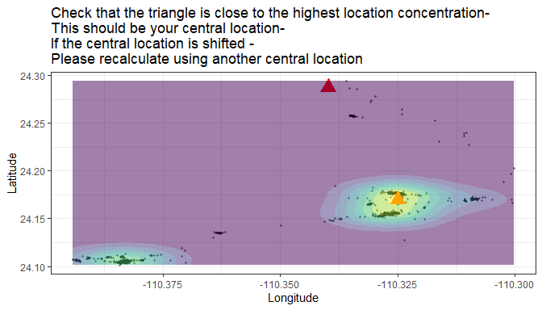
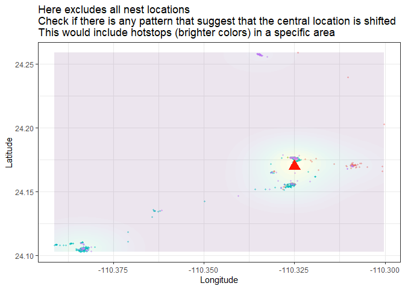

<!-- README.md is generated from README.Rmd. Please edit that file -->

# larus

<!-- badges: start -->
<!-- badges: end -->

## Installation

You can install the development version of larus from
[GitHub](https://github.com/) with:

``` r
# install.packages("devtools")
devtools::install_github("MiriamLL/larus")
```

# Intro

There is three key issues in determining the foraging trips in GSMs
attached to gulls:

1.  Battery charge and gaps (intervals) in the data
2.  Identify foraging trips, classify is usable or not
3.  The gulls just do whatever they want.

# \~\~\~\~\~\~\~\~\~\~\~\~\~\~\~\~~

# 1. The effect of the battery

``` r
load("~/03Academico/02Proyectos-Postdoc/2025/1Programming/2Packages/larus/data/LALI_example.rda")
```

``` r
my_locs<-LALI03_02locs
```

``` r
library(scales)
library(ggplot2)
```

``` r
ggplot(my_locs, aes(x=daytime, y=battery.charge.percent)) +
  geom_line() +
  scale_x_datetime(labels = date_format("%b"),date_breaks = "1 month")
```

## Battery levels classification

Considerations: Optimal battery was considered \> 75% battery Good \<
75% battery Poor \< 50% battery Low \< 25% battery

``` r
library(tidyverse)
```

``` r
my_locs <- my_locs %>%
  mutate(battery_class = 
         case_when(is.na(battery.charge.percent) ~ 'U',
                   battery.charge.percent >= 75 ~ '1Optimal (>75%)',
                   battery.charge.percent <= 75 & battery.charge.percent > 50 ~ '2Good (>50%)',
                   battery.charge.percent <= 50 & battery.charge.percent > 25 ~ '3Poor (>25%)',
                   battery.charge.percent <= 25 ~ '4Low (<25%)',
                   TRUE ~ 'Check'))
```

``` r
my_battery<-my_locs%>%
  group_by(battery_class)%>%
  tally()%>%
  mutate(total=sum(n))%>%
  mutate(prop=n*100/total)
my_battery
#> # A tibble: 3 × 4
#>   battery_class       n total  prop
#>   <chr>           <int> <int> <dbl>
#> 1 1Optimal (>75%) 16861 28209 59.8 
#> 2 2Good (>50%)    10515 28209 37.3 
#> 3 3Poor (>25%)      833 28209  2.95
```

``` r
my_locs%>%
  group_by(season,battery_class)%>%
  tally()%>%
  mutate(total=sum(n))%>%
  mutate(prop=n*100/total) %>%
  
ggplot(aes(fill=battery_class, y=prop, x=season)) + 
  geom_bar(stat="identity")+
  scale_fill_manual(values=c('#d7263d','#f46036','#2e294e'))+
  theme_classic()+
  theme(legend.position = 'top')+
  scale_y_continuous(expand = c(0,0)) 
```


## Gaps and battery relations

When studying tracking locations from GSM data, especially in the case
of birds like gulls, it’s common to encounter gaps in the data due to
factors such as loss of signal, battery limitations, or movement through
areas with poor GSM coverage.

``` r
my_locs<-my_locs %>%
  mutate(gaps_time=as.numeric(daytime - lag(daytime)))
```

Considerations: Optimal gaps \< 5 minutes Good \< 15 minutes Average \<
30 minutes Poor \< 2 hours (120 minutes) Low \> 24 hours (1400 minutes)

``` r
my_gaps <- my_locs %>%
  mutate(gaps_class = 
           case_when(is.na(gaps_time) ~ '8U',
                     gaps_time <= 5 ~ '1Optimal (<5mins)',
                     gaps_time >= 5 & Gaps_time < 15 ~ '2Good (<15mins)',
                     gaps_time >= 15 & Gaps_time < 30 ~ '3Average (<30mins)',
                     gaps_time >= 30 & Gaps_time < 60 ~ '4Poor (<1hr)',
                     gaps_time >= 60 & Gaps_time < 1400 ~ '5Low (>1hr)',
                     gaps_time >= 1400 ~ '6Low (onceAday)',
                     TRUE ~ '7Check'))
```

``` r
my_gaps %>%
  group_by(gaps_class)%>%
  tally()
#> # A tibble: 6 × 2
#>   gaps_class             n
#>   <chr>              <int>
#> 1 1Optimal (<5mins)   2958
#> 2 2Good (<15mins)    18986
#> 3 3Average (<30mins)  5919
#> 4 4Poor (<1hr)         343
#> 5 5Low (>1hr)            2
#> 6 8U                     1
```

Expect a U in the first line

``` r
my_gaps %>%
  group_by(gaps_class)%>%
  tally()%>%
  mutate(total=sum(n))%>%
  mutate(prop=n*100/total)
#> # A tibble: 6 × 4
#>   gaps_class             n total     prop
#>   <chr>              <int> <int>    <dbl>
#> 1 1Optimal (<5mins)   2958 28209 10.5    
#> 2 2Good (<15mins)    18986 28209 67.3    
#> 3 3Average (<30mins)  5919 28209 21.0    
#> 4 4Poor (<1hr)         343 28209  1.22   
#> 5 5Low (>1hr)            2 28209  0.00709
#> 6 8U                     1 28209  0.00354
```

``` r
my_gaps %>%
  group_by(season,gaps_class)%>%
  tally()%>%
  mutate(total=sum(n))%>%
  mutate(prop=n*100/total)%>%
  filter(gaps_class!='8U') %>% #expect first position to be empty
ggplot(aes(fill=gaps_class, y=prop, x=season)) + 
  geom_bar(stat="identity")+
  scale_fill_manual(values=c('#d7263d','#f46036','#ffc857','#c5d86d','#1b998b','#2e294e'))+
  theme_classic()+
  scale_y_continuous(expand = c(0,0)) 
```


## Compare

``` r
library(patchwork)
```

### Battery and gaps per season

``` r
my_locs%>%
  group_by(season,battery_class)%>%
  tally()%>%
  mutate(total=sum(n))%>%
  mutate(prop=n*100/total) %>%
  
ggplot(aes(fill=battery_class, y=prop, x=season)) + 
  geom_bar(stat="identity")+
  scale_fill_manual(values=c('#d7263d','#f46036','#2e294e'))+
  theme_classic()+
  scale_y_continuous(expand = c(0,0)) +
  
my_gaps %>%
  group_by(season,gaps_class)%>%
  tally()%>%
  mutate(total=sum(n))%>%
  mutate(prop=n*100/total)%>%
  filter(gaps_class!='8U') %>% #expect first position to be empty
  
ggplot(aes(fill=gaps_class, y=prop, x=season)) +
  geom_bar(stat="identity") +
  scale_fill_manual(values=c('#d7263d','#f46036','#ffc857','#c5d86d','#1b998b','#2e294e'))+
  theme_classic()+
  scale_y_continuous(expand = c(0,0)) +
  
plot_layout(ncol = 1)
```


### Battery and gaps per month

``` r
my_locs%>%
  group_by(month,battery_class)%>%
  tally()%>%
  mutate(total=sum(n))%>%
  mutate(prop=n*100/total) %>%
  
ggplot(aes(fill=battery_class, y=prop, x=month)) + 
  geom_bar(stat="identity")+
  scale_fill_manual(values=c('#d7263d','#f46036','#2e294e'))+
  theme_classic()+
  scale_y_continuous(expand = c(0,0)) +
  
my_gaps %>%
  group_by(month,gaps_class)%>%
  tally()%>%
  mutate(total=sum(n))%>%
  mutate(prop=n*100/total)%>%
  filter(gaps_class!='8U') %>% #expect first position to be empty
  
ggplot(aes(fill=gaps_class, y=prop, x=month)) +
  geom_bar(stat="identity") +
  scale_fill_manual(values=c('#d7263d','#f46036','#ffc857','#c5d86d','#1b998b','#2e294e'))+
  theme_classic()+
  scale_y_continuous(expand = c(0,0)) +
  
plot_layout(ncol = 1)
```


# \~\~\~\~\~\~\~\~\~\~\~\~\~\~\~\~~

## 2. Identify trips

### Step 1: Subset month

``` r
library(tidyverse)
```

``` r
Trips_01locs<-as.data.frame(my_locs)
```

``` r
This_month<-'08'
This_month_text<-'Ago'
```

``` r
Trips_01locs<-Trips_01locs %>%
  filter(month==This_month)
```

### Step 2: plot_check

``` r
my_central_location<-data.frame(Longitude=-110.33979846296234,Latitude=24.28728834326802)
```

``` r
plot_check<-function(my_locs=my_locs,my_central_location=my_central_location){
  ggplot()+
  geom_point(data = my_locs, aes(x=Longitude, y = Latitude),
             color='black',size = 0.8,alpha=0.4)+
  geom_point(data=my_central_location, aes(x=Longitude, y=Latitude),color='red',shape=17, size=5)+
  geom_density_2d_filled(data = my_locs, aes(x = Longitude, y = Latitude),alpha = 0.5)+
  theme_bw()+
  theme(legend.position = 'none')+
  ggtitle('Check that the triangle is close to the highest location concentration- \nThis should be your central location-  \nIf the central location is shifted -  \nPlease recalculate using another central location')}
```

``` r
plot_check(my_locs=Trips_01locs,my_central_location = my_central_location)
```


### Step 3: remove central locations

``` r
Trips_02outside<-Trips_01locs %>%
  filter(inside=='outside_central')
```

### Step 4: trip_number_sequence

``` r
continue_trip_sequence<-function(my_previous){
  print(last(my_previous))
  trip_number_sequence<-substr(last(my_previous), start = 6, stop = 10)
  trip_number_sequence<-as.numeric(trip_number_sequence)
  print(trip_number_sequence)
return(trip_number_sequence)}
```

``` r
Previous_params<-as.data.frame(trip_id<-"trip_00405")
```

``` r
trip_number_sequence<-continue_trip_sequence(my_previous=Previous_params$trip_id)
#> [1] "trip_00405"
#> [1] 405
```

``` r
Trips_03trips<-Trips_02outside %>%
  mutate(num_seq=as.numeric(num_seq))%>%
  mutate(trip_number = (cumsum(c(1L, diff(num_seq)) !=   1L)))%>%
  mutate(trip_number = trip_number +1 + trip_number_sequence)%>%
  mutate(trip_number = stringr::str_pad(trip_number,  5, pad = "0"))%>%
  mutate(trip_number = paste0("trip_", trip_number))
```

### Step 5: plot_trips

function: plot_trips

``` r
plot_trips<-function(my_locs=my_locs,my_central_location=my_central_location){
  ggplot()+
  geom_point(data = my_locs, aes(x=Longitude, y = Latitude,color=trip_number),
            size = 0.8,alpha=0.4)+
  geom_point(data=my_central_location, aes(x=Longitude, y=Latitude),color='red',shape=17, size=5)+
  geom_density_2d_filled(data = my_locs, aes(x = Longitude, y = Latitude),alpha = 0.1)+
  theme_bw()+
  theme(legend.position = 'none')+
  ggtitle('Here excludes all nest locations \nCheck if there is any pattern that suggest that the central location is shifted \nThis would include hotstops (brighter colors) in a specific area')}
```

``` r
plot_trips(my_locs=Trips_03trips,my_central_location=my_central_location)
```


### Step 6: check parameters

``` r
library(sula)
```

``` r
Trips_04params<-sula::calcular_duracion(GPS_data=Trips_03trips, 
                        col_diahora='daytime',
                        formato =  "%Y-%m-%d %H:%M:%S",
                        unidades="hours",
                        separador="trip_number")
```

Define trip_month_id in case there are outliers and the locations need
to be subset

``` r
Trips_04params<-Trips_04params %>%
  mutate(trip_month_id=paste0(This_month_text,"_a_",trip_id))%>%
  mutate(central_loc='colony')
```

### Step 7: gaps_params

``` r
gaps_params<-function(my_params=my_params,my_locs=my_locs){
  
  gaps_params<-my_locs %>%
    group_by(trip_number)%>%
    summarise(min_gap=min(gaps_time),
              max_gap=max(gaps_time))%>%
    rename(trip_id=trip_number)

    this_params<-gaps_params %>%
      left_join(my_params,by='trip_id')%>%
      select(trip_id,trip_month_id,central_loc,trip_start,trip_end,duration,min_gap,max_gap)
  
  return(this_params)
}
```

``` r
Trips_05params<-gaps_params(my_params = Trips_04params, my_locs = Trips_03trips)
head(Trips_05params)
#> # A tibble: 6 × 8
#>   trip_id    trip_month_id   central_loc trip_start          trip_end           
#>   <chr>      <chr>           <chr>       <dttm>              <dttm>             
#> 1 trip_00406 Ago_a_trip_004… colony      2023-07-31 22:08:50 2023-08-01 17:19:13
#> 2 trip_00407 Ago_a_trip_004… colony      2023-08-01 18:08:56 2023-08-01 18:18:51
#> 3 trip_00408 Ago_a_trip_004… colony      2023-08-01 20:58:55 2023-08-01 20:58:55
#> 4 trip_00409 Ago_a_trip_004… colony      2023-08-01 21:19:04 2023-08-01 21:19:04
#> 5 trip_00410 Ago_a_trip_004… colony      2023-08-01 21:58:52 2023-08-01 21:58:52
#> 6 trip_00411 Ago_a_trip_004… colony      2023-08-01 22:18:52 2023-08-01 22:38:55
#> # ℹ 3 more variables: duration <dbl>, min_gap <dbl>, max_gap <dbl>
```

# Short: straight forward using functions

``` r
Trips_01locs<-my_locs%>%
  filter(month==This_month)
```

``` r
plot_check(my_locs=Trips_01locs,my_central_location=my_central_location)
```


``` r
Trips_02outside<-Trips_01locs %>%
  filter(inside=='outside_central')
```

``` r
trip_number_sequence<-continue_trip_sequence(my_previous=Trips_05params$trip_id)
#> [1] "trip_00538"
#> [1] 538
```

``` r
Trips_03trips<-Trips_02outside %>%
  mutate(num_seq=as.numeric(num_seq))%>%
  mutate(trip_number = (cumsum(c(1L, diff(num_seq)) !=   1L)))%>%
  mutate(trip_number = trip_number +1 + trip_number_sequence)%>%
  mutate(trip_number = stringr::str_pad(trip_number,  5, pad = "0"))%>%
  mutate(trip_number = paste0("trip_", trip_number))
```

``` r
plot_trips(my_locs=Trips_03trips,my_central_location=my_central_location)
```


``` r
Trips_04params<-sula::calcular_duracion(GPS_data=Trips_03trips, 
                        col_diahora='daytime',
                        formato =  "%Y-%m-%d %H:%M:%S",
                        unidades="hours",
                        separador="trip_number")
```

``` r
range(Trips_04params$duration)
#> [1]   0.0000 168.7497
```

``` r
hist(Trips_04params$duration)
```


``` r
Trips_04params<-Trips_04params %>%
  mutate(trip_month_id=paste0(This_month_text,"_a_",trip_id))%>%
  mutate(central_loc='colony')
```

``` r
Trips_05params<-gaps_params(my_params = Trips_04params, my_locs = Trips_03trips)
head(Trips_05params)
#> # A tibble: 6 × 8
#>   trip_id    trip_month_id   central_loc trip_start          trip_end           
#>   <chr>      <chr>           <chr>       <dttm>              <dttm>             
#> 1 trip_00539 Ago_a_trip_005… colony      2023-07-31 22:08:50 2023-08-01 17:19:13
#> 2 trip_00540 Ago_a_trip_005… colony      2023-08-01 18:08:56 2023-08-01 18:18:51
#> 3 trip_00541 Ago_a_trip_005… colony      2023-08-01 20:58:55 2023-08-01 20:58:55
#> 4 trip_00542 Ago_a_trip_005… colony      2023-08-01 21:19:04 2023-08-01 21:19:04
#> 5 trip_00543 Ago_a_trip_005… colony      2023-08-01 21:58:52 2023-08-01 21:58:52
#> 6 trip_00544 Ago_a_trip_005… colony      2023-08-01 22:18:52 2023-08-01 22:38:55
#> # ℹ 3 more variables: duration <dbl>, min_gap <dbl>, max_gap <dbl>
```

``` r
length(unique(Trips_05params$trip_id))
#> [1] 133
length(unique(Trips_03trips$trip_number))
#> [1] 133
```

# \~\~\~\~\~\~\~\~\~\~\~\~\~\~\~\~\~\~\~\~\~\~\~~

# Check criteria

## params_class

``` r
params_class<-function(my_params=my_params){
  my_params<-my_params %>%
    mutate(trip_size = case_when(duration >= 0.5 ~ 'trip_longer_than_30mins',
                                 duration <= 0.5 ~ 'trip_shorter_than_30mins',
                                 TRUE ~ "other"))%>%
    
    mutate(resolution=case_when(max_gap >= 60 ~ 'low_resolution_gaps_more_60_mins',
                                max_gap <= 60 ~ 'ok_resolution_gaps_less_60_mins',
                                TRUE ~ "other"))%>%
    
    mutate(params_analyses=case_when(duration >= 24 ~ 'reevaluate_centralloc_longer_than_24h',
                                     duration <= 24 ~ 'keep_centralloc_shorter_than_24h',
                                     TRUE ~ "other"))%>%
    
    mutate(interpolation = case_when(duration <= 24 & max_gap <= 60 ~ 'interpolate_gapsless60mins_shorter24hr',
                                     duration >= 24 & max_gap >= 60 ~ 'dont_interpolate_gapsmore60mins_longer24hr',
                                     duration >= 24 ~ 'dont_interpolate_longer24hr',
                                     max_gap >= 60 ~ 'dont_interpolate_gapsmore60mins_longer24hr',
                                     TRUE ~ "other"))
  
  return(my_params)}
```

``` r
Params_00criteria<-params_class(my_params=Trips_05params)
```

## check_trip_criteria

Foraging trips were only considered when the animal was more than 1 km
away from the colony and lasting longer than 30 min (Shaffer et
al. 2017, Guerra et al. 2022).

If trips had a gap of \> 1hr and/or included overnight locations without
a clear central location, they were excluded from the interpolation.

``` r
check_trip_criteria<-function(my_params=my_params){
  
  trip_criteria<-my_params %>%
    group_by(trip_size)%>%
    tally()%>%
    mutate(total=sum(n))%>%
    mutate(prop=n*100/total)
  
   print(paste0("From ",sum(trip_criteria$n),' trips: ',
                round(trip_criteria$prop[1],2),' were ',trip_criteria$trip_size[1],' and ',
                 round(trip_criteria$prop[2],2),' were ',trip_criteria$trip_size[2],
                '. Trips shorter than 30 minutes are not considered real trips. Remove trips shorter than 30 minutes'
                ))
  
}
```

``` r
check_trip_criteria(my_params=Params_00criteria)
#> [1] "From 133 trips: 20.3 were trip_longer_than_30mins and 79.7 were trip_shorter_than_30mins. Trips shorter than 30 minutes are not considered real trips. Remove trips shorter than 30 minutes"
```

``` r
Params_01criteria<-Params_00criteria %>%
  filter(trip_size == 'trip_longer_than_30mins')
```

## check_resolution_criteria

``` r
check_resolution_criteria<-function(my_params=my_params){
  
  resolution_criteria<-my_params %>%
    group_by(resolution)%>%
    tally()%>%
    mutate(total=sum(n))%>%
    mutate(prop=n*100/total)

  
  print(paste0("From ",sum(resolution_criteria$n),' trips: ',
                round(resolution_criteria$prop[1],2),' (n = ',resolution_criteria$n[1],') were ',
                                                                  resolution_criteria$resolution[1],' and ',
                 round(resolution_criteria$prop[2],2),' (n = ',resolution_criteria$n[2],') were ',
               resolution_criteria$resolution[2],
                '. Evaluate if trips with low resolution are to be kept'))
  
}
```

``` r
check_resolution_criteria(my_params=Params_01criteria)
#> [1] "From 27 trips: 3.7 (n = 1) were low_resolution_gaps_more_60_mins and 96.3 (n = 26) were ok_resolution_gaps_less_60_mins. Evaluate if trips with low resolution are to be kept"
```

## check_lenght_criteria

``` r
Params_02criteria<-Params_01criteria %>%
  filter(resolution == 'ok_resolution_gaps_less_60_mins')
```

``` r
check_lenght_criteria<-function(my_params=my_params){
  
  lenght_criteria<-my_params %>%
    group_by(params_analyses)%>%
    tally()%>%
    mutate(total=sum(n))%>%
    mutate(prop=n*100/total)

  
  print(paste0("From ",sum(lenght_criteria$n),' trips: ',
                round(lenght_criteria$prop[1],2),' (n = ',lenght_criteria$n[1],') were ',lenght_criteria$params_analyses[1],' and ',
                 round(lenght_criteria$prop[2],2),' (n = ',lenght_criteria$n[2],') were ',lenght_criteria$params_analyses[2],
                '. Evaluate if trips longer than 24 hrs is because of a change in central location'))
  
}
```

``` r
check_lenght_criteria(my_params=Params_02criteria)
#> [1] "From 26 trips: 84.62 (n = 22) were keep_centralloc_shorter_than_24h and 15.38 (n = 4) were reevaluate_centralloc_longer_than_24h. Evaluate if trips longer than 24 hrs is because of a change in central location"
```

# Reevaluate

``` r
Reevaluate<-Params_02criteria %>%
  filter(params_analyses=='reevaluate_centralloc_longer_than_24h')
Reevaluate
#> # A tibble: 4 × 12
#>   trip_id    trip_month_id   central_loc trip_start          trip_end           
#>   <chr>      <chr>           <chr>       <dttm>              <dttm>             
#> 1 trip_00578 Ago_a_trip_005… colony      2023-08-03 10:58:50 2023-08-04 16:58:55
#> 2 trip_00639 Ago_a_trip_006… colony      2023-08-10 03:28:53 2023-08-11 13:29:55
#> 3 trip_00645 Ago_a_trip_006… colony      2023-08-12 03:28:53 2023-08-19 04:13:52
#> 4 trip_00651 Ago_a_trip_006… colony      2023-08-22 04:28:59 2023-08-23 16:59:35
#> # ℹ 7 more variables: duration <dbl>, min_gap <dbl>, max_gap <dbl>,
#> #   trip_size <chr>, resolution <chr>, params_analyses <chr>,
#> #   interpolation <chr>
```

# \~\~\~\~\~\~\~\~\~\~\~\~\~\~\~\~~

# 3. Gulls just do whatever they want

## Step 1: check outliers

Check big outliers

``` r
Reevaluate<-Params_02criteria %>%
  filter(params_analyses=='reevaluate_centralloc_longer_than_24h')
Reevaluate
#> # A tibble: 4 × 12
#>   trip_id    trip_month_id   central_loc trip_start          trip_end           
#>   <chr>      <chr>           <chr>       <dttm>              <dttm>             
#> 1 trip_00578 Ago_a_trip_005… colony      2023-08-03 10:58:50 2023-08-04 16:58:55
#> 2 trip_00639 Ago_a_trip_006… colony      2023-08-10 03:28:53 2023-08-11 13:29:55
#> 3 trip_00645 Ago_a_trip_006… colony      2023-08-12 03:28:53 2023-08-19 04:13:52
#> 4 trip_00651 Ago_a_trip_006… colony      2023-08-22 04:28:59 2023-08-23 16:59:35
#> # ℹ 7 more variables: duration <dbl>, min_gap <dbl>, max_gap <dbl>,
#> #   trip_size <chr>, resolution <chr>, params_analyses <chr>,
#> #   interpolation <chr>
```

Are this outliers due to gaps of the intervals? Large intervals might
cause that the bird entering back to the colony is missed.

``` r
print(paste0("Max gaps was: ",
             round(Reevaluate$max_gap,2),
             ' mins. If the interval is more than 60 minutes in duration that could be a plausible explaination and then it should be eliminated. If the interval is less than 60 minutes in duration consider it can be a change in central location of the bird.'))
#> [1] "Max gaps was: 20.78 mins. If the interval is more than 60 minutes in duration that could be a plausible explaination and then it should be eliminated. If the interval is less than 60 minutes in duration consider it can be a change in central location of the bird."
#> [2] "Max gaps was: 30.5 mins. If the interval is more than 60 minutes in duration that could be a plausible explaination and then it should be eliminated. If the interval is less than 60 minutes in duration consider it can be a change in central location of the bird." 
#> [3] "Max gaps was: 20.23 mins. If the interval is more than 60 minutes in duration that could be a plausible explaination and then it should be eliminated. If the interval is less than 60 minutes in duration consider it can be a change in central location of the bird."
#> [4] "Max gaps was: 31.4 mins. If the interval is more than 60 minutes in duration that could be a plausible explaination and then it should be eliminated. If the interval is less than 60 minutes in duration consider it can be a change in central location of the bird."
```

## Step 2: extract locs

Identify ids

``` r
Reevaluate_tripid<-unique(Reevaluate$trip_id)
Reevaluate_tripid
#> [1] "trip_00578" "trip_00639" "trip_00645" "trip_00651"
```

## Step 3.Subset locations

``` r
Reevaluate_01locs<-Trips_03trips %>%
  filter(trip_number %in% Reevaluate_tripid)%>%
  relocate(ID,trip_number,daytime,dt,gaps_time)
head(Reevaluate_01locs)
#> # A tibble: 6 × 21
#>   ID     trip_number daytime             dt     gaps_time season month Longitude
#>   <chr>  <chr>       <dttm>              <chr>      <dbl> <chr>  <chr>     <dbl>
#> 1 LALI03 trip_00578  2023-08-03 10:58:50 2023-…     10    late-… 08        -110.
#> 2 LALI03 trip_00578  2023-08-03 11:08:54 2023-…     10.1  late-… 08        -110.
#> 3 LALI03 trip_00578  2023-08-03 11:18:50 2023-…      9.93 late-… 08        -110.
#> 4 LALI03 trip_00578  2023-08-03 11:29:28 2023-…     10.6  late-… 08        -110.
#> 5 LALI03 trip_00578  2023-08-03 11:38:50 2023-…      9.37 late-… 08        -110.
#> 6 LALI03 trip_00578  2023-08-03 11:48:50 2023-…     10    late-… 08        -110.
#> # ℹ 13 more variables: Latitude <dbl>, countday <dbl>, Hour <chr>,
#> #   Day_or_night <chr>, central_base <chr>, inside <chr>, num_seq <dbl>,
#> #   ID.y <chr>, Location_gaps <chr>, Battery <chr>, Gaps_time <dbl>,
#> #   battery.charge.percent <dbl>, battery_class <chr>
```

plot_check with facet_wrap

``` r
plot_check(my_locs=Reevaluate_01locs,my_central_location = my_central_location)+
  facet_wrap(~trip_number)
```



## Step 4: identify new central location

``` r
new_central_location<-data.frame(Longitude=-110.325,Latitude=24.17)
```

``` r
plot_check(my_locs=Reevaluate_01locs,my_central_location = my_central_location)+
  geom_point(data=new_central_location, aes(x=Longitude, y=Latitude),color='blue',shape=17, size=5)
```


## Step 5: create_buffer

``` r
create_buffer<-function(central_point=central_point, buffer_km=buffer_km){
  central_spatial<- sp::SpatialPoints(cbind(central_point$Longitude,central_point$Latitude)) 
  sp::proj4string(central_spatial)= sp::CRS("+init=epsg:4326") 
  central_spatial <- sp::spTransform(central_spatial, sp::CRS("+init=epsg:4326"))
  central_spatial<-sf::st_as_sf(central_spatial)
  buffer_dist<-buffer_km*1000
  central_buffer<-sf::st_buffer(central_spatial, buffer_dist)
  return(central_buffer)
  }
```

``` r
new_central_buffer<-create_buffer(central_point=new_central_location,buffer_km=0.3)
#> Warning in CPL_crs_from_input(x): GDAL Message 1: +init=epsg:XXXX syntax is
#> deprecated. It might return a CRS with a non-EPSG compliant axis order.
```

## Step 6: from_df_to_sf

``` r
from_df_to_st<-function(my_df){
  my_points <- my_df
  sp::coordinates(my_points) <- ~Longitude + Latitude
  sp::proj4string(my_points) = sp::CRS("+init=epsg:4326")
  my_sf<-sf::st_as_sf(my_points)
  return(my_sf)
}
```

``` r
Reevaluate_02sf<-from_df_to_st(Reevaluate_01locs)
```

## Step 7: over

``` r
over<-function(my_locations=my_locations,my_buffer=my_buffer){
  locations<-sf::st_as_sf(my_locations)
  location_over<-sapply(sf::st_intersects(locations,my_buffer), 
                        function(z) if (length(z)==0) NA_integer_ else z[1])
  return(location_over)}
```

``` r
Reevaluate_03over<- over(my_locations=Reevaluate_02sf,my_buffer=new_central_buffer)
```

## Step 8: add_trip_number

``` r
add_trip_number<-function(my_over,my_df,my_trip_number_sequence){
  
  my_df$central_location <- my_over 
  
  my_df<-my_df %>%
    mutate(inside=case_when(central_location == 1 ~ 'inside_central',TRUE ~ 'outside_central'))
  
  my_df %>%
    group_by(ID,inside)%>%
    count()%>%
    pivot_wider(names_from = inside, values_from = n)
  
  my_outside<-my_df %>%
    filter(inside=='outside_central')
  
  my_trips<-my_outside %>%
    mutate(num_seq=as.numeric(num_seq))%>%
    mutate(trip_number = (cumsum(c(1L, diff(num_seq)) !=   1L)))%>%
    mutate(trip_number = trip_number + 1 + my_trip_number_sequence)%>%
    mutate(trip_number = stringr::str_pad(trip_number,  5, pad = "0"))%>%
    mutate(trip_number = paste0("trip_", trip_number))
  
  return(my_trips)
}
```

``` r
new_trip_number_sequence<-continue_trip_sequence(my_previous=Trips_05params$trip_id)
#> [1] "trip_00671"
#> [1] 671
```

``` r
Reevaluate_04trips<-add_trip_number(my_df=Reevaluate_01locs,
                                     my_over=Reevaluate_03over,
                                     my_trip_number_sequence=new_trip_number_sequence)
```

## Step 9: calculate params

``` r
Reevaluate_05params<-sula::calcular_duracion(GPS_data=Reevaluate_04trips, 
                        col_diahora='daytime',
                        formato =  "%Y-%m-%d %H:%M:%S",
                        unidades="hours",
                        separador="trip_number")
```

``` r
Reevaluate_05params<-Reevaluate_05params %>%
  mutate(trip_month_id=paste0(This_month_text,"_b_",trip_id))%>%
  mutate(central_loc='south_of_colony')
```

## Step 10: gaps_params

``` r
Reevaluate_06params<-gaps_params(my_params = Reevaluate_05params, my_locs = Reevaluate_04trips)
Reevaluate_06params
#> # A tibble: 8 × 8
#>   trip_id    trip_month_id   central_loc trip_start          trip_end           
#>   <chr>      <chr>           <chr>       <dttm>              <dttm>             
#> 1 trip_00672 Ago_b_trip_006… south_of_c… 2023-08-03 10:58:50 2023-08-04 15:18:51
#> 2 trip_00673 Ago_b_trip_006… south_of_c… 2023-08-04 15:39:00 2023-08-04 16:58:55
#> 3 trip_00674 Ago_b_trip_006… south_of_c… 2023-08-10 03:28:53 2023-08-11 13:29:55
#> 4 trip_00675 Ago_b_trip_006… south_of_c… 2023-08-12 03:28:53 2023-08-13 07:09:00
#> 5 trip_00676 Ago_b_trip_006… south_of_c… 2023-08-13 07:29:00 2023-08-13 11:09:15
#> 6 trip_00677 Ago_b_trip_006… south_of_c… 2023-08-13 11:49:17 2023-08-17 06:13:53
#> 7 trip_00678 Ago_b_trip_006… south_of_c… 2023-08-17 06:43:51 2023-08-19 04:13:52
#> 8 trip_00679 Ago_b_trip_006… south_of_c… 2023-08-22 04:28:59 2023-08-23 16:59:35
#> # ℹ 3 more variables: duration <dbl>, min_gap <dbl>, max_gap <dbl>
```

### checks

``` r
hist(Reevaluate$duration)
```


``` r
hist(Reevaluate_06params$duration)
```


## Step 11: plot_trips

``` r
plot_trips(my_locs=Reevaluate_04trips,my_central_location = my_central_location)+
  geom_point(data=new_central_location, aes(x=Longitude, y=Latitude),color='blue',shape=17, size=5)
```


## Step 12: Params merged

Add criteria classifications

``` r
Params_03reevaluate<-params_class(my_params=Reevaluate_06params)
```

``` r
Params_02criteria
#> # A tibble: 26 × 12
#>    trip_id    trip_month_id  central_loc trip_start          trip_end           
#>    <chr>      <chr>          <chr>       <dttm>              <dttm>             
#>  1 trip_00539 Ago_a_trip_00… colony      2023-07-31 22:08:50 2023-08-01 17:19:13
#>  2 trip_00549 Ago_a_trip_00… colony      2023-08-02 02:58:49 2023-08-02 03:29:04
#>  3 trip_00557 Ago_a_trip_00… colony      2023-08-02 10:58:47 2023-08-02 11:38:49
#>  4 trip_00569 Ago_a_trip_00… colony      2023-08-03 00:08:49 2023-08-03 00:38:52
#>  5 trip_00575 Ago_a_trip_00… colony      2023-08-03 05:08:50 2023-08-03 05:38:51
#>  6 trip_00576 Ago_a_trip_00… colony      2023-08-03 06:48:50 2023-08-03 07:28:56
#>  7 trip_00578 Ago_a_trip_00… colony      2023-08-03 10:58:50 2023-08-04 16:58:55
#>  8 trip_00584 Ago_a_trip_00… colony      2023-08-04 23:58:49 2023-08-05 00:38:53
#>  9 trip_00586 Ago_a_trip_00… colony      2023-08-05 01:38:53 2023-08-05 02:09:07
#> 10 trip_00588 Ago_a_trip_00… colony      2023-08-05 08:48:50 2023-08-05 15:59:04
#> # ℹ 16 more rows
#> # ℹ 7 more variables: duration <dbl>, min_gap <dbl>, max_gap <dbl>,
#> #   trip_size <chr>, resolution <chr>, params_analyses <chr>,
#> #   interpolation <chr>
Params_03reevaluate
#> # A tibble: 8 × 12
#>   trip_id    trip_month_id   central_loc trip_start          trip_end           
#>   <chr>      <chr>           <chr>       <dttm>              <dttm>             
#> 1 trip_00672 Ago_b_trip_006… south_of_c… 2023-08-03 10:58:50 2023-08-04 15:18:51
#> 2 trip_00673 Ago_b_trip_006… south_of_c… 2023-08-04 15:39:00 2023-08-04 16:58:55
#> 3 trip_00674 Ago_b_trip_006… south_of_c… 2023-08-10 03:28:53 2023-08-11 13:29:55
#> 4 trip_00675 Ago_b_trip_006… south_of_c… 2023-08-12 03:28:53 2023-08-13 07:09:00
#> 5 trip_00676 Ago_b_trip_006… south_of_c… 2023-08-13 07:29:00 2023-08-13 11:09:15
#> 6 trip_00677 Ago_b_trip_006… south_of_c… 2023-08-13 11:49:17 2023-08-17 06:13:53
#> 7 trip_00678 Ago_b_trip_006… south_of_c… 2023-08-17 06:43:51 2023-08-19 04:13:52
#> 8 trip_00679 Ago_b_trip_006… south_of_c… 2023-08-22 04:28:59 2023-08-23 16:59:35
#> # ℹ 7 more variables: duration <dbl>, min_gap <dbl>, max_gap <dbl>,
#> #   trip_size <chr>, resolution <chr>, params_analyses <chr>,
#> #   interpolation <chr>
```

``` r
Params_merged<-rbind(Params_02criteria %>% filter(!trip_id %in% Reevaluate_tripid),
                     Params_03reevaluate)
```

## Step 13: Locs merged

``` r
Locs_merged <-rbind(Trips_03trips%>% 
                      filter(!trip_number %in% Reevaluate_tripid)%>%
                      select(ID,daytime,season,month,
                             Longitude,Latitude,countday,
                             Hour,Day_or_night,central_base,inside,num_seq,
                             ID.y,dt,Location_gaps,Battery,Gaps_time,battery.charge.percent,
                             trip_number),
                    
                    Reevaluate_04trips %>%
                      select(ID,daytime,season,month,
                             Longitude,Latitude,countday,
                             Hour,Day_or_night,central_base,inside,num_seq,
                             ID.y,dt,Location_gaps,Battery,Gaps_time,battery.charge.percent,
                             trip_number))
```

# \~\~\~\~\~\~\~\~\~\~\~\~\~\~\~~

# Interpolation

``` r
Inter_params<-Params_merged
Inter_locs<-Locs_merged
```

## Step 1: exclude trips longer than 24 hrs with gaps larger than 60 minutes

``` r
Inter_params %>%
  group_by(interpolation)%>%
  tally()
#> # A tibble: 2 × 2
#>   interpolation                              n
#>   <chr>                                  <int>
#> 1 dont_interpolate_longer24hr                6
#> 2 interpolate_gapsless60mins_shorter24hr    24
```

``` r
Inter_01params<-Inter_params %>%
  filter(interpolation=='interpolate_gapsless60mins_shorter24hr')
```

## Step 2: locs_class

``` r
locs_class<-function(Inter_params=Inter_params,
                     Inter_locs=Inter_locs){
  
  tripid_01trip_size<-unique(Inter_params %>%
                            filter(trip_size == 'trip_longer_than_30mins'))$trip_id
  
  tripid_02analysesid<-unique(Inter_params %>%
                                filter(params_analyses == "keep_centralloc_shorter_than_24h"))$trip_id
  
  tripid_03resolutionid<-unique(Inter_params %>%
                                  filter(resolution == "ok_resolution_gaps_less_60_mins"))$trip_id
  
  tripid_04interpolateid<-unique(Inter_params %>%
                                   filter(interpolation == 'interpolate_gapsless60mins_shorter24hr'))$trip_id
  
  Inter_locs<-Inter_locs %>%
  mutate(trip_size = case_when(trip_number %in% tripid_01trip_size ~  'trip_longer_than_30mins',
                                 TRUE ~  'trip_shorter_than_30mins'))%>%
  
  mutate(params_analyses=case_when(trip_number %in% tripid_02analysesid ~ "keep_centralloc_shorter_than_24h",
                          TRUE ~ "reevaluate_centralloc_longer_than_24h"))%>%
  
  mutate(resolution=case_when(trip_number %in% tripid_03resolutionid~ "ok_resolution_gaps_less_60_mins",
                          TRUE ~ "low_resolution_gaps_more_60_mins"))%>%
  
  mutate(interpolation=case_when(trip_number %in% tripid_04interpolateid ~ 'interpolate_gapsless60mins_shorter24hr',
                          TRUE ~ "dont_interpolate_longer24hr"))
  
  return(Inter_locs)
}
```

``` r
Inter_02locs<-locs_class(Inter_params=Inter_params,
                     Inter_locs=Inter_locs)
```

## Step 3: check locations

``` r
Inter_02locs %>%
  group_by(interpolation)%>%
  tally()
#> # A tibble: 2 × 2
#>   interpolation                              n
#>   <chr>                                  <int>
#> 1 dont_interpolate_longer24hr             1293
#> 2 interpolate_gapsless60mins_shorter24hr   406
```

``` r
plot_trips(my_locs=Inter_02locs,my_central_location = my_central_location)
```



### Excluded

``` r
Inter_03locs <- Inter_02locs %>%
  filter(interpolation != 'interpolate_gapsless60mins_shorter24hr')
```

``` r
plot_trips(my_locs=Inter_03locs,my_central_location = my_central_location)+
  facet_wrap(~trip_number)
```

Last 6 trips look genuinely that the bird change location

### Included

``` r
Inter_04locs <- Inter_02locs %>%
  filter(interpolation == 'interpolate_gapsless60mins_shorter24hr')
```

``` r
plot_trips(my_locs=Inter_04locs,my_central_location = my_central_location)
```


Whether to interpolate the data depends on your research goals and the
nature of the gaps.

Here’s a breakdown of considerations to help you decide:

- Short Gaps: If the gaps are short (e.g., a few minutes to an hour),
  interpolation might be justifiable, especially if you assume that the
  bird’s movement is relatively constant during the gap. For example,
  linear interpolation can estimate a reasonable position based on
  previous and subsequent data points.
- Long Gaps: If the gaps are long (e.g., several hours or days),
  interpolation might introduce unrealistic results, especially if the
  bird’s movement during that time period was unknown. Interpolating
  long gaps could lead to misleading conclusions about the bird’s actual
  path or behavior. If your study’s analysis can handle missing data or
  gaps (e.g., for high-level migration patterns), you might consider
  leaving the gaps unfilled. This avoids the risk of introducing
  erroneous data but may reduce the overall precision. If your analysis
  is based on trajectory or movement behavior, you could use gap-filling
  approaches like predicting the bird’s behavior based on its last known
  location and surrounding environmental context (such as weather, time
  of day, etc.).

# \~\~\~\~\~\~\~\~\~\~\~\~\~\~\~\~\~\~\~\~~

# Test data

## gull_data

Contains data from one gull tagged at La Paz, Mexico

``` r
library(larus)
```

``` r
gull_data<-gull_data
```
