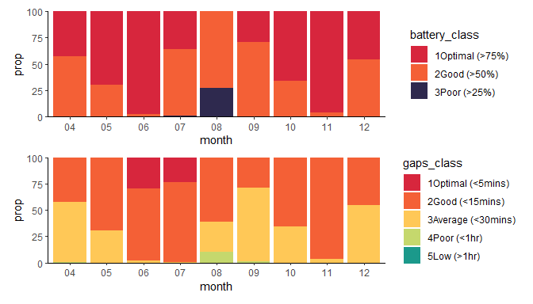
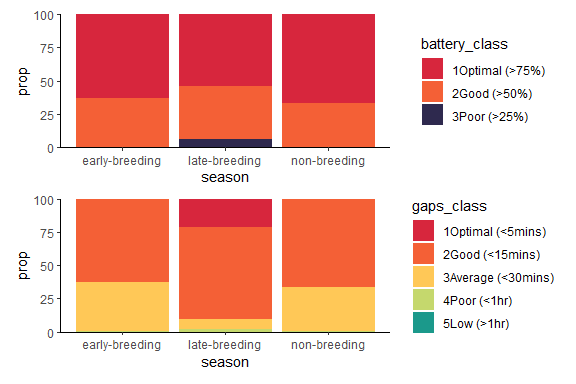
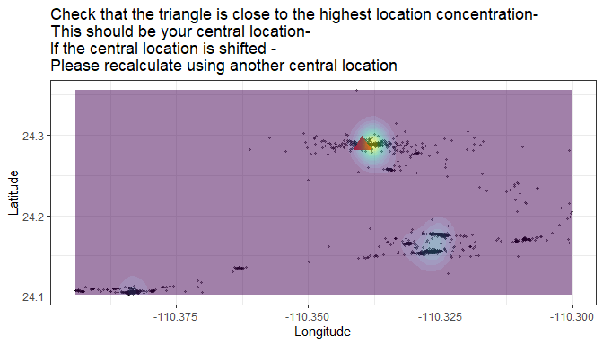
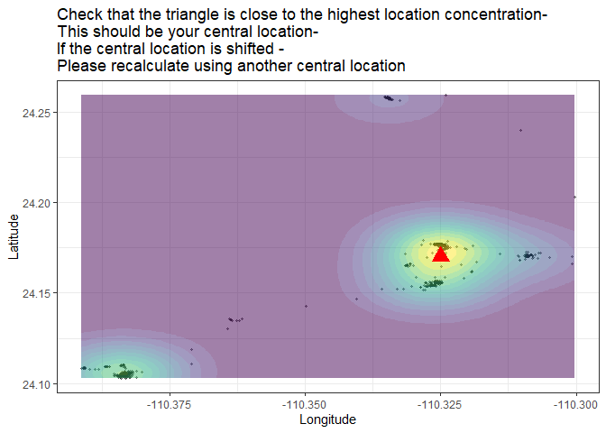
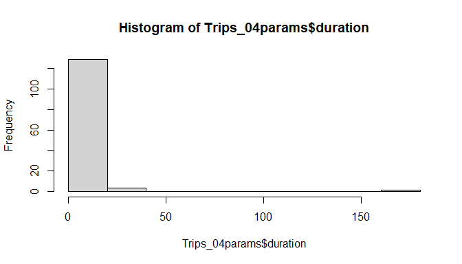
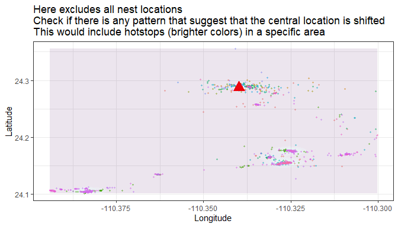
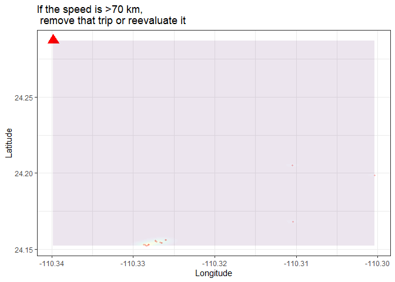

<!-- README.md is generated from README.Rmd. Please edit that file -->

# larus 

<!-- badges: start -->
<!-- badges: end -->

## Installation

You can install the development version of larus from
[GitHub](https://github.com/) with:

``` r
# install.packages("devtools")
devtools::install_github("MiriamLL/larus")
```

# Intro

There is three key issues in determining the foraging trips in GSMs
attached to gulls:

1.  Battery charge and gaps (intervals) in the data
2.  Identify foraging trips, classify is usable or not
3.  The gulls just do whatever they want.

# ——————–

# 1. The effect of the battery

``` r
library(larus)
```

``` r
head(GSM_battery)
#>       ID             daytime         season month battery_charge gaps_min
#> 1 LALI03 2023-04-18 07:28:35 early-breeding    04             53       NA
#> 2 LALI03 2023-04-18 07:48:30 early-breeding    04             56 19.91667
#> 3 LALI03 2023-04-18 08:07:35 early-breeding    04             56 19.08333
#> 4 LALI03 2023-04-18 08:27:06 early-breeding    04             56 19.51667
#> 5 LALI03 2023-04-18 08:47:06 early-breeding    04             57 20.00000
#> 6 LALI03 2023-04-18 09:07:35 early-breeding    04             59 20.48333
```

``` r
library(scales)
library(ggplot2)
```

``` r
ggplot(GSM_battery, aes(x=daytime, y=battery_charge)) +
  geom_line() +
  scale_x_datetime(labels = date_format("%b"),date_breaks = "1 month")
```

## Battery levels classification

Considerations: Optimal battery was considered \> 75% battery Good \<
75% battery Poor \< 50% battery Low \< 25% battery

``` r
library(tidyverse)
```

``` r
GSM_battery_class <- GSM_battery%>%
  mutate(battery_class = 
         case_when(is.na(battery_charge) ~ 'U',
                   battery_charge >= 75 ~ '1Optimal (>75%)',
                   battery_charge <= 75 & battery_charge > 50 ~ '2Good (>50%)',
                   battery_charge <= 50 & battery_charge > 25 ~ '3Poor (>25%)',
                   battery_charge <= 25 ~ '4Low (<25%)',
                   TRUE ~ 'Check'))
```

``` r
GSM_battery_class %>%
  group_by(battery_class)%>%
  tally()%>%
  mutate(total=sum(n))%>%
  mutate(prop=n*100/total)
#> # A tibble: 3 × 4
#>   battery_class       n total  prop
#>   <chr>           <int> <int> <dbl>
#> 1 1Optimal (>75%) 16861 28209 59.8 
#> 2 2Good (>50%)    10515 28209 37.3 
#> 3 3Poor (>25%)      833 28209  2.95
```

## Gaps and battery relations

When studying tracking locations from GSM data, especially in the case
of birds like gulls, it’s common to encounter gaps in the data due to
factors such as loss of signal, battery limitations, or movement through
areas with poor GSM coverage.

Calculate gaps

if there is only one individual

``` r
GSM_locs$gaps_min<-as.numeric(GSM_locs$daytime - lag(GSM_locs$daytime))
```

``` r
head(GSM_locs)
#> # A tibble: 6 × 11
#>   num_seq ID     daytime             season      month Longitude Latitude inside
#>   <chr>   <chr>  <dttm>              <chr>       <chr>     <dbl>    <dbl> <chr> 
#> 1 1       LALI03 2023-04-18 07:28:35 early-bree… 04        -110.     24.3 insid…
#> 2 2       LALI03 2023-04-18 07:48:30 early-bree… 04        -110.     24.3 insid…
#> 3 3       LALI03 2023-04-18 08:07:35 early-bree… 04        -110.     24.3 insid…
#> 4 4       LALI03 2023-04-18 08:27:06 early-bree… 04        -110.     24.3 insid…
#> 5 5       LALI03 2023-04-18 08:47:06 early-bree… 04        -110.     24.3 insid…
#> 6 6       LALI03 2023-04-18 09:07:35 early-bree… 04        -110.     24.3 insid…
#> # ℹ 3 more variables: central_base <chr>, battery_charge <dbl>, gaps_min <dbl>
```

If there are more individuals

``` r
GSM_gaps <-calculate_gaps(my_locs = GSM_locs,my_datetime = 'daytime',my_separator = 'ID')
```

Considerations: Optimal gaps \< 5 minutes Good \< 15 minutes Average \<
30 minutes Poor \< 2 hours (120 minutes) Low \> 24 hours (1400 minutes)

``` r
GSM_gaps_class <- GSM_gaps %>%
  mutate(gaps_class = 
           case_when(is.na(gaps_min) ~ '8U',
                     gaps_min <= 5 ~ '1Optimal (<5mins)',
                     gaps_min >= 5 & gaps_min < 15 ~ '2Good (<15mins)',
                     gaps_min >= 15 & gaps_min < 30 ~ '3Average (<30mins)',
                     gaps_min >= 30 & gaps_min < 60 ~ '4Poor (<1hr)',
                     gaps_min >= 60 & gaps_min < 1400 ~ '5Low (>1hr)',
                     gaps_min >= 1400 ~ '6Low (onceAday)',
                     TRUE ~ '7Check'))
```

``` r
GSM_gaps_class %>%
  group_by(gaps_class)%>%
  tally()
#> # A tibble: 6 × 2
#>   gaps_class             n
#>   <chr>              <int>
#> 1 1Optimal (<5mins)   2958
#> 2 2Good (<15mins)    18986
#> 3 3Average (<30mins)  5919
#> 4 4Poor (<1hr)         343
#> 5 5Low (>1hr)            2
#> 6 8U                     1
```

## Compare

``` r
library(patchwork)
```

### Battery and gaps per season

``` r
GSM_battery_class %>%
  group_by(season,battery_class)%>%
  tally()%>%
  mutate(total=sum(n))%>%
  mutate(prop=n*100/total) %>%
  
ggplot(aes(fill=battery_class, y=prop, x=season)) + 
  geom_bar(stat="identity")+
  scale_fill_manual(values=c('#d7263d','#f46036','#2e294e'))+
  theme_classic()+
  scale_y_continuous(expand = c(0,0)) +
  
GSM_gaps_class  %>%
  group_by(season,gaps_class)%>%
  tally()%>%
  mutate(total=sum(n))%>%
  mutate(prop=n*100/total)%>%
  filter(gaps_class!='8U') %>% #expect first position to be empty
  
ggplot(aes(fill=gaps_class, y=prop, x=season)) +
  geom_bar(stat="identity") +
  scale_fill_manual(values=c('#d7263d','#f46036','#ffc857','#c5d86d','#1b998b','#2e294e'))+
  theme_classic()+
  scale_y_continuous(expand = c(0,0)) +
  
plot_layout(ncol = 1)
```



### Battery and gaps per month

``` r
GSM_battery_class %>%
  group_by(month,battery_class)%>%
  tally()%>%
  mutate(total=sum(n))%>%
  mutate(prop=n*100/total) %>%
  
ggplot(aes(fill=battery_class, y=prop, x=month)) + 
  geom_bar(stat="identity")+
  scale_fill_manual(values=c('#d7263d','#f46036','#2e294e'))+
  theme_classic()+
  scale_y_continuous(expand = c(0,0)) +
  
GSM_gaps_class %>%
  group_by(month,gaps_class)%>%
  tally()%>%
  mutate(total=sum(n))%>%
  mutate(prop=n*100/total)%>%
  filter(gaps_class!='8U') %>% #expect first position to be empty
  
ggplot(aes(fill=gaps_class, y=prop, x=month)) +
  geom_bar(stat="identity") +
  scale_fill_manual(values=c('#d7263d','#f46036','#ffc857','#c5d86d','#1b998b','#2e294e'))+
  theme_classic()+
  scale_y_continuous(expand = c(0,0)) +
  
plot_layout(ncol = 1)
```



# ——————–

## 2. Identify trips

Making the separation by individual and month, is more time consuming
but assures that you can have an overview of the trips and the
calculations.

Also the birds might leave the nest at some point and you need to
recalculate the central location.

### Step 1: subset month

``` r
library(tidyverse)
```

``` r
This_month<-'08'
This_month_text<-'Ago'
```

``` r
Trips_01locs<-GSM_locs %>%
  dplyr::filter(month==This_month)
```

### Step 2: plot_check

``` r
my_central_location<-data.frame(Longitude=-110.33979846296234,Latitude=24.28728834326802)
```

``` r
plot_check(my_locs=Trips_01locs,my_central_location = my_central_location)
```

### Step 3: remove central locations

``` r
Trips_02outside<-Trips_01locs %>%
  filter(inside=='outside_central')
```

### Step 4: trip_number_sequence

``` r
Previous_params<-data.frame(trip_id=c("trip_00001"))
```

``` r
trip_number_sequence<-continue_trip_sequence(my_previous=Previous_params$trip_id)
#> [1] "trip_00001"
#> [1] 1
```

``` r
Trips_03trips<-Trips_02outside %>%
  mutate(num_seq=as.numeric(num_seq))%>%
  mutate(trip_number = (cumsum(c(1L, diff(num_seq)) !=   1L)))%>%
  mutate(trip_number = trip_number +1 + trip_number_sequence)%>%
  mutate(trip_number = stringr::str_pad(trip_number,  5, pad = "0"))%>%
  mutate(trip_number = paste0("trip_", trip_number))
```

### Step 5: plot_trips

Visualize trips

``` r
plot_trips(my_locs=Trips_03trips,my_central_location=my_central_location)
```

### Step 6: calculate_params

Create data frame with trip_start, trip_end, duration, gap minimum, gap
maximum per trip

``` r
Trips_04params<-calculate_params(my_locs=GSM_trips,
                                 my_daytime='daytime',
                                 my_format="%Y-%m-%d %H:%M:%S",
                                 my_units="hours",
                                 my_divider="trip_number",
                                 my_gaps='gaps_min')
```

Define trip_month_id in case there are outliers and the locations need
to be subset

``` r
Trips_05params<-Trips_04params %>%
  mutate(trip_month_id=paste0(This_month_text,"_a_",trip_id))%>%
  mutate(central_loc='colony')
```

### Step 7: compare_notrips

Check that the same number of trips are in the locations and in the
parameters

``` r
compare_notrips(my_params=GSM_params,my_locs=GSM_trips)
#> [1] "There are 133 trips in locations, and 133 in parameters"
#> [1] "There are 0 trips missing in locations, and 0 in parameters"
```

# ——————–

# 3. Classify params

## Step 1: classify_params

Add information of the criteria to keep or not some trips based on trip
duration (trip_size), resolution (recording intervals), duration (trips
should be shorter than 24 hrs), interpolation (just trips that are
longer than 30 minutes, have intervals of \< 60 minutes and last then
than 24 hours would be considered for interpolation)

``` r
Params_00criteria<-classify_params(my_params=GSM_params)
```

## Step 2: check_trip_criteria

Foraging trips were only considered when the animal was more than 1 km
away from the colony and lasting longer than 30 min (Shaffer et
al. 2017, Guerra et al. 2022).

If trips had a gap of \> 1hr and/or included overnight locations without
a clear central location, they were excluded from the interpolation.

``` r
check_trip_criteria(my_params=Params_00criteria)
#> [1] "From 133 trips: 20.3% were trip_longer_than_30mins and 79.7% were trip_shorter_than_30mins. Trips shorter than 30 minutes are not considered real trips. Remove these trips from analyses. "
```

Remove short trips from the foraging trips

``` r
Params_01criteria<-Params_00criteria %>%
  dplyr::filter(trip_size == 'trip_longer_than_30mins')
```

## Step 3: check_resolution_criteria

Check if the intervals affected the trips detected

``` r
check_resolution_criteria(my_params=Params_resolution)
#> [1] "From 27 trips: 3.7 % (n = 1) were low_resolution_gaps_more_60_mins and 96.3 % (n = 26) were ok_resolution_gaps_less_60_mins. Evaluate if trips with low resolution are to be kept"
```

If they do not pass the criteria remove from the dataframe

``` r
Params_02criteria<-Params_01criteria %>%
  dplyr::filter(resolution == 'ok_resolution_gaps_less_60_mins')
```

## Step 4: check_lenght_criteria

Check if the trips were not longer than 24 hrs
(longer_than_24h_reevaluate_centralloc)

``` r
check_length_criteria(my_params=Params_resolution)
#> [1] "From 27 trips: 14.81% (n = 4) were longer_than_24h_reevaluate_centralloc and 85.19% (n = 23) were shorter_than_24h_keep_centralloc. Evaluate if trips longer than 24 hrs is because of a change in central location"
```

If there are trips longer than 24 hrs reevaluate their central location

## Step 5: classify_locs

Add the information from the parameters data frame to the locations

``` r
Locs_01class<-classify_locs(Inter_params=Interpolation_params,
                            Inter_locs=GSM_trips)
```

# ——————–

# 4. Gulls just do whatever they want

## Reevaluate trips

Some trips might not seem real, is it because of the resolution or
because the animal move from central location?

## Step 1: check outliers

Which trips were longer than 24 hrs?

``` r
Reevaluate<-Params_resolution %>%
  dplyr::filter(params_analyses!='shorter_than_24h_keep_centralloc')
```

Are this outliers due to gaps of the intervals? Large intervals might
cause that the bird entering back to the colony is missed.

``` r
print(paste0("Max gaps was: ",
             round(Reevaluate$max_gap,2),
             ' mins. If the interval is more than 60 minutes in duration that could be a plausible explaination and then it should be eliminated. If the interval is less than 60 minutes in duration consider it can be a change in central location of the bird.'))
#> [1] "Max gaps was: 20.78 mins. If the interval is more than 60 minutes in duration that could be a plausible explaination and then it should be eliminated. If the interval is less than 60 minutes in duration consider it can be a change in central location of the bird."
#> [2] "Max gaps was: 30.5 mins. If the interval is more than 60 minutes in duration that could be a plausible explaination and then it should be eliminated. If the interval is less than 60 minutes in duration consider it can be a change in central location of the bird." 
#> [3] "Max gaps was: 20.23 mins. If the interval is more than 60 minutes in duration that could be a plausible explaination and then it should be eliminated. If the interval is less than 60 minutes in duration consider it can be a change in central location of the bird."
#> [4] "Max gaps was: 31.4 mins. If the interval is more than 60 minutes in duration that could be a plausible explaination and then it should be eliminated. If the interval is less than 60 minutes in duration consider it can be a change in central location of the bird."
```

## Step 2: extract locs

Identify ids and use the ids to subset the locations

``` r
Reevaluate_tripid<-unique(Reevaluate$trip_id)
Reevaluate_tripid
#> [1] "trip_00445" "trip_00506" "trip_00512" "trip_00518"
```

``` r
Reevaluate_01locs<-GSM_trips %>%
  dplyr::filter(trip_number %in% Reevaluate_tripid)%>%
  dplyr::relocate(ID,trip_number,daytime,gaps_min)
head(Reevaluate_01locs)
#> # A tibble: 6 × 12
#>   ID     trip_number daytime             gaps_min num_seq season month Longitude
#>   <chr>  <chr>       <dttm>                 <dbl>   <dbl> <chr>  <chr>     <dbl>
#> 1 LALI03 trip_00445  2023-08-03 10:58:50    10      16016 late-… 08        -110.
#> 2 LALI03 trip_00445  2023-08-03 11:08:54    10.1    16017 late-… 08        -110.
#> 3 LALI03 trip_00445  2023-08-03 11:18:50     9.93   16018 late-… 08        -110.
#> 4 LALI03 trip_00445  2023-08-03 11:29:28    10.6    16019 late-… 08        -110.
#> 5 LALI03 trip_00445  2023-08-03 11:38:50     9.37   16020 late-… 08        -110.
#> 6 LALI03 trip_00445  2023-08-03 11:48:50    10      16021 late-… 08        -110.
#> # ℹ 4 more variables: Latitude <dbl>, inside <chr>, central_base <chr>,
#> #   battery_charge <dbl>
```

## Step 3: identify new central location

Use the plot to change the central location, either by seeing all trips
or one trip at a time

``` r
new_central_location<-data.frame(Longitude=-110.325,Latitude=24.17)
```

``` r
plot_check(my_locs=Reevaluate_01locs,my_central_location = my_central_location)+
  ggplot2::geom_point(data=new_central_location, ggplot2::aes(x=Longitude, y=Latitude),color='orange',shape=17, size=5)
```

## Step 4: create_buffer

Use the central location to make a buffer

``` r
new_central_buffer<-create_buffer(central_point=new_central_location,buffer_km=0.3)
#> Warning in CPL_crs_from_input(x): GDAL Message 1: +init=epsg:XXXX syntax is
#> deprecated. It might return a CRS with a non-EPSG compliant axis order.
```

## Step 5: from_df_to_sf

Convert the locations into a sf

``` r
Reevaluate_tripid<-'trip_00512'
```

``` r
Reevaluate_01locs<-GSM_trips %>%
  dplyr::filter(trip_number %in% Reevaluate_tripid)%>%
  dplyr::relocate(ID,trip_number,daytime,gaps_min)
```

``` r
Reevaluate_02sf<-from_df_to_st(Reevaluate_locs)
```

## Step 6: over

This function gives the information if the location was in or out of the
central location

``` r
new_central_buffer<-create_buffer(central_point=new_central_location,buffer_km=0.3)
```

Check nrows should correspond.

``` r
Reevaluate_locs$central_location<- larus::over(my_locations=Reevaluate_sf,
                                               my_polygon=Reevaluate_polygon)
```

## Step 7: add_trip_number

This function adds a trip number on the locations.  
Take care to have the correct information on previous params

``` r
Previous_params<-GSM_params$trip_id
```

``` r
new_trip_number_sequence<-continue_trip_sequence(my_previous=Previous_params)
#> [1] "trip_00538"
#> [1] 538
```

``` r
Reevaluate_04trips<-add_trip_number(my_df=Reevaluate_trips,
                                    my_trip_number_sequence=new_trip_number_sequence)
```

Plot to check that the central location corresponds to your example

``` r
new_central_location<-data.frame(Longitude=-110.325,Latitude=24.17)
plot_trips(my_locs=Reevaluate_04trips,my_central_location=new_central_location)
```

## Step 8: calculate params

Identify trip_start, end, duration and gaps

``` r
Reevaluate_05params<-calculate_params(my_locs=Reevaluate_trips,
                                 my_daytime='daytime',
                                 my_format=  "%Y-%m-%d %H:%M:%S",
                                 my_units="hours",
                                 my_divider="trip_number",
                                 my_gaps='gaps_min'
                                 )
```

Add this information on the parameters

``` r
Reevaluate_05params<-Reevaluate_05params %>%
  dplyr::mutate(trip_month_id=paste0(This_month_text,"_b_",trip_id))%>%
  dplyr::mutate(central_loc='south_of_colony')
```

## Step 9: plot_trips

Check the new trip separation

``` r
plot_trips(my_locs=Reevaluate_04trips,my_central_location = new_central_location)+
  ggplot2::geom_point(data=new_central_location, ggplot2::aes(x=Longitude, y=Latitude),color='blue',shape=17, size=5)
```

## Step 10: classify params

Add classification information to see if fits the criteria

``` r
Params_03reevaluate<-classify_params(my_params=Reevaluate_05params)
```

## Subset evaluation

This steps can be made separately by trip

``` r
subset_reevaluation(my_trip=GSM_trips,my_tripid='trip_00528',
                    new_central_location=data.frame(Longitude=-110.32,Latitude=24.15),
                    old_central_location=data.frame(Longitude=-110.34,Latitude=24.28))
```

## identify_trip_reevaluation

# ——————–

# 5. Merge

## Step 1: Merge params

Add criteria classifications

``` r
Params_merged<-rbind(Params_02criteria %>% dplyr::filter(!trip_id %in% Reevaluate_tripid),
                     Params_03reevaluate)
```

## Step 2: Locs merged

Use the parameters information to add classification to locations

``` r
Locs_merged <-rbind(GSM_trips %>% 
                      dplyr::filter(!trip_number %in% Reevaluate_tripid)%>%
                      dplyr::select(ID,daytime,season,month,
                             Longitude,Latitude,
                             central_base,inside,num_seq,
                             gaps_min,battery_charge,
                             trip_number),
                    
                    Reevaluate_04trips %>%
                      dplyr::select(ID,daytime,season,month,
                             Longitude,Latitude,
                             central_base,inside,num_seq,
                             gaps_min,battery_charge,
                             trip_number))
```

# ——————–

# 6. Path lenght

## Step 1: Remove small trips

``` r
my_trips<-GSM_trips
short_trips<-my_trips %>%
  dplyr::group_by(trip_number)%>%
  dplyr::tally()%>%
  dplyr::arrange(-n)%>%
  dplyr::filter(n<3)
Path_trips<-GSM_trips %>%
  dplyr::filter(!trip_number %in% unique(short_trips$trip_number))
```

## Step 2: distances_per_trip

This function is a loop that separates trip per divider and calculate
distances per trip and adds them to the locations

Be careful, to calculate path distances you must have at least three
locations per trip Takes time

``` r
Path_distances<-distances_per_trip(my_df=Path_trips,
                                   my_divider='trip_number')
```

``` r
Path_distances %>% 
  dplyr::group_by(trip_number)%>%
  dplyr::summarise(path_lenght_km=sum(pointsdist_km,na.rm=TRUE))%>%
  dplyr::mutate(trip_id=trip_number)
```

## Step 3: calculate leaving and returning distance

``` r
Path_leaving_returning<-calculate_leaving_returning(my_locs=Path_trips,
                                                    my_central_location=data.frame(Longitude=-110.33,Latitude=24.287))
```

Careful: exclude those trips that the central_location was south of the
colony for the corrections.

# ——————–

# 7. Maximum distances

## Step 1: Calculate maximum distances per trip, returns parameters

``` r
Maxdist_params<-calculate_maxdist(my_data =GSM_trips, 
                                    central_location = data.frame(Longitude=-110.34,Latitude=24.28),
                                    divider="trip_number")
```

# ——————–

# 8. Candidates for interpolation

Whether to interpolate the data depends on your research goals and the
nature of the gaps.

Here’s a breakdown of considerations to help you decide:

- Short Gaps: If the gaps are short (e.g., a few minutes to an hour),
  interpolation might be justifiable, especially if you assume that the
  bird’s movement is relatively constant during the gap. For example,
  linear interpolation can estimate a reasonable position based on
  previous and subsequent data points.
- Long Gaps: If the gaps are long (e.g., several hours or days),
  interpolation might introduce unrealistic results, especially if the
  bird’s movement during that time period was unknown. Interpolating
  long gaps could lead to misleading conclusions about the bird’s actual
  path or behavior. If your study’s analysis can handle missing data or
  gaps (e.g., for high-level migration patterns), you might consider
  leaving the gaps unfilled. This avoids the risk of introducing
  erroneous data but may reduce the overall precision. If your analysis
  is based on trajectory or movement behavior, you could use gap-filling
  approaches like predicting the bird’s behavior based on its last known
  location and surrounding environmental context (such as weather, time
  of day, etc.).

## Step 1: exclude trips longer than 24 hrs with gaps larger than 60 minutes

## Step 2: check locations

The part of don’t interpolate would be large because it includes resting
and overnight locations

## Step 3: check included

## Step 4: check excluded

``` r
plot_trips(my_locs=Inter_04excluded,my_central_location = my_central_location)+
  ggplot2::facet_wrap(~trip_number)
```

Trip 0512 Seem legit, and maybe should be reconsidered if central
location is identified. Look genuinely that the bird change location.

## Step 5: new central location

## Step 6: reevaluate_params

# ——————–

# 8. Interpolation

## Step 1: interpolate

``` r
Interpolation_trips<-Interpolation_trips
```

``` r
Interpolated_locs<-interpolate_trips(my_df=Interpolation_trips,
                                    interval='900 sec',
                                    column_datetime='daytime',
                                    column_trip='trip_number',
                                    column_lat='Latitude',
                                    column_lon='Longitude',
                                    datetime_format="%Y-%m-%d %H:%M:%S")
```

# ——————–

# Example

``` r
library(tidyverse)
library(larus)
```

# 1. Identify trips

``` r
This_month<-'08'
This_month_text<-'Ago'
```

``` r
Trips_01locs<-GSM_locs %>%
  filter(month==This_month)
```

``` r
my_central_location<-data.frame(Longitude=-110.33979846296234,Latitude=24.28728834326802)
```

``` r
plot_check(my_locs=Trips_01locs,my_central_location=my_central_location)
```



``` r
Trips_02outside<-Trips_01locs %>%
  filter(inside=='outside_central')
```

``` r
Previous_params<-data.frame(trip_id=c("trip_00001"))
```

``` r
trip_number_sequence<-continue_trip_sequence(my_previous=Previous_params$trip_id)
#> [1] "trip_00001"
#> [1] 1
```

``` r
Trips_03trips<-Trips_02outside %>%
  mutate(num_seq=as.numeric(num_seq))%>%
  mutate(trip_number = (cumsum(c(1L, diff(num_seq)) !=   1L)))%>%
  mutate(trip_number = trip_number +1 + trip_number_sequence)%>%
  mutate(trip_number = stringr::str_pad(trip_number,  5, pad = "0"))%>%
  mutate(trip_number = paste0("trip_", trip_number))
```

``` r
plot_trips(my_locs=Trips_03trips,my_central_location=my_central_location)
```



``` r
Trips_04params<-calculate_params(my_locs=Trips_03trips,
                                 my_daytime='daytime',
                                 my_format=  "%Y-%m-%d %H:%M:%S",
                                 my_units="hours",
                                 my_divider="trip_number",
                                 my_gaps='gaps_min')
```

Check if values are plausible

``` r
range(Trips_04params$duration)
#> [1]   0.0000 168.7497
```

``` r
hist(Trips_04params$duration)
```



``` r
Trips_05params<-Trips_04params %>%
  mutate(trip_month_id=paste0(This_month_text,"_a_",trip_id))%>%
  mutate(central_location='colony')
```

``` r
compare_notrips(my_params=Trips_05params,my_locs=Trips_03trips)
#> [1] "There are 133 trips in locations, and 133 in parameters"
#> [1] "There are 0 trips missing in locations, and 0 in parameters"
```

# 2. Reevaluate

``` r
GSM_params %>%
  filter(duration>24)%>%
  arrange(-duration)
#> # A tibble: 4 × 8
#>   trip_id    trip_month_id   central_loc trip_start          trip_end           
#>   <chr>      <chr>           <chr>       <dttm>              <dttm>             
#> 1 trip_00512 Ago_a_trip_005… colony      2023-08-12 03:28:53 2023-08-19 04:13:52
#> 2 trip_00518 Ago_a_trip_005… colony      2023-08-22 04:28:59 2023-08-23 16:59:35
#> 3 trip_00506 Ago_a_trip_005… colony      2023-08-10 03:28:53 2023-08-11 13:29:55
#> 4 trip_00445 Ago_a_trip_004… colony      2023-08-03 10:58:50 2023-08-04 16:58:55
#> # ℹ 3 more variables: min_gap <dbl>, max_gap <dbl>, duration <dbl>
```

# 3. Path lenght

Trips must have at least three locations. Remove small trips

``` r
my_trips<-GSM_trips
short_trips<-my_trips %>%
  group_by(trip_number)%>%
  tally()%>%
  arrange(-n)%>%
  filter(n<3)
Path_trips<-GSM_trips %>%
  filter(!trip_number %in% unique(short_trips$trip_number))
```

Calculate distances per trip. Might take some time.

``` r
Path_distances<-distances_per_trip(my_df=Path_trips,
                                   my_divider='trip_number')
beepr::beep(sound=1)
```

``` r
range(Path_distances$pointsdist_km,na.rm=TRUE)
#> [1]  0.00 13.28
```

``` r
Path_params<-Path_distances %>% 
  dplyr::group_by(trip_number)%>%
  dplyr::summarise(path_lenght_km=sum(pointsdist_km,na.rm=TRUE))%>%
  dplyr::mutate(trip_id=trip_number)
```

Merge

``` r
Params_path<-merge(GSM_params,
                   Path_params,
                   by='trip_id')
```

Check if values are realistic

``` r
range(Params_path$path_lenght_km)
#> [1]   0.07 218.10
```

calculate leaving and returning

``` r
Params_leaving_returning<-calculate_leaving_returning(my_locs=Path_trips,
                                                      my_central_location=data.frame(Longitude=-110.33,Latitude=24.287))
```

``` r
Params_sumpath<-Params_leaving_returning %>%
  dplyr::rename(trip_id=trip_number)%>%
  dplyr::right_join(Params_path,by='trip_id')
```

Sum distances

Identify central location, if is from the nest it add leaving and
returning, if is outside the nest it doesn’t add this.

``` r
Params_sumpaths<-Params_sumpath %>%
  #dplyr::rename(central_location=central_location.y)%>%
  dplyr::mutate(sum_path_lenght=dplyr::case_when(central_location == "colony" ~ path_lenght_km + leaving_distance_km + returning_distance_km,
                                                 central_location != "colony" ~ path_lenght_km))
```

Select columns

``` r
Params_wpath<-Params_sumpaths %>%
  dplyr::select(trip_month_id,central_location,
         path_lenght_km,leaving_distance_km,returning_distance_km,
         sum_path_lenght,
         central_lat,central_lon,
         trip_number,
         #countday,day,season,month,n,
         trip_start,trip_end,
         duration,min_gap,max_gap,
         #trip_size,resolution,params_analyses,interpolation
         )
```

check outliers

``` r
Params_wpath %>%
  dplyr::arrange(-sum_path_lenght)
#> # A tibble: 47 × 14
#>    trip_month_id    central_location path_lenght_km leaving_distance_km
#>    <chr>            <chr>                     <dbl>               <dbl>
#>  1 Ago_a_trip_00512 colony                    218.                 3.14
#>  2 Ago_a_trip_00506 colony                     79.4                0.53
#>  3 Ago_a_trip_00445 colony                     67.9                1.46
#>  4 Ago_a_trip_00406 colony                     52.4                3.39
#>  5 Ago_a_trip_00518 colony                     52.2                1.01
#>  6 Ago_a_trip_00474 colony                     43.3                1.22
#>  7 Ago_a_trip_00455 colony                     42.6                0.52
#>  8 Ago_a_trip_00528 colony                     26.9                1.44
#>  9 Ago_a_trip_00520 colony                     20.8                7.75
#> 10 Ago_a_trip_00521 colony                     14.5               10.3 
#> # ℹ 37 more rows
#> # ℹ 10 more variables: returning_distance_km <dbl>, sum_path_lenght <dbl>,
#> #   central_lat <dbl>, central_lon <dbl>, trip_number <chr>, trip_start <dttm>,
#> #   trip_end <dttm>, duration <dbl>, min_gap <dbl>, max_gap <dbl>
```

``` r
plot_trips(my_locs=Path_trips %>%
  dplyr::filter(trip_number=='trip_00521'),my_central_location=my_central_location)+
  ggplot2::ggtitle('This trip leaving location was far from the colony, \nmeaning returning and leaving were not included')
```



Speed

``` r
Path_speed<-Path_distances %>%
  mutate(speed_if_directly_flying=pointsdist_km/gaps_min*60)%>%
  select(ID,trip_number,num_seq,
         #countday,season,month,
         daytime,
         Longitude,Latitude,
         #battery_charge,battery_class, gaps_class,
         #central_location,day_or_night,
         #trip_size,resolution,params_analyses,interpolation,
         pointsdist_km,gaps_min,
         #ground.speed,
         speed_if_directly_flying
         )
```

``` r
Path_speed %>%
  filter(speed_if_directly_flying > 70)%>%
  arrange(-speed_if_directly_flying)
#> # A tibble: 0 × 9
#> # ℹ 9 variables: ID <chr>, trip_number <chr>, num_seq <dbl>, daytime <dttm>,
#> #   Longitude <dbl>, Latitude <dbl>, pointsdist_km <dbl>, gaps_min <dbl>,
#> #   speed_if_directly_flying <dbl>
```

``` r
exceeds_speed<-'trip_00521'
```

``` r
plot_trips(my_locs=Path_speed %>%
  filter(trip_number==exceeds_speed),my_central_location=my_central_location)+
  ggtitle('If the speed is >70 km, \n remove that trip or reevaluate it')
```



And remember gulls do whatever they want

``` r
Params_wpath<-Params_wpath %>%
  filter(trip_number!=exceeds_speed)%>%
  rename(trip_id=trip_number)
Path_speed<-Path_speed %>%
  filter(trip_number!=exceeds_speed)
```

``` r
compare_notrips(my_params=Params_wpath,my_locs=Path_speed)
#> [1] "There are 46 trips in locations, and 46 in parameters"
#> [1] "There are 0 trips missing in locations, and 0 in parameters"
```

# 4. Maxdistance

``` r
GSM_test<-GSM_trips %>%
  filter(trip_number %in% c("trip_00406","trip_00407","trip_00408","trip_00409","trip_00410","trip_00411","trip_00412","trip_00413","trip_00414","trip_00415","trip_00416","trip_00417"))
```

``` r
Maxdist_params<-calculate_maxdist(my_data =GSM_test, 
                                    central_location = data.frame(Longitude=-110.34,Latitude=24.28),
                                    divider="trip_number")
```

``` r
head(Maxdist_params)
#>      trip_id maxdist_km
#> 1 trip_00406      14.84
#> 2 trip_00407       2.32
#> 3 trip_00408       2.36
#> 4 trip_00409       2.68
#> 5 trip_00410       1.19
#> 6 trip_00411       1.60
```

# end of document
