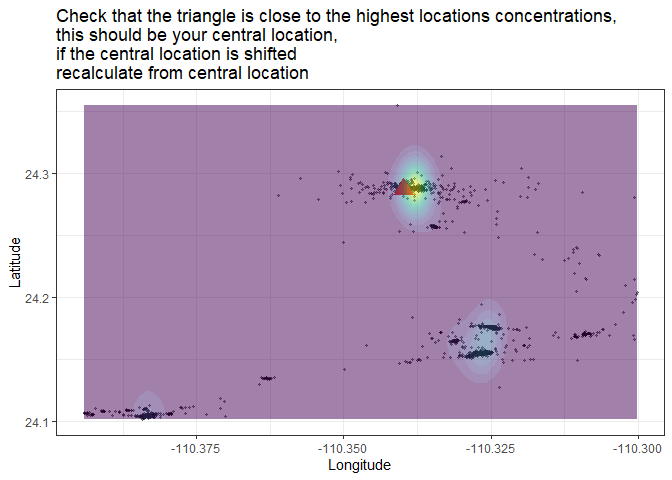
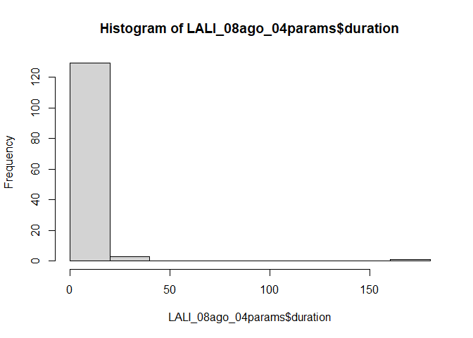
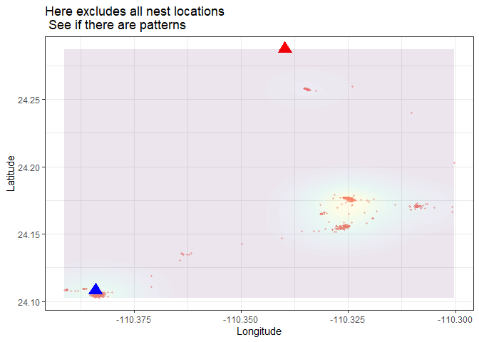
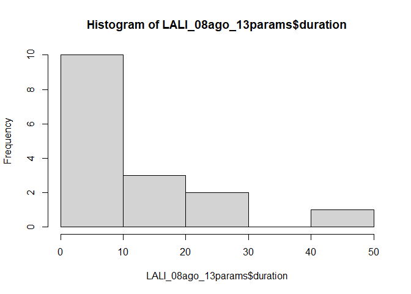
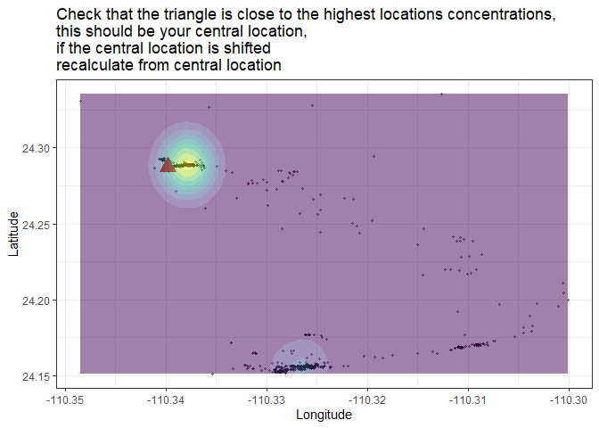
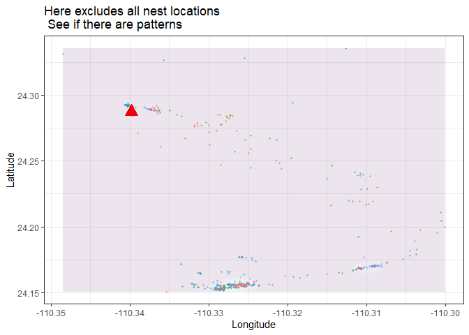
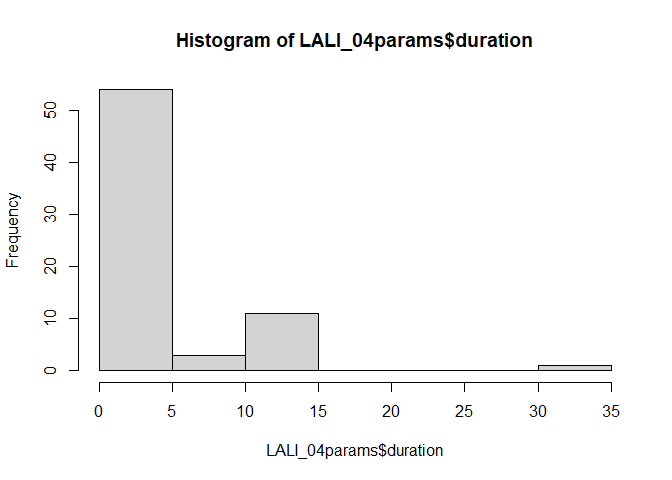

<!-- README.md is generated from README.Rmd. Please edit that file -->

# larus

<!-- badges: start -->
<!-- badges: end -->

The goal of larus is to

Provide data example

Identify trips: plot_check trip_number_sequence plot_trips add_gaps

Identify is trips are valid by: Calculating gaps between locations
Evaluate if trips are valid by checking thresholds (e.g. minimum
duration away from the colony)

Recalculate foraging parameters if the bird relocate with: create_buffer
from_df_to_sf over add_trip_number

lenght paths requeire at least 3 locations per forafging trip exclude
trips where the bird was constantly moving from central location

recalculate foraging trips changing central locations

Interpolate without: overestimating resting locations at night (make a
filter of trips \<24 hrs) add a classification trip good for calculating
foraging parameters trip good for interpolation

## Installation

You can install the development version of larus from
[GitHub](https://github.com/) with:

``` r
# install.packages("devtools")
devtools::install_github("MiriamLL/larus")
```

# \~\~\~\~\~\~\~\~\~\~\~\~\~\~\~\~~

# Intro

There is two key issues in determining the foraging trips in GSMs
attached to gulls:

1.  The effect of the battery changes
2.  The gulls just do whatever they want.

# \~\~\~\~\~\~\~\~\~\~\~\~\~\~\~\~~

## 1. The effect of the battery

``` r
load("~/03Academico/02Proyectos-Postdoc/2025/1Programming/2Packages/larus/data/LALI_example.rda")
```

``` r
LALI_01locs<-LALI03_02locs
```

When studying tracking locations from GSM data, especially in the case
of birds like gulls, it’s common to encounter gaps in the data due to
factors such as loss of signal, battery limitations, or movement through
areas with poor GSM coverage. Whether to interpolate the data depends on
your research goals and the nature of the gaps.

Here’s a breakdown of considerations to help you decide:

- Short Gaps: If the gaps are short (e.g., a few minutes to an hour),
  interpolation might be justifiable, especially if you assume that the
  bird’s movement is relatively constant during the gap. For example,
  linear interpolation can estimate a reasonable position based on
  previous and subsequent data points.
- Long Gaps: If the gaps are long (e.g., several hours or days),
  interpolation might introduce unrealistic results, especially if the
  bird’s movement during that time period was unknown. Interpolating
  long gaps could lead to misleading conclusions about the bird’s actual
  path or behavior. If your study’s analysis can handle missing data or
  gaps (e.g., for high-level migration patterns), you might consider
  leaving the gaps unfilled. This avoids the risk of introducing
  erroneous data but may reduce the overall precision. If your analysis
  is based on trajectory or movement behavior, you could use gap-filling
  approaches like predicting the bird’s behavior based on its last known
  location and surrounding environmental context (such as weather, time
  of day, etc.).

``` r
library(scales)
```

``` r
ggplot(LALI_01locs, aes(x=daytime, y=battery.charge.percent)) +
  geom_line() +
  scale_x_datetime(labels = date_format("%b"),date_breaks = "1 month")
```

# \~\~\~\~\~\~\~\~\~\~\~\~\~\~\~\~~

## 2. Identify trips

### Step 1: Subset month

``` r
library(tidyverse)
#> ── Attaching core tidyverse packages ──────────────────────── tidyverse 2.0.0 ──
#> ✔ dplyr     1.1.4     ✔ readr     2.1.5
#> ✔ forcats   1.0.0     ✔ stringr   1.5.1
#> ✔ ggplot2   3.5.1     ✔ tibble    3.2.1
#> ✔ lubridate 1.9.3     ✔ tidyr     1.3.1
#> ✔ purrr     1.0.2     
#> ── Conflicts ────────────────────────────────────────── tidyverse_conflicts() ──
#> ✖ readr::col_factor() masks scales::col_factor()
#> ✖ purrr::discard()    masks scales::discard()
#> ✖ dplyr::filter()     masks stats::filter()
#> ✖ dplyr::lag()        masks stats::lag()
#> ℹ Use the conflicted package (<http://conflicted.r-lib.org/>) to force all conflicts to become errors
```

``` r
LALI_02locs<-as.data.frame(LALI03_02locs)
```

``` r
LALI_08ago_01locs<-LALI_02locs%>%
  filter(month=="08")
```

### Step 2: Check central location

#### function: plot_check

``` r
plot_check<-function(my_locs=my_locs){
  ggplot()+
  geom_point(data = my_locs, aes(x=Longitude, y = Latitude),
             color='black',size = 0.8,alpha=0.4)+
  geom_point(data=Gaviota_Island, aes(x=Longitude, y=Latitude),color='red',shape=17, size=5)+
  geom_density_2d_filled(data = my_locs, aes(x = Longitude, y = Latitude),alpha = 0.5)+
  theme_bw()+
  theme(legend.position = 'none')+
  ggtitle('Check that the triangle is close to the highest locations concentrations, \nthis should be your central location,  \nif the central location is shifted  \nrecalculate from central location')}
```

``` r
Gaviota_Island<-data.frame(Longitude=-110.33979846296234,Latitude=24.28728834326802)
```

``` r
plot_check(my_locs=LALI_08ago_01locs)
```



### Step 3: remove central locations

``` r
LALI_08ago_02outside<-LALI_08ago_01locs %>%
  filter(inside=='outside_central')
```

### Step 4: trip_id

#### function: trip_number_sequence

``` r
continue_trip_sequence<-function(my_previous){
  print(last(my_previous))
  trip_number_sequence<-substr(last(my_previous), start = 6, stop = 10)
  trip_number_sequence<-as.numeric(trip_number_sequence)
  print(trip_number_sequence)
return(trip_number_sequence)}
```

``` r
LALI_07jul_params<-as.data.frame(trip_id<-"trip_00405")
```

``` r
trip_number_sequence<-continue_trip_sequence(my_previous=LALI_07jul_params$trip_id)
#> [1] "trip_00405"
#> [1] 405
```

``` r
LALI_08ago_03trips<-LALI_08ago_02outside %>%
  mutate(num_seq=as.numeric(num_seq))%>%
  mutate(trip_number = (cumsum(c(1L, diff(num_seq)) !=   1L)))%>%
  mutate(trip_number = trip_number +1 + trip_number_sequence)%>%
  mutate(trip_number = stringr::str_pad(trip_number,  5, pad = "0"))%>%
  mutate(trip_number = paste0("trip_", trip_number))
```

### Step 5: check trips

function: plot_trips

``` r
plot_trips<-function(my_locs=my_locs){
  ggplot()+
  geom_point(data = my_locs, aes(x=Longitude, y = Latitude,color=trip_number),
            size = 0.8,alpha=0.4)+
  geom_point(data=Gaviota_Island, aes(x=Longitude, y=Latitude),color='red',shape=17, size=5)+
  geom_density_2d_filled(data = my_locs, aes(x = Longitude, y = Latitude),alpha = 0.1)+
  theme_bw()+
  theme(legend.position = 'none')+
  ggtitle('Here excludes all nest locations \n See if there are patterns ')}
```

``` r
plot_trips(my_locs=LALI_08ago_03trips)
```


### Step 6: check parameters

``` r
library(sula)
```

``` r
LALI_08ago_04params<-sula::calcular_duracion(GPS_data=LALI_08ago_03trips, 
                        col_diahora='daytime',
                        formato =  "%Y-%m-%d %H:%M:%S",
                        unidades="hours",
                        separador="trip_number")
```

Define trip_month_id in case there are outliers and the locations need
to be subsetted

``` r
LALI_08ago_04params<-LALI_08ago_04params %>%
  mutate(trip_month_id=paste0("ago_a",trip_id))%>%
  mutate(central_loc='colony')
```

### Step 7: add gaps

#### function: add_gaps

``` r
add_gaps<-function(my_params=my_params,my_locs=my_locs){
  
  my_gaps<-my_locs %>%
  group_by(trip_number)%>%
  summarise(min_gap=min(Gaps_time),
            max_gap=max(Gaps_time))%>%
  rename(trip_id=trip_number)

    this_params<-my_params %>%
    left_join(my_gaps,by='trip_id')%>%
    select(trip_id,trip_month_id,central_loc,trip_start,trip_end,duration,min_gap,max_gap)
  
  return(this_params)
}
```

``` r
LALI_08ago_05params<-add_gaps(my_params = LALI_08ago_04params, my_locs = LALI_08ago_03trips)
head(LALI_08ago_05params)
#>      trip_id   trip_month_id central_loc          trip_start
#> 1 trip_00406 ago_atrip_00406      colony 2023-07-31 22:08:50
#> 2 trip_00407 ago_atrip_00407      colony 2023-08-01 18:08:56
#> 3 trip_00408 ago_atrip_00408      colony 2023-08-01 20:58:55
#> 4 trip_00409 ago_atrip_00409      colony 2023-08-01 21:19:04
#> 5 trip_00410 ago_atrip_00410      colony 2023-08-01 21:58:52
#> 6 trip_00411 ago_atrip_00411      colony 2023-08-01 22:18:52
#>              trip_end   duration  min_gap   max_gap
#> 1 2023-08-01 17:19:13 19.1730556 8.750000 11.200000
#> 2 2023-08-01 18:18:51  0.1652778 9.750000  9.916667
#> 3 2023-08-01 20:58:55  0.0000000 9.800000  9.800000
#> 4 2023-08-01 21:19:04  0.0000000 8.833333  8.833333
#> 5 2023-08-01 21:58:52  0.0000000 9.666667  9.666667
#> 6 2023-08-01 22:38:55  0.3341667 9.466667 10.083333
```

# \~\~\~\~\~\~\~\~\~\~\~\~\~\~\~\~~

## 3. Gulls just do whatever they want

### Step 8: check outliers

``` r
range(LALI_08ago_04params$duration)
#> [1]   0.0000 168.7497
```

``` r
hist(LALI_08ago_04params$duration)
```



Check if the big outliers are because of gaps in the intervals. In this
case, the gap is not so large (9 to 20 minutes). It is likely that the
bird just change central location!

``` r
LALI_08ago_05params %>%
  filter(duration > 24)
#>      trip_id   trip_month_id central_loc          trip_start
#> 1 trip_00445 ago_atrip_00445      colony 2023-08-03 10:58:50
#> 2 trip_00506 ago_atrip_00506      colony 2023-08-10 03:28:53
#> 3 trip_00512 ago_atrip_00512      colony 2023-08-12 03:28:53
#> 4 trip_00518 ago_atrip_00518      colony 2023-08-22 04:28:59
#>              trip_end  duration   min_gap  max_gap
#> 1 2023-08-04 16:58:55  30.00139  9.133333 20.78333
#> 2 2023-08-11 13:29:55  34.01722 13.950000 30.50000
#> 3 2023-08-19 04:13:52 168.74972  9.283333 20.23333
#> 4 2023-08-23 16:59:35  36.51000 28.900000 31.40000
```

#### identify outlier trips

Sometimes the gulls are free of responsibilities and decide to leave for
very long periods.

Identify ids

``` r
LALI_08ago_tripid<-unique(LALI_08ago_05params %>%
  filter(duration > 40))$trip_id
LALI_08ago_tripid
#> [1] "trip_00512"
```

Subset locations

``` r
LALI_08ago_06outlierlocs<-LALI_08ago_03trips %>%
  filter(trip_number %in% LALI_08ago_tripid)%>%
  relocate(ID,daytime,dt,Gaps_time)
head(LALI_08ago_06outlierlocs)
#>       ID             daytime                      dt Gaps_time        season
#> 1 LALI03 2023-08-12 03:28:53 2023-08-12 05:28:53 MST  15.00000 late-breeding
#> 2 LALI03 2023-08-12 03:43:52 2023-08-12 05:43:52 MST  14.98333 late-breeding
#> 3 LALI03 2023-08-12 03:58:51 2023-08-12 05:58:51 MST  14.98333 late-breeding
#> 4 LALI03 2023-08-12 04:13:56 2023-08-12 06:13:56 MST  15.08333 late-breeding
#> 5 LALI03 2023-08-12 04:28:52 2023-08-12 06:28:52 MST  14.93333 late-breeding
#> 6 LALI03 2023-08-12 04:43:53 2023-08-12 06:43:53 MST  15.01667 late-breeding
#>   month Longitude Latitude countday Hour Day_or_night   central_base
#> 1    08 -110.3241 24.25933      117   05          day outside_colony
#> 2    08 -110.3103 24.23990      117   05          day outside_colony
#> 3    08 -110.3003 24.20298      117   05          day outside_colony
#> 4    08 -110.3255 24.15551      117   06          day outside_colony
#> 5    08 -110.3258 24.15553      117   06          day outside_colony
#> 6    08 -110.3255 24.15554      117   06          day outside_colony
#>            inside num_seq   ID.y      Location_gaps     Battery
#> 1 outside_central   17141 LALI03 3Average (<30mins) 3Poor (>25)
#> 2 outside_central   17142 LALI03    2Good (<15mins) 3Poor (>25)
#> 3 outside_central   17143 LALI03    2Good (<15mins) 3Poor (>25)
#> 4 outside_central   17144 LALI03 3Average (<30mins) 3Poor (>25)
#> 5 outside_central   17145 LALI03    2Good (<15mins) 3Poor (>25)
#> 6 outside_central   17146 LALI03 3Average (<30mins) 3Poor (>25)
#>   battery.charge.percent trip_number
#> 1                     47  trip_00512
#> 2                     47  trip_00512
#> 3                     48  trip_00512
#> 4                     48  trip_00512
#> 5                     48  trip_00512
#> 6                     48  trip_00512
```

Sometimes its possible to identify a new central location

``` r
central_location<-data.frame(Longitude=-110.384,Latitude=24.108)
```

``` r
plot_trips(LALI_08ago_06outlierlocs)+
  geom_point(data=central_location, aes(x=Longitude, y=Latitude),color='blue',shape=17, size=5)
```



### Step 9: Create buffer

#### function: create_buffer

``` r
create_buffer<-function(central_point=central_point, buffer_km=buffer_km){
  central_spatial<- sp::SpatialPoints(cbind(central_point$Longitude,central_point$Latitude)) 
  sp::proj4string(central_spatial)= sp::CRS("+init=epsg:4326") 
  central_spatial <- sp::spTransform(central_spatial, sp::CRS("+init=epsg:4326"))
  central_spatial<-sf::st_as_sf(central_spatial)
  buffer_dist<-buffer_km*1000
  central_buffer<-sf::st_buffer(central_spatial, buffer_dist)
  return(central_buffer)
  }
```

``` r
central_buffer<-create_buffer(central_point=central_location,buffer_km=0.3)
#> Warning in CPL_crs_from_input(x): GDAL Message 1: +init=epsg:XXXX syntax is
#> deprecated. It might return a CRS with a non-EPSG compliant axis order.
```

### Step 10: From df to sf

#### function: from_df_to_sf

``` r
from_df_to_st<-function(my_df){
  my_points <- my_df
  sp::coordinates(my_points) <- ~Longitude + Latitude
  sp::proj4string(my_points) = sp::CRS("+init=epsg:4326")
  my_sf<-sf::st_as_sf(my_points)
  return(my_sf)
}
```

``` r
LALI_08ago_09points<-from_df_to_st(LALI_08ago_06outlierlocs)
```

### Step 11: Over

``` r
over<-function(this_location=this_location,this_buffer=this_buffer){
  locations<-sf::st_as_sf(this_location)
  location_over<-sapply(sf::st_intersects(locations,this_buffer), 
                        function(z) if (length(z)==0) NA_integer_ else z[1])
  return(location_over)}
```

``` r
LALI_08ago_10over<- over(LALI_08ago_09points,central_buffer)
```

### Step 12: Add_trip_number

``` r
add_trip_number<-function(my_over,my_df,my_previous){
  
  my_df$central_location <- my_over 
  
  my_df<-my_df %>%
    mutate(inside=case_when(central_location == 1 ~ 'inside_central',TRUE ~ 'outside_central'))
  
  my_df %>%
    group_by(ID,inside)%>%
    count()%>%
    pivot_wider(names_from = inside, values_from = n)
  
  my_outside<-my_df %>%
    filter(inside=='outside_central')
  
  last(my_previous$trip_id)
  
  trip_number_sequence<-substr(last(my_previous$trip_id), start = 6, stop = 10)
  trip_number_sequence<-as.numeric(trip_number_sequence)
  trip_number_sequence

  my_trips<-my_outside %>%
    mutate(num_seq=as.numeric(num_seq))%>%
    mutate(trip_number = (cumsum(c(1L, diff(num_seq)) !=   1L)))%>%
    mutate(trip_number = trip_number + 1 + trip_number_sequence)%>%
    mutate(trip_number = stringr::str_pad(trip_number,  5, pad = "0"))%>%
    mutate(trip_number = paste0("trip_", trip_number))
  
  return(my_trips)
}
```

``` r
LALI_08ago_11trips<-add_trip_number(my_df=LALI_08ago_06outlierlocs,
                                     my_over=LALI_08ago_10over,
                                     my_previous=LALI_08ago_05params)
```

### Step 13: check parameters

### params

``` r
LALI_08ago_12params<-sula::calcular_duracion(GPS_data=LALI_08ago_11trips, 
                        col_diahora='daytime',
                        formato =  "%Y-%m-%d %H:%M:%S",
                        unidades="hours",
                        separador="trip_number")
```

``` r
LALI_08ago_12params<-LALI_08ago_12params %>%
  mutate(trip_month_id=paste0("ago_b_",trip_id))%>%
  mutate(central_loc='south_of_colony')
```

### add gaps

``` r
LALI_08ago_13params<-add_gaps(my_params = LALI_08ago_12params, my_locs = LALI_08ago_11trips)
LALI_08ago_13params
#>       trip_id    trip_month_id     central_loc          trip_start
#> 1  trip_00539 ago_b_trip_00539 south_of_colony 2023-08-12 03:28:53
#> 2  trip_00540 ago_b_trip_00540 south_of_colony 2023-08-13 21:58:52
#> 3  trip_00541 ago_b_trip_00541 south_of_colony 2023-08-14 00:43:55
#> 4  trip_00542 ago_b_trip_00542 south_of_colony 2023-08-14 03:29:02
#> 5  trip_00543 ago_b_trip_00543 south_of_colony 2023-08-14 21:28:53
#> 6  trip_00544 ago_b_trip_00544 south_of_colony 2023-08-14 22:58:56
#> 7  trip_00545 ago_b_trip_00545 south_of_colony 2023-08-15 00:14:01
#> 8  trip_00546 ago_b_trip_00546 south_of_colony 2023-08-15 22:28:53
#> 9  trip_00547 ago_b_trip_00547 south_of_colony 2023-08-16 00:43:58
#> 10 trip_00548 ago_b_trip_00548 south_of_colony 2023-08-16 01:28:53
#> 11 trip_00549 ago_b_trip_00549 south_of_colony 2023-08-16 03:28:54
#> 12 trip_00550 ago_b_trip_00550 south_of_colony 2023-08-16 20:14:01
#> 13 trip_00551 ago_b_trip_00551 south_of_colony 2023-08-16 23:44:00
#> 14 trip_00552 ago_b_trip_00552 south_of_colony 2023-08-17 00:13:52
#> 15 trip_00553 ago_b_trip_00553 south_of_colony 2023-08-17 02:43:52
#> 16 trip_00554 ago_b_trip_00554 south_of_colony 2023-08-18 03:59:52
#>               trip_end   duration   min_gap  max_gap
#> 1  2023-08-13 20:38:55 41.1672222  9.283333 20.23333
#> 2  2023-08-13 22:28:51  0.4997222  9.633333 10.00000
#> 3  2023-08-14 01:13:51  0.4988889 14.350000 15.45000
#> 4  2023-08-14 20:28:53 16.9975000 14.350000 15.61667
#> 5  2023-08-14 21:58:58  0.5013889 14.983333 15.05000
#> 6  2023-08-14 22:58:56  0.0000000 15.033333 15.03333
#> 7  2023-08-15 20:44:01 20.5000000 14.383333 15.71667
#> 8  2023-08-15 22:28:53  0.0000000 14.700000 14.70000
#> 9  2023-08-16 00:43:58  0.0000000 14.966667 14.96667
#> 10 2023-08-16 01:28:53  0.0000000 15.000000 15.00000
#> 11 2023-08-16 19:13:53 15.7497222 14.150000 15.83333
#> 12 2023-08-16 22:59:00  2.7497222 14.850000 15.13333
#> 13 2023-08-16 23:44:00  0.0000000 15.033333 15.03333
#> 14 2023-08-17 01:43:52  1.5000000 14.416667 15.51667
#> 15 2023-08-17 21:59:14 19.2561111 13.683333 16.28333
#> 16 2023-08-19 04:13:52 24.2333333 14.016667 15.96667
```

``` r
range(LALI_08ago_13params$duration)
#> [1]  0.00000 41.16722
```

``` r
hist(LALI_08ago_13params$duration)
```



``` r
plot_trips(my_locs=LALI_08ago_11trips)+
  geom_point(data=central_location, aes(x=Longitude, y=Latitude),color='blue',shape=17, size=5)
```


# merge and check

## params

``` r
LALI_08ago_06tripid<-unique(LALI_08ago_05params %>%
  filter(duration > 24))$trip_id
```

``` r
LALI_08ago_params<-rbind(LALI_08ago_05params %>% filter(!trip_id %in% LALI_08ago_06tripid),
                         LALI_08ago_13params)
```

## locs

``` r
LALI_08ago_locs<-rbind(LALI_08ago_03trips %>% 
                         filter(!trip_number %in% LALI_08ago_06tripid)%>%
                         select(ID,daytime,season,month,
                           Longitude,Latitude,countday,
                           Hour,Day_or_night,central_base,inside,num_seq,
                           ID.y,dt,Location_gaps,Battery,Gaps_time,battery.charge.percent,
                           trip_number),
                         
                         LALI_08ago_11trips %>%
                            select(ID,daytime,season,month,
                           Longitude,Latitude,countday,
                           Hour,Day_or_night,central_base,inside,num_seq,
                           ID.y,dt,Location_gaps,Battery,Gaps_time,battery.charge.percent,
                           trip_number))
```

``` r
length(unique(LALI_08ago_locs$trip_number))
#> [1] 145
length(unique(LALI_08ago_params$trip_id))
#> [1] 145
```

# \~\~\~\~\~\~\~\~\~\~\~\~\~\~\~\~\~\~\~\~~

# Straight forward

``` r
LALI_01locs<-LALI_02locs%>%
  filter(month=="09")
```

``` r
plot_check(my_locs=LALI_01locs)
```



## trip_id

``` r
LALI_02outside<-LALI_01locs %>%
  filter(inside=='outside_central')
```

``` r
trip_number_sequence<-continue_trip_sequence(my_previous=LALI_07jul_params$trip_id)
#> [1] "trip_00405"
#> [1] 405
```

``` r
LALI_03trips<-LALI_02outside %>%
  mutate(num_seq=as.numeric(num_seq))%>%
  mutate(trip_number = (cumsum(c(1L, diff(num_seq)) !=   1L)))%>%
  mutate(trip_number = trip_number +1 + trip_number_sequence)%>%
  mutate(trip_number = stringr::str_pad(trip_number,  5, pad = "0"))%>%
  mutate(trip_number = paste0("trip_", trip_number))
```

``` r
plot_trips(my_locs=LALI_03trips)
```



## params

``` r
LALI_04params<-sula::calcular_duracion(GPS_data=LALI_03trips, 
                        col_diahora='daytime',
                        formato =  "%Y-%m-%d %H:%M:%S",
                        unidades="hours",
                        separador="trip_number")
```

``` r
range(LALI_04params$duration)
#> [1]  0.00000 34.45083
```

``` r
hist(LALI_04params$duration)
```



``` r
LALI_04params<-LALI_04params %>%
  mutate(trip_month_id=paste0("ago_a",trip_id))%>%
  mutate(central_loc='colony')
```

## gaps

``` r
LALI_05params<-add_gaps(my_params = LALI_04params, my_locs = LALI_03trips)
head(LALI_05params)
#>      trip_id   trip_month_id central_loc          trip_start
#> 1 trip_00406 ago_atrip_00406      colony 2023-09-01 07:38:59
#> 2 trip_00407 ago_atrip_00407      colony 2023-09-01 09:38:53
#> 3 trip_00408 ago_atrip_00408      colony 2023-09-01 15:25:46
#> 4 trip_00409 ago_atrip_00409      colony 2023-09-02 06:05:44
#> 5 trip_00410 ago_atrip_00410      colony 2023-09-02 18:59:08
#> 6 trip_00411 ago_atrip_00411      colony 2023-09-03 03:52:44
#>              trip_end   duration  min_gap  max_gap
#> 1 2023-09-01 07:38:59  0.0000000 39.50000 39.50000
#> 2 2023-09-01 14:19:23  4.6750000 39.76667 40.35000
#> 3 2023-09-01 15:25:46  0.0000000 26.75000 26.75000
#> 4 2023-09-02 16:18:58 10.2205556 25.76667 27.56667
#> 5 2023-09-02 18:59:08  0.0000000 26.93333 26.93333
#> 6 2023-09-03 04:18:53  0.4358333 26.15000 27.00000
```

## checks

``` r
LALI_locs<-LALI_03trips
LALI_params<-  LALI_05params
```

``` r
length(unique(LALI_params$trip_id))
#> [1] 69
length(unique(LALI_locs$trip_number))
#> [1] 69
```

# \~\~\~\~\~\~\~\~\~\~\~\~\~\~\~\~\~\~\~\~\~\~\~~

# Classify

## Params

``` r
Params<-LALI_params
```

``` r
Params_01class<-Params %>%
  
  mutate(params_analyses=case_when(duration >= 24 ~ 'exclude_from_analyses',
                                     duration <= 24 ~ 'include_in_analyses',
                                TRUE ~ "other"))%>%
  
  mutate(resolution=case_when(max_gap >= 60 ~ 'low_resolution_gaps_more_60_mins',
                                max_gap <= 60 ~ 'ok_resolution_gaps_less_60_mins',
                                TRUE ~ "other"))%>%
  
  mutate(interpolation = case_when(duration >= 24 & max_gap >= 60 ~ 'dont_interpolate',
                                   duration >= 24 ~ 'dont_interpolate',
                                   max_gap >= 60 ~ 'dont_interpolate',
                                   duration <= 24 & max_gap <= 60 ~ 'interpolate',
                                   TRUE ~ "other"))%>%
  
  mutate(trip_size = case_when(duration >= 0.5 ~ 'trip_longer_than_30mins',
                               duration <= 0.5 ~ 'trip_shorter_than_30mins',
                               TRUE ~ "other"))
  
```

## check criteria

Foraging trips were only considered when the animal was more than 1 km
away from the colony and lasting longer than 30 min (Shaffer et
al. 2017, Guerra et al. 2022).

``` r
Params_01class %>%
   group_by(trip_size)%>%
   tally()
#> # A tibble: 2 × 2
#>   trip_size                    n
#>   <chr>                    <int>
#> 1 trip_longer_than_30mins     24
#> 2 trip_shorter_than_30mins    45
```

Candidates for interpolation

If trips had a gap of \> 1hr and/or included overnight locations without
a clear central location, they were excluded from the interpolation.

``` r
Params_01class %>%
  group_by(interpolation)%>%
  tally()
#> # A tibble: 2 × 2
#>   interpolation        n
#>   <chr>            <int>
#> 1 dont_interpolate     1
#> 2 interpolate         68
```

### Keep candidates

``` r
Params_02class<-Params_01class %>%
  filter(trip_size=='trip_longer_than_30mins')
```

## Locs

### identify trips ids

``` r
Locs_01analysesid<-unique(Params_02class %>%
  filter(params_analyses == "include_in_analyses"))$trip_id

Locs_02resolutionid<-unique(Params_02class %>%
  filter(resolution == "ok_resolution_gaps_less_60_mins"))$trip_id

Locs_03interpolateid<-unique(Params_02class %>%
  filter(interpolation == 'interpolate'))$trip_id

Locs_04sizeid<-unique(Params_02class %>%
 filter(trip_size == 'trip_longer_than_30mins'))$trip_id
```

``` r
Locs_01class<-LALI_08ago_locs %>%
  mutate(params_analyses=case_when(trip_number %in% Locs_01analysesid~ "include_in_analyses",
                          TRUE ~ "exclude_from_analyses"))%>%
  
  mutate(resolution=case_when(trip_number %in% Locs_02resolutionid~ "ok_resolution_gaps_less_60_mins",
                          TRUE ~ "low_resolution_gaps_more_60_mins"))%>%
  
  mutate(interpolation=case_when(trip_number %in% Locs_03interpolateid ~ 'interpolate',
                          TRUE ~ "dont_interpolate"))%>%
  
  mutate(trip_size = case_when(trip_number %in% Locs_03interpolateid ~  'trip_longer_than_30mins',
                                 TRUE ~  'trip_shorter_than_30mins'))
```

# \~\~\~\~\~\~\~\~\~\~\~\~\~\~\~\~\~\~\~\~~

# Test data

## gull_data

Contains data from one gull tagged at La Paz, Mexico

``` r
library(larus)
```

``` r
gull_data<-gull_data
```
